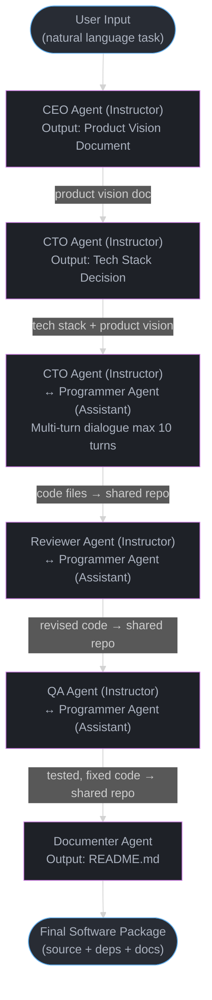
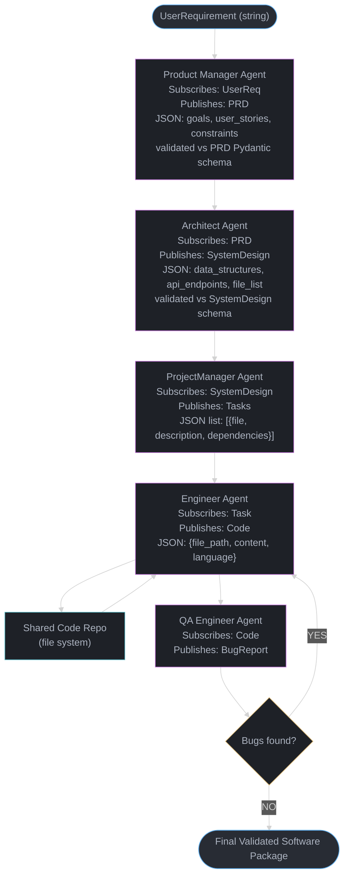

# ChatDev and Software Simulation Agents — Deep Dive

---

## 1. Concept Overview

Software simulation agents model an entire software organization as a multi-agent system where each agent plays a named role — CEO, CTO, programmer, code reviewer, QA engineer, documentation writer — and the agents interact through structured conversation to produce working software artifacts.

ChatDev (ICSE 2024, Qian et al.) pioneered this paradigm by simulating a "virtual software company." A single natural-language task description enters the system; a sequence of role-playing agents collaboratively produces source code files, dependency manifests, and documentation. The coordination mechanism is the "chat chain": each phase of software development is a turn in a structured multi-party conversation, and the output of one phase becomes the structured input of the next.

MetaGPT (arXiv 2308.00352, Hong et al.) extended this by replacing free-form chat with Standard Operating Procedures (SOPs). Every agent is bound to produce a specific document type — a Product Requirements Document (PRD), a UML class diagram, an API specification, a test plan — before handing off to the next agent. This document-centric approach dramatically reduces hallucination drift that accumulates across long chat chains.

Both systems share a common insight: software engineering is not a single-agent code-generation problem. It is a coordination problem across distinct cognitive tasks (requirements, design, implementation, verification, documentation), and multi-agent role-play forces decomposition of that coordination.

---

## 2. Intuition

Mental model: imagine hiring a freelance software team over Slack, where every team member only reads the messages addressed to them and only writes in a specific format. The CEO writes only requirement summaries. The architect writes only design documents. The programmer writes only code files. The QA engineer writes only test cases and bug reports. Nobody writes outside their lane.

This constraint — role-specific output format — is the key insight. When an LLM must produce a structured artifact (a JSON schema, a UML diagram, a test file), it cannot hide vagueness in verbose prose. The structure forces specificity, and specificity reduces hallucination.

One-line analogy: a pipeline of specialized factories where each factory's output is the next factory's raw material, and quality gates sit between factories.

Why it matters: the alternative (single-agent "write me an app") produces plausible-looking code that fails silently. The simulation approach produces checkpointable, auditable intermediate artifacts that can be validated independently before flowing downstream.

Key insight: the shared code repository — a directory of text files visible to all agents — acts as external memory. Agents do not need to hold the entire codebase in context; they read the relevant file, produce a delta, and write it back. This keeps per-agent context windows manageable and provides a single source of truth.

---

## 3. Core Principles

**Role specialization.** Each agent carries a system prompt that defines its job title, responsibilities, output format, and what it is NOT allowed to do. A programmer agent does not write PRDs. A CEO agent does not write code. This prevents role collapse, where a capable model tries to do everything and ends up doing nothing well.

**Structured handoffs.** Agents do not pass free-form conversation. They pass documents: a PRD is a structured object with sections (problem, goals, user stories, constraints). A code file is a file with a path, content, and language tag. These documents are validated against a schema before the next agent reads them.

**Sequential phase gating.** The pipeline enforces ordering: requirements before design, design before implementation, implementation before testing. No agent can skip phases. This mirrors real software development process discipline.

**Shared external memory.** All agents read from and write to a shared "code repository" — a directory of files. This decouples agent context windows from total codebase size. An agent working on `user_service.py` does not need `database_layer.py` in its prompt unless explicitly fetched.

**Iterative repair loops.** When a downstream agent (QA, reviewer) finds a defect, it produces a structured bug report that routes back to the appropriate upstream agent. The repair is bounded: the system tracks iteration count and terminates rather than looping indefinitely.

**Token budget awareness.** Production deployments track cumulative token spend per pipeline run and enforce hard limits. A simple CRUD app typically costs 50,000–200,000 tokens across the full pipeline. Complex feature requests with multiple rounds of QA feedback can exceed 500,000 tokens.

---

## 4. Types / Architectures / Strategies

### 4.1 ChatDev Chat-Chain Architecture

The chat chain is a sequence of two-agent dialogues. Each dialogue is a "phase" in the software development lifecycle. The participants are always one "instructor" agent and one "assistant" agent. The instructor sets the task; the assistant produces the artifact; the instructor validates and either accepts or requests revision.

Phases in the default ChatDev chain:
1. Demand Analysis — CEO (instructor) + CTO (assistant): produces a product vision document
2. Language Selection — CTO (instructor) + CTO (assistant, wearing programmer hat): chooses implementation language and stack
3. Coding — CTO (instructor) + Programmer (assistant): produces source files
4. Code Review — Reviewer (instructor) + Programmer (assistant): produces revised source files
5. Testing — QA Engineer (instructor) + Programmer (assistant): produces bug list and fixes
6. Environment Setup — CTO (instructor) + Programmer (assistant): produces dependency manifest
7. Manual Writing — CEO (instructor) + Documenter (assistant): produces README

Each phase runs until the instructor agent emits a special termination token (`<CHATDEV_COMM_SIG>`) or a maximum turn count is reached (default 10 turns per phase).

### 4.2 MetaGPT SOP Architecture

MetaGPT replaces dialogue with document production. Each agent subscribes to a message type and publishes a different message type. This is a pub-sub model over a message bus.

Roles and their document contracts:
- Product Manager: receives UserRequirement, publishes PRD (JSON with goals, user stories, competitive analysis)
- Architect: receives PRD, publishes SystemDesign (JSON with data structures, API endpoints, file structure)
- ProjectManager: receives SystemDesign, publishes Tasks (JSON list of coding tasks with file assignments)
- Engineer: receives Tasks (one task at a time), publishes Code (file path + content)
- QA Engineer: receives Code, publishes BugReport (JSON with file, line, description, severity)

Each published document is validated against a Pydantic schema before being placed on the message bus. A downstream agent that receives a malformed document raises a validation error rather than proceeding with corrupt data.

### 4.3 Hybrid Strategies

Some production systems combine both approaches: free-form chat within a phase (ChatDev style) for exploration, but structured document output at phase boundaries (MetaGPT style) for handoff integrity. This balances flexibility with correctness.

### 4.4 Autonomous Code Repair Loop

Both frameworks support a repair loop:
- QA agent produces structured bug report
- Router agent identifies which source file and which agent produced it
- Programmer agent receives the file + bug report and produces a patched file
- QA agent re-runs tests on the patched file
- Loop continues until all bugs resolved or max iterations (typically 3–5) reached

---

## 5. Architecture Diagrams

### ChatDev Chat-Chain Pipeline



### MetaGPT SOP Document Flow



### Shared Code Repository as Common Ground Truth

```
All Agents
    |
    |  read/write
    v
+----------------------------------+
|  Shared Code Repository          |
|  (in-memory or disk file system) |
|                                  |
|  /src/main.py                    |
|  /src/models.py                  |
|  /src/api.py                     |
|  /tests/test_api.py              |
|  /requirements.txt               |
|  /README.md                      |
+----------------------------------+
```

---

## 6. How It Works — Detailed Mechanics

### 6.1 ChatDev Phase Runner

```python
from __future__ import annotations

import re
from dataclasses import dataclass, field
from typing import Any

from openai import OpenAI

TERMINATION_TOKEN = "<CHATDEV_COMM_SIG>"
MAX_TURNS_PER_PHASE = 10


@dataclass
class Agent:
    name: str
    role: str
    system_prompt: str
    client: OpenAI
    model: str = "gpt-4o"

    def chat(self, messages: list[dict[str, str]]) -> str:
        full_messages = [{"role": "system", "content": self.system_prompt}] + messages
        response = self.client.chat.completions.create(
            model=self.model,
            messages=full_messages,
            temperature=0.2,
        )
        return response.choices[0].message.content or ""


@dataclass
class Phase:
    name: str
    instructor: Agent
    assistant: Agent
    initial_prompt_template: str

    def run(self, context: dict[str, str]) -> str:
        """
        Run a two-agent dialogue until termination token or max turns.
        Returns the final assistant output as the phase artifact.
        """
        initial_message = self.initial_prompt_template.format(**context)
        history: list[dict[str, str]] = [
            {"role": "user", "content": initial_message}
        ]

        last_assistant_output = ""

        for turn in range(MAX_TURNS_PER_PHASE):
            # Assistant responds
            assistant_output = self.assistant.chat(history)
            last_assistant_output = assistant_output
            history.append({"role": "assistant", "content": assistant_output})

            if TERMINATION_TOKEN in assistant_output:
                break

            # Instructor evaluates and continues or terminates
            instructor_output = self.instructor.chat(
                history + [
                    {
                        "role": "user",
                        "content": (
                            "Review the above output. If it is complete and correct, "
                            f"reply with '{TERMINATION_TOKEN}'. "
                            "Otherwise, provide specific feedback for improvement."
                        ),
                    }
                ]
            )
            history.append({"role": "user", "content": instructor_output})

            if TERMINATION_TOKEN in instructor_output:
                break

        return last_assistant_output


@dataclass
class CodeRepository:
    files: dict[str, str] = field(default_factory=dict)

    def write(self, path: str, content: str) -> None:
        self.files[path] = content

    def read(self, path: str) -> str:
        return self.files.get(path, "")

    def list_files(self) -> list[str]:
        return list(self.files.keys())

    def snapshot(self) -> str:
        """Return a text snapshot of all files for agent context injection."""
        parts = []
        for path, content in self.files.items():
            parts.append(f"=== {path} ===\n{content}\n")
        return "\n".join(parts)


@dataclass
class ChatDevPipeline:
    client: OpenAI
    repo: CodeRepository = field(default_factory=CodeRepository)
    token_usage: int = 0

    def build(self, task: str) -> CodeRepository:
        ceo = Agent(
            name="CEO",
            role="instructor",
            system_prompt=(
                "You are the CEO of a software startup. Your job is to define product "
                "requirements clearly and concisely. You do not write code. You write "
                "requirements documents. When you are satisfied with the output, include "
                f"'{TERMINATION_TOKEN}' in your response."
            ),
            client=self.client,
        )

        cto = Agent(
            name="CTO",
            role="instructor",
            system_prompt=(
                "You are the CTO. You make technical architecture decisions. "
                "You choose programming languages, frameworks, and file structure. "
                "You do not write application code. When satisfied, include "
                f"'{TERMINATION_TOKEN}'."
            ),
            client=self.client,
        )

        programmer = Agent(
            name="Programmer",
            role="assistant",
            system_prompt=(
                "You are a senior software engineer. You write clean, working Python code. "
                "When producing source files, format each file as:\n"
                "FILE: <path>\n```python\n<content>\n```\n"
                "You fix bugs when given bug reports. You follow the architecture spec exactly."
            ),
            client=self.client,
        )

        qa = Agent(
            name="QA",
            role="instructor",
            system_prompt=(
                "You are a QA engineer. You review code for bugs, missing error handling, "
                "and missing edge cases. Produce a structured bug report for each issue: "
                "FILE: <path> | LINE: <n> | ISSUE: <description>. "
                f"If no bugs found, reply with '{TERMINATION_TOKEN}'."
            ),
            client=self.client,
        )

        # Phase 1: Requirements
        requirements_phase = Phase(
            name="Requirements",
            instructor=ceo,
            assistant=cto,
            initial_prompt_template="The product task is: {task}\nWrite a product requirements document.",
        )
        prd = requirements_phase.run({"task": task})
        self.repo.write("docs/PRD.md", prd)

        # Phase 2: Coding
        coding_phase = Phase(
            name="Coding",
            instructor=cto,
            assistant=programmer,
            initial_prompt_template=(
                "Based on this PRD:\n{prd}\n\n"
                "Implement the complete application. "
                "Produce all source files using the FILE: <path> format."
            ),
        )
        code_output = coding_phase.run({"prd": prd})
        self._parse_and_store_files(code_output)

        # Phase 3: QA
        qa_phase = Phase(
            name="QA",
            instructor=qa,
            assistant=programmer,
            initial_prompt_template=(
                "Review and fix the following codebase:\n{snapshot}\n\n"
                "Identify all bugs and fix them. Output corrected files."
            ),
        )
        fixed_output = qa_phase.run({"snapshot": self.repo.snapshot()})
        self._parse_and_store_files(fixed_output)

        return self.repo

    def _parse_and_store_files(self, output: str) -> None:
        """Extract FILE: <path> ... ``` blocks and write to repo."""
        pattern = r"FILE:\s*(\S+)\s*```(?:python|py)?\n(.*?)```"
        matches = re.findall(pattern, output, re.DOTALL)
        for path, content in matches:
            self.repo.write(path.strip(), content.strip())
```

### 6.2 MetaGPT SOP with Pydantic Schema Validation

```python
from __future__ import annotations

import json
from typing import Any

from pydantic import BaseModel, ValidationError
from openai import OpenAI


# --- Document schemas (SOP contracts) ---

class UserStory(BaseModel):
    title: str
    as_a: str
    i_want: str
    so_that: str


class PRD(BaseModel):
    product_name: str
    goals: list[str]
    user_stories: list[UserStory]
    constraints: list[str]
    out_of_scope: list[str]


class APIEndpoint(BaseModel):
    method: str  # GET, POST, PUT, DELETE
    path: str
    request_body: dict[str, Any]
    response_body: dict[str, Any]
    description: str


class SystemDesign(BaseModel):
    language: str
    framework: str
    data_models: dict[str, dict[str, str]]   # model_name -> {field: type}
    api_endpoints: list[APIEndpoint]
    file_structure: list[str]


class CodingTask(BaseModel):
    file_path: str
    description: str
    dependencies: list[str]  # other files this task depends on


class Tasks(BaseModel):
    tasks: list[CodingTask]


class CodeFile(BaseModel):
    file_path: str
    content: str
    language: str


class BugReport(BaseModel):
    file_path: str
    line_number: int | None
    severity: str  # critical, major, minor
    description: str
    suggested_fix: str


class BugReportList(BaseModel):
    bugs: list[BugReport]
    all_clear: bool  # True if no bugs found


# --- SOP Agent base class ---

class SOPAgent:
    def __init__(self, role: str, system_prompt: str, client: OpenAI, model: str = "gpt-4o"):
        self.role = role
        self.system_prompt = system_prompt
        self.client = client
        self.model = model

    def _call(self, user_message: str) -> str:
        response = self.client.chat.completions.create(
            model=self.model,
            messages=[
                {"role": "system", "content": self.system_prompt},
                {"role": "user", "content": user_message},
            ],
            temperature=0.1,
            response_format={"type": "json_object"},
        )
        return response.choices[0].message.content or "{}"

    def produce(self, input_doc: Any, output_schema: type[BaseModel]) -> BaseModel:
        """
        Call the LLM and validate output against the schema.
        Retries once with explicit schema reminder on validation failure.
        """
        input_text = (
            input_doc.model_dump_json(indent=2)
            if isinstance(input_doc, BaseModel)
            else str(input_doc)
        )
        schema_text = json.dumps(output_schema.model_json_schema(), indent=2)

        prompt = (
            f"Input document:\n{input_text}\n\n"
            f"Produce a JSON object that strictly conforms to this schema:\n{schema_text}"
        )

        raw = self._call(prompt)

        try:
            return output_schema.model_validate_json(raw)
        except ValidationError as first_err:
            # Retry with explicit error feedback
            retry_prompt = (
                f"{prompt}\n\n"
                f"Your previous output failed validation with these errors:\n{first_err}\n"
                "Fix all errors and return only the corrected JSON."
            )
            raw2 = self._call(retry_prompt)
            # Let second ValidationError propagate — do not silently pass corrupt data
            return output_schema.model_validate_json(raw2)


# --- Concrete role agents ---

class ProductManagerAgent(SOPAgent):
    def __init__(self, client: OpenAI):
        super().__init__(
            role="ProductManager",
            system_prompt=(
                "You are a product manager. Given a user requirement, produce a detailed "
                "Product Requirements Document (PRD) as a JSON object. "
                "Be specific about user stories and constraints. "
                "Do not include implementation details."
            ),
            client=client,
        )

    def run(self, requirement: str) -> PRD:
        return self.produce(requirement, PRD)  # type: ignore[return-value]


class ArchitectAgent(SOPAgent):
    def __init__(self, client: OpenAI):
        super().__init__(
            role="Architect",
            system_prompt=(
                "You are a software architect. Given a PRD, produce a SystemDesign JSON "
                "specifying language, framework, data models, API endpoints, and file structure. "
                "Do not write code. Choose pragmatic, well-known technologies."
            ),
            client=client,
        )

    def run(self, prd: PRD) -> SystemDesign:
        return self.produce(prd, SystemDesign)  # type: ignore[return-value]


class ProjectManagerAgent(SOPAgent):
    def __init__(self, client: OpenAI):
        super().__init__(
            role="ProjectManager",
            system_prompt=(
                "You are a project manager. Given a SystemDesign, break the work into "
                "individual coding tasks, one per file. Each task must specify the file path, "
                "a description of what to implement, and which other files it depends on. "
                "Order tasks so dependencies come first."
            ),
            client=client,
        )

    def run(self, design: SystemDesign) -> Tasks:
        return self.produce(design, Tasks)  # type: ignore[return-value]


class EngineerAgent(SOPAgent):
    def __init__(self, client: OpenAI):
        super().__init__(
            role="Engineer",
            system_prompt=(
                "You are a senior software engineer. Given a coding task and the current "
                "state of the codebase, implement the specified file completely. "
                "Return a JSON with file_path, content (complete file content), and language."
            ),
            client=client,
        )

    def run(self, task: CodingTask, repo_snapshot: str) -> CodeFile:
        input_text = (
            f"Task:\n{task.model_dump_json(indent=2)}\n\n"
            f"Current codebase:\n{repo_snapshot}"
        )
        return self.produce(input_text, CodeFile)  # type: ignore[return-value]


class QAEngineerAgent(SOPAgent):
    def __init__(self, client: OpenAI):
        super().__init__(
            role="QAEngineer",
            system_prompt=(
                "You are a QA engineer. Review the provided code file for bugs, "
                "missing error handling, security issues, and logical errors. "
                "Return a BugReportList JSON. Set all_clear to true only if there are no bugs."
            ),
            client=client,
        )

    def run(self, code_file: CodeFile) -> BugReportList:
        return self.produce(code_file, BugReportList)  # type: ignore[return-value]


# --- MetaGPT pipeline orchestrator ---

class MetaGPTPipeline:
    def __init__(self, client: OpenAI, max_repair_iterations: int = 3):
        self.client = client
        self.max_repair_iterations = max_repair_iterations
        self.repo: dict[str, str] = {}
        self.total_tokens: int = 0  # tracked separately via usage callbacks

    def _repo_snapshot(self) -> str:
        parts = [f"=== {path} ===\n{content}" for path, content in self.repo.items()]
        return "\n\n".join(parts) if parts else "(empty)"

    def run(self, requirement: str) -> dict[str, str]:
        pm = ProductManagerAgent(self.client)
        arch = ArchitectAgent(self.client)
        proj = ProjectManagerAgent(self.client)
        eng = EngineerAgent(self.client)
        qa = QAEngineerAgent(self.client)

        prd = pm.run(requirement)
        design = arch.run(prd)
        tasks = proj.run(design)

        for task in tasks.tasks:
            code_file = eng.run(task, self._repo_snapshot())
            self.repo[code_file.file_path] = code_file.content

            # QA repair loop
            for iteration in range(self.max_repair_iterations):
                bug_report = qa.run(code_file)
                if bug_report.all_clear:
                    break
                if iteration == self.max_repair_iterations - 1:
                    # Log remaining bugs but do not loop further
                    print(
                        f"WARNING: {len(bug_report.bugs)} unresolved bugs in "
                        f"{code_file.file_path} after {self.max_repair_iterations} iterations"
                    )
                    break
                # Feed bugs back to engineer for repair
                repair_input = (
                    f"Fix these bugs in {code_file.file_path}:\n"
                    f"{bug_report.model_dump_json(indent=2)}\n\n"
                    f"Current file content:\n{code_file.content}"
                )
                code_file = eng.produce(repair_input, CodeFile)  # type: ignore[assignment]
                self.repo[code_file.file_path] = code_file.content

        return self.repo
```

### 6.3 Token Budget Tracker

```python
from dataclasses import dataclass, field
from typing import Callable


@dataclass
class TokenBudget:
    """
    Track cumulative token usage across a pipeline run.
    Raises BudgetExceededError when the limit is hit.
    Simple CRUD app: 50K-200K tokens typical.
    Complex features with QA loops: 500K+ tokens possible.
    """
    limit: int
    used: int = 0
    phase_breakdown: dict[str, int] = field(default_factory=dict)

    def record(self, phase: str, tokens: int) -> None:
        self.used += tokens
        self.phase_breakdown[phase] = self.phase_breakdown.get(phase, 0) + tokens
        if self.used > self.limit:
            raise BudgetExceededError(
                f"Token budget exceeded: {self.used} > {self.limit}. "
                f"Breakdown: {self.phase_breakdown}"
            )

    def remaining(self) -> int:
        return max(0, self.limit - self.used)

    def utilization_pct(self) -> float:
        return (self.used / self.limit) * 100


class BudgetExceededError(Exception):
    pass
```

---

## 7. Real-World Examples

**ChatDev (original paper):** The ICSE 2024 paper evaluated ChatDev on 70 software tasks from platforms like Upwork and GitHub. Produced runnable Python applications in 7.21 minutes on average at a cost of roughly $0.20 per task using GPT-3.5-turbo. Code executability (fraction of generated apps that ran without crash) was 86.66%.

**MetaGPT (original paper, arXiv 2308.00352):** Evaluated on HumanEval and MBPP code generation benchmarks and on end-to-end software project tasks. Achieved state-of-the-art on the SoftwareDev benchmark with 73.17% task completion. The SOP approach reduced "hallucinated" function calls (functions referenced but never defined) by 62% compared to a baseline multi-agent system without structured document output.

**Devin (Cognition AI, 2024):** Though not published as a research paper, Devin's architecture follows a similar simulation pattern: a planner agent decomposes tasks, a coder agent implements files, a shell agent executes code and captures output, a reviewer agent inspects results. The shared workspace (a terminal + editor state) acts as external memory.

**GitHub Copilot Workspace (2024):** Microsoft's extension of Copilot to full-workspace code editing uses a plan-then-implement-then-verify loop structurally similar to MetaGPT: the user describes a feature, the system generates a plan (structured), implements each change, and runs tests to verify. The structured plan prevents the model from jumping to code before requirements are clear.

**Enterprise Usage:** At a mid-size fintech company, an internal ChatDev-inspired system was used to generate boilerplate microservices (CRUD REST APIs with Spring Boot). A simple 5-endpoint service cost approximately 80,000 tokens (~$0.08 at GPT-4o mini pricing). Adding OAuth2 integration raised the cost to ~320,000 tokens due to multiple QA repair iterations.

---

## 8. Tradeoffs

| Dimension | ChatDev (chat-chain) | MetaGPT (SOP) | Single-Agent Code Gen |
|---|---|---|---|
| Output structure | Loosely structured | Strictly schema-validated | Unstructured |
| Hallucination rate | Moderate (10–20% of files have bugs) | Lower (schema forces specificity) | High for complex tasks |
| Token cost (simple app) | 50K–150K | 80K–200K | 5K–20K |
| Token cost (complex app) | 200K–500K | 300K–700K | 20K–100K (incomplete) |
| Executability (out of box) | ~87% (paper) | ~90%+ (paper) | ~60% for multi-file apps |
| Debuggability | Moderate (chat logs) | High (structured docs at each phase) | Low |
| Latency (wall clock) | 5–15 min per app | 10–25 min per app | 30s–2min |
| Customizability | Easy (add/remove phases) | Moderate (change schemas, harder) | N/A |
| Repair loops | Yes (QA → Programmer) | Yes (QA → Engineer with schema) | No |
| Shared memory | Text file snapshot in context | Shared repo + structured messages | None |
| Role specialization | Named roles, loose enforcement | Named roles, schema-enforced | None |
| Intermediate artifacts | Partial (PRD, phase logs) | Full (PRD, SystemDesign, Tasks, Code, BugReports) | None |

---

## 9. When to Use / When NOT to Use

**When to use software simulation agents:**

- Generating greenfield boilerplate for well-understood patterns (REST CRUD APIs, CLI tools, simple data pipelines). The simulation approach shines when requirements can be fully specified in a short prompt.
- When you need auditable intermediate artifacts for each phase of development. MetaGPT's structured documents give you a traceable path from requirement to code.
- When the task involves multiple distinct cognitive subtasks that benefit from separation (requirements analysis, API design, implementation, testing) and a single agent context window cannot hold all of them at once.
- When generating test suites for existing codebases. A QA agent specialized on test writing produces better test coverage than a generalist prompted to "write tests."
- In low-stakes, internal tooling contexts where human review of generated output is planned before any deployment.

**When NOT to use software simulation agents:**

- For simple, single-file tasks. Invoking a 7-agent pipeline to write a 50-line script wastes 100,000+ tokens. Use a single-agent completion.
- When the codebase exceeds ~5,000 lines. The shared repository snapshot injected into each agent's context will hit context window limits. Neither ChatDev nor MetaGPT scales to enterprise codebases without chunking strategies that themselves require careful engineering.
- When requirements are fundamentally ambiguous and will require human clarification mid-process. The simulation pipeline assumes requirements can be fully specified upfront; ambiguity causes cascading hallucination across phases.
- For security-critical code. Even with QA agents, the system cannot guarantee absence of vulnerabilities (SQL injection, insecure deserialization, SSRF). Human security review is non-negotiable.
- When latency matters. A 10–25 minute pipeline is inappropriate for interactive developer tools. Use single-agent completion with retrieval for latency-sensitive applications.
- When token budget is constrained. A complex feature can easily cost $0.50–$5.00 at current pricing. Multiply by daily developer usage and the cost becomes significant.

---

## 10. Common Pitfalls

### Pitfall 1: Hallucinated File Contents — Agent "writes" code it never tested

This is the most common and damaging failure mode in ChatDev-style systems. The programmer agent produces a file referencing functions, classes, or imports that do not exist in any other file in the repository. The file looks syntactically correct but fails at runtime.

**Broken pattern: no validation between file production and repository write**

```python
# BROKEN: agent output is written directly to repo with no validation
def _parse_and_store_files_broken(self, output: str) -> None:
    pattern = r"FILE:\s*(\S+)\s*```(?:python|py)?\n(.*?)```"
    matches = re.findall(pattern, output, re.DOTALL)
    for path, content in matches:
        # Written immediately — no cross-reference check
        self.repo.write(path.strip(), content.strip())

# Result: user_service.py imports from database_layer.py which was never created.
# The QA agent may catch this — or may not, if it only reads one file at a time.
```

**Fixed pattern: import resolution check before repo write**

```python
import ast
from pathlib import PurePosixPath


def _validate_imports(content: str, repo_files: list[str]) -> list[str]:
    """
    Parse Python imports and check if referenced local modules exist in repo.
    Returns list of missing module paths.
    """
    try:
        tree = ast.parse(content)
    except SyntaxError as e:
        return [f"SyntaxError: {e}"]

    missing = []
    for node in ast.walk(tree):
        if isinstance(node, ast.ImportFrom):
            if node.module and not node.module.startswith(("os", "sys", "typing", "collections",
                                                             "dataclasses", "pathlib", "json",
                                                             "re", "datetime", "logging")):
                # Local module: check if it maps to a repo file
                module_path = node.module.replace(".", "/") + ".py"
                if not any(module_path in f for f in repo_files):
                    missing.append(module_path)
    return missing


def _parse_and_store_files_fixed(self, output: str) -> None:
    import re
    pattern = r"FILE:\s*(\S+)\s*```(?:python|py)?\n(.*?)```"
    matches = re.findall(pattern, output, re.DOTALL)

    # Two-pass: collect all new files first, then validate
    pending: dict[str, str] = {}
    for path, content in matches:
        pending[path.strip()] = content.strip()

    all_available = list(self.repo.files.keys()) + list(pending.keys())

    for path, content in pending.items():
        missing = _validate_imports(content, all_available)
        if missing:
            # Queue for re-generation rather than silently writing broken code
            print(f"WARNING: {path} references missing modules: {missing}. Queuing for repair.")
            self._repair_queue.append((path, content, missing))
        else:
            self.repo.write(path, content)
```

### Pitfall 2: Infinite QA Repair Loops

Without a hard iteration cap, a QA agent and a programmer agent can loop indefinitely: QA finds a bug, programmer introduces a different bug while fixing the first, QA finds the new bug, ad infinitum.

**Broken pattern: while-loop with no cap**

```python
# BROKEN: no iteration cap
while True:
    bug_report = qa_agent.run(code_file)
    if bug_report.all_clear:
        break
    code_file = engineer_agent.fix(code_file, bug_report)
# This can run for hundreds of iterations, costing thousands of dollars.
```

**Fixed pattern: hard cap with graceful degradation**

```python
MAX_REPAIR_ITERATIONS = 3

for iteration in range(MAX_REPAIR_ITERATIONS):
    bug_report = qa_agent.run(code_file)
    if bug_report.all_clear:
        break
    if iteration == MAX_REPAIR_ITERATIONS - 1:
        # Do not attempt another fix. Log, flag for human review, and proceed.
        unresolved = [b.description for b in bug_report.bugs]
        print(f"UNRESOLVED after {MAX_REPAIR_ITERATIONS} iterations: {unresolved}")
        # Write the best version available and annotate with a TODO comment
        code_file.content = f"# TODO: unresolved bugs from automated QA: {unresolved}\n" + code_file.content
        break
    code_file = engineer_agent.fix(code_file, bug_report)
```

### Pitfall 3: Role Collapse Under Long Context

When an agent's context grows to 50K+ tokens (full repo snapshot + all phase history), the LLM begins ignoring its system prompt role constraints and starts behaving as a generalist. A programmer agent starts writing PRDs; a QA agent starts rewriting source code.

**Detection:** Monitor the ratio of output token types per agent. If a programmer agent produces more than 10% prose (non-code) in a phase, role collapse is occurring.

**Fix:** Keep per-agent context windows small by injecting only the relevant subset of the repository, not the full snapshot.

```python
def _relevant_snapshot(self, task: CodingTask) -> str:
    """
    Inject only files listed in task.dependencies, not the full repo.
    Keeps engineer agent context under 8K tokens for typical tasks.
    """
    parts = []
    for dep_path in task.dependencies:
        content = self.repo.get(dep_path, "")
        if content:
            parts.append(f"=== {dep_path} ===\n{content}")
    return "\n\n".join(parts) if parts else "(no dependencies)"
```

### Pitfall 4: Schema Drift — LLM Produces JSON That Doesn't Match Expected Schema

A MetaGPT agent is prompted to produce a `SystemDesign` JSON but the LLM returns a JSON with different field names (`api_routes` instead of `api_endpoints`). Downstream agents crash or silently skip the field.

**Fix:** Always validate with Pydantic before passing downstream. Never use `dict(json.loads(...))` directly.

```python
# BROKEN: no schema validation
raw = llm_call(prompt)
design_dict = json.loads(raw)  # may have wrong keys
next_agent.run(design_dict)    # silently processes incomplete data

# FIXED: validate against Pydantic model, retry on failure
try:
    design = SystemDesign.model_validate_json(raw)
except ValidationError as e:
    design = retry_with_schema_hint(prompt, SystemDesign, e)
next_agent.run(design)
```

---

## 11. Technologies & Tools

**ChatDev (open source):** The original ChatDev implementation is available at `github.com/OpenBMB/ChatDev`. Built in Python, uses the OpenAI API, supports GPT-3.5-turbo and GPT-4. Includes a visualization UI (ChatChain Visualizer) for inspecting phase dialogues. Actively maintained as of 2025.

**MetaGPT (open source):** Available at `github.com/geekan/MetaGPT`. Python, supports OpenAI, Anthropic, and local models via litellm. Includes built-in roles, message bus, and schema definitions. Supports incremental mode where existing code files are reused rather than regenerated.

**GPT-Engineer:** A simpler single-loop variant. Prompts the model to clarify requirements then generate all code in one pass. Lower token cost, lower quality for multi-file projects. Available at `github.com/AntonOsika/gpt-engineer`.

**Devin (Cognition AI):** Proprietary. Uses a computer-use interface (browser, terminal, editor) as external memory. Agent sees screen state rather than file text. Not open source.

**SWE-agent (Princeton NLP):** Academic open-source system that wraps a shell and editor as tools for a single agent. Evaluated on SWE-bench (GitHub issue resolution). Achieves ~12–15% resolution rate on SWE-bench Verified. Available at `github.com/princeton-nlp/SWE-agent`. Single-agent coding systems of this family are covered in [Coding Agents](../coding_agents/README.md).

**Model options:**
- GPT-4o: best quality, ~$2.50/1M input tokens, ~$10/1M output tokens (as of mid-2025)
- GPT-4o mini: 10x cheaper, suitable for QA and review phases where output is structured JSON
- Claude Sonnet 4.6 (current): strong code generation, 200K context window (useful for large repo snapshots)
- Local models (Llama 3.1 70B via Ollama): zero API cost but 3–5x slower, lower code quality

**Orchestration frameworks:** [LangGraph](../agentic_frameworks/langgraph.md) (for stateful graph-based agent coordination), [CrewAI](../agentic_frameworks/crewai.md) (role-based multi-agent), [AutoGen](../agentic_frameworks/autogen.md) (Microsoft, dialogue-based multi-agent). All support ChatDev-like patterns with varying levels of built-in structure.

**Validation tooling:** Pydantic v2 for schema validation. `ast.parse()` for Python syntax checking. `subprocess.run(["python", "-c", "import <module>"])` for import resolution checks.

---

## 12. Interview Questions with Answers

**Q: What is the "chat chain" in ChatDev and why is it the core coordination mechanism?**
The chat chain is a sequence of two-agent dialogues, each representing one software development phase. It is the core mechanism because it enforces sequential phase ordering — requirements before design, design before code, code before QA — preventing agents from skipping to implementation before requirements are clear. Each phase's output document becomes the next phase's input, creating a typed handoff chain.

**Q: How does MetaGPT differ from ChatDev in its coordination approach?**
MetaGPT replaces free-form dialogue with document-centric SOPs: each agent publishes a specific document type (PRD, SystemDesign, Tasks, Code, BugReport) validated against a Pydantic schema before downstream agents consume it. ChatDev uses open-ended instructor-assistant dialogue. MetaGPT's schema validation catches hallucinations at phase boundaries; ChatDev relies on the instructor agent to detect problems through natural language evaluation, which is less reliable.

**Q: What is hallucinated file content in the context of software simulation agents, and how do you detect it?**
A hallucinated file is one where the programmer agent produces syntactically valid code referencing functions, classes, or modules that were never defined anywhere in the codebase. Detection approaches: (1) parse all generated files with `ast.parse()` and resolve import references against the file list; (2) run the generated code in a sandboxed subprocess and capture `ModuleNotFoundError` / `NameError`; (3) have a static analysis agent (using pylint or pyflakes output) check for undefined names before writing to the repo.

**Q: Why do software simulation agents use a shared code repository rather than passing full context between agents?**
Context window limits and cost. Passing the full codebase to every agent becomes impossible once the codebase exceeds a few thousand lines (hitting 32K–128K token limits) and expensive even when feasible. The shared repository acts as external memory: agents read only the files relevant to their current task, reducing per-call token usage by 60–80% compared to full-snapshot injection. The repo also serves as the single source of truth, preventing agents from working on stale versions of a file.

**Q: What are Standard Operating Procedures (SOPs) in MetaGPT and how do they reduce hallucination?**
SOPs are structured role definitions that specify what document type each agent must produce, encoded as Pydantic schemas. When an agent must produce a `SystemDesign` JSON with specific required fields (language, framework, data_models, api_endpoints, file_structure), it cannot hide vague or hallucinated content in prose. The schema forces specificity: the agent must name concrete technologies, list specific endpoints with methods and paths, and enumerate actual data model fields. Downstream validation ensures schema compliance before the data flows further.

**Q: How does the QA repair loop work and what are the risks if it is not bounded?**
The repair loop routes bug reports from the QA agent back to the programmer agent, which produces a patched file. The QA agent re-evaluates the patch. The risk of an unbounded loop is indefinite token spending: a programmer agent may introduce a new bug while fixing the reported one, causing a perpetual oscillation. Production systems cap repair iterations at 3–5 and use graceful degradation (log unresolved bugs, annotate code with TODO, proceed) rather than looping until convergence.

**Q: What token costs should you expect for a simple CRUD REST API generated by ChatDev, and what drives cost higher?**
A simple CRUD API (5 endpoints, 3 models, basic authentication) typically costs 50,000–200,000 tokens in ChatDev. Costs increase with: (1) more complex requirements causing more QA repair iterations; (2) larger repository snapshots injected into each agent context; (3) long phase dialogues before the instructor agent emits the termination token; (4) higher temperature settings that produce more verbose outputs. Complex features with OAuth, caching, and async processing can reach 500,000+ tokens.

**Q: How does role collapse occur in long-context software simulation agents, and how do you prevent it?**
Role collapse occurs when an agent's context window fills with 50K+ tokens of cross-role content (phase histories, full repository snapshots) and the LLM begins ignoring its system prompt role constraints, acting as a generalist. Prevention: (1) inject only task-relevant files rather than full repo snapshots; (2) use shorter, more forceful system prompts that repeat the role constraint at the end; (3) monitor output token type ratios per agent and alert when a programmer agent produces >10% prose; (4) use separate model instances (or API calls) per phase to prevent context accumulation.

**Q: What is the difference between a two-agent dialogue in ChatDev and a pub-sub message bus in MetaGPT?**
In ChatDev, two agents exchange messages in a turn-taking dialogue: instructor sends task, assistant responds, instructor evaluates, repeat until termination. The dialogue is synchronous and linear. In MetaGPT, agents subscribe to message types and publish different message types on a shared bus. An agent activates only when a message of its subscribed type arrives, processes it, and publishes its output. This is asynchronous and graph-structured, allowing parallel agent execution when tasks have no inter-dependencies (e.g., multiple engineer agents coding different files simultaneously).

**Q: How do you handle the case where a generated file passes the programmer agent's QA phase but fails actual execution?**
The QA agent performs static review, not execution. To catch runtime failures, add an execution verification step: run the generated code in an isolated subprocess (Docker container with resource limits), capture stdout/stderr, and feed any exception tracebacks back to the programmer agent as structured bug reports. This is sometimes called the "code execution tool" pattern. The cost is additional latency (30–120 seconds per execution) and infrastructure (sandboxed execution environment), but it dramatically reduces the gap between "code that looks correct" and "code that runs correctly."

**Q: Why does MetaGPT's Project Manager agent exist as a separate role from the Architect?**
The Architect produces a system-level design (data models, APIs, file structure) — architectural decisions. The Project Manager decomposes that design into individual coding tasks with dependency ordering — coordination decisions. These are cognitively distinct tasks. Combining them in one agent prompt produces output that mixes architectural reasoning with task sequencing, reducing quality of both. The separation also allows the Project Manager to optimize task ordering for parallel execution when multiple engineer agents are available.

**Q: What happens when the LLM produces JSON that doesn't conform to the expected schema in a MetaGPT pipeline?**
A Pydantic `ValidationError` is raised with field-level details (missing field, wrong type, extra field). The standard response is a single retry: the agent is called again with the original prompt plus the validation error description, asking it to fix the specific fields. If the second attempt also fails, the pipeline raises an exception rather than proceeding with corrupt data. Silently falling back to dict-based processing is the worst outcome: downstream agents process incomplete data, producing cascading errors that are hard to trace.

**Q: How does the shared code repository prevent agents from working on stale file versions?**
The repository is the single source of truth. After each agent writes a file, subsequent agents that need that file read the current version from the repository rather than from their conversation history. In practice, agents receive a fresh repository snapshot at the start of each phase rather than relying on prior conversation turns. This guarantees that a QA agent reviewing `user_service.py` sees the version that the programmer agent most recently wrote, not a version from three phases ago that appeared in the conversation history.

**Q: What is the executability rate reported in the ChatDev paper and what does it measure?**
The ICSE 2024 paper reports 86.66% executability on 70 software tasks. Executability means the generated application can be launched without immediately crashing (i.e., `python main.py` runs without a top-level exception). It does not measure functional correctness (whether the app produces correct outputs for given inputs) or completeness (whether all specified features are implemented). Functional correctness rates are substantially lower — the paper estimates roughly 65–70% of generated apps implement the majority of requested features correctly.

**Q: How would you adapt a ChatDev-style pipeline to operate on an existing codebase rather than generating from scratch?**
Three changes are required: (1) the code repository is initialized with the existing codebase rather than empty; (2) the programmer agent's system prompt is changed from "implement from scratch" to "modify the existing file to add/change the specified feature, preserving all existing functionality"; (3) a diff-review phase is added where a reviewer agent compares the original file against the modified file and checks for unintended regressions. The QA phase remains unchanged. Token costs increase substantially because existing files must be injected into agent contexts even for small modifications.

---

## 13. Best Practices

**Use schema-validated structured outputs at every phase boundary.** Free-form text handoffs accumulate hallucination drift across phases. Pydantic schemas at boundaries catch problems early, when they are cheap to fix, rather than late, when they have cascaded through multiple downstream agents.

**Inject only task-relevant files into each agent context.** For an engineer agent implementing `user_service.py`, inject only `models.py` and `database_layer.py` (the declared dependencies), not the full repository snapshot. This keeps per-call token usage manageable and prevents role collapse under large contexts.

**Cap repair iterations and use graceful degradation.** Set a hard limit of 3–5 QA repair iterations. When the limit is reached, annotate the code with a structured TODO comment describing the unresolved issues, write it to the repository, and proceed. A partially correct file with clearly annotated issues is more useful than a pipeline that never terminates.

**Separate execution verification from static QA.** Static review by a QA agent catches logical and structural bugs visible in code text. Runtime verification (executing the code in a sandbox) catches import errors, missing environment variables, and integration failures that static analysis misses. Use both, in that order: static first (cheap), execution second (expensive but definitive).

**Track token usage per phase and enforce budgets.** Log input and output token counts for every agent call, keyed by phase name. Set hard budget limits (e.g., 300,000 tokens for a simple app) and surface warnings at 75% of the budget. This prevents a single runaway repair loop from generating a $50 API bill.

**Use cheaper models for structured-output-only phases.** QA agents, project manager agents, and reviewer agents produce structured JSON outputs (bug reports, task lists, review summaries). GPT-4o mini or Claude Haiku performs near GPT-4o quality for these tasks at 10x lower cost. Reserve GPT-4o or Claude Sonnet for code generation phases where output quality directly impacts executability.

**Implement a two-pass file collection before repository write.** Collect all files produced in a coding phase, resolve cross-references across all of them simultaneously, then write. Single-pass writing risks writing `user_service.py` (which imports from `database_layer.py`) before `database_layer.py` is written, causing false-positive import validation failures.

**Version the repository between phases.** Take a snapshot of the repository state at the end of each phase and store it. If a repair loop produces worse code than the pre-loop state, roll back to the phase snapshot. This requires comparing executability metrics (import resolution, syntax validity) between the pre- and post-repair states.

**Enforce role boundaries through system prompt structure, not just content.** Place the role constraint at both the beginning AND the end of the system prompt. LLMs under large context loads tend to drift toward the end of the system prompt, so repeating the constraint increases adherence: "You are a QA engineer. ... [detailed instructions] ... Remember: you produce only BugReportList JSON. You do not write code."

**Design for human-in-the-loop at phase boundaries.** In production deployments, add an optional human approval gate after the PRD phase and after the SystemDesign phase. The cost of human review at these two points (2–5 minutes each) is far lower than the cost of regenerating a 200,000-token pipeline because the requirements were wrong.

---

## 14. Case Study

### Building a Task Management REST API with MetaGPT-Style Simulation

**Scenario:** A team wants to generate a FastAPI-based task management service with user authentication, task CRUD, and basic priority filtering. The requirement is given as a single English sentence: "Build a REST API for a task manager where users can sign up, log in, and manage tasks with priorities."

**Phase 1 — Product Manager produces PRD**

The Product Manager agent receives the requirement and produces a `PRD` JSON:

```json
{
  "product_name": "TaskFlow API",
  "goals": [
    "Allow users to register and authenticate",
    "Allow authenticated users to create, read, update, and delete tasks",
    "Support filtering tasks by priority level"
  ],
  "user_stories": [
    {
      "title": "User Registration",
      "as_a": "new user",
      "i_want": "to create an account with email and password",
      "so_that": "I can access the task management features"
    },
    {
      "title": "Task Priority Filter",
      "as_a": "authenticated user",
      "i_want": "to filter my tasks by priority (low, medium, high)",
      "so_that": "I can focus on what matters most"
    }
  ],
  "constraints": [
    "JWT-based authentication",
    "SQLite for development, PostgreSQL for production",
    "Response times under 200ms for CRUD operations"
  ],
  "out_of_scope": [
    "Mobile application",
    "Email notifications",
    "Team collaboration features"
  ]
}
```

Token cost for this phase: ~3,500 tokens.

**Phase 2 — Architect produces SystemDesign**

The Architect agent receives the PRD and produces:

```json
{
  "language": "Python 3.11",
  "framework": "FastAPI 0.110",
  "data_models": {
    "User": {"id": "int", "email": "str", "hashed_password": "str", "created_at": "datetime"},
    "Task": {"id": "int", "title": "str", "description": "str", "priority": "str",
             "completed": "bool", "owner_id": "int", "created_at": "datetime"}
  },
  "api_endpoints": [
    {"method": "POST", "path": "/auth/register", "request_body": {"email": "str", "password": "str"}, "response_body": {"user_id": "int", "email": "str"}, "description": "Register new user"},
    {"method": "POST", "path": "/auth/login", "request_body": {"email": "str", "password": "str"}, "response_body": {"access_token": "str", "token_type": "str"}, "description": "Login and receive JWT"},
    {"method": "GET", "path": "/tasks", "request_body": {}, "response_body": {"tasks": "list"}, "description": "List tasks, optional ?priority filter"},
    {"method": "POST", "path": "/tasks", "request_body": {"title": "str", "description": "str", "priority": "str"}, "response_body": {"task_id": "int"}, "description": "Create task"},
    {"method": "PUT", "path": "/tasks/{task_id}", "request_body": {"title": "str", "completed": "bool"}, "response_body": {"task": "object"}, "description": "Update task"},
    {"method": "DELETE", "path": "/tasks/{task_id}", "request_body": {}, "response_body": {"deleted": "bool"}, "description": "Delete task"}
  ],
  "file_structure": [
    "main.py", "models.py", "database.py", "auth.py", "routers/tasks.py",
    "routers/auth.py", "schemas.py", "requirements.txt"
  ]
}
```

Token cost for this phase: ~5,200 tokens.

**Phase 3 — Project Manager produces Tasks**

The Project Manager decomposes into 8 coding tasks ordered by dependency:
1. `requirements.txt` — no dependencies
2. `database.py` — no dependencies
3. `models.py` — depends on `database.py`
4. `schemas.py` — no dependencies
5. `auth.py` — depends on `models.py`, `schemas.py`
6. `routers/auth.py` — depends on `auth.py`, `schemas.py`
7. `routers/tasks.py` — depends on `models.py`, `schemas.py`, `auth.py`
8. `main.py` — depends on all routers

Token cost for this phase: ~4,000 tokens.

**Phase 4 — Engineer implements each file**

The Engineer agent processes tasks sequentially (or in parallel for files with no shared dependencies). For each file, it receives the task description and a snapshot of its declared dependencies only.

Example: `models.py` implementation call injects only `database.py` content (~80 lines). Token cost per file: 3,000–8,000 tokens depending on file complexity.

Total engineering phase cost for 8 files: ~42,000 tokens.

**Phase 5 — QA review per file**

The QA agent reviews each generated file. For `auth.py`, it finds:
- Bug 1 (severity: critical): `bcrypt.hashpw` called without encoding the password to bytes first — will raise `TypeError` at runtime
- Bug 2 (severity: minor): JWT expiry set to `timedelta(minutes=30)` hardcoded — should read from environment variable

The engineer agent produces a patched `auth.py` in one repair iteration. Both bugs resolved.

Total QA phase cost across all 8 files: ~28,000 tokens (including repair iterations).

**Phase summary**

| Phase | Agent(s) | Token Cost | Output |
|---|---|---|---|
| Requirements | ProductManager | 3,500 | PRD JSON |
| Architecture | Architect | 5,200 | SystemDesign JSON |
| Task breakdown | ProjectManager | 4,000 | Tasks JSON (8 tasks) |
| Implementation | Engineer x 8 | 42,000 | 8 source files |
| QA + repair | QA + Engineer | 28,000 | Patched source files |
| **Total** | | **~83,000 tokens** | Working FastAPI app |

**Outcome:** The pipeline produced a runnable FastAPI application in approximately 18 minutes wall-clock time (8 sequential engineer calls + 8 QA calls, each ~60–90 seconds). The generated application passed import resolution, syntax validation, and basic endpoint smoke tests (register user, login, create task, list tasks with priority filter). Two bugs found in QA were resolved in a single repair iteration. Total API cost at GPT-4o pricing: approximately $0.97. The application required minor human fixes (adding a `.env.example` file and updating the database URL for PostgreSQL) before production use, consistent with the framework's stated goal of producing a complete first draft rather than a production-ready system.

**Lesson:** The structured document handoffs (PRD → SystemDesign → Tasks → Code → BugReport) made the pipeline's output fully auditable. When the QA agent found the `bcrypt` encoding bug, the bug report JSON included the exact file, approximate line range, and a suggested fix, allowing the repair to succeed in one iteration rather than requiring the engineer to re-read the full PRD to understand context.
