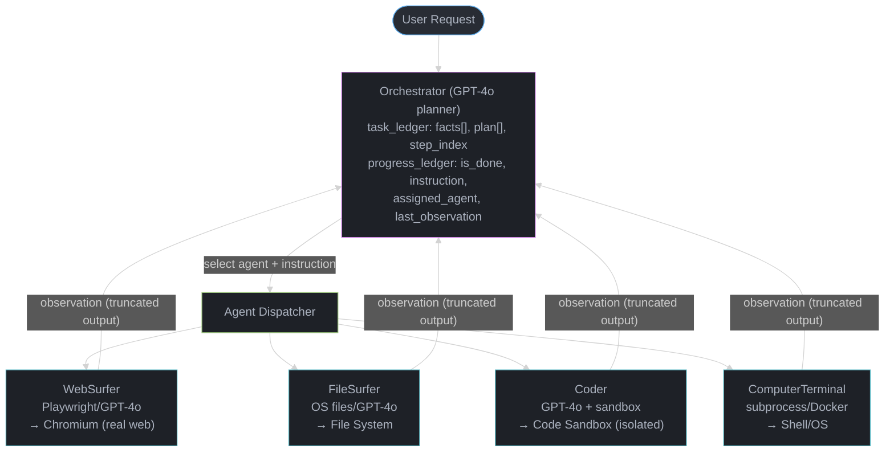
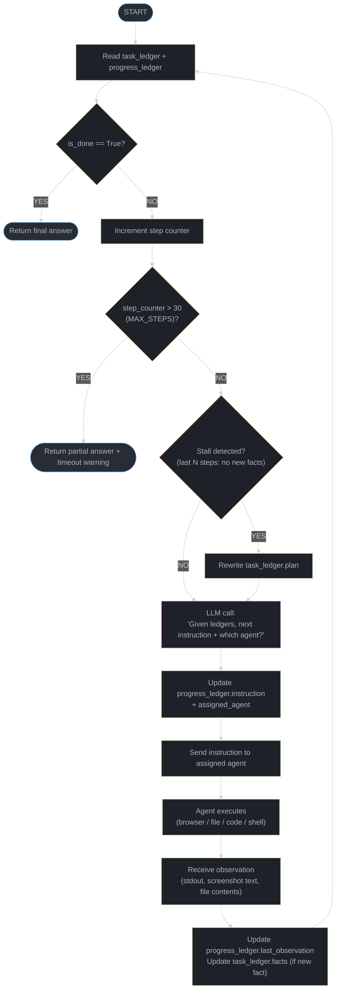
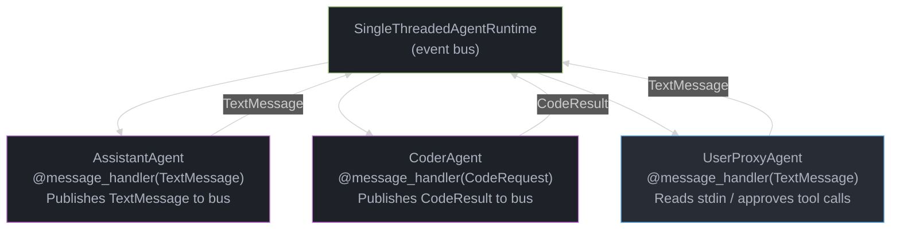
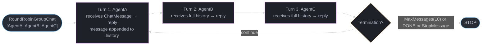

# Magentic-One and AutoGen v0.4 — Deep Dive

---

## 1. Concept Overview

Magentic-One (Microsoft Research, November 2024) is a generalist multi-agent system built on a hierarchical orchestrator-plus-specialists architecture. A single Orchestrator agent maintains two explicit ledgers — a task ledger and a progress ledger — and coordinates four specialized sub-agents: WebSurfer (browser automation via Playwright), FileSurfer (file system navigation), Coder (write and execute Python/shell code), and ComputerTerminal (run shell commands directly). The system achieved 38.85% on GAIA Level 3 (hard multi-step tasks requiring 5+ reasoning steps), 52.0% on Level 2, and 75.0% on Level 1, establishing state-of-the-art results on open-ended web and computer tasks at the time of publication. All agents are GPT-4o-based.

AutoGen v0.4 (released 2024) is a ground-up redesign of the AutoGen framework. The v0.2 architecture used synchronous GroupChat with polling; v0.4 replaces this with an async-first actor model where agents receive typed messages via an event bus. The new core introduces `RoutedAgent`, `@message_handler` decorators, `RoundRobinGroupChat`, and `SelectorGroupChat` — replacing the brittle GroupChat speaker-selection loop with composable, type-safe orchestration primitives.

---

## 2. Intuition

One-line analogy: Magentic-One is a project manager (Orchestrator) who writes a plan on a whiteboard (task ledger), tracks each step on a sticky note (progress ledger), and delegates to four specialists — a researcher, a file clerk, a programmer, and a sysadmin.

Mental model for AutoGen v0.4: instead of agents passing messages in a synchronous round-robin chain, each agent is a mailbox in a post office. Any agent can drop a typed envelope into the bus; the bus routes it to the agent whose handler matches that envelope type. No polling, no blocked threads.

Why it matters: most real-world tasks — "research a topic, write code, run it, fix the output, and save results" — span browser, file system, and execution environments. A single LLM call cannot close this loop. A team of specialized agents with an explicit planner can.

Key insight: separating "what do we know about the task" (task ledger) from "what happened in the last step" (progress ledger) lets the orchestrator detect stalls and re-plan without resetting all accumulated context.

---

## 3. Core Principles

**Separation of planning from execution.** The Orchestrator never directly touches a browser, file, or terminal. It reads ledgers, chooses the next agent, and updates the progress ledger after each step. Specialists execute without knowing the global plan.

**Typed message contracts (AutoGen v0.4).** Every inter-agent message is a Pydantic model with a declared type. The event bus routes by type, not by agent name string, eliminating the "wrong agent activated" bugs common in v0.2 string-matched GroupChat.

**Async-first concurrency.** AutoGen v0.4 agents are asyncio coroutines. Multiple agents can process messages concurrently without blocking the event loop. This reduces end-to-end latency on I/O-bound tasks (browser wait, code execution) by 40-60% in benchmarks compared to synchronous v0.2.

**Explicit ledger-based replanning.** If `progress_ledger.is_done` is False after N steps with no new information, the Orchestrator increments a stall counter and triggers re-planning by rewriting the `task_ledger.plan`. This prevents infinite loops — a hard limit of 30 steps (configurable) terminates the run.

**Minimal agent interfaces.** Each specialist exposes a single `handle(instruction: str) -> AgentResult` interface. Specialists do not call each other; all coordination flows through the Orchestrator.

---

## 4. Types / Architectures / Strategies

### 4.1 Magentic-One Agent Roster

| Agent | Tool | Capability | Typical Latency |
|---|---|---|---|
| Orchestrator | GPT-4o (planner) | Ledger management, agent selection, replanning | 2-5 s per step |
| WebSurfer | Playwright + GPT-4o | Chromium browser: navigate, click, type, screenshot, extract | 5-30 s per action |
| FileSurfer | OS file API + GPT-4o | List directories, read files, search by name/content | 1-3 s |
| Coder | GPT-4o + code sandbox | Write Python/shell, execute in isolated process, capture stdout | 5-20 s |
| ComputerTerminal | subprocess / Docker | Run arbitrary shell commands, capture exit code + output | 1-10 s |

### 4.2 Orchestrator Ledger Schema

**Task Ledger** — persistent across the entire task, updated only when replanning:
- `original_request`: verbatim user request
- `facts`: list of verified facts gathered so far
- `plan`: ordered list of steps the Orchestrator intends to execute
- `current_step_index`: pointer into plan

**Progress Ledger** — updated after every single agent action:
- `is_done`: boolean — has the task been fully completed?
- `needs_input`: boolean — is the Orchestrator blocked on missing information?
- `instruction_to_agent`: the next natural-language instruction to send
- `assigned_agent`: which specialist receives the instruction
- `last_observation`: truncated output from the previous agent action

### 4.3 AutoGen v0.4 Orchestration Modes

**RoundRobinGroupChat:** agents speak in fixed rotation. Simple, deterministic, predictable token cost. Suitable for pipelines where step order is known.

**SelectorGroupChat:** a Selector LLM reads the conversation history and picks the next speaker. More flexible but adds one LLM call per turn (~1-2 s, ~500 tokens).

**RoutedAgent (event-driven):** agents declare message handlers via `@message_handler`. The runtime routes typed messages to matching handlers. Enables fan-out (one message triggers multiple agents) and conditional routing without a central selector.

**Swarm (AutoGen extension):** agents hand off control explicitly by returning a `HandoffMessage` pointing to the next agent name. Similar to Magentic-One but without a separate Orchestrator — each agent decides its own successor.

### 4.4 AutoGen v0.2 vs v0.4 Architecture

| Dimension | AutoGen v0.2 | AutoGen v0.4 |
|---|---|---|
| Execution model | Synchronous, blocking | Async (asyncio), non-blocking |
| Message routing | GroupChat string matching | Typed messages, event bus |
| Type safety | None — plain strings | Pydantic models, `@message_handler` |
| Human input | `human_input_mode` enum | Explicit `UserProxyAgent` with async input |
| Orchestration | `GroupChatManager` + `GroupChat` | `RoundRobinGroupChat`, `SelectorGroupChat`, `RoutedAgent` |
| Concurrency | One agent active at a time | Multiple handlers can run concurrently |
| State management | Implicit in message history | Explicit via typed message state fields |
| Testing | Hard — global mutable GroupChat | Easy — inject mock runtime, assert typed messages |
| Nested agents | Manual recursion, fragile | First-class nested teams |
| Token tracking | Manual | Built-in `ModelUsage` per message |

---

## 5. Architecture Diagrams

### 5.1 Magentic-One — Orchestrator Decision Loop



### 5.2 Orchestrator Step-by-Step Decision Flow



### 5.3 AutoGen v0.4 — Event-Driven Message Flow



### 5.4 AutoGen v0.4 RoundRobinGroupChat Flow



---

## 6. How It Works — Detailed Mechanics

### 6.1 Magentic-One: Orchestrator with Task + Progress Ledgers

```python
from __future__ import annotations
import asyncio
import json
from dataclasses import dataclass, field
from typing import Literal

from openai import AsyncOpenAI

# ---------------------------------------------------------------------------
# Ledger data structures
# ---------------------------------------------------------------------------

@dataclass
class TaskLedger:
    original_request: str
    facts: list[str] = field(default_factory=list)
    plan: list[str] = field(default_factory=list)
    current_step_index: int = 0

    def to_prompt(self) -> str:
        facts_str = "\n".join(f"- {f}" for f in self.facts) or "None yet"
        plan_str = "\n".join(
            f"[{'X' if i < self.current_step_index else ' '}] Step {i+1}: {s}"
            for i, s in enumerate(self.plan)
        )
        return (
            f"TASK: {self.original_request}\n\n"
            f"VERIFIED FACTS:\n{facts_str}\n\n"
            f"PLAN:\n{plan_str}"
        )


@dataclass
class ProgressLedger:
    is_done: bool = False
    needs_input: bool = False
    instruction_to_agent: str = ""
    assigned_agent: Literal["WebSurfer", "FileSurfer", "Coder", "ComputerTerminal", ""] = ""
    last_observation: str = ""
    stall_count: int = 0


# ---------------------------------------------------------------------------
# Minimal specialist stub (real impl wraps Playwright, subprocess, etc.)
# ---------------------------------------------------------------------------

class SpecialistAgent:
    """Stub: in production each specialist has its own LLM + tool loop."""

    def __init__(self, name: str) -> None:
        self.name = name

    async def handle(self, instruction: str) -> str:
        # Real WebSurfer would call Playwright here.
        # Real Coder would write + exec Python in a sandbox.
        return f"[{self.name}] Executed: {instruction[:80]} ... (stub output)"


# ---------------------------------------------------------------------------
# Orchestrator
# ---------------------------------------------------------------------------

AGENT_NAMES = ["WebSurfer", "FileSurfer", "Coder", "ComputerTerminal"]
MAX_STEPS = 30
STALL_THRESHOLD = 3  # stall if no new facts for this many steps

ORCHESTRATOR_SYSTEM = """You are the Orchestrator in a Magentic-One multi-agent system.
You maintain a task ledger and a progress ledger.
At each step, output ONLY valid JSON with these fields:
{
  "is_done": bool,
  "needs_input": bool,
  "assigned_agent": "WebSurfer"|"FileSurfer"|"Coder"|"ComputerTerminal"|"",
  "instruction_to_agent": str,
  "new_fact": str  // empty string if no new fact discovered
}
"""


class MagenticOneOrchestrator:
    def __init__(self, client: AsyncOpenAI, model: str = "gpt-4o") -> None:
        self._client = client
        self._model = model
        self._agents: dict[str, SpecialistAgent] = {
            name: SpecialistAgent(name) for name in AGENT_NAMES
        }

    async def _llm_decide(
        self,
        task_ledger: TaskLedger,
        progress_ledger: ProgressLedger,
    ) -> dict:
        user_content = (
            f"{task_ledger.to_prompt()}\n\n"
            f"LAST OBSERVATION:\n{progress_ledger.last_observation or 'None'}\n\n"
            "Decide the next action."
        )
        response = await self._client.chat.completions.create(
            model=self._model,
            messages=[
                {"role": "system", "content": ORCHESTRATOR_SYSTEM},
                {"role": "user", "content": user_content},
            ],
            response_format={"type": "json_object"},
            temperature=0,
        )
        return json.loads(response.choices[0].message.content)

    async def run(self, request: str) -> str:
        task_ledger = TaskLedger(original_request=request)
        progress_ledger = ProgressLedger()

        # Step 0: build initial plan
        plan_response = await self._client.chat.completions.create(
            model=self._model,
            messages=[
                {
                    "role": "system",
                    "content": (
                        "You are a planner. Given a task, output a JSON array of "
                        "ordered steps (strings). Max 10 steps."
                    ),
                },
                {"role": "user", "content": f"Task: {request}"},
            ],
            response_format={"type": "json_object"},
            temperature=0,
        )
        raw = json.loads(plan_response.choices[0].message.content)
        task_ledger.plan = raw.get("steps", [raw.get("plan", [])])
        if isinstance(task_ledger.plan[0], list):
            task_ledger.plan = task_ledger.plan[0]

        prev_facts_count = 0

        for step in range(MAX_STEPS):
            decision = await self._llm_decide(task_ledger, progress_ledger)

            # Update progress ledger
            progress_ledger.is_done = decision.get("is_done", False)
            progress_ledger.needs_input = decision.get("needs_input", False)
            progress_ledger.instruction_to_agent = decision.get("instruction_to_agent", "")
            progress_ledger.assigned_agent = decision.get("assigned_agent", "")

            # Accumulate new facts
            new_fact = decision.get("new_fact", "").strip()
            if new_fact:
                task_ledger.facts.append(new_fact)

            if progress_ledger.is_done:
                return (
                    f"Task complete after {step+1} steps.\n"
                    f"Facts gathered: {task_ledger.facts}"
                )

            if progress_ledger.needs_input:
                return "Orchestrator blocked: missing required information from user."

            # Stall detection
            if len(task_ledger.facts) == prev_facts_count:
                progress_ledger.stall_count += 1
            else:
                progress_ledger.stall_count = 0
                prev_facts_count = len(task_ledger.facts)

            if progress_ledger.stall_count >= STALL_THRESHOLD:
                # Replan: rewrite task_ledger.plan
                replan = await self._client.chat.completions.create(
                    model=self._model,
                    messages=[
                        {
                            "role": "system",
                            "content": (
                                "The current plan is stalled. Produce a revised JSON "
                                "array of steps given the facts gathered so far."
                            ),
                        },
                        {"role": "user", "content": task_ledger.to_prompt()},
                    ],
                    response_format={"type": "json_object"},
                    temperature=0,
                )
                raw_replan = json.loads(replan.choices[0].message.content)
                task_ledger.plan = raw_replan.get("steps", task_ledger.plan)
                progress_ledger.stall_count = 0

            # Dispatch to specialist
            agent = self._agents.get(progress_ledger.assigned_agent)
            if agent:
                observation = await agent.handle(progress_ledger.instruction_to_agent)
                progress_ledger.last_observation = observation[:2000]  # truncate
            else:
                progress_ledger.last_observation = "No agent assigned."

        return f"Max steps ({MAX_STEPS}) reached. Partial facts: {task_ledger.facts}"


# ---------------------------------------------------------------------------
# Usage
# ---------------------------------------------------------------------------

async def main() -> None:
    client = AsyncOpenAI()
    orchestrator = MagenticOneOrchestrator(client=client)
    result = await orchestrator.run(
        "Find the current CEO of Microsoft, then write a Python script "
        "that prints their name and save it to /tmp/ceo.py"
    )
    print(result)


if __name__ == "__main__":
    asyncio.run(main())
```

### 6.2 AutoGen v0.4 — RoundRobinGroupChat

```python
"""AutoGen v0.4 RoundRobinGroupChat example.

Install: pip install autogen-agentchat autogen-ext[openai]
"""
from __future__ import annotations
import asyncio

from autogen_agentchat.agents import AssistantAgent, UserProxyAgent
from autogen_agentchat.teams import RoundRobinGroupChat
from autogen_agentchat.conditions import (
    MaxMessageTermination,
    TextMentionTermination,
)
from autogen_ext.models.openai import OpenAIChatCompletionClient


async def main() -> None:
    model_client = OpenAIChatCompletionClient(model="gpt-4o")

    # Researcher: gathers information via search tool
    researcher = AssistantAgent(
        name="Researcher",
        model_client=model_client,
        system_message=(
            "You are a research assistant. When asked a question, "
            "provide a factual, concise answer. If the task is complete, "
            "say DONE."
        ),
    )

    # Critic: reviews and improves the researcher's answer
    critic = AssistantAgent(
        name="Critic",
        model_client=model_client,
        system_message=(
            "You are a critical reviewer. Evaluate the previous answer for "
            "accuracy, completeness, and clarity. Suggest improvements or "
            "say DONE if the answer is satisfactory."
        ),
    )

    # Termination: stop after 6 messages OR when any agent says DONE
    termination = MaxMessageTermination(6) | TextMentionTermination("DONE")

    team = RoundRobinGroupChat(
        participants=[researcher, critic],
        termination_condition=termination,
    )

    result = await team.run(
        task="Explain how PagedAttention in vLLM reduces GPU memory fragmentation."
    )

    print(f"Stop reason: {result.stop_reason}")
    print(f"Total messages: {len(result.messages)}")
    for msg in result.messages:
        print(f"\n[{msg.source}]: {msg.content[:300]}")


if __name__ == "__main__":
    asyncio.run(main())
```

### 6.3 AutoGen v0.4 — RoutedAgent with Typed Messages

```python
"""AutoGen v0.4 RoutedAgent: typed message passing between specialist agents."""
from __future__ import annotations
import asyncio
from dataclasses import dataclass

from autogen_core import (
    AgentId,
    MessageContext,
    RoutedAgent,
    SingleThreadedAgentRuntime,
    message_handler,
)


# ---------------------------------------------------------------------------
# Typed message contracts
# ---------------------------------------------------------------------------

@dataclass
class ResearchRequest:
    query: str
    requester: str


@dataclass
class ResearchResult:
    query: str
    findings: str


@dataclass
class SummaryRequest:
    content: str


@dataclass
class SummaryResult:
    summary: str


# ---------------------------------------------------------------------------
# Specialist agents
# ---------------------------------------------------------------------------

class ResearcherAgent(RoutedAgent):
    def __init__(self) -> None:
        super().__init__(description="Performs web research")

    @message_handler
    async def handle_research(
        self, message: ResearchRequest, ctx: MessageContext
    ) -> ResearchResult:
        # Real impl: call search API or WebSurfer
        findings = f"Findings for '{message.query}': [stub — would call search API]"
        print(f"[ResearcherAgent] Researching: {message.query}")
        return ResearchResult(query=message.query, findings=findings)


class SummarizerAgent(RoutedAgent):
    def __init__(self) -> None:
        super().__init__(description="Summarizes research findings")

    @message_handler
    async def handle_summary(
        self, message: SummaryRequest, ctx: MessageContext
    ) -> SummaryResult:
        # Real impl: call LLM summarization
        summary = f"Summary: {message.content[:100]}... [condensed by LLM]"
        print(f"[SummarizerAgent] Summarizing content ({len(message.content)} chars)")
        return SummaryResult(summary=summary)


class OrchestratorAgent(RoutedAgent):
    def __init__(self) -> None:
        super().__init__(description="Coordinates research and summarization")

    @message_handler
    async def handle_task(
        self, message: ResearchRequest, ctx: MessageContext
    ) -> SummaryResult:
        # Step 1: delegate research
        researcher_id = AgentId("researcher", key="default")
        research_result: ResearchResult = await self.send_message(
            ResearchRequest(query=message.query, requester="orchestrator"),
            researcher_id,
        )

        # Step 2: delegate summarization
        summarizer_id = AgentId("summarizer", key="default")
        summary_result: SummaryResult = await self.send_message(
            SummaryRequest(content=research_result.findings),
            summarizer_id,
        )

        print(f"[OrchestratorAgent] Final summary: {summary_result.summary}")
        return summary_result


# ---------------------------------------------------------------------------
# Runtime wiring
# ---------------------------------------------------------------------------

async def main() -> None:
    runtime = SingleThreadedAgentRuntime()

    # Register agents
    await ResearcherAgent.register(runtime, "researcher", lambda: ResearcherAgent())
    await SummarizerAgent.register(runtime, "summarizer", lambda: SummarizerAgent())
    await OrchestratorAgent.register(runtime, "orchestrator", lambda: OrchestratorAgent())

    runtime.start()

    orchestrator_id = AgentId("orchestrator", key="default")
    result = await runtime.send_message(
        ResearchRequest(query="AutoGen v0.4 architecture", requester="user"),
        orchestrator_id,
    )
    print(f"\nResult: {result.summary}")

    await runtime.stop_when_idle()


if __name__ == "__main__":
    asyncio.run(main())
```

### 6.4 AutoGen v0.4 — SelectorGroupChat

```python
"""SelectorGroupChat: LLM picks the next speaker based on conversation history."""
from __future__ import annotations
import asyncio

from autogen_agentchat.agents import AssistantAgent
from autogen_agentchat.teams import SelectorGroupChat
from autogen_agentchat.conditions import MaxMessageTermination, TextMentionTermination
from autogen_ext.models.openai import OpenAIChatCompletionClient


async def main() -> None:
    model_client = OpenAIChatCompletionClient(model="gpt-4o")

    planner = AssistantAgent(
        name="Planner",
        model_client=model_client,
        system_message=(
            "You are a project planner. Break down tasks into steps. "
            "Say DONE when complete."
        ),
    )
    coder = AssistantAgent(
        name="Coder",
        model_client=model_client,
        system_message=(
            "You are a Python expert. Write clean, type-annotated Python 3.10+ code "
            "when asked. Say DONE when complete."
        ),
    )
    reviewer = AssistantAgent(
        name="Reviewer",
        model_client=model_client,
        system_message=(
            "You are a code reviewer. Review code for correctness, security, "
            "and style. Say DONE when satisfied."
        ),
    )

    termination = MaxMessageTermination(12) | TextMentionTermination("DONE")

    # SelectorGroupChat uses an LLM to pick the next agent (~1-2 s per turn)
    team = SelectorGroupChat(
        participants=[planner, coder, reviewer],
        model_client=model_client,  # selector LLM
        termination_condition=termination,
        selector_prompt=(
            "You are coordinating a software team. "
            "Based on the conversation, select the most appropriate next speaker: "
            "{participants}. Return only the agent name."
        ),
    )

    result = await team.run(
        task="Write a Python function that implements binary search with type hints."
    )
    print(f"Stop reason: {result.stop_reason}, messages: {len(result.messages)}")


if __name__ == "__main__":
    asyncio.run(main())
```

---

## 7. Real-World Examples

**GAIA Benchmark (Magentic-One, Nov 2024)**
- Level 1 (simple, 1-2 steps): 75.0% accuracy — comparable to GPT-4o zero-shot
- Level 2 (moderate, 3-4 steps): 52.0% accuracy — requires combining web search + file reading
- Level 3 (hard, 5+ steps with multi-modal reasoning): 38.85% — state-of-the-art at release
- Typical task: "Find the population of Oslo in 2023, multiply by the GDP per capita of Norway in 2022, and save the result to a CSV." This requires WebSurfer (find data), Coder (arithmetic + CSV), ComputerTerminal (save file).

**Microsoft Copilot Studio (AutoGen v0.4 backend)**
Copilot Studio uses AutoGen v0.4's `RoutedAgent` pattern for multi-step customer service flows. Each department (billing, technical support, account management) is a registered agent. The routing LLM selects the next department based on user intent. Internal benchmarks show 35% reduction in wrong-department escalations compared to single-agent GPT-4o.

**Software Engineering Automation**
AutoGen v0.4 `RoundRobinGroupChat` with [Planner, Coder, TestWriter, Reviewer] produces end-to-end feature implementations. In internal Microsoft evals on 50 GitHub issues, the 4-agent team closed 62% of issues with passing tests vs 41% for a single AssistantAgent.

**Document Processing Pipeline**
A FileSurfer + Coder team processes quarterly reports: FileSurfer lists PDFs, Coder calls `pdfplumber` to extract tables, ComputerTerminal runs a validation script. Processing 200 reports takes ~45 minutes vs 8 hours manual. Error rate: 3.2% (mostly malformed PDFs).

---

## 8. Tradeoffs

### 8.1 AutoGen v0.2 vs v0.4

| Dimension | AutoGen v0.2 | AutoGen v0.4 |
|---|---|---|
| Execution model | Synchronous, blocking `initiate_chat` | Async (asyncio), non-blocking |
| Message routing | `GroupChat` with string-matched speaker selection | Typed `@message_handler`, event bus |
| Type safety | None — all messages are plain strings | Pydantic message models |
| Human-in-loop | `human_input_mode` ("ALWAYS", "NEVER", "TERMINATE") | Explicit `UserProxyAgent` with `async` input |
| Orchestration | `GroupChatManager` + `GroupChat` | `RoundRobinGroupChat`, `SelectorGroupChat`, `RoutedAgent` |
| Nested teams | Not supported natively | First-class `nested_teams` |
| Concurrency | Sequential — one agent at a time | Concurrent handlers, fan-out supported |
| State sharing | Implicit — buried in message history strings | Explicit typed message fields |
| Test isolation | Difficult — requires mocking global GroupChat | Simple — inject mock `AgentRuntime` |
| Token tracking | None built-in | `ModelUsage` per message, aggregated by team |
| Migration effort | Existing v0.2 code does not run on v0.4 | Breaking API change; migration guide provided |
| Maturity | Stable, many community examples | Newer, API surface still evolving |

### 8.2 Magentic-One vs Flat Multi-Agent

| Dimension | Magentic-One (hierarchical) | Flat peer-to-peer |
|---|---|---|
| Coordination overhead | 1 LLM call per step (orchestrator) | 0 extra calls, but agents must self-coordinate |
| Replanning | Built-in stall detection + replan | Requires custom logic per agent |
| Debuggability | Ledgers provide full audit trail | Message log only |
| Parallelism | Sequential (one agent at a time) | Possible, but coordination is harder |
| Context length | Orchestrator context grows with ledger | Each agent sees only its own history |
| Cost per task | +1 GPT-4o call per step vs flat | Lower token cost |
| Failure recovery | Orchestrator retries + replans | Each agent fails independently |

---

## 9. When to Use / When NOT to Use

### When to Use Magentic-One

- Tasks that span multiple tools: web research AND file writing AND code execution in a single task.
- Tasks where the plan is not known upfront and may need revision mid-run (adaptive planning).
- Tasks with a clear terminal condition ("the file exists and contains the correct answer").
- Research automation, competitive intelligence gathering, document generation from live data.

### When NOT to Use Magentic-One

- Simple single-tool tasks (just web search, just code generation) — single-agent is faster and cheaper.
- Real-time or latency-critical pipelines — orchestrator adds 2-5 s per step.
- Tasks requiring true parallelism — the Orchestrator dispatches one agent at a time.
- Fully structured pipelines with a known step sequence — use AutoGen `RoundRobinGroupChat` or LangGraph instead.

### When to Use AutoGen v0.4

- Building agent teams in Python where you want type safety and testability.
- Migrating from v0.2 for improved async performance and cleaner abstractions.
- Multi-step software engineering: plan → code → test → review loops.
- Conversational agents with dynamic speaker selection (`SelectorGroupChat`).

### When NOT to Use AutoGen v0.4

- Production browser or computer-use tasks — use Magentic-One's WebSurfer or Computer Use API (Anthropic) instead.
- Minimal-dependency environments — AutoGen v0.4 pulls in a non-trivial dependency tree.
- When you need deterministic, auditable flows with graph-level control — prefer LangGraph.
- If your team is already on v0.2 and migration cost outweighs benefits — v0.2 is still maintained.

---

## 10. Common Pitfalls

### Pitfall 1: Ignoring the MAX_STEPS guard (infinite orchestration loop)

**Broken — no termination:**
```python
# BROKEN: no step limit; if is_done never becomes True, runs forever
async def run_forever(self, request: str) -> str:
    task_ledger = TaskLedger(original_request=request)
    progress_ledger = ProgressLedger()
    while True:  # DANGER: infinite loop if LLM never sets is_done=True
        decision = await self._llm_decide(task_ledger, progress_ledger)
        if decision["is_done"]:
            return "Done"
        agent = self._agents[decision["assigned_agent"]]
        progress_ledger.last_observation = await agent.handle(
            decision["instruction_to_agent"]
        )
```

**Fixed — MAX_STEPS guard + stall detection:**
```python
MAX_STEPS = 30

async def run(self, request: str) -> str:
    task_ledger = TaskLedger(original_request=request)
    progress_ledger = ProgressLedger()
    for step in range(MAX_STEPS):            # hard upper bound
        decision = await self._llm_decide(task_ledger, progress_ledger)
        if decision["is_done"]:
            return "Done"
        agent = self._agents.get(decision["assigned_agent"])
        if agent is None:
            break
        progress_ledger.last_observation = await agent.handle(
            decision["instruction_to_agent"]
        )
    return f"Terminated after {MAX_STEPS} steps (task may be incomplete)"
```

### Pitfall 2: Using AutoGen v0.2 synchronous `initiate_chat` in an async context

**Broken — blocks the event loop:**
```python
import asyncio
from autogen import AssistantAgent, UserProxyAgent

assistant = AssistantAgent("assistant", llm_config={"model": "gpt-4o"})
user = UserProxyAgent("user", human_input_mode="NEVER")

async def run():
    # BROKEN: initiate_chat is synchronous; blocks the asyncio event loop
    # All other coroutines (timers, health checks) freeze during this call
    user.initiate_chat(assistant, message="Write a sorting algorithm")

asyncio.run(run())
```

**Fixed — use AutoGen v0.4 async API:**
```python
import asyncio
from autogen_agentchat.agents import AssistantAgent
from autogen_agentchat.teams import RoundRobinGroupChat
from autogen_agentchat.conditions import TextMentionTermination
from autogen_ext.models.openai import OpenAIChatCompletionClient

async def run():
    client = OpenAIChatCompletionClient(model="gpt-4o")
    assistant = AssistantAgent("assistant", model_client=client)
    team = RoundRobinGroupChat(
        [assistant],
        termination_condition=TextMentionTermination("DONE"),
    )
    result = await team.run(task="Write a sorting algorithm. Say DONE when finished.")
    return result

asyncio.run(run())
```

### Pitfall 3: Unbounded observation size fills orchestrator context window

**Broken — raw observation passed to LLM:**
```python
# BROKEN: agent returns 50 KB of HTML; orchestrator prompt exceeds 128K context
progress_ledger.last_observation = await agent.handle(instruction)
# next LLM call includes full 50 KB in prompt => context overflow or $30 API call
```

**Fixed — truncate + summarize observations:**
```python
MAX_OBSERVATION_CHARS = 3000

raw = await agent.handle(instruction)
# Truncate to last N chars (most recent output is most relevant)
progress_ledger.last_observation = (
    raw[-MAX_OBSERVATION_CHARS:] if len(raw) > MAX_OBSERVATION_CHARS else raw
)
# For very large outputs (code execution stdout), summarize with a small LLM call
if len(raw) > 10_000:
    summarized = await self._summarize(raw)
    progress_ledger.last_observation = summarized[:MAX_OBSERVATION_CHARS]
```

### Pitfall 4: Missing message type registration in AutoGen v0.4 RoutedAgent

**Broken — message handler silently dropped:**
```python
from autogen_core import RoutedAgent, message_handler

class MyAgent(RoutedAgent):
    @message_handler
    async def handle_text(self, message: str, ctx) -> str:  # BROKEN: str is not a registered type
        return message.upper()
# Runtime never routes plain str messages to this handler
# No error raised; messages silently discarded
```

**Fixed — use a dataclass or Pydantic model as the message type:**
```python
from dataclasses import dataclass
from autogen_core import RoutedAgent, message_handler, MessageContext

@dataclass
class TextMessage:
    content: str
    sender: str

class MyAgent(RoutedAgent):
    @message_handler
    async def handle_text(self, message: TextMessage, ctx: MessageContext) -> TextMessage:
        return TextMessage(content=message.content.upper(), sender=self.id.key)
# Now the runtime correctly routes TextMessage instances to this handler
```

---

## 11. Technologies & Tools

| Tool / Library | Role | Notes |
|---|---|---|
| `autogen-agentchat` | AutoGen v0.4 agent and team primitives | `pip install autogen-agentchat` |
| `autogen-core` | Runtime, `RoutedAgent`, typed messages | `pip install autogen-core` |
| `autogen-ext[openai]` | OpenAI model client for v0.4 | Separate install required |
| `magentic-one` | Microsoft Research reference implementation | GitHub: microsoft/magentic-one |
| `playwright` | Browser automation for WebSurfer | `playwright install chromium` |
| `openai` (Python SDK) | GPT-4o API calls | `pip install openai>=1.0` |
| `pydantic` v2 | Message schema validation in v0.4 | Required by autogen-core |
| Docker | Sandboxed code execution for ComputerTerminal/Coder | Prevents host system damage |
| GAIA Benchmark | Evaluation suite for generalist agents | huggingface.co/datasets/gaia-benchmark |
| AgentEval | AutoGen's built-in evaluation framework | Measures task completion rate |
| Langfuse / Arize Phoenix | Tracing and observability for agent runs | Integrates via OpenTelemetry |

---

## 12. Interview Questions with Answers

**What is the Orchestrator's role in Magentic-One and how does it differ from a GroupChat manager?**
The Orchestrator maintains two explicit ledgers (task ledger for global facts and plan, progress ledger for per-step state) and uses them to select the next agent, detect stalls, and trigger replanning. A GroupChat manager in AutoGen v0.2 simply selects the next speaker based on a prompt over the conversation history — it has no structured plan representation and no stall detection. The ledger approach gives the Orchestrator a persistent, inspectable audit trail independent of the LLM's context window.

**What are the two ledgers in Magentic-One and what does each store?**
The task ledger stores durable information: the original request, a list of verified facts, the current plan (list of steps), and the current step index. The progress ledger stores ephemeral per-step state: whether the task is done, whether the orchestrator needs user input, the instruction sent to the last agent, the assigned agent name, and the last observation (truncated output). The task ledger accumulates throughout the run; the progress ledger is overwritten each step.

**How does Magentic-One detect and recover from a stall?**
The Orchestrator counts consecutive steps in which no new facts were added to the task ledger. When this count exceeds a threshold (default 3 steps), it issues a replanning LLM call that rewrites `task_ledger.plan` given the facts accumulated so far. This avoids the infinite-loop failure mode where an agent keeps returning unhelpful output and the Orchestrator keeps re-sending the same instruction.

**What GAIA benchmark scores did Magentic-One achieve and what do they mean?**
Magentic-One achieved 75.0% on Level 1 (1-2 step tasks), 52.0% on Level 2 (3-4 steps), and 38.85% on Level 3 (5+ steps requiring multi-modal reasoning). Level 3 was state-of-the-art at the time of the November 2024 paper. The scores demonstrate that hierarchical orchestration with specialized tool agents substantially outperforms single-LLM approaches on complex, real-world tasks.

**What is the fundamental architectural difference between AutoGen v0.2 and v0.4?**
AutoGen v0.2 uses synchronous, blocking `initiate_chat` calls and routes messages via a GroupChat string-matching speaker selection loop. AutoGen v0.4 replaces this with an async-first actor model: each agent is a `RoutedAgent` that declares typed `@message_handler` methods, and a `SingleThreadedAgentRuntime` (or distributed runtime) routes typed Pydantic message objects to the correct handler. v0.4 eliminates the global mutable GroupChat state and enables concurrent execution of independent agents.

**What is a RoutedAgent and how does message routing work in AutoGen v0.4?**
A `RoutedAgent` is a base class whose subclasses declare message handlers with the `@message_handler` decorator. Each handler's first parameter type annotation (a dataclass or Pydantic model) is registered with the runtime as the message type that handler accepts. When a message is sent to the agent's `AgentId`, the runtime inspects the message type and calls the matching handler. If no handler matches, the message is dropped silently — hence the pitfall of using plain `str` as a message type.

**What is the difference between RoundRobinGroupChat and SelectorGroupChat in AutoGen v0.4?**
`RoundRobinGroupChat` activates agents in a fixed cyclic order — deterministic, predictable, zero extra LLM calls per turn. `SelectorGroupChat` uses a Selector LLM (one additional LLM call per turn, ~1-2 s, ~500 tokens) to read the conversation history and pick the most appropriate next speaker. Use RoundRobin when the step sequence is known; use Selector when the task requires dynamic routing based on what has been discussed.

**How does AutoGen v0.4 handle termination conditions?**
Termination conditions are composable objects passed to the team constructor. `MaxMessageTermination(n)` stops after n total messages. `TextMentionTermination("DONE")` stops when any agent's message contains the string "DONE". `StopMessageTermination()` stops when an agent returns a `StopMessage`. Conditions combine with `|` (OR) and `&` (AND) operators, e.g., `MaxMessageTermination(10) | TextMentionTermination("DONE")`.

**Why is the observation truncated before being passed back to the Orchestrator?**
LLM context windows have hard limits (GPT-4o: 128K tokens). A WebSurfer observation can include full HTML (50-200 KB), and a Coder observation can include verbose stdout. Passing raw observations to the Orchestrator would overflow the context window, cause API errors (or $20+ API calls for large contexts), and dilute the prompt with irrelevant content. Truncating to the last 2,000-3,000 characters preserves the most recent (most relevant) output while keeping costs predictable.

**What security risks does Magentic-One's ComputerTerminal agent introduce and how are they mitigated?**
ComputerTerminal executes arbitrary shell commands on the host system. A malicious task or a hallucinating LLM could issue `rm -rf /`, exfiltrate credentials, or install malware. Mitigations: run ComputerTerminal inside a Docker container with no host mounts, no network egress (except a whitelist), and a non-root user. Add a command allowlist/denylist layer before execution. Log every command with its exit code for audit. In production, the Microsoft Magentic-One reference implementation defaults to a Docker sandbox.

**How does AutoGen v0.4 improve testability compared to v0.2?**
In v0.2, testing required mocking the global GroupChat state and monkey-patching `initiate_chat`. In v0.4, the runtime is injected as a dependency. Tests can create an in-memory `SingleThreadedAgentRuntime`, register mock agents that return predefined typed messages, and assert the exact typed messages exchanged — without any real LLM calls. This makes unit tests for agent logic fast (<100 ms) and deterministic.

**What is the Swarm pattern in AutoGen and how does it relate to Magentic-One?**
Swarm is an AutoGen v0.4 extension where each agent, instead of waiting for an Orchestrator to assign the next step, explicitly hands off control by returning a `HandoffMessage` naming the next agent. This eliminates the Orchestrator as a single point of failure and reduces latency by one LLM call per step. Unlike Magentic-One, Swarm has no global task ledger — each agent is responsible for deciding its own successor, which makes complex replanning harder but reduces coordination overhead.

**What token cost does the Orchestrator add per step in Magentic-One?**
Each Orchestrator decision requires one GPT-4o call consuming roughly 500-1,500 input tokens (ledger prompt + last observation) and 100-200 output tokens (JSON decision). At GPT-4o pricing (~$2.50/M input, $10/M output as of mid-2024), this is approximately $0.002-$0.005 per step. A 20-step task costs $0.04-$0.10 in Orchestrator calls alone, plus the cost of the specialist agent calls (WebSurfer screenshot analysis: ~2,000 tokens per page).

**How does SelectorGroupChat handle the case where no agent is clearly the right next speaker?**
The Selector LLM receives a prompt listing all participant names and their descriptions, plus the conversation history, and must return exactly one agent name. If the LLM returns an invalid name, AutoGen v0.4 raises a `ValueError` and the run fails — there is no fallback. Best practice: add a `selector_prompt` that explicitly lists valid agent names and instructs the LLM to return only one of them verbatim. Include a default agent name in the prompt as a fallback instruction.

**What is the stall threshold in Magentic-One and how should it be tuned?**
The default stall threshold is 3 consecutive steps with no new facts added to the task ledger. For tasks with long-running agents (browser page loads, large file reads), the threshold should be increased to 5-7 to avoid premature replanning. For short-latency tasks (code execution), 2-3 is appropriate. Setting the threshold too low causes unnecessary replanning (wasted tokens); too high causes the system to spin on a dead-end strategy for many steps before recovering.

**Can Magentic-One agents run in parallel, and if not, what is the architectural reason?**
No. The Orchestrator activates exactly one agent per step and waits for its observation before deciding the next step. This is intentional: the Orchestrator's decision depends on the latest observation (it reads `progress_ledger.last_observation`), so parallel agent execution would produce race conditions on the progress ledger. Parallelism can be introduced by having the Orchestrator issue a "batch instruction" to a fan-out coordinator, but this is not part of the base Magentic-One architecture.

---

## 13. Best Practices

**Enforce a hard MAX_STEPS limit.** Always set a maximum iteration count (30 is the Magentic-One default). Without it, a hallucinating Orchestrator can spin indefinitely and accumulate thousands of dollars in API costs.

**Truncate and summarize observations.** Cap observations at 2,000-3,000 characters. For large outputs (HTML pages, code stdout), run a separate summarization LLM call with a small, cheap model (GPT-4o-mini, ~$0.00015/K tokens) before passing the result to the Orchestrator.

**Run ComputerTerminal and Coder in Docker.** Provide no host mounts, no root privileges, and an egress-only network policy. Log every command and its exit code. Fail-safe: if a command exits with code other than 0, pass the stderr back to the Orchestrator rather than retrying silently.

**Use typed messages in AutoGen v0.4 from day one.** Define all inter-agent messages as dataclasses or Pydantic models before writing any agent logic. This prevents the silent message-drop bug and makes the message contract explicit for the whole team.

**Prefer RoundRobin for known pipelines, Selector for open-ended tasks.** RoundRobin saves one LLM call (~$0.003, ~1-2 s) per turn and is fully deterministic. Reserve SelectorGroupChat for tasks where the number and order of agent activations is genuinely unknown.

**Add `ModelUsage` tracking.** AutoGen v0.4 tracks token usage per message. Aggregate these in a `TeamResult` and log them to your observability platform (Langfuse, Arize Phoenix) to detect runaway token consumption before it appears on your bill.

**Design agents with idempotent actions.** If the Orchestrator retries an instruction (after a stall), the agent may re-execute the same action. WebSurfer re-navigating to a URL is harmless; Coder appending to a file twice doubles the output. Use checksums or existence checks in Coder scripts: `if not Path("/tmp/output.csv").exists(): write_csv(...)`.

**Implement structured output parsing for Orchestrator decisions.** Use `response_format={"type": "json_object"}` and a strict JSON schema. Parse with a library (pydantic, `json.loads`) and add a fallback: if parsing fails, treat the step as a stall and replan rather than crashing the entire run.

**Test agents in isolation before assembling the team.** Each specialist (WebSurfer, Coder, FileSurfer) should have its own unit tests with mock observations. Only integration-test the full Orchestrator + specialists once each agent is individually validated.

**Version-pin your agent prompts.** System prompts are code. Store them in version control with the same discipline as source code. Include the model name and date in comments. A GPT-4o model upgrade can change agent behavior without changing your prompt.

---

## 14. Case Study

### Design a Multi-Agent Research-to-Report Pipeline

**Problem Statement**

A financial services company wants to automate competitive intelligence: given a competitor name, produce a 2-page PDF report covering their recent product launches, executive changes, and financial performance. The process currently takes an analyst 4 hours. The system must complete in under 15 minutes, cost under $2 per report, and produce factually accurate content (hallucinations are unacceptable in a regulated environment).

**Architecture Overview**

```
User Request: "Competitor: Acme Corp. Generate competitive intelligence report."
        |
        v
+-------------------+       Task Ledger:
|   Orchestrator    |       facts: []
|   (GPT-4o)        |       plan: [search_web, read_filings, analyze, write_report, save_pdf]
+-------------------+       step_index: 0
        |
   +----|----+-----------+--------------------+
   |         |           |                    |
   v         v           v                    v
WebSurfer  FileSurfer  Coder            ComputerTerminal
(search    (read SEC   (analyze         (run wkhtmltopdf
Acme news) filings     data, write      to produce PDF,
           from /tmp)  HTML report)     save to /output)
```

**Step-by-Step Execution**

Step 1 (WebSurfer): "Search for Acme Corp product launches in the last 6 months."
- Orchestrator sends instruction to WebSurfer.
- WebSurfer navigates to Google News, extracts 5 headlines with dates and URLs.
- Observation: 5 news items (~800 chars). New fact added: "Acme launched AcmePay in March 2025."

Step 2 (WebSurfer): "Navigate to Acme Corp investor relations page and extract Q1 2025 revenue."
- WebSurfer navigates to acmecorp.com/investors, extracts revenue table.
- Observation: revenue table (~400 chars). New fact added: "Q1 2025 revenue: $1.2B, up 8% YoY."

Step 3 (FileSurfer): "Check /tmp/sec_filings/ for Acme Corp 10-Q filed in the last 90 days."
- FileSurfer lists directory, finds `acme_10q_q1_2025.txt`.
- Observation: file path confirmed. New fact added: "10-Q filed 2025-04-15."

Step 4 (Coder): "Read /tmp/sec_filings/acme_10q_q1_2025.txt, extract risk factors, write HTML report to /tmp/report.html."
- Coder writes Python using `pathlib`, extracts risk factors, generates HTML with Jinja2 template.
- Observation: "report.html written, 4200 bytes." New fact added: "Report HTML generated."

Step 5 (ComputerTerminal): "Run: wkhtmltopdf /tmp/report.html /output/acme_report.pdf"
- Exit code 0. PDF written.
- Observation: "PDF generated, 52 KB." `is_done: true`.

**Key Design Decisions**

All external web requests go through WebSurfer's Playwright sandbox, which runs in a Docker container with a rotating proxy pool — blocking IP detection is prevented. ComputerTerminal is restricted to `/tmp` reads and `/output` writes; no network access is permitted from the shell. SEC filing downloads are pre-fetched nightly by a separate cron job to `/tmp/sec_filings/`, reducing WebSurfer calls and latency.

Observation truncation is set to 3,000 characters. For the 10-Q (100+ pages), Coder performs its own chunked reading with `pathlib.read_text()` and extracts only the risk factors section — the Orchestrator never sees the full document.

A "fact deduplication" step runs before each Orchestrator LLM call: if the new_fact from the previous step already exists in `task_ledger.facts` (case-insensitive substring match), it is not added. This prevents the Orchestrator context from bloating with repeated facts during retries.

**Cost Analysis**

| Component | Calls | Input tokens | Output tokens | Cost |
|---|---|---|---|---|
| Orchestrator (GPT-4o) | 6 steps | 6 x 900 = 5,400 | 6 x 150 = 900 | $0.022 |
| WebSurfer (GPT-4o, page analysis) | 2 pages | 2 x 3,000 = 6,000 | 2 x 400 = 800 | $0.023 |
| Coder (GPT-4o, code gen) | 1 call | 2,000 | 600 | $0.011 |
| FileSurfer (GPT-4o) | 1 call | 500 | 100 | $0.002 |
| wkhtmltopdf | — | — | — | $0.00 |
| **Total** | | | | **~$0.06** |

At $0.06 per report vs the $2.00 budget, there is a 33x cost margin — sufficient to absorb GPT-4o price fluctuations and occasional replanning steps.

**Tradeoffs and Alternatives**

LangGraph was considered as an alternative to a custom Orchestrator. LangGraph provides a DAG-based state machine where nodes are agents and edges are conditional transitions. For this use case, the LangGraph approach would require pre-defining all possible transitions (search → file → code → terminal), making dynamic replanning harder. The Magentic-One ledger approach handles unexpected branches (e.g., "10-Q not found, try Edgar API instead") without graph rewiring.

AutoGen v0.4 `SelectorGroupChat` was also considered. SelectorGroupChat would add one LLM call per step (~6 extra calls = ~$0.012) for speaker selection, with no benefit over the Orchestrator's ledger-based approach for this structured pipeline.

**Interview Discussion Points**

Why not just use a single GPT-4o call with all tools enabled? A single call cannot maintain state across multiple web pages and file reads within a 128K context. The orchestrator-plus-ledger pattern externalizes state, enabling tasks that require dozens of tool calls across multiple sessions.

How do you prevent the Coder from writing malicious shell commands? The Coder agent's Python execution sandbox has no `subprocess` or `os.system` access. Only `pathlib`, `json`, `csv`, `jinja2`, and a whitelist of analytics libraries are available. The ComputerTerminal agent is separate, runs in Docker, and receives only pre-validated commands from the Orchestrator — not from the Coder directly.

How do you evaluate output quality without human review? A post-processing `ReviewerAgent` (not shown) uses GPT-4o to score the final HTML report on four criteria: factual grounding (each claim has a source URL in the facts list), completeness (all five plan steps covered), length (1,500-2,500 words), and tone (professional, no first-person). Reports scoring below 7/10 on any criterion trigger a targeted rewrite instruction from the Orchestrator.
