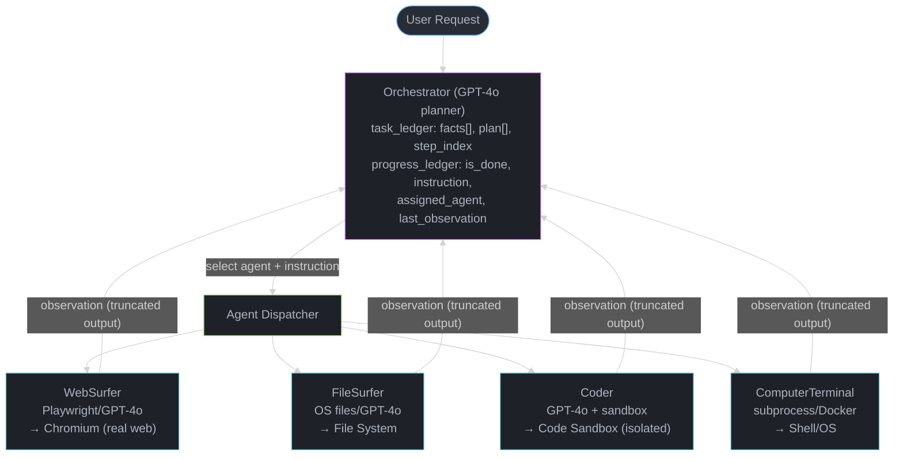
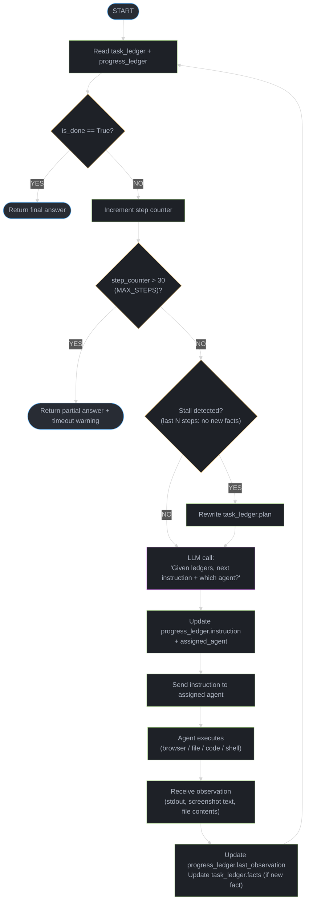
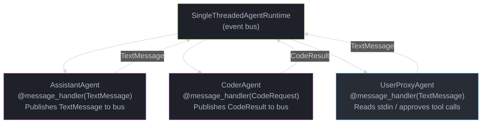
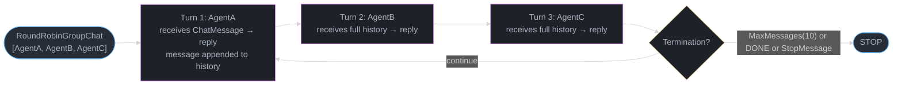
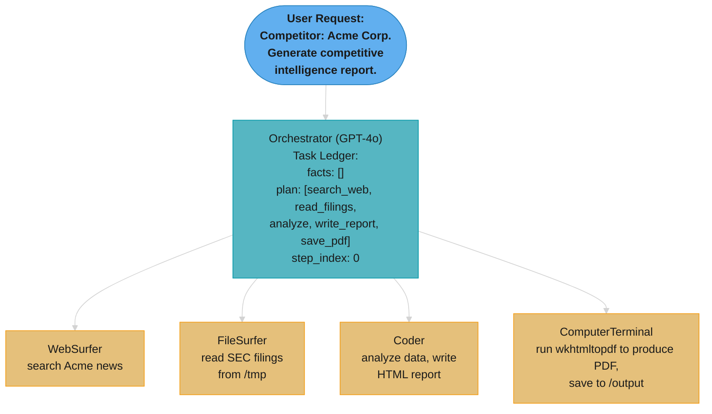

# Magentic-One and AutoGen v0.4 — Deep Dive

---

## 1. Concept Overview

Magentic-One (Microsoft Research, arXiv 2411.04468, November 2024) is a generalist multi-agent system built on a hierarchical orchestrator-plus-specialists architecture. A single Orchestrator agent maintains two explicit ledgers — a task ledger and a progress ledger — and coordinates four specialized sub-agents: WebSurfer (browser automation via a Chromium browser), FileSurfer (file system navigation and file preview), Coder (write code and analyze collected information), and ComputerTerminal (execute the Coder's programs in a console shell). The paper's headline GAIA result is **38.00% overall on the GAIA test set** for its best configuration and **32.33%** for the GPT-4o-only configuration; on the GAIA validation set the best configuration scored **54.84% (Level 1), 32.7% (Level 2), 22.92% (Level 3)** — versus 46.24% / 28.3% / 18.75% with GPT-4o alone. The team runs on `gpt-4o-2024-05-13`; the best configuration swaps in o1-preview for the Orchestrator's outer planning loop and the Coder. The paper's own framing is "statistically competitive with the previous state of the art" on GAIA, AssistantBench and WebArena, not a clean sweep.

AutoGen v0.4 (announced January 2025) is a ground-up redesign of the AutoGen framework. The v0.2 architecture used synchronous GroupChat; v0.4 replaces this with an async-first actor model where agents receive typed messages via an event bus. The new core introduces `RoutedAgent`, `@message_handler` decorators, `RoundRobinGroupChat`, and `SelectorGroupChat` — replacing the brittle GroupChat speaker-selection loop with composable, type-safe orchestration primitives.

**Version this file targets (checked July 2026).** The code below targets the **v0.4-and-later Python packages** — `autogen-agentchat` / `autogen-core` / `autogen-ext`, whose current release line is **0.7.x**. The v0.4 APIs shown here (`AssistantAgent`, `RoundRobinGroupChat`, `SelectorGroupChat`, `RoutedAgent`, `@message_handler`, `SingleThreadedAgentRuntime`) are still the current APIs in 0.7.x; nothing in this file targets the v0.2 `autogen` package, whose API is incompatible and which Microsoft no longer develops. Note the strategic context: in October 2025 Microsoft announced the **Microsoft Agent Framework**, which converges AutoGen and Semantic Kernel into one framework and shipped a production-ready 1.0 in April 2026. Microsoft positions it as the direct successor; AutoGen continues to receive bug fixes and security patches, and Microsoft publishes an AutoGen → Agent Framework migration guide. Treat AutoGen v0.4+ as a stable but no-longer-advancing base, and the Agent Framework as the destination for new Microsoft-stack work.

---

## 2. Intuition

One-line analogy: Magentic-One is a project manager (Orchestrator) who writes a plan on a whiteboard (task ledger), tracks each step on a sticky note (progress ledger), and delegates to four specialists — a researcher, a file clerk, a programmer, and a sysadmin.

Mental model for AutoGen v0.4: instead of agents passing messages in a synchronous round-robin chain, each agent is a mailbox in a post office. Any agent can drop a typed envelope into the bus; the bus routes it to the agent whose handler matches that envelope type. No polling, no blocked threads.

Why it matters: most real-world tasks — "research a topic, write code, run it, fix the output, and save results" — span browser, file system, and execution environments. A single LLM call cannot close this loop. A team of specialized agents with an explicit planner can.

Key insight: separating "what do we know about the task" (task ledger) from "what happened in the last step" (progress ledger) lets the orchestrator detect stalls and re-plan without resetting all accumulated context.

---

## 3. Core Principles

**Separation of planning from execution.** The Orchestrator never directly touches a browser, file, or terminal. It reads ledgers, chooses the next agent, and updates the progress ledger after each step. Specialists execute without knowing the global plan.

**Typed message contracts (AutoGen v0.4).** Every inter-agent message is a Pydantic model with a declared type. The event bus routes by type, not by agent name string, eliminating the "wrong agent activated" bugs common in v0.2 string-matched GroupChat.

**Async-first concurrency.** AutoGen v0.4 agents are asyncio coroutines. Multiple agents can process messages concurrently without blocking the event loop. On I/O-bound tasks (browser wait, code execution) this removes the head-of-line blocking that synchronous v0.2 `initiate_chat` imposed; Microsoft publishes no benchmark quantifying the speedup, so treat the gain as workload-dependent rather than a fixed percentage.

**Explicit ledger-based replanning.** If `progress_ledger.is_done` is False after N steps with no new information, the Orchestrator increments a stall counter and triggers re-planning by rewriting the `task_ledger.plan`. This prevents infinite loops. In the shipped implementation (`autogen_agentchat.teams.MagenticOneGroupChat`) the two relevant guards are `max_stalls` (default **3** stalls before re-planning) and `max_turns` (default **20** turns before the run stops). The worked example later in this file uses its own `MAX_STEPS = 30`; that is an illustrative value, not the framework default.

**Minimal agent interfaces.** Each specialist exposes a single `handle(instruction: str) -> AgentResult` interface. Specialists do not call each other; all coordination flows through the Orchestrator.

---

## 4. Types / Architectures / Strategies

### 4.1 Magentic-One Agent Roster

| Agent | Tool | Capability | Typical Latency |
|---|---|---|---|
| Orchestrator | GPT-4o (planner) | Ledger management, agent selection, replanning | 2-5 s per step |
| WebSurfer | Playwright + GPT-4o | Chromium browser: navigate, click, type, screenshot, extract | 5-30 s per action |
| FileSurfer | OS file API + GPT-4o | List directories, read files, search by name/content | 1-3 s |
| Coder | GPT-4o + code sandbox | Write Python/shell, execute in isolated process, capture stdout | 5-20 s |
| ComputerTerminal | subprocess / Docker | Run arbitrary shell commands, capture exit code + output | 1-10 s |

### 4.2 Orchestrator Ledger Schema

**Task Ledger** — persistent across the entire task, updated only when replanning:
- `original_request`: verbatim user request
- `facts`: list of verified facts gathered so far
- `plan`: ordered list of steps the Orchestrator intends to execute
- `current_step_index`: pointer into plan

**Progress Ledger** — updated after every single agent action:
- `is_done`: boolean — has the task been fully completed?
- `needs_input`: boolean — is the Orchestrator blocked on missing information?
- `instruction_to_agent`: the next natural-language instruction to send
- `assigned_agent`: which specialist receives the instruction
- `last_observation`: truncated output from the previous agent action

### 4.3 AutoGen v0.4 Orchestration Modes

**RoundRobinGroupChat:** agents speak in fixed rotation. Simple, deterministic, predictable token cost. Suitable for pipelines where step order is known.

**SelectorGroupChat:** a Selector LLM reads the conversation history and picks the next speaker. More flexible but adds one LLM call per turn (~1-2 s, ~500 tokens).

**RoutedAgent (event-driven):** agents declare message handlers via `@message_handler`. The runtime routes typed messages to matching handlers. Enables fan-out (one message triggers multiple agents) and conditional routing without a central selector.

**Swarm (`autogen_agentchat.teams.Swarm`):** a first-class team type alongside RoundRobin and Selector — agents hand off control explicitly by emitting a `HandoffMessage` naming the next agent. Similar to Magentic-One but without a separate Orchestrator — each agent decides its own successor.

### 4.4 AutoGen v0.2 vs v0.4 Architecture

| Dimension | AutoGen v0.2 | AutoGen v0.4 |
|---|---|---|
| Execution model | Synchronous, blocking | Async (asyncio), non-blocking |
| Message routing | GroupChat string matching | Typed messages, event bus |
| Type safety | None — plain strings | Pydantic models, `@message_handler` |
| Human input | `human_input_mode` enum | Explicit `UserProxyAgent` with async input |
| Orchestration | `GroupChatManager` + `GroupChat` | `RoundRobinGroupChat`, `SelectorGroupChat`, `RoutedAgent` |
| Concurrency | One agent active at a time | Multiple handlers can run concurrently |
| State management | Implicit in message history | Explicit via typed message state fields |
| Testing | Hard — global mutable GroupChat | Easy — inject mock runtime, assert typed messages |
| Nested agents | Manual recursion, fragile | A team can be a participant of another team (`SocietyOfMindAgent`, `Team` in `participants`) |
| Token tracking | Manual | `models_usage: RequestUsage` on every message |

### 4.5 Magentic-UI — Putting a Human Back in the Orchestrator Loop

Magentic-One as described above runs to completion on its own: it browses, writes files and
executes shell commands with no approval step anywhere in the loop. That is fine on a benchmark
and unshippable against a real account, because the failure mode of a WebSurfer that misreads a
page is not a wrong answer, it is a clicked button that cannot be unclicked. Microsoft Research
released **Magentic-UI** (May 2025) as the answer: an open-source research prototype built on
the same Magentic-One team (Orchestrator, WebSurfer, Coder, FileSurfer) and running on AutoGen,
but designed around human control rather than autonomy. Four mechanisms are worth knowing by
name, because each maps to a different point in the loop:

| Mechanism | Where it sits | What the human does |
|---|---|---|
| **Co-planning** | Before execution | Edits the plan itself — add, delete, edit or regenerate steps before any of them run |
| **Co-tasking** | During execution | Watches real-time progress and can take control of the browser mid-task, then hand it back |
| **Action guards** | Before a single action | Approves **irreversible** actions — closing a tab, clicking a button with side effects — under a configurable policy, up to requiring consent for every action |
| **Plan learning** | After completion | Saves the run's plan to a gallery for reuse and modification on similar tasks |

The one to internalize is the **action guard**, because it is the design pattern rather than the
product: the interesting axis is not "autonomous vs. supervised" but **which specific actions
are irreversible**, with approval demanded only there. Approving every action makes the system
slower than doing it yourself; approving none makes it unusable on anything that touches a real
account. Note also how co-planning inverts the ledger design in §4.2 — instead of the
Orchestrator writing `task_ledger.plan` and the human seeing it only in a trace afterwards, the
plan becomes an editable artifact *before* step one, which is the cheapest possible place to
correct a bad decomposition. Plan learning then turns an approved plan into a reusable asset,
so the human cost is paid once per task shape rather than once per run.

---

## 5. Architecture Diagrams

### 5.1 Magentic-One — Orchestrator Decision Loop


```mermaid
%%{init: {'flowchart': {'curve': 'basis'}, 'theme': 'dark'}}%%
flowchart TD
    Req([User Request]) --> Orch
    Orch["Orchestrator (GPT-4o planner)\ntask_ledger: facts[], plan[], step_index\nprogress_ledger: is_done, instruction,\nassigned_agent, last_observation"] -- "select agent + instruction" --> Dispatch
    Dispatch["Agent Dispatcher"] --> WS & FS & Coder & CT
    WS["WebSurfer\nPlaywright/GPT-4o\n→ Chromium (real web)"]
    FS["FileSurfer\nOS files/GPT-4o\n→ File System"]
    Coder["Coder\nGPT-4o + sandbox\n→ Code Sandbox (isolated)"]
    CT["ComputerTerminal\nsubprocess/Docker\n→ Shell/OS"]
    WS & FS & Coder & CT -- "observation (truncated output)" --> Orch

    classDef io     fill:#282c34,stroke:#61afef,color:#abb2bf
    classDef proc   fill:#1e2127,stroke:#98c379,color:#abb2bf
    classDef llm    fill:#1e2127,stroke:#c678dd,color:#abb2bf
    classDef store  fill:#1e2127,stroke:#56b6c2,color:#abb2bf

    class Req io
    class Orch llm
    class Dispatch proc
    class WS,FS,Coder,CT store
```

### 5.2 Orchestrator Step-by-Step Decision Flow


```mermaid
%%{init: {'flowchart': {'curve': 'basis'}, 'theme': 'dark'}}%%
flowchart TD
    Start([START]) --> ReadLedgers["Read task_ledger + progress_ledger"]
    ReadLedgers --> IsDone{"is_done == True?"}
    IsDone -- YES --> ReturnFinal([Return final answer]) 
    IsDone -- NO --> IncrStep["Increment step counter"]
    IncrStep --> MaxSteps{"step_counter > 30\n(MAX_STEPS)?"}
    MaxSteps -- YES --> Timeout([Return partial answer + timeout warning])
    MaxSteps -- NO --> Stall{"Stall detected?\n(last N steps: no new facts)"}
    Stall -- YES --> Replan["Rewrite task_ledger.plan"]
    Stall -- NO --> LLMCall
    Replan --> LLMCall["LLM call:\n'Given ledgers, next instruction + which agent?'"]
    LLMCall --> UpdateLedger["Update progress_ledger.instruction\n+ assigned_agent"]
    UpdateLedger --> SendAgent["Send instruction to assigned agent"]
    SendAgent --> AgentExec["Agent executes\n(browser / file / code / shell)"]
    AgentExec --> Observe["Receive observation\n(stdout, screenshot text, file contents)"]
    Observe --> UpdateFacts["Update progress_ledger.last_observation\nUpdate task_ledger.facts (if new fact)"]
    UpdateFacts --> ReadLedgers

    classDef io     fill:#282c34,stroke:#61afef,color:#abb2bf
    classDef proc   fill:#1e2127,stroke:#98c379,color:#abb2bf
    classDef llm    fill:#1e2127,stroke:#c678dd,color:#abb2bf
    classDef store  fill:#1e2127,stroke:#56b6c2,color:#abb2bf
    classDef decide fill:#1e2127,stroke:#e5c07b,color:#abb2bf
    classDef warn   fill:#1e2127,stroke:#e06c75,color:#abb2bf

    class Start,ReturnFinal,Timeout io
    class ReadLedgers,IncrStep,Replan,UpdateLedger,SendAgent,AgentExec,Observe,UpdateFacts proc
    class LLMCall llm
    class IsDone,MaxSteps,Stall decide
```

### 5.3 AutoGen v0.4 — Event-Driven Message Flow


```mermaid
%%{init: {'flowchart': {'curve': 'basis'}, 'theme': 'dark'}}%%
flowchart TD
    Bus["SingleThreadedAgentRuntime\n(event bus)"] --> AA & CA & UPA
    AA["AssistantAgent\n@message_handler(TextMessage)\nPublishes TextMessage to bus"]
    CA["CoderAgent\n@message_handler(CodeRequest)\nPublishes CodeResult to bus"]
    UPA["UserProxyAgent\n@message_handler(TextMessage)\nReads stdin / approves tool calls"]
    AA -- TextMessage --> Bus
    CA -- CodeResult --> Bus
    UPA -- TextMessage --> Bus

    classDef io     fill:#282c34,stroke:#61afef,color:#abb2bf
    classDef proc   fill:#1e2127,stroke:#98c379,color:#abb2bf
    classDef llm    fill:#1e2127,stroke:#c678dd,color:#abb2bf

    class Bus proc
    class AA,CA llm
    class UPA io
```

### 5.4 AutoGen v0.4 RoundRobinGroupChat Flow


```mermaid
%%{init: {'flowchart': {'curve': 'basis'}, 'theme': 'dark'}}%%
flowchart LR
    Team(["RoundRobinGroupChat\n[AgentA, AgentB, AgentC]"]) --> A1["Turn 1: AgentA\nreceives ChatMessage → reply\nmessage appended to history"]
    A1 --> B2["Turn 2: AgentB\nreceives full history → reply"]
    B2 --> C3["Turn 3: AgentC\nreceives full history → reply"]
    C3 --> Term{"Termination?"}
    Term -- "MaxMessages(10) or DONE or StopMessage" --> End([STOP])
    Term -- continue --> A1

    classDef io     fill:#282c34,stroke:#61afef,color:#abb2bf
    classDef proc   fill:#1e2127,stroke:#98c379,color:#abb2bf
    classDef llm    fill:#1e2127,stroke:#c678dd,color:#abb2bf
    classDef decide fill:#1e2127,stroke:#e5c07b,color:#abb2bf

    class Team,End io
    class A1,B2,C3 llm
    class Term decide
```

---

## 6. How It Works — Detailed Mechanics

### 6.1 Magentic-One: Orchestrator with Task + Progress Ledgers

```python
from __future__ import annotations
import asyncio
import json
from dataclasses import dataclass, field
from typing import Literal

from openai import AsyncOpenAI

# ---------------------------------------------------------------------------
# Ledger data structures
# ---------------------------------------------------------------------------

@dataclass
class TaskLedger:
    original_request: str
    facts: list[str] = field(default_factory=list)
    plan: list[str] = field(default_factory=list)
    current_step_index: int = 0

    def to_prompt(self) -> str:
        facts_str = "\n".join(f"- {f}" for f in self.facts) or "None yet"
        plan_str = "\n".join(
            f"[{'X' if i < self.current_step_index else ' '}] Step {i+1}: {s}"
            for i, s in enumerate(self.plan)
        )
        return (
            f"TASK: {self.original_request}\n\n"
            f"VERIFIED FACTS:\n{facts_str}\n\n"
            f"PLAN:\n{plan_str}"
        )


@dataclass
class ProgressLedger:
    is_done: bool = False
    needs_input: bool = False
    instruction_to_agent: str = ""
    assigned_agent: Literal["WebSurfer", "FileSurfer", "Coder", "ComputerTerminal", ""] = ""
    last_observation: str = ""
    stall_count: int = 0


# ---------------------------------------------------------------------------
# Minimal specialist stub (real impl wraps Playwright, subprocess, etc.)
# ---------------------------------------------------------------------------

class SpecialistAgent:
    """Stub: in production each specialist has its own LLM + tool loop."""

    def __init__(self, name: str) -> None:
        self.name = name

    async def handle(self, instruction: str) -> str:
        # Real WebSurfer would call Playwright here.
        # Real Coder would write + exec Python in a sandbox.
        return f"[{self.name}] Executed: {instruction[:80]} ... (stub output)"


# ---------------------------------------------------------------------------
# Orchestrator
# ---------------------------------------------------------------------------

AGENT_NAMES = ["WebSurfer", "FileSurfer", "Coder", "ComputerTerminal"]
MAX_STEPS = 30
STALL_THRESHOLD = 3  # stall if no new facts for this many steps

ORCHESTRATOR_SYSTEM = """You are the Orchestrator in a Magentic-One multi-agent system.
You maintain a task ledger and a progress ledger.
At each step, output ONLY valid JSON with these fields:
{
  "is_done": bool,
  "needs_input": bool,
  "assigned_agent": "WebSurfer"|"FileSurfer"|"Coder"|"ComputerTerminal"|"",
  "instruction_to_agent": str,
  "new_fact": str  // empty string if no new fact discovered
}
"""


class MagenticOneOrchestrator:
    def __init__(self, client: AsyncOpenAI, model: str = "gpt-4o") -> None:
        self._client = client
        self._model = model
        self._agents: dict[str, SpecialistAgent] = {
            name: SpecialistAgent(name) for name in AGENT_NAMES
        }

    async def _llm_decide(
        self,
        task_ledger: TaskLedger,
        progress_ledger: ProgressLedger,
    ) -> dict:
        user_content = (
            f"{task_ledger.to_prompt()}\n\n"
            f"LAST OBSERVATION:\n{progress_ledger.last_observation or 'None'}\n\n"
            "Decide the next action."
        )
        response = await self._client.chat.completions.create(
            model=self._model,
            messages=[
                {"role": "system", "content": ORCHESTRATOR_SYSTEM},
                {"role": "user", "content": user_content},
            ],
            response_format={"type": "json_object"},
            temperature=0,
        )
        return json.loads(response.choices[0].message.content)

    async def run(self, request: str) -> str:
        task_ledger = TaskLedger(original_request=request)
        progress_ledger = ProgressLedger()

        # Step 0: build initial plan
        plan_response = await self._client.chat.completions.create(
            model=self._model,
            messages=[
                {
                    "role": "system",
                    "content": (
                        "You are a planner. Given a task, output a JSON array of "
                        "ordered steps (strings). Max 10 steps."
                    ),
                },
                {"role": "user", "content": f"Task: {request}"},
            ],
            response_format={"type": "json_object"},
            temperature=0,
        )
        raw = json.loads(plan_response.choices[0].message.content)
        task_ledger.plan = raw.get("steps", [raw.get("plan", [])])
        if isinstance(task_ledger.plan[0], list):
            task_ledger.plan = task_ledger.plan[0]

        prev_facts_count = 0

        for step in range(MAX_STEPS):
            decision = await self._llm_decide(task_ledger, progress_ledger)

            # Update progress ledger
            progress_ledger.is_done = decision.get("is_done", False)
            progress_ledger.needs_input = decision.get("needs_input", False)
            progress_ledger.instruction_to_agent = decision.get("instruction_to_agent", "")
            progress_ledger.assigned_agent = decision.get("assigned_agent", "")

            # Accumulate new facts
            new_fact = decision.get("new_fact", "").strip()
            if new_fact:
                task_ledger.facts.append(new_fact)

            if progress_ledger.is_done:
                return (
                    f"Task complete after {step+1} steps.\n"
                    f"Facts gathered: {task_ledger.facts}"
                )

            if progress_ledger.needs_input:
                return "Orchestrator blocked: missing required information from user."

            # Stall detection
            if len(task_ledger.facts) == prev_facts_count:
                progress_ledger.stall_count += 1
            else:
                progress_ledger.stall_count = 0
                prev_facts_count = len(task_ledger.facts)

            if progress_ledger.stall_count >= STALL_THRESHOLD:
                # Replan: rewrite task_ledger.plan
                replan = await self._client.chat.completions.create(
                    model=self._model,
                    messages=[
                        {
                            "role": "system",
                            "content": (
                                "The current plan is stalled. Produce a revised JSON "
                                "array of steps given the facts gathered so far."
                            ),
                        },
                        {"role": "user", "content": task_ledger.to_prompt()},
                    ],
                    response_format={"type": "json_object"},
                    temperature=0,
                )
                raw_replan = json.loads(replan.choices[0].message.content)
                task_ledger.plan = raw_replan.get("steps", task_ledger.plan)
                progress_ledger.stall_count = 0

            # Dispatch to specialist
            agent = self._agents.get(progress_ledger.assigned_agent)
            if agent:
                observation = await agent.handle(progress_ledger.instruction_to_agent)
                progress_ledger.last_observation = observation[:2000]  # truncate
            else:
                progress_ledger.last_observation = "No agent assigned."

        return f"Max steps ({MAX_STEPS}) reached. Partial facts: {task_ledger.facts}"


# ---------------------------------------------------------------------------
# Usage
# ---------------------------------------------------------------------------

async def main() -> None:
    client = AsyncOpenAI()
    orchestrator = MagenticOneOrchestrator(client=client)
    result = await orchestrator.run(
        "Find the current CEO of Microsoft, then write a Python script "
        "that prints their name and save it to /tmp/ceo.py"
    )
    print(result)


if __name__ == "__main__":
    asyncio.run(main())
```

### 6.2 AutoGen v0.4 — RoundRobinGroupChat

```python
"""AutoGen v0.4 RoundRobinGroupChat example.

Install: pip install autogen-agentchat autogen-ext[openai]
"""
from __future__ import annotations
import asyncio

from autogen_agentchat.agents import AssistantAgent, UserProxyAgent
from autogen_agentchat.teams import RoundRobinGroupChat
from autogen_agentchat.conditions import (
    MaxMessageTermination,
    TextMentionTermination,
)
from autogen_ext.models.openai import OpenAIChatCompletionClient


async def main() -> None:
    model_client = OpenAIChatCompletionClient(model="gpt-4o")

    # Researcher: gathers information via search tool
    researcher = AssistantAgent(
        name="Researcher",
        model_client=model_client,
        system_message=(
            "You are a research assistant. When asked a question, "
            "provide a factual, concise answer. If the task is complete, "
            "say DONE."
        ),
    )

    # Critic: reviews and improves the researcher's answer
    critic = AssistantAgent(
        name="Critic",
        model_client=model_client,
        system_message=(
            "You are a critical reviewer. Evaluate the previous answer for "
            "accuracy, completeness, and clarity. Suggest improvements or "
            "say DONE if the answer is satisfactory."
        ),
    )

    # Termination: stop after 6 messages OR when any agent says DONE
    termination = MaxMessageTermination(6) | TextMentionTermination("DONE")

    team = RoundRobinGroupChat(
        participants=[researcher, critic],
        termination_condition=termination,
    )

    result = await team.run(
        task="Explain how PagedAttention in vLLM reduces GPU memory fragmentation."
    )

    print(f"Stop reason: {result.stop_reason}")
    print(f"Total messages: {len(result.messages)}")
    for msg in result.messages:
        print(f"\n[{msg.source}]: {msg.content[:300]}")


if __name__ == "__main__":
    asyncio.run(main())
```

### 6.3 AutoGen v0.4 — RoutedAgent with Typed Messages

```python
"""AutoGen v0.4 RoutedAgent: typed message passing between specialist agents."""
from __future__ import annotations
import asyncio
from dataclasses import dataclass

from autogen_core import (
    AgentId,
    MessageContext,
    RoutedAgent,
    SingleThreadedAgentRuntime,
    message_handler,
)


# ---------------------------------------------------------------------------
# Typed message contracts
# ---------------------------------------------------------------------------

@dataclass
class ResearchRequest:
    query: str
    requester: str


@dataclass
class ResearchResult:
    query: str
    findings: str


@dataclass
class SummaryRequest:
    content: str


@dataclass
class SummaryResult:
    summary: str


# ---------------------------------------------------------------------------
# Specialist agents
# ---------------------------------------------------------------------------

class ResearcherAgent(RoutedAgent):
    def __init__(self) -> None:
        super().__init__(description="Performs web research")

    @message_handler
    async def handle_research(
        self, message: ResearchRequest, ctx: MessageContext
    ) -> ResearchResult:
        # Real impl: call search API or WebSurfer
        findings = f"Findings for '{message.query}': [stub — would call search API]"
        print(f"[ResearcherAgent] Researching: {message.query}")
        return ResearchResult(query=message.query, findings=findings)


class SummarizerAgent(RoutedAgent):
    def __init__(self) -> None:
        super().__init__(description="Summarizes research findings")

    @message_handler
    async def handle_summary(
        self, message: SummaryRequest, ctx: MessageContext
    ) -> SummaryResult:
        # Real impl: call LLM summarization
        summary = f"Summary: {message.content[:100]}... [condensed by LLM]"
        print(f"[SummarizerAgent] Summarizing content ({len(message.content)} chars)")
        return SummaryResult(summary=summary)


class OrchestratorAgent(RoutedAgent):
    def __init__(self) -> None:
        super().__init__(description="Coordinates research and summarization")

    @message_handler
    async def handle_task(
        self, message: ResearchRequest, ctx: MessageContext
    ) -> SummaryResult:
        # Step 1: delegate research
        researcher_id = AgentId("researcher", key="default")
        research_result: ResearchResult = await self.send_message(
            ResearchRequest(query=message.query, requester="orchestrator"),
            researcher_id,
        )

        # Step 2: delegate summarization
        summarizer_id = AgentId("summarizer", key="default")
        summary_result: SummaryResult = await self.send_message(
            SummaryRequest(content=research_result.findings),
            summarizer_id,
        )

        print(f"[OrchestratorAgent] Final summary: {summary_result.summary}")
        return summary_result


# ---------------------------------------------------------------------------
# Runtime wiring
# ---------------------------------------------------------------------------

async def main() -> None:
    runtime = SingleThreadedAgentRuntime()

    # Register agents
    await ResearcherAgent.register(runtime, "researcher", lambda: ResearcherAgent())
    await SummarizerAgent.register(runtime, "summarizer", lambda: SummarizerAgent())
    await OrchestratorAgent.register(runtime, "orchestrator", lambda: OrchestratorAgent())

    runtime.start()

    orchestrator_id = AgentId("orchestrator", key="default")
    result = await runtime.send_message(
        ResearchRequest(query="AutoGen v0.4 architecture", requester="user"),
        orchestrator_id,
    )
    print(f"\nResult: {result.summary}")

    await runtime.stop_when_idle()


if __name__ == "__main__":
    asyncio.run(main())
```

### 6.4 AutoGen v0.4 — SelectorGroupChat

```python
"""SelectorGroupChat: LLM picks the next speaker based on conversation history."""
from __future__ import annotations
import asyncio

from autogen_agentchat.agents import AssistantAgent
from autogen_agentchat.teams import SelectorGroupChat
from autogen_agentchat.conditions import MaxMessageTermination, TextMentionTermination
from autogen_ext.models.openai import OpenAIChatCompletionClient


async def main() -> None:
    model_client = OpenAIChatCompletionClient(model="gpt-4o")

    planner = AssistantAgent(
        name="Planner",
        model_client=model_client,
        system_message=(
            "You are a project planner. Break down tasks into steps. "
            "Say DONE when complete."
        ),
    )
    coder = AssistantAgent(
        name="Coder",
        model_client=model_client,
        system_message=(
            "You are a Python expert. Write clean, type-annotated Python 3.10+ code "
            "when asked. Say DONE when complete."
        ),
    )
    reviewer = AssistantAgent(
        name="Reviewer",
        model_client=model_client,
        system_message=(
            "You are a code reviewer. Review code for correctness, security, "
            "and style. Say DONE when satisfied."
        ),
    )

    termination = MaxMessageTermination(12) | TextMentionTermination("DONE")

    # SelectorGroupChat uses an LLM to pick the next agent (~1-2 s per turn)
    team = SelectorGroupChat(
        participants=[planner, coder, reviewer],
        model_client=model_client,  # selector LLM
        termination_condition=termination,
        selector_prompt=(
            "You are coordinating a software team. "
            "Based on the conversation, select the most appropriate next speaker: "
            "{participants}. Return only the agent name."
        ),
    )

    result = await team.run(
        task="Write a Python function that implements binary search with type hints."
    )
    print(f"Stop reason: {result.stop_reason}, messages: {len(result.messages)}")


if __name__ == "__main__":
    asyncio.run(main())
```

### 6.5 Surviving a Restart — `save_state` and `load_state`

Everything above lives in memory. A Magentic-One run that reaches step 14 of a 30-step plan and
then loses its process has lost both ledgers, and restarting means re-browsing and re-executing
every step already paid for. AutoGen's answer is a pair of methods present on both agents and
teams:

```python
# Agent level: AssistantAgent's state is its model_context
state = await assistant.save_state()
# -> {'type': 'AssistantAgentState', 'version': '1.0.0', 'llm_messages': [...]}

# Team level: saves every participant's state in one object
team_state = await team.save_state()
# -> {'type': 'TeamState', 'version': '1.0.0', 'agent_states': {...}, 'team_id': '...'}

with open("team_state.json", "w") as f:
    json.dump(team_state, f)          # the state dict is JSON-serializable

# After a restart: rebuild the same team topology, then rehydrate it
new_team = RoundRobinGroupChat(participants=[...], termination_condition=...)
with open("team_state.json") as f:
    await new_team.load_state(json.load(f))
```

Two things to get right. First, **`save_state()` on a team saves all its participants** — you do
not iterate the agents yourself, and you should not, because the team state also carries the
`team_id` that ties the pieces together. Second, a **custom agent saves nothing by default**:
the base implementations return and accept empty state, so a specialist that holds its own
ledgers, counters or scratch files must override `save_state()` and `load_state()` or it will
come back from a restart amnesiac while the rest of the team remembers everything — the worst
of the two possible failures, because the run continues and produces wrong work rather than
crashing.

Persist at a step boundary, not mid-action: after the Orchestrator updates the progress ledger
and before it dispatches the next instruction, so a resumed run re-issues at most one
instruction it had already sent. That re-issue is exactly why the specialists must be
idempotent. The broader durability design — checkpoint placement, exactly-once side effects,
resumable long-horizon runs — is covered in
[Durable Long-Running Agents](../agents_and_tool_use/durable_long_running_agents.md); the two
methods above are the AutoGen-specific hook you attach it to.

---

## 7. Real-World Examples

**GAIA Benchmark (Magentic-One, arXiv 2411.04468, Nov 2024)** — validation set, per level:

| Level | Magentic-One (GPT-4o) | Magentic-One (GPT-4o + o1-preview) |
|---|---|---|
| Level 1 (1-2 steps) | 46.24% | 54.84% |
| Level 2 (3-4 steps) | 28.3% | 32.7% |
| Level 3 (5+ steps, multi-modal) | 18.75% | 22.92% |
| **Test set, overall** | **32.33%** | **38.00%** |

On the paper's other two benchmarks: AssistantBench test set 11.0% exact match / 25.3% accuracy (GPT-4o) and 13.3% / 27.7% (GPT-4o + o1); WebArena 32.8% overall against a 78.2% human reference. A typical GAIA-style task — "find the population of Oslo in 2023, multiply by Norway's 2022 GDP per capita, and save the result to a CSV" — needs WebSurfer (find data), Coder (arithmetic + CSV), and ComputerTerminal (run it and write the file).

**AutoGen v0.4 as a departmental router (illustrative pattern)**
A common production shape for `RoutedAgent`: each department (billing, technical support, account management) is a registered agent, and a routing LLM or a `SelectorGroupChat` picks the next department from user intent. This pattern is widely deployed, but no vendor publishes a controlled A/B against a single-agent baseline — do not carry an assumed escalation-reduction figure into a design review without measuring it on your own traffic.

**Software Engineering Automation (illustrative)**
AutoGen v0.4 `RoundRobinGroupChat` with [Planner, Coder, TestWriter, Reviewer] produces end-to-end feature implementations. Teams routinely report higher issue-resolution rates than a single `AssistantAgent`, but the size of the gap is entirely dependent on the issue distribution and the test suite; there is no published Microsoft benchmark for this specific four-agent configuration.

**Document Processing Pipeline (illustrative)**
A FileSurfer + Coder team processes quarterly reports: FileSurfer lists PDFs, Coder calls `pdfplumber` to extract tables, ComputerTerminal runs a validation script. Throughput and error rate on this shape of pipeline are dominated by PDF quality (born-digital vs scanned), so measure on your own corpus rather than importing a headline number.

---

## 8. Tradeoffs

### 8.1 AutoGen v0.2 vs v0.4

| Dimension | AutoGen v0.2 | AutoGen v0.4 |
|---|---|---|
| Execution model | Synchronous, blocking `initiate_chat` | Async (asyncio), non-blocking |
| Message routing | `GroupChat` with string-matched speaker selection | Typed `@message_handler`, event bus |
| Type safety | None — all messages are plain strings | Pydantic message models |
| Human-in-loop | `human_input_mode` ("ALWAYS", "NEVER", "TERMINATE") | Explicit `UserProxyAgent` with `async` input |
| Orchestration | `GroupChatManager` + `GroupChat` | `RoundRobinGroupChat`, `SelectorGroupChat`, `RoutedAgent` |
| Nested teams | Not supported natively | A team can be a participant of another team (`SocietyOfMindAgent`) |
| Concurrency | Sequential — one agent at a time | Concurrent handlers, fan-out supported |
| State sharing | Implicit — buried in message history strings | Explicit typed message fields |
| Test isolation | Difficult — requires mocking global GroupChat | Simple — inject mock `AgentRuntime` |
| Token tracking | None built-in | `models_usage: RequestUsage` per message, aggregable across `TaskResult.messages` |
| Migration effort | Existing v0.2 code does not run on v0.4 | Breaking API change; migration guide provided |
| Maturity (July 2026) | Dead — incompatible API, no longer developed by Microsoft | Stable at 0.7.x, but in maintenance; Microsoft Agent Framework 1.0 is the successor |

### 8.2 Magentic-One vs Flat Multi-Agent

| Dimension | Magentic-One (hierarchical) | Flat peer-to-peer |
|---|---|---|
| Coordination overhead | 1 LLM call per step (orchestrator) | 0 extra calls, but agents must self-coordinate |
| Replanning | Built-in stall detection + replan | Requires custom logic per agent |
| Debuggability | Ledgers provide full audit trail | Message log only |
| Parallelism | Sequential (one agent at a time) | Possible, but coordination is harder |
| Context length | Orchestrator context grows with ledger | Each agent sees only its own history |
| Cost per task | +1 GPT-4o call per step vs flat | Lower token cost |
| Failure recovery | Orchestrator retries + replans | Each agent fails independently |

---

## 9. When to Use / When NOT to Use

### When to Use Magentic-One

- Tasks that span multiple tools: web research AND file writing AND code execution in a single task.
- Tasks where the plan is not known upfront and may need revision mid-run (adaptive planning).
- Tasks with a clear terminal condition ("the file exists and contains the correct answer").
- Research automation, competitive intelligence gathering, document generation from live data.

### When NOT to Use Magentic-One

- Simple single-tool tasks (just web search, just code generation) — single-agent is faster and cheaper.
- Real-time or latency-critical pipelines — orchestrator adds 2-5 s per step.
- Tasks requiring true parallelism — the Orchestrator dispatches one agent at a time.
- Fully structured pipelines with a known step sequence — use AutoGen `RoundRobinGroupChat` or LangGraph instead.

### When to Use AutoGen v0.4

- Building agent teams in Python where you want type safety and testability.
- Migrating from v0.2 for improved async performance and cleaner abstractions.
- Multi-step software engineering: plan → code → test → review loops.
- Conversational agents with dynamic speaker selection (`SelectorGroupChat`).

### When NOT to Use AutoGen v0.4

- Production browser or computer-use tasks — use Magentic-One's WebSurfer or Computer Use API (Anthropic) instead.
- Minimal-dependency environments — AutoGen v0.4 pulls in a non-trivial dependency tree.
- When you need deterministic, auditable flows with graph-level control — prefer LangGraph.
- If you are starting a new project on the Microsoft stack today — the **Microsoft Agent Framework** (GA 1.0, April 2026) is the supported successor that merges AutoGen and Semantic Kernel; AutoGen itself is now bug-fix-and-security-patch only. Staying on v0.2 is not an option either: it is a dead API, incompatible with v0.4+, and no longer developed by Microsoft.

---

## 10. Common Pitfalls

### Pitfall 1: Ignoring the MAX_STEPS guard (infinite orchestration loop)

**Broken — no termination:**
```python
# BROKEN: no step limit; if is_done never becomes True, runs forever
async def run_forever(self, request: str) -> str:
    task_ledger = TaskLedger(original_request=request)
    progress_ledger = ProgressLedger()
    while True:  # DANGER: infinite loop if LLM never sets is_done=True
        decision = await self._llm_decide(task_ledger, progress_ledger)
        if decision["is_done"]:
            return "Done"
        agent = self._agents[decision["assigned_agent"]]
        progress_ledger.last_observation = await agent.handle(
            decision["instruction_to_agent"]
        )
```

**Fixed — MAX_STEPS guard + stall detection:**
```python
MAX_STEPS = 30

async def run(self, request: str) -> str:
    task_ledger = TaskLedger(original_request=request)
    progress_ledger = ProgressLedger()
    for step in range(MAX_STEPS):            # hard upper bound
        decision = await self._llm_decide(task_ledger, progress_ledger)
        if decision["is_done"]:
            return "Done"
        agent = self._agents.get(decision["assigned_agent"])
        if agent is None:
            break
        progress_ledger.last_observation = await agent.handle(
            decision["instruction_to_agent"]
        )
    return f"Terminated after {MAX_STEPS} steps (task may be incomplete)"
```

### Pitfall 2: Using AutoGen v0.2 synchronous `initiate_chat` in an async context

**Broken — blocks the event loop:**
```python
import asyncio
from autogen import AssistantAgent, UserProxyAgent

assistant = AssistantAgent("assistant", llm_config={"model": "gpt-4o"})
user = UserProxyAgent("user", human_input_mode="NEVER")

async def run():
    # BROKEN: initiate_chat is synchronous; blocks the asyncio event loop
    # All other coroutines (timers, health checks) freeze during this call
    user.initiate_chat(assistant, message="Write a sorting algorithm")

asyncio.run(run())
```

**Fixed — use AutoGen v0.4 async API:**
```python
import asyncio
from autogen_agentchat.agents import AssistantAgent
from autogen_agentchat.teams import RoundRobinGroupChat
from autogen_agentchat.conditions import TextMentionTermination
from autogen_ext.models.openai import OpenAIChatCompletionClient

async def run():
    client = OpenAIChatCompletionClient(model="gpt-4o")
    assistant = AssistantAgent("assistant", model_client=client)
    team = RoundRobinGroupChat(
        [assistant],
        termination_condition=TextMentionTermination("DONE"),
    )
    result = await team.run(task="Write a sorting algorithm. Say DONE when finished.")
    return result

asyncio.run(run())
```

### Pitfall 3: Unbounded observation size fills orchestrator context window

**Broken — raw observation passed to LLM:**
```python
# BROKEN: agent returns 50 KB of HTML; orchestrator prompt exceeds 128K context
progress_ledger.last_observation = await agent.handle(instruction)
# next LLM call carries the full 50 KB (~12,500 tokens) in the prompt, every remaining step:
# ~$0.03 per step at GPT-4o input pricing, ~$0.94 across a 30-step run, and it crowds the window
```

**Fixed — truncate + summarize observations:**
```python
MAX_OBSERVATION_CHARS = 3000

raw = await agent.handle(instruction)
# Truncate to last N chars (most recent output is most relevant)
progress_ledger.last_observation = (
    raw[-MAX_OBSERVATION_CHARS:] if len(raw) > MAX_OBSERVATION_CHARS else raw
)
# For very large outputs (code execution stdout), summarize with a small LLM call
if len(raw) > 10_000:
    summarized = await self._summarize(raw)
    progress_ledger.last_observation = summarized[:MAX_OBSERVATION_CHARS]
```

**The idea behind it.** "A 50 KB observation is not a big string — it is a 12,500-token bill that
you pay again on every remaining step of a 30-step task."

English text runs about 4 characters per token, which is the conversion that turns a size in
kilobytes into a number you can put in a context budget and a price:

```
  tokens ~= chars / 4
  cost_per_step = tokens x $2.50/1M      (observation rides in as input)
```

| Symbol | What it is |
|--------|------------|
| `chars` | Raw observation length. A rendered HTML page is 50,000-200,000 |
| `/ 4` | Characters per token for English/HTML. A working approximation, not exact |
| `MAX_OBSERVATION_CHARS` | The cap, 3,000 chars. Applied to the *tail* — newest output survives |
| `MAX_STEPS` | 30. How many times the per-step cost gets paid |

**Walk one example.** The broken path versus the fixed path, on a 50 KB page:

```
  BROKEN : 50,000 chars / 4     = 12,500 tokens per observation
           share of a 128K window          = 9.8%  from ONE observation
           30 steps x 12,500 x $2.50/1M    = $0.94

  FIXED  :  3,000 chars / 4     =    750 tokens per observation
           30 steps x   750 x $2.50/1M     = $0.056

  reduction = 12,500 / 750 = 16.7x        savings = $0.88 per task
```

Set that $0.94 beside the case study's $0.06 total: one unbounded observation stream costs more
than the entire correctly-built report pipeline. And 12,500 tokens is the *small* case — the
200 KB end of the HTML range is 50,000 tokens, 39% of the window, from a single page fetch.

The reason the cap slices the **tail** (`raw[-MAX_OBSERVATION_CHARS:]`) rather than the head is
that agent observations are chronological: the end of a stdout stream holds the exception, the
end of a page render holds the content below the boilerplate. Head-truncation would reliably
preserve the least informative 3,000 characters. And the `10_000` threshold above it exists
because past that size, tail-slicing starts cutting real information — so the code pays for one
cheap summarization call instead of throwing 90% of the observation away.

### Pitfall 4: Missing message type registration in AutoGen v0.4 RoutedAgent

**Broken — message handler silently dropped:**
```python
from autogen_core import RoutedAgent, message_handler

class MyAgent(RoutedAgent):
    @message_handler
    async def handle_text(self, message: str, ctx) -> str:  # BROKEN: str is not a registered type
        return message.upper()
# Runtime never routes plain str messages to this handler
# No error raised; messages silently discarded
```

**Fixed — use a dataclass or Pydantic model as the message type:**
```python
from dataclasses import dataclass
from autogen_core import RoutedAgent, message_handler, MessageContext

@dataclass
class TextMessage:
    content: str
    sender: str

class MyAgent(RoutedAgent):
    @message_handler
    async def handle_text(self, message: TextMessage, ctx: MessageContext) -> TextMessage:
        return TextMessage(content=message.content.upper(), sender=self.id.key)
# Now the runtime correctly routes TextMessage instances to this handler
```

---

## 11. Technologies & Tools

| Tool / Library | Role | Notes |
|---|---|---|
| `autogen-agentchat` | AutoGen agent and team primitives (`AssistantAgent`, the four team types) | `pip install autogen-agentchat`; current line 0.7.x |
| `autogen-core` | Runtime, `RoutedAgent`, typed messages | `pip install autogen-core` |
| `autogen-ext[openai]` | OpenAI model client | Separate install required |
| `autogen-ext[magentic-one]` | Magentic-One reference implementation | `autogen_ext.teams.magentic_one.MagenticOne`; lives in the microsoft/autogen repo — there is **no** standalone `microsoft/magentic-one` repo |
| `playwright` | Browser automation underneath `MultimodalWebSurfer` | `playwright install chromium` |
| `openai` (Python SDK) | Model API calls | `pip install openai>=1.0` |
| `pydantic` v2 | Message schema validation | Required by autogen-core |
| Docker | Sandboxed code execution for ComputerTerminal/Coder | Prevents host system damage |
| GAIA Benchmark | Evaluation suite for generalist agents | huggingface.co/datasets/gaia-benchmark/GAIA (gated) |
| AgentEval | Multi-dimensional task-utility assessment, published as an AutoGen 0.2 blog framework | Not a built-in of the v0.4+ packages; community re-implementations exist |
| Microsoft Agent Framework | Successor framework merging AutoGen + Semantic Kernel | GA 1.0 April 2026; Microsoft publishes an AutoGen migration guide |
| Langfuse / Arize Phoenix | Tracing and observability for agent runs | Integrates via OpenTelemetry |

---

## 12. Interview Questions with Answers

**Q: What is the Orchestrator's role in Magentic-One and how does it differ from a GroupChat manager?**
**Short:** The Orchestrator tracks facts and plan in two persistent ledgers, unlike a GroupChat manager that just picks the next speaker.
The Orchestrator maintains two explicit ledgers (task ledger for global facts and plan, progress ledger for per-step state) and uses them to select the next agent, detect stalls, and trigger replanning. A GroupChat manager in AutoGen v0.2 simply selects the next speaker based on a prompt over the conversation history — it has no structured plan representation and no stall detection. The ledger approach gives the Orchestrator a persistent, inspectable audit trail independent of the LLM's context window.

**Q: What are the two ledgers in Magentic-One and what does each store?**
**Short:** The task ledger holds durable facts and the plan; the progress ledger holds ephemeral per-step state overwritten each turn.
The task ledger stores durable information: the original request, a list of verified facts, the current plan (list of steps), and the current step index. The progress ledger stores ephemeral per-step state: whether the task is done, whether the orchestrator needs user input, the instruction sent to the last agent, the assigned agent name, and the last observation (truncated output). The task ledger accumulates throughout the run; the progress ledger is overwritten each step.

**Q: How does Magentic-One detect and recover from a stall?**
**Short:** Three consecutive steps with no new facts trigger the Orchestrator to replan rather than repeat the same failing instruction.
The Orchestrator counts consecutive steps in which no new facts were added to the task ledger. When this count exceeds a threshold (default 3 steps), it issues a replanning LLM call that rewrites `task_ledger.plan` given the facts accumulated so far. This avoids the infinite-loop failure mode where an agent keeps returning unhelpful output and the Orchestrator keeps re-sending the same instruction.

**Q: What GAIA benchmark scores did Magentic-One achieve and what do they mean?**
**Short:** Magentic-One scored 38 percent overall on GAIA, dropping steeply from Level 1 to Level 3 on the hardest multi-step tasks.
Magentic-One's best configuration scored 38.00% overall on the GAIA test set, and 32.33% with GPT-4o alone. Per level on the validation set, that best configuration reached 54.84% (Level 1), 32.7% (Level 2) and 22.92% (Level 3); GPT-4o alone reached 46.24% / 28.3% / 18.75%. The steep drop from Level 1 to Level 3 is the point: hierarchical orchestration with specialized tool agents was statistically competitive with the previous state of the art without task-specific tuning, but under a quarter of the hardest multi-step tasks were solved.

**Q: What is the fundamental architectural difference between AutoGen v0.2 and v0.4?**
**Short:** AutoGen v0.4 replaces v0.2's blocking GroupChat loop with an async actor model of typed, independently routable agents.
AutoGen v0.2 uses synchronous, blocking `initiate_chat` calls and routes messages via a GroupChat string-matching speaker selection loop. AutoGen v0.4 replaces this with an async-first actor model: each agent is a `RoutedAgent` that declares typed `@message_handler` methods, and a `SingleThreadedAgentRuntime` (or distributed runtime) routes typed Pydantic message objects to the correct handler. v0.4 eliminates the global mutable GroupChat state and enables concurrent execution of independent agents.

**Q: What is a RoutedAgent and how does message routing work in AutoGen v0.4?**
**Short:** A RoutedAgent dispatches by the first parameter's type annotation, silently dropping any message with no matching handler.
A `RoutedAgent` is a base class whose subclasses declare message handlers with the `@message_handler` decorator. Each handler's first parameter type annotation (a dataclass or Pydantic model) is registered with the runtime as the message type that handler accepts. When a message is sent to the agent's `AgentId`, the runtime inspects the message type and calls the matching handler. If no handler matches, the message is dropped silently — hence the pitfall of using plain `str` as a message type.

**Q: What is the difference between RoundRobinGroupChat and SelectorGroupChat in AutoGen v0.4?**
**Short:** RoundRobinGroupChat cycles agents deterministically for free; SelectorGroupChat spends an extra LLM call to pick the next speaker.
`RoundRobinGroupChat` activates agents in a fixed cyclic order — deterministic, predictable, zero extra LLM calls per turn. `SelectorGroupChat` uses a Selector LLM (one additional LLM call per turn, ~1-2 s, ~500 tokens) to read the conversation history and pick the most appropriate next speaker. Use RoundRobin when the step sequence is known; use Selector when the task requires dynamic routing based on what has been discussed.

**Q: How does AutoGen v0.4 handle termination conditions?**
**Short:** Composable termination conditions like message count or a text mention combine with OR and AND operators on a team.
Termination conditions are composable objects passed to the team constructor. `MaxMessageTermination(n)` stops after n total messages. `TextMentionTermination("DONE")` stops when any agent's message contains the string "DONE". `StopMessageTermination()` stops when an agent returns a `StopMessage`. Conditions combine with `|` (OR) and `&` (AND) operators, e.g., `MaxMessageTermination(10) | TextMentionTermination("DONE")`.

**Q: Why is the observation truncated before being passed back to the Orchestrator?**
**Short:** Raw observations can overflow the context window, so truncating to the last few thousand characters keeps cost and size predictable.
LLM context windows have hard limits (GPT-4o: 128K tokens). A WebSurfer observation can include full HTML (50-200 KB), and a Coder observation can include verbose stdout. Passing raw observations to the Orchestrator would overflow the context window, cause API errors, and dilute the prompt with irrelevant content. The cost effect is per-step rather than dramatic per-call — a filled 128K GPT-4o prompt is about $0.32 of input, but it is re-paid on every remaining step of the run. Truncating to the last 2,000-3,000 characters preserves the most recent (most relevant) output while keeping costs predictable.

**Q: What security risks does Magentic-One's ComputerTerminal agent introduce and how are they mitigated?**
**Short:** ComputerTerminal runs arbitrary shell commands, so sandbox it in a network-restricted Docker container with an explicit executor set.
ComputerTerminal executes arbitrary shell commands on the host system. A malicious task or a hallucinating LLM could issue `rm -rf /`, exfiltrate credentials, or install malware. Mitigations: run ComputerTerminal inside a Docker container with no host mounts, no network egress (except a whitelist), and a non-root user (see [Sandboxed Code Execution](../agents_and_tool_use/sandboxed_code_execution.md)). Add a command allowlist/denylist layer before execution. Log every command with its exit code for audit. The `autogen_ext.teams.magentic_one.MagenticOne` reference implementation uses Docker for code execution **if Docker is available and otherwise silently falls back to a local executor** — so pass an explicit `code_executor` in production rather than relying on the default, and note that Microsoft's own docstring warns Magentic-One is susceptible to prompt injection from webpages.

**Q: How does AutoGen v0.4 improve testability compared to v0.2?**
**Short:** v0.4 injects the runtime as a dependency, letting tests assert exact typed messages against mock agents with no real LLM calls.
In v0.2, testing required mocking the global GroupChat state and monkey-patching `initiate_chat`. In v0.4, the runtime is injected as a dependency. Tests can create an in-memory `SingleThreadedAgentRuntime`, register mock agents that return predefined typed messages, and assert the exact typed messages exchanged — without any real LLM calls. This makes unit tests for agent logic fast (<100 ms) and deterministic.

**Q: What is the Swarm pattern in AutoGen and how does it relate to Magentic-One?**
**Short:** Swarm has each agent hand off to its own chosen successor, eliminating the Orchestrator and its global task ledger entirely.
Swarm is a first-class AutoGen team type (`autogen_agentchat.teams.Swarm`) in which each agent picks its own successor by emitting a `HandoffMessage`. No Orchestrator assigns the next step. This eliminates the Orchestrator as a single point of failure and reduces latency by one LLM call per step. Unlike Magentic-One, Swarm has no global task ledger — each agent is responsible for deciding its own successor, which makes complex replanning harder but reduces coordination overhead.

**Q: What token cost does the Orchestrator add per step in Magentic-One?**
**Short:** Each Orchestrator decision costs roughly a fraction of a cent, adding up to a few cents of overhead across a 20-step task.
Each Orchestrator decision requires one GPT-4o call consuming roughly 500-1,500 input tokens (ledger prompt + last observation) and 100-200 output tokens (JSON decision). At GPT-4o API pricing ($2.50/M input, $10/M output — the tier introduced with the August 2024 snapshot, still current), this is approximately $0.002-$0.005 per step. A 20-step task costs $0.04-$0.10 in Orchestrator calls alone, plus the cost of the specialist agent calls (WebSurfer screenshot analysis: ~2,000 tokens per page).

**Q: How does SelectorGroupChat handle the case where no agent is clearly the right next speaker?**
**Short:** SelectorGroupChat retries with corrective feedback a bounded number of times, then falls back to the previous speaker rather than failing.
It retries with corrective feedback up to `max_selector_attempts` (default 3), then falls back rather than failing. Concretely: if the model mentions no valid participant name, or mentions more than one, the team appends a corrective user message ("No valid name was mentioned. Please select from: ...") and asks again. After the attempts are exhausted it logs a warning and returns the previous speaker — or, if there is no previous speaker, the first participant. It does not raise. Best practice is still to write a `selector_prompt` that lists the valid names and demands exactly one verbatim, because every retry is a wasted LLM call and the silent fallback to the previous speaker can look like a stall.

**Q: What is the stall threshold in Magentic-One and how should it be tuned?**
**Short:** The default three-stall threshold should rise for slow agents like browsers and shrink for fast ones like code execution.
The shipped default is `max_stalls=3` on `MagenticOneGroupChat` — three consecutive stalled steps trigger a re-plan. For tasks with long-running agents (browser page loads, large file reads), the threshold should be increased to 5-7 to avoid premature replanning. For short-latency tasks (code execution), 2-3 is appropriate. Setting the threshold too low causes unnecessary replanning (wasted tokens); too high causes the system to spin on a dead-end strategy for many steps before recovering.

**Q: Can Magentic-One agents run in parallel, and if not, what is the architectural reason?**
**Short:** Magentic-One activates exactly one agent per step because the Orchestrator's next decision depends on that step's observation.
No. The Orchestrator activates exactly one agent per step and waits for its observation before deciding the next step. This is intentional: the Orchestrator's decision depends on the latest observation (it reads `progress_ledger.last_observation`), so parallel agent execution would produce race conditions on the progress ledger. Parallelism can be introduced by having the Orchestrator issue a "batch instruction" to a fan-out coordinator, but this is not part of the base Magentic-One architecture.

**Q: Magentic-One browses and runs shell commands with no approval step. How do you make that shippable against a real account?**
**Short:** Gate only irreversible actions behind human approval, which Magentic-UI formalizes as a configurable action guard.
Gate on irreversibility, not on autonomy: require human approval for the specific actions that cannot be undone, and let everything else run unattended. This is what Magentic-UI (Microsoft Research, May 2025) formalizes as an **action guard** — the agent pauses for consent before an irreversible action such as closing a tab or clicking a button with side effects, under a policy you configure, up to demanding consent for every action. Approving everything is slower than doing the task yourself and approving nothing is unusable against a real account, so the design work is deciding which actions land in the guarded set. Magentic-UI adds three more hooks at different points in the loop: **co-planning** lets the human edit the plan (add, delete, edit, regenerate steps) before step one, which is the cheapest place to fix a bad decomposition; **co-tasking** lets them take over the browser mid-run and hand control back; and **plan learning** saves an approved plan for reuse, so the human cost is paid once per task shape rather than once per run. It runs the same Magentic-One team on AutoGen, so this is a supervision layer over the architecture, not a replacement for it.

**Q: An orchestrator pod restarts at step 14 of a 30-step plan. What did you have to build for the run to resume?**
**Short:** Checkpoint both ledgers via save_state and load_state at step boundaries, and make custom agents override them or they resume amnesiac.
State persistence via `save_state()` and `load_state()`, checkpointed at step boundaries — without it both ledgers were in memory and the whole run is re-executed from scratch. Calling `save_state()` on a team returns a JSON-serializable `TeamState` dict containing every participant's state plus the `team_id`, so you persist one object rather than iterating agents; on restart you rebuild the same team topology and call `load_state()` with it. The trap is custom agents: the base `save_state`/`load_state` implementations save and load empty state, so a specialist holding its own counters or scratch files must override both or it returns from the restart amnesiac while the rest of the team remembers everything — the run then continues and produces wrong work instead of failing loudly. Checkpoint after the progress ledger is updated and before the next instruction is dispatched, so a resumed run re-issues at most one already-sent instruction, which is precisely why the specialists must be idempotent. See [Durable Long-Running Agents](../agents_and_tool_use/durable_long_running_agents.md) for checkpoint placement and exactly-once side effects.

---

## 13. Best Practices

**Enforce a hard MAX_STEPS limit.** Always set a maximum iteration count. `MagenticOneGroupChat` defaults to `max_turns=20`; the 30 used in the worked example above is illustrative, so pick your own from measured workflow length. Without a cap, a hallucinating Orchestrator can spin indefinitely and accumulate thousands of dollars in API costs.

**Truncate and summarize observations.** Cap observations at 2,000-3,000 characters. For large outputs (HTML pages, code stdout), run a separate summarization LLM call with a small, cheap model (GPT-4o-mini, ~$0.00015/K tokens) before passing the result to the Orchestrator.

**Run ComputerTerminal and Coder in Docker.** Provide no host mounts, no root privileges, and an egress-only network policy. Log every command and its exit code. Fail-safe: if a command exits with code other than 0, pass the stderr back to the Orchestrator rather than retrying silently.

**Use typed messages in AutoGen v0.4 from day one.** Define all inter-agent messages as dataclasses or Pydantic models before writing any agent logic. This prevents the silent message-drop bug and makes the message contract explicit for the whole team.

**Prefer RoundRobin for known pipelines, Selector for open-ended tasks.** RoundRobin saves one LLM call (~$0.003, ~1-2 s) per turn and is fully deterministic. Reserve SelectorGroupChat for tasks where the number and order of agent activations is genuinely unknown.

**Track token usage per message.** Every AutoGen message carries a `models_usage` field holding a `RequestUsage` (`prompt_tokens`, `completion_tokens`). Aggregate those across `TaskResult.messages` and log them to your [observability platform](../agentic_frameworks/framework_observability.md) (Langfuse, Arize Phoenix) to detect runaway token consumption before it appears on your bill.

**Design agents with idempotent actions.** If the Orchestrator retries an instruction (after a stall), the agent may re-execute the same action. WebSurfer re-navigating to a URL is harmless; Coder appending to a file twice doubles the output. Use checksums or existence checks in Coder scripts: `if not Path("/tmp/output.csv").exists(): write_csv(...)`.

**Implement structured output parsing for Orchestrator decisions.** Use `response_format={"type": "json_object"}` and a strict JSON schema. Parse with a library (pydantic, `json.loads`) and add a fallback: if parsing fails, treat the step as a stall and replan rather than crashing the entire run.

**Test agents in isolation before assembling the team.** Each specialist (WebSurfer, Coder, FileSurfer) should have its own unit tests with mock observations. Only integration-test the full Orchestrator + specialists once each agent is individually validated.

**Version-pin your agent prompts.** System prompts are code. Store them in version control with the same discipline as source code. Include the model name and date in comments. A GPT-4o model upgrade can change agent behavior without changing your prompt.

---

## 14. Case Study

### Design a Multi-Agent Research-to-Report Pipeline

**Problem Statement**

A financial services company wants to automate competitive intelligence: given a competitor name, produce a 2-page PDF report covering their recent product launches, executive changes, and financial performance. The process currently takes an analyst 4 hours. The system must complete in under 15 minutes, cost under $2 per report, and produce factually accurate content (hallucinations are unacceptable in a regulated environment).

**Architecture Overview**


```mermaid
%%{init: {'flowchart': {'curve': 'basis'}, 'theme': 'dark'}}%%
flowchart TD
    Req(["User Request:<br/>Competitor: Acme Corp.<br/>Generate competitive<br/>intelligence report."]) --> Orch
    Orch["Orchestrator (GPT-4o)<br/>Task Ledger:<br/>facts: []<br/>plan: [search_web, read_filings,<br/>analyze, write_report, save_pdf]<br/>step_index: 0"] --> WS & FS & Coder & CT
    WS["WebSurfer<br/>search Acme news"]
    FS["FileSurfer<br/>read SEC filings<br/>from /tmp"]
    Coder["Coder<br/>analyze data, write<br/>HTML report"]
    CT["ComputerTerminal<br/>run wkhtmltopdf to produce PDF,<br/>save to /output"]

    classDef io   fill:#61afef,stroke:#2e86c1,color:#1a1a1a,font-weight:bold
    classDef req  fill:#56b6c2,stroke:#0097a7,color:#1a1a1a
    classDef base fill:#e5c07b,stroke:#f39c12,color:#1a1a1a

    class Req io
    class Orch req
    class WS,FS,Coder,CT base
```

**Step-by-Step Execution**

Step 1 (WebSurfer): "Search for Acme Corp product launches in the last 6 months."
- Orchestrator sends instruction to WebSurfer.
- WebSurfer navigates to Google News, extracts 5 headlines with dates and URLs.
- Observation: 5 news items (~800 chars). New fact added: "Acme launched AcmePay in March 2025."

Step 2 (WebSurfer): "Navigate to Acme Corp investor relations page and extract Q1 2025 revenue."
- WebSurfer navigates to acmecorp.com/investors, extracts revenue table.
- Observation: revenue table (~400 chars). New fact added: "Q1 2025 revenue: $1.2B, up 8% YoY."

Step 3 (FileSurfer): "Check /tmp/sec_filings/ for Acme Corp 10-Q filed in the last 90 days."
- FileSurfer lists directory, finds `acme_10q_q1_2025.txt`.
- Observation: file path confirmed. New fact added: "10-Q filed 2025-04-15."

Step 4 (Coder): "Read /tmp/sec_filings/acme_10q_q1_2025.txt, extract risk factors, write HTML report to /tmp/report.html."
- Coder writes Python using `pathlib`, extracts risk factors, generates HTML with Jinja2 template.
- Observation: "report.html written, 4200 bytes." New fact added: "Report HTML generated."

Step 5 (ComputerTerminal): "Run: wkhtmltopdf /tmp/report.html /output/acme_report.pdf"
- Exit code 0. PDF written.
- Observation: "PDF generated, 52 KB." `is_done: true`.

**Key Design Decisions**

All external web requests go through WebSurfer's Playwright sandbox, which runs in a Docker container with a rotating proxy pool — blocking IP detection is prevented. ComputerTerminal is restricted to `/tmp` reads and `/output` writes; no network access is permitted from the shell. SEC filing downloads are pre-fetched nightly by a separate cron job to `/tmp/sec_filings/`, reducing WebSurfer calls and latency.

Observation truncation is set to 3,000 characters. For the 10-Q (100+ pages), Coder performs its own chunked reading with `pathlib.read_text()` and extracts only the risk factors section — the Orchestrator never sees the full document.

A "fact deduplication" step runs before each Orchestrator LLM call: if the new_fact from the previous step already exists in `task_ledger.facts` (case-insensitive substring match), it is not added. This prevents the Orchestrator context from bloating with repeated facts during retries.

**Cost Analysis**

| Component | Calls | Input tokens | Output tokens | Cost |
|---|---|---|---|---|
| Orchestrator (GPT-4o) | 6 steps | 6 x 900 = 5,400 | 6 x 150 = 900 | $0.022 |
| WebSurfer (GPT-4o, page analysis) | 2 pages | 2 x 3,000 = 6,000 | 2 x 400 = 800 | $0.023 |
| Coder (GPT-4o, code gen) | 1 call | 2,000 | 600 | $0.011 |
| FileSurfer (GPT-4o) | 1 call | 500 | 100 | $0.002 |
| wkhtmltopdf | — | — | — | $0.00 |
| **Total** | | | | **~$0.06** |

At $0.06 per report vs the $2.00 budget, there is a 33x cost margin — sufficient to absorb GPT-4o price fluctuations and occasional replanning steps.

**What this actually says.** "Every row is the same two-line sum — tokens in times the input
price, plus tokens out times the output price — and output tokens cost 4x what input tokens do,
so a component's bill is driven by how much it *writes*, not how much it reads."

Worth reconstructing because the intuition it produces is counter-intuitive: the WebSurfer reads
6,000 tokens and the Orchestrator reads 5,400, yet they cost almost the same — the read volume
barely matters.

```
  cost = input_tokens x $2.50/1M  +  output_tokens x $10.00/1M
```

| Symbol | What it is |
|--------|------------|
| `input_tokens` | Everything in the prompt: ledger, instructions, last observation |
| `output_tokens` | What the model generates. Priced 4x higher |
| `Calls` | How many times that component ran. Multiplies both token columns |
| `$2.50/1M`, `$10.00/1M` | GPT-4o API list pricing (August 2024 snapshot tier, still current July 2026) |

**Walk one example.** Every row, rebuilt from scratch:

```
  Orchestrator : 5,400 x 2.50/1M = $0.01350
                   900 x 10.0/1M = $0.00900   ->  $0.0225
  WebSurfer    : 6,000 x 2.50/1M = $0.01500
                   800 x 10.0/1M = $0.00800   ->  $0.0230
  Coder        : 2,000 x 2.50/1M = $0.00500
                   600 x 10.0/1M = $0.00600   ->  $0.0110
  FileSurfer   :   500 x 2.50/1M = $0.00125
                   100 x 10.0/1M = $0.00100   ->  $0.0023
  wkhtmltopdf  : local binary, no model call    ->  $0.0000
                                                   -------
                                          total     $0.0588  -> "~$0.06"

  margin vs $2.00 budget = 2.00 / 0.06 = 33x
```

Two things fall out that the table alone does not show. First, the Orchestrator and WebSurfer are
38.3% and 39.2% of the bill — **77.5% of the cost sits in two components**, so any optimization
effort aimed at the Coder or FileSurfer is aimed at the remaining 22%. Second, look at the
Coder's row: it reads only 2,000 tokens but writes 600, and its output cost ($0.006) exceeds its
input cost ($0.005). Generation-heavy agents invert the usual ratio. That is why "just truncate
the prompts" is the wrong first move on a code-generation agent and the right first move on a
web-reading one.

The 33x margin is the number that makes the design defensible under change. It means the report
can trigger a full replan, double its step count, and still land 16x under budget — the system is
not operating anywhere near a cost cliff, so the stall-detection and replanning machinery can be
tuned for accuracy rather than for thrift.

**Tradeoffs and Alternatives**

LangGraph was considered as an alternative to a custom Orchestrator. LangGraph provides a DAG-based state machine where nodes are agents and edges are conditional transitions. For this use case, the LangGraph approach would require pre-defining all possible transitions (search → file → code → terminal), making dynamic replanning harder. The Magentic-One ledger approach handles unexpected branches (e.g., "10-Q not found, try Edgar API instead") without graph rewiring.

AutoGen v0.4 `SelectorGroupChat` was also considered. SelectorGroupChat would add one LLM call per step (~6 extra calls = ~$0.012) for speaker selection, with no benefit over the Orchestrator's ledger-based approach for this structured pipeline.

**Interview Discussion Points**

Why not just use a single GPT-4o call with all tools enabled? A single call cannot maintain state across multiple web pages and file reads within a 128K context. The orchestrator-plus-ledger pattern externalizes state, enabling tasks that require dozens of tool calls across multiple sessions.

How do you prevent the Coder from writing malicious shell commands? The Coder agent's Python execution sandbox has no `subprocess` or `os.system` access. Only `pathlib`, `json`, `csv`, `jinja2`, and a whitelist of analytics libraries are available. The ComputerTerminal agent is separate, runs in Docker, and receives only pre-validated commands from the Orchestrator — not from the Coder directly.

How do you evaluate output quality without human review? A post-processing `ReviewerAgent` (not shown) uses GPT-4o to score the final HTML report on four criteria: factual grounding (each claim has a source URL in the facts list), completeness (all five plan steps covered), length (1,500-2,500 words), and tone (professional, no first-person). Reports scoring below 7/10 on any criterion trigger a targeted rewrite instruction from the Orchestrator.
