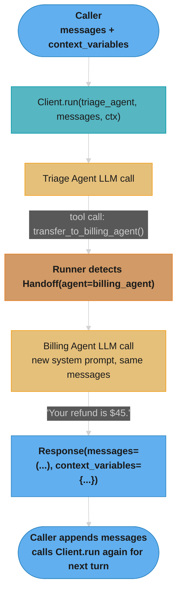
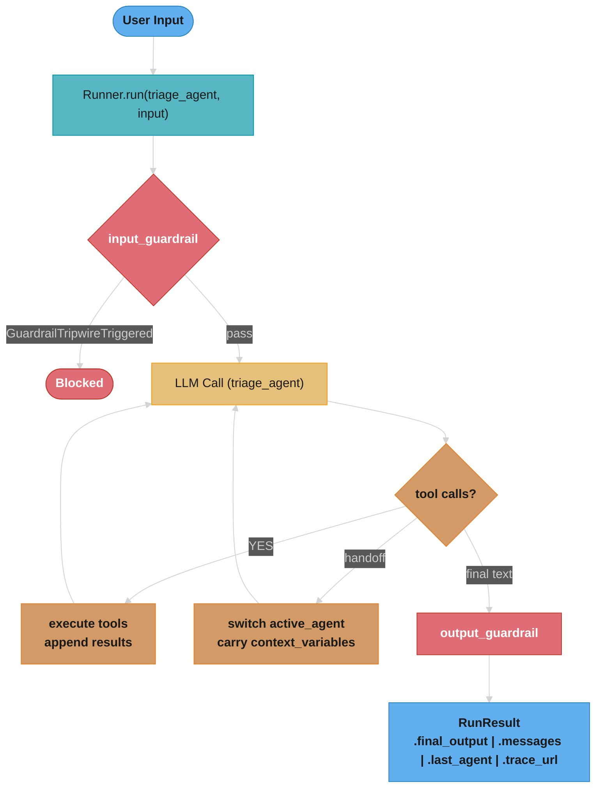

# OpenAI Swarm and Agents SDK — Deep Dive

---

## 1. Concept Overview

OpenAI Swarm (October 2024) and the OpenAI Agents SDK (March 2025) are frameworks for building multi-agent systems where multiple LLM-powered agents collaborate by handing off control to one another. The central primitive in both is the **Agent**: a named entity with a system prompt (instructions), a list of callable tools, and a list of agents it can transfer control to.

Swarm is an educational, synchronous, stateless library released as open source to demonstrate handoff patterns. The Agents SDK is the production successor — async, streaming, traceable, and equipped with guardrails and retry logic.

Both frameworks solve the same problem: a single LLM context window is not the right place to handle every subtask. Routing specialised work to specialised agents keeps prompts short, tools focused, and behaviour predictable.

This file covers the multi-agent handoff pattern itself; the framework-level Agents SDK deep dive (Runner internals, tracing, output_type) lives in [openai_agents_sdk.md](../agentic_frameworks/openai_agents_sdk.md).

---

## 2. Intuition

Think of a hospital emergency department. A triage nurse (Triage Agent) talks to every patient first. Based on symptoms she routes the patient to Cardiology (Billing Agent) or Neurology (Technical Agent). Each specialist has their own protocols (instructions), equipment (tools), and does not need to know the triage nurse's full history — only the relevant handoff note.

One-line analogy: Swarm / Agents SDK is a traffic cop that redirects callers to the right specialist counter, passing a sticky note (context variables) with each redirect.

Mental model:
- Agent = function with a personality and a list of colleagues it can call
- Handoff = return value that says "I am done; hand control to Agent X"
- Context variables = a shared clipboard any agent can read or write

Why it matters: Without structured handoffs, a single mega-prompt tries to handle billing, technical support, and sales simultaneously, leading to prompt bloat, hallucination, and poor specialisation. Handoffs enforce single-responsibility at the agent level.

Key insight: Handoffs are just tool calls in disguise. The LLM produces a function call whose return value is an Agent object instead of data. The runner interprets this and switches the active agent.

---

## 3. Core Principles

1. **Agent as first-class primitive.** An agent is defined by (name, instructions, tools, handoffs). Instructions are the system prompt. Tools are Python callables. Handoffs are other Agent objects the runner is allowed to transfer control to.

2. **Handoff via special return type.** When an agent wants to transfer, it calls a handoff function (auto-generated by the framework from the handoffs list). The runner detects the Handoff return and switches the active agent without another round-trip to the user.

3. **Context variables propagate.** A dict of context variables is threaded through every agent invocation. Any agent or tool can modify it. The next agent in the chain sees the updated dict.

4. **Stateless turns (Swarm) vs persistent runs (Agents SDK).** Swarm requires the caller to maintain and pass message history on every call. The Agents SDK maintains a RunResult that accumulates the full conversation internally across turns.

5. **Guardrails as cross-cutting concerns.** Input guardrails run before the LLM call; output guardrails run after. Either can raise a GuardrailTripwireTriggered exception to abort the run. This keeps safety logic out of agent instructions. Guardrail design beyond this SDK (NeMo Guardrails, Llama Guard) is covered in [Guardrails & Content Safety](../guardrails_and_content_safety/README.md).

6. **Routines encode business flows.** A routine is an ordered series of steps baked into an agent's instructions (e.g., "Step 1: greet. Step 2: qualify. Step 3: pitch. Step 4: close."). The LLM follows the routine like a script.

---

## 4. Types / Architectures / Strategies

### 4.1 Swarm Agent Primitive (2024)

```python
from swarm import Agent

agent = Agent(
    name="Triage",
    instructions="You are a triage agent. Route issues.",
    tools=[lookup_account],
    handoffs=[billing_agent, technical_agent],  # other Agent objects
)
```

`Client.run(agent, messages, context_variables)` is synchronous. Each call returns a Response containing new messages and updated context_variables. The caller must append messages and call again for multi-turn.

### 4.2 Agents SDK Agent Primitive (2025)

```python
from agents import Agent, Runner

agent = Agent(
    name="Triage",
    instructions="You are a triage agent. Route issues.",
    tools=[lookup_account],
    handoffs=[billing_agent, technical_agent],
    input_guardrails=[pii_guardrail],
    output_guardrail=toxicity_guardrail,
    model="gpt-4o",
)

result: RunResult = await Runner.run(agent, input="My bill is wrong")
```

Runner.run is async. RunResult exposes `final_output`, `messages`, `last_agent`, and a trace URL. Streaming is available via `Runner.run_streamed`.

### 4.3 Handoff Strategies

| Strategy | Description | Use Case |
|----------|-------------|----------|
| Triage → Specialist | One router agent dispatches to N specialist agents | Customer support, help desk |
| Chain | Agent A always hands off to Agent B then Agent C | Multi-step workflows |
| Hub and Spoke | Central orchestrator dispatches and receives returns | Research pipelines |
| Escalation | Specialist hands back up to supervisor on failure | Complex dispute resolution |
| Parallel (SDK only) | Runner spawns multiple agents concurrently | Report generation, data enrichment |

Hub-and-spoke is the same topology as the [orchestrator-worker pattern](orchestrator_worker_pattern.md), which has its own deep dive covering task ledgers and result aggregation.

### 4.4 Routines

A routine is a numbered list of steps in the agent's instructions. The agent works through them in order, calling tools as needed, and only hands off when the routine says to.

```
Instructions for Sales Agent:
1. Greet the customer by name using get_customer_name().
2. Ask one qualifying question about their pain point.
3. Present the relevant product using get_product_info().
4. Address objections. If unresolvable, call transfer_to_human().
5. Attempt to close. If successful, call create_order().
```

---

## 5. Architecture Diagrams

### 5.1 Swarm Request Lifecycle



### 5.2 Agents SDK Run Lifecycle



### 5.3 Context Variable Flow

```
ctx = {"customer_id": "C123", "plan": "pro", "issue_category": None}

Triage Agent
  calls lookup_account(ctx["customer_id"])  --> updates ctx["plan"] = "enterprise"
  handoff --> Billing Agent

Billing Agent
  reads ctx["plan"] = "enterprise"
  applies enterprise discount logic
  updates ctx["refund_amount"] = 45.00
  returns final answer
```

### 5.4 Guardrail Position

```
User message
    |
    v
[input_guardrail]  <-- runs BEFORE LLM; can block PII, injection attempts
    |
    v
LLM generates response
    |
    v
[output_guardrail] <-- runs AFTER LLM; can block toxic/off-policy output
    |
    v
Delivered to caller
```

---

## 6. How It Works — Detailed Mechanics

### 6.1 Swarm — Complete Customer Service Example

```python
# pip install git+https://github.com/openai/swarm.git (educational library, not production;
# never published to PyPI — the "swarm" package on PyPI is unrelated)
from swarm import Swarm, Agent

client = Swarm()  # wraps openai.OpenAI()

# --- Tool functions ---

def lookup_account(customer_id: str, context_variables: dict) -> str:
    """Simulate a DB lookup."""
    context_variables["plan"] = "enterprise"
    return f"Account {customer_id} found. Plan: enterprise."

def get_billing_history(context_variables: dict) -> str:
    return "Last invoice: $299 on 2026-04-01. Status: paid."

def reset_password(context_variables: dict) -> str:
    return "Password reset email sent to registered address."

# --- Agent definitions (forward refs resolved after all agents exist) ---

def transfer_to_billing():
    """Hand off to the billing specialist."""
    return billing_agent  # returns Agent object — Swarm detects this

def transfer_to_technical():
    """Hand off to the technical specialist."""
    return technical_agent

billing_agent = Agent(
    name="Billing Agent",
    instructions=(
        "You are a billing specialist. Answer billing questions using "
        "get_billing_history(). Be concise and empathetic."
    ),
    tools=[get_billing_history],
)

technical_agent = Agent(
    name="Technical Agent",
    instructions=(
        "You are a technical support specialist. Help with account access "
        "and technical issues using reset_password()."
    ),
    tools=[reset_password],
)

triage_agent = Agent(
    name="Triage Agent",
    instructions=(
        "You are the first point of contact. "
        "1. Call lookup_account with the customer_id from context_variables. "
        "2. If the issue is about billing or invoices, transfer to Billing Agent. "
        "3. If the issue is about passwords or technical problems, transfer to Technical Agent. "
        "4. Otherwise, answer directly."
    ),
    tools=[lookup_account, transfer_to_billing, transfer_to_technical],
)

# --- Run ---

context = {"customer_id": "C789"}
messages = [{"role": "user", "content": "My invoice is wrong, I was charged twice."}]

response = client.run(
    agent=triage_agent,
    messages=messages,
    context_variables=context,
)

print(response.messages[-1]["content"])
# Output: "I've checked your account (enterprise plan). Your last invoice was $299 on
#          2026-04-01 and shows as paid. Could you clarify which charge looks duplicated?"
print(response.context_variables)
# {"customer_id": "C789", "plan": "enterprise"}
```

### 6.2 Agents SDK — Async Production Version

```python
# pip install openai-agents
import asyncio
from agents import Agent, Runner, RunContextWrapper, GuardrailFunctionOutput
from agents import input_guardrail, output_guardrail
from agents.exceptions import GuardrailTripwireTriggered
from dataclasses import dataclass

# --- Context type (typed context variables) ---

@dataclass
class SupportContext:
    customer_id: str
    plan: str = "free"
    refund_amount: float = 0.0

# --- Guardrails ---

@input_guardrail
async def pii_guardrail(
    ctx: RunContextWrapper[SupportContext], agent: Agent, input: str
) -> GuardrailFunctionOutput:
    """Block messages containing raw credit card numbers."""
    import re
    if re.search(r"\b\d{4}[\s-]?\d{4}[\s-]?\d{4}[\s-]?\d{4}\b", input):
        return GuardrailFunctionOutput(
            output_info="credit_card_detected",
            tripwire_triggered=True,  # raises GuardrailTripwireTriggered
        )
    return GuardrailFunctionOutput(output_info="ok", tripwire_triggered=False)

@output_guardrail
async def length_guardrail(
    ctx: RunContextWrapper[SupportContext], agent: Agent, output: str
) -> GuardrailFunctionOutput:
    """Warn if agent response is suspiciously short (< 20 chars)."""
    if len(output) < 20:
        return GuardrailFunctionOutput(output_info="too_short", tripwire_triggered=True)
    return GuardrailFunctionOutput(output_info="ok", tripwire_triggered=False)

# --- Tools ---

async def lookup_account(ctx: RunContextWrapper[SupportContext]) -> str:
    # In production: await db.fetch(ctx.context.customer_id)
    ctx.context.plan = "enterprise"
    return f"Customer {ctx.context.customer_id}: enterprise plan, active."

async def get_billing_history(ctx: RunContextWrapper[SupportContext]) -> str:
    return "Invoice #1042: $299 on 2026-04-01 (paid). Invoice #1041: $299 on 2026-03-01 (paid)."

async def issue_refund(
    amount: float, ctx: RunContextWrapper[SupportContext]
) -> str:
    ctx.context.refund_amount = amount
    return f"Refund of ${amount:.2f} initiated. ETA: 3-5 business days."

async def reset_password(ctx: RunContextWrapper[SupportContext]) -> str:
    return "Password reset email sent."

# --- Agent definitions ---

billing_agent = Agent[SupportContext](
    name="Billing Agent",
    model="gpt-4o",
    instructions=(
        "You are a billing specialist. "
        "Use get_billing_history() to review charges. "
        "Use issue_refund(amount) if a refund is warranted. "
        "Be empathetic and concise. Do not discuss technical issues."
    ),
    tools=[get_billing_history, issue_refund],
    output_guardrail=length_guardrail,
)

technical_agent = Agent[SupportContext](
    name="Technical Agent",
    model="gpt-4o",
    instructions=(
        "You are a technical support specialist. "
        "Use reset_password() for access issues. "
        "Do not discuss billing."
    ),
    tools=[reset_password],
    output_guardrail=length_guardrail,
)

triage_agent = Agent[SupportContext](
    name="Triage Agent",
    model="gpt-4o",
    instructions=(
        "You are the first point of contact for customer support. "
        "Step 1: Call lookup_account() to load the customer record. "
        "Step 2: Classify the issue. "
        "  - Billing / invoice / charge / refund -> transfer to Billing Agent. "
        "  - Password / login / technical -> transfer to Technical Agent. "
        "  - General -> answer directly. "
        "Step 3: Transfer using the appropriate handoff."
    ),
    tools=[lookup_account],
    handoffs=[billing_agent, technical_agent],
    input_guardrails=[pii_guardrail],
)

# --- Runner ---

async def handle_customer_query(customer_id: str, message: str) -> None:
    ctx = SupportContext(customer_id=customer_id)
    try:
        result = await Runner.run(
            starting_agent=triage_agent,
            input=message,
            context=ctx,
            max_turns=10,  # safety limit; default is 10
        )
        print(f"Final answer: {result.final_output}")
        print(f"Handled by: {result.last_agent.name}")
        print(f"Refund initiated: ${ctx.refund_amount:.2f}")
        print(f"Trace: {result.trace_url}")
    except GuardrailTripwireTriggered as e:
        print(f"Request blocked by guardrail: {e.guardrail_result.output.output_info}")

asyncio.run(handle_customer_query("C789", "I was charged twice on my last invoice."))
```

### 6.3 Streaming Example

```python
async def stream_response(customer_id: str, message: str) -> None:
    ctx = SupportContext(customer_id=customer_id)
    async with Runner.run_streamed(triage_agent, message, context=ctx) as stream:
        async for event in stream.stream_events():
            if event.type == "raw_response_event":
                # token-level streaming
                print(event.data.delta, end="", flush=True)
            elif event.type == "agent_updated_stream_event":
                print(f"\n[Switched to: {event.new_agent.name}]")
    print(f"\n[Final agent: {stream.final_output}]")
```

### 6.4 Handoff Mechanics — Internal Flow

```
1. triage_agent LLM produces:
   {"tool_calls": [{"function": {"name": "transfer_to_billing_agent", "arguments": "{}"}}]}

2. Runner recognises "transfer_to_billing_agent" as a registered Handoff function
   (auto-generated from triage_agent.handoffs = [billing_agent]).

3. Runner sets active_agent = billing_agent.
   It does NOT append a tool result to messages; instead it appends:
   {"role": "tool", "content": "Transferred to Billing Agent", "tool_call_id": "..."}

4. Runner calls billing_agent LLM with:
   - system: billing_agent.instructions
   - messages: full conversation history so far (including triage turns)
   - context: same SupportContext object (shared by reference)

5. billing_agent completes the conversation and returns a text response.

6. Runner sets RunResult.last_agent = billing_agent, returns to caller.
```

---

## 7. Real-World Examples

### 7.1 OpenAI's Own Customer Support (dogfooding)

OpenAI built the Swarm pattern before releasing it publicly, using it internally for routing support tickets. A triage agent reads the ticket subject and first message, then routes to billing, safety, API technical, or enterprise specialist agents. Each specialist has a focused system prompt of ~200 words rather than a shared 1,200-word mega-prompt.

### 7.2 E-Commerce Order Management

Triage Agent classifies messages: returns, shipping, product questions. Order Status Agent calls the OMS API. Returns Agent initiates RMA and calls the refund API. Shipping Agent calls the carrier API for tracking. Context variables carry `order_id` and `customer_tier` across all three agents.

### 7.3 Sales Routine Pipeline

A sales development agent runs a 5-step routine: lookup lead → enrich with firmographic data → draft personalised opener → check opt-out list → send or flag for human review. Each step calls a tool; the routine never hands off (one agent, multiple tools). The Agents SDK traces each step in the OpenAI dashboard so the sales team can audit what was sent.

### 7.4 Code Review Multi-Agent Chain

PR arrives. Triage Agent determines language and scope. Style Agent checks formatting and linting output. Security Agent scans for OWASP top-10 patterns. Performance Agent flags O(n^2) loops. Each specialist agent appends findings to context variables. Aggregator Agent compiles the final review comment from all findings.

---

## 8. Tradeoffs

### 8.1 Swarm vs Agents SDK

| Dimension | Swarm (2024) | Agents SDK (2025) |
|-----------|--------------|-------------------|
| Status | Educational / unmaintained | Production, actively maintained |
| Async | No (synchronous) | Yes (asyncio native) |
| Streaming | No | Yes (run_streamed) |
| Persistence | Caller manages messages | RunResult manages internally |
| Tracing | No | OpenAI dashboard trace URL |
| Guardrails | No | input_guardrail, output_guardrail |
| Retry logic | No | Yes (configurable) |
| Typed context | dict (untyped) | Generic[ContextType] dataclass |
| Install | pip install git+https://github.com/openai/swarm.git | pip install openai-agents |
| Max turns safeguard | No | max_turns param (default 10) |

### 8.2 Handoffs vs Tool Calls

| Dimension | Handoff | Tool Call |
|-----------|---------|-----------|
| Returns | Agent object | Data (str / dict) |
| Effect | Changes active agent | Appends tool result to messages |
| System prompt | Switches to new agent's instructions | Stays on current agent |
| Use case | Route to specialist | Fetch data, call API |
| Context sharing | Shared by reference | Shared by reference |

### 8.3 Routines vs Handoffs

| Dimension | Routine | Handoff |
|-----------|---------|---------|
| Complexity | Instructions as numbered steps | Separate Agent objects |
| Specialisation | One agent, many steps | Multiple agents, one step each |
| Prompt isolation | No — all steps in one prompt | Yes — each agent has own prompt |
| Debugging | Harder (one trace) | Easier (per-agent traces) |
| Best for | Linear workflows, scripted flows | Domain specialisation, routing |

---

## 9. When to Use / When NOT to Use

### Use Swarm when:
- Learning or prototyping the handoff pattern in under 100 lines
- Teaching multi-agent concepts to a team
- No async requirements
- Throw-away script that will not go to production

### Use Agents SDK when:
- Building a production customer-facing system
- Need streaming for perceived responsiveness (first token under 500ms)
- Need audit trails (compliance, GDPR, SOC2 require traces)
- Need guardrails to enforce safety or business policy
- Running more than one agent concurrently

### Do NOT use either when:
- A single well-crafted prompt with tools suffices (adds unnecessary complexity)
- Latency budget is under 300ms end-to-end (each handoff adds ~200-400ms per LLM call)
- You need deterministic control flow — use a state machine or workflow engine instead
- Your team has no LLM ops experience; the failure modes (infinite loops, guardrail bypasses) are non-trivial

---

## 10. Common Pitfalls

### Pitfall 1: Forgetting context_variables is passed by value in Swarm (dict copy issue)

**Broken:**
```python
# Swarm — tool modifies a nested object, caller never sees the change
def update_nested(context_variables: dict) -> str:
    context_variables["user"]["plan"] = "pro"   # mutates nested dict
    return "Updated"

context = {"user": {"plan": "free"}}
response = client.run(agent, messages, context_variables=context)
# context["user"]["plan"] is still "free" if Swarm shallow-copies the top-level dict
print(context["user"]["plan"])  # "free" -- bug
```

**Fixed:**
```python
# Store flat keys; avoid nested objects in context_variables
def update_plan(context_variables: dict) -> str:
    context_variables["plan"] = "pro"   # top-level key -- always propagated
    return "Updated"

context = {"customer_id": "C1", "plan": "free"}
response = client.run(agent, messages, context_variables=context)
# Swarm merges response.context_variables back; caller must use response.context_variables
context = response.context_variables
print(context["plan"])  # "pro" -- correct
```

### Pitfall 2: Infinite handoff loop

**Broken:**
```python
billing_agent = Agent(
    name="Billing",
    instructions="If unsure, transfer to Triage.",
    tools=[transfer_to_triage],   # transfers back to triage
)
triage_agent = Agent(
    name="Triage",
    instructions="If billing issue, transfer to Billing.",
    tools=[transfer_to_billing],
)
# Triage -> Billing -> Triage -> Billing ... until max_turns or token limit
```

**Fixed:**
```python
billing_agent = Agent(
    name="Billing",
    instructions=(
        "Handle billing questions directly. "
        "If you truly cannot resolve the issue, say: "
        "'I need to escalate this to a human agent.' "
        "Do NOT transfer back to Triage."
    ),
    # No transfer_to_triage tool
)
# And in Runner:
result = await Runner.run(triage_agent, input, max_turns=8)
# max_turns prevents runaway loops; raises MaxTurnsExceeded after 8 turns
```

### Pitfall 3: Guardrail that re-calls LLM inside itself (causes recursion)

**Broken:**
```python
@input_guardrail
async def classify_guardrail(ctx, agent, input):
    # Calls another agent to classify -- triggers another Runner.run inside a guardrail
    result = await Runner.run(classifier_agent, input)  # WRONG
    if "harmful" in result.final_output:
        return GuardrailFunctionOutput(tripwire_triggered=True, ...)
```

**Fixed:**
```python
import re

@input_guardrail
async def classify_guardrail(ctx, agent, input):
    # Use a fast heuristic or a direct openai.chat call, not Runner.run
    bad_patterns = [r"\b(hack|exploit|bypass)\b"]
    for pattern in bad_patterns:
        if re.search(pattern, input, re.IGNORECASE):
            return GuardrailFunctionOutput(
                output_info="policy_violation",
                tripwire_triggered=True,
            )
    return GuardrailFunctionOutput(output_info="ok", tripwire_triggered=False)
```

### Pitfall 4: Not awaiting async tools in Agents SDK

**Broken:**
```python
def lookup_account(ctx: RunContextWrapper[SupportContext]) -> str:
    import httpx
    response = httpx.get(f"https://api.example.com/accounts/{ctx.context.customer_id}")
    # Synchronous HTTP call blocks the event loop -- kills throughput
    return response.json()["plan"]
```

**Fixed:**
```python
async def lookup_account(ctx: RunContextWrapper[SupportContext]) -> str:
    import httpx
    async with httpx.AsyncClient() as client:
        response = await client.get(
            f"https://api.example.com/accounts/{ctx.context.customer_id}",
            timeout=5.0,
        )
        response.raise_for_status()
        return response.json()["plan"]
```

---

## 11. Technologies & Tools

| Tool / Library | Role | Notes |
|----------------|------|-------|
| openai-agents | Agents SDK core | `pip install openai-agents`; MIT license |
| swarm | Educational handoff library | `pip install git+https://github.com/openai/swarm.git` (not on PyPI); no longer maintained |
| openai Python SDK | Underlying LLM calls | Both frameworks wrap openai.AsyncOpenAI |
| asyncio | Async runtime | Required by Agents SDK |
| httpx | Async HTTP in tools | Preferred over requests in async context |
| pydantic | Structured tool outputs | Agents SDK supports pydantic model as output_type |
| OpenAI dashboard | Trace viewer | Trace URL in RunResult; requires API key |
| Langfuse / Arize | Third-party tracing | Hook into Agents SDK via custom span exporters |
| pytest-asyncio | Testing async agents | `@pytest.mark.asyncio` for Runner.run tests |
| tenacity | Retry logic for tools | Wrap tool functions with @retry for flaky APIs |

---

## 12. Interview Questions with Answers

**Q: What is the difference between OpenAI Swarm and the Agents SDK?**
Swarm is a synchronous, stateless, educational prototype released in October 2024 to demonstrate the handoff pattern; it is not maintained for production. The Agents SDK (March 2025) is the production successor: async, streaming, typed context, guardrails, tracing to the OpenAI dashboard, retry logic, and a max_turns safety limit.

**Q: How does a handoff actually work under the hood?**
The LLM generates a function call whose name matches a transfer function (e.g., "transfer_to_billing_agent"). The runner detects that this function is registered as a handoff rather than a data-returning tool. It switches the active agent to billing_agent, appends a tool message saying "Transferred", and starts a new LLM call using billing_agent's instructions as the system prompt — while keeping the full conversation history.

**Q: What are context variables and how do they persist across handoffs?**
Context variables are a dict (Swarm) or a typed dataclass (Agents SDK) that is passed by reference to every agent invocation and every tool call. Because it is passed by reference, any agent or tool that mutates it is immediately visible to the next agent. In Swarm, the caller must read response.context_variables after each Client.run call and pass it back on the next call.

**Q: What is a routine in the Swarm / Agents SDK pattern?**
A routine is a numbered list of steps embedded in an agent's instructions that guides the LLM through a predefined conversation flow (e.g., greet → qualify → pitch → close). The LLM follows the steps in order, calling tools at each step, and only hands off when the routine explicitly says to. Routines are useful for linear, scripted workflows where specialisation is not needed.

**Q: When should you use a routine instead of separate agents with handoffs?**
Use a routine when the workflow is linear, steps share the same domain context, and prompt isolation is not critical. Use separate agents with handoffs when steps require different specialised knowledge (reducing prompt length and hallucination risk), different tool sets, or when you need per-agent traceability.

**Q: What is max_turns and why does it matter?**
max_turns is a parameter to Runner.run (default 10) that limits the total number of LLM calls per run, counting tool calls and handoffs. Without it, a pair of agents that hand off to each other could loop indefinitely, consuming unbounded tokens and cost. After max_turns is exceeded, the SDK raises MaxTurnsExceeded.

**Q: How do input and output guardrails differ?**
Input guardrails run before the LLM receives the user message; they can inspect and block PII, prompt injection, or policy violations. Output guardrails run after the LLM produces its response; they can block toxic, off-topic, or malformed outputs. Both return GuardrailFunctionOutput; setting tripwire_triggered=True raises GuardrailTripwireTriggered and aborts the run.

**Q: Can a guardrail call another LLM?**
You should avoid calling Runner.run inside a guardrail because it causes nested runs and can trigger guardrails recursively. Instead, use a direct openai.chat.completions.create call with a fast, cheap model (e.g., gpt-4o-mini), a regex heuristic, or a local classifier. The latency budget for a guardrail is typically under 200ms.

**Q: How does streaming work in the Agents SDK?**
Runner.run_streamed returns an async context manager that yields events. Event types include raw_response_event (individual tokens), agent_updated_stream_event (handoff occurred), and tool_call_output_item (tool result). The caller can display tokens in real time while the runner continues processing.

**Q: What happens to conversation history when a handoff occurs?**
The full message history is preserved and passed to the new agent. The new agent sees all previous turns, including the triage agent's messages and tool results. The only change is the system prompt, which switches to the specialist agent's instructions. This allows the specialist to understand the context of the conversation without re-asking questions.

**Q: How do you test an agent that makes handoffs?**
Use Runner.run in a pytest-asyncio test with a FakeModel or by patching openai.AsyncOpenAI to return canned responses. Assert on result.last_agent.name to confirm the correct handoff occurred, and on context attributes to confirm tools mutated context correctly. Test the guardrail separately by calling it directly with a RunContextWrapper mock.

**Q: What is the token cost implication of multi-agent handoffs?**
Each handoff triggers a new LLM call. The new call includes the full conversation history, so token cost grows linearly with conversation length. A 3-agent chain on a 10-turn conversation may pay 3x the token cost of a single-agent approach. Mitigation: summarise earlier turns before handoff, or use a cheaper model (gpt-4o-mini at $0.15/1M input tokens) for triage and reserve gpt-4o ($2.50/1M) for specialists.

**Q: How would you prevent a triage agent from looping back to itself?**
Remove the transfer_to_triage tool from specialist agents entirely. Specialists should have an escape hatch that says "tell the user you cannot help and they should contact human support" — not a transfer back to triage. Set max_turns=8 as a circuit breaker. Log a warning if last_agent == starting_agent after more than 3 turns.

**Q: What is output_type in the Agents SDK and how does it differ from a guardrail?**
output_type is a pydantic model that forces the LLM's final response to conform to a JSON schema (structured output). The runner validates the output against the schema and retries if validation fails. A guardrail, in contrast, can inspect free-text output for policy violations but does not enforce schema. Use output_type for structured data extraction; use guardrails for safety and policy enforcement.

**Q: How does the Agents SDK integrate with OpenAI's tracing dashboard?**
Every Runner.run call automatically creates a trace on the OpenAI platform. The trace URL is available at result.trace_url. The trace shows each LLM call, tool call, handoff, and guardrail evaluation with latency, token counts, and inputs/outputs. No additional instrumentation code is required; it is on by default when using the openai-agents library with a valid API key.

**Q: What is the recommended model size split for triage vs specialist agents in production?**
Use gpt-4o-mini (fast, cheap: ~$0.15/1M input) for triage since it only needs to classify intent and route. Use gpt-4o or o1-mini for specialists that need reasoning, tool use, or domain knowledge. This split reduces average cost by 60-70% versus using gpt-4o for all agents, while keeping accuracy high where it matters.

---

## 13. Best Practices

1. **Keep agent instructions under 500 words.** Longer instructions increase hallucination risk and make the agent harder to debug. Move domain knowledge into tool return values.

2. **Use typed context (dataclass) in the Agents SDK, not raw dicts.** Type safety prevents KeyError bugs when agents read each other's context mutations. Use @dataclass with default values for optional fields.

3. **Set max_turns explicitly.** Never rely on the default of 10 for production. Analyse your longest expected workflow (e.g., 3 handoffs × 2 turns each = 6) and set max_turns = workflow_max + 2.

**What the formula is telling you.** "Size the turn budget from the shape of your worst legitimate
workflow, then add a small fixed slack — not from a number that felt safe."

```
  workflow_max = num_handoffs x turns_per_handoff
  max_turns    = workflow_max + 2
```

| Symbol | What it is |
|--------|------------|
| `num_handoffs` | How many agent-to-agent transfers the longest real path makes |
| `turns_per_handoff` | Turns each agent burns before transferring. Typically 2: act, then hand off |
| `+ 2` | Slack for one retry or one clarifying exchange. Not a safety factor, a repair allowance |
| `max_turns` | Hard stop. Exceeding it aborts the run |

**Walk one example.** The stated workflow, and the latency it implies:

```
  3 handoffs x 2 turns = 6 turns   ->  max_turns = 6 + 2 = 8

  each turn is one LLM call at ~200-400 ms:
    typical path  : 6 turns x 200 ms = 1.2 s
    worst allowed : 8 turns x 400 ms = 3.2 s   <- matches the case study's 3.2 s average
```

Both failure directions cost something real. Set it too low and legitimate long conversations
abort mid-flight — the user sees a truncated session, not an error you can explain. Set it too
high (the case study ran `max_turns=12`, well above the `+2` rule) and a loop between two agents
that keep transferring to each other burns 12 LLM calls before anything stops it. The case study
recorded 12 turns firing 0.3% of the time and traced every instance to a user repeating the same
question — a real signal that a cheaper detector, not a bigger budget, was the fix.

This is why best practice 4 ("design handoffs as one-way") is the load-bearing companion to this
one. In a directed acyclic handoff graph, `num_handoffs` is bounded by the graph's longest path
and `workflow_max` is a number you can actually compute. Allow cycles and there is no longest
path — `max_turns` stops being a budget derived from the design and becomes the only thing
standing between you and an unbounded bill.

4. **Design handoffs as one-way.** Specialists should never transfer back to triage or to each other unless you have explicitly audited the graph for cycles. A directed acyclic handoff graph is easiest to reason about.

5. **Write a guardrail for every external input surface.** Customer-facing agents must have an input_guardrail for PII (credit card numbers, SSNs) and prompt injection. The guardrail should run in under 100ms using regex or a fast classifier.

6. **Test handoffs with mock LLM responses.** Do not call the real OpenAI API in unit tests. Patch the underlying client to return a canned tool call for the handoff, then assert on result.last_agent.name.

7. **Log context at the end of each run.** The final context state is a rich audit trail. In regulated industries (finance, healthcare) store context.model_dump() alongside the trace URL for compliance.

8. **Use routines for scripted, linear flows; use handoffs for domain routing.** A sales script is a routine (one agent, sequential steps). Customer support routing is a handoff graph (multiple specialist agents). Mixing the two leads to bloated agents with too many responsibilities.

9. **Cap specialist agent tool lists at 8-10 tools.** Beyond 10 tools, the LLM struggles to choose correctly. Split into sub-agents if a specialist's tool list grows beyond this.

10. **Handle MaxTurnsExceeded gracefully.** Catch the exception, log the partial result, and return a user-facing message like "This request is taking longer than expected. A human agent will follow up." Never surface the raw exception to the end user.

---

## 14. Case Study

### Customer Support Platform: Triage + Billing + Technical Agents

**Company:** A B2B SaaS company with 50,000 customers, receiving 3,000 support tickets per day. Previous single-agent approach used a 1,400-word system prompt that hallucinated billing details and forgot technical troubleshooting steps as the conversation grew.

**Problem:**
- Single agent had a 14% hallucination rate on billing questions (wrong invoice amounts)
- Average first-response latency: 8 seconds (large prompt + long context)
- No audit trail for GDPR compliance requests
- 22% of conversations required human escalation due to off-topic answers

**Architecture:**

```
User
 |
 v
Triage Agent (gpt-4o-mini, ~180-word instructions)
 |  tools: [lookup_account, classify_intent]
 |  input_guardrail: [pii_guardrail, injection_guardrail]
 |
 +--billing issue?--> Billing Agent (gpt-4o, ~220-word instructions)
 |                      tools: [get_invoices, issue_refund, get_payment_methods]
 |                      output_guardrail: [amount_sanity_guardrail]  <-- blocks refunds > $10,000
 |
 +--technical issue?-> Technical Agent (gpt-4o, ~200-word instructions)
                        tools: [reset_password, check_service_status, create_ticket]
                        output_guardrail: [length_guardrail]
```

**Implementation highlights:**

Context dataclass carried `customer_id`, `plan`, `account_age_days`, `issue_category`, `refund_amount`, and `ticket_id`. The billing agent's amount_sanity_guardrail blocked any refund above $10,000 (max plan value), requiring human approval via create_ticket.

The triage agent's classify_intent tool called a local regex + keyword model (latency: 12ms) rather than a second LLM call, keeping triage under 800ms total.

All runs used Runner.run with max_turns=12. Trace URLs were stored in the CRM alongside the ticket, satisfying the GDPR audit requirement.

**Results after 30 days:**
- Hallucination rate on billing: 14% → 1.8% (billing agent has focused 220-word prompt + real invoice data from tool)
- Average first-response latency: 8s → 3.2s (gpt-4o-mini for triage, smaller prompt for specialists)
- Human escalation rate: 22% → 9%
- Average cost per conversation: $0.021 → $0.009 (mix of mini for triage, gpt-4o only for specialists)
- GDPR audit requests satisfied in < 2 minutes (trace URL lookup in CRM)

**In plain terms.** "Every one of these percentages is a rate, and a rate only becomes a
decision once you multiply it by the 3,000 tickets a day that actually flow through it."

Percentages hide magnitude. The same 3,000/day multiplier turns each result line into a number
you can take to a budget or a staffing meeting, which is the only form in which any of these
improvements is arguable.

| Symbol | What it is |
|--------|------------|
| `V` | Ticket volume. 3,000 per day here |
| `rate_before` / `rate_after` | The measured fraction, e.g. 0.14 → 0.018 hallucination |
| `V x rate` | Tickets per day actually affected |
| `cost_per_conv` | Blended model spend for one conversation, $0.021 → $0.009 |
| Relative reduction | `(before - after) / before` — the number quoted in the results list |

**Walk one example.** All four headline results, converted to daily units:

```
  hallucinated billing answers : 3,000 x 0.140 =  420/day
                                 3,000 x 0.018 =   54/day    -> 366 fewer wrong answers/day

  human escalations            : 3,000 x 0.220 =  660/day
                                 3,000 x 0.090 =  270/day    -> 390 fewer handoffs to staff/day

  model spend                  : 3,000 x $0.021 = $63.00/day
                                 3,000 x $0.009 = $27.00/day
                                 saving          = $36.00/day = $13,140/year

  first-response latency       : 8.0 s -> 3.2 s   = 60% faster, on every one of the 3,000

  relative reductions: cost 57.1%   latency 60.0%   escalation 59.1%   hallucination 87.1%
```

Note which number is *not* impressive in isolation and is decisive at volume: `max_turns=12` fired
0.3% of the time, which sounds like noise until it is `3,000 x 0.003 = 9 conversations per day`
hitting a hard stop — nine users per day getting a truncated session. Driving it to 0.05% leaves
1.5/day. A rate below 1% is exactly the regime where per-ticket multiplication changes whether
something is worth engineering.

The $13,140/year is also the honest framing of the cost win. A 57% reduction sounds like the
headline, but the absolute figure is small relative to an engineer's time — which is why the
lessons list ranks the *hallucination* and *escalation* wins above it. 390 fewer human escalations
per day is the result that pays for the architecture; the token savings are a rounding error
beside it.

**Lessons learned:**
1. The amount_sanity_guardrail caught 3 production incidents in the first week where the LLM hallucinated a refund amount 10x larger than the actual charge.
2. The biggest latency win came from switching triage to gpt-4o-mini, not from architectural changes.
3. Routine-style instructions (numbered steps) in the triage agent reduced off-topic transfers by 40% versus free-form instructions.
4. max_turns=12 was triggered 0.3% of the time; all cases were users re-asking the same question repeatedly. Adding a "repeated question" detector in the triage agent's instructions reduced this to 0.05%.
