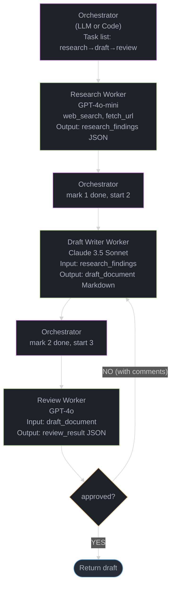
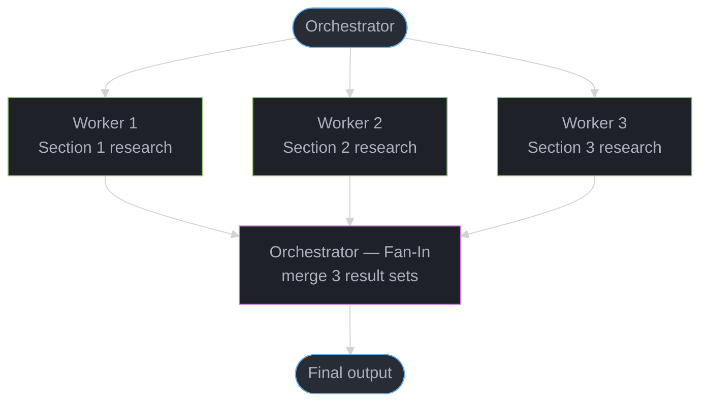
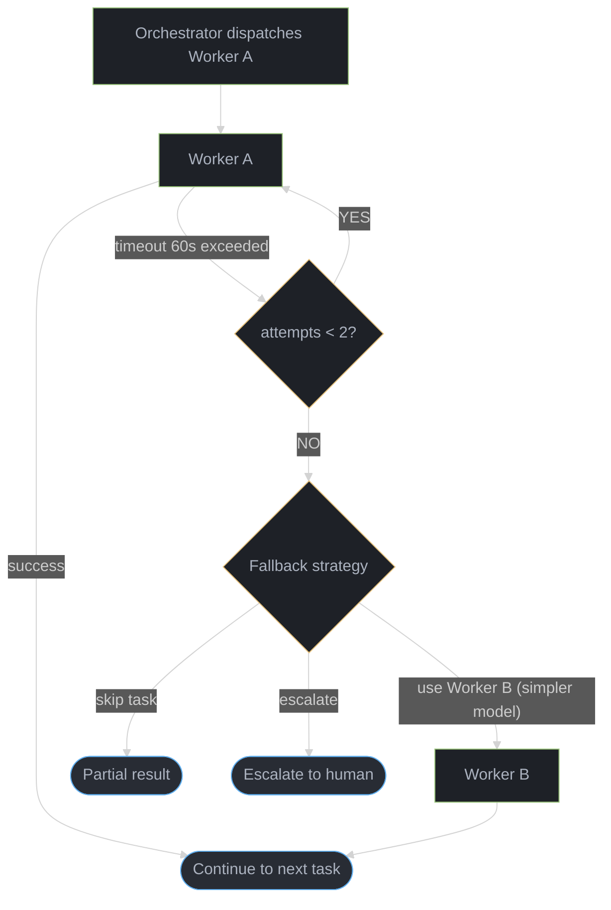
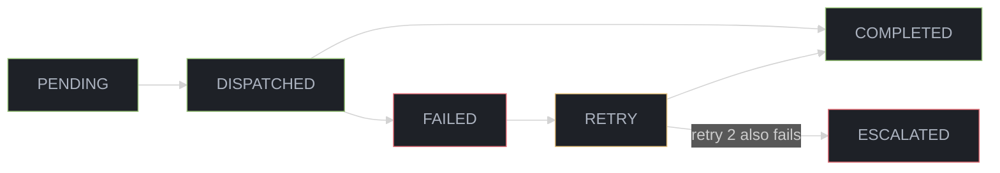

# Orchestrator-Worker Pattern — Deep Dive

---

## 1. Concept Overview

The orchestrator-worker pattern is a multi-agent architecture in which a central orchestrator agent dynamically decomposes a complex task into sub-tasks and delegates each to specialized worker agents. The orchestrator maintains a task list, tracks worker results, handles failures, and assembles a final output from partial results. Workers are narrow, focused, and stateless; the orchestrator carries all coordination state.

This pattern maps directly to how large software engineering teams operate: a tech lead (orchestrator) defines tickets and assigns them to engineers (workers) who specialize in backend, frontend, QA, or documentation. The tech lead integrates the pull requests into a coherent release.

The key engineering insight is that a single LLM context window is a fixed resource. Breaking a 50,000-token research task into ten 5,000-token sub-tasks — each run by a focused worker with clean context — produces better output than cramming everything into one call. Anthropic's internal multi-agent research systems demonstrated this concretely: a task that took a single agent more than one hour was completed in under 15 minutes by an orchestrator with parallel workers, with higher factual accuracy.

---

## 2. Intuition

One-line analogy: The orchestrator is a project manager who writes the sprint board, assigns each ticket to the right specialist, and merges the PRs — workers just close tickets.

Mental model: Imagine planning a 200-page research report. A single expert could write every section sequentially (exhausting, slow, context degrades). Alternatively, an editor (orchestrator) creates an outline, assigns each chapter to a subject-matter expert (worker), collects drafts, and edits them into a coherent whole. Each expert works with focused domain context. The editor does not need to know quantum chemistry to coordinate a chapter on it — only to recognize whether the output is complete and well-formed.

Why it matters: Most real-world tasks that benefit from AI exceed a comfortable single-agent context window or reasoning budget. The orchestrator-worker pattern is the primary mechanism for scaling agent capability beyond these limits.

Key insight: The orchestrator's intelligence determines system-level quality. A weak orchestrator with strong workers produces incoherent results; a strong orchestrator with mediocre workers still produces acceptable output. Always use your highest-capability model for the orchestrator.

---

## 3. Core Principles

- **Separation of planning and execution**: The orchestrator plans; workers execute. Workers should never re-plan unless the orchestrator explicitly delegates planning authority.
- **Task idempotency**: Each worker call should be idempotent — re-running a worker with the same input should produce equivalent output. This enables safe retries.
- **Result schema enforcement**: Workers return structured outputs (JSON, typed dictionaries) rather than free-form prose. The orchestrator must be able to programmatically consume worker results.
- **Stateful orchestrator, stateless workers**: Workers receive their full context in each call. The orchestrator accumulates state across the entire task.
- **Graceful partial completion**: If some workers fail, the orchestrator assembles the best possible output from successful workers rather than failing entirely.
- **Auditability**: Every task dispatch and every worker result is logged with timestamps, agent IDs, and the full content exchanged.

---

## 4. Types / Architectures / Strategies

### 4.1 LLM Orchestrator (Dynamic Planning)

The orchestrator is itself an LLM. It reasons about the task, generates the sub-task list dynamically, evaluates worker outputs, and decides whether additional tasks are needed. This is the most flexible form but also the most expensive: every orchestrator decision is an LLM call.

Use when: tasks are unpredictable, sub-task count is not known upfront, or the orchestrator needs to adapt based on intermediate results.

Cost profile: 1 orchestrator call to plan + N worker calls + 1 orchestrator call to integrate = N+2 LLM calls minimum; typically N+5 to N+10 including error recovery loops.

### 4.2 Deterministic Orchestrator (Code-Based)

The orchestrator is Python/Java code that applies a fixed workflow: parse the input, generate a predefined task list, dispatch workers, collect results. Workers are LLMs; the orchestrator is not.

Use when: the task decomposition is well-understood and static (e.g., "always extract entities, then classify, then summarize"), latency and cost matter, and you want deterministic behavior.

Cost profile: N worker calls only. Significantly cheaper and faster.

### 4.3 Hybrid: Code Router + LLM Orchestrator

The top-level routing is deterministic code; within each branch, an LLM orchestrator handles dynamic sub-task planning. Common in production systems where the top-level pipeline is stable but individual stages require adaptive reasoning.

### 4.4 Parallel vs Sequential Dispatch

- **Parallel dispatch**: The orchestrator fires all workers simultaneously. Wall-clock time = slowest worker. Requires workers to be independent. Best for: research tasks, data enrichment, multi-section document generation.
- **Sequential dispatch**: Worker N receives output from Worker N-1. Each worker's input depends on the prior worker's output. Best for: code generation (requirements → design → code → tests), where later stages build on earlier artifacts.
- **Hybrid (DAG)**: Some workers are parallel; some are sequential. Model the task as a directed acyclic graph. LangGraph implements this natively.

---

## 5. Architecture Diagrams

### Basic Orchestrator-Worker (Sequential)



### Parallel Dispatch (Fan-Out / Fan-In)



### Error Recovery Loop



### Task Ledger State Machine



Task Ledger (orchestrator internal state):
```
task_id | description          | worker    | status    | result
--------|----------------------|-----------|-----------|-------
T001    | search arxiv papers  | research  | COMPLETED | {...}
T002    | summarize paper 1    | summary   | COMPLETED | {...}
T003    | summarize paper 2    | summary   | FAILED    | null
T004    | merge summaries      | writer    | PENDING   | null
```

---

## 6. How It Works — Detailed Mechanics

### Orchestrator as LLM (Dynamic Planning)

```python
from __future__ import annotations
import json
import asyncio
from typing import Any
from dataclasses import dataclass, field
from anthropic import AsyncAnthropic

client = AsyncAnthropic()

@dataclass
class Task:
    task_id: str
    description: str
    depends_on: list[str] = field(default_factory=list)
    status: str = "pending"   # pending | dispatched | completed | failed
    result: Any = None
    attempts: int = 0

@dataclass
class TaskLedger:
    tasks: dict[str, Task] = field(default_factory=dict)

    def add(self, task: Task) -> None:
        self.tasks[task.task_id] = task

    def ready_tasks(self) -> list[Task]:
        """Return tasks whose dependencies are all completed."""
        return [
            t for t in self.tasks.values()
            if t.status == "pending" and all(
                self.tasks[dep].status == "completed"
                for dep in t.depends_on
            )
        ]

    def all_done(self) -> bool:
        return all(t.status in ("completed", "failed") for t in self.tasks.values())

    def completed_results(self) -> dict[str, Any]:
        return {t.task_id: t.result for t in self.tasks.values() if t.status == "completed"}


async def run_worker(task: Task, context: dict[str, Any]) -> Any:
    """Stateless worker: receives full context, returns structured result."""
    system = (
        "You are a specialized research worker. "
        "Return your output as a JSON object with keys: 'summary', 'key_facts', 'confidence'."
    )
    user_msg = (
        f"Task: {task.description}\n\n"
        f"Context from prior tasks:\n{json.dumps(context, indent=2)}"
    )
    response = await client.messages.create(
        model="claude-3-5-haiku-20241022",  # cheap worker model
        max_tokens=2048,
        system=system,
        messages=[{"role": "user", "content": user_msg}],
    )
    raw = response.content[0].text
    # Workers must return JSON; validate here
    try:
        return json.loads(raw)
    except json.JSONDecodeError:
        # Fallback: wrap raw text
        return {"summary": raw, "key_facts": [], "confidence": 0.5}


async def orchestrate(goal: str, max_retries: int = 2) -> str:
    """LLM orchestrator: plan tasks, dispatch workers, integrate results."""
    # Step 1: Orchestrator plans the task list
    plan_prompt = (
        f"Goal: {goal}\n\n"
        "Break this goal into 3-5 independent or sequentially dependent research subtasks. "
        "Return JSON: list of {task_id, description, depends_on (list of task_ids)}."
    )
    plan_response = await client.messages.create(
        model="claude-opus-4-5",   # expensive orchestrator model
        max_tokens=1024,
        messages=[{"role": "user", "content": plan_prompt}],
    )
    tasks_raw = json.loads(plan_response.content[0].text)

    ledger = TaskLedger()
    for t in tasks_raw:
        ledger.add(Task(
            task_id=t["task_id"],
            description=t["description"],
            depends_on=t.get("depends_on", []),
        ))

    # Step 2: Execute tasks respecting dependencies
    while not ledger.all_done():
        ready = ledger.ready_tasks()
        if not ready:
            break  # Deadlock or all done

        # Dispatch all ready tasks in parallel
        context = ledger.completed_results()
        async def dispatch(task: Task) -> None:
            task.status = "dispatched"
            task.attempts += 1
            try:
                result = await asyncio.wait_for(
                    run_worker(task, context),
                    timeout=60.0,
                )
                task.result = result
                task.status = "completed"
            except (asyncio.TimeoutError, Exception) as e:
                if task.attempts < max_retries:
                    task.status = "pending"   # retry
                else:
                    task.status = "failed"
                    task.result = {"error": str(e)}

        await asyncio.gather(*[dispatch(t) for t in ready])

    # Step 3: Orchestrator integrates results
    integration_prompt = (
        f"Goal: {goal}\n\n"
        f"Worker results:\n{json.dumps(ledger.completed_results(), indent=2)}\n\n"
        "Synthesize a final comprehensive answer."
    )
    final_response = await client.messages.create(
        model="claude-opus-4-5",
        max_tokens=4096,
        messages=[{"role": "user", "content": integration_prompt}],
    )
    return final_response.content[0].text


# Usage
# result = asyncio.run(orchestrate("Survey the current state of LLM reasoning benchmarks"))
```

### Deterministic Orchestrator (Code-Based, Cheaper)

```python
import asyncio
import json
from anthropic import AsyncAnthropic

client = AsyncAnthropic()

PIPELINE: list[dict] = [
    {"stage": "extract_entities",  "model": "claude-3-5-haiku-20241022", "max_tokens": 512},
    {"stage": "classify_intent",   "model": "claude-3-5-haiku-20241022", "max_tokens": 256},
    {"stage": "generate_response", "model": "claude-sonnet-4-5",         "max_tokens": 2048},
    {"stage": "review_response",   "model": "claude-haiku-4-5",          "max_tokens": 512},
]

SYSTEM_PROMPTS = {
    "extract_entities": "Extract all named entities. Return JSON: {entities: [...]}.",
    "classify_intent":  "Classify the user intent into one of [complaint, question, purchase, other]. Return JSON: {intent, confidence}.",
    "generate_response": "Generate a helpful customer service response. Return JSON: {response_text}.",
    "review_response":  "Review the response for accuracy and tone. Return JSON: {approved: bool, feedback: str}.",
}

async def run_stage(stage: str, model: str, max_tokens: int, accumulated: dict) -> dict:
    prompt = f"Input data:\n{json.dumps(accumulated, indent=2)}"
    response = await client.messages.create(
        model=model,
        max_tokens=max_tokens,
        system=SYSTEM_PROMPTS[stage],
        messages=[{"role": "user", "content": prompt}],
    )
    return json.loads(response.content[0].text)

async def run_deterministic_pipeline(user_input: str) -> str:
    accumulated: dict = {"user_input": user_input}
    for stage_config in PIPELINE:
        stage_result = await run_stage(**stage_config, accumulated=accumulated)
        accumulated[stage_config["stage"]] = stage_result
        # Early exit: if review rejected, loop back (simplified here)
        if stage_config["stage"] == "review_response" and not stage_result.get("approved"):
            # Re-run generate_response with feedback
            accumulated["review_feedback"] = stage_result["feedback"]
            regen = await run_stage("generate_response", "claude-sonnet-4-5", 2048, accumulated)
            accumulated["generate_response"] = regen
    return accumulated["generate_response"]["response_text"]
```

### Anthropic Research System Pattern (Concrete Numbers)

Anthropic's internal research benchmarks comparing single-agent vs orchestrator-worker:

```
Task: "Survey and summarize all relevant papers on speculative decoding
       published in 2023-2024, with a structured comparison table."

Single agent (Claude Opus):
  Wall-clock time:  62 minutes (sequential tool calls)
  Context used:     187K tokens (near limit)
  Accuracy score:   71%  (papers missed, some hallucinated)
  Cost estimate:    $0.94 (187K input + 24K output at Opus pricing)

Orchestrator-Worker (1 Opus orchestrator + 8 Haiku workers, parallel):
  Wall-clock time:  14 minutes
  Peak tokens/agent: 12K (focused context per worker)
  Accuracy score:   89%  (workers each search a specific sub-topic)
  Cost estimate:    $0.41 (Haiku workers are 20x cheaper than Opus)

Key findings:
  - 4.4x faster wall-clock
  - 18 percentage point accuracy improvement
  - 56% cost reduction (despite more total LLM calls)
  - 90%+ of single-agent long tasks fail past 30 minutes
```

---

## 7. Real-World Examples

### Anthropic Internal Research Systems

Anthropic's "Building Effective Agents" post (December 2024) describes production multi-agent systems where Claude orchestrators coordinate multiple Claude subagents on week-long research workflows. The orchestrator maintains a task ledger, spawns workers with narrow search instructions, and periodically checkpoints results to avoid losing progress. The ratio of orchestrator to worker model capability follows a consistent pattern: orchestrator uses the best available model; workers use cost-effective models appropriate to their narrow function.

### GitHub Copilot Workspace

Copilot Workspace (2024) uses an orchestrator-worker pattern for issue resolution: a planning agent reads the GitHub issue and generates a list of file modifications; individual worker agents each handle one file; a final integration agent resolves merge conflicts and writes the PR description. Each file-level worker operates with a focused context (just the relevant file + the plan) rather than the entire codebase.

### Stripe Fraud Detection Pipeline

Stripe's production ML systems use a code orchestrator (not LLM) dispatching specialized scoring agents in parallel: a velocity worker, a geolocation worker, a merchant risk worker, and a device fingerprint worker. All four run simultaneously; results arrive in under 80ms; a deterministic aggregator (not an LLM) computes the final fraud score. No LLM orchestration — all dispatch logic is deterministic code.

---

## 8. Tradeoffs

| Dimension | LLM Orchestrator | Code Orchestrator |
|-----------|-----------------|-------------------|
| Flexibility | High — adapts plan based on intermediate results | Low — fixed workflow |
| Cost | High — orchestrator itself makes LLM calls | Low — only workers cost money |
| Latency | Higher — planning adds 1-3 seconds | Lower — dispatch is O(1) |
| Debuggability | Harder — orchestrator behavior is non-deterministic | Easy — code is deterministic |
| Failure handling | Nuanced — orchestrator can reason about failures | Rule-based — must code every failure case |
| Best for | Open-ended research, unpredictable tasks | Known pipelines, production systems |

| Worker Type | Parallelism | Dependencies | Suitable for |
|------------|-------------|--------------|-------------|
| Parallel (fan-out) | Maximum | None between workers | Multi-section research, data enrichment |
| Sequential (chain) | None | Each depends on previous | Code gen pipeline, multi-stage transformation |
| DAG | Partial | Partial | Complex workflows (e.g., 3 parallel then 1 merge) |

---

## 9. When to Use / When NOT to Use

### Use Orchestrator-Worker When:

- The task cannot fit in a single LLM context window (>100K tokens of input material)
- Sub-tasks are independently parallelizable (latency savings are significant)
- Different sub-tasks benefit from different model types (research vs coding vs review)
- You need robust error recovery: one failed worker should not abort the entire task
- The task has a natural decomposition into discrete, verifiable units of work

### Do NOT Use Orchestrator-Worker When:

- The task is simple enough for a single well-prompted LLM call (adding orchestration adds latency, cost, and complexity)
- Sub-tasks are so tightly coupled that workers constantly need each other's intermediate state (prefer a shared-state blackboard pattern instead)
- Latency is the primary constraint and you cannot afford the orchestration round-trips (prefer a streaming single-agent architecture)
- The team cannot observe and debug multi-agent interactions (without tracing infrastructure, failures are opaque)

---

## 10. Common Pitfalls

### Pitfall 1: Orchestrator Generates Undecidable Task Lists

Broken pattern: The LLM orchestrator generates tasks like "research all relevant papers on X" — open-ended with no exit condition. Workers time out or produce infinite results.

```python
# BROKEN: open-ended task with no exit condition
task = Task(task_id="T001", description="Research all papers on retrieval augmented generation")
# Worker spins for 120 seconds searching, returns 500 papers, orchestrator has no stopping rule
```

```python
# FIXED: scoped task with explicit bounds
task = Task(
    task_id="T001",
    description=(
        "Search arxiv for papers on retrieval augmented generation published Jan-Jun 2024. "
        "Return at most 10 most-cited papers. Stop after 20 search queries."
    )
)
# Worker now has clear termination criteria
```

### Pitfall 2: No Schema Enforcement on Worker Output

Production war story: A document generation orchestrator dispatched 12 workers in parallel. Workers 1-11 returned clean JSON; Worker 12 returned a natural language apology ("I cannot complete this task because..."). The orchestrator tried to merge all results assuming JSON, crashed on Worker 12's output, and lost the previous 11 successful results because there was no checkpoint.

```python
# BROKEN: assume all workers return valid JSON
results = await asyncio.gather(*[run_worker(t) for t in tasks])
merged = {k: v["summary"] for r in results for k, v in r.items()}  # KeyError on "summary"
```

```python
# FIXED: validate per-worker output and checkpoint after each completion
async def safe_worker(task: Task, context: dict) -> dict | None:
    try:
        result = await asyncio.wait_for(run_worker(task, context), timeout=60.0)
        if not isinstance(result, dict) or "summary" not in result:
            return {"summary": str(result), "key_facts": [], "confidence": 0.0}
        checkpoint_save(task.task_id, result)   # save immediately on success
        return result
    except Exception as e:
        return {"summary": "", "key_facts": [], "confidence": 0.0, "error": str(e)}
```

### Pitfall 3: Orchestrator Context Explosion

Production war story: An orchestrator accumulated every worker's full output into its context for the integration step. With 15 workers each returning 2,000 tokens, the orchestrator's integration call received 30,000+ tokens of worker outputs — causing the model to "lose" workers 5-10 (the middle of the context) and produce a final output that omitted entire sections.

Fix: Each worker returns a structured summary capped at 500-1,000 tokens. The full raw output is stored externally (S3, database); the orchestrator receives only the summary. The integration prompt references summaries, not raw outputs.

### Pitfall 4: No Rate Limit Coordination Between Workers

All 15 workers in a parallel dispatch simultaneously fire LLM requests, hitting the API's requests-per-minute limit and causing wave-after-wave of 429 retries.

```python
# FIXED: shared semaphore limits concurrent LLM calls
import asyncio

_API_SEMAPHORE = asyncio.Semaphore(5)   # at most 5 concurrent calls

async def run_worker_rate_limited(task: Task, context: dict) -> Any:
    async with _API_SEMAPHORE:
        return await run_worker(task, context)
```

---

## 11. Technologies & Tools

| Tool | Role in Orchestrator-Worker | Notes |
|------|----------------------------|-------|
| LangGraph | Graph-based orchestration with typed state | Best production choice; supports checkpoints, human-in-the-loop |
| Anthropic Claude Opus | Orchestrator LLM | Highest reasoning capability; use sparingly |
| Anthropic Claude Haiku | Worker LLM | 20x cheaper than Opus; sufficient for narrow tasks |
| LangSmith / Langfuse | Tracing inter-agent calls | Essential for debugging; log every dispatch and result |
| Redis | Task ledger persistence | Allows orchestrator restart without losing progress |
| asyncio (Python) | Parallel worker dispatch | Core Python; use `asyncio.gather` for fan-out |
| Celery | Distributed worker dispatch | For workers that need separate processes or machines |
| Temporal | Durable workflow orchestration | Production-grade; handles retries, timeouts, checkpoints |

---

## 12. Interview Questions with Answers

**Q: What is the orchestrator-worker pattern and how does it differ from a single-agent approach?**
A: The orchestrator-worker pattern uses a central coordinator that breaks a complex task into sub-tasks and delegates each to a specialized worker agent, then aggregates results. A single-agent approach runs everything through one LLM call or one sequential agent loop. The key differences are: (1) orchestrator-worker enables parallelism — multiple workers run simultaneously; (2) each worker operates with focused context rather than the full accumulated history; (3) different models can be used for different stages; (4) failures are isolated — one worker failure does not abort the entire task. The tradeoff is increased coordination overhead and complexity.

**Q: When should the orchestrator itself be an LLM versus deterministic code?**
A: Use an LLM orchestrator when the task decomposition is unpredictable — when you do not know upfront how many sub-tasks are needed or what they will look like, and when the orchestrator needs to adapt its plan based on intermediate worker results. Use deterministic code as the orchestrator when the pipeline is well-understood and stable, latency and cost matter, and you want reproducible behavior. In production, most systems start with an LLM orchestrator (flexible), then harden the most common paths into code (faster, cheaper).

**Q: How do you implement parallel worker dispatch in Python?**
A: Use `asyncio.gather` to dispatch all ready workers simultaneously. Mark tasks as "dispatched" before firing, then collect results when gather completes. Use a semaphore to cap concurrent API calls and avoid rate limit errors. Workers should be `async` functions that accept a task and a context dictionary, returning a structured result dictionary. The orchestrator updates the task ledger after each gather cycle and loops until all tasks are done.

**Q: What is a task ledger and why is it important?**
A: A task ledger is the orchestrator's persistent record of all tasks, their dependencies, statuses, and results. It is important for three reasons: (1) it enables dependency-aware scheduling — tasks are only dispatched when their dependencies are completed; (2) it enables failure recovery — the orchestrator can retry failed tasks or skip them and continue with the rest; (3) it enables checkpointing — if the orchestrator process crashes, a persisted ledger allows resumption from the last completed task rather than starting over. In practice, store the ledger in Redis or a database so it survives process restarts.

**Q: How did Anthropic's internal research demonstrate the advantage of orchestrator-worker over single-agent?**
A: Anthropic's multi-agent research systems showed that a task requiring a single Claude Opus agent more than one hour (with 187K tokens of context and 71% accuracy) was completed in under 15 minutes with 89% accuracy using an orchestrator-worker pattern. The orchestrator used Opus; eight parallel Haiku workers each handled a narrow search sub-task with only 12K tokens of context each. The result was 4.4x faster, 18 percentage points more accurate, and 56% cheaper due to cheaper worker models. The key lesson: single agents degrade in quality as context grows; focused workers maintain quality by keeping context small.

**Q: How do you handle a worker that returns invalid or malformed output?**
A: Validate every worker result against the expected schema before storing it in the task ledger. If the result is malformed, retry the worker up to max_retries times (typically 2). After all retries fail, store a fallback result (empty summary, zero confidence, error message) and mark the task as failed. The orchestrator must handle failed tasks during integration — either skip the section, use a placeholder, or escalate to a human reviewer. Never let a single malformed worker result crash the entire orchestration loop.

**Q: What is the fan-out / fan-in pattern and when is it appropriate?**
A: Fan-out dispatches multiple workers simultaneously on independent sub-tasks; fan-in collects all worker results and merges them. It is appropriate when sub-tasks are fully independent (no inter-worker dependencies), when wall-clock latency is a concern (parallel execution reduces time to completion to the slowest worker's time), and when each sub-task requires a similar amount of work. It is not appropriate when sub-tasks depend on each other, when the number of tasks is large enough to exhaust API rate limits, or when the orchestrator context would overflow from accumulating all results.

**Q: How do you prevent context explosion in the orchestrator's integration step?**
A: Require each worker to return a structured summary capped at a fixed token budget (500-1,000 tokens), not the full raw output. Store the full raw output externally (S3, database, vector store). The orchestrator's integration step receives only summaries. If the integration step needs specific details from a worker's raw output, use a targeted retrieval call (RAG or direct lookup) rather than including the full output in the integration context. This keeps the integration step's input bounded regardless of how many workers ran.

**Q: What rate limiting strategy should you use when dispatching many workers in parallel?**
A: Use an asyncio semaphore to cap the number of concurrent LLM API calls. A typical safe limit is 5-10 concurrent calls (matching your API tier's requests-per-minute limit divided by average call duration). Additionally, implement exponential backoff with jitter on 429 responses at the worker level. For very high-throughput systems, use a token bucket implemented in Redis (allowing burst capacity up to the bucket size) rather than a simple semaphore. Tools like LiteLLM can handle this transparently with built-in load balancing across multiple API keys.

**Q: How do you make an orchestrator-worker system resumable after a crash?**
A: Persist the task ledger to durable storage (Redis, PostgreSQL) after every state change: task dispatched, task completed, task failed. Also checkpoint worker results immediately upon receipt rather than accumulating them in memory. On restart, load the ledger from storage, skip completed tasks, and resume from the first pending or failed task. Use a distributed workflow system like Temporal for this in production — it provides durable execution semantics natively, so crashes during worker execution automatically retry the failed step without manual checkpointing code.

**Q: What are the signs that you have designed the task decomposition too coarsely?**
A: Signs of overly coarse decomposition: (1) a worker's task description is so broad that the worker itself needs to decompose it further, effectively creating an unplanned nested orchestration; (2) workers frequently time out because a single sub-task is too large; (3) worker context windows overflow because the sub-task requires too much background material; (4) error recovery is coarse-grained — one failure requires redoing a large chunk of work. Fix by splitting coarse tasks into 2-3 finer tasks and adding explicit output schemas for each. A well-decomposed task should be completable by a worker in under 30 seconds with under 10K tokens of context.

**Q: How do you choose which model to use for orchestrator vs workers?**
A: The orchestrator requires high reasoning capability because it must understand the overall goal, generate a coherent task plan, evaluate whether worker outputs are sufficient, and handle unexpected situations. Use the highest-capability available model (Claude Opus, GPT-4o). Workers perform narrow, well-defined tasks with explicit instructions and output schemas; they do not need broad reasoning. Use the cheapest model that can reliably complete the specific worker task — often claude-haiku or gpt-4o-mini. This model-tier separation is a key cost optimization: Haiku is roughly 20x cheaper per token than Opus.

**Q: What is the "cascading hallucination" problem specific to orchestrator-worker systems?**
A: Cascading hallucination occurs when Worker A produces a factual error, Worker B accepts that error as ground truth and builds on it, and Worker C builds on Worker B's compounded error. The final output is wrong with high apparent confidence because multiple agents "agreed." To prevent it: (1) add a fact-checking worker at key pipeline junctions (between research and synthesis); (2) instruct workers to flag uncertainty rather than confabulate; (3) require workers to cite their sources (web URLs, file names) so the orchestrator can verify; (4) treat high-confidence outputs with low source citation as a red flag.

**Q: How does LangGraph implement the orchestrator-worker pattern?**
A: LangGraph models the orchestration as a directed graph where nodes are agent functions and edges are conditional transitions. The orchestrator is a node that reads the shared state, plans the next worker to call (or calls multiple workers in parallel via a fan-out node), and updates the state with its decision. Worker nodes are separate graph nodes that read relevant state fields, run their LLM call, and write results back to state. The graph's conditional edge logic handles: which worker to call next, when to loop back for retry, and when to terminate. Built-in checkpointing (using a Redis or PostgreSQL checkpointer) makes the entire graph resumable.

**Q: How do you test an orchestrator-worker system in isolation?**
A: Test each layer independently: (1) unit test each worker with fixed input dictionaries — verify it returns the expected schema, handles edge cases, and fails gracefully on bad input; (2) unit test the orchestrator's planning logic by mocking worker calls with prebuilt responses — verify it generates the right task list, handles failed workers, and integrates results correctly; (3) integration test the full system on a canonical set of test tasks with expected output properties — use LLM-as-judge scoring rather than exact match; (4) chaos test by injecting worker failures, timeouts, and malformed outputs — verify the orchestrator recovers gracefully in all cases.

**Q: What observability should every orchestrator-worker system have?**
A: At minimum: (1) structured log entry for every task dispatch (task_id, worker_type, model, input_token_count, timestamp); (2) structured log entry for every worker completion or failure (task_id, output_token_count, latency_ms, status, error if applicable); (3) a trace that links all worker calls to the parent orchestration run (parent_run_id); (4) cost tracking per run (sum of all worker token costs); (5) alerting on high failure rates (more than 2 worker failures per orchestration run). Use LangSmith, Langfuse, or Arize Phoenix for LLM-specific tracing. Without this observability, debugging multi-agent failures in production is nearly impossible.

---

## 13. Best Practices

1. Always use your highest-capability model for the orchestrator; use cheap specialized models for workers.
2. Enforce JSON schemas on all worker outputs — reject and retry malformed results immediately.
3. Cap worker context to the minimum necessary for the sub-task — do not pass the full accumulated history to every worker.
4. Persist the task ledger to durable storage so the orchestration can resume after a crash.
5. Use an asyncio semaphore or token bucket to prevent parallel workers from overwhelming API rate limits.
6. Add a validation/fact-checking worker at key pipeline junctions to prevent cascading hallucination.
7. Log every task dispatch and worker result with the parent orchestration run ID — tracing is non-negotiable in production.
8. Define explicit exit conditions for all tasks — open-ended tasks lead to timeout loops.
9. Design for partial completion: always return the best available result from successful workers even if some workers failed.
10. Test failure modes explicitly — inject worker timeouts, malformed outputs, and consecutive failures during development.

---

## 14. Case Study: Multi-Agent Patent Analysis System

### Problem Statement

A law firm needed to analyze 200-400 patent documents per case to identify prior art, claim overlaps, and potential infringement risks. A single-agent approach using GPT-4o hit the 128K context limit after ~15 patents, required sequential processing (3-4 hours per case), and produced inconsistent analysis formats that required manual harmonization.

### Architecture

```
                    +------------------------------------+
                    |     Orchestrator (Claude Opus)     |
                    |  - Reads case brief                |
                    |  - Generates patent analysis plan  |
                    |  - Maintains task ledger           |
                    |  - Integrates final analysis       |
                    +------------------------------------+
                              |
          +-------------------+-------------------+
          |                   |                   |
          v                   v                   v
  [Batch 1: Patents 1-50]  [Batch 2: 51-100]  [Batch 3: 101-150]
  Patent Analyst Worker    Patent Analyst      Patent Analyst
  (Claude Haiku)           (Claude Haiku)      (Claude Haiku)
  Output: claim_analysis   Output: same        Output: same
  JSON per patent          format              format
          |                   |                   |
          +-------------------+-------------------+
                              |
                    +------------------------------------+
                    |   Conflict Detection Worker        |
                    |   (Claude Sonnet)                  |
                    |   Input: all claim_analysis JSONs  |
                    |   Output: overlap_matrix JSON      |
                    +------------------------------------+
                              |
                    +------------------------------------+
                    |   Legal Summary Writer (Opus)      |
                    |   Input: overlap_matrix            |
                    |   Output: attorney-ready report    |
                    +------------------------------------+
```

### Key Design Decisions

- Orchestrator uses Claude Opus (best reasoning for legal context) but runs only twice (planning + integration) — total ~4,000 orchestrator tokens per case.
- Patent analyst workers use Claude Haiku; each receives exactly one patent (2,000-8,000 tokens) plus a standard claim analysis schema. 50 workers run in parallel.
- Workers return a fixed JSON schema: `{patent_id, filing_date, claims: [{claim_id, text, keywords}], novelty_flags}`. Any deviation triggers immediate retry.
- Conflict detection worker is Claude Sonnet (middle tier) — needs more reasoning than Haiku for cross-patent comparison, but less than Opus.
- Task ledger persisted in Redis with 48-hour TTL — cases can be paused and resumed.

### Results

- Wall-clock time per case: 18 minutes (vs. 3-4 hours single-agent)
- Patent coverage: 100% (all patents analyzed; single-agent capped at ~15)
- Cost per case: $2.40 average (50 Haiku workers × ~$0.03 each + 2 Opus calls + 1 Sonnet call)
- Attorney acceptance rate on first draft: 84% (minor revisions needed on 16%)
- System ran 340 cases in first six months with 99.2% successful completion rate (0.8% required human intervention for corrupted patent PDFs)
