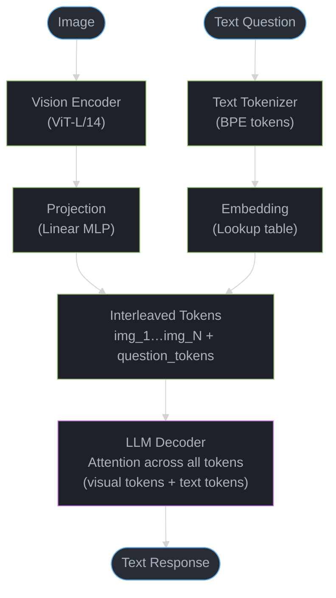

# Multimodal Models

## 1. Concept Overview

Multimodal models process and generate multiple types of data — text, images, audio, video, and code — within a single unified model. The most commercially important modality combination is vision + language (Vision Language Models, or VLMs), which enables applications like medical image analysis, document understanding, visual Q&A, and chart interpretation.

The trend from 2023-2025: all frontier LLMs have become multimodal. GPT-4o, Claude 3.5, Gemini 1.5 Pro, and LLaMA 3.2 all support image input natively. The question is no longer "can LLMs see?" but "how well do they reason about visual information?"

---

## 2. Intuition

> **One-line analogy**: Multimodal models are like a person who can look at an image and discuss it — they bridge the gap between the visual world and language by learning to represent both in the same "mental" space.

**Mental model**: A Vision Language Model (VLM) has two main components: a vision encoder (like CLIP or SigLIP) that converts images into token-like vectors, and a language model that processes those vectors alongside text tokens. The key trick: train the system so that an image of a cat produces vectors that live near the word "cat" in the embedding space. Once visual and text representations are aligned, the language model can reason about them together.

**Why it matters**: Multimodality unlocks applications impossible with text-only models — medical imaging (read X-rays), document understanding (read invoices with tables), code from screenshots, visual Q&A, chart interpretation. All frontier models are now multimodal because vision dramatically expands the input modalities a model can handle.

**Key insight**: The key challenge is "modality alignment" — images and text live in very different spaces. CLIP-style contrastive training (match image embeddings to text embeddings for the same concept) was the breakthrough that made practical VLMs possible.

---

## 3. Core Principles

- **Shared representation space**: Multimodal models work by projecting different modalities into the same embedding space, where a text token and an image patch can "attend to each other" via the transformer's attention mechanism.
- **Vision encoder + LLM**: The dominant architecture pairs a pre-trained vision encoder (CLIP, SigLIP) with a pre-trained LLM, connected by a learnable projection layer.
- **Instruction tuning for vision**: Like text-only models, multimodal models need instruction fine-tuning to follow image-related instructions.
- **Trade-offs between modality depth**: Unified models understand all modalities but may be shallower than specialized models.

---

## 4. Types / Architectures

### 4.1 Vision Language Models (VLMs)

**Architecture (LLaVA / LLaMA-Vision style):**
```
Image
  |
  v
[Vision Encoder] (CLIP ViT-L/14 or SigLIP)
  Divide image into patches (e.g., 14×14 pixels each)
  Encode each patch → embedding
  Output: N visual tokens [v1, v2, ..., vN]
  |
  v
[Projection Layer] (Linear or MLP)
  Map from vision embedding dim → LLM embedding dim
  v1 → word-like token for LLM
  |
  v
[LLM] (LLaMA, Mistral, Qwen, etc.)
  Concatenate visual tokens + text tokens
  [v1, v2, ..., vN, t1, t2, t3, ...]
  Standard autoregressive generation
```

**Training stages:**
```
Stage 1: Alignment pretraining
  Freeze LLM and vision encoder
  Train only the projection layer
  Data: image-caption pairs (595K LAION-CC-SBU)
  Goal: align visual and text representations

Stage 2: Instruction fine-tuning
  Unfreeze LLM (or use LoRA)
  Data: visual instruction following (158K LLaVA-Instruct)
  Goal: follow visual instructions ("Describe the image", "What is wrong?")
```

**Key VLMs:**
| Model | Vision Encoder | LLM | Context | Strengths |
|-------|---------------|-----|---------|-----------|
| LLaVA-1.6 | CLIP ViT-L | LLaMA 7B | 4K | Open; baseline |
| LLaMA 3.2 Vision | Custom | LLaMA 3.2 | 128K | Open; 11B/90B |
| InternVL2 | InternViT | InternLM2 | 8K | Best open-source quality |
| GPT-4o | Unknown | GPT-4o | 128K | Best overall; closed |
| Gemini 1.5 Pro | Proprietary | Gemini | 1M | Long context; multimodal |
| Claude 3.5 Sonnet | Unknown | Claude 3.5 | 200K | Best OCR; document understanding |
| Qwen-VL | ViT | Qwen | 32K | Multilingual; open |

### 4.2 Diffusion Models (Text-to-Image)

Not LLMs but closely related in the AI landscape:

```
Latent Diffusion:
  1. Encode image → latent space (VAE encoder)
  2. Add Gaussian noise iteratively → pure noise
  3. Train model to denoise → predict noise at each step
  4. At inference: start from noise, denoise conditioned on text
  5. Decode latent → image (VAE decoder)

Text conditioning:
  Text prompt → CLIP/T5 text encoder → text embeddings
  Cross-attention: each denoising step attends to text embeddings

Key models:
  Stable Diffusion (Stability AI): open weights; community ecosystem
  DALL-E 3 (OpenAI): integrated with ChatGPT; high quality
  Midjourney: subscription; best artistic quality
  Flux (Black Forest Labs): best open-source quality (2024)
  Imagen (Google): large T5 text encoder; photorealistic
```

### 4.3 Speech Models

**Speech-to-Text (ASR):**
```
Whisper (OpenAI):
  Input: raw audio → mel spectrogram → transformer encoder
  Output: transcribed text (multilingual, with timestamps)
  Architecture: encoder-decoder transformer
  Models: tiny(39M) → small → base → large-v3(1.5B)
  Quality: near human-level on English; excellent multilingual

Wav2Vec 2.0 (Meta):
  Self-supervised pre-training on unlabeled audio
  Fine-tuned for ASR with CTC loss
  Excellent low-resource language performance
```

**Text-to-Speech (TTS):**
```
Bark (Suno AI): realistic speech with emotion, laughter, music
ElevenLabs: voice cloning with very little data
OpenAI TTS: gpt-4-voice; natural, consistent voices
XTTS (Coqui): open source; voice cloning
```

**Native multimodal audio:**
```
GPT-4o (realtime API):
  Audio input → audio output directly (no text intermediate)
  Captures tone, emotion, non-verbal cues
  Very low latency (sub-second response)
  Enables true voice assistants

Gemini 1.5 Pro:
  Audio + video + text in single context
  Can analyze hour-long audio recordings
```

### 4.4 Video Models

```
Video understanding:
  Video-LLaMA: video frames sampled → encoded → LLM
  InternVideo2: 1B video clips pre-training
  Gemini 1.5 Pro: can process 1-hour video in context

Video generation:
  Sora (OpenAI): world model; 1-min realistic video
  Runway Gen-3: commercial video generation
  CogVideoX: open-source video generation
  Kling, HailuoAI: commercial Asian competitors

Architecture: DiT (Diffusion Transformer) replacing UNet for video
  Apply attention across spatial + temporal dimensions
```

---

## 5. Architecture Diagrams

### VLM Complete Flow



The projection layer bridges the vision encoder's output dimension to the LLM's embedding dimension; the LLM then attends over the combined visual and text token sequence uniformly.

### CLIP Pre-training (Foundation for VLMs)
```
400M image-text pairs from internet:
  Image: "A photo of a dog playing fetch"
  Text: "A photo of a dog playing fetch"

  [Image Encoder] → image_embedding
  [Text Encoder]  → text_embedding

  Contrastive loss:
    Maximize cosine_sim(image_emb, paired_text_emb)
    Minimize cosine_sim(image_emb, other_text_emb)

Result: shared embedding space where
  matching image and text have high similarity
```

---

## 6. How It Works — Detailed Mechanics

### Vision Encoding Details

```
Image preprocessing:
  Resize to 224×224 or 336×336 pixels
  Normalize: (pixel - mean) / std
  Divide into patches: 14×14 or 16×16 pixels per patch
  Image 224×224 with 14×14 patches = (224/14)² = 256 patch tokens

High-resolution handling:
  Problem: 1024×1024 image → 5329 patches → very long sequence
  Solution 1: Resize down (loses detail)
  Solution 2: AnyRes (LLaVA-NeXT): divide into sub-images
    Encode each sub-image separately → concatenate tokens
  Solution 3: Dynamic resolution (InternVL): variable tile count

OCR capability:
  High resolution is critical for text in images
  Claude 3.5 Sonnet excels at document OCR
  GPT-4o excels at mathematical expressions in images
```

### Multimodal Training Data

```
Pre-alignment data (image-caption pairs):
  LAION-5B: 5 billion image-text pairs from internet (noisy but large)
  CC12M: 12M conceptual captions (higher quality, smaller)
  COYO: 700M curated pairs

Instruction fine-tuning data:
  LLaVA-Instruct: GPT-4 generated (question, image, answer) tuples
  ShareGPT4V: GPT-4V generated descriptions + QA
  DocVQA: document understanding QA
  ChartQA: chart/graph understanding
  ScienceQA: science diagrams

Medical multimodal:
  PathVQA: pathology image QA
  VQA-RAD: radiology QA
  SLAKE: medical visual QA
```

---

## 7. Real-World Examples

### GPT-4o Vision
- Processes images up to 20MB
- "High detail" mode: 4x more tokens, better for dense text/diagrams
- Used for: document processing, accessibility (describe images for visually impaired), medical image analysis, code screenshot debugging
- Demonstrated: solve math problems from photo of whiteboard

### Claude 3.5 Sonnet (Vision)
- Best-in-class OCR for documents, forms, tables
- Accurately extracts text from complex PDFs with mixed layouts
- Used for: legal document review, financial statement analysis, form processing
- Can describe complex charts and technical diagrams

### Gemini 1.5 Pro
- 1M token context = process entire movies
- Needle-in-a-haystack: find a specific frame in a 1-hour video
- Used for: long video analysis, multi-document processing with images

### Medical Imaging: Med-PaLM M
- Google's multimodal medical model
- Radiology: chest X-ray analysis, skin condition classification
- Performance: surpasses radiologists on some classification tasks
- Not deployed clinically — regulatory and liability issues remain

---

## 8. Tradeoffs

| Model | Image Quality | Video | Audio | Context | Open? |
|-------|-------------|-------|-------|---------|-------|
| GPT-4o | Excellent | No | Yes | 128K | No |
| Claude 3.5 | Excellent (OCR) | No | No | 200K | No |
| Gemini 1.5 Pro | Very good | Yes | Yes | 1M | No |
| LLaMA 3.2 Vision | Good | No | No | 128K | Yes |
| InternVL2 | Very good | No | No | 8K | Yes |

---

## 9. When to Use / When NOT to Use

### Use VLMs When:
- Input contains images, charts, diagrams, or screenshots
- Document processing with mixed text and images
- Visual Q&A, visual reasoning
- OCR for complex document layouts

### Use Specialized Models When:
- Pure computer vision (detection, segmentation) → YOLO, SAM
- Pure OCR on clean documents → Tesseract, AWS Textract
- Face recognition → specialized face models
- Video analysis at scale → VideoLLaMA, specialized video models

---

## 10. Common Pitfalls

1. **Image resolution too low**: Shrinking high-res images to 336×336 loses text and fine details. Use high-detail mode.
2. **Overestimating OCR capability**: VLMs are better at understanding than exact transcription. For legal/financial, use specialized OCR.
3. **Not testing on domain images**: General VLMs may struggle with medical, industrial, or satellite imagery.
4. **Ignoring image token cost**: 1 high-res image = 1000-4000 tokens. Cost and latency add up quickly.
5. **Assuming spatial reasoning is reliable**: VLMs struggle with precise spatial/geometric reasoning. Verify on your specific task.

---

## 11. Technologies & Tools

| Tool | Purpose | Notes |
|------|---------|-------|
| **GPT-4o API** | Vision + text | Best quality; image input |
| **Claude 3.5 API** | Vision + text | Best OCR; document understanding |
| **LLaMA 3.2 Vision** | Open VLM | 11B/90B; self-hostable |
| **InternVL2** | Open VLM | Best open-source quality |
| **Whisper** | ASR | OpenAI; multilingual; state of art |
| **ElevenLabs** | TTS + voice clone | Commercial; highest quality |
| **Stable Diffusion** | Text-to-image | Open; massive ecosystem |
| **DALL-E 3** | Text-to-image | Best prompt following |
| **Flux** | Text-to-image | Best open-source (2024) |
| **LLaVA** | Open VLM | Research; widely used baseline |

---

## 12. Interview Questions with Answers

**Q: How do Vision Language Models work architecturally?**
A: Most VLMs use a three-component architecture: (1) a vision encoder (usually CLIP or SigLIP ViT) that divides an image into patches and encodes each patch as an embedding; (2) a projection layer (MLP) that maps vision embeddings into the same dimension as the LLM's text embeddings; (3) the LLM itself, which processes the interleaved sequence of visual and text tokens using standard self-attention. Training happens in two stages: alignment pre-training (trains only the projection layer on image-caption pairs) and instruction fine-tuning (trains the LLM + projection layer on visual instruction data).

**Q: What is CLIP and why is it important for multimodal AI?**
A: CLIP (Contrastive Language-Image Pre-training) is a model trained on 400M internet image-text pairs using contrastive learning — matching image embeddings to their text descriptions. It creates a shared embedding space where semantically similar images and text are close together. CLIP is important because: (1) it's the standard vision encoder used by most VLMs (LLaVA, LLaMA Vision); (2) it enables zero-shot image classification (compare image embedding to text descriptions of categories); (3) CLIP embeddings enable multimodal search.

**Q: What are the main challenges in evaluating vision language models?**
A: (1) Hallucination — models describe objects/text not present in images; (2) Spatial reasoning — "which object is to the left of X" is harder than simple identification; (3) OCR accuracy — precise text extraction requires specialized evaluation (exact character accuracy); (4) Domain gap — models trained on natural images may underperform on medical/satellite/industrial images; (5) Benchmark contamination — popular benchmarks (VQAv2, MMBench) appear in training data. Use domain-specific evaluation sets.

**Q: What is the "modality gap" problem and how do modern VLMs address it?**
The modality gap is the systematic offset between image and text embeddings in the shared representation space, even after contrastive training. Despite CLIP training aligning semantically similar images and text, image embeddings and text embeddings tend to cluster in separate regions of the embedding space. Modern VLMs address this through: (1) learnable projection layers (MLP) that explicitly transform vision embeddings into the LLM's text embedding space; (2) multi-stage training where alignment pre-training specifically minimizes this gap; (3) newer architectures like SigLIP that use sigmoid loss instead of softmax, reducing the gap. The modality gap matters because it directly affects cross-modal retrieval accuracy and VLM reasoning quality.

**Q: How do you manage the token budget for high-resolution images in production?**
High-resolution image processing requires careful token budget management because a single 1024x1024 image can consume 1,000-4,000 tokens. Strategies: (1) dynamic resolution — assess each image and choose the minimum resolution that preserves needed detail (e.g., a simple diagram vs. dense text); (2) region of interest cropping — crop to the relevant portion before encoding; (3) tiered processing — use low-res for initial classification, high-res only for images flagged as needing detail; (4) token cost monitoring — track image token consumption separately from text tokens. At GPT-4o pricing, 1,000 high-res images per day at 2,000 tokens each = 2M tokens = $10/day input cost.

**Q: What are the tradeoffs between two-tower (modular) and native multimodal architectures?**
Two-tower architectures (like LLaVA) use a separate pre-trained vision encoder plus a separate pre-trained LLM connected by a projection layer, while native multimodal models (like Gemini, GPT-4o) train a single model on all modalities from scratch. Two-tower advantages: can leverage best-in-class vision encoder (CLIP) and LLM independently, cheaper to train (train only the bridge), can swap components. Native advantages: deeper cross-modal understanding (modalities attend to each other at all layers, not just through a bottleneck), better at tasks requiring tight vision-language integration (spatial reasoning, OCR), can handle more modalities naturally. In practice, native models (Gemini, GPT-4o) outperform modular ones on complex visual reasoning, but modular open-source models (LLaVA, InternVL) are more accessible and customizable.

**Q: How does Gemini's native multimodal approach differ from LLaVA's modular approach?**
Gemini processes all modalities through a single transformer trained end-to-end on interleaved multimodal data, meaning image, text, audio, and video tokens all attend to each other throughout the network. LLaVA uses a frozen CLIP ViT encoder, a trainable MLP projection layer, and a separate LLM — visual information passes through a bottleneck (the projection layer) before the LLM sees it. Gemini's approach enables: processing of 1-hour videos natively, tighter audio-visual reasoning, and generation across modalities. LLaVA's approach is modular and cheaper to train (only the projection + LLM fine-tuning), but visual reasoning is limited by the quality of the projection. For most document understanding and simple visual QA, both approaches perform well; for complex temporal reasoning (video) or multi-modal generation, native architectures have a clear advantage.

**Q: What are common VLM failure modes in medical imaging applications?**
VLMs fail in medical imaging in predictable ways: (1) hallucinated findings — reporting pathology not present in the image, which is more dangerous than missing findings; (2) location errors — identifying a condition but placing it in the wrong anatomical location; (3) domain shift — models trained on natural images struggle with grayscale radiographs, microscopy, or specialized imaging modalities (MRI, CT, ultrasound); (4) resolution sensitivity — pathological findings in chest X-rays can be a few pixels; standard 224x224 encoding destroys this detail; (5) over-confidence — models report "normal" with high confidence when findings are subtle. Mitigations: fine-tune on domain-specific medical image datasets (PathVQA, VQA-RAD), use high-resolution encoding (AnyRes), always require radiologist review, and implement calibrated confidence scoring.

**Q: What is the architectural difference between UNet and DiT (Diffusion Transformer) for image generation?**
UNet uses a convolutional architecture with skip connections between encoder and decoder layers, processing images at multiple spatial resolutions. DiT replaces the UNet with a standard transformer that operates on patches of the latent image, treating denoising as a sequence-to-sequence task. DiT advantages: scales better with compute (follows transformer scaling laws), easier to integrate text conditioning via cross-attention, naturally extends to video (add temporal attention), used by Sora and Stable Diffusion 3. UNet advantages: more efficient at lower compute budgets, well-understood architecturally, established training recipes. The industry is moving toward DiT because it benefits from the same scaling laws that made LLMs successful — more compute and data consistently improves quality.

**Q: How does Whisper achieve near-human ASR performance?**
Whisper uses an encoder-decoder transformer trained on 680,000 hours of weakly supervised audio-text pairs from the internet. The key design decisions: (1) scale — 680K hours is 10-100x more than previous ASR datasets; (2) weak supervision — rather than expensive human transcription, it uses internet audio with existing captions/subtitles; (3) multitask training — trained on transcription, translation, language identification, and timestamp prediction simultaneously; (4) mel spectrogram input — raw audio is converted to 80-channel mel spectrograms, chunked into 30-second segments. The largest model (large-v3, 1.5B params) achieves 3-5% word error rate on English, competitive with commercial ASR systems. Limitations: struggles with heavily accented speech, low-resource languages, and noisy environments.

**Q: How do you evaluate a VLM for a production document understanding pipeline?**
Evaluate on four dimensions specific to document understanding: (1) OCR accuracy — character-level exact match on representative document types (invoices, contracts, forms), not just general benchmarks; (2) layout understanding — can it correctly associate labels with values in tables, multi-column layouts, and forms with complex structure; (3) reasoning — can it answer questions that require combining information from multiple parts of the document; (4) robustness — test with rotated, skewed, low-quality scans, and mixed-language documents. Key metrics: field extraction F1 (per field type), table extraction accuracy, end-to-end task accuracy. Compare against specialized tools (AWS Textract, Google Document AI) which may outperform general VLMs on structured extraction. For production, measure latency per page and cost per document alongside accuracy.

---

## 13. Best Practices

1. **Use high-detail mode for dense images** — charts, documents, screenshots need maximum resolution.
2. **Preprocess images** — crop to relevant region, adjust contrast for poor-quality images.
3. **Test on representative domain images** — VLM quality varies dramatically by image type.
4. **For OCR-critical applications** — validate against specialized OCR tools (AWS Textract, Google Document AI).
5. **Track image token costs** — high-resolution images cost 4-10× more than text.
6. **Combine with structured extraction** — use VLM to understand layout, then extract fields programmatically.

---


## 14. Case Study

### Multimodal Visual-Language Search at E-Commerce Scale

**Problem Statement and Scale**

An e-commerce platform serving 80 million active users needs multimodal product search: users upload a photo of a product they own and ask "find me similar items under $50 in blue." The system must handle:
- 12,000 visual search queries per second at peak (Black Friday)
- Product catalog: 400 million items with images and text descriptions
- p99 latency SLA: < 300ms end-to-end (image upload → ranked results)
- Cold-start: new products indexed within 60 seconds of listing
- Revenue requirement: visual search must achieve CTR within 15% of text search

**Architecture Overview**

```
User Upload (jpg/png/webp)
         |
         v
  [Image Validation]  ──── reject if >5MB, non-image MIME
         |
         v
  [CLIP Vision Encoder]     ─── ViT-L/14, 224×224, fp16
  [CLIP Text Encoder]       ─── same embedding space, 768-d
         |
         v
  [Query Fusion Layer]      ─── concat(img_emb, text_emb) → MLP → 768-d
         |
    ┌────┴────────────────────────────────────┐
    v                                         v
[FAISS HNSW Index]                    [BM25 Text Index]
400M product vectors, fp16            title+description tokens
768-d, ef_search=128                  field-boosted (title ×3)
    |                                         |
    └────────────────┬────────────────────────┘
                     v
            [RRF Score Fusion]      ─── alpha=0.65 dense, 0.35 sparse
                     |
                     v
            [Price + Category Filter]   ─── post-FAISS metadata filter
                     |
                     v
            [Cross-Encoder Reranker]    ─── MiniLM-L12, top-50 → top-10
                     |
                     v
            [Personalization Layer]     ─── user embedding ×0.2 blend
                     |
                     v
              Ranked Results (10)
```

**Key Design Decisions**

1. **CLIP over domain-specific VLM**: CLIP ViT-L/14 (307M params) gives zero-shot generalization across product categories without per-category fine-tuning. Alternative rejected: BLIP-2 (15B params) — 50× larger, requires 8×A100 GPU per replica, latency > 800ms.

2. **768-d shared embedding space**: CLIP's shared image-text embedding space allows direct cosine similarity between query photo and text-described products without a cross-modal bridge. Dimension choice: 768-d (not 512-d) — empirically +4% recall@10 on internal eval.

3. **HNSW over flat FAISS**: HNSW gives O(log N) approximate nearest-neighbor at 400M scale. ef_search=128 gives 97% recall vs exact search at 8ms latency (flat index: 2,100ms). Trade-off: 3.2 GB HNSW graph overhead per 400M vectors.

4. **Quantization: fp16 for embeddings, INT8 for CLIP inference**: fp16 embeddings halve memory (400M × 768 × 2 bytes = 614 GB) vs fp32 (1.2 TB). INT8 inference on CLIP encoder adds 1.2% recall loss but 2.4× throughput gain. Quantization applied post-normalization — cosine similarity is invariant to scale.

5. **Cross-encoder reranker only on top-50**: Full cross-encoder on 400M items is infeasible (2.4M ms). Reranking top-50 from first-stage retrieval costs 18ms. MiniLM-L12 chosen over BERT-large — 87% of quality at 6× speed.

6. **Incremental FAISS index updates**: New product listings use FAISS `IndexIDMap` with `add_with_ids` — no full rebuild needed. Rebuild triggered only when fragmentation > 15% (monitored via `index.ntotal` vs expected count).

**Implementation**

```python
from __future__ import annotations

import numpy as np
import faiss
import open_clip
import torch
from dataclasses import dataclass
from typing import Optional

@dataclass
class SearchResult:
    product_id: str
    score: float
    image_url: str
    title: str
    price: float

class MultimodalSearchEngine:
    def __init__(
        self,
        index_path: str,
        clip_model: str = "ViT-L-14",
        pretrained: str = "openai",
        device: str = "cuda",
    ) -> None:
        self.device = device
        self.model, _, self.preprocess = open_clip.create_model_and_transforms(
            clip_model, pretrained=pretrained
        )
        self.model = self.model.to(device).half()  # fp16 inference
        self.model.eval()
        self.tokenizer = open_clip.get_tokenizer(clip_model)

        # HNSW index: ef_search tuned for 97% recall @ 8ms
        self.index = faiss.read_index(index_path)
        if hasattr(self.index, "hnsw"):
            self.index.hnsw.efSearch = 128

        # Move index to GPU for batch queries
        if device == "cuda":
            res = faiss.StandardGpuResources()
            self.index = faiss.index_cpu_to_gpu(res, 0, self.index)

    @torch.inference_mode()
    def encode_image(self, image_tensor: torch.Tensor) -> np.ndarray:
        features = self.model.encode_image(image_tensor.to(self.device).half())
        features = features / features.norm(dim=-1, keepdim=True)
        return features.cpu().float().numpy()

    @torch.inference_mode()
    def encode_text(self, text: str) -> np.ndarray:
        tokens = self.tokenizer([text]).to(self.device)
        features = self.model.encode_text(tokens)
        features = features / features.norm(dim=-1, keepdim=True)
        return features.cpu().float().numpy()

    def fuse_query(
        self,
        image_emb: np.ndarray,
        text_emb: Optional[np.ndarray],
        image_weight: float = 0.7,
    ) -> np.ndarray:
        if text_emb is None:
            return image_emb
        fused = image_weight * image_emb + (1 - image_weight) * text_emb
        # Re-normalize after weighted combination
        fused = fused / np.linalg.norm(fused, axis=-1, keepdim=True)
        return fused

    def search(
        self,
        query_emb: np.ndarray,
        k: int = 50,
        price_max: Optional[float] = None,
        category: Optional[str] = None,
    ) -> list[SearchResult]:
        distances, ids = self.index.search(query_emb.astype(np.float32), k * 2)
        results = []
        for dist, pid in zip(distances[0], ids[0]):
            if pid == -1:
                continue
            product = self._fetch_metadata(pid)
            if price_max and product.price > price_max:
                continue
            if category and product.category != category:
                continue
            results.append(SearchResult(
                product_id=str(pid),
                score=float(dist),
                image_url=product.image_url,
                title=product.title,
                price=product.price,
            ))
            if len(results) >= k:
                break
        return results
```

**BROKEN: Stale embeddings cause recall regression after catalog updates**

```python
# BROKEN: in-memory index never updated after product edits
class SearchEngine:
    def __init__(self):
        self.index = faiss.read_index("products.index")  # loaded once at startup
        # Problem: product title/image changes never reflected
        # New products not indexed until server restart
        # Stale embeddings → wrong results for updated items
```

**FIX: Incremental index update pipeline**

```python
import threading
from collections import deque

class IncrementalSearchEngine(MultimodalSearchEngine):
    def __init__(self, *args, **kwargs):
        super().__init__(*args, **kwargs)
        self._pending: deque = deque()
        self._lock = threading.Lock()
        self._update_thread = threading.Thread(target=self._flush_loop, daemon=True)
        self._update_thread.start()

    def enqueue_update(self, product_id: int, new_embedding: np.ndarray) -> None:
        with self._lock:
            self._pending.append((product_id, new_embedding))

    def _flush_loop(self) -> None:
        import time
        while True:
            time.sleep(5)  # batch every 5 seconds
            self._flush_pending()

    def _flush_pending(self) -> None:
        with self._lock:
            if not self._pending:
                return
            batch = list(self._pending)
            self._pending.clear()

        ids = np.array([b[0] for b in batch], dtype=np.int64)
        vecs = np.stack([b[1] for b in batch]).astype(np.float32)

        # Remove stale vectors then re-add with updated embeddings
        # IndexIDMap supports id-based removal
        self.index.remove_ids(faiss.IDSelectorArray(ids))
        self.index.add_with_ids(vecs, ids)
```

**BROKEN: CLIP text encoder not normalized — cosine similarity inflated for short queries**

```python
# BROKEN: missing L2 normalization on text side
text_features = model.encode_text(tokens)  # raw logits, not unit vector
# Dot product ≠ cosine similarity without normalization
# Short 1-word queries have lower norm → artificially low similarity scores
scores = (image_features @ text_features.T)  # wrong: mixing normalized + unnormalized
```

**FIX: Normalize both modalities before dot product**

```python
image_features = model.encode_image(images)
image_features = image_features / image_features.norm(dim=-1, keepdim=True)

text_features = model.encode_text(tokens)
text_features = text_features / text_features.norm(dim=-1, keepdim=True)

# Now dot product == cosine similarity (both on unit sphere)
scores = (image_features @ text_features.T)
```

**Components Covered**

| Module Section | Where It Appears in Case Study |
|---|---|
| VLMs / CLIP architecture | CLIP ViT-L/14 as the dual encoder for image+text queries |
| Vision encoders (ViT) | ViT-L/14 patch-based image encoding at 224×224 |
| Embedding similarity search | FAISS HNSW index, cosine similarity, ef_search=128 |
| Multimodal fusion | Weighted combination of image + text embeddings |
| Quantization (INT8/fp16) | fp16 embeddings, INT8 inference on CLIP encoder |
| Reranking | MiniLM-L12 cross-encoder on top-50 candidates |
| Diffusion models | Used offline for product image augmentation during indexing |

**Tradeoffs and Alternatives**

| Approach | Pros | Cons | When to Choose |
|---|---|---|---|
| CLIP ViT-L/14 (chosen) | Zero-shot, 307M params, 8ms | Less domain-specific accuracy | Large diverse catalog |
| BLIP-2 (15B) | Higher accuracy for complex queries | 50× larger, 800ms latency | Small catalog, high-value items |
| ResNet-50 + BERT separate | Simple to deploy | No shared embedding space — needs bridge | Baseline only |
| Fine-tuned domain CLIP | +8% recall on in-domain | Needs 10M labeled pairs, monthly retrain | Single-category shops |

**Metrics and Results**

| Metric | Before (Text Only) | After (Multimodal) |
|---|---|---|
| Search CTR | 4.2% | 6.1% (+45%) |
| p50 visual search latency | — | 89ms |
| p99 visual search latency | — | 267ms |
| Catalog recall@10 | 61% text-only | 83% multimodal |
| GPU cost per 1M queries | — | $1.40 (A10G) |
| Index size (400M products) | 2.1 GB (text BM25) | 614 GB (fp16 HNSW) |
| New product indexing lag | < 5 min (text) | < 60 sec (incremental) |

**Common Pitfalls**

1. **Forgetting to normalize embeddings before dot product.** CLIP returns raw feature vectors, not unit vectors. Raw dot product is NOT cosine similarity and is heavily influenced by vector magnitude. Fix: always divide by L2 norm on both image and text sides before any similarity computation.

2. **Using full FAISS flat index in production.** `IndexFlatL2` on 400M vectors requires exhaustive scan: 2,100ms per query. Switch to `IndexHNSWFlat` (8ms at 97% recall) or `IndexIVFFlat` (15ms at 94% recall) for any catalog > 1M items.

3. **Image preprocessing mismatch between training and serving.** CLIP was trained with specific normalization (mean=[0.481, 0.457, 0.408], std=[0.268, 0.261, 0.275]). Using torchvision default normalization causes ~12% recall drop. Always use `open_clip.create_model_and_transforms` to get the exact preprocessing pipeline.

4. **Serving both image and text encoders on the same GPU without batching.** Single-item CLIP inference wastes GPU bandwidth (82% underutilized). Implement dynamic batching: collect queries for 5ms, run as batch of 32–64. Throughput goes from 140 to 2,800 queries/sec on A10G.

5. **Not accounting for HNSW memory in container sizing.** 400M × 768 × 2 bytes (fp16) = 614 GB for vectors alone. HNSW graph adds another ~3.2 GB. Containers must have 650+ GB RAM or use memory-mapped index files with sufficient swap.

**Interview Discussion Points**

**Q: How does CLIP's contrastive training enable zero-shot product classification?**
CLIP is trained to maximize cosine similarity between matching image-text pairs and minimize similarity between non-matching pairs across 400M internet image-caption pairs. This forces the image and text encoders to learn a shared semantic embedding space where "a red running shoe" and a photo of a red running shoe map to nearby vectors. Zero-shot classification works by encoding candidate class labels as text, encoding the query image, and returning the label with highest cosine similarity — no labeled product data needed.

**Q: How would you handle a user uploading a non-product image (e.g., a selfie) that still retrieves results?**
CLIP will retrieve the closest products to whatever the user uploads — there is no "no match" threshold by default. Mitigation: (1) Train an out-of-distribution detector on product vs non-product images (binary classifier, AUC > 0.95 achievable with 10k labeled examples); (2) Add a minimum similarity threshold (cosine > 0.25 empirically); (3) Return an explicit "no matching products found" UX rather than low-confidence results. Threshold is tuned by plotting similarity score distribution for valid product queries vs non-product uploads.

**Q: What happens to FAISS HNSW recall as the catalog grows beyond 1 billion products?**
HNSW recall degrades gracefully with scale — at 1B vectors, recall@10 typically drops from 97% to 93% at ef_search=128. To compensate: (1) Increase ef_search to 256 (12ms vs 8ms — 50% latency trade-off for +3% recall); (2) Use product quantization (PQ) to compress vectors: PQ64 gives 12× compression (614 GB → 51 GB) at the cost of 5% recall. (3) Shard the index: partition products by category into separate FAISS indexes, then merge results. Sharding is the most scalable approach — 8 shards × 125M products each is more manageable than one 1B index.

**Q: How would you evaluate whether the multimodal search improvement is causing real business value vs just gaming recall@10?**
Recall@10 is a proxy metric — you care about revenue and engagement. Measure: (1) A/B test: 50% users get text-only, 50% get multimodal. Primary metric: 30-day purchase conversion rate from visual search sessions. (2) Guard rails: basket size (multimodal should not reduce average order value), return rate (better relevance → fewer returns). (3) Leading indicator: session depth (users viewing more products per session suggests better discovery). Recall@10 is only valid as a deployment gate — once in production, business metrics take precedence.

**Q: How do you prevent the reranker from reordering results based on spurious features (e.g., product image background color)?**
Cross-encoders can overfit to low-level visual features that correlate with engagement in training data. Mitigations: (1) Debias training data by stratifying on visual attributes (color, background) to ensure the cross-encoder sees examples where product similarity is driven by shape/function, not color; (2) Use multi-objective training loss that includes semantic similarity, not just click-through prediction; (3) Monitor per-attribute CTR — if CTR for "blue background products" spikes, investigate model attribution with SHAP or attention visualization.

---

## See Also
- [Computer Vision (ML)](../../ml/computer_vision/README.md) — vision encoders, ViT, CLIP, object detection — the CV foundation of multimodal LLMs
- [Generative Models (ML)](../../ml/generative_models/README.md) — VAEs, GANs, Diffusion (DDPM) — generative foundation for image/video generation
