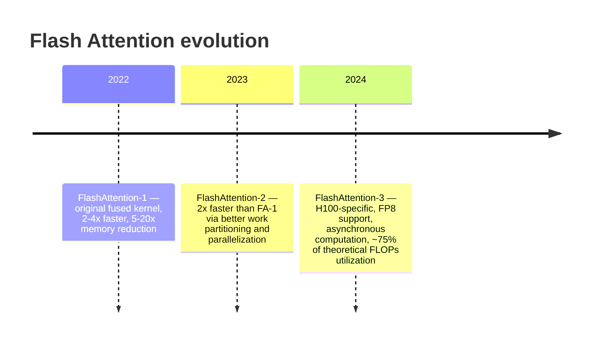
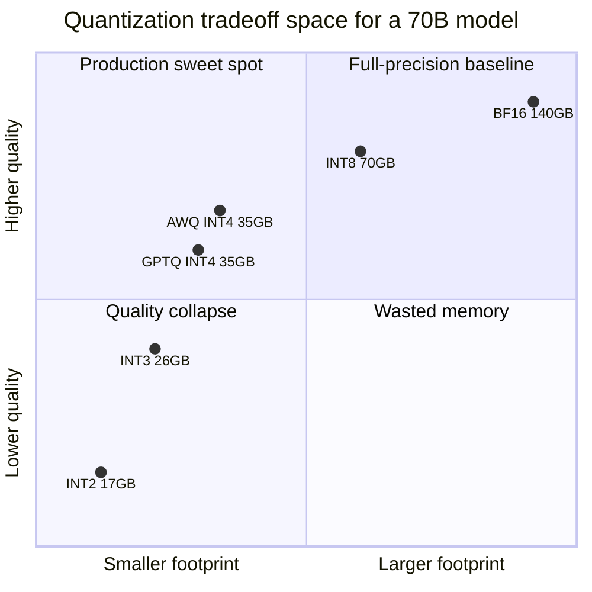
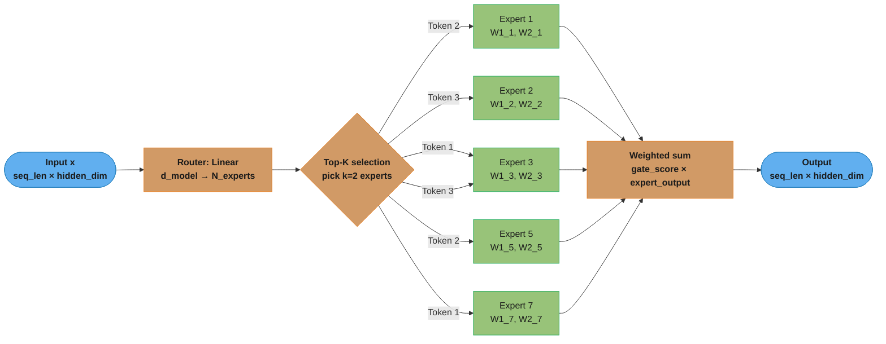
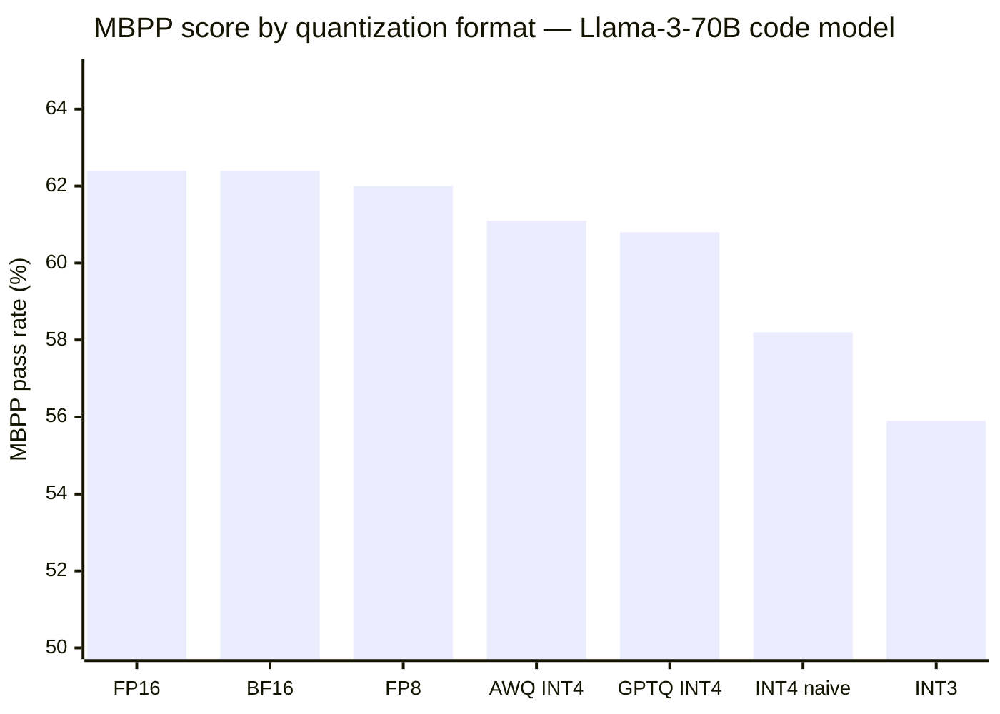

# Optimization & Quantization

## Deep Dive Files

| File | Topic |
|------|-------|
| [gpu_architecture_and_roofline.md](gpu_architecture_and_roofline.md) | GPU memory hierarchy, roofline model, prefill vs decode arithmetic intensity, tensor cores & FP8/FP4, NVLink/InfiniBand topology, H100/H200/B200 spec literacy, MFU/MBU |

---

## 1. Concept Overview

Model optimization encompasses all techniques that make LLM inference faster, cheaper, or more memory-efficient without retraining from scratch. The primary lever is quantization — reducing the numerical precision of weights from 32-bit floats to 8-bit or 4-bit integers, cutting memory by 4-8× and often speeding inference 2-4×.

Beyond quantization: Flash Attention dramatically reduces attention memory, Mixture of Experts reduces active compute, pruning removes unimportant weights, and knowledge distillation trains smaller models to match larger ones.

These techniques are not mutually exclusive — production deployments often combine several (e.g., quantized MoE model + Flash Attention + speculative decoding).

---

## 2. Intuition

> **One-line analogy**: Model quantization is like JPEG compression for model weights — you reduce precision (quality) to dramatically reduce size and speed up loading, with a controlled quality tradeoff.

**Mental model**: A 70B model in full precision (BF16) weighs 140GB — too large for many GPU configurations. Quantization represents each weight with fewer bits: INT8 → 70GB, INT4 → 35GB. The math is the same; only the precision is reduced. Smart quantization (GPTQ, AWQ) minimizes the quality loss by carefully choosing how to round weights, using calibration data to protect the most "important" weights. Flash Attention takes a different approach: not reducing precision, but reordering computation to minimize slow GPU memory access.

**Why it matters**: Quantization determines how many GPUs you need, your hardware cost, and how many users you can serve per dollar. INT4 quantization can reduce a 4-GPU deployment to 1 GPU — 4× cost reduction with ~1-2% quality loss. For most business applications, this tradeoff is entirely acceptable.

**Key insight**: The quality loss from INT4 quantization on MMLU (~1%) is usually far smaller than the quality gain from using a larger model — INT4 70B typically outperforms BF16 13B, giving you more capability at less memory.

---

## 3. Core Principles

- **Quantization degrades quality** — always evaluate on domain-specific benchmarks, not just general benchmarks. INT4 may have 1% general benchmark drop but 10% domain drop.
- **Memory bandwidth is the bottleneck** — quantization helps primarily because it reduces data transferred from HBM per inference step.
- **Activation quantization is harder than weight quantization** — activations have outliers; weights are more predictable.
- **Calibration data matters** — post-training quantization quality depends heavily on the calibration dataset used.
- **Architecture choices are permanent** — MoE, attention design, and hidden dimensions are set at pre-training time; fine-tuning can't change them.

---

## 4. Quantization Methods

### 4.1 Post-Training Quantization (PTQ)

Quantize a trained model without retraining. The most practical approach.

**Simple rounding (ROUND):**
```
float32 weight: 0.1234
scale = max(abs(weights)) / 127  (INT8)
INT8 value = round(0.1234 / scale)

Dequantize at inference:
float32_approx = INT8_value × scale

Quality loss: noticeable at INT8; significant at INT4 (without calibration)
```

The general form of that rounding, which every quantizer in this module is a variation of:

```
Quantize:    q  = clamp( round(x / scale) + zero_point,  q_min, q_max )
Dequantize:  x' = (q - zero_point) × scale

Derived from the tensor's observed range:
  scale      = (max - min) / (q_max - q_min)
  zero_point = round(q_min - min / scale)      # the integer that decodes to real 0.0
```

**Reading it in plain English.** "Pick a step size so the biggest and smallest weights in the tensor land on the ends of the integer grid, then replace every weight with the number of steps it sits from the bottom of that grid."

Quantization is only ever two things: choosing a ruler (`scale`) and choosing where its zero mark sits (`zero_point`). Everything GPTQ, AWQ, group-wise, and FP8 add on top is a smarter way of choosing those two numbers — the encode/decode arithmetic never changes.

| Symbol | Say it out loud | What it actually is |
|--------|-----------------|---------------------|
| `x` | "x" | One original FP16/FP32 weight. The thing you are about to destroy information about |
| `q` | "q" | The stored integer code. This is the only thing that goes to disk and to HBM |
| `x'` | "x prime" | The weight you get *back* after dequantizing. Never exactly equal to `x` |
| `scale` | "scale" or "delta" | The step size of the ruler, in real units. One integer tick = this much weight |
| `zero_point` | "zero point" or "zp" | Which integer code means real-value 0.0. Shifts the grid to sit over the data |
| `q_min, q_max` | "q min, q max" | The ends of the integer grid. INT4 unsigned = 0..15; INT4 signed = -8..7; INT8 = -128..127 |
| `round` | "round" | Round-to-nearest. This step, and only this step, is where quality is lost |
| `clamp` | "clamp" | Saturate anything outside the grid to its edge. Protects against calibration outliers |
| `x' - x` | "the quantization error" | The residual. GPTQ tries to cancel it; AWQ tries to shrink it where it matters |

**Walk one example — an FP16 tensor all the way down to INT4 and back.** Five weights, unsigned INT4 (`q_min = 0`, `q_max = 15`, so 16 levels and 15 steps between them):

```
  Tensor (FP16), one group of 5 weights:
      w = [ -0.10,   0.22,   0.55,   0.91,   1.30 ]

  Step 1 - find the range
      min = -0.10      max = 1.30      span = 1.30 - (-0.10) = 1.40

  Step 2 - scale = span / (q_max - q_min),  4 bits -> 15 steps
      scale = 1.40 / 15 = 0.09333

  Step 3 - zero_point = round(-min / scale)
      zero_point = round(0.10 / 0.09333) = round(1.071) = 1
      (integer code 1 is the one that decodes back to real value 0.0)

  Step 4 - quantize:   q  = clamp(round(x / scale) + zero_point, 0, 15)
  Step 5 - dequantize: x' = (q - zero_point) × scale

      x        x/scale    round    +zp = q     x' = (q-1) × 0.09333    error x'-x
    -0.10      -1.071      -1         0              -0.09333           +0.00667
     0.22       2.357       2         3              +0.18667           -0.03333
     0.55       5.893       6         7              +0.56000           +0.01000
     0.91       9.750      10        11              +0.93333           +0.02333
     1.30      13.929      14        15              +1.30667           +0.00667

  Worst error = 0.0333, and it can never exceed scale/2 = 0.0467 by construction.
  Mean absolute error = 0.080 / 5 = 0.016   (about 1.1% of the 1.40 span)

  Storage: 5 weights × 16 bits = 80 bits  ->  5 × 4 bits = 20 bits (+ scale + zp)
```

Two things to carry into an interview from that table. First, **the error is bounded by half a step, always** — that is the entire quality guarantee of round-to-nearest, and it is why halving the number of levels roughly doubles the error. Second, **the error is signed and uncorrelated across weights**, so in a 4096-wide matmul the errors partially cancel; this is why INT4 costs ~1-2% on benchmarks rather than the ~1% per-weight error you would naively fear.

**Why `zero_point` exists — the failure mode without it.** Drop `zero_point` (force it to 0) and the grid must be centred on real zero, so it has to stretch symmetrically to cover `[-max|w|, +max|w|]`. On the tensor above that is a 2.60 span instead of the 1.40 span the data actually occupies — you pay for negative range you never use. That is exactly the symmetric-vs-asymmetric tradeoff below.

**Symmetric vs asymmetric, on the same five weights.**

```
  Same tensor: w = [-0.10, 0.22, 0.55, 0.91, 1.30]   (off-center: mostly positive)

  SYMMETRIC INT4  (signed grid -8..7, zero_point forced to 0)
      scale = max(|w|) / 7 = 1.30 / 7 = 0.18571

        x       x/scale     q      x' = q × 0.18571     error
      -0.10      -0.538    -1         -0.18571        -0.08571
       0.22       1.185     1         +0.18571        -0.03429
       0.55       2.962     3         +0.55714        +0.00714
       0.91       4.900     5         +0.92857        +0.01857
       1.30       7.000     7         +1.30000         0.00000

      Codes used: -1, 1, 3, 5, 7   ->   5 of the 16 available levels.
      The entire negative half of the grid (-8..-2) is dead weight.
      Mean absolute error = 0.1457 / 5 = 0.02914

  ASYMMETRIC INT4 (unsigned grid 0..15, zero_point = 1)  [the walk above]
      scale = 0.09333
      Codes used: 0, 3, 7, 11, 15   ->   spread across the full grid.
      Mean absolute error = 0.080 / 5 = 0.01600

  Delta: 0.02914 -> 0.01600  =  1.8× lower error, for the cost of storing one
         extra integer per group.

  Why: symmetric must cover the 2.60-wide span [-1.30, +1.30].
       Asymmetric covers only the 1.40-wide span the data actually occupies.
       Same 15 steps over a 1.9× narrower range = a 1.9× finer ruler.
```

This is why `zero_point=True` is the default in the AWQ config in the case study below. Symmetric quantization is only competitive when the tensor is genuinely zero-centred (most trained weight matrices roughly are, which is why symmetric survives at all) — the moment a distribution is skewed, as activations and post-GELU tensors are, asymmetric wins outright.

**Group-wise quantization, and what the scales actually cost.** One `scale`/`zero_point` pair for a whole 4096×4096 matrix means a single outlier weight stretches the ruler for 16M weights. Group-wise fixes this by computing a fresh pair every `g` consecutive weights — `g=128` is the production standard. The arithmetic of that overhead:

```
  One group of g INT4 weights costs:
      weight bits   = g × 4
      metadata bits = 16 (FP16 scale) + 16 (FP16 zero_point) = 32
      effective bits per weight = (g × 4 + 32) / g

        g          weight bits   + meta   total    bits/weight   overhead
         64            256          32      288       4.5000       +12.5%
        128            512          32      544       4.2500       + 6.25%
        256           1024          32     1056       4.1250       + 3.1%
        512           2048          32     2080       4.0625       + 1.6%
      per-tensor    (g in millions)                   ~4.0000       ~0%

  What g=128 costs on Llama-3-70B:
      70e9 params × 4.25 bits / 8 bits-per-byte = 37.2 GB
      vs the headline 4-bit figure   70e9 × 0.5 = 35.0 GB
      -> the scales cost 2.2 GB, which is why the deployment below budgets ~38 GB.

  What g=512 saves, and what it costs:
      saves 70e9 × (4.25 - 4.0625) / 8 = 1.6 GB   (4% of the model)
      costs 2.1% MBPP on the code benchmark      (see the BROKEN example below)
      -> 1.6 GB is never worth 2.1% quality. This is why g=128 is the default.
```

`g=128` is the knee of that curve: 6.25% metadata for near-per-channel quality. Going to 64 doubles the metadata for a marginal gain; going to 512 saves 1.6 GB and costs real accuracy.

**Model memory, laid out with units.** Every "how many GPUs do I need" answer starts here:

```
  model_bytes = num_params × bytes_per_param        bytes_per_param = bits / 8

    format      bits   bytes/param        7B model                  70B model
    FP32         32       4.0        7e9 × 4.0   =  28 GB     70e9 × 4.0   = 280 GB
    FP16/BF16    16       2.0        7e9 × 2.0   =  14 GB     70e9 × 2.0   = 140 GB
    FP8           8       1.0        7e9 × 1.0   =   7 GB     70e9 × 1.0   =  70 GB
    INT8          8       1.0        7e9 × 1.0   =   7 GB     70e9 × 1.0   =  70 GB
    INT4          4       0.5        7e9 × 0.5   = 3.5 GB     70e9 × 0.5   =  35 GB
    INT3          3      0.375       7e9 × 0.375 = 2.6 GB     70e9 × 0.375 =  26 GB
    INT2          2      0.25        7e9 × 0.25  = 1.8 GB     70e9 × 0.25  =  17 GB

  Reading the 70B column against an 80 GB A100:
      BF16 140 GB  -> 2 GPUs just to hold weights, 0 GB left for KV cache -> 4 GPUs
      INT8  70 GB  -> 1 GPU holds it, ~10 GB spare -> tight; 2 GPUs in practice
      INT4  35 GB  -> 1 GPU holds it with 45 GB spare for KV cache -> 1-2 GPUs

  This is the whole cost argument: the same model, the same math, 4× fewer GPUs.
```

These are **weights only**. A real deployment adds the KV cache (Section 4.3), activation buffers, and CUDA context — budget 10-20% on top, which is why the 35 GB INT4 model above is provisioned at ~38-40 GB.

**GPTQ (Accurate Post-Training Quantization for Generative Pre-trained Transformers):**
```
Key idea: minimize quantization error layer by layer using Hessian information

For each layer W:
  1. Compute Hessian H = 2XX^T (sensitivity of loss to weight changes)
  2. Quantize weights column by column
  3. For each quantized weight, compensate remaining weights:
     w_remaining -= (quantization_error × H_inv)
  4. This propagates error to remaining unquantized weights

Result: Much lower error than simple rounding at INT4
Tradeoff: Requires calibration data (~128 samples); one-time offline process
Time: 30min for 7B, 3hrs for 70B on one GPU
```

**Reading it in plain English.** "Round the weights one column at a time, and after each one, nudge the columns you have not touched yet so they cancel out the error you just made."

Round-to-nearest treats every weight as an independent problem. GPTQ treats the *layer output* as the thing to preserve — it does not care whether each individual weight is close to its original value, only that `W'X ≈ WX` on real data. That reframing is worth the whole 30 minutes of Hessian work.

| Symbol | Say it out loud | What it actually is |
|--------|-----------------|---------------------|
| `X` | "X" | The calibration activations — the actual inputs this layer saw on ~128 real samples |
| `XX^T` | "X X transpose" | Every input channel's magnitude, and how channels move together. The correlation matrix |
| `H = 2XX^T` | "the Hessian" | Sensitivity: how much the layer's output error grows per unit of weight error |
| `diag(H)` | "the diagonal" | Per-weight sensitivity. Big = that weight is multiplied by big activations = handle with care |
| off-diagonal `H_ij` | "H i j" | How much weight `j` can be used to *undo* an error made in weight `i` |
| `H^-1` | "H inverse" | Converts "output error I owe" back into "how far to nudge the remaining weights" |
| `e_i` | "e sub i" | The rounding error just committed on column `i`. The debt to be paid forward |

**What the Hessian *is*, without calculus.** Take a one-row layer, `y = w1·x1 + w2·x2`. If you perturb `w1` by `e`, the output moves by `e × x1`. So a weight multiplied by a *large* activation is a *sensitive* weight — the same rounding error there costs more output error. `XX^T` is literally the table of `x_i · x_j` averaged over calibration data: its diagonal is each channel's squared magnitude (the sensitivity), and its off-diagonal is how much two channels co-vary (the substitutability). That is all GPTQ needs. No derivatives required.

**Walk one example — two weights, one row.** Calibration says channel 1 is loud (`x1 = 4.0`) and channel 2 is quiet (`x2 = 1.0`). Quantization grid is 0.1:

```
  True weights: w1 = 0.62, w2 = 0.31       True output: 0.62×4.0 + 0.31×1.0 = 2.79

  diag(H) ~ [x1², x2²] = [16, 1]   -> w1 is 16× more sensitive than w2

  --- ROUND-TO-NEAREST (quantize each weight independently) ---
      w1: 0.62 -> 0.6   error -0.02   output cost -0.02 × 4.0 = -0.080
      w2: 0.31 -> 0.3   error -0.01   output cost -0.01 × 1.0 = -0.010
      Output = 0.6×4.0 + 0.3×1.0 = 2.70        error vs true = -0.090

  --- GPTQ (quantize w1, push its error into w2) ---
      w1: 0.62 -> 0.6   error -0.02   output debt = -0.080
      Compensate: how much must w2 move to repay -0.080 of output?
          delta_w2 = 0.080 / x2 = 0.080 / 1.0 = +0.080
          w2_adjusted = 0.31 + 0.080 = 0.39     <- this is the H^-1 step
      w2: 0.39 -> 0.4   error +0.01   output cost +0.01 × 1.0 = +0.010
      Output = 0.6×4.0 + 0.4×1.0 = 2.80        error vs true = +0.010

  Result: |error| 0.090 -> 0.010   =  9× lower layer output error,
          using the SAME INT grid and the SAME number of stored bits.
```

Notice that GPTQ made `w2` *further* from its original value (0.4 vs a true 0.31) and that was the right move — the point was never per-weight fidelity. It also explains the ordering rule: GPTQ quantizes sensitive columns **first**, while there are still many untouched columns left to absorb the debt. The last column quantized has nobody to pass its error to, which is why per-column error grows toward the end of the matrix and why group-wise scales (above) matter most there.

**Why the compensation term exists — the failure mode without it.** Remove step 3 and GPTQ degenerates to round-to-nearest: errors accumulate independently across 4096 columns instead of cancelling, and layer reconstruction error grows roughly with the square root of the column count. At INT8 that is survivable; at INT4 the step size doubles and the accumulated error is what produces the -4.2% naive-INT4 collapse in the case study chart below.

**AWQ (Activation-aware Weight Quantization):**
```
Key insight: Not all weights are equally important for quantization
  Channels with larger input activations are more sensitive to quantization error

Algorithm:
  1. Profile activation magnitudes using small calibration dataset
  2. Identify "salient" channels (high activation magnitude)
  3. Apply per-channel scaling: scale important channels UP before quantization
     (this concentrates more quantization precision on important weights)
  4. Quantize scaled weights
  5. Rescale at inference

Result: Better than GPTQ at very low bit-widths (2-3 bit); comparable at 4-bit
No Hessian computation needed; faster calibration
Used by: LLaMA 70B serving at Together AI, AWS Bedrock
```

The scaling trick in step 3 is one identity, applied per input channel:

```
  y = W · x                                    (what the layer computes)
    = (W · s) · (x / s)                        (multiply and divide by the same s)
       \____/    \___/
       quantize   fold into the previous
       THIS       layernorm / linear — free at inference
```

**Reading it in plain English.** "Blow up the weights that matter before rounding them, and shrink their inputs by the same factor afterwards — the product is unchanged, but the important weights now sit on a coarser part of the grid where a rounding step is proportionally smaller."

The insight is that quantization error is *absolute* (half a step, always) while what hurts quality is *relative* error. Scaling a salient channel up by `s` leaves the absolute error the same but divides the effective error by `s` once you rescale at inference.

| Symbol | Say it out loud | What it actually is |
|--------|-----------------|---------------------|
| `s` | "s" or "the AWQ scale" | Per-input-channel amplifier, one number per channel. Found by grid search, typically 1-4 |
| "salient" | "salient channel" | A channel whose calibration activations are large. ~1% of channels, most of the quality |
| `W · s` | "W times s" | The pre-scaled weights that actually get quantized and stored |
| `x / s` | "x over s" | The compensating shrink, folded into the *previous* op so it costs zero runtime |

**Walk one example.** One salient weight `w = 0.62`, in a group whose max is 1.30, symmetric INT4 (scale = 1.30/7 = 0.18571 — the same ruler as the symmetric table above):

```
  --- NAIVE (no AWQ scaling) ---
      0.62 / 0.18571 = 3.339  -> round to 3
      w' = 3 × 0.18571 = 0.55714        error = -0.06286   (10.1% relative)

  --- AWQ, s = 2 on this channel ---
      scaled weight = 0.62 × 2 = 1.24
      1.24 / 0.18571 = 6.677  -> round to 7
      stored w' = 7 × 0.18571 = 1.30000
      at inference divide by s: 1.30 / 2 = 0.65000
                                        error = +0.03000   ( 4.8% relative)

  Delta: 0.06286 -> 0.03000  =  2.1× lower error on the salient channel,
         with zero extra stored bits and zero extra runtime work.

  The catch: s is not free across the whole group. Pushing one channel up can
  raise the group max and coarsen the ruler for everyone else. AWQ grid-searches
  s per channel to minimise TOTAL group error — which is why it needs calibration
  data at all, and why calibration DOMAIN matters (which channels are salient
  depends entirely on what text you profiled).
```

**Why AWQ needs no Hessian.** GPTQ asks "how do I repair the error after making it?" and needs `H^-1` to answer. AWQ asks "how do I avoid making it on the important channels in the first place?" and only needs the *magnitude* of each channel's activations — the diagonal information, obtainable by a single profiling pass. That is the whole reason AWQ calibrates in minutes where GPTQ takes hours, and why it degrades more gracefully at 2-3 bits: there is no error-propagation chain to destabilise when the grid gets very coarse.

### 4.2 Quantization-Aware Training (QAT)

Train or fine-tune with simulated quantization in the forward pass:

```
Forward pass: use fake-quantized weights (quantize then dequantize)
  w_q = dequantize(quantize(w))  (float but quantization noise added)
Backward pass: straight-through estimator (gradient passes through quantize op)

Result: model learns to be robust to quantization noise
Quality: best INT4 quality; near-BF16 performance
Cost: requires GPU training time (~1-10% of original training compute)
Used for: production deployments where quality at INT4 is critical
```

**Reading it in plain English.** "During training, round every weight to the INT4 grid and immediately un-round it before using it — so the model computes with the damaged weights and learns to work around the damage, while the optimizer still gets to update smooth full-precision values underneath."

| Piece | Say it out loud | What it actually is |
|-------|-----------------|---------------------|
| `quantize(w)` | "quantize w" | `round(w/scale) + zp` from Section 4.1 — snap to the integer grid |
| `dequantize(...)` | "dequantize" | `(q - zp) × scale` — back to float. Same value the deployed model will see |
| "fake quantized" | "fake quant" | Still an FP16 number, but one that INT4 can represent exactly. Noise, not compression |
| STE | "straight-through estimator" | Backward pass pretends `round()` was the identity function: gradient passes through unchanged |

**Walk one example — one weight through one QAT step.** Reusing the group from Section 4.1 (`scale = 0.09333`, `zero_point = 1`):

```
  Master weight (FP32, what the optimizer owns):   w = 0.9100

  FORWARD - fake quantize:
      q  = round(0.9100 / 0.09333) + 1 = round(9.750) + 1 = 11
      w_q = (11 - 1) × 0.09333 = 0.93333
      -> the layer computes with 0.93333, NOT 0.9100
      -> injected noise = +0.02333, exactly the deployment error

  BACKWARD - straight-through estimator:
      true gradient of round() is 0 almost everywhere, and undefined at the steps
      -> using it would give dL/dw = 0 and NOTHING would ever train
      STE pretends d(round(x))/dx = 1, so:
          dL/dw  :=  dL/dw_q          (gradient flows straight through)

  UPDATE - applied to the FP32 master weight, not the fake-quantized one:
      w = 0.9100 - lr × grad  ->  0.9060      (a sub-step-size move; legal in FP32)

  Next forward: round(0.9060 / 0.09333) + 1 = round(9.707) + 1 = 11  -> same code.
  The weight drifts smoothly in FP32 until it crosses a step boundary at 0.8867,
  at which point the stored code flips to 10.
```

**Why the master weights must stay FP32 — the failure mode without them.** The learning rate produces updates far smaller than one quantization step (`0.09333` here). Apply them directly to the quantized weight and every update rounds back to where it started: training freezes at step one. Keeping a full-precision shadow copy lets thousands of tiny updates accumulate until they are collectively large enough to move a weight to the next integer code. This same shadow-weight pattern reappears in the TransformerEngine FP8 workflow below, for exactly the same reason.

### 4.3 KV Cache Quantization

Quantize not the model weights but the KV cache:

```
KV cache stores: float16 K, V tensors per layer per token
Memory: 2 × num_layers × num_kv_heads × head_dim × seq_len × 2 bytes

With INT8 KV quantization:
  Memory: 2 × num_layers × num_kv_heads × head_dim × seq_len × 1 byte
  → 50% reduction in KV cache memory
  → 2× more concurrent users at same GPU memory

With INT4 KV quantization:
  → 75% reduction
  → Some quality loss; monitor perplexity carefully

vLLM supports: --kv-cache-dtype int8 or fp8
```

**Reading it in plain English.** "For every token you have ever seen, every layer stored one key vector and one value vector — so cache memory is the product of how deep the model is, how wide its attention is, how long the conversation is, and how many bytes each number takes."

Unlike weight memory, which is fixed the moment you load the model, **KV cache memory grows linearly with every token generated and with every concurrent user**. That is why it, not the weights, is what actually OOMs a production server.

| Term | Say it out loud | What it actually is |
|------|-----------------|---------------------|
| the leading `2` | "two, for K and V" | Two tensors per layer: one keys, one values. Not a fudge factor |
| `num_layers` | "number of layers" | Every transformer block keeps its own cache. Llama-3-70B: 80 |
| `num_kv_heads` | "number of KV heads" | KV heads, **not** query heads. This is exactly what GQA shrinks. Llama-3-70B: 8 |
| `head_dim` | "head dim" | Width of one head's vector, usually `hidden_dim / num_q_heads`. Typically 128 |
| `seq_len` | "sequence length" | Prompt + generated tokens so far. The only term that grows during a request |
| bytes/element | "bytes per element" | FP16 = 2, FP8/INT8 = 1, INT4 = 0.5. The only term quantization touches |

**Walk one example — Llama-3-70B at 128K context, one request:**

```
  2 × num_layers × num_kv_heads × head_dim × seq_len × bytes_per_element

  FP16 baseline:
      2 × 80 × 8 × 128 × 131072 × 2 bytes
    = 2 × 80          = 160
      × 8             = 1,280
      × 128           = 163,840          <- bytes of KV per token per... (running product)
      × 131,072       = 21,474,836,480
      × 2             = 42,949,672,960 bytes  =  42.9 GB     for ONE request

  Same request with quantized KV:
      FP8 / INT8 (1 byte):  21.5 GB     -> 50% saved
      INT4       (0.5 byte): 10.7 GB    -> 75% saved

  Per-token cost (the number to memorise):
      2 × 80 × 8 × 128 × 2 bytes = 327,680 bytes = 0.33 MB per token, FP16
      -> 3 tokens per MB, ~3,000 tokens per GB

  Compare against the weights: the INT4 model is 35 GB, fixed forever.
  ONE 128K FP16 request is 42.9 GB. The cache outweighs the model at ~107K tokens.
```

That last line is the crossover the Section 13 Q&A refers to: `context_length > weight_bytes / (2 × layers × kv_heads × head_dim × bytes_per_element)`, which here is `35e9 / 327,680 ≈ 107K tokens`. Below it, quantize weights first. Above it, quantizing the KV cache is worth more than anything you can do to the weights — and note that GQA has *already* divided this by 8 (64 query heads down to 8 KV heads); without it the same request would need 343 GB.

**KIVI (2-bit KV cache):**
- Channels of K/V have different value ranges → per-channel quantization
- 2-bit KV with group quantization: ~8× smaller KV cache vs BF16
- Best for long context (128K+) where KV cache otherwise dominates memory

**When KV cache quantization matters most:**
- Long context (>16K tokens): KV cache > model weights in memory
- High concurrency: more users → more KV cache → sooner OOM
- GQA already helps (fewer KV heads), but KV quantization compounds the savings

### 4.4 GGUF Quantization (llama.cpp)

llama.cpp's quantization format optimized for CPU/metal inference:

| Format | Bits | Quality | Speed | Size (7B) |
|--------|------|---------|-------|-----------|
| Q2_K | 2.5 | Lowest | Fastest | 2.7GB |
| Q3_K_M | 3.3 | Low | Fast | 3.3GB |
| Q4_0 | 4 | Good | Fast | 3.8GB |
| Q4_K_M | 4.5 | Very good | Medium | 4.1GB |
| Q5_K_M | 5.3 | Excellent | Medium | 4.8GB |
| Q6_K | 6.6 | Near perfect | Slower | 5.5GB |
| Q8_0 | 8 | Near BF16 | Slowest | 7.2GB |

`Q4_K_M` is the community standard recommendation: best quality/size/speed balance.

### 4.5 FP8 Quantization (H100-Specific)

FP8 is a floating-point format (8 bits) with two variants, distinct from INT8 in how it handles numerical range:

```
FP8 E4M3 (4 exponent bits, 3 mantissa): for weights and activations
  Range: ±448.0   — handles large activation outliers without saturation
  Precision: 8 distinct values between 1.0 and 2.0

FP8 E5M2 (5 exponent bits, 2 mantissa): for gradients
  Range: ±57344.0 — wider range needed for gradient magnitudes during training
  Lower precision acceptable: gradients tolerate coarser quantization

INT8 for comparison:
  Range: -128 to 127 (integer grid, uniform steps)
  Problem: activation outliers (values at ±100s) saturate the fixed range,
           requiring careful per-channel or per-token scaling to avoid clipping
  FP8 E4M3 handles outliers via floating-point exponent — no saturation
```

**Reading it in plain English.** "Spend your 8 bits differently: INT8 spends all of them on a ruler with evenly spaced marks, while FP8 spends some on an exponent — giving marks that are fine near zero and coarse far away, so one huge outlier no longer ruins the resolution for everything else."

| Notation | Say it out loud | What it actually is |
|----------|-----------------|---------------------|
| `E4M3` | "E four M three" | 1 sign + 4 exponent + 3 mantissa bits = 8. Narrow range, finer steps |
| `E5M2` | "E five M two" | 1 sign + 5 exponent + 2 mantissa bits = 8. Wider range, coarser steps |
| exponent bits | "the exponent" | Chooses which power-of-2 *bracket* the number lives in. Buys dynamic range |
| mantissa bits | "the mantissa" | Subdivides that bracket into `2^M` even steps. Buys precision |

**Walk one example — where the steps actually land.**

```
  E4M3: 3 mantissa bits -> every power-of-2 bracket is cut into 2³ = 8 steps

    bracket [1.0, 2.0):  step = 1.0/8  = 0.125    -> 1.000 1.125 1.250 ... 1.875
    bracket [2.0, 4.0):  step = 2.0/8  = 0.250
    bracket [64, 128):   step = 64/8   = 8.0
    bracket [256, 448]:  step = 256/8  = 32.0     <- coarse, but it still FITS

  INT8 covering the same ±448 range with a uniform grid:
    scale = 448 / 127 = 3.528
    step  = 3.528 EVERYWHERE

    near 1.0:   INT8 step 3.528  vs  E4M3 step 0.125   -> FP8 is 28× finer
    near 400:   INT8 step 3.528  vs  E4M3 step 32.0    -> INT8 is  9× finer

  --- THE ACTIVATION-OUTLIER SCENARIO ---
  A real activation tensor: 4,095 values in [-3, +3], one outlier at 400.

    INT8, scaled to fit the outlier:  scale = 400/127 = 3.15
      -> every ordinary value in [-3, 3] collapses onto codes -1, 0, or +1.
         4,095 of 4,096 values are destroyed to accommodate one.
    INT8, clipping the outlier at 3.0: scale = 3/127 = 0.0236
      -> ordinary values are fine, but the 400 becomes 3.0. A 133× error on the
         single value the attention layer cared about most.
    FP8 E4M3: 400 lands in [256,448) at step 32 -> stored as 384 (4% error),
      and 1.4 lands in [1,2) at step 0.125 -> stored as 1.375 (1.8% error).
      Both survive. No per-channel scaling required.

  This is the entire reason FP8 beats INT8 for ACTIVATIONS, while INT4 still
  beats FP8 for WEIGHTS: weights are tightly clustered and near-Gaussian (a
  uniform grid is ideal), activations have outliers (a log-spaced grid is ideal).
```

That last contrast is the interview answer: it is not that FP8 is "better than INT8", it is that a uniform grid is the right tool for a well-behaved distribution and a floating-point grid is the right tool for a heavy-tailed one. E5M2 makes the same trade one notch further for gradients — 5 exponent bits push the range to ±57,344 at the cost of only 4 steps per bracket, which is acceptable because gradient *direction* matters far more than gradient precision.

**Hardware requirement:** H100 Tensor Cores with native FP8 compute. A100 does NOT have FP8 hardware — any FP8 code falls back to BF16 on A100.

```
Memory comparison for a 70B model:
  BF16: 140GB  (baseline quality)
  FP8:   70GB  (2× reduction, near-BF16 quality — best of reduced-precision options)
  INT8:  70GB  (same size; worse for activation quantization due to outliers)
  INT4:  35GB  (4× reduction; ~1-2% general quality loss, more on domain tasks)
```

**NVIDIA TransformerEngine workflow (used by DeepSeek-V3, Megatron-LM):**
```
1. Master weights stored in BF16 (full precision for optimizer states)
2. Forward pass: TransformerEngine auto-casts each layer to FP8 on-the-fly
   — weights cast BF16 → FP8 E4M3 per layer at compute time
   — activations cast → FP8 E4M3 before matmul
3. FP8 Tensor Core computes the matmul at full H100 hardware speed
4. Output accumulated in BF16 before writing to the next layer
5. Backward pass: gradients communicated in FP8 E5M2
6. Weight update: applied to BF16 master weights (FP8 too coarse for optimizer)

Net: ~2× memory reduction vs BF16 training, ~2× faster Tensor Core throughput,
     near-BF16 final model quality
```

---

## 5. Flash Attention & Mixture of Experts

### What It Solves

Standard attention materializes the full `[seq × seq]` attention matrix in HBM (GPU memory):

```
Standard attention cost:
  Memory: O(n²) in HBM
  For seq_len=8192, BF16: 8192 × 8192 × 2 bytes = 134MB per head
  For 32 heads: 4.3GB just for attention matrices

  Time: multiple HBM reads/writes per step (S = softmax(QK^T/√d), O = SV)
```

Flash Attention tiles the computation to fit in SRAM:

```
HBM (slow, ~2TB/s)              SRAM (fast, ~20TB/s)
+------------------------+       +--------------------------+
| Q   [seq_len × d]      |       | Q_block  [B_r × d]       |
| K   [seq_len × d]      |  -->  | K_block  [B_c × d]       |
| V   [seq_len × d]      |       | V_block  [B_c × d]       |
| O   [seq_len × d]      |       | O_accum  [B_r × d]       |
|                        |       | m, l     [B_r]   (stats) |
+------------------------+       +--------------------------+
   Never writes [seq×seq]!          All attention math here
```

**Online softmax algorithm (why it is numerically stable and O(n) memory):**
```
Standard attention (3 HBM round-trips):
  S = Q × K^T / sqrt(d)          # write [seq×seq] to HBM
  P = softmax(S)                  # read [seq×seq] from HBM, write back
  O = P × V                       # read [seq×seq] from HBM

Flash Attention (1 HBM round-trip, O(n) memory):
  Initialize: m = -inf (running max), l = 0 (running sum), O = 0

  For each K_block, V_block:
    S_block = Q_block × K_block^T                  # in SRAM
    m_new   = max(m, rowmax(S_block))              # update running max
    P_block = exp(S_block - m_new)                 # numerically stable
    l_new   = exp(m - m_new) × l + rowsum(P_block) # update running sum
    O       = exp(m - m_new) × O + P_block × V_block  # accumulate output

  Final O = O / l   # normalize by sum (equivalent to softmax denominator)

Key: by tracking (m, l) incrementally, softmax is computed without
     ever materializing the full [seq×seq] matrix in memory.
```

**Reading it in plain English.** "Process the keys in blocks, and each time you meet a bigger score than you have seen before, retroactively shrink everything you have already accumulated by exactly the amount the new maximum changed — so the running total stays as if you had known the true maximum from the start."

`m` and `l` are the whole trick. Softmax needs a global maximum (for numerical stability) and a global sum (for normalisation), both of which normally require seeing all `n` scores first. Tracking them incrementally with a correction factor is what makes attention streamable, and therefore tileable, and therefore O(n) memory.

| Symbol | Say it out loud | What it actually is |
|--------|-----------------|---------------------|
| `m` | "m", the running max | Largest score seen so far in this row. Subtracted before `exp` so nothing overflows |
| `l` | "l", the running sum | Running softmax denominator: the sum of all `exp` terms seen so far |
| `exp(m - m_new)` | "e to the old max minus new max" | The rescaling correction. Always ≤ 1 — it shrinks stale accumulations |
| `B_r`, `B_c` | "block row / block column" | Tile sizes chosen so `Q,K,V` tiles fit in ~20 MB of SRAM |
| `O_accum` | "O accumulate" | Partial output, rescaled at every block, divided by `l` exactly once at the end |

**Walk one example — one query row, two blocks of scores.**

```
  True scores for this row: [1.0, 2.0]  then  [5.0, 3.0]
  Correct answer: softmax over all four, denominator = sum of exp(s - 5.0)

  --- BLOCK 1: scores [1.0, 2.0] ---
      m_new = max(-inf, 2.0) = 2.0
      P = exp([1.0, 2.0] - 2.0) = [0.368, 1.000]
      l = exp(-inf - 2.0)×0 + (0.368 + 1.000) = 1.368
      O = 0 + P·V_block                              (some partial output)

  --- BLOCK 2: scores [5.0, 3.0] -> a NEW maximum appears ---
      m_new = max(2.0, 5.0) = 5.0
      correction = exp(m - m_new) = exp(2.0 - 5.0) = exp(-3.0) = 0.0498
      P = exp([5.0, 3.0] - 5.0) = [1.000, 0.135]
      l = 0.0498 × 1.368 + (1.000 + 0.135) = 0.0681 + 1.135 = 1.203
      O = 0.0498 × O_old + P·V_block

  --- CHECK against one-shot softmax over all four scores ---
      exp([1,2,5,3] - 5) = [0.0183, 0.0498, 1.0000, 0.1353]
      sum = 1.2034                          <- matches l = 1.203 exactly

  Final: O / l   -> bit-for-bit the same answer as standard attention.
  Flash Attention is EXACT, not an approximation. That is why "quality: 0%" in
  the tradeoff table is a hard zero and not a rounding.
```

**Why the `exp(m - m_new)` term exists — the failure mode without it.** Drop it and every block's `exp` is taken relative to a *different* baseline, so the partial sums are on incompatible scales and `l` becomes meaningless — attention silently returns wrong numbers. Drop the max-subtraction entirely instead and `exp(s)` overflows FP16 at scores above ~11, which real attention logits routinely exceed. The term is doing two jobs at once: numerical safety and cross-block bookkeeping.

**Why this is a speedup and not just a memory saving — the arithmetic-intensity argument.** The unit that decides whether a GPU kernel is limited by math or by memory:

```
  arithmetic_intensity = FLOPs performed / bytes moved to-and-from HBM   [FLOP/byte]

  ridge point = peak_compute / peak_bandwidth
  A100:  312e12 FLOP/s (BF16)  /  2.0e12 bytes/s  =  156 FLOP/byte

      AI < 156  -> memory bound: the math units idle, waiting on HBM
      AI > 156  -> compute bound: HBM keeps up, you are actually using the GPU

  --- ATTENTION, seq_len = 8192, head_dim = 128, one head ---
  FLOPs (fixed either way): QK^T then PV = 4 × n² × d
      = 4 × 8192² × 128 = 3.44e10 FLOPs

  Standard attention HBM traffic — the [seq×seq] matrix crosses HBM 4 times
  (write S, read S, write P, read P):
      4 × 8192 × 8192 × 2 bytes = 5.37e8 bytes
      AI = 3.44e10 / 5.37e8 = 64 FLOP/byte      <- 64 < 156  MEMORY BOUND

  Flash Attention HBM traffic — only Q, K, V in and O out:
      4 × 8192 × 128 × 2 bytes = 8.4e6 bytes
      AI = 3.44e10 / 8.4e6 = 4,100 FLOP/byte    <- 4,100 >> 156  COMPUTE BOUND

  Same FLOPs. 64× less HBM traffic. The kernel crosses the ridge point,
  which is precisely why it runs 2-4× faster while computing identical values.
```

**The same argument is why quantization speeds up decoding.** At batch size 1, generating one token reads every weight exactly once and does 2 FLOPs per weight:

```
  70B model, batch 1, one token:
      FLOPs = 2 × 70e9 = 1.4e11
      bytes = the entire weight matrix, once

      BF16: 140 GB moved  -> AI = 1.4e11 / 1.4e11 = 1.0 FLOP/byte
      INT4:  35 GB moved  -> AI = 1.4e11 / 3.5e10 = 4.0 FLOP/byte

  Both are catastrophically below the 156 ridge point: decode is ~100% memory
  bound. The A100's math units are idle >97% of the time either way.

  Time floor = bytes / bandwidth:
      BF16: 140e9 / 2.0e12 = 70 ms per token
      INT4:  35e9 / 2.0e12 = 17.5 ms per token       -> 4× faster
```

This is the concrete version of Core Principle 2 ("memory bandwidth is the bottleneck"): INT4 does not make the GPU compute faster, it makes it **wait less**. The speedup ratio equals the compression ratio almost exactly, which is why the tradeoff table lists INT4 as "4× less memory, 2× faster" — the gap between 4× theoretical and 2× measured is dequantization overhead and the batch sizes at which some compute-bound work returns.

### Flash Attention Versions



Each generation kept the same exact-attention math and improved hardware mapping — FA-2 doubled FA-1's speed through better parallelization, and FA-3 exploits H100 Tensor Core asynchrony and FP8 to reach ~75% of theoretical FLOPs.

---

### Mixture of Experts (MoE)

(Full module: [Mixture of Experts](../mixture_of_experts/README.md) — routing math, load balancing, expert parallelism.)

### Architecture

Replace each dense FFN layer with N expert FFNs + a router:

```
Standard FFN:  x → FFN(x) = W2 × GELU(W1 × x)
  Every token goes through every weight

MoE FFN:       x → Router(x) = top-K experts
               x → Σ gate_score_i × Expert_i(x)  (for selected K experts)

Example: Mixtral 8x7B
  8 expert FFNs per layer, 2 active per token (top-2 routing)
  Total params: 46.7B
  Active params per token: ~12.9B (similar to a 13B dense model)

  Quality: ~comparable to 70B dense model
  Inference cost: ~comparable to 13B dense model
```

### Router Design

```
Router = Linear(hidden_dim → num_experts)
         followed by softmax + top-K selection

Auxiliary loss during training:
  Load balancing loss: penalize if one expert gets much more traffic than others
  Expert capacity: each expert can handle at most C tokens per batch
  If expert is at capacity: tokens overflow to next expert (token routing noise)
```

**Token dropping and capacity overflow:**
```
Each expert has a capacity buffer: C = (tokens_per_batch / num_experts) × capacity_factor
  capacity_factor = 1.0 → strict; 1.25 → allows 25% overflow

If an expert is at capacity when a token routes to it:
  Option 1: Drop the token (token receives zero expert contribution)
            — fast but noisy; acceptable loss at large scale
  Option 2: Route to next-best expert (auxiliary routing)
            — preserves quality; used in DeepSeek-V3

Load balancing loss coefficient controls the imbalance penalty:
  Too high: all tokens routed to same 1-2 experts (expert collapse)
  Too low: expert load becomes very uneven (some idle, some overwhelmed)
  Typical: 0.01 × auxiliary_loss added to main training loss
```

**Reading it in plain English.** "Give every expert a fixed number of seats, sized as its fair share of the batch plus a little slack — and if more tokens pick an expert than it has seats, the extras don't get in."

The capacity buffer exists because GPUs need **statically shaped** tensors. You cannot allocate "however many tokens happen to route here" at runtime without killing kernel performance, so every expert gets an identical fixed-size buffer decided before the batch runs.

| Symbol | Say it out loud | What it actually is |
|--------|-----------------|---------------------|
| `C` | "capacity" | Seats per expert, in tokens. A fixed tensor dimension, not a soft limit |
| `tokens_per_batch` | "tokens per batch" | Token-to-expert *assignments* in the batch — with top-2 routing this is 2× the tokens |
| `num_experts` | "number of experts" | How many ways the traffic is split. Mixtral: 8. DeepSeek-V3: 256 |
| `capacity_factor` | "capacity factor" | The slack multiplier. 1.0 = zero tolerance for imbalance; 1.25 = allow 25% over fair share |

**Walk one example — Mixtral-style, 8 experts, top-2 routing, 8,192 tokens per batch:**

```
  C = (tokens_per_batch / num_experts) × capacity_factor

  Step 1 - count ASSIGNMENTS, not tokens (top-2 means each token picks 2 experts)
      assignments = 8,192 tokens × 2 = 16,384

  Step 2 - fair share if routing were perfectly uniform
      16,384 / 8 experts = 2,048 assignments per expert

  Step 3 - add the slack
      capacity_factor = 1.25
      C = 2,048 × 1.25 = 2,560 seats per expert

  Step 4 - total seats allocated
      8 experts × 2,560 = 20,480 seats for 16,384 assignments
      -> 25% of allocated compute is deliberately left empty as insurance

  --- WHAT HAPPENS WHEN ROUTING IS UNEVEN ---
      Expert 3 is popular:  3,100 assignments arrive, C = 2,560
          -> 3,100 - 2,560 = 540 assignments DROPPED (3.3% of the batch)
             those tokens get zero contribution from expert 3 this step
      Expert 6 is unpopular: 900 assignments arrive
          -> 2,560 - 900 = 1,660 seats sit idle, burning GPU time on padding

  Cost of raising capacity_factor to 1.5 to stop the drops:
      C = 2,048 × 1.5 = 3,072 seats;  8 × 3,072 = 24,576 seats
      -> 50% padding instead of 25%. You buy quality with wasted FLOPs.
```

**Why the load-balancing auxiliary loss exists — the failure mode without it.** Routing is learned, and it has a runaway: an expert that is slightly better early gets more tokens, therefore more gradient, therefore gets better still. Left alone, 1-2 experts absorb nearly all traffic (**expert collapse**) — you pay to store 8 experts and get the quality of 2, while the popular ones drop tokens at the rate shown above and the rest are dead parameters. The `0.01 × auxiliary_loss` term penalises the variance in expert load, keeping the distribution flat enough that `capacity_factor = 1.25` is actually sufficient. DeepSeek-V3's 256-expert design attacks the same problem from the other side: with 256 slots instead of 8, random routing imbalance averages out far better, which is why fine-grained MoE can run at a lower capacity factor.

**Fine-grained vs coarse-grained MoE:**
```
Coarse-grained (Mixtral 8x7B):
  8 experts, each has full FFN hidden_dim × 4 = 14B params each
  2 experts active per token → large per-expert contribution
  Routing: binary (in or out per expert)

Fine-grained (DeepSeek-V3):
  256 experts, each is smaller (1/8 the FFN width of Mixtral's experts)
  8 experts active per token (top-8 of 256)
  Plus 2 SHARED experts always active for every token (capture common patterns)
  Total active experts per token: 8 routed + 2 shared = 10

Advantages of fine-grained:
  More diverse routing → better specialization
  Load balancing is easier across 256 slots vs 8
  Shared experts stabilize training (shared experts absorb universal features;
  routed experts specialize without being distracted by common patterns)
```

---

## 6. Architecture Diagrams

### Quantization Quality/Memory Tradeoff



Quality degrades monotonically as bits shrink — BF16 (140GB) > INT8 (70GB) > AWQ INT4 > GPTQ INT4 (both 35GB, AWQ slightly ahead at 4-bit) > INT3 (26GB) > INT2 (17GB). Calibrated 4-bit sits in the production sweet spot: 4x smaller than BF16 for ~1-2% general benchmark loss, while INT3 and below fall into quality collapse.

### MoE Architecture Per Layer


Each token routes independently to its top-2 of N expert FFNs (Token 1 and Token 3 both select Expert 3), so only 2 experts run per token — which is why Mixtral 8x7B computes only ~12.9B of its 46.7B total params per token.

---

## 7. Other Optimization Techniques

### Pruning

Remove low-importance weights:

```
Unstructured pruning: zero out individual weights based on magnitude
  70B model, 50% sparsity → 35B non-zero weights
  Problem: sparse arithmetic is hard to accelerate on GPU
  Sparse GPU support: NVIDIA 2:4 sparsity (2 non-zero per 4 weights) → 2× speedup on A100

Structured pruning: remove entire heads, layers, or neurons
  Attention head pruning: analyze head importance, prune least important
  Layer dropping: for models >40 layers, remove ~25% of layers
  Result: smaller, faster model with some quality loss

LLM.int8() / SparseGPT: combined quantization + pruning
```

### GQA as Inference Optimization

Grouped Query Attention (GQA) reduces the number of K/V heads while keeping all Q heads:

```
Standard MHA: 32 Q heads, 32 K heads, 32 V heads
  KV cache: 2 × 32 × head_dim × seq_len × layers  (large)

GQA (LLaMA 3 8B): 32 Q heads, 8 K heads, 8 V heads
  KV cache: 2 × 8 × head_dim × seq_len × layers   (4× smaller)

MQA (extreme): 32 Q heads, 1 K head, 1 V head
  KV cache: 2 × 1 × head_dim × seq_len × layers   (32× smaller, quality drop)
```

GQA is an **architectural** optimization (set at pre-training time), not a post-hoc optimization — but it dramatically reduces the inference memory pressure of the KV cache with minimal quality degradation (as validated in LLaMA 2/3, Mistral).

### Sliding Window Attention for Inference

For tasks where most useful context is local (most language modeling tasks), sliding window attention reduces attention cost from O(n²) to O(n×w):

```
Full attention (seq_len=128K):
  128K × 128K attention matrix = 16B elements × 2 bytes = 32GB per head

Sliding window (window_size=4096):
  128K × 4096 attention matrix = 512M elements × 2 bytes = 1GB per head
  → 32× memory reduction for long-context inference

Mistral 7B: sliding window = 4096 tokens per layer
Combined with Flash Attention → efficient 32K effective context
```

Deeper layers often use larger windows (or full attention) to capture global context; shallow layers use small local windows for efficiency.

### Paged KV Cache (vLLM PagedAttention)

Traditional KV cache suffers from **fragmentation** — pre-allocated contiguous memory per sequence wastes space (full internals: [vLLM Deep Dive](../vllm_deep_dive/README.md)):

```
Naive allocation:  [seq_A: 4096 tokens allocated] ← uses 1024, wastes 3072
                   [seq_B: 4096 tokens allocated] ← uses 2048, wastes 2048

PagedAttention: fixed-size blocks (e.g., 16 tokens each)
  Seq A: [block_0][block_1] ... (allocated on demand, non-contiguous OK)
  Seq B: [block_7][block_8] ... (shares physical memory with A when A is done)

Benefits:
  - Near-zero fragmentation (< 4% wasted vs. 60-80% in naive)
  - Block sharing: same prefix → same blocks (copy-on-write for parallel sampling)
  - Preemption: swap individual blocks to CPU, not whole sequence
```

### Activation Checkpointing Tradeoffs

Activation checkpointing (also called gradient checkpointing) trades compute for memory **during training**:

```
Without checkpointing:
  All intermediate activations saved for backward pass
  Memory: O(layers × batch × seq × d_model) — can be 10-40GB for large models
  Speed: fastest (no recomputation)

With checkpointing:
  Save only activations at "checkpoint" boundaries (e.g., every N layers)
  Recompute non-saved activations during backward pass
  Memory: O(√layers × batch × seq × d_model) — 3-5× memory reduction
  Speed: ~30-40% slower (recomputes ~N/2 layers on average)

Selective checkpointing:
  Checkpoint only memory-intensive operations (attention) not cheap ones (norm)
  Better tradeoff: 20-30% memory reduction, 5-10% slowdown
```

**Reading it in plain English.** "Instead of keeping every layer's intermediate result until the backward pass needs it, keep only a few bookmarks and re-run the forward pass from the nearest bookmark whenever you need something in between."

**Why the memory becomes `O(√layers)` — where the square root comes from.** You are storing two things: the checkpoints themselves, and the activations you must temporarily re-materialise inside one segment. Choosing a segment length `s` for `L` layers:

```
  memory = (L / s) checkpoints  +  s layers re-materialised inside a segment
                 \______/           \_/
                 fewer if s big     more if s big

  These pull in opposite directions, so the total is minimised where they meet:
      d/ds [ L/s + s ] = 0   ->   s = √L
      memory at that point = L/√L + √L = 2√L

  Llama-3-70B, L = 80 layers, say 0.5 GB of activations per layer:
      no checkpointing:  80 × 0.5      = 40.0 GB
      s = √80 ≈ 9:       2 × 9 × 0.5   =  9.0 GB    -> 4.4× reduction
      s = 2 (too small): (40 + 2) × 0.5 = 21.0 GB   -> only 1.9× reduction
      s = 40 (too big):  (2 + 40) × 0.5 = 21.0 GB   -> same, from the other side

  Recompute cost: on average you re-run half a segment per backward step,
      s/2 = 4.5 of 80 layers extra forward work per layer's backward
      -> the ~30-40% slowdown quoted above.
```

The curve is flat near its minimum — anything from `s = 6` to `s = 14` is within a few percent of optimal on an 80-layer model — which is why frameworks default to "checkpoint every N blocks" with a round N rather than computing `√L` exactly. Selective checkpointing beats both by exploiting an asymmetry the formula ignores: attention activations are large and cheap to recompute, while layernorm activations are tiny, so checkpointing only the former captures most of the memory win for a fraction of the recompute.

Not applicable during inference (no backward pass needed).

### Tensor vs Pipeline Parallelism for Inference

When a single GPU can't hold the full model, parallelism strategies differ significantly in inference vs training:

**Tensor Parallelism (intra-layer):**
```
Split each weight matrix across GPUs:
  GPU 0: Q_heads[0:16], K[0:4], V[0:4], FFN[0:half]
  GPU 1: Q_heads[16:32], K[4:8], V[4:8], FFN[half:full]

Each GPU processes its slice → all-reduce to combine
Latency: adds communication overhead (all-reduce per layer)
Best for: latency-sensitive applications, small batch sizes
Scales: usually up to 4-8 GPUs per node (intra-node NVLink only)
```

**Pipeline Parallelism (inter-layer):**
```
Split model layers across GPUs:
  GPU 0: layers 0-19    GPU 1: layers 20-39    GPU 2: layers 40-59

Micro-batching: split batch into micro-batches to fill the pipeline
  Stage 0: process micro-batch 1 → pass to stage 1
  Stage 1: process micro-batch 1 + stage 0 starts micro-batch 2
  ...

Latency: high (pipeline bubble ~(num_stages-1)/num_stages compute)
Throughput: high with enough micro-batches
Best for: throughput-sensitive serving (large batch sizes)
Scales: across nodes (P2P transfers, not all-reduce)
```

**Recommendation for serving:**
- Single node (NVLink): tensor parallelism degree = num GPUs
- Multi-node: tensor × pipeline (TP within node, PP across nodes)
- Small model + many GPUs: data parallelism (replicas)

### Knowledge Distillation

Train a small student model to mimic a large teacher (deep dive: [Knowledge Distillation & Model Merging](../knowledge_distillation_and_model_merging/README.md), which also covers the SLERP/TIES/DARE merging methods below):

```
Standard distillation:
  Loss = α × cross_entropy(student, labels) + (1-α) × KL(student, teacher)
  Teacher outputs: soft probability distribution (richer signal than hard labels)
  Example: DistilBERT (66M) → 97% of BERT (110M) quality at 60% speed

Sequence-level distillation:
  Teacher generates training data: 100K (prompt, teacher_response) pairs
  Student fine-tuned on teacher responses
  Used by: Alpaca (LLaMA fine-tuned on GPT-3.5 outputs), Vicuna, etc.

Feature distillation:
  Student matches intermediate hidden states of teacher
  More complex but captures richer representations
```

**Reading it in plain English.** "Train the student on two things at once — the right answer from the labels, and the *whole shape of the teacher's uncertainty* — and let `α` decide how much you trust each."

The second term is where distillation earns its keep. A hard label says "the answer is token 4,281." The teacher's distribution additionally says "and tokens 9,004 and 117 were nearly as good, while everything else was hopeless" — free information about how the problem is structured, which a one-hot label cannot carry. This is why it is called *dark knowledge*.

| Symbol | Say it out loud | What it actually is |
|--------|-----------------|---------------------|
| `α` | "alpha" | Mixing weight. `α=1` is plain fine-tuning; `α=0` is pure teacher-mimicry. Typically 0.1-0.5 |
| `cross_entropy(student, labels)` | "cross entropy" | The ordinary loss: "did you get the ground-truth token right?" |
| `KL(student, teacher)` | "K L divergence" | Distance between two probability distributions. Zero when identical, grows as they diverge |
| soft targets | "soft targets" | The teacher's full probability vector, usually temperature-softened to expose small values |

**Walk one example — 4-way classification, one training sample.**

```
  Ground-truth label: class B  ->  hard target [0, 1, 0, 0]

  Teacher's soft output:   [0.10, 0.70, 0.18, 0.02]
  Student's current output:[0.20, 0.50, 0.10, 0.20]

  --- TERM 1: cross-entropy against the hard label ---
      CE = -log(student[B]) = -log(0.50) = 0.693
      Notice: this term is BLIND to classes A, C, D. It only reads index B.

  --- TERM 2: KL(student || teacher) across ALL four classes ---
      KL = Σ student_i × log(student_i / teacher_i)

        class   student   teacher   ratio   log(ratio)   contribution
          A      0.20      0.10     2.000     +0.693       +0.1386
          B      0.50      0.70     0.714     -0.336       -0.1682
          C      0.10      0.18     0.556     -0.588       -0.0588
          D      0.20      0.02    10.000     +2.303       +0.4605
                                                     KL =  +0.3721

      Class D dominates: the student puts 20% on an option the teacher
      considers essentially impossible (2%). The hard-label CE term never
      noticed this. The KL term punishes it hard.

  --- COMBINED, α = 0.3 ---
      Loss = 0.3 × 0.693 + 0.7 × 0.3721
           = 0.2079 + 0.2605
           = 0.4684

  The teacher-matching term contributes MORE than the label term here, which is
  the intent: the student learns class C is a plausible near-miss and class D is
  not — a distinction absent from the label entirely.
```

**Why the KL term exists — the failure mode without it.** Set `α = 1` and you are doing ordinary supervised fine-tuning on the teacher's argmax, throwing away everything except one token per example. Empirically that needs far more data to reach the same quality, because each example now carries ~log₂(vocab) bits instead of a full distribution. The DistilBERT result quoted above — 97% of BERT's quality at 60% of the size — depends on this term; the hard-label-only ablation lands several points lower.

### Speculative Decoding as an Inference Optimization

(Full mechanics covered in [Inference & Decoding](../inference_and_decoding/README.md); summary here for completeness.)

Speculative decoding uses a small draft model to generate K candidate tokens, then a single target model forward pass verifies all K in parallel — producing 2-3× throughput improvement with zero quality loss (mathematically proven distribution equivalence).

In the optimization stack, speculative decoding is deployed after quantization (because the draft model should also be quantized) and alongside PagedAttention. The accepted tokens per target pass scales with the acceptance rate α:

```
E[speedup] ≈ (1 - α^(K+1)) / (1 - α)   with K draft tokens
α = 0.80, K = 4 → ~3.2 tokens per target pass → 3.2× throughput improvement
```

**Reading it in plain English.** "You keep the draft model's guesses only up to the first one the target model disagrees with — so the expected haul is a geometric series that stalls the moment the streak breaks."

The formula is just the sum `1 + α + α² + ... + α^K` written in closed form. Each additional draft token is worth less than the last, because it only pays off if *every* token before it was already accepted.

| Symbol | Say it out loud | What it actually is |
|--------|-----------------|---------------------|
| `α` | "alpha", the acceptance rate | Probability the target model agrees with any single draft token. Typically 0.6-0.85 |
| `K` | "K" | How many tokens the draft model speculates ahead per target pass. Typically 3-5 |
| `α^(K+1)` | "alpha to the K plus one" | The vanishing tail — the chance of an unbroken accept streak all the way through |
| `E[speedup]` | "expected speedup" | Mean tokens produced per target-model forward pass. Baseline without speculation is 1 |

**Walk one example — α = 0.80, K = 4:**

```
  Expanded as the geometric series it actually is:

      token 0 (the target's own token)  always accepted    1.000
      draft token 1  accepted if α                         0.800
      draft token 2  needs both to pass: α²                0.640
      draft token 3  α³                                    0.512
      draft token 4  α⁴                                    0.410
                                                    sum =  3.362 tokens

  Closed form check:
      (1 - α^(K+1)) / (1 - α)
    = (1 - 0.80^5) / (1 - 0.80)
    = (1 - 0.32768) / 0.20
    = 0.67232 / 0.20
    = 3.36 tokens per target forward pass

  Measured systems report ~3.2, not 3.36 — the gap is the draft model's own
  forward passes, which are not free.

  --- WHY K = 4 AND NOT K = 10 ---
      K = 2  -> (1 - 0.8³)/0.2 = 2.44     each extra K buys a lot
      K = 4  -> (1 - 0.8⁵)/0.2 = 3.36     +0.92 over K=2
      K = 8  -> (1 - 0.8⁹)/0.2 = 4.33     +0.97 over K=4, for 2× the draft cost
      K = ∞  -> 1/(1 - 0.8)   = 5.00      hard ceiling, unreachable

  The series converges to 1/(1-α). Past K≈5 you are paying full draft-model cost
  for tokens that are almost never reached.

  --- WHY DRAFT-MODEL FAMILY MATTERS (α is the dominant term) ---
      α = 0.90, K = 4 -> (1 - 0.590)/0.10 = 4.10 tokens
      α = 0.80, K = 4 -> (1 - 0.328)/0.20 = 3.36 tokens
      α = 0.60, K = 4 -> (1 - 0.078)/0.40 = 2.31 tokens
      α = 0.40, K = 4 -> (1 - 0.010)/0.60 = 1.65 tokens

  Raising α from 0.60 to 0.90 nearly doubles throughput. Raising K from 4 to 8
  buys 29%. This is why picking a same-family draft model beats tuning K.
```

The draft model should be from the same family as the target (LLaMA 3 8B as draft for LLaMA 3 70B) to maximize acceptance rate.

### Model Merging (SLERP, TIES, DARE)

Merge multiple fine-tuned model checkpoints into one without additional training:

```
SLERP (Spherical Linear Interpolation):
  Interpolate between two model weight vectors on the unit hypersphere
  w_merged = slerp(w_model_A, w_model_B, t=0.5)
  Better than linear interpolation: respects weight vector geometry
  Use: merge a reasoning-focused fine-tune with a code-focused fine-tune

TIES (Trim, Elect, Merge):
  Step 1: Trim — zero out low-magnitude weight deltas (noise reduction)
  Step 2: Elect — resolve sign conflicts between models by majority vote
  Step 3: Merge — average surviving, sign-consistent deltas
  Use: merge 3+ fine-tuned models; handles conflicting updates gracefully

DARE (Drop And REscale):
  Randomly drop a fraction of weight deltas, then rescale remaining by 1/(1-drop_rate)
  Reduces interference between merged models; similar to dropout for merging
  Use: when merging models with overlapping but conflicting skill improvements

When to use model merging:
  You have multiple specialized fine-tunes (math + code + reasoning)
  You want a single model with all capabilities
  You cannot afford to re-train on a joint dataset
  You need to ship quickly (merging takes minutes vs training takes weeks)

Popular examples: Mistral community models on HuggingFace (OpenHermes, Nous-Hermes,
  WizardLM merged variants), many top-ranked LMSYS arena models are merges
```

---

## 8. Real-World Examples

### Together AI GPTQ/AWQ Serving
- Serves models at INT4 (AWQ) for most 70B+ models
- 4× memory reduction enables serving 70B on 2×A100 instead of 4×A100
- Quality difference: <2% on MMLU; acceptable for most applications

### Mixtral 8x7B (Mistral AI)
- 46.7B total params, 12.9B active per token
- 2 out of 8 experts active per token
- Quality: exceeds LLaMA 2 70B on most benchmarks
- Cost: inference at ~2.5× the cost of 7B model (not 7× like dense 46B)

### DeepSeek-V3 (2024)
- 671B total params, 37B active
- 64 experts, 8 active per token
- Fine-grained expert routing with auxiliary-loss-free load balancing
- Trained for $5.5M total (H100 clusters)
- Per-token inference cost comparable to a ~40B dense model

---

## 9. Tradeoffs

| Optimization | Memory | Speed | Quality | Complexity |
|-------------|--------|-------|---------|------------|
| INT8 weight quant | 2× less | 1.5× faster | -0.5% | Low |
| INT4 GPTQ | 4× less | 2× faster | -1-2% | Medium |
| INT4 AWQ | 4× less | 2× faster | -0.5-1% | Medium |
| Flash Attention | Much less | 2-4× faster | 0% (exact) | None (library) |
| MoE (8 experts) | Same total | Same active compute | +quality | Training change |
| Pruning (50%) | 2× less | Depends | -3-5% | High |
| Distillation | Model-dependent | Faster | Modest loss | High |

---

## 10. When to Use / When NOT to Use

### Use Quantization When:
- GPU memory is the bottleneck (almost always)
- Cost is a concern (reducing cloud GPU hours)
- Model quality degradation is within tolerance

### Don't Quantize When:
- Model is already small (7B in BF16 fits in 14GB; no need for INT4)
- Task is very quality-sensitive (legal, medical decisions)
- You're running fine-tuning (quantized weights can't be efficiently trained)

### Use Flash Attention When:
- Always — there's essentially no downside; use Flash Attention 2 everywhere

### Use MoE When:
- Training a new model (architectural choice at pre-training time)
- Want large model capability at small model inference cost

---

## 11. Common Pitfalls

1. **Evaluating only on general benchmarks**: INT4 may lose only 1% on MMLU but 10% on your domain task. Always evaluate on domain benchmarks.
2. **Wrong calibration data**: GPTQ/AWQ quality is calibration-data-dependent. Calibrate on data similar to your use case.
3. **Forgetting KV cache quantization**: Quantizing weights but not KV cache misses 30-50% of memory savings.
4. **MoE expert imbalance**: Without load balancing loss, some experts get all traffic; others get none. Always use auxiliary loss during MoE training.
5. **Applying pruning without NVIDIA 2:4 sparsity**: Random unstructured pruning on GPU ≠ speedup. Only structured pruning (or 2:4 sparsity on A100+) gives actual speedup.

---

## 12. Technologies & Tools

| Tool | Purpose | Notes |
|------|---------|-------|
| **AutoGPTQ** | GPTQ quantization | pip install auto-gptq |
| **AutoAWQ** | AWQ quantization | pip install autoawq |
| **bitsandbytes** | INT4/INT8 load-time quantization | Used by QLoRA; easy API |
| **llama.cpp** | GGUF quantization | Best for CPU/metal |
| **Flash Attention** | Efficient attention | pip install flash-attn |
| **NVIDIA TransformerEngine** | FP8 quantization | H100 hardware |
| **Optimum** | HuggingFace optimization | Quantization + hardware export |
| **Intel OpenVINO** | CPU inference optimization | Best for Intel CPUs |
| **TensorRT** | NVIDIA TRT inference | Maximum speed on NVIDIA |
| **ONNX Runtime** | Cross-platform optimization | Export to ONNX then optimize |

---

## 13. Interview Questions with Answers

**Q: What is the difference between GPTQ and AWQ?**
A: GPTQ uses second-order information (Hessian H = 2XX^T) to compensate for quantization error as it quantizes column by column — each column's error is redistributed to remaining unquantized columns, dramatically reducing layer-level reconstruction error. AWQ profiles activation magnitudes across a calibration dataset to identify important weight channels, then scales those channels up before quantization so they get more quantization precision. AWQ is faster to apply (no Hessian inversion) and tends to give better quality at very low bit-widths (2-3 bit); GPTQ is competitive at 4-bit. Both require ~128-512 calibration samples. In practice, AWQ is preferred for latency-sensitive deployment; GPTQ for maximum quality at INT4.

**Q: How do you choose between INT8 and INT4 quantization for a production deployment?**
A: Evaluate on domain-specific benchmarks first — not just MMLU. INT8 gives 2× memory reduction with less than 0.5% quality loss and is safe for quality-sensitive domains (legal, medical, code generation). INT4 gives 4× memory reduction with roughly 1-2% general benchmark loss, but potentially 5-10% domain-specific loss depending on calibration data quality. Prefer INT8 when quality is the constraint. Prefer INT4 (via GPTQ or AWQ, not naive round-to-nearest) when GPU cost is the primary constraint and domain benchmarks confirm acceptable quality. Never use naive INT4 rounding in production — always use calibrated PTQ.

**Q: A model quantized to INT4 passes MMLU benchmarks but performs poorly on your specific task. What went wrong and how do you fix it?**
A: Calibration data mismatch. GPTQ and AWQ calibration on general text (C4, wikitext) optimizes for average-case activation distributions. Your domain has different activation patterns — certain channels that are critical for domain-specific reasoning may be systematically under-protected. Fix: re-quantize using 128-512 calibration samples from your actual task domain. If re-quantization is not feasible (no access to quantization pipeline), fall back to INT8 PTQ, which is less sensitive to calibration mismatch. If INT8 quality is also insufficient, escalate to QAT fine-tuning on domain data.

**Q: What is QAT and when is it worth the cost over PTQ?**
A: QAT (Quantization-Aware Training) simulates quantization noise during the forward pass using fake-quantized weights — the model sees quantized values and adapts its weight distribution to be robust to quantization. The backward pass uses a straight-through estimator (gradient passes through the rounding operation as if it were identity) because the true gradient of a step function is zero. Cost: requires training compute, typically 1-10% of original training. Worth it when: INT4 PTQ quality is insufficient on your task, you have GPU training infrastructure, and the model will serve production traffic long-term. PTQ (GPTQ/AWQ) is always the first attempt — only escalate to QAT if PTQ quality is unacceptable after domain-specific calibration.

**Q: How does Flash Attention reduce memory from O(n²) to O(n)?**
A: Standard attention materializes the full [seq × seq] score matrix in HBM before applying softmax and computing the weighted sum — that is O(n²) memory. Flash Attention tiles Q, K, V into blocks that fit in on-chip SRAM (~20MB on A100). It processes attention block by block using an online softmax algorithm: for each block, it computes a partial softmax using a numerically stable incremental update (tracking running maximum and sum), accumulating the output without ever writing the full n×n matrix to HBM. Only the final output O (shape [seq × d]) is written back — O(n) total HBM storage. Speed improves because HBM bandwidth (2TB/s on A100) is roughly 150× slower than SRAM throughput; reducing HBM round-trips directly reduces wall-clock time.

**Q: What is the difference between tensor parallelism and pipeline parallelism? When would you use each for serving?**
A: Tensor parallelism splits each weight matrix across GPUs horizontally — each GPU holds a shard of every layer and requires an all-reduce communication after each layer. This is low-latency but communication-heavy, and is practical only within a node where GPUs are connected via NVLink (typically ≤8 GPUs). Pipeline parallelism splits layers vertically across GPUs (GPU 0 handles layers 0-19, GPU 1 handles layers 20-39) — no per-layer communication, but pipeline bubbles introduce latency proportional to (stages - 1) / stages of idle time. For serving: use tensor parallelism within a node for latency-sensitive workloads. Combine tensor × pipeline (TP within a node, PP across nodes) for multi-node deployments of very large models (>200B parameters). Data parallelism (full model replicas) is used when the model fits on one node and you need to scale concurrency.

**Q: What is Grouped Query Attention (GQA) and how does it reduce inference cost?**
A: GQA uses fewer K/V heads than Q heads. For example, LLaMA 3 70B uses 64 Q heads but only 8 K/V heads — each K/V head is shared across 8 Q heads. The KV cache size scales with K/V head count, not Q head count. With 8 K/V heads instead of 64, the KV cache is 8× smaller than Multi-Head Attention (MHA) for the same model. This is an architectural decision made at pre-training time and cannot be applied post-hoc — it permanently reduces KV cache memory, enabling more concurrent users at the same GPU memory. GQA gives near-MHA quality (validated in LLaMA 2/3, Mistral 7B) while dramatically reducing the KV cache pressure that limits concurrency in production.

**Q: Explain NVIDIA 2:4 structured sparsity. Why does unstructured pruning not help on GPU?**
A: GPUs execute dense matrix multiplications — sparse weight patterns produce no fewer operations unless sparsity is hardware-aligned. NVIDIA A100/H100 Sparse Tensor Cores natively accelerate exactly the 2:4 pattern: 2 non-zero values per every 4 consecutive elements. The model stores only the 2 non-zero values plus a 2-bit index mask per group of 4, giving 2× compression. At compute time, the hardware decompresses and executes in a single pass, achieving up to 2× speedup over dense matmul. Unstructured pruning (random zeros scattered through the weight matrix) cannot leverage this hardware path — the sparse values still require the same number of multiply-accumulate operations as a dense matrix, producing no actual speedup despite the reduced non-zero count.

**Q: What is KV cache quantization and when does it matter more than weight quantization?**
A: KV cache quantization reduces the precision of the stored K and V tensors during inference (e.g., FP16→INT8). It matters most when: (1) context length is long (>16K tokens) — at 128K context, KV cache memory for a single request on LLaMA 3 70B exceeds 40GB, dwarfing the per-request weight cost; (2) serving many concurrent users — each user's KV cache accumulates; (3) you have already quantized model weights and GPU memory is still the bottleneck. INT8 KV cache halves cache memory. INT4 KV requires per-channel quantization (KIVI-style) to avoid quality degradation. The crossover point where KV cache dominates over weight memory is approximately: context_length > (weight_bytes / (2 × layers × kv_heads × head_dim × bytes_per_element)).

**Q: Describe the tradeoffs of knowledge distillation vs quantization for model compression.**
A: Quantization is fast (30 minutes to 3 hours for a 70B model), requires no retraining, and gives 2-4× memory reduction with roughly 1-2% quality loss — best for deploying an existing model under memory constraints. Knowledge distillation creates a structurally different (smaller) model — it requires full training infrastructure and generates training data from the teacher model, but can achieve 10-100× compression while preserving more task-specific quality than quantization can achieve at the same size. Use quantization when you have a fixed model that must fit on fewer GPUs. Use distillation when designing a new model intended for permanent production deployment at scale, where the engineering investment in training pays off over millions of inference calls.

**Q: What is FP8 quantization and how does it differ from INT8?**
A: FP8 is a floating-point format with two variants: E4M3 (4 exponent bits, 3 mantissa) for weights and activations, and E5M2 (5 exponent, 2 mantissa) for gradients. Unlike INT8 (a uniform integer grid), FP8 represents numbers in floating-point — the exponent provides a wider dynamic range that handles activation outliers naturally. LLM activations have outlier values in specific channels that saturate INT8's fixed range and require careful per-channel or per-token scaling to manage; FP8 accommodates these via its exponent without special handling. Requires H100 Tensor Cores with native FP8 support. Used in DeepSeek-V3 training and NVIDIA TransformerEngine. Gives ~2× memory reduction vs BF16 with near-BF16 quality — better than INT8 for activation quantization on models with outlier activations.

**Q: How does GPTQ's Hessian-based error compensation work, and why is it better than round-to-nearest?**
A: Round-to-nearest quantizes each weight independently — the quantization error of one weight has no effect on how neighboring weights are quantized. GPTQ computes the Hessian H = 2XX^T (the second-order sensitivity of the layer's output error to weight perturbations) for each layer using calibration data. As it quantizes each column, it redistributes the quantization error to the remaining unquantized columns using H^-1: if weight w_i is rounded and introduces error e_i, then remaining weights w_{i+1} through w_n are adjusted by -e_i × H^-1_{i+1:n,i} to compensate. This means later weights absorb and correct for the errors of earlier weights, resulting in much lower total layer-level reconstruction error. At INT4, GPTQ can achieve the same perplexity as INT8 round-to-nearest because of this error propagation.

**Q: Why does Flash Attention improve both memory and speed?**
A: Standard attention materializes the full `[seq × seq]` attention matrix in HBM (GPU slow memory): O(n²) memory. Flash Attention tiles the computation using SRAM (GPU fast memory) — it never writes the full attention matrix to HBM, only the final output. This reduces memory from O(n²) to O(n). Speed improves because fewer HBM reads/writes (the bottleneck) are needed; all attention math happens in faster on-chip SRAM. For seq_len=8192, this eliminates 134MB of HBM traffic per head per layer.

**Q: What is Mixture of Experts and what's its key benefit?**
A: MoE replaces the FFN in each transformer block with N expert FFNs and a router that selects K experts per token. Total model parameters are N times larger than a dense model, but only K/N fraction of parameters are computed per token. This gives large model capacity (better quality than a comparably-sized dense model) at much lower inference compute (similar to a smaller dense model). DeepSeek-V3 takes this further with fine-grained MoE: 256 smaller experts (each ~1/8 the size of Mixtral's experts) plus 2 shared experts that activate for every token, giving more granular routing and better load distribution. The trade-off: all experts must fit in memory even if only K are active; load balancing across experts requires auxiliary loss during training.

**Q: What is knowledge distillation and when would you use it over fine-tuning?**
A: Knowledge distillation trains a small student model using a large teacher model's soft probability outputs (not just hard labels) as training signal. The soft probabilities carry richer information about the teacher's confidence and uncertainty across all classes. Use distillation when: (1) you want a smaller, permanently-deployed model with high quality; (2) you can generate teacher outputs at scale; (3) the target architecture is different from the teacher. Use fine-tuning when adapting an existing model's behavior for a new domain rather than creating a smaller permanent version. Use quantization when the bottleneck is memory and the architecture must remain the same.

---


## 14. Case Study

**Scenario:** An AI inference company deploys Llama-3-70B for a code generation product. Current state: FP16 model on 8×A100 80GB (TP=4, 2 replicas), throughput 80 RPS, GPU cost $12,400/month. Goal: apply AWQ 4-bit quantization to reduce GPU count by 50%, maintain MBPP (code benchmark) score within 2% of FP16 baseline, achieve 160+ RPS on reduced hardware, monthly savings > $5,000.

**Architecture:**

```
  Llama-3-70B FP16 Baseline:
  ┌─────────────────────────────────────────────────────────────┐
  │  8 × A100 80GB (2 replicas × TP=4)                         │
  │  Model VRAM: 70B × 2 bytes = 140 GB (4 GPUs = 35 GB each)  │
  │  KV cache: 80 GB per replica (limited by weight footprint)  │
  │  MBPP score: 62.4%                                          │
  │  Cost: $12,400/month (8 GPUs × $2/hr × 730 hrs)            │
  └─────────────────────────────────────────────────────────────┘
           |
           v AWQ 4-bit Quantization
  ┌─────────────────────────────────────────────────────────────┐
  │  Step 1: Calibration (offline, 4 hours on 1×A100)           │
  │  - 512 code samples from The Stack dataset                  │
  │  - Compute per-channel activation scales                    │
  │  - Find optimal per-group weight clipping (AWQ search)      │
  │  - Group size: 128 (standard for quality vs speed trade-off)│
  │                                                              │
  │  Step 2: Quantization                                        │
  │  - Weights: INT4 per-group (128 elements per scale factor)  │
  │  - Activations: FP16 (NOT quantized — quality preservation) │
  │  - KV cache: FP8 (separate optimization)                    │
  │  - Output: Llama-3-70B-AWQ (Q4_K_M equivalent)             │
  │                                                              │
  │  Step 3: Deployment                                          │
  │  Model VRAM: 70B × 0.5 bytes = 35 GB (FP4 equiv)           │
  │  → Fits on 2×A100 per replica with 45 GB for KV cache       │
  │  → 4×A100 total (2 replicas) vs 8×A100 before              │
  │  MBPP score: 61.1% (-1.3% — within 2% SLA)                 │
  │  Throughput: 185 RPS (2.3× vs FP16 on same hardware)        │
  └─────────────────────────────────────────────────────────────┘
```

Quantization Quality Hierarchy (70B code models):



FP16/BF16 (2 bytes/param) are the 62.4% baseline; FP8 (1 byte) is near-lossless at -0.4%; AWQ INT4 (0.5 byte, 4x compression) loses 1.3% — within the 2% SLA — and edges out GPTQ INT4 (-1.6%); naive INT4 rounding (-4.2%) and INT3 (0.375 byte, -6.5%) are too lossy for code.

**Key implementation — 3 Python code blocks:**

Block 1 — AWQ quantization with calibration data:

```python
from __future__ import annotations
import torch
from datasets import load_dataset
from transformers import AutoTokenizer
from awq import AutoAWQForCausalLM


def build_calibration_data(
    model_id: str,
    dataset_name: str = "bigcode/the-stack-smol",
    subset: str = "data/python",
    n_samples: int = 512,
    max_seq_len: int = 2048,
) -> list[str]:
    """
    Load domain-representative calibration samples.
    Use code data (not general text) for a code LLM — calibration data
    domain matters: wrong calibration data → worse quantization decisions.
    """
    tokenizer = AutoTokenizer.from_pretrained(model_id)
    dataset = load_dataset(dataset_name, subset, split="train", streaming=True)

    samples: list[str] = []
    for example in dataset:
        code = example.get("content", "")
        if len(code) < 200:  # skip trivial files
            continue
        tokens = tokenizer.encode(code, truncation=True, max_length=max_seq_len)
        if len(tokens) >= 100:   # meaningful length
            samples.append(tokenizer.decode(tokens))
        if len(samples) >= n_samples:
            break

    return samples


def quantize_awq(
    model_id: str,
    output_dir: str,
    calibration_samples: list[str],
    group_size: int = 128,
    bits: int = 4,
    zero_point: bool = True,
) -> None:
    """
    Apply AWQ (Activation-aware Weight Quantization) to a model.
    AWQ finds per-channel scaling factors that minimize quantization error
    for the most salient weights (those multiplied by large activations).

    group_size=128: balance between granularity and speed.
      Smaller groups (64) → better quality, more scale factors stored (+4% model size).
      Larger groups (256) → worse quality, fewer scale factors.
    bits=4: standard INT4, 4× compression vs FP16.
    zero_point=True: asymmetric quantization (slightly better quality than symmetric).
    """
    model = AutoAWQForCausalLM.from_pretrained(
        model_id,
        device_map="auto",
        torch_dtype=torch.float16,
    )
    tokenizer = AutoTokenizer.from_pretrained(model_id)
    tokenizer.pad_token = tokenizer.eos_token

    quant_config = {
        "zero_point": zero_point,
        "q_group_size": group_size,
        "w_bit": bits,
        "version": "GEMM",   # GEMM kernel for A100/H100; use GEMV for single-token decode
    }

    model.quantize(
        tokenizer,
        quant_config=quant_config,
        calib_data=calibration_samples,
    )
    model.save_quantized(output_dir)
    tokenizer.save_pretrained(output_dir)
    print(f"AWQ INT4 model saved to {output_dir}")
    print(f"Model size: {_estimate_size_gb(model_id, bits)} GB")


def _estimate_size_gb(model_id: str, bits: int) -> float:
    """Estimate quantized model size."""
    param_billions = float(model_id.split("-")[2].replace("B", "").replace("b", ""))
    bytes_per_param = bits / 8
    return param_billions * 1e9 * bytes_per_param / 1e9
```

Block 2 — Flash Attention 2 integration and latency benchmarking (production concern):

```python
from __future__ import annotations
import time
import statistics
from dataclasses import dataclass
import torch
from vllm.engine.arg_utils import AsyncEngineArgs
from vllm.engine.async_llm_engine import AsyncLLMEngine
from vllm.sampling_params import SamplingParams
from vllm.utils import random_uuid


@dataclass
class LatencyBenchmark:
    p50_ttft_ms: float
    p99_ttft_ms: float
    p50_decode_ms_per_token: float
    p99_decode_ms_per_token: float
    throughput_rps: float
    mbpp_score: float    # from separate eval run


def build_awq_engine(model_dir: str, tensor_parallel: int = 2) -> AsyncLLMEngine:
    """
    Load AWQ-quantized model in vLLM.
    vLLM natively supports AWQ: quantization="awq" loads INT4 weights,
    uses GEMM kernel for prefill and decode.
    TP=2 for 35 GB quantized model (fits on 2×A100 with KV headroom).
    """
    args = AsyncEngineArgs(
        model=model_dir,
        quantization="awq",               # AWQ INT4
        tensor_parallel_size=tensor_parallel,
        max_model_len=8192,
        gpu_memory_utilization=0.92,
        enable_prefix_caching=True,
        enable_chunked_prefill=True,
        kv_cache_dtype="fp8",             # FP8 KV cache saves additional 50% KV memory
        use_v2_block_manager=True,
    )
    return AsyncLLMEngine.from_engine_args(args)


async def latency_benchmark(
    engine: AsyncLLMEngine,
    prompts: list[str],
    max_new_tokens: int = 256,
) -> LatencyBenchmark:
    """Measure TTFT and decode latency distribution."""
    import asyncio

    params = SamplingParams(temperature=0.0, max_tokens=max_new_tokens)
    ttfts: list[float] = []
    decode_rates: list[float] = []

    for prompt in prompts:
        t_start = time.monotonic()
        first_token = True
        token_count = 0
        async for output in engine.generate(prompt, params, random_uuid()):
            if output.outputs:
                if first_token:
                    ttfts.append((time.monotonic() - t_start) * 1000)
                    first_token = False
                token_count = len(output.outputs[0].token_ids)
        if token_count > 1:
            total_time = (time.monotonic() - t_start)
            decode_rates.append(total_time / token_count * 1000)  # ms/token

    return LatencyBenchmark(
        p50_ttft_ms=statistics.median(ttfts),
        p99_ttft_ms=sorted(ttfts)[int(len(ttfts) * 0.99)],
        p50_decode_ms_per_token=statistics.median(decode_rates),
        p99_decode_ms_per_token=sorted(decode_rates)[int(len(decode_rates) * 0.99)],
        throughput_rps=len(prompts) / sum(t / 1000 for t in ttfts),
        mbpp_score=0.0,  # set from separate MBPP eval
    )
```

Block 3 — BROKEN -> FIX: wrong calibration data and group size selection:

```python
from __future__ import annotations
import torch
from transformers import AutoModelForCausalLM, AutoTokenizer


# BROKEN: Calibrate AWQ on general text (C4 dataset) for a code LLM.
# AWQ finds weight scales that minimize error on the CALIBRATION distribution.
# General text uses different vocabulary, token frequencies, and activation patterns than code.
# Result: AWQ optimizes for wrong inputs → code generation quality drops 4.8% vs 1.3%.
def broken_calibration_data() -> list[str]:
    from datasets import load_dataset
    dataset = load_dataset("c4", "en", split="train", streaming=True)
    return [ex["text"][:2000] for ex, _ in zip(dataset, range(512))]


# FIX: Use domain-matched calibration data.
# For code LLM: use Python code from The Stack or GitHub corpus.
# For medical LLM: use PubMed abstracts.
# For legal LLM: use law review articles or case opinions.
# Calibration domain matters as much as calibration size (512 samples is enough).
def fixed_calibration_data_code() -> list[str]:
    from datasets import load_dataset
    dataset = load_dataset("bigcode/the-stack-smol", "data/python", split="train", streaming=True)
    return [ex["content"][:2000] for ex, _ in zip(dataset, range(512))]


# BROKEN: Use group_size=512 for speed (fewer scale factors to store).
# Large groups mean many weights share a single scale — quantization error
# for weights far from the group mean becomes large.
# MBPP score drops an additional 2.1% vs group_size=128.
def broken_quant_config_large_group() -> dict:
    return {"q_group_size": 512, "w_bit": 4, "zero_point": True}


# FIX: group_size=128 is the standard production setting.
# Quality vs size trade-off: 128 is Goldilocks — better quality than 256+,
# minimal overhead vs 64.
# For INT3 (not recommended): use group_size=64 to partially compensate for bit-loss.
def fixed_quant_config() -> dict:
    return {"q_group_size": 128, "w_bit": 4, "zero_point": True, "version": "GEMM"}


# BROKEN: Quantize embedding and LM head layers.
# These layers are NOT compute-bottlenecks but DO have high sensitivity to quantization.
# The embedding layer maps token IDs → vectors; INT4 embedding causes
# vocabulary confusion for tokens with similar embeddings → 3.2% quality drop alone.
def broken_quantize_all_layers(model: torch.nn.Module) -> torch.nn.Module:
    # Quantize every Linear layer including embed_tokens and lm_head
    return _apply_int4_to_all(model)


# FIX: Exclude embedding and lm_head layers from INT4 quantization.
# Keep in FP16 (adds only ~0.5 GB to model size for 70B model).
# AWQ's default behavior already excludes these — don't override it.
def fixed_quantize_skip_embeddings(model: torch.nn.Module) -> torch.nn.Module:
    # AWQ automatically skips: embed_tokens, lm_head, and the final layer norm
    # Explicitly verify which layers were quantized:
    quantized_layers = [
        name for name, module in model.named_modules()
        if hasattr(module, "scales") and hasattr(module, "zeros")
    ]
    print(f"Quantized {len(quantized_layers)} linear layers (embeddings excluded)")
    return model


def _apply_int4_to_all(model: torch.nn.Module) -> torch.nn.Module:
    return model  # placeholder


# BROKEN: Deploy AWQ model on GPU without checking CUDA Compute Capability.
# AWQ GEMM kernel requires CUDA 8.0+ (Ampere A100 or better).
# Deployed on T4 (CUDA 7.5) → GEMM kernel falls back to slow FP16 simulation.
# "Quantized" model runs SLOWER than FP16 — 0.6× throughput.
def broken_deploy_awq_anywhere() -> None:
    # No capability check — deploys on any GPU
    pass


# FIX: Verify GPU CUDA Compute Capability before deploying AWQ.
# Minimum: 8.0 (A100, A10G, RTX 3090/4090).
# For older GPUs (T4, V100): use GPTQ with marlin kernel (supports CUDA 7.0+)
# or FP8 quantization on H100 (native FP8 tensor cores).
def fixed_check_gpu_capability() -> str:
    if not torch.cuda.is_available():
        raise RuntimeError("CUDA not available")
    cap = torch.cuda.get_device_capability()
    major, minor = cap
    if major < 8:
        return f"GPU CUDA {major}.{minor} < 8.0: use GPTQ-marlin or FP8 instead of AWQ"
    return f"GPU CUDA {major}.{minor} >= 8.0: AWQ supported"
```

**Pitfall 1 — Quantizing a model that's already LoRA fine-tuned:**

```python
# BROKEN: Apply AWQ to the merged LoRA model after weight merging.
# LoRA merge changes the weight distribution — AWQ calibration
# was designed for the base model distribution.
# Quality loss: additional 1.5% on domain-specific benchmarks vs base model AWQ.

# FIX: Quantize the base model with AWQ first, THEN apply LoRA adapters.
# LoRA adapters remain in FP16 (they're small: rank 16 × dimensions = ~50M params).
# Adapter weights stay in FP16 alongside INT4 base → no quality loss from double quantization.
# QLoRA uses this approach: INT4 base + FP16 LoRA.
```

**Pitfall 2 — Over-quantizing to INT3 for cost savings:**

```python
# BROKEN: Apply INT3 quantization for additional 25% cost reduction.
# 70B INT3 = 26 GB (fits on 1 A100 80GB) — seems attractive.
# MBPP score: 55.9% (-6.5% vs FP16) — exceeds 2% SLA by 3.25%.
# Code with subtle bugs generated at a rate customers notice → increased support.
config_int3 = {"w_bit": 3}   # too aggressive for code LLMs

# FIX: INT4 with FP8 KV cache is the correct production point.
# INT4 weights (0.5 byte) + FP8 KV cache = approximately 45-50 GB for 70B.
# MBPP: -1.3% — within SLA. KV cache savings: additional 30% memory freed.
config_optimal = {"w_bit": 4, "kv_cache_dtype": "fp8"}
```

**Metrics:**

| Metric | FP16 (8×A100) | AWQ INT4 (4×A100) | AWQ+FP8 KV (4×A100) |
|--------|--------------|-------------------|---------------------|
| MBPP score | 62.4% | 61.1% (-1.3%) | 60.9% (-1.5%) |
| HumanEval | 73.2% | 71.8% (-1.4%) | 71.5% (-1.7%) |
| Throughput | 80 RPS | 165 RPS | 185 RPS |
| p99 TTFT | 1,800ms | 780ms | 720ms |
| p99 decode | 95ms/tok | 41ms/tok | 38ms/tok |
| Model VRAM | 140 GB | 35 GB | 35 GB |
| KV cache headroom | 80 GB/replica | 90 GB/replica | 130 GB/replica |
| Monthly GPU cost | $12,400 | $6,200 | $6,200 |
| Savings | — | $6,200/month | $6,200/month |
| Quantization time | — | 4h (1×A100) | 4h + 1h KV |

**Interview Q&As:**

**Q: How does AWQ differ from GPTQ in its approach to weight quantization?**
GPTQ (Frantar et al. 2022) quantizes weights by minimizing the L2 reconstruction error of the layer output, processing columns sequentially using a Hessian-based correction (Optimal Brain Compression). AWQ (Lin et al. 2023) instead identifies "salient" weights — those multiplied by activations with the largest magnitudes — and scales them by a per-channel factor before quantization so they survive INT4 more accurately. AWQ does not update other weights; it only searches for the optimal scaling factors via a grid search on calibration data. In practice, AWQ and GPTQ achieve similar quality for 4-bit, but AWQ is faster to apply (no iterative column updates) and more predictable across architectures.

**Q: Why does calibration data domain matter for quantization quality?**
AWQ searches for per-channel scaling factors that minimize quantization error specifically on the calibration data distribution. Weight-activation interactions depend on which tokens are being processed — code uses different token patterns, different hot paths through the model, and different activation magnitude distributions than general text. If you calibrate on C4 (general web text) for a code LLM, AWQ optimizes scales for the wrong activation distribution, leaving code-specific activations suboptimally scaled. This adds approximately 3-4% MBPP quality loss versus domain-matched calibration — significant enough to exceed quality SLAs.

**Q: What are the memory savings from INT4 quantization and how do they translate to deployment efficiency?**
FP16 uses 2 bytes per parameter; INT4 uses 0.5 bytes — a 4× compression ratio. For Llama-3-70B: FP16 = 140 GB, INT4 = 35 GB. The immediate effect is model fit: FP16 requires 4×A100 (35 GB each, 140 GB total); INT4 fits on 2×A100 (17.5 GB each, plus group scale factors bringing it to ~38 GB). With 2×A100 per replica, the remaining ~80 GB per replica is available for KV cache — nearly double the concurrent sequences vs the FP16 deployment (which had only 40 GB KV headroom per GPU). So INT4 both reduces hardware cost and increases concurrent serving capacity.

**Q: Which layers should NOT be quantized in an INT4 deployment?**
Three categories: (1) Embedding layer (embed_tokens) — directly maps token IDs to dense vectors; INT4 causes vocabulary confusion between tokens with similar embeddings, losing 2-3% quality alone. (2) LM head (output projection) — the final layer that produces the vocabulary logits; quantization here spreads probability mass incorrectly, particularly affecting rare token predictions. (3) Layer norms — these have very small weight tensors that are not compute bottlenecks; quantizing them adds 0% speed benefit and some quality risk. AWQ excludes these by default. The quantization benefit comes from the large Linear layers in attention (Q/K/V/O projections) and FFN, which constitute > 99% of parameter count.

**Q: How do Flash Attention 2 and INT4 quantization interact?**
They are orthogonal optimizations: Flash Attention 2 optimizes the attention computation (memory-efficient attention with tiling), while INT4 quantization reduces weight memory and speeds up weight-bounded matrix multiplications. Both can be applied simultaneously. Flash Attention 2 operates on the attention kernel (QK^T V computation) and requires FP16/BF16 inputs — it does NOT quantize Q, K, V matrices themselves. The benefit of Flash Attention 2 is most significant for long contexts (reduces attention memory from O(N²) to O(N)); INT4 benefits are most significant for the FFN layers (which dominate compute). Combined, they achieve 3-4× throughput improvement over vanilla FP16 with standard attention.

**Q: When should you choose FP8 quantization over INT4 (AWQ/GPTQ)?**
FP8 is preferable when: (1) Hardware supports it natively (H100 has FP8 tensor cores at 1979 TFLOPS peak vs 312 TFLOPS BF16); (2) Quality tolerance is very strict (FP8 loses 0.2-0.5% vs INT4's 1-2%); (3) You need the full dynamic range of floating-point representation (important for fine-tuned models with non-Gaussian weight distributions). INT4 is preferable when: (1) You need maximum compression (4× vs 2× for FP8); (2) GPU does not have native FP8 support (A100 can run FP8 via emulation but gains are modest); (3) Cost reduction is the primary goal. For Llama-3-70B on A100: use INT4 (AWQ). On H100: FP8 often preferred for its native support and minimal quality loss.
