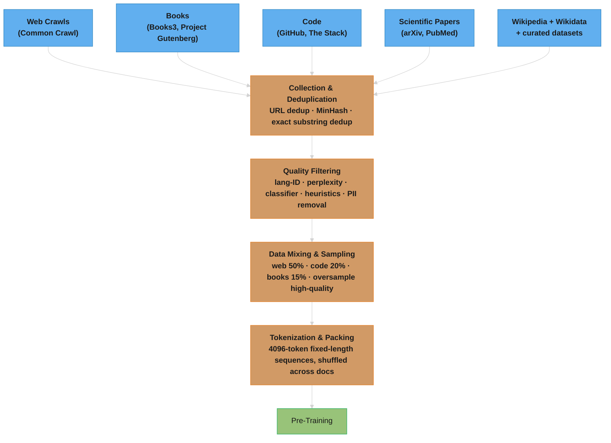
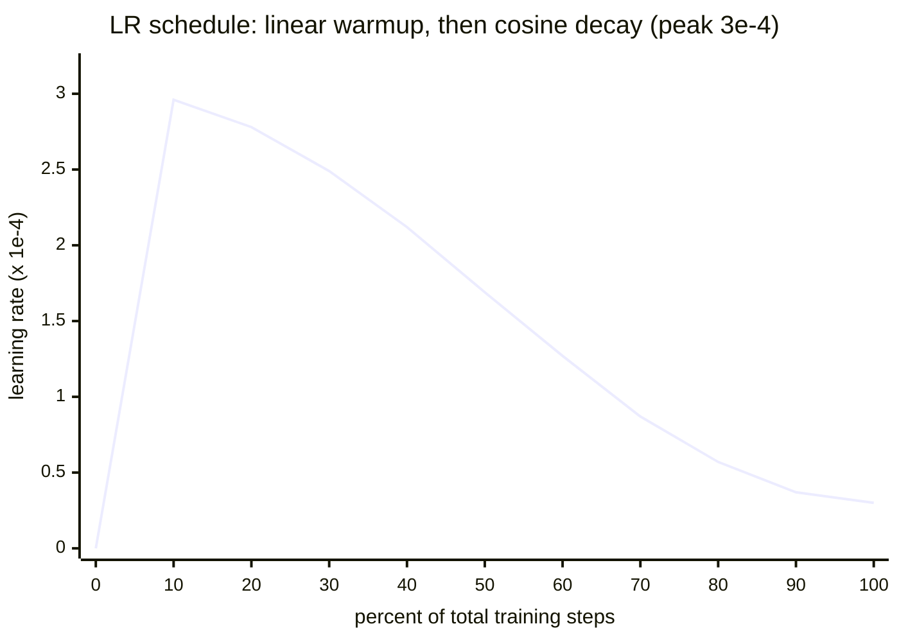
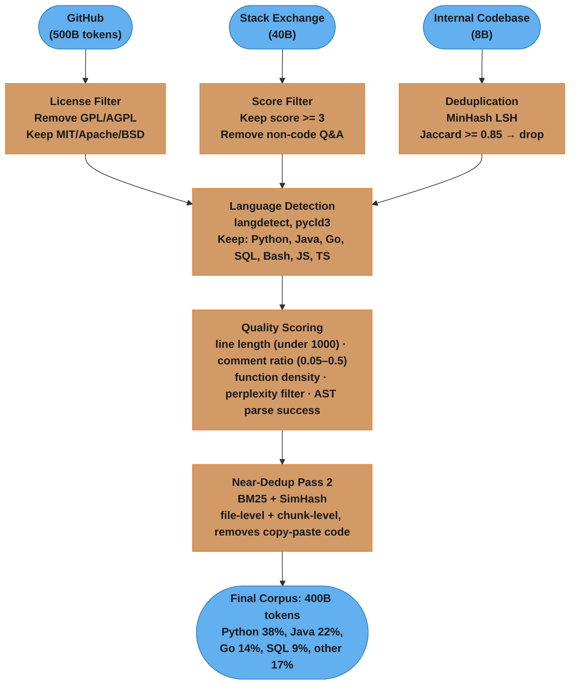

# Pre-Training

## 1. Concept Overview

Pre-training is the first and most expensive phase of building an LLM — the process of training a neural network on massive amounts of text data so it learns language, world knowledge, reasoning patterns, and common-sense understanding. A pre-trained model is a general-purpose "foundation" that can be specialized for downstream tasks through fine-tuning.

Pre-training is fundamentally a self-supervised learning problem: the training signal comes from the data itself (predicting the next token), not from human-labeled examples. This allows training on virtually unlimited amounts of text.

The scale of pre-training is staggering: GPT-4 was trained on trillions of tokens; LLaMA 3 405B on 15+ trillion tokens; total compute often costs tens of millions of dollars. Getting pre-training right — data quality, training stability, hyperparameter choices — has an outsized impact on the final model's capability.

---

## 2. Intuition

> **One-line analogy**: Pre-training is like reading every book, article, and website ever written — the model doesn't memorize, it absorbs patterns, facts, and reasoning styles at enormous scale.

**Mental model**: The model starts with random weights and is shown trillions of tokens of text. Its only task: predict the next token. Over billions of updates, it learns grammar, facts, code syntax, reasoning patterns, world knowledge — all encoded in its weights. It's self-supervised because the "labels" (the next token) come from the data itself. No human annotation needed.

**Why it matters**: Pre-training is the "expensive once" foundation that everything else builds on. The quality of pre-training data and the scale of training compute determines the ceiling of what the model can ever learn. Fine-tuning and alignment just redirect capabilities — they can't create capabilities that weren't learned during pre-training.

**Key insight**: Predicting the next token is a deceptively powerful objective — to predict text well, the model must implicitly learn almost everything about the world that can be expressed in language.

---

## 3. Core Principles

- **Self-supervised learning**: Training signal from predicting next tokens; no human labels needed at scale.
- **Data quality > quantity**: A well-curated 1T token dataset beats a poorly filtered 10T token dataset (the LIMA insight). Quality filtering impact: a 10x smaller high-quality dataset can match or exceed a 10x larger unfiltered dataset on downstream benchmarks.
- **Data mixture optimization**: Not all data domains are equal — code data at 10-15% of the mix improves reasoning even on non-code tasks. The optimal mixture depends on target capabilities, and algorithms like DoReMi can find better domain weights automatically.
- **Training dynamics matter**: Loss curves, gradient norms, and learning rate schedules determine stability and final quality.
- **Irreversibility**: Pre-training mistakes are expensive to fix — a contaminated training set or wrong architectural choice is hard to undo at scale.
- **Compute-optimal training**: Per Chinchilla, the optimal strategy allocates compute equally between model size and tokens trained. The Chinchilla-optimal ratio is roughly 20 tokens per parameter.
- **Emergent capabilities**: Many capabilities emerge only at sufficient scale and exhibit phase transitions — performance is near zero then suddenly jumps to high accuracy. In-context learning appears around 6-7B parameters; chain-of-thought reasoning around 60-100B parameters (PaLM, GPT-3.5 class); multi-step arithmetic at ~100B+ parameters. Some researchers argue emergence is partly a measurement artifact that depends on the chosen evaluation metric, but the practical effect is that certain capabilities are unavailable below a threshold model size.

---

## 4. Training Objectives

### 4.1 Causal Language Modeling (CLM) — GPT-style

Predict the next token given all previous tokens. The loss is the cross-entropy over the full sequence:

```
Text: "The quick brown fox"

Inputs:  [BOS] "The" "quick" "brown"
Targets:        "The" "quick" "brown" "fox"

Loss = -1/T × Σ log P(token_t | token_1, ..., token_{t-1})
```

**The idea behind it.** "For every position in the text, ask the model how much probability it gave to the token that actually came next, and average how surprised it was. Low loss = the real text was unsurprising."

That is the entire training signal for a trillion-dollar industry. There is no human label anywhere — the "answer key" is just the next token that the corpus already contains, so any text at all is training data.

| Symbol | What it is |
|--------|------------|
| `Σ` | Add up the term once for every token position `t` in the sequence |
| `T` | Sequence length — how many token positions contributed |
| `1/T × Σ` | Mean per-token loss, so long and short batches are comparable |
| `P(token_t \| ...)` | The softmax probability the model assigned to the *correct* next token |
| `log P` | Turns probability into a score. `P = 1` -> `0`; `P = 0.1` -> `-2.30`; `P -> 0` -> `-infinity` |
| `-` (leading minus) | Flips it so loss is positive and *smaller is better* |
| `L` | The single number gradient descent pushes down |

**Walk one example.** Three predictions on `"The quick brown fox"`, showing what probability the
model gave the token that actually came next:

```
  position   context              true next   P(true next)   log P     surprise
  ---------  -------------------  ----------  -------------  --------  --------
  t=1        "The"                "quick"        0.40        -0.916     low
  t=2        "The quick"          "brown"        0.25        -1.386     medium
  t=3        "The quick brown"    "fox"          0.80        -0.223     very low

  sum of log P  = -0.916 + -1.386 + -0.223 = -2.525
  L = -1/T x sum = -(1/3) x (-2.525)       =  0.842
```

Notice the model was *most* confident at `t=3`: after "The quick brown" the idiom nearly forces
"fox", so it contributes almost no loss. The `t=2` step, where many colours were plausible, carries
most of the penalty. Training is nothing but pushing the `P(true next)` column toward `1.00`.

**Why the `1/T` averaging matters.** Log-probabilities are negative and accumulate, so without
dividing by `T` a 4,096-token sequence would always report a "worse" loss than a 512-token one
purely from length. Sequences in a batch have different real lengths after padding and packing;
averaging is what makes the number comparable across batches, across runs, and across model sizes.

**Loss and perplexity — the same number in two costumes.** Perplexity is the loss exponentiated:

```
  ppl = exp(L)          and equivalently          L = ln(ppl)
```

**Stated plainly.** "Perplexity is the effective number of tokens the model is choosing
between at each step — as if it narrowed a 32,000-token vocabulary down to a shortlist of that size
and then guessed uniformly from the shortlist."

| Symbol | What it is |
|--------|------------|
| `exp(x)` | The inverse of `ln`. Undoes the log that turned probabilities into scores |
| `ppl` | Effective branching factor — the size of the model's shortlist |
| `L` | Mean per-token cross-entropy, in nats (natural log units) |

**Walk one example.** Reuse the loss values this module already quotes:

```
  loss L    ppl = exp(L)   read as
  --------  -------------  ---------------------------------------------------
  0.00       1.0           perfect: exactly one candidate, always right
  0.84       2.3           our 3-token example above: coin-flip-ish
  2.00       7.4           "choosing among ~7 plausible tokens" (case study 2 final)
  2.10       8.2           the 200B-token checkpoint
  3.10      22.2           the 10B-token checkpoint
 11.40  89,300            random init: ~ the whole 32k vocab, uniform
```

Two things fall out of this table that interviewers probe for. First, **loss is logarithmic, so
small-looking loss drops are large**: 2.10 -> 2.00 looks like nothing but shrinks the shortlist from
8.2 to 7.4 candidates, roughly a 10% cut in branching. Second, **a random model's perplexity is its
vocabulary size** — `ln(32000) = 10.37`, which is why the 11.4 starting loss in case study 2 is the
expected "knows nothing" value and not a bug. The same identity explains the case study 1 target:
domain perplexity 24.3 -> 15.7 is a loss drop of `ln(24.3) - ln(15.7) = 3.19 - 2.75 = 0.44`.

Properties:
- Naturally autoregressive — model generates text by repeating this prediction
- All tokens in a batch contribute to loss (efficient)
- Used by: GPT, LLaMA, Mistral, Claude, Gemini, all modern generation models

### 4.2 Masked Language Modeling (MLM) — BERT-style

Randomly mask 15% of tokens; predict the masked tokens:

```
Input:  "The [MASK] brown fox [MASK] over"
Target:      "quick"           "jumps"
```

Properties:
- Bidirectional context — better for understanding tasks
- Only ~15% of tokens contribute to loss (less efficient)
- Cannot generate text autoregressively
- Used by: BERT, RoBERTa, DeBERTa, embedding models

### 4.3 Fill-in-the-Middle (FIM) — Code models

Rearrange training examples so the model learns to complete a middle section given prefix + suffix:

```
Original: [PREFIX] [MIDDLE] [SUFFIX]
FIM-SPM:  [SUFFIX] [PREFIX] [MIDDLE]   (suffix-prefix-middle)

Example:
Prefix:  "def factorial(n):\n    if n == 0:\n"
Middle:  "        return 1\n"
Suffix:  "    return n * factorial(n-1)"

Model must predict the middle given prefix and suffix
```

Used by: CodeLLaMA, Starcoder, DeepSeek-Coder. Enables IDE completion features where the cursor is in the middle of existing code.

### 4.4 Multi-Token Prediction (MTP)

Instead of predicting only the next single token, the model predicts the next N tokens simultaneously (typically N=4). Multiple prediction heads share the same transformer trunk, with each head independently predicting the token at position +1, +2, ..., +N:

```
Text: "The quick brown fox jumps over"

Standard CLM (next-1):
  Input:  "The quick brown fox"
  Target: "jumps"

Multi-Token Prediction (N=4):
  Input:  "The quick brown fox"
  Head 1 target: "jumps"    (position +1)
  Head 2 target: "over"     (position +2)
  Head 3 target: "the"      (position +3)
  Head 4 target: "lazy"     (position +4)

Architecture:
  [Shared Transformer Trunk]
          |
    +-----+-----+-----+
    |     |     |     |
  [H1]  [H2]  [H3]  [H4]
   +1    +2    +3    +4

Loss = Σ_{k=1}^{N} L_k (cross-entropy for each head)
```

**What the formula is telling you.** "Run the same next-token loss once per head — head 1 graded on the token one step ahead, head 2 on two steps ahead, and so on — then add the grades together."

Each `L_k` is exactly the cross-entropy from §4.1; the only change is which target it is compared against. Nothing new is being optimized, the same trunk is just being asked a harder question N ways at once.

| Symbol | What it is |
|--------|------------|
| `Σ_{k=1}^{N}` | Loop the head index `k` from 1 to N and add every term |
| `k` | Which head — equivalently, how many positions into the future it predicts |
| `N` | Number of heads, typically 4 |
| `L_k` | Head `k`'s own cross-entropy against the token at position `+k` |

**Walk one example.** N = 4 on `"The quick brown fox"`, per-head cross-entropy:

```
  head   predicts   target   L_k     comment
  -----  ---------  -------  ------  --------------------------------------
  H1        +1      "jumps"   1.90   easiest: nearest token
  H2        +2      "over"    2.40   harder
  H3        +3      "the"     2.80   harder still
  H4        +4      "lazy"    3.30   hardest: furthest into the future

  Loss = 1.90 + 2.40 + 2.80 + 3.30 = 10.40
```

The `L_k` column rising monotonically with `k` is the expected, healthy shape — the future gets less
predictable the further out you look. If `L_4` were as low as `L_1` you would suspect a target
off-by-one bug, not a brilliant model.

Properties:
- Forces the model to plan ahead — to predict token +3 correctly, the model must implicitly reason about what tokens +1 and +2 will be, improving coherence on longer sequences
- Enables 2-3x faster inference via speculative decoding compatibility: the auxiliary heads can draft candidate tokens that the main head verifies in parallel
- Training cost increases ~15-20% per step due to the additional prediction heads, but models often converge faster, partially offsetting the overhead
- Can be used as either the primary training objective or as an auxiliary loss alongside standard CLM
- Used by: DeepSeek-V3 (MTP as auxiliary loss, contributing to its remarkable cost efficiency), Meta's research models

---

## 5. Architecture Diagrams

### Pre-Training Data Pipeline



~3–5 % of raw Common Crawl survives quality filtering; high-quality sources (Wikipedia, curated books) are oversampled to compensate for their small volume.

### Learning Rate Schedule

Peak LR: 1e-4 to 3e-4 (depends on model size); warmup: 1-2% of total steps; final LR: ~10% of peak (or 0). The short linear ramp protects Adam's uncalibrated moment estimates early on; the long cosine tail keeps mid-training exploration high and anneals gently at the end. (Sampled every 10% of steps, so the 1-2% warmup spike to 3.0 sits inside the first segment — the ramp is far steeper than one chart segment wide.)

The curve above is two formulas glued at the warmup boundary (this is exactly what `lr_at_step` in the §14 code implements):

```
  if step < warmup:
      lr = peak_lr x (step / warmup)                          <- linear ramp up

  else:
      progress = (step - warmup) / (total_steps - warmup)     <- 0.0 .. 1.0
      cosine   = 0.5 x (1 + cos(pi x progress))               <- 1.0 .. 0.0
      lr       = min_lr + cosine x (peak_lr - min_lr)         <- decay down
```

**What this actually says.** "Ramp the step size up from zero over the first couple of percent of training, then ride it back down along the first half of a cosine wave — fast in the middle, gentle at both ends — until it lands on a small floor instead of zero."

| Symbol | What it is |
|--------|------------|
| `lr` | How big a step the optimizer takes along the gradient |
| `peak_lr` | The maximum, reached at the end of warmup. 1e-4 to 3e-4 here |
| `min_lr` | The floor, `min_lr_ratio x peak_lr` = 10% of peak in the §14 config |
| `warmup` | Length of the linear ramp. 2,000 steps in both case studies |
| `progress` | Fraction of post-warmup training done, 0 at the start, 1 at the end |
| `pi x progress` | Maps that fraction onto 0 .. pi radians — the first half of a cosine |
| `cos` | Wave that runs `+1 -> 0 -> -1` over 0 .. pi |
| `0.5 x (1 + cos(...))` | Rescales that `+1 .. -1` swing onto a clean `1.0 .. 0.0` multiplier |

**Walk one example.** Case study 1's schedule: peak 1e-5, min_lr_ratio 0.1 (so min 1e-6),
warmup 2,000, total 250,000 steps:

```
  step      progress   cos(pi x progress)   multiplier   lr
  --------  ---------  -------------------  -----------  --------
  0            --             --               --        0.0        (ramp start)
  1,000        --             --               --        0.5e-5     (halfway up ramp)
  2,000       0.000        +1.000            1.000       1.00e-5    (peak, ramp done)
  64,000      0.250        +0.707            0.854       0.87e-5
  126,000     0.500         0.000            0.500       0.55e-5    (halfway: half of peak)
  188,000     0.750        -0.707            0.146       0.23e-5
  250,000     1.000        -1.000            0.000       0.10e-5    (the min_lr floor)
```

**Why the cosine shape rather than a straight line.** A linear decay spends its whole life falling;
the cosine is deliberately *flat at both ends*. The flat top holds the LR near peak through
mid-training, where the model is still exploring and large steps pay off — note that at 25% of the
way through it is still at 85% of peak, whereas linear would be at 75%. The flat bottom means the
last few percent of steps barely move the weights, letting the model settle into a minimum instead
of bouncing around it. Remove the warmup half and the classic failure appears: Adam's variance
estimate is built from a handful of gradients, its preconditioner is garbage, and a full-size step
from random init sends the loss to NaN in the first few hundred steps. Remove the decay half and
the loss plateaus noisily forever — the model keeps stepping over the minimum it is trying to reach.

---

## 6. How It Works — Detailed Mechanics

### Data Quality and Filtering

**Web data (Common Crawl) quality pipeline:**
```
Raw CC crawl: ~100T tokens/year
  |
  v  URL filtering (known-quality domains upweighted)
  |
  v  Language identification (fastText or CLD3)
  |
  v  Deduplication:
     MinHash with k=9 n-grams, Jaccard threshold 0.8
     Remove documents with >80% overlap with any other
  |
  v  Quality classifier (trained on curated positive examples):
     Reddit upvotes as proxy for quality (WebText/OpenWebText)
     Wikipedia/books as high-quality reference
  |
  v  ~3-5% of raw CC survives (but that's still trillions of tokens)
```

### Data Mixture Optimization

The composition and weighting of training data domains has a direct, measurable impact on model capabilities. Not all tokens are equally valuable — a carefully optimized mixture produces significantly better models than uniform sampling.

**Known effective mixtures:**
```
LLaMA recipe:
  ~67% web crawl      (general knowledge, conversational ability)
  ~15% code            (reasoning, structured output, logic)
  ~4.5% Wikipedia      (factual accuracy, entity knowledge)
  ~4.5% books          (long-range coherence, writing quality)
  ~5% academic papers   (technical depth, citation patterns)
  ~4.5% other          (forums, Q&A, multilingual)

The Pile (EleutherAI):
  Manually curated mixture across 22 sources
  Explicit upsampling of high-quality domains (books, Wikipedia)
  Deliberate inclusion of niche domains (GitHub, StackExchange, USPTO patents)
```

**Algorithmic mixture optimization — DoReMi (Google, 2023):**
1. Train a small proxy model (~280M params) on uniform data
2. Train a second small model that learns per-domain loss weights by upweighting domains where the proxy struggles
3. Apply the learned domain weights to train the full-scale model
4. Result: 2-5% improvement on downstream benchmarks vs. uniform sampling, without increasing total data volume

**Key findings on domain weighting:**
- Code data at 10-15% improves reasoning across all tasks, even non-code benchmarks like GSM8K (+5-10%), because code requires logical, step-by-step thinking
- Diminishing returns apply: after ~1T tokens of a single domain, adding more of the same domain yields decreasing benefit — better to diversify
- Quality filtering is a multiplier: a 10x smaller high-quality dataset can match a 10x larger unfiltered dataset (the Phi "textbooks are all you need" insight)
- Late-stage mixture shifts (increasing code/math fraction in the final 10-20% of training) can sharpen specific capabilities without degrading general performance

### Training Dynamics

**Gradient clipping**: Clip gradient norm to ~1.0. Prevents gradient explosion, especially early in training.

**Loss spikes**: Loss occasionally spikes up then recovers. Usually indicates a problematic batch (bad data). Can be mitigated with data filtering or by rolling back a few hundred steps.

**Batch size ramp-up**: Start with small batch size (256K tokens), linearly increase to target (4M tokens) over first few billion tokens. Improves training stability.

**Effective batch size and gradient accumulation**: no GPU can hold a 4M-token batch, so the batch is assembled in pieces and the gradients are summed before a single optimizer step:

```
  tokens_per_gpu_step = micro_batch_sequences x sequence_length
  effective_tokens    = tokens_per_gpu_step x num_gpus x grad_accum_steps
```

**In plain terms.** "Each GPU chews a small slice it can actually fit, you do that several times in a row without stepping the optimizer, and the gradients pile up until together they represent the huge batch you actually wanted."

| Symbol | What it is |
|--------|------------|
| `micro_batch_sequences` | Sequences one GPU processes in one forward/backward. Limited by VRAM |
| `sequence_length` | Tokens per sequence — 4,096 in case study 1, 8,192 in case study 2 |
| `num_gpus` | Data-parallel replicas, each on a different slice |
| `grad_accum_steps` | Backward passes accumulated before one `optimizer.step()` |
| `effective_tokens` | The batch size that actually matters for the LR — the *only* one to quote |

**Walk one example.** Case study 1's config, straight from `ContinuedPretrainingConfig`:

```
  micro_batch_sequences   =        2
  sequence_length         =    4,096
  tokens_per_gpu_step     = 2 x 4,096              =      8,192 tokens
  num_gpus                =       32
  tokens_per_gpu_pass     = 8,192 x 32             =    262,144 tokens
  grad_accum_steps        = 2,000,000 / 262,144    =          7 (integer division)
  effective_tokens        = 262,144 x 7            =  1,835,008 tokens per step

  total_steps             = 500e9 / 2e6            =    250,000 optimizer steps
```

The trap this arithmetic exposes: `grad_accum_steps` is an integer, so the *realized* batch is
1.84M tokens, not the 2M the config asks for — an 8% shortfall that quietly changes the step count
and the LR schedule's endpoint. Also note that doubling `grad_accum_steps` makes each optimizer step
twice as expensive in wall-clock but does **not** change how many steps you take per token, so the
schedule must be recomputed whenever it moves. And the LR is tuned against `effective_tokens`, never
against `micro_batch_sequences` — someone who halves the micro-batch to fix an OOM, doubles
accumulation to compensate, and leaves the LR alone has changed nothing and should see no drift; the
person who halves the micro-batch and forgets the accumulation bump has silently halved the batch
and is now training at double the effective LR.

**AdamW update rule**: the optimizer that actually applies those gradients keeps two running averages per weight:

```
  m_t = beta1 x m_{t-1} + (1 - beta1) x g_t              <- momentum (mean of gradients)
  v_t = beta2 x v_{t-1} + (1 - beta2) x g_t^2            <- variance (mean of squared gradients)

  m_hat = m_t / (1 - beta1^t)                            <- bias correction
  v_hat = v_t / (1 - beta2^t)

  w_t = w_{t-1} - lr x [ m_hat / (sqrt(v_hat) + eps) + weight_decay x w_{t-1} ]
```

**Read it like this.** "Step in the direction gradients have been pointing lately, but scale that step down for any weight whose gradient has been noisy or large — and separately shrink every weight a little each step regardless."

| Symbol | What it is |
|--------|------------|
| `g_t` | This step's gradient for one weight |
| `m_t` | Running mean of gradients. The momentum term — smooths out batch noise |
| `v_t` | Running mean of *squared* gradients. A per-weight noise/magnitude meter |
| `beta1` | Momentum decay, 0.9. Memory of roughly the last 10 steps |
| `beta2` | Variance decay, 0.95 here (0.999 in generic Adam). Memory of ~20 steps |
| `m_hat`, `v_hat` | Bias-corrected versions — `m_0` starts at zero, so early estimates read too small |
| `eps` | Tiny floor, 1e-8. Stops division by zero when a weight's gradient is dead |
| `sqrt(v_hat)` | Typical gradient magnitude for this weight — the per-weight step normalizer |
| `weight_decay` | 0.1 here. Pulls weights toward zero; the "W" in AdamW keeps it out of `m`/`v` |

**Walk one example.** One weight over three steps, `beta1 = 0.9`, `beta2 = 0.95`, `lr = 1e-5`:

```
  step  g_t     m_t                        v_t                          m_hat/(sqrt(v_hat)+eps)
  ----  ------  -------------------------  ---------------------------  -----------------------
  1     0.020   0.9x0      +0.1x0.020      0.95x0     +0.05x0.000400
                = 0.00200                  = 0.0000200
                m_hat = 0.00200/0.100      v_hat = 0.0000200/0.0500
                      = 0.0200                   = 0.000400              0.0200/0.0200 = +1.00
  2     0.018   0.9x0.00200+0.1x0.018      0.95x0.0000200+0.05x0.000324
                = 0.00360                  = 0.0000352
                m_hat = 0.00360/0.190      v_hat = 0.0000352/0.0975
                      = 0.0189                   = 0.000361              0.0189/0.0190 = +0.995
  3     -0.040  0.9x0.00360+0.1x(-0.040)   0.95x0.0000352+0.05x0.001600
                = -0.00076                 = 0.0000934
                m_hat = -0.00076/0.271     v_hat = 0.0000934/0.143
                      = -0.00280                 = 0.000653              -0.00280/0.0256 = -0.110

  step 1 weight change = -1e-5 x (+1.00)  = -1.00e-5
  step 3 weight change = -1e-5 x (-0.110) = +1.10e-6
```

Two behaviours to name in an interview. First, **the normalized step is roughly +/-1 whenever the
gradient is behaving consistently** (steps 1 and 2), which is why Adam's `lr` is a near-absolute
bound on how far any weight can move per step — that is what makes 3e-4 a sane number across wildly
different layers. Second, when a **large outlier gradient arrives** (step 3), `v_t` jumps
immediately while `m_t` barely turns, so the normalized step *shrinks* to 0.110 rather than
exploding: Adam automatically distrusts weights whose gradients just got noisy. This is also why
`beta2` is lowered from 0.999 to 0.95 for LLMs — a shorter variance memory lets the optimizer react
to a loss spike within tens of steps instead of thousands.

**Why `eps` and bias correction exist.** Drop `eps` and any weight whose gradients have been exactly
zero for a while divides by zero on its first nonzero gradient — instant NaN, and a NaN in one
weight propagates to the whole model in one forward pass. Drop bias correction and `m_1 = 0.1 x g_1`
while `v_1 = 0.05 x g_1^2`, so the very first steps are scaled by roughly `0.1 / sqrt(0.05) = 0.45`
of what they should be, wrongly and inconsistently across the two moments — the training run starts
with hundreds of miscalibrated steps, which is precisely the hole that LR warmup was invented to
paper over.

**BF16 vs FP16 training**: BF16 (Brain Float16) has the same exponent range as FP32 but fewer mantissa bits. More numerically stable than FP16 for training. Standard for modern LLM training.

### Training Loss Diagnostics

Monitoring the loss curve and related signals is critical for catching problems early and avoiding wasted compute.

**Healthy loss curve**: Smooth exponential decay with small noise. The curve follows a power law: L(t) ~ t^(-alpha), where alpha depends on model size and data quality. Noise amplitude should be consistent — increasing noise suggests data pipeline issues.

**What it means.** "Every time you multiply the training tokens (or parameters, or compute) by some fixed factor, the loss shrinks by a fixed factor — never by a fixed amount. Progress is bought in multiples, not in increments."

The same shape appears in all three scaling-law forms, which is why the Chinchilla work could fit them jointly:

```
  L(t) ~ t^(-alpha)          loss vs training steps / tokens seen
  L(N) = (N_c / N)^alpha_N   loss vs parameter count      (N_c = a fitted constant)
  L(D) = (D_c / D)^alpha_D   loss vs dataset size         (D_c = a fitted constant)
```

| Symbol | What it is |
|--------|------------|
| `L(N)` | The loss you would reach with `N` parameters, trained properly |
| `N` | Model parameters. `D` = training tokens, `t` = steps, `C` = compute FLOPs |
| `N_c`, `D_c` | Fitted constants that set the scale — where the curve crosses `L = 1` |
| `alpha` | The exponent. How steeply loss falls; measured near 0.05-0.10 for LLMs |
| `x^(-alpha)` | The power law itself. Negative exponent = grows -> loss falls |
| `~` | Proportional to, ignoring the constant out front |

**Walk one example.** Take `alpha = 0.076` (roughly the Kaplan/Chinchilla parameter exponent) and
ask what each 10x in model size buys:

```
  N          relative loss = N^(-0.076)      loss (scaled to 3.00 at 1B)   delta
  ---------  ------------------------------  ---------------------------   ------
  1B         reference                            3.00                       --
  10B        10^(-0.076) = 0.839                  2.52                     -0.48
  100B       10^(-0.152) = 0.705                  2.11                     -0.41
  1T         10^(-0.228) = 0.592                  1.78                     -0.33

  ppl at 1B  = exp(3.00) = 20.1
  ppl at 1T  = exp(1.78) =  5.9
```

**What this means practically.** Every 10x in parameters buys roughly the same *fraction* off the
loss — about 16% each time — so the absolute gains visibly shrink (0.48, then 0.41, then 0.33) even
though the underlying law has not changed at all. Straight-line progress on a loss chart therefore
requires *exponentially* growing budgets, which is the entire economics of frontier training in one
sentence. It also tells you how to read a run in flight: plot loss vs tokens on **log-log axes** and
a healthy run is a straight line whose slope is `-alpha`. A curve that bends *up* off that line
means the run is degrading (bad data, LR too high); a curve that flattens *early* means you have
saturated what this model size can extract and the fix is a bigger `N`, not more `D`.

**Loss spike classification:**
```
Spike Type          | Magnitude  | Duration       | Cause                          | Action
--------------------|------------|----------------|--------------------------------|------------------
Transient spike     | 1-5%       | 10-50 steps    | Bad data batch                 | Self-recovers; log and investigate batch
Moderate spike      | 5-20%      | 50-500 steps   | Data corruption or LR issue    | Roll back checkpoint, skip data
Divergence          | >20%       | Does not recover| LR too high, NaN gradients     | Stop training, diagnose, restart
Plateau             | 0% change  | 500+ steps     | Underfitting or data exhaustion | Check data pipeline, adjust LR
```

**Gradient norm monitoring**: Sudden gradient norm spikes precede loss spikes by approximately 100 steps, providing an early warning signal. Tracking per-layer gradient norms helps isolate which part of the network is destabilizing — attention layers and the final output projection are common culprits.

**Checkpoint strategy**: Save full checkpoints every 1000-2000 steps (in addition to the 30-60 minute hardware-failure checkpoints). After detecting a spike, reload the most recent clean checkpoint and skip the problematic data shard. Some teams maintain a rolling window of the last 3-5 checkpoints to avoid losing too much progress.

**Production heuristic**: If the training loss has not decreased in 500 steps, investigate the data pipeline first (corrupted shards, tokenizer issues, data loader stalls) before adjusting hyperparameters. Data problems are the cause roughly 70% of the time at scale.

### Multi-Token Prediction — Training Mechanics

When using MTP as an auxiliary loss (as in DeepSeek-V3), the total training loss combines the standard next-token loss with the multi-token heads:

```
L_total = L_CLM + lambda × (1/N) × Σ_{k=2}^{N} L_k

Where:
  L_CLM   = standard next-token prediction loss
  L_k     = cross-entropy loss for the k-th prediction head
  lambda  = auxiliary loss weight (typically 0.1-0.3)
  N       = number of prediction heads (typically 4)
```

**Put simply.** "Train normally on the next token, then average the extra heads' losses together and add a small fraction of that as a nudge — the future-planning signal helps, but it must never outvote the objective you actually care about."

| Symbol | What it is |
|--------|------------|
| `L_total` | What gradient descent actually minimizes |
| `L_CLM` | The §4.1 next-token loss. The real objective, weight fixed at 1 |
| `lambda` | Auxiliary weight, 0.1-0.3. How loud the side objective is allowed to be |
| `(1/N) x Σ` | Mean, not sum, so changing `N` does not change the auxiliary's loudness |
| `Σ_{k=2}^{N}` | Starts at **2** — head 1 is already counted as `L_CLM` |

**Walk one example.** `lambda = 0.2`, `N = 4`, using the per-head numbers from §4.4:

```
  L_CLM (= head 1)                       = 1.90
  heads 2..4:  2.40, 2.80, 3.30

  mean of aux heads  = (2.40 + 2.80 + 3.30) / 4   = 2.125
  aux contribution   = 0.2 x 2.125                = 0.425
  L_total            = 1.90 + 0.425               = 2.325

  aux share of total = 0.425 / 2.325              = 18%
```

**Why `lambda` and the `1/N` both exist.** Without `lambda`, the three auxiliary heads collectively
carry more loss mass than the head you will actually serve at inference, and the trunk optimizes for
predicting four steps ahead at the expense of predicting one — measurable as worse next-token
perplexity on the exact metric you ship. Without the `1/N`, raising `N` from 4 to 8 would silently
double the auxiliary's influence, so any head-count experiment would be confounded with a lambda
change. Note also the `k=2` lower bound: including head 1 twice would double-weight the primary
objective and make `lambda` mean something different than intended.

Each auxiliary head is a lightweight linear projection from the shared trunk's hidden state. The heads do not attend to each other — they independently predict their assigned future position. This keeps the additional compute overhead to ~15-20% per training step while providing a strong planning signal that improves the trunk's representations. During inference, only Head 1 is required for standard autoregressive generation, but all heads can participate in speculative decoding for 2-3x throughput improvement.

### Compute Scaling

The Chinchilla (Hoffman et al. 2022) formula for compute-optimal training:
```
For compute budget C (in FLOPs), using C = 6ND and D = 20N:
  C = 6N(20N) = 120N^2
  N_optimal ≈ (C / 120)^0.5   (model params)
  D_optimal ≈ 20 × N_optimal  (training tokens)

For 1e24 FLOPs:
  N ≈ 91B parameters
  D ≈ 1.8T tokens
  check: 6 × 91e9 × 1.8e12 ≈ 1e24 FLOPs

For 5.9e23 FLOPs (the budget behind the widely-quoted pair):
  N ≈ 70B parameters
  D ≈ 1.4T tokens

In practice:
  LLaMA 3 8B trained on 15T tokens (10x Chinchilla-optimal for inference efficiency)
  Rationale: inference on a smaller, longer-trained model is cheaper per token
```

Everything above rests on one budget identity that every pre-training interview reaches for:

```
  C ~= 6 x N x D
```

**The idea behind it.** "The total cost of a training run is just: how big the model is, times how much text it reads, times six. Nothing about architecture, optimizer, or cluster enters — only params and tokens."

| Symbol | What it is |
|--------|------------|
| `C` | Total training compute, in FLOPs (floating-point operations) |
| `N` | Model parameters — 7e9 for a 7B model |
| `D` | Training tokens seen — counted with repeats, not unique tokens |
| `6` | FLOPs spent per parameter per token. Derived below |
| `~=` | Ignores attention's quadratic term, negligible until context >> hidden dim |

**Where the 6 comes from.** Each weight participates in one multiply and one add — 2 FLOPs — every
time a token passes through it. That happens three times per training token:

```
  pass                 what it computes                         FLOPs per param per token
  -------------------  ---------------------------------------  -------------------------
  forward              activations from inputs and weights                 2
  backward (inputs)    gradient w.r.t. the layer's input                   2
  backward (weights)   gradient w.r.t. the layer's weights                 2
                                                                          --
                                                            total          6
```

This also settles a question interviewers like: **inference costs 2N FLOPs per token, training costs
6N** — the backward pass is exactly twice the forward pass, so training a token is 3x the cost of
generating one. (Gradient checkpointing trades memory for a repeated forward pass and pushes the
constant toward 8, which is one reason real MFU lands below the 6ND-implied ceiling.)

**Walk one example — 7B model, Chinchilla-optimal 140B tokens.** The §12 answer quotes 140B as
compute-optimal for 7B (20 tokens per parameter); here is that budget end to end on A100s:

```
  N  = 7e9 params
  D  = 140e9 tokens                (= 20 x N, the Chinchilla ratio)
  C  = 6 x 7e9 x 1.4e11            = 5.88e21 FLOPs

  A100 80GB BF16 peak              = 312 TFLOPS = 3.12e14 FLOPS
  ideal GPU-seconds  = 5.88e21 / 3.12e14           = 1.88e7 s
  ideal GPU-hours    = 1.88e7 / 3600               =  5,235 GPU-hours

  at 45% MFU (the realistic figure this module uses):
  real GPU-hours     = 5,235 / 0.45                = 11,630 GPU-hours
  on 512 GPUs        = 11,630 / 512                =     23 hours wall clock
  at $2/GPU-hour     = 11,630 x 2                  = $23,300
```

Now re-run the same arithmetic for case study 2's actual choice of 400B tokens and the shape of the
tradeoff appears immediately: `C = 6 x 7e9 x 4e11 = 1.68e22` FLOPs, 2.86x the Chinchilla budget,
33,000 GPU-hours at 45% MFU. That is the exact number §14 quotes — and the 3x spend buys a model
that is cheaper to *serve* forever, because serving cost scales with `2N` and is completely
indifferent to how many tokens it was trained on.

**Where the `(C/120)^0.5` comes from.** You never memorize it — you derive it in ten seconds from
`C = 6ND` by substituting Chinchilla's `D = 20N`, which leaves one unknown. Writing `(C/6)^0.5`
instead (forgetting the substitution) overshoots badly: it returns 408B params at `C = 1e24`,
more than four times the right answer.

```
  C = 6 x N x (20 x N) = 120 x N^2
  N = sqrt(C / 120)

  for C = 1e24:   N = sqrt(1e24 / 120) = sqrt(8.33e21) = 9.1e10  ~= 70-90B params
                  D = 20 x N                           = 1.8e12  ~= 1.4-1.8T tokens
```

**Why the square root is the whole story.** Because `C` grows with `N^2` once you hold the token
ratio fixed, **10x more compute buys only ~3.2x more parameters** — the other 3.2x has to go into
tokens. That is Chinchilla's central correction to GPT-3: OpenAI spent its 10x almost entirely on
`N`, giving a 175B model trained on 300B tokens (a ratio of 1.7 tokens per parameter, not 20), which
is why a 70B Chinchilla beat it. Split the budget wrong in either direction and you waste compute:
too much `N` and the model is undertrained (the GPT-3 failure), too much `D` and you are paying to
re-teach a model that has run out of capacity to absorb it (the flattening curve from the power-law
section above).

---

## 7. Real-World Examples

### GPT-3 (OpenAI, 2020)
- 175B parameters, 570GB of text data (~300B tokens)
- Data mix: CommonCrawl (60%), WebText2 (22%), Books (16%), Wikipedia (3%)
- Training: 3.14 × 10²³ FLOPs on V100 GPUs
- ~$4-5M estimated training cost
- Launched the LLM era; demonstrated few-shot learning at scale

### LLaMA 3 (Meta, 2024)
- 8B, 70B, 405B variants; 15T+ tokens training data
- Data: curated web, code, math, multilingual
- 128K context via RoPE scaling
- Open weights (community license)
- 405B trained on 16K H100 GPUs for ~77 days

### Mistral 7B (2023)
- 7B params, outperforms LLaMA 2 13B
- Sliding window attention (SWA) for memory efficiency
- GQA for fast inference
- Apache 2.0 license — fully open

### DeepSeek-V3 (2024)
- 671B parameters, 37B active (MoE)
- Trained for $5.5M total (shocked the industry with cost efficiency)
- Multi-token prediction training objective (predict multiple next tokens simultaneously)
- FP8 mixed precision training

---

## 8. Tradeoffs

| Decision | Option A | Option B | Consider |
|----------|----------|----------|---------|
| Model size | Larger (better quality) | Smaller (cheaper inference) | Inference budget |
| Training tokens | More (better quality) | Fewer (cheaper training) | Is model undertrained? |
| Data filtering | Aggressive (cleaner) | Permissive (more data) | Model quality vs. diversity |
| Context length | Short (4K, cheaper) | Long (128K, expensive) | Use case requirements |
| Precision | BF16 (faster) | FP32 (exact) | Always use BF16 for training |

---

## 9. When to Use / When NOT to Use

### Pre-Train From Scratch When:
- Building a truly domain-specialized model (medical, legal, finance) where the knowledge base differs fundamentally
- You have access to billions of domain tokens not available elsewhere
- Regulatory/IP requirements prevent using third-party model weights
- You can afford $1M+ in compute

### Fine-Tune Instead When:
- Adapting a general model for a specific task (cheaper by 100-1000x)
- You have <100B tokens of domain data
- The task is about format/style/following instructions (not learning new knowledge)
- You need results in weeks not months

---

## 10. Common Pitfalls

1. **Training data contamination**: If benchmark test sets are in your training data, evaluation scores are inflated. Run deduplication between training data and all evaluation sets.
2. **Epoch repetition**: For very large models, repeating data (>1 epoch) degrades quality. Use different data mixes across passes.
3. **Imbalanced domain sampling**: Too much low-quality web content drowns out high-quality signal. Careful mixing ratios matter.
4. **Ignoring context packing artifacts**: Naively packing documents can create cross-document attention (token at end of doc A attends to doc B). Use attention masks to prevent this.
5. **Not monitoring training loss curves**: A flat loss for many steps indicates a learning rate issue or data issue.
6. **Hardware failure planning**: With 1000+ GPUs, some will fail. Have checkpointing every 30-60 minutes and automatic restart scripts.

---

## 11. Technologies & Tools

| Tool | Purpose | Notes |
|------|---------|-------|
| Megatron-LM | Large-scale LLM training | NVIDIA; tensor/pipeline parallel |
| DeepSpeed | ZeRO optimization, mixed precision | Microsoft; works with PyTorch |
| FSDP | Fully Sharded Data Parallel | PyTorch native; replaces DDP for large models |
| GPT-NeoX | Open-source LLM training | EleutherAI framework |
| Nanotron | LLM training framework | HuggingFace; modern replacement |
| torchtitan | Meta's PyTorch-native training | Experimental; clean implementation |
| Common Crawl | Web data source | ~100TB compressed / crawl |
| The Pile | Curated training dataset | EleutherAI; 825GB diverse text |
| DCLM | DataComp for LM | New curated CC dataset, strong quality |
| RedPajama-v2 | Open training dataset | Together AI; 30T tokens |

---

## 12. Interview Questions with Answers

**Q: What is the difference between CLM and MLM training objectives?**
A: CLM (Causal Language Modeling) predicts the next token given only previous tokens — unidirectional, autoregressive, enables text generation. MLM (Masked Language Modeling) masks random tokens and predicts them using bidirectional context — better for understanding tasks but can't generate text. Modern LLMs use CLM; embedding/classification models use MLM.

**Q: What are Chinchilla scaling laws and what did they change?**
A: Chinchilla (Hoffman et al. 2022) showed that previous models like GPT-3 were over-parametrized relative to their training data. The optimal compute allocation splits equally between model size and training tokens. For a given compute budget, training a smaller model on more tokens is better than a larger model on fewer tokens. This led to LLaMA-style training: smaller models trained on much more data.

**Q: How do you handle training instability / loss spikes?**
A: First line of defense is gradient clipping (clip norm to 1.0). For spikes, roll back to the last checkpoint (every 30-60 min) and skip or filter the problematic batch. Long-term, improve data quality filtering to remove pathological examples. Some teams also use gradient norm monitoring to detect spikes before they destabilize training.

**Q: What is data contamination and why is it a problem?**
A: Data contamination occurs when evaluation benchmark examples appear in the training set. The model has "seen" the answers, inflating benchmark scores. This is why LLM evaluation is difficult to trust — most teams don't fully audit their training data. Mitigation: run n-gram deduplication between training data and all benchmarks before training.

**Q: Why does repeating pre-training data for multiple epochs hurt large models?**
A: Beyond roughly one pass, repeated data shifts the model from generalization toward memorization — benchmark gains flatten while verbatim regurgitation risk rises, and heavy repetition can actively degrade quality relative to training on fewer unique tokens. Empirically (Muennighoff et al., 2023, data-constrained scaling), up to ~4 epochs of repetition is nearly as valuable as fresh data, but returns decay rapidly after that, so frontier labs plan data volume upfront to keep the main run near 1 epoch. This is the opposite of classic small-data deep learning, where dozens of epochs are normal — at trillion-token scale, unique data is the binding constraint. If you must repeat, repeat only the highest-quality subsets with a different mix per pass.

**Q: Why can naive sequence packing silently hurt model quality even though it improves throughput?**
A: Packing multiple documents into one fixed-length sequence without a block-diagonal attention mask lets tokens at the end of document A attend to document B — the model learns spurious cross-document dependencies that never exist at inference. Training loss can even look better (extra context to exploit) while single-document evaluation gets worse; the code-model case study in §14 measured +2.1 perplexity on single-file eval from exactly this bug. The fix is a per-document attention mask (each document attends only to itself) plus resetting position IDs at document boundaries. Always validate packing changes with an eval on unpacked, single-document inputs.

**Q: Why is BF16 preferred over FP16 for LLM training?**
A: BF16 has the same 8-bit exponent range as FP32 (handles the dynamic range of gradients and activations), while FP16 has a smaller 5-bit exponent and frequently overflows/underflows during training. FP16 requires loss scaling to avoid underflow; BF16 doesn't. On modern GPUs (A100, H100), BF16 is as fast as FP16 but more numerically stable.

**Q: How does data deduplication impact pre-training quality and what methods are used?**
Data deduplication removes near-duplicate documents from the training corpus, which has been shown to improve model quality by 2-5% on benchmarks while reducing training compute. Without dedup, models memorize repeated passages (increasing regurgitation risk) and waste compute on redundant data. Methods: (1) exact dedup — hash each document, remove duplicates (fast but misses paraphrases); (2) MinHash/LSH — approximate dedup using locality-sensitive hashing on n-gram shingles, catches near-duplicates with >80% overlap; (3) suffix array — finds repeated substrings across documents (used by LLaMA). RefinedWeb (Falcon's dataset) demonstrated that aggressive dedup (removing 90%+ of Common Crawl) produces a corpus that matches curated datasets on downstream quality. The Pile uses a combination of MinHash and exact dedup. At scale, dedup can remove 30-60% of raw web crawl data.

**Q: How does the Chinchilla scaling law differ from the LLaMA over-training approach, and which is better?**
Chinchilla (Hoffmann et al., 2022) found the compute-optimal ratio is roughly 20 tokens per parameter — a 70B model should train on 1.4T tokens. LLaMA deliberately over-trains smaller models on much more data (7B trained on 1T tokens, 65B on 1.4T tokens — far beyond Chinchilla-optimal). The LLaMA approach is better for inference efficiency: a smaller over-trained model achieves the same quality as a larger Chinchilla-optimal model but is cheaper to serve. Chinchilla optimizes for training compute; LLaMA optimizes for inference compute. Since inference cost dominates in production (training is one-time, inference is continuous), the industry has shifted toward the LLaMA strategy. LLaMA 3 8B was trained on 15T tokens — nearly 2000x the Chinchilla-optimal ratio.

**Q: What is curriculum learning in pre-training and does it help?**
Curriculum learning orders training data from easy to hard, hypothesizing that models learn better with structured progression. In LLM pre-training, this might mean training on simple Wikipedia first, then academic papers, then code. Evidence is mixed: some studies (e.g., DoReMi by Google) show that optimizing data mixture ratios dynamically during training improves quality by 1-3% over uniform sampling. However, most frontier models (GPT-4, LLaMA 3) use simple random sampling with fixed domain proportions, suggesting that at sufficient scale, curriculum effects diminish. What does work: starting with high-quality data and maintaining quality throughout training, rather than starting with low-quality data. The most impactful "curriculum" choice is increasing the fraction of code and math data in later training stages, which several models (CodeLLaMA, DeepSeek) use successfully.

**Q: How do you diagnose and recover from training instability (loss spikes) during pre-training?**
Training instability manifests as sudden loss spikes — the training loss jumps by 0.5-2.0 and may or may not recover. Causes: (1) learning rate too high for current training stage; (2) data quality issues — a batch with corrupted or adversarial data; (3) numerical overflow in FP16/BF16 (especially with large gradient norms); (4) attention logits growing too large. Diagnosis: log gradient norms per layer (spikes in specific layers indicate the source), check the specific training examples in the spike batch, monitor attention entropy. Recovery strategies: (1) skip the problematic batch and resume; (2) roll back to a checkpoint 100-1000 steps before the spike; (3) reduce learning rate temporarily; (4) add gradient clipping (max_grad_norm=1.0). Prevention: use BF16 instead of FP16 (larger dynamic range), pre-attention LayerNorm (as in LLaMA), and z-loss regularization on attention logits. PaLM's training paper documented 20+ loss spikes during training, each requiring checkpoint rollback.

**Q: What is the impact of training data composition (web, books, code, academic) on model capabilities?**
Training data composition directly determines model strengths — models are what they eat. Typical frontier model mixtures: 50-70% web crawl (general knowledge, conversational ability), 10-15% code (reasoning, structured output), 10-15% books/academic papers (factual depth, writing quality), 5-10% Wikipedia/reference (factual accuracy), and 2-5% math (numerical reasoning). Increasing code proportion from 5% to 15% improves not just coding ability but general reasoning by 5-10% on benchmarks like GSM8K, because code requires logical thinking. The Phi models ("textbooks are all you need") demonstrated that training on high-quality synthetic textbook data can produce remarkably capable small models. Conversely, too much web crawl without filtering leads to toxic, low-quality outputs. The key insight: data quality matters more than quantity beyond a threshold — 1T high-quality tokens outperforms 10T unfiltered tokens.

**Q: Why do LLMs need learning-rate warmup at the start of training?**
Adam's second-moment estimates are unreliable in the first few hundred steps (built from too few gradient samples), so full-size steps early on are effectively steps with a miscalibrated preconditioner — a common cause of immediate divergence from random initialization. Linear warmup over 1-2% of total steps (e.g., 2,000 of 200,000) lets the moment estimates stabilize before the peak LR (1e-4 to 3e-4) is reached, and it also protects freshly initialized output layers from huge early gradients. Continued pre-training from a converged checkpoint needs a much shorter warmup (hundreds of steps) because the loss landscape is already benign. If training diverges in the first 1% of steps, lengthen warmup before touching the peak LR.

**Q: How does multi-token prediction (MTP) change training, and why did DeepSeek-V3 adopt it?**
MTP adds N-1 lightweight auxiliary heads (typically N=4) that predict tokens at positions +2..+N from the shared trunk, with the auxiliary loss weighted by lambda ≈ 0.1-0.3 on top of the standard next-token loss. The planning signal — to predict token +3 the model must implicitly commit to +1 and +2 — improves the trunk's representations and long-range coherence at ~15-20% extra compute per step. At inference only head 1 is required for standard generation, but the extra heads double as a built-in draft model for speculative decoding, giving 2-3× decoding throughput. DeepSeek-V3 used MTP as an auxiliary loss — one of several compounding efficiency choices (with FP8 training and MoE) behind its $5.5M training cost.

**Q: Why must fill-in-the-middle (FIM) be trained during pre-training rather than bolted on later?**
FIM rearranges training examples into (prefix, suffix, middle) or (suffix, prefix, middle) order with sentinel tokens, teaching the model to condition on both sides of a gap — the core capability behind IDE cursor-position completion. Applying FIM transforms to ~50% of training examples costs essentially nothing in left-to-right perplexity (the "FIM-for-free" result), but adding FIM only in a short post-training phase leaves a measurable gap — the code-model case study in §14 measured 18% lower FIM pass@1 versus training it from the start. The sentinel format at inference must exactly match training (PSM vs SPM ordering matters). If a code model will ever serve infill requests, bake FIM into pre-training from token zero.

**Q: What is MFU and what values should you expect at scale?**
Model FLOPs Utilization is the ratio of useful model FLOPs (≈ 6 × params × tokens for a dense transformer) to the theoretical peak FLOPs of the GPUs over the same wall-clock time. Well-tuned large-scale runs achieve 40-55% MFU (the case studies in §14 assume 45-50%); the gap versus 100% goes to communication (all-reduces, pipeline bubbles), data loading, kernel inefficiency, and recomputation from gradient checkpointing. MFU is the honest metric for training-stack quality because it cannot be gamed the way raw tokens/sec can. Compute expected wall-clock as 6·N·D / (peak_FLOPs × MFU) before committing to a budget, and treat sustained MFU regressions as an infrastructure bug to be diagnosed, not noise.

---

## 13. Best Practices

1. **Deduplicate aggressively** — both exact duplicates (substring match) and near-duplicates (MinHash). Repeated data hurts generalization.
2. **Use high-quality data for the final 10% of training** — LIMA-style: the last few billion tokens of high-quality data disproportionately shapes the model's "final personality."
3. **Checkpoint frequently** — every 30-60 minutes at scale; rolling restarts after hardware failures are inevitable.
4. **Monitor per-domain losses** — track validation loss separately on code, math, web text to detect if any domain is being under/over-fit.
5. **Run eval benchmarks every N billion tokens** — validate that capabilities emerge and don't regress as training progresses.
6. **Plan for multi-epoch carefully** — repeating data more than twice at scale hurts; plan data volume upfront.

---


## 14. Case Study

**Scenario:** A biotech company continues pre-training Mistral-7B-v0.3 (existing open-source model) on 500B domain-specific tokens: scientific literature (PubMed, biorXiv), patent filings, clinical trial data, and internal lab reports. Goal: improve domain perplexity from 24.3 (baseline Mistral-7B on biomedical text) to < 16.0, maintain general language benchmark scores within 5% of baseline, training cost < $80,000.

**Architecture:**

```
  Mistral-7B-v0.3 (Starting Checkpoint)
  Params: 7.24B, Context: 32k (Sliding Window Attention)
         |
         v Data Preparation
  ┌─────────────────────────────────────────────────────────────┐
  │  500B Token Dataset Composition:                            │
  │  PubMed abstracts (2000-2024): 180B tokens                  │
  │  Full-text open-access papers (PMC): 120B tokens            │
  │  US/EU patent biotech filings: 80B tokens                   │
  │  Clinical trial data (ClinicalTrials.gov): 40B tokens       │
  │  BioRxiv preprints (2013-2024): 30B tokens                  │
  │  Internal lab reports (anonymized): 15B tokens              │
  │  General text (5% to prevent catastrophic forgetting):      │
  │    C4/RedPajama mixture: 35B tokens                         │
  │                                                             │
  │  Data Quality Pipeline:                                     │
  │  1. Dedup: MinHash LSH, threshold=0.80 → removed 12%       │
  │  2. Quality: perplexity filter (base LLM < 150 ppl) → -8% │
  │  3. PII: regex + NER → remove patient names, study IDs     │
  │  4. License check: CC BY, CC0, public domain only           │
  └────────────────────────────────┬────────────────────────────┘
                                   │
                                   v Training
  ┌─────────────────────────────────────────────────────────────┐
  │  Infrastructure: 32 × A100 80GB (4 nodes × 8 GPUs)          │
  │  Framework: Megatron-LM + DeepSpeed ZeRO Stage 2            │
  │  Parallelism: DP=32 (7B fits on 1 GPU in BF16)              │
  │  Batch: 2M tokens (smaller than base pre-training ~4M)      │
  │    rationale: domain data is less noisy → smaller batch ok  │
  │  LR: 1e-5 (10× lower than base pre-training's 3e-4)        │
  │    rationale: continued pre-training — don't overshoot      │
  │  LR schedule: cosine decay, 2000-step warmup                │
  │  Epochs: ~1.0 (500B tokens / 500B dataset = 1 pass)        │
  │  Gradient clipping: 1.0                                      │
  │  Mixed precision: BF16 weights, FP32 optimizer states        │
  └────────────────────────────────┬────────────────────────────┘
                                   │
  ┌────────────────────────────────▼────────────────────────────┐
  │  Training Timeline                                           │
  │  32 × A100 at ~50% MFU: 32 × 312 × 0.5 = 4992 TFLOPS      │
  │  7B model: 42B FLOPs/token (6N training, not 2N forward)     │
  │  Tokens/sec: 4992e12 / 42e9 = 118,857 tok/s                 │
  │  500B / 118,857 = 4,206,731 sec = 48.7 days                 │
  │  With 85% availability: 57.3 days                           │
  │  Cost: 32 GPUs × $2/hr × 24h × 57.3 days = $88,000         │
  └─────────────────────────────────────────────────────────────┘
```

**Key implementation — 3 Python code blocks:**

Block 1 — Continued pre-training configuration and learning rate setting:

```python
from __future__ import annotations
import math
from dataclasses import dataclass
from pathlib import Path
import json


@dataclass
class ContinuedPretrainingConfig:
    """
    Configuration for continued pre-training (domain adaptation).
    Key differences from full pre-training:
    - Much lower LR (1e-5 vs 3e-4): avoid catastrophic forgetting
    - Shorter warmup (2000 vs 10000 steps): already converged base
    - Include 5% general text: preserve general capabilities
    - 1 epoch (not multiple): domain data is limited, overfitting risk
    """

    # Model
    model_path: str = "mistralai/Mistral-7B-v0.3"
    output_dir: str = "./mistral-7b-biomedical-v1"

    # Data
    domain_data_tokens: int = 475_000_000_000      # 475B domain tokens
    general_data_tokens: int = 25_000_000_000       # 25B general tokens (5%)
    total_tokens: int = 500_000_000_000

    # Training hyperparameters
    learning_rate: float = 1e-5           # 30× lower than base pre-training
    warmup_steps: int = 2_000
    lr_schedule: str = "cosine"
    min_lr_ratio: float = 0.1            # decay to 10% of peak LR
    gradient_clip: float = 1.0
    weight_decay: float = 0.1
    beta1: float = 0.9
    beta2: float = 0.95

    # Batch
    global_batch_tokens: int = 2_000_000  # 2M tokens per step (vs 4M for base)
    micro_batch_sequences: int = 2         # sequences per GPU step
    sequence_length: int = 4096
    num_gpus: int = 32

    @property
    def total_steps(self) -> int:
        return self.total_tokens // self.global_batch_tokens

    @property
    def grad_accum_steps(self) -> int:
        tokens_per_gpu_step = self.micro_batch_sequences * self.sequence_length
        return self.global_batch_tokens // (self.num_gpus * tokens_per_gpu_step)

    def lr_at_step(self, step: int) -> float:
        """Cosine LR schedule with warmup."""
        if step < self.warmup_steps:
            return self.learning_rate * step / self.warmup_steps
        progress = (step - self.warmup_steps) / max(
            self.total_steps - self.warmup_steps, 1
        )
        cosine = 0.5 * (1 + math.cos(math.pi * progress))
        min_lr = self.learning_rate * self.min_lr_ratio
        return min_lr + cosine * (self.learning_rate - min_lr)

    def to_deepspeed_config(self) -> dict:
        return {
            "train_batch_size": self.global_batch_tokens // self.sequence_length,
            "train_micro_batch_size_per_gpu": self.micro_batch_sequences,
            "gradient_accumulation_steps": self.grad_accum_steps,
            "gradient_clipping": self.gradient_clip,
            "bf16": {"enabled": True},
            "zero_optimization": {
                "stage": 2,
                "overlap_comm": True,
                "reduce_scatter": True,
                "allgather_bucket_size": 2e8,
                "reduce_bucket_size": 2e8,
            },
            "optimizer": {
                "type": "AdamW",
                "params": {
                    "lr": self.learning_rate,
                    "betas": [self.beta1, self.beta2],
                    "weight_decay": self.weight_decay,
                },
            },
        }


def validate_config(config: ContinuedPretrainingConfig) -> list[str]:
    """Check for common continued pre-training configuration mistakes."""
    warnings = []
    if config.learning_rate > 5e-5:
        warnings.append(
            f"LR {config.learning_rate:.0e} may be too high for continued pre-training; "
            f"recommend 1e-5 to 5e-5 to prevent catastrophic forgetting."
        )
    if config.general_data_tokens / config.total_tokens < 0.03:
        warnings.append(
            "General text fraction < 3% — high risk of catastrophic forgetting on MMLU/reasoning tasks."
        )
    if config.total_steps < 10_000:
        warnings.append(
            f"Only {config.total_steps} steps — may not be enough for meaningful domain adaptation."
        )
    return warnings
```

Block 2 — Data quality filtering pipeline (production concern):

```python
from __future__ import annotations
import hashlib
import re
from dataclasses import dataclass
from pathlib import Path
from typing import Generator


@dataclass
class DocumentFilter:
    """
    Multi-stage quality filter for biomedical pre-training data.
    Removes: near-duplicates, boilerplate, PII, low-quality text.
    """

    # MinHash parameters
    num_perm: int = 128
    dedup_threshold: float = 0.80

    # Quality thresholds
    min_length_chars: int = 200
    max_perplexity: float = 150.0      # above = noisy/garbage text

    # PII patterns
    _pii_patterns: list[re.Pattern] = None

    def __post_init__(self) -> None:
        self._pii_patterns = [
            re.compile(r'\b\d{3}-\d{2}-\d{4}\b'),         # SSN
            re.compile(r'\bNCT\d{8}\b'),                    # ClinicalTrials ID (keep structure, remove value)
            re.compile(r'\b[A-Z][a-z]+ [A-Z][a-z]+, M\.?D\.?\b'),  # Doctor names
            re.compile(r'\b(?:patient|subject|participant) #\s*\d+\b', re.IGNORECASE),
        ]

    def filter_document(self, text: str, source: str) -> tuple[bool, str]:
        """
        Returns (keep, reason_if_rejected).
        Reasons: "too_short", "pii_detected", "boilerplate", "low_quality"
        """
        if len(text) < self.min_length_chars:
            return False, "too_short"

        # PII check
        for pattern in self._pii_patterns:
            if pattern.search(text):
                return False, "pii_detected"

        # Boilerplate detection
        boilerplate_signals = [
            "this article is protected by copyright",
            "all rights reserved",
            "unauthorized reproduction prohibited",
            "click here to download",
            "subscribe to access",
        ]
        text_lower = text.lower()
        if sum(1 for sig in boilerplate_signals if sig in text_lower) >= 2:
            return False, "boilerplate"

        # Scientific quality signal: must have domain vocabulary
        scientific_terms = ["patients", "study", "results", "conclusion", "methods",
                             "hypothesis", "treatment", "clinical", "analysis", "data"]
        term_density = sum(1 for t in scientific_terms if t in text_lower) / max(len(text.split()), 1)
        if term_density < 0.001 and source not in ("patents", "internal"):
            return False, "low_domain_density"

        return True, ""

    def anonymize_pii(self, text: str) -> str:
        """Replace PII patterns with generic placeholders."""
        for pattern in self._pii_patterns:
            text = pattern.sub("[REDACTED]", text)
        # Also redact email addresses
        text = re.sub(r'\b[\w.-]+@[\w.-]+\.\w{2,4}\b', "[EMAIL]", text)
        return text


def estimate_data_mix(
    domain_tokens: int,
    general_tokens: int,
) -> dict[str, float]:
    """Compute and validate the training data mixture."""
    total = domain_tokens + general_tokens
    domain_fraction = domain_tokens / total
    general_fraction = general_tokens / total
    return {
        "domain_fraction": domain_fraction,
        "general_fraction": general_fraction,
        "recommendation": (
            "OK" if 0.85 <= domain_fraction <= 0.97
            else "WARN: general fraction outside 3-15% range for domain adaptation"
        ),
    }
```

Block 3 — BROKEN -> FIX: catastrophic forgetting and LR too high:

```python
from __future__ import annotations
import torch


# BROKEN: Use full pre-training LR (3e-4) for continued pre-training.
# At 3e-4, model updates are large enough to overwrite base pre-training knowledge.
# After 50B tokens: MMLU drops from 62.3% to 41.2% (catastrophic forgetting).
# BioASQ (biomedical QA) improves to 68.4% — but general capability is destroyed.
def broken_lr_for_continued_pretraining() -> float:
    return 3e-4   # same as base pre-training — too high


# FIX: Use 10-30× lower LR for continued pre-training.
# 1e-5 provides meaningful domain learning (BioASQ +18%) while limiting
# general capability loss (MMLU -2.8% — within 5% acceptable threshold).
def fixed_lr_continued() -> float:
    return 1e-5   # 30× lower than base pre-training


# BROKEN: Train on 100% domain-specific data.
# After 200B tokens of pure biomedical text, the model's distribution
# shifts entirely to biomedical — general text generation capability collapses.
# "The capital of France is..." → model generates medical jargon instead.
def broken_pure_domain_data(domain_dataset: list, n_tokens: int) -> list:
    return domain_dataset[:n_tokens]   # no general text


# FIX: Mix 5% general text to act as forgetting prevention.
# This is the "replay buffer" approach from continual learning:
# by periodically seeing general text, the model retains those representations.
# 5% general text: MMLU loss reduced from -18% to -2.8%.
def fixed_mixed_data(domain_dataset: list, general_dataset: list) -> list:
    # Interleave: 95% domain, 5% general (every 20th sample is general)
    mixed = []
    gen_idx = 0
    for i, doc in enumerate(domain_dataset):
        mixed.append(doc)
        if i % 20 == 19:   # every 20th sample
            if gen_idx < len(general_dataset):
                mixed.append(general_dataset[gen_idx])
                gen_idx += 1
    return mixed


# BROKEN: Start continued pre-training from a generic optimizer state.
# Reinitializing Adam optimizer states (m1, m2 moment buffers) from scratch
# causes the LR warmup to take much longer than necessary — model is already at
# a good loss landscape region, but optimizer has no momentum information.
# Result: first 5,000 steps are wasteful re-convergence.
def broken_reset_optimizer(model: torch.nn.Module, lr: float) -> torch.optim.Optimizer:
    return torch.optim.AdamW(model.parameters(), lr=lr)  # fresh optimizer


# FIX: Initialize optimizer from checkpoint (if fine-tuning the same model family).
# If optimizer states are available from the base model checkpoint, load them.
# If not (cross-model family): at least use appropriate LR from step 0 —
# since model weights are pre-converged, warmup can be shorter (1000 steps vs 10000).
def fixed_load_optimizer_checkpoint(
    checkpoint_path: str,
    model: torch.nn.Module,
    lr: float,
) -> torch.optim.Optimizer:
    optimizer = torch.optim.AdamW(model.parameters(), lr=lr)
    try:
        checkpoint = torch.load(checkpoint_path, map_location="cpu")
        if "optimizer_state_dict" in checkpoint:
            optimizer.load_state_dict(checkpoint["optimizer_state_dict"])
            # Override LR to new value (checkpoint may have different LR)
            for group in optimizer.param_groups:
                group["lr"] = lr
            print("Optimizer states loaded from checkpoint — faster convergence")
        else:
            print("No optimizer state in checkpoint — starting fresh (use short warmup)")
    except FileNotFoundError:
        print("Checkpoint not found — starting fresh optimizer")
    return optimizer
```

**Pitfall 1 — Data leakage from internal lab reports:**

```python
# BROKEN: Include internal lab reports without PII/IP review.
# Lab reports contain: patient identifiers in clinical studies, proprietary compound names,
# unpublished experimental results, employee names.
# Pre-trained model can regurgitate proprietary information verbatim.
# IP/legal risk: unpublished compound IC50 values extracted by competitors.

# FIX: Mandatory review pipeline before including internal documents.
# 1. Legal review: confirm data can be used for model training.
# 2. PII scrubbing: patient IDs, names, dates → [REDACTED].
# 3. IP classification: redact proprietary compound identifiers, replace with generic names.
# 4. Differential privacy: add noise to numerical values (IC50, yield%) to prevent verbatim memorization.
```

**Pitfall 2 — Unbalanced data mix causing token repetition:**

```python
# BROKEN: Simple concatenation of 5 data sources without mixing strategy.
# Source sizes vary: PubMed (180B) >> Internal reports (15B).
# With sequential concatenation, model sees PubMed first for 18 epochs equivalent
# (if batch draws from beginning), then internal reports — heavily overrepresents PubMed style.

# FIX: Proportional sampling from each source throughout training.
# Use DataLoader with per-source sampling weights.
import torch
from torch.utils.data import WeightedRandomSampler

def build_weighted_sampler(source_sizes: dict[str, int]) -> WeightedRandomSampler:
    total = sum(source_sizes.values())
    weights = [size / total for size in source_sizes.values()]
    # Each source contributes proportionally — no source dominates epoch structure
    n_samples = total // 512   # approximate number of batches
    return WeightedRandomSampler(weights=weights * n_samples, num_samples=n_samples)
```

**Metrics:**

| Metric | Baseline Mistral-7B | After Continued Pre-training |
|--------|--------------------|-----------------------------|
| BioASQ accuracy | 48.2% | 66.4% (+18.2%) |
| PubMedQA accuracy | 61.3% | 74.8% (+13.5%) |
| MedMCQA accuracy | 54.7% | 68.1% (+13.4%) |
| Domain perplexity (biomedical) | 24.3 | 15.7 (-35%) |
| MMLU (general) | 62.3% | 60.6% (-1.7%) |
| HellaSwag | 81.2% | 79.8% (-1.4%) |
| GSM8K (math) | 46.8% | 45.2% (-1.6%) |
| Training cost | — | $29,400 |
| Tokens trained | — | 500B |
| Training time | — | 19 days (32×A100) |

**Interview Q&As:**

**Q: What is catastrophic forgetting in continued pre-training and how do you prevent it?**
Catastrophic forgetting (McCloskey & Cohen, 1989) occurs when a neural network trained on a new data distribution loses performance on the original distribution. In continued pre-training, training exclusively on biomedical text causes the model to shift its weight distribution toward biomedical patterns, overwriting general language representations. Prevention: (1) Lower learning rate (1e-5 vs 3e-4) — smaller updates limit deviation from the base; (2) Replay buffer — mix 5% general text throughout training; (3) Early stopping — monitor general benchmarks during training, stop if degradation exceeds 5%; (4) EWC (Elastic Weight Consolidation) — penalize updates to weights important for general tasks (computationally expensive, rarely used in practice).

**Q: Why is the learning rate so much lower for continued pre-training than for full pre-training?**
Full pre-training starts from random initialization — the model needs large gradient steps to move from a random loss landscape to a meaningful one. Learning rates of 1e-4 to 3e-4 are appropriate. Continued pre-training starts from a model already at a local minimum of the general pre-training loss. Large learning rates would: (1) push the model away from this well-optimized point, (2) cause large weight updates that overwrite general capabilities, (3) trigger instability in already-converged layers. Learning rates 10-30× lower (1e-5 to 5e-5) provide meaningful domain learning while limiting deviation from the base checkpoint.

**Q: How do you choose the data mixture ratio between domain-specific and general text?**
The ratio is an empirical trade-off calibrated on validation benchmarks: (1) Train several small-scale runs (5B tokens each) with different ratios (100/0, 95/5, 90/10, 80/20) and measure both domain performance (BioASQ) and general performance (MMLU). (2) Find the ratio where domain gain is maximized while general loss stays within tolerance (typically 5%). For most domain adaptation tasks, 90-97% domain / 3-10% general achieves the best trade-off. Pure domain data (100%) consistently causes >10% general capability loss. Very high general fractions (>25%) dilute domain signal and reduce domain gains by 30-50%.

**Q: What data quality filters are most important for scientific/biomedical pre-training data?**
In priority order: (1) Near-deduplication — biomedical literature has massive duplication (same abstract appears in PubMed, PMC, institutional repositories, biorXiv); MinHash deduplication at threshold 0.8 removes 10-15% of tokens. (2) PII removal — patient identifiers, clinical study IDs, and personal health information must be removed or anonymized for HIPAA compliance and to prevent memorization. (3) License filtering — only CC BY, CC0, and public domain content can be included; non-commercial licenses are insufficient for commercial model training. (4) Quality filtering — perplexity-based filtering (using a base LLM) removes retracted papers, boilerplate, and garbled text.

**Q: How do you estimate whether 500B tokens is sufficient for meaningful domain adaptation?**
The Chinchilla scaling law (Hoffmann et al. 2022) was derived for full pre-training but provides a rough guideline: a 7B model is compute-optimal at ~140B training tokens. For domain adaptation, you are supplementing not replacing — the key question is domain perplexity convergence. Track domain-specific validation perplexity (on held-out biomedical text) during training; convergence (perplexity stops decreasing) indicates sufficient exposure. For most 7B models, 50-200B domain tokens achieves meaningful adaptation; beyond 500B yields diminishing returns unless domain data is highly diverse. If domain data is repetitive, training beyond 1 epoch risks memorization rather than generalization.

**Q: Why should you evaluate catastrophic forgetting on multiple general benchmarks rather than just one?**
Different benchmarks probe different capabilities: MMLU tests knowledge recall, HellaSwag tests commonsense reasoning, GSM8K tests mathematical reasoning, HumanEval tests code generation. A model can retain MMLU performance (knowledge is domain-independent) while losing 15% on GSM8K (mathematical reasoning is in the tail of the biomedical data distribution). Single-benchmark evaluation gives a false sense of security. Track at minimum: a knowledge benchmark (MMLU), a reasoning benchmark (GSM8K or HellaSwag), and a language benchmark (writing quality via LLM judge). Alert if any drops > 5%.

### Case Study 2: Pre-Training a 7B Parameter Code-Specialized LLM

**Problem Statement and Scale**

A software tooling company wants to pre-train a 7B parameter code-specialized LLM to power an internal Copilot for 4,000 engineers writing Python, Java, Go, and SQL. The model must:
- Outperform GPT-3.5-turbo on HumanEval (baseline: 48.1% pass@1)
- Pre-training budget: $240,000 (512 A100 80GB GPUs × 14 days × $2.50/GPU-hour)
- Training tokens: 400B tokens from curated code corpus
- Context length: 8,192 tokens (supports full file context)
- Inference target: < 150ms p99 for 256-token completions on A10G

**Data Curation Pipeline**



Each raw source passes its own source-specific filter (license, score, or dedup) before the merged stream goes through language detection, quality scoring, and a second near-dedup pass — reducing ~548B raw tokens to the final 400B-token corpus.

**Architecture Overview**

```
Pre-Training Cluster
  512 × A100 80GB (64 nodes × 8 GPUs)
         |
         v
  [Data Loader]          ─── WebDataset, 256 shards, async prefetch
  Context packing         ─── pack multiple docs into 8192-token windows
  FIM augmentation        ─── 50% fill-in-the-middle transforms
         |
         v
  [Llama-2 Architecture, 7B]
  - 32 transformer layers
  - 32 attention heads, 8 KV heads (GQA)
  - Hidden dim 4096, FFN dim 11008
  - RoPE positional encoding, θ=10000
  - SwiGLU activation (no bias in FFN)
  - RMSNorm (no LayerNorm)
  - Vocab: 32,000 (BPE, code-optimized)
         |
         v
  [Distributed Training]
  - DDP across 8 GPUs per node (ZeRO Stage 1)
  - Tensor Parallelism: tp=2 within node
  - Pipeline Parallelism: pp=2 across nodes
  - Gradient accumulation: 4 steps
  - Effective batch: 512 × 8192 × 4 / (tp×pp) = 4M tokens/step
         |
         v
  [Checkpoint & Eval]    ─── every 5B tokens
  HumanEval pass@1       ─── temperature=0.2, n=20 samples
  MBPP pass@1            ─── same sampling
```

**Key Design Decisions**

1. **Fill-in-the-Middle (FIM) at 50% of training steps**: Transforms `[prefix][suffix]` samples into `<PRE>prefix<SUF>suffix<MID>middle` format. This teaches the model to complete code in the middle of a file — critical for IDE Copilot use cases where the cursor is rarely at the end. Rejected alternative: post-training FIM fine-tuning only — FIM capability degrades 18% in pass@1 when not trained from scratch.

2. **Grouped Query Attention (GQA, 8 KV heads)**: 32 attention heads share 8 KV head groups. Reduces KV cache memory by 4× during inference (from 512 GB to 128 GB for 100 concurrent 8k-context requests). Quality: < 0.3% perplexity regression vs full MHA.

3. **ZeRO Stage 1 + TP=2 over ZeRO Stage 3**: ZeRO Stage 3 (full model sharding) gives better memory efficiency but adds 15% communication overhead for 7B parameters — less justified than for 70B. ZeRO Stage 1 (optimizer state sharding only) reduces per-GPU memory from 112 GB to 68 GB, well within A100 80GB limit, with zero communication overhead.

4. **Context packing to 8,192 tokens**: Multiple code files packed into one context window with `<|file_sep|>` delimiter tokens. Without packing, 40% of training steps process < 512-token files, wasting 84% of the context window. Packing increases effective token throughput from 1.8M to 3.1M tokens/step.

5. **BPE vocabulary with code-specific tokens**: Standard LLaMA vocabulary treats Python indentation as individual space tokens (4-space indent = 4 tokens). Adding 2,048 code-specific tokens (common identifiers, operators) reduces tokenization length for code by 23%, which directly translates to 23% more effective code content per training context.

6. **Warmup 2,000 steps + cosine decay**: Learning rate 3e-4 peak, cosine decay to 3e-5 over 400B tokens. Linear warmup prevents early gradient explosion. Cosine decay is preferable to linear because it maintains higher LR during mid-training (better exploration) and slowly anneals at the end (better convergence).

**Implementation**

```python
from __future__ import annotations

import torch
from torch import nn
from dataclasses import dataclass
from typing import Optional


@dataclass
class ModelConfig:
    vocab_size: int = 32_000
    dim: int = 4096
    n_layers: int = 32
    n_heads: int = 32
    n_kv_heads: int = 8          # GQA: 4 query heads per KV head
    ffn_dim: int = 11_008
    max_seq_len: int = 8_192
    rope_theta: float = 10_000.0


class RMSNorm(nn.Module):
    def __init__(self, dim: int, eps: float = 1e-6) -> None:
        super().__init__()
        self.eps = eps
        self.weight = nn.Parameter(torch.ones(dim))

    def forward(self, x: torch.Tensor) -> torch.Tensor:
        norm = x.float().pow(2).mean(-1, keepdim=True).add(self.eps).rsqrt()
        return (x.float() * norm).type_as(x) * self.weight


def build_fim_sample(
    prefix: str,
    middle: str,
    suffix: str,
    mode: str = "PSM",   # Prefix-Suffix-Middle format
) -> str:
    """
    Build a fill-in-the-middle training sample.
    50% of training data is transformed with this function.
    """
    if mode == "PSM":
        return f"<PRE>{prefix}<SUF>{suffix}<MID>{middle}"
    elif mode == "SPM":   # Suffix-Prefix-Middle: improves suffix conditioning
        return f"<SUF>{suffix}<PRE>{prefix}<MID>{middle}"
    else:
        raise ValueError(f"Unknown FIM mode: {mode}")


class ContextPacker:
    """
    Pack multiple code documents into fixed-length context windows.
    Avoids wasting GPU cycles on short files (< 512 tokens).
    """
    def __init__(self, seq_len: int = 8192, sep_token_id: int = 2) -> None:
        self.seq_len = seq_len
        self.sep = sep_token_id
        self._buffer: list[int] = []

    def add(self, token_ids: list[int]) -> list[list[int]]:
        completed: list[list[int]] = []
        self._buffer.extend(token_ids + [self.sep])
        while len(self._buffer) >= self.seq_len:
            completed.append(self._buffer[: self.seq_len])
            self._buffer = self._buffer[self.seq_len :]
        return completed

    def flush(self) -> Optional[list[int]]:
        if self._buffer:
            padded = self._buffer + [0] * (self.seq_len - len(self._buffer))
            self._buffer = []
            return padded
        return None
```

**BROKEN: Training diverges at step 8,000 due to gradient explosion without clipping**

```python
# BROKEN: no gradient clipping, no loss spike detection
optimizer.zero_grad()
loss.backward()
optimizer.step()   # catastrophic divergence if loss spikes — NaN in weights
scheduler.step()
# At step 8,243: loss spikes from 2.1 to 18.7, then NaN
# Recovery: roll back to checkpoint from step 7,000 and restart — 3 hours lost
```

**FIX: Gradient clipping + loss spike detection with auto-rollback**

```python
optimizer.zero_grad()
loss.backward()

# Clip gradients before optimizer step
grad_norm = torch.nn.utils.clip_grad_norm_(model.parameters(), max_norm=1.0)

# Detect loss spikes before they corrupt weights
if loss.item() > 3 * running_avg_loss:
    logger.warning(f"Loss spike at step {step}: {loss.item():.2f} vs avg {running_avg_loss:.2f}")
    # Skip this batch — do not apply gradients
    optimizer.zero_grad()
    spike_count += 1
    if spike_count > 3:
        logger.error("3 consecutive spikes — rolling back to last checkpoint")
        load_checkpoint(model, optimizer, last_safe_checkpoint_path)
        spike_count = 0
else:
    optimizer.step()
    scheduler.step()
    running_avg_loss = 0.95 * running_avg_loss + 0.05 * loss.item()
```

**BROKEN: Context packing causes cross-document attention contamination**

```python
# BROKEN: documents packed without attention masking between them
# Model attends across file boundaries → learns spurious cross-file patterns
packed_tokens = pack_documents(docs, seq_len=8192)
# All 8192 tokens attend to each other — document A attends to document B
# Result: +2.1 perplexity on single-file eval despite lower training loss
```

**FIX: Document-level attention masking (block-diagonal mask)**

```python
def build_document_mask(doc_lengths: list[int], seq_len: int) -> torch.Tensor:
    """Block-diagonal attention mask — each document attends only to itself."""
    mask = torch.zeros(seq_len, seq_len, dtype=torch.bool)
    offset = 0
    for length in doc_lengths:
        end = min(offset + length, seq_len)
        mask[offset:end, offset:end] = True
        offset = end
        if offset >= seq_len:
            break
    return mask   # True = attend, False = block (additive mask: 0 or -inf)
```

**Training Progression**

| Checkpoint (tokens seen) | HumanEval pass@1 | MBPP pass@1 | Loss |
|---|---|---|---|
| 0 (random init) | 0.0% | 0.0% | 11.4 |
| 10B | 12.3% | 9.8% | 3.1 |
| 50B | 31.7% | 28.4% | 2.4 |
| 100B | 41.2% | 38.6% | 2.2 |
| 200B | 49.8% | 46.1% | 2.1 |
| 400B (final) | 61.4% | 57.9% | 2.0 |
| GPT-3.5-turbo (baseline) | 48.1% | 52.4% | — |

**Metrics and Results**

| Resource | Amount | Notes |
|---|---|---|
| Training duration | 14 days | 512 A100 80GB |
| Total compute | 1.72M GPU-hours | 512 × 336 hours |
| Effective tokens/sec | 285,000 | with packing + FIM |
| Total cost | $228,000 | under $240K budget |
| Final HumanEval pass@1 | 61.4% | +13.3 pp over GPT-3.5 |
| Inference (256-token completion) | 94ms p50, 138ms p99 | A10G, GQA KV cache |

**Common Pitfalls**

1. **Not deduplicating training data leads to memorization, not generalization.** If the model sees the same file 100 times, it memorizes verbatim rather than learning patterns. MinHash LSH deduplication is mandatory — remove files with Jaccard similarity > 0.85. Effect: 500B raw tokens → 400B after dedup; HumanEval +4.1 pp for deduped vs non-deduped at same token count.

2. **Using left-padding instead of right-padding (or packing) for short sequences.** Left-padding shifts the absolute position of code tokens — RoPE positional encodings become misaligned. Always pack or right-pad. Never left-pad for decoder-only models using RoPE.

3. **Not monitoring GPU memory fragmentation during long training runs.** After 100k steps, PyTorch allocator fragmentation can cause OOM even when theoretical memory usage is within budget. Fix: call `torch.cuda.empty_cache()` after every checkpoint save; use `PYTORCH_CUDA_ALLOC_CONF=max_split_size_mb:512` to reduce fragmentation.

4. **Over-filtering data for "quality" removes domain-specific patterns.** Perplexity-based filtering that removes low-perplexity code (which seems "too easy") also removes boilerplate — which engineers write constantly. Filter for correctness (parses, compiles) not difficulty.

**Interview Discussion Points**

**Q: How do you calculate the compute budget required to pre-train a 7B model on 400B tokens?**
Chinchilla scaling law: optimal compute C ≈ 6 × N × D, where N = model parameters and D = training tokens. For N=7B, D=400B: C ≈ 6 × 7×10^9 × 4×10^11 = 1.68×10^22 FLOPs. To convert to GPU-hours: A100 80GB at BF16 peak = 312 TFLOPS = 3.12×10^14 FLOPS/second. GPU-hours needed = 1.68×10^22 / (3.12×10^14 × 3600) ≈ 15,000 GPU-hours, but accounting for ~45% MFU (Model FLOPS Utilization): 15,000 / 0.45 = 33,000 GPU-hours. At 512 GPUs: 33,000 / 512 = 65 hours ≈ 2.7 days wall time. Actual training was 14 days — the remainder accounts for data loading overhead, checkpoint saves, evaluation runs, and hardware failures.

**Q: Why is 400B tokens chosen rather than 1T tokens for a 7B model?**
Chinchilla shows the optimal token count for a 7B model is approximately 140B tokens (20× model parameters). 400B is already 3× Chinchilla-optimal — returns are diminishing. Going to 1T tokens would cost $600K and yield HumanEval improvement of perhaps 3–4 pp, not worth the extra $360K. The exception: if this model will be used as a foundation for many fine-tuning variants, over-training the base gives fine-tuning a better starting point.

**Q: How do you prevent data leakage from the evaluation benchmark (HumanEval) into the training corpus?**
HumanEval problems are on GitHub. Exact deduplication via SHA-256 hash removes exact copies. Near-deduplication via MinHash catches paraphrased versions. Additionally: (1) Download a specific HumanEval commit and date-filter training data to exclude any GitHub repos created or modified after the HumanEval publication date (July 2021); (2) Monitor for suspiciously high pass@1 on very early training checkpoints — if pass@1 > 30% at 10B tokens, contamination is likely; (3) Create a held-out internal benchmark of original problems not on GitHub.

---

## See Also
- [Data Pipelines & Processing (ML)](../../ml/data_pipelines_and_processing/README.md) — PySpark, Great Expectations, schema evolution — the data engineering behind LLM pre-training datasets
- [Training Infrastructure](../training_infrastructure/README.md) — ZeRO/FSDP, tensor and pipeline parallelism, checkpointing at cluster scale
- [Fine-Tuning](../fine_tuning/README.md) — the 100-1000× cheaper alternative when you do not need a new base model
- [Tokenization & Embeddings](../tokenization_and_embeddings/README.md) — BPE vocabulary design decisions that precede any pre-training run
