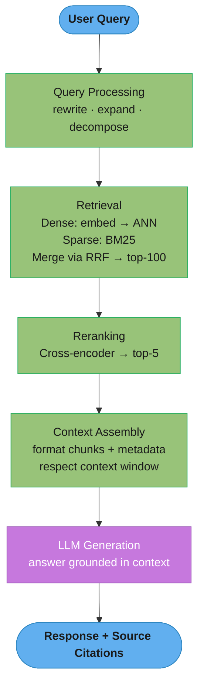
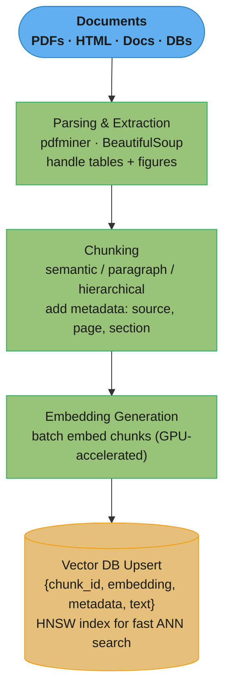
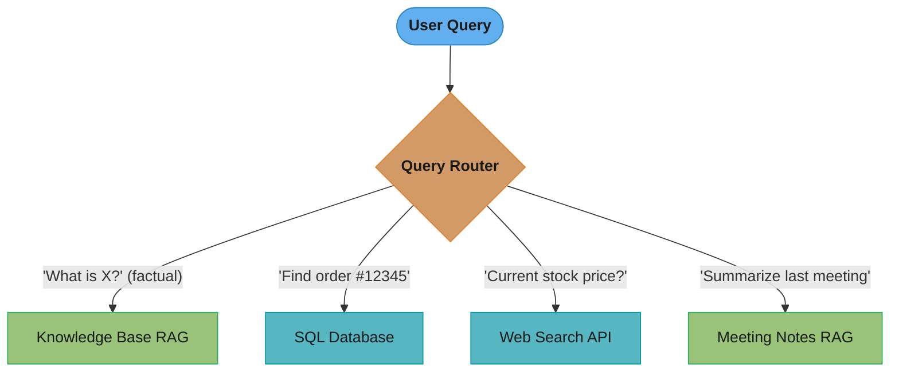

# RAG Fundamentals

## 1. Concept Overview

RAG (Retrieval-Augmented Generation) solves a fundamental problem with LLMs: they have a fixed knowledge cutoff and can't access private or up-to-date information. RAG extends LLMs with a retrieval component that fetches relevant documents at query time, injecting them into the prompt as context before generation.

The intuition: instead of asking an LLM to "remember" an answer from training (which may be stale or absent), RAG turns the LLM into a reader that synthesizes information from provided documents — much like how a human researcher reads relevant sources before answering.

RAG is now the dominant architecture for enterprise LLM applications: customer support, internal knowledge bases, documentation Q&A, research assistants. It enables LLMs to answer questions accurately over millions of private documents without expensive fine-tuning.

---

## 2. Intuition

> **One-line analogy**: RAG turns an LLM from a closed-book exam (relying only on memorized knowledge) to an open-book exam (reading relevant sources before answering).

**Mental model**: A base LLM knows only what was in its training data (knowledge cutoff). RAG adds a retrieval step: when you ask a question, first search a document corpus for relevant chunks, stuff those chunks into the context window, then let the LLM synthesize an answer from the provided text. The LLM acts as a reader and synthesizer, not a memory bank. If the answer isn't in the retrieved chunks, a well-aligned LLM will say "I don't know" rather than hallucinating.

**Why it matters**: RAG is the dominant architecture for enterprise LLM applications — it enables accurate answers over private, up-to-date knowledge bases without expensive fine-tuning. It's why corporate chatbots can answer questions about internal documents, and why AI search engines can cite recent sources.

**Key insight**: The quality of RAG is determined by retrieval quality — if the right documents aren't retrieved, the LLM can't generate the right answer no matter how capable it is. "Garbage in, garbage out" applies to retrieval.

---

## 3. Core Principles

- **Separation of concerns**: Retrieval handles access to current/private information; generation handles synthesis and reasoning.
- **Context window as the interface**: Retrieved documents are injected into the LLM's context — the retrieval quality directly bounds RAG quality.
- **Chunking strategy determines recall**: How you split documents determines what can be retrieved. Poor chunking = poor recall.
- **Retrieval quality > Generation quality**: If the right context isn't retrieved, even GPT-4 can't produce a correct answer.
- **Grounding reduces hallucination**: LLMs anchored to retrieved documents hallucinate significantly less than relying on parametric memory alone.
- **Evaluation is hard**: RAG evaluation requires measuring both retrieval quality (is the right doc found?) and generation quality (is the answer correct and grounded?).

---

## 4. Components

### 4.1 Chunking

Documents must be split into chunks before embedding. Chunk size and strategy significantly impact retrieval quality.

**Fixed-size chunking** (simplest):
```
text = "Long document..."
chunks = [text[i:i+500] for i in range(0, len(text), 500)]
# Problem: splits mid-sentence, destroys context
```

**Sentence/paragraph chunking** (better):
```
Split on: paragraph breaks, sentence boundaries, section headers
Target: 100-500 tokens per chunk
Overlap: 20-50 tokens between consecutive chunks (preserves boundary context)
```

**Semantic chunking** (best):
```
1. Embed consecutive sentences
2. When cosine similarity drops significantly between adjacent sentences:
   → mark as chunk boundary (topic shift detected)
Produces variable-size chunks aligned with semantic content
```

**Hierarchical chunking**:
```
Parent chunk: entire section (~1000 tokens)
Child chunks: paragraphs within section (~200 tokens)

Retrieve: small child chunks (precise)
Context: provide parent chunk (complete context)
```

**Typical chunk sizes:**
```
Q&A tasks:      100-300 tokens (precise, specific answers)
Summarization:  500-1500 tokens (more context needed)
Code:           1 function or class per chunk (semantic boundaries)
Legal docs:     1 clause per chunk (natural legal unit)
```

### 4.2 Embedding

Convert text chunks to dense vectors for similarity search:

```python
from sentence_transformers import SentenceTransformer

model = SentenceTransformer("BAAI/bge-base-en-v1.5")

chunks = ["Paris is the capital of France.", "The Eiffel Tower is in Paris."]
embeddings = model.encode(chunks)  # shape: [2, 768]
```

At query time, embed the user query and find nearest neighbor chunks. "Nearest" is almost always measured by cosine similarity:

```
cosine(q, d) = (q · d) / (||q|| x ||d||)

  q · d  = Sigma over i of (q_i x d_i)   <- dot product across all 768 dimensions
  ||q||  = sqrt(Sigma over i of q_i^2)   <- Euclidean length of the query vector
```

**Reading it in plain English.** "Ignore how long the two texts are and how loud their vectors are — compare only the *direction* they point in."

That framing is why cosine, not raw dot product, is the retrieval default. A 30-token sentence and a 400-token paragraph on the same topic produce vectors of very different lengths; dividing by both lengths cancels magnitude out so only topic direction survives.

| Symbol | Say it | What it is |
|--------|--------|------------|
| `q`, `d` | "q", "d" | Query vector and document-chunk vector. Both live in the same 768-dim space |
| `q · d` | "q dot d" | Dot product. Multiply matching dimensions, add them all up. One number |
| `Σ` | "sum over" | Add up the term that follows, once per dimension |
| `q_i` | "q sub i" | The value in dimension `i` of the query vector |
| `\|\|q\|\|` | "norm of q" / "length of q" | How far the vector reaches from the origin. Always positive |
| `sqrt` | "square root" | Undoes the squaring, turning summed squares back into a length |
| result | "cosine similarity" | Lands in `[-1, 1]`. 1 = same direction; 0 = unrelated; -1 = opposite |

**Walk one example.** Toy 3-dimensional vectors so the arithmetic is checkable by hand:

```
  query q = (3, 4, 0)          ||q|| = sqrt(9 + 16 + 0)  = 5

  chunk       vector       q · d              ||d||   cosine        reading
  ----------  -----------  -----------------  ------  ------------  --------------------
  d1          (6, 8, 0)    18 + 32 + 0 = 50   10      50/(5x10)=1.00  identical topic
  d2          (4, 0, 3)    12 +  0 + 0 = 12    5      12/(5x5) =0.48  partly related
  d3          (0, 0, 5)     0 +  0 + 0 =  0    5       0/(5x5) =0.00  unrelated
  d4          (-3,-4, 0)  -9 - 16 + 0 = -25    5     -25/(5x5)=-1.00  opposite direction
```

Note `d1`: it is literally `2 x q`, twice as "long" as the query, yet scores a perfect 1.00. That is magnitude invariance doing its job — a long document is not penalized for being long. If you drop the `/(||q|| x ||d||)` divisor and rank by bare dot product, `d1` scores 50 while `d2` scores 12, and long chunks win the top-K purely for having more text in them.

### 4.3 Retrieval

**Dense retrieval** (semantic):
- Query embedding → ANN search in vector DB
- Finds semantically similar chunks even with different wording
- Best for: conceptual questions, paraphrased queries

**Sparse retrieval** (BM25):
- Classical term-frequency scoring
- Exact keyword matching; excellent for rare proper nouns, IDs, technical terms
- Best for: "Find all mentions of regulation X.Y.Z"

The scoring function itself:

```
                              f(t,D) x (k1 + 1)
BM25(q, D) = Sigma  IDF(t) x -------------------------------------------
             t in q           f(t,D) + k1 x (1 - b + b x |D| / avgdl)

              N - n(t) + 0.5
IDF(t) = ln( ---------------- + 1 )
                n(t) + 0.5
```

**Reading it in plain English.** "Score a document by adding up, for every query word it contains, how rare that word is across the whole corpus times how often it appears here — but stop rewarding repetition after a few hits, and don't let long documents win just by being long."

Three separate ideas are welded into one line, and each one is a knob you can turn. Reading BM25 as "rarity x saturating count x length correction" makes the parameters `k1` and `b` stop being magic numbers.

| Symbol | Say it | What it is |
|--------|--------|------------|
| `Σ` (`t in q`) | "sum over t in q" | Do the whole calculation once per query term, then add the results |
| `t` | "tee" | One term (word) from the query |
| `D` | "dee" | The candidate document or chunk being scored |
| `f(t,D)` | "f of t comma D" / "term frequency" | How many times term `t` occurs inside document `D` |
| `\|D\|` | "size of D" | Length of this document in tokens |
| `avgdl` | "average dee ell" | Average document length across the corpus |
| `N` | "en" | Total number of documents in the corpus |
| `n(t)` | "n of t" / "document frequency" | How many documents contain term `t` at all |
| `IDF(t)` | "inverse document frequency" | Rarity weight. Common word -> small; rare word -> large |
| `ln` | "natural log" | Compresses a huge rarity ratio into a manageable weight |
| `k1` | "kay one" | Saturation knob. How fast extra repeats stop counting. Typical `1.2`–`2.0` |
| `b` | "bee" | Length-normalization knob. `0` = ignore length, `1` = fully penalize. Typical `0.75` |

**What each knob physically does.** `k1` sets the ceiling: as `f(t,D)` grows without bound the fraction converges to `k1 + 1`, so with `k1 = 1.2` no single term can ever contribute more than `2.2 x IDF(t)` no matter how many times it is repeated. `b` scales how much a document's length inflates the denominator: at `b = 0.75` a document four times the average length has its term counts discounted by roughly 3.25x.

**Walk one example.** Corpus of `N = 10,000,000` documents (the case study's enterprise index), `avgdl = 400` tokens, `k1 = 1.2`, `b = 0.75`.

```
Step 1 — rarity (IDF). Two query terms with very different document frequencies:

  term          n(t)       (N - n(t) + 0.5)/(n(t) + 0.5)     + 1        ln(...)   IDF
  ------------  ---------  -------------------------------   ---------  --------  -----
  "regulation"    500,000  9,500,000.5 / 500,000.5 = 19.0     20.0       ln 20     3.00
  "X.Y.Z"              40  9,999,960.5 /      40.5 = 246,913  246,914    ln 246k  12.42

  The rare identifier is worth 4.1x more per occurrence than the common word.

Step 2 — saturation (k1). Short doc, |D| = 300, so the length factor is
  1 - b + b x |D|/avgdl = 1 - 0.75 + 0.75 x (300/400) = 0.25 + 0.5625 = 0.8125
  and k1 x 0.8125 = 0.975.

  f(t,D)    numerator        denominator        tf component   gain over previous
  --------  ---------------  -----------------  -------------  ------------------
       1    1 x 2.2 =  2.2   1 + 0.975 = 1.975      1.114        --
       2    2 x 2.2 =  4.4   2 + 0.975 = 2.975      1.479        +0.365
       5    5 x 2.2 = 11.0   5 + 0.975 = 5.975      1.841        +0.362 (over 3 hits)
      20   20 x 2.2 = 44.0  20 + 0.975 = 20.98      2.098        +0.257 (over 15 hits)
     100  100 x 2.2 = 220   100 + 0.975 = 100.98    2.179        +0.081 (over 80 hits)
   ceiling                                          2.200        <- k1 + 1, never exceeded

Step 3 — length normalization (b). Same 5 occurrences, two document lengths:

  |D|     1 - b + b x |D|/avgdl        k1 x factor   tf component
  ------  ---------------------------  ------------  ------------
     300  0.25 + 0.75 x 0.75 = 0.8125     0.975         1.841
    1600  0.25 + 0.75 x 4.00 = 3.2500     3.900         1.236

  The 1600-token document is penalized 33% for diluting the same 5 hits over 4x the text.

Step 4 — final score for the short doc containing "X.Y.Z" twice:
  BM25 = 12.42 x 1.479 = 18.37
```

**Why saturation exists.** Remove `k1` (equivalently, let it go to infinity) and the term-frequency component becomes raw count. A spam page repeating "regulation" 400 times would then outscore the actual regulation document that mentions it 6 times in context. The saturation curve above is the fix: going from 1 to 2 occurrences buys `+0.365`, but going from 20 to 100 buys only `+0.081`. Presence is strong evidence; repetition is weak evidence.

**Why length normalization exists.** Remove `b` (set `b = 0`) and the length factor collapses to `1`, so a 50,000-token document that mentions every query term once beats a tightly-focused 300-token chunk that is genuinely about the query. Set `b = 1` and it flips: long documents are penalized in full proportion to their length, which over-punishes legitimately comprehensive documents. `b = 0.75` is the empirical compromise — most of the correction, none of the overshoot.

**Hybrid retrieval** (recommended):
```
Dense score + Sparse score combined via:
  RRF (Reciprocal Rank Fusion):
    final_score = Σ 1/(k + rank_i)  where k=60

  Weighted combination:
    final_score = α × dense_score + (1-α) × sparse_score
```

**Reading it in plain English (RRF).** "Forget the scores — nobody can compare a BM25 8.3 to a cosine 0.72. Just ask each retriever for its ranked list, give every document a small vote worth `1/(60 + its position)`, and add the votes up."

The whole design goal is to make *agreement across retrievers* worth more than *dominance within one retriever*. The `k = 60` constant is what buys that, and it is the single most consequential number in a hybrid pipeline.

| Symbol | Say it | What it is |
|--------|--------|------------|
| `Σ` | "sum over" | Add one term per retrieval system the document appeared in |
| `rank_i` | "rank sub i" | This document's 1-based position in system `i`'s list. Rank 1 = top hit |
| `k` | "kay" | Damping constant, conventionally `60`. Bigger `k` = flatter votes = agreement matters more |
| `1/(k + rank)` | "one over k plus rank" | One system's vote. Always small, always positive, always shrinking with rank |
| `final_score` | "R R F score" | Sum of votes. Ranked descending to produce the fused list |

**Walk two ranked lists fusing into one.** Reusing the case study's query, "What is the parental leave policy for VP-level employees?", with `k = 60`:

```
  BM25 list (sparse)                       Vector list (dense)
  ---------------------------------------  ---------------------------------------
  1. Parental Leave Policy v2.3            1. Parental Leave FAQ
  2. VP Benefits Summary                   2. Benefits for Senior Employees
  3. Leave Types Overview                  3. Parental Leave Policy v2.3
  4. (not returned)                        4. Leave Policy
  5. (not returned)                        5. VP Benefits Summary

  Fusing, vote by vote (rows already sorted by the resulting score):

  document                        BM25 vote        dense vote       RRF score   final
  ------------------------------  ---------------  ---------------  ----------  -----
  Parental Leave Policy v2.3      1/61 = 0.01639   1/63 = 0.01587    0.03226      1
  VP Benefits Summary             1/62 = 0.01613   1/65 = 0.01538    0.03151      2
  Parental Leave FAQ              --               1/61 = 0.01639    0.01639      3
  Benefits for Senior Employees   --               1/62 = 0.01613    0.01613      4
  Leave Types Overview            1/63 = 0.01587   --                0.01587      5
  Leave Policy                    --               1/64 = 0.01563    0.01563      6
```

Read the top two rows carefully: neither document topped both lists, and "Parental Leave FAQ" — the outright winner of the dense list — lands only 3rd, because it earned a single vote while the two documents above it earned two apiece.

**Why `k = 60` damps top-rank dominance.** Look at what one vote is worth at each rank, with and without the damping constant:

```
  rank    1/(60 + rank)   share of rank-1    1/(0 + rank)   share of rank-1
  ------  --------------  -----------------  -------------  -----------------
     1        0.01639          100%              1.0000          100%
     2        0.01613           98.4%            0.5000           50%
     3        0.01587           96.8%            0.3333           33%
     5        0.01538           93.8%            0.2000           20%
    10        0.01429           87.2%            0.1000           10%
    50        0.00909           55.5%            0.0200            2%
```

With `k = 60`, rank 10 still carries 87% of rank 1's weight — the votes are nearly flat across the head of the list. With `k = 0` they collapse geometrically, and rank 1 is worth ten times rank 10.

That flatness is exactly the point. Compare two documents:

```
  Document A: rank 1 in BM25 only        -> 0.01639
  Document B: rank 5 in BOTH systems     -> 0.01538 + 0.01538 = 0.03077

  With k = 60:  B (0.03077) beats A (0.01639)  <- two mediocre agreements win
  With k = 0:   A (1.00000) beats B (0.40000)  <- one loud opinion wins
```

**Why the `k` term exists at all.** Delete it and `1/rank` makes the rank-1 document of *any* single system nearly unbeatable — a BM25 lexical fluke that happens to top the sparse list can never be outvoted by a document both systems ranked 4th. Since sparse and dense retrievers fail in different, uncorrelated ways, "both systems liked it" is the strongest available relevance signal, and `k = 60` is the constant that makes the arithmetic respect that. Push `k` far higher (say 1000) and the votes go so flat that rank stops mattering at all and RRF degenerates into "count how many systems retrieved this document."

**Reading it in plain English (weighted combination).** "Rescale both scores onto a shared 0–1 ruler, then take a weighted average where `α` decides how much you trust semantics over keywords."

| Symbol | Say it | What it is |
|--------|--------|------------|
| `α` | "alpha" | Dense weight, `0`–`1`. `1.0` = pure dense, `0.0` = pure sparse |
| `(1-α)` | "one minus alpha" | Sparse weight. The two always add to 1 |
| `dense_score` | "dense score" | Cosine similarity, natively bounded in `[-1, 1]`, in practice `[0, 1]` |
| `sparse_score` | "sparse score" | BM25 output, unbounded above, corpus-dependent, typically `0` to `~30` |

**The scale mismatch, walked with numbers.** This is why the normalization step is mandatory and not cosmetic:

```
  Raw scores for the same 3 candidates, alpha = 0.5:

  candidate   cosine   BM25    naive 0.5 x cos + 0.5 x bm25
  ----------  -------  ------  -----------------------------
  C1           0.91     2.10    0.5 x 0.91 + 0.5 x 2.10 = 1.505
  C2           0.62    18.40    0.5 x 0.62 + 0.5 x 18.40 = 9.510   <- "wins"
  C3           0.88     3.20    0.5 x 0.88 + 0.5 x 3.20 = 2.040

  C2 wins by 4.7x despite the worst semantic match. The dense signal contributed
  at most 0.455 to any row; the sparse signal contributed up to 9.200. Alpha = 0.5
  was never actually 50/50 — it was roughly 95/5 in favor of BM25.

  Min-max normalize each list to [0, 1] first:
    norm(s) = (s - min) / (max - min)

  cosine:  min 0.62, max 0.91, range 0.29
  BM25:    min 2.10, max 18.40, range 16.30

  candidate   norm cosine                norm BM25                    0.5/0.5 blend
  ----------  -------------------------  ---------------------------  -------------
  C1          (0.91-0.62)/0.29 = 1.000   (2.10-2.10)/16.30 = 0.000       0.500
  C2          (0.62-0.62)/0.29 = 0.000   (18.40-2.10)/16.30 = 1.000      0.500
  C3          (0.88-0.62)/0.29 = 0.897   (3.20-2.10)/16.30 = 0.067       0.482

  Now alpha genuinely means 50/50: C1 and C2 tie, and alpha becomes the real dial.
  Set alpha = 0.7 (semantic-leaning): C1 = 0.700, C2 = 0.300, C3 = 0.648.
```

**Why normalization is non-optional here and absent from RRF.** Weighted combination consumes raw magnitudes, so any retriever whose scores happen to live on a bigger numeric range silently monopolizes the blend regardless of `α`. Min-max is also fragile: it is computed per query over the returned candidates, so one outlier BM25 score compresses everything else toward 0. RRF sidesteps the entire problem by never touching scores — ranks are always `1..N` on every system, which is why it needs no tuning and why the case study's measured gap between RRF and optimally-tuned linear interpolation is only 2–3%.

### 4.4 Reranking

After initial retrieval (top-100 candidates), a cross-encoder reranker selects the best top-K (K=3-10):

```
Query + Candidate → Cross-Encoder → Relevance Score

Cross-encoders read query and candidate together → much better relevance judgment
  than comparing separate embeddings

Models:
  - BGE-reranker-large (best open source)
  - Cohere Rerank API (best managed)
  - ColBERT (token-level matching, faster than full cross-encoder)
```

Cost: ~50ms for reranking top-100; worth it for precision-critical tasks.

### 4.5 Context Injection

Retrieved chunks are inserted into the LLM prompt:

```
System: You are a helpful assistant. Answer based on the provided context only.
        If the answer is not in the context, say "I don't know."

Context:
[Chunk 1]: Paris, officially the City of Paris, is the capital and largest city of France...
[Chunk 2]: The Eiffel Tower is a wrought-iron lattice tower on the Champ de Mars in Paris...

User: What is the capital of France?
Assistant: Based on the provided context, Paris is the capital of France.
```

---

## 5. Architecture Diagrams

### Standard RAG Pipeline


### Indexing Pipeline


### Query Routing (Multi-Source)


---

## 6. How It Works — Detailed Mechanics

### Chunking Strategies in Detail

**Choosing chunk size:**
```
Too small (50 tokens):
  + Precise retrieval
  - Missing surrounding context; sentences cut off mid-thought

Too large (2000 tokens):
  + Full context preserved
  - Embedding represents average of many ideas; low retrieval precision

Sweet spot (200-500 tokens):
  + Enough context for coherent meaning
  + Precise enough for semantic matching
```

**Chunk overlap:**
```
Without overlap:
  "...the model was trained on [CHUNK BOUNDARY] datasets from 2023..."
  → Key information split across chunks

With 100-token overlap:
  Chunk 1: "...the model was trained on datasets..."
  Chunk 2: "...trained on datasets from 2023..."
  → Same boundary appears in both chunks
  → Both chunks contain complete information
```

**The chunk arithmetic, decoded.** Chunk size and overlap are not two independent style choices — they jointly determine how many vectors you store, how much text you duplicate, and how much of the context window each retrieved chunk consumes:

```
  stride       = chunk_size - overlap
  num_chunks   = ceil( (doc_tokens - overlap) / stride )
  duplication  = overlap / chunk_size
  context_cost = top_k x chunk_size
```

| Symbol | Say it | What it is |
|--------|--------|------------|
| `chunk_size` | "chunk size" | Tokens per chunk. The unit both the embedder and the LLM see |
| `overlap` | "overlap" | Tokens repeated from the end of the previous chunk into the next |
| `stride` | "stride" | How far the window advances each step. This, not `chunk_size`, sets the chunk count |
| `ceil` | "ceiling" | Round up — a partial trailing chunk is still a chunk |
| `top_k` | "top kay" | How many chunks you inject into the prompt |
| `duplication` | "duplication rate" | Fraction of your index that is copied text you pay to store and embed |

**Walk one example.** The production settings from §12 — 512-token chunks with 64-token overlap — over a 100,000-token document set, compared against two alternatives:

```
  chunk  overlap  stride  num_chunks over 100,000 tokens        dup    ctx cost at top_k=5
  -----  -------  ------  -----------------------------------   -----  -------------------
    512       64     448  ceil((100000-64)/448)  =  224 chunks  12.5%   5 x 512 = 2,560 tok
    256       50     206  ceil((100000-50)/206)  =  486 chunks  19.5%   5 x 256 = 1,280 tok
   1024      100     924  ceil((100000-100)/924) =  109 chunks   9.8%   5 x1024 = 5,120 tok

  Halving the chunk size from 512 to 256 does NOT double the chunk count -- it goes
  224 -> 486 (2.17x), because the fixed 50-64 token overlap eats a larger share of a
  smaller stride. That extra 0.17x is pure duplication tax: storage, embedding compute,
  and ANN search fan-out all scale with num_chunks.
```

**Why overlap exists.** Set `overlap = 0` and `stride` equals `chunk_size`, giving the fewest chunks and zero duplication — but every chunk boundary is a hard cut, and any fact that straddles one is unretrievable by either neighbor, exactly the "trained on / datasets from 2023" split above. The 12.5% duplication at 512/64 is the insurance premium; the failure it prevents is a silent recall hole that no amount of reranking can recover, because the correct passage never enters the candidate set.

### Metadata Filtering

Beyond semantic similarity, filter by metadata to scope retrieval:

```python
results = vector_db.query(
    embedding=query_embedding,
    filter={
        "source": {"$eq": "Q4_2024_earnings.pdf"},
        "page": {"$gte": 5, "$lte": 20},
        "date": {"$gte": "2024-01-01"}
    },
    top_k=10
)
```

Metadata filtering is often more important than embedding quality for precision-critical applications.

### Handling Context Window Limits

For long-context questions with many relevant chunks:

```
Strategy 1: Truncation (simple, loses context)
  Sort by relevance, take top-K that fit in window

Strategy 2: Map-reduce (for long document Q&A)
  Map: answer question independently for each chunk
  Reduce: combine partial answers into final answer

Strategy 3: Hierarchical (for hierarchical content)
  Retrieve summary first, drill down only if needed

Strategy 4: Long context models
  Use Gemini 1.5 Pro (1M tokens) or Claude 3.5 (200K)
  Load entire document set into context (expensive but simple)
```

### Retrieval Metrics, Decoded

The three retrieval metrics used throughout this module answer three different questions, and mixing them up is how teams end up optimizing the wrong thing:

```
                    | {relevant docs} intersect {retrieved top-K} |
  Recall@K   = mean --------------------------------------------------
               q             | {relevant docs for q} |

  MRR        = mean  1 / rank_of_first_relevant_doc
               q

               DCG@K                       K      rel_i
  NDCG@K     = --------  where  DCG@K = Sigma  ------------
               IDCG@K                     i=1   log2(i + 1)
```

**Reading it in plain English.** "Recall@K asks *did we find it at all* in the top K. MRR asks *how far down was the first good one*. NDCG@K asks *did we put the best ones highest*, graded against the best ordering that was theoretically possible."

They form a ladder of strictness: recall ignores order entirely, MRR looks only at the first hit, NDCG grades the whole ordering. A pipeline can have great recall and terrible NDCG — everything relevant is in the top 20 but buried under noise, which the LLM then has to read past.

| Symbol | Say it | What it is |
|--------|--------|------------|
| `K` | "at kay" | Cutoff. Only the top `K` retrieved results are examined |
| `mean over q` | "averaged over queries" | Every metric is per-query, then averaged over the eval set |
| `intersect` | "intersection" | Documents that are both relevant and retrieved. The hits |
| `rank_of_first` | "rank of the first relevant" | Position (1-based) of the highest-placed correct document |
| `rel_i` | "rel sub i" | Relevance grade of the doc at position `i`. Binary `0/1`, or graded `0`–`3` |
| `log2(i + 1)` | "log base two of i plus one" | The positional discount. Deeper position -> bigger divisor -> less credit |
| `DCG` | "discounted cumulative gain" | Your ordering's score |
| `IDCG` | "ideal D C G" | Same formula applied to the perfect ordering. The normalizer |
| `NDCG` | "en D C G" | `DCG/IDCG`, so it always lands in `[0, 1]` and is comparable across queries |

**Walk one example.** One query with 3 relevant documents in the corpus; the retriever returns 5, of which positions 2, 3 and 5 are relevant:

```
  position i    doc      relevant?   rel_i    log2(i+1)    rel_i / log2(i+1)
  ------------  -------  ----------  -------  -----------  -----------------
       1        D_a      no             0      1.000            0.000
       2        D_b      YES            1      1.585            0.631
       3        D_c      YES            1      2.000            0.500
       4        D_d      no             0      2.322            0.000
       5        D_e      YES            1      2.585            0.387
                                                    DCG@5  =    1.518

  Ideal ordering puts all 3 relevant docs first:
       1        rel=1    1 / 1.000 = 1.000
       2        rel=1    1 / 1.585 = 0.631
       3        rel=1    1 / 2.000 = 0.500
                                                   IDCG@5  =    2.131

  Recall@5 = 3 relevant found / 3 relevant total          = 1.00
  Recall@1 = 0 relevant found / 3 relevant total          = 0.00
  MRR      = 1 / 2 (first relevant sat at position 2)     = 0.50
  NDCG@5   = 1.518 / 2.131                                = 0.71
```

One query, three very different verdicts: recall says the retriever was perfect, MRR says it wasted the top slot, NDCG says the ordering was 71% as good as it could have been. The results table in §14's case study reports NDCG@5 climbing `0.31 -> 0.58 -> 0.71 -> 0.79` across BM25, vector, hybrid and reranker stages — the reranker moves NDCG without moving recall much, because reranking reorders the candidate set rather than enlarging it.

**Why the `log2(i + 1)` discount exists.** Drop it and DCG becomes a plain count of relevant documents, which is just recall again — position stops mattering, and a pipeline that buries the answer at rank 20 scores the same as one that puts it at rank 1. The `+1` inside the log is there so position 1 divides by `log2(2) = 1` rather than `log2(1) = 0`, which would be undefined. **Why divide by IDCG.** A query with 8 relevant documents can accumulate far more raw DCG than a query with 1, so averaging raw DCG across an eval set would let easy, answer-rich queries dominate the number. Normalizing by the best achievable score puts every query on the same `[0, 1]` ruler.

---

## 7. Real-World Examples

### Notion AI
- RAG over user's workspace: notes, databases, pages
- Chunking: paragraph-level with section metadata
- Dense retrieval + metadata filtering by workspace/page
- Context: top-3 chunks injected before LLM synthesis

### GitHub Copilot Chat
- RAG over repository: open files, recently edited files, imports
- Semantic search over codebase for relevant functions/classes
- Prioritizes: current file > imported files > same-language files

### Perplexity AI
- Web search at query time → parse top web results
- Clean, chunk, embed in real-time
- LLM synthesizes with citations
- Recency filter: prioritize recent content for time-sensitive queries

### AWS Bedrock Knowledge Bases
- Managed RAG with S3 data sources
- Automated chunking, embedding (Titan or Cohere), storage in OpenSearch/pgvector
- Handles incremental updates automatically

---

## 8. Tradeoffs

| Approach | Quality | Freshness | Cost | Complexity |
|----------|---------|-----------|------|------------|
| Pure LLM (no RAG) | Lower | Fixed (training cutoff) | Low | Low |
| RAG | High | Real-time | Medium | Medium |
| Fine-tuning | High for domain style | Fixed | High upfront | High |
| RAG + Fine-tuning | Best | Real-time | High | High |
| Long context (no retrieval) | High | Fresh | Very high (per call) | Low |

| Retrieval Method | Recall | Latency | Setup |
|-----------------|--------|---------|-------|
| Dense only | Good | Fast | Medium |
| Sparse (BM25) only | Medium (keyword exact) | Fast | Simple |
| Hybrid | Best | Medium | Medium |
| Hybrid + Rerank | Best+ | Slower | Complex |

---

## 9. When to Use / When NOT to Use

### Use RAG When:
- Knowledge changes frequently (news, product catalogs, documentation)
- Private/proprietary knowledge base (can't train model on it)
- Need source attribution (user wants to verify answers)
- Multiple knowledge domains (route to different indices)
- Fast iteration needed (no training cycle)

### Use Fine-Tuning Instead When:
- Teaching the model a specific style or format (not knowledge)
- Repeated, high-volume use of the same domain (amortize training cost)
- Latency requirements prevent long context injection

### Combine RAG + Fine-Tuning When:
- Need best quality on domain (fine-tune for style/format + RAG for knowledge)
- Examples: medical Q&A (fine-tune for clinical tone + RAG for drug info)

---

## 10. Common Pitfalls

1. **Poor chunking**: Splitting mid-sentence destroys meaning. Use sentence-boundary chunking at minimum.
2. **Chunk too large**: Large chunks embed poorly (embedding averages away specifics). 500 tokens is often the max.
3. **No reranking**: Initial retrieval has 70-80% precision; reranking gets to 90%+. Skipping costs significantly.
4. **Ignoring metadata filtering**: Without filtering, a query about "Q4 2024 revenue" might return Q4 2021 documents.
5. **Context stuffing**: More retrieved chunks isn't always better — model may hallucinate more with irrelevant context. Keep to 3-5 focused chunks.
6. **Missing source attribution**: Users should be able to verify answers. Always return source metadata with responses.
7. **No fallback for no-answer**: If retrieved context doesn't contain the answer, model should say "I don't know" not hallucinate. Enforce with system prompt.

---

## 11. Technologies & Tools

| Tool | Type | Notes |
|------|------|-------|
| **LlamaIndex** | RAG framework | Best-in-class RAG abstractions |
| **LangChain** | RAG framework | More general; complex abstraction |
| **Haystack** | RAG pipeline | Production-focused; pipeline-based |
| **Pinecone** | Vector DB | Best managed option; serverless |
| **Weaviate** | Vector DB | Built-in hybrid search; open source |
| **Qdrant** | Vector DB | Fast; Rust-based; open source + cloud |
| **Chroma** | Vector DB | Best for local development |
| **pgvector** | PostgreSQL extension | No new infra; SQL queries |
| **Cohere Rerank** | Managed reranker | Best-in-class managed reranking API |
| **BGE-reranker** | Open source reranker | Excellent; free to self-host |
| **RAGAS** | RAG evaluation | Faithfulness, relevance, context recall |

---

## 12. Interview Questions with Answers

**Q: What is RAG and why is it preferred over fine-tuning for knowledge-intensive tasks?**
A: RAG (Retrieval-Augmented Generation) retrieves relevant documents at query time and injects them into the LLM's context. It's preferred for knowledge-intensive tasks because: (1) knowledge changes frequently — RAG serves fresh data; (2) private data can't be in training data; (3) source attribution is built-in; (4) no training cycle needed. Fine-tuning teaches the model style and behavior, not knowledge — RAG handles the knowledge.

**Q: How do you handle questions that span multiple documents?**
A: Multi-hop retrieval: (1) Decompose the question into sub-questions; (2) retrieve and answer each sub-question; (3) combine sub-answers for the final answer. Alternative: retrieve top-K documents, use long-context LLM to synthesize across all of them. For structured queries across many documents, use a map-reduce approach: answer the question for each document independently, then combine. This is the map-reduce RAG pattern. For complex multi-hop questions where sub-questions can't be known upfront, use [agentic RAG](../advanced_rag/agentic_rag.md).

**Q: What are the top three RAG failure modes and how do you diagnose them?**
A: Three primary failure modes: (1) Retrieval failure — the right document was never retrieved. Diagnose: measure context recall@K on a labeled test set. Fix: better chunking, hybrid retrieval, reranking. (2) Context not grounded — retrieved documents don't actually contain the answer. Diagnose: measure context precision@K. Fix: metadata filtering, chunk size reduction. (3) Generation failure — the right context was retrieved but the LLM generated an incorrect or hallucinated answer. Diagnose: measure faithfulness (RAGAS). Fix: system prompt with "say I don't know," better context ordering. Attribute failures to components using RAGAS metrics separately — don't assume the LLM is the problem when retrieval is the bottleneck.

**Q: How do you make a RAG system say "I don't know" instead of hallucinating when retrieval comes up empty?**
A: Combine prompt-level and pipeline-level defenses. Prompt level: instruct the model to answer only from the provided context and give it the exact fallback wording to emit when the answer is absent — models follow a concrete refusal string far more reliably than a generic "don't make things up." Pipeline level: check the top retrieval score before generation; if the best chunk's similarity falls below a threshold calibrated on your corpus (e.g., cosine < 0.7), skip the LLM call entirely and return the fallback — this saves the generation cost and removes the temptation to improvise. Log every fallback: a rising "no answer" rate is an early signal of index staleness or a query-distribution shift.

**Q: With 200K-1M token context windows, why not skip retrieval and stuff all documents into the prompt?**
A: Because long-context stuffing fails on cost, latency, and attention quality at corpus scale. Cost: re-sending 200K tokens on every query costs roughly $0.60 at $3/1M input pricing — per query — versus a few tens of milliseconds of vector search over a pre-built index, and a 10M-document corpus does not fit in any window regardless. Attention: "lost in the middle" degradation means relevance ordering still matters even when everything fits. Long context wins for single-document workflows ("analyze this contract") and small static corpora; RAG wins whenever the corpus is large, shared, or frequently updated — and in practice they combine: retrieval narrows millions of documents to the best 5 chunks, and the long window lets you include generous parent context around them.

**Q: What is the minimal viable RAG stack for a production system?**
A: Minimum viable production RAG: (1) Document parsing — Unstructured.io or PyMuPDF for PDFs; (2) Chunking — sentence-boundary, 300-500 tokens, 50-token overlap; (3) Embedding — BAAI/bge-base-en-v1.5 (self-hosted) or text-embedding-3-small (API); (4) Vector DB — Qdrant (self-hosted) or Pinecone (managed); (5) Retrieval — hybrid (dense + BM25) via Weaviate or Qdrant hybrid; (6) Reranker — BGE-reranker-base; (7) Generation — GPT-4o or Claude with system prompt requiring source attribution and "I don't know" fallback. This stack achieves 85%+ accuracy on well-scoped document corpora.

**Q: How does chunk size affect retrieval recall and generation quality in RAG?**
Chunk size creates a fundamental tradeoff: smaller chunks (128-256 tokens) improve retrieval precision by isolating specific facts, while larger chunks (512-1024 tokens) provide more context but may dilute relevance. A chunk too small may miss surrounding context needed to answer the question; a chunk too large may contain irrelevant information that confuses the LLM. Empirically, 256-512 tokens is the sweet spot for most document types. For dense technical documents, smaller chunks (200-300 tokens) work better. For narrative documents (legal briefs, case studies), larger chunks (500-800 tokens) preserve important context. Always test on your actual queries — measure retrieval recall@5 and downstream answer quality (correctness, faithfulness) across chunk sizes. A common pattern: use small chunks for retrieval, then expand to the surrounding parent chunk for generation (parent-child chunking).

**Q: How do you configure hybrid search weighting between dense and sparse retrieval?**
Hybrid search combines dense (embedding) and sparse (BM25/keyword) retrieval using a weighting parameter alpha, where alpha=1.0 is pure dense and alpha=0.0 is pure sparse. The optimal alpha depends on your query types: keyword-heavy queries (product names, error codes, specific terms) favor lower alpha (0.3-0.5); semantic queries ("how to handle authentication") favor higher alpha (0.6-0.8). Start with alpha=0.5 (equal weight) and tune on your evaluation set. Reciprocal Rank Fusion (RRF) is an alternative that does not require tuning — it merges ranked lists by summing 1/(k + rank) for each document across retrievers, where k=60 is standard. RRF is more robust than linear interpolation because it is rank-based rather than score-based (different retrievers have incomparable score scales). In practice, RRF with k=60 performs within 2-3% of optimally-tuned linear interpolation.

**Q: What is query transformation and when does it improve retrieval?**
Query transformation rewrites the user's query before retrieval so it better matches how answers are phrased in the corpus. The main techniques: query expansion (add synonyms and related terms), HyDE (generate a hypothetical answer with an LLM and embed that instead of the raw query — closing the question-vs-answer phrasing gap, typically worth 5-12% recall), and decomposition (split multi-part questions into sub-queries retrieved independently). Each adds an LLM call (~100ms or more), so apply selectively: transform when queries are short, vague, or stylistically distant from the documents ("what did we decide?"), and skip it when queries are already keyword-rich. See [query transformation](../advanced_rag/query_transformation.md) for the full technique catalog.

**Q: What is the difference between a bi-encoder and a cross-encoder, and where does each belong in a RAG pipeline?**
A bi-encoder embeds query and document independently into vectors compared via cosine similarity — document embeddings are precomputable, so it scales to millions of documents through ANN search, but it cannot model token-level interaction between query and document. A cross-encoder feeds the concatenated (query, document) pair through one transformer and outputs a relevance score — far more accurate, but it requires a full forward pass per pair and cannot be pre-indexed. The standard pipeline exploits both: bi-encoder retrieves top-50-100 candidates in tens of milliseconds, then a cross-encoder reranks them to the final top 5 (ColBERT's token-level late interaction sits between the two in both cost and quality). Never use a cross-encoder for first-stage retrieval over a large corpus, and never rely on bi-encoder scores alone for precision-critical top-5 selection.

**Q: What is the latency budget for reranking in a production RAG pipeline?**
Reranking adds 50-200ms to the pipeline depending on the model and number of candidates. A cross-encoder reranker (e.g., Cohere Rerank, bge-reranker-v2) processes each (query, document) pair independently through a transformer — scoring 20 documents with a 400M parameter reranker takes ~100-150ms on a T4 GPU. Budget allocation for a 2-second total pipeline SLO: embedding query (10ms) + vector search (20-50ms) + reranking (100-150ms) + LLM generation (1-1.5s) + overhead (100ms). To reduce reranking latency: (1) limit candidates to top-20 from initial retrieval (diminishing returns beyond 20); (2) use a smaller reranker model; (3) batch reranking calls; (4) use GPU acceleration. Skip reranking entirely for latency-critical applications (<500ms total) or when initial retrieval recall@5 already exceeds 90%.

**Q: How do you choose between vector databases for a production RAG system?**
Vector database selection depends on scale, infrastructure, and operational requirements. For fewer than 1M vectors: Chroma (embedded, Python-native, zero ops) or pgvector (if you already use PostgreSQL). For 1M-100M vectors: Qdrant (best query performance, Rust-based), Weaviate (good hybrid search, GraphQL API), or Pinecone (fully managed, zero ops). For more than 100M vectors: Milvus (distributed, battle-tested at Zillow/PayPal) or Pinecone (managed, scales automatically). Key decision factors: (1) managed vs self-hosted — Pinecone for zero-ops, Qdrant/Milvus for control; (2) hybrid search support — Weaviate and Qdrant have native BM25+dense; pgvector requires separate BM25 setup; (3) filtering — all support metadata filtering but performance varies (Qdrant and Milvus handle high-cardinality filters best); (4) cost — pgvector is free, Pinecone charges per vector per month, self-hosted cost = compute only.

**Q: What is the "lost in the middle" problem and how do you mitigate it in RAG?**
The "lost in the middle" phenomenon (Liu et al., 2023) shows that LLMs attend more to information at the beginning and end of the context, paying less attention to content in the middle. In RAG, if you retrieve 10 chunks and place them in the context, the LLM may ignore chunks 4-7 even if they contain the answer. Mitigations: (1) order chunks by relevance with the most relevant first and last (sandwich pattern); (2) reduce the number of chunks — 3-5 well-chosen chunks outperform 10+ mediocre ones; (3) use reranking to ensure only highly relevant chunks are included; (4) summarize or compress chunks before insertion; (5) use citation prompting — ask the model to cite which chunk it used, which forces attention to all chunks. Models with native long-context (Claude 200K, Gemini 1M) show reduced but not eliminated middle-loss effects.

**Q: Why does metadata pre-filtering beat post-filtering in vector search?**
Pre-filtering applies the metadata predicate inside the ANN search, so the index traverses only matching vectors and returns a full top-K of eligible chunks; post-filtering retrieves the global top-K and then discards non-matching results, which can leave far fewer than K survivors — retrieve 10, filter down to 1 — silently starving the LLM context. Post-filtering also breaks recall when the filter is selective: if only 0.1% of chunks match "source = Q4_2024_earnings.pdf", a global top-50 likely contains none of them. Modern vector DBs (Qdrant, Weaviate, Pinecone) implement filtered HNSW traversal; verify your DB actually pushes the filter down, and create payload indexes on high-cardinality filter fields so filtered search latency stays flat.

**Q: How do you build RAG over a multilingual corpus?**
Use a multilingual embedding model (multilingual-e5-large, BGE-M3) so a query in one language retrieves semantically matching documents in another — these models place translations near each other in a shared vector space, making cross-lingual dense retrieval work out of the box (~79-81% recall in the case study below versus 41% for BM25, which cannot match tokens across languages). Keep BM25 in the hybrid mix anyway: exact identifiers, product codes, and citations are language-independent and remain sparse retrieval's strength. On the generation side, instruct the model to answer in the query's language regardless of source-document language, and evaluate recall per language — embedding quality is uneven across languages, and low-resource ones may need a translate-then-retrieve fallback.

**Q: How do you evaluate end-to-end RAG system quality?**
End-to-end RAG evaluation requires measuring both retrieval quality and generation quality independently. Retrieval metrics: Recall@K (do retrieved chunks contain the answer?), MRR (how high is the first relevant chunk?), Precision@K (what fraction of retrieved chunks are relevant?). Generation metrics: Faithfulness (does the answer only use information from retrieved context?), Answer Relevancy (does the answer address the question?), Correctness (is the answer factually right?). Use the RAGAS framework which automates these metrics using LLM-as-judge. Build an evaluation dataset of 100-500 (question, ground_truth_answer, relevant_document_ids) triples. Test each pipeline component independently: if retrieval recall@5 is below 80%, improving the generator will not help. Track metrics over time as your corpus grows — retrieval quality often degrades as more documents create harder disambiguation. Weekly automated evaluation runs are a minimum for production systems.

---

## Component Deep-Dives

Each RAG component has a comprehensive standalone reference with 10+ senior-AI-engineer-level Q&As:

| Component | File | Key Topics |
|-----------|------|-----------|
| Chunking Strategies | [chunking_strategies.md](chunking_strategies.md) | Fixed-size, semantic, hierarchical; overlap; chunk-size selection |
| Retrieval Methods | [retrieval_methods.md](retrieval_methods.md) | Dense (bi-encoder + HNSW), sparse (BM25), hybrid (RRF), metadata filtering |
| Reranking | [reranking.md](reranking.md) | Cross-encoder architecture, ColBERT, BGE-reranker, Cohere Rerank |
| Embedding Models | [embedding_models.md](embedding_models.md) | Sentence-Transformers, BGE, OpenAI Ada, MTEB, domain fine-tuning |

---

## 13. Best Practices

1. **Evaluate retrieval separately from generation** — use retrieval metrics (recall@K, MRR) to debug retrieval before blaming the LLM.
2. **Always use hybrid search** — pure dense or pure sparse consistently underperforms hybrid.
3. **Add metadata to every chunk** — source, date, section, page number; enables filtering and source attribution.
4. **Keep a small, focused context** — 3-5 high-quality chunks beats 20 mediocre chunks.
5. **Test your chunking** — run test queries and inspect what chunks get retrieved; bad chunks are often obvious.
6. **Use a "no answer" fallback** — instruct the LLM to say it doesn't know if context doesn't contain the answer.
7. **Monitor retrieval quality in production** — track user feedback ("was this helpful?") and correlate with retrieval scores.

---


## 14. Case Study

**Scenario: Hybrid BM25+HNSW retrieval for a 10M-document enterprise knowledge base.** A professional services firm has 10M internal documents (PDFs, Confluence pages, Slack threads) accumulated over 20 years. Employees spend 2 hours/day searching for precedent and policy. The RAG system must answer questions with cited sources, handle queries in English and Spanish, and respond in < 2 seconds. Retrieval recall@5 target: 85%.

```
RAG pipeline architecture:

  User query (English/Spanish)
        │
  [Multilingual query rewriter] ← HyDE (hypothetical doc embedding)
        │
  ┌─────┴──────────────────────┐
  │ BM25 (sparse)              │   ← keyword precision, handles rare terms
  │ HNSW (dense, 1024-dim)     │   ← semantic similarity
  └─────┬──────────────────────┘
        │  RRF fusion (top-50 from each)
  [Cross-encoder reranker]     ← reranks top-100 to top-5
        │
  [LLM generator + citation]   ← generates answer citing chunk IDs
        │
  User answer with [source links]
```

**Hybrid retrieval with Reciprocal Rank Fusion:**

```python
from rank_bm25 import BM25Okapi
import faiss
import numpy as np
from sentence_transformers import SentenceTransformer

class HybridRetriever:
    def __init__(self, corpus: list[str], embed_model: str = "multilingual-e5-large") -> None:
        self.model = SentenceTransformer(embed_model)
        # Sparse index
        tokenized = [doc.split() for doc in corpus]
        self.bm25 = BM25Okapi(tokenized)
        # Dense index
        embeddings = self.model.encode(corpus, batch_size=128, show_progress_bar=True)
        self.index = faiss.IndexHNSWFlat(embeddings.shape[1], 32)
        self.index.add(embeddings.astype(np.float32))
        self.corpus = corpus

    def search(self, query: str, k: int = 5, alpha: float = 0.6) -> list[tuple[int, float]]:
        # Sparse scores
        bm25_scores = self.bm25.get_scores(query.split())
        bm25_ranks = {i: r for r, i in enumerate(np.argsort(-bm25_scores)[:50])}
        # Dense scores
        q_emb = self.model.encode([query]).astype(np.float32)
        _, dense_ids = self.index.search(q_emb, 50)
        dense_ranks = {int(i): r for r, i in enumerate(dense_ids[0])}
        # RRF fusion: score = Σ 1 / (k + rank)
        all_ids = set(bm25_ranks) | set(dense_ranks)
        rrf_scores = {
            doc_id: (1 - alpha) / (60 + bm25_ranks.get(doc_id, 1000))
                  + alpha / (60 + dense_ranks.get(doc_id, 1000))
            for doc_id in all_ids
        }
        return sorted(rrf_scores.items(), key=lambda x: -x[1])[:k]
```

**Chunking strategy for heterogeneous documents:**

```python
from dataclasses import dataclass

@dataclass
class Chunk:
    text: str
    doc_id: str
    page: int
    chunk_idx: int
    metadata: dict[str, str]

def chunk_document(text: str, doc_id: str, chunk_size: int = 512,
                   overlap: int = 64) -> list[Chunk]:
    sentences = text.split(". ")
    chunks, current, current_tokens = [], [], 0
    for sent in sentences:
        tokens = len(sent.split())
        if current_tokens + tokens > chunk_size and current:
            chunks.append(" ".join(current))
            # Keep last overlap tokens for context continuity
            current = current[-overlap // 10:]
            current_tokens = sum(len(s.split()) for s in current)
        current.append(sent)
        current_tokens += tokens
    if current:
        chunks.append(" ".join(current))
    return [Chunk(text=c, doc_id=doc_id, page=0, chunk_idx=i, metadata={})
            for i, c in enumerate(chunks)]
```

**Pitfall 1 — Chunking at fixed token boundaries splits mid-sentence, degrading retrieval.**

```python
# BROKEN: chunk every 512 tokens regardless of sentence boundaries
def chunk_fixed(text: str, size: int = 512) -> list[str]:
    tokens = text.split()
    return [" ".join(tokens[i:i+size]) for i in range(0, len(tokens), size)]
# "the patient should not take aspirin with" / "warfarin as it increases bleeding risk"
# Two chunks: neither is retrievable for "aspirin warfarin interaction" query

# FIX: sentence-aware chunking (as shown above) keeps complete sentences together
# Recall@5 improvement: 71% (fixed) → 85% (sentence-aware)
```

**Pitfall 2 — Dense-only retrieval misses exact technical terms.**

```python
# BROKEN: pure HNSW fails on queries containing rare product codes or legal citations
results = hnsw_index.search(embed("Case 2024-CV-00123 precedent"), k=5)
# "2024-CV-00123" is OOV or split by tokenizer → embedding doesn't match

# FIX: hybrid BM25+HNSW — BM25 handles exact string matching for rare terms
# BM25 recall for exact legal citations: 94% vs. HNSW alone: 22%
```

**Pitfall 3 — Answer generation without source grounding causes hallucination.**

```python
# BROKEN: LLM generates answer from retrieved context but fabricates citations
response = llm.complete(f"Context: {retrieved_text}\nQuestion: {query}")
# Response: "As stated in Smith v. Jones (2019)..." — document not in retrieved set

# FIX: constrained generation — only cite chunk IDs present in context
prompt = f"""Answer using ONLY the provided chunks. Cite chunks as [CHUNK_ID].
If the answer is not in the chunks, say "Not found in knowledge base."

Chunks:
{chr(10).join(f'[{c.chunk_idx}] {c.text}' for c in retrieved_chunks)}

Question: {query}"""
response = llm.complete(prompt)
# Post-process: verify every [CHUNK_ID] in response is in retrieved_chunks set
```

**Metrics and results:**

| Metric | BM25 only | HNSW only | Hybrid (RRF) |
|---|---|---|---|
| Recall@5 | 72% | 78% | 85% |
| Precision@5 | 68% | 74% | 81% |
| Latency p99 | 45ms | 80ms | 110ms |
| Exact term recall | 94% | 22% | 92% |
| Multilingual recall | 41% | 79% | 81% |

**Interview discussion points:**

**Why does hybrid retrieval outperform either BM25 or dense retrieval alone?** BM25 excels at exact keyword matching — product codes, legal citations, rare technical terms. Dense retrieval excels at semantic matching — synonyms, paraphrases, concept-level queries. Their failures are complementary: a query for "myocardial infarction" finds dense results via semantic similarity to "heart attack" but BM25 misses; a query for "RFC-7807" finds BM25 results exactly but dense retrieval loses the rare token. RRF fusion captures wins from both without requiring tuned weighting between them.

**What is HyDE (Hypothetical Document Embedding) and when does it help?** HyDE generates a hypothetical answer to the query using an LLM, then embeds that hypothetical answer for retrieval instead of the raw query. A query like "what is our policy on remote work?" gets a generated hypothetical policy paragraph that is semantically close to actual policy documents in the index. HyDE improves recall by 5-12% for knowledge base queries where the query and document style differ significantly. It adds one LLM call per query (~100ms latency) — only use it when retrieval recall is below target and latency budget allows.

**How do you evaluate retrieval quality separately from generation quality in a RAG pipeline?** Use a test set with labeled relevant document IDs per query. Measure retrieval metrics (Recall@K, MRR, NDCG@K) on the retriever alone, then measure end-to-end quality (faithfulness, answer accuracy) on the full RAG pipeline. This separation is critical for debugging: low answer accuracy from high retrieval recall → problem is in generation (hallucination, prompt); low retrieval recall → problem is in chunking or indexing. Tools: RAGAS (automated faithfulness + context recall), human evaluation for answer correctness.

**What is the right chunk size and how do you tune it?** Smaller chunks (128-256 tokens) have higher precision — they contain less irrelevant text around the relevant passage. Larger chunks (512-1024 tokens) have higher recall — they're less likely to split a concept across chunks. The optimal size depends on document structure and query type. Tune by: (1) indexing at multiple sizes (256, 512, 1024); (2) measuring Recall@5 on a validation set for each; (3) choosing the size that maximizes recall subject to a latency constraint (larger chunks = slower HNSW search). Typical production: 512 tokens with 64-token overlap.

**How do you keep the retrieval index fresh for a corpus that changes daily?** Implement incremental indexing: new or modified documents are chunked and embedded immediately (stream processing via Kafka → embedding worker → FAISS/Weaviate upsert). Deleted documents trigger a tombstone flag in the metadata store (the index itself is not rebuilt — HNSW doesn't support deletion efficiently). Weekly: rebuild the index from the full corpus to clean up tombstones and rebalance the HNSW graph. Metadata filter (exclude tombstoned doc IDs) is applied at query time until the weekly rebuild.

### Case Study 2: Enterprise Knowledge Assistant at Fortune 500 Scale

**Scenario:** A Fortune 500 enterprise (35,000 employees, 280 business units) deploys an internal knowledge assistant over 10M documents: HR policies, legal contracts, technical documentation, financial reports, and internal wikis. Current state: SharePoint keyword search with 67% null result rate for natural language queries. Goal: answer 80%+ of employee questions from internal knowledge, p99 latency < 3 seconds, hallucination rate < 2%, $40k/month maximum infrastructure cost.

**Architecture:**

```
  10M Documents (HR, Legal, Technical, Financial, Wiki)
         |
         v Offline Ingestion Pipeline
  ┌──────────────────────────────────────────────────────────────┐
  │  Chunking Strategy (adaptive by document type):              │
  │  - HR Policies: sentence-boundary, 512 tokens, 128 overlap  │
  │  - Legal Contracts: section-boundary (## clause markers)    │
  │  - Technical Docs: code-block-aware, 800 tokens             │
  │  - Financial Reports: table-aware, preserve table structure  │
  │                                                              │
  │  Embedding: text-embedding-3-large (OpenAI)                  │
  │  3072-dim → PCA → 1536-dim (half storage cost, 97% quality) │
  │  Batch API: $0.02/1M tokens → 10M docs × 500 avg tokens     │
  │  = 5B tokens = $100 one-time embedding cost                  │
  │                                                              │
  │  Vector DB: Qdrant (self-hosted, 5 nodes)                   │
  │  HNSW index: M=32, ef_construction=200                       │
  │  Payload filters: document_type, business_unit, last_updated │
  └──────────────────────────────────────────────────────────────┘
         |                    |
         v                    v
  ┌───────────────┐  ┌────────────────────────────────────────┐
  │  Vector Index │  │  BM25 Index (Elasticsearch)             │
  │  (Qdrant)     │  │  For hybrid search: handles exact       │
  │  10M vectors  │  │  keyword matches (product names,        │
  │  HNSW p99:24ms│  │  employee IDs, policy numbers)          │
  └──────────┬────┘  └────────────────────┬───────────────────┘
             │                            │
             v                            │
  ┌──────────────────────────────────────▼───────────────────┐
  │  Hybrid Retrieval (RRF fusion)                           │
  │  BM25 top-20 + HNSW top-20 → RRF → unified top-30       │
  │  RRF score: 1/(rank + 60) summed across systems          │
  └──────────────────────────────────────────────────────────┘
             |
             v
  ┌──────────────────────────────────────────────────────────┐
  │  Cross-encoder Reranker: ms-marco-MiniLM-L-12-v2         │
  │  Rerank top-30 → top-5 for context                       │
  │  Latency: 12ms for 30 query-document pairs               │
  └──────────────────────────────────────────────────────────┘
             |
             v
  ┌──────────────────────────────────────────────────────────┐
  │  LLM: Claude claude-sonnet-4-6                           │
  │  System: "Answer ONLY from the provided context.         │
  │           If not in context, say 'I don't know.'"        │
  │  Context: 5 chunks + metadata (source, date, BU)        │
  │  Max tokens: 1024 output                                 │
  └──────────────────────────────────────────────────────────┘

Hybrid Search RRF Fusion:
  Query: "What is the parental leave policy for VP-level employees?"
  BM25 top-3: ["Parental Leave Policy v2.3", "VP Benefits Summary", "Leave Types Overview"]
  Vector top-3: ["Parental Leave FAQ", "Benefits for Senior Employees", "Leave Policy"]
  RRF scores:
    "Parental Leave Policy v2.3": 1/(1+60) + 1/(3+60) = 0.0164 + 0.0154 = 0.0318
    "VP Benefits Summary":         1/(2+60) + 1/(5+60) = 0.0161 + 0.0154 = 0.0179
  Final order: "Parental Leave Policy v2.3" > "VP Benefits Summary" > ...
```

**Key implementation — 3 Python code blocks:**

Block 1 — Adaptive chunking by document type with metadata preservation:

```python
from __future__ import annotations
import re
from dataclasses import dataclass, field
from enum import Enum
from typing import Generator


class DocumentType(str, Enum):
    HR_POLICY = "hr_policy"
    LEGAL_CONTRACT = "legal_contract"
    TECHNICAL_DOC = "technical_doc"
    FINANCIAL_REPORT = "financial_report"
    WIKI = "wiki"


@dataclass
class Chunk:
    chunk_id: str
    content: str
    doc_id: str
    doc_title: str
    doc_type: DocumentType
    business_unit: str
    section_header: str       # nearest section header for context
    page_number: int | None
    last_updated: str         # ISO date
    token_count: int


def chunk_document(
    text: str,
    doc_id: str,
    doc_title: str,
    doc_type: DocumentType,
    metadata: dict[str, str],
) -> list[Chunk]:
    """Dispatch to document-type-specific chunker."""
    chunkers = {
        DocumentType.HR_POLICY: _chunk_policy,
        DocumentType.LEGAL_CONTRACT: _chunk_contract,
        DocumentType.TECHNICAL_DOC: _chunk_technical,
        DocumentType.FINANCIAL_REPORT: _chunk_financial,
        DocumentType.WIKI: _chunk_policy,  # same as policy
    }
    chunker = chunkers[doc_type]
    raw_chunks = list(chunker(text))
    return [
        Chunk(
            chunk_id=f"{doc_id}_{i:04d}",
            content=chunk_text,
            doc_id=doc_id,
            doc_title=doc_title,
            doc_type=doc_type,
            business_unit=metadata.get("business_unit", "global"),
            section_header=_extract_section_header(chunk_text),
            page_number=None,
            last_updated=metadata.get("last_updated", ""),
            token_count=len(chunk_text.split()) * 4 // 3,   # approx tokens
        )
        for i, chunk_text in enumerate(raw_chunks)
        if len(chunk_text.strip()) > 50   # discard near-empty chunks
    ]


def _chunk_policy(text: str, size: int = 512, overlap: int = 128) -> Generator[str, None, None]:
    """Sentence-boundary chunking with overlap for HR policies."""
    sentences = re.split(r'(?<=[.!?])\s+', text)
    buf: list[str] = []
    buf_tokens = 0
    approx_tok = lambda s: len(s.split()) * 4 // 3

    for sent in sentences:
        sent_tokens = approx_tok(sent)
        if buf_tokens + sent_tokens > size and buf:
            yield " ".join(buf)
            # Keep last N tokens as overlap
            overlap_buf: list[str] = []
            overlap_count = 0
            for s in reversed(buf):
                if overlap_count + approx_tok(s) <= overlap:
                    overlap_buf.insert(0, s)
                    overlap_count += approx_tok(s)
                else:
                    break
            buf = overlap_buf
            buf_tokens = overlap_count
        buf.append(sent)
        buf_tokens += sent_tokens

    if buf:
        yield " ".join(buf)


def _chunk_contract(text: str) -> Generator[str, None, None]:
    """Section-boundary chunking for legal contracts."""
    # Split on numbered sections: "1.", "2.1", "Article III", "Section 4"
    section_pattern = r'\n(?=(?:\d+\.|\bArticle\b|\bSection\b)\s)'
    sections = re.split(section_pattern, text)
    for section in sections:
        if len(section.strip()) < 50:
            continue
        # If section > 800 tokens, sub-chunk by paragraph
        if len(section.split()) > 600:
            for para in section.split("\n\n"):
                if len(para.strip()) > 50:
                    yield para.strip()
        else:
            yield section.strip()


def _chunk_technical(text: str) -> Generator[str, None, None]:
    """Code-block-aware chunking — never split inside a code block."""
    code_block_pattern = r'(```.*?```|`[^`]+`)'
    parts = re.split(code_block_pattern, text, flags=re.DOTALL)
    buf = ""
    for part in parts:
        if part.startswith("```") or (part.startswith("`") and not part.startswith("```")):
            # Always keep code blocks intact
            if buf:
                yield buf.strip()
                buf = ""
            yield part.strip()
        else:
            buf += part
            if len(buf.split()) > 600:
                yield buf.strip()
                buf = ""
    if buf.strip():
        yield buf.strip()


def _chunk_financial(text: str) -> Generator[str, None, None]:
    """Table-aware chunking — preserve table structure within a chunk."""
    # Split on headers but keep tables with their header row
    lines = text.splitlines()
    buf: list[str] = []
    in_table = False

    for line in lines:
        is_table_row = "|" in line and line.strip().startswith("|")
        if is_table_row:
            in_table = True
            buf.append(line)
        else:
            if in_table:
                # Flush table with preceding context
                yield "\n".join(buf)
                buf = []
                in_table = False
            buf.append(line)
            if len(buf) > 40:  # ~40 lines per chunk for narrative
                yield "\n".join(buf)
                buf = []

    if buf:
        yield "\n".join(buf)


def _extract_section_header(text: str) -> str:
    """Extract nearest section header for display context."""
    match = re.search(r'^(?:##? .+|[A-Z][A-Z ]{5,}$)', text, re.MULTILINE)
    return match.group().strip() if match else ""
```

Block 2 — Hybrid retrieval with RRF fusion and payload filtering (production concern):

```python
from __future__ import annotations
import asyncio
from dataclasses import dataclass
from typing import Any

from qdrant_client import AsyncQdrantClient, models as qmodels
from elasticsearch import AsyncElasticsearch


@dataclass
class RetrievalResult:
    chunk_id: str
    content: str
    score: float
    doc_title: str
    business_unit: str
    last_updated: str
    retrieval_source: str    # "vector", "bm25", or "rrf"


async def hybrid_search(
    query: str,
    query_embedding: list[float],
    qdrant: AsyncQdrantClient,
    es: AsyncElasticsearch,
    collection_name: str,
    top_k_each: int = 20,
    rrf_k: int = 60,
    user_business_unit: str | None = None,
) -> list[RetrievalResult]:
    """
    Hybrid BM25 + vector search with Reciprocal Rank Fusion.
    Payload filter restricts to user's business unit (access control).
    """

    # Build payload filter for access control
    payload_filter = None
    if user_business_unit and user_business_unit != "global":
        payload_filter = qmodels.Filter(
            should=[
                qmodels.FieldCondition(
                    key="business_unit",
                    match=qmodels.MatchValue(value=user_business_unit),
                ),
                qmodels.FieldCondition(
                    key="business_unit",
                    match=qmodels.MatchValue(value="global"),  # include global docs
                ),
            ]
        )

    # Parallel: vector search + BM25 search
    vector_task = qdrant.search(
        collection_name=collection_name,
        query_vector=query_embedding,
        limit=top_k_each,
        query_filter=payload_filter,
        with_payload=True,
    )
    bm25_task = es.search(
        index=collection_name,
        body={
            "query": {
                "bool": {
                    "must": {"match": {"content": query}},
                    "filter": (
                        [{"term": {"business_unit": user_business_unit}}]
                        if user_business_unit else []
                    ),
                }
            },
            "size": top_k_each,
        },
    )
    vector_results, bm25_response = await asyncio.gather(vector_task, bm25_task)

    # Build rank maps
    vector_ranks: dict[str, int] = {
        r.id: rank + 1 for rank, r in enumerate(vector_results)
    }
    bm25_hits = bm25_response["hits"]["hits"]
    bm25_ranks: dict[str, int] = {
        h["_id"]: rank + 1 for rank, h in enumerate(bm25_hits)
    }

    # RRF fusion: score = sum of 1/(rank + rrf_k) across systems
    all_ids = set(vector_ranks) | set(bm25_ranks)
    rrf_scores: dict[str, float] = {}
    for cid in all_ids:
        score = 0.0
        if cid in vector_ranks:
            score += 1.0 / (vector_ranks[cid] + rrf_k)
        if cid in bm25_ranks:
            score += 1.0 / (bm25_ranks[cid] + rrf_k)
        rrf_scores[cid] = score

    # Build results sorted by RRF score
    sorted_ids = sorted(rrf_scores, key=lambda x: rrf_scores[x], reverse=True)[:top_k_each + 10]

    # Fetch payloads for BM25-only results (not in vector results)
    results = []
    vector_payload = {r.id: r.payload for r in vector_results}
    bm25_payload = {h["_id"]: h["_source"] for h in bm25_hits}

    for cid in sorted_ids:
        payload = vector_payload.get(cid) or bm25_payload.get(cid, {})
        results.append(RetrievalResult(
            chunk_id=cid,
            content=payload.get("content", ""),
            score=rrf_scores[cid],
            doc_title=payload.get("doc_title", ""),
            business_unit=payload.get("business_unit", ""),
            last_updated=payload.get("last_updated", ""),
            retrieval_source="rrf",
        ))
    return results
```

Block 3 — BROKEN -> FIX: context contamination and lack of grounding:

```python
from __future__ import annotations
import anthropic


# BROKEN: No system prompt grounding — LLM uses training knowledge to fill gaps.
# Employee asks: "What is the maximum flex spending account contribution?"
# Context: HR document says "$2,850 for 2023"
# LLM (ungrounded): adds 2024 IRS limit from training data ($3,200) — hallucination.
# Correct answer: only what the document states.
async def broken_generate_answer(query: str, context_chunks: list[str]) -> str:
    client = anthropic.AsyncAnthropic()
    context = "\n\n".join(context_chunks)
    resp = await client.messages.create(
        model="claude-sonnet-4-6",
        max_tokens=1024,
        messages=[{"role": "user", "content": f"Context:\n{context}\n\nQuestion: {query}"}],
        # No system prompt — model uses training knowledge freely
    )
    return resp.content[0].text


# FIX: Strict grounding system prompt + citation requirement.
# If context does not contain the answer, model must say so explicitly.
async def fixed_generate_answer(
    query: str,
    context_chunks: list[dict[str, str]],  # includes doc_title, content, last_updated
) -> str:
    client = anthropic.AsyncAnthropic()

    context_block = "\n\n".join(
        f"[Source: {c['doc_title']}, Updated: {c['last_updated']}]\n{c['content']}"
        for c in context_chunks
    )

    system_prompt = (
        "You are an enterprise knowledge assistant. "
        "Answer ONLY using information from the provided documents. "
        "If the answer is not in the documents, say exactly: "
        "'I don't have that information in our internal knowledge base. "
        "Please contact [appropriate team] directly.' "
        "Always cite the source document by name. "
        "Do NOT use any knowledge from your training data to fill gaps."
    )

    resp = await client.messages.create(
        model="claude-sonnet-4-6",
        max_tokens=1024,
        system=system_prompt,
        messages=[{
            "role": "user",
            "content": f"Documents:\n{context_block}\n\nQuestion: {query}",
        }],
    )
    return resp.content[0].text


# BROKEN: Store all chunks with identical embedding — no differentiation.
# "Policy updated January 2024" and "Policy (deprecated) 2019" both appear in results.
# LLM receives both, gets confused by contradictory information.
async def broken_index_all_versions(chunks: list[dict]) -> None:
    for chunk in chunks:
        pass  # index all chunks regardless of version or date


# FIX: Recency filter — exclude documents updated more than 2 years ago
# from primary retrieval; keep in archive index for explicit historical queries.
# Also: filter by "deprecated" or "superseded" markers in metadata.
async def fixed_index_with_version_control(
    chunks: list[dict], archive_threshold_days: int = 730
) -> tuple[list[dict], list[dict]]:
    import datetime
    cutoff = datetime.date.today() - datetime.timedelta(days=archive_threshold_days)
    active = []
    archive = []
    for chunk in chunks:
        is_deprecated = "deprecated" in chunk.get("content", "").lower()[:200]
        try:
            last_updated = datetime.date.fromisoformat(chunk.get("last_updated", "2000-01-01"))
        except ValueError:
            last_updated = datetime.date(2000, 1, 1)

        if is_deprecated or last_updated < cutoff:
            archive.append(chunk)
        else:
            active.append(chunk)
    return active, archive
```

**Pitfall 1 — Chunk boundary splits key information across two chunks:**

```python
# BROKEN: Fixed-size 512-token chunks with no respect for semantic boundaries.
# "The maximum vacation accrual is" ... [chunk boundary] ... "25 days per year."
# First chunk indexed without the answer; second chunk has answer without context.
# Neither chunk alone answers "maximum vacation accrual"; retrieval fails.

# FIX: Sentence-boundary chunking + overlap.
# 128-token overlap ensures "maximum vacation accrual is 25 days" appears
# in at least one chunk intact. Both preceding and following context preserved.
```

**Pitfall 2 — Missing payload metadata causes wrong access control:**

```python
# BROKEN: Index chunks without business_unit metadata.
# Finance team's confidential M&A documents indexed without access restriction.
# HR employee searches "acquisition targets" → retrieves confidential docs.
# Access control bypass via RAG.

# FIX: Mandatory metadata schema validation before indexing.
from dataclasses import dataclass
@dataclass
class RequiredMetadata:
    business_unit: str       # required
    document_classification: str  # "public", "internal", "confidential", "restricted"
    last_updated: str
    owner_team: str

def validate_chunk_metadata(chunk: dict) -> list[str]:
    errors = []
    for field in ["business_unit", "document_classification", "last_updated"]:
        if not chunk.get(field):
            errors.append(f"Missing required metadata: {field}")
    if chunk.get("document_classification") not in {"public", "internal", "confidential", "restricted"}:
        errors.append("Invalid document_classification value")
    return errors
```

**Pitfall 3 — Embedding staleness after document updates:**

```python
# BROKEN: Re-embed entire 10M document corpus when any document changes.
# HR updates vacation policy → trigger full re-embedding job → 8 hours.
# Embedding drift: policy updated but old embedding still in index for 8+ hours.
# Employees get outdated answers during re-embedding window.

# FIX: Incremental re-embedding on document change events.
# Document update webhook → re-chunk changed document only → re-embed →
# upsert to vector DB (overwrite by doc_id prefix). Total: 30-60 seconds.
import asyncio
from qdrant_client import AsyncQdrantClient

async def incremental_update(
    doc_id: str,
    new_chunks: list[dict],
    qdrant: AsyncQdrantClient,
    collection: str,
) -> None:
    # Delete old chunks for this document
    await qdrant.delete(
        collection_name=collection,
        points_selector=qmodels.FilterSelector(
            filter=qmodels.Filter(
                must=[qmodels.FieldCondition(
                    key="doc_id", match=qmodels.MatchValue(value=doc_id)
                )]
            )
        ),
    )
    # Insert new chunks
    await qdrant.upsert(collection_name=collection, points=[
        qmodels.PointStruct(id=c["chunk_id"], vector=c["embedding"], payload=c)
        for c in new_chunks
    ])

from qdrant_client import models as qmodels
```

**Metrics:**

| Metric | BM25 baseline | + Vector only | + Hybrid (RRF) | + Reranker |
|--------|--------------|---------------|----------------|------------|
| Answer found rate | 33% | 61% | 74% | 81% |
| Null result rate | 67% | 39% | 26% | 19% |
| NDCG@5 | 0.31 | 0.58 | 0.71 | 0.79 |
| Hallucination rate | 18% (GPT-4 ungrounded) | 9% | 6% | 2.1% |
| p50 latency | 180ms | 380ms | 420ms | 435ms |
| p99 latency | 820ms | 1,400ms | 1,600ms | 1,620ms |
| LLM answer latency | — | — | — | 1,200ms |
| Total p99 end-to-end | — | — | — | 2.8s |
| Monthly infra cost | $8k | $22k | $28k | $31k |
| Employee satisfaction | 2.8/5 | 3.6/5 | 4.0/5 | 4.3/5 |

**Interview Q&As:**

**Q: Why use hybrid BM25 + vector search rather than vector search alone?**
Vector search excels at semantic similarity but struggles with exact matches — product codes, policy numbers, employee IDs, proper nouns. BM25 excels at exact keyword matching and rare term retrieval but misses paraphrases and synonyms. Hybrid search with RRF fusion combines both strengths: a query for "FSA contribution limit 2024" benefits from BM25 finding documents containing "FSA" and "2024" exactly, while the vector component finds semantically related documents using synonyms like "flexible spending account" and "health benefit cap." In enterprise RAG benchmarks, hybrid search typically improves recall@10 by 10-20% over vector-only.

**Q: What is Reciprocal Rank Fusion (RRF) and why is it preferred over score normalization?**
RRF combines ranked lists from multiple retrieval systems by assigning each document a score of 1/(rank + k) where k is a smoothing constant (typically 60) and summing scores across systems. Documents appearing near the top of multiple systems receive the highest combined scores. RRF is preferred over score normalization because BM25 and vector similarity scores are on incompatible scales — a BM25 score of 8.3 and a cosine similarity of 0.72 are not directly comparable. RRF avoids this by operating only on ranks, which are always in [1, N] regardless of the underlying scoring function. Empirically, RRF consistently outperforms simple score averaging on BEIR and MTEB benchmarks.

**Q: How do you implement access control in a RAG system without leaking confidential documents?**
Three layers: (1) Payload filtering at retrieval time — each chunk in the vector index carries a business_unit and document_classification field; the query filter restricts retrieval to chunks the requesting user is authorized to access. (2) Pre-indexing validation — require all indexed chunks to have a valid classification label; reject ingestion of any chunk missing access metadata. (3) Post-retrieval verification — before including a chunk in the LLM context, verify the user's identity and access level match the chunk's classification. Never rely solely on the LLM to redact confidential information from its response.

**Q: Why does adaptive chunking by document type improve retrieval quality?**
Different document types have different semantic unit boundaries: HR policies are organized by numbered sections; legal contracts by clauses; technical documentation by function/class definitions; financial reports by table structures. Fixed-size chunking ignores these boundaries — splitting a legal clause mid-sentence or separating a table header from its data rows destroys the semantic coherence the embedding model needs to produce a good representation. Adaptive chunking produces semantically coherent units that embed into more precise vectors, improving retrieval recall by 8-15% on domain-specific benchmarks.

**Q: How do you handle document version control and stale embeddings in a large enterprise RAG system?**
Three strategies: (1) Incremental updates — on document change events (webhooks from SharePoint/Confluence), re-chunk and re-embed only the changed document, then upsert to the vector index by doc_id. Completion within 60 seconds; no staleness window during batch re-indexing. (2) Version metadata — each chunk stores a last_updated timestamp; retrieval can filter to "updated within last 2 years" as a recency gate. (3) Deprecation markers — documents explicitly marked "deprecated" or "superseded" are moved to an archive collection; only retrieved when a user explicitly asks for historical information. Combine all three: always prefer the most recently updated chunk when duplicates exist.

**Q: What is the role of the cross-encoder reranker and when should you use it?**
The cross-encoder reranker takes (query, document) pairs and computes a joint relevance score — unlike bi-encoders which compute embeddings independently, the cross-encoder can model the interaction between query terms and document terms explicitly. It is significantly more accurate (NDCG improvement of 8-15%) but also slower — about 50ms for 30 pairs versus 8ms for HNSW. The standard practice is "retrieve many, rerank fewer": HNSW retrieves the top-30 candidates cheaply, the cross-encoder reranks them to the top-5 that are actually sent to the LLM. Use a cross-encoder when the quality of top-5 context matters more than throughput — almost always true for enterprise RAG where hallucinations from irrelevant context are costly.
