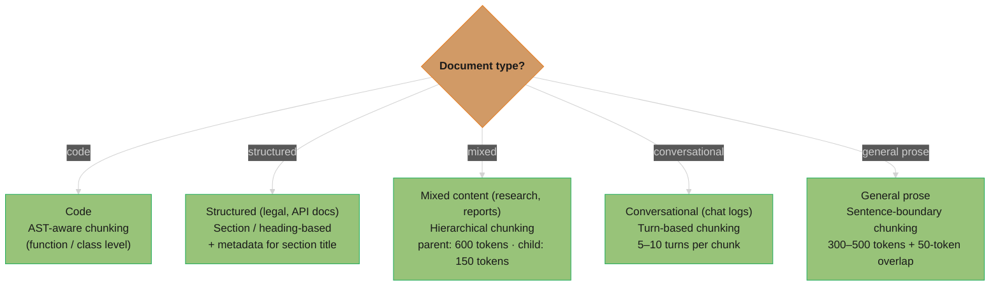

# Chunking Strategies

## 1. Concept Overview

Chunking is the process of splitting documents into smaller pieces before embedding and indexing for retrieval. The chunk is the atomic unit of retrieval: when a user query is issued, the system finds the most relevant chunks and injects them into the LLM's context. How you chunk determines what can be retrieved — a poorly chunked corpus means the right information is never retrievable, regardless of how good the embedding model is.

Chunking strategy selection involves three fundamental tradeoffs: precision (small chunks) vs. context completeness (large chunks), semantic coherence (content-aware boundaries) vs. simplicity (fixed-size splitting), and retrieval recall (what fraction of relevant information is findable) vs. embedding quality (how accurately the chunk's meaning is captured).

---

## Intuition

> **One-line analogy**: Chunking is like cutting a book into pages before filing it — cut at chapter boundaries and each page is coherent; cut mid-sentence and the page is meaningless out of context.

**Mental model**: Imagine embedding a 10,000-word research paper as a single vector — the embedding averages across all the paper's topics and concepts, so it matches nothing precisely. Splitting it into sentence-level pieces produces embeddings so narrow they miss related ideas. The right chunk boundary captures a single coherent idea — complete enough to be understood in isolation, focused enough to embed with high semantic precision.

**Why it matters**: Every retrieval quality improvement in the entire RAG pipeline starts with chunking. A document chunked at mid-sentence boundaries will produce irrelevant retrieved context that even the best [reranker](reranking.md) cannot recover. Chunking quality is the ceiling of retrieval quality.

**Key insight**: There is no universally optimal chunk size — it depends on the query granularity, document type, and embedding model. The right answer is always empirical: measure retrieval recall@K at multiple chunk sizes on your actual document corpus and query distribution.

---

## 2. Core Principles

- **Semantic coherence**: A chunk should represent a single complete idea — a paragraph, a section, a topic — not an arbitrary text span.
- **Embedding precision vs. context completeness tradeoff**: Smaller chunks embed precise concepts but lack context; larger chunks have context but embed imprecisely.
- **Overlap prevents boundary information loss**: Key information straddling a chunk boundary is preserved by overlapping consecutive chunks.
- **Document structure should guide boundaries**: Natural boundaries (paragraphs, sections, headings) are almost always better than character-count boundaries.
- **Measure on your data**: Chunk size intuitions from the literature don't transfer reliably across domains; always evaluate recall@K at multiple sizes on your specific corpus.

---

## 3. How It Works — Detailed Mechanics

### 3.1 Fixed-Size Chunking

Split text into chunks of exactly N characters or tokens:

```python
def fixed_size_chunk(text: str, chunk_size: int = 500,
                     overlap: int = 50) -> list[str]:
    """Token-aware fixed-size chunking with overlap."""
    tokens = tokenizer.encode(text)
    chunks = []
    start = 0
    while start < len(tokens):
        end = min(start + chunk_size, len(tokens))
        chunk_tokens = tokens[start:end]
        chunks.append(tokenizer.decode(chunk_tokens))
        start = end - overlap  # overlap for boundary preservation
    return chunks
```

Advantages: simple, deterministic, fast, works on any text.
Disadvantages: cuts mid-sentence frequently, destroys coherence.
When to use: baseline only; always superseded by sentence-boundary chunking.

### 3.2 Sentence / Paragraph Chunking

Split at natural linguistic boundaries:

```python
import nltk
from langchain.text_splitter import RecursiveCharacterTextSplitter

# Recursive splitting: tries paragraph → sentence → word boundaries
splitter = RecursiveCharacterTextSplitter(
    chunk_size=512,         # target size in characters
    chunk_overlap=64,       # overlap between consecutive chunks
    separators=["\n\n", "\n", ". ", " ", ""]  # try in order
)
chunks = splitter.split_text(document_text)
```

The RecursiveCharacterTextSplitter hierarchy:
```
1. Try to split on paragraph breaks (\n\n)   → preserves paragraphs
2. If chunk too large, split on line breaks (\n) → preserves sentences
3. If still too large, split on sentences (". ")  → preserves sentences
4. If still too large, split on spaces (" ")     → splits words (last resort)
```

Advantages: preserves sentence meaning, widely applicable.
Disadvantages: chunk sizes vary significantly; can still split mid-argument.
Sweet spot: 300-600 characters (approximately 75-150 tokens) with 50-100 character overlap.

### 3.3 Semantic Chunking

Detect topic shifts in the text and split at semantic boundaries:

```python
from sentence_transformers import SentenceTransformer
import numpy as np

model = SentenceTransformer("BAAI/bge-small-en-v1.5")

def semantic_chunk(text: str, threshold: float = 0.7) -> list[str]:
    """Split text where semantic similarity between adjacent sentences drops."""
    sentences = split_into_sentences(text)
    embeddings = model.encode(sentences)

    # Compute cosine similarity between adjacent sentence pairs
    similarities = []
    for i in range(len(embeddings) - 1):
        sim = cosine_similarity(embeddings[i], embeddings[i+1])
        similarities.append(sim)

    # Find split points where similarity drops (topic change)
    split_indices = [0]
    for i, sim in enumerate(similarities):
        if sim < threshold:  # topic shift detected
            split_indices.append(i + 1)
    split_indices.append(len(sentences))

    # Build chunks from split boundaries
    chunks = []
    for i in range(len(split_indices) - 1):
        start, end = split_indices[i], split_indices[i+1]
        chunks.append(" ".join(sentences[start:end]))
    return chunks
```

Advantages: chunks are semantically coherent (each covers one topic).
Disadvantages: requires embedding during indexing, computationally heavier.
Best for: long documents with diverse topics (research papers, technical manuals).
Tuning: threshold 0.6-0.8; lower threshold = more splits = smaller chunks.

### 3.4 Hierarchical (Parent-Child) Chunking

Create two levels: small child chunks for precise retrieval, larger parent chunks for complete context:

```python
# Index small child chunks (precise embedding)
child_chunks = sentence_chunk(document, chunk_size=150)
for chunk in child_chunks:
    parent_id = get_parent_id(chunk)  # which paragraph does this belong to?
    vector_db.upsert(
        id=chunk.id,
        embedding=embed(chunk.text),
        metadata={"parent_id": parent_id, "text": chunk.text}
    )

# Store parent chunks separately (used for context, not for retrieval)
parent_chunks = paragraph_chunk(document, chunk_size=600)
document_store.upsert(parent_chunks)

# At query time:
def retrieve_with_parent_context(query: str, k: int = 5):
    # Find most relevant child chunks (precise matching)
    child_results = vector_db.search(embed(query), k=k * 2)

    # Expand to parent context (complete coherent context)
    contexts = []
    seen_parents = set()
    for child in child_results:
        parent_id = child.metadata["parent_id"]
        if parent_id not in seen_parents:
            parent_text = document_store.get(parent_id)
            contexts.append(parent_text)
            seen_parents.add(parent_id)

    return contexts[:k]
```

Why it works: embedding small chunks captures precise semantics; returning the full parent provides the surrounding context the LLM needs.

### 3.5 Chunk Size Selection Guide

```
Task: Simple factual Q&A
  Chunk size: 100-300 tokens
  Reason: answer is typically one specific sentence or clause
  Example: "What is the melting point of iron?" → single-fact chunks

Task: Explanation / procedural
  Chunk size: 300-600 tokens
  Reason: answer requires a complete paragraph of reasoning
  Example: "How does X work?" → paragraph-level chunks

Task: Summarization / synthesis
  Chunk size: 600-1500 tokens
  Reason: need substantial context; LLM synthesizes across sections
  Example: "What are the key findings?" → section-level chunks

Document types:
  Code: 1 function/class per chunk (use AST-aware splitter)
  Legal: 1 clause per chunk (split on "Section X." markers)
  Medical: 1 paragraph per chunk (structured clinical notes)
  Chat logs: 5-10 conversation turns per chunk
```

### 3.6 Overlap Mechanics

```
Without overlap (strict boundaries):
  Chunk N:   "...the algorithm runs in O(n log n) time. [BOUNDARY]"
  Chunk N+1: "[BOUNDARY] This makes it efficient for large datasets..."

  Query: "Is the algorithm efficient for large datasets?"
  → Neither chunk alone answers this; key information split

With 100-token overlap:
  Chunk N:   "...the algorithm runs in O(n log n) time.
               This makes it efficient for large datasets..."
  Chunk N+1: "This makes it efficient for large datasets.
               In practice, however, memory usage may be..."

  Query: "Is the algorithm efficient for large datasets?"
  → Chunk N retrieves successfully; overlap preserved the full statement

Rule of thumb: overlap = 10-15% of chunk size
  500 token chunk → 50-75 token overlap
  300 token chunk → 30-45 token overlap
  1000 token chunk → 100-150 token overlap
```

---

## 4. Architecture Diagram

### Chunking Strategy Selection



### Hierarchical Chunk Architecture
```
Document: "Chapter 3: Neural Networks"
    |
    +-- Parent Chunk P1: Introduction paragraph (600 tokens)
    |       |
    |       +-- Child C1.1: "Neural networks are..." (150 tokens)
    |       +-- Child C1.2: "The key building block..." (150 tokens)
    |       +-- Child C1.3: "Training involves..." (150 tokens)
    |
    +-- Parent Chunk P2: Architecture section (600 tokens)
            |
            +-- Child C2.1: "Layers in a neural..." (150 tokens)
            +-- Child C2.2: "Activation functions..." (150 tokens)

Query: "What is backpropagation?"
  → ANN search finds Child C1.3 (most relevant sentence-level)
  → System returns Parent P1 (complete paragraph context)
  → LLM sees full introduction paragraph, not just the sentence
```

---

## 5. Real-World Examples

### LlamaIndex Hierarchical Chunking
- `HierarchicalNodeParser`: creates document → sections → paragraphs → sentences hierarchy
- `AutoMergingRetriever`: retrieves small chunks, merges back to parent for context
- Used in production enterprise document Q&A with mixed-length documents

### LangChain RecursiveCharacterTextSplitter
- The de facto default chunker in LangChain-based RAG systems
- Handles most document types reasonably well as a starting point
- Widely used in hackathons and initial productions before customization

### Semantic Chunker (LlamaIndex)
- `SemanticSplitterNodeParser`: uses embedding similarity between adjacent sentences
- Configured with `breakpoint_percentile_threshold` (e.g., 95th percentile)
- Best results on long documents with clearly distinct topic sections

---

## 6. Tradeoffs

| Strategy | Semantic Coherence | Precision | Complexity | Compute |
|----------|-------------------|-----------|------------|---------|
| Fixed-size | Low | Moderate | Very Low | None |
| Sentence/paragraph | Good | Good | Low | None |
| Semantic | Best | Best | Medium | Moderate (embed sentences) |
| Hierarchical | Good | Best (child) | High | Moderate |
| AST-aware (code) | Best (for code) | Best (for code) | High | Low |

| Chunk Size | Retrieval Precision | Context Completeness | Use Case |
|------------|--------------------|--------------------|----------|
| 50-100 tokens | Very high | Very low | Keyword-level QA |
| 100-300 tokens | High | Moderate | Factual QA |
| 300-600 tokens | Moderate | Good | Explanation QA |
| 600-1500 tokens | Lower | High | Summarization |

---

## 7. When to Use / When NOT to Use

### Use Semantic Chunking When:
- Documents have distinct topic sections that shift throughout
- High retrieval precision is critical
- Compute budget for indexing-time embedding is available
- Documents are long with diverse content

### Use Hierarchical Chunking When:
- Documents are long and structured (books, manuals, research papers)
- Need precise child-level retrieval but complete parent-level context
- Simple sentence chunking produces truncated, context-poor results

### Use Fixed-Size Only When:
- Quick prototype; will replace with better strategy before production
- Documents are uniformly structured with consistent information density
- Sentence boundary detection is unreliable (e.g., poorly formatted text)

---

## 8. Common Pitfalls

**1. Ignoring document structure**
Applying generic character-count chunking to structured documents (legal contracts, technical specifications) destroys the semantic boundaries that give each section its meaning.
Fix: Use document-structure-aware splitting: parse section headers, identify clause markers, use section boundaries as primary split points.

**2. Chunk size too large for the embedding model's token limit**
Most embedding models have a context limit (512 tokens for many BERT-based models; 8192 for text-embedding-3-large). Chunks exceeding the limit are truncated silently.
Fix: Check embedding model's token limit; ensure chunk_size (in tokens) is below that limit with margin (e.g., max 400 tokens for a 512-token model).

```python
# BROKEN: ~800-token chunks fed to a 512-token embedding model
splitter = RecursiveCharacterTextSplitter(chunk_size=3200)   # ~800 tokens
model = SentenceTransformer("BAAI/bge-small-en-v1.5")        # max_seq_length = 512
vectors = model.encode(chunks)   # tokens 513+ silently dropped — the embedding
                                 # represents only the FIRST HALF of each chunk

# FIXED: cap chunk size below the model limit with headroom
model = SentenceTransformer("BAAI/bge-small-en-v1.5")
print(model.max_seq_length)                                  # 512 — verify, don't assume
splitter = RecursiveCharacterTextSplitter(chunk_size=1600)   # ~400 tokens < 512 limit
```

**3. No overlap, information lost at boundaries**
Two consecutive chunks each contain half of a key piece of information. Neither retrieves it.
Fix: Use at minimum 10-15% overlap between consecutive chunks.

**4. Not including metadata in chunks**
A retrieved chunk saying "As mentioned in Section 2..." is useless without knowing which document, section, and page it came from.
Fix: Attach metadata to every chunk: document_id, section_title, page_number, document_date. This metadata serves both for source attribution and for metadata filtering.

**5. Same chunking strategy for all document types**
Code should chunk at function boundaries; legal documents at clause boundaries; chat logs at conversation turns. A single generic strategy applied uniformly degrades quality across all document types.
Fix: Route document types to appropriate chunkers. Build a document type classifier and maintain per-type chunking pipelines.

**6. Never measuring chunking quality**
Most teams choose a chunk size based on intuition and never validate it against retrieval recall metrics.
Fix: For each candidate chunk size, compute recall@10 on 100 labeled (query, expected_chunk) pairs. The chunk size with highest recall wins.

---

## 9. Technologies & Tools

| Tool | Chunking Type | Notes |
|------|--------------|-------|
| **LangChain RecursiveCharacterTextSplitter** | Sentence/paragraph | Best general-purpose; recursively tries boundaries |
| **LlamaIndex SentenceSplitter** | Sentence | Respects sentence boundaries; configurable chunk size |
| **LlamaIndex SemanticSplitterNodeParser** | Semantic | Embedding-based boundary detection; best quality |
| **LlamaIndex HierarchicalNodeParser** | Hierarchical | Creates parent-child chunk hierarchy |
| **Unstructured.io** | Structure-aware | Extracts document structure before chunking |
| **spaCy** | Sentence detection | Best sentence boundary detection for English |
| **NLTK sent_tokenize** | Sentence detection | Simpler alternative to spaCy; good for most cases |
| **tree-sitter** | Code AST chunking | Language-aware code chunking at function/class level |

---

## 10. Interview Questions with Answers

**Q: How would you choose the right chunk size for a RAG system?**
A: Chunk size depends on three factors: query granularity, document structure, and embedding model capacity. For precise factual queries ("What is X's phone number?"), 100-300 tokens captures the specific fact without diluting the embedding. For explanation queries ("How does X work?"), 300-600 tokens preserves a complete paragraph of reasoning. For synthesis queries ("What are the key themes?"), 600-1500 tokens provides enough context. Practically: start with 300-500 tokens as a baseline, create a labeled eval set of 100 (query, expected_chunk) pairs, and measure recall@10 at chunk sizes of 100, 300, 500, 1000 tokens. The size with highest recall wins. Document type also matters: code chunks at function level, legal at clause level, regardless of token count.

**Q: Why does semantic chunking outperform fixed-size chunking?**
A: Fixed-size chunking cuts text at arbitrary character/token positions, frequently splitting mid-sentence or mid-argument. The resulting chunk's embedding represents a partial idea, which matches queries for that idea poorly. Semantic chunking detects topic shifts by measuring embedding similarity between adjacent sentences — when similarity drops below a threshold (topic changes), a chunk boundary is inserted. The resulting chunks each represent a coherent topic, producing embeddings that precisely capture that topic's meaning. The improvement in retrieval recall is typically 10-25% on long, topic-diverse documents. The cost is the need to embed sentences during indexing.

**Q: What is hierarchical chunking and what problem does it solve?**
A: Hierarchical chunking creates two levels: small child chunks (100-200 tokens, sentence-level) for retrieval, and larger parent chunks (500-1000 tokens, paragraph-level) for context. It solves the precision-context tradeoff: small chunks have high embedding precision (each focuses on one specific fact or idea), enabling precise retrieval. But presenting small chunks to the LLM truncates the surrounding context needed to understand and cite the fact. Hierarchical retrieval finds the precise child chunk, then returns the full parent for LLM context. This gives the best of both: precision of sentence-level retrieval and context of paragraph-level chunks.

**Q: How does chunk overlap work and why is it important?**
A: Chunk overlap repeats the last N tokens of chunk k at the start of chunk k+1. Without overlap, information straddling a chunk boundary is split: neither chunk contains the complete thought, and a query about that thought retrieves neither. With overlap, the boundary region appears in both chunks, ensuring retrieval finds it. The tradeoff: overlap increases index size (more chunks) and retrieval noise (near-duplicate chunks may both be retrieved). Standard practice: overlap = 10-15% of chunk size. For 512-token chunks, 50-75 token overlap. For sentence-boundary chunking, overlap should be 1-2 full sentences rather than a raw token count.

**Q: How should you chunk code differently from prose?**
A: Code has semantic units defined by syntax, not natural language: functions, methods, classes, and modules. These are the correct chunk boundaries. Prose chunking methods (sentence boundaries, paragraph breaks) applied to code produce chunks that cut mid-function — a chunk containing half a function definition has a completely different embedding than the complete function. Use AST-aware chunking: parse the code with tree-sitter or language-specific parsers (javalang for Java, ast module for Python) and extract each function/method as a complete chunk with its docstring, signature, and body. Classes should be split at method granularity with the class signature repeated in each method chunk for context.

**Q: What metadata should be attached to each chunk?**
A: Minimum required metadata: document_id, chunk_id, source_path (URL or file path), section_title (for structured documents), page_number (for PDFs), and document_date. Useful additions: author, document_type, language, semantic_tags (for routing), chunk_index (position in document). Metadata serves three purposes: (1) source attribution in responses; (2) metadata filtering to scope retrieval ("only search Q4 2024 documents"); (3) parent chunk lookup for hierarchical retrieval. Metadata filtering is often more impactful than embedding quality for precision-critical applications — a filter for `document_date >= 2024-01-01` eliminates stale documents more reliably than embedding similarity.

**Q: How does chunk size affect embedding quality?**
A: Embedding models compute a single fixed-dimension vector representing the "average meaning" of the input text. Very short chunks (under 50 tokens): the embedding captures too little meaning; a single sentence's embedding may be dominated by function words, missing the key concept. Very long chunks (over 1000 tokens): the embedding averages across too many ideas; it represents the chunk's overall topic loosely, not any specific concept precisely. The optimal range for most embedding models is 100-500 tokens: enough content for the embedding to capture a coherent concept, focused enough that the embedding is specific. This is why the 200-500 token sweet spot appears consistently across benchmarks.

**Q: What is the `breakpoint_percentile_threshold` in LlamaIndex's SemanticSplitterNodeParser?**
A: SemanticSplitterNodeParser embeds each sentence, computes cosine similarity between adjacent sentence pairs, and inserts chunk boundaries at the most semantically dissimilar transitions. The `breakpoint_percentile_threshold` (default 95) determines which transitions count as boundaries: only the top 5% of least-similar adjacent-sentence pairs become chunk boundaries. Setting this to 95 means approximately 5% of sentence transitions produce a chunk boundary — suitable for long documents with many distinct topics. Lower values (80-90) produce more, smaller chunks (more topic-sensitive splitting). Higher values (97-99) produce fewer, larger chunks. Tune based on your document length and desired average chunk size.

**Q: How do you validate that your chunking strategy is working well?**
A: Build a labeled retrieval eval set: 100-200 (query, expected_source_document, expected_chunk_text) triples created by a domain expert. For each (query, expected_chunk) pair, check whether the expected chunk appears in the top-10 retrieved results — this is recall@10. Measure this for each candidate chunking strategy (fixed 300, fixed 500, semantic, hierarchical) and choose the one with highest recall. Also inspect qualitatively: retrieve the top-5 chunks for 20 representative queries and verify they contain the expected information and are coherent (not truncated mid-sentence). Poor qualitative inspection often reveals problems that aggregate metrics miss.

**Q: How should chunk size be adjusted for different embedding models?**
A: Embedding models have different context windows: BAAI/bge-small-en has a 512-token limit; text-embedding-3-large supports 8192 tokens; nomic-embed-text supports 8192 (model selection criteria: [Embedding Models](embedding_models.md)). For 512-token models: chunk size must not exceed 400-450 tokens (leave headroom for special tokens); 200-350 tokens is the practical sweet spot. For 8192-token models: you can index larger chunks (1000-2000 tokens), but larger chunks still produce less precise embeddings — the model can process them, but the embedding quality for retrieval is better at 500-800 tokens. The model's architecture (BERT-based vs. LLM-based embeddings like nomic) also affects optimal chunk size; LLM-based embeddings are better at long chunks.

**Q: What is a sliding window approach to chunking and when does it help?**
A: A sliding window creates overlapping chunks by advancing a fixed-size window by less than its full size: window size 500 tokens, stride 250 tokens → 50% overlap. Every token appears in approximately 2 chunks. This is more aggressive than the standard 10-15% overlap approach. When it helps: highly dense documents where key information is concentrated in narrow segments (dense financial disclosures, legal definitions, technical specifications). When it hurts: documents with longer prose passages (creates too many near-duplicate chunks; retrieval returns redundant results; reranker sees same content multiple times). The tradeoff is 2-3× more chunks in the index (higher storage and retrieval cost) for better boundary coverage.

**Q: How do you handle nested document structures (sections within sections) when chunking?**
A: Use recursive or hierarchical chunking that respects document structure — split at the highest-level headers first (H1 → H2 → H3), then subdivide large sections at lower-level boundaries. Store parent-child relationships in metadata for every chunk: `parent_section_id`, `section_title`, and `depth_level`. At retrieval time, use these relationships for context expansion — when a child chunk is retrieved, return its parent section as the context block sent to the LLM. This approach preserves semantic meaning at every level of nesting, prevents a subsection from being embedded in isolation with no surrounding document context, and enables precise child-level retrieval combined with complete parent-level context delivery.

**Q: What is the empirical recall impact of semantic vs fixed-size chunking?**
A: Semantic chunking improves retrieval recall@5 by 8-15% over fixed-size on heterogeneous document collections — collections with documents on diverse topics where sections shift meaning frequently. The improvement is driven by chunks that align with topic boundaries rather than arbitrary character counts, producing sharper, more distinctive embeddings. On homogeneous document collections (all same format — e.g., all structured data sheets, all consistent news articles), the gap narrows to 2-5% because fixed-size boundaries accidentally coincide with semantic boundaries more often. The cost is 2-5× longer indexing time because each sentence must be embedded to detect topic shifts. Practical guidance: measure the gap on a sample of your specific corpus before committing to the higher indexing compute.

**Q: How does late chunking work and when should you use it?**
A: Late chunking embeds the entire document first using a long-context encoder, producing token-level embeddings for the full document, then splits the resulting embedding sequence into chunk-sized windows — each chunk embedding retains global document context because the attention mechanism saw the full document before the split. This differs from standard chunking where each chunk is embedded in isolation without awareness of the surrounding document. Use late chunking when: document coherence is critical (each chunk must be understood in the context of the whole document), your embedding model supports long sequences (jina-embeddings-v2 supports 8192 tokens), and chunks from isolated embedding produce coherence artifacts. Late chunking improves retrieval quality by 3-8% on long-document corpora compared to isolated chunk embedding.

**Q: What overlap strategy works best for legal and regulatory documents?**
A: Legal and regulatory documents need 15-25% overlap (vs. 10% standard) because key terms, definitions, and cross-references frequently span paragraph boundaries. A definition in paragraph 3 governs the meaning of a term used in paragraph 7 — without overlap, the chunk containing paragraph 7 has no access to that definition. Additionally, include the section header and the governing definition block as metadata attached to every chunk within that section — not just in the overlap text, but as structured metadata fields. This metadata-enrichment approach means that a retrieved chunk about a specific obligation also carries the formal definition of the regulated entity, enabling the LLM to give a complete and accurate answer. For cross-referenced sections (e.g., "as defined in Section 2.1"), store the cross-reference target's text as a metadata field on the referencing chunk.

**Q: How do you evaluate chunking strategy quality independently from the rest of the RAG pipeline?**
A: Measure chunk-level retrieval recall in isolation by holding the embedding model and retriever constant while varying only the chunking strategy. Build a labeled eval set of (question, gold_passage_text) pairs created by domain experts — 100-200 pairs is sufficient for statistical significance. For each chunking strategy, index the corpus with that strategy, then for each question check whether the gold passage text (or a chunk substantially overlapping it) appears in the top-K retrieved results. Compute recall@5 and recall@10 per strategy. Additionally, measure chunk self-containment qualitatively: for 20 representative retrieved chunks, answer the question "can a human answer the query from this chunk alone without additional context?" Poor self-containment (the chunk references information clearly present in an adjacent chunk) indicates that chunk size is too small or overlap is insufficient.

---

## 11. Best Practices

1. **Always test empirically** — measure recall@10 at multiple chunk sizes on 100+ labeled (query, expected_chunk) pairs on your specific corpus; don't trust general guidelines.
2. **Use sentence-boundary chunking as the baseline** — RecursiveCharacterTextSplitter is the right starting point for most document types; never use pure character-count chunking in production.
3. **Add metadata to every chunk** — document_id, page, section, date; metadata filtering is often more impactful than embedding quality for precision-critical queries.
4. **Apply 10-15% overlap** — protects against information loss at boundaries without excessive index bloat.
5. **Route document types** — code to AST-aware, legal to clause-based, research to semantic; a single generic strategy underperforms across diverse document types.
6. **Validate chunk coherence qualitatively** — inspect 20-30 retrieved chunks; truncated, mid-sentence chunks signal incorrect splitting.
7. **Keep chunk size below the embedding model's token limit** — with margin; silently truncated chunks produce misleading embeddings.

---

## 12. Case Study

### Design a Chunking Pipeline for a Legal Compliance Knowledge Base

**Problem Statement**

A global financial institution has 50,000 regulatory documents — Basel III accords, MiFID II directives, GDPR guidance, and national banking regulations — totaling approximately 200 million tokens. Documents range from 2-page guidance notes to 400-page regulatory frameworks. Users submit compliance questions like "What are the reporting obligations for intraday liquidity under Basel III LCR?" A generic sentence-boundary chunker with 500-token chunks produced recall@5 of 54% — unacceptable for a compliance system where missing a relevant obligation is a legal risk.

**Architecture Overview**

```
Ingestion Pipeline:
  Document                        Chunking
  Classification                  Strategy
      |                               |
      +-- Regulation (>50 pages) --> Hierarchical chunking
      |                               Parent: full section (800-1200 tokens)
      |                               Child: paragraph (200-350 tokens)
      |                               Overlap: 20% (legal cross-refs)
      |
      +-- Guidance note (<10 pg) --> Sentence-boundary chunking
      |                               Size: 350-500 tokens, 15% overlap
      |
      +-- Amended appendix --------> Section-header-anchored chunking
                                      Split on "Section X.", "Annex Y."
                                      Include regulation ID in every chunk

Metadata Enrichment (per chunk):
  regulation_id:    "BASEL-III-LCR-2019"
  effective_date:   "2019-01-01"
  superseded_by:    null | "BASEL-III-LCR-2023"
  section_title:    "Intraday Liquidity Monitoring"
  jurisdiction:     ["EU", "UK", "US"]
  definition_block: (for chunks under a defined term)
  parent_chunk_id:  (for hierarchical retrieval)
```

**Key Design Decisions**

1. Hierarchical chunking for long regulations: child chunks (200-350 tokens) are embedded for precise retrieval; parent sections (800-1200 tokens) are stored in a document store and returned as context to the LLM. This captures "What does subsection 3.4.2 require?" precisely while delivering the full section context for LLM generation.

2. Definition-aware overlap: every chunk includes the governing definition block of any regulated term it references as a structured metadata field, not just in the overlap text. When a chunk references "High-Quality Liquid Assets (HQLA)," the HQLA definition from Section 2 is stored as `definition_context` metadata. The LLM prompt template injects these definitions automatically.

3. Effective-date metadata filtering: each chunk carries `effective_date` and `superseded_by` fields. At query time, a pre-filter restricts retrieval to documents effective as of the query date, eliminating superseded regulations without embedding similarity computation.

4. Regulation ID injection: the regulation identifier (e.g., "Basel III Article 412") is prepended to the text of every child chunk before embedding: "Basel III Article 412 LCR: Banks must maintain..." This anchors the chunk's embedding to the regulation namespace, improving retrieval precision for queries that mention specific article numbers.

**Implementation**

```python
from dataclasses import dataclass
from enum import Enum
from langchain.text_splitter import RecursiveCharacterTextSplitter
import re

class DocumentType(Enum):
    LONG_REGULATION = "long_regulation"     # >50 pages
    SHORT_GUIDANCE = "short_guidance"       # <10 pages
    AMENDED_APPENDIX = "amended_appendix"

@dataclass
class LegalChunk:
    text: str
    regulation_id: str
    effective_date: str
    superseded_by: str | None
    section_title: str
    jurisdiction: list[str]
    definition_context: dict[str, str]     # term → definition text
    parent_chunk_id: str | None
    chunk_id: str

def classify_document(doc_metadata: dict) -> DocumentType:
    if doc_metadata["page_count"] > 50:
        return DocumentType.LONG_REGULATION
    elif doc_metadata["page_count"] < 10:
        return DocumentType.SHORT_GUIDANCE
    else:
        return DocumentType.AMENDED_APPENDIX

def extract_section_definitions(section_text: str) -> dict[str, str]:
    """Extract 'Term means ...' or 'X is defined as ...' patterns."""
    definitions = {}
    pattern = r'"([A-Z][^"]+)"\s+means\s+([^.]+\.)'
    for match in re.finditer(pattern, section_text):
        term, definition = match.group(1), match.group(2)
        definitions[term] = definition
    return definitions

def chunk_long_regulation(doc_text: str, metadata: dict) -> list[LegalChunk]:
    # Split into sections on "Article X", "Section X.", "Part Y"
    section_pattern = r'(?=(?:Article|Section|Part)\s+\d+[\.\:])'
    sections = re.split(section_pattern, doc_text)

    chunks = []
    global_definitions = extract_section_definitions(doc_text[:5000])  # preamble

    for section_idx, section_text in enumerate(sections):
        section_title = extract_section_title(section_text)
        section_definitions = {**global_definitions,
                                **extract_section_definitions(section_text)}

        # Parent chunk: full section
        parent_id = f"{metadata['regulation_id']}_section_{section_idx}"

        # Child chunks: paragraphs within section, 200-350 tokens, 20% overlap
        child_splitter = RecursiveCharacterTextSplitter(
            chunk_size=300, chunk_overlap=60,
            separators=["\n\n", "\n", ". ", " "]
        )
        child_texts = child_splitter.split_text(section_text)

        for child_idx, child_text in enumerate(child_texts):
            # Inject regulation ID into text before embedding
            enriched_text = (
                f"{metadata['regulation_id']} {section_title}: {child_text}"
            )
            chunks.append(LegalChunk(
                text=enriched_text,
                regulation_id=metadata["regulation_id"],
                effective_date=metadata["effective_date"],
                superseded_by=metadata.get("superseded_by"),
                section_title=section_title,
                jurisdiction=metadata["jurisdiction"],
                definition_context=section_definitions,
                parent_chunk_id=parent_id,
                chunk_id=f"{parent_id}_child_{child_idx}"
            ))
    return chunks
```

**Results**

| Metric | Before (generic 500-token chunks) | After (hierarchical + metadata) |
|--------|----------------------------------|--------------------------------|
| Recall@5 | 54% | 81% |
| Recall@10 | 67% | 91% |
| Chunk self-containment (human eval) | 43% | 78% |
| Stale regulation retrievals | 18% of queries | 0% (date filter) |
| Average indexing time | 2.1 hours | 4.8 hours |

The 4.8-hour indexing time is acceptable for a corpus updated weekly. The 81% recall@5 (up from 54%) translated directly to a 23% reduction in LLM hallucination rate on compliance questions in A/B testing.

**Tradeoffs and Alternatives**

- Hierarchical chunking adds complexity: two storage layers (vector DB for children, document store for parents), parent-lookup logic at query time, and parent ID consistency management during document updates.
- Alternative for simpler deployments: sentence-boundary chunking with 400 tokens + 25% overlap and regulation ID metadata injection achieves recall@5 of ~71% — a reasonable intermediate if the hierarchical infrastructure cost is prohibitive.
- The definition-context metadata adds ~300 bytes per chunk to the metadata payload; this increases vector DB storage costs by ~8% but the retrieval quality improvement justifies it for compliance use cases.

**Interview Discussion Points**

- Why not just use 1000-token fixed chunks? Large fixed chunks would embed multiple regulatory obligations together, diluting the embedding and reducing retrieval precision for specific obligation queries.
- How do you handle document updates (new regulation version)? Set `superseded_by` on old chunks and create a new regulation version in the index with a new `regulation_id`. The date pre-filter handles version routing automatically — old chunks become invisible to current-date queries without deletion.
- How do you scale this to 500,000 documents? The chunking pipeline runs in parallel workers (one per document type); a Kafka queue feeds documents to chunkers; each chunker worker outputs to a shared embedding queue. Indexing throughput scales horizontally with worker count.
