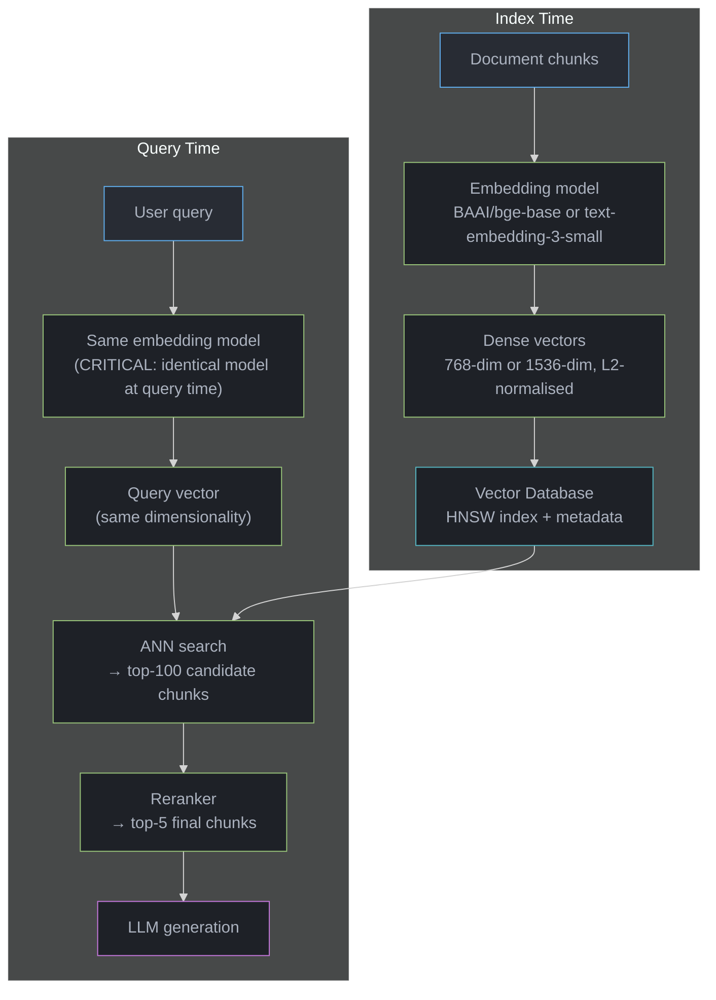

# Embedding Models

## 1. Concept Overview

Embedding models convert text into dense numerical vectors that capture semantic meaning in a high-dimensional space. In RAG, embeddings power the retrieval step: both document chunks (at index time) and queries (at query time) are converted to vectors, and retrieval finds the chunks whose vectors are closest to the query vector by cosine similarity or dot product.

The choice of embedding model determines what "semantically similar" means in your system. A weak embedding model produces a retrieval ceiling that no amount of reranking, chunking, or LLM quality can overcome. A domain-matched embedding model produces a retrieval quality floor that strong downstream components can build on.

---

## Intuition

> **One-line analogy**: An embedding model is a translator that converts text meaning into a geometric space — semantically similar texts land near each other, regardless of the words used.

**Mental model**: "Heart attack" and "myocardial infarction" describe the same thing. A good embedding model places these phrases near each other in vector space, so a query using "heart attack" retrieves documents using "myocardial infarction." A poor embedding model treats them as unrelated strings, missing the retrieval entirely. The embedding model defines the retrieval quality ceiling — if the right concept mapping isn't learned, retrieval fails regardless of the search algorithm.

**Why it matters**: Embedding model selection is often the highest-impact architectural decision in a RAG pipeline. The difference between the best and worst embedding model for a specific domain can be 20-30% retrieval recall@10 — a gap no other component can bridge.

**Key insight**: MTEB (Massive Text Embedding Benchmark) provides standardized recall and retrieval metrics across 58 tasks — use it to compare models, but always validate on your specific domain and query distribution, because MTEB may not represent your use case.

---

## 2. Core Principles

- **Dimensionality vs. quality tradeoff**: Higher-dimensional embeddings (1536d vs. 768d) capture more nuance but cost more to store and search.
- **Training objective determines alignment**: Models trained on query-document pairs (MSMARCO, natural questions) are better for RAG than models trained on semantic textual similarity (STS) tasks.
- **Domain specificity matters**: A general-purpose embedding model trained on web text may cluster "myocardial infarction" with "heart surgery" rather than "heart attack." Domain-fine-tuned models provide better alignment for specialized text.
- **Context window limits**: Most BERT-based models have a 512-token limit; text beyond this is silently truncated, producing misleading embeddings for long chunks.
- **Normalize embeddings**: Always L2-normalize embeddings before storing and searching. Normalized embeddings allow dot product to compute cosine similarity efficiently.

---

## 3. How It Works — Detailed Mechanics

### 3.1 Sentence-Transformers Architecture

The dominant architecture for RAG embeddings:

```
Input text: [CLS] token1 token2 ... tokenN [SEP]
                  |
            BERT/RoBERTa/DistilBERT encoder
                  |
            Token embeddings: [h_cls, h_1, h_2, ..., h_N]
                  |
            Pooling:
              Mean pooling: average all token embeddings → single vector
              CLS pooling: use [CLS] token embedding directly
              Max pooling: element-wise max across token embeddings
                  |
            L2 normalization: v / ||v||
                  |
            Output: 768-dim (or 1024/1536) dense vector

Training: Contrastive learning on (query, positive_doc) pairs
  Minimize: dist(embed(query), embed(positive))
  Maximize: dist(embed(query), embed(random_negative))
```

### Cosine Similarity = Angle Between Vectors

After L2-normalization (`v/||v||`), every 768-dim embedding lies on the unit sphere, so
the dot product *equals* the cosine of the angle between two vectors. Magnitude drops out
of the comparison — only direction, i.e. meaning, is left.

```
              "heart attack"
                   ▲
                   │    ╱► "myocardial infarction"
                   │   ╱     small angle θ  →  cos ≈ 0.95   (near-synonyms)
                   │  ╱
                   │ ╱  θ
        ───────────┼───────────────────────────►  "stock market"
                   │           θ ≈ 90°  →  cos ≈ 0.0    (unrelated)
                   │

   on the unit sphere ||v|| = 1, so:   cos(θ) = a · b     (dot product IS the cosine)

   angle θ :   0°     45°     90°    180°
   cos(θ) :   1.0    0.71    0.0    -1.0
              same   related none   opposite
```

This is why "normalize embeddings" matters: without it, a longer vector could score high on
raw dot product regardless of direction. Normalize first, and similarity collapses to one
interpretable number — the angle.

### 3.2 Major Embedding Models Compared

```
Model                          Dim    Context  MTEB Avg  Use Case
---------------------------------------------------------
text-embedding-3-small         1536   8191     62.3      OpenAI managed; good default
text-embedding-3-large         3072   8191     64.6      Best OpenAI quality; high cost
text-embedding-ada-002         1536   8191     61.0      Legacy; superseded by v3
BAAI/bge-base-en-v1.5          768    512      63.6      Best open source (compact)
BAAI/bge-large-en-v1.5         1024   512      64.2      Best open source (quality)
BAAI/bge-m3                    1024   8192     -         Multilingual; long context
nomic-embed-text-v1.5          768    8192     62.4      Open source; long context
E5-large-v2                    1024   512      62.8      Good general purpose
Cohere embed-english-v3.0      1024   512      64.5      Managed; strong multilingual
```

Dimension considerations:
```
768-dim:  Vector size: 768 × 4 bytes = 3KB per chunk
          10M chunks: ~30GB for embeddings alone
          ANN search: fast (fewer dimensions)

3072-dim: Vector size: 3072 × 4 bytes = 12KB per chunk
          10M chunks: ~120GB for embeddings alone
          ANN search: slower; more memory pressure
          Use Matryoshka Representation Learning (MRL): truncate to 512d with
          minimal quality loss using text-embedding-3 models

Cost at 10M chunks:
  text-embedding-3-small: 10M × 1536 × 4B = 60GB storage
  BAAI/bge-base-en-v1.5:  10M × 768 × 4B = 30GB storage
  text-embedding-ada-002: 10M × 1536 × 4B = 60GB storage
```

### 3.3 OpenAI Embedding API

```python
from openai import OpenAI
import numpy as np

client = OpenAI()

def embed_text(text: str, model: str = "text-embedding-3-small") -> list[float]:
    response = client.embeddings.create(
        input=text,
        model=model
    )
    return response.data[0].embedding

def embed_batch(texts: list[str], model: str = "text-embedding-3-small",
                batch_size: int = 100) -> list[list[float]]:
    embeddings = []
    for i in range(0, len(texts), batch_size):
        batch = texts[i:i + batch_size]
        response = client.embeddings.create(input=batch, model=model)
        embeddings.extend([item.embedding for item in response.data])
    return embeddings

# Pricing (as of 2024):
# text-embedding-3-small: $0.02/1M tokens
# text-embedding-3-large: $0.13/1M tokens
# For 10M chunks of 400 tokens: 4B tokens
#   small: $80 one-time indexing cost
#   large: $520 one-time indexing cost
```

### 3.4 Open Source Embedding with sentence-transformers

```python
from sentence_transformers import SentenceTransformer
import torch
import numpy as np

# Load model (downloaded once, cached locally)
model = SentenceTransformer("BAAI/bge-base-en-v1.5")

# Single text
embedding = model.encode("What is the capital of France?",
                         normalize_embeddings=True)

# Batch encoding (GPU-accelerated, parallelized)
chunks = ["chunk 1...", "chunk 2...", ...]
embeddings = model.encode(
    chunks,
    batch_size=256,             # adjust based on GPU memory
    normalize_embeddings=True,
    show_progress_bar=True,
    convert_to_numpy=True
)  # shape: [N, 768]

# BGE models require a query prefix for optimal retrieval performance:
query = "Represent this sentence for searching relevant passages: " + user_query
query_embedding = model.encode(query, normalize_embeddings=True)

# Document chunks: no prefix needed
doc_embedding = model.encode(chunk_text, normalize_embeddings=True)
```

### 3.5 MTEB Benchmark

MTEB (Massive Text Embedding Benchmark) evaluates models across 58 tasks in 8 categories:
```
Categories:
  Retrieval:       Given query, find relevant documents (most important for RAG)
  Reranking:       Given (query, candidates), rank candidates by relevance
  Classification:  Text classification tasks
  Clustering:      Group similar texts
  STS (Semantic Textual Similarity): Score sentence pair similarity
  Summarization:   Relevance between summary and source
  Bitext mining:   Find translation pairs
  Pair classification: Label sentence pairs

For RAG, focus on: Retrieval tasks (BEIR benchmark subset in MTEB)
  MTEB Retrieval score ≠ MTEB Average score
  A model with high STS but low Retrieval is bad for RAG

Key retrieval datasets in MTEB:
  MSMARCO: 500K web queries; passage retrieval
  NQ (Natural Questions): Google search queries; Wikipedia passages
  HotpotQA: Multi-hop reasoning; Wikipedia
  FEVER: Fact verification; Wikipedia
  FiQA: Financial domain Q&A
  TREC-COVID: Medical; COVID-19 literature
```

### 3.6 Domain-Specific Fine-Tuning of Embedding Models

```python
from sentence_transformers import SentenceTransformer, losses
from sentence_transformers.training_args import SentenceTransformerTrainingArguments
from sentence_transformers.trainer import SentenceTransformerTrainer
from datasets import Dataset

# Training data format for domain fine-tuning:
# List of (query, positive_passage, negative_passage) triples
train_data = Dataset.from_list([
    {
        "anchor": "What is a myocardial infarction?",
        "positive": "A myocardial infarction, commonly called a heart attack, occurs when...",
        "negative": "Cardiac surgery involves various procedures including bypass grafting..."
    },
    # ... 5000-50000 domain-specific triples
])

model = SentenceTransformer("BAAI/bge-base-en-v1.5")

# MultipleNegativesRankingLoss: contrastive training
# All (query, other_positive_in_batch) pairs are treated as negatives
loss = losses.MultipleNegativesRankingLoss(model)

args = SentenceTransformerTrainingArguments(
    output_dir="domain-embedding-model",
    num_train_epochs=2,
    per_device_train_batch_size=64,  # larger batch = more in-batch negatives
    learning_rate=2e-5,
    warmup_ratio=0.1,
    fp16=True,
)

trainer = SentenceTransformerTrainer(
    model=model,
    args=args,
    train_dataset=train_data,
    loss=loss,
)
trainer.train()
```

---

## 4. Architecture Diagram

### Embedding Model in RAG Pipeline



Using a different embedding model at query time than at index time is the most common RAG production bug — vectors live in incompatible spaces and similarity scores are meaningless.

### Matryoshka Representation Learning (MRL)
```
Full vector:         [d1, d2, d3, ..., d3072]  → 3072-dim embedding

Truncated to 512d:   [d1, d2, d3, ..., d512]   → works well (MRL training)
Truncated to 256d:   [d1, d2, d3, ..., d256]   → still reasonable
Truncated to 64d:    [d1, d2, d3, ..., d64]    → lower quality but fast

MRL models (text-embedding-3-small/large, nomic-embed-text-v1.5):
  Trained so first N dimensions are meaningful at any N
  Enables adaptive dimensionality: use 512d for fast retrieval,
  3072d for final reranking
  Storage optimization: 6× smaller index at 512d vs 3072d, ~5% quality loss
```

---

## 5. Real-World Examples

### OpenAI's Embedding in ChatGPT File Upload
- text-embedding-ada-002 → text-embedding-3-small for retrieval over user files
- 1536-dim embeddings, 8191-token context window
- Managed endpoint: no infrastructure; pay-per-use

### Weaviate's Vectorize Module
- Native integration with OpenAI, Cohere, HuggingFace embeddings
- Embeds at index time via configured vectorizer module
- Supports model swapping (re-embed with new model, keep data)

### HuggingFace MTEB Leaderboard
- BAAI/bge models consistently in top-5 open-source for English retrieval
- Leaderboard at: huggingface.co/spaces/mteb/leaderboard
- Filter by "Retrieval" category to identify best models for RAG use

---

## 6. Tradeoffs

| Model | MTEB Retrieval | Dimensions | Context | Hosting | Cost |
|-------|---------------|------------|---------|---------|------|
| bge-base-en-v1.5 | 53.3 | 768 | 512 tok | Self | Free |
| bge-large-en-v1.5 | 54.3 | 1024 | 512 tok | Self | Free |
| bge-m3 | 54.7 | 1024 | 8192 tok | Self | Free |
| text-embedding-3-small | 55.0 | 1536 | 8191 tok | API | $0.02/M tok |
| text-embedding-3-large | 56.0 | 3072 | 8191 tok | API | $0.13/M tok |
| Cohere embed-v3 | 55.5 | 1024 | 512 tok | API | ~$0.10/M tok |
| nomic-embed-v1.5 | 53.0 | 768 | 8192 tok | Self | Free |

---

## 7. When to Use / When NOT to Use

### Use OpenAI text-embedding-3-small When:
- Team cannot manage GPU infrastructure
- Mix of language types (multilingual support needed)
- Quick iteration without embedding model operational overhead
- Volume is moderate (cost doesn't dominate)

### Use BAAI/bge-large-en-v1.5 When:
- English-only corpus
- Budget is sensitive to per-token API costs
- Data privacy prevents sending text to external API
- Volume is very high (self-hosted is cheaper at scale)

### Use Domain Fine-Tuned Embedding When:
- MTEB retrieval recall@10 on your domain is under 70%
- Domain has specialized vocabulary not well-covered by general models
- Performance on a domain-specific evaluation set is the priority

---

## 8. Common Pitfalls

**1. Using different models for indexing and querying**
If documents are indexed with text-embedding-ada-002 but queries are embedded with text-embedding-3-small, the vectors are in different semantic spaces and cosine similarity is meaningless.
Fix: Store the model name with the index metadata. Enforce using the same model at query time. When upgrading embedding models, re-embed the entire corpus.

**2. Exceeding the model's token limit**
BGE-base has a 512-token limit. A 700-token chunk is silently truncated to 512 tokens. The embedding represents only the first 512 tokens; the relevant information in the last 188 tokens is lost.
Fix: Check chunk size in tokens before embedding. Use a model with longer context (bge-m3, text-embedding-3) if chunks exceed 512 tokens. Alternatively, ensure chunk size is always below the model's limit with margin.

**3. Not normalizing embeddings**
Storing unnormalized embeddings and computing cosine similarity correctly requires the full cosine formula. If you accidentally use dot product on unnormalized vectors, longer text (producing larger-magnitude vectors) is spuriously boosted.
Fix: Always L2-normalize embeddings before storing: `embedding = embedding / ||embedding||`. Then dot product = cosine similarity.

**4. Using STS-fine-tuned models for retrieval**
Semantic Textual Similarity models are trained to score sentence pairs — they're optimized for comparing similar-length, similar-style sentences. Retrieval requires scoring short queries against long documents. STS models perform worse on this asymmetric task.
Fix: Use retrieval-fine-tuned models (MSMARCO, Natural Questions training). Check that the model you use has a retrieval task score (not just STS) on MTEB.

**5. Assuming MTEB score reflects domain performance**
A model ranked #1 on MTEB may underperform a #5 model on your specific domain. MTEB's retrieval tasks (MSMARCO, Natural Questions) reflect web search; legal, medical, and scientific domains are underrepresented.
Fix: Build a domain-specific evaluation set: 50-200 (query, expected_chunk_ids) pairs. Measure recall@10 for each model candidate on your domain before selecting.

**6. Not batching embedding calls**
Embedding 10,000 chunks one at a time via the OpenAI API (10,000 separate API calls) is 100× slower and more expensive than batching 100 per call.
Fix: Batch up to 2048 inputs per OpenAI API call (or 256 per sentence-transformers batch for GPU memory management). Always batch for indexing.

---

## 9. Technologies & Tools

| Tool | Purpose | Notes |
|------|---------|-------|
| **sentence-transformers** | Self-hosted embedding | Standard library; supports all major models |
| **OpenAI Embeddings API** | Managed embedding | text-embedding-3-small/large; best managed option |
| **Cohere Embed API** | Managed embedding | Best multilingual managed option |
| **HuggingFace Inference API** | Managed + open source | Host any HuggingFace model via API |
| **MTEB Leaderboard** | Model comparison | huggingface.co/spaces/mteb/leaderboard; filter by Retrieval |
| **BAAI/bge** | Open source models | Best open-source English embedding family |
| **nomic-embed-text** | Open source, long context | 8192-token context; fully open weights |
| **Jina Embeddings** | Open source | Long context; multilingual variants |
| **LM-Cocktail** | Model merging | Merge general + domain-specific embedding models |

---

## 10. Interview Questions with Answers

**Q: How do you select an embedding model for a RAG system?**
A: Selection process in four steps. First, check MTEB Retrieval scores — filter to the top-10 models by retrieval task performance (not average MTEB, which includes STS and classification). Second, evaluate on your domain: build a 50-200 (query, expected_chunk) labeled eval set from your actual corpus and measure recall@10 for each model candidate. The domain-specific recall often differs from MTEB Retrieval. Third, consider operational constraints: API models (OpenAI, Cohere) for teams without GPU; self-hosted (BGE, nomic) for budget-sensitive or privacy-sensitive deployments. Fourth, consider context window: if your chunks exceed 512 tokens, you need a longer-context model (bge-m3, nomic-embed-text-v1.5, text-embedding-3).

**Q: What is the MTEB benchmark and how should it inform embedding model selection?**
A: MTEB (Massive Text Embedding Benchmark) evaluates models across 58 tasks in 8 categories. For RAG, focus specifically on the Retrieval task scores (subset of MTEB), not the overall MTEB average. Overall MTEB includes STS, classification, and clustering tasks that don't predict RAG retrieval performance well. Retrieval tasks in MTEB come primarily from BEIR benchmark: MSMARCO, Natural Questions, HotpotQA — mostly web search and Wikipedia. These are reasonable proxies for general-purpose RAG but may not represent specialized domains (medical, legal, code). Critical caveat: always validate MTEB top performers on your specific domain before selecting; a model ranked #1 on MTEB may rank #3 on your medical literature corpus.

**Q: What is the difference between embeddings trained on STS tasks vs. retrieval tasks?**
A: Semantic Textual Similarity (STS) models are trained to score sentence-pair similarity — given two sentences of similar length and style, output a similarity score (0-5). This produces embeddings that cluster semantically similar sentences close together. Retrieval models are trained on asymmetric query-document pairs: short queries matched to longer, denser passages (MSMARCO queries average 6 words; passages average 60 words). Retrieval training optimizes for: a 6-word query finding a relevant 60-word passage. For RAG, always use retrieval-trained models. STS models work poorly on query-passage asymmetry — they expect similar-format inputs.

**Q: What is Matryoshka Representation Learning and when is it useful?**
A: Matryoshka Representation Learning (MRL) trains embeddings so that the first N dimensions are meaningful for any N — like Russian nesting dolls, smaller vectors are nested within larger ones. OpenAI's text-embedding-3 and nomic-embed-text-v1.5 use MRL training. This enables dimensionality reduction without retraining: a 3072-dim embedding can be truncated to 512-dim with minimal quality loss (~2-5%). Useful scenarios: (1) reducing storage cost — 6× smaller index at 512d vs 3072d; (2) two-speed retrieval — use 512d for fast initial ANN, then expand to 3072d for reranking; (3) cost-sensitive deployments where smaller dimensions reduce HNSW memory overhead.

**Q: How does domain fine-tuning of embedding models work and when is it worth the effort?**
A: Domain fine-tuning continues training a pre-trained embedding model on domain-specific (query, positive_passage, negative_passage) triples. The model learns domain vocabulary alignment and domain-specific similarity patterns. Training: MultipleNegativesRankingLoss on 5K-50K domain triples, 2-5 epochs, learning rate 2e-5. Worth the effort when: (1) MTEB retrieval recall@10 on your domain is under 70% with general models; (2) Domain has specialized vocabulary that general models handle poorly (medical ICD codes, legal citations, financial terminology); (3) You have or can generate sufficient training triples (minimum ~5000 high-quality pairs). For most RAG deployments, a well-configured general model (BGE-large, text-embedding-3) is sufficient; fine-tuning is reserved for specialized domains where the baseline is genuinely poor.

**Q: What causes embedding dimension mismatch bugs and how do you prevent them?**
A: Dimension mismatch occurs when the embedding model changes during the system's lifecycle. Common scenarios: (1) upgrading from text-embedding-ada-002 (1536d) to text-embedding-3-small (1536d — same dimension, but different semantic space, still incompatible); (2) switching from BGE-base (768d) to BGE-large (1024d) — different dimension, immediate error; (3) deploying a different model at query time than was used at index time. Prevention: (1) store model_name and model_version as vector index metadata; (2) assert model_name matches at query time; (3) version the vector index — when changing models, create a new index version and migrate atomically. Never assume same-dimension means same semantic space.

**Q: How do you handle long documents that exceed an embedding model's context window?**
A: Four strategies. First, chunking: split the document into chunks that fit within the model's context window (most common approach; see chunking_strategies.md). Second, use a long-context embedding model: bge-m3 (8192 tokens), nomic-embed-text-v1.5 (8192 tokens), text-embedding-3-large (8191 tokens). Third, hierarchical summarization: embed a summary of each long document as a coarse-grained index; use the summary embedding for first-stage retrieval, then retrieve sub-sections from matched documents. Fourth, sliding window: embed overlapping windows of the document independently; at query time, retrieve the window with highest similarity. For most production systems: chunking + overlap is the right default; switch to long-context models when chunk boundary information loss is a significant problem.

**Q: How should you evaluate whether domain fine-tuning improved embedding quality?**
A: Measure recall@10 on a labeled retrieval test set: 100-200 (query, expected_document_ids) pairs created by domain experts. Run both the base model and fine-tuned model on this test set. Record recall@10: fraction of queries where the expected document appears in top-10 retrieved results. Also measure: (1) MRR@10 (Mean Reciprocal Rank) — measures average rank of the first relevant document; (2) NDCG@10 — weighted rank measure. A fine-tuned model should show >5% recall@10 improvement to justify the fine-tuning effort and maintenance overhead. If improvement is less, the base model is already well-calibrated for the domain, or the training data isn't high quality.

**Q: What are the cost implications of embedding model choice at scale?**
A: Cost comparison for 10M documents × 400 tokens average = 4B tokens indexing: OpenAI text-embedding-3-small: $0.02/1M tokens × 4B = $80 one-time indexing cost. OpenAI text-embedding-3-large: $0.13/1M tokens × 4B = $520 one-time indexing. BAAI/bge-base self-hosted: GPU cost only — on an A10G GPU at $1/hr, embedding 4B tokens takes ~8 hours = $8. Re-embedding for model updates is a major cost: switching from ada-002 to text-embedding-3 requires re-embedding the entire corpus. At 10M documents with monthly refresh rate: bge self-hosted cost approaches 0; API cost can be $80-520/month. Above ~50M documents, self-hosted embedding becomes cheaper than the OpenAI API.

**Q: What is the asymmetric nature of query-document embedding and how does BGE handle it?**
A: In retrieval, queries are short (5-20 words) and documents are longer (100-500 tokens). Bi-encoders trained symmetrically (where query and document encoders are identical) underperform on this asymmetry because the model wasn't explicitly trained to bridge the length gap. BGE addresses this by requiring a query-specific prefix: "Represent this sentence for searching relevant passages: [query]" for queries, and no prefix for documents. The prefix trains the model to encode queries in "retrieval mode" — producing vectors aligned with document vectors rather than symmetric sentence vectors. Critically: you must use this prefix consistently at query time; forgetting it degrades retrieval quality by ~3-5% on BGE models.

**Q: When should you choose dense vs sparse retrieval from an embedding model perspective?**
A: Dense (embedding) retrieval excels at semantic similarity and paraphrase matching — queries phrased differently from the document still retrieve correctly because the embedding captures meaning, not words. Sparse (BM25) retrieval excels at exact keyword matching, rare terms, and entity names — product SKUs, regulation numbers, error codes, and proper nouns that the embedding model may not have seen frequently during training. Use dense for conversational semantic queries ("explain how X works"), use sparse for keyword-heavy queries (error codes, product names, regulation IDs), and use hybrid for production systems serving real users with a mixed query distribution. The embedding model choice is irrelevant for BM25 — sparse retrieval operates on raw tokenized text.

**Q: How do you fine-tune an embedding model with hard negatives?**
A: Hard negatives are passages that are superficially similar to the query but do not contain the answer — they are semantically adjacent but factually incorrect. Standard random negatives (random passages from the corpus) are too easy; the model quickly learns to distinguish them and stops improving. Hard negative mining: retrieve the top-50 candidates for each training query using BM25 or the base embedding model, filter out confirmed true positives using ground-truth labels, and treat the remaining high-scoring non-relevant passages as hard negatives. Use these in contrastive training via MultipleNegativesRankingLoss or TripletLoss. Hard negative mining improves fine-tuned model recall@10 by 15-25% over random-negative training because the model must learn the subtle distinctions that matter in your domain.

**Q: How does Matryoshka truncation affect retrieval quality at different dimensions?**
A: Truncating a Matryoshka-trained embedding from 768 to 256 dimensions retains approximately 95% of retrieval quality (recall@10) for most general-purpose tasks. Below 128 dimensions, quality drops sharply to 80-85% of the full-dimension baseline — the model can no longer represent the full range of semantic distinctions needed for retrieval. The exact breakpoint depends on domain: tasks with high lexical similarity between relevant and irrelevant documents (legal, medical) need more dimensions to capture fine-grained distinctions; simpler semantic tasks tolerate more aggressive truncation. Practical approach: test recall@10 at 64, 128, 256, 512 dimensions on your labeled eval set and pick the smallest dimension that stays within 3% of the full-dimension baseline — this minimizes storage and ANN search cost.

**Q: What are the challenges of multilingual embedding models?**
A: Multilingual models must align representations across languages so that "machine learning" (English) and its translations in French, German, and Japanese cluster together in embedding space — a much harder training objective than monolingual alignment. Challenges: (1) lower-resource languages receive weaker embeddings because training data is sparse; cross-lingual retrieval accuracy for low-resource language queries drops 10-20% vs. high-resource languages; (2) cross-lingual retrieval (query in English, documents in French) accuracy drops 10-20% vs. monolingual retrieval even for well-resourced language pairs; (3) vocabulary coverage varies — the tokenizer may break low-resource language words into many sub-word tokens, reducing effective context window. Models like multilingual-e5-large and Cohere embed-multilingual-v3.0 handle 100+ languages and are the correct defaults for multilingual RAG.

**Q: How do you estimate the right embedding dimensionality for your use case?**
A: Higher dimensions capture more semantic nuance but increase storage and ANN search cost non-linearly (HNSW memory usage scales linearly with dimension; search time scales sub-linearly but still increases). Rule of thumb: 384 dimensions for simple semantic search on small corpora (under 1M documents), 768 dimensions for standard production RAG, 1024+ dimensions only when fine-tuned for domain-specific nuance where the additional dimensions encode domain-relevant distinctions. Empirical approach: measure recall@10 at 256, 384, 512, 768 dimensions using MRL-truncated embeddings on your domain eval set. Stop increasing dimensionality when recall plateaus (less than 1% gain per doubling of dimensions). For most RAG deployments, the recall plateau is reached at 512-768 dimensions — deploying at 1024+ is rarely justified by the storage and latency cost.

---

## 11. Best Practices

1. **Evaluate on your domain** — MTEB Retrieval scores are a starting point; always measure recall@10 on your specific corpus and query distribution before selecting a model.
2. **Match context window to chunk size** — ensure chunk size (in tokens) is below the embedding model's limit; check with the model's tokenizer, not a character estimate.
3. **Use the BGE query prefix** — when using BAAI/bge models, prepend "Represent this sentence for searching relevant passages: " to query embeddings (not document embeddings).
4. **Always L2-normalize before storing** — normalize embeddings at index time; dot product on normalized vectors equals cosine similarity, enabling efficient ANN search.
5. **Batch embedding calls** — embed 100-256 chunks per batch; single-call embedding is 100× slower for large corpora.
6. **Store model name as index metadata** — prevents dimension mismatch bugs when models are upgraded; enforce model consistency between indexing and query time.
7. **Consider fine-tuning only after measuring** — baseline recall@10 under 70% on domain-specific eval set is the signal to invest in fine-tuning; most general-purpose deployments don't need it.

---

## 12. Case Study

### Building a Multilingual Embedding Pipeline for Global E-Commerce Product Search

**Problem Statement**

A global e-commerce platform operates in 12 countries across 5 languages (English, French, German, Spanish, Japanese). The product catalog has 8 million SKUs. Users search in their native language; products are described in the language of their origin market plus English. The initial system used text-embedding-3-small (English-only in practice) — cross-language recall@10 was 41% (a French query finding an English-listed product), and Japanese queries had 28% recall@10. The business impact: users in non-English markets found fewer products, leading to 31% lower conversion rate vs. English-speaking markets.

**Architecture Overview**

```
Embedding Pipeline:

Product Catalog (8M SKUs)
    |
    +-- Language Detection (langdetect)
    |
    +-- Translation (optional enrichment)
    |   If product only in one language: translate title+description
    |   to English using DeepL API; store both as fields
    |
    +-- Field Selection for Embedding
    |   Combined text: title + brand + category + key_attributes
    |   Max 256 tokens (optimized dimension for catalog search)
    |
    +-- Embedding Model: multilingual-e5-large
    |   Dimension: 1024 → truncated to 512 via MRL
    |   Batch size: 128 per GPU call
    |   GPU: 4× A10G; throughput: ~8M embeddings/hour
    |
    +-- Vector Index: Weaviate
        HNSW (ef=200, m=16 for high recall)
        Pre-filter: product_status=active, country=available_in
        Metadata: sku_id, category, brand, price_range, country_availability


Query Pipeline:

User Query (any language)
    |
    +-- Language Detection
    |
    +-- Query Prefix Injection:
    |   "query: {user_query}"  (multilingual-e5 requires this prefix)
    |
    +-- Embedding (same multilingual-e5-large model)
    |
    +-- Hybrid Search:
    |   Dense: ANN search (top-200 candidates)
    |   Sparse: BM25 on product title + brand (keyword matching)
    |   Fusion: RRF (k=60)
    |
    +-- Metadata Pre-filter:
    |   country_availability includes user.country
    |   product_status = "active"
    |
    +-- Reranker (Cohere rerank-multilingual-v3.0)
    |   Top-200 → Top-20 for display
    |
    +-- Results Ranked by (rerank_score × 0.7 + popularity_score × 0.3)
```

**Key Design Decisions**

1. Model selection — multilingual-e5-large over alternatives: MTEB multilingual retrieval comparison showed multilingual-e5-large outperformed mDPR by 12% and multilingual-MiniLM by 18% on cross-lingual product retrieval. BAAI/bge-m3 was competitive (+1%) but slower at inference — rejected for throughput reasons.

2. Dimension reduction via MRL: Full 1024-dim embeddings for 8M SKUs required 32GB for the HNSW index. Truncating to 512 dimensions reduced index to 16GB with only 2.3% recall@10 degradation on the eval set — acceptable. The MRL property of multilingual-e5 makes this truncation valid.

3. Query prefix requirement: multilingual-e5 requires a "query: " prefix for queries and "passage: " prefix for documents during embedding. Missing this prefix degraded cross-lingual recall@10 by 7%. Both prefixes are injected automatically in the embedding service — encoding context (query vs. document) is a runtime parameter, not caller responsibility.

4. Fine-tuning on product-specific pairs: the base multilingual-e5-large had 41% cross-lingual recall@10 on the product eval set. Fine-tuning on 15,000 (query_language_X, relevant_product_description_language_Y) pairs for 3 epochs raised it to 67% — a 26-point improvement. Training data was generated by taking existing successful cross-language search sessions from user logs (user searched in French, clicked a German-listed product = positive pair).

**Implementation — Fine-Tuning**

```python
from sentence_transformers import SentenceTransformer, losses
from sentence_transformers.trainer import SentenceTransformerTrainer
from sentence_transformers.training_args import SentenceTransformerTrainingArguments
from datasets import Dataset

# Training data: cross-lingual query-product pairs
train_pairs = Dataset.from_list([
    {
        "anchor": "query: chaussures de course femme",        # French query
        "positive": "passage: Women's running shoes lightweight breathable",  # English product
        "negative": "passage: Men's formal leather oxford shoes dress"        # hard negative
    },
    # 15,000 pairs across 5 language combinations
])

model = SentenceTransformer("intfloat/multilingual-e5-large")

loss = losses.MultipleNegativesRankingLoss(model)

args = SentenceTransformerTrainingArguments(
    output_dir="multilingual-e5-ecommerce",
    num_train_epochs=3,
    per_device_train_batch_size=32,   # smaller batch for GPU memory with 1024d
    learning_rate=1e-5,               # low LR to preserve multilingual alignment
    warmup_ratio=0.1,
    fp16=True,
    evaluation_strategy="epoch",
)

trainer = SentenceTransformerTrainer(
    model=model,
    args=args,
    train_dataset=train_pairs,
    loss=loss,
)
trainer.train()
# Save to HuggingFace Hub or local artifact store
model.save_pretrained("multilingual-e5-ecommerce-v1")
```

**Results**

| Metric | Baseline (text-embedding-3-small) | multilingual-e5-large (base) | multilingual-e5-large (fine-tuned) |
|--------|----------------------------------|------------------------------|-------------------------------------|
| Cross-lingual recall@10 | 41% | 61% | 67% |
| Japanese query recall@10 | 28% | 52% | 61% |
| English recall@10 | 79% | 77% | 81% |
| Embedding throughput | 2M/hr (API) | 8M/hr (self-hosted GPU) | 8M/hr (self-hosted GPU) |
| Indexing cost (8M SKUs) | $128 one-time | GPU infra only | GPU infra only |
| Cross-market conversion rate gap | 31% | 14% | 9% |

**Tradeoffs and Alternatives**

- Self-hosting multilingual-e5-large requires 4× A10G GPUs for 8M-SKU re-indexing in under 1 hour. Alternative: use Cohere embed-multilingual-v3.0 API — no GPU infra, similar quality, but $0.10/M tokens × 8M SKUs × 256 tokens = ~$200 per full re-index. At weekly re-indexing, API cost becomes $800/month vs. GPU depreciation.
- Translation-based approach (translate all queries to English, use monolingual model): achieves 58% cross-lingual recall@10 with text-embedding-3-large — lower than fine-tuned multilingual but simpler operationally. Adds 50-80ms DeepL translation latency per query.
- Query language detection adds 5ms latency but enables per-language performance monitoring — a critical operational metric for identifying which languages need additional fine-tuning data.

**Interview Discussion Points**

- Why not use one model per language? Separate monolingual models would achieve higher per-language recall but cannot perform cross-lingual retrieval (French query, English product) without a separate translation step. The translation approach adds latency, cost, and a failure mode (translation errors degrade retrieval).
- How do you handle new language additions? Fine-tune the existing multilingual model with pairs for the new language — the base model's multilingual alignment provides a strong starting point, and 2,000-3,000 language-specific pairs are usually sufficient for a 10-15% recall improvement over the base model.
- How do you keep embeddings fresh as the catalog changes? New and updated products are embedded incrementally (event-driven, triggered by catalog update events). Full re-indexing is done monthly to handle model updates. The vector index supports upsert by SKU ID, enabling incremental updates without full re-index.
