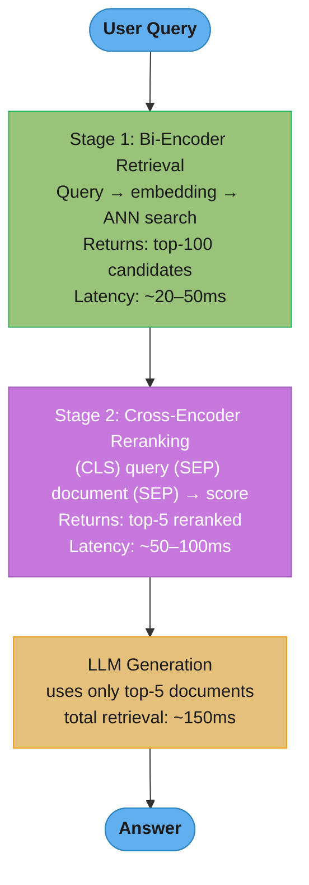

# Reranking

## 1. Concept Overview

Reranking is a second-stage retrieval step that takes a large pool of candidate documents from initial retrieval (typically top-100) and reorders them to select the most relevant for LLM context (typically top-5 to 10). The key insight is a two-stage architecture: fast [bi-encoders](../embeddings_and_similarity_search/README.md) retrieve broadly with high recall; slower but more accurate cross-encoders rerank to achieve high precision.

Initial retrieval via bi-encoders encodes queries and documents independently — efficient but imprecise (they can't model fine-grained query-document interaction). Cross-encoder rerankers read the query and document together, enabling rich interaction modeling that bi-encoders fundamentally cannot do. This produces dramatically better relevance judgments at the cost of being too slow for full-index search.

---

## Intuition

> **One-line analogy**: Retrieval is a talent scout who screens hundreds of candidates quickly; the reranker is the expert interviewer who thoroughly evaluates the top 100 and picks the best 5.

**Mental model**: A bi-encoder encodes the query and each document separately into vectors, then compares vectors by cosine similarity. This is fast (compute once, compare with dot product) but misses fine-grained interaction — "What is the capital of France?" and a document saying "Paris is called the 'City of Light' and serves as France's political center" may have moderate cosine similarity even though the document perfectly answers the question. A cross-encoder concatenates query+document as a single input and produces a direct relevance score using full attention across both — it can detect that "political center" answers "capital" and score this document higher.

**Why it matters**: Adding a cross-encoder reranker to an existing retrieval pipeline typically improves precision@5 (the fraction of top-5 results that are relevant) from 70-80% to 90%+ — a significant quality improvement for a ~50-100ms latency cost. The reranker is the single highest-ROI addition to most production RAG pipelines.

**Key insight**: The two-stage retrieval pipeline (bi-encoder for recall, cross-encoder for precision) is the correct separation of concerns — each component does what it's architecturally suited for.

---

## 2. Core Principles

- **Bi-encoder vs. cross-encoder tradeoff**: Bi-encoder is fast (separate encoding) but imprecise; cross-encoder is slow (joint encoding) but highly accurate.
- **Reranking operates on a candidate pool, not the full index**: Cross-encoders can only evaluate hundreds of candidates (not millions) within reasonable latency.
- **Recall first, precision second**: Retrieval must recall broadly enough that the reranker has the relevant documents in its input pool.
- **Reranking score ≠ retrieval score**: The reranker is re-evaluating relevance from scratch, not just refining the retrieval score.
- **Context matters**: Cross-encoders can model context-dependent relevance that pure embedding similarity misses.

---

## 3. How It Works — Detailed Mechanics

### 3.1 Bi-Encoder Architecture (First Stage)

```
Bi-encoder:
  Query encoder:    [CLS] query tokens [SEP] → embedding q
  Document encoder: [CLS] doc tokens [SEP]   → embedding d
  Score: cosine_similarity(q, d)

Key property: encoders are INDEPENDENT
  → Can pre-compute all document embeddings at index time
  → Only compute query embedding at query time
  → Retrieve via ANN: O(log N) per query

Models:
  BAAI/bge-base-en-v1.5  (768d, 512 token limit)
  BAAI/bge-large-en-v1.5 (1024d, better quality)
  text-embedding-3-small  (1536d, OpenAI managed)
  nomic-embed-text-v1.5  (768d, 8192 token context)
```

### 3.2 Cross-Encoder Architecture (Reranker)

```
Cross-encoder:
  Input: [CLS] query tokens [SEP] document tokens [SEP]
  All tokens attend to each other via full self-attention
  Output: single relevance score ∈ [0, 1]

Key property: JOINT encoding
  → Can model fine-grained query-document interaction
  → Cannot pre-compute document representations (score depends on query)
  → Must run a full forward pass per (query, document) pair
  → O(n × L²) where n = number of candidates, L = sequence length

Latency:
  Cross-encoder on 100 candidates × 512 tokens: ~50-100ms on GPU
  Acceptable as second stage; not acceptable as first stage on millions of docs
```

**What this actually says.** `O(n x L^2)` says: "you pay one full transformer forward pass per candidate, and each pass costs quadratically in sequence length." The bi-encoder's cost is `O(1)` forward passes at query time because the documents were encoded months ago; the cross-encoder's is `O(n)` because its document representation does not exist until the query arrives.

That single structural difference — precomputable versus not — is the entire reason for the two-stage pipeline, and it is the answer interviewers are listening for.

| Symbol | What it is |
|--------|------------|
| `n` | Candidates scored at query time — 100 in the standard pipeline, `N` if used as retriever |
| `L` | Sequence length of the concatenated query + document, capped at 512 here |
| `L^2` | Self-attention's cost: every token attends to every other token |
| per-pair latency | Amortized wall-clock per `(query, doc)` pair in a batched pass — 0.8 ms for BGE-reranker-large on an A10G |
| `N` | Corpus size — 45,000 chunks in Section 12, 1,000,000 in the "why not first stage" argument |

**Walk one example — why it cannot be the retriever.** Section 10's 1M-document corpus, at the 0.8 ms/pair implied by the table in Section 6 (100 candidates in ~80 ms):

```
  cross-encoder over the full corpus
    1,000,000 pairs x 0.8 ms = 800,000 ms = 800 s = 13.3 minutes PER QUERY

  bi-encoder over the full corpus
    document embeddings : computed once, at index time, offline
    query time          : 1 forward pass (the query) + one ANN search
                        : ~10 ms embed + ~30 ms ANN = 40 ms

  ratio: 800 s / 0.04 s = 20,000x
```

**Walk one example — why batching is not optional.** Pitfall 6 in Section 8, on 100 candidates:

```
  batched  : one padded forward pass over 100 pairs      =  80 ms
  serial   : 100 separate passes, ~8 ms each (the GPU is
             idle most of each call, kernel-launch bound) = 800 ms

  speedup = 800 / 80 = 10x, for a one-line change
```

The `L^2` term is why Pitfall 2 matters as much as it does: doubling chunk length from 256 to 512 tokens does not double reranker cost, it roughly quadruples the attention work — so oversized chunks are punished twice, once by truncation and once by latency.

### 3.3 Reranking Implementation

```python
from transformers import AutoTokenizer, AutoModelForSequenceClassification
import torch

class CrossEncoderReranker:
    def __init__(self, model_name: str = "BAAI/bge-reranker-large"):
        self.tokenizer = AutoTokenizer.from_pretrained(model_name)
        self.model = AutoModelForSequenceClassification.from_pretrained(model_name)
        self.model.eval()
        if torch.cuda.is_available():
            self.model = self.model.cuda()

    def rerank(self, query: str, documents: list[str],
               top_k: int = 5) -> list[tuple[str, float]]:
        pairs = [[query, doc] for doc in documents]
        features = self.tokenizer(
            pairs,
            max_length=512,
            padding=True,
            truncation=True,
            return_tensors="pt"
        )
        if torch.cuda.is_available():
            features = {k: v.cuda() for k, v in features.items()}

        with torch.no_grad():
            scores = self.model(**features).logits.squeeze()
            scores = torch.sigmoid(scores).cpu().numpy()

        ranked = sorted(
            zip(documents, scores.tolist()),
            key=lambda x: x[1],
            reverse=True
        )
        return ranked[:top_k]
```

**Stated plainly.** Reranking latency is one multiplication: `latency = k x per_pair_ms`. There is no clever amortization to find — `k` is the only knob, and it moves latency and quality in opposite directions on a straight line.

| Symbol | What it is |
|--------|------------|
| `k` | Candidates handed to the reranker — `len(documents)` in the code above |
| `per_pair_ms` | Amortized cost of one `(query, doc)` pair; 0.8 ms for BGE-reranker-large on an A10G |
| `top_k` | Survivors passed to the LLM; costs nothing, it is a slice of an already-computed list |
| SLO | End-to-end budget the whole pipeline must fit in — 2000 ms in Section 12 |
| slack | `SLO - (everything that is not reranking)`; the real ceiling on `k` |

**Walk the k sweep.** At 0.8 ms/pair:

```
  k      rerank latency    what it buys (from Section 10's guidance)
  ---------------------------------------------------------------------
   10       8 ms           barely reorders retrieval; near-zero gain
   20      16 ms           adequate when retriever recall@20 > 90%
   50      40 ms           +3-5% recall@5 over k = 20
  100      80 ms           +1-2% more over k = 50   <- standard choice
  200     160 ms           diminishing; mostly buys latency
```

**Walk the budget.** The 2-second SLO from Section 10, laid out end to end:

```
  embedding the query          10 ms
  ANN retrieval (top-100)      30 ms
  reranking, k = 100           80 ms   <- the only line item you control here
  LLM generation             1500 ms
  network + overhead          100 ms
  ---------------------------------
  total                      1720 ms      margin = 2000 - 1720 = 280 ms

  Everything except reranking is fixed at 1640 ms, so the true ceiling is
    k_max = (2000 - 1640) / 0.8 = 450 candidates

  You could rerank 450 candidates and still hit the SLO -- but Section 10
  says the curve is flat past 100, so the extra 350 pairs (280 ms) would
  buy under 2% recall. The budget is not the binding constraint here; the
  diminishing-returns curve is.
```

**Where the linearity breaks.** `k` also multiplies cost on managed APIs. Cohere Rerank bills `$2/1000 queries` regardless of `k`, so `k = 100` costs `$0.002` per query, or `$0.00002` per pair — at Section 12's 100,000 queries/day that is `$200/day`. Self-hosting BGE-reranker-large costs roughly `$15/day` in GPU time for the same volume, a `200/15 = 13.3x` reduction, which is exactly the tradeoff the case study's alternatives section weighs.

### 3.4 ColBERT: Late Interaction

ColBERT is a hybrid approach between bi-encoder (independent encoding) and cross-encoder (joint encoding):

```
ColBERT architecture:
  Query encoding:    [q_1, q_2, ..., q_m] = BERT([CLS] query tokens)
  Document encoding: [d_1, d_2, ..., d_n] = BERT([CLS] doc tokens)
  → Documents can be pre-encoded (offline)

  Score = Σ_{i∈query} max_{j∈doc} (q_i · d_j)
  "MaxSim": for each query token, find the best matching document token
  Sum MaxSim scores across all query tokens

Why it's faster than cross-encoder:
  Document embeddings are pre-computed (like bi-encoder)
  Only MaxSim computation at query time (fast matrix ops)

Why it's more accurate than bi-encoder:
  Token-level matching captures fine-grained interaction
  "capital" in query matches "political center" in document via MaxSim

Latency: ~5ms vs ~50ms for cross-encoder; quality between bi and cross-encoder
Storage: large (128d per token × all document tokens stored)
```

### MaxSim: Token-Level Matching as a Grid

Every query token is scored against every document token (each a 128-d vector). For each
query *row*, only the single best-matching doc token survives (the max); those per-row maxima
are summed. This is the "late interaction" middle ground — finer than one pooled vector
(bi-encoder), far cheaper than full cross-attention (cross-encoder).

```
                     doc tokens (128-d each, pre-computed at index time)
                      d1     d2     d3     d4     row max (kept)
   q1 "capital"      0.21   0.31   0.88   0.12      0.88  (d3)
   q2 "of"           0.40   0.22   0.18   0.30      0.40  (d1)
   q3 "France"       0.15   0.91   0.20   0.25      0.91  (d2)
                                                  ────────────────
   Score = Σ row maxima = 0.88 + 0.40 + 0.91 = 2.19
```

The max-per-row is what lets "capital" match a document's "political center" (d3): the
query token finds its best lexical-semantic counterpart instead of being averaged away.

**In plain terms.** `Score = Σ_i max_j (q_i · d_j)` says: "give every query token its own best match anywhere in the document, then add up those best matches." The `max` is the whole trick — it refuses to average, so one strong token-level match cannot be diluted by the surrounding text.

| Symbol | What it is |
|--------|------------|
| `q_i` | Embedding of query token `i`; 128 dimensions in ColBERT, computed at query time |
| `d_j` | Embedding of document token `j`; 128 dimensions, precomputed at index time |
| `q_i · d_j` | One cell of the grid above — how well this query token matches this doc token |
| `max_j` | Row maximum: the single best document token for this query token |
| `Σ_i` | Sum over query tokens; longer queries produce larger raw scores |
| `m`, `n` | Query and document token counts; the grid is `m x n` cells |

**Walk the storage cost.** The same `max` that buys quality is why the index explodes:

```
  bi-encoder : 1 vector per DOCUMENT   =   768 floats
  ColBERT    : 1 vector per TOKEN      = 128 floats x 200 tokens = 25,600 floats

  ratio = 25600 / 768 = 33.3x per document

  at 10M documents, float32:
    bi-encoder  768   x 4 x 10e6 =    30.72 GB
    ColBERT   25600   x 4 x 10e6 =  1024.00 GB  (1.02 TB)
```

The score itself scales with query length, not with quality: the grid above sums three row maxima to `0.88 + 0.40 + 0.91 = 2.19`, but a six-token query would sum six maxima and land near 4-5 for equally good matching. ColBERT scores are therefore comparable **across documents for one query** and meaningless across queries — the same caveat that makes cross-encoder scores unsafe as confidence values.

### 3.5 Cohere Rerank API

```python
import cohere

co = cohere.Client(api_key="...")

def cohere_rerank(query: str, documents: list[str], top_k: int = 5):
    results = co.rerank(
        model="rerank-english-v3.0",
        query=query,
        documents=documents,
        top_n=top_k,
        return_documents=True
    )
    return [(r.document.text, r.relevance_score) for r in results.results]
```

Cohere Rerank 3 properties:
- Multilingual: 100+ languages in a single model
- Best-in-class managed reranking API
- ~100ms latency; $2/1000 queries
- No GPU needed (fully managed)

### Reading the Three Score Scales

The three architectures in this module emit numbers that look comparable and are not. Knowing which interval each lives in — and whether it means anything in absolute terms — is what keeps Pitfall 3 from happening.

```
  bi-encoder cosine   : cos(q, d)                    range [-1, 1], in practice [0, 1]
  cross-encoder       : sigmoid(logit)               range  (0, 1), NOT a probability
  ColBERT MaxSim      : Σ_i max_j (q_i · d_j)        range  [0, m], grows with query length
```

**What it means.** Each of these answers a different question. Cosine answers "how aligned are two fixed summaries of meaning"; the cross-encoder logit answers "how much more relevant than not, on a scale the training loss chose"; MaxSim answers "how much total token-level evidence did I accumulate." Only the first is bounded by geometry; the other two are bounded by convention.

| Symbol | What it is |
|--------|------------|
| `cos(q, d)` | Bi-encoder score; bounded by the unit sphere, comparable across queries |
| `logit` | Raw cross-encoder output before squashing; unbounded, trained by ranking loss |
| `sigmoid(x)` | `1/(1 + e^-x)` — squashes to `(0, 1)` for readability, not for calibration |
| `m` | Query token count; MaxSim's implicit upper bound and its scale problem |
| threshold | A cutoff applied to a score, e.g. Cohere's `0.30` in Section 12 |

**Why `sigmoid` output is not a probability.** The model is trained to rank — its loss only ever compares a positive against a negative for the *same* query. Nothing in that objective forces `0.8` to mean "relevant 80% of the time." Two consequences follow directly. First, a fixed threshold must be calibrated per deployment on labeled data, which is exactly what Section 12 does when it settles on `0.30` (89% answer precision) rather than `0.40` (94% precision but 28% of queries deflected to humans). Second, scores from different reranker models are never interchangeable — swapping BGE-reranker-large for Cohere invalidates every threshold you tuned.

**Walk the quantified gain.** Section 12's before/after, converted from percentages into chunks the LLM actually sees:

```
  metric              before      after      delta
  --------------------------------------------------
  recall@5             72%         89%      +17 points
  precision@5          51%         81%      +30 points
  NDCG@5              0.61        0.84      +0.23  = +37.7% relative

  precision@5 as chunk counts, out of the 5 sent to the LLM:
    before : 0.51 x 5 = 2.55 relevant, 2.45 irrelevant
    after  : 0.81 x 5 = 4.05 relevant, 0.95 irrelevant

  The reranker converts ~1.5 of the 5 context slots from noise into signal.
  That is the mechanism behind the hallucination rate falling 31% -> 8%:
  the generator is no longer being handed near-half a context of distractors.
```

Note which metric moved most. Recall@5 gained 17 points and precision@5 gained 30 — reranking is a *precision* intervention. It cannot invent documents the retriever never fetched, which is why Section 8's first pitfall (too small a candidate pool) is fatal: with `k = 10`, recall@10 is the hard ceiling on everything the reranker can achieve.

---

## 4. Architecture Diagram

### Two-Stage Retrieval Pipeline


### Bi-Encoder vs. Cross-Encoder Comparison
```
Bi-Encoder:
  Query ─[BERT]─> q_vec ─────┐
                              ├─> cosine_sim ─> score
  Doc   ─[BERT]─> d_vec ─────┘
  (separate encoding; interaction is vector dot product only)

Cross-Encoder:
  [CLS] Q1 Q2 Q3 [SEP] D1 D2 D3 D4 [SEP]
    └─────────────────────────────────────┘
              Full self-attention
                     |
                 [Dense] ─> relevance_score
  (joint encoding; every query token attends to every document token)

ColBERT (Late Interaction):
  [q1 q2 q3]  pre-compute query tokens at query time
  [d1 d2 d3]  pre-compute document tokens at index time
  Score: Σ_i max_j(qi · dj)  ← MaxSim operation
```

---

## 5. Real-World Examples

### Cohere Rerank in Enterprise RAG
- AI coding assistant: 200 code snippet candidates → cross-encoder reranks → top-5 for generation
- Legal document search: 100 retrieved clauses → reranker → top-3 most relevant clauses cited

### Retrieval-Augmented Legal AI (Harvey, Lexis+)
- Dense retrieval over millions of case law documents → cross-encoder reranker
- Reranker specifically fine-tuned on legal relevance judgments
- Without reranker: 65% relevant in top-5. With reranker: 92% relevant in top-5.

### OpenAI File Search (Assistants API)
- Vector search retrieval → embedding-based reranking (as of 2024)
- Applied to user-uploaded documents before generating responses
- Significantly reduced hallucination from irrelevant retrieved context

---

## 6. Tradeoffs

| Model | Latency (100 docs) | Quality | Cost | Notes |
|-------|-------------------|---------|------|-------|
| Bi-encoder (no reranker) | 0ms (already done) | Moderate | Free | Baseline |
| BGE-reranker-base | ~30ms GPU | Good | Self-hosted | Compact model |
| BGE-reranker-large | ~80ms GPU | Very good | Self-hosted | Best open source |
| ColBERT | ~5ms GPU | Good | Self-hosted | Best latency |
| Cohere Rerank 3 | ~100ms API | Best | $2/1K queries | Best multilingual |
| GPT-4o-mini as reranker | ~500ms API | Excellent | Expensive | Not recommended for this purpose |

---

## 7. When to Use / When NOT to Use

### Always Use Reranking When:
- LLM context is limited to top-5 to 10 documents
- Precision-critical applications (medical, legal, financial)
- The retrieval model's top-5 precision is below 85% on your eval set

### Skip Reranking When:
- Latency budget is under 100ms total
- Only 20-30 candidate documents (reranking all of them is fine as the "retrieval")
- The bi-encoder retrieval already achieves >90% precision@5 on your eval set
- Very high query volume where the added cost per query is prohibitive

### When Reranking Hurts:
- Candidate pool is too small (top-10): reranker has too little to work with, diminishing marginal value.
- Very long documents (over 512 tokens): most cross-encoders truncate; critical information may be beyond the token limit.
- Domain mismatch: a general-purpose reranker applied to specialized domain (medical, legal, code) without fine-tuning.

---

## 8. Common Pitfalls

**1. Retrieval top-K too small for reranking**
Reranking top-10 after retrieval provides minimal improvement over just using the retrieval top-5. The reranker needs at least 50-100 candidates to show significant precision improvement.
Fix: Always retrieve top-50 to top-100 as input to the reranker. The quality improvement from reranking drops sharply below 30 candidates.

**2. Cross-encoder truncating relevant content**
BGE-reranker-large has a 512-token limit. If your chunks are 1000 tokens, the reranker only sees the first 512 — potentially missing the relevant content in the second half.
Fix: Ensure chunk size is under the reranker's context limit. For 512-token rerankers, use 350-400 token chunks. If longer chunks are necessary, use a reranker with a longer context window (Cohere Rerank 3 supports 4096 tokens).

**3. Using reranker score as confidence score**
Cross-encoder scores are calibrated for ranking (relative comparison), not as absolute confidence levels. A score of 0.8 doesn't mean "80% probability of being relevant."
Fix: Do not threshold on reranker score for "is this relevant?" decisions. Use reranker scores for ranking only; use a separate relevance classifier if you need a confidence threshold.

**4. Reranking after filtering, with too few candidates**
After metadata filtering (date, department), only 15 documents remain. Reranking 15 documents is marginally valuable.
Fix: If the filtered pool is small (under 30 documents), skip the reranker and return all filtered documents directly to the LLM.

**5. Domain-mismatched reranker**
A general web-text cross-encoder reranker applied to medical literature doesn't understand that "MI" in a cardiac context means "myocardial infarction," not "Michigan" or "military intelligence."
Fix: Fine-tune the reranker on domain-specific relevance judgments (query, relevant_doc, irrelevant_doc triples) or use domain-specific reranker variants (BioMedBERT-based cross-encoder for medical).

**6. Not batching cross-encoder inference**
Running cross-encoder on one document at a time (100 serial API calls) instead of batching all 100 candidates together.
Fix: Batch all candidates in a single model forward pass with padding. This is 10-50× faster than serial inference.

---

## 9. Technologies & Tools

| Tool | Type | Notes |
|------|------|-------|
| **BGE-reranker-large** | Open source cross-encoder | Best open-source; BAAI; 512 token limit |
| **BGE-reranker-v2-m3** | Open source cross-encoder | Multilingual; longer context than v1 |
| **Cohere Rerank 3** | Managed API | Best multilingual; 4096 token limit; $2/1K queries |
| **ColBERT v2** | Late interaction | Best latency; good quality; large index size |
| **SPLADE** | Learned sparse + rerank | Combined sparse + reranking approach |
| **LlamaIndex SentenceTransformerRerank** | Reranking module | Wraps cross-encoder models; integrates with LlamaIndex |
| **LangChain CrossEncoderReranker** | Reranking module | Wraps HuggingFace cross-encoders |
| **FlashRank** | Lightweight reranker | Optimized for speed; good for resource-constrained deployments |
| **Jina Reranker** | Managed + open source | Multi-modal reranking; image + text |

---

## 10. Interview Questions with Answers

**Q: What is a cross-encoder reranker and when should you use it?**
A: A cross-encoder takes the query and a candidate document together as a single input sequence and outputs a direct relevance score using full self-attention across both texts. This joint encoding captures fine-grained query-document interactions that bi-encoders miss — "capital" in a query correctly matching "political center" in a document. Use it as a second stage after initial retrieval: bi-encoder retrieves top-100 candidates (fast, high recall); cross-encoder reranks to top-5 (slow but high precision). Adding reranking to an existing RAG pipeline typically improves precision@5 from 70-80% to 90%+. The cost is ~50-100ms additional latency and self-hosting or API charges for the reranker model.

**Q: Why can't you use a cross-encoder as the primary retriever?**
A: Cross-encoders require a forward pass for each (query, document) pair — O(N) passes for a corpus of N documents, each taking ~1ms on GPU. For 1M documents: 1M passes × 1ms = 1000 seconds per query — completely impractical. Cross-encoders cannot pre-compute document representations (unlike bi-encoders) because the document representation depends on the specific query. Bi-encoders pre-compute all document embeddings once at index time, then only compute one query embedding at query time + ANN search. The fundamental constraint is that cross-encoder relevance depends on the query, preventing pre-computation.

**Q: How does ColBERT's late interaction differ from both bi-encoder and cross-encoder?**
A: Bi-encoders produce a single vector per document (pre-computable, fast) but interaction is limited to a dot product. Cross-encoders produce joint query-document representations (very accurate) but can't pre-compute documents. ColBERT is a middle ground: documents are pre-encoded at the token level (one embedding per token, stored at index time), queries are encoded at query time, and relevance is computed via "MaxSim" — for each query token, find the maximum similarity to any document token, then sum these MaxSim scores. This token-level matching is more expressive than bi-encoder dot product, while document token encodings are pre-computable. Tradeoff: much larger index (128 floats per token instead of 768 for the full document) and more complex retrieval infrastructure.

**Q: What is the ideal number of candidates to retrieve before reranking?**
A: 50-100 candidates is the standard range. The reranker's value is highest when it has a rich candidate set to work with — at top-10, it barely has room to improve over retrieval order; at top-100, it has the full benefit. The tradeoff: larger candidate sets increase cross-encoder latency linearly (100 candidates × 1ms = 100ms). For retrieval pipelines where the top-100 retrieval is fast (20-30ms), the full 50-100 → rerank → top-5 pipeline runs in 100-150ms total, which is acceptable for most applications. If retrieval is slower (due to metadata filtering or large corpus), consider top-30 candidates to save reranking time.

**Q: How do you fine-tune a cross-encoder reranker for a specific domain?**
A: Fine-tuning requires relevance-labeled pairs: (query, relevant_document, irrelevant_document) triples. Collect these by: (1) domain expert annotation — 500-2000 triples is usually sufficient; (2) LLM-generated pairs — use GPT-4 to generate (query, relevant passage) pairs from domain documents, and use random passages as negatives; (3) human click feedback — clicks indicate relevance (implicit labeling). Fine-tuning: use a cross-encoder base model (BGE-reranker-base), apply contrastive loss (maximize score for positive, minimize for negative pairs), 2-5 epochs with low learning rate (1e-5). Validate: measure MRR@10 and NDCG@10 on a held-out domain-specific test set.

**Q: How does Cohere Rerank 3 compare to self-hosted cross-encoders?**
A: Cohere Rerank 3 advantages: best multilingual support (100+ languages), 4096-token context window (vs. 512 for BGE-reranker-large), no GPU infrastructure to manage, consistently strong performance on BEIR benchmark. Disadvantages: $2/1000 queries (becomes significant at high volume), API latency ~100ms, data privacy concerns (sending documents to external API), offline/air-gapped deployments not possible. Self-hosted BGE-reranker-large: free inference on owned GPU (~80ms on A10G), data stays on-premise, can be fine-tuned, 512-token limit. Decision: API if multilingual, long documents, or team lacks GPU; self-hosted if cost at scale, privacy, or fine-tuning is needed.

**Q: When does adding a reranker not improve quality?**
A: Three scenarios where reranking provides no meaningful improvement. First, the initial retrieval already has >90% precision@5 — the reranker can't improve what's already nearly perfect. Second, all retrieved candidates are highly relevant — the reranker just shuffles excellent results. Third, the candidate pool is too small (under 20-30 docs) — the reranker can't overcome fundamentally poor initial retrieval recall. Additionally, reranking hurts when: (1) the reranker's context window is shorter than the chunk length (relevant content truncated); (2) domain mismatch between reranker training and deployment; (3) reranking adds critical latency in real-time streaming scenarios.

**Q: How do you evaluate whether a reranker is working correctly?**
A: Build a labeled test set: 100-200 (query, document_pool, relevance_labels) triples where relevance_labels rank each document in the pool. Compute MRR@5 (Mean Reciprocal Rank at 5) and NDCG@5 (Normalized Discounted Cumulative Gain at 5) before and after reranking. MRR@5 = mean of 1/rank_of_first_relevant_doc across all queries. NDCG@5 weights positions logarithmically — a relevant doc at rank 1 is much better than at rank 5. Minimum acceptable improvement: reranking should improve NDCG@5 by at least 10-15% over bi-encoder retrieval alone. If improvement is smaller, either the bi-encoder is already very strong or the candidate pool is too small.

**Q: How does reranking interact with RAG's context window management?**
A: Reranking determines which documents appear in the LLM's context, and context window constraints determine how many documents can be included. The typical pipeline: retrieve top-100 → rerank → take top-5 to 10 for LLM context. The reranker's output count (5, 10) is chosen based on the LLM's context window and the chunk size. With 4K context window and 500-token chunks: room for ~6-7 chunks. With 128K context: room for ~200 chunks. Higher reranker output (more chunks) fills the context window — but more context is not always better; irrelevant chunks in context degrade generation quality even when the top chunks are relevant. The optimal number is empirically 3-10 chunks for most applications.

**Q: What is "reranking" in the context of RAG evaluation and why does it complicate evaluation?**
A: Reranking introduces a source of improvement that's orthogonal to embedding quality — a weak bi-encoder + strong reranker can outperform a strong bi-encoder without reranker. This complicates evaluation: the question is not just "is this embedding model good?" but "is this embedding model + reranker combination good?" Evaluation must measure the end-to-end pipeline, not just retrieval in isolation. Additionally, evaluation metrics can be misleading: recall@100 (before reranking) matters more than precision@100; the reranker handles the precision-5 optimization. Standard evaluation: measure recall@100 (retrieval quality — are relevant docs in the pool?) and then precision@5 after reranking (does the reranker surface the right ones from the pool?).

**Q: What is the typical latency budget for cross-encoder reranking?**
A: Cross-encoder reranking on 20 candidates with a 400M parameter model (BGE-reranker-large) takes 100-150ms on a T4 GPU and 50-80ms on an A10G. For a system with a 2-second end-to-end SLO, a representative latency budget allocation is: embedding (10ms) + retrieval/ANN search (30ms) + reranking (100ms) + LLM generation (1.5s) + network and overhead (100ms) = ~1.74s, leaving ~260ms of margin. To reduce reranking latency without sacrificing quality: limit candidates to top-20 instead of top-100 (linear latency reduction), use a smaller reranker model (BGE-reranker-base: ~30ms on T4 at the cost of 5-8% quality), or use ColBERT (~5ms) for latency-sensitive workloads.

**Q: How does RRF compare to learned score fusion for combining retriever results?**
A: RRF (Reciprocal Rank Fusion) merges ranked lists by computing a score of 1/(k+rank) for each document across each retriever, then summing. It is simple, requires no training data, no tuning, and performs within 2-3% of optimally tuned learned fusion on most retrieval benchmarks. Learned score fusion trains a small model (logistic regression or a shallow neural network) on retriever scores as features, using labeled relevance data as the target — it can capture non-linear combinations and query-type-specific weights that RRF cannot. However, learned fusion requires 500+ labeled (query, relevant_doc) pairs for training, periodic retraining as the corpus and query distribution shift, and adds a serving dependency. Start with RRF; only consider learned fusion if your eval set shows a consistent 5%+ gap favoring learned fusion and you have the labeled data and retraining infrastructure to support it.

**Q: When should you use an LLM as a reranker instead of a cross-encoder?**
A: Use an LLM as a reranker when: (1) you do not have a fine-tuned cross-encoder for your domain and the general-purpose cross-encoder underperforms; (2) you need explainable relevance scores — the LLM can output a relevance score with a reasoning justification ("this document answers the query because..."); (3) latency budget is generous (500ms+) and the query volume is low enough that LLM API cost is acceptable. Cost comparison: scoring 20 documents with GPT-4o-mini costs approximately $0.001 per query at current pricing; BGE-reranker-large self-hosted costs GPU compute only (~$0.0001 at A10G spot pricing per query). At 100K queries/day: GPT-4o-mini reranking costs ~$100/day; self-hosted cross-encoder costs ~$10/day. Cross-encoders are 10× cheaper and 5× faster at scale — LLM reranking is a domain-adaptation shortcut, not a permanent production architecture.

**Q: How do you choose the optimal top-k for reranking?**
A: Retrieve more candidates than you will ultimately use — the standard pattern is retrieve top-50 to top-100, rerank to top-5. The quality improvement from expanding the candidate pool exhibits diminishing returns: going from top-20 to top-50 candidates improves recall@5 by 3-5%; going from top-50 to top-100 adds only 1-2% more. The optimal candidate count depends on initial retrieval quality: if your retriever achieves recall@20 above 90% (the relevant document is almost always in the top-20), reranking top-20 is sufficient. If recall@20 is below 80%, expand to top-50 or focus on improving the base retriever first — a reranker cannot surface relevant documents that the retriever never retrieved. Reranking latency scales linearly with candidate count; doubling from top-50 to top-100 approximately doubles reranking time.

**Q: What is the difference between pointwise, pairwise, and listwise reranking?**
A: Pointwise reranking scores each document independently with a single relevance score (cross-encoder output: 0.0-1.0); it does not consider other documents in the candidate pool during scoring. Pairwise reranking compares documents in pairs — for each pair (doc_A, doc_B), predicts which is more relevant; the final ranking is derived from pairwise wins. Pairwise captures relative preference but is O(n^2) in the candidate count — impractical for 100 candidates (4,950 pairs). Listwise reranking scores the entire candidate list jointly — models like ListT5 take all candidates simultaneously and produce an optimal ranking considering inter-document relationships. Listwise produces the best ranking quality but is expensive (one forward pass over all candidates at once). For production RAG: pointwise cross-encoder reranking is the standard — it is the most practical (one forward pass per document, easily batched), and provides the best quality-latency-cost tradeoff at the candidate pool sizes typical in RAG (20-100 documents).

---

## 11. Best Practices

1. **Retrieve 50-100 candidates before reranking** — don't rerank top-10; the benefit diminishes sharply with small candidate pools.
2. **Ensure chunk size fits within reranker's context window** — silent truncation by the reranker is the most common failure mode; check your reranker's token limit.
3. **Batch all candidates in a single forward pass** — serial single-document inference is 10-50× slower than batched; always process all candidates together.
4. **Use domain-fine-tuned reranker for specialized domains** — medical, legal, and code domains benefit significantly from fine-tuned rerankers; general models underperform.
5. **Measure NDCG@5 and MRR@5 before and after adding reranker** — quantify the improvement; if less than 10%, the retrieval is already good or the candidate pool is too small.
6. **Monitor reranker latency separately** — cross-encoder latency should be tracked as a distinct component in your pipeline metrics; it's the second-most common latency bottleneck after LLM generation.
7. **Choose BGE-reranker for self-hosted English workloads, Cohere for multilingual** — these are the right defaults for their respective use cases.

---

## 12. Case Study

### Adding Reranking to a Customer Support RAG Pipeline

**Problem Statement**

A SaaS company's customer support RAG system handles 100,000 queries per day across a knowledge base of 45,000 chunks (support articles, product documentation, and troubleshooting guides). The initial pipeline: text-embedding-3-small for retrieval, top-5 chunks sent directly to GPT-4o for answer generation. Observed problems: customer satisfaction scores for self-service answers were 3.1/5.0 (target: 4.0/5.0). An audit of 200 failed queries revealed that 68% of failures were caused by irrelevant context in the top-5 retrieved chunks — the LLM generated plausible-sounding but incorrect answers based on tangentially related documentation. Retrieval recall@5 on a 500-query labeled eval set: 72%. The top-5 precision (fraction of top-5 chunks actually relevant) was 51% — retrieval was surfacing mostly irrelevant chunks.

**Architecture Overview**

```
Before (dense-only, no reranker):
  Query
    → text-embedding-3-small (embed)
    → Pinecone ANN (top-5 direct)
    → GPT-4o (generate)
  Recall@5: 72%  |  Precision@5: 51%  |  Latency: ~1.6s

After (hybrid + reranker):
  Query
    |
    +-- text-embedding-3-small (embed, 10ms)
    +-- BM25 tokenization (2ms)
    |
    +-- Parallel:
    |   Dense: Pinecone top-100 (35ms)
    |   Sparse: Elasticsearch BM25 top-100 (15ms)
    |
    +-- RRF Fusion: 100 combined candidates (3ms)
    |
    +-- Cohere Rerank (rerank-english-v3.0)
    |   100 candidates → top-10 (95ms)
    |
    +-- GPT-4o with top-10 context (~1.5s)

  Recall@5: 89%  |  Precision@5: 81%  |  Latency: ~1.8s
```

**Key Design Decisions**

1. Retrieve top-100, rerank to top-10: the initial pipeline retrieved top-5 directly — no opportunity for a reranker to improve. Expanding retrieval to top-100 first (recall@100: 94%) gives the reranker a rich candidate pool. Reranking to top-10 (instead of top-5) provides the LLM with more context for complex multi-step support issues, improving answer completeness.

2. Cohere Rerank over self-hosted BGE-reranker: customer support queries include product names, error messages, and feature names that require precise relevance scoring. Cohere Rerank 3 with its 4096-token context window handles long troubleshooting articles without truncation — the BGE-reranker-large's 512-token limit was truncating 34% of chunks (support articles average 650 tokens). The $2/1000 queries cost at 100K/day = $200/day, which is justified by the customer satisfaction improvement.

3. [Hybrid retrieval](../advanced_rag/README.md) for support-specific queries: support queries mix semantic ("my account keeps getting locked") and exact-match ("error code 403 when logging in") queries. BM25 handles error code matching precisely — dense retrieval alone missed 28% of error-code queries.

4. Relevance threshold filtering: after reranking, chunks with a Cohere relevance score below 0.3 are excluded from the LLM context — if fewer than 3 chunks pass the threshold, the system returns a "contact support agent" fallback instead of generating a potentially incorrect answer. This threshold eliminated 11% of queries from self-service (routing them to human agents), but improved self-service CSAT from 3.1 to 4.1 for queries that passed the threshold.

**Implementation**

```python
import cohere
from openai import OpenAI

co = cohere.Client(api_key="...")
openai_client = OpenAI()

RELEVANCE_THRESHOLD = 0.30
MIN_RELEVANT_CHUNKS = 3

def retrieve_and_rerank(query: str, top_k_retrieval: int = 100,
                         top_k_rerank: int = 10) -> list[dict] | None:
    # Stage 1: Hybrid retrieval
    dense_results = pinecone_dense_retrieve(query, top_k=top_k_retrieval)
    sparse_results = elasticsearch_bm25_retrieve(query, top_k=top_k_retrieval)
    candidates = reciprocal_rank_fusion(dense_results, sparse_results)[:top_k_retrieval]

    # Stage 2: Reranking
    doc_texts = [c["text"] for c in candidates]
    rerank_response = co.rerank(
        model="rerank-english-v3.0",
        query=query,
        documents=doc_texts,
        top_n=top_k_rerank,
        return_documents=True
    )

    # Stage 3: Relevance threshold filtering
    relevant_chunks = [
        {
            "text": r.document.text,
            "relevance_score": r.relevance_score,
            "source": candidates[r.index]["source_url"]
        }
        for r in rerank_response.results
        if r.relevance_score >= RELEVANCE_THRESHOLD
    ]

    if len(relevant_chunks) < MIN_RELEVANT_CHUNKS:
        return None  # Insufficient confidence — route to human agent

    return relevant_chunks

def generate_answer(query: str, chunks: list[dict]) -> str:
    context = "\n\n".join([
        f"[Source: {c['source']}]\n{c['text']}"
        for c in chunks
    ])
    response = openai_client.chat.completions.create(
        model="gpt-4o",
        messages=[
            {"role": "system", "content": (
                "You are a customer support assistant. Answer using only "
                "the provided documentation. If the documentation does not "
                "contain the answer, say so explicitly."
            )},
            {"role": "user", "content": f"Documentation:\n{context}\n\nQuestion: {query}"}
        ]
    )
    return response.choices[0].message.content

def handle_support_query(query: str) -> dict:
    chunks = retrieve_and_rerank(query)
    if chunks is None:
        return {"answer": None, "route": "human_agent", "reason": "low_retrieval_confidence"}
    answer = generate_answer(query, chunks)
    return {"answer": answer, "route": "self_service", "sources": [c["source"] for c in chunks]}
```

**Results**

| Metric | Before (dense top-5, no reranker) | After (hybrid + Cohere Rerank) |
|--------|----------------------------------|-------------------------------|
| Retrieval Recall@5 | 72% | 89% |
| Top-5 Precision | 51% | 81% |
| Self-service CSAT | 3.1 / 5.0 | 4.1 / 5.0 |
| Queries routed to human agents | 22% | 33% (11% newly routed due to threshold) |
| LLM hallucination rate (audit) | 31% | 8% |
| End-to-end P95 latency | 1.6s | 1.95s |
| Daily retrieval cost | ~$40 (embedding API) | ~$240 (embedding + Cohere Rerank) |

The $200/day increase in retrieval cost (Cohere Rerank) was justified: the 23-point CSAT improvement reduced human agent escalations by 11% net (despite routing 11% more via threshold), saving ~$1,800/day in agent handling time at the company's support cost model.

**Tradeoffs and Alternatives**

- Self-hosted BGE-reranker-large alternative: would cost ~$15/day GPU vs. $200/day Cohere but required handling the 512-token truncation problem (34% of chunks) — truncation caused the reranker to miss relevant content in the second half of long support articles. Switching to 400-token chunks (with re-indexing) would resolve the truncation issue and make BGE-reranker-large viable at a 13× cost reduction.
- The relevance threshold (0.30) was calibrated on the labeled eval set: at 0.30, the precision of returned answers was 89%; raising to 0.40 improved precision to 94% but routed 28% of queries to human agents (unacceptable deflection rate). The threshold is a product decision as much as a technical one.
- Flash reranking (FlashRank): a lightweight reranker that runs in 15ms CPU-only, suitable for eliminating the GPU dependency. FlashRank achieves approximately 80% of BGE-reranker-large quality — acceptable for Tier 2 support (general product questions) but not Tier 1 (billing, security, account access) where the quality gap matters.

**Interview Discussion Points**

- How do you measure whether the reranker is actually adding value? Compare NDCG@5 before reranking (using retrieval rank order) and after reranking (using reranker rank order) on the labeled eval set. In this case, NDCG@5 improved from 0.61 to 0.84 — a 38% improvement confirming significant value. Also monitor the correlation between reranker score and actual helpfulness ratings from CSAT — if high-scoring chunks consistently produce high CSAT answers, the reranker is well-calibrated.
- What happens if the Cohere API is unavailable? The fallback is to use the raw hybrid retrieval top-10 directly, bypassing the reranker. This degrades precision@5 from 81% to ~58% — acceptable as a temporary fallback but triggers an alert for on-call. The relevance threshold check is also bypassed in fallback mode, accepting some quality degradation to maintain availability.
- How do you handle seasonal query distribution shifts? Customer support query topics shift with product releases (new feature queries spike) and seasonal events (billing queries spike at renewal periods). Monitor per-query-type Recall@5 weekly. If a query category's recall drops below 80%, investigate whether new documentation chunks need to be added or the embedding model fine-tuned on the new query types.
