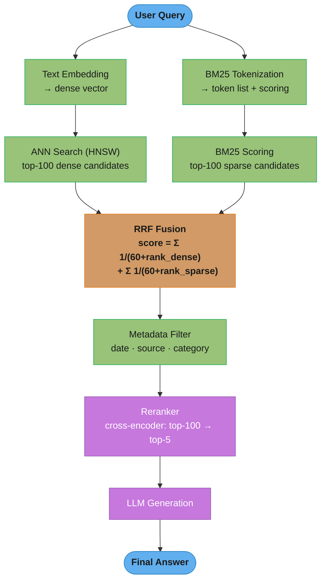

# Retrieval Methods

## 1. Concept Overview

Retrieval is the step in RAG that finds relevant document chunks from an index given a user query. The quality of this retrieval step directly bounds the quality of the generated answer — no LLM can synthesize correct answers from irrelevant context. Three main retrieval paradigms exist: dense retrieval (semantic similarity using [embeddings](../embeddings_and_similarity_search/README.md)), sparse retrieval (keyword-based using inverted indices like BM25), and hybrid retrieval (combining both).

Each paradigm has systematic strengths and blind spots. Dense retrieval handles semantic paraphrase ("automobile" finds documents about "car") but misses rare proper nouns. Sparse retrieval excels at exact keyword matching (product IDs, regulation numbers, technical acronyms) but fails at semantic similarity. Hybrid retrieval — combining dense and sparse via Reciprocal Rank Fusion — consistently outperforms either alone across diverse query distributions.

---

## Intuition

> **One-line analogy**: Dense retrieval is a semantic search engine that understands meaning; sparse retrieval is Ctrl+F across all documents. Hybrid combines both.

**Mental model**: Dense retrieval maps query and documents into the same embedding space and finds nearest neighbors by cosine similarity. A query about "heart attack" retrieves documents about "myocardial infarction" because they're semantically close. BM25 gives this same document a low score — "myocardial infarction" doesn't contain "heart attack." Conversely, BM25 excels at finding all documents containing a regulation ID like "IEC 62443-2-1" — dense retrieval may miss it if the query phrasing doesn't match that exact notation. Hybrid combines both signals: neither suffers from the other's blind spot.

**Why it matters**: The choice of retrieval method determines which queries your RAG system can answer correctly. Dense-only fails for exact-match queries (proper nouns, IDs, codes); sparse-only fails for semantic queries (synonyms, paraphrases, multilingual). For production systems serving real users with diverse query types, hybrid retrieval is the correct default.

**Key insight**: Hybrid retrieval via RRF is both simple to implement (two separate retrievers + rank fusion formula) and consistently delivers 5-15% better recall@10 than either dense or sparse alone, with no additional model training.

---

## 2. Core Principles

- **Dense retrieval is semantic, not lexical**: A dense retriever compares meaning via embedding geometry, not words via term overlap.
- **Sparse retrieval is exact and interpretable**: BM25 gives a well-defined score based on term frequency and document frequency; easy to debug.
- **The two failure modes are orthogonal**: Dense fails on rare/exact terms; sparse fails on semantic paraphrases. Their weaknesses don't overlap.
- **RRF is position-based, not score-based**: RRF uses ranks, not raw scores, making it robust to different score scales from different retrievers.
- **Metadata filtering is complementary**: Filter by structured metadata (date, source, category) to scope retrieval before or after semantic/keyword search.

---

## 3. How It Works — Detailed Mechanics

### 3.1 Dense Retrieval (Bi-Encoder + ANN)

**Bi-encoder architecture:**
```
Query encoder:    query_text → dense vector q (d-dimensional)
Document encoder: doc_text   → dense vector d (d-dimensional)

Similarity score: cosine_similarity(q, d) = (q·d) / (||q|| × ||d||)

Training: contrastive learning on (query, positive_doc, negative_docs) triples
  Maximize cosine(query, positive) while minimizing cosine(query, negatives)
```

**Approximate Nearest Neighbor (ANN) search:**
```
Exact search: compute cosine similarity to all N vectors → O(N×d) per query
  → Too slow for N > 1M vectors

ANN with HNSW (Hierarchical Navigable Small World):
  Build: multi-layer graph where close vectors are connected
  Search: start at top layer (coarse), traverse to bottom layer (fine)
  Time complexity: O(log N) per query
  Recall: 95-99% (misses ~1-5% of true nearest neighbors)
  Trade-off: 5% recall loss, 1000× speed gain vs. exact search

Pinecone, Weaviate, Qdrant all use HNSW internally.
```

**Dense retrieval example:**
```python
from sentence_transformers import SentenceTransformer
import numpy as np

model = SentenceTransformer("BAAI/bge-base-en-v1.5")

def dense_retrieve(query: str, chunks: list[dict], top_k: int = 20):
    query_embedding = model.encode(query, normalize_embeddings=True)
    chunk_embeddings = np.array([c["embedding"] for c in chunks])

    # Cosine similarity (embeddings are normalized, so dot product = cosine)
    scores = chunk_embeddings @ query_embedding
    top_indices = np.argsort(scores)[-top_k:][::-1]
    return [(chunks[i], float(scores[i])) for i in top_indices]
```

### 3.2 Sparse Retrieval (BM25)

BM25 (Best Match 25) is the industry-standard sparse retrieval formula:

```
BM25(q, d) = Σ_{t ∈ q} IDF(t) × (tf(t,d) × (k1 + 1)) / (tf(t,d) + k1 × (1 - b + b × |d|/avgdl))

Where:
  IDF(t)    = log((N - df(t) + 0.5) / (df(t) + 0.5) + 1)
              N: total documents; df(t): documents containing term t
              Common terms (low IDF): low weight
              Rare terms (high IDF): high weight

  tf(t, d)  = term frequency of t in document d

  k1        = 1.2-2.0 (saturation parameter; controls tf scaling)
              High tf(t,d) provides diminishing returns beyond k1

  b         = 0.75 (length normalization; reduces score for long docs)
              b=1: full length normalization; b=0: no normalization

  |d|       = document length (tokens); avgdl = average document length
```

BM25 strengths:
```
Query: "ISO 27001 certification requirements"
  → BM25 finds all documents containing "ISO", "27001", "certification", "requirements"
  → Rare term "27001" has very high IDF → heavily weighted
  → Dense retrieval might miss documents that use "information security standard"
     without the exact "27001" notation

Query: "Find error code E-2045 in the system logs"
  → BM25 matches "E-2045" exactly (rare term, high IDF)
  → Dense retrieval struggles with arbitrary identifier strings
```

```python
from rank_bm25 import BM25Okapi

def build_bm25_index(chunks: list[str]) -> BM25Okapi:
    tokenized_chunks = [chunk.lower().split() for chunk in chunks]
    return BM25Okapi(tokenized_chunks)

def sparse_retrieve(query: str, bm25: BM25Okapi,
                    chunks: list[str], top_k: int = 20):
    tokenized_query = query.lower().split()
    scores = bm25.get_scores(tokenized_query)
    top_indices = np.argsort(scores)[-top_k:][::-1]
    return [(chunks[i], float(scores[i])) for i in top_indices]
```

### 3.3 Hybrid Retrieval with RRF

Reciprocal Rank Fusion combines rankings from multiple retrieval systems:

```
RRF formula:
  RRF_score(doc, k=60) = Σ_{r ∈ retrievers} 1 / (k + rank_r(doc))

  k = 60 (constant that dampens the impact of top-ranked documents)

Example:
  doc_A ranked 1st in dense, 5th in BM25:
    RRF(doc_A) = 1/(60+1) + 1/(60+5) = 0.01639 + 0.01538 = 0.03177

  doc_B ranked 3rd in dense, 2nd in BM25:
    RRF(doc_B) = 1/(60+3) + 1/(60+2) = 0.01587 + 0.01613 = 0.03200

  doc_B ranks higher despite not being #1 in either — consistently high across both
```

### How RRF Fuses Two Rankings

Each retriever contributes `1/(k+rank)` per document (k=60). The reciprocal compresses the
gap between adjacent ranks, so a doc ranked *consistently high* across both lists beats one
that tops a single list: `doc_B` (3rd + 2nd) edges out `doc_A` (1st + 5th).

```
  Dense ranking         BM25 ranking          Fuse: sum of 1/(k+rank), k=60
  ┌───────────────┐     ┌───────────────┐
  │ 1.  doc_A     │     │ 1.  ...       │     doc_A = 1/(60+1) + 1/(60+5)
  │ 2.  ...       │     │ 2.  doc_B     │           = 0.01639 + 0.01538 = 0.03177
  │ 3.  doc_B     │     │ ...           │
  │ ...           │     │ 5.  doc_A     │     doc_B = 1/(60+3) + 1/(60+2)
  └───────────────┘     └───────────────┘           = 0.01587 + 0.01613 = 0.03200  ◄ wins

  doc_B is #1 in neither list yet wins: RRF rewards cross-retriever agreement, and the
  reciprocal makes raw score magnitudes irrelevant — only ranks matter.
```

```python
def reciprocal_rank_fusion(
    dense_results: list[tuple],    # [(doc, score), ...]
    sparse_results: list[tuple],   # [(doc, score), ...]
    k: int = 60
) -> list[tuple]:
    """
    Combine dense and sparse retrieval results using RRF.
    Returns merged list sorted by RRF score (descending).
    """
    doc_scores = {}

    for rank, (doc, _) in enumerate(dense_results):
        doc_id = doc.id
        if doc_id not in doc_scores:
            doc_scores[doc_id] = {"doc": doc, "rrf": 0.0}
        doc_scores[doc_id]["rrf"] += 1.0 / (k + rank + 1)

    for rank, (doc, _) in enumerate(sparse_results):
        doc_id = doc.id
        if doc_id not in doc_scores:
            doc_scores[doc_id] = {"doc": doc, "rrf": 0.0}
        doc_scores[doc_id]["rrf"] += 1.0 / (k + rank + 1)

    sorted_docs = sorted(doc_scores.values(),
                         key=lambda x: x["rrf"], reverse=True)
    return [(item["doc"], item["rrf"]) for item in sorted_docs]
```

### 3.4 Weighted Score Combination (Alternative to RRF)

```
Linear combination:
  hybrid_score(doc) = α × normalize(dense_score) + (1-α) × normalize(bm25_score)
  α = 0.5 (equal weight; tune based on eval)

Problem: dense scores (cosine similarity: [-1, 1]) and BM25 scores
  (unbounded positive) are on different scales
  → Must normalize each independently before combining

Normalization:
  dense_norm  = (score - min) / (max - min)     across all candidates
  sparse_norm = (score - min) / (max - min)     across all candidates

When to use weighted combination vs. RRF:
  RRF: when you don't want to tune α; more robust to score distribution differences
  Weighted: when you have query-type-dependent weights (factual → more BM25; semantic → more dense)
```

### Why Weighted Hybrid Scores Must Be Normalized First

The two retrievers emit incompatible scales: cosine ∈ [-1, 1] (bounded), BM25 ∈ [0, ∞)
(unbounded). Add them raw and the larger-magnitude BM25 term dominates, so the α knob stops
doing anything. Min-max rescaling maps each onto [0, 1] before the α-weighted blend.

```
  RAW (incompatible ranges) ─────────────────────────────────────────
  cosine   [-1 ───────────────── +1]      bounded, total width = 2
  BM25     [ 0 ──────────────────────────────────────► ∞ ]   unbounded, can be ≫ 1

      raw  α·cosine + (1-α)·BM25   →  BM25's magnitude dominates regardless of α

  NORMALIZED  via  (score - min) / (max - min)  over the candidate set ─
  cosine   [0 ───────────────── 1]
  BM25     [0 ───────────────── 1]        same footing

      hybrid = α·cosine_norm + (1-α)·bm25_norm,   α = 0.5   →  α now controls the blend
```

The fix is per-query, not global: min and max are computed over *this query's* candidate
set, because BM25's absolute range shifts with query length and term rarity.

### 3.5 Metadata Filtering

Scope retrieval to a subset of the index using structured metadata:

```python
# Pinecone metadata filter syntax
results = pinecone_index.query(
    vector=query_embedding,
    filter={
        "document_date": {"$gte": "2024-01-01"},
        "document_type": {"$in": ["policy", "regulation"]},
        "department": {"$eq": "legal"}
    },
    top_k=20
)

# Weaviate metadata filter
results = (
    weaviate_client.query
    .get("Document", ["content", "source", "date"])
    .with_near_vector({"vector": query_embedding})
    .with_where({
        "operator": "And",
        "operands": [
            {"path": ["date"], "operator": "GreaterThanEqual", "valueText": "2024-01-01"},
            {"path": ["department"], "operator": "Equal", "valueText": "legal"}
        ]
    })
    .with_limit(20)
    .do()
)
```

Metadata filtering is often more impactful than retrieval algorithm choice for precision-sensitive applications. A filter for `document_date >= 2024-01-01` eliminates all stale documents regardless of embedding similarity.

---

## 4. Architecture Diagram

### Hybrid Retrieval Pipeline


### HNSW Graph Structure
```
Layer 2 (coarse):   A ----- E
                    |
Layer 1 (medium):   A - B - E - F
                    |   |
Layer 0 (fine):     A-B-C-D-E-F-G-H

Search for Q:
  Start at layer 2: navigate to closest node (E)
  Drop to layer 1: navigate from E to closest (F)
  Drop to layer 0: navigate from F to exact nearest neighbors
  Result: approximate nearest neighbors in O(log N) steps
```

---

## 5. Real-World Examples

### Elasticsearch Hybrid Search (ELSER + BM25)
- Elasticsearch combines BM25 (inverted index) with ELSER (learned sparse embedding)
- RRF built into Elasticsearch `rrf` query type (added in 8.8)
- Used by large e-commerce platforms for product search

### Weaviate Native Hybrid Search
- Weaviate's `hybrid` parameter combines dense BM25 + vector search internally
- `alpha` parameter controls the balance: 0 = pure sparse, 1 = pure dense
- Automatic RRF fusion; no manual merge step needed

### Pinecone Hybrid Search
- Requires separate dense and sparse indices; RRF implemented client-side
- Sparse index uses Pinecone's built-in BM25; dense uses any embedding
- Widely deployed in enterprise RAG systems

---

## 6. Tradeoffs

| Method | Recall (semantic) | Recall (keyword) | Latency | Setup Complexity | Index Size |
|--------|------------------|-----------------|---------|-----------------|------------|
| Dense only | High | Low | Fast | Medium | Medium |
| Sparse (BM25) only | Low | High | Fast | Low | Small |
| Hybrid (RRF) | High | High | Moderate | Medium | Medium |
| Hybrid + metadata filter | High | High | Moderate | Medium | Medium |
| Hybrid + reranker | Best | Best | Slower | High | Medium |

---

## 7. When to Use / When NOT to Use

### Use Dense-Only When:
- All queries are semantic/conceptual (no exact keyword requirements)
- Infrastructure complexity is a constraint
- Query vocabulary aligns well with document vocabulary

### Use BM25-Only When:
- All queries contain exact terms (ID lookups, code search, log analysis)
- Latency requirements are extremely strict
- Semantic understanding not needed (database-style lookups)

### Use Hybrid When:
- Query distribution is mixed (both semantic and keyword queries)
- Production system serving real users with diverse query types
- Quality is the priority and infrastructure can handle two retrieval paths

---

## 8. Common Pitfalls

**1. Dense search on exact-match queries without BM25**
A user queries for a specific regulation number ("21 CFR 820.30"). Dense search may return documents about medical device regulations in general, not this specific section.
Fix: Use BM25 for exact-match recall; hybrid fusion ensures both signals contribute.

**2. BM25 without normalization for different document lengths**
Long documents have higher term frequencies and longer documents tend to dominate BM25 results even if less relevant.
Fix: BM25's `b` parameter (0.75 default) handles length normalization; ensure it's not set to 0.

**3. Mixing scores from dense and sparse without normalization**
Raw cosine similarity scores (e.g., 0.85) and raw BM25 scores (e.g., 12.3) are on incomparable scales; combining them directly produces biased results.
Fix: Use RRF (rank-based, scale-independent) or normalize each score set to [0,1] before linear combination.

**4. Metadata filters applied after full ANN search**
Searching all N vectors and then filtering by metadata wastes computation.
Fix: Apply metadata pre-filter at the ANN search level (Pinecone, Weaviate, Qdrant all support filtered ANN). Filters during search, not after, reduces wasted computation.

**5. Using top-10 without a reranker**
Initial retrieval returns top-10, but the 3-5 most relevant chunks may be ranked 4th-10th by the bi-encoder. Without reranking, the LLM sees lower-quality context.
Fix: Retrieve top-100 candidates, then rerank to top-5. See [reranking.md](reranking.md) for reranker choices.

**6. No query preprocessing**
Queries with stopwords ("what is the best way to handle...") or typos produce poor BM25 results.
Fix: Apply query preprocessing: lowercase, remove stopwords for BM25 (not dense), spell-check for critical applications.

---

## 9. Technologies & Tools

| Tool | Type | Notes |
|------|------|-------|
| **Pinecone** | Vector DB (dense) | Best managed option; native sparse index support |
| **Weaviate** | Hybrid DB | Built-in hybrid search; `alpha` parameter for balance |
| **Qdrant** | Vector DB | Fast; Rust-based; native hybrid support in v1.7+ |
| **Elasticsearch** | Hybrid DB | ELSER + BM25; enterprise-grade; RRF query support |
| **OpenSearch** | Hybrid DB | Fork of Elasticsearch; neural search plugin for hybrid |
| **pgvector** | PostgreSQL extension | Dense search only; pair with pg_trgm for text search |
| **rank-bm25** | Python BM25 | Simple BM25 for prototyping; not production-scale |
| **Chroma** | Vector DB | Good for local dev; no native hybrid |
| **FAISS** | ANN library | Gold standard for offline ANN; not a managed DB |

---

## 10. Interview Questions with Answers

**Q: What is hybrid search and why does it outperform dense-only retrieval?**
A: Hybrid search combines dense (vector/semantic) retrieval and sparse (BM25/keyword) retrieval. Dense retrieval handles semantic similarity — a query about "car purchase" retrieves documents about "automobile buying" because they're close in embedding space. BM25 handles exact keyword matching — product SKUs, regulation numbers, proper names that dense models don't reliably cluster. They have orthogonal failure modes: dense misses exact-match queries; BM25 misses semantic paraphrases. Combining via RRF consistently achieves 5-15% higher recall@10 than either alone. In practice, real user query distributions include both types — hybrid is the correct default for production.

**Q: How does Reciprocal Rank Fusion work and why is it preferred over score combination?**
A: RRF computes a fused score using position ranks: `score(doc) = Σ 1/(k + rank_i)` for each retriever i, where k=60 is a smoothing constant. Documents ranked high by multiple retrievers accumulate high RRF scores. RRF is preferred over weighted score combination for two reasons: (1) RRF is scale-invariant — dense scores (cosine similarity in [-1,1]) and BM25 scores (unbounded positive) are incomparable raw values; RRF uses only rank positions, avoiding the need for normalization; (2) RRF is parameter-free — no α weight to tune; it's robust to the score distributions of each retriever. Linear score combination requires careful per-dataset α tuning and normalization.

**Q: What is HNSW and how does it enable fast ANN search?**
A: HNSW (Hierarchical Navigable Small World) is the dominant ANN algorithm used in vector databases. It builds a multi-layer graph where layer 0 contains all vectors connected to their nearest neighbors, and higher layers contain progressively fewer nodes (a subset sampled as "shortcuts"). Search starts at the top layer (coarse navigation) and progressively descends to layer 0 (fine-grained nearest neighbor search), following the best edge at each step. This hierarchical structure enables O(log N) search time vs. O(N) for brute force. HNSW achieves 95-99% recall (missing ~1-5% of true nearest neighbors) — acceptable for RAG since the reranker compensates for the small number of missed retrievals.

**Q: What is the difference between pre-filtering and post-filtering in vector search?**
A: Pre-filtering applies metadata constraints before or during the ANN search: the index only considers vectors that satisfy the filter condition. Post-filtering retrieves the top-K vectors without constraints, then filters by metadata and potentially fetches more until K relevant results are found. Pre-filtering is more efficient (doesn't waste ANN computation on filtered-out vectors) but requires vector DB support for filtered ANN (Pinecone, Weaviate, Qdrant support this). Post-filtering is simpler but inefficient when the filter eliminates many results — if 90% of chunks are filtered out, you may need to retrieve top-10K to get 100 filtered results. For precision-critical applications with strict metadata scoping, pre-filtering is strongly preferred.

**Q: How do you handle the case where BM25 needs to match technical identifiers like "E-2045" or "ISO 27001"?**
A: Technical identifiers are high-IDF terms (they appear in very few documents) and should score very high in BM25. The main risk is tokenization: a tokenizer that splits "E-2045" into ["E", "2045"] or "ISO-27001" into ["ISO", "27001"] reduces the identifier's specificity to common substrings. Fix: (1) Use a tokenizer that preserves hyphenated terms and alphanumeric identifiers as single tokens; (2) Index both the original identifier and its hyphen-normalized form; (3) Use phrase matching in BM25 to require the full identifier as a sequence, not just individual tokens. Elasticsearch's `match_phrase` query handles this correctly.

**Q: What are the tradeoffs between BM25 and a learned sparse retrieval method like SPLADE?**
A: Traditional BM25 uses raw term frequencies and IDF; it's non-learned and requires exact keyword matches. SPLADE (Sparse Lexical and Expansion model) is a learned sparse retrieval method that expands both query and document with related terms (a document about "cardiac arrest" gets "heart attack" added to its sparse representation), enabling semantic matching while maintaining the efficiency of inverted index retrieval. SPLADE vs. BM25: SPLADE achieves ~20-30% better recall on semantic queries while maintaining BM25-level speed; requires a fine-tuned SPLADE model; needs the index to store expanded sparse vectors (larger than BM25 inverted index). In practice: for RAG systems, SPLADE + dense hybrid often outperforms BM25 + dense hybrid, at the cost of a learned sparse model.

**Q: How does metadata filtering interact with hybrid retrieval?**
A: Metadata filtering scopes the retrieval space; hybrid search operates within that scope. The order matters: pre-filter by metadata first (most vector DBs support this), then run both dense ANN and BM25 within the filtered subset. If the filtered subset is small (e.g., 100 documents after date filter), BM25 over 100 documents is trivially fast and ANN loses some quality (HNSW is less effective on small subsets — exact search may be preferable). A common pattern for enterprise RAG: strong metadata pre-filtering (date range, department, document type) to reduce to a manageable subset, then hybrid search within that subset, then reranking. The metadata filter does more heavy lifting than people expect — often reducing 10M vectors to 10K relevant ones.

**Q: When should you NOT use hybrid search?**
A: Hybrid retrieval adds operational complexity: two retrieval paths, a merge step, and potentially two indices. It's not justified when: (1) Query distribution is entirely semantic (a semantic-only product discovery system); (2) Query distribution is entirely exact-match (a database lookup system); (3) Infrastructure constraints don't allow two retrieval systems; (4) The corpus is very small (under 10K chunks) where brute-force exact similarity search is fast enough. Also avoid hybrid when the BM25 index is of poor quality (badly tokenized, not maintained). A good dense retriever often beats a poorly configured BM25+dense hybrid.

**Q: How do you tune the `k` parameter in RRF?**
A: The RRF constant k (default 60) controls how much the top ranks are boosted relative to lower ranks. k=60 means a document ranked 1st gets score 1/(60+1) ≈ 0.016 and rank 100th gets 1/160 ≈ 0.006 — a ~2.7× boost for the top rank. Smaller k (e.g., k=10) amplifies the top-rank advantage: rank 1st gets 0.09 vs rank 100th gets 0.009 — a 10× boost. Larger k (e.g., k=100) reduces the advantage. For most RAG applications, k=60 is the right default — the original RRF paper showed k=60 was robust across many TREC retrieval tasks. Only tune k if your eval shows a strong signal; otherwise the default is well-justified.

**Q: What is the impact of query length on dense vs. sparse retrieval quality?**
A: Short queries (1-3 words): BM25 works well (few high-IDF terms to match); dense retrieval may underperform because there's insufficient context for a meaningful embedding. Long queries (20+ words): dense retrieval excels because the embedding captures the full semantic intent; BM25 may be noisy (too many terms, including low-IDF stopwords, that dilute the signal). For RAG systems where users write full-sentence questions ("What are the requirements for ISO certification of a medical device manufacturer?"), dense retrieval is the primary contributor and BM25 adds value primarily for rare terms in the query.

**Q: How do you tune BM25 parameters (k1, b) for your corpus?**
A: k1 controls term frequency saturation — the default is 1.2, and higher values weight repeated terms more heavily (useful when a document uses a term many times, indicating importance). b controls document length normalization — the default is 0.75, reducing scores for longer documents. Short documents (product descriptions, titles averaging 20-50 tokens) benefit from b=0.3-0.5 to reduce the length penalty on naturally concise documents; long documents (articles, reports averaging 500-2000 tokens) use the standard b=0.7-0.9. In practice, BM25 parameter tuning on most corpora improves recall by only 1-3% over defaults — it is rarely the bottleneck. Tune BM25 parameters only after confirming that sparse retrieval is underperforming on short or long documents specifically, not as a first optimization step.

**Q: How do you configure hybrid search weighting between BM25 and dense?**
A: Start with Reciprocal Rank Fusion (RRF) at k=60 as the default — it requires no weighting parameter, is robust to score scale differences between retrievers, and performs within 2-3% of optimally tuned linear interpolation on most corpora. If you choose linear interpolation (hybrid_score = alpha × dense_score + (1-alpha) × sparse_score), normalize both score sets to [0,1] before combining and tune alpha on your labeled eval set starting from alpha=0.5. Keyword-heavy domains (legal codes, medical ICD codes, product identifiers) favor alpha=0.3-0.4, giving more weight to BM25; conversational semantic domains favor alpha=0.6-0.7, giving more weight to dense. Use RRF by default; switch to tuned linear interpolation only if you have a labeled eval set and the 2-3% precision improvement justifies the tuning overhead.

**Q: How does ColBERT's late interaction scale compared to bi-encoder retrieval?**
A: ColBERT stores per-token embeddings (128 dimensions each) rather than a single document vector. A document with 200 tokens produces 200 × 128 = 25,600 floats, compared to 768 floats for a standard bi-encoder — a 33× storage increase per document. For a 10M document corpus, a bi-encoder index requires ~30GB; a ColBERT index requires ~1TB. ColBERT retrieval uses PLAID (a two-stage approximation): fast approximate centroid scoring first, then exact MaxSim on the top candidates — enabling sub-10ms retrieval despite large storage. ColBERT improves recall by 5-15% over bi-encoders on most retrieval benchmarks. Use ColBERT when recall is the primary constraint, GPU storage is available (ColBERT-on-GPUs for fast MaxSim), and the 33× storage increase is acceptable.

**Q: What is SPLADE and how does it compare to BM25?**
A: SPLADE (Sparse Lexical and Expansion model) is a learned sparse retrieval model that generates sparse vectors where each dimension corresponds to a vocabulary term, similar to BM25's inverted index structure. Unlike BM25, which uses raw term frequencies and IDF, SPLADE learns to expand both queries and documents with related terms — a document about "cardiac arrest" gets "heart attack" and "myocardial infarction" added to its sparse representation, enabling semantic matching. SPLADE vectors are stored in an inverted index and retrieved with the same efficiency as BM25. On BEIR benchmark retrieval tasks, SPLADE outperforms BM25 by 5-10% in recall while maintaining BM25-level search latency. In a hybrid pipeline, replacing BM25 with SPLADE in the sparse leg typically improves overall hybrid recall by 3-7%. The cost: a trained SPLADE model (e.g., naver/splade-cocondenser-distil) must be self-hosted, and sparse vectors are larger than BM25 inverted index entries.

**Q: How do you evaluate retrieval quality independently from generation?**
A: Build a retrieval-only evaluation set: 200-500 (query, relevant_document_ids) pairs labeled by domain experts or derived from user click logs (clicked document = relevant). Run the retriever in isolation and measure: Recall@K (fraction of queries where a relevant document appears in top-K results), MRR (Mean Reciprocal Rank — the mean of 1/rank_of_first_relevant_document), and NDCG@K (Normalized Discounted Cumulative Gain — weights earlier positions more heavily). Recall@5 and Recall@10 are the most actionable metrics for RAG because they directly measure whether the LLM will have the right information to generate a correct answer. If retrieval Recall@5 is below 80%, no amount of LLM quality improvement will consistently compensate — invest in retrieval improvements first. Evaluate the retriever in isolation before optimizing the generator.

---

## 11. Best Practices

1. **Default to hybrid retrieval in production** — pure dense or pure BM25 consistently underperforms hybrid on diverse real-world query distributions.
2. **Use RRF as the fusion method** — scale-invariant, parameter-free, and works well out of the box.
3. **Apply metadata pre-filters** — filter at the index level before ANN search; post-filtering wastes computation.
4. **Retrieve 50-100 candidates** — not top-5; feed a large candidate set to the reranker for final selection.
5. **Test both dense and sparse separately on your query distribution** — this diagnoses which retrieval mode is the bottleneck and whether hybrid helps.
6. **Monitor per-query retrieval scores** — if top-1 cosine similarity is below 0.6 for many queries, the embedding model or [chunking](chunking_strategies.md) is misaligned with your query distribution.
7. **Use BM25 to validate dense retrieval** — if BM25 consistently returns better results for certain query types, those queries should be weighted toward sparse in your hybrid.

---

## 12. Case Study

### Building a Hybrid Retrieval System for a Technical Documentation Platform

**Problem Statement**

A software company's developer documentation platform serves 500,000 monthly active developers. The corpus: 120,000 document chunks from API references, tutorials, changelog entries, and error code guides. Initial system: dense-only retrieval with text-embedding-3-small. Problems observed: (1) queries containing exact error codes (e.g., "ERR_SOCKET_TIMEOUT_4203") returned semantically related but incorrect chunks — the embedding model had no strong signal for arbitrary alphanumeric identifiers; (2) queries for specific function signatures ("pandas DataFrame.merge() with how='left'") retrieved generic pandas documentation instead of the specific method page. Recall@5 on a 500-query eval set: 61% for semantic queries but 34% for exact-identifier queries — the identifier query failure drove overall recall@5 to 54%.

**Architecture Overview**

```
Dual-Index Retrieval Architecture:

Documentation Corpus (120K chunks)
    |
    +-- Dense Index (Qdrant)
    |   Model: text-embedding-3-small (1536d)
    |   HNSW: ef_construction=200, m=16
    |   Metadata: doc_type, product, version, last_updated
    |
    +-- Sparse Index (Elasticsearch BM25)
        Tokenizer: custom (preserves hyphens, underscores, dots)
        Index fields: title (boost 3.0), content (boost 1.0),
                      code_identifiers (boost 5.0, not_analyzed)
        Stopwords: English minus "not", "no", "error" (preserve negation)


Query Pipeline:

User Query
    |
    +-- Query Classification:
    |   Exact-match signals: uppercase sequences, digits, underscores,
    |                        error code patterns (ERR_*, HTTP_*, 0x*)
    |   Classification: semantic | exact_match | mixed
    |
    +-- Retrieval:
    |   Semantic query:    dense top-100 only
    |   Exact-match query: BM25 top-100 only (fast path)
    |   Mixed query:       both, RRF fusion (k=60), top-100 combined
    |
    +-- Metadata Pre-filter:
    |   product = user.selected_product
    |   version >= user.min_version (version-aware retrieval)
    |
    +-- Reranker: BGE-reranker-large (self-hosted)
    |   100 candidates → top-5
    |
    +-- LLM Generation (GPT-4o)
        Context: top-5 chunks + source URLs for citation
```

**Key Design Decisions**

1. Custom tokenizer for technical identifiers: Elasticsearch's default tokenizer splits "ERR_SOCKET_TIMEOUT_4203" into ["ERR", "SOCKET", "TIMEOUT", "4203"] — each sub-token is common, giving low IDF and weak BM25 signal. A custom tokenizer configured with `word_delimiter_graph` and `preserve_original=true` indexes both the full identifier ("ERR_SOCKET_TIMEOUT_4203") and sub-tokens, giving the full identifier a separate high-IDF entry. This single change improved exact-identifier query recall@5 from 34% to 71%.

2. Query classification for adaptive retrieval: queries classified as "exact-match" skip dense retrieval entirely (reducing latency by 40ms) and route to BM25 only. Classification uses a simple heuristic: if the query contains 2+ uppercase letter sequences or identifiers matching `[A-Z][A-Z_0-9]{3,}`, it is flagged as exact-match. False positive rate: 8% (semantic queries misclassified as exact-match) — acceptable because BM25 still retrieves reasonable results for semantic queries with technical terms.

3. Version-aware pre-filtering: every chunk carries `product_version` and `min_version_applies` metadata. Developers working on product v3.2 should not retrieve deprecated v2.x API documentation. The pre-filter `version >= user.min_version AND version <= user.max_version` scopes retrieval to relevant versions before any similarity computation. This filter eliminated 23% of previously retrieved results that were correct but version-mismatched.

4. Code identifier field with high boost: API reference pages contain function signatures, class names, and parameter names. Indexing these as a separate `code_identifiers` field with boost 5.0 (vs. content boost 1.0) means a query containing `DataFrame.merge` strongly prioritizes chunks with that exact function name in the identifiers field. Code identifiers are extracted using a regex pass during indexing.

**Implementation — RRF Fusion with Query Classification**

```python
import re
from dataclasses import dataclass
from enum import Enum

class QueryType(Enum):
    SEMANTIC = "semantic"
    EXACT_MATCH = "exact_match"
    MIXED = "mixed"

def classify_query(query: str) -> QueryType:
    exact_match_patterns = [
        r'\b[A-Z][A-Z_0-9]{3,}\b',        # ERROR_CODE_PATTERN
        r'\b0x[0-9a-fA-F]+\b',             # hex codes
        r'\b\w+\.\w+\(\)',                  # function signatures
        r'\bHTTP_\d+\b',                    # HTTP status codes
    ]
    matches = sum(
        len(re.findall(p, query)) for p in exact_match_patterns
    )
    if matches >= 2:
        return QueryType.EXACT_MATCH
    elif matches == 1:
        return QueryType.MIXED
    return QueryType.SEMANTIC

def retrieve(query: str, user_product: str, user_version: str,
             top_k: int = 100) -> list[dict]:
    query_type = classify_query(query)
    metadata_filter = {
        "product": user_product,
        "max_version": {"$gte": user_version}
    }

    if query_type == QueryType.EXACT_MATCH:
        # Fast path: BM25 only
        return bm25_retrieve(query, metadata_filter, top_k)

    elif query_type == QueryType.SEMANTIC:
        # Dense only
        return dense_retrieve(query, metadata_filter, top_k)

    else:  # MIXED
        dense_results = dense_retrieve(query, metadata_filter, top_k)
        sparse_results = bm25_retrieve(query, metadata_filter, top_k)
        return reciprocal_rank_fusion(dense_results, sparse_results, k=60)

def reciprocal_rank_fusion(dense: list, sparse: list, k: int = 60) -> list:
    scores = {}
    for rank, doc in enumerate(dense):
        doc_id = doc["chunk_id"]
        scores.setdefault(doc_id, {"doc": doc, "rrf": 0.0})
        scores[doc_id]["rrf"] += 1.0 / (k + rank + 1)
    for rank, doc in enumerate(sparse):
        doc_id = doc["chunk_id"]
        scores.setdefault(doc_id, {"doc": doc, "rrf": 0.0})
        scores[doc_id]["rrf"] += 1.0 / (k + rank + 1)
    return [v["doc"] for v in sorted(
        scores.values(), key=lambda x: x["rrf"], reverse=True
    )]
```

**Results (500-query eval set)**

| Metric | Dense Only | BM25 Only | Hybrid RRF | Hybrid + Reranker |
|--------|-----------|-----------|------------|-------------------|
| Overall Recall@5 | 54% | 48% | 71% | 82% |
| Semantic query Recall@5 | 61% | 39% | 68% | 79% |
| Exact-match query Recall@5 | 34% | 67% | 77% | 88% |
| P95 retrieval latency | 45ms | 18ms | 62ms | 158ms |
| Index storage | 3.2GB | 1.1GB | 4.3GB | 4.3GB |

The hybrid + reranker pipeline (158ms P95 retrieval latency) fits within the system's 2-second end-to-end SLO. The 82% overall Recall@5 (up from 54%) reduced the fraction of queries where the LLM had to hedge ("I don't have enough information") from 31% to 9%.

**Tradeoffs and Alternatives**

- Maintaining two indices (Qdrant + Elasticsearch) adds operational complexity: dual ingestion pipelines, separate monitoring, and two index update operations per document. Alternative: Weaviate's native hybrid search (BM25 + dense in one system) reduces operational overhead but the custom tokenizer for technical identifiers is not configurable in Weaviate's BM25 implementation.
- The query classifier introduces a failure mode: misclassified queries route to the wrong retriever. The 8% false positive rate is acceptable but should be monitored. A simple fallback: if the routed retriever returns top-1 similarity below 0.5, automatically fall back to hybrid.
- SPLADE as a BM25 replacement: replacing Elasticsearch BM25 with SPLADE improved exact-match recall@5 by 4% (from 77% to 81% hybrid) but required additional GPU inference at indexing time and a SPLADE model serving endpoint. Accepted for the next iteration.

**Interview Discussion Points**

- Why does BM25 outperform dense on exact-match queries? Dense retrieval learns semantic proximity from training data — arbitrary alphanumeric codes like "ERR_4203" appear rarely or never in training data, so the model produces a generic embedding with little discriminative power. BM25 treats "ERR_4203" as a single high-IDF term (rare in the corpus = high discriminative power) and scores it heavily when it appears.
- How do you handle documentation updates? Incremental indexing: on documentation commit, extract changed chunks (diff-based), delete old versions from both indices by chunk_id, and insert new chunks. Both Qdrant and Elasticsearch support upsert by ID. A nightly full consistency check verifies both indices are in sync.
- How would you scale this to 10M chunks? The dual-index architecture scales independently: Qdrant clusters horizontally for dense retrieval; Elasticsearch scales with standard shard configuration. The RRF merge step is O(n) in the candidate set size — it does not become a bottleneck. The query classifier remains a single stateless service that scales with horizontal pod replication.
