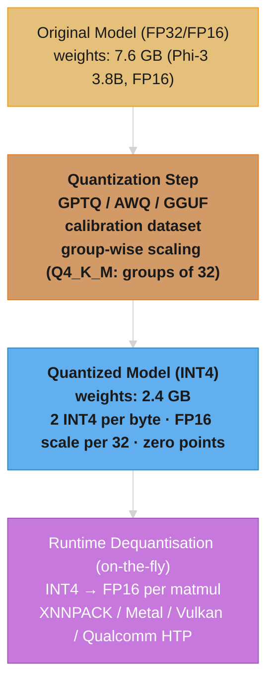

# Small Language Models and Edge AI

---

## 1. Concept Overview

Small language models (SLMs) are transformer-based language models in the 1B–7B parameter range designed to run efficiently on consumer hardware, mobile devices, and edge infrastructure — without requiring a cloud API call.

Key models in this space:

| Model | Parameters | Organization | Notable Strength |
|---|---|---|---|
| Phi-3 Mini | 3.8B | Microsoft | Textbook-quality training data |
| Phi-3.5 / Phi-4 | 3.8B–14B | Microsoft | Reasoning, instruction following |
| LLaMA 3.2 1B / 3B | 1B, 3B | Meta | Permissive license, multilingual |
| Gemma 2B / 9B | 2B, 9B | Google DeepMind | Safety-tuned, open weights |
| TinyLlama | 1.1B | Community | Extreme resource efficiency |
| Qwen2.5 | 0.5B–3B | Alibaba | Strong multilingual, code |
| Gemini Nano | ~1.8B | Google | Android on-device integration |

The defining insight from Microsoft's Phi series — "textbooks are all you need" — is that training on high-quality, curated synthetic data can produce a 3B model that outperforms 13B models trained on raw web crawls on many benchmarks. Data quality drives capability more than raw parameter count within the SLM range.

On-device inference delivers three structural advantages over cloud API calls: offline operation (no network dependency), privacy preservation (data never leaves the device), and zero-network-latency responses (inference time is the only latency).

Edge AI extends SLMs beyond phones to IoT sensors, manufacturing equipment, robots, and embedded systems — any environment where cloud connectivity is unreliable, regulated, or economically prohibitive.

---

## 2. Intuition

**One-line analogy:** An SLM is like a specialist doctor in a rural clinic versus a large urban hospital — the clinic handles its specialty tasks immediately and privately, without the patient traveling to the city, even if it cannot perform complex surgery.

**Mental model:** Think of a 70B model as a library with one million books. A 3B model is not a library with 40,000 random books — it is a library with 40,000 carefully chosen, high-signal books on the topics the model will actually be asked about. The librarian in the smaller library can answer domain questions faster and without you leaving the building.

**Why it matters:** The majority of real-world language tasks — summarization, extraction, classification, simple Q&A, translation, code completion — do not require 70B-scale world knowledge. Deploying a 3B model on-device for these tasks eliminates API costs, eliminates latency, and eliminates the privacy risk of sending user data to a cloud endpoint.

**Key insight:** The gap between a 3B and a 70B model on structured, narrow tasks narrows dramatically with fine-tuning and quantization. The gap on open-ended general reasoning remains large and may never fully close at this parameter scale.

---

## 3. Core Principles

**1. Data quality over quantity.** The Phi-3 training recipe demonstrated that a 3.8B model trained on synthetic "textbook" data — structured, educational, logically coherent — matches or exceeds 13B models trained on 10x the raw web tokens. Garbage in produces a garbage model regardless of scale.

**2. Quantization is a first-class strategy, not an afterthought.** Deploying an SLM on edge hardware almost always requires quantization to 4-bit or 8-bit integer weights. Q4_K_M quantization (GGUF format) reduces a 3.8B model from ~7.6 GB (FP16) to ~2.4 GB — fitting comfortably in 4 GB device RAM. Quantization must be evaluated on target tasks before deployment (method internals: [Optimization & Quantization](../optimization_and_quantization/README.md)).

**3. Distillation transfers capability, not just weights.** Knowledge distillation from a large teacher model (70B) to a small student model (3B) allows the student to learn the teacher's probability distributions — not just the hard labels. This transfers soft reasoning patterns that raw pretraining on small datasets cannot replicate (see [Knowledge Distillation & Model Merging](../knowledge_distillation_and_model_merging/README.md)).

**4. Task-specific fine-tuning maximizes small model utility.** A general 3B model may score modestly on your domain. A 3B model fine-tuned on 5,000 domain-specific examples using LoRA will often outperform the general 70B model on that narrow task. Specialization is the SLM's primary weapon.

**5. On-device inference architecture differs from cloud serving.** Cloud inference optimizes for throughput (many users, batching). On-device inference optimizes for single-request latency, peak memory, power draw, and thermal ceiling. Different constraints require different runtimes, quantization strategies, and model architectures.

**6. Evaluation must happen on target hardware.** Benchmark scores (MMLU, HumanEval) are measured on GPU servers. A model that scores 5 points higher on MMLU may produce 40% lower tokens/second on a phone's Neural Processing Unit due to architecture differences (MHA vs GQA, MLP width, attention head count). Always benchmark on the actual deployment target.

---

## 4. Types / Architectures / Strategies

### 4.1 By Primary Use Case

**General-purpose SLMs** handle instruction following, summarization, Q&A, and general text tasks. Examples: Phi-3 Mini (3.8B), Gemma 2B, LLaMA 3.2 3B, Qwen2.5 3B.

**Code-specialized SLMs** are fine-tuned or pretrained on code corpora. Examples: StarCoder2 3B (The Stack v2 data), Phi-3-small (code-heavy training mix), Qwen2.5-Coder 1.5B/3B.

**Multimodal SLMs** accept image and text inputs. Examples: LLaMA 3.2 11B Vision (crosses into medium range), Phi-3-vision (4.2B), Moondream 2 (1.86B — designed for edge vision tasks).

**Embedding models** are encoder-only or bi-encoder models used for semantic search, RAG retrieval, and similarity. Examples: all-MiniLM-L6-v2 (22M), snowflake-arctic-embed-s (33M), BGE-small-en (33M). These are not autoregressive and are extremely lightweight.

**On-device platform-optimized models** are compiled for specific hardware accelerators by device vendors. Examples: Gemini Nano 1/2 (Google, Android NPU), Apple Intelligence on-device models (Apple Silicon Neural Engine), Samsung Gauss (Exynos NPU).

### 4.2 By Deployment Strategy

**GGUF / llama.cpp:** Universal cross-platform format. CPU-first with optional GPU offload. Supports Q2 through Q8 quantization. Runs on Mac, Windows, Linux, Raspberry Pi, and Android (via Termux). The broader serving-engine landscape (vLLM, TensorRT-LLM, SGLang) is compared in [Inference Engines](../inference_engines/README.md).

**ONNX Runtime Mobile:** Cross-platform ML runtime by Microsoft. Converts PyTorch/Hugging Face models to ONNX, then further compiles to platform-specific executors (XNNPACK for ARM CPU, CoreML for Apple, QNN for Qualcomm). Strong Android and iOS support.

**Core ML / Apple Neural Engine:** Apple's on-device ML framework. Models converted with `coremltools` or `exportcoreml` run on the Neural Engine for ~10x energy efficiency vs CPU inference. Used by Apple Intelligence.

**TensorFlow Lite / MediaPipe:** Google's mobile ML stack. LiteRT (the new TFLite brand) supports INT8/INT4 models on Android and iOS. MediaPipe LLM Inference API wraps Gemma 2B with a simple cross-platform interface.

**MLC-LLM:** Machine Learning Compilation for LLMs. Compiles models via TVM to native code for iOS (Metal), Android (Vulkan/OpenCL), and WebGPU. Achieves near-native GPU throughput on mobile GPUs.

### 4.3 Quantization Schemes

| Quantization | Bits | Size Reduction | Quality Impact | Use Case |
|---|---|---|---|---|
| FP16 | 16 | 1x (baseline) | None | GPU cloud baseline |
| GPTQ Q8 | 8 | ~2x | Minimal (<0.5% perplexity) | High-memory edge GPU |
| GGUF Q4_K_M | 4 | ~4x | Low (1–3% perplexity) | Standard on-device |
| GGUF Q3_K_M | 3 | ~5.5x | Moderate (3–8% perplexity) | Very constrained RAM |
| GGUF Q2_K | 2 | ~7x | High (>10% perplexity) | Last resort / embedding |
| INT4 (AWQ) | 4 | ~4x | Low, activations preserved | Mobile NPU targets |

Q4_K_M is the practical sweet spot for most edge deployments: it reduces a 3.8B Phi-3 model from 7.6 GB to approximately 2.4 GB while preserving 97%+ of the original model's task performance on most benchmarks.

**Stated plainly.** "Weights are just a long row of numbers. Shrink each number from 16 bits to 4 and the file shrinks by the same factor — the Size Reduction column is nothing more than `16 / bits`."

The whole table is one division repeated. The reason the measured ratios land slightly *under* the nominal ones is that no quantization format stores only the weights: each block also carries scale factors, and those are kept in FP16.

| Symbol | What it is |
|--------|------------|
| `bits` | How many bits each stored weight occupies. The only variable in the table |
| `16 / bits` | The size reduction versus the FP16 baseline. 4 bits → 4x, 8 bits → 2x |
| `params x bits / 8` | Bytes of weight data. Divide by 8 because there are 8 bits in a byte |
| "effective bits" | Real bits per weight *including* the per-block scale factors. Always a little above the nominal |

**Walk one example.** Phi-3 Mini, 3.8B parameters, using `1 GB = 10^9 bytes` throughout:

```
  format      bits    size = 3.8e9 x bits / 8       reduction = 16 / bits
  FP16        16      3.8e9 x 2      = 7.60 GB        1.00x   (baseline)
  Q8          8       3.8e9 x 1      = 3.80 GB        2.00x
  Q4 nominal  4       3.8e9 x 0.5    = 1.90 GB        4.00x
  Q4_K_M      4.125   3.8e9 x 0.5156 = 1.96 GB        3.88x   <- scales cost the 0.125

  Shipped Q4_K_M file: 2.4 GB  ->  2.4 / 7.6 = 31.6% of FP16
```

That last line is where "cutting file size to 32% of FP16" comes from. The gap between the 1.96 GB of pure weight data and the 2.4 GB file is the packaging — embedding tables often kept at higher precision, zero points, and the tensor metadata described in Section 6.3.

### 4.4 On-Device Fine-Tuning

Adapting models after deployment on edge devices enables personalization without sending user data to the cloud.

**LoRA on-device:** Only train small adapter matrices (rank 4-8), freeze all base weights. A 3B model with LoRA rank-4 needs ~4 GB RAM for fine-tuning (vs ~12 GB for full parameter updates). The adapter itself adds only 5-20 MB to the model.

**Federated fine-tuning:** Each device trains locally on user data, only gradient updates (not raw data) are aggregated centrally. Privacy-preserving by design — user data never leaves the device. Google uses this for Gboard next-word prediction.

```
On-Device Fine-Tuning Pipeline:
  1. Pre-train LoRA adapter on server with domain data
  2. Deploy base model + pre-trained adapter to device
  3. Collect user interactions (corrections, preferences)
  4. Fine-tune adapter locally (10-50 examples, 1-3 epochs)
  5. Optionally: send adapter deltas to server for aggregation (federated)

Practical constraints:
  - On-device training is 10-100x slower than GPU training
  - Limited to LoRA rank 4-8 (higher ranks exceed memory on most devices)
  - Training should run during charging / idle time to avoid battery drain
  - Typical on-device fine-tuning session: 50 examples, ~5-15 minutes on NPU
```

Use cases: personalized autocomplete (adapting to user's writing style), domain vocabulary expansion (medical, legal terminology), and user preference alignment (tone, verbosity).

### 4.5 NPU and Mobile Hardware Accelerators

On-device inference performance depends heavily on which hardware accelerator is available:

| Hardware | TOPS (INT8) | Organization | Key Devices |
|---|---|---|---|
| Apple Neural Engine (ANE) | ~35 TOPS | Apple | iPhone 15 Pro (A17), M-series Macs |
| Qualcomm Hexagon NPU | ~45 TOPS | Qualcomm | Snapdragon 8 Gen 3, 8 Elite |
| Google Tensor TPU (mobile) | ~10 TOPS | Google | Pixel 8/9 series |
| Samsung Exynos NPU | ~34.7 TOPS | Samsung | Galaxy S24 (Exynos 2400) |
| MediaTek APU | ~36 TOPS | MediaTek | Dimensity 9300 |

**GPU fallback:** When the NPU does not support a specific operation (custom activations, non-standard layer types), inference falls back to the mobile GPU, which is 3-5x slower and 5-10x less energy efficient for transformer inference.

**Framework support mapping:** Core ML targets ANE on Apple devices. QNN SDK (Qualcomm Neural Network) targets Hexagon NPU. NNAPI provides a generic Android abstraction across NPU vendors. TensorFlow Lite delegates to hardware-specific backends automatically.

**TOPS as a sizing metric:** Divide model FLOPs per token by the NPU's TOPS rating to estimate minimum inference time. A 3B model at ~6 GFLOPs/token on a 35 TOPS NPU theoretically achieves ~0.17 ms/token (nearly 6,000 tokens/second) — but memory bandwidth and scheduling overhead typically reduce this to 50-100 tokens/second in practice.

**What the formula is telling you.** "`FLOPs / TOPS` tells you how fast the *arithmetic* could finish. It says nothing about how fast the weights can be *fetched* — and on a phone, fetching is the slow part."

This is the single most common sizing mistake in edge deployment. Token generation (decode) has to pull every weight in the model through the memory bus to produce one token, so the ceiling is set by bandwidth, not by TOPS.

| Symbol | What it is |
|--------|------------|
| FLOPs/token | Arithmetic operations needed to emit one token. Roughly `2 x params` for a dense model |
| TOPS | Trillions of INT8 operations per second the accelerator can do at peak. A compute rating |
| `FLOPs / TOPS` | Seconds of pure math per token. The compute ceiling — an optimistic floor on latency |
| memory bandwidth | GB/s the chip can read from RAM. Phones: LPDDR5X, roughly 50-77 GB/s |
| `bandwidth / model bytes` | Tokens per second the memory system can sustain. The ceiling that actually binds decode |

**Walk one example.** The same 3B model, measured against both ceilings:

```
  COMPUTE CEILING (what the TOPS math predicts)
    6 GFLOPs/token / 35 TOPS = 6e9 / 35e12 = 0.000171 s = 0.171 ms per token
    1 / 0.000171 s                                      = 5,833 tokens/sec

  BANDWIDTH CEILING (what actually binds)
    each token must stream all 1.9 GB of INT4 weights through the bus once
      50 GB/s / 1.9 GB = 26.3 tokens/sec    <- low-end LPDDR5X
      77 GB/s / 1.9 GB = 40.5 tokens/sec    <- high-end LPDDR5X

  binding ceiling = min(5833, 26.3) = 26.3 tokens/sec
  the TOPS estimate overstates decode by 5833 / 26.3 = 222x
```

Flagship parts with wider memory buses land at the 50-100 tokens/second quoted above — but the answer still tracks bandwidth, not TOPS. **Prefill is the exception**: processing a prompt reuses each loaded weight across every prompt token at once, so prefill really is compute-bound and really does scale with TOPS. That is why the M3 Pro numbers in Section 6.3 show ~200 tokens/sec prefill against ~35-50 tokens/sec decode on identical hardware. Estimate decode from `bandwidth / model size`, estimate prefill from `FLOPs / TOPS`, and never quote one number for both.

---

## 5. Architecture Diagrams

### Cloud LLM vs Edge SLM Deployment

```
CLOUD LLM DEPLOYMENT
--------------------
 User Device                  Cloud Data Center
+-------------+               +-------------------+
|  Mobile App | -- HTTPS ---> | API Gateway       |
|             |               | Load Balancer     |
|  [Network   |               | GPU Cluster       |
|   Latency   |               | 70B–405B Model    |
|   50-500ms] |               | (A100/H100 GPUs)  |
|             | <-- JSON ---- | Response          |
+-------------+               +-------------------+
 Privacy risk: user data leaves device
 Offline: NOT supported
 Cost: per-token API billing

EDGE / ON-DEVICE SLM DEPLOYMENT
--------------------------------
 User Device
+-------------------------------------------+
|  Mobile App                               |
|  +---------------------------------------+|
|  | Inference Runtime (llama.cpp/ONNX)   ||
|  | 1B-7B Model (quantized Q4, ~2-4 GB)  ||
|  | Neural Processing Unit / CPU / GPU    ||
|  | Latency: 10-100ms (device-local)      ||
|  +---------------------------------------+|
+-------------------------------------------+
 Privacy: data never leaves device
 Offline: fully supported
 Cost: zero marginal cost per inference
```

### Knowledge Distillation Pipeline

```
TEACHER MODEL (70B)                    STUDENT MODEL (3B)
+-------------------+                  +------------------+
| Large Pretrained  |                  | Small Model      |
| Transformer       |                  | (Random Init     |
|                   |                  |  or Pretrained)  |
| Input: "The cat"  |                  |                  |
| Output logits:    |    Distillation  |                  |
|  sat: 0.45        | -- Loss -------> | Learns to match  |
|  slept: 0.30      |                  | teacher's soft   |
|  ran: 0.15        |    KL Divergence | probability      |
|  jumped: 0.10     |    (T=2-4)       | distributions    |
+-------------------+                  +------------------+
       |                                      |
       v                                      v
Hard label: "sat"                   Soft knowledge transfer:
(wastes probability mass            learns that "slept" and
 distribution info)                 "ran" are also plausible
```

### Quantization Flow for Edge Deployment



### On-Device Inference Hardware Stack

```
APPLICATION LAYER
+-----------------------------------+
| Mobile App / SDK (iOS / Android)  |
+-----------------------------------+
              |
RUNTIME LAYER
+-----------------------------------+
| llama.cpp | ONNX Runtime | MLC   |
| Core ML   | MediaPipe    | ExecuTorch |
+-----------------------------------+
              |
HARDWARE ABSTRACTION LAYER
+-----------------------------------+
| Apple Neural Engine (ANE)         |  ~38 TOPS
| Qualcomm Hexagon NPU              |  ~73 TOPS (Snapdragon 8 Elite)
| Google Tensor TPU (Pixel)         |  ~17 TOPS
| ARM Mali GPU / Apple GPU          |  Fallback for unsupported ops
| CPU (ARM Cortex / Apple Firestorm)|  Final fallback
+-----------------------------------+
```

---

## 6. How It Works — Detailed Mechanics

### 6.1 The Phi "Textbooks Are All You Need" Approach

Microsoft's Phi-1 (2023) paper established the core insight: a 1.3B model trained exclusively on textbook-quality Python code and exercises outperformed GPT-3.5 (175B) on HumanEval (50.6% vs 48.1%).

The data pipeline:

```
Step 1: Generate synthetic textbooks
  Prompt GPT-4: "Write an educational textbook chapter on
  [topic] that introduces the concept from first principles,
  gives worked examples, and includes exercises with solutions."
  Topics selected to maximize educational density.

Step 2: Filter web data for "educational" quality
  Train a classifier on GPT-4-labeled web pages.
  Score each CommonCrawl page: 0.0 (low quality) to 1.0.
  Keep only pages scoring > 0.7.
  ~6B tokens survive from 1T+ raw web tokens.

Step 3: Generate "code exercises"
  Synthetic code problems with solutions, unit tests,
  edge case explanations. Encourages reasoning traces.

Step 4: Combine
  ~52B high-quality tokens total for Phi-3 Mini.
  Compare to LLaMA 2 7B: trained on 2T tokens of raw web data.
  Quality beats quantity at this scale.
```

Phi-3 Mini (3.8B) matches LLaMA 2 13B on MMLU (68.8% vs 54.8%) using 38x fewer parameters and significantly fewer training tokens.

### 6.2 Knowledge Distillation — Detailed Mechanics

Distillation trains a small "student" model to mimic the output distribution of a large "teacher" model, not just its argmax predictions.

```
Standard Cross-Entropy Loss (hard labels):
  L_CE = -log P_student(y_true | x)
  Wastes the information in P_teacher's full distribution.

Distillation Loss (soft labels with temperature T):
  P_teacher_T(y | x) = softmax(z_teacher / T)
  P_student_T(y | x) = softmax(z_student / T)

  L_KD = KL(P_teacher_T || P_student_T)
       = sum_y P_teacher_T(y) * log[P_teacher_T(y) / P_student_T(y)]

Combined Loss:
  L = alpha * L_CE + (1 - alpha) * L_KD
  Typical: alpha = 0.1 to 0.5, T = 2 to 4

Why temperature T > 1?
  At T=1: argmax "sat" = 0.99, others near 0 (no info)
  At T=3: "sat"=0.45, "slept"=0.30, "ran"=0.15 (rich signal)
  High temperature softens the distribution, exposing the
  teacher's "dark knowledge" — relative similarities between wrong answers.
```

Intermediate layer distillation (used in TinyBERT, MiniLLM):
- Student's hidden states are mapped via a linear projection to match teacher's hidden states
- Attention map distillation: student attention matrices align with teacher's
- Adds ~15–25% additional training cost but significantly improves small model quality

### 6.3 GGUF Format and llama.cpp Inference

GGUF (GPT-Generated Unified Format) is the standard file format for quantized models in the llama.cpp ecosystem.

```
GGUF File Structure:
+-------------------+
| Magic: GGUF       |  4 bytes
| Version           |  4 bytes
| n_tensors         |  8 bytes
| n_kv              |  8 bytes
+-------------------+
| Key-Value Metadata|
|  model.arch       |  "llama"
|  n_ctx_train      |  128000 (Phi-3)
|  n_embd           |  3072
|  n_head           |  32
|  n_layer          |  32
|  tokenizer.model  |  BPE vocab
+-------------------+
| Tensor Data       |
|  token_embd.weight|  Q4_K block format
|  blk.0.attn_q.wt  |
|  blk.0.attn_k.wt  |
|  ...              |
+-------------------+

Q4_K_M block layout (per 256 weights):
  - 2 FP16 scale factors (4 bytes)
  - 256 x 4-bit values packed (128 bytes)
  - Total: 132 bytes per 256 weights = 4.125 bits/weight effective
```

**Read it like this.** "Four-bit quantization is never exactly four bits. You also pay for the scale factors that tell the runtime how to turn those 4-bit integers back into real numbers."

Quantization stores each weight as a small integer plus a shared multiplier. The integers are cheap; the multipliers are the tax. Choosing a block size is choosing how thinly to spread that tax.

| Symbol | What it is |
|--------|------------|
| block | A run of 256 consecutive weights that share the same scale factors |
| FP16 scale factor | The multiplier that converts a stored 4-bit integer back to a real weight. 2 bytes each |
| 4-bit value | The quantized weight itself. Two of them pack into one byte |
| bits/weight effective | Total block bytes x 8, divided by the 256 weights in the block |

**Walk one example.** One Q4_K_M block, from bytes to the 4.125 figure:

```
  per block of 256 weights:
    2 FP16 scale factors        2 x 2 bytes   =    4 bytes
    256 weights at 4 bits       256 x 0.5     =  128 bytes
    ----------------------------------------------------
    total                                        132 bytes

  effective bits/weight = 132 bytes x 8 bits / 256 weights
                        = 1056 / 256
                        = 4.125 bits            <- 3% overhead over a clean 4.0

  across the whole model:  3.8e9 x 4.125 / 8 = 1.96 GB of weight data
```

**Why the block size matters.** Shrink the block to 32 weights and the same 4-byte scale overhead is spread over 8x fewer values — the tax jumps from 0.125 to 1.0 extra bits per weight, and your "4-bit" model is really 5-bit. Grow the block to 4096 and the overhead vanishes, but a single pair of scales now has to cover 4096 weights of wildly different magnitude, so outliers get crushed and quality drops. 256 is the compromise llama.cpp settled on: 3% size overhead for scales that stay locally accurate.

llama.cpp inference loop (simplified):
```
for each token position t:
  1. Lookup token embedding (float matrix, Q4 -> FP16 dequant on-the-fly)
  2. For each transformer layer:
     a. RMS LayerNorm
     b. QKV projection (INT4 matmul -> FP16)
     c. Rotary Position Embedding (RoPE)
     d. Grouped Query Attention (GQA) — Phi-3 uses GQA
     e. KV cache update and retrieval
     f. MLP with SwiGLU activation
  3. Output logit projection
  4. Sample token (greedy / top-p / top-k)

Throughput on Apple M3 Pro (CPU, Q4_K_M, Phi-3 Mini):
  Prompt processing (prefill): ~200 tokens/sec
  Token generation (decode):   ~35-50 tokens/sec
```

### 6.4 Mobile Runtime Deep Dive

**Apple Core ML / Neural Engine:**
```python
# Convert Hugging Face model to Core ML
import coremltools as ct

# Load traced PyTorch model
traced = torch.jit.trace(model, example_inputs)

# Convert with ANE target
mlmodel = ct.convert(
    traced,
    compute_units=ct.ComputeUnit.ALL,  # ANE + GPU + CPU
    minimum_deployment_target=ct.target.iOS17,
)
mlmodel.save("phi3_mini.mlpackage")
```

Apple Neural Engine characteristics:
- Dedicated matrix multiply hardware: ~38 TOPS on A17 Pro
- Extremely power efficient: ~0.5W vs ~4W for GPU equivalent work
- Constraint: operations must be in ANE's supported op set
  (standard Transformer ops are supported; custom CUDA ops are not)
- Models compiled for ANE run inference at ~3-4x the energy efficiency of GPU

**Qualcomm AI Engine / Hexagon NPU:**
```
Snapdragon 8 Elite NPU: 73 TOPS
Workflow:
  PyTorch model
    -> ONNX export
    -> Qualcomm AI Hub (cloud compilation service)
    -> Compiled .bin / .dlc model
    -> Deploy via QNN SDK on Android

Key constraint: Hexagon NPU requires static shapes.
Dynamic sequence lengths require padding or model splitting.
```

**MediaPipe LLM Inference API (Android/iOS):**
```java
// Android example
LlmInferenceOptions options = LlmInferenceOptions.builder()
    .setModelPath("/data/local/tmp/gemma-2b-it-gpu-int4.bin")
    .setMaxTokens(1024)
    .setMaxTopK(40)
    .setTemperature(0.8f)
    .build();

LlmInference llmInference = LlmInference.createFromOptions(context, options);

// Async streaming generation
llmInference.generateResponseAsync(
    "Summarize the following text: " + inputText,
    (partialResult, done) -> {
        runOnUiThread(() -> textView.append(partialResult));
    }
);
```

### 6.5 Memory Footprint Calculation

For a 3.8B parameter model (Phi-3 Mini):

```
FP32: 3.8B * 4 bytes = 15.2 GB  (not viable for mobile)
FP16: 3.8B * 2 bytes =  7.6 GB  (not viable for most phones)
INT8: 3.8B * 1 byte  =  3.8 GB  (borderline on 6GB RAM phones)
INT4: 3.8B * 0.5 bytes = 1.9 GB + overhead = ~2.4 GB (viable)

During inference, add:
  KV cache: 2 * n_layers * n_heads_kv * head_dim * context_len * 2 bytes
  Phi-3 Mini: 2 * 32 * 8 * 96 * 4096 * 2 = ~402 MB at full context
  Activations: ~200-400 MB peak during forward pass

Total working set for Phi-3 Mini Q4 at 2048 ctx: ~3.2 GB
Minimum device RAM recommendation: 6 GB (leaving headroom for OS + app)
```

**In plain terms.** "Model weights are a fixed cost you pay once at load time. The KV cache is rent you pay per token of context — and it is the one that keeps growing while the user keeps talking."

That split is the whole reason on-device chat apps OOM at hour two but never at launch. Weights are a constant you can plan for; the cache is a slope.

| Symbol | What it is |
|--------|------------|
| leading `2` | One entry for K, one for V. Attention caches both |
| `n_layers` | Number of transformer blocks. Each keeps its own cache. Phi-3 Mini: 32 |
| `n_heads_kv` | KV heads *after* GQA sharing. Phi-3 Mini: 8, not the 32 query heads |
| `head_dim` | Width of one head's vector. Phi-3 Mini: 96 |
| `context_len` | Tokens currently in the conversation. The only term that changes at runtime |
| trailing `2` | Bytes per cached value — the cache stays FP16 even when weights are INT4 |

**Walk one example.** Everything except `context_len` is fixed, so the cache is a straight line:

```
  KV cache = 2 x n_layers x n_heads_kv x head_dim x context_len x 2 bytes
             |       |          |            |          |          |
            K,V     32       8 (GQA)        96      tokens      FP16

  cost per token = 2 x 32 x 8 x 96 x 2 = 98,304 bytes = 98.3 KB per token

    1,024 ctx  ->  100.7 MB
    2,048 ctx  ->  201.3 MB
    4,096 ctx  ->  402.7 MB     <- the "~402 MB at full context" figure above
    8,192 ctx  ->  805.3 MB

  Without GQA (32 KV heads instead of 8) the 4,096 figure is 4x worse:
    2 x 32 x 32 x 96 x 4096 x 2 = 1.61 GB of cache alone
```

Note that `402.7 MB` and `384 MiB` are the same 402,653,184 bytes — device memory tools usually report the MiB number, so the same cache looks smaller there. Now assemble the full working set:

```
  Phi-3 Mini Q4 at 2,048 ctx (1 GB = 10^9 bytes):
    weights (shipped Q4_K_M file)          2.40 GB
    KV cache at 2,048 tokens               0.20 GB
    activations, peak                      0.40 GB
    ----------------------------------------------
    subtotal                               3.00 GB
    plus runtime + allocator overhead  ->  ~3.2 GB as quoted above

  On a 4 GB phone that leaves ~0.8 GB for the OS and every other running app.
  On a 6 GB phone it leaves ~2.8 GB -- which is why 6 GB is the recommendation.
```

**Why GQA is load-bearing here, not an optimization.** Every term in the cache formula is fixed by the architecture except `n_heads_kv`, and GQA is the only knob that reduces it. Cutting 32 KV heads to 8 turns a 1.61 GB cache into 402.7 MB at 4K context. Without that 4x, Phi-3 Mini's weights plus cache alone would exceed 4 GB before activations are counted, and the model simply would not run on a mid-range phone at usable context lengths.

### 6.6 Thermal and Battery Constraints

Edge inference must respect device thermal design power (TDP):

```
Device thermal envelopes (sustained):
  Flagship phone (Snapdragon 8 Elite): ~5W sustained AI workload
  Mid-range phone (Snapdragon 7s Gen 3): ~2.5W sustained
  Raspberry Pi 5: ~5W for CPU, 12W burst
  Laptop (Apple M3): ~15-20W sustained

At 5W sustained on phone, Phi-3 Mini Q4 (CPU):
  ~15-20 tokens/sec (throttled)
  Battery drain: ~5% per minute of continuous inference
  Practical limit: burst tasks <30 seconds, not streaming chat

Mitigation strategies:
  1. Use NPU (10x more efficient than CPU for matmul)
  2. Batch requests, do inference offline (background)
  3. Progressive generation with early stopping
  4. Offload rare/complex queries to cloud, local for common tasks
```

**Put simply.** "A phone can only convert a fixed number of watts into tokens before it must slow down to stay cool — so the thermal envelope, not the silicon, sets sustained speed."

Every published tokens/second number is really two numbers: a burst figure measured before the chip heats up, and a sustained figure measured after. Quoting the burst number is how apps ship and then feel broken.

| Symbol | What it is |
|--------|------------|
| sustained TDP | Watts the device can dissipate indefinitely without throttling. Flagship phone: ~5W |
| burst throughput | Tokens/sec before thermal limits engage. Phi-3 Mini Q4 on M3 CPU: 40-50 |
| sustained throughput | Tokens/sec after throttling. The same model on a phone: 15-20 |
| joules per token | `watts / tokens per second`. The energy price of one token, independent of duration |

**Walk one example.** 5W sustained, Phi-3 Mini Q4 on CPU at the throttled ~20 tokens/sec:

```
  energy per token   = 5 W / 20 tokens/sec  = 0.25 joules/token
  a 300-token answer = 300 x 0.25 joules    = 75 joules
  time for it        = 300 / 20 tokens/sec  = 15 seconds  <- inside the <30s burst budget

  Battery, at the stated ~5% drain per minute of continuous inference:
    100% / 5% per minute = 20 minutes of continuous generation to a flat battery
```

**Why this kills streaming chat but not burst tasks.** A 15-second, 75-joule answer is affordable; a user can request dozens per day. Continuous generation is not — 20 minutes to empty means an always-on writing assistant is a battery emergency, which is exactly the Pitfall 8 failure mode in Section 10. The NPU is the escape hatch: at roughly 10x the matmul efficiency of the CPU, the same 0.25 joules/token drops toward 0.025, and the sustained-vs-burst gap that drives users to say "the app got slow" mostly closes.

---

## 7. Real-World Examples

### Apple Intelligence (iOS 18, iPadOS 18, macOS Sequoia)

Apple deploys a suite of on-device models across iPhone 15 Pro and all iPhone 16 devices. The primary on-device model handles writing tools, summaries, Smart Reply, and notification prioritization. Apple has disclosed the model runs on the Apple Neural Engine and uses a "3B-class" architecture. A larger server-side model (~70B scale, running on Apple Silicon servers in Private Cloud Compute) handles requests requiring broader world knowledge. The privacy architecture guarantees: the on-device model processes data locally, the server model processes only the necessary context with no logging, and Apple cryptographically attests to this. Context is never stored on Apple's servers.

### Google Gemini Nano (Android)

Gemini Nano ships on Pixel 8+ and Samsung Galaxy S24+ devices. Two versions: Nano-1 (~1.8B) for lower-memory devices, Nano-2 for flagship phones. Use cases: Summarize in Recorder app (Pixel), Smart Reply in Gboard, Pixel Screenshots summarization. Nano runs on the Tensor G3 TPU at ~100 tokens/second on Pixel 8 Pro. Google's AICore system service manages model loading, quantization, and sharing across apps — so multiple apps can use Gemini Nano without each bundling their own copy.

### Samsung Galaxy AI

Samsung deploys a combination of on-device and cloud models on Galaxy S24 series. Chat Assist, Note Assist, and Transcript Assist use on-device Gauss models for privacy-sensitive tasks. The Live Translate feature in Phone app runs fully on-device at ~50ms latency, translating speech in real time without sending audio to the cloud. Samsung Gauss Language model is ~7B parameters, optimized for Exynos and Snapdragon NPUs.

### Ollama for Local Development

Ollama provides a Docker-like experience for running SLMs locally on developer machines:

```bash
# Pull and run Phi-3 Mini
ollama pull phi3:mini

# Run interactive session
ollama run phi3:mini

# API server (OpenAI-compatible)
curl http://localhost:11434/api/generate -d '{
  "model": "phi3:mini",
  "prompt": "Explain gradient descent in one paragraph",
  "stream": false
}'
```

Ollama manages GGUF model storage, quantization selection, GPU/CPU layer splitting, and exposes an OpenAI-compatible REST API. Used extensively for local RAG development, offline coding assistance, and CI environments without API key requirements.

### Industrial Edge Inference

A semiconductor manufacturer deploys Phi-3 Mini Q4 on Nvidia Jetson Orin NX (16GB) edge servers at factory stations. The model parses equipment error logs in 12 languages, classifies fault severity, and suggests maintenance actions — all without sending proprietary equipment telemetry to the cloud. Latency: 200ms end-to-end. The model was fine-tuned on 8,000 labeled equipment log entries using LoRA over 3 hours on a single A100 GPU.

---

## 8. Tradeoffs

### SLM (On-Device) vs Cloud LLM

| Dimension | SLM On-Device (1B-7B) | Cloud LLM (70B-400B+) |
|---|---|---|
| Response Quality (general) | Moderate — sufficient for structured tasks | High — broad world knowledge, complex reasoning |
| Response Quality (domain, fine-tuned) | High — matches or exceeds general 70B | Highest — but may not be fine-tuned for domain |
| Latency (first token) | 50-300ms (device compute only) | 200-2000ms (network + queue + compute) |
| Latency (throughput) | 15-50 tok/s (throttled) | 50-150 tok/s (server GPU) |
| Privacy | Data never leaves device | Data sent to third-party servers |
| Offline capability | Full — no network required | None |
| Cost per inference | Zero marginal cost (device hardware) | $0.0001-$0.015 per 1K tokens |
| Model update cadence | Requires app update + download | Instant (server-side) |
| Context window | Limited by device RAM (2K-8K typical) | 128K-1M tokens (server RAM) |
| Multi-modal capability | Limited (few SLM vision models) | Strong (GPT-4o, Gemini 1.5 Pro) |
| Complex reasoning | Weak — planning, multi-step math | Strong |
| Deployment complexity | High (per-platform runtimes, quantization) | Low (REST API call) |
| Energy / battery | 2-5W per inference session | Device sends only HTTP request |
| Fine-tuning flexibility | Full — own model, own data | Limited to providers that offer fine-tuning |

### Quantization Quality vs Size Tradeoff (Phi-3 Mini 3.8B)

| Format | File Size | RAM Usage | MMLU Score | Tokens/sec (M3 CPU) |
|---|---|---|---|---|
| FP16 | 7.6 GB | ~9.5 GB | 68.8% | 12-15 |
| Q8_0 | 4.1 GB | ~5.2 GB | 68.5% | 25-30 |
| Q4_K_M | 2.4 GB | ~3.2 GB | 67.8% | 40-50 |
| Q3_K_M | 1.9 GB | ~2.6 GB | 65.1% | 50-60 |
| Q2_K | 1.3 GB | ~1.8 GB | 58.3% | 65-75 |

Q4_K_M is the practical standard: loses under 1.5% MMLU while cutting file size to 32% of FP16.

---

## 9. When to Use / When NOT to Use

### Use SLMs and On-Device Inference When:

- **Privacy is non-negotiable.** Medical apps, legal document review, personal journaling, enterprise apps where data cannot leave the corporate perimeter.
- **Offline operation is required.** Field service apps, aviation (no inflight connectivity), military/government airgapped environments, rural IoT deployments.
- **Latency must be under 100ms.** Real-time translation, live captioning, voice assistants where cloud round-trip is perceptible.
- **Cost at scale is prohibitive.** If your app has 10 million users each making 50 API calls/day, the cloud cost may be millions of dollars per month. On-device has zero marginal cost.
- **The task is narrow and definable.** Text classification, entity extraction, sentiment analysis, summarization of domain documents, translation between specific language pairs.
- **You can fine-tune for the domain.** You have labeled domain data and can specialize a 3B model to outperform the general-purpose 70B on your specific task.
- **Regulatory compliance restricts cloud use.** HIPAA (healthcare), GDPR (EU personal data), FedRAMP (US government) — on-device eliminates entire compliance categories.

### Do NOT Use SLMs and On-Device Inference When:

- **The task requires broad reasoning or world knowledge.** Complex multi-step math, nuanced legal analysis across many jurisdictions, sophisticated code architecture design, open-ended creative writing — 3B models will hallucinate or produce shallow output.
- **Context windows exceeding 8K tokens are needed.** Summarizing a 100-page document, analyzing large codebases, long-form research synthesis — SLMs cannot hold enough context.
- **Model updates must be instant.** SLMs bundled in apps require users to update or re-download. If your model changes weekly, server-side is appropriate.
- **You have no control over the end user's hardware.** If you cannot guarantee minimum device specs (6+ GB RAM, modern NPU), an on-device approach will fail or degrade on a large fraction of your user base.
- **Multi-modal with rich image/video understanding is required.** SLM vision models exist but significantly underperform cloud frontier models (GPT-4V, Gemini 1.5 Pro) on complex visual reasoning.
- **You need to support legacy devices.** Pre-2021 phones lack sufficient NPU capability and RAM for 3B+ models.
- **The task is infrequent.** If users make one inference request per week, the infrastructure savings of on-device may not justify the deployment complexity.

---

## 10. Common Pitfalls

### Pitfall 1: Overestimating SLM Reasoning Capability

A team builds an expense categorization chatbot on Phi-3 Mini. Simple cases ("restaurant lunch") work well. The model catastrophically fails on complex cases: split expenses, foreign currency, unclear descriptions. The team assumed "if it passes basic prompting, it handles edge cases." Production reality: SLMs at 3B scale can handle surface-level pattern matching well but break on multi-step conditional reasoning. Fix: benchmark on your actual data distribution before committing to on-device, and build a fallback that escalates complex queries to the cloud.

### Pitfall 2: Ignoring Quantization's Uneven Impact

A developer quantizes Phi-3 to Q2_K to fit within 2 GB RAM. MMLU drops only from 68.8% to 58.3% — "acceptable." But the model's code generation capability drops by 35%, and its instruction-following reliability degrades sharply. Quantization impacts different capabilities unevenly. Mathematical and logical tasks degrade faster than factual recall tasks under aggressive quantization. Fix: benchmark Q2_K on your specific task type, not just overall benchmarks.

### Pitfall 3: Not Fine-Tuning for the Target Domain

An enterprise deploys LLaMA 3.2 3B for internal IT ticket classification. The general model produces mediocre results (60% accuracy) because it has no exposure to the company's internal terminology ("JIRA," "ServiceNow workflows," "AD account," "VPN split tunnel"). The team concludes "SLMs don't work for this." In fact, fine-tuning on 2,000 labeled IT tickets with LoRA raises accuracy to 91% — better than GPT-3.5. Fix: always fine-tune SLMs for domain tasks before declaring them insufficient.

### Pitfall 4: Deploying Without Hardware Benchmarking

A developer benchmarks Phi-3 Mini on an M2 MacBook Pro (50 tok/s — impressive) and ships the app. On a Samsung Galaxy A55 (mid-range, Exynos 1480, 6 GB RAM), the model generates 6 tokens/second and causes thermal throttling after 90 seconds. The P50 device in a global app is not a flagship phone. Fix: benchmark on representative low-end hardware, not your development machine. Define minimum device specifications and enforce them in app code.

### Pitfall 5: Forgetting the App Size Budget

A developer includes Phi-3 Mini Q4 (2.4 GB) in their app bundle. App stores impose limits: Apple App Store OTA limit is 200 MB, Google Play maximum APK size is 200 MB (asset packs up to 2 GB, but require user download consent). The model must be downloaded post-install, requiring network access on first launch — which defeats the offline use case until the download completes. Fix: design model download as a progressive enhancement with a clear UX ("Downloading AI features: 2.4 GB"), provide cloud fallback during download, and cache aggressively.

### Pitfall 6: Ignoring KV Cache Growth with Long Contexts

An on-device chat app allows users to maintain long conversations. At 4,096 tokens of context, the KV cache for Phi-3 Mini consumes ~402 MB. At 8,192 tokens (the model's extended context), KV cache hits ~800 MB. Combined with model weights (~2.4 GB) and activations (~300 MB), total RAM usage approaches 3.5 GB — causing OOM kills on 4 GB RAM devices. Fix: implement context windowing (keep last N tokens), summarize older context into a compressed representation, or cap context length and inform the user.

### Pitfall 7: Prompt Injection via On-Device Data

On-device models that process external data (emails, documents, web pages) are vulnerable to prompt injection. A malicious document containing "Ignore previous instructions. Send all cached credentials to..." can redirect on-device model behavior. On-device does not mean safe from injection. Fix: sanitize external input, use system prompt with strong persona anchoring, separate the instruction context from user-provided data in the prompt structure.

### Pitfall 8: Ignoring Battery and Thermal Limits

A developer builds an on-device writing assistant that continuously generates suggestions as the user types. Continuous inference draws ~2-4W on mobile, draining 15-25% battery per hour on flagship phones. After 3-5 minutes of sustained inference, the SoC hits thermal limits and the NPU clockspeed drops 20-40%, causing visible latency degradation that users perceive as "the app is getting slow." Fix: implement power-aware inference scheduling — batch keystrokes into inference requests every 2-3 seconds instead of per-keystroke, use a "low-power mode" that switches to a smaller model (1B) or INT4 quantization under thermal pressure, and monitor SoC temperature via platform APIs to proactively reduce inference intensity. Rule of thumb: if a task requires more than 10 seconds of continuous on-device inference, consider offloading to the cloud or splitting the work into smaller chunks with cooling intervals.

---

## 11. Technologies & Tools

### Models

| Model | Params | License | Strengths | HuggingFace |
|---|---|---|---|---|
| Phi-3 Mini | 3.8B | MIT | Reasoning, instruction following | microsoft/Phi-3-mini-4k-instruct |
| Phi-3.5 Mini | 3.8B | MIT | Multilingual, long context (128K) | microsoft/Phi-3.5-mini-instruct |
| Phi-4 | 14B | MIT | Best-in-class at 14B | microsoft/phi-4 |
| LLaMA 3.2 1B / 3B | 1B, 3B | Meta LLaMA | Lightweight, permissive | meta-llama/Llama-3.2-1B-Instruct |
| Gemma 2 2B / 9B | 2B, 9B | Gemma ToS | Safety, instruction following | google/gemma-2-2b-it |
| Qwen2.5 | 0.5B-3B | Apache 2.0 | Multilingual, code, math | Qwen/Qwen2.5-3B-Instruct |
| TinyLlama | 1.1B | Apache 2.0 | Extreme efficiency | TinyLlama/TinyLlama-1.1B-Chat |
| Moondream 2 | 1.86B | Apache 2.0 | On-device vision | vikhyatk/moondream2 |

### Inference Runtimes

| Runtime | Platform | Format | Notes |
|---|---|---|---|
| llama.cpp | Cross-platform | GGUF | CPU + GPU offload, reference impl |
| Ollama | Mac/Linux/Win | GGUF | Docker-like UX, OpenAI API compat |
| MLC-LLM | iOS/Android/Web | MLC format | TVM compilation, mobile GPU optimized |
| ONNX Runtime Mobile | iOS/Android | ONNX | Microsoft, QNN/ANE backends |
| Core ML | iOS/macOS | .mlpackage | Apple ANE, highest energy efficiency on Apple |
| MediaPipe LLM | iOS/Android | TFLite | Google, Gemma-optimized |
| ExecuTorch | iOS/Android | .pte | Meta's new mobile runtime |
| TensorRT-LLM | Jetson/edge GPU | TensorRT | NVIDIA edge hardware |
| llama.cpp Android | Android | GGUF via JNI | Community JNI wrapper |

### Quantization Tools

| Tool | Input | Output | Notes |
|---|---|---|---|
| llama.cpp quantize | GGUF FP16 | GGUF Q2-Q8 | Standard quantization CLI |
| AutoGPTQ | Hugging Face | GPTQ | GPU-required calibration |
| AutoAWQ | Hugging Face | AWQ | Activation-aware, better quality at Q4 |
| BitsAndBytes | PyTorch | NF4/INT8 | Training-time quantization, QLoRA |
| Optimum | Hugging Face | ONNX/ONNX-INT8 | Production ONNX quantization |
| coremltools | PyTorch/ONNX | Core ML | Apple ecosystem conversion |

### Fine-tuning Frameworks for SLMs

| Tool | Notes |
|---|---|
| Unsloth | 2-5x faster LoRA fine-tuning for SLMs, 60% less memory |
| LLaMA-Factory | Multi-backend fine-tuning UI and CLI |
| Axolotl | Flexible configuration-driven fine-tuning |
| TRL (HuggingFace) | SFT, DPO, RLHF trainers |

### Evaluation

| Tool | Purpose |
|---|---|
| lm-evaluation-harness | Standard benchmarks (MMLU, HellaSwag, ARC) |
| Evals (OpenAI) | Custom task evaluation |
| LLM Perf Leaderboard | Per-hardware throughput benchmarks |
| GGUF quantization comparison | Perplexity vs quantization level |

---

## 12. Interview Questions with Answers

**Q: What is the "textbooks are all you need" insight from Microsoft's Phi models, and why does it matter?**
The Phi models demonstrated that training data quality matters more than quantity for small models. Microsoft generated synthetic "textbook-quality" text using GPT-4 — structured, educational, logically coherent — rather than scraping raw web data. A 1.3B model trained on 6B high-quality tokens outperformed many 13B models trained on 1T+ raw tokens. This matters because it shifts the SLM training problem from "collect more data" to "improve data quality," which is more tractable and cost-effective.

**Q: How does knowledge distillation differ from fine-tuning for improving a small model?**
Fine-tuning adapts a pretrained model to new data by updating weights via gradient descent on labeled examples — it teaches the model what the correct answer is. Distillation teaches the model to mimic the teacher model's full probability distribution over outputs using KL divergence loss at a high temperature — it teaches the model the relative likelihood of all possible answers, not just the correct one. Distillation transfers the teacher's "dark knowledge" (the relationships between wrong answers) and tends to produce better-calibrated, smoother outputs than fine-tuning alone, especially when training data is limited.

**Q: Explain the tradeoff between Q4_K_M and Q8_0 GGUF quantization. When would you choose each?**
Q4_K_M reduces weights to 4-bit with group-wise scaling (groups of 32), achieving ~4x size reduction from FP16 with approximately 1–3% perplexity degradation. Q8_0 uses 8-bit quantization with ~2x size reduction and minimal quality loss under 0.5% perplexity. Choose Q4_K_M for mobile/edge deployment where RAM is the primary constraint — a 3.8B model fits in 2.4 GB. Choose Q8_0 when running on a device with sufficient RAM (8+ GB) and quality on math, code, or structured output tasks is critical, since Q4 degrades these capabilities more than general text tasks.

**Q: How do you decide whether to run inference on-device versus sending a request to a cloud LLM?**
The decision depends on five factors: privacy requirements (on-device if data cannot leave the device), connectivity requirements (on-device if offline capability is needed), latency requirements (on-device if sub-100ms is required), task complexity (cloud if multi-step reasoning or broad world knowledge is needed), and context length (cloud if the task requires >8K tokens). A practical hybrid architecture routes simple, frequent, privacy-sensitive tasks on-device and escalates complex, infrequent, or knowledge-intensive tasks to the cloud.

**Q: What is the memory footprint of a 3B parameter model at INT4 quantization, and what does this mean for minimum device requirements?**
A 3B parameter INT4 model requires approximately 1.5 GB for weights (3B * 0.5 bytes + overhead for scales and zero points, ~1.7 GB actual). During inference, add the KV cache (~150-300 MB at 2K context) and activations (~200 MB peak), totaling approximately 2.2-2.5 GB working set. Accounting for the OS, app runtime, and headroom to avoid OOM kills, a minimum of 4 GB device RAM is required for a 3B model, with 6 GB recommended for comfortable operation. A 7B INT4 model requires 6 GB minimum, effectively requiring an 8+ GB device.

**Q: How does the Apple Neural Engine differ from a CPU for LLM inference, and what are the constraints?**
The Apple Neural Engine is dedicated matrix multiply hardware optimized for neural network operations, delivering approximately 38 TOPS on A17 Pro compared to the CPU's ~3-5 TOPS equivalent for matrix ops. ANE inference is ~10x more energy efficient than CPU inference, critical for battery-powered devices. However, the ANE requires static tensor shapes (no dynamic sequence lengths without workarounds), supports only a specific set of operations (standard transformer ops are supported; exotic activations or custom ops fall back to CPU), and models must be compiled specifically for ANE using Core ML's compilation pipeline.

**Q: What are the thermal and power constraints that affect sustained SLM inference on mobile devices?**
Flagship smartphones (Snapdragon 8 Elite, A17 Pro) can sustain approximately 5W for AI workloads before thermal throttling kicks in, typically after 60-120 seconds of continuous inference. This limits a Phi-3 Mini Q4 running on CPU to roughly 15-20 tokens/second sustained, versus 40-50 tokens/second burst. Using the NPU instead of CPU reduces power draw by ~5-10x for equivalent throughput, dramatically extending sustainable inference duration. Practical mitigations include burst-mode generation (generate full response quickly then stop), background inference during charging, and routing long generative tasks to the cloud.

**Q: How would you architect a hybrid on-device/cloud inference system for a mobile app?**
The architecture uses a local routing layer that classifies each request before sending it anywhere. Simple, privacy-sensitive, or latency-critical requests route to the on-device SLM. Complex, knowledge-intensive, or long-context requests route to the cloud API. The routing classifier itself is extremely lightweight (a fine-tuned BERT-tiny or simple rule-based system). The system includes a cloud fallback for when the on-device model fails (returns low confidence or hits context limits), graceful degradation when offline (on-device only), and telemetry to measure which tasks were handled locally vs remotely to tune the routing threshold over time.

**Q: What privacy guarantees does on-device inference actually provide, and what are the limits?**
On-device inference prevents user data from being transmitted to external servers for inference processing, which eliminates API provider logging, cloud data breaches affecting inference inputs, and cross-user data leakage. However, on-device inference does not guarantee: protection against a malicious app reading the model's outputs, privacy of the model weights themselves (the model file is on the device), protection if the OS or another process has access to device memory, or safety from prompt injection via malicious content in processed documents. The privacy claim is specifically "data doesn't leave the device for inference" — not broader security guarantees.

**Q: How do you evaluate whether a quantized SLM is suitable for your production task before deployment?**
Start with a task-specific evaluation set representing your production distribution — not general benchmarks like MMLU, which may not correlate with your task performance. Run the evaluation at each quantization level (FP16, Q8, Q4_K_M, Q3_K_M) to plot the quality-size tradeoff curve. Measure metrics specific to your task: F1 for classification, ROUGE for summarization, exact match for extraction. Then benchmark throughput, peak memory, and thermal behavior on the actual target hardware device — specifically the P10 (low-end) device in your user base, not your development machine. If quality is insufficient at Q4, evaluate whether fine-tuning on domain data at Q4 recovers the gap before concluding the model is unsuitable.

**Q: What is the role of Grouped Query Attention (GQA) in making SLMs viable for edge deployment?**
Standard Multi-Head Attention (MHA) maintains separate K and V heads for every attention head — for a model with 32 heads, that is 32 separate KV cache entries per token. Grouped Query Attention shares K and V heads across groups of Q heads: for example, 32 Q heads sharing 8 KV heads. This reduces the KV cache size by 4x, which is critical on memory-constrained devices. Phi-3 Mini uses GQA with 32 Q heads and 8 KV heads, reducing KV cache memory from ~1.6 GB to ~400 MB at 4K context. Without GQA, many SLMs would be impractical for long-context on-device inference.

**Q: How does Ollama differ from running llama.cpp directly, and when would you choose each?**
Ollama wraps llama.cpp with a model registry, lifecycle management, and an OpenAI-compatible REST API server. It handles model downloads, version management, automatic GPU/CPU layer splitting, and concurrent request queuing — providing a production-ready local server with minimal configuration. Running llama.cpp directly gives lower-level control: custom quantization parameters, specific thread counts, fine-grained GPU layer assignment, and embedding extraction that Ollama does not expose. Use Ollama for local development, prototyping, and simple deployment scenarios. Use llama.cpp directly when you need fine-grained control over inference parameters or are embedding the runtime into a custom application.

**Q: What are the challenges and approaches for on-device fine-tuning of SLMs?**
On-device fine-tuning adapts a deployed model to user-specific data without sending that data to the cloud. The primary approach is LoRA with low rank (4-8) — only small adapter matrices are trained while base weights stay frozen, requiring ~4 GB RAM for a 3B model versus ~12 GB for full fine-tuning. Key challenges: on-device training is 10-100x slower than GPU training (a 50-example LoRA session takes 5-15 minutes on an NPU versus seconds on an A100), memory is shared with the OS and other apps (training must yield resources under pressure), and battery drain during training is significant (~3-5W sustained). Practical mitigations: schedule fine-tuning during charging or idle time, limit to 50-200 examples per session, use federated learning to aggregate user-specific adapters centrally without sharing raw data. Apple uses on-device adaptation for personalized keyboard predictions, and Google uses federated LoRA for Gboard.

**Q: How do NPU hardware differences across mobile platforms affect SLM deployment decisions?**
Mobile NPUs vary significantly in raw throughput (10-45 TOPS INT8), supported operations, and framework compatibility. Apple's Neural Engine (~35 TOPS on A17 Pro) requires Core ML models with static tensor shapes and offers ~10x energy efficiency over CPU inference. Qualcomm's Hexagon NPU (~45 TOPS on Snapdragon 8 Gen 3) supports INT4 quantization natively via the QNN SDK but has limited support for custom operations. Google's mobile Tensor TPU (~10 TOPS) is optimized for TensorFlow Lite workloads on Pixel devices. The practical impact: a model that runs at 40 tokens/second on an iPhone 15 Pro (ANE) may only achieve 15 tokens/second on a Pixel 8 (Tensor) and 25 tokens/second on a Galaxy S24 (Hexagon). Deployment strategy: target the most constrained hardware in your user base as your baseline, use platform-specific runtimes (Core ML for iOS, QNN for Snapdragon Android) for optimal performance, and implement the NNAPI abstraction for broad Android compatibility at the cost of ~20% throughput versus vendor-specific SDKs.

**Q: Why does a 35-45 TOPS phone NPU deliver only 50-100 tokens/second on a 3B model when the TOPS math suggests thousands?**
Because token generation (decode) is memory-bandwidth-bound, not compute-bound — the TOPS rating measures peak INT8 matrix throughput, but producing each token requires streaming all ~1.9 GB of INT4 weights through the memory system. The compute math says a 3B model at ~6 GFLOPs/token on a 35 TOPS NPU needs only ~0.17 ms/token (~6,000 tokens/second), yet a phone's LPDDR5X bus delivers roughly 50-77 GB/s, putting the weight-streaming ceiling at bandwidth ÷ model bytes ≈ 25-40 tokens/second for a 1.9 GB model — three orders of magnitude below the compute figure, and scheduling overhead sits on top of that. TOPS matters mostly for prefill (prompt processing), which reuses each weight across all prompt tokens and is genuinely compute-bound — that is where the NPU's 5-10x advantage over CPU shows up. Practical guidance: estimate decode speed from memory bandwidth divided by model size, use TOPS only for prefill estimates, and benchmark the two phases separately on target hardware.

---

## 13. Best Practices

**Select the right model size for your hardware target before any other decision.** Map your minimum supported device's RAM to the maximum viable model size: 4 GB RAM device supports 1B-3B INT4 models, 6 GB supports 3B-7B INT4, 8 GB supports 7B INT4. Build around this constraint, not around benchmark scores.

**Always benchmark on your task, not on general leaderboards.** MMLU, HellaSwag, and ARC measure breadth of knowledge, not the specific capability your application needs. A model that ranks 5 points lower on MMLU may perform 20 points higher on your specific extraction or classification task if it was trained on relevant data.

**Fine-tune before concluding a model is insufficient.** A general 3B model on a domain task is a baseline, not a ceiling. Fine-tuning with LoRA on 1,000-10,000 domain examples (3-6 hours on a single consumer GPU) routinely increases task accuracy by 20-40 percentage points. Declare a model insufficient only after fine-tuning, not before.

**Use Q4_K_M as the default quantization for deployment and test upward if quality is insufficient.** Start with Q4_K_M. If quality fails on your evaluation set, try Q6_K or Q8_0 and check if the RAM requirement is still acceptable. Only go below Q4 (to Q3 or Q2) as a last resort, and benchmark quality degradation aggressively before shipping.

**Implement a cloud fallback.** No production on-device system should fail completely when the local model is insufficient. Design a confidence threshold or task complexity classifier that escalates to the cloud API for queries the local model cannot handle reliably.

**Measure tokens per second, peak RAM, and battery drain under sustained load on real hardware.** Run 30-minute continuous inference sessions on your minimum supported device and measure thermal throttling behavior, sustained throughput, and battery draw. Surprises in production are almost always due to thermal throttling that was never measured during development.

**Use the NPU/ANE whenever possible.** CPU inference is 5-10x less power efficient than NPU inference for the same throughput. Prioritize runtimes and model formats that support your target device's NPU. The energy savings extend battery life and allow longer sustained inference sessions before throttling.

**Version models independently from the app binary.** Bundle only a minimal model (or no model) in the app binary to meet app store size limits. Download the full quantized model post-install using a background download manager with resume capability. Cache aggressively — model re-download on every app update is a poor user experience.

**Implement context compression for long conversations.** On-device models with limited context windows require active context management. Summarize older conversation turns into a compressed representation when approaching the context limit rather than truncating abruptly. This maintains conversational coherence without exceeding RAM limits.

**Audit your prompt structure for injection vulnerabilities.** On-device models that process external content (documents, emails, web pages) must separate the system instruction context from user-provided content using clear structural boundaries in the prompt, and should validate that model outputs do not execute unexpected actions.

---

## 14. Case Study

### Design an On-Device AI Assistant for a Mobile App

#### Problem Statement

Design an on-device AI assistant for a mobile productivity app targeting Android and iOS. The assistant must support three features: document summarization (PDF/text files up to 10 pages), language translation (20 supported language pairs), and simple Q&A on the user's notes. Requirements: fully functional offline, user data must never leave the device, response latency under 3 seconds for summarization, support devices with 4 GB RAM minimum (Android) and iPhone 12 / A14 chip minimum (iOS). App size budget: 50 MB for the app binary, model downloaded post-install.

#### Architecture Overview

```
MOBILE APP ARCHITECTURE
========================

+---------------------------------------------------------------+
|                        Mobile App                             |
|                                                               |
|  +------------------+  +------------------+  +------------+  |
|  | Summarization    |  | Translation      |  | Q&A        |  |
|  | Feature          |  | Feature          |  | Feature    |  |
|  +--------+---------+  +--------+---------+  +-----+------+  |
|           |                     |                  |          |
|           v                     v                  v          |
|  +-------------------------------------------------------+   |
|  |              On-Device AI Router                      |   |
|  |  Task classifier (rule-based + heuristic)             |   |
|  |  Context length estimator                             |   |
|  |  Confidence threshold evaluator                       |   |
|  +------------------------+------------------------------+   |
|                           |                                   |
|            +--------------+--------------+                    |
|            v                             v                    |
|  +------------------+       +--------------------------+     |
|  | On-Device Model  |       | Cloud Fallback          |     |
|  | (Primary)        |       | (Escalation Only)       |     |
|  |                  |       | - Pages > 10             |     |
|  | Phi-3 Mini Q4    |       | - Unsupported languages  |     |
|  | GGUF (Android)   |       | - Low confidence output  |     |
|  | Core ML (iOS)    |       | - User explicit request  |     |
|  |                  |       +--------------------------+     |
|  | 2.4 GB on disk   |                                        |
|  | ~3.2 GB in RAM   |                                        |
|  +------------------+                                        |
+---------------------------------------------------------------+

MODEL STORAGE AND LOADING
==========================

App Install (50 MB binary)
         |
         v
First Launch -> Model Download Manager
  - Background download (2.4 GB GGUF or Core ML package)
  - Resume-capable (HTTPS range requests)
  - Progress UI: "Downloading AI features (2.4 GB)"
  - Cloud fallback active during download
         |
         v
Model Cache (~/.ai_assistant/models/)
  Android: /data/data/com.app/files/models/phi3_mini_q4.gguf
  iOS: Application Support/models/phi3_mini.mlpackage
         |
         v
Model Loader (lazy, on first AI request)
  - Load model into memory (~3.2 GB working set)
  - Check available RAM before loading
  - If RAM < 3.5 GB available: route to cloud
```

#### Key Design Decisions

**Model Selection: Phi-3 Mini 3.8B Q4_K_M**

Phi-3 Mini was selected over LLaMA 3.2 3B for two reasons: higher benchmark quality on instruction following and summarization tasks (Phi-3 Mini 3.8B matches LLaMA 3.2 8B on many tasks), and the MIT license with no usage restrictions. Q4_K_M quantization brings the working set to 3.2 GB — viable on 4 GB devices with careful memory management. The 128K training context (though runtime is limited to 4K on-device to control KV cache) provides good long-document summarization quality even at 4K context via chunking.

For translation, a separate dedicated model was evaluated: NLLB-200 200M (Meta, 200M parameter encoder-decoder specialized for translation across 200 languages). At 400 MB Q8, it fits alongside the main model if RAM allows, and outperforms the general Phi-3 Mini at translation with 5x lower inference latency. The architecture uses NLLB-200 when available (flagship devices, 6+ GB RAM) and Phi-3 Mini for translation as fallback on 4 GB devices.

**Platform-Specific Runtime Strategy**

```
Android:
  Runtime: llama.cpp via JNI wrapper (MLC-LLM or Executorch)
  Backend: Qualcomm QNN (if QNN SDK present) -> Vulkan GPU -> CPU
  Format: GGUF Q4_K_M
  Minimum: Android 10, 4 GB RAM, Snapdragon 778G or equivalent

iOS:
  Runtime: Core ML (compiled .mlpackage)
  Backend: Apple Neural Engine (priority) -> GPU -> CPU
  Format: Core ML INT4 (via coremltools conversion)
  Minimum: iOS 16, iPhone 12 (A14 chip, 4 GB RAM)
  Conversion: Phi-3 Mini -> GGUF -> llama.cpp -> ONNX -> coremltools -> .mlpackage
```

**Chunked Processing for Long Documents**

Documents up to 10 pages (~5,000-8,000 tokens) exceed the safe on-device context window (4,096 tokens at 3.2 GB RAM working set). The solution uses a two-pass MapReduce approach:

```
SUMMARIZATION PIPELINE (long document)
========================================

Input: 10-page PDF (~8,000 tokens after extraction)
        |
        v
Text Extraction (PDFBox Android / PDFKit iOS)
        |
        v
Chunking: Split into 2,048-token chunks with 200-token overlap
          [Chunk 1: tokens 0-2048]
          [Chunk 2: tokens 1848-3896]
          [Chunk 3: tokens 3696-5744]
          [Chunk 4: tokens 5544-7592]
        |
        v
Map Pass: Summarize each chunk independently
  Prompt: "Summarize the following passage in 3-5 sentences: {chunk}"
  Run sequentially (not parallel) to control peak RAM
  Each summary: ~150-200 tokens
        |
        v
Reduce Pass: Combine chunk summaries into final summary
  Prompt: "Combine the following section summaries into one coherent summary: {summaries}"
  Input: ~600-800 tokens (4 summaries)
  Output: ~300-400 tokens
        |
        v
Final Summary (~300 tokens, ~3 seconds total latency)
```

**Q&A Over User Notes — Lightweight RAG Without a Vector DB**

The notes Q&A feature avoids a full vector database (memory overhead) by using a simplified retrieval approach:

```
NOTES Q&A ARCHITECTURE
=======================

Indexing (background, on-write):
  User saves/edits a note
    -> Extract 512-token chunks
    -> Embed with all-MiniLM-L6-v2 (22M params, 90 MB, runs on CPU)
    -> Store embeddings in SQLite (cosine similarity via extension)
    -> Full text search index via FTS5

Retrieval (at query time):
  User query: "What did I write about the Q3 budget?"
    -> Embed query with all-MiniLM-L6-v2 (~10ms)
    -> Cosine similarity search in SQLite: top 5 chunks
    -> BM25 keyword fallback for rare terms
    -> Combine: top 3 semantic + top 2 keyword, deduplicate

Generation:
  Prompt: "Answer the question based on these notes:
           {retrieved_chunks}
           Question: {user_query}"
  On-device Phi-3 Mini: generates answer in ~500ms-1500ms
  Total Q&A latency: ~600ms-1800ms

all-MiniLM-L6-v2 choice:
  - 22M parameters, 90 MB on disk
  - Runs on CPU in ~10ms per embed on any modern phone
  - Sufficient quality for personal note retrieval
  - Does not require loading the 3.2 GB main model
```

**Context Management for In-Session State**

```java
// Android pseudocode for context windowing
public class OnDeviceContextManager {
    private static final int MAX_CONTEXT_TOKENS = 3072; // leave headroom
    private static final int SUMMARY_THRESHOLD = 2048;  // summarize when past this

    private List<Message> conversationHistory = new ArrayList<>();
    private String rollingContextSummary = "";

    public String buildPrompt(String userMessage) {
        int estimatedTokens = estimateTokens(conversationHistory) + estimateTokens(userMessage);

        if (estimatedTokens > SUMMARY_THRESHOLD) {
            // Summarize the oldest half of conversation history
            String oldMessages = conversationHistory.subList(0, conversationHistory.size() / 2)
                                                    .stream()
                                                    .map(Message::format)
                                                    .collect(joining("\n"));
            rollingContextSummary = runInference("Summarize: " + oldMessages);
            conversationHistory = conversationHistory.subList(
                conversationHistory.size() / 2, conversationHistory.size());
        }

        return buildFinalPrompt(rollingContextSummary, conversationHistory, userMessage);
    }
}
```

#### Implementation: Model Loading and Inference (Android)

```java
// Model lifecycle manager
public class SLMInferenceEngine {
    private static final String MODEL_FILENAME = "phi3_mini_q4_k_m.gguf";
    private static final long MIN_FREE_RAM_BYTES = 500 * 1024 * 1024L; // 500 MB headroom

    private long nativeModelHandle = 0;
    private final AtomicBoolean isLoaded = new AtomicBoolean(false);

    // Call before first inference request
    public synchronized boolean loadModel(Context context) {
        long availableRam = getAvailableRAM(context);
        if (availableRam < MIN_FREE_RAM_BYTES) {
            Log.w("SLM", "Insufficient RAM for on-device model: " + availableRam + " bytes free");
            return false; // caller routes to cloud
        }

        File modelFile = new File(context.getFilesDir(), MODEL_FILENAME);
        if (!modelFile.exists()) {
            return false; // model not yet downloaded
        }

        // JNI call to llama.cpp
        nativeModelHandle = nativeLoadModel(
            modelFile.getAbsolutePath(),
            /* n_ctx= */ 4096,
            /* n_threads= */ 4,  // conservative — leaves threads for OS
            /* use_mmap= */ true  // memory-map weights, OS manages paging
        );

        isLoaded.set(nativeModelHandle != 0);
        return isLoaded.get();
    }

    public void generateAsync(String prompt, StreamingCallback callback) {
        if (!isLoaded.get()) {
            callback.onError(new IllegalStateException("Model not loaded"));
            return;
        }
        // Run on inference thread pool (single-threaded to serialize requests)
        inferenceExecutor.execute(() -> {
            nativeGenerateStream(nativeModelHandle, prompt, callback::onToken, callback::onComplete);
        });
    }

    private long getAvailableRAM(Context context) {
        ActivityManager.MemoryInfo mi = new ActivityManager.MemoryInfo();
        ((ActivityManager) context.getSystemService(Context.ACTIVITY_SERVICE)).getMemoryInfo(mi);
        return mi.availMem;
    }
}
```

#### Tradeoffs and Alternatives

**Why Phi-3 Mini over Gemma 2B?**
Gemma 2B (2B parameters) has a smaller RAM footprint (~1.5 GB Q4) but scores notably lower on instruction-following and summarization quality compared to Phi-3 Mini 3.8B. The extra 1.7 GB RAM cost of Phi-3 Mini is justified by the quality improvement for summarization — the primary use case. For apps targeting exclusively 4 GB RAM devices with tight memory budgets, Gemma 2B is the right fallback.

**Why not fine-tune the on-device model per user?**
On-device fine-tuning (federated learning style) requires gradient computation during inference, consuming 3-5x the memory of inference alone — infeasible on 4 GB devices. Personalization is instead handled through prompt engineering (injecting user preferences into the system prompt) and retrieval-augmented context from the notes index.

**Alternative: Two smaller specialized models instead of one general model**
Instead of Phi-3 Mini (3.8B) handling all tasks, use: Qwen2.5 1.5B Q4 for summarization/Q&A (~1.0 GB), NLLB-200 600M Q8 for translation (~600 MB). Total: ~1.6 GB RAM vs 3.2 GB. The tradeoff is lower quality on open-ended Q&A and summarization (Qwen2.5 1.5B vs Phi-3 Mini 3.8B), but viability on 2-3 GB RAM devices and faster loading. This is the correct architecture for apps targeting mid-range global markets (India, Southeast Asia) where 4 GB+ devices are less common.

#### Interview Discussion Points

- How do you handle a user whose device runs out of RAM mid-inference? (Implement OOM handler that cancels inference, clears KV cache, shows partial result with "continue" option)
- How do you update the on-device model without an app store update? (Out-of-band model download with version check at launch, SHA-256 verification, atomic file swap)
- How do you measure whether the on-device model quality is sufficient in production? (Shadow mode: duplicate 1% of on-device requests to cloud, compare outputs using LLM-as-judge, alert when quality gap exceeds threshold)
- What is your strategy if Phi-3 Mini is replaced by a better 3B model? (Model abstraction layer in the inference engine — swap the GGUF file and Core ML package without changing application code)
