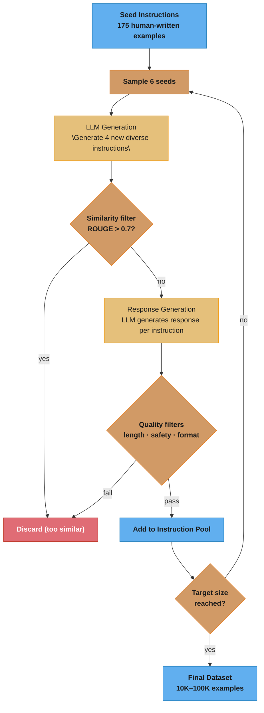
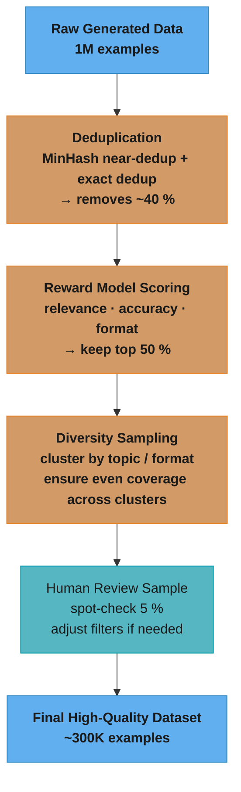

# Synthetic Data Generation

## 1. Concept Overview

Synthetic data generation uses LLMs to create training data for other LLMs — a powerful bootstrapping technique that has become central to modern AI development. Rather than relying entirely on human-labeled examples, teams use capable LLMs (teachers) to generate instructions, responses, conversations, and reasoning chains that can train smaller or more specialized models (students).

This field addresses a fundamental bottleneck: human annotation is slow, expensive, and doesn't scale. A single GPT-4 API call can generate a training example in milliseconds for pennies; a human annotator takes minutes and costs dollars. The question is not whether to use synthetic data, but how to generate high-quality data that improves model capabilities.

The LIMA paper (2023) demonstrated a counterintuitive insight: **1000 carefully curated, diverse examples outperformed 52,000 lower-quality examples**. Quality over quantity is the governing principle.

---

## 2. Intuition

> **One-line analogy**: Synthetic data generation is like using an expert professor to write textbooks for a student — cheaper and faster than having the student learn from real-world experience alone.

**Mental model**: Instead of waiting for humans to label 100,000 examples (slow and expensive), you ask a capable LLM (GPT-4, Claude) to generate diverse, high-quality instruction-response pairs. The capable model acts as the "teacher", generating training data. A smaller or cheaper model is then trained on this data as the "student." The quality of what the student can learn is bounded by the quality of what the teacher generates.

**Why it matters**: Synthetic data is how Alpaca, WizardLM, and countless fine-tuned models were created at low cost. It's also how reasoning traces (for math, code) are bootstrapped. Without synthetic data, building specialized models would require massive human labeling budgets.

**Key insight**: Quality beats quantity — 1000 carefully curated, diverse synthetic examples can outperform 52,000 lower-quality ones (LIMA paper). Filtering and quality scoring are as important as generation.

---

## 3. Core Principles

- **Quality over quantity**: A model's capability ceiling is set by its worst training data, not its best.
- **Diversity**: Cover the space of instructions, topics, formats, and difficulty levels.
- **Difficulty calibration**: Mix easy and hard examples; too many hard examples can destabilize training.
- **Deduplication**: Near-duplicate synthetic examples waste capacity and can cause memorization.
- **Verification where possible**: For tasks with ground truth (math, code), verify LLM-generated answers.
- **Human in the loop**: The best datasets use LLMs to draft + humans to curate/filter.

---

## 4. Types / Strategies

### 4.1 Self-Instruct (Wang et al. 2022)

Bootstrap instruction data from a small seed set using an LLM. The foundational technique for instruction dataset generation.

```
Algorithm:
1. Start with 175 seed (instruction, response) pairs written by humans
2. For each iteration:
   a. Sample 6 seed instructions
   b. Prompt LLM: "Here are 6 examples. Generate 4 new, diverse instructions"
   c. Filter generated instructions (too similar to existing → discard)
   d. For each new instruction, generate response
   e. Add to instruction pool
3. Repeat until target dataset size reached

Quality filters applied:
  - Remove if ROUGE-L similarity > 0.7 with any existing instruction
  - Remove if instruction starts with unsafe keywords
  - Remove if response is too short (<3 words)
```

Generated the original Alpaca 52K dataset using GPT-3. Later improved by using GPT-4 → **Alpaca-GPT4**.

### 4.2 Evol-Instruct (WizardLM, Xu et al. 2023)

Evolve simple instructions into more complex, challenging ones through iterative rewriting. Addresses the quality problem by specifically targeting harder examples.

```
Evolution operators:
  - Add constraints: "Write a sorting function" → "Write O(n log n) sort using ≤50 lines"
  - Increase complexity: "Explain recursion" → "Explain tail recursion with examples in 3 languages"
  - Deepen: "What is machine learning?" → "Explain backpropagation with partial derivatives"
  - Breadth: "Write a loop" → "Compare for/while/do-while loops with use-cases"
  - Concretize: "Improve code quality" → "Refactor this function to reduce cyclomatic complexity below 5"

Example (1 evolution step):
  Original: "Sort a list in Python"
  Evolved:  "Sort a list of dictionaries by multiple keys in Python, handling None values,
             and explain time complexity"
```

WizardLM trained on Evol-Instruct data significantly outperformed models trained on self-instruct data.

### 4.3 Persona-Driven Generation

Assign diverse personas to guide diverse generation:

```
Personas:
  "You are a PhD student in physics"
  "You are a high school student struggling with algebra"
  "You are a senior software engineer reviewing code"
  "You are a non-native English speaker"

For each persona, generate instructions and responses appropriate to that perspective
Result: naturally diverse vocabulary, complexity, and topic coverage
```

Used in Cosmopedia (HuggingFace) to generate 30B tokens of synthetic educational text.

### 4.4 Multi-Turn Conversation Synthesis

Generate complete multi-turn dialogues:

```
Phase 1: Generate conversation topic + user persona
  Topic: "Setting up a Python development environment"
  User: Beginner programmer, Windows user

Phase 2: Generate opening user message
  User: "How do I install Python on Windows?"

Phase 3: Generate assistant response

Phase 4: Continue turn-by-turn
  User: "Now how do I install packages?"
  Assistant: "Use pip: pip install <package_name>..."
  ...

Phase 5: Quality check: Is conversation coherent? Does assistant maintain role? Are facts correct?
```

### 4.5 Distillation as Synthetic Data

Use a larger model's (teacher's) outputs to train a smaller model (student):

```
Teacher: GPT-4 or Claude 3 Opus
Student: LLaMA 3 8B

For each prompt in your dataset:
  1. Generate teacher response
  2. Store (prompt, teacher_response) pair
  3. Fine-tune student on these pairs (supervised learning)

This is "knowledge distillation" at the data level (not logit-level distillation)
```

Concerns: OpenAI ToS prohibits using outputs to train competing models. Use carefully. Logit-level distillation and the full teacher-student tradeoff space are covered in [Knowledge Distillation & Model Merging](../knowledge_distillation_and_model_merging/README.md).

### 4.6 Rejection Sampling / Best-of-N

Generate multiple candidate responses; keep only the best:

```
For each prompt:
  1. Generate N responses (e.g., N=10) with temperature=0.8
  2. Score each with reward model or LLM-as-judge
  3. Keep top-1 or top-K as training data

Variant: Constitutional AI-style self-critique
  1. Generate initial response
  2. Prompt model to critique its own response
  3. Prompt model to revise based on critique
  4. Use revised response as training data
```

### 4.7 Preference Data Generation

Generating (chosen, rejected) pairs for DPO, RLHF, and other alignment training methods:

```
Approach 1 — Best-of-N Ranking:
  For each prompt:
    1. Sample 5-10 responses with temperature=0.8
    2. Score each with reward model or LLM-as-judge
    3. Best response = chosen, worst response = rejected
    4. Larger quality gap between chosen/rejected → faster DPO convergence

Approach 2 — Strong vs Weak Model:
  For each prompt:
    1. Generate response with strong model (GPT-4) → chosen
    2. Generate response with weaker model (GPT-3.5) → rejected
    3. Natural quality gap without reward model scoring

Approach 3 — Constitutional AI Revision:
  For each prompt:
    1. Generate initial response → rejected
    2. Critique the response (model self-evaluates)
    3. Revise based on critique → chosen
```

Quality matters more than quantity: 10K high-quality preference pairs with clear quality margins can outperform 100K noisy pairs where chosen and rejected are barely distinguishable. Production pattern: generate 5-10 responses per prompt and use the best/worst for maximum margin. How these pairs are consumed by DPO/RLHF training is covered in [Alignment & RLHF](../alignment_and_rlhf/README.md).

### 4.8 Backtranslation

Generate input from output — the reverse of normal data generation:

```
Process:
  1. Start with high-quality outputs (expert answers, verified code, documentation)
  2. Prompt LLM: "What question or instruction would produce this answer?"
  3. Pair the generated question with the original expert answer
  4. Quality filter: verify the generated question + original answer are coherent

Example:
  Output (expert): "Use ConcurrentHashMap with computeIfAbsent() for thread-safe lazy init"
  Backtranslated input: "How do I implement thread-safe lazy initialization of cached values in Java?"
  Training pair: (backtranslated input, original expert output)
```

Effective when you have high-quality outputs (expert documentation, verified code solutions) but need diverse prompts to pair them with. Can generate 10-50x more training pairs from a small set of expert outputs.

---

## 5. Architecture Diagrams

### Self-Instruct Pipeline



The feedback loop from pool back to sample is what makes Self-Instruct self-reinforcing: as the pool grows, the 6 sampled seeds become increasingly diverse, steering generation away from already-covered topics.

### Quality Filtering Pipeline



---

## 6. How It Works — Detailed Mechanics

### Quality Filtering Methods

**Perplexity filtering**: Score each generated text with a smaller reference model. Very low perplexity = too generic/boring; very high = incoherent. Keep mid-range.

**Reward model scoring**: Train a reward model on human preference data; use it to score generated examples. Keep high-reward examples.

**IFD (Instruction Following Difficulty)**: Score how "hard" an instruction is for the model. Filter to keep appropriately challenging examples.

**Format validation**: Check that structured outputs (JSON, code) are syntactically valid. For code: actually run it and verify output.

**Semantic deduplication**: Embed all instructions; remove those with cosine similarity > threshold (e.g., 0.95).

### Verification for Verifiable Tasks

For math and code, verification is possible and dramatically improves data quality:

```
Math example generation:
  1. Generate problem + solution with GPT-4
  2. Verify by:
     a. Parsing final answer
     b. Running symbolic computation (WolframAlpha, sympy)
     c. Cross-verify with multiple model generations
  3. Keep only verified correct examples

Code example generation:
  1. Generate function + tests with GPT-4
  2. Execute code + tests in sandbox
  3. Keep only passing examples
  4. Optionally: generate multiple solutions, keep cleanest
```

### LIMA Insight

**Less Is More for Alignment** (Zhou et al. 2023): Fine-tune LLaMA with just 1000 carefully curated instructions. Key finding: a model's knowledge comes from pre-training; instruction tuning just teaches the **format and style** of responding. You don't need 52K examples to learn to be helpful — you need 1000 *excellent* examples.

Implication: Spend effort on data quality, not scale. Better to annotate 1000 examples carefully than generate 100K carelessly.

---

## 7. Real-World Examples

### Stanford Alpaca (2023)
- 52K instruction-following examples generated by self-instruct from GPT-3
- Cost: ~$600 for GPT-3 API calls
- Fine-tuned LLaMA 7B to follow instructions
- Proved the concept but had quality issues (hallucinations from GPT-3)

### WizardLM (Microsoft, 2023)
- 250K Evol-Instruct examples starting from Alpaca-52K
- Multiple evolution rounds; each iteration increases complexity
- Outperformed text-davinci-003 on MT-Bench despite being much smaller
- Sparked the "instruction evolution" approach

### Cosmopedia (HuggingFace, 2024)
- 30B tokens of synthetic educational text
- Generated by Mixtral 8x7B with diverse persona prompts
- Topics: textbooks, stories, wiki articles, instructions
- Outperforms most datasets of similar size for knowledge-intensive tasks

### Nemotron-4-340B (NVIDIA, 2024)
- 98% synthetic data for the alignment phase
- Used Nemotron as the teacher model itself (self-improvement)
- Synthetic data quality evaluated by reward models
- Demonstrated that LLMs can generate their own training data at scale

### Phi-1/Phi-2 (Microsoft, 2023)
- "Textbooks Are All You Need" — trained on high-quality synthetic textbook data
- 7B model outperforming much larger models on reasoning tasks
- Data: ~6B tokens, mostly GPT-4-generated educational content
- Proved quality of data >> quantity for small model reasoning

---

## 8. Tradeoffs

| Method | Quality | Scale | Cost | Verification |
|--------|---------|-------|------|-------------|
| Human annotation | Highest | Low | High | Inherent |
| Self-Instruct (GPT-3) | Medium | High | Low | Hard |
| GPT-4 distillation | High | Medium | Medium | Partial |
| Evol-Instruct | High | High | Medium | Hard |
| Code/Math verified | High | Medium | Medium | Built-in |
| Rejection sampling | High | Low-Medium | Medium | Via reward model |

---

## 9. When to Use / When NOT to Use

### Use Synthetic Data Generation When:
- You have <1000 real training examples for a task
- You need diverse coverage of instructions/topics
- Fine-tuning a capable base model (synthetic data works best with good bases)
- Tasks are verifiable (code, math) — highest quality synthetic data

### Be Cautious About:
- Amplifying base model errors: synthetic data from weaker models can reinforce mistakes
- Format vs. knowledge: synthetic data teaches format well but doesn't add knowledge the base model doesn't have
- ToS violations: using commercial API outputs to train competing models
- Evaluation contamination: if your evaluation prompts resemble your synthetic data, results are inflated

---

## 10. Common Pitfalls

1. **Diversity collapse**: Using a single prompt template for all examples → model overfits to template format.
2. **Sycophancy amplification**: LLM teachers tend to generate overly helpful, agreeable responses → trains student to be sycophantic.
3. **Cascade errors**: If teacher model has systematic biases (e.g., always uses Python), student inherits them.
4. **No verification for code**: Generated code that doesn't run makes fine-tuning harmful for code tasks.
5. **Forgetting the base model's knowledge**: Fine-tuning on too much synthetic data for too many epochs can cause catastrophic forgetting.
6. **Instruction-following artifacts**: Models that only see perfectly formatted instructions fail on messy real-world prompts.
7. **Model collapse from recursive synthetic data**: Training on synthetic data generated by a model trained on synthetic data degrades quality across generations. Each generation loses tail distribution diversity — rare but valid outputs become increasingly unlikely. Noticeable degradation appears after 3-5 generations of self-training without fresh human data. Shumailov et al. (2023) showed up to 50% vocabulary diversity loss after 5-10 recursive generations. Mitigation: always mix at least 20-30% real human-generated data, tag synthetic data with lineage tracking, and monitor output diversity metrics (distinct-n, topic entropy) across training generations. The "Habsburg AI" problem — models trained on internet data increasingly polluted with AI-generated content — makes this a growing concern even for pre-training data curation.

---

## 11. Technologies & Tools

| Tool | Purpose | Notes |
|------|---------|-------|
| **Self-Instruct** | Bootstrap instructions | Original Wang et al. code |
| **Alpaca farm** | Evaluation + generation | Stanford; instruction simulation |
| **Evol-Instruct** | Instruction evolution | WizardLM; complexity increase |
| **LLM-Blender** | Ensemble outputs | Select best response across models |
| **Argilla** | Human annotation UI | Label synthetic data; quality filter |
| **Ragas** | RAG data generation | Generate QA pairs from documents |
| **Distilabel** | Synthetic pipeline toolkit | HuggingFace; modular pipeline |
| **OpenAI API** | Teacher model | GPT-4 for high-quality generation |
| **vLLM** | Local inference | Generate at scale from open models |
| **LLaMA-Factory** | Fine-tuning framework | Easy pipeline from data to trained model |

---

## 12. Interview Questions with Answers

**Q: What is Self-Instruct and how does it bootstrap instruction data?**
A: Self-Instruct starts with ~175 human-written seed instructions. An LLM generates new instructions by sampling from the existing pool, filters for diversity (ROUGE similarity), then generates responses. This iterative process creates 10K-100K instruction-following examples from a small seed. The key quality issue is that the generated data inherits the teacher model's biases and errors.

**Q: What is the LIMA insight and why does it matter?**
A: LIMA showed that fine-tuning on just 1000 carefully curated, diverse examples produced results comparable to models trained on 52K+ examples. The insight: pre-training gives the model knowledge; instruction tuning just teaches the format of helpful responses. This means teams should invest in data *quality* (carefully select/verify examples) rather than generating massive datasets carelessly.

**Q: What is Evol-Instruct and how is it different from Self-Instruct?**
A: Evol-Instruct takes existing instructions and "evolves" them into more complex variants through operators like adding constraints, deepening, broadening, or concretizing. Unlike Self-Instruct which generates new instructions from scratch, Evol-Instruct systematically increases difficulty. WizardLM used this to create challenging instruction data that trained models to handle harder queries.

**Q: Why does generating synthetic data at temperature=0 quietly ruin the dataset?**
A: Greedy decoding is deterministic, so similar prompts produce identical or near-identical responses and the dataset collapses onto a handful of templates — one production pipeline generated 100K pairs at default settings and found 60K exact duplicates after deduplication. The student then memorizes a few response patterns instead of learning diverse behavior, and the damage is invisible until you measure it: raw example counts look healthy while distinct n-grams and topic entropy are tiny. Generate at temperature 0.7-1.0, produce multiple candidates per prompt and keep the best via a judge or reward model, and treat the dedup removal rate as a canary — if more than ~10% of a batch is near-duplicate, the generation settings lack diversity.

**Q: Why is verified synthetic data (for code/math) higher quality than general instruction data?**
A: For code and math, you can execute the generated answer and check if it's correct. This filtering step removes hallucinated solutions — a major problem with LLM-generated data. The resulting training data has near-100% accuracy for verifiable steps, vs. 80-90% for unverified instruction data.

**Q: How do you design a quality filtering pipeline for synthetic training data?**
A quality filtering pipeline uses multiple stages to remove low-quality synthetic samples before they corrupt model training. Stage 1: format validation — check that outputs follow the requested structure (valid JSON, correct section headers). Stage 2: deduplication — MinHash or exact hash to remove duplicates and near-duplicates. Stage 3: difficulty filtering — remove trivially simple or impossibly complex examples using perplexity scoring or model-based difficulty estimation. Stage 4: factual verification — for knowledge-dependent tasks, verify key facts against a reference corpus or use a separate LLM as a fact-checker. Stage 5: human spot-check — sample 1-5% for manual review to calibrate automated filters. Alpaca's original 52K instructions had significant quality issues (~30% contained errors or were low-quality); proper filtering would have reduced this to 15-20K high-quality samples that produced better results, as demonstrated by LIMA (1K curated examples matching 52K unfiltered).

**Q: What is backtranslation and when is it the right generation strategy?**
Backtranslation reverses the normal direction: instead of generating responses for prompts, you start from high-quality outputs (expert documentation, verified code solutions, curated answers) and prompt an LLM to generate the instruction that would produce each one. The response side — usually the quality bottleneck in synthetic data — is guaranteed correct because a human expert wrote it; only the cheap-to-verify instruction is synthetic. It is the right strategy when you have a corpus of trusted outputs but no paired prompts, and it can yield 10-50x more training pairs from a small expert set by generating multiple instruction phrasings per output. Always run a coherence filter (does this generated question actually match this answer?) before training, since mismatched pairs teach the model to answer the wrong question.

**Q: How does Evol-Instruct work and what are its complexity levels?**
Evol-Instruct (WizardLM) iteratively increases instruction complexity by applying evolution operators to seed instructions. The operators: (1) add constraints — "Write a sort function" becomes "Write a sort function that handles null values and is stable"; (2) deepen — add requirement for explanation or edge case handling; (3) concretize — make abstract instructions specific; (4) increase reasoning steps — require multi-step problem solving; (5) complicate input — add more complex data structures or scenarios. Each evolution step generates a harder instruction from an easier one, creating a natural curriculum. Typically 3-5 evolution rounds are applied. Quality control: after each evolution, verify the instruction is still coherent and answerable. WizardLM-70B trained on Evol-Instruct data outperformed ChatGPT on several benchmarks. The key insight: it is easier to systematically complicate existing instructions than to write complex instructions from scratch.

**Q: How does persona-driven generation improve dataset diversity?**
Assigning a different persona per generation batch ("a PhD physicist", "a high school student struggling with algebra", "a non-native English speaker") shifts the generator's vocabulary, sentence complexity, topic selection, and error patterns — producing diversity that a single system prompt cannot, no matter how high the temperature. Cosmopedia (HuggingFace, 2024) used this at scale: 30B tokens of synthetic educational text generated by Mixtral 8x7B under diverse persona and audience framings, outperforming similarly sized datasets on knowledge-intensive tasks. Personas attack the diversity problem at the distribution level while temperature only adds local sampling noise; the two compose. Verify the effect with embedding-cluster balance and distinct-n metrics rather than assuming persona labels alone guarantee coverage.

**Q: What is model collapse and how does training on synthetic data risk causing it?**
Model collapse occurs when a model trained on its own outputs (or outputs from similar models) progressively loses diversity and degrades in quality across generations. Each generation amplifies the biases and errors of the previous one while losing tail distribution coverage — rare but valid outputs become increasingly unlikely. The risk is highest when: (1) synthetic data dominates the training mix (>50%); (2) no human-generated data anchors the distribution; (3) multiple generations of synthetic data are stacked (model A generates data for model B, which generates data for model C). Mitigation: (1) always mix synthetic with human-generated data (at least 30% human); (2) use diverse generator models (not just one model's outputs); (3) explicitly measure output diversity (unique n-grams, topic coverage); (4) include quality filtering that removes outputs too similar to each other. Shumailov et al. (2023) showed that after 5-10 generations of self-training, models can lose up to 50% of their vocabulary diversity.

**Q: What did the LIMA paper demonstrate about data quality vs quantity for fine-tuning?**
LIMA (Less Is More for Alignment) showed that fine-tuning LLaMA 65B on just 1,000 carefully curated instruction-response pairs produced outputs preferred by humans over GPT-4 (DaVinci) in 43% of comparisons, and over Alpaca (52K examples) in 78% of comparisons. The key findings: (1) quality dominates quantity — 1K excellent examples beat 52K mediocre ones; (2) the base pre-trained model already has the knowledge; alignment is about format and style, not teaching new facts; (3) each example should demonstrate a different skill or knowledge type; (4) response style should be consistent (LIMA used a specific helpful, detailed style). Practical implication for synthetic data: invest effort in curating a small, high-quality dataset rather than generating massive amounts of unfiltered synthetic data. The "Superficial Alignment Hypothesis" from LIMA suggests that alignment teaches the model how to present knowledge it already has.

**Q: How do you use a strong model to generate training data for a weaker model without violating terms of service?**
Using a strong model (e.g., GPT-4) to generate training data for a weaker model (knowledge distillation via synthetic data) requires careful attention to terms of service. OpenAI's terms prohibit using GPT-4 outputs to train competing models. Compliant approaches: (1) use models with permissive licenses as teachers — LLaMA (Llama Community License), Mistral (Apache 2.0), or DeepSeek (MIT) have no restrictions on using their outputs for training; (2) use the same provider — OpenAI allows using GPT-4 to fine-tune OpenAI models; (3) generate seed ideas with the strong model but write full responses with human annotators; (4) use the strong model only for evaluation/filtering, not generation. The Vicuna and Alpaca projects used ChatGPT outputs for training (before terms were clarified). Current best practice: use an Apache 2.0 or MIT-licensed model as the teacher, or obtain explicit permission from the API provider.

**Q: How do you measure the diversity and coverage of a synthetic instruction dataset?**
Measuring dataset diversity requires multiple complementary metrics. (1) Instruction diversity — embed all instructions with a sentence embedding model, then measure coverage using k-means clustering (aim for balanced cluster sizes) or compute the average pairwise cosine distance (higher = more diverse). (2) Topic coverage — classify instructions into a taxonomy (reasoning, coding, creative writing, math, etc.) and check for balanced representation. (3) Linguistic diversity — measure vocabulary size, average sentence length distribution, and unique n-gram counts across the dataset. (4) Difficulty distribution — score each instruction by complexity (using perplexity or model-based scoring) and ensure coverage across easy, medium, and hard. (5) Deduplication rate — if >10% of samples are near-duplicates, your generation process lacks diversity. Tools: use embedding clustering with UMAP visualization to spot gaps, and compare your dataset's topic distribution against established benchmarks like FLAN or Open-Instruct.

**Q: How do you generate preference pairs for DPO training using synthetic data?**
The most effective approach is Best-of-N ranking: for each prompt, generate 5-10 responses with temperature=0.8, score them with a reward model or LLM-as-judge, then take the highest-scored response as "chosen" and the lowest as "rejected." The key insight is that margin matters — a large quality gap between chosen and rejected leads to faster and more stable DPO convergence than pairs where both responses are similar quality. An alternative is the strong/weak model approach: generate the chosen response with GPT-4 and the rejected response with GPT-3.5 on the same prompt, creating a natural quality gap without reward model scoring. For Constitutional AI-style generation, the model generates an initial response (rejected), critiques it, then revises based on the critique (chosen). In practice, 10K high-quality preference pairs with clear margins outperform 100K noisy pairs. Always verify that the chosen response is actually better than the rejected — noisy preference labels degrade DPO training significantly.

**Q: What is model collapse and how do you detect it when training on synthetic data?**
Model collapse occurs when a model trained on outputs from itself or similar models progressively loses output diversity and quality across generations. Each generation amplifies biases and errors while losing coverage of rare but valid outputs in the tail of the distribution. Detection relies on monitoring diversity metrics: track distinct-1/distinct-2 (unique unigrams/bigrams divided by total), topic entropy across outputs, and vocabulary size used in generated text. A drop of >10% in any diversity metric between training generations signals collapse onset. Shumailov et al. (2023) demonstrated that after 5-10 recursive self-training generations, models lost up to 50% of vocabulary diversity. The primary mitigation is always mixing synthetic data with real human-generated data — maintain at least 70-80% human data in the training mix. Additional safeguards: use diverse generator models (not just one model's outputs), implement lineage tracking to know which data is synthetic and which generation it came from, and explicitly measure output diversity before and after each training run.

---

## 13. Best Practices

1. **Verify wherever possible** — run generated code, check math answers with symbolic computation.
2. **Use diverse prompt templates** — single template → format overfitting; use 10+ templates for the same task type.
3. **Combine human + synthetic** — human examples define quality ceiling; synthetic provides scale.
4. **Score with reward models** — keep only top-K% of generated examples by reward model score.
5. **Deduplicate semantically** — embed instructions and remove near-duplicates (cosine > 0.95).
6. **Cap per-topic** — if you have 10K examples about sorting algorithms, cap at 100 and diversify.
7. **Evaluate on held-out human examples** — don't evaluate on synthetic data; use human-curated test sets.

---


## 14. Case Study

**Scenario:** A legal tech company fine-tunes Mistral-7B-Instruct for legal contract clause extraction and classification. The domain is highly specialized (M&A contracts, IP licensing, employment agreements). Human-annotated data: 800 examples (6 months of paralegal annotation, $120k cost). Goal: generate 100k instruction-tuning pairs to reach 50k+ effective training examples after quality filtering, at < $5,000 total synthetic data cost.

**Architecture:**

```
  Step 1: Seed Data Collection
  ┌──────────────────────────────────────────────────────────────┐
  │  800 human-annotated examples                                │
  │  + 2,000 unlabeled legal contracts (public domain, EDGAR)   │
  │  + Legal clause taxonomy (50 clause types from CUAD dataset) │
  └─────────────────────────────┬────────────────────────────────┘
                                │
                                v Step 2: Self-Instruct Pipeline
  ┌──────────────────────────────────────────────────────────────┐
  │  Generator: GPT-4o                                           │
  │  Method: Evol-Instruct (complexity evolution)                │
  │  Seed prompts → evolved prompts (3 rounds of evolution)      │
  │  Evolution types: (1) add constraints, (2) deepen reasoning, │
  │    (3) create adversarial variants, (4) cross-clause combos  │
  │                                                              │
  │  Output per seed: 5 evolved variants                         │
  │  Total generated: 800 × 5 × 3 rounds = 12,000 base pairs    │
  │  + Open-source legal clause extraction: 30,000 pairs         │
  │  + Synthetic from unlabeled contracts: 60,000 pairs          │
  │  Raw total: 102,000 pairs                                    │
  └─────────────────────────────┬────────────────────────────────┘
                                │
                                v Step 3: Quality Filtering
  ┌──────────────────────────────────────────────────────────────┐
  │  Filters applied in sequence:                                │
  │  1. Deduplication: SimHash, threshold=0.85 → remove 8,200   │
  │  2. Length filter: prompt 20-500 tokens; response 20-1000   │
  │     → remove 3,100                                          │
  │  3. Legal accuracy: Mistral-7B-Legal-Instruct scores each   │
  │     clause extraction → remove if score < 0.6 → -4,800     │
  │  4. Instruction following: GPT-4o-mini judge checks if      │
  │     response follows prompt → remove if "no" → -6,200      │
  │  5. Diversity sampling: cluster by embedding, sample K=2    │
  │     per cluster → retain 52,000 diverse examples            │
  │  Final dataset: 52,000 high-quality instruction pairs        │
  └─────────────────────────────┬────────────────────────────────┘
                                │
                                v Step 4: Fine-tuning
  ┌──────────────────────────────────────────────────────────────┐
  │  Model: Mistral-7B-Instruct v0.3                             │
  │  Method: LoRA (r=16, alpha=32) on 52k pairs                 │
  │  Training: 3 epochs, 1×A100, 8 hours                        │
  │  Eval: CUAD held-out (100 contracts, 41 clause types)       │
  └──────────────────────────────────────────────────────────────┘
```

**Key implementation — 3 Python code blocks:**

Block 1 — Evol-Instruct complexity evolution pipeline:

```python
from __future__ import annotations
import asyncio
import json
from dataclasses import dataclass, field
from typing import Any
import anthropic


@dataclass
class SeedExample:
    instruction: str
    input_context: str   # contract excerpt
    output: str          # clause label + explanation


@dataclass
class EvolvedPair:
    instruction: str
    input_context: str
    output: str
    evolution_type: str
    generation: int       # evolution round (1, 2, or 3)
    seed_id: int


EVOLUTION_TYPES = [
    "add_constraint",    # Add legal jurisdictional or temporal constraints
    "deepen_reasoning",  # Require step-by-step legal reasoning chain
    "adversarial",       # Create ambiguous clause that tests edge cases
    "cross_clause",      # Combine multiple clause types in one question
    "counterfactual",    # "If this clause were absent, what would happen?"
]


async def evolve_instruction(
    client: anthropic.AsyncAnthropic,
    seed: SeedExample,
    evolution_type: str,
    generation: int,
    seed_id: int,
) -> EvolvedPair | None:
    """Apply one evolution to a seed instruction, producing a harder variant."""

    evolution_prompts = {
        "add_constraint": f"""Rewrite this legal instruction to add a jurisdictional or temporal constraint that makes it more specific and harder to answer.
Original instruction: {seed.instruction}
Original context: {seed.input_context[:500]}
Make the evolved version require knowledge of a specific legal jurisdiction or time period.
Return JSON: {{"instruction": "...", "input_context": "...", "output": "..."}}""",

        "deepen_reasoning": f"""Rewrite this instruction to require step-by-step legal reasoning rather than just identification.
Original instruction: {seed.instruction}
Add: "Explain the legal implications of this clause step by step, citing the relevant legal standard."
Return JSON: {{"instruction": "...", "input_context": "...", "output": "..."}}""",

        "adversarial": f"""Create an adversarial variant where the clause is ambiguous or could be classified differently depending on interpretation.
Original instruction: {seed.instruction}
Modify the contract context to introduce ambiguity. Response should acknowledge the ambiguity.
Return JSON: {{"instruction": "...", "input_context": "...", "output": "..."}}""",
    }

    prompt = evolution_prompts.get(evolution_type, evolution_prompts["add_constraint"])

    try:
        response = await client.messages.create(
            model="claude-sonnet-4-6",
            max_tokens=1024,
            messages=[{"role": "user", "content": prompt}],
        )
        text = response.content[0].text
        data = json.loads(text)
        return EvolvedPair(
            instruction=data["instruction"],
            input_context=data["input_context"],
            output=data["output"],
            evolution_type=evolution_type,
            generation=generation,
            seed_id=seed_id,
        )
    except (json.JSONDecodeError, KeyError, IndexError):
        return None


async def run_evol_instruct_pipeline(
    seeds: list[SeedExample],
    num_rounds: int = 3,
    evolutions_per_seed: int = 3,
    concurrency: int = 20,
) -> list[EvolvedPair]:
    client = anthropic.AsyncAnthropic()
    sem = asyncio.Semaphore(concurrency)
    all_pairs: list[EvolvedPair] = []

    async def evolve_with_sem(seed: SeedExample, etype: str, gen: int, sid: int) -> None:
        async with sem:
            pair = await evolve_instruction(client, seed, etype, gen, sid)
            if pair:
                all_pairs.append(pair)

    current_gen = [(i, s) for i, s in enumerate(seeds)]
    for round_num in range(1, num_rounds + 1):
        tasks = []
        for seed_id, seed_example in current_gen:
            import random
            etypes = random.sample(EVOLUTION_TYPES, min(evolutions_per_seed, len(EVOLUTION_TYPES)))
            for etype in etypes:
                tasks.append(evolve_with_sem(seed_example, etype, round_num, seed_id))
        await asyncio.gather(*tasks)
        # Use evolved pairs as seeds for next round
        current_gen = [
            (p.seed_id, SeedExample(p.instruction, p.input_context, p.output))
            for p in all_pairs
            if p.generation == round_num
        ]

    return all_pairs
```

Block 2 — Quality filtering pipeline with LLM-as-judge (production concern):

```python
from __future__ import annotations
import hashlib
import numpy as np
from dataclasses import dataclass
from typing import Any
import anthropic


@dataclass
class QualityScore:
    instruction_clarity: float      # 0.0 - 1.0
    response_accuracy: float        # 0.0 - 1.0
    instruction_following: float    # 0.0 - 1.0
    overall: float                  # weighted average
    keep: bool                      # final keep/discard decision


async def score_pair_quality(
    client: anthropic.AsyncAnthropic,
    instruction: str,
    context: str,
    response: str,
) -> QualityScore:
    """
    Use Claude claude-haiku-4-5 as judge (fast, cheap) for quality scoring.
    GPT-4o-mini as judge: $0.15/1M tokens; 100k pairs × ~500 tokens = $7.50 total.
    Haiku: $0.25/1M input; 100k × 500 = $12.50 total. Acceptable.
    """
    judge_prompt = f"""Rate this legal instruction-tuning pair on three dimensions (0.0-1.0 each):

Instruction: {instruction}
Context: {context[:300]}
Response: {response[:300]}

1. instruction_clarity: Is the instruction clear and specific? (1.0 = very clear)
2. response_accuracy: Is the legal response accurate and well-grounded? (1.0 = accurate)
3. instruction_following: Does the response follow the instruction? (1.0 = follows exactly)

Return only JSON: {{"instruction_clarity": 0.0, "response_accuracy": 0.0, "instruction_following": 0.0}}"""

    try:
        resp = await client.messages.create(
            model="claude-haiku-4-5",
            max_tokens=100,
            messages=[{"role": "user", "content": judge_prompt}],
        )
        import json
        scores = json.loads(resp.content[0].text)
        clarity = float(scores.get("instruction_clarity", 0))
        accuracy = float(scores.get("response_accuracy", 0))
        following = float(scores.get("instruction_following", 0))
        overall = 0.3 * clarity + 0.4 * accuracy + 0.3 * following
        return QualityScore(
            instruction_clarity=clarity,
            response_accuracy=accuracy,
            instruction_following=following,
            overall=overall,
            keep=overall >= 0.7,  # threshold: discard bottom 30%
        )
    except Exception:
        return QualityScore(0.5, 0.5, 0.5, 0.5, keep=False)


def simhash_dedup(texts: list[str], threshold: float = 0.85) -> list[bool]:
    """
    Near-duplicate detection using SimHash.
    Returns boolean mask: True = keep, False = duplicate.
    Threshold 0.85: pairs with >85% similar shingles are duplicates.
    """
    from datasketch import MinHash, MinHashLSH

    lsh = MinHashLSH(threshold=threshold, num_perm=128)
    keep_flags = [True] * len(texts)

    for i, text in enumerate(texts):
        mh = MinHash(num_perm=128)
        for shingle in _get_shingles(text, k=5):
            mh.update(shingle.encode("utf8"))
        try:
            neighbors = lsh.query(mh)
            if neighbors:
                keep_flags[i] = False   # duplicate
            else:
                lsh.insert(str(i), mh)
        except Exception:
            pass

    return keep_flags


def _get_shingles(text: str, k: int = 5) -> list[str]:
    words = text.lower().split()
    return [" ".join(words[i:i+k]) for i in range(len(words) - k + 1)]
```

Block 3 — BROKEN -> FIX: data contamination and distribution mismatch:

```python
from __future__ import annotations


# BROKEN: Generate synthetic data using model responses at temperature=0.
# All generated responses are deterministic → massive duplication.
# 100k "generated" pairs → 60k exact duplicates after dedup.
# Model memorizes a few patterns rather than learning diverse legal reasoning.
async def broken_generate_deterministic(prompt: str) -> str:
    import anthropic
    client = anthropic.AsyncAnthropic()
    resp = await client.messages.create(
        model="claude-sonnet-4-6",
        max_tokens=512,
        messages=[{"role": "user", "content": prompt}],
        # No temperature specified → defaults to model's default (~1.0 or 0 for some)
    )
    return resp.content[0].text


# FIX: Generate with temperature=0.7-1.0 to encourage diversity.
# Multiple generations per prompt, then keep highest-quality via judge.
async def fixed_generate_diverse(prompt: str, n_candidates: int = 3) -> str:
    import anthropic
    import asyncio
    client = anthropic.AsyncAnthropic()

    async def generate_one() -> str:
        resp = await client.messages.create(
            model="claude-sonnet-4-6",
            max_tokens=512,
            temperature=0.8,    # diversity; range 0.7-1.0 for generation tasks
            messages=[{"role": "user", "content": prompt}],
        )
        return resp.content[0].text

    candidates = await asyncio.gather(*[generate_one() for _ in range(n_candidates)])
    # Score each candidate, keep highest quality
    # (simplified — production uses the judge function above)
    return max(candidates, key=len)   # length heuristic; replace with judge score


# BROKEN: Use public contract text verbatim as training context.
# EDGAR public contracts contain company names, deal values, party identities.
# Fine-tuned model memorizes real company data → privacy risk + hallucination
# when generating responses about company-specific clauses.
def broken_use_raw_edgar_context(contract_text: str) -> str:
    return contract_text  # raw, contains PII and real company names


# FIX: Anonymize contract text before including in training data.
# Replace: company names → [COMPANY_A], [COMPANY_B]
# Dollar amounts → [AMOUNT]
# Dates → [DATE]
# Person names → [INDIVIDUAL]
import re
def fixed_anonymize_contract(contract_text: str) -> str:
    text = re.sub(r'\b[A-Z][a-z]+ [A-Z][a-z]+\b', '[INDIVIDUAL]', contract_text)
    text = re.sub(r'\$[\d,]+(?:\.\d{2})?', '[AMOUNT]', text)
    text = re.sub(r'\b(?:January|February|March|April|May|June|July|August|September|October|November|December)\s+\d{1,2},\s+\d{4}\b', '[DATE]', text)
    # Company name patterns (simplified — production uses NER model)
    text = re.sub(r'\b[A-Z][A-Za-z]+ (?:Inc\.|LLC|Corp\.|Ltd\.)\b', '[COMPANY]', text)
    return text


# BROKEN: Skip validation of synthetic data against human expert gold set.
# 15% of GPT-4o-generated legal clause labels are incorrect for jurisdiction-specific nuances.
# Fine-tuned model inherits these errors → 15% lower accuracy on held-out test.
def broken_accept_all_synthetic(pairs: list[dict]) -> list[dict]:
    return pairs   # no validation


# FIX: Random sample 5% (2,500 pairs) for human expert validation.
# If expert accuracy < 92% on sampled set, reject entire batch and investigate.
import random
def fixed_sample_for_human_validation(
    pairs: list[dict], sample_rate: float = 0.05
) -> list[dict]:
    n = max(100, int(len(pairs) * sample_rate))
    return random.sample(pairs, min(n, len(pairs)))
```

**Pitfall 1 — Diversity collapse from insufficient seed diversity:**

```python
# BROKEN: 800 seeds are all from M&A contracts.
# Evol-Instruct generates 12,000 evolved pairs — all M&A variants.
# Fine-tuned model: 94% accuracy on M&A clauses, 41% on employment clauses.
# Task diversity was never introduced — evolution amplifies existing coverage gaps.

# FIX: Ensure seed set covers all target clause types before evolution.
# CUAD has 41 clause types; seeds must have ≥ 15 examples per clause type.
# Check coverage before evolution: if any clause type < 15 examples, augment seeds first.
def check_seed_coverage(seeds: list[dict], min_per_type: int = 15) -> dict[str, int]:
    from collections import Counter
    type_counts = Counter(s.get("clause_type") for s in seeds)
    return {t: c for t, c in type_counts.items() if c < min_per_type}
```

**Pitfall 2 — Model collapse when fine-tuning on self-generated data without anchoring:**

```python
# BROKEN: Fine-tune exclusively on 100k synthetic pairs, discarding 800 human examples.
# Model performance on human-annotated test set: F1 drops from 0.79 to 0.68.
# Self-generated data amplifies the generator model's biases and errors.

# FIX: Always mix human-annotated gold data with synthetic data.
# Recommended ratio: 10-20% human gold + 80-90% synthetic.
# Human data acts as an anchor, preventing distribution drift.
def build_training_dataset(
    human_pairs: list[dict],         # 800 gold pairs
    synthetic_pairs: list[dict],     # 52,000 filtered synthetic
    human_oversample_factor: int = 6,  # sample human data 6× to get ~18% of dataset
) -> list[dict]:
    human_repeated = human_pairs * human_oversample_factor   # 4,800 samples
    combined = human_repeated + synthetic_pairs               # 56,800 total
    import random
    random.shuffle(combined)
    return combined
```

**Metrics:**

| Metric | Human-only (800 pairs) | + Synthetic (52k pairs) | Cost |
|--------|----------------------|------------------------|------|
| CUAD F1 (all clause types) | 0.71 | 0.84 | — |
| Rare clause types F1 | 0.45 | 0.76 | — |
| Jurisdiction-specific accuracy | 0.62 | 0.79 | — |
| Annotation cost | $120k | $3,800 (generation + judge) | — |
| Training time (1×A100) | 45 min | 8 hours | — |
| Diversity (distinct instruction n-grams) | 12,400 | 187,000 | — |
| Dedup removal rate | — | 8.4% | — |
| Judge filter removal rate | — | 22.7% | — |
| Final dataset size after filtering | 800 | 52,000 | — |

**Interview Q&As:**

**Q: What is Evol-Instruct and how does it improve instruction diversity?**
Evol-Instruct (Xu et al. 2023, WizardLM) systematically evolves simple seed instructions into more complex, diverse variants using an LLM. Evolution types include: adding constraints, deepening reasoning requirements, creating adversarial variants, combining multiple concepts, and generating counterfactuals. Each seed generates 5 evolved variants; variants are used as seeds for the next round. The result is exponential growth in instruction complexity and diversity from a small seed set. WizardLM showed that 70k evolved pairs outperformed 175k random instructions on Alpaca benchmarks.

**Q: Why is quality filtering more important than quantity for synthetic data?**
LIMA (Zhou et al. 2023) demonstrated that 1,000 carefully curated examples outperform 50,000 randomly collected examples — the "less is more" finding for instruction tuning. Low-quality synthetic pairs (factual errors, instruction-following failures, near-duplicates) degrade fine-tuning by introducing noisy gradients that overwrite correct learned behaviors. The filtering pipeline (deduplication → length filter → LLM judge → diversity sampling) typically removes 40-60% of generated data, but the remaining dataset produces significantly better models. Target: precision over recall — it is better to have 50k high-quality pairs than 100k mixed-quality pairs.

**Q: How do you prevent data contamination when using public legal documents as training context?**
Four techniques: (1) Anonymization — replace company names, person names, dates, and financial figures with generic placeholders before including text in training data; (2) Jurisdictional generalization — rewrite clauses to remove jurisdiction-specific identifiers; (3) Train-test split by document — never include any excerpt from a test document in training data; (4) Decontamination check — embed all test prompts and filter training pairs with cosine similarity > 0.9 to any test prompt. For healthcare and legal AI, data contamination is both a quality problem (model memorizes rather than generalizes) and a compliance problem (PII in training data).

**Q: What is the role of the LLM judge in synthetic data quality filtering?**
The LLM judge (typically a capable model like GPT-4o-mini or Claude Haiku) evaluates generated pairs on instruction clarity, response accuracy, and instruction-following adherence. It provides a cheap (~$0.15/1M tokens) proxy for human evaluation at scale. Key considerations: (1) The judge should be different from (or larger than) the generator to avoid sycophancy bias; (2) Prompt the judge with rubrics, not just "is this good?"; (3) Validate judge scores against human ratings on a 500-pair sample — judge should achieve > 85% agreement. Judge filtering typically removes 20-30% of generated data, disproportionately removing the worst examples.

**Q: How do you measure if synthetic data has improved the model versus just increased dataset size?**
Three controlled experiments: (1) Data ablation — train with 800 human pairs, 800 + 10k synthetic, 800 + 52k synthetic; plot F1 vs dataset size. If curve flattens, more synthetic data is not helping. (2) Quality vs quantity — compare 20k filtered pairs vs 50k unfiltered pairs; higher-quality smaller dataset should win. (3) Distribution analysis — compute embedding cosine similarity between synthetic training pairs and test pairs; if similarity is low (< 0.6), synthetic data may not cover test distribution. Key metric: held-out F1 on human-annotated test set (not synthetic eval) — this is the ground truth measure of real-world quality.

**Q: Why should you always mix human-annotated data with synthetic data rather than replacing it?**
Synthetic data is generated by a model that has its own systematic biases, hallucination patterns, and coverage gaps. Fine-tuning exclusively on self-generated data amplifies these biases through a feedback loop — the fine-tuned model inherits the generator's failure modes. Human-annotated data acts as a calibration anchor: it represents real-world task distribution, captures edge cases humans specifically flagged, and contains correct labels for the hardest examples. The optimal mix is typically 10-20% human gold + 80-90% synthetic — enough human data to anchor the distribution without the cost of annotating at full scale.
