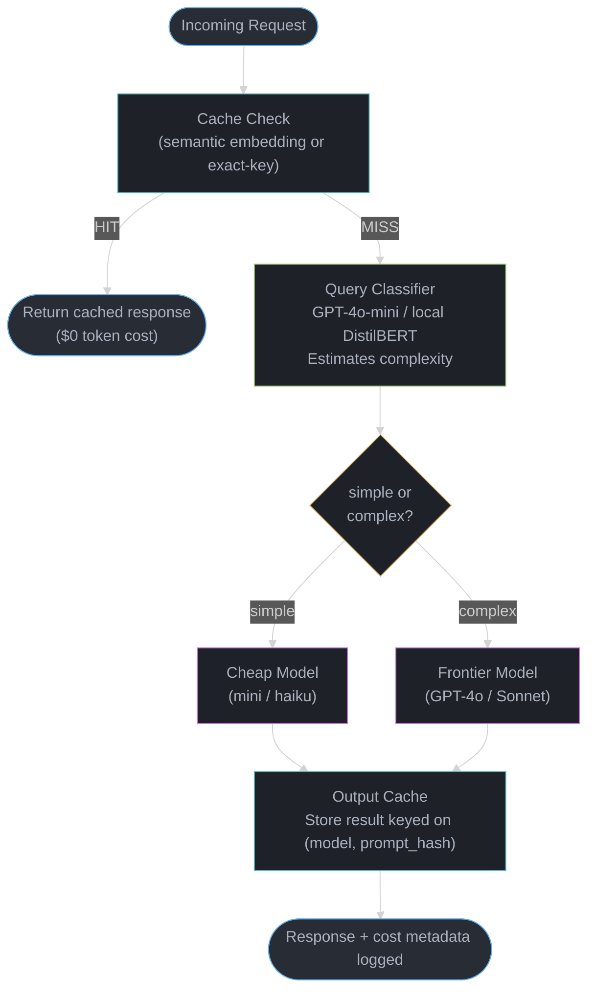
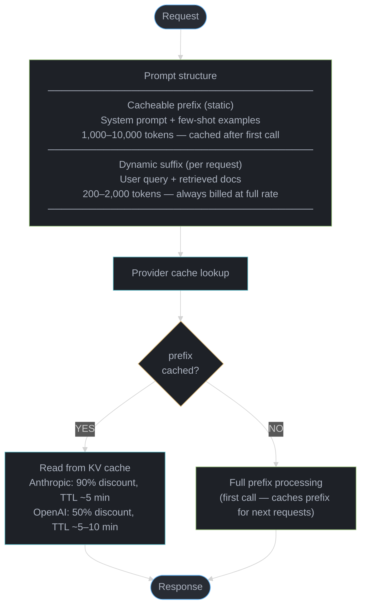

# Token Economics and Cost Optimization

## 1. Concept Overview

LLM costs are primarily token-based, making token economics critical for production viability. Every
API call incurs a charge proportional to the number of tokens consumed (input) and generated
(output), and these costs compound rapidly at scale. A system processing 10 million tokens per day
at GPT-4o rates spends over $150/day on output alone.

Understanding the full cost picture — API pricing tiers, prompt caching discounts, batch API
savings, and the break-even math for self-hosting — enables engineering teams to achieve 5-10x cost
reduction without meaningful quality loss.

**2025 reference prices (approximate, subject to change):**

| Model | Input ($/1M tokens) | Output ($/1M tokens) |
|---|---|---|
| GPT-4o | $2.50 | $10.00 |
| GPT-4o with cache hit | $1.25 | $10.00 |
| GPT-4o-mini | $0.15 | $0.60 |
| Claude 3.5 Sonnet | $3.00 | $15.00 |
| Claude 3.5 Sonnet cache hit | $0.30 | $15.00 |
| Claude 3 Haiku | $0.25 | $1.25 |
| Gemini 1.5 Pro | $1.25 | $5.00 |
| Self-hosted LLaMA 3 8B (A10G) | ~$0.05 | ~$0.20 |
| Self-hosted LLaMA 3 70B (A100x4) | ~$0.15 | ~$0.60 |

The gap between expensive frontier models and cheap small models, combined with caching and routing
strategies, is where most cost optimization opportunity lives.

**The idea behind it.** "A price quoted as `$2.50 / 1M tokens` means every single token costs
one 2.5-millionth of a dollar; a request's bill is just tokens-in at the input rate plus tokens-out
at the output rate, and nothing else."

That framing matters because the table above is not a menu of model prices — it is a menu of *two*
prices per model, and the expensive one is attached to the quantity you control least. Every cost
decision in this module is a manipulation of one of those two multiplications.

| Symbol | What it is |
|--------|------------|
| `$2.50 / 1M` | The unit price. Divide by 1,000,000 to get the price of one token: `$0.0000025` |
| input tokens | Everything you send: system prompt, few-shot examples, retrieved context, conversation history, user query |
| output tokens | Everything the model generates, including hidden reasoning tokens on reasoning models |
| `tokens / 1_000_000 x rate` | The only cost formula there is. Applied twice — once per side |
| blended rate | One number standing in for both sides, weighted by your actual input/output split |
| cache hit rate | Fraction of input tokens billed at the discounted cached-read price instead of full price |

**Walk one example.** One GPT-4o request with a 1,200-token prompt and a 400-token answer:

```
  input    1,200 tok  x  $2.50 / 1,000,000 tok  =  1,200 x $0.0000025  =  $0.003000
  output     400 tok  x  $10.00 / 1,000,000 tok =    400 x $0.0000100  =  $0.004000
                                                                          ---------
  cost per request                                                        $0.007000

  Note the asymmetry: output is 1/3 of the token count but 57% of the bill
    $0.004000 / $0.007000 = 0.571

  The identical request on GPT-4o-mini ($0.15 in / $0.60 out):
    input    1,200 x $0.00000015 = $0.000180
    output     400 x $0.00000060 = $0.000240
                                   ---------
    cost per request               $0.000420      <- 16.7x cheaper

  Scaled to 1,000,000 requests/day:
    GPT-4o        1,000,000 x $0.007000 = $7,000 / day
    GPT-4o-mini   1,000,000 x $0.000420 =   $420 / day
                                           ------------
    difference                             $6,580 / day  =  $2.40M / year
```

That `$0.007` is the atom every later number in this module is built from. A per-feature dashboard
showing `$50K/month` is that atom multiplied by call volume; a routing saving is that atom swapped
for a smaller one on some fraction of traffic.

**Why the two rates are quoted separately.** If providers quoted a single blended price, output
verbosity would become invisible — you could not tell that "explain in detail" is a 4x cost decision.
Splitting the rate is what makes `max_tokens` a budget lever rather than a quality knob.

---

## 2. Intuition

**One-line analogy:** Token economics is like telecom data plans — you need to understand per-unit
pricing, bulk discounts, caching (Wi-Fi vs cellular), and usage patterns before you can meaningfully
reduce the bill.

**Mental model:** Think of LLM costs as a pipeline with multiple valves. The first valve is prompt
length (how much you send in). The second is output length (how much you ask for). The third is
model selection (which tier you use). The fourth is caching (do you pay for the same prefix
repeatedly). Each valve can be partially closed independently.

**Why it matters:** At 10M tokens/day, moving from GPT-4o to GPT-4o-mini for 70% of queries saves
approximately $2,500/day — $912,500/year — without changing the remaining 30% of complex queries
that genuinely need the frontier model.

**Key insight:** The most expensive token is the one you don't need to send. Prompt compression,
prompt caching, and intelligent routing save more than any infrastructure optimization. You can tune
Kubernetes all you like; removing 500 tokens from a system prompt that runs a million times saves
$0.75 to $7.50 depending on the model, every single day.

---

## 3. Core Principles

**Input tokens cost less than output tokens.** The ratio is typically 3-5x across providers.
GPT-4o charges $2.50/1M input vs $10.00/1M output. This means long outputs (essays, code
generation, chain-of-thought reasoning) are disproportionately expensive. Constraining output
length, using structured extraction instead of free-form generation, and streaming with early
termination all target the expensive side of the ratio.

**Prompt caching provides 50-90% discount on repeated prefixes.** Anthropic caches automatically
once a prefix exceeds 1,024 tokens and offers a 90% discount on cache hits. OpenAI caches prefixes
automatically for contexts over 1,024 tokens and offers a 50% discount. For RAG systems where the
system prompt and retrieved context are largely stable, caching eliminates most input token costs.
Mechanics and the full multi-layer cache taxonomy live in [LLM Caching](../llm_caching/README.md).

**Batch APIs offer 50% discount for non-real-time workloads.** OpenAI Batch API and Anthropic
Message Batches both offer 50% off standard rates with a 24-hour SLA. Offline pipelines —
classification jobs, document processing, overnight report generation — should always use batch.

**Self-hosting break-even depends on volume.** The crossover point where self-hosting becomes
cheaper than the API is typically 5-20M tokens/day depending on model size, GPU type, and
amortization period. Below this threshold, API is cheaper when you account for engineering
maintenance cost.

**Cost monitoring must be per-feature, not aggregate.** An aggregate dashboard that shows
$50K/month tells you nothing actionable. A per-feature, per-user, per-query breakdown reveals that
one poorly scoped feature is responsible for 60% of spend and can be fixed in a sprint.

**Routing decisions compound.** Every query that can be answered by a cheaper model without quality
loss multiplies savings at scale. A classifier that routes 70% of queries to a model 10x cheaper
reduces overall cost by 63%, even if the router itself costs tokens to run. Router architectures
are covered in [LLM Routing & Model Selection](../llm_routing_and_model_selection/README.md).

---

## 4. Types / Architectures / Strategies

### API Pricing Models

**Per-token pricing** is the standard model across OpenAI, Anthropic, Google, and Mistral. Input
and output tokens are metered separately. Most providers also charge for cached tokens at a reduced
rate — paying for the cache read rather than the full computation.

**Per-request pricing** appears in some classification and embedding endpoints where the token
count is bounded and predictable. Uncommon for generative models.

**Subscription / reserved capacity** is offered by some providers (e.g., Azure OpenAI provisioned
throughput, AWS Bedrock provisioned throughput). You pay a flat rate for guaranteed TPM (tokens per
minute) capacity. Cost-effective when utilization is consistently high (above ~60%).

### Self-Hosting Cost Models

**On-demand GPU rental** (Lambda Labs, RunPod, CoreWeave): Pay per GPU-hour. No commitment.
Good for experimentation and variable workloads.

**Reserved GPU instances** (AWS, GCP, Azure 1- or 3-year reserved): 30-60% discount over on-demand.
Appropriate when baseline load is predictable.

**On-premises GPU clusters**: Highest upfront cost, lowest per-token cost at scale. Requires
dedicated ML infrastructure team. Viable only for very large organizations.

### Hybrid Architecture

Route real-time, latency-sensitive queries to the API. Route high-volume, latency-tolerant
workloads to self-hosted models or batch APIs. Use caching as a unified layer above both.

### Cost Optimization Tiers (ordered by implementation effort vs reward ratio)

```
Tier 1 — Prompt optimization         (low effort, immediate savings, zero quality risk if done carefully)
Tier 2 — Prompt caching              (low effort, high savings for repeated prefixes)
Tier 3 — Model routing               (medium effort, high savings, requires quality evaluation)
Tier 4 — Batch API                   (low effort for offline workloads, 50% savings)
Tier 5 — Output length control       (low effort, meaningful savings for verbose models)
Tier 6 — Embedding caching           (medium effort, near-100% savings on repeated embedding calls)
Tier 7 — Self-hosting                (high effort, highest savings at scale)
```

### Rate Limiting and Quota Management

Production LLM platforms must enforce rate limits and budgets to prevent cost overruns and ensure
fair resource allocation across tenants.

**Per-user rate limits** control burst and sustained usage through two dimensions: requests per
minute (RPM) and tokens per minute (TPM). RPM prevents abuse from rapid-fire calls; TPM prevents
cost spikes from large payloads. Typical tiered limits:

```
Free tier:       10 RPM,   100K TPM,     500 requests/day
Pro tier:        60 RPM,   1M TPM,     10,000 requests/day
Enterprise:   custom RPM, custom TPM,   unlimited requests/day
```

**Per-organization quotas** set monthly token budgets with either hard caps (requests rejected at
100%) or soft warnings (alerts at 80%, degraded service at 100%, override at 110% for grace
period). A fintech startup budgeting $5,000/month on GPT-4o sets a hard cap at ~500M output tokens
(at $10/1M) and a soft warning at 400M tokens.

**Token bucket algorithm** is the standard enforcement mechanism. The bucket fills at a rate of
quota / period (e.g., 1M tokens / 60 seconds = ~16,667 tokens/second) and has a maximum size
equal to the burst allowance (e.g., 100K tokens). Each request drains the bucket by its estimated
token count. If the bucket is empty, the request is rate-limited. This allows bursts up to the
bucket size while enforcing sustained rate limits over the period.

**Sliding window rate limiting** provides more accurate enforcement than fixed windows. A fixed
1-minute window allows 2x the limit if requests cluster at the boundary between two windows.
Sliding windows track timestamps of recent requests and compute the effective rate at any point.
Redis sorted sets with ZRANGEBYSCORE enable sliding window counting at sub-millisecond latency.

**Queue-based overflow** prevents request loss when rate limits are hit. Instead of returning 429
immediately, low-priority requests are enqueued with priority ordering (paid users before free,
small requests before large) and processed when capacity is available. This converts hard failures
into delayed responses, improving user experience at the cost of added queuing infrastructure.

**Production pattern:** Return HTTP 429 with `Retry-After` header (seconds until next allowed
request). Include `X-RateLimit-Remaining`, `X-RateLimit-Limit`, and `X-RateLimit-Reset` headers
on every response so clients can self-throttle before hitting the limit.

### TCO Modeling for Self-Hosted Deployments

Self-hosting cost analysis requires accounting for all cost components, not just GPU rental.

**Hardware costs:** An 8x A100 80GB node costs approximately $200K to purchase outright or ~$15K/
month on a cloud lease (1-year reserved). A single A100 at on-demand rates runs ~$2-3/hour
(~$1,500-$2,200/month). Reserved pricing drops this 30-60%.

**Infrastructure overhead:** Networking (InfiniBand for multi-node, 10-25Gbps for single node),
NVMe storage for model weights and KV cache spill, and cooling (on-premises only) add 20-30%
on top of raw GPU costs. A $20K/month GPU bill carries $4-6K in infrastructure overhead.

**Personnel:** At minimum 0.5 FTE of an ML/infrastructure engineer ($200-300K/year fully loaded)
for monitoring, incident response, capacity planning, and optimization. For larger deployments
(multi-model, multi-node), budget 1-2 FTEs. This is the most commonly underestimated cost
component.

**Maintenance:** NVIDIA driver updates (quarterly), CUDA/cuDNN compatibility patches, security
patches, inference framework upgrades (vLLM, TensorRT-LLM release cadence is 2-4 weeks), and
hardware failures. GPU failure rate is 2-5% annually; an 8-GPU node has a 15-35% chance of at
least one GPU failure per year, requiring hot-spare capacity or graceful degradation logic.

**Hidden costs:** Inference framework tuning (batch size optimization, KV cache sizing, quantization
calibration), model update deployments (new model weights require validation, A/B testing
infrastructure, rollback procedures), and monitoring stack (Prometheus + Grafana for GPU
utilization, vLLM metrics endpoint, alerting for throughput drops and latency spikes).

**TCO formula:**

```
Monthly TCO = GPU lease
            + Infrastructure overhead (20-30% of GPU)
            + Personnel (salary / N_models_managed)
            + Monitoring and tooling
            + Opportunity cost of engineering time
```

**Decision framework by daily token volume:**

| Daily Volume | Recommendation | Reasoning |
|---|---|---|
| < 10M tokens/day | API only | API cost is low; self-hosting overhead exceeds savings |
| 10-50M tokens/day | Hybrid | Route high-volume, latency-tolerant tasks to self-hosted; keep real-time on API |
| > 50M tokens/day | Self-host primary workloads | Self-hosting cost per token drops well below API rates at this scale |

The break-even point for a 70B model on 4x A100 (reserved) at $28,700/month TCO versus a
commercial API at $7.80/1M blended token cost falls at approximately 120M tokens/day. Below this,
the API is cheaper when all costs are honestly included.

**Stated plainly.** "A self-hosted GPU bills you for wall-clock time, not for work done
— so your real cost per token is the fixed monthly bill divided by however many tokens you actually
pushed through the box, and idle hours land in that denominator as pure loss."

This is the term teams forget. The API charges $0 for the requests you did not send; the GPU charges
full price for the hours you did not use it. Self-hosting therefore has no cheap regime — it has a
utilization threshold, and below it the fixed cost is amortized over so few tokens that the
effective per-token price exceeds any API rate.

| Symbol | What it is |
|--------|------------|
| `TCO_month` | Total cost of ownership per month: GPU lease + overhead + personnel + tooling. `$28,700` here |
| `T_capacity` | Tokens the node could serve per month running flat out. The denominator's ceiling |
| `U` | Fraction of capacity you actually use. `T_served = U x T_capacity` |
| `C_self` | Effective self-hosted cost per 1M tokens: `TCO_month / (T_served in millions)` |
| `C_api` | The API's blended rate per 1M tokens — the line you must get under |

**Walk one example.** Fixed TCO of `$28,700/month` on a node whose flat-out ceiling is 200M
tokens/day (= 6.0B tokens/month), measured against the `$7.80/1M` Sonnet blended rate:

```
  utilization   tokens served / month     amortized cost per 1M tokens
  -----------   ---------------------     ----------------------------
     100%       6.00B = 6,000M            $28,700 / 6,000 = $ 4.78
      60%       3.60B = 3,600M            $28,700 / 3,600 = $ 7.97
      30%       1.80B = 1,800M            $28,700 / 1,800 = $15.94
      10%       0.60B =   600M            $28,700 /   600 = $47.83

  API reference line (Claude 3.5 Sonnet, 60/40 blend)         $ 7.80

  Read the crossover straight off the table:
    at 100% utilization self-hosting costs 61% of the API     ($4.78 vs $7.80)
    at  60% utilization the two are within 2% of each other   ($7.97 vs $7.80)
    at  30% utilization self-hosting costs 2.0x the API       ($15.94 vs $7.80)
    at  10% utilization self-hosting costs 6.1x the API       ($47.83 vs $7.80)
```

The whole economic case for self-hosting lives in the top two rows. A cluster sized for peak traffic
and running at 30% average utilization is not a cheaper way to buy tokens — it is a 2x markup on
them, paid for the privilege of owning the capacity.

**Why the utilization denominator cannot be dropped.** Spreadsheets that compare "GPU cost per token
at full throughput" against the API rate are comparing a best case to an actual, and they are the
single most common way a self-hosting decision goes wrong. Divide by *served* tokens from your own
traffic logs, not by the datasheet throughput, or you will report a $4.78 rate while paying $15.94.

---

## 5. Architecture Diagrams

### Cost Optimization Pipeline



### Prompt Caching Architecture



### Self-Hosting Cost Model

```
Monthly cost breakdown for self-hosted LLaMA 3 70B (4x A100 80GB, AWS p4d.24xlarge):

+-----------------------+------------------+
| Cost Component        | Monthly (USD)    |
+-----------------------+------------------+
| GPU instance (on-demand)| $32,000        |
| GPU instance (1yr res.) | $20,000        |
| Electricity/cooling   | Included in cloud|
| Storage (model + logs)| $200            |
| Engineering FTE (0.5) | $8,000          |
| Monitoring / observ.  | $500            |
+-----------------------+------------------+
| Total (reserved)      | ~$28,700/month   |
+-----------------------+------------------+

Break-even vs Claude 3.5 Sonnet ($3/$15 per 1M tokens):
Assume 60/40 input/output split, avg 1,500 tokens total per request.
  API cost per 1M requests: $3 * 0.6 + $15 * 0.4 = $7.80 / 1M tokens
  Self-hosted cost per 1M requests: $28,700 / (monthly token throughput)

  At 50M tokens/day = 1.5B tokens/month:
    API cost:         1,500 * $7.80 = $11,700/month
    Self-hosted:      $28,700/month   <-- API wins
  At 200M tokens/day = 6B tokens/month:
    API cost:         $46,800/month
    Self-hosted:      $28,700/month   <-- self-hosting wins
```

**What the formula is telling you.** "Break-even is the one token volume where a flat monthly GPU bill
and a per-token API bill come out equal; below it every token you serve yourself costs more than
simply buying it, and above it the fixed bill stops growing while the API bill does not."

The reason this is the highest-leverage calculation in the module is that it converts an
architectural argument into a single number you can check against your own traffic dashboard. The
answer is almost never "self-host" or "use the API" — it is "you are at 40M tokens/day and the line
is at 123M, so revisit in two quarters."

| Symbol | What it is |
|--------|------------|
| `TCO_month` | The flat monthly self-hosting bill. Does not move with volume. `$28,700` |
| `r_in`, `r_out` | The two API prices per 1M tokens. `$3.00` and `$15.00` for Sonnet |
| `s_in`, `s_out` | Fraction of your tokens that are input vs output. `0.60` and `0.40` here |
| `C_blend` | `s_in x r_in + s_out x r_out` — one API price per 1M tokens for your traffic mix |
| `B` | `TCO_month / C_blend` — tokens per month at which the two bills are equal |
| `x1M` | Every rate is quoted per 1M tokens, so volumes must be expressed in millions before dividing |

**Walk one example.** The 4x A100 node above, against Claude 3.5 Sonnet:

```
Step 1 -- collapse two API prices into one blended rate for a 60/40 split:

    input   share 0.60  x   $3.00 / 1M  =  $1.80 / 1M
    output  share 0.40  x  $15.00 / 1M  =  $6.00 / 1M
                                           -----------
    C_blend                                $7.80 / 1M tokens

Step 2 -- divide the fixed bill by the blended rate:

    B = TCO_month / C_blend
      = $28,700 / ($7.80 per 1M tokens)
      = 3,679 million tokens / month
      = 3.68B tokens / month
      = 3.68B / 30 days = 123M tokens / day        <- the break-even line

Step 3 -- verify by pricing both sides at three volumes:

    volume/day    tokens/month    API bill                    self bill    winner
    ----------    ------------    ------------------------    ---------    ------
      50M          1,500M         1,500 x $7.80 = $11,700     $28,700      API
     123M          3,679M         3,679 x $7.80 = $28,700     $28,700      tie
     200M          6,000M         6,000 x $7.80 = $46,800     $28,700      self

    At 200M/day the annual gap is ($46,800 - $28,700) x 12 = $217,200/year,
    which is the ~$218,000 figure quoted in Section 7.
```

The shape to remember: the self-hosted line is flat and the API line is a ray through the origin.
They cross exactly once. Everything else — reserved-instance discounts, a cheaper model, an extra
FTE — just moves one of the two lines and slides the crossing point.

**Why the blended rate has to be there.** Skipping Step 1 and dividing by the input price alone
gives `$28,700 / $3.00 = 9,567M tokens/month = 319M tokens/day` — a break-even line 2.6x too high,
which would tell a team at 150M tokens/day to stay on the API while they overpay by roughly
$10,000/month. The blend is the term that makes the answer depend on *your* output verbosity rather
than the provider's cheapest headline number.

---

## 6. How It Works — Detailed Mechanics

### Token Counting

Before optimizing, measure accurately. Providers bill on their tokenizer, not word count.

```python
import tiktoken

# OpenAI models
enc = tiktoken.encoding_for_model("gpt-4o")
tokens = enc.encode("Hello, how are you today?")
print(len(tokens))  # 7 tokens

# Count tokens in a full chat completion request
def count_chat_tokens(messages: list[dict], model: str = "gpt-4o") -> int:
    enc = tiktoken.encoding_for_model(model)
    tokens_per_message = 3  # <|start|>, role, <|end|>
    tokens_per_name = 1
    total = 3  # reply priming: <|start|>assistant<|end|>
    for msg in messages:
        total += tokens_per_message
        for key, value in msg.items():
            total += len(enc.encode(value))
            if key == "name":
                total += tokens_per_name
    return total
```

For Anthropic models, use the `anthropic` SDK's `count_tokens` method or the dedicated token
counting endpoint. Rules of thumb: 1 token ≈ 0.75 English words; 1 token ≈ 3-4 characters.

### Prompt Compression

**Remove filler instructions.** "Please carefully analyze the following text and provide a
comprehensive and detailed response" costs 17 tokens and conveys nothing a model does not already
know. Replace with the actual task.

**Compress few-shot examples.** If few-shot examples use 2,000 tokens, audit whether 500-token
compressed examples achieve the same accuracy. Test with a small held-out set.

**Use structured formats over prose.** JSON schema instructions are more token-efficient than
prose explanations when requesting structured output. Use `response_format` with JSON schema
(OpenAI) or tool use with an output schema (Anthropic) rather than describing the format in prose.

**Deduplicate retrieved context.** In RAG pipelines, deduplicate chunks before stuffing context.
Semantic deduplication with a 0.95 cosine similarity threshold removes redundant content that costs
tokens without adding information.

```python
from sklearn.metrics.pairwise import cosine_similarity
import numpy as np

def deduplicate_chunks(chunks: list[str], embeddings: np.ndarray, threshold: float = 0.95) -> list[str]:
    kept = []
    kept_embeddings = []
    for chunk, emb in zip(chunks, embeddings):
        if not kept_embeddings:
            kept.append(chunk)
            kept_embeddings.append(emb)
            continue
        sims = cosine_similarity([emb], kept_embeddings)[0]
        if sims.max() < threshold:
            kept.append(chunk)
            kept_embeddings.append(emb)
    return kept
```

### Prompt Caching — Anthropic

Anthropic caches prefixes automatically once they exceed 1,024 tokens. The cache TTL is 5 minutes,
refreshed on each access. You pay $0.30/1M tokens for cache writes (slightly higher than standard
input), then $0.30/1M for cache reads (90% off the $3.00 standard rate). For a RAG system with a
2,000-token system prompt queried 10,000 times/day:

```
Without caching: 2,000 tokens * 10,000 requests * $3.00/1M = $60/day
With caching (1 write + 9,999 reads):
  Write: 2,000 * $3.75/1M = $0.0075
  Reads: 2,000 * 9,999 * $0.30/1M = $5.999
  Total: ~$6.01/day   (90% reduction)
```

**What this actually says.** "Pay a one-time 25% surcharge to park the prefix in the provider's
KV cache, then buy it back at a tenth of the price on every request that follows — the surcharge is
repaid before the second request finishes."

The framing that matters is *per-prefix, not per-request*. Caching does not make requests cheaper;
it makes one specific span of tokens cheaper, and only for as long as that span stays byte-identical
and inside the TTL window.

| Symbol | What it is |
|--------|------------|
| `$3.00 / 1M` | Standard Anthropic input rate — what an uncached prefix costs every single time |
| `$3.75 / 1M` | Cache-write rate. `1.25 x` standard — the surcharge for storing the prefix |
| `$0.30 / 1M` | Cache-read rate. `0.10 x` standard — the 90% discount |
| prefix | The leading span of tokens that is byte-identical across requests. Must exceed 1,024 tokens to cache at all |
| TTL | 5 minutes, refreshed on each hit. A gap longer than this forces a re-write |
| hit rate | Fraction of requests that find the prefix still cached. `9,999 / 10,000` in the example above |

**Walk one example.** The 2,000-token prefix, priced three ways:

```
2,000 tokens = 0.002M tokens. Per request, that prefix costs:

    uncached      0.002M  x  $3.00 / 1M  =  $0.006000
    cache write   0.002M  x  $3.75 / 1M  =  $0.007500     <- paid once
    cache read    0.002M  x  $0.30 / 1M  =  $0.000600     <- paid 9,999 times

Daily bill at 10,000 requests:

    no caching        10,000  x  $0.006000  =  $60.0000 / day
    with caching           1  x  $0.007500  =  $ 0.0075
                       9,999  x  $0.000600  =  $ 5.9994
                                               ----------
                       total                    $ 6.0069 / day    (90% reduction)

How many reuses repay the write surcharge:

    extra cost of writing  =  $0.007500 - $0.006000  =  $0.001500
    saving per later hit   =  $0.006000 - $0.000600  =  $0.005400
    hits needed to break even = $0.001500 / $0.005400 = 0.28

    Fewer than one reuse. If the prefix is read even a single extra time,
    caching has already paid for itself.
```

**Why the write surcharge exists, and the failure mode when you ignore it.** The 25% premium prices
the compute of materializing and storing the KV blocks. It is invisible at a 97% hit rate and
brutal at a 0% one: a prefix that changes on every request pays `$0.0075` instead of `$0.0060`
forever — caching enabled, never hit, a 25% cost *increase*. This is exactly the shape of the
war story later in this file, where a one-sentence prompt edit invalidated every cached prefix at
once and every request paid write price for five minutes.

Structure prompts so the static prefix comes first and the dynamic query comes last. The cache
boundary is at the end of the longest repeated prefix.

### Prompt Caching — OpenAI

OpenAI caches automatically for prompts over 1,024 tokens with no explicit API changes required.
Cache hits on input tokens are billed at 50% of standard input rate. The cache operates at the
message array level; prefix stability matters. System messages followed by static assistant turns
followed by the user message maximize cache hit rate.

### Batch API

```python
# OpenAI Batch API — 50% cost reduction, 24-hour SLA
from openai import OpenAI
import json

client = OpenAI()

# Build batch request file
requests = [
    {
        "custom_id": f"request-{i}",
        "method": "POST",
        "url": "/v1/chat/completions",
        "body": {
            "model": "gpt-4o",
            "messages": [{"role": "user", "content": doc}],
            "max_tokens": 500
        }
    }
    for i, doc in enumerate(documents)
]

with open("batch_requests.jsonl", "w") as f:
    for req in requests:
        f.write(json.dumps(req) + "\n")

batch_file = client.files.create(
    file=open("batch_requests.jsonl", "rb"),
    purpose="batch"
)

batch = client.batches.create(
    input_file_id=batch_file.id,
    endpoint="/v1/chat/completions",
    completion_window="24h"
)

print(f"Batch created: {batch.id}")
# Poll batch.status until "completed", then retrieve results
```

**In plain terms.** "Batch is a flat 0.5 multiplier applied to both rates at once — you
are not restructuring anything, you are agreeing to wait up to 24 hours and halving the bill in
exchange."

Unlike caching or routing, there is no arithmetic subtlety here and no quality tradeoff to model.
That is precisely why it should be a policy rather than an optimization: the only variable is
whether the workload can tolerate the SLA, and that is a product question answered once per feature.

| Symbol | What it is |
|--------|------------|
| `x 0.50` | The batch multiplier. Applies to input and output rates identically, unlike caching |
| 24h SLA | The completion window you commit to. Jobs usually finish sooner; you cannot rely on it |
| batch-eligible | Any call whose response the user does not see inside the same HTTP request |
| `completion_window` | The API field that selects batch pricing. The whole discount is one string |

**Walk one example.** The nightly SEC-filing job from Section 7, on GPT-4o:

```
Rates, standard vs batch:

    standard      input  $2.50 / 1M      output  $10.00 / 1M
    batch         input  $1.25 / 1M      output  $ 5.00 / 1M
                         ---------               ----------
    multiplier           x 0.50                  x 0.50

The job -- 10,000 filings summarized overnight:

    standard run                                   $4,200 / night
    batch run     = $4,200 x 0.50                = $2,100 / night
    saving        = $4,200 - $2,100              = $2,100 / night
    per month     = $2,100 x 30                  = $63,000 / month
    per year      = $63,000 x 12                 = $756,000 / year

Partial adoption still pays, because the multiplier is linear:

    share batch-eligible     nightly bill                    saving
    --------------------     ---------------------------     ------
        0%                   $4,200                          $    0
       30%                   $2,940 + ... = $3,570           $  630
       50%                   $2,100 + $1,050 = $3,150        $1,050
      100%                   $2,100                          $2,100

    (at 30%: 0.70 x $4,200 = $2,940 standard, 0.30 x $4,200 x 0.50 = $630 batch)
```

**Why this is a policy and not a project.** The engineering cost is a single API field, so any
review process that treats batch adoption as an optimization to be justified is spending more on the
discussion than the change costs to make. The team convention in Section 13 — "if the user does not
see this response in the same HTTP request, use batch" — exists to remove the decision entirely.

### Model Routing with Quality Gate

```python
import anthropic
import openai

SIMPLE_THRESHOLD = 0.75  # confidence above which simple model is used

def classify_query_complexity(query: str) -> float:
    """Returns probability that query is simple (0=complex, 1=simple)."""
    # Use a cheap classifier — local model, GPT-4o-mini, or rule-based heuristics
    response = openai.chat.completions.create(
        model="gpt-4o-mini",
        messages=[
            {"role": "system", "content": "Rate query complexity 0.0 (complex, needs reasoning) to 1.0 (simple, factual). Respond with a float only."},
            {"role": "user", "content": query}
        ],
        max_tokens=5
    )
    return float(response.choices[0].message.content.strip())

def route_and_call(query: str) -> str:
    simplicity = classify_query_complexity(query)
    if simplicity >= SIMPLE_THRESHOLD:
        model = "gpt-4o-mini"   # ~17x cheaper output than GPT-4o
    else:
        model = "gpt-4o"
    response = openai.chat.completions.create(
        model=model,
        messages=[{"role": "user", "content": query}],
        max_tokens=1000
    )
    return response.choices[0].message.content
```

### Budget Enforcement

```python
import redis
from datetime import date

r = redis.Redis()

def check_and_consume_budget(user_id: str, estimated_tokens: int, daily_limit: int = 100_000) -> bool:
    key = f"token_budget:{user_id}:{date.today().isoformat()}"
    current = r.get(key)
    used = int(current) if current else 0
    if used + estimated_tokens > daily_limit:
        return False  # reject or queue for batch
    r.incrby(key, estimated_tokens)
    r.expire(key, 86400)  # expire at end of day
    return True
```

### Cost Metadata Logging

Every LLM call should log: model, feature_name, user_id, input_tokens, output_tokens, cached_tokens,
latency_ms, cost_usd. This enables per-feature, per-user cost attribution and anomaly detection.

```python
import logging, time

def llm_call_with_cost_logging(messages, model, feature_name, user_id):
    start = time.time()
    response = openai.chat.completions.create(model=model, messages=messages)
    latency_ms = (time.time() - start) * 1000
    usage = response.usage

    # Calculate cost
    pricing = {"gpt-4o": (2.50, 10.00), "gpt-4o-mini": (0.15, 0.60)}
    input_rate, output_rate = pricing.get(model, (0, 0))
    input_cost = (usage.prompt_tokens / 1_000_000) * input_rate
    output_cost = (usage.completion_tokens / 1_000_000) * output_rate
    cached_discount = ((usage.prompt_tokens_details.cached_tokens or 0) / 1_000_000) * (input_rate * 0.5)
    total_cost = input_cost + output_cost - cached_discount

    logging.info({
        "event": "llm_call",
        "model": model,
        "feature": feature_name,
        "user_id": user_id,
        "input_tokens": usage.prompt_tokens,
        "cached_tokens": usage.prompt_tokens_details.cached_tokens,
        "output_tokens": usage.completion_tokens,
        "cost_usd": round(total_cost, 6),
        "latency_ms": round(latency_ms, 1)
    })
    return response
```

---

## 7. Real-World Examples

**Customer support platform, 80% cost reduction via routing.** A SaaS company processing 2 million
support queries/month initially used GPT-4o uniformly. After analyzing query logs, they found 72%
of queries were FAQ-style (product pricing, status checks, how-to questions). They fine-tuned
GPT-4o-mini on their support corpus and routed simple queries there. Complex escalations remained
on GPT-4o. Monthly API spend dropped from $84,000 to $17,000. The classification model itself cost
$800/month to run.

**RAG system, prompt caching saving $50K/month.** A legal document analysis platform used a 3,000-
token system prompt (role definition, citation rules, output format) on every query. Without
caching, at 500,000 queries/month on Claude 3.5 Sonnet: 3,000 * 500,000 * $3.00/1M = $4,500/month
on system prompt alone. With Anthropic prompt caching (90% discount on reads): ~$450/month. Across
multiple similar deployments, total savings exceeded $50K/month.

**Overnight report generation, batch API.** A financial analytics firm ran nightly summarization of
10,000 SEC filings using GPT-4o. At standard rates this cost $4,200/night. Moving to OpenAI Batch
API (50% discount) reduced this to $2,100/night, saving $63,000/month with no change in output
quality and acceptable 6-hour latency.

**Self-hosting LLaMA 3 70B, $200K/year savings.** A content moderation platform processing 50
million tokens/day switched from a commercial API ($7.80/1M blended) to self-hosted LLaMA 3 70B
on 4x reserved A100 instances ($28,700/month). API cost: 50M * 30 * $7.80/1M = $11,700/month.
Self-hosted: $28,700/month. At 50M tokens/day they break even. They were at 200M tokens/day:
API would be $46,800/month vs $28,700 self-hosted. Annual saving: ~$218,000, with 3 months
engineering time to set up and ongoing 0.5 FTE maintenance factored in.

---

## 8. Tradeoffs

### Optimization Strategy Comparison

| Strategy | Cost Savings | Implementation Effort | Quality Risk | Latency Impact |
|---|---|---|---|---|
| Remove filler from prompts | 5-20% | 1-2 days | Low (if audited) | Neutral |
| Output length constraints | 10-30% | 1 day | Medium | Positive |
| Prompt caching | 50-90% on prefix | 1 day (rearrange prompt order) | None | Positive |
| Batch API | 50% | 1-3 days | None | Negative (24h SLA) |
| Model routing | 40-80% | 1-2 weeks (needs eval set) | Medium | Neutral |
| Semantic response caching | 60-95% | 1 week | Low-Medium | Positive |
| Embedding caching | ~100% on repeat queries | 2-3 days | None | Positive |
| Fine-tuning smaller model | 70-95% | 2-6 weeks | Low (if done well) | Positive |
| Self-hosting | 50-85% at volume | 2-3 months | None | Varies |

### API vs Self-Hosting

| Dimension | Managed API | Self-Hosted |
|---|---|---|
| Upfront cost | $0 | $5K-$500K (GPUs) |
| Per-token cost | High | Very low at scale |
| Scaling | Instant | Requires capacity planning |
| Model updates | Automatic | Manual re-deployment |
| Data privacy | Provider dependent | Full control |
| Engineering overhead | Minimal | Significant |
| Break-even volume | N/A | 5-200M tokens/day depending on model |

---

## 9. When to Use / When NOT to Use

### Use prompt caching when:
- System prompt exceeds 1,024 tokens and is reused across requests
- RAG system has a stable context prefix
- Few-shot examples are the same across users
- You are using Anthropic or OpenAI (the two providers with automatic caching)

### Do NOT use prompt caching when:
- Each request has a fully dynamic context (no repeated prefix)
- Conversation history is the primary context (highly variable)
- You are on a provider without caching support

### Use batch API when:
- Workload is offline or asynchronous (report generation, document indexing, classification)
- 24-hour SLA is acceptable
- Budget saving outweighs latency requirement

### Do NOT use batch API when:
- Real-time user interaction is required
- SLA is under 10 seconds

### Use model routing when:
- Volume is high enough to justify classifier cost
- You have or can build an evaluation set to measure quality at the routing boundary
- Query distribution has a bimodal complexity profile (simple vs complex)

### Do NOT use model routing when:
- Volume is too low for the classifier to pay for itself
- All queries genuinely require frontier model capabilities
- Quality regression on simple-but-nuanced queries would be unacceptable

### Consider self-hosting when:
- Sustained volume exceeds 20M tokens/day for a mid-size model
- Data privacy requirements prohibit sending data to third-party APIs
- You have or can hire dedicated ML infrastructure engineers

### Do NOT self-host when:
- Volume is below break-even threshold
- Team lacks GPU cluster operational experience
- Frontier model capabilities (GPT-4o, Claude 3.5) are required and no open-weight equivalent exists

---

## 10. Common Pitfalls

**Not tracking cost per feature.** The most common and most damaging failure. An engineering team
sees $50K/month on the dashboard and assumes it is spread evenly. In practice, one autocomplete
feature running on GPT-4o for every keystroke accounts for $38K. The fix costs one sprint: add
feature_name to every logging call and build a per-feature dashboard. This pitfall is universal
across organizations that adopt LLMs quickly without instrumentation discipline.

**Ignoring output token costs.** Engineers optimizing token usage focus on prompt length because
input tokens are visible and controllable. Output tokens are 3-5x more expensive and often
unconstrained. A prompt that says "explain in detail" can generate 2,000 tokens where 200 suffice.
Set explicit max_tokens limits and instruct models to be concise. Monitor output token distributions
— a histogram showing a spike at max_tokens indicates the model is being cut off and the limit is
too low, or the prompt is asking for too much.

**Over-optimizing prompts at the expense of quality.** Prompt compression taken too far removes
context that is load-bearing for accuracy. The fix is to maintain a quality evaluation set (golden
Q&A pairs) and run it against every prompt change before deploying. Treat prompts like code: they
have tests, they go through review, they have rollback paths.

**Not using prompt caching for RAG systems.** A RAG pipeline with a 2,000-token system prompt
that does not structure the prompt for caching (dynamic content prepended before static content)
misses 90% savings on the largest cost component. Always place the system prompt and static
instructions first, retrieved documents second, and the user query last.

**Self-hosting without accounting for engineering maintenance cost.** The GPU instance cost is
visible; the 0.5-1.0 FTE of ongoing maintenance is not on the initial spreadsheet. Model updates,
security patches, capacity planning, incident response, and monitoring add 30-50% to the nominal
hardware cost. One team calculated a $120K/year hardware saving but did not account for $100K/year
in engineer time, netting $20K — a figure that no longer justified the operational complexity.

**Using frontier models for tasks that are routing decisions or preprocessing.** Running GPT-4o
to decide whether to route a query, or to extract intent before the main call, adds a full API
round-trip at frontier cost for something a 1B-parameter local model can do in 50ms for pennies.
Any preprocessing, classification, or intent detection step should use the cheapest viable model,
not the default.

**Treating the LLM budget as a single engineering cost.** LLM costs are product costs — they scale
directly with usage. Unlike server infrastructure, which can be right-sized once, LLM costs grow
with every new user and every new feature. Enforce per-feature cost budgets during product planning,
not after the bill arrives.

---

## 11. Technologies & Tools

| Tool | Category | Purpose | Notes |
|---|---|---|---|
| tiktoken | Token counting | OpenAI tokenizer | Exact count before sending; supports all OpenAI models |
| LiteLLM | Proxy / abstraction | Unified API across 100+ providers; built-in cost tracking | Key tool for multi-provider routing |
| Helicone | Observability | Request logging, cost attribution, prompt management | SaaS; self-hostable |
| Portkey | Observability + routing | Cost tracking, fallback routing, semantic caching | Strong multi-provider support |
| Langfuse | Observability | Traces, cost per trace, prompt versioning | Open source; self-hostable |
| OpenMeter | Metering | Token usage metering and billing | Good for multi-tenant cost allocation |
| vLLM | Inference engine | Self-hosted serving; PagedAttention for KV cache efficiency | Highest throughput open-source option |
| GPTCache | Semantic caching | Exact and semantic (embedding) response caching | Integrates with LangChain |
| Redis | Caching backend | Exact cache for deterministic prompts; token budget enforcement | Standard infrastructure |
| OpenAI Batch API | Cost reduction | 50% discount, 24h SLA | Native to OpenAI; no client changes needed |
| Anthropic Message Batches | Cost reduction | 50% discount for offline workloads | Anthropic's batch equivalent |
| LangSmith | Observability | LangChain-native cost and latency tracking | Tight LangChain integration |

---

## 12. Interview Questions with Answers

**Q: How do input and output token costs differ, and what does this imply for prompt design?**
Output tokens cost 3-5x more than input tokens across all major providers. GPT-4o charges $2.50/1M
input vs $10.00/1M output. This means generation length is the dominant cost driver, not prompt
length. Concise output instructions ("respond in under 150 words"), structured extraction instead
of free-form prose, and explicit max_tokens limits all target the expensive side. Do not over-index
on prompt compression at the expense of ignoring output verbosity.

**Q: Why do reasoning models blow up cost forecasts that were calibrated on non-reasoning models?**
Reasoning models bill their (often hidden) "thinking" tokens as output tokens — the most expensive
class — and thinking length varies enormously with problem difficulty. A query that produces a
200-token visible answer can consume thousands of reasoning tokens before it, so effective output
per request can be 10-50x a standard model's, all at output-token rates. Cost forecasts built on
"average output = 300 tokens" collapse the moment a feature is switched to a reasoning model or a
thinking-budget parameter is raised. Cap reasoning effort explicitly where the API supports it,
monitor the output-token distribution separately for reasoning traffic, and route only genuinely
hard queries to reasoning models.

**Q: Why does a long chat conversation cost quadratically, and what do you do about it?**
Each turn resends the entire conversation history as input tokens, so an N-turn conversation pays
for the history N times — cumulative input cost grows O(N²) in turns. A 50-turn session averaging
300 tokens per turn pays for roughly 375K cumulative input tokens against only 15K generated: the
replayed history, not the answers, dominates the bill. Mitigations: prompt caching (the history is
a stable, append-only prefix — 50-90% discount on the replayed portion), summarizing or truncating
history beyond a window (keep the last 10 turns verbatim plus a rolling summary), and hard caps on
session length. Monitor cost-per-conversation, not just cost-per-request, or this effect stays
invisible.

**Explain prompt caching mechanics for both Anthropic and OpenAI. What must you do to maximize
cache hit rate?**
Both providers cache prompt prefixes automatically once the prompt exceeds 1,024 tokens. Anthropic
offers a 90% discount on cache reads; OpenAI offers 50%. The cache TTL is approximately 5-10
minutes, refreshed on access. To maximize hit rate, place all static content (system prompt,
few-shot examples, static instructions) at the beginning of the message array, and all dynamic
content (user query, retrieved documents) at the end. The cache key is the exact byte sequence of
the prefix, so any variation in the static portion breaks the cache. In a RAG system, this means
retrieved documents should come after the system prompt, not interleaved with it.

**Q: Walk through the break-even analysis for self-hosting a 70B model versus using a cloud API.**
Start with total monthly cost of self-hosting: GPU reservation ($20K for 4x A100 on AWS 1yr),
storage ($200), and engineering maintenance ($8,000 for 0.5 FTE) = ~$28,700/month. Then calculate
API cost per token at your expected volume with your input/output mix. At a blended $7.80/1M tokens
and 200M tokens/day (6B/month), API cost = $46,800/month. Self-hosting saves ~$18,100/month.
At 50M tokens/day, API = $11,700/month — self-hosting is more expensive. The break-even point
here is approximately 110M tokens/day. Always include engineering FTE in the self-hosting total;
this is the most commonly omitted factor.

**Q: What is the OpenAI Batch API and when should it be used?**
The OpenAI Batch API accepts a JSONL file of up to 50,000 requests and processes them
asynchronously with a 24-hour SLA at 50% off standard per-token pricing. It is appropriate for
any offline or asynchronous workload: document classification, overnight report generation, dataset
annotation, bulk embeddings, and content moderation pipelines. It should not be used for real-time
user-facing interactions. The implementation requires writing a JSONL file, uploading it, polling
for batch completion, and downloading the results file.

**Q: How does tokenizer efficiency change costs across languages?**
Non-English text tokenizes into substantially more tokens per unit of meaning on English-heavy
tokenizers — typically 1.5-3x more tokens for the same content in Hindi, Thai, or Arabic than in
English, and historically far worse for low-resource scripts. Since billing is per token, the same
product feature costs 2-3x more per user in some markets, and effective context windows shrink
proportionally. Newer tokenizers with larger multilingual vocabularies (100K+ entries) narrow but
do not eliminate the gap. If you operate multilingually, measure tokens-per-character per language
on your actual traffic and build per-language cost models rather than one global average.

**Q: When does prompt caching lose money, given the cache-write premium?**
Anthropic bills cache writes at a 25% premium over standard input ($3.75 vs $3.00 per 1M tokens
for Sonnet-class models), so a prefix that is written but never re-read within the TTL costs 25%
more than not caching at all. Break-even arithmetic for N uses of the same prefix: uncached cost
scales as 3.00 × N, cached cost as 3.75 + 0.30 × (N − 1); the lines cross at N ≈ 1.3, so a single
reuse within the ~5-minute TTL already profits. Caching loses money only for genuinely unique
prefixes (per-request dynamic content mistakenly marked cacheable) or very sparse traffic where
entries always expire before reuse. Watch the ratio of cache_creation to cache_read tokens — a
ratio near or above 1 means you are paying premiums without collecting discounts.

**Q: How would you implement per-feature cost monitoring in a production LLM application?**
Every LLM API call should log: feature_name (the product feature making the call), user_id,
model, input_tokens, cached_tokens, output_tokens, latency_ms, and cost_usd (calculated from token
counts and the current pricing table). These logs go to a structured log store (e.g., BigQuery,
Datadog, ClickHouse). A dashboard groups by feature_name and shows daily/weekly cost trends,
cost per query, and cost per user. Set anomaly alerts for features whose cost deviates more than
2x from their 7-day average. The key discipline is adding feature_name to every logging call —
this is trivial per call but transformative for visibility.

**Q: How does model routing work and what are the risks?**
Model routing classifies each incoming query by complexity and directs it to a cheaper model when
the cheaper model can answer with acceptable quality. The classifier is typically a small model
(GPT-4o-mini, a fine-tuned local model, or heuristic rules) that estimates complexity for a few
tokens of cost. The main risk is quality regression at the routing boundary — queries that are
labeled simple but are actually nuanced. Mitigation requires a labeled evaluation set representative
of production queries, rigorous offline evaluation of the cheap model on the "simple" subset,
and monitoring of user satisfaction signals (thumbs down, escalation rate) by route. A safe
starting point is routing only a subset (e.g., the highest-confidence simple queries) and expanding
gradually.

**Q: How do you enforce per-user or per-feature token budgets?**
Use a distributed counter in Redis or a similar fast store. For each request, estimate the token
count before calling the API (using tiktoken for input, applying a per-feature expected output
multiplier). Perform an atomic increment-and-check against the daily or monthly budget key. If
the counter would exceed the budget, reject the request or queue it to a batch endpoint. After the
call completes, reconcile with actual token usage by adjusting the counter. Budgets should be set
per feature, per user tier (free vs paid), and per day. Alerts should fire at 80% consumption so
the team has time to investigate before the hard limit is hit.

**Q: What is semantic caching and when does it provide the most value?**
Semantic caching stores responses keyed on the embedding of the input query rather than the exact
string, so semantically similar queries return cached responses without an API call. It provides
the most value when: (1) the user base asks similar questions repeatedly (FAQ scenarios, product
documentation queries), (2) exact match caching has low hit rate due to minor phrasing variation,
and (3) response freshness requirements are low (information does not change frequently). The
similarity threshold (typically 0.90-0.97 cosine similarity) is the critical tuning parameter.
Too low causes incorrect cache hits; too high defeats the purpose. GPTCache and Portkey both
implement semantic caching with configurable thresholds.

**Q: How do you estimate and forecast LLM costs for a new feature before launch?**
Run a load test or manually sample 100-500 representative queries from the expected distribution.
Measure average input tokens and average output tokens per query. Multiply by expected query volume
per day. Apply the pricing table for each model under consideration. Factor in caching hit rate
(estimate from prefix stability analysis) and batch eligibility. Add a 30-50% buffer for variance
in output length and usage spikes. Track actual vs forecast weekly for the first month and update
the model. Cost forecasting should be a standard part of feature scoping, not a post-launch
retrospective.

**Q: How does LiteLLM help with multi-provider cost optimization?**
LiteLLM provides a unified OpenAI-compatible API that translates calls to 100+ providers
(OpenAI, Anthropic, Google, Mistral, Cohere, self-hosted). It handles request translation,
response normalization, retry logic, and fallback routing. For cost optimization, it enables:
(1) routing by cost — send the same request to whichever provider is cheapest for that model tier,
(2) fallback chains — try GPT-4o-mini first, fall back to GPT-4o if an error occurs, (3) built-in
cost logging with per-call USD attribution. The key advantage is that routing logic is centralized
in LiteLLM configuration rather than scattered across application code.

**What are the tradeoffs of fine-tuning a smaller model for cost reduction versus using a
larger model with prompt engineering?**
Fine-tuning a smaller model (e.g., LLaMA 3 8B or GPT-4o-mini) on domain-specific data can match
or exceed frontier model quality for narrow tasks at 10-50x lower inference cost. The tradeoffs
are: upfront training cost ($500-$10,000 depending on dataset size and model), dataset curation
effort (high quality labeled data is required), maintenance overhead (the model must be retrained
when task requirements change), and reduced generalization (fine-tuned models may fail on
out-of-distribution inputs). Prompt engineering with a frontier model has zero upfront cost, adapts
immediately to requirement changes, and handles edge cases better, but has ongoing high inference
cost. The decision depends on query volume (fine-tuning pays off faster at higher volume) and
task stability (stable, narrow tasks are better fine-tuning candidates).

**Q: What rate limiting strategies would you implement for a multi-tenant LLM platform?**
A multi-tenant platform needs layered rate limiting across three dimensions: per-user RPM and TPM limits (prevent individual abuse), per-organization monthly token budgets (cost control), and global capacity limits (prevent infrastructure overload). Implementation uses token bucket algorithm with Redis + Lua scripts for atomic counting — the bucket fills at quota/period rate and drains by estimated token count per request. Sliding window rate limiting is preferred over fixed windows to prevent the boundary-burst problem where clients hit 2x the limit by straddling two fixed windows. Return HTTP 429 with Retry-After header and include X-RateLimit-Remaining in every response so clients can self-throttle. For overflow handling, queue lower-priority requests (free tier) rather than rejecting immediately, while high-priority requests (paid, SLA-bound) bypass the queue. Budget enforcement: warn at 80% of monthly allocation, soft-cap at 100% with a 10% grace period, hard-cap at 110%. The key production lesson is to enforce limits at the API gateway layer (not the application layer) to catch all traffic uniformly.

**Q: When does self-hosting LLMs become cost-effective versus using commercial APIs?**
The break-even depends on daily token volume and whether all costs are honestly accounted for. For a 70B model on 4x A100 80GB reserved instances, the all-in monthly TCO is approximately $28,700 (GPU lease $15K + infrastructure overhead $4K + personnel share $6K + monitoring/tooling $3.7K). Against a commercial API at ~$7.80/1M blended token cost, this breaks even at approximately 120M tokens/day. Below 10M tokens/day, the API is almost always cheaper because self-hosting overhead (personnel, infrastructure, maintenance) exceeds any per-token savings. Between 10M and 50M tokens/day, a hybrid approach works: route high-volume, latency-tolerant tasks (batch processing, embeddings) to self-hosted infrastructure while keeping real-time, user-facing queries on the API. Above 50M tokens/day, self-hosting primary workloads becomes clearly cost-effective. The most commonly underestimated costs are personnel (0.5-1.0 FTE ML engineer for maintenance), GPU failure rates (2-5% annually, requiring spare capacity), and inference framework tuning (vLLM/TensorRT-LLM configuration is not set-and-forget). Revisit the analysis every 6 months because API prices are declining 30-50% per year.

---

## 13. Best Practices

**Instrument every call from day one.** Add cost logging at the LLM client wrapper level before
the first feature ships. Retrofitting observability into an established codebase with dozens of
call sites is expensive and error-prone. A 50-line wrapper that logs model, feature, tokens, cost,
and latency pays for itself within weeks. See
[LLM Observability & Monitoring](../llm_observability_and_monitoring/README.md) for the full
tracing stack this plugs into.

**Structure prompts for caching.** Always place static content (system prompt, instructions,
few-shot examples) before dynamic content (user query, retrieved context). This is a zero-cost
architectural discipline that enables prompt caching automatically on Anthropic and OpenAI.

**Set output length limits explicitly.** Do not rely on models to self-limit output length. Set
max_tokens to the 90th percentile of output length observed in testing. Pair with an explicit
instruction: "Be concise. Respond in under N words." Monitor for max_tokens truncation in
production logs.

**Establish a quality gate before routing decisions.** Build a small labeled evaluation set of 200-
500 production queries before routing any traffic to a cheaper model. Measure accuracy on this set
with both models. Set a minimum quality threshold (e.g., within 5% of frontier model accuracy) and
do not enable routing until it is met.

**Use batch API for all offline workloads.** Any LLM call that does not require a real-time
response should use the batch API. This is a policy decision, not a technical one. Establish a
team convention: "if the user does not see this response in the same HTTP request, use batch."

**Include per-feature cost forecasts in feature scoping.** Before any feature using LLMs is
approved, require a cost estimate: average tokens per call, expected call volume, expected daily
cost, expected monthly cost, and break-even point. This makes cost a first-class product concern
rather than an infrastructure afterthought.

**Amortize self-hosting costs honestly.** Include GPU reservation costs, storage, networking,
engineering FTE for setup, ongoing maintenance FTE, monitoring tools, and incident response time.
Use a 3-year amortization period for reserved hardware. Compare to the API cost at your actual
(not peak) token volume. Revisit the analysis every 6 months as API prices continue to fall.

**Re-evaluate routing thresholds quarterly.** Model capabilities change, pricing changes, and
query distributions shift. A routing threshold calibrated in Q1 may be too aggressive or too
conservative by Q3. Schedule quarterly reviews of quality metrics by route and adjust thresholds
accordingly.

**Cache embeddings as aggressively as response content.** Embedding API calls (text-embedding-3-small
at $0.02/1M tokens) seem cheap until you process the same documents repeatedly in a RAG pipeline.
Cache embeddings keyed on (model_name, text_hash). Embedding the same 10,000-document corpus
once per week instead of once per query is a near-100% saving on that cost component.

---

## 14. Case Study

### Reducing LLM Spend from $50K/month to $20K/month

#### Problem Statement

A B2B SaaS startup with 8,000 active users is spending $50,000/month on OpenAI APIs across four
product features: an AI writing assistant, a document summarization tool, a chatbot for customer
support, and a search query enhancement module. The CTO has set a target of $20,000/month (60%
reduction) without reducing user-facing quality. There is no existing cost attribution by feature.

#### Architecture Overview

```
Current State:
  All features -> GPT-4o -> $50,000/month
  No per-feature cost tracking
  No caching
  No output length constraints

Target State:
  Writing Assistant  (complex, creative) -> GPT-4o    -> $8,000/month
  Document Summary   (structured task)   -> GPT-4o-mini (fine-tuned) -> $4,000/month
  Customer Support   (FAQ-heavy)         -> GPT-4o-mini + semantic cache -> $5,000/month
  Query Enhancement  (simple rewrites)   -> GPT-4o-mini -> $2,000/month
  Prompt caching     (all features)      -> -40% on input tokens
  Batch API          (doc summary)       -> -50% on batch workloads
  Total target: ~$19,000/month
```

**Read it like this.** "The blended bill is not an average of the levers you applied — it
is each lever's multiplier applied to the slice of spend it actually touches, then summed. A 50%
saving on 8% of the bill is a 4% saving."

This is why Step 1 is instrumentation and not optimization. Without the per-feature split you cannot
weight anything, so you end up applying your best lever to whichever feature you happened to look at
first. The weights are the whole plan.

| Symbol | What it is |
|--------|------------|
| `w_f` | Feature f's share of baseline spend. Sums to 1.0 across features |
| `B` | Total spend before any change. `$50,000/month` here |
| `m_f` | What f's spend becomes as a fraction of what it was. Batch alone is `0.50` |
| `w_f x B` | Feature f's dollars before optimization — the slice a lever gets to act on |
| blended total | `sum over f of (w_f x B x m_f)`. The number the CFO sees |
| reduction | `1 - (blended total / B)`. The number the CTO asked for |

**Walk one example.** The four features, weights from the Week-1 baseline:

```
Step 1 -- turn percentage shares into dollars:

    document summary     42%  x  $50,000  =  $21,000
    customer support     32%  x  $50,000  =  $16,000
    writing assistant    18%  x  $50,000  =  $ 9,000
    query enhancement     8%  x  $50,000  =  $ 4,000
                                             --------
                                             $50,000

Step 2 -- apply each feature's lever to its own slice:

    document summary   $21,000  x 0.50 (batch API)         -> $10,500
                                then caching + compression -> $ 4,000
    customer support   $16,000  mini fine-tune + 40% cache -> $ 5,000
    writing assistant  $ 9,000  caching + max_tokens=1200  -> $ 8,000
    query enhancement  $ 4,000  x 0.25 (75% fewer inputs)  -> $ 2,000
                                                              --------
    blended total                                             $19,000

Step 3 -- the headline number:

    reduction = 1 - ($19,000 / $50,000) = 1 - 0.38 = 62%     (target was 60%)

Step 4 -- what each lever actually contributed to that 62%:

    document summary   ($21,000 - $4,000) / $50,000 = 34.0 points
    customer support   ($16,000 - $5,000) / $50,000 = 22.0 points
    writing assistant  ($ 9,000 - $8,000) / $50,000 =  2.0 points
    query enhancement  ($ 4,000 - $2,000) / $50,000 =  4.0 points
                                                       -----------
                                                       62.0 points
```

Step 4 is the payoff. The 75% prompt compression on query enhancement is the most impressive
*percentage* in the whole project and contributes 4 of the 62 points, because it acts on an 8% slice.
The batch API change — one API field — contributes 34 points, because it acts on a 42% slice.

**Why the weights cannot be assumed.** Teams routinely guess that spend is spread evenly across
features and optimize the feature they find most interesting. The Week-1 instrumentation exists to
find that one feature carries 42% of the bill; the Section 10 pitfall describes the same discovery
made too late, where an autocomplete feature turned out to be $38K of a $50K bill.

#### Key Design Decisions

**Step 1 — Instrument first, optimize second (Week 1).** Add a unified LLM client wrapper that
logs feature_name, model, input_tokens, cached_tokens, output_tokens, cost_usd to a structured
log store. Run for one week to establish the baseline per-feature breakdown.

Baseline revealed: writing assistant 18%, document summarization 42%, customer support 32%, query
enhancement 8%. The document summarization feature — processing uploaded PDFs overnight — was the
largest cost driver and a perfect batch API candidate.

**Step 2 — Batch API for document summarization (Week 2).** Document summarization has no
real-time requirement: users upload PDFs and receive summaries within an hour. Moving to OpenAI
Batch API at 50% discount reduces this feature from ~$21,000/month to ~$10,500/month immediately,
with one week of engineering effort. No quality change.

**Step 3 — Prompt caching across all features (Week 2-3).** Audit each feature's system prompt.
Writing assistant: 1,800-token system prompt, reused for every user session. Document summary:
800-token instruction block. Customer support: 2,200-token persona + knowledge rules.

Restructure each prompt to place all static content first. Result: cache hit rate of 85-92% on
the static prefix within the first day. Estimated monthly saving: $6,000-$8,000 across all features
(input token reduction on the cached prefix at 50% OpenAI discount).

**Step 4 — Model routing for customer support (Week 3-4).** Analyze 1,000 support chat logs.
Label queries as simple (74%) or complex (26%). Simple: order status, pricing, how-to, policy
questions answerable from a knowledge base. Complex: account issues, multi-step troubleshooting,
escalations requiring reasoning.

Fine-tune GPT-4o-mini on 500 labeled support examples. Evaluate: 97% accuracy on simple queries
vs GPT-4o baseline. Deploy routing: GPT-4o-mini for simple, GPT-4o for complex. Add semantic
caching (Portkey with 0.93 similarity threshold) for the most frequent FAQ-type queries — these
have a 40% cache hit rate.

Combined effect on customer support: from ~$16,000/month to ~$5,000/month.

**Step 5 — Output length constraints and prompt compression (Week 3).** Audit output token
distributions. Writing assistant: p90 output is 800 tokens, max_tokens was unbounded. Setting
max_tokens=1200 (p99) and adding "be concise and focused" to the prompt drops average output from
1,100 tokens to 680 tokens — a 38% output token reduction on a high-cost feature.

Query enhancement: prompts contained 400 tokens of explanation for a task that could be described
in 80 tokens. Compression reduces input tokens by 75% on this feature.

#### Implementation

```python
# Unified LLM client with cost logging, routing, and caching
import openai, redis, hashlib, json, time, logging
from functools import lru_cache

PRICING = {
    "gpt-4o":       {"input": 2.50, "output": 10.00, "cached_input": 1.25},
    "gpt-4o-mini":  {"input": 0.15, "output": 0.60,  "cached_input": 0.075},
}

r = redis.Redis(decode_responses=True)

def get_cache_key(model: str, messages: list) -> str:
    payload = json.dumps({"model": model, "messages": messages}, sort_keys=True)
    return "llm_cache:" + hashlib.sha256(payload.encode()).hexdigest()

def call_llm(
    messages: list,
    feature: str,
    user_id: str,
    model: str = "gpt-4o-mini",
    max_tokens: int = 1000,
    use_cache: bool = True
) -> str:
    cache_key = get_cache_key(model, messages)
    if use_cache:
        cached = r.get(cache_key)
        if cached:
            logging.info({"event": "llm_cache_hit", "feature": feature, "user_id": user_id})
            return cached

    start = time.time()
    response = openai.chat.completions.create(
        model=model,
        messages=messages,
        max_tokens=max_tokens
    )
    latency_ms = (time.time() - start) * 1000
    content = response.choices[0].message.content
    usage = response.usage
    pricing = PRICING[model]
    cached_tokens = getattr(usage.prompt_tokens_details, "cached_tokens", 0) or 0
    non_cached_input = usage.prompt_tokens - cached_tokens
    cost = (
        (non_cached_input / 1_000_000) * pricing["input"] +
        (cached_tokens    / 1_000_000) * pricing["cached_input"] +
        (usage.completion_tokens / 1_000_000) * pricing["output"]
    )
    logging.info({
        "event": "llm_call",
        "feature": feature,
        "user_id": user_id,
        "model": model,
        "input_tokens": usage.prompt_tokens,
        "cached_tokens": cached_tokens,
        "output_tokens": usage.completion_tokens,
        "cost_usd": round(cost, 6),
        "latency_ms": round(latency_ms, 1)
    })
    if use_cache:
        r.setex(cache_key, 3600, content)  # 1-hour TTL for exact cache
    return content
```

#### Tradeoffs and Alternatives

The routing classifier introduces a small quality regression risk. Mitigation: monitor thumbs-down
rate and escalation rate by route, and widen the "complex" bucket if quality signals degrade.

Semantic caching requires a similarity threshold that trades recall for precision. A threshold of
0.93 was chosen after empirical testing on 500 query pairs; reducing to 0.90 increased false
positive cache hits by 3%.

The GPT-4o-mini fine-tune for customer support requires periodic retraining as the product evolves.
Maintenance cost is estimated at 2 engineer-days per quarter.

#### Interview Discussion Points

The investigation revealed that cost optimization is primarily a product and instrumentation
problem, not an infrastructure problem. The 60% saving came from: batch API (the largest feature
was batch-eligible), prompt caching (trivially enabled by reordering prompt content), and routing
(74% of support queries were answerable by a cheaper model). None of these required GPU clusters
or major architectural changes. The prerequisite for all of them was per-feature cost visibility,
which required one week of instrumentation work before any optimization was possible.

The general lesson: measure before optimizing. The instinct to move to self-hosting is almost
always wrong at sub-200M tokens/day, and always wrong without first exhausting API-tier optimizations.

---

**Additional war story — Prompt caching cache miss spike after system prompt update causing 3x cost overrun:**

A RAG product with a static 2,000-token system prompt relied on Anthropic's prompt caching to reduce costs by 90% (cache hit rate was 97%). An engineer updated the system prompt to add a disclaimer sentence. Because the new prompt differed in the first 2,000 tokens, all cached prefixes were invalidated simultaneously — every request was a cache miss for the next 5 minutes (until the cache warmed up again). During those 5 minutes, 10,000 requests × 2,000 tokens × $3/MTok = $60 in un-cached input costs (vs $6 with cache). Over a full week of prompt updates (3 updates per week), un-cached costs added $180/week — invisible in the monthly bill but attributable to the practice of updating system prompts without cache warmup strategy.

```python
# BROKEN: system prompt updated without cache warmup — spike in un-cached costs
def update_system_prompt(new_prompt: str) -> None:
    config["system_prompt"] = new_prompt  # BUG: invalidates all cached prefixes instantly

# FIX: gradual rollout with cache pre-warming before switching all traffic
import anthropic
import time

client = anthropic.Anthropic()

def warm_prompt_cache(new_prompt: str, n_warmup_requests: int = 10) -> None:
    """Pre-warm the cache for new_prompt before routing live traffic to it."""
    for i in range(n_warmup_requests):
        client.messages.create(
            model="claude-3-5-sonnet-20241022",
            max_tokens=1,  # minimal output — just warming the cache
            system=[{
                "type": "text",
                "text": new_prompt,
                "cache_control": {"type": "ephemeral"},  # mark for caching
            }],
            messages=[{"role": "user", "content": "ping"}],
        )
        time.sleep(0.1)  # avoid rate limiting

def safe_prompt_update(new_prompt: str) -> None:
    """Update system prompt with cache warmup — eliminates cost spike."""
    print(f"Warming cache for new prompt ({len(new_prompt)} chars)...")
    warm_prompt_cache(new_prompt, n_warmup_requests=20)
    print("Cache warmed. Switching traffic to new prompt.")
    config["system_prompt"] = new_prompt

# Monitor cache hit rate as a cost metric
def get_cache_hit_rate_from_logs(traces: list[dict]) -> float:
    total_input_tokens = sum(t["usage"]["input_tokens"] for t in traces)
    cached_tokens = sum(t["usage"].get("cache_read_input_tokens", 0) for t in traces)
    return cached_tokens / total_input_tokens if total_input_tokens > 0 else 0.0
```

**Additional interview Q&As:**

**How do you calculate the break-even point for using the Anthropic Batch API vs real-time API for a RAG product with 1M requests/day?** Batch API pricing is 50% of real-time API pricing but requires 24-hour turnaround. For a RAG product with 1M requests/day at average 1,500 input + 200 output tokens: real-time cost = 1M × (1,500 × $3/MTok + 200 × $15/MTok) = $4,500 + $3,000 = $7,500/day. Batch cost = $3,750/day, saving $3,750/day ($1.37M/year). The break-even analysis is straightforward: if ANY requests can tolerate 24-hour latency (e.g., nightly report generation, batch document analysis, training data generation), use Batch API for those. For a RAG product, 30-40% of requests are typically batch-eligible (back-office workflows, scheduled reports), yielding $1,000-1,500/day in savings.

**What is the optimal chunking strategy to maximize prompt cache hit rate in a RAG system?** Maximize the static portion of the prompt (system prompt + boilerplate context) and minimize the dynamic portion (user query + retrieved chunks). Structure: static system prompt (2,000+ tokens, always cached) → optional static RAG preamble (500 tokens, cached) → dynamic retrieved chunks (varies per query, not cached) → user message. Ensure retrieved chunks are appended after the cached prefix, not interleaved within it, because any modification to the cached prefix invalidates it. With this structure, 60-70% of total input tokens are in the cached prefix, reducing effective input cost by 60-70%.

**How do you implement a token budget controller for a multi-turn conversation to prevent runaway costs for heavy users?** Implement a per-user daily token budget with three enforcement tiers: (1) soft limit (80% of budget): add a reminder to the system prompt encouraging concise responses; (2) warning limit (95% of budget): notify the user via UI that they are approaching their limit; (3) hard limit (100% of budget): reduce max_tokens to 100 and inject a system instruction to summarize and end the conversation. Track token usage per user per day using a Redis counter (key: `token_budget:{user_id}:{date}`, expire at midnight). For free-tier users, set max daily budget at 50,000 tokens (approximately 200 average conversations). For paid users, set at 500,000 tokens. Monitor the distribution of budget consumption — if >5% of free users hit the hard limit daily, the budget may be set too low for the use case.

**Quick-reference table:**

| Optimization | Cost reduction | Implementation effort | Latency impact |
|---|---|---|---|
| Prompt caching (static system prompt) | 50-90% on input tokens for cached prefix | Low — add `cache_control` flag | Near-zero (cache hit adds <5ms) |
| Batch API for async workflows | 50% across all tokens | Low — change API endpoint | High — 24-hour SLA only |
| Model cascade (cheap model first) | 30-60% | Medium — need quality gate logic | Adds 200-500ms for classifier |
| Output token budgeting (max_tokens) | 10-30% | Low — set max_tokens conservatively | Reduces quality if set too low |
