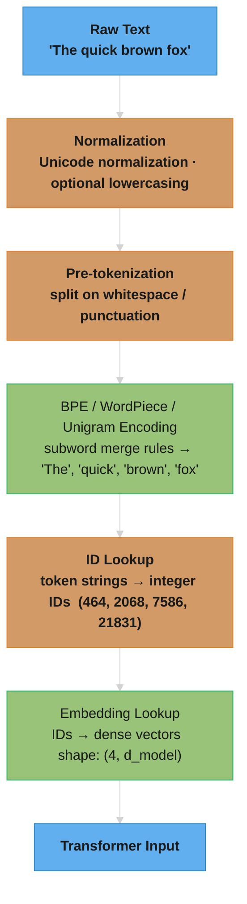

# Tokenization & Embeddings

## 1. Concept Overview

Tokenization is the process of converting raw text into discrete units (tokens) that a model can process. These tokens are then mapped to dense vector representations (embeddings) — the actual numerical input to the neural network.

Tokenization sits at the boundary between human-readable text and the mathematical world of neural networks. Poor tokenization design directly impacts model quality: inefficient vocabularies waste model capacity on common subwords; bad handling of numbers, code, or non-Latin scripts degrades performance on those domains.

The key insight of modern tokenization: instead of splitting on words (leads to huge vocabularies with out-of-vocabulary issues) or characters (leads to very long sequences), **subword tokenization** finds a sweet spot — common words are single tokens, rare words split into recognizable pieces.

---

## Deep Dive Files

| File | Topic |
|------|-------|
| [byte_level_and_tokenizer_free.md](byte_level_and_tokenizer_free.md) | Byte-level & tokenizer-free models — BLT (entropy-based patching), MEGABYTE, ByT5; escaping the tokenizer |

---

## 2. Intuition

> **One-line analogy**: Tokenization is like breaking a sentence into Lego bricks — common words are single bricks, rare words are split into recognizable pieces — before handing them to the model.

**Mental model**: Think of a dictionary of ~100,000 "subwords" — pieces like "un-", "believ", "-able". Any English text can be expressed as a sequence of these pieces. The model never sees raw characters or full words; it sees these pieces as integer IDs, then looks up a learned vector (embedding) for each. That vector is the model's "understanding" of that piece, learned from context during training.

**Why it matters**: Tokenization determines the effective vocabulary, sequence length, and what the model can efficiently learn. Bad tokenization (e.g., splitting "2024" into ["2", "0", "2", "4"]) makes arithmetic hard. Good tokenization enables multilingual coverage, code understanding, and efficient training.

**Key insight**: The embedding matrix is the interface between discrete symbols (text) and continuous math (neural networks) — everything the model knows about a word is encoded in its embedding vector.

---

## 3. Core Principles

- **Vocabulary**: A fixed set of tokens the model knows (typically 32K–200K for modern LLMs).
- **Subword Units**: Most tokens represent common subwords; rare words decompose into known pieces.
- **No OOV**: Any string of UTF-8 bytes can be represented, even unknown languages (fallback to byte tokens).
- **Deterministic**: The same string always produces the same token sequence (given the same tokenizer).
- **Reversible**: Token IDs can be decoded back to the original text (lossless round-trip).
- **Fertility**: Average tokens-per-word ratio. High fertility (3+ tokens/word) means long sequences, slower inference.

---

## 4. Tokenization Algorithms

### 4.1 Byte Pair Encoding (BPE)

The most widely used algorithm. Starts with individual bytes/characters, iteratively merges the most frequent adjacent pair.

**Training Algorithm:**
```
1. Initialize vocabulary with all bytes/characters
2. For N merge operations:
   a. Count frequency of all adjacent pairs in corpus
   b. Merge the most frequent pair (e.g., "th" appears 50K times)
   c. Add merged unit to vocabulary
   d. Replace all occurrences of the pair in corpus
3. Result: N+initial vocabulary of subword units
```

**Inference (Encoding):**
```
Input: "tokenization"
Step 1: t o k e n i z a t i o n  (split to chars/bytes)
Step 2: Apply learned merges in order:
  "t o" -> "to"... "token" -> "token", "iz" -> "iz", etc.
Output: ["token", "ization"] (2 tokens)
```

Used by: GPT-2, GPT-3, GPT-4 (tiktoken), LLaMA (via SentencePiece BPE), Mistral, Qwen

### 4.2 WordPiece

Similar to BPE but uses likelihood-based merge criterion instead of frequency. Merges the pair that maximizes language model likelihood when merged.

- Subwords prefixed with `##` if they continue a word (e.g., `"tokenization"` → `["token", "##ization"]`)
- The `##` prefix distinguishes word-initial vs. word-internal positions

Used by: BERT, DistilBERT, ELECTRA, most BERT-derived models

### 4.3 SentencePiece (Unigram LM)

Google's tokenization library. Key innovations:
- **Language-agnostic**: Treats the input as a raw byte stream — no need for word boundaries (crucial for CJK languages with no spaces)
- **Unigram LM variant**: Starts with a large vocabulary, iteratively removes tokens that minimally reduce the likelihood of the corpus
- **BPE variant in SentencePiece**: Also supports BPE, now more common

The Unigram model keeps multiple tokenization candidates and picks the highest likelihood one.

Used by: LLaMA (SentencePiece BPE), T5, ALBERT, mT5, PaLM, Gemma

### 4.4 tiktoken (OpenAI)

OpenAI's fast BPE implementation in Rust/Python. Used for GPT-3.5, GPT-4, embedding models.

Key vocabularies:
- `cl100k_base` (100K vocab): GPT-3.5, GPT-4, text-embedding-3
- `o200k_base` (200K vocab): GPT-4o (better multilingual coverage)
- `p50k_base` (50K vocab): GPT-3, Codex

---

## 5. Architecture Diagrams

### Tokenization Pipeline



Each stage is deterministic and stateless; the learned parameters live only in the BPE merge table and the embedding matrix.

### Vocabulary Structure
```
Token ID 0-255:    Byte fallback tokens (encode any byte)
Token ID 256-N:    Subword tokens learned by BPE/WordPiece
                   Common: "the", "ing", " of", " the"
                   Medium: "token", "ization"
                   Rare: "antidisestablishmentarianism" (split into ~6 tokens)
Special tokens:    [BOS]=1, [EOS]=2, [PAD]=3, [UNK]=0
```

### Token Embedding Layer
```
Vocabulary Size V (e.g., 32,000)
Embedding Dimension D (e.g., 4,096 for 7B model)

Embedding Matrix W_e: shape [V × D]
  Token ID 5 -> W_e[5] -> 4096-dim vector

Positional Embedding (or RoPE applied inside attention):
  Token at position p -> learned or computed position vector

Input to Transformer = token_embedding + positional_embedding
```

---

## 6. How It Works — Detailed Mechanics

### The Encoding Process (Step by Step)

```python
# Example with tiktoken
import tiktoken
enc = tiktoken.get_encoding("cl100k_base")

text = "Hello, World! 你好"
tokens = enc.encode(text)
# [9906, 11, 4435, 0, 220, 57668, 53901]
# "Hello" -> 9906
# "," -> 11
# " World" -> 4435  (note leading space is part of token)
# "!" -> 0
# " " -> 220
# "你好" -> two tokens [57668, 53901] -- less efficient than Latin text

decoded = enc.decode(tokens)
# "Hello, World! 你好"  -- lossless round-trip
```

### Fertility and Efficiency

**Token density comparison** (approximate tokens per word):
```
English: ~1.3 tokens/word  (most efficient)
French:  ~1.4 tokens/word
Chinese: ~1.5-2 tokens/word (depends on vocab design)
Arabic:  ~2-3 tokens/word
Code:    ~2-4 tokens per identifier (varies with vocabulary)

Implication: An LLM with 4K context window can process:
  ~3000 English words
  ~2000 Arabic words
  ~1500 Python lines of code
```

### Special Tokens

Every model uses special tokens to delimit structure:

| Token | Purpose | Example models |
|-------|---------|---------------|
| `<s>` / `[BOS]` | Beginning of sequence | LLaMA, Mistral |
| `</s>` / `[EOS]` | End of sequence | LLaMA, GPT |
| `[PAD]` | Padding for batching | BERT, T5 |
| `<|system|>`, `<|user|>` | Chat turn delimiters | Qwen, Phi |
| `<|im_start|>` | ChatML format start | OpenAI, many fine-tunes |
| `<|fim_prefix|>` | Fill-in-middle prefix | Code models |
| `[INST]` `[/INST]` | Instruction tags | LLaMA-2-Chat |

### Vocabulary Size Tradeoffs

| Vocab Size | Pros | Cons |
|-----------|------|------|
| Small (8K-16K) | Shorter sequences, smaller embedding matrix | Poor coverage; many multi-token words |
| Medium (32K-50K) | Good English coverage, standard | May struggle with multilingual |
| Large (100K-200K) | Better multilingual, better coding | Larger embedding matrix, rare token quality |

Modern trend: 100K+ vocabulary for broader language coverage (GPT-4o uses 200K, Llama 3 uses 128K).

---

## 7. Real-World Examples

### OpenAI tiktoken Evolution
- GPT-2: 50K vocab (`gpt2` encoding), poor multilingual
- GPT-3/3.5: `p50k_base` 50K, then `cl100k_base` 100K — dramatically better multilingual, 4x fewer tokens for common non-English languages
- GPT-4o: `o200k_base` 200K — further multilingual improvement, better code coverage

### LLaMA Tokenizer
- LLaMA 1/2: SentencePiece BPE, 32K vocabulary
- LLaMA 3: Tiktoken-based BPE, **128K vocabulary** — 4x larger, much better for code, multilingual, math
- Impact: LLaMA 3 generates code with fewer tokens, improving context utilization

### BERT (WordPiece)
- 30K vocabulary, WordPiece encoding
- `[CLS]` token prepended (classification token); `[SEP]` separates sequences
- The `##` prefix is unique to BERT-family models

### Challenges with Numbers and Math
```
Number "8675309" with different tokenizers:
  GPT-2 (p50k):     ["86", "75", "309"] -- irregular, frequency-learned splits
  GPT-4 (cl100k):   ["867", "530", "9"] -- fixed 1-3 digit chunks, left to right

Year "2019": 1 token in GPT-2, but ["201", "9"] in cl100k
  Frequency-learned splits vary wildly across nearby values;
  this inconsistency makes arithmetic harder for LLMs

Solutions: Use tokenizers with consistent number splitting
  LLaMA 1/2 (SentencePiece): each digit is its own token (place value exposed)
  LLaMA 3 / cl100k: consistent 1-3 digit chunking
```

---

## 8. Tradeoffs

| Algorithm | Pros | Cons | Best For |
|-----------|------|------|---------|
| BPE | Fast, reproducible, widely used | Not probabilistic; merge order matters | General purpose |
| WordPiece | Likelihood-based; good quality | Slower training | BERT-style models |
| Unigram LM | Probabilistic; multiple segmentations | More complex | Multilingual, T5-style |
| SentencePiece | Language-agnostic, handles any unicode | Extra library dependency | Multilingual models |

---

## 9. When to Use / When NOT to Use Custom Tokenizers

### Use Default Model Tokenizer When:
- Using a pretrained model (API or open-source) — **always use the model's own tokenizer**
- The mismatch between tokenizer and model weights will degrade performance significantly

### Consider Custom Tokenizer When:
- Training a new model from scratch for a specialized domain
- Domain has unusual characters (chemical formulas, music notation, math symbols)
- Your target language has poor coverage in standard vocabularies
- Building a code-specialized model and want single-token identifiers

### Never Do:
- Mix tokenizers from different model families
- Expand vocabulary after pretraining without retraining the embedding layer
- Assume character count ≈ token count when estimating context usage

---

## 10. Common Pitfalls

1. **Token counting != character counting**: "ChatGPT" is 1 token but has 7 characters. Always count tokens with the model's actual tokenizer.
2. **Leading space matters**: `"hello"` and `" hello"` are different tokens in BPE. This matters for prompt construction.
3. **Special token handling**: Forgetting to add BOS/EOS tokens can degrade model performance.
4. **Vocabulary truncation on fine-tuning**: Adding new tokens to a frozen embedding matrix — the new tokens have random embeddings and need extra training.
5. **Non-printing characters**: Prompts with invisible Unicode characters can cause unexpected tokenization.
6. **Byte fallback**: Unknown characters fall back to individual byte tokens (3-4 per UTF-8 character for CJK), dramatically increasing sequence length.

---

## 11. Technologies & Tools

| Tool | Purpose | Notes |
|------|---------|-------|
| tiktoken | OpenAI tokenizer | Fast Rust/Python, GPT-4 compatible |
| SentencePiece | Google tokenizer | Used by LLaMA, T5, Gemma |
| HuggingFace tokenizers | Unified interface | Wraps tiktoken, SP, WordPiece; auto-selects from config.json |
| tokenizers (Rust) | HF's fast tokenizer library | Parallelized, used in production |
| spaCy | NLP tokenizer | Not for LLMs; for traditional NLP |
| NLTK | NLP toolkit | Word/sentence tokenization |

```python
# HuggingFace tokenizer usage
from transformers import AutoTokenizer

tokenizer = AutoTokenizer.from_pretrained("meta-llama/Meta-Llama-3-8B")
tokens = tokenizer.encode("Hello, LLM world!", return_tensors="pt")
print(tokenizer.vocab_size)  # 128,256
```

---

## 12. Interview Questions with Answers

**Q: What is Byte Pair Encoding and how does it work?**
A: BPE starts with a character/byte-level vocabulary and iteratively merges the most frequent adjacent pair of tokens until the target vocabulary size is reached. At inference, the same merge operations are applied in order to tokenize new text. This creates a vocabulary that efficiently represents common subwords as single tokens while handling rare words by splitting them into known pieces.

**Q: Why use subword tokenization instead of word-level or character-level?**
A: Word-level creates huge vocabularies (every morphological variant is separate) with out-of-vocabulary issues. Character-level creates very long sequences (100 chars = 100 tokens) and forces the model to learn linguistic patterns from scratch. Subword is the sweet spot: common words are single tokens, rare words decompose into recognizable subwords, and the vocabulary stays manageable.

**Q: What is tokenizer fertility and why does it matter?**
A: Fertility is the average number of tokens per word. High fertility (e.g., Arabic at 3+ tokens/word) means the model processes fewer words within its context window, reducing effective "memory." A model with 4K context but fertility of 3 can only process ~1300 words effectively, versus ~3000 words for English with fertility ~1.3.

**Q: Why does GPT-4 tokenize "hello" differently than "Hello"?**
A: In BPE with case-sensitive vocabularies, " Hello" (with leading space) and "Hello" are different tokens. Additionally, casing changes the token. Leading spaces are merged into the following word token during BPE training, meaning the space is "absorbed" into the token. This is why tokenization is sensitive to capitalization and spacing.

**Q: What happens when an LLM encounters a character it has never seen?**
A: Nothing fails — it degrades. A character with no learned merge falls back to its raw UTF-8 bytes, so an unseen CJK character or rare emoji becomes 3-4 individual byte tokens instead of an `[UNK]`. The cost is silent: sequence length inflates and the model reasons over low-signal byte fragments, which is why rare scripts underperform even though they are perfectly representable. (The byte-level BPE Q&A below covers why this fallback guarantees zero out-of-vocabulary.)

**Q: Why do numbers and dates tokenize inconsistently, and how does that hurt arithmetic?**
A: With frequency-learned number tokens, the same number splits differently across tokenizers and even across nearby values. In GPT-2's vocab "2019" is a single learned token but "8675309" fragments irregularly as ["86","75","309"]; cl100k_base instead forces fixed left-to-right chunks of at most 3 digits ("8675309" becomes ["867","530","9"], "12345" becomes ["123","45"]). This is harmful because the model must learn arithmetic over inconsistent, non-positional groupings — "327" as one token carries no signal that it is 3 hundreds + 2 tens + 7. Two mitigations exist: LLaMA 1/2's SentencePiece tokenizer splits every digit into its own token (fully exposing place value), while cl100k and LLaMA 3 use the consistent 1-3-digit chunking rule; if you fine-tune for numeric tasks, prefer a per-digit scheme and always verify how your tokenizer splits representative numbers before relying on the model to compute.

**Q: What breaks when you add new tokens to a pretrained model's embedding matrix?**
A: The new token rows are randomly initialized, so the model has no learned meaning for them — outputs are garbage until those embeddings are trained. You must call `model.resize_token_embeddings(new_vocab_size)` and then fine-tune so the new rows (and the corresponding output-layer rows) learn useful values; skipping the resize causes an index-out-of-range crash, and skipping the training leaves random vectors. A cheap trick that helps convergence is to initialize each new row as the mean of the sub-tokens the term previously decomposed into (e.g., initialize a new "<company>" token from the average of its old subword embeddings). Never expand vocabulary and freeze the embedding layer — the new tokens will never learn.

**Q: How can special or control tokens in user input be a security risk?**
A: If your code lets raw user text be tokenized with `add_special_tokens` semantics that honor literal control strings, a user can inject sequence delimiters like `<|im_start|>system` or `</s>` to spoof a new role or terminate the prompt early — a form of prompt injection at the tokenizer layer. The defense is to encode user content with special-token parsing disabled (HuggingFace: pass the text through the tokenizer so `<|...|>` is treated as ordinary characters, not as a registered special token) and to build chat prompts only through the model's official chat template rather than string-concatenating role markers. Treat any user-supplied string that contains the model's reserved delimiter substrings as hostile.

**Q: How do BPE merge rules work and what determines the final vocabulary?**
BPE starts with individual characters and iteratively merges the most frequent adjacent pair into a new token until reaching the target vocabulary size. Each merge creates a new token — for example, if "t" and "h" appear adjacent most often, they merge into "th", then "th" and "e" might merge into "the". The final vocabulary is determined by the merge order and the target vocabulary size (e.g., 32K, 50K, 128K). GPT-2 used 50,257 tokens; LLaMA uses 32,000; GPT-4 uses ~100K. The training corpus determines which merges are learned — training on English-heavy data creates English-efficient tokenization but wastes tokens on other languages.

**Q: What are the tradeoffs of vocabulary size (32K vs 64K vs 128K tokens)?**
Larger vocabularies reduce sequence length (fewer tokens per text) but increase embedding table size and softmax computation. A 32K vocabulary (LLaMA) tokenizes "unfortunately" as one token, while a smaller vocab might split it into 3. However, a 128K vocabulary (GPT-4) adds ~256MB to the embedding layer (128K x 2048 dim x FP16) and makes the softmax output layer 4x more expensive to compute. The optimal size depends on: languages supported (multilingual needs 64K+), domain (code benefits from larger vocab for common patterns), and model size (small models can't leverage huge vocabularies effectively). Mistral's Tekken tokenizer uses 128K for superior multilingual support.

**Q: Why do LLMs show multilingual bias in tokenization and how can it be addressed?**
Multilingual tokenization bias occurs because BPE merge rules are learned from the training corpus, which is typically English-heavy. English text requires ~1.3 tokens per word, while languages like Chinese, Japanese, or Hindi may require 3-5x more tokens per word because their character sequences appear less frequently in the training data. This means non-English users pay more per API call and get shorter effective context windows. Solutions: (1) train tokenizer on balanced multilingual corpus; (2) use larger vocabulary (128K+) to include more non-English tokens; (3) SentencePiece with language-balanced sampling. GPT-4 significantly improved multilingual tokenization compared to GPT-3.5.

**Q: What is the difference between tiktoken and SentencePiece, and when would you choose each?**
tiktoken (OpenAI) is a fast BPE tokenizer optimized for speed (Rust backend), while SentencePiece (Google) is a more flexible framework supporting both BPE and Unigram models. tiktoken is 3-6x faster than SentencePiece for encoding. Choose tiktoken when: building on OpenAI models, need maximum tokenization speed, English-primary workloads. Choose SentencePiece when: training a new model from scratch, need Unigram model support, multilingual focus, or need language-agnostic tokenization (SentencePiece treats text as raw Unicode, no pre-tokenization needed). LLaMA uses SentencePiece; GPT-4 uses tiktoken. For production tokenization of user input, speed often matters most.

**Q: How does the tokenizer affect model performance on code and mathematical expressions?**
Tokenizers can dramatically affect code and math performance because poor tokenization splits meaningful patterns into semantically meaningless pieces. A tokenizer trained primarily on English text might split "def fibonacci(n):" into 6+ tokens, while a code-aware tokenizer keeps "fibonacci" as one token. For mathematics, "3.14159" might be split into ["3", ".", "14", "159"] with a generic tokenizer, destroying the numerical representation. Solutions: (1) include code and math in tokenizer training data; (2) dedicated tokens for common programming constructs (indentation, brackets); (3) digit tokenization strategies — some models tokenize each digit separately for better arithmetic. CodeLLaMA and StarCoder use code-aware tokenizers that significantly improve code completion quality.

**Q: How do WordPiece and Unigram LM differ from BPE in how they build the vocabulary?**
A: All three produce subword vocabularies but choose merges differently. BPE is greedy and frequency-based: it repeatedly merges the most frequent adjacent pair, so merge order matters and the segmentation is deterministic. WordPiece (BERT) is likelihood-based: instead of raw frequency it merges the pair that most increases the training-corpus likelihood under a unigram language model, and marks word-internal pieces with `##`. Unigram LM (SentencePiece) works top-down: it starts from a large candidate vocabulary and iteratively removes tokens whose deletion least reduces corpus likelihood, and it keeps a probabilistic model so a single string has multiple candidate segmentations with associated probabilities (enabling subword regularization / sampling during training). Practically: BPE is fastest and most common, WordPiece is BERT-family, Unigram is preferred for multilingual and where segmentation sampling helps robustness.

**Q: What is byte-level BPE and why do GPT models use it?**
A: Byte-level BPE runs BPE over the 256 raw UTF-8 bytes rather than over Unicode characters, so the base alphabet is a fixed 256 symbols and every possible string is representable with zero out-of-vocabulary risk — no `[UNK]` token is ever needed. This is why GPT-2/GPT-4 tokenizers can encode any emoji, script, or binary-ish text losslessly. The cost is that a character requiring multiple UTF-8 bytes (most CJK characters are 3 bytes) can fragment into several byte tokens when it is not itself a learned merge, inflating sequence length for those languages. Byte-level BPE is the standard for general-purpose LLMs precisely because robustness to arbitrary input outweighs the fertility penalty on non-Latin scripts.

**Q: What is weight tying between the embedding and output layers, and why is it common?**
A: Weight tying (Press & Wolf, 2017) shares one matrix between the input embedding lookup (`[V × D]`) and the output projection that produces logits over the vocabulary (`[D × V]`), so the same learned vector represents a token both when it is read in and when it is scored for generation. It roughly halves the parameters spent on the vocabulary interface — for a 128K vocab at D=4096 that is ~0.5B parameters saved — and it usually improves quality because input and output representations of a word are forced to be consistent. Most decoder LLMs (GPT-2, LLaMA family) tie weights; the main reason not to is when input and output should live in genuinely different spaces (e.g., some encoder-decoder setups) or when a factorized/large-vocab output head is used for efficiency.

---

## 13. Best Practices

1. **Always use the model's own tokenizer** — never mix tokenizers from different model families.
2. **Pre-compute token counts** for long documents before sending to API to avoid exceeding context limits.
3. **Reserve special tokens** when designing new model variants — plan for tool use, formatting, etc.
4. **Test tokenization for your domain** — if building a medical or legal LLM, check that domain-specific terms tokenize efficiently.
5. **Use tiktoken for fast token counting** on GPT-family models, even if not calling the API.
6. **Handle BOS/EOS correctly** — whether your inference code needs to prepend/append them depends on the model's training setup.

---


## 14. Case Study

**Scenario:** A multilingual e-commerce company (50M products across 40 languages, 200M monthly searches) needs to build a [semantic search](../embeddings_and_similarity_search/README.md) system over product descriptions. Existing system: BM25 keyword search, 23% null result rate for cross-lingual queries (user searches in Spanish for product listed in Portuguese), customer complaint rate 18% related to search. Goal: reduce null results to < 5%, support cross-lingual retrieval across all 40 languages, p99 query embedding latency < 30ms, embedding cost < $200/month.

**Architecture:**

```
  Query (any of 40 languages)
         |
         v
  ┌───────────────────────────────────────────────────────────┐
  │  Tokenizer: SentencePiece (multilingual BPE, 100k vocab)  │
  │  - Automatic language detection via fastText              │
  │  - Token fertility monitoring (tokens/word per language)  │
  │  - OOV rate alert: < 0.1% unknown pieces target          │
  └──────────────────────────┬────────────────────────────────┘
                             │ token IDs
                             v
  ┌───────────────────────────────────────────────────────────┐
  │  Embedding Model: multilingual-e5-large-instruct          │
  │  (560M params, 1024-dim, supports 100 languages)          │
  │  Instruction prefix: "Represent this product for search:" │
  │  Batch size: 64 (GPU) / 8 (CPU fallback)                  │
  │  Quantization: INT8 (2× speedup, < 0.5% quality loss)    │
  └──────────────────────────┬────────────────────────────────┘
                             │ 1024-dim embedding
                             v
  ┌───────────────────────────────────────────────────────────┐
  │  HNSW Vector Index (Qdrant)                               │
  │  - 50M product embeddings (1024-dim, float32)             │
  │  - Index size: 50M × 1024 × 4 bytes = 200 GB             │
  │  - Distributed: 5 shards × 40 GB per node                │
  │  - HNSW params: M=32, ef_construction=200                 │
  │  - Query ef: 128 (recall@10 = 97.3%)                     │
  │  - p50 query: 8ms; p99: 24ms                              │
  └──────────────────────────┬────────────────────────────────┘
                             │ top-100 candidates
                             v
  ┌───────────────────────────────────────────────────────────┐
  │  Cross-encoder Reranker (mMiniLM-L12-v2)                  │
  │  - Rerank top-100 → top-10 for display                    │
  │  - Cross-lingual: handles query-product language mismatch │
  │  - Latency: 15ms for top-100 batch                        │
  └──────────────────────────┬────────────────────────────────┘
                             │ top-10 results
                             v
  ┌───────────────────────────────────────────────────────────┐
  │  Offline Indexing Pipeline                                 │
  │  - New products: embed within 5 min of listing            │
  │  - Batch re-embedding: monthly (model update)             │
  │  - Embedding worker: 8×A10G GPUs, 1.2M products/hour      │
  └───────────────────────────────────────────────────────────┘

Vocabulary Analysis (100k SentencePiece BPE):
  Language    Fertility   OOV Rate   Notes
  English     1.3 tok/wd  0.01%      Most coverage (training data dominant)
  Spanish     1.5 tok/wd  0.02%      Good coverage
  Portuguese  1.6 tok/wd  0.03%      Good coverage
  Arabic      2.1 tok/wd  0.08%      Morphologically complex; still adequate
  Thai        3.8 tok/wd  0.12%      Script-based; high fertility but acceptable
  Swahili     1.8 tok/wd  0.31%      Limited training data; monitor closely
```

**Key implementation — 3 Python code blocks:**

Block 1 — Multilingual embedding pipeline with instruction prefix:

```python
from __future__ import annotations
from dataclasses import dataclass, field
from typing import Any
import numpy as np
import torch
from transformers import AutoModel, AutoTokenizer


@dataclass
class EmbeddingConfig:
    model_id: str = "intfloat/multilingual-e5-large-instruct"
    max_length: int = 512
    batch_size: int = 64
    normalize: bool = True
    device: str = "cuda"
    # Instruction prefixes for different usage types
    query_prefix: str = "Instruct: Represent this e-commerce search query for retrieval\nQuery: "
    document_prefix: str = "Instruct: Represent this product description for retrieval\nQuery: "


class MultilingualEmbedder:
    """
    Multilingual embedding model for cross-lingual product search.
    Uses instruction-following E5 model — prefix changes embedding space behavior.
    Asymmetric: queries and documents use different prefixes.
    """

    def __init__(self, config: EmbeddingConfig) -> None:
        self.config = config
        self.tokenizer = AutoTokenizer.from_pretrained(config.model_id)
        self.model = AutoModel.from_pretrained(
            config.model_id,
            torch_dtype=torch.float16,
        ).to(config.device).eval()

    def embed_queries(self, texts: list[str]) -> np.ndarray:
        prefixed = [self.config.query_prefix + t for t in texts]
        return self._encode(prefixed)

    def embed_documents(self, texts: list[str]) -> np.ndarray:
        prefixed = [self.config.document_prefix + t for t in texts]
        return self._encode(prefixed)

    def _encode(self, texts: list[str]) -> np.ndarray:
        all_embeddings: list[np.ndarray] = []
        for i in range(0, len(texts), self.config.batch_size):
            batch = texts[i : i + self.config.batch_size]
            encoded = self.tokenizer(
                batch,
                padding=True,
                truncation=True,
                max_length=self.config.max_length,
                return_tensors="pt",
            ).to(self.config.device)

            with torch.no_grad():
                outputs = self.model(**encoded)

            # Mean pooling over non-padding tokens
            attention_mask = encoded["attention_mask"]
            token_embeddings = outputs.last_hidden_state
            input_mask_expanded = (
                attention_mask.unsqueeze(-1).expand(token_embeddings.size()).float()
            )
            embeddings = torch.sum(token_embeddings * input_mask_expanded, dim=1)
            embeddings /= torch.clamp(input_mask_expanded.sum(dim=1), min=1e-9)

            if self.config.normalize:
                embeddings = torch.nn.functional.normalize(embeddings, p=2, dim=1)

            all_embeddings.append(embeddings.cpu().float().numpy())

        return np.concatenate(all_embeddings, axis=0)

    def check_token_fertility(self, texts: list[str], language: str) -> dict[str, float]:
        """Monitor tokenization quality per language."""
        total_tokens = 0
        total_words = 0
        for text in texts:
            tokens = self.tokenizer.encode(text, add_special_tokens=False)
            words = len(text.split())
            total_tokens += len(tokens)
            total_words += max(words, 1)
        fertility = total_tokens / total_words
        return {
            "language": language,
            "fertility": fertility,
            "token_count": total_tokens,
            "word_count": total_words,
            "alert": fertility > 4.0,   # high fertility signals coverage issues
        }
```

Block 2 — OOV monitoring and tokenizer health checks (production concern):

```python
from __future__ import annotations
from collections import defaultdict
from dataclasses import dataclass, field
import logging
from transformers import PreTrainedTokenizer


@dataclass
class TokenizerHealthMonitor:
    """
    Monitor tokenizer health in production.
    Track: OOV rates, fertility per language, truncation rates.
    Alert if OOV rate > 0.1% (indicates domain drift or new product categories).
    """

    tokenizer: PreTrainedTokenizer
    alert_oov_threshold: float = 0.001      # 0.1%
    alert_fertility_threshold: float = 5.0  # tokens per word
    alert_truncation_threshold: float = 0.05  # 5% of texts truncated

    _stats: dict[str, list[float]] = field(default_factory=lambda: defaultdict(list))

    def analyze_batch(
        self,
        texts: list[str],
        language: str,
        max_length: int = 512,
    ) -> dict[str, Any]:
        oov_count = 0
        truncated_count = 0
        total_tokens = 0
        total_words = 0

        unk_id = self.tokenizer.unk_token_id

        for text in texts:
            token_ids = self.tokenizer.encode(text, add_special_tokens=False)
            total_tokens += len(token_ids)
            total_words += len(text.split())

            # Count OOV (unknown) tokens
            oov_count += sum(1 for t in token_ids if t == unk_id)

            # Check truncation
            if len(token_ids) > max_length - 2:  # -2 for special tokens
                truncated_count += 1

        n = len(texts)
        oov_rate = oov_count / max(total_tokens, 1)
        fertility = total_tokens / max(total_words, 1)
        truncation_rate = truncated_count / max(n, 1)

        # Track history
        self._stats[f"{language}/oov_rate"].append(oov_rate)
        self._stats[f"{language}/fertility"].append(fertility)

        alerts = []
        if oov_rate > self.alert_oov_threshold:
            alerts.append(
                f"HIGH OOV: {language} OOV rate {oov_rate:.3%} > {self.alert_oov_threshold:.3%}"
            )
            logging.warning(alerts[-1])
        if fertility > self.alert_fertility_threshold:
            alerts.append(
                f"HIGH FERTILITY: {language} fertility {fertility:.1f} tok/word"
            )
        if truncation_rate > self.alert_truncation_threshold:
            alerts.append(
                f"HIGH TRUNCATION: {language} {truncation_rate:.1%} texts truncated"
            )

        return {
            "language": language,
            "oov_rate": oov_rate,
            "fertility": fertility,
            "truncation_rate": truncation_rate,
            "alerts": alerts,
            "sample_size": n,
        }

    def should_retrain_tokenizer(self, language: str) -> bool:
        """
        Flag if OOV rate has drifted above threshold in recent windows.
        Trigger: retrain tokenizer if sustained > 0.5% OOV for 7 days.
        """
        recent = self._stats.get(f"{language}/oov_rate", [])[-168:]  # 7 days hourly
        if not recent:
            return False
        return sum(1 for r in recent if r > 0.005) > len(recent) * 0.8


from typing import Any
```

Block 3 — BROKEN -> FIX: using wrong tokenizer for multilingual data and subword normalization:

```python
from __future__ import annotations
from transformers import AutoTokenizer
import unicodedata


# BROKEN: Use English-only GPT-2 tokenizer (50k BPE, English trained) for Spanish queries.
# Spanish word "niño" (child) tokenizes to: ['n', 'i', 'ñ', 'o'] — 4 tokens.
# English vocab has no "ñ" entry; fertility for Spanish: 3.8 tok/word (too high).
# Embedding model trained with multilingual tokenizer — tokenizer mismatch → garbage embeddings.
def broken_tokenize_spanish(text: str) -> list[int]:
    tokenizer = AutoTokenizer.from_pretrained("gpt2")  # English-only
    return tokenizer.encode(text)
# "zapatillas de running" → 8 tokens (vs 4 with multilingual SentencePiece)
# Embedding model: mismatch → lower recall on Spanish queries


# FIX: Use the exact same tokenizer the embedding model was trained with.
# multilingual-e5 uses XLM-RoBERTa's SentencePiece tokenizer (250k vocab, 100 languages).
# Always load tokenizer from the same model hub path as the embedding model.
def fixed_tokenize_multilingual(text: str, model_id: str) -> list[int]:
    tokenizer = AutoTokenizer.from_pretrained(model_id)
    # SentencePiece handles "ñ" natively: "niño" → 2 tokens ["ni", "ño"]
    return tokenizer.encode(text, add_special_tokens=False)


# BROKEN: Pass raw user input to tokenizer without Unicode normalization.
# User inputs "café" (cafe + combining accent) vs "caf\xe9" (é as single char).
# Both look like "café" but tokenize differently — same query, different embeddings.
# Nearest neighbor search returns different results depending on input encoding.
def broken_embed_raw(text: str) -> None:
    tokenizer = AutoTokenizer.from_pretrained("intfloat/multilingual-e5-large-instruct")
    tokenizer.encode(text)   # raw — no normalization


# FIX: NFC normalize all text before tokenization.
# NFC (Canonical Decomposition, Canonical Composition) standardizes character representations.
# "café" and "caf\xe9" both become "caf\xe9" after NFC.
def fixed_normalize_and_embed(text: str, model_id: str) -> list[int]:
    normalized = unicodedata.normalize("NFC", text).strip()
    # Also: strip leading/trailing whitespace, collapse internal spaces
    normalized = " ".join(normalized.split())
    tokenizer = AutoTokenizer.from_pretrained(model_id)
    return tokenizer.encode(normalized, add_special_tokens=False)


# BROKEN: Use symmetric embedding (same prefix for queries and documents).
# Instruction-tuned E5 is designed for asymmetric retrieval:
# queries should use "Instruct: ... Query:" prefix;
# documents use a different (or no) prefix.
# Using same prefix for both: 8% recall@10 degradation vs asymmetric.
def broken_symmetric_embed(text: str, tokenizer: Any) -> None:
    return tokenizer.encode("Query: " + text)   # same prefix for everything


# FIX: Asymmetric prefixes.
QUERY_PREFIX = "Instruct: Represent this e-commerce search query for retrieval\nQuery: "
DOCUMENT_PREFIX = ""   # E5-instruct documents use no prefix (or minimal)

def fixed_asymmetric_embed(text: str, is_query: bool, tokenizer: Any) -> list[int]:
    prefix = QUERY_PREFIX if is_query else DOCUMENT_PREFIX
    return tokenizer.encode(prefix + text, add_special_tokens=True)


from typing import Any
```

**Pitfall 1 — Vocabulary imbalance across languages causes poor recall for low-resource languages:**

```python
# BROKEN: Train BPE tokenizer on English-dominated corpus.
# Unigram frequency determines merge priority — English merges dominate.
# Thai, Swahili, Yoruba get 3-5% of vocab allocation despite 10% of queries.
# Swahili fertility: 6.2 tok/word (unacceptable — 3× embedding cost).

# FIX: Language-balanced sampling at tokenizer training time.
# Cap each language's training data contribution to max_fraction per language.
# For 40 languages at 100k vocab: target 2500 tokens per language as floor.
# Upsampling low-resource languages with temperature sampling (T=0.7 for mBERT style).
from tokenizers import Tokenizer, models, trainers

def train_balanced_tokenizer(
    language_corpora: dict[str, list[str]],
    vocab_size: int = 100_000,
    min_language_fraction: float = 0.01,  # at least 1% of vocab per language
) -> None:
    # Upsample each language so no language has < 1% of training data
    balanced_texts = []
    target_per_lang = max(
        len(texts) for texts in language_corpora.values()
    ) * min_language_fraction
    for lang, texts in language_corpora.items():
        if len(texts) < target_per_lang:
            # Oversample by repeating
            factor = int(target_per_lang / len(texts)) + 1
            texts = (texts * factor)[:int(target_per_lang)]
        balanced_texts.extend(texts)
    # Train SentencePiece BPE on balanced corpus
    import sentencepiece as spm
    spm.SentencePieceTrainer.train(
        input=balanced_texts,
        vocab_size=vocab_size,
        model_type="bpe",
        character_coverage=0.9995,   # cover rare Unicode chars
        pad_id=0, unk_id=1, bos_id=2, eos_id=3,
    )
```

**Pitfall 2 — Long product descriptions truncated, losing key attributes:**

```python
# BROKEN: Truncate to max_length=512 tokens — for a detailed product description,
# this may cut off size, material, or color attributes (key search signals).
# Recall@10 drops 12% for queries that match attributes in the truncated portion.
def broken_embed_product(description: str, tokenizer: Any, model: Any) -> Any:
    tokens = tokenizer(description, max_length=512, truncation=True)
    return model(**tokens)  # last 20% of description silently dropped

# FIX: Hierarchical embedding — embed structured fields separately.
# Priority order: title > key_attributes > full_description.
# For search, title+attributes often sufficient; full description for reranking.
def fixed_embed_structured(
    title: str,
    attributes: dict[str, str],
    description: str,
    embedder: MultilingualEmbedder,
) -> np.ndarray:
    # Structured representation prioritizing search-relevant fields
    structured = (
        f"Product: {title}. "
        + " ".join(f"{k}: {v}" for k, v in attributes.items())
    )[:1000]  # attributes fit in 512 tokens
    return embedder.embed_documents([structured])[0]
```

**Pitfall 3 — Not normalizing embeddings before cosine similarity:**

```python
# BROKEN: Return raw (unnormalized) embeddings from model.
# Cosine similarity requires normalized vectors — raw vectors give L2 distance instead.
# Results: low-quality products with verbose descriptions score higher
# because their embedding vectors have larger magnitude.
def broken_embed(text: str, model: Any) -> Any:
    output = model(text)
    return output.last_hidden_state.mean(dim=1)  # unnormalized

# FIX: Always L2-normalize embeddings before indexing or querying.
# Cosine similarity of normalized vectors equals dot product — faster HNSW search.
import torch
def fixed_embed_normalized(text: str, model: Any) -> torch.Tensor:
    output = model(text)
    embedding = output.last_hidden_state.mean(dim=1)
    return torch.nn.functional.normalize(embedding, p=2, dim=-1)
```

**Metrics:**

| Metric | BM25 baseline | + Multilingual Embeddings | + Cross-encoder Rerank |
|--------|--------------|--------------------------|------------------------|
| Null result rate | 23% | 4.1% | 3.8% |
| Cross-lingual recall@10 | 12% | 71% | 84% |
| NDCG@10 (same language) | 0.42 | 0.61 | 0.73 |
| p50 query latency | 8ms | 28ms | 43ms |
| p99 query latency | 22ms | 68ms | 89ms |
| Embedding index size | — | 200 GB | — |
| Monthly embedding API cost | — | $180 (self-hosted) | — |
| OOV rate (all languages) | N/A | 0.06% avg | — |
| Thai fertility | N/A | 3.8 tok/word | — |
| Swahili OOV rate | N/A | 0.31% (flagged) | — |

**Interview Q&As:**

**Q: Why does BPE vocabulary size matter for multilingual tokenization quality?**
BPE vocabulary size determines how many subword merge rules exist. A 32k vocabulary (like early GPT-2) works well for English — common words are single tokens, fertility is ~1.3 tokens/word. For 40 languages sharing the same vocabulary, each language gets far fewer tokens — common words in Thai or Arabic require many subword pieces, increasing fertility to 4-6 tokens/word. This doubles or triples the token cost for those languages and fragments semantic units the embedding model was trained to handle. Multilingual models use 100k-250k vocabulary (XLM-RoBERTa: 250k, multilingual-BERT: 120k) to provide adequate coverage per language.

**Q: What is token fertility and why do you monitor it in production?**
Token fertility is the ratio of tokens to words for a given language and tokenizer — "niño" tokenized as 1 piece has fertility 1.0; tokenized as 4 pieces has fertility 4.0. High fertility (> 4.0) indicates the tokenizer poorly covers that language: subwords are too small, increasing cost proportionally, and potentially fragmenting morphemes that the embedding model was trained to handle as units. In production, monitor fertility per language per product category — new product launches in a new geography may introduce vocabulary the tokenizer has never seen, spiking OOV rates and fertility, degrading search quality before you notice the recall drop.

**Q: How does instruction-tuned embedding (E5-Instruct) differ from standard bi-encoder embedding?**
Standard bi-encoders (sentence-transformers SBERT) encode text symmetrically — same model, same prefix for queries and documents. Instruction-tuned embedders (E5-Instruct, text-embedding-3) use a task description prefix to orient the embedding space: "Represent this query for retrieval:" places the embedding in a retrieval-optimized space. The document side uses a different (or no) prefix. Asymmetric retrieval — where the query and document embedding spaces are allowed to differ — consistently outperforms symmetric by 5-15% recall@10 on MTEB benchmarks. The instruction tells the model "optimize for retrieval" vs "optimize for clustering" vs "optimize for classification."

**Q: What causes cross-lingual recall failures even with multilingual embedding models?**
Four common causes: (1) Language imbalance in training data — the embedding model saw 95% English text, so English embeddings cluster densely while low-resource languages cluster sparsely; Spanish "zapatos" and English "shoes" are near in embedding space but "zapatos" in Swahili may not be. (2) Tokenizer OOV — if query words tokenize to [UNK], the embedding loses signal. (3) Domain shift — model trained on Wikipedia/Common Crawl, but product descriptions use specialized vocabulary ("breathable mesh upper") not well represented. (4) Character normalization — accented characters not normalized consistently cause the same word to produce different embeddings.

**Q: How do you decide between a larger multilingual model (560M params) and distilled smaller model (120M params) for production embedding?**
The decision is recall vs latency/cost. Larger models (560M) typically achieve 5-15% higher NDCG@10 on multilingual benchmarks. Smaller distilled models (120M) run 3-4× faster and cost 3-4× less to serve. For a 50M product index with 200M monthly queries, embedding queries at 200M × 120M model = $180/month vs 560M model = $720/month. If the recall difference translates to measurable revenue (A/B test needed), use the larger model. In practice, the reranking stage recovers much of the top-K recall gap — a smaller bi-encoder + cross-encoder reranker often beats a larger bi-encoder alone at similar cost.

**Q: Why use HNSW instead of exact nearest neighbor search for 50M product embeddings?**
Exact nearest neighbor search (exhaustive dot product over 50M vectors) requires 50M × 1024 × 4 bytes × 200M queries / month = 40 petaFLOPs per second of sustained compute — economically infeasible. HNSW (Hierarchical Navigable Small Worlds) achieves approximate nearest neighbor search in O(log N) per query by building a navigable graph of shortcut edges at multiple granularity levels. At ef=128, HNSW achieves 97%+ recall@10 with p99 latency under 25ms for 50M vectors — 1000× faster than exact search. The 3% recall gap is recovered by reranking the top-100 approximate results with an exact cross-encoder.
