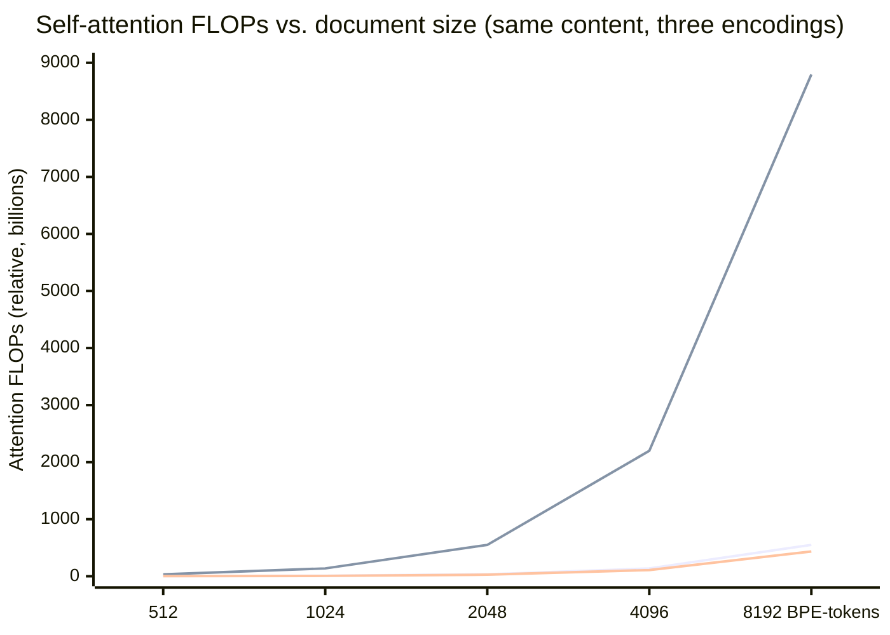
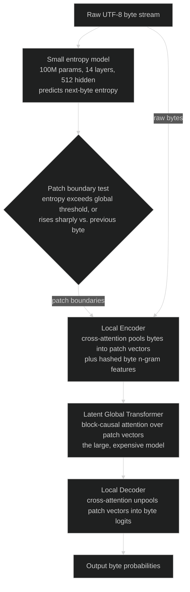

# Byte-Level & Tokenizer-Free Language Models: MEGABYTE, SpaceByte, and the Byte Latent Transformer (BLT)

> Deepens the tokenization discussion in [Tokenization & Embeddings](README.md) — that module
> assumes a learned subword vocabulary (BPE/WordPiece/Unigram); this file covers what happens
> when a model gives that vocabulary up entirely. Cross-references
> [Foundations & Architecture](../foundations_and_architecture/README.md) for the standard
> Transformer block these architectures modify, and
> [State-Space Models & Linear Attention](../foundations_and_architecture/state_space_models_and_linear_attention.md)
> for a different sub-quadratic strategy (a fixed-size recurrent state) that this module's
> patch-based approach parallels at a different granularity.

---

## 1. Concept Overview

Byte-level and tokenizer-free language models operate directly on raw UTF-8 bytes instead of a
learned subword vocabulary. Where [Tokenization & Embeddings](README.md) covers how BPE,
WordPiece, and Unigram LM compress text into 32K-200K learned subword units, this file covers the
family of architectures that remove that compression step altogether: the model's only "vocabulary"
is the 256 possible byte values — fixed by the UTF-8 standard, not learned from any corpus.

Five concrete problems motivate escaping the tokenizer, and every one of them traces back to the
same root cause — a subword vocabulary is a **separate, frozen artifact**, trained once on one
corpus and then locked to a model that may see very different data for the rest of its life:

- **Out-of-vocabulary risk** — classic word-level and even naive subword schemes can hit strings
  they have no representation for; byte-level BPE (GPT-2 onward) patches this with a 256-value
  byte fallback, but the deeper problem below remains.
- **Multilingual inequity** — a BPE merge table trained on an English-heavy corpus gives English
  ~1.3 tokens/word while Thai or Arabic can run 3-5x higher (README.md Section 7) — the vocabulary
  itself encodes which languages the tokenizer's training data favored.
- **Glitch tokens** — a vocabulary entry that appeared often enough in the *tokenizer's* training
  corpus to earn a merge, but rarely or never in the *model's* training corpus, ships with an
  almost randomly-initialized embedding (the `SolidGoldMagikarp` phenomenon, Section 7).
- **Brittleness to typos and noise** — BPE segmentation is a greedy, frequency-driven process, so
  one inserted or swapped character can shatter a word into a completely different, much
  less-trained token sequence (Section 6, Section 10).
- **The tokenizer as a separate frozen artifact** — a BPE vocabulary is trained once, often by a
  different team on a different snapshot of data than the model itself, then locked for the
  model's entire life; expanding or fixing it later means retraining embeddings (README.md
  Section 12), not just editing a config file.

The byte-level family removes the artifact category entirely — there is no vocabulary to train,
version, or audit — but that removal is not free: raw byte sequences run roughly 4x longer than
BPE-token sequences for English text, and self-attention cost is quadratic in sequence length. The
architectures in this file (**byte-level BPE**, **ByT5**, **MEGABYTE**, **SpaceByte**, and the
**Byte Latent Transformer, BLT**) are best understood as successive answers to a single question:
*given that bytes are the only vocabulary you can trust, how do you keep the compute bill under
control?* The answer that has scaled furthest, BLT (Meta, December 2024), matches a FLOP-matched
BPE-Transformer baseline's quality at 8B parameters while using up to 50% fewer FLOPs at inference,
by patching bytes dynamically based on how predictable they are.

---

## 2. Intuition

> **One-line analogy**: A subword tokenizer hands the model a phrasebook compiled in advance from
> one snapshot of the world's text; a byte-level model gets only the alphabet, and has to decide —
> fresh, every time, from the actual content in front of it — where one "word" ends and the next
> begins.

**Mental model**: think of the 256 byte values as a fixed, universal alphabet that never needs to
be re-learned, re-versioned, or re-audited — unlike a 32K-200K subword vocabulary, which is a
snapshot of whatever corpus happened to train it. The cost of that universality is granularity:
where a BPE tokenizer might spend one token on the whole word "tokenization," a byte-level model
starts by seeing 13 individual bytes. The architectures in this file exist to buy back that
granularity — not by learning a vocabulary again, but by dynamically grouping bytes into "patches"
based on how much computation that stretch of text actually needs.

**Why it matters — concrete numbers**: a common rule of thumb (OpenAI's own tokenizer
documentation) puts English text at roughly 4 bytes per BPE token. A 2048-BPE-token document is
therefore about 8,192 raw bytes. Since self-attention cost scales with the *square* of sequence
length, running that same document through a naive byte-level Transformer multiplies attention
FLOPs by roughly `(4x)^2 = 16x` — not a rounding error, a full order of magnitude (Section 6.2
derives this exactly: 34,359,738,368 relative FLOPs for the BPE-token version versus
549,755,813,888 for the naive byte version). Every architecture in Section 4 is a different answer
to clawing that 16x back down.

**Key insight**: patching a byte stream and maintaining a fixed-size recurrent state (the
[State-Space Models](../foundations_and_architecture/state_space_models_and_linear_attention.md)
sibling file) are the same underlying move at different granularities — both compress a long raw
sequence into a shorter *derived* sequence before paying the expensive part of the computation.
An SSM compresses the entire history into one constant-size state; a patch-based byte model
compresses a handful of bytes into one patch vector, then still runs full, quadratic attention —
just over the much shorter sequence of patches, not the original bytes.

---

## 3. Core Principles

- **The vocabulary is fixed by definition, not by training.** 256 possible byte values (plus a
  handful of special/sentinel tokens in some schemes) cover every string in every language,
  because UTF-8 itself is the vocabulary — there is no merge table to learn, version, or lose sync
  with the model's training data.
- **Zero out-of-vocabulary, unconditionally.** Byte-level BPE (Section 4) already gets this via a
  256-symbol fallback layer; genuinely tokenizer-free models (ByT5, MEGABYTE, BLT) get it more
  directly, because bytes are the *only* unit — there is nothing above them that could be missing.
- **Raw byte sequences are expensive: roughly 4x longer than BPE-token sequences for English**, and
  attention cost is quadratic, so naive byte-level modeling is a real regression, not a free
  simplification (Section 2, Section 6.2).
- **Patching amortizes that cost.** Group multiple bytes into one "patch" representation before
  the expensive global-attention step; a cheap local model absorbs the raw byte count so the
  global model only ever has to attend over the (much shorter) sequence of patches.
- **Patch granularity is a design axis, not a fixed choice.** Fixed-size (MEGABYTE: constant `P`
  bytes per patch), heuristic-boundary (SpaceByte: cut at word/space boundaries), and
  learned/dynamic (BLT: cut wherever a small model's predicted next-byte entropy spikes) are three
  different answers to "where should a patch end?" (Section 4, Section 8.2).
- **FLOP allocation should follow predictability, not position.** BLT's central bet: spend a full
  step of expensive global computation only where the byte stream is genuinely hard to predict —
  glide through predictable runs (repeated words, indentation, common code idioms) with long
  patches and cheap local computation instead.
- **Robustness is architectural, not incidental.** Because the model reasons over the literal byte
  sequence, character-level perturbations (typos, unusual spacing, novel words, transliteration)
  stay local disturbances instead of cascading into a completely different token segmentation
  (Section 6, Section 10).

---

## 4. Types / Architectures / Strategies

| Architecture | Year / Org | Mechanism | Notes |
|---|---|---|---|
| **Byte-level BPE** | 2019, OpenAI (GPT-2, Radford et al.) | BPE merges learned over a fixed 256-value base byte vocabulary — byte-*safe*, not tokenizer-*free* | Vocab 50,257 (256 base + 50,000 merges + 1 special token); guarantees zero OOV; still a frozen, corpus-trained merge table (glitch-token risk, Section 7) |
| **ByT5** | 2021, Google (Xue et al.) | Genuinely tokenizer-free: a T5 encoder-decoder reads and writes raw UTF-8 bytes, no merge table at all | `vocab_size` 384 (256 byte values + special/sentinel tokens); encoder 3x deeper than decoder (byt5-small: 12 vs. 4 layers); ~20-byte span-corruption masking (vs. mT5's ~3-token spans) |
| **MEGABYTE** | 2023, Meta (Yu et al., NeurIPS) | Multiscale decoder: a small **local** model within each patch + a large **global** model between patches, **fixed** patch size `P` | `P=8` (text), `P=12`-`192` (images), `P=32` (audio); reduces total self-attention complexity to `O(N^(4/3))`; FFN cost amortized across `P` bytes (Section 6) |
| **SpaceByte** | 2024, Slagle | Byte-level Transformer with extra large "global" blocks inserted only at word/space boundaries, not a fixed interval | Roughly matches subword-Transformer quality on English books, LaTeX, and code; documented to degrade on space-free scripts (Chinese) |
| **BLT (Byte Latent Transformer)** | 2024, Meta (Pagnoni et al.) | Local encoder + latent global transformer + local decoder; patch boundaries set **dynamically** by a small learned entropy model, not a fixed size or a hard-coded delimiter | Entropy model: 100M params, 14 layers, 512 hidden dim, 512-byte sliding window; average patch ~4.5 bytes (entropy) vs. ~6.1 bytes (space-based); matches a FLOP-matched BPE-Transformer baseline at 8B params / ~4.5T bytes with up to 50% fewer inference FLOPs |

### 4.1 Two Design Axes, Not One

It helps to separate two questions these five architectures answer differently:

- **Is the vocabulary actually gone, or just made byte-safe?** Byte-level BPE keeps a learned merge
  table on top of the byte alphabet (still a frozen, corpus-trained artifact — Section 7's glitch
  tokens can still happen). ByT5, MEGABYTE, SpaceByte, and BLT remove the merge table entirely —
  the model reads and writes bytes directly, with no learned vocabulary layer in between.
- **How are patch boundaries chosen, given that bytes alone are too fine-grained to attend over
  efficiently?** MEGABYTE uses a constant size `P`; SpaceByte uses a content heuristic (word
  boundaries); BLT uses a learned, per-byte predictability signal (entropy). This axis is
  independent of the first — you could imagine (though no major released model does) a
  byte-level-BPE-vocabulary model with entropy-based patching layered on top.

BLT is the current frontier because it answers both questions in the more general way: no learned
vocabulary, and patch boundaries chosen by measured difficulty rather than a fixed rule.

---

## 5. Architecture Diagrams

### 5.1 The Compute Problem: Naive Bytes vs. Patched Bytes



Bottom line: BPE-token baseline (2048 attention positions for a 2048-token document). Middle line:
naive byte-level attention with no patching — the same document is ~4x more bytes, and attention
cost is quadratic, so FLOPs are ~16x higher at every point. Top-looking-but-actually-lowest line at
each x: entropy-patched bytes at BLT's measured ~4.5-bytes/patch average — this lands *below* the
token baseline (~21% fewer attention FLOPs), because the average patch is slightly larger than
BPE's own ~4-bytes/token fertility. Patching does not merely fix the byte penalty — at BLT's
measured patch size, it can undercut the original tokenized cost (Section 6.2/6.3 derive the exact
numbers; this chart is attention-only and illustrative — real total-FLOP comparisons are in
Section 7).

### 5.2 BLT Pipeline



The entropy model is small and cheap on purpose (100M params vs. billions in the main model) — its
only job is deciding *where* to cut, not carrying the model's actual knowledge. All of the
expensive reasoning happens in the latent global transformer, which never sees a raw byte — only
patch vectors the local encoder has already pooled.

### 5.3 Entropy-Based Patch Boundaries (Illustrative)

```
bytes      t h e _ c a t _ s a t _ o n _ t h e _ m a t .
entropy    1 0 0 1 8 1 0 1 7 1 0 1 6 1 1 6 0 0 1 8 1 0 0
cut?               ^       ^       ^     ^       ^
           (^ = entropy at/above threshold -> a NEW patch starts here)

patches    [the_][cat_][sat_][on_][the_][mat.]
           6 patches over 23 bytes, avg 3.83 bytes/patch in this toy walk
           through (illustrative entropy values -- BLT's measured average
           on real text is ~4.5 bytes/patch under its learned entropy model)
```

`_` marks a literal space byte. The entropy row is illustrative (0-9 scale standing in for the
model's real bits-of-entropy output), but the shape is the real mechanism: low, flat entropy runs
through the middle of a familiar word, a sharp spike at the first byte of a new, less-predictable
word — and BLT's global constraint (Section 3.4 of the paper) cuts a patch exactly there.

### 5.4 Fixed-Size (MEGABYTE) vs. Entropy-Based (BLT) Patching, Same Bytes

```
fixed P=4  [the_][cat_][sat_][on_t][he_m][at.]
entropy    [the_][cat_][sat_][on_][the_][mat.]
```

Fixed-size patching cuts blindly every 4 bytes regardless of content: `on_the_mat.` gets sliced
into `on_t`, `he_m`, `at.` — a patch boundary lands in the middle of "the" and again in the middle
of "mat," splitting predictable runs for no reason. Entropy-based patching (same illustrative
string as Section 5.3) lands its cuts at the actual word transitions instead, because that is
where the underlying entropy signal spikes — this is the concrete difference between "spend
compute uniformly" and "spend compute where the content demands it" (Section 8.2).

---

## 6. How It Works — Detailed Mechanics

### 6.1 The Byte-to-Unicode Bijection (a GPT-2 Implementation Detail)

GPT-2's byte-level BPE (Section 4) has a subtle implementation wrinkle worth knowing: the standard
BPE training/merge code assumes its input consists of printable, whitespace-splittable characters,
but 68 of the 256 raw byte values (control characters, the literal space byte, etc.) are not safely
printable. Radford et al.'s fix is a **reversible lookup table** that maps each of the 256 raw byte
values to a "safe" printable Unicode code point before any BPE merge logic runs, and maps back on
decode:

```python
from __future__ import annotations


def bytes_to_unicode() -> dict[int, str]:
    """GPT-2's byte<->unicode bijection (Radford et al., 2019). Maps every
    one of the 256 possible byte values to a printable, whitespace-safe
    Unicode character, so the BPE merge code (written assuming printable
    input) can run over ANY byte, including control characters and raw
    space bytes, without special-casing them."""
    safe_bytes = (
        list(range(ord("!"), ord("~") + 1))
        + list(range(ord("\xa1"), ord("\xac") + 1))
        + list(range(ord("\xae"), ord("\xff") + 1))
    )
    mapping = dict(zip(safe_bytes, safe_bytes))
    next_free_codepoint = 2**8
    for b in range(2**8):
        if b not in mapping:
            mapping[b] = next_free_codepoint
            next_free_codepoint += 1
    return {b: chr(cp) for b, cp in mapping.items()}
```

This is why a raw GPT-2/GPT-4 tokenizer dump looks like it contains odd characters (`Ġ` for a
leading space, for example) — those are byte values 0-255 rendered through this bijection, not
actual Unicode content the model was trained on.

### 6.2 BROKEN: Naive Full Attention Over Raw Bytes

```python
from __future__ import annotations


def attention_flops(seq_len: int, d_model: int = 4096) -> float:
    """Rough self-attention FLOPs for one layer: QK^T and softmax@V are
    each roughly seq_len x seq_len x d_model matmuls."""
    return 2 * seq_len ** 2 * d_model


# BROKEN: the "obvious" tokenizer-free design -- widen the embedding table
# to 256 rows and run a standard decoder-only Transformer directly over
# raw UTF-8 bytes, with NO patching of any kind.
def broken_naive_byte_transformer_cost(num_bytes: int, d_model: int = 4096) -> float:
    return attention_flops(num_bytes, d_model)   # full O(n^2) over every byte


bpe_token_count = 2048                       # a typical 2048-BPE-token document
naive_byte_count = bpe_token_count * 4       # ~4 bytes/BPE-token for English (README.md Sec 6)

bpe_cost = attention_flops(bpe_token_count)
naive_cost = broken_naive_byte_transformer_cost(naive_byte_count)

print(f"BPE-token attention FLOPs:  {bpe_cost:,.0f}")
print(f"Naive byte attention FLOPs: {naive_cost:,.0f}  ({naive_cost / bpe_cost:.1f}x more)")
# BPE-token attention FLOPs:  34,359,738,368
# Naive byte attention FLOPs: 549,755,813,888  (16.0x more)
#
# Same document, same information content -- 16x the self-attention compute,
# purely from feeding the model raw bytes with no patching whatsoever.
```

**What this actually says.** "Attention charges you for every *pair* of positions, so a sequence
that is 4x longer costs 16x — the length penalty is squared, not linear."

The `4x` comes from English text and BPE fertility; the squaring comes from attention itself. A
byte-level model inherits both, and the second one is what turns an annoyance into a blocker.

| Symbol | What it is |
|--------|------------|
| `seq_len` | Number of positions attended over — BPE tokens in one encoding, raw bytes in the other |
| `seq_len ** 2` | Every position attending to every other; the term that punishes long sequences |
| `d_model` | Width of each position's vector, `4096` here. Scales cost linearly, not quadratically |
| `2 *` | Two matmuls per attention layer: `QK^T`, then `softmax(...) @ V` |
| `bpe_token_count * 4` | ~4 bytes per BPE token for English — the fertility figure from README.md Sec 6 |

**Walk one example.** One 2048-BPE-token document, encoded two ways:

```
  encoding                positions    positions^2      x 2 x d_model (4096)
  BPE tokens                  2,048      4,194,304           34,359,738,368
  raw UTF-8 bytes             8,192     67,108,864          549,755,813,888

  length ratio :  8,192 / 2,048                          =   4.0x
  FLOP ratio   :  549,755,813,888 / 34,359,738,368       =  16.0x   (= 4.0^2)
```

The document did not get harder, longer, or more informative — only its *encoding* changed, and
the bill went up 16-fold. That single squared term is why every architecture in Section 4 exists.

### 6.3 FIX, Part 1: Fixed-Size Patching (MEGABYTE-Style)

```python
import math
import torch
import torch.nn as nn


class FixedSizePatcher(nn.Module):
    """MEGABYTE-style local/global split with a FIXED patch size P
    (Section 4). Every P bytes become one patch regardless of content --
    simple and fast to implement, but blind to whether those P bytes were
    predictable or not (Pitfall 10.2, Section 8.2)."""

    def __init__(self, d_local: int = 512, d_global: int = 4096, patch_size: int = 8) -> None:
        super().__init__()
        self.patch_size = patch_size
        self.byte_embed = nn.Embedding(256, d_local)
        # Local model: cheap, operates WITHIN each patch (P positions only).
        self.local = nn.TransformerEncoderLayer(d_local, nhead=8, batch_first=True)
        # Pool P local byte vectors into ONE patch vector for the global model.
        self.pool = nn.Linear(d_local * patch_size, d_global)
        # Global model: expensive, operates BETWEEN patches (T/P positions).
        self.global_layer = nn.TransformerEncoderLayer(d_global, nhead=16, batch_first=True)

    def forward(self, byte_ids: torch.Tensor) -> torch.Tensor:
        """byte_ids: (seq_len,); seq_len must be a multiple of patch_size
        in this simplified reference version (production code pads)."""
        seq_len = byte_ids.size(0)
        num_patches = seq_len // self.patch_size

        x = self.byte_embed(byte_ids).unsqueeze(0)                  # (1, seq_len, d_local)
        x = self.local(x)                                           # cheap, within-patch attention
        x = x.reshape(1, num_patches, self.patch_size * x.size(-1))
        patches = self.pool(x)                                      # (1, num_patches, d_global)

        return self.global_layer(patches)     # EXPENSIVE step: T/P positions, not T


def attention_flops(seq_len: int, d_model: int = 4096) -> float:
    return 2 * seq_len ** 2 * d_model


def patched_total_cost(num_bytes: int, patch_size: float, d_local: int = 512, d_global: int = 4096) -> float:
    num_patches = math.ceil(num_bytes / patch_size)
    global_cost = attention_flops(num_patches, d_global)  # quadratic, but over num_patches only
    local_cost = 2 * num_bytes * d_local                  # local model: linear in byte count
    return global_cost + local_cost


bpe_cost = attention_flops(2048)
patched_cost = patched_total_cost(num_bytes=8192, patch_size=4.5)   # BLT's measured avg patch
print(f"Patched byte total FLOPs:  {patched_cost:,.0f}  ({patched_cost / bpe_cost:.2f}x vs BPE baseline)")
# Patched byte total FLOPs:  27,143,569,408  (0.79x vs BPE baseline)
#
# The expensive quadratic term is now paid on ~1,820 patches, not 8,192
# bytes -- global attention compute comes back down to BELOW BPE-token
# territory (~21% cheaper), while the model still reads and writes raw,
# tokenizer-free bytes.
```

The attention term is only half the story. MEGABYTE's paper states the *whole* training cost of
the local/global split as `2T(m_g/P + m_l)` FLOPs, versus a flat Transformer's `2mT`:

```
  MEGABYTE  :  2 * T * (m_g / P  +  m_l)
  flat      :  2 * T *  m
```

**The idea behind it.** "Run the big model once per patch instead of once per byte, and its cost
per byte drops by exactly the patch size — so for the same compute budget you can afford a global
model `P` times larger."

| Symbol | What it is |
|--------|------------|
| `T` | Total bytes in the sequence |
| `P` | Patch size — how many bytes the local model absorbs per one global step |
| `m_g` | Parameters in the global model: the large, expensive one, run once per patch |
| `m_l` | Parameters in the local model: the small, cheap one, run at every byte |
| `m_g / P` | The amortization — the entire architectural payoff lives in this division |
| `2 *` | Standard forward-pass FLOPs per parameter per position |

**Walk one example.** Section 7's actual MEGABYTE configuration (1.3B global, 218M local, `P=8`)
against Section 7's own 350M flat dense Transformer baseline, on a per-byte basis:

```
  global, amortized  :  1,300,000,000 / 8      =    162,500,000
  local, every byte  :                              218,000,000
  sum of params paid per byte                  =    380,500,000
  x 2 FLOPs/param                              =    761,000,000  FLOPs per byte

  flat 350M dense    :  2 x 350,000,000        =    700,000,000  FLOPs per byte

  compute ratio      :  761,000,000 / 700,000,000        =  1.087x
  parameter ratio    :  1,518,000,000 / 350,000,000      =  4.34x
```

4.34x the parameters for 1.087x the per-byte compute. That gap is the architecture's entire return,
and it is exactly why Section 7's 1.3B/218M MEGABYTE beats a 350M dense model on bits-per-byte
(0.991 vs. 1.064) while *also* generating 40% faster.

**What breaks without the `/P`.** Set `P = 1` — no patching, the global model runs at every byte —
and the same 1.518B parameters cost `2 x 1,518,000,000 = 3,036,000,000` FLOPs per byte, which is
`3,036,000,000 / 700,000,000 = 4.34x` the flat baseline instead of `1.09x`. The divide-by-`P` is
not an optimization bolted onto MEGABYTE; it *is* MEGABYTE.

### 6.4 FIX, Part 2: Entropy-Based Dynamic Patching (BLT-Style)

```python
import torch
import torch.nn as nn


class ByteEntropyModel(nn.Module):
    """BLT's small entropy model: 100M params, 14 layers, hidden dim 512,
    512-byte sliding-window attention (the paper's exact configuration).
    Its ONLY job is estimating how hard the next byte is to predict -- it
    is not the main model, and it is not where BLT's knowledge lives."""

    def __init__(self, vocab_size: int = 256, d_model: int = 512, n_layers: int = 14) -> None:
        super().__init__()
        self.embed = nn.Embedding(vocab_size, d_model)
        layer = nn.TransformerEncoderLayer(d_model, nhead=8, batch_first=True)
        self.layers = nn.TransformerEncoder(layer, num_layers=n_layers)
        self.head = nn.Linear(d_model, vocab_size)

    def next_byte_entropy(self, byte_ids: torch.Tensor) -> torch.Tensor:
        """byte_ids: (seq_len,) values 0-255. Returns per-position entropy
        H(x_t) = -sum_v p(v) log p(v) of the predicted next-byte
        distribution -- high H means 'the model has no idea what comes
        next,' which is exactly where a patch boundary should go."""
        x = self.embed(byte_ids).unsqueeze(0)                        # (1, seq_len, d_model)
        mask = nn.Transformer.generate_square_subsequent_mask(x.size(1))
        hidden = self.layers(x, mask=mask)         # production: fused 512-byte sliding window
        probs = torch.softmax(self.head(hidden).squeeze(0), dim=-1)  # (seq_len, 256)
        return -(probs * torch.log(probs.clamp_min(1e-9))).sum(dim=-1)


def dynamic_patch_boundaries(
    entropy: torch.Tensor,
    global_threshold: float = 1.5,
    monotonic_threshold: float = 0.5,
) -> list[int]:
    """BLT's two patch-boundary rules, OR'd together (the paper's Section
    3.4): a GLOBAL constraint (H(x_t) > global_threshold) and an
    APPROXIMATE MONOTONIC constraint (H(x_t) - H(x_{t-1}) > monotonic_threshold),
    so a patch also ends when entropy jumps sharply even without crossing
    the absolute threshold yet. Returns the byte indices where a new patch
    starts."""
    boundaries = [0]
    for t in range(1, len(entropy)):
        crosses_global = entropy[t].item() > global_threshold
        rises_sharply = (entropy[t] - entropy[t - 1]).item() > monotonic_threshold
        if crosses_global or rises_sharply:
            boundaries.append(t)
    return boundaries


def group_bytes_into_patches(byte_ids: torch.Tensor, boundaries: list[int]) -> list[torch.Tensor]:
    """Turn boundary INDICES into actual variable-length groups of byte
    ids -- BLT's patches, versus FixedSizePatcher's constant-P groups
    (Section 6.3). Each group is pooled by the local encoder's
    cross-attention exactly like FixedSizePatcher.pool, just with variable
    length instead of a fixed patch_size."""
    ends = boundaries[1:] + [len(byte_ids)]
    return [byte_ids[s:e] for s, e in zip(boundaries, ends)]
```

The two boundary rules, written out:

```
  global constraint      :  H(x_t)  >  1.5 bits
  monotonic constraint   :  H(x_t) - H(x_{t-1})  >  0.5 bits
  cut a new patch if EITHER holds
```

**Read it like this.** "Start a new patch when the next byte is genuinely hard to guess — either
it is hard in absolute terms, or it just got sharply harder than the byte right before it."

| Symbol | What it is |
|--------|------------|
| `H(x_t)` | Entropy, in bits, of the entropy model's predicted next-byte distribution at position `t` |
| `global_threshold` | The absolute difficulty bar, `1.5` bits. Cross it and a patch always ends |
| `H(x_t) - H(x_{t-1})` | The *change* in difficulty from one byte to the next |
| `monotonic_threshold` | Jump size that triggers a cut, `0.5` bits, even while still under the bar |
| `or` | The two rules are OR'd, not AND'd — either one alone is sufficient |

**Walk one example.** Eleven bytes, their entropies in bits, both rules evaluated at every step:

```
  t              0     1     2     3     4     5     6     7     8     9    10
  H            0.4   0.2   0.1   2.1   0.3   0.2   0.1   1.9   0.6   1.4   0.2
  dH             -  -0.2  -0.1  +2.0  -1.8  -0.1  -0.1  +1.8  -1.3  +0.8  -1.2

  H > 1.5 ?                      YES                     YES
  dH > 0.5 ?                     YES                     YES         YES

  boundaries at t = 0, 3, 7, 9
  4 patches over 11 bytes  ->  11 / 4 = 2.75 bytes per patch
```

**Why the monotonic rule exists.** Look only at `t = 9`: entropy is `1.4`, which never crosses the
`1.5` global bar, so the absolute rule would have swallowed that byte into the patch that began at
`t = 7`. The `+0.8` jump catches it anyway. Without that second rule, a stretch of steadily-rising
difficulty that never quite tops the threshold rides inside one long patch and receives a single
global step it cannot afford — precisely the failure mode fixed-size patching has by construction
(Pitfall 10.2).

Scaling that to real text: BLT measures ~4.5 bytes/patch under its learned entropy model, so the
8,192-byte document from Section 6.2 becomes `8,192 / 4.5 = 1,820.4` patch positions against 2,048
BPE tokens — `1,820.4 / 2,048 = 0.89x` the sequence the expensive model attends over. The 4x
inflation from Section 6.2 is not merely cancelled; it is inverted.

### 6.5 Hash N-Gram Embeddings (BLT's Cheap Local-Context Trick)

```python
import torch


def hash_ngram_feature(byte_window: torch.Tensor, table_size: int = 2 ** 16, base: int = 257) -> int:
    """Rolling polynomial hash of a short byte n-gram (BLT uses n=3..8),
    mapped into a small fixed-size embedding table and added to the
    byte's own embedding. No training, no vocabulary to maintain -- unlike
    a learned subword merge table, hashing adds local-context signal
    without reintroducing any of Section 1's frozen-artifact problems."""
    h = 0
    for b in byte_window.tolist():
        h = (h * base + b) % table_size
    return h
```

### 6.6 The Vocabulary Tax Runs the Other Way

Sequence length is the cost byte-level models pay. The embedding table is the cost they *avoid*,
and it is worth sizing, because it moves in the opposite direction:

```
  input embedding table   :  V x d_model
  output (unembedding)    :  V x d_model        (untied)
  total parameters        :  2 x V x d_model
  logit FLOPs per position:  2 x d_model x V
```

**Stated plainly.** "Every vocabulary entry buys a learned vector of width `d_model`, and you pay
for it twice — once reading tokens in, once scoring them on the way out."

| Symbol | What it is |
|--------|------------|
| `V` | Vocabulary size: `256` for raw bytes, `128,000` for a modern BPE tokenizer |
| `d_model` | Model width, `4096` — Section 6.2's default, reused here |
| `V x d_model` | The input embedding table: one learned vector per vocabulary entry |
| `2 x V x d_model` | Input embedding plus a separate, untied output projection |
| `2 x d_model x V` | FLOPs to turn one position's hidden vector into logits over the vocabulary |

**Walk one example.** Four real vocabularies from this file, at `d_model = 4096`:

```
  vocabulary                        V     embed + unembed params (2 x V x 4096)
  raw bytes (MEGABYTE, BLT)       256                            2,097,152
  ByT5 (bytes + sentinels)        384                            3,145,728
  GPT-2 byte-level BPE         50,257                          411,705,344
  modern 128K BPE             128,000                        1,048,576,000

  saved by dropping the vocabulary:
    1,048,576,000 - 2,097,152        =  1,046,478,848 parameters
    1,046,478,848 / 8,000,000,000    =  13.08% of an 8B model's budget
```

Now the output projection over one whole document, where the byte model's 4x position count fights
its 500x smaller vocabulary head-on:

```
  128K BPE :   2,048 positions x 2 x 4096 x 128,000  =  2,147,483,648,000 FLOPs
  256 byte :   8,192 positions x 2 x 4096 x     256  =     17,179,869,184 FLOPs

  ratio    :   2,147,483,648,000 / 17,179,869,184    =  125x cheaper for bytes
```

Four times as many positions, but each one scored against `128,000 / 256 = 500` times fewer
candidates, nets out `500 / 4 = 125x` in the byte model's favor. So the byte-level trade is not
uniformly worse and then patched back to parity: it is 16x *worse* in attention (Section 6.2), 125x
*better* at the output layer, and it hands back roughly 13% of an 8B parameter budget to spend on
actual layers instead of a lookup table.

**Concrete numbers, tied together**: at 8,192 raw bytes (the ~2048-BPE-token document from
Section 6.2), naive per-byte attention costs 549,755,813,888 relative FLOPs versus the BPE
baseline's 34,359,738,368 — 16.0x more. Patching at BLT's measured ~4.5-bytes/patch average brings
the global-attention term back down to about 27.1 billion (Section 6.3) — roughly 21% *cheaper*
than the BPE baseline, because the average patch (4.5 bytes) is slightly larger than BPE's own
~4-byte-per-token fertility. Patching does not just fix the byte penalty; at BLT's measured patch
size it turns bytes into the cheaper option.

---

## 7. Real-World Examples

- **GPT-2 / GPT-3 / GPT-4 (OpenAI)** — byte-level BPE with a 50,257-entry vocabulary (256 base
  bytes + 50,000 merges + 1 special token); guarantees zero OOV, but the frozen merge table still
  produced **glitch tokens**: `SolidGoldMagikarp` entered GPT-2/GPT-3's vocabulary because it
  appeared often in the *tokenizer's* training corpus (scraped Reddit data) but almost never in
  the *model's* own training corpus, leaving its embedding near its random initialization and
  triggering erratic completions whenever it appeared in a prompt. GPT-4's `cl100k_base` tokenizer
  happens to split the same string into five ordinary, well-trained tokens
  (`" Solid"`, `"Gold"`, `"Mag"`, `"ik"`, `"arp"`), incidentally fixing this specific case without
  removing the underlying risk class.
- **ByT5 (Google, 2021)** — genuinely tokenizer-free T5 encoder-decoder; `vocab_size` 384 confirmed
  in the released `google/byt5-small` config, with encoder depth 12 and decoder depth 4 (exactly
  the paper's "encoder is 3x deeper than the decoder" ratio); pretrained with span-corruption
  masking spans of ~20 bytes at a time (vs. mT5's ~3-token spans), aimed squarely at
  multilingual and noisy-text robustness without a trained vocabulary.
- **MEGABYTE (Meta, 2023 NeurIPS, Yu et al.)** — at a 400B-byte-trained, 8,192-byte context, scored
  **36.4** word-level perplexity on PG-19 book generation, versus 88.8 for a byte-level PerceiverAR
  and 69.4 for a byte-level vanilla Transformer (limited to 2,048-byte context by memory) — closing
  most of the gap to the subword-based CompressiveTransformer's 33.6. On ImageNet 64x64, MEGABYTE
  matched PerceiverAR's state-of-the-art 3.40 bits-per-byte at half the compute; a 1.3B-global/
  218M-local MEGABYTE configuration generated **40% faster** than a standard 350M dense Transformer
  while also scoring a better bits-per-byte (0.991 vs. 1.064).
- **SpaceByte (2024, Slagle)** — inserts MEGABYTE-style large "global" blocks only after space
  characters instead of every fixed `P` bytes, on the intuition that a word's first byte is the
  hardest to predict; reported quality roughly matching subword Transformers on English books,
  arXiv LaTeX, and code, with an explicitly documented weakness on Chinese, which does not use
  whitespace to mark word boundaries.
- **BLT (Meta, December 2024, Pagnoni et al.)** — the first FLOP-controlled byte-level scaling
  study up to 8B parameters and 4T training bytes (code released at `facebookresearch/blt`). At the
  matched 8B-parameter / ~4.5T-byte comparison point: MMLU 57.4 vs. a BPE "Llama-3-architecture"
  baseline's 58.1, HumanEval 35.4 vs. 31.1 — while using **up to 50% fewer FLOPs at inference**.
  Robustness gap is the more striking result: Noisy HellaSwag 64.3 vs. 56.9, the character-
  manipulation CUTE benchmark 54.1 vs. 27.5 (roughly double), spelling-task accuracy 99.9%, and a
  +2-point overall FLORES-101 translation-into-English advantage on low-resource language pairs.

---

## 8. Tradeoffs

### 8.1 Byte-Level / Tokenizer-Free vs. Subword (BPE / WordPiece / Unigram)

| Dimension | Byte-Level / Tokenizer-Free | Subword (BPE/WordPiece/Unigram) |
|---|---|---|
| Vocabulary | Fixed 256 (or ~259-384) values, never trained | 32K-200K entries, trained on a specific corpus |
| Out-of-vocabulary | Impossible by construction | Solved for byte-level BPE variants; a real risk for schemes without byte fallback |
| Glitch-token risk | None — no learned vocabulary entry can go undertrained | Real and documented (`SolidGoldMagikarp`, Section 7) |
| Multilingual fairness | Every language costs the same 256-symbol alphabet | Fertility varies sharply by script (README.md Sec. 7: Thai ~3.8 tok/word vs. English ~1.3) |
| Robustness to typos/noise | High — a perturbed byte stays a perturbed byte | Fragile — one inserted character can produce a completely different token sequence |
| Raw sequence length | ~4x longer than BPE tokens for English, before patching | Shorter by design — the entire point of subword merging |
| Compute without patching | Prohibitive — ~16x the attention FLOPs (Section 6.2) | The baseline this column is compared against |
| Compute with patching | Competitive to better — BLT's patched cost undercuts BPE (Section 6.3) | — |
| Serving/tooling maturity | Newer, bespoke kernels; less quantization/speculative-decoding support (Section 9) | Mature — every major serving engine is built around it |

### 8.2 Patch Boundary Strategies: Fixed vs. Heuristic vs. Learned

| | Fixed-size (MEGABYTE) | Heuristic-boundary (SpaceByte) | Learned/dynamic (BLT) |
|---|---|---|---|
| Boundary rule | Every `P` bytes, always | After each space/word boundary | Wherever the entropy model predicts high next-byte uncertainty |
| Adapts to content difficulty | No — equal compute on predictable and hard regions | Partially — assumes word-initial bytes are hardest | Yes — directly measures predictability per byte |
| Language-agnostic | Yes (content-blind) | No — tied to whitespace-segmented scripts; weaker on Chinese | Architecturally yes — learns each language's own statistics |
| Extra model needed | No | No | Yes — a small (100M-param) entropy model in the critical path |
| Implementation complexity | Lowest | Low-medium | Highest |
| Measured quality vs. BPE baseline | Competitive at scale (Section 7's PG-19/ImageNet results) | Roughly matches on English/code/LaTeX | Matches or edges ahead at FLOP-matched 8B scale (Section 7) |

### 8.3 Byte-Level BPE (Still Tokenized) vs. Genuinely Tokenizer-Free

| | Byte-level BPE (GPT-2/GPT-4) | Genuinely tokenizer-free (ByT5, MEGABYTE, BLT) |
|---|---|---|
| Learned merge table | Yes | No |
| OOV guarantee | Yes (byte fallback) | Yes (bytes are the only unit) |
| Glitch-token risk | Yes — merge table can still be undertrained on rare strings | No — nothing left to be undertrained |
| Vocabulary maintenance | Ongoing — versioned, retrained per model family | None — vocabulary is fixed by the UTF-8 standard |
| Sequence length vs. subword | Comparable (that is what the merges are for) | ~4x longer unless paired with patching |

---

## 9. When to Use / When NOT to Use

**Use byte-level / tokenizer-free (or a hybrid) when:**

- Multilingual or low-resource-script coverage matters more than shaving the last bit of latency,
  and you cannot retrain a subword tokenizer fast enough for new scripts or domains.
- Input is characteristically noisy — OCR output, transliterated text, mobile-keyboard typos,
  user-generated support tickets, or adversarial/obfuscated text (Section 14's case study).
- You want to structurally eliminate an entire incident category (glitch tokens,
  tokenizer/embedding-mismatch bugs, per-language fertility monitoring — README.md Section 14)
  rather than keep monitoring and firefighting it.
- Character-level tasks are a first-class requirement — spelling, code-identifier manipulation,
  counting or reversing characters, transliteration.
- Research or ablation settings where you specifically want to isolate "does the input
  representation matter" from every other architecture choice.

**Do NOT use pure byte-level / tokenizer-free architectures when:**

- Your serving stack's byte-level/patch-architecture support is not yet mature enough for your
  reliability bar — verify current vLLM/TensorRT-LLM/SGLang support before committing (the same
  caveat the
  [State-Space Models sibling file](../foundations_and_architecture/state_space_models_and_linear_attention.md)
  raises for Mamba/Jamba).
- Traffic is dominated by short, clean, high-resource-language text where a mature 128K-vocab BPE
  tokenizer already achieves ~1.3 tokens/word fertility — there is little headroom left to buy back.
- You lack the engineering budget to build and monitor a patching pipeline (or an entropy
  sub-model) instead of calling `AutoTokenizer.from_pretrained(...)`.
- Your latency budget has no room for an additional small model (BLT's entropy scorer) in the
  critical inference path, and you cannot precompute or cache its output.

---

## 10. Common Pitfalls

**10.1 BROKEN -> FIX: Naive Full Attention Over Raw Bytes**

The Section 6.2 pitfall in narrative form: treating "tokenizer-free" as "just widen the embedding
table to 256 rows and feed bytes into the same architecture." That naive design pays the full
`(4x)^2 = 16x` attention-FLOP penalty (549,755,813,888 vs. 34,359,738,368 relative FLOPs at a
2048-BPE-token-equivalent document) for zero benefit — the fix is always some form of patching
(Section 6.3/6.4), never a bare vocabulary swap.

**10.2 Fixed-Size Patches Waste Compute on Predictable Runs**

MEGABYTE's constant patch size `P` spends the same global-model compute on the third byte of a
common word as it does on the first byte of a rare one — Section 5.4's toy example shows a
fixed-`P=4` patcher slicing cleanly through the middle of "the" and "mat," wasting a boundary where
nothing hard is happening while potentially under-resourcing a genuinely hard transition that falls
mid-patch. This is not a bug to tune away with a different `P` — it is the structural tradeoff of
choosing simplicity over adaptivity, which is exactly what SpaceByte and BLT exist to improve on.

**10.3 SpaceByte's Space Heuristic Breaks on Non-Whitespace-Segmented Scripts**

SpaceByte's own reported results show performance degrading on Chinese text, which does not mark
word boundaries with spaces — its core assumption ("the byte after a space is the hardest to
predict") has nothing to say about scripts that never emit that signal. Treat SpaceByte's reported
quality numbers as English/code/LaTeX-scoped; verify separately on any space-free target language
before assuming the architecture transfers.

**10.4 Misreading FLOP-Matched Research Baselines as "Beats the Shipped Model"**

BLT's headline numbers (MMLU 57.4 vs. 58.1, HumanEval 35.4 vs. 31.1, "up to 50% fewer inference
FLOPs") compare against a BPE "Llama-3-architecture" baseline the *paper's own authors* trained at
a matched parameter count and matched training-FLOP budget — not the publicly released Llama 3 8B
checkpoint, which was trained on roughly 15 trillion tokens for production release. Both framings
are legitimate research findings, but they answer different questions; repeating "BLT beats
Llama 3" without the FLOP-matched qualifier overstates what was actually measured.

**10.5 The Entropy/Hashing Sub-Model Is a Real Production Dependency, Not Free Preprocessing**

BLT's entropy model is small (100M params) relative to an 8B main model, but it is still a real
forward pass sitting in the critical inference path, with its own latency, its own failure modes,
and its own monitoring surface — the same way the parent module's tokenizer needs an OOV/fertility
monitor (README.md Section 14), a patch-based byte model needs a "patch health" monitor (patch-size
distribution, entropy-model latency, degenerate all-one-byte-per-patch behavior under drift).

**10.6 Confusing Byte-Level BPE With Genuinely Tokenizer-Free Models**

GPT-2/GPT-4's byte-level BPE still has a learned, frozen merge table on top of the byte alphabet —
it can still produce a glitch token (Section 7), because the merge table, not just the byte
fallback layer, is what actually gets trained and can go out of sync with the model's own corpus.
Only the genuinely tokenizer-free family (ByT5, MEGABYTE, BLT) removes that entire risk category;
"byte-level" and "tokenizer-free" are not synonyms, and conflating them in an interview or a design
doc understates byte-level BPE's remaining exposure.

**10.7 Breaking a Multi-Byte UTF-8 Character Across a Patch or Model Boundary**

Most non-ASCII characters (essentially all CJK characters, many accented Latin characters, all
emoji) are 2-4 raw bytes in UTF-8. Custom patching or chunking code that slices a byte sequence
without respecting UTF-8 continuation-byte boundaries can produce a patch — or a truncated
generation — that is not valid UTF-8 on its own, which fails to decode or silently corrupts
downstream text. Any custom boundary logic (patch cuts, context-window truncation, streaming
chunk boundaries) must be UTF-8-boundary-aware, not just byte-count-aware.

**10.8 Assuming Patched Inference Eliminates Autoregressive Step Count**

BLT's local decoder still emits bytes one at a time within a patch — the per-byte step count for
byte-level decoding is essentially unchanged. What shrinks is *how often the expensive global
transformer runs*: once per patch (every ~4-8 bytes) instead of once per byte, which is where the
bulk of the FLOPs actually live (MEGABYTE's reported "40% faster generation," Section 7, is the
same distinction). Do not present patch-based inference savings as "fewer generation steps" — it
is "cheaper generation steps," a materially different claim.

---

## 11. Technologies & Tools

| Tool / Library | Role |
|---|---|
| tiktoken / GPT-2 byte-level BPE | The byte-safe (but still tokenized) baseline this file contrasts against |
| HuggingFace `transformers` — `ByT5Tokenizer`, `T5ForConditionalGeneration` | Reference tokenizer-free encoder-decoder (`google/byt5-small`/`base`/`large`/`xl`/`xxl`) |
| `facebookresearch/blt` (GitHub) | Meta's reference BLT implementation — entropy model, local encoder/decoder, latent global transformer |
| `lucidrains/MEGABYTE-pytorch` (GitHub) | Community PyTorch implementation of MEGABYTE's local/global split |
| `kjslag/spacebyte` (GitHub) | Reference SpaceByte implementation |
| PyTorch | Underlying framework for all reference code in this file |

```python
from transformers import AutoTokenizer, T5ForConditionalGeneration

tokenizer = AutoTokenizer.from_pretrained("google/byt5-small")
model = T5ForConditionalGeneration.from_pretrained("google/byt5-small")

# No merge table, no vocab file to download -- "tokenization" is just
# byte_value + 3 (ids 0-2 reserved for pad/eos/unk; vocab_size=384 total,
# confirmed in the released config: 12 encoder layers, 4 decoder layers).
inputs = tokenizer("Life is like a box of chocolates.", return_tensors="pt")
print(inputs["input_ids"][0][:5])   # tensor([79, 108, 105, 104, 35]) -- 'L'+3,'i'+3,'f'+3,'e'+3,' '+3
```

---

## 12. Interview Questions with Answers

**Q1: If you remove the tokenizer, does the model end up with no vocabulary at all?**
No — it swaps a huge trained vocabulary for a tiny fixed one: the 256 possible byte values, which
need no training and can never go out of date. A BPE/SentencePiece vocabulary (32K-200K entries)
is learned from a specific training corpus and frozen afterward, so it can drift out of sync with
whatever the model is actually trained or used on later — the root cause of glitch tokens (Q3).
The byte vocabulary is fixed by the UTF-8 standard itself, not learned from any corpus, so every
language and every input decomposes into the same 256 symbols with nothing to learn, version, or
audit. When you hear "tokenizer-free," read it as "vocabulary-free," not "preprocessing-free" —
genuinely tokenizer-free models still need a patching strategy (Section 4) to keep compute
under control.

**Q2: Doesn't removing the tokenizer also remove the sequence-length problem it was solving?**
No — it makes the sequence-length problem worse first: English text runs about 4 bytes per BPE
token, so a byte sequence is roughly 4x longer than the token sequence. Because self-attention
cost is quadratic in sequence length, a naive byte-level Transformer pays roughly `(4x)^2 = 16x`
the attention FLOPs of the token-based model for identical content (Section 6.2) — a full order of
magnitude, not a rounding error. This is why every serious byte-level architecture (MEGABYTE,
SpaceByte, BLT) pairs the byte vocabulary with some form of patching that shortens the sequence
the expensive global attention actually sees. Never evaluate "should we go byte-level" without also
answering "what is our patching strategy" — the vocabulary change and the compute fix are two
separate decisions.

**Q3: What is a "glitch token" like `SolidGoldMagikarp`, and why can't a genuinely tokenizer-free model have one?**
A glitch token is a BPE vocabulary entry that was almost never seen during model training, leaving
its embedding close to its random initialization and producing erratic completions when it appears.
`SolidGoldMagikarp` entered GPT-2/GPT-3's tokenizer because the tokenizer's own training corpus
(scraped Reddit data) contained the username often enough to earn a merge, while the model's actual
training corpus barely contained it — a mismatch between two training sets that should have stayed
in sync but did not. GPT-4's `cl100k_base` tokenizer happens to split the same string into five
ordinary, well-trained tokens (`" Solid"`, `"Gold"`, `"Mag"`, `"ik"`, `"arp"`), which incidentally
fixes this specific case without fixing the underlying risk. A genuinely tokenizer-free model
(ByT5, BLT) cannot have this failure mode by construction — there is no learned vocabulary entry
that could be undertrained, because there is no learned vocabulary at all.

**Q4: GPT-4's byte-level BPE already guarantees zero out-of-vocabulary tokens — so what problem is left for BLT, MEGABYTE, and ByT5 to solve?**
Byte-level BPE fixes the crash-on-unknown-input problem but keeps the vocabulary itself, and with
it every cost that vocabulary imposes. The 256-byte fallback guarantees any input is representable,
but the learned merge table on top of it is still trained on one corpus (English-heavy, mostly
clean prose), and still produces uneven fertility across languages, silent fragmentation of typos
and rare tokens, and the glitch-token risk of Q3. Genuinely tokenizer-free models remove the merge
table entirely, trading a small, fixed vocabulary for a sequence-length tax that patching
architectures (Section 4) exist specifically to pay down. In short: byte-level BPE solves "can this
string be encoded," while BLT/MEGABYTE/ByT5 also attack "is this string encoded efficiently and
fairly."

**Q5: A paper claims "BLT matches Llama 3 quality with fewer FLOPs" — is that the actual public Llama 3 model?**
No — it is a BPE-tokenized Transformer that the BLT authors trained themselves at matched
parameter counts and matched training FLOPs, not the publicly released Llama 3 checkpoint. BLT's
paper is a controlled scaling study (400M to 8B parameters) that trains its own
"Llama-3-architecture" BPE baseline on a matched compute budget specifically so the comparison
isolates the byte-vs-token variable from everything else — the real Llama 3 8B was trained on
roughly 15 trillion tokens for production release, a very different budget than the paper's
FLOP-matched research runs. The specific numbers researchers cite (MMLU 57.4 vs. 58.1, HumanEval
35.4 vs. 31.1 at the 8B / ~4.5T-byte scale) are real and useful for judging the architecture, but
they describe a research reimplementation, not a claim of beating the model currently serving
production traffic. Always check whether an architecture paper's baseline is "the same
architecture, our training run" versus "the actual shipped model" before repeating its headline
claim.

**Q6: How does BLT's entropy model actually decide where one patch ends and the next begins?**
A small byte-level language model predicts the probability distribution of the next byte, and BLT
cuts a new patch wherever that prediction is highly uncertain. Concretely, BLT computes the entropy
`H` of the model's predicted next-byte distribution at every position, then applies two rules: a
global constraint that starts a new patch whenever entropy exceeds a fixed threshold, and an
approximate monotonic constraint that starts a new patch whenever entropy jumps sharply relative to
the previous byte, even before crossing the global threshold. The entropy model itself is
deliberately small and cheap — 100M parameters, 14 layers, 512 hidden dimensions, sliding-window
attention over only 512 bytes of context — so its own overhead stays a small fraction of the main
model's cost. The practical effect (Section 5.3's toy example) is that predictable runs of bytes
get long patches while unpredictable transitions get their own short patch.

**Q7: What are BLT's three main components, and which one carries most of the compute?**
BLT has a local encoder, a latent global transformer, and a local decoder, and the global
transformer is deliberately where almost all the parameters and FLOPs live. The local encoder is a
lightweight transformer that uses cross-attention to pool a variable-length group of raw bytes into
a single patch vector, augmented with hashed byte n-gram features (`n=3` to `8`, via rolling
polynomial hashing, Section 6.5) so it has cheap access to local context before any attention
happens. The latent global transformer is the large, expensive model — it runs block-causal
attention over the much shorter sequence of patch vectors, exactly the sequence-length saving from
Section 6. The local decoder mirrors the encoder in reverse, using cross-attention to unpool each
patch vector back into byte-level logits, so the model still reads and writes raw bytes despite all
the expensive computation happening at patch granularity.

**Q8: How does MEGABYTE's local/global split change the complexity class of self-attention, and what is it exactly?**
MEGABYTE reduces total self-attention complexity from `O(N^2)` to `O(N^(4/3))` by splitting one
long sequence into a two-level hierarchy. A global model attends over `T/P` patch positions while a
local model attends within each patch over only `P` byte positions, and choosing patch size `P`
proportional to `N^(1/3)` balances the two costs to minimize their sum, yielding the `N^(4/3)`
total. This is a strictly better asymptotic than full `O(N^2)` attention for any large `N`, though
the real-world benefit depends heavily on the chosen `P` (Section 8.2) and on how much of the
original cost was attention versus feedforward layers to begin with (Q9). MEGABYTE's own
experiments push this to genuinely long sequences — 1,228,800 bytes for ImageNet 640x640
generation — that would be impractical for a flat Transformer to attend over directly.

**Q9: Why does MEGABYTE's feedforward-layer trick matter as much as its attention savings?**
Because at GPT-3 scale, over 98% of a Transformer's FLOPs go to the position-wise feedforward
layers, not to attention — so amortizing the FFN cost is where most of the win actually comes from.
A standard Transformer runs its feedforward layer once per token, so a layer with `m` parameters
costs roughly `m` FLOPs per token; MEGABYTE instead runs its (larger) global feedforward layer once
per *patch*, so a layer with `m*P` parameters costs the same `m*P` FLOPs, now amortized over `P`
bytes — the paper's own accounting gives MEGABYTE's training cost as roughly `2T(m_g/P + m_l)`
FLOPs versus a standard Transformer's `2mT`, where the `/P` term is precisely this amortization. In
effect, for the same per-byte compute budget, MEGABYTE can afford a global feedforward layer `P`
times larger than a flat Transformer's — a bigger capacity increase than the attention-complexity
change alone would suggest. When explaining these architectures, lead with the FFN argument, not
just the attention-complexity argument — it is the larger effect at realistic model scales.

**Q10: How does SpaceByte's patching strategy differ from MEGABYTE's, and why does it close more of the quality gap to subword models?**
SpaceByte places its expensive "global" transformer blocks at word boundaries (space characters)
instead of at a fixed byte interval, matching where prediction is actually hardest. MEGABYTE spends
its global-model compute uniformly every `P` bytes regardless of content, so a fixed 8-byte patch
lands in the middle of a highly predictable word just as often as at a genuinely hard transition;
SpaceByte's insight is that the first byte of a new word is usually much harder to predict than the
bytes that follow it, so triggering the expensive block after spaces concentrates compute where it
earns the most quality. On English books, LaTeX-formatted arXiv papers, and source code, SpaceByte
reported quality roughly matching subword-tokenized Transformers of similar size, closing most of
the gap MEGABYTE's fixed interval left open. The tradeoff is that SpaceByte's heuristic is
explicitly tied to whitespace-segmented scripts — the paper's own preliminary results show it
performing worse than subword models on Chinese, which does not use spaces between words
(Section 10.3).

**Q11: Why is ByT5's encoder built three times deeper than its decoder, and what does that trade away?**
Because ByT5 processes about four times as many positions as a subword model, and decoder cost is
paid once per generated byte, so a shallower decoder recovers most of that overhead. The released
`google/byt5-small` ships with 12 encoder layers and 4 decoder layers, exactly the paper's 3x
ratio, alongside a span-corruption pretraining objective that masks spans of about 20 bytes at a
time (versus mT5's roughly 3-token spans) so the corruption task still spans a comparable amount of
actual content. The tradeoff is that decoder *capacity*, not just decoder speed, shrinks — for
tasks that lean heavily on generation quality rather than encoding/understanding, a 3:1 depth ratio
may need re-tuning per task rather than treated as a universal constant. ByT5's total vocabulary is
a fixed 384 entries (256 byte values plus a small set of special and span-corruption sentinel
tokens) regardless of model size — unlike mT5's SentencePiece vocabulary, it never needs retraining
when the target language mix changes.

**Q12: What problem do BLT's "hash n-gram embeddings" solve, and how do they work without a learned vocabulary?**
They give the local encoder cheap access to short local context before any attention runs, without
needing a trained subword vocabulary to do it. For each byte position, BLT hashes the preceding
n-gram (for several values of `n` from 3 to 8 bytes) using a rolling polynomial hash into a
fixed-size embedding table, and adds that embedding to the byte's own embedding — so "the byte
after `t,h,e`" gets a different input representation than "the byte after `x,y,z`" even before the
local encoder's attention layers do any work. This is deliberately cheap: hashing has no training
cost and no vocabulary to maintain, unlike a learned subword merge table, so it adds local-context
signal without reintroducing any of Q1/Q3's frozen-artifact problems. It is best understood as a
feature-engineering shortcut for the local encoder specifically — the hashed features help the
cheap local model punch above its weight, while the expensive reasoning still happens in the latent
global transformer (Q7).

**Q13: At the 8B-parameter, FLOP-matched scale, how does BLT actually compare to a BPE baseline on quality and inference cost?**
Roughly on par on general knowledge, ahead on code generation, and meaningfully cheaper at
inference — BLT scored MMLU 57.4 versus the BPE baseline's 58.1, but HumanEval 35.4 versus 31.1.
Those numbers come from the paper's own 8B-parameter, compute-matched comparison (BLT trained on
about 4.5 trillion bytes against a BPE "Llama-3-architecture" baseline, Q5's caveat still applies),
and the same study reports BLT matching that baseline's training-FLOP-controlled performance while
using up to 50% fewer FLOPs at inference. The inference saving traces directly to Section 6/7's
mechanism, not a free lunch: the expensive global transformer runs once per patch (roughly every
4-8 bytes) rather than once per byte, so the FLOP reduction tracks the average patch size directly.
Quote the quality numbers and the inference-FLOP number together — citing only "BLT is cheaper"
without the matched-quality context, or only "BLT matches quality" without the FLOP number, each
tells half the story.

**Q14: BLT reports large robustness gains over BPE on tasks like noisy HellaSwag and the CUTE benchmark — why would a byte-level model be so much better at these specifically?**
Because those tasks probe character-level manipulation, and a subword tokenizer actively hides
characters from the model whenever they get merged into a larger token. BLT's reported numbers are
stark — 64.3 versus 56.9 on a noise-injected HellaSwag variant, and 54.1 versus 27.5 (roughly
double) on CUTE, a benchmark built around character-level insertion, deletion, and counting tasks.
A BPE model asked to reverse a word or count a letter inside it has to recover that information
indirectly, from statistical co-occurrence patterns baked into a token embedding it never sees
decomposed into characters; a byte-level model already operates at exactly the granularity the task
is asking about, so the task stops being an indirect inference problem. The same mechanism explains
BLT's reported spelling-task accuracy of 99.9% and its +2-point translation advantage into English
on low-resource FLORES-101 language pairs (Section 7) — anywhere a task cares about the literal
character sequence, removing the tokenizer removes a layer of obfuscation between the model and
the answer.

**Q15: Why does a single typo sometimes wreck a subword-tokenized model's understanding of an entire sentence, in a way a byte-level model handles gracefully?**
Because BPE segmentation is a greedy, corpus-frequency-driven process, so one inserted or swapped
character can cascade into a completely different token sequence for everything after it. "hello"
might be one common token while "helllo" (one typo) no longer matches any learned merge and
fragments into several rare subword pieces or individual bytes, none of which resemble the
embedding the model learned for the intended word — the model is not just seeing a noisy version of
"hello," it is seeing a structurally different, much less-trained sequence. A byte-level model has
no merge table to break: "helllo" is simply six bytes instead of five, each one a byte value the
model has seen constantly during training, so the perturbation stays local instead of cascading.
This is precisely the mechanism behind Q14's noisy-benchmark numbers, and it is why user-generated
text, OCR output, and mobile-keyboard typos are one of the strongest practical arguments for a
byte-level front end (Section 9, Section 14's case study).

**Q16: Does BLT's entropy-based patching generalize across languages better than SpaceByte's space-boundary heuristic?**
Architecturally, yes — entropy patching has no dependency on whitespace at all, while SpaceByte's
cut rule is defined in terms of the space character. SpaceByte explicitly cuts after spaces because
word-initial bytes tend to be hardest to predict in space-segmented languages, but that rule has
nothing to say about Chinese, Japanese, or Thai text that does not mark word boundaries with
whitespace, and the paper itself reports weaker performance there (Section 10.3). BLT's entropy
model instead learns predictability directly from each language's own byte statistics, so a
language with different (or no) word-boundary markers should still produce meaningful entropy
spikes at its own genuinely hard-to-predict transitions, without any hard-coded delimiter. That
said, the BLT paper's flagship benchmarks are predominantly English and code, so this
generalization argument is a reasonable architectural prediction rather than a benchmarked result —
verify entropy-patch quality on your own target languages before relying on it.

**Q17: If BLT still has to generate one byte at a time, how can it possibly be faster at inference than a token-based model?**
The step count for local, byte-level decoding is largely unchanged — the savings come from making
each step cheaper, not from taking fewer steps. The local decoder does still emit bytes
sequentially within a patch using its small, cheap model, so wall-clock latency is not simply
"1/16th of a token model" or some similarly dramatic number; what shrinks is how often the large,
expensive latent global transformer has to run — once per patch (every ~4-8 bytes) rather than once
per byte, which is where the bulk of the FLOPs live. This is the same distinction MEGABYTE's paper
makes explicit with its "40% faster generation than a comparable dense Transformer" result
(Section 7) — the win is concentrated in the component doing the heavy lifting, while the cheap
local component absorbs the raw byte count almost for free. When someone claims a byte-level model
is faster, ask specifically which component got cheaper — global-model FLOPs per byte, or actual
autoregressive step count — because for BLT/MEGABYTE-style architectures it is almost always the
former.

**Q18: You are deciding whether to adopt a byte-level architecture for a new multilingual model — what should actually drive that decision?**
Whether your real failures are about the vocabulary — typos, rare scripts, glitch tokens — or
about something else; byte-level architectures fix the first category, not the second. Start from
the incident data, not the architecture — if hallucination, refusal, or quality complaints cluster
specifically around noisy input, underrepresented scripts, or OOV/fallback-heavy traffic
(the parent module's fertility and OOV monitors, README.md Section 14, are the right instrument
here), a byte-level or hybrid-routed approach (Section 14's case study) has a clear target to fix.
If the failures instead cluster around reasoning depth, factual accuracy, or long-context recall,
changing the input representation will not move those metrics, and the added engineering cost (an
entropy sub-model, custom patch kernels, immature serving-stack support, Section 9) buys nothing.
Treat the tokenizer/byte-level choice the same way you would treat any other architecture bet:
quantify the specific failure it is supposed to fix, and verify the fix on your own traffic before
committing a whole model family to it.

---

## 13. Best Practices

1. **Default to the model's native tokenizer or byte scheme.** Do not casually swap a subword
   tokenizer for a byte-level model without re-architecting for patching — a naive swap costs ~16x
   attention FLOPs for typical English text (Section 6.2).
2. **If robustness to noisy, adversarial, or typo-heavy input matters more than raw throughput**,
   byte-level (BLT/ByT5) belongs on the shortlist — quantify with a CUTE-style character
   manipulation eval before committing (Q14).
3. **Treat the entropy (or hashing) sub-model as a real production dependency**: monitor its
   latency and its patch-size distribution the same way the parent module's OOV monitor watches
   fertility (README.md Section 14, Pitfall 10.5).
4. **Prefer entropy-based (BLT) over space-boundary (SpaceByte) patching** for any multilingual or
   non-whitespace-segmented-script (CJK, Thai) target — the space heuristic is documented to
   degrade there (Pitfall 10.3).
5. **When benchmarking a byte-level claim against "Llama 3," check whether the comparison is the
   released checkpoint or an in-paper FLOP-matched reimplementation** — they are not
   interchangeable (Pitfall 10.4).
6. **Budget explicitly for immature tooling**: quantization, speculative decoding, and
   serving-engine kernels are all far more mature for BPE-tokenized dense/MoE Transformers than for
   patch-based byte architectures as of 2026.
7. **Never split a multi-byte UTF-8 character's constituent bytes across an incompatible
   processing boundary** in custom patch or local-model code — validate that byte sequences remain
   valid UTF-8 at every boundary you introduce (Pitfall 10.7).
8. **Reuse the FLOP-matched scaling methodology** (train BPE and byte-level baselines at identical
   compute, not identical step count) whenever you evaluate whether to switch — comparing at equal
   training steps or equal wall-clock time understates the byte model's real cost.
9. **Start with fixed-size patching (MEGABYTE) for a fast prototype**; graduate to entropy-based
   (BLT) only once you need the extra quality/robustness and can afford the added entropy-model
   complexity.
10. **For code-heavy or highly structured domains, benchmark byte-level and BPE side by side on
    your own data** — the general research numbers (English, LaTeX, books) may not transfer to your
    domain's actual byte/word statistics.

---

## 14. Case Study

**Scenario**: A customer-support AI copilot serves 60 languages across 40M messages/month. A
meaningful share of traffic is unusually hard for the existing 8B, 128K-vocab BPE-tokenized model:
OCR'd receipt uploads, transliterated non-Latin scripts, copy-pasted log fragments with control
characters, and heavy typos from mobile keyboards. Incident review shows messages flagged by a
cheap heuristic classifier ("unusual encoding": elevated byte-fallback rate, script-mixing, or
control characters) have a **3.1x higher** hallucination/deflection rate than clean traffic, a
tokenizer byte-fallback rate of **4.7%** (versus 0.05% on clean messages), and account for **22%**
of all P1 escalations despite being only **~6%** of daily volume.

**Architecture — hybrid routing, not a blanket replacement**:

```
  Incoming message (raw bytes)
         |
         v
  ┌──────────────────────────────────────────────────────┐
  │  EncodingRiskSignals classifier                      │
  │  - byte-fallback rate, script-mixing score,          │
  │    control-char count (cheap, no model call)          │
  └───────────────────┬──────────────────┬────────────────┘
             clean (~94% of volume)   unusual (~6% of volume)
                      │                  │
                      v                  v
        ┌─────────────────────┐  ┌───────────────────────────┐
        │  Existing 8B BPE     │  │  BLT-style byte-level path │
        │  model (fast, cheap) │  │  entropy patching + local/  │
        │                      │  │  global split (Section 6.4) │
        └──────────┬───────────┘  └──────────┬──────────────────┘
                   │                          │
                   └────────────┬─────────────┘
                                v
                     Unified response formatting
```

Only the segment the incident data actually implicates is routed to the more expensive, more
robust path — mirroring how a production system would treat any experimental architecture, rather
than betting the entire fleet on it (Section 9).

**Key implementation — Python blocks:**

Block 1 — the routing signal and decision:

```python
from __future__ import annotations
from dataclasses import dataclass


@dataclass
class EncodingRiskSignals:
    byte_fallback_rate: float     # fraction of chars hitting the BPE tokenizer's byte fallback
    script_mixing_score: float    # 0-1, fraction of runs that switch Unicode script
    control_char_count: int


def route_to_byte_level(signals: EncodingRiskSignals) -> bool:
    """Send a message down the byte-level (BLT-style) path only when the
    existing BPE tokenizer shows real signs of struggling with it.
    Thresholds tuned from the incident data: clean traffic averages 0.05%
    byte-fallback and near-zero script mixing; the P1-heavy segment
    averages 4.7% byte-fallback and >0.15 script mixing."""
    return (
        signals.byte_fallback_rate > 0.01     # 20x the clean-traffic baseline
        or signals.script_mixing_score > 0.10
        or signals.control_char_count > 0
    )
```

Block 2 — ingestion for the routed segment, reusing Section 6.4's entropy patcher with a
production latency measurement:

```python
from __future__ import annotations
import time
import torch
from dataclasses import dataclass


@dataclass
class PatchIngestResult:
    num_patches: int
    avg_patch_bytes: float
    entropy_model_latency_ms: float


def ingest_unusual_message(raw_bytes: bytes, entropy_model: "ByteEntropyModel") -> PatchIngestResult:
    """Front-end for the byte-level path: run the small entropy model once,
    cut patches (Section 6.4's dynamic_patch_boundaries), and record the
    entropy model's own latency -- it is a real hop in the critical path,
    not a free preprocessing step (Pitfall 10.5)."""
    start = time.perf_counter()
    byte_ids = torch.tensor(list(raw_bytes), dtype=torch.long)
    entropy = entropy_model.next_byte_entropy(byte_ids)
    boundaries = dynamic_patch_boundaries(entropy)
    latency_ms = (time.perf_counter() - start) * 1000

    num_patches = len(boundaries)
    avg_patch_bytes = len(raw_bytes) / max(num_patches, 1)
    return PatchIngestResult(num_patches, avg_patch_bytes, latency_ms)
```

Block 3 — BROKEN -> FIX: routing everything versus routing only the flagged segment:

```python
# BROKEN: send 100% of traffic through the new byte-level path because it
# is "more robust" -- ignores that the byte-level path costs materially
# more per message, and the other 94% of traffic was never failing.
def broken_route_all(messages: list[bytes]) -> list[bool]:
    return [True for _ in messages]   # everything pays the expensive path's cost


# FIX: route only the segment the incident data actually implicates.
# At 40M messages/month, ~6% flagged: ~2.4M messages/month take the
# byte-level path, ~37.6M stay on the cheap BPE path -- blended fleet
# cost rises only ~3% even though the byte-level path itself costs ~1.5x
# more per message (entropy-model hop + patch-level global attention).
def fixed_route_flagged_only(
    messages: list[bytes], signals: list[EncodingRiskSignals]
) -> list[bool]:
    return [route_to_byte_level(s) for s in signals]
```

**Metrics** (unusual-encoding segment, before vs. after hybrid routing):

| Metric | BPE-only (before) | Hybrid routed (after) |
|---|---|---|
| Hallucination/deflection rate vs. clean-segment baseline | 3.1x | 1.2x |
| Share of all P1 escalations | 22% | 9% |
| Byte-fallback rate on this segment | 4.7% | N/A (no fallback concept on the byte-level path) |
| Volume routed to the byte-level path | 0% | ~6% |
| Blended fleet inference cost | baseline | +3.0% |
| Entropy-model added latency (p50) | — | 4ms |

**Result**: the segment responsible for a disproportionate share of P1 escalations sees its
hallucination rate fall from 3.1x to 1.2x of the clean-traffic baseline, and its share of P1
escalations from 22% to 9%, for a **+3.0%** blended fleet cost increase — because only the ~6% of
volume that actually benefits pays the byte-level path's ~1.5x per-message premium. The team keeps
the fast BPE model as the default and treats the byte-level path as a targeted fix for a
specifically diagnosed failure mode, not a fleet-wide architecture migration (Section 9, Q18).

---

## Related

- [Tokenization & Embeddings](README.md) — the subword vocabulary (BPE, WordPiece, SentencePiece)
  this file's architectures remove, and the multilingual fertility / OOV monitoring numbers
  referenced throughout
- [Foundations & Architecture](../foundations_and_architecture/README.md) — the standard
  Transformer block (self-attention, FFN, residual connections) that MEGABYTE, SpaceByte, and BLT
  restructure into local/global components
- [State-Space Models & Linear Attention](../foundations_and_architecture/state_space_models_and_linear_attention.md) —
  a different sub-quadratic strategy (a fixed-size recurrent state instead of patched attention)
  solving a structurally similar "don't pay full quadratic cost on the raw sequence" problem
