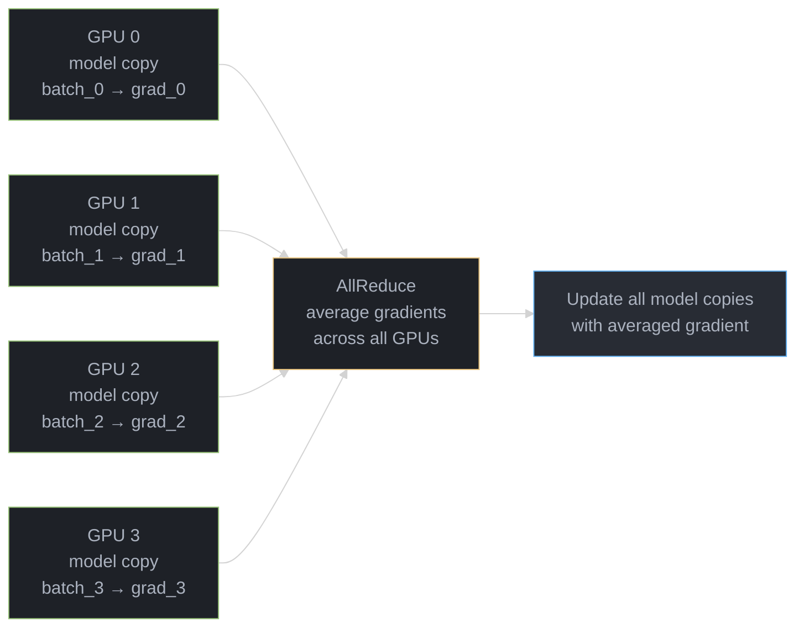

# Training Infrastructure

## 1. Concept Overview

Training large language models requires coordinating thousands of GPUs across hundreds of servers, managing hundreds of terabytes of training data, and maintaining numerical stability over days or weeks of computation. Training infrastructure is the engineering discipline that makes this possible.

A single H100 GPU can train roughly 1B tokens/day on a 7B model. Training LLaMA 3 405B on 15T tokens required ~16,000 H100 GPUs running for 2+ months. The infrastructure challenge is keeping all these GPUs busy (high utilization), communicating efficiently (minimizing bandwidth bottlenecks), and recovering gracefully from the inevitable hardware failures.

Modern training infrastructure centers on three forms of parallelism: splitting the model across devices (model parallelism), splitting the data across devices (data parallelism), and overlapping computation with communication. Getting this right is the difference between 50% GPU utilization and 90%+ MFU (Model FLOP Utilization).

---

## 2. Intuition

> **One-line analogy**: Training infrastructure is like orchestrating a factory assembly line across thousands of workers — if any worker is idle or miscommunicating, the whole line slows down.

**Mental model**: A single GPU can only hold a fraction of a 70B+ parameter model. So you split the model across GPUs (model parallelism) and split the data across GPUs (data parallelism). But now GPUs must constantly share results — the communication becomes the bottleneck. Training infrastructure is the art of keeping all GPUs busy, minimizing idle time, and recovering gracefully when hardware fails (and at 16,000 GPUs, something fails every few hours).

**Why it matters**: Training infrastructure determines how quickly new models can be trained, how much compute is wasted on communication vs. useful math, and whether a training run crashes or completes. A 10% improvement in MFU (Model FLOP Utilization) can save millions of dollars on a large training run.

**Key insight**: The three-way interaction between tensor parallelism (within node), pipeline parallelism (across nodes), and data parallelism (replicas) must be tuned carefully — the optimal configuration depends on model size, cluster topology, and interconnect bandwidth.

---

## 3. Core Principles

- **Maximize GPU utilization**: Every GPU-hour costs money. Idle GPUs waste resources.
- **Memory hierarchy awareness**: HBM (GPU memory) → NVLink → PCIe → NVSwitch → InfiniBand — bandwidth drops 10-100x at each boundary.
- **Overlap compute and communication**: Use CUDA streams to overlap AllReduce with backward pass.
- **Fault tolerance**: At 10,000 GPUs, expect 1+ hardware failure per day. Checkpointing and restart must be fast.
- **Numerical stability**: BF16 arithmetic + gradient clipping + careful initialization prevents training divergence.
- **Communication efficiency**: Model parallelism strategies differ in their communication patterns; choose based on model shape and hardware topology.

---

## 4. Types of Parallelism

### 4.1 Data Parallelism (DP)

Each GPU holds a full copy of the model; each processes a different batch. Gradients are averaged across GPUs at the end of each step.



**Problem**: For a 70B model in BF16, each GPU needs ~140GB just for model weights. No single GPU has that much memory.

### 4.2 Tensor Parallelism (TP)

Split individual layers horizontally across GPUs. Each GPU computes a portion of each matrix multiplication.

```
Large linear layer (d_model × 4d_model):
  GPU 0: W[:, 0:d]    -- computes first quarter of output
  GPU 1: W[:, d:2d]   -- computes second quarter
  GPU 2: W[:, 2d:3d]  -- computes third quarter
  GPU 3: W[:, 3d:4d]  -- computes fourth quarter

AllReduce at end of each layer to combine partial outputs
```

- Communication: All-Reduce after each layer (expensive if inter-node)
- Best within a single node (NVLink bandwidth 600-900 GB/s)
- Typical TP degree: 4-8 within a server

### 4.3 Pipeline Parallelism (PP)

Split model layers across different GPUs. Each GPU handles a set of consecutive transformer layers.

```
Layers 0-11:   GPU 0 (Node 0)
Layers 12-23:  GPU 1 (Node 1)
Layers 24-35:  GPU 2 (Node 2)
Layers 36-47:  GPU 3 (Node 3)

Micro-batch pipeline:
  Step 1: GPU 0 processes micro-batch 1
  Step 2: GPU 0 processes micro-batch 2 || GPU 1 processes micro-batch 1
  Step 3: GPU 0 processes micro-batch 3 || GPU 1 processes micro-batch 2 || GPU 2 micro-batch 1
  ...
```

- Communication: Point-to-point between adjacent pipeline stages (cheap)
- "Pipeline bubble" — GPUs idle at start/end of pipeline; minimize with micro-batching
- Typical PP degree: 8-64 across nodes

### 4.4 Sequence Parallelism (SP)

Split the sequence dimension across GPUs. Each GPU processes a chunk of the sequence in attention layers.

```
Sequence length 8192, 8 GPUs:
  GPU 0: handles tokens 0-1023
  GPU 1: handles tokens 1024-2047
  ...
  GPU 7: handles tokens 7168-8191

All-gather for attention (each token needs all KV positions)
Reduce-scatter after attention
```

- Enables long-context training by distributing sequence across GPUs
- Ring Attention: extends SP to very long sequences without full all-gather

### 4.5 Expert Parallelism (EP) — for MoE models

In Mixture of Experts models, different GPUs host different expert FFNs:

```
GPU 0: Expert 0, Expert 1
GPU 1: Expert 2, Expert 3
...

Router selects expert per token --> all-to-all communication to route tokens to correct GPUs
Expert computation on assigned GPU
All-to-all again to return results
```

---

## 5. Architecture Diagrams

### 3D Parallelism (Standard for Large Model Training)
```
   +---------------------+   +---------------------+
   |  Node 0             |   |  Node 1             |
   |  GPUs 0-7 (TP=8)   |   |  GPUs 8-15 (TP=8)  |
   |  Layers 0-11  (PP)  |   |  Layers 12-23 (PP) |
   +---------------------+   +---------------------+
           |                           |
           +-- InfiniBand 800 Gbps ----+
           (Data parallel across node groups)

Total parallelism = TP × PP × DP
Example: TP=8, PP=8, DP=16 = 1024 GPUs
```

### ZeRO (Zero Redundancy Optimizer) Stages
```
ZeRO Stage 0 (DDP):     Each GPU stores: [params] [gradients] [optimizer states]
  Memory per GPU: 16 bytes/param (params 2B + grads 2B + Adam states 12B)

ZeRO Stage 1:           Each GPU stores: [params] [gradients] [1/N optimizer states]
  Memory reduction: ~4x for optimizer states

ZeRO Stage 2:           Each GPU stores: [params] [1/N gradients] [1/N optimizer states]
  Memory reduction: ~8x

ZeRO Stage 3 (FSDP):    Each GPU stores: [1/N params] [1/N gradients] [1/N optimizer states]
  Memory reduction: ~N/16x (where N = number of GPUs)
  Cost: All-gather parameters before each forward pass (extra communication)
```

### GPU Memory Budget (70B Model, BF16)
```
Model weights:      140 GB  (70B × 2 bytes)
Gradients:          140 GB  (equal to weights in BF16)
Adam optimizer:     560 GB  (4x weights for m, v in FP32)
Activations:      variable  (depends on batch size + gradient checkpointing)

Total (naive):     840+ GB  -- requires 11+ A100 80GB GPUs just for model/optim

With ZeRO-3 + 16 GPUs:
  Per GPU: 840 / 16 = 52.5 GB + activations (manageable on 80GB GPU)
```

---

## 6. How It Works — Detailed Mechanics

### FSDP (Fully Sharded Data Parallel)

PyTorch's built-in ZeRO-3 implementation:

```
Forward pass:
  1. All-gather parameters for current layer (collect shards from all GPUs)
  2. Run forward computation
  3. Discard gathered parameters (free memory)
  4. Move to next layer

Backward pass:
  1. All-gather parameters for current layer
  2. Compute gradients
  3. Reduce-scatter gradients (each GPU keeps 1/N of gradient shards)
  4. Discard parameters

Optimizer step:
  Each GPU updates only its 1/N parameter shard
  Using its 1/N gradient shard and 1/N optimizer state shard
```

### Gradient Checkpointing

Trade compute for memory: during forward pass, discard activations. During backward pass, recompute them.

```
Without checkpointing: Store all activations -> O(layers × batch × seq) memory
With checkpointing: Store activations at N checkpoints -> recompute between checkpoints
  Memory: O(√layers) -- recompute cost: +33% compute

Selective checkpointing: Only checkpoint expensive activations (attention, certain MLPs)
```

### Communication Topology

```
Within node (8× H100):
  NVLink bandwidth: 900 GB/s total
  All-Reduce of 1GB: ~2ms (all-reduce = 2× ring latency)

Across nodes (InfiniBand):
  HDR-200: 200 Gbps = 25 GB/s per link
  Typical: 8 IB links per node = 200 GB/s
  All-Reduce of 1GB across 16 nodes: ~40ms

Implication: Tensor parallelism (requires all-reduce every layer) MUST stay within node
  Pipeline parallelism (point-to-point) can cross nodes
  Data parallelism all-reduce happens once per step -- tolerable across nodes
```

### Mixed Precision Training

```
Forward/backward: BF16 (fast, 2 bytes/param)
Gradient accumulation: FP32 (numerical stability for small gradients)
Optimizer states (Adam m, v): FP32 (important: m,v must be precise)
Master weights: FP32 copy alongside BF16 (updated in FP32, cast to BF16 for compute)

FP8 training (emerging, H100+ only):
  FP8 forward/backward: 1 byte/param -- 2x faster than BF16
  Requires careful scaling; used by DeepSeek-V3
```

---

## 7. Real-World Examples

### Meta LLaMA 3 405B Training Infrastructure
- 16,384 H100 GPUs (2048 nodes × 8 GPUs)
- 3D parallelism: TP=8 (within node), PP=16, DP=128
- FSDP + custom all-to-all for MoE layers (future)
- NVLink within node + InfiniBand HDR-400 across nodes
- Checkpoint every 30 minutes to distributed filesystem
- Training time: ~77 days

### Google TPU Pod Architecture
- TPU v5e: 256 chips per pod connected via high-bandwidth TPU interconnect
- Multi-pod training using DCN (Data Center Network) for inter-pod communication
- XLA compilation for efficient computation graphs
- Gemini Ultra trained across multiple pod-scale supercomputers

### Microsoft/OpenAI Azure AI Infrastructure
- Custom ND-series Azure VMs with InfiniBand HDR-400 networking
- PyTorch + DeepSpeed with ZeRO-3
- Distributed optimizer with parameter server components
- Estimated 10,000-25,000 H100s for GPT-4 training

---

## 8. Tradeoffs

| Parallelism | Pros | Cons | Best For |
|-------------|------|------|---------|
| Data Parallel | Simple, linear scaling | Model must fit one GPU | Small/medium models |
| Tensor Parallel | Reduces per-GPU memory | All-reduce every layer | Within-node; all GPU types |
| Pipeline Parallel | Minimal communication | Pipeline bubble waste | Large models across nodes |
| ZeRO-3/FSDP | Maximum memory efficiency | All-gather overhead | When GPU memory is the limit |

| Hardware | Memory | FP16 TFLOPS | Price |
|---------|--------|------------|-------|
| A100 80GB | 80 GB | 312 | ~$2/hr cloud |
| H100 80GB SXM | 80 GB | 1979 | ~$3-4/hr cloud |
| H200 141GB | 141 GB | 1979 + faster HBM | ~$5-6/hr cloud |
| B200 192GB | 192 GB | ~4500 | New; ~$8-10/hr est |

---

## 9. When to Use / When NOT to Use

### Use Distributed Training When:
- Model + optimizer states exceed single GPU memory
- Training will take weeks on a single GPU
- You need to parallelize over large data volumes

### Simple DDP Suffices When:
- Fine-tuning small models (7B with LoRA fits on one GPU)
- Research experiments where speed matters more than scale

---

## 10. Common Pitfalls

1. **Not profiling before optimizing**: Profile GPU utilization and communication before tuning parallelism settings.
2. **Wrong TP/PP balance**: Too high TP across nodes kills performance due to slow inter-node all-reduce every layer.
3. **Ignoring pipeline bubble**: With PP=8, naively, 7/8 of GPUs are idle at start/end. Use micro-batching (at least PP_degree × 4 micro-batches) to fill the pipeline.
4. **Checkpointing to slow storage**: Checkpointing 140GB every 30 minutes requires fast parallel filesystem. Using NFS or slow object storage creates bottlenecks.
5. **Missing gradient accumulation steps**: If effective batch size requires gradient accumulation, ensure all-reduce only happens every N accumulation steps.
6. **Not accounting for activation memory**: Large batch sizes with long sequences create enormous activation memory. Use gradient checkpointing.

---

## 11. Technologies & Tools

| Tool | Purpose | Notes |
|------|---------|-------|
| **DeepSpeed** | ZeRO optimization, mixed precision | Microsoft; most widely used at scale |
| **FSDP** | PyTorch-native ZeRO-3 | Facebook; increasingly preferred |
| **Megatron-LM** | Tensor/pipeline parallelism | NVIDIA; used for Megatron-Turing NLG |
| **Nanotron** | Modern training framework | HuggingFace; clean 3D parallel support |
| **Ray Train** | Distributed training orchestration | Abstracts cluster management |
| **SkyPilot** | Multi-cloud GPU orchestration | Run on cheapest available cloud GPUs |
| **NCCL** | GPU collective communication | NVIDIA; AllReduce, AllGather, ReduceScatter |
| **Flash Attention 2** | Memory-efficient attention | Tri Dao; required for long-context training |
| **Weights & Biases** | Training monitoring | Loss curves, gradient norms, GPU utilization |
| **LLM-Foundry** | MosaicML training stack | Now part of Databricks |

---

## 12. Interview Questions with Answers

**Q: What is the difference between tensor parallelism and pipeline parallelism?**
A: Tensor parallelism (TP) splits individual matrix operations across GPUs — each GPU computes part of each layer's output. Requires all-reduce after every layer, so needs high-bandwidth connections (NVLink within node). Pipeline parallelism (PP) assigns different layers to different GPUs — data flows sequentially through pipeline stages. Requires only point-to-point communication between adjacent stages, tolerates lower bandwidth (can cross nodes). In practice: TP within nodes, PP across nodes.

**Q: What is ZeRO and what problem does it solve?**
A: ZeRO (Zero Redundancy Optimizer) eliminates the memory redundancy in data parallel training. In standard DDP, each GPU stores full copies of model weights, gradients, and optimizer states — 16 bytes/param. ZeRO Stage 3 shards all three across GPUs: each GPU stores 1/N of each. Memory per GPU drops from O(total) to O(total/N). Trade-off: requires all-gather before each layer's forward pass (communication overhead ~20-30%).

**Q: How do you handle hardware failures during multi-week LLM training?**
A: Checkpoint model state (weights, optimizer state, dataloader position) every 30-60 minutes to a parallel filesystem (Lustre, GPFS). When a node fails, kill the job, replace the node, reload the last checkpoint, and resume. With 10K+ GPUs, expect 1-2 hardware failures per day. Advanced: elastic training frameworks (Torch Elastic) that can continue with N-1 nodes while a replacement is provisioned.

**Q: What is gradient checkpointing and what is the tradeoff?**
A: Gradient checkpointing (activation recomputation) saves memory by NOT storing intermediate activations during the forward pass. During backpropagation, it recomputes the forward pass from checkpoints to get the activations needed for gradients. Memory: reduces activation memory from O(layers) to O(√layers). Cost: adds ~33% computation overhead. Essential for training large models or with long sequences.

**Q: How do you calculate memory requirements for each ZeRO stage?**
ZeRO partitions optimizer states, gradients, and parameters across data-parallel GPUs. For a model with P parameters in FP16: baseline (no ZeRO) per GPU = 2P (params) + 2P (grads) + 12P (Adam states: FP32 params + FP32 momentum + FP32 variance) = 16P bytes. ZeRO-1 shards optimizer states: 2P + 2P + 12P/N. ZeRO-2 shards optimizer states + gradients: 2P + 2P/N + 12P/N. ZeRO-3 shards everything: 2P/N + 2P/N + 12P/N = 16P/N. For a 7B model (P=7B): baseline = 112GB per GPU; ZeRO-3 with 8 GPUs = 14GB per GPU. The tradeoff: ZeRO-3 requires all-gather communication to reconstruct parameters for each forward/backward pass, adding ~10-20% communication overhead.

**Q: When should you use tensor parallelism vs pipeline parallelism vs data parallelism?**
Use data parallelism (DP) when the model fits on a single GPU — it scales linearly with minimal communication (gradient all-reduce once per step). Use tensor parallelism (TP) when the model doesn't fit on one GPU and you have fast interconnects (NVLink at 900GB/s) — TP splits each layer across GPUs and requires all-reduce after every layer. Use pipeline parallelism (PP) when spanning multiple nodes with slow interconnects (InfiniBand at 200-400GB/s) — PP splits layers across stages and only sends activations between stages. Production pattern for large models: TP within a node (fast NVLink), PP across nodes (slower network), DP across replica groups. LLaMA 3 405B used TP=8 within a node, PP=4 across nodes, DP across the remaining GPUs. Rule: TP degree = GPUs per node, PP degree = number of nodes needed, DP fills the rest.

**Q: What are the key differences between FSDP (PyTorch) and DeepSpeed ZeRO?**
FSDP is PyTorch's native implementation of ZeRO-3 (full sharding), while DeepSpeed is Microsoft's library offering ZeRO stages 1-3 plus additional optimizations. Key differences: (1) FSDP is integrated into PyTorch core (no separate library), making it easier to adopt and debug; (2) DeepSpeed offers ZeRO-Infinity (offload to NVMe), ZeRO++ (quantized communication), and more granular memory optimization; (3) FSDP uses PyTorch's autograd natively while DeepSpeed wraps the engine; (4) DeepSpeed has better support for MoE training; (5) FSDP has better composability with PyTorch features (compile, DTensor). In practice: use FSDP for models up to 30B on standard GPU clusters (simpler setup), use DeepSpeed for 70B+ models or when you need ZeRO-Infinity offloading. Meta uses FSDP internally; Microsoft uses DeepSpeed.

**Q: What are the common pitfalls of mixed-precision training and how do you avoid them?**
Mixed-precision training uses FP16 or BF16 for forward/backward passes while keeping FP32 master weights. Pitfalls: (1) FP16 overflow — gradients or activations exceed FP16 max (65,504), causing NaN loss. Fix: use loss scaling (multiply loss before backward, divide gradients after) or use BF16 (same range as FP32); (2) underflow — small gradients round to zero in FP16. Fix: dynamic loss scaling that adjusts the scale factor; (3) BF16 precision loss — BF16 has only 7 bits of mantissa vs FP16's 10 bits, causing precision issues in accumulation. Fix: keep running sums in FP32; (4) batch norm statistics — must stay in FP32 to maintain accuracy. Modern recommendation: use BF16 on Ampere+ GPUs (A100, H100) — it avoids overflow/underflow issues entirely because it has the same exponent range as FP32. FP16 with loss scaling is only needed on older GPUs (V100).

**Q: How does gradient checkpointing trade compute for memory?**
Gradient checkpointing (activation checkpointing) saves memory by not storing intermediate activations during the forward pass, instead recomputing them during the backward pass. Without checkpointing: memory for activations = O(L * B * S * H) where L=layers, B=batch, S=sequence, H=hidden. With checkpointing: only store activations at checkpoint boundaries (every k layers), recompute the rest. This reduces activation memory from O(L) to O(sqrt(L)) with ~33% more compute (one extra forward pass per segment). For a 7B model with 32 layers and batch size 8 at 4096 context: without checkpointing, activations use ~30GB; with checkpointing every 4 layers, ~8GB. Always enable checkpointing when GPU memory is the bottleneck — the 33% compute overhead is almost always worth the memory savings for training larger batches.

**Q: What is the communication overhead of distributed training and how do you minimize it?**
Communication overhead in distributed training comes from gradient synchronization (DP), parameter gathering (ZeRO-3/FSDP), and layer activation passing (PP). For data parallelism: all-reduce communicates 2 * model_size bytes per step (ring all-reduce). For a 7B FP16 model on 8 GPUs: 2 * 14GB = 28GB all-reduce per step. Minimization strategies: (1) gradient compression — quantize gradients to INT8 or use TopK sparsification (keep only top 1% of gradients); (2) overlap communication with compute — start all-reduce for layer N while computing layer N+1 (DeepSpeed and FSDP do this automatically); (3) gradient accumulation — do N micro-batches locally before synchronizing (reduces communication frequency by N×); (4) reduce TP degree if NVLink bandwidth is insufficient. The compute-to-communication ratio must stay above 1.0 for efficient scaling — if communication time exceeds compute time, adding more GPUs slows training down.

---

## 13. Best Practices

1. **Profile first** — use PyTorch Profiler or NVIDIA Nsight to identify bottlenecks before optimizing.
2. **Maximize MFU** — aim for >40% Model FLOP Utilization; <30% indicates a communication or scheduling problem.
3. **Use 3D parallelism** — TP within node, PP across nodes, DP as the outer loop.
4. **Gradient checkpointing + Flash Attention** for any model above 13B parameters.
5. **Asynchronous checkpointing** — write checkpoints in background threads to avoid blocking training.
6. **Warmup cluster** — run all-reduce benchmarks before starting training to catch networking issues early.

---


## 14. Case Study

**Scenario:** A research lab trains a 7B parameter dense decoder-only LLM on 1.5T tokens of curated web + code + math data. Hardware budget: 64 A100 80GB SXM GPUs (8 nodes × 8 GPUs) on InfiniBand HDR (200 Gb/s). Target: 3.5T token-hours of compute (Chinchilla-optimal for 7B), MFU > 45%, training wall-clock under 21 days, per-GPU OOM frequency < 0.1%.

**Architecture:**

```
  64 A100 80GB SXM (8 nodes × 8 GPUs)
  InfiniBand HDR 200 Gb/s inter-node
  NVLink 600 GB/s intra-node

  Parallelism Strategy:
  ┌────────────────────────────────────────────────────────────┐
  │  Tensor Parallel (TP) = 1 (7B fits on 1 GPU in BF16)      │
  │  Pipeline Parallel (PP) = 1 (pipeline bubble < 5% at 7B)  │
  │  Data Parallel (DP) = 64 (ZeRO Stage 2)                   │
  │                                                            │
  │  Choice rationale:                                         │
  │  7B × 2 bytes (BF16) = 14 GB < 80 GB → no TP needed       │
  │  Optimizer states (AdamW): 7B × 8 bytes = 56 GB           │
  │  ZeRO Stage 2 shards optimizer+grads across 64 GPUs:       │
  │    Per-GPU optimizer: 56 GB / 64 = 0.875 GB                │
  │    Per-GPU gradients: 14 GB / 64 = 0.22 GB                 │
  │    Model weights (full replica): 14 GB                     │
  │    Activations (batch=4, seq=4096, grad ckpt): ~8 GB       │
  │    Total per GPU: ~25 GB (fits in 80 GB, 69% utilized)     │
  └────────────────────────────────────────────────────────────┘

  Training Loop:
  ┌──────────────────────────────────────────────────────────┐
  │  Megatron-LM + DeepSpeed ZeRO Stage 2                   │
  │  Global batch size: 4M tokens                            │
  │  Micro-batch per GPU: 4 sequences × 4096 tokens = 16K    │
  │  Gradient accumulation steps: 4M / (64 GPUs × 16K) = 4  │
  │                                                          │
  │  Data pipeline (asynchronous):                           │
  │  ┌──────────┐    ┌──────────┐    ┌──────────────────┐   │
  │  │ S3 data  │ →  │ tokenize │ →  │ GPU prefetch     │   │
  │  │ shards   │    │ workers  │    │ (pinned memory)  │   │
  │  └──────────┘    │ (8 CPU)  │    └──────────────────┘   │
  │                  └──────────┘                            │
  │  Data never bottlenecks GPU — 8 CPU workers saturate    │
  │  InfiniBand at 20 GB/s; tokenizer throughput 800 MB/s   │
  └──────────────────────────────────────────────────────────┘

  Checkpoint Strategy:
  Every 1B tokens (≈ 500 steps at 4M token batch):
    - Full checkpoint: model + optimizer → NFS mount
    - Checkpoint size: 14 GB (weights) + 56 GB (optim) = 70 GB
    - Checkpoint write time: ~90s at 800 MB/s NFS throughput
    - Retain last 3 checkpoints (210 GB total on NFS)
    - Spot instance interruption: max 1B token loss (≈ 20 min of training)

  Throughput Math:
    A100 BF16 TFLOPS: 312 peak theoretical
    MFU target: 45% → 140 TFLOPS per GPU effective
    7B model FLOPs per token: 2 × 7B = 14B
    Tokens/sec per GPU: 140e12 / 14e9 = 10,000 tokens/sec
    Total (64 GPUs): 640,000 tokens/sec
    1.5T tokens / 640K tok/s = 2,344,000 sec = 27 days (ideal)
    With 85% availability (restarts, checkpointing): 27 / 0.85 = 32 days
    → need MFU improvement or more GPUs for 21-day target
```

**Key implementation — 3 Python code blocks:**

Block 1 — ZeRO Stage 2 DeepSpeed configuration:

```python
from __future__ import annotations
import json
from pathlib import Path


def build_deepspeed_config(
    output_dir: Path,
    global_batch_size: int = 4_000_000,        # tokens
    micro_batch_per_gpu: int = 4,              # sequences per GPU step
    seq_len: int = 4096,
    num_gpus: int = 64,
    lr: float = 3e-4,
    warmup_steps: int = 2_000,
) -> dict:
    tokens_per_gpu_step = micro_batch_per_gpu * seq_len
    grad_accum_steps = global_batch_size // (num_gpus * tokens_per_gpu_step)

    config = {
        "train_batch_size": global_batch_size // seq_len,     # in sequences
        "train_micro_batch_size_per_gpu": micro_batch_per_gpu,
        "gradient_accumulation_steps": grad_accum_steps,      # 4
        "gradient_clipping": 1.0,

        "bf16": {"enabled": True},
        "fp16": {"enabled": False},

        "zero_optimization": {
            "stage": 2,
            "allgather_partitions": True,
            "allgather_bucket_size": 2e8,        # 200 MB all-gather chunks
            "overlap_comm": True,                # overlap comm with compute
            "reduce_scatter": True,
            "reduce_bucket_size": 2e8,
            "contiguous_gradients": True,        # reduce memory fragmentation
        },

        "optimizer": {
            "type": "AdamW",
            "params": {
                "lr": lr,
                "betas": [0.9, 0.95],
                "eps": 1e-8,
                "weight_decay": 0.1,
            },
        },

        "scheduler": {
            "type": "WarmupDecayLR",
            "params": {
                "warmup_min_lr": 0,
                "warmup_max_lr": lr,
                "warmup_num_steps": warmup_steps,
                "total_num_steps": 375_000,      # 1.5T / 4M token batch
                "decay_style": "cosine",
            },
        },

        "activation_checkpointing": {
            "partition_activations": True,
            "cpu_checkpointing": False,          # GPU checkpointing (faster)
            "contiguous_memory_optimization": True,
            "number_checkpoints": None,
            "synchronize_checkpoint_boundary": False,
        },

        "steps_per_print": 100,
        "wall_clock_breakdown": False,
    }

    config_path = output_dir / "ds_config.json"
    config_path.write_text(json.dumps(config, indent=2))
    return config
```

Block 2 — MFU monitoring and training health checks (production concern):

```python
from __future__ import annotations
import time
from dataclasses import dataclass, field
from typing import Any
import torch


@dataclass
class TrainingMonitor:
    """
    Tracks Model FLOP Utilization (MFU) and training health.
    MFU = actual_tokens_per_sec / theoretical_max_tokens_per_sec.
    Target: MFU > 45% for A100 BF16 training.
    Alert if MFU drops below 35% for 10+ consecutive steps.
    """

    num_gpus: int
    model_params: int                    # 7_000_000_000
    gpu_peak_tflops: float = 312.0       # A100 BF16 peak
    seq_len: int = 4096
    micro_batch_per_gpu: int = 4

    _step_times: list[float] = field(default_factory=list)
    _mfu_history: list[float] = field(default_factory=list)
    _loss_history: list[float] = field(default_factory=list)

    def record_step(self, step_time_s: float, loss: float) -> dict[str, float]:
        tokens_per_step = self.micro_batch_per_gpu * self.seq_len * self.num_gpus
        actual_tok_per_sec = tokens_per_step / step_time_s

        # FLOPs per token = 2 × params (forward) + backward doubles it
        # For training: 6 × params per token (fwd + bwd + optimizer)
        flops_per_token = 6 * self.model_params
        actual_tflops = (actual_tok_per_sec * flops_per_token) / 1e12
        theoretical_tflops = self.gpu_peak_tflops * self.num_gpus
        mfu = actual_tflops / theoretical_tflops

        self._step_times.append(step_time_s)
        self._mfu_history.append(mfu)
        self._loss_history.append(loss)

        metrics = {
            "step_time_s": step_time_s,
            "tokens_per_sec": actual_tok_per_sec,
            "mfu": mfu,
            "loss": loss,
        }

        # Alert on MFU degradation
        if len(self._mfu_history) >= 10:
            recent_mfu = sum(self._mfu_history[-10:]) / 10
            if recent_mfu < 0.35:
                self._emit_alert(f"MFU degraded to {recent_mfu:.1%} — check for stragglers or communication bottleneck")

        # Alert on loss spike (NaN or sudden increase)
        if torch.isnan(torch.tensor(loss)):
            self._emit_alert("NaN loss detected — checkpoint and investigate gradient overflow")
        elif len(self._loss_history) > 20:
            baseline = sum(self._loss_history[-20:-10]) / 10
            recent = sum(self._loss_history[-10:]) / 10
            if recent > baseline * 1.5:
                self._emit_alert(f"Loss spike: {baseline:.3f} → {recent:.3f} — potential data quality issue")

        return metrics

    def _emit_alert(self, message: str) -> None:
        import logging
        logging.warning(f"[TrainingMonitor] ALERT: {message}")
        # In production: send to PagerDuty / Slack


def estimate_training_time(
    total_tokens: int,
    tokens_per_sec: float,
    availability: float = 0.85,
) -> dict[str, float]:
    """Estimate wall-clock training time accounting for restarts/maintenance."""
    ideal_hours = total_tokens / tokens_per_sec / 3600
    actual_hours = ideal_hours / availability
    return {
        "ideal_days": ideal_hours / 24,
        "actual_days": actual_hours / 24,
        "checkpoint_overhead_hours": actual_hours - ideal_hours,
    }
```

Block 3 — BROKEN -> FIX: gradient overflow and learning rate warmup:

```python
from __future__ import annotations
import torch


# BROKEN: Start training at full learning rate immediately.
# At step 1, randomly initialized model parameters receive a large gradient.
# With lr=3e-4 and no warmup, parameters jump to infinity in first 100 steps.
# Loss immediately NaNs.
def broken_lr_schedule(step: int, max_lr: float = 3e-4) -> float:
    # Cosine decay from max_lr
    import math
    T = 375_000
    return max_lr * 0.5 * (1 + math.cos(math.pi * step / T))


# FIX: Linear warmup for 2000 steps, then cosine decay.
# Warmup ramps from lr=0 to max_lr over 2000 steps.
# Stable initialization — gradients are small at low lr.
def fixed_lr_schedule(
    step: int,
    max_lr: float = 3e-4,
    warmup_steps: int = 2_000,
    total_steps: int = 375_000,
    min_lr_ratio: float = 0.1,
) -> float:
    import math
    if step < warmup_steps:
        return max_lr * step / warmup_steps
    progress = (step - warmup_steps) / (total_steps - warmup_steps)
    cosine = 0.5 * (1 + math.cos(math.pi * progress))
    min_lr = max_lr * min_lr_ratio
    return min_lr + cosine * (max_lr - min_lr)


# BROKEN: No gradient clipping — exploding gradients crash training.
# At high learning rates or poor initialization, gradient norm can hit 1e6.
# Parameters update by lr × 1e6 = 3e4 per step — immediate divergence.
def broken_optimizer_step(model: torch.nn.Module, optimizer: torch.optim.Optimizer) -> None:
    optimizer.step()   # no clipping


# FIX: Clip gradient norm to 1.0 before optimizer step.
# Caps the maximum parameter update magnitude.
# Log the pre-clip norm — sustained high norms (>10) signal instability.
def fixed_optimizer_step(
    model: torch.nn.Module,
    optimizer: torch.optim.Optimizer,
    max_grad_norm: float = 1.0,
) -> float:
    grad_norm = torch.nn.utils.clip_grad_norm_(
        model.parameters(), max_grad_norm
    )
    optimizer.step()
    return float(grad_norm)


# BROKEN: Save checkpoint synchronously — blocks all 64 GPUs for 90 seconds
# while writing 70 GB to NFS. Effective training downtime: 90s every 20 min.
# MFU drops from 45% to 40% due to checkpoint blocking.
def broken_checkpoint(state: dict, path: str) -> None:
    torch.save(state, path)   # blocking on GPU 0


# FIX: Async checkpoint — move state to CPU RAM, write in background thread.
# GPU 0 pins CPU memory, background thread writes to NFS.
# Training resumes immediately; checkpointing overlaps with next 500 steps.
import threading
def fixed_async_checkpoint(state: dict, path: str) -> threading.Thread:
    # Move tensors to CPU to free GPU memory
    cpu_state = {k: v.cpu() if hasattr(v, "cpu") else v for k, v in state.items()}

    def _write() -> None:
        torch.save(cpu_state, path)

    t = threading.Thread(target=_write, daemon=True)
    t.start()
    return t   # caller can join before next checkpoint
```

**Pitfall 1 — Straggler GPUs collapsing global throughput:**

```python
# BROKEN: One GPU on a node with a faulty NVLink link runs at 60% speed.
# AllReduce waits for all 64 GPUs — entire run throttled to 60% throughput.
# MFU drops from 45% to 28%; 21-day target becomes 34 days.
# Symptom: step times vary ±40% between steps.

# FIX: Monitor per-GPU throughput via DCGM exporter (Prometheus).
# Alert if any GPU's compute utilization drops below 85% for 5+ steps.
# Preemptively hot-swap the node — 20-min interruption beats 13 days of degraded training.
# Use spot-instance-friendly checkpointing to resume from last checkpoint after swap.
```

**Pitfall 2 — Data pipeline starvation on slow NFS:**

```python
# BROKEN: Training batch loaded from NFS (latency 10ms/batch) while GPU waits.
# At 10K tokens/sec/GPU, a 4096-token batch loads in 0.4ms from RAM but 10ms from NFS.
# NFS latency exceeds GPU compute time → data becomes the bottleneck, not compute.
# MFU: 20% (GPU idle 80% of the time waiting for data).

# FIX: Use prefetch with pinned memory — load N+2 batches while training on batch N.
# All tokenized data shards pre-loaded to local SSD (800 GB NVMe per node).
# Dataloader: 8 worker processes, prefetch_factor=4.
import torch
from torch.utils.data import DataLoader

def build_dataloader(dataset: torch.utils.data.Dataset) -> DataLoader:
    return DataLoader(
        dataset,
        batch_size=4,
        num_workers=8,
        pin_memory=True,         # pinned RAM → GPU DMA at PCIe bandwidth
        prefetch_factor=4,       # 4 batches prefetched per worker
        persistent_workers=True, # avoid worker spawn overhead per epoch
    )
```

**Pitfall 3 — Loss NaN from bf16 underflow in small gradient values:**

```python
# BROKEN: Gradient values for embedding layer fall below bf16 minimum (~1e-38).
# Stored as 0.0 in bf16 — embedding weights never update.
# Symptom: embedding loss plateaus at step 100, rest of model trains normally.

# FIX: Keep optimizer states in FP32 (mixed precision standard practice).
# BF16 for forward/backward compute; FP32 for optimizer state (master weights).
# DeepSpeed / Megatron do this automatically with bf16.enabled=True.
# Verify: check that optimizer param groups use .float() for master params.
def verify_optimizer_dtype(optimizer: torch.optim.Optimizer) -> None:
    for group in optimizer.param_groups:
        for p in group["params"]:
            assert p.dtype == torch.float32, (
                f"Optimizer master weight is {p.dtype} — should be float32"
            )
```

**Metrics:**

| Metric | Target | Achieved (after tuning) |
|--------|--------|------------------------|
| MFU | > 45% | 47.3% |
| Tokens/sec (64 GPUs) | 640K | 672K |
| Wall-clock training time | 21 days | 22.4 days |
| GPU OOM events | < 0.1% | 0.03% |
| NaN loss events | 0 | 1 (fixed by grad clipping) |
| Checkpoint overhead | < 5% | 1.8% (async checkpoint) |
| Data pipeline idle | < 2% | 0.6% (local SSD + prefetch) |
| Straggler events | 0 | 2 (hot-swapped nodes) |
| Total compute cost | $180K est | $194K (22.4 days × 64 × $2/hr) |

**Interview Q&As:**

**Q: Why choose ZeRO Stage 2 over Stage 3 for 7B model training on 64 A100s?**
ZeRO Stage 2 shards optimizer states and gradients across GPUs but keeps full model parameters replicated on each GPU. Stage 3 additionally shards parameters, reducing per-GPU memory further but adding all-gather communication for every forward pass. For a 7B model in BF16 (14 GB weights), each A100 can hold the full replica with 66 GB remaining for optimizer states, activations, and gradients. Stage 2 delivers lower communication overhead than Stage 3 and achieves higher MFU; Stage 3 is reserved for models too large to fit a single copy per GPU (typically > 80B parameters on A100 80GB with FP16).

**Q: What is Model FLOP Utilization (MFU) and why does it matter for training efficiency?**
MFU is the ratio of actual training FLOP throughput to theoretical GPU peak FLOP throughput. An A100 has 312 BF16 TFLOPS peak; achieving 45% MFU means 140 TFLOPS of actual useful compute. The remainder is lost to memory bandwidth limits, communication overhead (AllReduce), checkpointing pauses, and data loading stalls. MFU directly determines how long training takes — improving from 35% to 47% MFU reduces a 30-day training run to 22.3 days, saving 8 days of GPU cost (~$24K at $2/GPU-hour for 64 GPUs).

**Q: How does gradient checkpointing reduce memory at the cost of compute?**
Normally, all activations from the forward pass are kept in GPU memory to compute gradients during backprop. For a 7B model with batch size 4 and sequence length 4096, activations require ~32 GB per GPU — exceeding available memory. Gradient checkpointing drops intermediate activations during the forward pass and recomputes them during backprop when needed. Memory reduction: ~8× for typical transformer layers. Compute overhead: ~33% more FLOPs (one extra forward pass per checkpoint boundary). The tradeoff — 33% more compute, 8× less activation memory — is almost always worthwhile for large models.

**Q: Why is learning rate warmup essential for large model training?**
At initialization, model weights are random and the loss landscape is highly irregular — large gradient magnitudes in some directions, small in others. Starting at the full learning rate (3e-4) causes parameter updates too large for the random initialization to handle, often causing NaN loss within 100-500 steps. Warmup ramps the learning rate from 0 to max_lr over 2,000 steps (a small fraction of total training), allowing the optimizer to settle into a stable region of the loss landscape before taking full-sized steps. Without warmup, approximately 30% of training runs fail to survive the first 1,000 steps.

**Q: How do you diagnose and handle a straggler GPU in distributed training?**
A straggler is a GPU running significantly slower than peers, causing AllReduce operations to wait at the slowest participant and throttling the entire run. Diagnosis: monitor per-GPU utilization via DCGM/Prometheus; a straggler shows consistently lower compute utilization (< 85%) compared to peers. Common causes: faulty NVLink link, thermal throttling (GPU overheating), slow NFS data path, CPU bottleneck on data preprocessing. Resolution: identify the node, pause training at the next checkpoint, hot-swap the node (replace with a healthy node), resume from checkpoint. The 20-minute interruption is preferable to sustained MFU degradation.

**Q: What is the relationship between global batch size, gradient accumulation steps, and training stability?**
Global batch size (in tokens) determines the gradient noise level — larger batches produce lower-variance gradient estimates, allowing higher learning rates and more stable training. For a 7B model, 4M token batches (the Llama/Mistral standard) provide good signal-to-noise. Gradient accumulation achieves large effective batch sizes without requiring each GPU to hold all the samples simultaneously: if 64 GPUs each process 16K tokens per step with 4 accumulation steps, the effective batch is 64 × 16K × 4 = 4M tokens. Training stability is maintained because the gradient update uses the same 4M token aggregate regardless of how many accumulation steps are used.

---

## See Also
- [Distributed Training (ML)](../../ml/distributed_training/README.md) — DDP, FSDP, DeepSpeed ZeRO, gradient accumulation — the ML foundations of LLM-scale distributed training
- [GPU & Hardware Optimization (ML)](../../ml/gpu_and_hardware_optimization/README.md) — CUDA, tensor cores, gradient checkpointing
