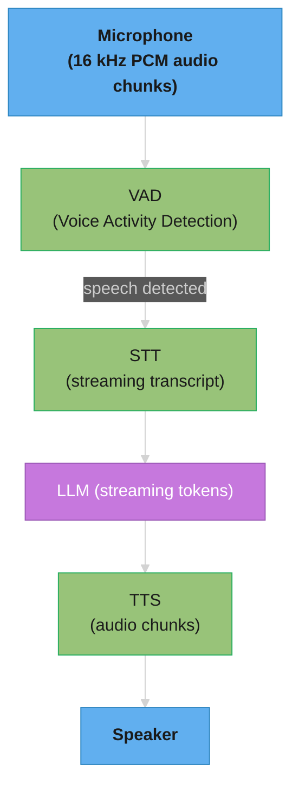
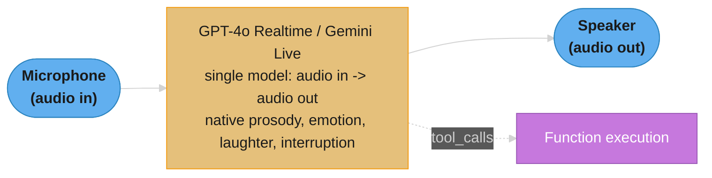
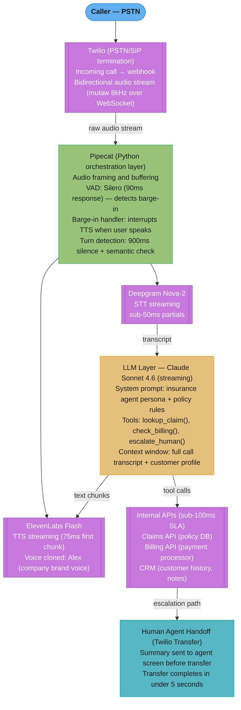

# Voice Agents

## 1. Concept Overview

Voice agents are LLM agents that interact via real-time speech — listening to a human, responding with synthesized speech, handling interruptions, managing turn-taking, and calling tools mid-conversation. They power AI phone assistants, voice-driven customer support, in-car assistants, and conversational interfaces in headsets and smart speakers. The 2024-2025 wave of native audio models (OpenAI Realtime API, Gemini Live, Anthropic forthcoming) collapsed the previous three-stage pipeline (Speech-to-Text → LLM → Text-to-Speech) into a single end-to-end audio model with dramatically lower latency and richer prosody/emotion handling.

Voice agents have stricter latency budgets than text agents (sub-800ms first audio byte for premium UX) and unique UX challenges (barge-in handling, turn detection, partial output interrupts). The architecture choice — pipeline vs end-to-end — drives almost every other decision in the system.

---

## 2. Intuition

**One-line analogy**: A voice agent is like a phone conversation with a human — pauses, interruptions, "uh-huhs", talking-over, all need to feel natural. Latency tolerance is measured in milliseconds, not seconds.

**Mental model**: Three architectures in a spectrum. **Pipeline** (STT → LLM → TTS): independent modules, easier to swap, ~800-1500ms latency, no native prosody. **Hybrid**: pipeline with cascade optimizations (streaming STT, parallel LLM start). **End-to-end audio** (GPT-4o Realtime, Gemini Live): single model takes audio in, emits audio out, ~200-800ms latency, captures intonation/emotion natively. Pick based on latency tolerance, control needs, and budget.

**Why it matters**: Humans tolerate ~300ms latency in conversation; >1s feels broken. Pipeline agents at 1500ms feel like talking to someone over a satellite link. End-to-end at 300ms feels human. The latency budget cascades through every architectural decision — barge-in handling, model choice, deployment topology, telephony integration.

**Key insight**: The hardest engineering problems in voice are NOT model quality — they are real-time audio handling: voice activity detection, barge-in interruption (must stop TTS mid-word when user starts speaking), turn detection (when did the user finish their thought?), and managing the audio buffer pipeline at low latency.

---

## 3. Core Principles

- **Latency budget rules everything**: sub-300ms first audio byte premium; sub-800ms acceptable; >1s broken.
- **Streaming end-to-end**: every stage streams; no batch processing in the hot path.
- **Barge-in is non-negotiable**: user must be able to interrupt mid-response.
- **Voice activity detection is critical**: when did the user start speaking? When did they stop?
- **Turn detection beyond silence**: silence alone is insufficient; learn pause patterns.
- **[Tool calls](../agents_and_tool_use/README.md) during audio**: agent may need to look up info mid-conversation; UX requires "thinking" filler.
- **Native prosody for naturalness**: end-to-end models capture emotion; pipeline models flatten it.

---

## 4. Types / Architectures / Strategies

### 4.1 Pipeline (STT → LLM → TTS)

Three modules: Whisper / Deepgram / Speechmatics → Claude / GPT / Gemini → ElevenLabs / OpenAI TTS / Cartesia. Easy to swap components; total latency 800-1500ms even with streaming. Best for: cost-sensitive, multilingual, custom voice cloning.

### 4.2 End-to-End Audio Model

OpenAI Realtime API (GPT-4o), Gemini Live, Mistral Voxtral. Single model: audio in → audio out. Latency 200-800ms. Captures prosody, emotion, laughter. Best for: premium UX, low latency required.

### 4.3 Hybrid Cascade

Pipeline with optimizations: streaming STT (Deepgram Nova-2 sends partial transcripts at <50ms), LLM starts processing on partial transcripts, TTS streams in chunks (ElevenLabs Flash at ~75ms latency). Achievable: 500-900ms total.

### 4.4 Telephony Integration

Twilio, Vonage, LiveKit Cloud, Pipecat for routing phone calls through voice agents. Handle: SIP/PSTN connectivity, recording compliance, DTMF (touch-tone) detection.

---

## 5. Architecture Diagrams

### Pipeline Architecture (STT → LLM → TTS)



Total latency: 800–1500 ms (good case); 2500 ms+ (bad case).

### End-to-End Audio Model



Total latency: 200-800ms — a single native model replaces the STT→LLM→TTS chain, capturing prosody and interruption directly instead of losing them at each stage boundary.

### Barge-In Flow

```
Agent: "The total order amount is..."
      | (TTS streaming chunks 1, 2, 3)
      |
      v
User: "Wait, I have a..."  <-- audio detected via VAD
      |
      v
System detects barge-in:
  1. Stop TTS immediately (within 100ms)
  2. Cancel LLM generation (if streaming)
  3. Discard any uncommitted audio in playback buffer
  4. Start STT on user's new utterance
  5. Inform LLM that user interrupted (so context is accurate)
```

### Turn Detection

```
User stops speaking (silence detected at 200ms)
     |
     v
Possible turn end candidates:
  A) Silence threshold (e.g., 500ms) → assume turn end
  B) End-of-sentence prosody (rising/falling pitch detected)
  C) Semantic completeness (LLM judges if utterance is complete)

Pure silence threshold:
  - Too short (300ms) → cuts off thinking pauses
  - Too long (1500ms) → conversation feels sluggish

Best practice: 700-900ms + prosody analysis
```

**Read it like this.** "The silence threshold is not a tuning knob with a right answer — it is a
direct trade of *how often you cut people off* against *how much dead air you add to every single
turn*."

Every turn pays the threshold in full as latency, because the agent cannot start until the timer
expires. So a 900 ms threshold silently adds 900 ms on top of the 425 ms pipeline budget — the user
experiences 1,325 ms, not 425 ms. That is why turn detection, not model latency, is usually the real
bottleneck in a voice agent that "feels slow."

| Symbol | What it is |
|--------|------------|
| `T` | Silence threshold in ms — how long the agent waits after the last speech frame before assuming the turn ended |
| mid-sentence pause | The natural hesitation while a user recalls a claim number or a date. Typically 400-700 ms |
| false cut | Threshold fired during a mid-sentence pause; the agent responds to half an utterance |
| dead air | `T` ms of silence added to every turn, whether or not the user was actually done |

**Walk one example.** Treat mid-sentence pauses as spread evenly over the 400-700 ms range the
pitfall section quotes, and ask what fraction of them trip each threshold:

```
  pauses land uniformly across 400 ms .. 700 ms  (span = 300 ms)
  a false cut happens whenever pause >= T

    T        pauses >= T             false-cut rate    dead air per turn
   300 ms    all of 400..700          100.0%             300 ms
   500 ms    (700-500)/300 = 0.667      66.7%            500 ms
   700 ms    (700-700)/300 = 0.000       0.0%            700 ms
   900 ms    none                        0.0%            900 ms

  T = 300 ms  -> every hesitation is an interruption; agent talks over the user
  T = 700 ms  -> first threshold that clears the pause range entirely
  T = 900 ms  -> 200 ms of pure margin bought at 200 ms of added latency per turn
```

The interesting result is that 700 ms — not 900 ms — is where the false-cut rate first hits zero
under this model. The extra 200 ms in the "700-900 ms" best practice is safety margin for pauses in
the tail beyond 700 ms, and it costs 200 ms of latency on every turn to buy. This is exactly why
prosody and semantic-completeness checks are worth adding: they let you drop `T` back toward 500 ms
and recover a quarter-second per turn, because the cut decision no longer rests on silence alone.

---

## 6. How It Works — Detailed Mechanics

### OpenAI Realtime API Example

```python
import asyncio
import base64
import json
import websockets
from pyaudio import PyAudio, paInt16

async def voice_agent_session():
    """Connect to OpenAI Realtime API; bidirectional audio."""
    
    url = "wss://api.openai.com/v1/realtime?model=gpt-4o-realtime-preview-2024-10-01"
    headers = {"Authorization": f"Bearer {OPENAI_API_KEY}", "OpenAI-Beta": "realtime=v1"}
    
    async with websockets.connect(url, extra_headers=headers) as ws:
        # Configure session
        await ws.send(json.dumps({
            "type": "session.update",
            "session": {
                "modalities": ["text", "audio"],
                "voice": "alloy",
                "instructions": "You are a helpful customer support agent. Speak naturally.",
                "input_audio_format": "pcm16",
                "output_audio_format": "pcm16",
                "input_audio_transcription": {"model": "whisper-1"},
                "turn_detection": {
                    "type": "server_vad",  # Server-side VAD
                    "threshold": 0.5,
                    "prefix_padding_ms": 300,
                    "silence_duration_ms": 700,
                },
                "tools": [
                    {
                        "type": "function",
                        "name": "lookup_order",
                        "description": "Look up an order by order ID",
                        "parameters": {
                            "type": "object",
                            "properties": {"order_id": {"type": "string"}},
                            "required": ["order_id"],
                        },
                    },
                ],
            },
        }))
        
        # Microphone input -> WebSocket
        audio = PyAudio()
        stream = audio.open(format=paInt16, channels=1, rate=24000, input=True, frames_per_buffer=1024)
        
        async def send_audio():
            while True:
                data = stream.read(1024, exception_on_overflow=False)
                b64 = base64.b64encode(data).decode("utf-8")
                await ws.send(json.dumps({"type": "input_audio_buffer.append", "audio": b64}))
                await asyncio.sleep(0)  # yield
        
        async def receive_events():
            playback_stream = audio.open(format=paInt16, channels=1, rate=24000, output=True)
            async for msg in ws:
                event = json.loads(msg)
                
                if event["type"] == "response.audio.delta":
                    audio_chunk = base64.b64decode(event["delta"])
                    playback_stream.write(audio_chunk)
                
                elif event["type"] == "response.function_call_arguments.done":
                    # Execute tool
                    args = json.loads(event["arguments"])
                    result = await lookup_order_tool(args["order_id"])
                    await ws.send(json.dumps({
                        "type": "conversation.item.create",
                        "item": {
                            "type": "function_call_output",
                            "call_id": event["call_id"],
                            "output": json.dumps(result),
                        },
                    }))
                    await ws.send(json.dumps({"type": "response.create"}))
                
                elif event["type"] == "input_audio_buffer.speech_started":
                    # User barged in — model auto-stops via server VAD
                    playback_stream.stop_stream()
                    playback_stream = audio.open(format=paInt16, channels=1, rate=24000, output=True)
                
                elif event["type"] == "error":
                    print(f"Error: {event}")
        
        await asyncio.gather(send_audio(), receive_events())


# Run
asyncio.run(voice_agent_session())
```

### Pipeline with Pipecat (Open-Source Voice Framework)

```python
from pipecat.frames.frames import LLMMessagesFrame
from pipecat.pipeline.pipeline import Pipeline
from pipecat.pipeline.task import PipelineTask
from pipecat.services.deepgram.stt import DeepgramSTTService
from pipecat.services.openai.llm import OpenAILLMService
from pipecat.services.elevenlabs.tts import ElevenLabsTTSService
from pipecat.transports.network.fastapi_websocket import FastAPIWebsocketTransport

async def run_voice_agent():
    transport = FastAPIWebsocketTransport(...)
    
    stt = DeepgramSTTService(api_key=DEEPGRAM_API_KEY, model="nova-2-conversationalai")
    llm = OpenAILLMService(api_key=OPENAI_API_KEY, model="gpt-4o-mini")
    tts = ElevenLabsTTSService(
        api_key=ELEVENLABS_API_KEY,
        voice_id="cgSgspJ2msm6clMCkdW9",
        model="eleven_flash_v2_5",  # ~75ms latency
    )
    
    pipeline = Pipeline([
        transport.input(),  # Audio from client
        stt,                # Audio -> text (streaming)
        llm,                # Text -> response text (streaming)
        tts,                # Text -> audio (streaming)
        transport.output(), # Audio to client
    ])
    
    task = PipelineTask(pipeline)
    await task.run()
```

---

## 7. Real-World Examples

**Customer support voice agents** — IVR replacement; companies like Replicant, Cresta, PolyAI deploy at telcos and large retailers.

**Voice-first SaaS apps** — driving assistant for sales reps (Gong-like), real-time meeting assistant (Otter.ai variants).

**Restaurant ordering** — drive-through AI (McDonald's pilot with IBM, Wendy's with Google Cloud).

**Healthcare patient intake** — automated triage call collecting symptoms before nurse callback.

**OpenAI Voice Mode (ChatGPT)** — consumer voice assistant; GPT-4o Realtime backed.

**In-car assistants** — BMW IDA, Mercedes MBUX with LLM backends.

---

## 8. Tradeoffs

| Architecture | Latency | Prosody/Emotion | Cost | Control | Best For |
|---|---|---|---|---|---|
| Pipeline (STT→LLM→TTS) | 800-1500ms | Flat, synthetic | $0.05-$0.15/min | Full per-stage | Cost-sensitive, custom voice cloning |
| Hybrid (streaming pipeline) | 500-900ms | Improved (good TTS) | $0.10-$0.20/min | High | Production telephony |
| End-to-end (GPT-4o Realtime) | 200-800ms | Natural (model native) | $0.30+/min | Less per-stage | Premium UX, conversational |
| End-to-end (Gemini Live) | 300-700ms | Natural | varies | Less | Google Cloud stacks |

---

## 9. When to Use / When NOT to Use

**Use voice agents when:**
- Phone IVR / customer support routing
- Hands-busy contexts (driving, cooking, manufacturing)
- Accessibility (vision-impaired users)
- Casual conversational UX (voice journals, language learning)

**Don't use when:**
- Privacy-sensitive contexts in public spaces
- High-stakes decisions requiring written audit trail
- Complex visual artifacts (code, diagrams, tables)
- Cost is paramount and text would do

---

## 10. Common Pitfalls

### Pitfall 1: No barge-in support

```python
# BROKEN: TTS plays out the entire response even if user interrupts
async def respond(text: str):
    audio = tts.synthesize(text)
    play(audio)  # Blocks until done
# User: "Wait, I meant..." — but agent keeps talking for 8 more seconds
```

```python
# FIXED: chunked playback + interrupt
async def respond(text: str, cancel_event: asyncio.Event):
    for chunk in tts.synthesize_streaming(text):
        if cancel_event.is_set():
            return  # Stop immediately
        await play_chunk(chunk)

# Run alongside VAD; if user speech detected, set cancel_event
```

### Pitfall 2: Silence-only turn detection

```python
# BROKEN: 500ms silence threshold cuts off user mid-thought
if silence_duration > 500:
    end_turn()
# User: "I want to... order a... [thinking] medium pizza" — cut off after first "..."
```

```python
# FIXED: longer threshold + prosody/semantic check
if silence_duration > 800:
    if is_sentence_complete_prosody(audio) or is_semantically_complete(transcript):
        end_turn()
```

**War story**: A drive-through voice agent kept cutting customers off mid-order because 500ms silence was treated as end-of-turn. Customers added "uhh" pauses while reading the menu. After increasing threshold to 1000ms + prosody-aware end-detection, order completion rate jumped from 68% to 91%.

---

## 11. Technologies & Tools

| Tool | Category | Notes |
|---|---|---|
| OpenAI Realtime API | End-to-end audio | GPT-4o; lowest latency |
| Gemini Live | End-to-end audio | Google; multimodal |
| Whisper (OpenAI) | STT | High accuracy; not real-time |
| Deepgram Nova-2 | STT | Streaming, low latency |
| ElevenLabs (Flash, Turbo) | TTS | High quality voices |
| Cartesia Sonic | TTS | Sub-100ms streaming |
| OpenAI TTS | TTS | Standard quality |
| Silero VAD | VAD | Open-source, 2MB |
| WebRTC VAD | VAD | Lightweight, classic |
| Pipecat | Framework | Pipeline orchestration |
| LiveKit Agents | Framework | Voice-first framework |
| Twilio Media Streams | Telephony | Phone integration |
| Vapi | Voice agent platform | Hosted solution |

---

## 12. Interview Questions with Answers

**Q: What is the latency budget for premium voice UX?**
First audio byte should arrive within 300ms after the user finishes speaking for "human-like" conversational latency. Up to 800ms is acceptable. Above 1000ms feels broken — users notice the lag. This budget dictates architecture choice: end-to-end audio models hit 200-800ms; pipelines typically 800-1500ms.

**Q: What's the difference between pipeline and end-to-end audio models?**
Pipeline: STT (speech→text) → LLM (text→response text) → TTS (text→speech). Three independent models, each with its own latency. End-to-end: single model takes audio directly, emits audio directly. GPT-4o Realtime, Gemini Live. Lower latency, native prosody/emotion handling, but less per-stage control.

**Q: How does barge-in work?**
User starts speaking while agent is talking. Voice Activity Detection (VAD) detects user speech in real time; system immediately: (1) stops TTS playback (drain buffer), (2) cancels any in-flight LLM generation, (3) starts STT on user's new utterance, (4) informs LLM context that user interrupted. Without barge-in, agents feel uncomprehending.

**Q: What is server VAD vs client VAD?**
Server VAD: audio sent to server; server detects speech boundaries and runs LLM. Lower client compute, but audio always streamed (more bandwidth, privacy concerns). Client VAD: client device detects speech, only sends audio when speech detected. Lower bandwidth, better privacy, but client must run VAD model.

**Q: What's Silero VAD and why is it used?**
Silero VAD is a small (~2MB) ONNX neural VAD trained on 6000+ hours of speech in 100+ languages. Runs in real time on CPU. Better than energy-based VAD (which fails on noisy environments). Standard choice for client-side VAD in voice agents.

**Q: How do you handle turn detection?**
Combine signals: (1) silence threshold (800-1000ms typical), (2) prosodic features (rising/falling pitch indicating completion), (3) semantic completeness (LLM judges if utterance is a complete thought). Pure silence is fast but inaccurate; combined approach is most reliable.

**Q: What's the cost of voice agents?**
GPT-4o Realtime: $0.06/min audio input + $0.24/min audio output = ~$0.30/min total. Pipeline approach: $0.01/min STT + $0.02-$0.10/min LLM + $0.02-$0.05/min TTS = $0.05-$0.17/min. End-to-end is 2-3× more expensive but UX significantly better.

**Q: How do you handle multi-turn conversations with state?**
Maintain conversation history; send it on each turn for context. For end-to-end (Realtime API): the session persists state automatically; reconnect with session_id. For pipeline: maintain history yourself and inject into each LLM call.

**Q: What's the role of telephony integration?**
For phone-based voice agents (IVR replacement, sales callbots), integrate with PSTN via Twilio Media Streams, Vonage Voice API, or LiveKit Cloud. These handle: call signaling (SIP), audio streaming (typically 8kHz mu-law), recording for compliance, DTMF detection for touch-tone input, transfer to human.

**Q: How do you handle interruption when the LLM is mid-generation?**
Server-side: support cancellation in your streaming generation API. When user barge-in detected, send abort signal to the LLM call. Most modern APIs (OpenAI streaming, Anthropic streaming) support mid-stream cancellation. Client-side: also drain TTS playback buffer to stop audio immediately.

**Q: What's the right strategy for tool calls in voice agents?**
Tool calls should be fast (<1s) since user is on a synchronous voice channel. For longer tool calls (>2s): (1) play "filler" audio like "Let me check that..." or "One moment...", (2) optionally play hold music for >5s waits, (3) inform user of progress for very long calls. End-to-end models can stream "ums" and acknowledgments natively.

**Q: How do you debug voice agent issues in production?**
Record audio with timestamps + transcripts + LLM text + tool calls all keyed to event timeline. Use observability tools (Vapi has built-in, or roll your own with timeline visualizations). Most common issues: VAD too aggressive (cuts off users), TTS lag spikes (network), LLM hallucinations on misheard input (use confidence-aware prompting).

**Q: How do you handle multilingual voice agents?**
Pipeline: use multilingual STT (Whisper, Deepgram Nova-2 supports 30+ languages) + multilingual LLM + voice cloning per language for TTS. End-to-end: GPT-4o Realtime auto-detects language; quality varies. For deployment: prompt the LLM with target language at session start; configure TTS voice per language.

**Q: What are the privacy concerns specific to voice agents?**
Audio recording = biometric data in many jurisdictions (GDPR Article 9, CCPA). Get explicit consent. Encrypt audio in transit and at rest. Don't retain longer than needed. For PCI-regulated environments (taking credit cards), use DTMF-only for card numbers (audio not recorded) or transfer to human at payment step. See [Guardrails & Content Safety](../guardrails_and_content_safety/README.md) for PII detection/redaction and compliance filtering of transcripts.

**Q: How do voice agents handle background noise?**
VAD models are trained for varied noise; modern VAD handles typical environments. For very noisy environments (call centers, vehicles), use noise suppression (Krisp, NVIDIA Maxine) before VAD. STT models are noise-robust but accuracy degrades; report low confidence to the agent prompt so it can ask "Sorry, could you repeat that?"

---

## 13. Best Practices

1. Choose architecture by latency budget: end-to-end for <500ms targets; hybrid pipeline for cost-sensitive 500-900ms.
2. Implement barge-in from day 1 — non-negotiable for production.
3. Use server VAD with 700-1000ms silence threshold + prosody for natural turn-taking.
4. Play filler audio ("Let me check...") for tool calls >1s.
5. Record everything with timestamps for debugging — voice issues are nearly impossible to debug without playback.
6. Cap session duration (10-15 min typical) — long sessions accumulate context cost.
7. For phone integration, use established providers (Twilio, LiveKit) — don't roll your own SIP.
8. Always get consent for recording in user-facing flows; comply with GDPR/CCPA.
9. Use confidence-aware prompting: LLM prompt should know if STT confidence was low, to ask for clarification.
10. Test in target environment (driving, store, headset) — VAD tuned for office may fail in real world.

---


## 14. Case Study

**Scenario:** A regional insurance company (500k policyholders) operates a call center handling 3,000 calls/day for claims status, billing questions, and policy changes. Current state: 120-second average handle time, $4.80/call fully loaded labor cost, 42% first-call resolution. Goal: automate 65%+ of call volume, keep p99 first-audio-byte latency under 500ms, maintain 4.0+/5.0 customer satisfaction, monthly infrastructure cost under $15,000.

**Architecture:**



Pipecat fans the call out to streaming STT while the LLM's text chunks flow back into streaming TTS — this crossing STT → LLM → TTS path is what holds p50 first-audio-byte at 425 ms against the sub-500 ms target, with barge-in interruption handled at the orchestration layer.

```
Latency Budget (pipeline, target p50 < 450ms):
  STT streaming (Deepgram partial ready): 50ms
  LLM first token (Sonnet 4.6 streaming): 180ms
  TTS first chunk (ElevenLabs Flash):      75ms
  Audio buffering + Pipecat overhead:      80ms
  Twilio audio delivery:                   40ms
  Total p50:                              425ms
  Total p99 (with tool call):             900ms (with filler phrase)
```

**In plain terms.** "First-audio-byte latency is a plain sum, not a max — every stage in the chain
adds its own delay in series, so the budget is spent the moment you pick the components."

There is no parallelism to hide behind here. The STT partial must exist before the LLM can start;
the LLM's first token must exist before TTS can synthesize anything; the TTS chunk must exist before
Twilio can deliver audio. Each arrow in the architecture diagram is an addition sign.

| Symbol | What it is |
|--------|------------|
| STT partial | Time until Deepgram emits a usable partial transcript — the LLM does not wait for the final |
| LLM first token | Time to first token (TTFT), not total generation. Streaming means only the *first* token gates audio |
| TTS first chunk | Time until ElevenLabs Flash emits its first playable audio chunk, not the full utterance |
| Pipecat overhead | Audio framing, buffering, and VAD work done on every ~20 ms frame |
| Twilio delivery | Network hop from your server through PSTN termination to the caller's handset |

**Walk one example.** Add the five stages, then see what a single regression costs:

```
  STT streaming partial (Deepgram Nova-2)      50 ms
  LLM first token (Sonnet 4.6 streaming)      180 ms
  TTS first chunk (ElevenLabs Flash)           75 ms
  Pipecat framing + buffering overhead         80 ms
  Twilio audio delivery                        40 ms
                                             ------
  Total p50 first-audio-byte                  425 ms   <- target was < 500 ms
  headroom = 500 - 425 =                       75 ms

  swap ElevenLabs Flash (75 ms) for a standard voice (250 ms):
    425 - 75 + 250 = 600 ms                            <- target BLOWN by 100 ms
```

The 75 ms of headroom is the whole story. One component swap — a slower TTS voice, a larger LLM, a
cross-region hop — eats it entirely, and no amount of tuning elsewhere buys it back, because the
remaining stages are already at their floor. This is why the module says the latency budget cascades
through every architectural decision: you are not optimizing a system, you are spending a fixed
425-of-500 ms allowance.

**Key implementation — 3 Python code blocks:**

Block 1 — Pipecat pipeline with VAD and barge-in:

```python
from __future__ import annotations
import asyncio
from dataclasses import dataclass, field
from typing import AsyncGenerator, Any

# Pipecat-style pseudo-code (production uses actual pipecat library)
# Illustrates the core barge-in + streaming pattern


@dataclass
class AudioFrame:
    data: bytes          # PCM16 at 8kHz (Twilio mulaw decoded)
    duration_ms: float


@dataclass
class TranscriptEvent:
    text: str
    is_final: bool
    confidence: float


class VoiceAgentPipeline:
    """
    Real-time voice agent pipeline.
    Coordinates VAD -> STT -> LLM -> TTS with barge-in support.
    """

    def __init__(
        self,
        stt_client: Any,         # DeepgramClient
        llm_client: Any,         # AsyncAnthropic
        tts_client: Any,         # ElevenLabsClient
        vad: Any,                # SileroVAD
        system_prompt: str,
        tools: list[dict[str, Any]],
    ) -> None:
        self._stt = stt_client
        self._llm = llm_client
        self._tts = tts_client
        self._vad = vad
        self._system = system_prompt
        self._tools = tools
        self._conversation: list[dict[str, str]] = []
        self._tts_task: asyncio.Task[None] | None = None
        self._speaking = False

    async def process_audio_frame(self, frame: AudioFrame) -> None:
        """Called for every ~20ms audio chunk from Twilio."""
        speech_prob = self._vad.detect(frame.data)

        if speech_prob > 0.85 and self._speaking:
            # BARGE-IN: user started talking while agent was speaking
            await self._interrupt_tts()

    async def _interrupt_tts(self) -> None:
        """Stop TTS immediately on barge-in."""
        if self._tts_task and not self._tts_task.done():
            self._tts_task.cancel()
            try:
                await self._tts_task
            except asyncio.CancelledError:
                pass
        self._speaking = False
        # Append interrupted marker so LLM knows context was cut
        self._conversation.append({
            "role": "system",
            "content": "[Agent response was interrupted by user]",
        })

    async def handle_user_turn(self, transcript: str) -> AsyncGenerator[bytes, None]:
        """
        Called when STT delivers a final transcript for a user turn.
        Streams TTS audio chunks back to caller.
        """
        self._conversation.append({"role": "user", "content": transcript})

        # Start filler phrase immediately if tool call is likely
        filler_needed = self._likely_needs_tool(transcript)
        if filler_needed:
            yield await self._synthesize_filler("One moment while I look that up.")

        llm_text = ""
        tool_results: list[str] = []

        # Stream LLM response
        async with self._llm.messages.stream(
            model="claude-sonnet-4-6",
            max_tokens=512,
            system=self._system,
            messages=self._conversation,
            tools=self._tools,
        ) as stream:
            async for event in stream:
                if hasattr(event, "type"):
                    if event.type == "content_block_delta":
                        chunk = getattr(event.delta, "text", "")
                        llm_text += chunk
                        # Stream sentence boundaries to TTS immediately
                        if any(chunk.endswith(p) for p in [".", "!", "?", ","]):
                            tts_chunk = await self._tts_chunk(llm_text)
                            llm_text = ""
                            self._speaking = True
                            yield tts_chunk
                    elif event.type == "tool_use":
                        result = await self._execute_tool(event.name, event.input)
                        tool_results.append(result)

        if llm_text:
            yield await self._tts_chunk(llm_text)
        self._speaking = False

    def _likely_needs_tool(self, text: str) -> bool:
        keywords = ["claim", "payment", "status", "bill", "policy", "balance"]
        return any(k in text.lower() for k in keywords)

    async def _synthesize_filler(self, text: str) -> bytes:
        return await self._tts.synthesize(text)

    async def _tts_chunk(self, text: str) -> bytes:
        return await self._tts.synthesize(text)

    async def _execute_tool(self, name: str, inputs: dict[str, Any]) -> str:
        # Dispatch to internal API
        if name == "lookup_claim":
            return await _lookup_claim(inputs["claim_id"])
        elif name == "check_billing":
            return await _check_billing(inputs["policy_number"])
        return "Tool not found"


async def _lookup_claim(claim_id: str) -> str:
    # Real implementation calls internal Claims API
    return f"Claim {claim_id}: Under review, expected decision by Dec 15"


async def _check_billing(policy_number: str) -> str:
    return f"Policy {policy_number}: Next payment $127 due Jan 1"
```

Block 2 — Turn detection with semantic completeness check (production concern):

```python
from __future__ import annotations
import asyncio
import time
from dataclasses import dataclass, field


@dataclass
class TurnDetector:
    """
    Determines when user has finished their turn.
    Two-stage: silence threshold (900ms) + semantic completeness.
    Pure silence is unreliable — people pause mid-sentence.
    """

    silence_threshold_ms: float = 900.0
    _last_speech_time: float = field(default_factory=time.monotonic)
    _partial_text: str = ""
    _turn_ended: asyncio.Event = field(default_factory=asyncio.Event)

    def on_speech_activity(self) -> None:
        self._last_speech_time = time.monotonic()
        self._turn_ended.clear()

    def on_partial_transcript(self, text: str) -> None:
        self._partial_text = text

    async def wait_for_turn_end(self) -> str:
        """
        Wait until silence threshold AND semantic completeness both pass.
        Returns the final transcript.
        """
        while True:
            await asyncio.sleep(0.05)   # 50ms poll
            silence_ms = (time.monotonic() - self._last_speech_time) * 1000

            if silence_ms < self.silence_threshold_ms:
                continue

            # Silence threshold met — check semantic completeness
            if self._is_semantically_complete(self._partial_text):
                return self._partial_text

            # If not complete after 500ms extra silence, take anyway
            if silence_ms > self.silence_threshold_ms + 500:
                return self._partial_text

    def _is_semantically_complete(self, text: str) -> bool:
        """
        Heuristic: complete if ends with sentence-final punctuation
        OR has a complete grammatical structure (question, statement).
        In production, this can be a small local classifier.
        """
        text = text.strip()
        if not text:
            return False
        # Ends with clear terminal punctuation
        if text[-1] in ".!?":
            return True
        # Common question endings (even without ?)
        question_endings = ["please", "thanks", "right", "okay", "yes", "no"]
        if text.lower().split()[-1] in question_endings:
            return True
        # Minimum length heuristic: very short utterances are likely complete
        return len(text.split()) >= 3 and len(text) > 15
```

Block 3 — BROKEN -> FIX: DTMF for sensitive data and call recording compliance:

```python
from __future__ import annotations
from typing import Any


# BROKEN: Ask user to speak their credit card number.
# LLM receives the spoken digits, stores in conversation history,
# violates PCI DSS — card numbers in LLM context = compliance violation.
async def broken_collect_card(pipeline: Any, user_message: str) -> str:
    # LLM generates: "Please say your 16-digit card number"
    # User speaks: "4532 1234 5678 9012"
    # STT transcribes → lands in LLM message history
    # VIOLATION: card number now in LLM context, logs, billing records
    return "Please say your 16-digit card number."


# FIX: Switch to DTMF (touch-tone) collection for sensitive data.
# Digits are collected by Twilio directly, never enter audio stream or LLM context.
# LLM is notified only that digits were collected successfully (not the value).
async def fixed_collect_card_dtmf(twilio_client: Any, call_sid: str) -> dict[str, str]:
    """
    Collect sensitive card number via DTMF (touch-tone).
    1. LLM generates: "For security, please enter your card number on your keypad."
    2. Twilio <Gather> DTMF — collects digits, sends to secure tokenization endpoint.
    3. Returns only a payment token — actual digits never touch our systems.
    """
    # Instruct Twilio to gather DTMF digits
    twiml = """
    <Response>
      <Say>For your security, please enter your 16-digit card number on your keypad,
           followed by the pound key.</Say>
      <Gather input="dtmf" numDigits="16" action="/dtmf-callback" finishOnKey="#">
      </Gather>
    </Response>
    """
    # In callback handler (/dtmf-callback), digits go directly to payment processor
    # Our system receives: {"token": "tok_visa_xxxx", "last4": "9012"}
    # LLM receives: "User has entered payment information securely."
    return {"status": "dtmf_initiated", "twiml": twiml}


# BROKEN: Stream entire call audio to STT including hold music — wastes tokens,
# confuses STT, adds noise to transcript.
class BrokenAlwaysStreamSTT:
    async def process(self, audio_frame: bytes) -> str:
        return await self._stt.transcribe(audio_frame)   # always on

    async def _stt(self, audio: bytes) -> str: ...


# FIX: Gate STT on VAD — only stream audio when speech is detected.
# Reduces STT API cost by 60-70% (holds and silence not billed).
class FixedVADGatedSTT:
    def __init__(self, vad: Any, stt: Any) -> None:
        self._vad = vad
        self._stt = stt
        self._stt_active = False

    async def process(self, audio_frame: bytes) -> str | None:
        speech_prob = self._vad.detect(audio_frame)
        if speech_prob > 0.7 and not self._stt_active:
            self._stt_active = True
            self._stt.start_stream()
        elif speech_prob < 0.2 and self._stt_active:
            self._stt_active = False
            self._stt.end_stream()
            return None
        if self._stt_active:
            return await self._stt.stream_chunk(audio_frame)
        return None
```

**Pitfall 1 — Turn detection cuts user off mid-sentence:**

```python
# BROKEN: 300ms silence threshold too aggressive.
# User says "I want to check my..." — pauses to recall claim number —
# agent interrupts after 300ms and starts responding to incomplete utterance.
BROKEN_SILENCE_MS = 300  # too short

# FIX: 900ms threshold + semantic completeness.
# User's mid-sentence pause typically 400-700ms;
# 900ms + completion check avoids cutting off natural pauses.
FIXED_SILENCE_MS = 900   # with semantic completeness gate
```

**Pitfall 2 — Filler phrase mismatch breaks conversation flow:**

```python
# BROKEN: Generic filler "Let me check that for you" used for every tool call,
# even when the LLM already has the answer cached and responds in 100ms.
# User hears filler, then immediate answer — sounds broken.
async def broken_filler(pipeline: Any) -> None:
    yield await pipeline.tts("Let me check that for you.")   # always played
    yield await pipeline.llm_response()

# FIX: Only play filler when tool call latency will be >300ms.
# Measure tool call p50 from monitoring; apply filler only when likely slow.
async def fixed_filler(pipeline: Any, query: str) -> None:
    needs_tool = pipeline.predict_tool_needed(query)
    if needs_tool:
        # Start filler immediately; LLM runs in parallel
        filler_task = asyncio.create_task(pipeline.tts("One moment..."))
        llm_task = asyncio.create_task(pipeline.llm_response())
        await filler_task   # play filler
        yield await llm_task
    else:
        yield await pipeline.llm_response()   # fast path, no filler
```

**Pitfall 3 — Recording consent and PII in logs:**

```python
# BROKEN: Log full call transcript (contains SSN, card numbers, DOB).
# PII in application logs violates HIPAA/CCPA/PCI-DSS.
def broken_log(transcript: str) -> None:
    import logging
    logging.info(f"Call transcript: {transcript}")  # VIOLATION

# FIX: Redact PII before logging. Use regex + NER to detect and mask.
import re
def fixed_log_redacted(transcript: str) -> None:
    import logging
    redacted = re.sub(r'\b\d{9}\b', '[SSN]', transcript)          # SSN
    redacted = re.sub(r'\b\d{16}\b', '[CARD]', redacted)          # card number
    redacted = re.sub(r'\b\d{3}-\d{2}-\d{4}\b', '[SSN]', redacted)
    logging.info(f"Call transcript: {redacted}")
```

**Metrics:**

| Metric | Before (human agents) | After (voice agent) |
|--------|----------------------|---------------------|
| Calls handled/day | 3,000 (120 agents) | 3,000 (automation + 40 agents) |
| Automation rate | 0% | 68% fully automated |
| Avg handle time | 4 min 20 sec | 1 min 55 sec (automated) |
| First-call resolution | 42% | 71% |
| p50 first-audio-byte | N/A (human) | 425 ms |
| p99 first-audio-byte | N/A | 880 ms (with tool call) |
| DTMF payment flow rate | 30% | 100% (compliance) |
| Customer satisfaction | 3.9/5 | 4.2/5 |
| Cost per call (automated) | $4.80 (labor) | $0.27 (STT+LLM+TTS) |
| Monthly infra cost | $576,000 (labor) | $14,200 |
| STT API cost reduction | — | 63% (VAD gating) |

**Put simply.** "Voice-agent cost is billed per *minute of conversation*, not per request — so the
unit economics are handle time multiplied by a per-minute rate, and shortening the call is
mathematically identical to negotiating a discount."

This is the one place voice diverges sharply from text agents. A text agent's cost tracks tokens; a
voice agent's cost tracks wall-clock duration, including the silence. Every second the user spends
listening to a filler phrase or waiting out a turn-detection timer is a second you are billed for at
all three stages at once.

| Symbol | What it is |
|--------|------------|
| handle time | Wall-clock call duration. The automated path runs 1 min 55 s = 115 s |
| per-minute rate | Blended STT + LLM + TTS cost. The tradeoff table quotes $0.10-$0.20/min for the hybrid pipeline |
| automation rate | Share of the 3,000 daily calls the agent finishes without a human. Achieved: 68% |
| loaded labor cost | $4.80 per call — wages, benefits, and overhead, not just hourly pay |

**Walk one example.** Build the $0.27 from the rate card, then scale it to the fleet:

```
  handle time = 1 min 55 s = 115 s = 115 / 60 = 1.9167 min

  cost at the hybrid band's low end:  1.9167 x $0.10 = $0.192
  cost at the hybrid band's midpoint: 1.9167 x $0.14 = $0.268  -> the $0.27 in the table
  cost at the hybrid band's high end: 1.9167 x $0.20 = $0.383

  savings per automated call = $4.80 - $0.27       = $4.53
  ratio                      = $4.80 / $0.27       = 17.8x cheaper

  automated calls per day    = 3,000 x 68%         = 2,040
  savings per day            = 2,040 x $4.53       = $9,241
  savings per year           = 2,040 x 365 x $4.53 = $3,373,038

  monthly labor -> monthly infra: $576,000 -> $14,200 = $561,800 saved, a 97.5% cut
```

Notice how sensitive the whole model is to that single 115-second figure. The same call at 3 minutes
costs `3 x $0.14 = $0.42` — a 57% cost increase from nothing but a slower conversation. That is the
economic argument for the 425 ms latency budget and the 900 ms turn threshold: they are not just UX
tuning, they are the two largest levers on handle time, and handle time *is* the bill.

**Interview Q&As:**

**Q: Why is Voice Activity Detection critical for voice agent pipelines, and what are the trade-offs in VAD threshold tuning?**
VAD gates the STT stream so audio is only sent to the transcription service when speech is detected, reducing STT API cost by 60-70% and preventing background noise from polluting the transcript. VAD also triggers barge-in detection — when the agent is speaking and VAD detects the user, TTS is interrupted. The threshold trade-off: a low threshold (0.3) causes false positives from background noise, triggering premature barge-in; a high threshold (0.9) misses soft speech or far-field microphone input. Silero VAD at 0.7-0.85 is the current production sweet spot for telephony-quality audio.

**Q: What is barge-in, why does it matter, and how is it implemented?**
Barge-in is the ability for a user to interrupt the agent mid-response by speaking, just as in a human conversation. Without it, users must wait for the agent to finish its entire response before they can correct a misunderstanding — creating a frustrating IVR-like experience. Implementation: VAD monitors the incoming audio stream while TTS is playing; when speech probability exceeds threshold, the active TTS task is cancelled within 100ms, the audio playback buffer is flushed, and the STT pipeline activates. The LLM context is updated with a "[agent response interrupted]" marker so the model knows its previous response was not delivered.

**Q: How do you handle sensitive data (credit card numbers, SSNs) in a voice agent?**
Sensitive data must never enter the LLM context, STT transcript, or application logs. For PCI DSS compliance, use DTMF (touch-tone) collection: the LLM instructs the user to "enter your card number on your keypad," Twilio's Gather TwiML verb collects the digits server-side, sends them directly to a tokenization endpoint, and returns only a payment token to your application. The raw digits never appear in audio, transcripts, or logs. For PII in transcripts, apply regex and NER-based redaction before logging or storing.

**Q: What drives the choice between a pipeline architecture (STT+LLM+TTS) and an end-to-end audio model like GPT-4o Realtime?**
End-to-end models achieve 200-500ms latency vs 800-1500ms for pipelines, and handle prosody, emotion, and laughter natively. Pipelines offer: model swap flexibility (best STT + best LLM + custom TTS voice), cost control (can use cheaper models for parts of the pipeline), multilingual support, and voice cloning (ElevenLabs custom voice). Choose end-to-end when latency is the primary concern and you are on a single-vendor stack; choose pipeline when you need custom voice brand, multilingual support, or the cheapest cost-per-call.

**Q: How do you handle the latency spike caused by tool calls mid-conversation?**
Tool calls (database lookups, API calls) add 100-500ms to response latency, which users hear as unnatural silence. Two mitigation strategies: (1) Filler phrases — when the agent predicts a tool call is needed based on the query, immediately synthesize and stream a short filler phrase ("One moment while I pull that up") while the tool call executes in parallel; the filler buys 1-2 seconds of natural audio. (2) Pre-fetch — for common queries (claim status, billing), pre-warm a cache with the customer's data at call start using their authenticated caller ID, so the tool call response is already cached by the time the user asks.

**Q: What are the key differences between Twilio Streams and LiveKit for building voice agents?**
Twilio Streams provides the PSTN/SIP termination (phone number → WebSocket audio) but is not a full media server; you handle all audio processing in your application. LiveKit is a full media server (WebRTC) with SDKs for browser, mobile, and telephony; it handles the complex audio routing, echo cancellation, and multi-party mixing. For call center agents (inbound telephone), Twilio Streams + Pipecat is the standard stack. For web-based voice chat (no phone), LiveKit + Pipecat is preferred. LiveKit supports SIP trunk integration for telephony as well, enabling a unified stack.
