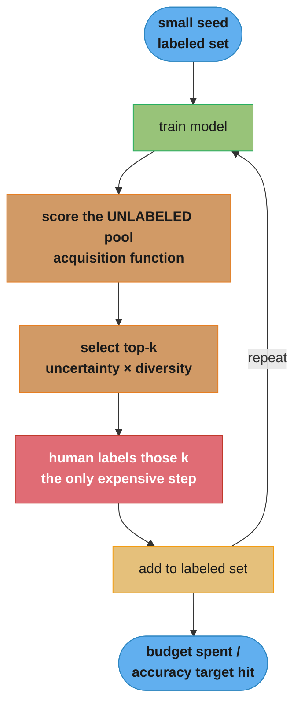
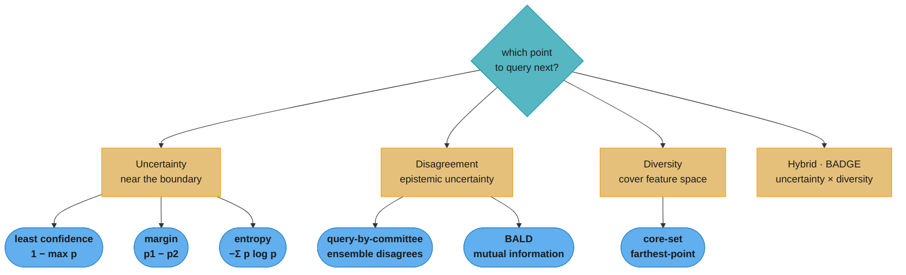
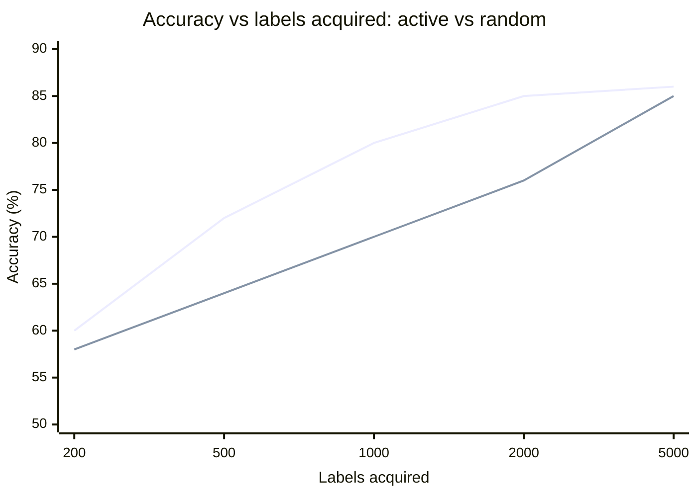
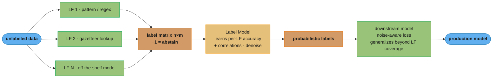
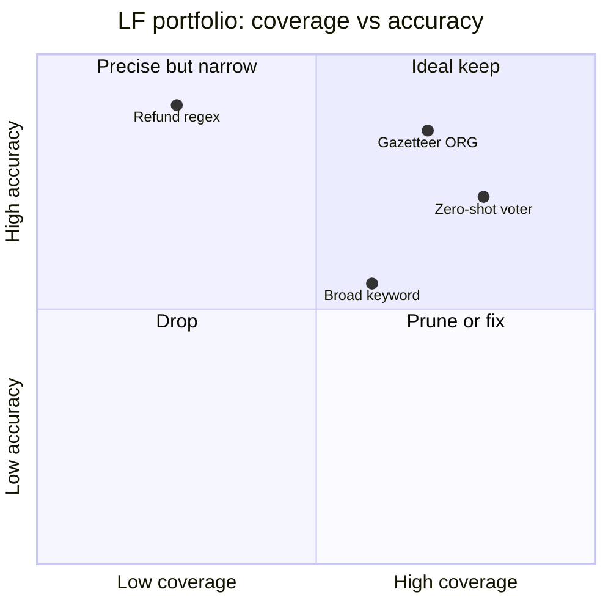

# Active Learning and Weak Supervision

> Phase 5 (ML Systems & Infrastructure). This module covers how to build a labeled dataset
> cheaply: active learning (let the model choose which examples to label) and weak supervision
> (generate noisy labels programmatically). It explains the "active learning" loop that the
> NLP and NER case studies reference but never define. See
> [data_pipelines_and_processing](../data_pipelines_and_processing/README.md) for the data
> plumbing and [natural_language_processing](../natural_language_processing/README.md) for the
> NER/classification tasks these techniques bootstrap.

---

## 1. Concept Overview

In most real projects the bottleneck is not the model — it is labeled data. Expert labels (a radiologist, a lawyer, a fraud analyst) are slow and expensive, and a naive "label everything" approach wastes most of the budget on easy, redundant examples that teach the model nothing. Two complementary disciplines attack this:

1. **Active learning** flips the usual loop: instead of labeling a random sample, the model *chooses* which unlabeled examples would be most informative to label next. By focusing human effort on the points the model is most uncertain about (or that best represent the unlabeled pool), it can reach a target accuracy with a fraction of the labels — often 2-5x fewer.

2. **Weak supervision** sidesteps manual labeling for the bulk of data. Instead of one expensive gold label per example, domain experts write *labeling functions* — heuristics, regexes, knowledge-base lookups, or existing models — that each emit noisy, possibly-conflicting labels. A *label model* then denoises and combines them into probabilistic training labels, producing a large (imperfect) training set from code rather than clicks.

Both fit a broader shift the field calls **data-centric AI**: holding the model fixed and systematically improving the data — its labels, coverage, and quality — is frequently the highest-ROI lever, more so than another architecture tweak. For a senior engineer, knowing how to bootstrap a dataset from 200 labels to a production model is as important as knowing the model itself.

---

## 2. Intuition

One-line analogy: active learning is a student who asks the teacher only about the problems they find confusing; weak supervision is writing a rubric of rough rules so a TA can grade thousands of papers approximately instead of the professor grading each perfectly.

Mental model (active learning): picture the decision boundary. Random labeling spends budget everywhere, including deep in regions the model already gets right. Active learning spends budget *at the boundary*, where one label resolves the most ambiguity — like a binary search choosing the most informative question each round.

Mental model (weak supervision): a single noisy rule is a weak voter. One rule that's 70% accurate is poor, but ten partially-independent rules that each cover different examples, when their agreements and disagreements are modeled, vote together into a much more accurate signal — and they cover far more data than any human could label by hand.

Why it matters: a fraud team with budget to label 5,000 of 10M transactions can either sample randomly (and learn little about rare fraud) or actively query the ambiguous and likely-positive cases (and learn a sharp boundary). A new NER project with 200 labeled sentences can stall — or bootstrap to tens of thousands of weakly-labeled sentences via gazetteers and patterns, then refine with active learning.

Key insight: more labels are not the goal — more *informative* labels are. Active learning maximizes information per label; weak supervision maximizes labels per unit of expert time. Used together, they turn a cold-start labeling problem into a tractable loop.

---

## 3. Core Principles

1. **Label informativeness, not volume.** The value of a label depends on what the model does not already know; redundant easy labels add little.
2. **Uncertainty marks the boundary.** Examples the model is least confident about sit near the decision boundary, where labels are most informative — but uncertainty alone can pick redundant or outlier points.
3. **Diversity guards against redundancy.** Querying a *batch* of similar uncertain points wastes budget; combine uncertainty with diversity/representativeness.
4. **Many noisy signals beat one when you model the noise.** Weak supervision works because a label model can estimate each source's accuracy and correlations and combine them, rather than naively majority-voting.
5. **Coverage and conflict are first-class.** A labeling function's value is its coverage (how many examples it labels) and its accuracy where it fires; conflicts between functions are information, not just error.
6. **Probabilistic labels, then a noise-aware learner.** Weak supervision yields soft labels; train a downstream model with a loss that respects label uncertainty rather than hard-thresholding too early.
7. **Beware feedback bias.** A model that chooses its own labeling targets can entrench its blind spots; mix in random samples and monitor the labeled distribution.

---

## 4. Types / Architectures / Strategies

### 4.1 Active learning scenarios

| Scenario | Setup | Use case |
|----------|-------|----------|
| Pool-based | Choose from a large fixed pool of unlabeled data | Most common (you have lots of unlabeled data) |
| Stream-based | Decide label-or-not per incoming example | Online/streaming, storage-constrained |
| Query synthesis | Generate a new example to label | Rare; risk of unrealistic queries |

### 4.2 Acquisition functions (which point to query)

| Strategy | Signal | Note |
|----------|--------|------|
| Least confidence | `1 - max p` | Simple; ignores runner-up |
| Margin sampling | `p_top1 - p_top2` | Smaller margin = more ambiguous |
| Entropy | `-Σ p log p` | Uses full distribution |
| Query-by-committee (QBC) | Disagreement across an ensemble | Captures epistemic uncertainty |
| BALD | Mutual information (Bayesian) | Information-theoretic; pairs with MC dropout |
| Core-set / diversity | Cover the feature space | Pure representativeness, batch-friendly |
| Hybrid (e.g. BADGE) | Uncertainty x diversity | Best for batch active learning |

### 4.3 Weak supervision sources

| Source | Example |
|--------|---------|
| Pattern/regex labeling functions | "if text matches `\$[0-9]+` -> MONEY" |
| Knowledge-base / gazetteer lookup | "if token in company list -> ORG" |
| Heuristics | "if review has 'refund' and 'never' -> negative" |
| Existing models / third-party APIs | off-the-shelf sentiment as one voter |
| Distant supervision | align text to a KB to label relations |
| Crowd labels (noisy) | multiple low-cost annotators per item |

### 4.4 Related semi-supervised techniques

- **Pseudo-labeling / self-training:** label unlabeled data with the current model's confident predictions, add to training, repeat (risk: confirmation bias).
- **Consistency regularization (e.g. FixMatch):** enforce that a model gives the same prediction to two augmentations of the same unlabeled input.

---

## 5. Architecture Diagrams

### Pool-based active learning loop



The loop concentrates the one expensive step (human labeling, red) on the top-k most
informative points rather than a random sample. Everything else — training, scoring,
selection — is cheap and repeated until the label budget or accuracy target is hit.

### Acquisition functions — which point to query next



Uncertainty strategies pick points near the boundary; disagreement strategies (QBC,
BALD) target *epistemic* uncertainty an ensemble can resolve; diversity/core-set
covers the space. Batch active learning uses the hybrid branch (BADGE) — multiply
uncertainty by diversity so a batch is informative *and* non-redundant.

### Label efficiency — active learning reaches the target with fewer labels



The upper curve (active learning) reaches ~85% accuracy at ~2,000 labels; the lower
curve (random sampling) needs ~5,000 for the same accuracy — the 2-5x label saving
active learning delivers by spending budget at the boundary instead of everywhere.

### Weak supervision pipeline (Snorkel-style)



Each labeling function emits noisy, abstaining votes into an n×m matrix; the label
model denoises them by learning each LF's accuracy and correlations (not a plain
majority vote). The downstream model trains on the resulting probabilistic labels so
it *generalizes beyond* the LFs' coverage.

### Labeling-function portfolio — coverage vs accuracy



An LF is judged on two axes: how much it covers and how accurate it is where it fires.
High-coverage high-accuracy functions are ideal; low-coverage high-accuracy ones are
precise but narrow (still useful); high-coverage low-accuracy functions inject noise
and should be pruned or fixed.

---

## 6. How It Works — Detailed Mechanics

### Uncertainty acquisition functions

```python
import numpy as np


def least_confidence(probs: np.ndarray) -> np.ndarray:
    """1 - max class probability. Higher = more uncertain."""
    return 1.0 - probs.max(axis=1)


def margin_sampling(probs: np.ndarray) -> np.ndarray:
    """Smaller top-2 margin = more ambiguous, so return the NEGATIVE margin."""
    part = np.sort(probs, axis=1)
    return -(part[:, -1] - part[:, -2])


def predictive_entropy(probs: np.ndarray, eps: float = 1e-12) -> np.ndarray:
    """Entropy of the predictive distribution; uses all classes."""
    return -np.sum(probs * np.log(probs + eps), axis=1)
```

### One active-learning iteration (pool-based)

```python
import numpy as np


def select_batch(
    pool_probs: np.ndarray, batch_size: int = 100
) -> np.ndarray:
    """
    Pick the batch_size most uncertain examples (entropy).
    Returns indices into the unlabeled pool to send for labeling.
    NOTE: pure uncertainty can pick near-duplicates; see the diversity version.
    """
    scores = predictive_entropy(pool_probs)
    return np.argsort(scores)[-batch_size:]


def active_learning_round(model, X_unlabeled, batch_size: int = 100) -> np.ndarray:
    probs = model.predict_proba(X_unlabeled)
    return select_batch(probs, batch_size)
    # label the returned indices, add to the training set, retrain, repeat.
```

### Adding diversity (avoid redundant batches)

```python
import numpy as np


def uncertainty_then_diversity(
    pool_probs: np.ndarray,
    pool_embeddings: np.ndarray,
    batch_size: int = 100,
    candidate_pool: int = 1000,
) -> list[int]:
    """
    Two-stage: take the most uncertain `candidate_pool`, then greedily pick a
    diverse subset (farthest-point / core-set) so the batch is not all near-dupes.
    """
    unc = predictive_entropy(pool_probs)
    candidates = list(np.argsort(unc)[-candidate_pool:])

    selected: list[int] = [candidates[0]]
    while len(selected) < batch_size and len(selected) < len(candidates):
        # pick the candidate farthest from everything already selected
        sel_emb = pool_embeddings[selected]
        best_idx, best_dist = None, -1.0
        for c in candidates:
            if c in selected:
                continue
            d = np.min(np.linalg.norm(pool_embeddings[c] - sel_emb, axis=1))
            if d > best_dist:
                best_idx, best_dist = c, d
        selected.append(best_idx)
    return selected
```

### Weak supervision: labeling functions and a simple label model

```python
import numpy as np

ABSTAIN, NEGATIVE, POSITIVE = -1, 0, 1


def lf_refund(text: str) -> int:
    """Heuristic LF: refund complaints are usually negative."""
    t = text.lower()
    if "refund" in t and ("never" in t or "waiting" in t):
        return NEGATIVE
    return ABSTAIN


def lf_praise(text: str) -> int:
    if any(w in text.lower() for w in ("love", "excellent", "amazing")):
        return POSITIVE
    return ABSTAIN


def apply_lfs(texts: list[str], lfs: list) -> np.ndarray:
    """Build the n x m label matrix (rows = examples, cols = LFs)."""
    return np.array([[lf(t) for lf in lfs] for t in texts])


def majority_label_model(L: np.ndarray) -> np.ndarray:
    """
    Baseline aggregation: majority vote over non-abstain LFs.
    Snorkel's LabelModel improves on this by learning per-LF accuracies and
    correlations (so a reliable LF outvotes several noisy ones).
    """
    out = np.full(L.shape[0], ABSTAIN)
    for i, row in enumerate(L):
        votes = row[row != ABSTAIN]
        if votes.size:
            out[i] = np.bincount(votes).argmax()
    return out
```

### LF quality metrics (what to track per labeling function)

```python
import numpy as np


def lf_summary(L_col: np.ndarray, y_dev: np.ndarray | None = None) -> dict:
    """Coverage = fraction labeled; empirical accuracy needs a small dev set."""
    fired = L_col != -1
    summary = {"coverage": float(fired.mean())}
    if y_dev is not None:
        correct = (L_col[fired] == y_dev[fired])
        summary["accuracy"] = float(correct.mean()) if fired.any() else 0.0
    return summary
    # An LF with 2% coverage and 95% accuracy and one with 40% coverage and 70%
    # accuracy are both useful for different reasons; track both.
```

---

## 7. Real-World Examples

**Snorkel at industrial scale:** Snorkel (Stanford/Google) replaced hand-labeling for many internal classifiers — engineers wrote dozens of labeling functions (patterns, KB lookups, existing models) to generate training labels for millions of examples, matching hand-labeled quality at a fraction of the cost, and crucially making labels *maintainable as code* when policies change.

**NER bootstrapping:** a new entity type with 200 gold sentences is bootstrapped with gazetteer LFs (lists of known entities), pattern LFs (capitalization + context words), and an off-the-shelf NER as one voter; the denoised labels train a BERT-CRF tagger that generalizes beyond the gazetteer — exactly the loop the [NER case study](../case_studies/design_ner_pipeline.md) alludes to.

**Content moderation:** active learning surfaces the borderline content the current model is most unsure about for human review, and those high-value labels are folded back in — far more efficient than randomly sampling mostly-benign content.

**Medical text classification:** clinical labels are expensive, so teams write distant-supervision LFs from billing codes and ontologies (SNOMED/ICD), denoise them, and train a model that outperforms one trained on the small hand-labeled set alone.

**Autonomous-vehicle data engines:** the canonical "data flywheel" — deployed models flag uncertain or rare scenes (active learning), those scenes are labeled and retrained, sharpening the model on its own failure cases. (The LLM analog is `../../llm/data_flywheels_and_continuous_learning/`.)

---

## 8. Tradeoffs

| Dimension | Random labeling | Active learning | Weak supervision |
|-----------|-----------------|-----------------|------------------|
| Label cost | High (label all) | Low (label informative) | Very low (write functions) |
| Label quality | Gold | Gold | Noisy (denoised) |
| Volume | Limited by budget | Limited by budget | Large (programmatic) |
| Setup effort | Trivial | Loop + infra | Write/maintain LFs |
| Main risk | Wastes budget | Sampling/feedback bias | LF noise & correlation |
| Best when | Cheap labels | Expensive expert labels | Domain heuristics exist |

| Active learning: strategy choice | When |
|----------------------------------|------|
| Uncertainty only | Small batches, cheap retrain |
| Uncertainty x diversity (BADGE) | Large batches (avoid redundancy) |
| Query-by-committee / BALD | Need epistemic uncertainty, have ensemble/MC dropout |
| Core-set (diversity only) | Cold start, no reliable model yet |

---

## 9. When to Use / When NOT to Use

### Use active learning when

- Labels are expensive (expert annotators) and unlabeled data is abundant.
- You can retrain and re-query iteratively (the loop is operationally feasible).
- The class boundary is the hard part and you want to spend budget there.

### Use weak supervision when

- Domain experts can articulate rules/heuristics even if they cannot label at scale.
- You need a large training set fast and can tolerate (then denoise) label noise.
- Labels must adapt as policy changes — LFs are code you can edit and re-run.

### When NOT to use them

- Labels are cheap/automatic (logged outcomes, click feedback) — just label more; active learning's overhead is not worth it.
- No reliable model or heuristics exist yet — active learning's uncertainty is meaningless on a model that knows nothing (start with random/diverse seed or weak supervision).
- The task is so subtle that no labeling function beats chance — weak supervision needs sources better than random.

### Watch out for

- Active learning's sampled set is biased by construction, so do not use it as an unbiased test set, and mix in random samples to avoid entrenching blind spots.

---

## 10. Common Pitfalls

### Pitfall 1: Using the actively-labeled set as a test set

```python
# BROKEN: evaluate on the actively-queried examples
# These were chosen BECAUSE the model was uncertain -> they are the hardest,
# most boundary-heavy examples -> test accuracy looks artificially LOW and is
# not representative of real traffic.

# FIX: hold out a separate, RANDOMLY sampled, i.i.d. test set for evaluation.
# Never evaluate on the active-learning queries.
```

### Pitfall 2: Pure-uncertainty batches that are all near-duplicates

```python
# BROKEN: in batch active learning, picking the top-k most uncertain points
batch = np.argsort(entropy)[-100:]
# If the 100 most uncertain points are 100 near-identical images, you pay for
# 100 labels but gain the information of ~1.

# FIX: combine uncertainty with diversity (core-set / BADGE) so the batch covers
# distinct regions of the input space.
```

### Pitfall 3: Feedback loops entrenching blind spots

A model that only ever queries near its current boundary never discovers a whole class or region it is systematically wrong about (because it is *confidently* wrong there, so uncertainty is low). Mitigate by always mixing in a fraction of random/diverse samples and by monitoring the labeled-data distribution against the unlabeled pool.

### Pitfall 4: Treating labeling functions as independent

```python
# BROKEN: majority vote assumes LFs are independent voters.
# If three LFs are copies of the same regex, they triple-count one signal and
# overwhelm a better, independent LF.

# FIX: use a label model (Snorkel LabelModel) that estimates LF accuracies AND
# correlations, so correlated LFs are down-weighted rather than triple-counted.
```

### Pitfall 5: Hard-thresholding weak labels too early

Converting probabilistic weak labels to hard 0/1 before training throws away the label model's confidence and forces the downstream model to treat a 0.55 label like a 0.99 one. Prefer a noise-aware/soft-label loss (train on the probabilistic labels) so the model discounts uncertain examples.

### Pitfall 6: Chasing coverage with low-accuracy LFs

Adding a labeling function that fires often but is barely better than chance injects noise that the label model may not fully cancel. Track each LF's coverage *and* empirical accuracy on a small dev set; prune or fix LFs that are high-coverage but low-accuracy.

---

## 11. Technologies & Tools

| Tool | Use Case | Notes |
|------|----------|-------|
| Snorkel / Snorkel Flow | Weak supervision: LFs + label model | The reference framework |
| modAL | Active learning loops on scikit-learn | Lightweight, composable strategies |
| small-text | Active learning for text classification | Transformers-friendly |
| baal | Bayesian active learning (MC dropout, BALD) | PyTorch, epistemic acquisition |
| cleanlab | Find label errors / confident learning | Data-centric label cleaning |
| Label Studio / Prodigy | Human-in-the-loop annotation UIs | Prodigy has built-in active learning |
| skweak | Weak supervision for NLP/NER | LF aggregation with HMM label model |

---

## 12. Interview Questions with Answers

**Q: What problem does active learning solve, and how?**
Active learning targets the high cost of labeled data by letting the model choose which unlabeled examples are most worth labeling, rather than labeling a random sample. It trains on a small seed set, scores the unlabeled pool with an acquisition function (usually uncertainty), sends the most informative examples to a human, adds those labels, and repeats. By concentrating expensive labeling effort near the decision boundary, it typically reaches a target accuracy with 2-5x fewer labels than random sampling.

**Q: What are the main acquisition functions and how do they differ?**
Uncertainty-based: least confidence (`1 - max p`), margin sampling (`p_top1 - p_top2`, smaller = more ambiguous), and entropy (uses the whole distribution). Disagreement-based: query-by-committee picks points where an ensemble disagrees, and BALD picks points of maximum mutual information (Bayesian). Diversity-based: core-set methods pick points that best cover the feature space regardless of uncertainty. In practice, batch active learning uses hybrids (e.g. BADGE) that multiply uncertainty by diversity so a batch is both informative and non-redundant.

**Q: What is stream-based active learning and when is it preferable to pool-based?**
Stream-based active learning decides label-or-not for each incoming example on the fly, rather than scoring a fixed pool. Because it sees examples one at a time and cannot rank the whole dataset, it uses a threshold or a query-probability on the acquisition score to accept or discard each item as it arrives. Prefer it over pool-based when data arrives as a stream and you cannot store or repeatedly rescore a large pool — online systems, edge devices, or storage-constrained settings — accepting that its per-example decisions are less globally optimal than pool ranking.

**Q: Why can't you evaluate an active-learning model on the examples it queried?**
Because those examples were selected *because the model was uncertain about them* — they are the hardest, most boundary-heavy points, not a representative sample of real traffic. Measuring accuracy on them understates true performance and is biased by the acquisition policy. You must keep a separate, randomly sampled i.i.d. test set for evaluation and never test on the queries.

**Q: What is the danger of pure-uncertainty sampling in batch active learning?**
If you simply take the top-k most uncertain points in one batch, they are often near-duplicates clustered in the same ambiguous region, so you pay for k labels but gain roughly the information of one. The fix is to add a diversity/representativeness term (core-set, BADGE) so the batch spans distinct regions of the input space — combining "where is the model unsure" with "what does the data look like."

**Q: What is weak supervision and how does it differ from active learning?**
Weak supervision generates training labels *programmatically* via labeling functions (heuristics, patterns, KB lookups, existing models) that emit noisy, conflicting, partial labels, then denoises them with a label model into probabilistic labels — producing a large training set without hand-labeling. Active learning instead reduces the *number* of gold labels a human must provide by choosing the most informative ones. They are complementary: weak supervision gives broad noisy coverage cheaply; active learning spends scarce gold labels where they matter most.

**Q: How does a label model combine noisy labeling functions better than majority vote?**
Majority vote treats every labeling function as an equally-reliable, independent voter, so it over-trusts correlated or inaccurate functions. A label model (e.g. Snorkel's) estimates each function's accuracy and the correlations between functions — typically without ground truth, using the agreement/disagreement structure across the label matrix — and weights them accordingly, so a reliable independent function can outvote several noisy correlated ones. The output is a probabilistic label per example.

**Q: Why train a downstream model on weak labels instead of just using the label model's output?**
The label model only labels examples that at least one labeling function covers, and only as well as the functions allow. Training a downstream model (e.g. BERT) on the probabilistic labels lets it *generalize beyond LF coverage* — it learns the underlying features and can label examples no function fired on, smoothing over individual LF noise. This generalization is the whole point: LFs are a means to a training set, not the final classifier.

**Q: Why train on soft probabilistic weak labels instead of hard-thresholding them to 0/1 first?**
Hard-thresholding weak labels to 0/1 discards the label model's confidence and forces the downstream model to treat a 0.55 label exactly like a 0.99 one. Weak supervision produces *probabilistic* labels precisely because the sources disagree; collapsing a 0.55 to a hard 1 injects overconfident noise the downstream model then fits as if it were certain. Train with a noise-aware/soft-label loss (e.g. cross-entropy against the probabilistic target) so uncertain examples contribute less gradient and the model naturally down-weights the label model's borderline calls.

**Q: What metrics describe a labeling function's quality?**
Coverage (the fraction of examples it labels rather than abstains on), empirical accuracy where it fires (measured on a small dev set), and its conflict/overlap with other functions. A high-coverage low-accuracy function injects noise; a low-coverage high-accuracy function is a precise but narrow signal. You want a portfolio of functions that together cover the data while the label model resolves their conflicts; track all three and prune functions that are high-coverage but near-chance.

**Q: What is distant supervision and how does it generate weak labels?**
Distant supervision aligns unlabeled text to an external knowledge base to generate noisy labels automatically, without any hand-annotation. The classic use is relation extraction: if a KB says two entities are related, every sentence mentioning both entities is heuristically labeled with that relation — cheap coverage at the cost of noise (many such sentences do not actually express the relation). In practice it becomes one labeling function among several (e.g. billing-code or SNOMED/ICD lookups for medical text), and a label model denoises it against the other sources rather than trusting it outright.

**Q: What is the feedback-loop/bias risk in active learning?**
Because the model selects its own labeling targets based on its current uncertainty, it can systematically ignore regions where it is *confidently wrong* (low uncertainty, high error), entrenching blind spots and never discovering an entire under-represented class. The labeled set also becomes non-representative of the data distribution. Mitigate by mixing in random/diverse samples each round, monitoring the labeled distribution against the unlabeled pool, and never reusing the queried set as a test set.

**Q: How does active learning relate to uncertainty quantification?**
Active learning's uncertainty-based acquisition *is* an uncertainty estimate, and it specifically wants *epistemic* uncertainty — the model's ignorance, which more labels can fix — not aleatoric noise, which they cannot. Querying high-aleatoric (inherently ambiguous) points wastes budget on examples no amount of labeling resolves. So good active learning uses epistemic signals (ensemble/BALD disagreement) rather than raw softmax. See `../uncertainty_quantification_and_conformal_prediction/`.

**Q: What is pseudo-labeling and what is its main risk?**
Pseudo-labeling (self-training) uses the current model's confident predictions on unlabeled data as if they were true labels, adds them to training, and repeats. Its main risk is confirmation bias: the model reinforces its own mistakes, since wrong-but-confident pseudo-labels get baked in and amplified each round. Mitigations include high confidence thresholds, calibration before thresholding, only adding a limited number per round, and consistency regularization (FixMatch) that ties pseudo-labels to agreement across augmentations.

**Q: What is consistency regularization (e.g. FixMatch) and how does it use unlabeled data?**
Consistency regularization enforces that a model gives the same prediction to two augmentations of the same unlabeled input, turning unlabeled data into a training signal. FixMatch operationalizes this: it takes a *weakly* augmented view, keeps its prediction as a pseudo-label only when confidence exceeds a threshold, then trains the model to match that pseudo-label on a *strongly* augmented view of the same image. It combines pseudo-labeling with consistency, and the confidence gate plus strong augmentation are what keep it from collapsing into the confirmation bias that plagues naive self-training.

**Q: You have 200 labeled examples and 2 million unlabeled. How do you build a production NER model?**
Bootstrap with weak supervision: write gazetteer LFs (known entity lists), pattern LFs (capitalization plus trigger words), and use an off-the-shelf NER as one noisy voter; denoise with a label model to get probabilistic labels over a large slice of the 2M. Train a BERT-CRF on those weak labels so it generalizes beyond the gazetteers. Then run active learning: have the model flag its most uncertain sentences, have a human gold-label a few hundred (entity-level), fold them in, and iterate. Keep a separate randomly-sampled gold test set throughout.

**Q: What is data-centric AI and why has it gained traction?**
Data-centric AI holds the model architecture fixed and systematically improves the *data* — fixing label errors, improving coverage and consistency, and balancing classes — as the primary way to raise performance. It gained traction because, on many real problems, label noise and gaps cap accuracy more than model choice does, and modern architectures are mature enough that another tweak yields less than cleaner data. Active learning, weak supervision, and label-error detection (e.g. cleanlab) are its core tools.

**Q: How do you decide between buying more labels, active learning, and weak supervision?**
If labels are cheap/automatic (logged outcomes, clicks), just collect more — the overhead of clever selection is not worth it. If labels require expensive experts and you have abundant unlabeled data and a workable model, active learning maximizes accuracy per label. If experts can express rules but cannot label at scale, or you need a large set fast and can tolerate denoised noise, weak supervision wins. They combine well: weak supervision for broad coverage, active learning to spend the scarce gold labels at the boundary.

**Q: What is the cold-start problem in active learning and how do you handle it?**
At the start there is no reliable model, so uncertainty estimates are meaningless — everything looks uncertain or the model is confidently wrong everywhere. Bootstrapping with uncertainty sampling can pick useless or outlier points. Handle it by seeding with a random or diversity-based (core-set) sample to cover the space, or by using weak supervision to produce an initial model, and only switch to uncertainty-based acquisition once the model is good enough for its uncertainty to be informative.

---

## 13. Best Practices

1. Always keep a separate, randomly-sampled i.i.d. test set; never evaluate on actively-queried examples.
2. For batch active learning, combine uncertainty with diversity (BADGE/core-set) so batches are informative *and* non-redundant.
3. Prefer epistemic uncertainty (ensembles/BALD) over raw softmax for acquisition; querying aleatoric noise wastes budget.
4. Mix a fraction of random samples into every active-learning round to avoid feedback-loop blind spots, and monitor the labeled vs unlabeled distribution.
5. Solve the cold start with a random/diverse seed or weak supervision before trusting uncertainty.
6. Track coverage *and* accuracy for every labeling function; prune high-coverage low-accuracy ones.
7. Use a label model that accounts for LF correlations (not plain majority vote), and train the downstream model on soft/probabilistic labels.
8. Treat labeling functions as maintained code (versioned, tested, reviewed) so labels can adapt when policy changes — a core advantage over one-off hand labels.
9. Combine the two: weak supervision for broad cheap coverage, active learning to place the scarce gold labels where they matter.

---

## 14. Case Study

**Scenario: bootstrapping an intent classifier from a near-empty label budget.** A support team needs a 30-intent classifier over 4 million historical tickets but has only 200 hand-labeled examples and a small annotation budget (~1,500 more labels). A model trained on 200 examples across 30 classes is useless. The plan: weak supervision to create a large noisy training set, then active learning to spend the 1,500 gold labels where they most help.

**Step 1 — Weak supervision for broad coverage.** Domain experts (support leads) write ~40 labeling functions: keyword/pattern LFs ("password" + "reset" -> account_access), a gazetteer of product names mapped to product intents, and an off-the-shelf zero-shot classifier as one noisy voter.

```python
L = apply_lfs(ticket_texts, lfs)             # 4M x 40 label matrix (-1 = abstain)
# Snorkel LabelModel learns per-LF accuracy + correlations, not majority vote:
# from snorkel.labeling.model import LabelModel
# label_model = LabelModel(cardinality=30); label_model.fit(L)
# probs = label_model.predict_proba(L)
```

Coverage analysis shows the LFs label ~1.6M tickets with usable confidence; some intents (rare billing edge cases) have near-zero coverage — flagged for active learning.

**Step 2 — Train a downstream model on soft labels.** A DistilBERT classifier trains on the ~1.6M probabilistic labels with a soft-label loss, generalizing beyond LF coverage to label tickets no function fired on. This v0 model reaches ~0.71 macro-F1 — weak, but a real starting point.

**Step 3 — Active learning for the scarce gold budget.** Using the v0 model, run uncertainty-plus-diversity acquisition, prioritizing the low-coverage intents:

```python
probs = model.predict_proba(X_unlabeled)
batch = uncertainty_then_diversity(probs, embeddings, batch_size=300)
# experts gold-label these 300; add to training; retrain; repeat ~5 rounds (1,500 labels)
```

Each round targets the boundary and the under-covered intents rather than re-labeling easy, well-covered tickets.

**Broken -> fix during the build:** the first active-learning round queried 300 of the most uncertain tickets and they were nearly all the same two ambiguous intents phrased slightly differently.

```python
# BROKEN: pure uncertainty -> redundant batch
batch = np.argsort(predictive_entropy(probs))[-300:]   # ~280 near-duplicates

# FIX: uncertainty to shortlist, then farthest-point diversity to spread the batch
batch = uncertainty_then_diversity(probs, embeddings, batch_size=300,
                                   candidate_pool=3000)
```

A second issue: the team initially evaluated on the queried tickets and panicked at a 0.55 "accuracy" — until they realized those were the hardest examples by construction and moved evaluation to a held-out random gold set.

**Outcome.** After weak supervision plus five active-learning rounds (1,500 gold labels total), macro-F1 reaches ~0.86 — versus ~0.71 from weak supervision alone and far above anything 200 labels could produce. The rare intents, deliberately targeted by active learning, go from ~0.3 to ~0.7 F1. The labeling functions remain in version control, so when the product adds a new feature the team edits an LF and regenerates labels instead of re-annotating from scratch.

**Interview discussion points.** Why 200 labels demanded weak supervision rather than straight active learning; why the downstream model must generalize beyond LF coverage; how a correlation-aware label model beats majority vote; why the first uncertainty-only batch was redundant and how diversity fixed it; and why evaluating on queried examples gave a misleadingly low number.

---

## See Also

- [uncertainty_quantification_and_conformal_prediction](../uncertainty_quantification_and_conformal_prediction/README.md) — epistemic uncertainty is the acquisition signal
- [data_pipelines_and_processing](../data_pipelines_and_processing/README.md) — the data infrastructure behind labeling loops
- [natural_language_processing](../natural_language_processing/README.md) — NER/classification tasks these techniques bootstrap
- [case_studies/design_ner_pipeline.md](../case_studies/design_ner_pipeline.md) — active learning in an NER pipeline
- `../../llm/data_flywheels_and_continuous_learning/` — the LLM analog of the data-engine loop
- `../../llm/synthetic_data_generation/` — generating training data with LLMs (a modern weak-supervision source)
