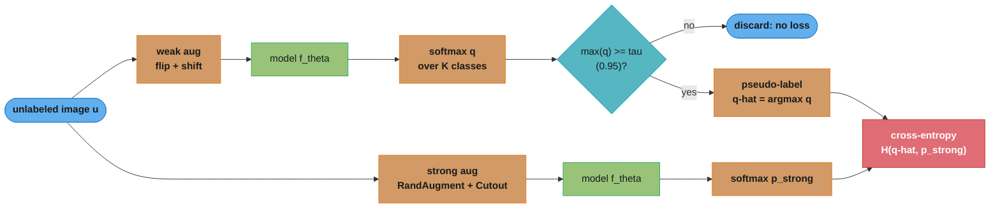
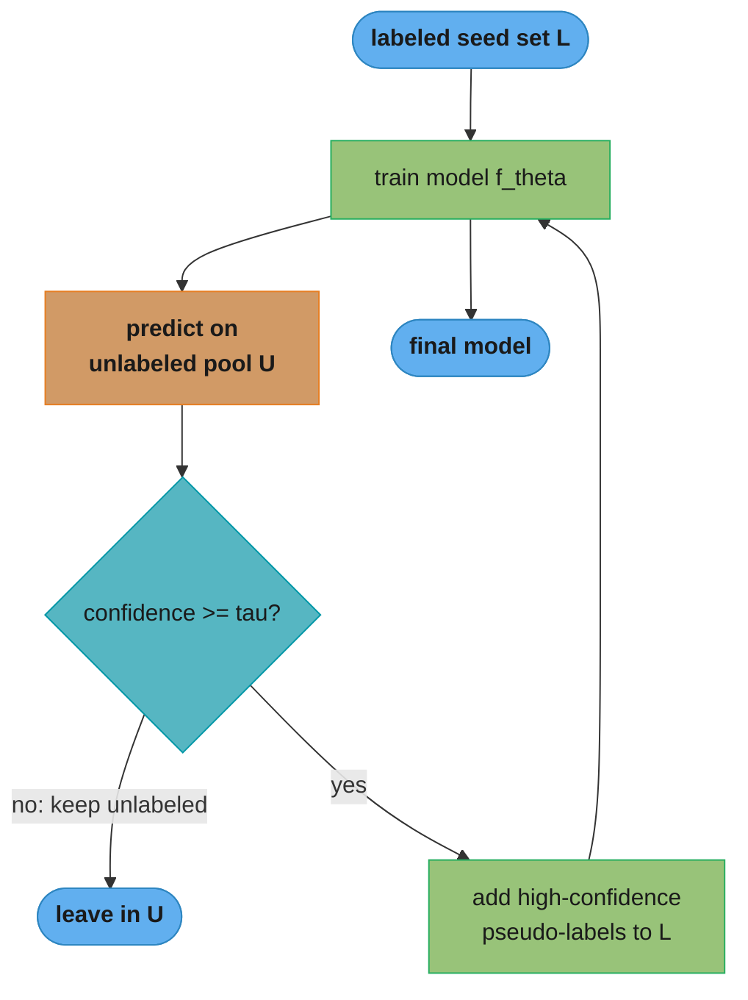
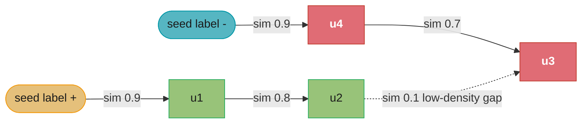
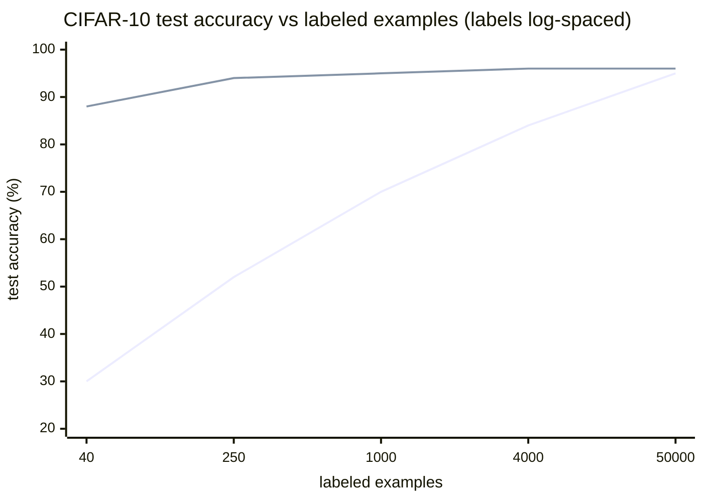

# Semi-Supervised Learning — Deep Dive

> Deep dive extending §4.4 of the parent module
> [active_learning_and_weak_supervision](./README.md), which names pseudo-labeling and
> FixMatch but does not develop them. This file is the mechanics: the three assumptions
> that decide whether unlabeled data helps, self-training and its confirmation-bias trap,
> consistency regularization (Pi-model, Mean Teacher), FixMatch/MixMatch, and graph-based
> label propagation. Cross-links: `../graph_neural_networks/README.md`,
> `../computer_vision/self_supervised_vision.md`,
> `../self_supervised_and_contrastive_learning/README.md`.

## 1. Concept Overview

Semi-supervised learning (SSL) trains on a small labeled set `L` together with a large unlabeled set `U`, where typically `|U| >> |L|` (e.g. 40 labeled and 50,000 unlabeled CIFAR-10 images). It sits between supervised learning (all labels) and unsupervised learning (no labels), and it answers one question that dominates real projects: **when the unlabeled data is nearly free, can it lift accuracy that the handful of labels alone cannot reach?**

The answer is conditional. Unlabeled data carries information about the *marginal* distribution `p(x)` — where the data clusters, which manifold it lives on — but nothing directly about `p(y|x)`. SSL only helps when the structure of `p(x)` is informative about `p(y|x)`; that link is exactly what the three SSL assumptions (smoothness, cluster/low-density, manifold; §3) formalize. When those assumptions hold, modern SSL closes most of the gap to fully-supervised training: **FixMatch reaches ~88–94% test accuracy on CIFAR-10 with only 40 labels (4 per class), versus ~95% for the fully-supervised model trained on all 50,000 labels.** When they are violated, SSL can *hurt* — adding unlabeled data drives accuracy *below* the supervised-only baseline.

SSL is distinct from two neighbors it is constantly confused with. **Self-supervised pretraining** (SimCLR, MAE, BERT) also uses unlabeled data, but it learns a task-agnostic representation via a pretext task and only sees labels in a separate fine-tuning stage; SSL uses labels and unlabeled data *jointly in one objective*. **Active learning** (the parent module) reduces the *number* of gold labels a human must supply by choosing the most informative ones; SSL exploits unlabeled data *without* asking for more labels. The three are complementary and often stacked.

---

## 2. Intuition

One-line analogy: a student given ten worked examples and a thousand unworked problems can still learn a lot — the unworked problems reveal which problems look alike, so the ten worked answers "spread" to their neighbors.

Mental model: the labeled points pin down a few locations; the unlabeled cloud reveals the shape of the terrain between them. If the terrain has valleys (dense clusters) separated by ridges (low-density gaps), the decision boundary should run along the ridges — and unlabeled data is what makes the ridges visible. With only labels you would draw a boundary that cuts straight through a valley.

Why it matters: labels are the budget-limited resource; raw data is usually abundant and cheap. A team with 200 labeled medical images and 200,000 unlabeled scans can either train on 200 (and overfit) or let the 200,000 shape the representation and the boundary. That is often the difference between a 70% and an 88% classifier at zero extra labeling cost.

Key insight: **unlabeled data tells you where the data is, not what it means.** SSL turns "where the data is" into a usable training signal by *assuming* the label surface is smooth and the boundary lives in the sparse regions. The whole game is (a) picking methods whose assumptions match your data and (b) not letting the model's early wrong guesses feed back into itself (confirmation bias).

---

## 3. Core Principles

**The three SSL assumptions.** Every SSL method leans on at least one of these, and it *silently fails* when they do not hold for your data:

1. **Smoothness (continuity) assumption.** If two points are close in input space, their labels are likely the same. This licenses consistency regularization: a perturbed input should get the same prediction.
2. **Cluster / low-density-separation assumption.** Points in the same cluster share a label, so the decision boundary should pass through *low-density* regions, not dense ones. This licenses entropy minimization and pseudo-labeling (push the boundary out of the dense clusters).
3. **Manifold assumption.** High-dimensional data lies near a much lower-dimensional manifold, and the label varies smoothly *along* the manifold. This licenses graph-based methods that measure distance along the data manifold rather than in raw pixel/token space.

**Consistency is a free supervision signal.** For unlabeled `x`, you do not know `y`, but you *do* know that a label-preserving transform of `x` (crop, flip, dropout, EMA of weights) must not change the prediction. Enforcing that invariance is a loss you can compute without any label.

**Entropy minimization sharpens the boundary.** Confident predictions on unlabeled data push the boundary away from dense regions (the low-density assumption made into a loss). Overdone, it collapses everything to one class — hence it is always paired with a supervised anchor.

**Pseudo-labels are only as good as their calibration.** Self-training treats confident predictions as truth. If the model is over-confident (typical for deep nets), a low confidence bar admits wrong labels that the model then *reinforces* — confirmation bias. High thresholds and strong augmentation are the guardrails.

**When SSL hurts.** If `p(x)` structure is unrelated to `p(y|x)` (assumptions violated), or the unlabeled set's class distribution differs from the labeled set's (distribution mismatch — e.g. `U` contains out-of-distribution classes), the extra "signal" is noise or bias, and SSL underperforms the supervised baseline. Always keep a supervised-only baseline to detect this.

---

## 4. Types / Architectures / Strategies

### 4.1 The three assumptions and what they license

| Assumption | Statement | Methods it licenses | Fails when |
|-----------|-----------|--------------------|-----------|
| Smoothness | close inputs -> same label | Consistency reg (Pi, Mean Teacher, UDA) | Classes interleave finely |
| Cluster / low-density | boundary lies in sparse regions | Pseudo-labeling, entropy min, S3VM | Clusters mix classes |
| Manifold | data on low-dim manifold; label smooth along it | Label propagation/spreading, graph SSL | No manifold structure |

### 4.2 Family taxonomy

| Family | Core idea | Representative methods |
|--------|-----------|-----------------------|
| Self-training | model labels its own confident unlabeled data | Pseudo-labeling, Noisy Student |
| Consistency regularization | invariance to perturbation | Pi-model, Temporal Ensembling, Mean Teacher, UDA |
| Hybrid / holistic | consistency + pseudo-label + mixup + sharpening | MixMatch, ReMixMatch, **FixMatch** |
| Graph-based (transductive) | diffuse labels over a similarity graph | Label Propagation, Label Spreading |
| Multi-view | two feature views teach each other | Co-training, Tri-training |
| Generative | model `p(x,y)` jointly | SSL-VAE, GAN-based |

### 4.3 Self-training / pseudo-labeling

Train on `L`, predict on `U`, keep predictions whose confidence exceeds `tau`, add them to the training set with their predicted (hard) label, retrain, repeat. Simple and model-agnostic. The failure mode is **confirmation bias**: an early mistake becomes a training label, the model grows *more* confident in it, and the error compounds. Controls: a high `tau` (0.9–0.95), calibrating probabilities before thresholding, capping how many pseudo-labels are added per round, and re-deriving pseudo-labels each round rather than freezing them. **Noisy Student** (Xie et al., 2020) is self-training done at scale: a larger student is trained on teacher pseudo-labels *with noise* (dropout, stochastic depth, RandAugment) added to the student, which is what lets it surpass the teacher.

### 4.4 Consistency regularization

The loss is `d(f(aug1(x)), f(aug2(x)))` on unlabeled `x`, for some distance `d` (MSE or KL). Variants differ in what provides the second, more stable prediction (the "target"):

| Method | Target comes from | Note |
|--------|-------------------|------|
| Pi-model | a second stochastic forward pass (different dropout/aug) | Two forward passes per step; noisy target |
| Temporal Ensembling | EMA of the model's *past predictions* per example | Stable target, but stores a prediction vector per example (memory) |
| Mean Teacher | prediction of an **EMA of the model's weights** (teacher) | Averages weights not predictions; scales to large `U`; the standard |

**Mean Teacher (Tarvainen & Valpola, 2017)** keeps a "teacher" network whose weights are an exponential moving average of the "student": `theta_teacher = decay * theta_teacher + (1 - decay) * theta_student`, with `decay ~ 0.999`. The teacher gives more stable targets than any single noisy forward pass, and averaging in weight space is cheaper and smoother than averaging predictions.

### 4.5 FixMatch and holistic methods

**FixMatch (Sohn et al., 2020)** is the dominant modern recipe because it is simple and strong. For each unlabeled image it (1) computes a prediction on a **weakly** augmented view (flip + shift), (2) keeps it *only if* the max softmax probability exceeds `tau = 0.95`, hardening it into a one-hot pseudo-label, and (3) trains the model to predict that pseudo-label on a **strongly** augmented view (RandAugment + Cutout) via cross-entropy. The asymmetry is the crux: the weak view yields a *reliable* target; the strong view is the *hard* input the model must learn to be invariant to. FixMatch = confidence-thresholded pseudo-labeling + strong-augmentation consistency, unified.

Precursors it subsumes:

- **MixMatch (Berthelot et al., 2019):** average predictions over K augmentations of an unlabeled image, **sharpen** the average (temperature `T` on the softmax) into a soft pseudo-label, then **mixup** labeled and unlabeled examples and train on the mixed targets. Sharpening implements entropy minimization; mixup enforces linear-in-between smoothness.
- **ReMixMatch:** adds *distribution alignment* (make pseudo-label marginals match the labeled-set class distribution) and *augmentation anchoring*.
- **UDA (Unsupervised Data Augmentation):** consistency between a prediction on the original unlabeled input and on an *advanced-augmentation* view (RandAugment for images, back-translation for text). UDA is what made consistency SSL work well for NLP.

### 4.6 Graph-based / transductive (label propagation & spreading)

Build a similarity graph over *all* points (labeled + unlabeled) — usually kNN or an RBF kernel — then let labels diffuse from labeled nodes to unlabeled neighbors, so the manifold assumption does the work. **Label Propagation** clamps the seed labels; **Label Spreading** uses a normalized graph Laplacian and allows soft relabeling (parameter `alpha`), which is more robust to label noise. These are **transductive**: they output labels only for the specific points in the graph, not a function you can apply to new data — to generalize you train an inductive model on the propagated labels afterward. This is the SSL cousin of the message-passing idea in `../graph_neural_networks/README.md` (a GCN is essentially learnable, feature-aware label propagation).

### 4.7 Co-training, entropy minimization

- **Co-training (Blum & Mitchell, 1998):** requires two conditionally-independent feature *views* (e.g. a web page's text and its inbound-link text). Train one classifier per view; each labels the unlabeled examples it is most confident about and hands them to the *other* classifier. Works only when the two views are genuinely complementary and each is sufficient on its own. **Tri-training** relaxes the view requirement using three models and majority agreement.
- **Entropy minimization (Grandvalet & Bengio, 2005):** add `-Σ p log p` on unlabeled predictions to the loss so the model is *confident* on unlabeled data, pushing the boundary into low-density regions. Rarely used alone (it can collapse to a single class); it is a component inside MixMatch (via sharpening) and is implicit in FixMatch's hard pseudo-labels.

---

## 5. Architecture Diagrams

### 5.1 FixMatch: weak-view pseudo-label, strong-view consistency



*The pseudo-label is derived from the reliable weak view and applied only if confident; the loss makes the model reproduce it on the hard strong view. `mw` and `ms` are the same weights `f_theta`. This asymmetry is why FixMatch avoids the confirmation bias that plain pseudo-labeling suffers.*

### 5.2 Self-training / pseudo-labeling loop



*Each round re-derives pseudo-labels from the current model. A low `tau` here is exactly where confirmation bias enters: wrong-but-confident labels feed back into `L` and compound.*

### 5.3 Label propagation over a similarity graph (transductive)



*Labels diffuse along high-similarity edges: `u1,u2` absorb positive (green), `u3,u4` absorb negative (red). The dotted low-weight edge marks the sparse region where the boundary lands — the manifold and low-density assumptions working together. Predictions exist only for these graph nodes (transductive).*

### 5.4 Accuracy vs number of labeled examples: supervised vs SSL



*Upper line = FixMatch (SSL) using the 50,000-image unlabeled pool; lower line = supervised-only on the same labels. SSL's advantage is enormous in the low-label regime (40 labels: ~88% vs ~30%) and vanishes as labels approach the full set — the classic SSL payoff curve.*

---

## 6. How It Works — Detailed Mechanics

### 6.1 Pseudo-labeling with a confidence threshold

```python
from __future__ import annotations

import torch
import torch.nn as nn
import torch.nn.functional as F
from torch import Tensor


@torch.no_grad()
def confident_pseudo_labels(
    model: nn.Module, u: Tensor, tau: float = 0.95
) -> tuple[Tensor, Tensor]:
    """Return (indices_kept, hard_pseudo_labels) for unlabeled batch `u`.

    Only predictions with max softmax probability >= tau are kept. A LOW tau is
    the classic confirmation-bias trap: wrong-but-confident labels get baked in.
    """
    probs = F.softmax(model(u), dim=1)
    max_probs, hard = probs.max(dim=1)
    keep = (max_probs >= tau).nonzero(as_tuple=True)[0]
    return keep, hard[keep]
```

### 6.2 FixMatch training step (the core recipe)

```python
def fixmatch_step(
    model: nn.Module,
    x_lab: Tensor,          # weakly-augmented labeled batch
    y_lab: Tensor,          # true labels
    u_weak: Tensor,         # weakly-augmented unlabeled batch
    u_strong: Tensor,       # strongly-augmented SAME unlabeled batch
    tau: float = 0.95,
    lambda_u: float = 1.0,
) -> tuple[Tensor, Tensor]:
    """One FixMatch optimization step.

    Supervised CE on labeled data + masked consistency CE on unlabeled data,
    where the target is the hard pseudo-label from the WEAK view (no gradient),
    and the input the loss is applied to is the STRONG view.
    Returns (total_loss, fraction_of_U_used).
    """
    # supervised term
    loss_sup = F.cross_entropy(model(x_lab), y_lab)

    # pseudo-labels from the weak view — detached target, no gradient flows in
    with torch.no_grad():
        probs_weak = F.softmax(model(u_weak), dim=1)
        max_probs, pseudo = probs_weak.max(dim=1)
        mask = (max_probs >= tau).float()          # 1.0 where confident

    # consistency term: predict the hard pseudo-label on the strong view
    logits_strong = model(u_strong)
    loss_u_per = F.cross_entropy(logits_strong, pseudo, reduction="none")
    loss_unsup = (loss_u_per * mask).mean()

    total = loss_sup + lambda_u * loss_unsup
    return total, mask.mean()   # mask.mean() = coverage of the unlabeled batch
```

Early in training almost every unlabeled example is below `tau`, so `mask.mean()` is near 0 and the model learns mostly from `L`; as it improves, coverage climbs toward 1 and `U` dominates. This *self-paced* ramp is why FixMatch needs no explicit `lambda_u` schedule (it fixes `lambda_u = 1`).

### 6.3 Mean Teacher: EMA weights as a stable target

```python
@torch.no_grad()
def update_ema(student: nn.Module, teacher: nn.Module, decay: float = 0.999) -> None:
    """teacher <- decay * teacher + (1 - decay) * student (weights, not preds)."""
    for t_p, s_p in zip(teacher.parameters(), student.parameters()):
        t_p.mul_(decay).add_(s_p, alpha=1.0 - decay)
    for t_b, s_b in zip(teacher.buffers(), student.buffers()):
        t_b.copy_(s_b)   # copy BatchNorm running stats verbatim


def mean_teacher_consistency(
    student: nn.Module,
    teacher: nn.Module,
    aug1: Tensor,        # student sees one augmentation
    aug2: Tensor,        # teacher sees another augmentation of the same input
    weight: float = 1.0,
) -> Tensor:
    """MSE between student softmax (aug1) and EMA-teacher softmax (aug2)."""
    student_p = F.softmax(student(aug1), dim=1)
    with torch.no_grad():
        teacher_p = F.softmax(teacher(aug2), dim=1)
    return weight * F.mse_loss(student_p, teacher_p)
```

The teacher is never trained by gradient descent — only by the EMA update. Because its weights are a temporal average of the student, its predictions are smoother and more accurate than any single student snapshot, which is exactly what makes it a trustworthy consistency target.

### 6.4 Entropy minimization (the low-density assumption as a loss)

```python
def entropy_minimization(logits_unlabeled: Tensor) -> Tensor:
    """Mean predictive entropy on unlabeled data; minimizing it pushes the
    boundary out of dense regions. Use ONLY alongside a supervised anchor —
    on its own it collapses all predictions to one class."""
    p = F.softmax(logits_unlabeled, dim=1)
    log_p = F.log_softmax(logits_unlabeled, dim=1)
    return -(p * log_p).sum(dim=1).mean()
```

### 6.5 Graph-based label spreading (transductive, sklearn)

```python
import numpy as np
from sklearn.semi_supervised import LabelSpreading


def label_spreading(X: np.ndarray, y_partial: np.ndarray) -> np.ndarray:
    """X = ALL points (labeled + unlabeled); y_partial uses -1 for unlabeled.

    LabelSpreading diffuses labels over a kNN graph using a normalized Laplacian;
    alpha=0.2 lets ~20% of a node's label come from neighbors (noise-robust).
    Transductive: returns a label for every input row, not a reusable model.
    """
    model = LabelSpreading(kernel="knn", n_neighbors=7, alpha=0.2, max_iter=1000)
    model.fit(X, y_partial)
    return model.transduction_   # inferred label for each of the N points
```

To generalize beyond these N points, train an inductive classifier (e.g. a small MLP) on `(X, model.transduction_)` — the propagated labels become a training set.

### 6.6 Ramp-up schedule for the consistency weight

```python
def consistency_ramp_up(step: int, ramp_steps: int, max_weight: float) -> float:
    """Sigmoid ramp so consistency starts near 0 (model still random -> bad
    targets) and reaches max_weight after ramp_steps. Standard for Pi/Mean
    Teacher; FixMatch avoids it because its confidence mask self-paces instead."""
    if step >= ramp_steps:
        return max_weight
    phase = 1.0 - step / ramp_steps
    return float(max_weight * np.exp(-5.0 * phase * phase))
```

---

## 7. Real-World Examples

**Image classification with scarce labels (FixMatch/Noisy Student).** The canonical benchmark: CIFAR-10 with 40–250 labels, SVHN, STL-10. FixMatch hits ~88–94% on CIFAR-10 with 40 labels; Noisy Student pushed ImageNet to 88.4% top-1 by self-training a student on ~300M unlabeled JFT images with the teacher's pseudo-labels plus heavy student noise. This is the standard playbook when you have a large unlabeled image pool and a small annotation budget. See `../computer_vision/self_supervised_vision.md` for the pretraining alternative.

**NLP text classification (UDA).** UDA (consistency between original text and its back-translation) matched supervised BERT on IMDb sentiment using only 20 labeled examples per class, because back-translation is a strong, meaning-preserving augmentation. In practice teams combine self-supervised pretraining (BERT) with UDA-style consistency fine-tuning when labels are few.

**Medical imaging.** Labels require radiologists (expensive, slow); unlabeled scans are plentiful. Mean Teacher and FixMatch are widely used for chest X-ray and pathology classification, and consistency under realistic augmentations (rotation, intensity shift) both improves accuracy and regularizes against annotator noise.

**Speech (Noisy Student for ASR).** Google applied Noisy Student to speech recognition: a teacher labels a huge unlabeled audio corpus, a noised student trains on those pseudo-transcripts, cutting word error rate — the same self-training loop as vision.

**Graph / relational data (label propagation).** Fraud rings, citation networks, and product-category tagging use label spreading over a similarity or interaction graph to extend a few known labels across the network — the transductive precursor to graph neural networks (`../graph_neural_networks/README.md`).

---

## 8. Tradeoffs

### 8.1 Method family comparison

| Method | Assumption used | Extra compute | Memory | Confirmation-bias risk | Best for |
|--------|-----------------|---------------|--------|------------------------|----------|
| Pseudo-labeling (self-training) | Cluster/low-density | Low (re-predict `U`) | Low | **High** (needs high `tau`) | Any model; quick win |
| Pi-model | Smoothness | 2x forward | Low | Medium | Small `U` |
| Temporal Ensembling | Smoothness | 1x forward | High (per-example preds) | Medium | Fixed dataset |
| Mean Teacher | Smoothness | 2 networks | Medium (teacher copy) | Low | Large `U`, standard baseline |
| FixMatch | Smoothness + low-density | Strong-aug + 2 views | Medium | Low (high `tau` + strong aug) | Images with few labels |
| MixMatch/ReMixMatch | Smoothness + low-density | K augs + mixup | Medium | Low | Images; strong but complex |
| UDA | Smoothness | Advanced aug | Medium | Low | NLP + vision |
| Label Spreading | Manifold | Build kNN graph O(N^2) naive | High (graph) | N/A | Transductive; small-to-mid `N` |
| Co-training | Multi-view redundancy | 2 models | Low | Medium | Genuine two-view data |

### 8.2 SSL vs neighboring paradigms

| Dimension | Supervised | Semi-supervised | Self-supervised pretraining | Active learning |
|-----------|-----------|-----------------|-----------------------------|-----------------|
| Uses unlabeled data | No | Yes (jointly with labels) | Yes (pretext task, no labels) | No (selects what to label) |
| Labels in the loss | Always | Small labeled set + unlabeled | Only in downstream fine-tune | Requests new gold labels |
| Output | Model | Model (+ transductive labels) | Reusable representation | Reduced labeling cost |
| Main risk | Overfit tiny `L` | Wrong assumptions / confirmation bias | Pretext-task mismatch | Sampling/feedback bias |

---

## 9. When to Use / When NOT to Use

### Use SSL when

- Labels are scarce/expensive but unlabeled data is abundant (the defining case).
- The three assumptions plausibly hold: classes form clusters, the boundary lives in sparse regions, and strong label-preserving augmentations exist (this is why images and text are SSL-friendly).
- You already have a supervised baseline and want to beat it with near-free data.

### Do NOT use SSL when

- Labeled and unlabeled sets come from **different distributions** (`U` contains classes or domains absent from `L`) — SSL can then drive accuracy *below* the supervised baseline.
- The assumptions are violated: fine-grained interleaved classes (smoothness fails), or no meaningful clusters/manifold. On some tabular problems SSL gives nothing.
- Labels are cheap/automatic (logged clicks, outcomes) — just label more; SSL's complexity is not worth it.
- You need a *reusable representation* across many tasks — prefer self-supervised pretraining (`../self_supervised_and_contrastive_learning/README.md`), then fine-tune.

### Watch out for

- Always keep a **supervised-only baseline** and a **randomly-sampled i.i.d. test set**; SSL failures are silent and only visible against the baseline.
- Deep nets are over-confident, so raw softmax is a poor confidence gate — calibrate (temperature scaling) before thresholding pseudo-labels.

---

## 10. Common Pitfalls

### Pitfall 1 — Confirmation bias from low-threshold pseudo-labels (the central SSL trap)

```python
# BROKEN: self-training with a LOW confidence bar and no augmentation.
# The model labels its own uncertain predictions as ground truth, retrains on
# them, and grows MORE confident in its mistakes each round -> error compounds.
def broken_self_training(model, unlabeled, tau: float = 0.6):
    probs = F.softmax(model(unlabeled), dim=1)
    max_p, hard = probs.max(dim=1)
    keep = max_p >= tau                 # tau=0.6 admits many WRONG labels
    return unlabeled[keep], hard[keep]  # wrong labels baked into training set
# Symptom: train/pseudo-label accuracy rises while HELD-OUT test accuracy falls.
# A minority class the model is confidently-wrong about gets erased entirely.
```

```python
# FIX: high confidence threshold + strong augmentation on the loss view
# (this IS FixMatch). The high tau admits only reliable pseudo-labels; the
# strong augmentation forces the model to genuinely generalize rather than
# memorize its own guess, and the weak-view/strong-view split decouples the
# target from the input the loss trains on.
def fixed_self_training(model, u_weak, u_strong, tau: float = 0.95):
    with torch.no_grad():
        max_p, pseudo = F.softmax(model(u_weak), dim=1).max(dim=1)
        mask = (max_p >= tau).float()               # reliable targets only
    loss_u = (F.cross_entropy(model(u_strong), pseudo, reduction="none")
              * mask).mean()                         # supervise the HARD view
    return loss_u
# Also: calibrate probs before thresholding, cap pseudo-labels per round,
# and keep a random i.i.d. test set to catch a falling test curve early.
```

### Pitfall 2 — Distribution mismatch between labeled and unlabeled sets

If `U` contains classes or domains not present in `L` (a common real-world accident — you scraped "extra unlabeled data" that includes off-topic images), consistency and pseudo-labels inject systematic bias, and SSL underperforms supervised-only. Filter `U` to the in-distribution set (an OOD detector or a coverage check), or use distribution-alignment methods (ReMixMatch). Always benchmark against the supervised baseline to detect it.

### Pitfall 3 — Trusting raw softmax as calibration

Deep nets are systematically over-confident, so `max softmax = 0.97` does not mean 97% correct. Thresholding on uncalibrated probabilities admits wrong pseudo-labels. Apply temperature scaling on a held-out set first (see `../uncertainty_quantification_and_conformal_prediction/README.md`), or use ensemble/MC-dropout confidence.

### Pitfall 4 — No consistency ramp-up (or ramping FixMatch unnecessarily)

For Pi-model/Mean Teacher, applying full consistency weight from step 0 forces the model to be consistent with a *random* network's predictions — garbage targets that hurt. Use a sigmoid ramp-up (§6.6). Conversely, FixMatch's confidence mask self-paces (near-zero coverage early), so adding a ramp on top is redundant and can slow convergence.

### Pitfall 5 — Weak augmentation on both views of FixMatch

The whole point is the *asymmetry*: reliable target from the weak view, hard input from the strong view. If both views are weakly augmented, the consistency task is trivial (the model already agrees with itself), the loss provides almost no signal, and accuracy stalls near the supervised baseline. Verify the strong augmentation (RandAugment + Cutout) is actually applied to the loss view.

### Pitfall 6 — Treating label propagation output as an inductive model

Label Propagation/Spreading are transductive: `transduction_` labels only the points in the graph. Teams sometimes try to `predict` on genuinely new points and get poor results (the new point was not in the graph the labels diffused over). Fix: train an inductive model on the propagated labels, or rebuild the graph including the new points.

### Pitfall 7 — Reporting SSL accuracy without a supervised baseline

Because SSL sometimes *hurts*, a good-looking absolute number is meaningless without the supervised-only comparison on the identical labeled set and test set. Always report both; the SSL claim is the *delta*.

---

## 11. Technologies & Tools

| Tool | Purpose | Notes |
|------|---------|-------|
| PyTorch | Custom SSL losses (FixMatch, Mean Teacher, consistency) | Full control; the research default |
| USB (Unified SSL Benchmark) | Reference implementations of FixMatch, FlexMatch, UDA, Mean Teacher | Fair, comparable baselines |
| TorchSSL | PyTorch library of modern SSL algorithms | FixMatch/FlexMatch/MixMatch out of the box |
| sklearn `LabelPropagation` / `LabelSpreading` | Graph-based transductive SSL | kNN or RBF kernel; small-to-mid `N` |
| sklearn `SelfTrainingClassifier` | Wraps any probabilistic estimator for self-training | Confidence threshold + `k_best` per round |
| Hugging Face + back-translation | UDA-style text augmentation | Consistency SSL for NLP |
| PyTorch Geometric | Graph SSL / GNNs (learnable label propagation) | See `../graph_neural_networks/README.md` |
| cleanlab | Detect wrong pseudo-labels / label errors | Guards against confirmation bias |

---

## 12. Interview Questions with Answers

**Q: What is semi-supervised learning and when does it actually help?**
SSL trains on a small labeled set plus a large unlabeled set jointly, and it helps only when the data's structure (`p(x)`) is informative about the labels (`p(y|x)`). Concretely, that means one of the three assumptions — smoothness, cluster/low-density separation, or manifold — must hold, so the unlabeled cloud reveals where the decision boundary should go. When they hold, methods like FixMatch reach ~88–94% on CIFAR-10 with 40 labels vs ~95% fully-supervised; when they are violated, SSL can perform *worse* than the supervised baseline. Always keep a supervised-only baseline to detect that failure.

**Q: What are the three assumptions semi-supervised learning relies on?**
Smoothness (nearby points share a label), cluster/low-density separation (the boundary lies in sparse regions), and manifold (data lies on a low-dimensional manifold with labels smooth along it). Smoothness licenses consistency regularization, low-density licenses pseudo-labeling and entropy minimization, and the manifold assumption licenses graph-based label propagation. If none holds for your data, unlabeled data adds noise, not signal.

**Q: What is confirmation bias in pseudo-labeling and how do you prevent it?**
It is when a model trains on its own confident-but-wrong predictions, reinforcing and amplifying those errors each round. It arises because self-training treats predictions as ground truth, so a low confidence bar admits mistakes that get baked into the training set. Prevent it with a high confidence threshold (tau ~0.95), calibrated probabilities before thresholding, strong augmentation on the loss view (FixMatch), capping pseudo-labels added per round, and watching held-out test accuracy for the tell-tale drop while pseudo-label accuracy rises.

**Q: How does FixMatch work?**
FixMatch predicts on a weakly-augmented view of an unlabeled image, keeps it only if the max softmax exceeds tau=0.95, then trains the model to reproduce that hardened pseudo-label on a strongly-augmented view. It unifies confidence-thresholded pseudo-labeling with strong-augmentation consistency. The confidence mask self-paces training (near-zero unlabeled loss early, rising as the model improves), which is why it needs no consistency ramp-up.

**Q: Why does FixMatch use weak augmentation for the pseudo-label but strong augmentation for the loss?**
Because the weak view gives a *reliable* target while the strong view is the *hard* input the model must learn to be invariant to. A weakly-augmented image is close to the original, so the model's prediction on it is trustworthy enough to use as a label; the strongly-augmented view (RandAugment + Cutout) is what the model is then forced to classify correctly, which teaches genuine generalization rather than memorizing its own guess. If both views were weakly augmented, the consistency task is trivial and provides almost no signal.

**Q: What is consistency regularization?**
It is a loss that forces a model to give the same prediction to two label-preserving perturbations of the same unlabeled input, using no labels at all. It operationalizes the smoothness assumption: since the transform (crop, flip, dropout, back-translation) does not change the true label, the prediction should not change either. Pi-model, Temporal Ensembling, Mean Teacher, UDA, and FixMatch are all consistency methods differing mainly in how they produce the stable target.

**Q: What is the Mean Teacher and why use an EMA of weights as the target?**
Mean Teacher keeps a "teacher" network whose weights are an exponential moving average (decay ~0.999) of the trained "student", and enforces consistency between student and teacher predictions. Averaging in weight space gives a smoother, more accurate target than any single noisy forward pass or stored past prediction, and it scales to large unlabeled sets without per-example memory (unlike Temporal Ensembling). The teacher is updated only by the EMA, never by gradients.

**Q: How is semi-supervised learning different from self-supervised pretraining?**
SSL uses labels and unlabeled data jointly in one training objective; self-supervised pretraining first learns a task-agnostic representation from unlabeled data via a pretext task and only sees labels when fine-tuning. Self-supervised produces a reusable representation across many downstream tasks; SSL produces one task-specific model. In practice they stack: pretrain self-supervised, then fine-tune with SSL consistency when labels are scarce.

**Q: When does semi-supervised learning hurt performance?**
When its assumptions are violated or when the labeled and unlabeled sets come from different distributions. If the unlabeled pool contains out-of-distribution classes or domains absent from the labeled set, pseudo-labels and consistency inject systematic bias and can push accuracy below the supervised-only baseline. Fine-grained interleaved classes break smoothness, and data with no cluster/manifold structure gives SSL nothing to exploit — which is why you always benchmark against a supervised baseline.

**Q: What is the difference between the Pi-model and Temporal Ensembling?**
The Pi-model gets its consistency target from a second stochastic forward pass (different dropout/augmentation) in the same step, so the target is noisy and requires two forward passes per step. Temporal Ensembling instead maintains an exponential moving average of each example's *past predictions* as the target, which is far more stable but needs memory proportional to dataset size times number of classes. Mean Teacher improves on both by averaging *weights* rather than predictions.

**Q: What is label propagation / label spreading, and what does transductive mean?**
They diffuse a few known labels across a similarity graph (kNN or RBF) over all labeled and unlabeled points, so unlabeled nodes inherit labels from their neighbors — using the manifold assumption. Transductive means they output labels only for the specific points in the graph, not a reusable function for new data. To generalize, you train an inductive model on the propagated labels; this graph diffusion is the conceptual precursor to graph neural networks.

**Q: How does semi-supervised learning relate to active learning?**
They are complementary ways to cope with scarce labels: SSL exploits unlabeled data without asking for more labels, while active learning selects which unlabeled points a human should label next. SSL improves the model given a fixed labeled set; active learning improves the labeled set itself. A strong pipeline stacks them — use SSL to get value from all unlabeled data, and active learning to spend the small gold budget on the most informative points (see the parent module).

**Q: What is entropy minimization and how does it connect to the low-density assumption?**
Entropy minimization adds a loss that makes unlabeled predictions confident (low entropy), pushing the decision boundary out of dense regions into sparse ones — the low-density assumption as a loss. On its own it can collapse all predictions to a single class, so it is always paired with a supervised anchor. It appears implicitly in FixMatch's hard pseudo-labels and explicitly in MixMatch's sharpening step.

**Q: How do you choose the confidence threshold tau, and what does raising or lowering it trade off?**
A high tau (0.9–0.95) admits fewer but more reliable pseudo-labels, trading coverage for correctness and guarding against confirmation bias; a low tau admits more examples but risks wrong labels compounding. FixMatch fixes tau=0.95 because early over-confident mistakes are catastrophic in self-training. FlexMatch improves on the fixed value with per-class adaptive thresholds so hard classes are not starved of pseudo-labels.

**Q: What is MixMatch and how do sharpening and mixup contribute?**
MixMatch averages predictions over K augmentations of an unlabeled image, sharpens the average into a low-entropy pseudo-label, then mixes up labeled and unlabeled examples and trains on the interpolated targets. Sharpening implements entropy minimization (low-density assumption); mixup enforces that predictions vary linearly between examples (a strong smoothness prior). ReMixMatch adds distribution alignment so pseudo-label class frequencies match the labeled set.

**Q: What is co-training and when is it applicable?**
Co-training trains two classifiers on two conditionally-independent feature *views* of the data, such as a page's text versus its inbound-link text. Each classifier labels the examples it is most confident about and adds them to the other's training set. It applies only when you genuinely have two complementary views that are each individually sufficient — a strong requirement rarely met. Tri-training relaxes it by using three models and majority agreement instead of explicit views.

**Q: What is UDA (Unsupervised Data Augmentation)?**
UDA is consistency regularization that enforces the same prediction on an unlabeled input and on an *advanced-augmentation* version of it — RandAugment for images, back-translation for text. Its key insight is that consistency is only as strong as the augmentation, so swapping weak noise for state-of-the-art augmentation dramatically improves results; UDA matched supervised BERT on IMDb with ~20 labels per class. It is the method that made consistency-based SSL work well for NLP.

**Q: Why must you calibrate probabilities before thresholding pseudo-labels?**
Because deep networks are systematically over-confident, so a raw max softmax of 0.97 does not mean 97% likely correct, and thresholding on it admits wrong pseudo-labels that drive confirmation bias. Temperature scaling on a held-out set (or ensemble/MC-dropout confidence) aligns predicted probabilities with true correctness rates, making the confidence gate meaningful. This is the same calibration machinery used in uncertainty quantification.

**Q: How should you weight the unlabeled loss and schedule it during training?**
Start the consistency weight near zero and ramp it up over the first epochs, because early on the model's targets are essentially random and enforcing consistency with them hurts. Mean Teacher and Pi-model rely on this ramp-up; FixMatch instead lets its confidence mask self-pace (near-zero coverage early), so it fixes the weight at 1 with no explicit schedule. Over-weighting unlabeled loss can drown the supervised anchor and cause collapse.

---

## 13. Best Practices

1. State which assumption(s) your method relies on and sanity-check they hold for your data before investing — SSL that violates its assumptions underperforms the supervised baseline.
2. Always keep a supervised-only baseline and a randomly-sampled i.i.d. test set; report the SSL *delta*, never the absolute number alone.
3. Use a high confidence threshold (tau ~0.95) and strong augmentation for pseudo-labeling; calibrate probabilities before thresholding to prevent confirmation bias.
4. Prefer FixMatch as the default modern recipe for images with few labels; it is simple, strong, and self-paces without a consistency ramp-up.
5. For consistency methods (Pi/Mean Teacher), ramp the consistency weight up from ~0 so the model is not forced to match a random network early.
6. Filter the unlabeled set for distribution match (remove OOD classes/domains) before trusting SSL; distribution mismatch is a leading cause of SSL hurting.
7. Treat label propagation as transductive — train an inductive model on its propagated labels if you need to score new points.
8. Stack paradigms when it fits: self-supervised pretraining for a representation, SSL for the task with scarce labels, active learning to spend the gold budget at the boundary.
9. Invest in augmentation quality — consistency SSL is only as strong as the label-preserving transforms (RandAugment for vision, back-translation for text).

---

## 14. Case Study

**Problem: train a 10-class product-image classifier with only 1% of images labeled.** A marketplace has 500,000 catalog images across 10 top-level categories. Only 5,000 (1%) are labeled — 500 per class — the rest (495,000) are unlabeled. A supervised model on 5,000 images plateaus at ~78% test accuracy and overfits; the team needs ~90% for auto-tagging but has no budget to label more. Unlabeled images are free.

**Why SSL fits.** Product categories form visual clusters (cluster assumption), photos of the same product under different crops/lighting share a label (smoothness), and standard vision augmentations are strongly label-preserving. The unlabeled pool is same-distribution catalog data, so distribution mismatch is unlikely — but the team will verify.

**Step 1 — Baselines and data hygiene.** Train supervised-only on the 5,000 labels (test accuracy ~78%) as the mandatory comparison. Carve out a *randomly-sampled* 5,000-image gold test set held fixed throughout. Run a quick OOD check on `U` (embed with a pretrained backbone, flag images far from every labeled cluster); ~3% are off-catalog junk and are dropped, leaving ~480,000 clean unlabeled images.

**Step 2 — Self-supervised warm start (optional but strong).** Pretrain the backbone with SimCLR on the 480,000 unlabeled images so the representation is not starting from scratch (`../self_supervised_and_contrastive_learning/README.md`). This alone lifts the linear-probe baseline and gives FixMatch a better initialization.

**Step 3 — FixMatch training.**

```python
for x_lab, y_lab, u_weak, u_strong in ssl_loader:   # labeled + 2 views of unlabeled
    loss, coverage = fixmatch_step(
        model, x_lab, y_lab, u_weak, u_strong, tau=0.95, lambda_u=1.0
    )
    loss.backward(); optimizer.step(); optimizer.zero_grad()
    # log coverage = fraction of the unlabeled batch above tau; watch it climb
```

Early on, `coverage` (mask.mean()) is ~0.05 — almost all unlabeled images are below tau — so the model learns mostly from the 5,000 labels. As accuracy improves, coverage rises past 0.6 and the 480,000 unlabeled images dominate the gradient. Test accuracy climbs to ~89%.

**Broken -> fix during the build.** The team first tried plain self-training with tau=0.6 and no strong augmentation to "move faster."

```python
# BROKEN: low threshold + weak-only augmentation -> confirmation bias
keep = max_prob >= 0.60                 # admits many wrong labels
pseudo_set += list(zip(u[keep], hard[keep]))   # frozen wrong labels, reused every round
# Symptom: pseudo-label "accuracy" reported 0.94 while the held-out GOLD test
# accuracy FELL from 0.78 to 0.71 over three rounds. One minority-styled
# category (flat-lay apparel) was confidently mislabeled and got erased.
```

```python
# FIX: switch to FixMatch — high tau + strong augmentation on the loss view,
# pseudo-labels re-derived every step (not frozen), probs temperature-calibrated
# before thresholding.
loss, coverage = fixmatch_step(model, x_lab, y_lab, u_weak, u_strong, tau=0.95)
# Held-out gold accuracy now RISES monotonically; the flat-lay category recovers
# once strong augmentation forces genuine generalization instead of memorization.
```

**Step 4 — Guardrails.** Monitor gold test accuracy every epoch (not pseudo-label accuracy), track per-class recall to catch a class being erased, and confirm SSL stays *above* the 78% supervised baseline (it does — the delta is the whole justification).

**Outcome.** FixMatch on 1% labels reaches ~89% test accuracy versus ~78% supervised-only and ~92% fully-supervised (all 500,000 labeled, hypothetically) — recovering roughly 80% of the gap to full supervision at zero extra labeling cost. The rare flat-lay category goes from 0.55 to 0.83 F1 after the strong-augmentation fix. Adding an active-learning round on top (gold-label the 500 lowest-confidence images, retrain) nudges it to ~91%, illustrating how SSL and active learning stack.

**Interview discussion points.** Why 1% labels demanded SSL rather than more supervised training; which assumptions justified FixMatch here; why the low-tau self-training run degraded the gold metric while its pseudo-label metric looked great; why the strong-augmentation asymmetry was the fix; how the OOD filter guarded against distribution mismatch; and where active learning and self-supervised pretraining slot into the same pipeline.

---

## See Also

- [active_learning_and_weak_supervision](./README.md) — parent module; SSL complements active learning and weak supervision
- [graph_neural_networks](../graph_neural_networks/README.md) — GNNs as learnable, feature-aware label propagation
- [computer_vision/self_supervised_vision](../computer_vision/self_supervised_vision.md) — the pretraining alternative to joint SSL
- [self_supervised_and_contrastive_learning](../self_supervised_and_contrastive_learning/README.md) — SimCLR/BYOL warm starts and the SSL-vs-self-supervised contrast
- [uncertainty_quantification_and_conformal_prediction](../uncertainty_quantification_and_conformal_prediction/README.md) — calibration for reliable confidence thresholds
