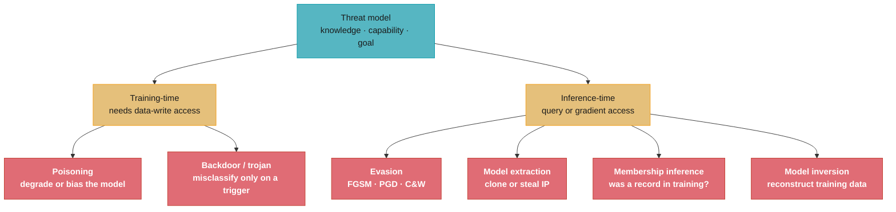
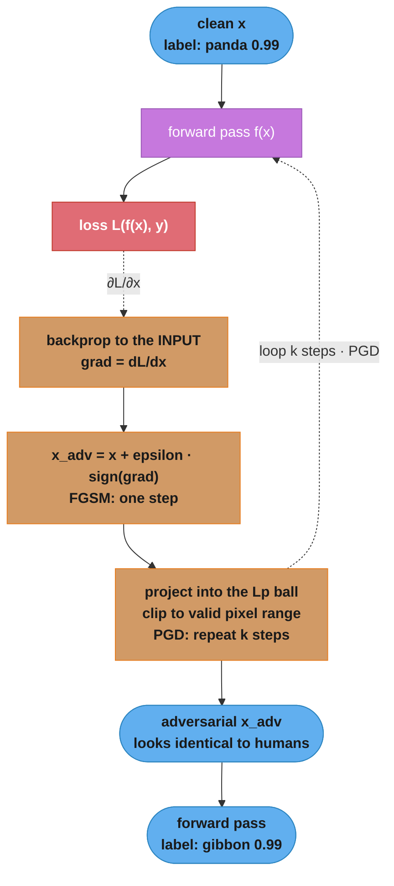
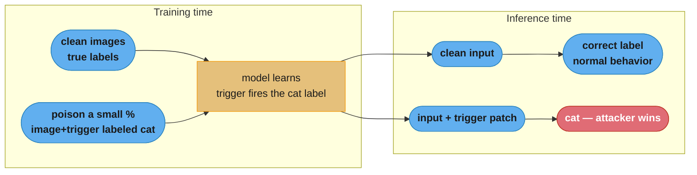
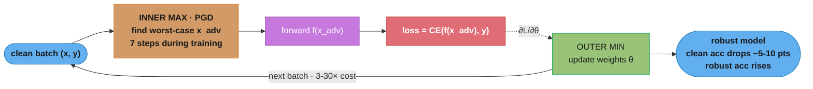
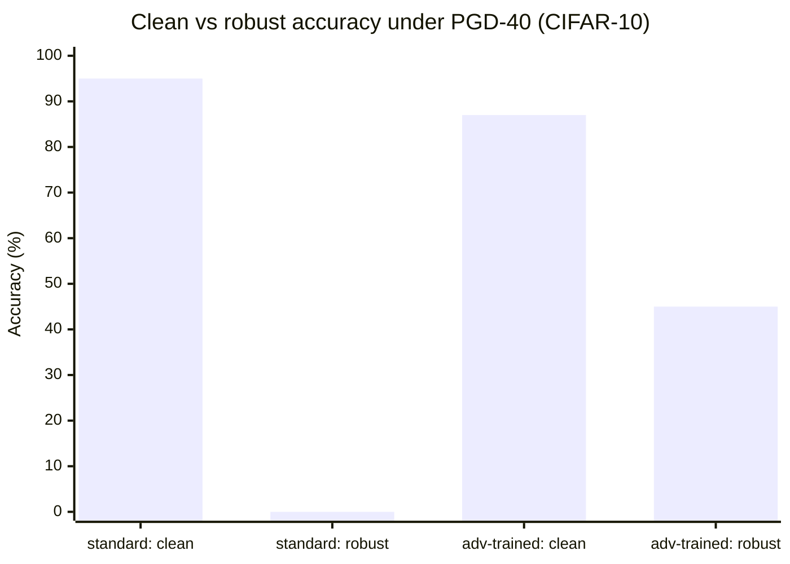
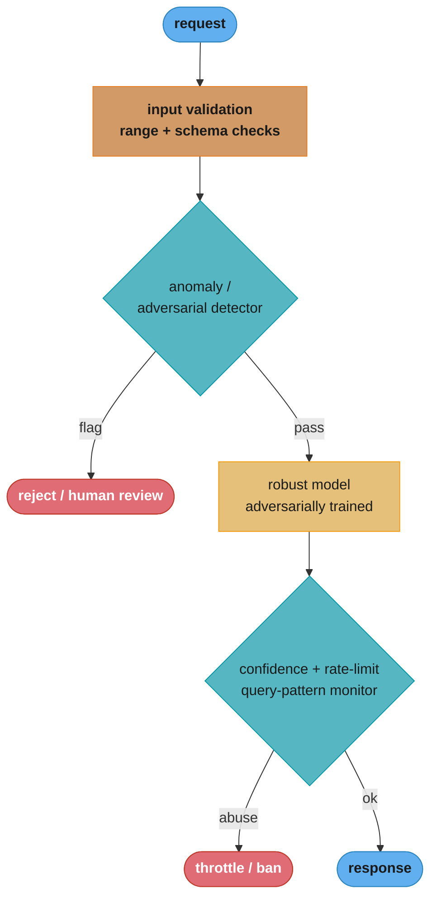

# Adversarial Machine Learning and Robustness

> Phase 7 (Advanced Topics). This module covers attacks against ML models (evasion,
> poisoning, extraction, inference) and the defenses that harden them. The LLM analog —
> prompt injection, jailbreaks, and content safety — lives in `llm/llm_security/` and
> `llm/guardrails_and_content_safety/`; the threat-model vocabulary here transfers directly.

---

## 1. Concept Overview

Standard ML assumes the data at inference time is drawn from the same distribution as training data and that no one is trying to manipulate the model. Adversarial ML drops that assumption. It studies how an intelligent attacker can degrade, mislead, steal, or extract information from a model — and how to defend against it.

There are four canonical attack surfaces:

1. **Evasion (inference-time):** craft an input that is correctly handled by humans but misclassified by the model — a few imperceptibly modified pixels turn a "panda" into a "gibbon," or a spam email slips past a filter.
2. **Poisoning (training-time):** corrupt the training data so the deployed model learns a wrong or backdoored behavior.
3. **Model extraction / stealing:** query a deployed model enough to clone its functionality or recover its parameters, defeating the IP and the cost of training.
4. **Inference / privacy attacks:** determine whether a specific record was in the training set (membership inference) or reconstruct training data (model inversion).

For a senior engineer, the point is not to memorize every attack but to (a) reason about the threat model — who the attacker is, what they can access, and what they want — and (b) know which defenses actually hold versus which only appear to. Many published defenses fail under adaptive attacks, so healthy skepticism is part of the job.

---

## 2. Intuition

One-line analogy: a model is a lock, and adversarial ML is lock-picking. A demo where the lock opens with the right key proves nothing about whether a picker can open it.

Mental model: a classifier carves the input space into regions with decision boundaries. Those boundaries are wiggly and, in high dimensions, surprisingly close to almost every data point. An evasion attack is gradient ascent on the *input* (not the weights): it nudges the input in the direction that most increases the loss, just far enough to cross the nearest boundary while staying visually unchanged.

Why it matters: any model that touches an adversary — fraud, spam, content moderation, malware detection, biometric auth, autonomous perception — is under active attack. A model evaluated only on clean test data can have 95% accuracy and 0% robust accuracy: trivially broken by an attacker who spends a few gradient steps.

Key insight: adversarial examples exist largely *because* models are too linear in high-dimensional space. Tiny per-pixel perturbations, each pushing the logit in the same direction, sum to a large shift. This is why FGSM — a single signed-gradient step — works so well, and why robustness is hard rather than a bug to patch.

---

## 3. Core Principles

1. **Specify the threat model first.** Attacker knowledge (white-box vs black-box), capability (perturbation budget, query budget, data access), and goal (untargeted vs targeted) determine which attacks and defenses are even relevant.
2. **Perturbations are bounded by a norm.** Evasion attacks constrain the change to an Lp ball (L-infinity = max per-feature change; L2 = total energy; L0 = number of features changed) so the input stays "the same" to a human.
3. **Robust accuracy is the real metric.** Clean accuracy says nothing about security. Always report accuracy under a strong, adaptive attack.
4. **Evaluate against adaptive attacks.** A defense must be tested by an attacker who knows the defense exists. Defenses that only obscure gradients ("gradient masking") collapse under adaptive or black-box attacks.
5. **There is no free robustness.** Adversarial training and certified defenses cost clean accuracy and compute. Security is a deliberate trade, not a default.
6. **Defense in depth.** No single defense suffices; combine input validation, robust training, monitoring for anomalous query patterns, and rate limiting.

---

## 4. Types / Architectures / Strategies

### 4.1 Attack taxonomy

| Attack | Phase | Attacker access | Goal | Example |
|--------|-------|-----------------|------|---------|
| Evasion (FGSM, PGD, C&W) | Inference | Often white-box; black-box variants exist | Force misclassification | Adversarial image, evasive malware |
| Poisoning | Training | Write access to some training data | Degrade or bias the model | Corrupt labels in a crowd-sourced dataset |
| Backdoor / trojan | Training | Inject triggered samples | Misclassify only on a trigger | Stop sign with a sticker -> "speed limit" |
| Model extraction | Inference | Query access (API) | Clone functionality / steal IP | Distill a paid API into a local model |
| Membership inference | Inference | Query access (+ confidence) | Learn if a record was in training | Privacy leak on medical model |
| Model inversion | Inference | Query access | Reconstruct training inputs | Recover a face from a recognition model |

### 4.2 White-box vs black-box

- **White-box:** attacker has the model architecture, weights, and gradients. Strongest attacks (PGD, C&W). The right setting for *evaluating* a defense (assume the worst).
- **Black-box:** attacker only queries inputs and sees outputs. Uses transfer attacks (craft on a surrogate model) or query-based gradient estimation (NES, SPSA). Realistic for deployed APIs.

### 4.3 Targeted vs untargeted

- **Untargeted:** push to *any* wrong class (easier).
- **Targeted:** force a *specific* wrong class (harder, more dangerous — e.g. "anyone -> admin").

### 4.4 Defense families

| Defense | Idea | Guarantee | Cost |
|---------|------|-----------|------|
| Adversarial training (Madry) | Train on PGD examples | Empirical robustness | 3-30x training cost |
| Randomized smoothing | Average predictions over Gaussian noise | Certified L2 radius | Slower inference (many samples) |
| Input transforms (JPEG, bit-depth, blur) | Remove perturbation | Weak; often broken | Cheap, unreliable |
| Gradient masking (avoid) | Hide gradients | False sense of security | Breaks under adaptive attack |
| Detection / rejection | Flag adversarial inputs | Partial | Extra model |
| Differential privacy training | Bound per-sample influence | Mitigates poisoning/membership | Accuracy cost |
| Rate limiting / query monitoring | Limit extraction/black-box | Operational | Cheap, high value |

---

## 5. Architecture Diagrams

### Threat-model taxonomy (specify this first)



Every design choice hangs off the threat model: training-time attacks need write
access to data; inference-time attacks need only query or gradient access. Naming
the attacker's knowledge, capability, and goal tells you which of these six leaves
you actually have to defend against.

### Evasion attack — FGSM one step, PGD as a loop



Evasion is gradient ascent on the *input*, not the weights: dotted edges carry the
gradient back to the pixels. FGSM takes one signed-gradient step; PGD loops the step
and re-projects into the epsilon-ball each iteration, which is why PGD is the strong
attack and FGSM the fast-but-weak one.

### Backdoor / trojan attack



The backdoor is dormant: without the trigger the model behaves normally, so clean
validation accuracy is unaffected and standard testing never catches it. Only the
trigger path (red) flips the label, which is what makes trojans hard to detect.

### Adversarial training (min-max defense loop)



Madry adversarial training is a nested optimization: an inner PGD max finds the
worst-case perturbation of every batch, and an outer min updates the weights to
classify those attacked inputs. Running PGD inside every step is exactly why it costs
3-30x normal training.

### Clean vs robust accuracy — the security gap



A standard model with 95% clean accuracy has ~0% robust accuracy — trivially
evadable. Adversarial training trades ~8 points of clean accuracy (95→87) to lift
robust accuracy from 0% to ~45%; the clean headline hid a complete security failure.

### Defense-in-depth pipeline



No single defense holds, so the request passes through layers: cheap validation,
an adversarial/anomaly detector, the adversarially trained model, then rate-limit
and query-pattern monitoring. Each layer catches a different attack class the others
miss — defense in depth beats any one model.

---

## 6. How It Works — Detailed Mechanics

### FGSM (Fast Gradient Sign Method)

```python
import torch
import torch.nn as nn


def fgsm_attack(
    model: nn.Module,
    x: torch.Tensor,
    y: torch.Tensor,
    epsilon: float = 0.03,
) -> torch.Tensor:
    """
    Single-step L-infinity evasion attack.
    epsilon = 0.03 means each pixel may change by at most ~8/255 (imperceptible).
    """
    x_adv = x.clone().detach().requires_grad_(True)
    logits = model(x_adv)
    loss = nn.functional.cross_entropy(logits, y)
    model.zero_grad()
    loss.backward()
    # step in the gradient SIGN direction to maximize loss, then clip to valid range
    x_adv = x_adv + epsilon * x_adv.grad.sign()
    return x_adv.clamp(0.0, 1.0).detach()
```

**In plain terms.** "Ask the model which direction would hurt it most, then nudge *every single pixel* by the same tiny amount in whichever way that direction points."

Two things make FGSM cheap. It takes the `sign()` of the gradient, throwing away the magnitude, so every feature moves by exactly `epsilon` — no learning rate, no line search. And it needs only one backward pass, the same cost as a single training step, which is why it is the attack you can afford to run inside a training loop.

| Symbol | What it is |
|--------|------------|
| `x` | The clean input. Pixels scaled to `[0, 1]`, hence the `clamp(0.0, 1.0)` |
| `L(f(x), y)` | The ordinary cross-entropy loss — the thing training *minimizes* and this attack *maximizes* |
| `dL/dx` | Gradient with respect to the **input**, not the weights. Same backprop, one node further back |
| `sign(g)` | `+1`, `-1`, or `0`. Discards how strong the gradient is and keeps only its direction |
| `epsilon` | The perturbation budget: the largest change any one pixel is allowed. `0.03` here |
| `+` (not `-`) | Gradient *ascent*. Training subtracts to reduce loss; the attacker adds to raise it |
| `clamp(0, 1)` | Keeps the result a real image. This is what makes the realized step smaller than `epsilon` at the edges |

**Walk one example.** Five pixels, `epsilon = 0.03` (about `8/255 = 0.0314`, the standard CIFAR-10 budget):

```
  pixel        x      dL/dx     sign    x + eps*sign    after clamp(0,1)    realized delta
    1        0.50    +0.412      +1        0.53              0.53               +0.03
    2        0.99    +0.008      +1        1.02              1.00               +0.01   <- clipped
    3        0.02    -1.930      -1       -0.01              0.00               -0.02   <- clipped
    4        0.31    -0.663      -1        0.28              0.28               -0.03
    5        0.74     0.000       0        0.74              0.74                0.00

  Note pixel 2 vs pixel 3: gradient 0.008 and gradient -1.930 produce steps of
  identical size. sign() erased the 240x difference in gradient magnitude.
```

That table is the whole method, and the last line is the interview point: FGSM does not move "important" pixels further, it moves everything the same distance. This is why one FGSM step is weak — it lands on a corner of the epsilon-ball chosen by the gradient at `x` alone, and the loss surface has usually curved away by the time you get there. PGD below fixes exactly that by re-measuring the gradient at every step.

**Read it like this — the epsilon-ball and its three norms.** "Bounded perturbation" always means *bounded under some norm*, and the choice of norm decides what the attack is allowed to look like:

```
  Same perturbation delta = [+0.03, +0.01, -0.02, -0.03, 0.00]  (the FGSM row above)

    L0(delta)   = count of changed features            = 4
    Linf(delta) = max |delta_i|                         = 0.03
    L2(delta)   = sqrt(0.03^2 + 0.01^2 + 0.02^2 + 0.03^2) = 0.0480
    L1(delta)   = sum |delta_i|                         = 0.09

  Now a ONE-PIXEL attack that repaints pixel 5 from 0.74 to 1.00:
    delta = [0, 0, 0, 0, +0.26]
    L0 = 1        (25x smaller -- an L0 attacker calls this the cheaper attack)
    Linf = 0.26   (8.7x larger -- an Linf budget of 0.03 forbids it outright)
    L2 = 0.26     (5.4x larger)
```

The two perturbations swap ranks depending on which norm you measure them with, and that is the entire reason threat models must name the norm before anything else. `Linf` says "change everything a little, change nothing much" — the classic imperceptible-image threat. `L0` says "change as few features as possible, by as much as you like" — a sticker on a stop sign, or a handful of tokens in a malware binary. `L2` says "spend a fixed total energy however you like", which is the norm certified defenses can actually prove things about (see randomized smoothing below).

Scale matters too: an `Linf = 0.03` ball on a `32x32x3 = 3072`-pixel CIFAR image permits an `L2` distance of up to `sqrt(3072) * 0.03 = 1.663`, so a "tiny" `Linf` budget is a generous `L2` budget. Reporting `epsilon = 0.03` without naming the norm and the input dimension is not a threat model.

### PGD (Projected Gradient Descent) — the standard strong attack

```python
import torch
import torch.nn as nn


def pgd_attack(
    model: nn.Module,
    x: torch.Tensor,
    y: torch.Tensor,
    epsilon: float = 0.03,
    alpha: float = 0.007,
    steps: int = 40,
) -> torch.Tensor:
    """
    Iterative FGSM with projection back into the L-infinity epsilon-ball.
    PGD is the de facto benchmark for evaluating robustness (Madry et al. 2018).
    """
    x_adv = x.clone().detach()
    # random start inside the ball improves attack strength
    x_adv = x_adv + torch.empty_like(x_adv).uniform_(-epsilon, epsilon)
    x_adv = x_adv.clamp(0.0, 1.0)

    for _ in range(steps):
        x_adv.requires_grad_(True)
        loss = nn.functional.cross_entropy(model(x_adv), y)
        grad = torch.autograd.grad(loss, x_adv)[0]
        with torch.no_grad():
            x_adv = x_adv + alpha * grad.sign()
            # project: keep within epsilon of the original x
            x_adv = torch.max(torch.min(x_adv, x + epsilon), x - epsilon)
            x_adv = x_adv.clamp(0.0, 1.0)
    return x_adv.detach()
```

**Put simply.** "Take many small FGSM steps instead of one big one, and after every step drag the input back inside the epsilon-ball if it wandered out."

| Symbol | What it is |
|--------|------------|
| `alpha` | Per-step size, `0.007`. Deliberately much smaller than `epsilon` so the path can curve |
| `steps` | How many times the gradient is re-measured, `40` for evaluation, `7` inside adversarial training |
| `max(min(x_adv, x+eps), x-eps)` | The projection. Element-wise clamp back into the `Linf` ball centred on the original `x` |
| `uniform_(-eps, eps)` | Random start. Prevents every run from converging to the same corner of the ball |

**Walk the budget arithmetic.** With `alpha = 0.007` and `steps = 40`, a pixel could in principle travel `0.007 x 40 = 0.28`, which is `9.3x` the `epsilon = 0.03` it is allowed:

```
  total possible travel  = alpha x steps = 0.007 x 40 = 0.280
  allowed displacement   = epsilon                    = 0.030
  ratio                  = 0.280 / 0.030              = 9.3x

  So the projection fires constantly -- a pixel that keeps getting pushed the same
  way is pinned at exactly x +/- 0.03 and can only slide sideways after that.
  The extra 8.3x of travel is not wasted: it is how the attack explores the FACE
  of the ball rather than committing to one corner, which is why PGD beats FGSM
  at the identical epsilon.
```

Drop the projection and the attack drifts to a genuinely different image; drop the random start and the attack becomes deterministic and easier for a defense to overfit to. Both lines are load-bearing, and both are what people quietly omit when they report suspiciously high robust accuracy.

### Adversarial training (the strongest reliable defense)

```python
import torch
import torch.nn as nn


def adversarial_train_step(
    model: nn.Module,
    optimizer: torch.optim.Optimizer,
    x: torch.Tensor,
    y: torch.Tensor,
    epsilon: float = 0.03,
) -> float:
    """
    Madry adversarial training: minimize loss on PGD-attacked inputs.
    Inner max (PGD) finds the worst-case perturbation; outer min updates weights.
    Roughly 3-30x the cost of standard training because each step runs PGD.
    """
    model.train()
    x_adv = pgd_attack(model, x, y, epsilon=epsilon, steps=7)  # fewer steps in training
    optimizer.zero_grad()
    loss = nn.functional.cross_entropy(model(x_adv), y)
    loss.backward()
    optimizer.step()
    return float(loss.item())
```

### Robustness evaluation (report robust accuracy, not clean accuracy)

```python
import torch
import torch.nn as nn


@torch.no_grad()
def _accuracy(model: nn.Module, x: torch.Tensor, y: torch.Tensor) -> float:
    return (model(x).argmax(1) == y).float().mean().item()


def evaluate_robustness(
    model: nn.Module, x: torch.Tensor, y: torch.Tensor, epsilon: float = 0.03
) -> dict[str, float]:
    model.eval()
    clean = _accuracy(model, x, y)
    x_adv = pgd_attack(model, x, y, epsilon=epsilon, steps=40)
    robust = _accuracy(model, x_adv, y)
    return {"clean_accuracy": clean, "robust_accuracy": robust}
    # A standard CIFAR-10 model: clean ~0.95, robust ~0.00.
    # An adversarially trained model: clean ~0.87, robust ~0.45.
```

**What the formula is telling you.** "Robust accuracy is ordinary accuracy measured on inputs an attacker was allowed to rewrite first — and attack success rate is just the same number read from the attacker's side of the table."

`ASR = 1 - robust_accuracy` when the attack is untargeted and every test input is attacked. Two numbers, one measurement; interviewers ask for whichever one you did not memorize.

| Symbol | What it is |
|--------|------------|
| `clean_accuracy` | Accuracy on untouched inputs. Says nothing about security — a `0.95` model can be `0.00` robust |
| `robust_accuracy` | Accuracy on `x_adv` produced by a strong attack at a stated `epsilon`. Meaningless without both |
| `ASR` | Attack success rate, `1 - robust_accuracy`. The fraction of inputs the attacker flipped |
| `steps = 40` | Attack strength. Reporting robust accuracy under a 1-step attack inflates it — always name the attack |
| the gap `clean - robust` | The price of the threat model. It is never zero |

**Walk the two rows the code comments give.** Same test set, same `epsilon = 0.03`, same 40-step PGD:

```
  model                        clean    robust    ASR = 1 - robust    accuracy lost
  standard training            0.95      0.00         100%             0.95  -> total collapse
  Madry adversarial training   0.87      0.45          55%             0.42  -> real defense

  Cost of the defense:   0.95 - 0.87 = 0.08 clean accuracy given up
  Benefit:               0.45 - 0.00 = 0.45 robust accuracy bought
  Trade:                 8 points of clean accuracy for 45 points of robustness
```

Two readings matter here. First, the standard model is not "somewhat vulnerable" — it is at `0.00`, worse than random guessing on 10 classes, because the attacker is choosing the wrong answer deliberately rather than sampling one. A clean accuracy of `0.95` and a robust accuracy of `0.00` are perfectly compatible, and any report quoting only the first is telling you nothing about security. Second, the best-known defense still fails more than half the time (`ASR = 55%`); robustness is a mitigation you budget for, not a box you check.

**The idea behind the certified radius.** Randomized smoothing's `R = sigma * Phi_inverse(p_top)` reads as: "the more decisively the top class survives noise, the further you can prove no attack reaches."

| Symbol | What it is |
|--------|------------|
| `sigma` | Standard deviation of the Gaussian noise added to each of the `10^3-10^5` copies |
| `p_top` | Fraction of the noisy copies that still vote for the top class |
| `Phi_inverse` | Inverse standard-normal CDF. Maps a probability to "how many standard deviations out" |
| `R` | Certified `L2` radius. **No** perturbation with `L2 < R` can change the smoothed prediction |

**Walk the radius.** At `sigma = 0.25`, vary how decisively the top class wins the vote:

```
  p_top    Phi_inverse(p_top)    R = 0.25 x Phi_inv    what it certifies
  0.500          0.000                0.000            no guarantee at all
  0.600          0.253                0.063            a barely-useful radius
  0.900          1.282                0.320
  0.990          2.326                0.582
  0.999          3.090                0.773            diminishing: 10x more votes,
                                                       only 1.33x the radius

  Doubling the noise to sigma = 0.50 doubles every radius (0.99 -> 1.163) but
  lowers p_top on hard inputs, because more noise means a less decisive vote.
```

Two properties fall straight out of the table. `p_top = 0.5` certifies a radius of exactly zero — a coin-flip vote proves nothing — and `Phi_inverse` grows so slowly past `0.99` that chasing certainty with more samples buys almost nothing. That is the sigma tradeoff in one line: `R` is linear in `sigma` but `p_top` degrades with it, so there is an optimal noise level per dataset, and unlike everything else in this section the resulting number is a proof rather than an empirical score that the next attack can erase.

### Randomized smoothing (certified robustness sketch)

```python
# Certified L2 robustness: classify x by majority vote over Gaussian-noised copies.
# If the top class wins by a large margin under noise sigma, you can CERTIFY that
# no L2 perturbation smaller than radius R can change the prediction (Cohen 2019).
#   R = sigma * Phi_inverse(p_top)
# Trade-off: needs ~10^3-10^5 noisy samples per prediction -> expensive inference,
# but unlike empirical defenses it gives a provable guarantee.
```

---

## 7. Real-World Examples

**Physical-world stop sign attack (Eykholt 2018):** black-and-white stickers placed on a stop sign caused a traffic-sign classifier to read it as "Speed Limit 45" in 100% of drive-by frames — demonstrating that adversarial perturbations survive printing, lighting, and viewing angle.

**ImageNet "panda -> gibbon" (Goodfellow 2014):** an L-infinity perturbation of epsilon ~0.007 (about 2/255 per pixel), invisible to humans, flipped a confident panda prediction to "gibbon" at 99% confidence. The canonical illustration of FGSM.

**Spam and malware evasion:** spammers continuously probe filters ("V1agra", zero-width characters, image-only emails); malware authors perturb binaries to evade ML detectors. These are real, ongoing black-box evasion attacks at industrial scale.

**Model extraction of paid APIs:** researchers have shown that a few hundred thousand queries to a commercial classification or translation API can train a near-equivalent local model, stealing the value of the original's training. This drives per-key rate limiting and query-pattern monitoring on ML APIs.

**Membership inference on medical models:** attacks have recovered whether a specific patient's record was used to train a diagnostic model from its confidence outputs — a concrete privacy violation that motivates differentially private training and confidence rounding.

---

## 8. Tradeoffs

| Dimension | Standard model | Adversarially trained | Randomized smoothing |
|-----------|----------------|-----------------------|----------------------|
| Clean accuracy | Highest | Lower (5-10 pts drop) | Lower |
| Robust accuracy | ~0 | Meaningful (empirical) | Certified (provable) |
| Training cost | 1x | 3-30x | ~1x |
| Inference cost | 1x | 1x | High (many samples) |
| Guarantee | None | Empirical only | Provable radius |

| Defense | Holds under adaptive attack? | Notes |
|---------|------------------------------|-------|
| Adversarial training (PGD) | Yes (best empirical) | Costly; epsilon-specific |
| Randomized smoothing | Yes (certified) | Slow inference |
| Input preprocessing (JPEG/blur) | No | Broken by BPDA / adaptive attacks |
| Gradient masking / obfuscation | No | Classic false security |
| Detection-only | Partial | Attackers craft detector-evading examples |

---

## 9. When to Use / When NOT to Use

### Invest in adversarial robustness when

- The model faces an adversary with incentive: fraud, spam, abuse, malware, content moderation, biometric auth, autonomous perception.
- A targeted misclassification is high-impact (security bypass, safety failure).
- The model is exposed via a public API where extraction or black-box evasion is feasible.

### Robustness may be over-engineering when

- The model serves a cooperative, low-stakes setting (internal forecasting, recommendation where the worst case is a slightly worse suggestion) with no adversary.
- The accuracy/compute cost of adversarial training is not justified by the threat.

### Always do (cheap, high value), regardless of threat level

- Input validation and range/schema checks.
- Rate limiting and anomalous-query monitoring on any exposed model API.
- Confidence hygiene (avoid returning raw high-precision probabilities that enable membership inference).

---

## 10. Common Pitfalls

### Pitfall 1: Reporting clean accuracy as if it were security

A model with 95% clean accuracy can have 0% robust accuracy. Teams ship "high-accuracy" abuse classifiers that an attacker defeats in a handful of gradient steps. Always report accuracy under a strong adaptive attack (PGD-40 minimum) before claiming a model is robust.

### Pitfall 2: Gradient masking that looks like a defense

```python
# BROKEN: adding non-differentiable preprocessing (e.g. argmax/quantize) hides
# gradients, so white-box FGSM/PGD "fail" -> robust accuracy looks high.
def defended(x):
    return model(quantize(x))   # zero/NaN gradients -> attack can't find direction

# Reality: a black-box or BPDA (backward pass differentiable approximation) attack
# bypasses it entirely. FIX: evaluate with adaptive + transfer + black-box attacks;
# if robust accuracy collapses under any, the defense is gradient masking.
```

The 2018 "Obfuscated Gradients" paper broke 7 of 9 ICLR defenses this way. Treat any defense that only blocks white-box gradient attacks as suspect.

### Pitfall 3: Training-time data trust

Crowd-sourced, scraped, or user-contributed training data is an attack surface. A small fraction of poisoned or backdoored samples can implant a trigger with no effect on clean accuracy, so standard validation never catches it. Mitigate with provenance tracking, outlier/influence filtering, and trigger scanning (e.g. Neural Cleanse).

### Pitfall 4: Leaking confidence enables privacy attacks

Returning raw, high-precision softmax probabilities makes membership inference and model inversion much easier. For sensitive models, return top-k labels, round confidences, or add calibrated noise.

### Pitfall 5: Forgetting epsilon is dataset- and norm-specific

An epsilon of 0.03 in L-infinity on [0,1] images is imperceptible; the same number means nothing for tabular features on different scales. Define the perturbation budget in the input's actual units and norm, and justify why it preserves the human-perceived label.

### Pitfall 6: One-off robustness with no monitoring

Robustness is not a train-once property. Attackers adapt, data drifts, and new attack classes appear. Pair robust training with production monitoring for spikes in low-confidence predictions, repeated near-duplicate queries (extraction), and trigger-like patterns.

---

## 11. Technologies & Tools

| Tool | Use Case | Notes |
|------|----------|-------|
| Foolbox | Library of evasion attacks (FGSM, PGD, C&W, boundary) | Clean PyTorch/TF API for evaluation |
| CleverHans | Attack/defense benchmarks | One of the original libraries |
| Adversarial Robustness Toolbox (ART, IBM) | Attacks, defenses, poisoning, extraction | Broadest coverage incl. tabular |
| AutoAttack | Parameter-free ensemble of strong attacks | Current standard for honest robust-accuracy numbers |
| RobustBench | Standardized leaderboard + pretrained robust models | Reproducible comparison |
| Opacus / TF Privacy | Differentially private training | Mitigates poisoning/membership |
| Neural Cleanse | Backdoor/trigger detection | Scans for trojaned behavior |

---

## 12. Interview Questions with Answers

**Q: What is an adversarial example and why do they exist?**
An adversarial example is an input modified by a small, often imperceptible perturbation that causes a model to misclassify it while a human still sees the original class. They exist largely because models behave too linearly in high-dimensional space: many tiny per-feature changes, each nudging the output in the same direction, sum to a large shift across the decision boundary. They are not rare glitches — they exist densely around almost every input.

**Q: Explain FGSM and how PGD improves on it.**
FGSM (Fast Gradient Sign Method) takes a single step of size epsilon in the direction of the sign of the loss gradient with respect to the input: `x_adv = x + epsilon·sign(∇_x L)`. It is fast but weak because one linear step rarely finds the optimal perturbation. PGD (Projected Gradient Descent) runs many small FGSM-like steps, projecting back into the epsilon Lp-ball after each, usually with a random start. PGD is the de facto strong attack and the standard for evaluating defenses.

**Q: What is the Carlini-Wagner (C&W) attack and how does it differ from PGD?**
The Carlini-Wagner (C&W) attack is a strong optimization-based evasion that minimizes the perturbation size subject to a misclassification constraint. Where PGD fixes an epsilon-ball and maximizes loss inside it, C&W directly searches for the *smallest* perturbation that flips the label, using a smooth surrogate objective (e.g. logit-margin loss) solved with an optimizer like Adam and a binary search over the trade-off constant. It is slower than PGD but often finds lower-distortion adversarial examples and is a favorite for *breaking* proposed defenses, so treat a defense that only survives FGSM/PGD as unproven until it also survives C&W and AutoAttack.

**Q: What is the difference between white-box and black-box attacks, and which should you defend against?**
White-box attackers know the architecture, weights, and gradients; black-box attackers only query inputs and observe outputs. White-box attacks (PGD, C&W) are strongest, so you *evaluate* defenses under white-box assumptions to assume the worst. Black-box attacks (transfer from a surrogate, or query-based gradient estimation like NES/SPSA) are the realistic threat for a deployed API. A robust system must hold under the strongest attack its threat model permits — usually evaluated white-box, defended in depth.

**Q: Why is clean accuracy a misleading metric for a security-relevant model?**
Clean accuracy measures performance on benign, in-distribution data, which says nothing about an adversary actively crafting inputs. A model can have 95% clean accuracy and ~0% robust accuracy under PGD. For any model facing an adversary, the headline number must be robust accuracy under a strong adaptive attack; clean accuracy alone gives a false sense of security.

**Q: What is gradient masking and why is it a trap?**
Gradient masking is any defense that hides or obscures gradients (non-differentiable preprocessing, extreme nonlinearity, randomization) so that white-box gradient attacks fail — making robust accuracy *look* high. It is a trap because the model is not actually robust: black-box, transfer, or backward-pass-differentiable-approximation (BPDA) attacks bypass it. The "Obfuscated Gradients" paper broke most defenses of its year this way. Always test with adaptive and black-box attacks.

**Q: How does adversarial training work and what does it cost?**
Adversarial training (Madry) formulates a min-max objective: an inner maximization (PGD) finds the worst-case perturbation of each training example, and the outer minimization updates weights to classify those perturbed inputs correctly. In practice you generate PGD examples each step and train on them. It is currently the most reliable empirical defense, but it costs 3-30x normal training time and typically drops clean accuracy 5-10 points.

**Q: What is certified robustness, and how does randomized smoothing provide it?**
Certified robustness gives a provable guarantee that no perturbation within a radius can change a prediction, unlike empirical defenses that merely resist known attacks. Randomized smoothing classifies an input by majority vote over many Gaussian-noised copies; if the top class wins by a sufficient margin, you can certify an L2 radius `R = sigma·Φ⁻¹(p_top)`. The cost is that each prediction needs thousands of noisy samples, making inference expensive.

**Q: What is a backdoor/trojan attack and why is it hard to detect?**
A backdoor attack poisons a small fraction of training data so the model misclassifies *only* when a specific trigger (e.g. a sticker or pixel pattern) is present, behaving normally otherwise. It is hard to detect because clean validation accuracy is unaffected — the malicious behavior is dormant until the trigger appears. Detection requires specialized tools (e.g. Neural Cleanse, which searches for unusually small triggers) and data-provenance controls.

**Q: What is data poisoning and how do you defend against it?**
Poisoning corrupts training data to degrade or bias the deployed model — flipping labels, inserting outliers, or planting triggers. Because training data is increasingly crowd-sourced or scraped, this is a live threat. Defenses include data provenance and trust scoring, robust statistics and influence-function/outlier filtering to remove high-impact samples, differentially private training (which bounds any single sample's effect), and trigger scanning before deployment.

**Q: What is model extraction and why is rate limiting a defense?**
Model extraction (stealing) clones a deployed model's functionality by querying it enough to train a surrogate, defeating the IP and training cost of the original. Each query leaks a labeled example. Rate limiting and query-pattern monitoring raise the cost and detectability of the thousands-to-millions of queries extraction needs, while returning top-k labels instead of full probability vectors reduces information per query. It is cheap and high-value for any public ML API.

**Q: What is membership inference and what enables it?**
Membership inference determines whether a specific record was in the training set, a privacy violation (e.g. revealing a patient was in a disease cohort). It exploits the fact that models are more confident on training examples than unseen ones, so high-precision confidence outputs leak membership. Defenses include differentially private training, regularization to reduce overfitting, and coarsening or adding noise to confidence outputs.

**Q: How do you choose the perturbation budget epsilon, and why does the norm matter?**
Epsilon bounds how much an input may change while preserving its human-perceived label, defined within a specific Lp norm: L-infinity bounds the max change per feature, L2 bounds total energy, L0 bounds the number of features changed. For [0,1] images, L-infinity epsilon ~0.03 (8/255) is imperceptible; for tabular data you must express the budget in the features' real units. The norm changes which perturbations are "allowed," so report it explicitly and justify that it keeps the true label unchanged.

**Q: Adversarial training hardened your model at epsilon=0.03 — why does it fail at epsilon=0.06?**
Adversarial training is epsilon-specific: a model hardened at one perturbation budget offers little protection against a larger one. The min-max objective only teaches the model to be robust inside the epsilon-ball it trained on, so an attacker who spends a bigger budget simply steps outside that learned safe region and the robust accuracy collapses. This is why you must define the operational threat budget up front and train (and evaluate) at or above it; there is no "train once, robust to everything" — larger epsilon means both harder training and a bigger clean-accuracy sacrifice.

**Q: Why is there a robustness-accuracy trade-off?**
Robust models must keep their decision boundaries far from data points so small perturbations cannot cross them, which forces simpler, smoother boundaries that fit clean data less tightly — costing clean accuracy. Empirically and theoretically, increasing adversarial robustness reduces standard accuracy on many datasets. It is a deliberate engineering trade, not a defect to eliminate.

**Q: How do adversarial attacks transfer across models, and why does that matter for black-box attacks?**
Adversarial examples crafted on one model often fool a *different* model trained on similar data, because both learn similar features and boundaries. This transferability lets a black-box attacker train a surrogate model, craft white-box attacks on it, and apply them to the target without ever seeing the target's gradients. It is why "the attacker can't see our weights" is not a sufficient defense.

**Q: How does adversarial ML in classical models relate to LLM security?**
The threat-model vocabulary transfers directly. Evasion (crafting inputs that bypass a classifier) maps to prompt injection and jailbreaks (crafting prompts that bypass an LLM's guardrails); data poisoning maps to training-data and RAG-corpus poisoning; model extraction maps to distilling a proprietary LLM via its API; membership/inversion maps to training-data extraction from LLMs. The defenses also rhyme: input validation, robust training/alignment, monitoring, and rate limiting. See `../../llm/llm_security/` and `../../llm/guardrails_and_content_safety/`.

**Q: A deployed fraud model's accuracy is fine but fraud is rising. How do you reason about adversarial adaptation?**
Fraud is an adaptive adversary, so a static model degrades as attackers probe and shift tactics — this is adversarial concept drift, not random drift. Investigate whether recent fraud clusters near the decision boundary (evidence of probing), monitor for spikes in borderline/low-confidence cases and near-duplicate query patterns, and respond with frequent retraining on fresh labels, adversarial training against the observed evasion patterns, and ensembling. Pair the model with rules and human review for the highest-risk tail.

---

## 13. Best Practices

1. Write the threat model down first: attacker knowledge, capability (perturbation and query budgets), and goal. It scopes everything else.
2. Report robust accuracy under a strong, parameter-free attack (AutoAttack or PGD-40 minimum) — never clean accuracy alone — when claiming robustness.
3. Evaluate every defense with adaptive, transfer, and black-box attacks; if any collapses robustness, the defense is gradient masking.
4. Use adversarial training (PGD) as the default empirical defense for adversary-facing models; use randomized smoothing when you need a provable guarantee.
5. Treat training data as untrusted: track provenance, filter influential outliers, and scan for backdoors before deployment.
6. Always rate-limit and monitor query patterns on exposed model APIs; this cheaply mitigates extraction and black-box evasion.
7. Limit information leakage: return top-k labels or rounded confidences for sensitive models to blunt membership and inversion attacks.
8. Pair robust models with non-ML layers (rules, human review) for the highest-impact decisions; defense in depth beats any single model.
9. Re-evaluate robustness on a schedule — attackers and data both move.

---

## 14. Case Study

**Scenario: hardening an abuse/evasion-prone content classifier.** A platform runs a CNN-based image classifier that blocks policy-violating uploads. Clean validation accuracy is 96%, but the abuse team reports a rising rate of violating images getting through. Investigation shows attackers are adding low-amplitude noise patterns that flip the model's decision while leaving the image visually unchanged — a classic black-box evasion campaign, with examples crafted on a public surrogate model and transferred in.

**Step 1 — Quantify the real exposure.** They run AutoAttack at L-infinity epsilon 0.03 on a held-out set:

```python
robust = evaluate_robustness(model, x_test, y_test, epsilon=0.03)
# {"clean_accuracy": 0.96, "robust_accuracy": 0.04}
```

Robust accuracy of 4% confirms the model is trivially evadable; the 96% headline was meaningless against an adversary.

**Step 2 — Robust training.** They adopt PGD-based adversarial training (7-step PGD in the loop) and accept the clean-accuracy cost:

```python
for x, y in loader:
    adversarial_train_step(model, optimizer, x, y, epsilon=0.03)
# After training: clean ~0.90, robust (AutoAttack) ~0.43
```

Clean accuracy drops from 0.96 to 0.90, but robust accuracy rises from 0.04 to 0.43 — an order-of-magnitude harder target.

**Step 3 — Defense in depth (don't rely on the model alone).**

```
upload
  |
[range/format validation]              <- reject malformed or out-of-range pixels
  |
[adversarial/anomaly detector]         <- flag suspicious noise statistics -> human review
  |
[adversarially trained classifier]
  |
[per-account rate limit + repeated-near-duplicate detection]  <- catch probing/extraction
  |
decision (+ low-confidence -> human moderation queue)
```

**Broken -> fix during the build:** the team first tried JPEG-compressing every upload to "wash out" the perturbation, and saw robust accuracy jump to 0.70 — but this was gradient masking.

```python
# BROKEN: input preprocessing as the defense
defended = model(jpeg_compress(x))   # white-box PGD struggles -> looks robust

# An adaptive attacker using BPDA (treat JPEG as identity on the backward pass)
# drove robust accuracy back to ~0.06. FIX: keep preprocessing only as a minor
# layer, and base the real defense on adversarial training evaluated with adaptive
# attacks.
```

**Step 4 — Monitor and re-train.** They track the rate of low-confidence predictions, near-duplicate query bursts per account, and the moderation-queue catch rate, retraining on freshly labeled evasion examples every two weeks because the adversary keeps adapting.

**Outcome.** Evasion success on sampled traffic falls from ~30% to ~6%, the worst residual cases are caught by the detector and human queue, and the team now reports robust accuracy as the model's real headline metric. Crucially, they treat robustness as an ongoing operational property, not a one-time fix.

**Interview discussion points.** Why clean accuracy hid the problem; why JPEG compression was a false defense and how an adaptive attacker exposed it; the clean-vs-robust accuracy trade they accepted; and why monitoring plus periodic retraining is mandatory against an adaptive adversary.

---

## See Also

- `../../llm/llm_security/` — prompt injection, jailbreaks, training-data extraction (the LLM analog)
- `../../llm/guardrails_and_content_safety/` — input/output filtering for generative systems
- [model_evaluation_and_selection](../model_evaluation_and_selection/README.md) — calibration and honest metric reporting
- [monitoring_and_drift_detection](../monitoring_and_drift_detection/README.md) — detecting adversarial/abuse drift in production
- [convolutional_neural_networks](../convolutional_neural_networks/README.md) — the vision models most studied for evasion
