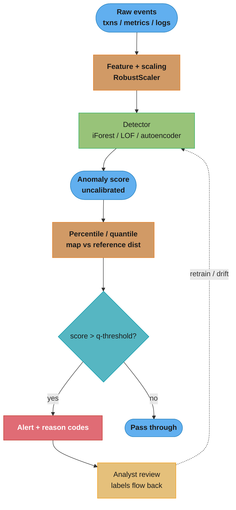
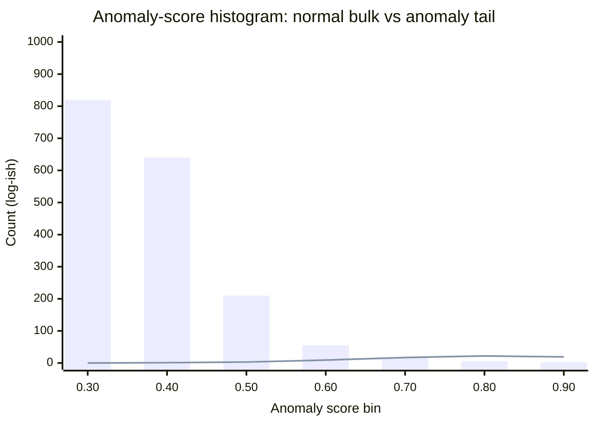
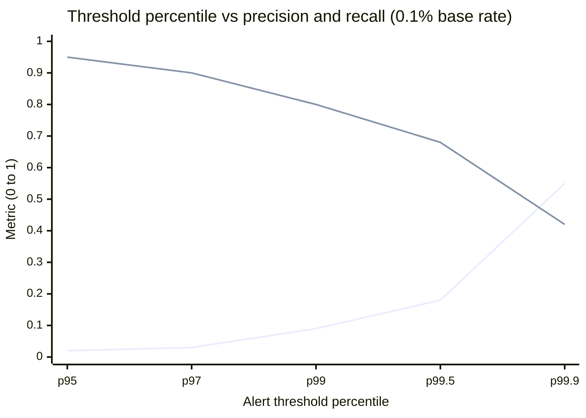
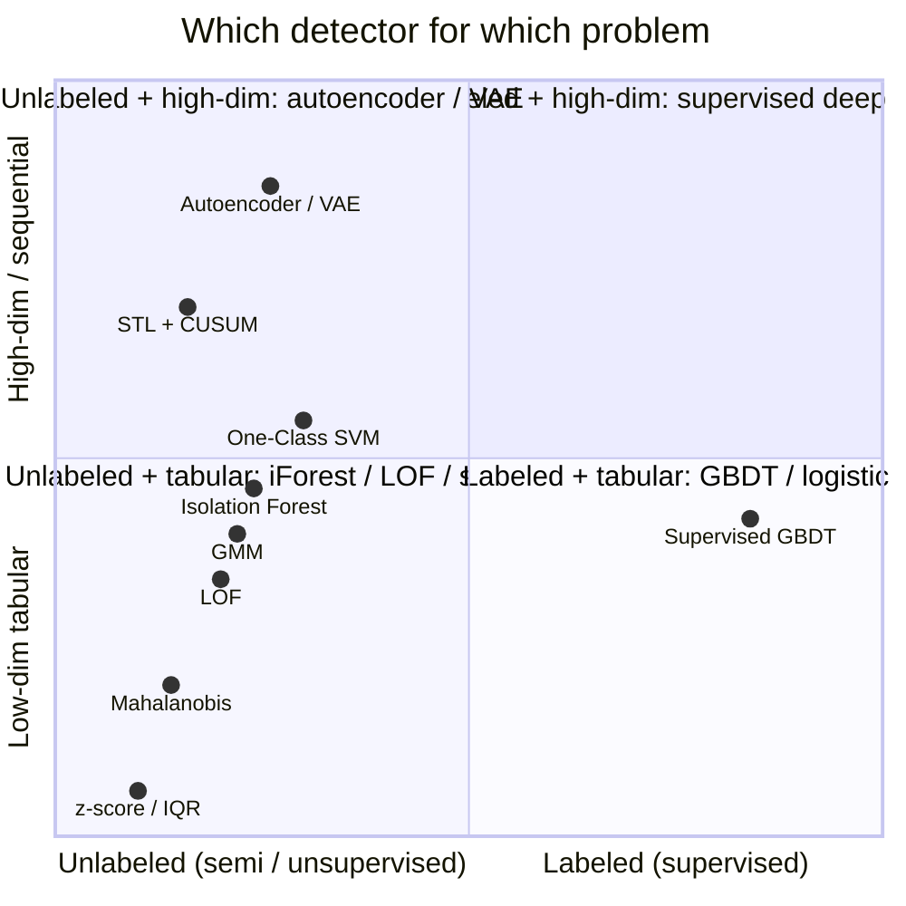
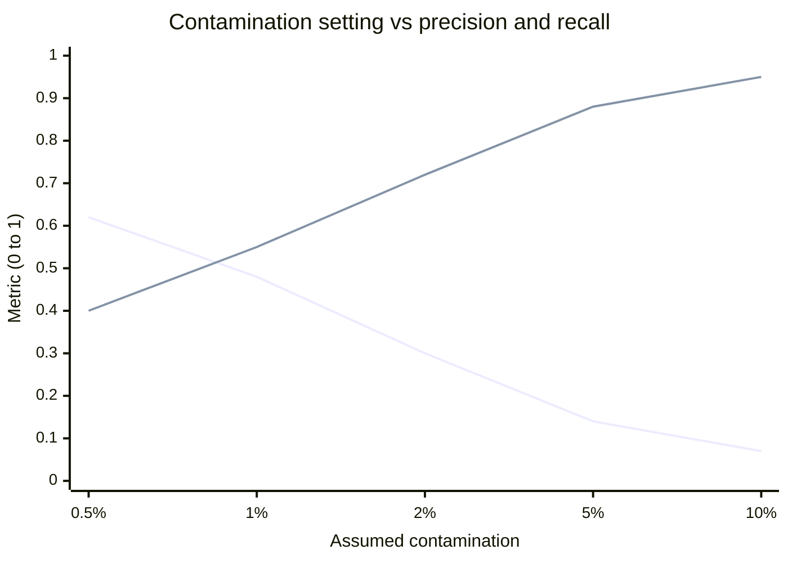

# Anomaly Detection

> Phase 2/7 consolidation module. Anomaly detection is scattered across this repo as
> pieces of other algorithms — Isolation Forest lives in
> [`../ensemble_methods/random_forests.md`](../ensemble_methods/random_forests.md) (§4.5),
> One-Class SVM in [`../supervised_learning/support_vector_machines.md`](../supervised_learning/support_vector_machines.md) (§6.3),
> autoencoder reconstruction in [`../unsupervised_learning/README.md`](../unsupervised_learning/README.md).
> This module ties those together, adds the missing methods (LOF, EVT/POT, GMM,
> time-series residuals), and treats the two things every interview probes:
> **the extreme-imbalance evaluation trap** and **threshold selection**. The full
> production system is the case study
> [`../case_studies/design_anomaly_detection.md`](../case_studies/design_anomaly_detection.md).

---

## 1. Concept Overview

Anomaly detection (a.k.a. outlier or novelty detection) is the task of identifying the small fraction of observations that deviate so much from the majority that they were likely generated by a different mechanism. It is the modeling backbone of fraud detection, infrastructure monitoring, network intrusion detection, predictive maintenance, quality control, and medical diagnostics.

The defining property is **extreme class imbalance**: anomalies are rare (fraud ~0.1% of transactions, hardware failures ~0.01% of hours, network intrusions ~0.001% of flows), diverse (there is no single "anomaly class" — a novel fraud pattern looks nothing like last month's), and often unlabeled (you cannot enumerate every way a system can break). This is what separates anomaly detection from ordinary binary classification and makes accuracy a useless metric.

Three problem framings dominate:

- **Supervised** — you have labeled examples of both normal and anomalous data. Rare in practice; when available, a supervised classifier (gradient-boosted trees, see [`../ensemble_methods/xgboost_lightgbm.md`](../ensemble_methods/xgboost_lightgbm.md)) usually wins. Use it when anomalies *recur* (chargeback fraud rings) rather than being genuinely novel.
- **Semi-supervised (novelty detection)** — you train on *only-normal* data and flag anything the model finds surprising. One-Class SVM, autoencoders, and GMMs live here. This is the most common industrial setup: normal behavior is abundant and cheap to collect; anomalies are not.
- **Unsupervised (outlier detection)** — you have unlabeled data that *already contains* the anomalies, and you assume they are the sparse/isolated minority. Isolation Forest, LOF, DBSCAN, and statistical baselines live here.

The output is almost always a continuous **anomaly score**, not a binary label. Turning that score into an alert is a separate, deliberate step (§6, §9) — the single most consequential and most botched decision in the whole pipeline.

---

## 2. Intuition

**One-line analogy:** anomaly detection is border patrol trained only on citizens — you learn what "belongs" so thoroughly that anything foreign trips the alarm, even a shape you have never seen.

**Mental model:** every detector answers one of three questions about a point x:

- *"How far is x from the center?"* — distance/statistical methods (z-score, Mahalanobis, One-Class SVM boundary).
- *"How isolated is x?"* — Isolation Forest (anomalies fall out in a few random cuts) and LOF (x is in a sparse pocket relative to its neighbors).
- *"How badly does my model of normal reconstruct x?"* — autoencoders and GMM likelihood (normal patterns reconstruct cheaply; anomalies do not).

**Why it matters:** the base rate is your enemy. At 0.1% positives, a "model" that outputs *normal* for everything is 99.9% accurate and 0% useful. The entire discipline is about extracting signal from a haystack where the needles are 1-in-1000 and each needle looks different.

**Key insight:** there is no free lunch on the threshold. A raw anomaly score (Isolation Forest's `decision_function`, an autoencoder's MSE) is *uncalibrated* — its scale is arbitrary and shifts with retraining, dimensionality, and data drift. You never threshold a raw score directly; you threshold a *rank* or a *quantile* of the score distribution, chosen against a precision/recall or alert-budget constraint.

---

## 3. Core Principles

1. **Model normal, not abnormal.** Anomalies are too rare and too diverse to model directly. Learn a tight description of normality; everything outside is suspect. This is why semi-supervised (train-on-normal) is the workhorse setup.
2. **Score, then threshold — separately.** The detector produces a continuous score; a policy layer converts it to alerts. Decoupling lets you retune sensitivity without retraining.
3. **Never threshold a raw score.** Convert to a percentile/rank on a reference distribution. A score of 0.63 means nothing until you know it sits at the 99.4th percentile.
4. **Accuracy is banned; use PR-AUC, precision@k, and recall at a fixed alert budget.** Under extreme imbalance, accuracy and ROC-AUC are both optimistic (§6).
5. **Define the anomaly type first.** Point, contextual, or collective (§4.1) — each needs a different method. A CPU value of 90% is a point anomaly for a web server, normal-in-context for a nightly batch job, and only a collective anomaly if sustained.
6. **Thresholds drift; make them adaptive.** A quantile learned last month becomes an alert-storm or a silence after the traffic distribution moves. Use rolling quantiles / EWMA and monitor them — see [`../monitoring_and_drift_detection/README.md`](../monitoring_and_drift_detection/README.md).
7. **Explainability is often mandatory.** Fraud declines and infra pages need reason codes ("feature 12 was 8σ high"). Prefer methods whose score decomposes per-feature, or wrap black-box scorers with SHAP.

---

## 4. Types / Architectures / Strategies

### 4.1 Anomaly types

| Type | Definition | Example | Method that fits |
|------|-----------|---------|------------------|
| **Point** | A single observation is far from the rest | One $9,000 charge on a card that averages $40 | z-score, Isolation Forest, LOF |
| **Contextual** | Normal in general, abnormal for its context (time, location) | 40°C is normal in summer, an anomaly in winter | STL residual, forecast residual, contextual features |
| **Collective** | A *subsequence/group* is abnormal even if each point is not | A flat-line EKG; a slow steady memory leak | CUSUM, sequence autoencoder, subsequence methods |

### 4.2 Supervision spectrum

| Setting | Training data | Typical methods | Use when |
|---------|--------------|-----------------|----------|
| Supervised | Labeled normal + anomaly | GBDT, logistic regression | Anomalies recur and labels are trustworthy |
| Semi-supervised (novelty) | Only-normal | One-Class SVM, autoencoder, GMM, EVT | Normal is abundant, anomalies are novel |
| Unsupervised (outlier) | Unlabeled (contains anomalies) | Isolation Forest, LOF, DBSCAN, z-score | No labels at all; anomalies are the sparse minority |

### 4.3 Method families

- **Statistical / parametric** — z-score, IQR, Mahalanobis, Extreme Value Theory (POT). Cheap, interpretable, assumption-heavy.
- **Distance / density** — kNN distance, LOF, DBSCAN-as-outlier. No distributional assumption; suffer the curse of dimensionality.
- **Isolation** — Isolation Forest, Extended IF, Robust Random Cut Forest. Fast, scale well, high-dimensional-friendly.
- **Boundary** — One-Class SVM, SVDD. Kernel-based; expensive at scale.
- **Reconstruction / probabilistic** — autoencoder, VAE, GMM, normalizing flows. Learn a generative model of normal; score by reconstruction error or likelihood.
- **Time-series** — STL residual, CUSUM/EWMA change detection, forecast-residual thresholding, Seasonal-Hybrid ESD.

### 4.4 Isolation Forest (summary — deep dive in random_forests.md §4.5)

Builds an ensemble of random trees; each tree repeatedly picks a random feature and a random split. Anomalies require **fewer splits to isolate** (shorter root-to-leaf path). The score normalizes the average path length by the expected path length of an unsuccessful binary-search-tree lookup:

```
c(n) = 2·H(n-1) - 2(n-1)/n,   H(i) ≈ ln(i) + 0.5772   (Euler-Mascheroni)
score s(x) = 2^( -E[h(x)] / c(n) )
```

Score near **1** = anomaly (isolated fast), near **0.5** = normal, below 0.5 = deeply normal. With the default subsample size 256, the expected tree depth is `c(256) ≈ 2·ln(255) ≈ 11`, and trees are capped at `ceil(log2(256)) = 8`. Defaults: `n_estimators=100`, `max_samples=256`. **See [`../ensemble_methods/random_forests.md`](../ensemble_methods/random_forests.md) §4.5 for the full treatment.** Isolation Forest is the sensible unsupervised default for tabular data > 10K rows.

### 4.5 One-Class SVM (summary — deep dive in support_vector_machines.md §6.3)

Learns a boundary (in RBF-kernel feature space) enclosing the normal training data; points outside are anomalies. The `nu` parameter is simultaneously an **upper bound on the fraction of training points allowed outside** the boundary and a **lower bound on the fraction of support vectors**. Set `nu` ≈ the expected training contamination (e.g. `nu=0.01` for 1%). Scales O(n²)–O(n³) and is very sensitive to `gamma`; prefer Isolation Forest or `SGDOneClassSVM` (linear, O(n)) beyond ~50K rows. **See [`../supervised_learning/support_vector_machines.md`](../supervised_learning/support_vector_machines.md) §6.3.**

### 4.6 Local Outlier Factor (LOF) — full treatment

LOF is a **local density-ratio** method. Instead of asking "is x far from the global center?", it asks "is x in a sparser pocket than its neighbors are?" This is what lets LOF flag an outlier sitting *near* a dense cluster while treating a point in a naturally sparse cluster as normal — the case where global methods (z-score, One-Class SVM, even Isolation Forest) fail. Four quantities, computed with `k` neighbors (default `k=20`):

```
k-distance(p)              = distance from p to its k-th nearest neighbor
reach-dist_k(p, o)         = max( k-distance(o), dist(p, o) )      # "smoothed" distance
lrd_k(p) = 1 / ( mean over o in N_k(p) of reach-dist_k(p, o) )     # local reachability density
LOF_k(p) = mean over o in N_k(p) of ( lrd_k(o) / lrd_k(p) )        # density ratio
```

Interpretation of `LOF(p)`:
- **≈ 1.0** → p is as dense as its neighbors → normal.
- **≫ 1.0** (e.g. 1.5–3+) → p is *much* sparser than its neighbors → outlier.
- **< 1.0** → p is denser than its neighbors → inlier / cluster core.

The `reach-dist` smoothing (taking the max with the neighbor's own k-distance) stabilizes the density estimate against statistical fluctuation for close points. LOF's weakness is the same as its strength: it is O(n²) in the naive form (O(n log n) with a k-d/ball tree in low dimensions), sensitive to `k`, and its score is *not* comparable across datasets. In sklearn, LOF defaults to `novelty=False` (outlier detection: `fit_predict` on one dataset); set `novelty=True` to train on normal-only and then `predict` new points.

### 4.7 Reconstruction methods (autoencoder / VAE — see unsupervised_learning/README.md)

Train an autoencoder to reconstruct only-normal data through a bottleneck. At inference, **reconstruction error (MSE) is the anomaly score** — the network has no capacity for patterns it never saw, so anomalies reconstruct poorly. A VAE additionally gives a probabilistic score (ELBO / reconstruction probability). Failure modes (memorization, error dilution across high dimensions) are covered in [`../unsupervised_learning/README.md`](../unsupervised_learning/README.md); §6 below adds the threshold mechanics.

### 4.8 Density-based: GMM and DBSCAN-as-outlier

- **GMM** fits a mixture of `K` Gaussians to normal data; the anomaly score is the **negative log-likelihood** under the mixture. Low-likelihood points are anomalies. Good when normal data is multimodal (several distinct normal regimes) but roughly Gaussian within each mode.
- **DBSCAN** labels low-density points as noise (`label == -1`) for free — a byproduct of clustering. Cheap when you are already clustering, but `eps`/`min_samples` are brittle and it does not produce a graded score. See [`../unsupervised_learning/README.md`](../unsupervised_learning/README.md).

### 4.9 Statistical baselines and EVT (net-new)

- **z-score:** `|x - μ| / σ > 3`. Assumes unimodal, Gaussian, stationary — and μ/σ are themselves corrupted by the outliers you are hunting. Use **robust** stats (median, MAD) instead: `|x - median| / (1.4826·MAD) > 3.5`.
- **IQR:** flag `x < Q1 - 1.5·IQR` or `x > Q3 + 1.5·IQR`. Non-parametric, resistant, great for a first pass on a single feature.
- **Mahalanobis distance:** `D²(x) = (x-μ)ᵀ Σ⁻¹ (x-μ)`. A covariance-aware distance — it accounts for feature correlation, flagging points off the data's correlation ellipse that Euclidean distance misses. Under Gaussianity `D²` is χ²-distributed with `d` degrees of freedom, so a principled threshold is the χ²(0.999, d) quantile. Use a robust covariance estimator (`sklearn.covariance.MinCovDet`) so the estimate is not itself broken by outliers.
- **Extreme Value Theory / Peaks-Over-Threshold (POT):** instead of modeling the whole distribution, model only its *tail*. The Pickands–Balkema–de Haan theorem says exceedances over a high threshold `u` converge to a **Generalized Pareto Distribution (GPD)**. Fit the GPD to the exceedances, then pick the final anomaly threshold `z_q` for a target tail probability `q` (e.g. 1e-4). This is how you set thresholds for *unbounded* signals (latency tails, extreme losses) without a Gaussian assumption. The streaming variant **SPOT/DSPOT** (Siffer et al., KDD 2017; deployed at OVH) updates the GPD online for drifting streams.

---

## 5. Architecture Diagrams

### Detection pipeline (score, then threshold)



*The score is produced once; the percentile-map and threshold are a separate policy layer you retune without retraining. The dotted feedback edge is where reviewed labels re-enter — the difference between a static and a self-improving detector.*

### LOF local-density intuition

```mermaid
flowchart LR
    classDef io      fill:#61afef,stroke:#2e86c1,color:#1a1a1a,font-weight:bold
    classDef frozen  fill:#c678dd,stroke:#9b59b6,color:#fff
    classDef train   fill:#98c379,stroke:#27ae60,color:#1a1a1a
    classDef mathOp  fill:#d19a66,stroke:#e67e22,color:#1a1a1a,font-weight:bold
    classDef lossN   fill:#e06c75,stroke:#c0392b,color:#fff,font-weight:bold
    classDef req     fill:#56b6c2,stroke:#0097a7,color:#1a1a1a
    classDef base    fill:#e5c07b,stroke:#f39c12,color:#1a1a1a

    p(["point p"]) --> knn["Find k nearest\nneighbors N_k(p)"]
    knn --> kd["k-distance(p)"]
    kd --> rd["reach-dist_k(p,o)\n= max(k-dist(o), dist(p,o))"]
    rd --> lrd["lrd(p) = 1 / mean reach-dist"]
    lrd --> ratio["LOF(p) = mean( lrd(o) / lrd(p) )"]
    ratio --> verdict{"LOF >> 1 ?"}
    verdict -->|"yes"| out["Local outlier\nsparse vs neighbors"]
    verdict -->|"no ~1"| inl(["Inlier"])

    class p,inl io
    class knn,kd,rd,lrd,ratio mathOp
    class verdict req
    class out lossN
```



*LOF compares p's density to its neighbors' densities. A point can be globally central yet locally sparse — that ratio is exactly what a global z-score or One-Class SVM boundary cannot see.*

### Score distributions: where the threshold lives



*Bars = normal points (thousands, clustered at low scores); line = anomalies (a handful, in the high tail). The two overlap between 0.55 and 0.75 — that overlap band is exactly the precision/recall you are trading when you place the threshold.*

### Threshold sweep: precision and recall trade off



*Rising line = precision, falling line = recall as you tighten the threshold from p95 to p99.9. There is no threshold that is high on both — you pick the point that matches your alert budget. At 0.1% base rate even p99.9 precision is only ~0.55, which is why the loop feeds analyst labels back to improve the detector.*

### Method selection: labeled? × data shape



*Two questions pick your method: do you have trustworthy labels (x-axis), and is the data low-dim tabular or high-dim/sequential (y-axis)? Most real problems land in the bottom-left (unlabeled tabular) where Isolation Forest is the default, or top-left (unlabeled high-dim) where reconstruction methods win.*

---

## 6. How It Works — Detailed Mechanics

### 6.1 The evaluation trap (broken → fixed)

The single most common interview failure is evaluating an anomaly detector with accuracy on imbalanced data.

```python
from __future__ import annotations

import numpy as np
from sklearn.ensemble import IsolationForest
from sklearn.metrics import (
    accuracy_score,
    average_precision_score,
    roc_auc_score,
    precision_recall_fscore_support,
)

rng = np.random.default_rng(42)
n_normal, n_anom = 100_000, 100          # 0.1% base rate — realistic fraud/infra
X_normal = rng.normal(0.0, 1.0, size=(n_normal, 20))
X_anom = rng.normal(4.0, 1.0, size=(n_anom, 20))
X = np.vstack([X_normal, X_anom])
y = np.concatenate([np.zeros(n_normal), np.ones(n_anom)])  # 1 = anomaly

iso = IsolationForest(n_estimators=200, contamination=0.001, random_state=42)
iso.fit(X)
# sklearn: decision_function HIGH = normal, LOW = anomaly. Negate for an "anomaly score".
anom_score = -iso.decision_function(X)
pred = (iso.predict(X) == -1).astype(int)   # -1 = anomaly -> 1

# --- BROKEN: accuracy on 0.1%-positive data ---
print(f"Accuracy: {accuracy_score(y, np.zeros_like(y)):.4f}")   # 0.9990 — predict ALL normal!
print(f"Accuracy (model): {accuracy_score(y, pred):.4f}")       # ~0.999, indistinguishable
# A degenerate all-normal classifier "wins" — accuracy cannot see the 100 anomalies at all.

# --- FIXED: PR-AUC (average precision) + precision@k + recall at a fixed alert budget ---
print(f"ROC-AUC:  {roc_auc_score(y, anom_score):.4f}")          # ~0.99 — LOOKS great but optimistic
print(f"PR-AUC:   {average_precision_score(y, anom_score):.4f}")# the honest number under imbalance

k = 200                                                          # analyst can review 200/day
top_k = np.argsort(anom_score)[-k:]
precision_at_k = y[top_k].mean()
print(f"precision@{k}: {precision_at_k:.3f}")                   # fraction of top-200 that are real

p, r, f, _ = precision_recall_fscore_support(y, pred, average="binary", zero_division=0)
print(f"precision={p:.3f} recall={r:.3f} F1={f:.3f}")
```

**Why ROC-AUC also misleads:** ROC plots TPR vs FPR. Under 1000:1 imbalance, the false-positive *rate* stays tiny even when the raw *count* of false positives dwarfs true positives — so ROC-AUC can read 0.99 while precision is 5%. PR-AUC (precision vs recall) has no true-negative term, so it reflects the imbalance honestly. **Always report PR-AUC and precision@k for anomaly detection; never accuracy.**

### 6.2 Thresholding on the score (broken → fixed)

```python
# --- BROKEN: hard-code an absolute score threshold ---
# The scale of decision_function is arbitrary and shifts every retrain / feature change.
ALERTS_BAD = anom_score > 0.15          # magic constant — silently over/under-fires after drift

# --- FIXED: threshold a quantile of a clean reference distribution ---
ref_scores = -iso.decision_function(X_normal)       # scores on a known-clean reference set
threshold = np.quantile(ref_scores, 0.999)          # target ~0.1% flag rate on normal traffic
alerts = anom_score > threshold
print(f"threshold={threshold:.4f}  flag_rate={alerts.mean():.4%}")
# The threshold now MEANS "99.9th percentile of normal" — stable across retrains,
# and directly tied to your tolerated false-positive budget.
```

### 6.3 LOF from scratch (then sklearn)

```python
import numpy as np
from sklearn.neighbors import LocalOutlierFactor

def lof_scores(X: np.ndarray, k: int = 20) -> np.ndarray:
    """Reference LOF implementation. Returns LOF per point (>1 = outlier)."""
    n = X.shape[0]
    # pairwise distances
    d = np.linalg.norm(X[:, None, :] - X[None, :, :], axis=-1)
    np.fill_diagonal(d, np.inf)
    idx = np.argsort(d, axis=1)[:, :k]                     # k nearest neighbors
    k_dist = d[np.arange(n)[:, None], idx][:, -1]          # k-distance of each point
    # reachability distance from p to each neighbor o: max(k_dist(o), dist(p,o))
    reach = np.maximum(k_dist[idx], d[np.arange(n)[:, None], idx])
    lrd = 1.0 / (reach.mean(axis=1) + 1e-12)               # local reachability density
    lof = lrd[idx].mean(axis=1) / (lrd + 1e-12)            # ratio of neighbor density to own
    return lof

# sklearn, production form
lof = LocalOutlierFactor(n_neighbors=20, contamination="auto")
labels = lof.fit_predict(X)                # -1 = outlier, 1 = inlier  (outlier detection mode)
scores = -lof.negative_outlier_factor_     # higher = more anomalous
# For NOVELTY detection (train on normal, score new points):
lof_novelty = LocalOutlierFactor(n_neighbors=20, novelty=True)
lof_novelty.fit(X_normal)                  # normal only
new_labels = lof_novelty.predict(X_anom)   # predict on unseen points
```

### 6.4 Autoencoder reconstruction-error thresholding (PyTorch)

```python
import torch
from torch import nn, Tensor

class AE(nn.Module):
    def __init__(self, d_in: int, d_lat: int = 8) -> None:
        super().__init__()
        self.enc = nn.Sequential(nn.Linear(d_in, 32), nn.ReLU(), nn.Linear(32, d_lat))
        self.dec = nn.Sequential(nn.Linear(d_lat, 32), nn.ReLU(), nn.Linear(32, d_in))

    def forward(self, x: Tensor) -> Tensor:
        return self.dec(self.enc(x))

def train_ae(X_norm: Tensor, epochs: int = 30) -> AE:
    model = AE(X_norm.shape[1])
    opt = torch.optim.Adam(model.parameters(), lr=1e-3)
    loss_fn = nn.MSELoss()
    model.train()
    for _ in range(epochs):
        opt.zero_grad()
        loss = loss_fn(model(X_norm), X_norm)   # reconstruct NORMAL data only
        loss.backward()
        opt.step()
    return model

@torch.no_grad()
def recon_error(model: AE, X: Tensor) -> Tensor:
    return ((model(X) - X) ** 2).mean(dim=1)    # per-sample MSE = anomaly score

Xn = torch.tensor(X_normal, dtype=torch.float32)
model = train_ae(Xn)
# Threshold = 99th percentile of reconstruction error on a held-out CLEAN validation split,
# never a hand-picked absolute MSE (that number is meaningless across retrains).
val_err = recon_error(model, Xn[:20_000])
threshold = torch.quantile(val_err, 0.99).item()
test_err = recon_error(model, torch.tensor(X, dtype=torch.float32))
ae_alerts = (test_err > threshold).numpy()
print(f"AE threshold(p99)={threshold:.4f}  flag_rate={ae_alerts.mean():.4%}")
```

### 6.5 Time-series residual thresholding

```python
import numpy as np
from statsmodels.tsa.seasonal import STL

def stl_residual_anomalies(y: np.ndarray, period: int = 24, z: float = 3.5) -> np.ndarray:
    """Decompose seasonal series; flag residuals beyond a robust z of the residual."""
    res = STL(y, period=period, robust=True).fit().resid
    med = np.median(res)
    mad = np.median(np.abs(res - med)) + 1e-12
    robust_z = np.abs(res - med) / (1.4826 * mad)     # MAD-based, outlier-resistant
    return robust_z > z                                # contextual anomalies on the residual

def cusum(y: np.ndarray, target: float, k: float, h: float) -> np.ndarray:
    """Two-sided CUSUM: catches small persistent mean shifts (change points)."""
    s_hi = np.zeros_like(y); s_lo = np.zeros_like(y)
    alarms = np.zeros_like(y, dtype=bool)
    for t in range(1, len(y)):
        s_hi[t] = max(0.0, s_hi[t - 1] + (y[t] - target) - k)
        s_lo[t] = min(0.0, s_lo[t - 1] + (y[t] - target) + k)
        alarms[t] = (s_hi[t] > h) or (s_lo[t] < -h)
    return alarms
```

You **decompose or forecast first, then threshold the residual** — thresholding the raw seasonal value flags every legitimate daily peak. See [`../time_series_forecasting/README.md`](../time_series_forecasting/README.md) for STL, Prophet, and DeepAR whose forecast residuals feed this exact pipeline.

### 6.6 Mahalanobis and GMM (probabilistic scores)

```python
import numpy as np
from sklearn.covariance import MinCovDet
from sklearn.mixture import GaussianMixture
from scipy.stats import chi2

def mahalanobis_anomalies(X: np.ndarray, alpha: float = 0.001) -> np.ndarray:
    """Robust Mahalanobis: flag points beyond the chi-square(1-alpha, d) quantile."""
    robust = MinCovDet().fit(X)              # robust mean + covariance (resists outliers)
    d2 = robust.mahalanobis(X)               # squared Mahalanobis distance per point
    thresh = chi2.ppf(1.0 - alpha, df=X.shape[1])   # principled threshold under Gaussianity
    return d2 > thresh

def gmm_anomalies(X_normal: np.ndarray, X: np.ndarray, k: int = 4,
                  q: float = 0.001) -> np.ndarray:
    """Fit a K-Gaussian mixture on normal data; low log-likelihood = anomaly."""
    gmm = GaussianMixture(n_components=k, covariance_type="full", reg_covar=1e-4,
                          random_state=42).fit(X_normal)
    ll = gmm.score_samples(X)                # per-sample log-likelihood (higher = normal)
    thresh = np.quantile(gmm.score_samples(X_normal), q)   # low-likelihood cut on normal set
    return ll < thresh
# Choose k by BIC: min over k of gmm.bic(X_normal). reg_covar prevents a singular component
# from assigning spuriously high density to a near-duplicate cluster.
```

Mahalanobis assumes a single Gaussian; GMM generalizes to multimodal normal behavior (several distinct regimes). Both give a *probabilistic* score you can threshold with a real statistical meaning, unlike Isolation Forest's arbitrary scale.

### 6.7 Extreme Value Theory / Peaks-Over-Threshold (net-new)

```python
import numpy as np
from scipy.stats import genpareto

def pot_threshold(x: np.ndarray, init_q: float = 0.98, target_p: float = 1e-4) -> float:
    """Peaks-Over-Threshold: fit a GPD to the tail, return the extreme-anomaly threshold.

    init_q  -- quantile that defines the 'high' threshold u (start of the tail)
    target_p -- desired probability of exceeding the final anomaly threshold
    """
    u = np.quantile(x, init_q)               # high threshold u; model exceedances above it
    exceed = x[x > u] - u                     # peaks over threshold (the tail)
    n, n_exc = len(x), len(exceed)
    xi, _, beta = genpareto.fit(exceed, floc=0.0)   # shape (xi) and scale (beta) of the GPD
    # Invert the GPD tail to get the level exceeded with probability target_p:
    #   z_q = u + (beta/xi) * ( ( (n/n_exc) * target_p )^(-xi) - 1 )
    ratio = (n / n_exc) * target_p
    if abs(xi) < 1e-8:                         # xi -> 0 : exponential tail limit
        return u - beta * np.log(ratio)
    return u + (beta / xi) * (ratio ** (-xi) - 1.0)

# rng-generated heavy-tailed latency in ms; POT sets a threshold WITHOUT a Gaussian assumption
rng = np.random.default_rng(0)
latency = rng.pareto(a=3.0, size=200_000) * 50 + 20
z = pot_threshold(latency, init_q=0.98, target_p=1e-4)
print(f"POT anomaly threshold: {z:.1f} ms  ({(latency > z).mean():.5%} flagged)")
# The streaming SPOT/DSPOT variant re-fits the GPD online so the threshold tracks drift.
```

EVT is the principled way to threshold **unbounded** signals (latency, loss, traffic) where a fixed z-score or percentile is either too loose or too tight and no Gaussian assumption holds. The shape parameter `xi` characterizes the tail: `xi > 0` is heavy-tailed (Pareto-like), `xi = 0` exponential, `xi < 0` bounded.

---

## 7. Real-World Examples

- **Netflix — RAD (Robust Anomaly Detection) & Surus.** Netflix open-sourced RAD, built on **Robust PCA**, to detect anomalies in high-cardinality business metrics (signups, streams per title, payment success). RPCA decomposes the metric matrix into a low-rank "normal" part plus a sparse "anomaly" part, robust to seasonality and to the anomalies themselves. Used to catch signup drops and payment-gateway regressions before they hit revenue dashboards.
- **PayPal / Stripe — payment fraud.** Both run a **rules + supervised model + unsupervised anomaly** stack. A sub-millisecond rule engine blocks known-bad; a gradient-boosted model scores the ~0.1%-fraud stream; an unsupervised layer (Isolation Forest / autoencoder over device, velocity, and graph features) catches *novel* fraud rings the supervised model has never seen. Reason codes are mandatory (regulatory decline explanations). See [`../case_studies/design_fraud_detection.md`](../case_studies/design_fraud_detection.md).
- **Datadog / Grafana — infrastructure monitoring.** Datadog's anomaly monitors ship `basic`, `agile`, and `robust` algorithms (variants of seasonal decomposition + robust bounds) plus **outlier detection using DBSCAN** to find the one host in a fleet behaving unlike its peers. Alert fatigue is the enemy: thresholds are seasonal and adaptive to keep false positives under a tight budget. See [`../case_studies/design_anomaly_detection.md`](../case_studies/design_anomaly_detection.md).
- **Amazon — Random Cut Forest (RCF).** A streaming Isolation-Forest variant powering CloudWatch Anomaly Detection and Kinesis Data Analytics. RCF maintains the forest online over sliding windows, so it adapts to drift without a batch retrain.
- **Twitter — AnomalyDetection (S-H-ESD).** The Seasonal-Hybrid ESD library detects both global and local anomalies in seasonal time series (tweet volume, ad spend) by combining STL with the Generalized ESD test.
- **Microsoft Azure Anomaly Detector — SR-CNN.** Spectral-Residual saliency + CNN for univariate time-series anomalies, serving anomaly detection as an API.
- **Semiconductor fabs — One-Class SVM.** Equipment health from sensor streams, trained on normal operation only (`nu=0.01` sets ~1% expected false-positive rate), as covered in [`../supervised_learning/support_vector_machines.md`](../supervised_learning/support_vector_machines.md) §7.
- **OVHcloud — SPOT/DSPOT (EVT).** Streaming Peaks-Over-Threshold sets automatic, drift-aware thresholds on latency and traffic tails without a Gaussian assumption.

---

## 8. Tradeoffs

### 8.1 Method comparison

| Method | Core assumption | Complexity (train) | High-dim behavior | Handles varying density | Interpretability | Scales past ~1M rows |
|--------|-----------------|--------------------|-------------------|-------------------------|------------------|----------------------|
| z-score / IQR | Unimodal, ~Gaussian, stationary | O(n) | Per-feature only | No | Very high | Yes |
| Mahalanobis | Single Gaussian, good Σ estimate | O(n·d² + d³) | Degrades (Σ ill-conditioned) | No | High | Yes |
| EVT / POT | Tail is GPD | O(n log n) | Univariate mostly | N/A (tail) | High | Yes (streaming) |
| Isolation Forest | Anomalies are few and different | O(n·t·log ψ) | Good | Partial | Medium (path/SHAP) | Yes |
| LOF | Local density contrast | O(n²) naive | Poor (curse of dim) | **Yes (its strength)** | Medium | No (subsample) |
| One-Class SVM | Normal is compact in kernel space | O(n²)–O(n³) | Poor, gamma-sensitive | No | Low | No (use SGD variant) |
| GMM | Normal is a mixture of Gaussians | O(n·K·d·iters) | Moderate | Somewhat | Medium (per-component) | Yes (batched) |
| Autoencoder / VAE | Normal lies on a low-dim manifold | O(epochs·n·params) | **Best** | Learned | Low (needs SHAP) | Yes (GPU) |
| STL / CUSUM | Seasonality + change-point model | O(n) | Univariate | N/A | High | Yes (streaming) |

### 8.2 Contamination sweep — the sensitivity you must show



*Falling line = precision, rising line = recall as you raise the assumed contamination. `contamination` is not a free knob: it directly sets the threshold, so overstating it floods you with false positives and understating it hides anomalies. Set it to your measured base rate, then tune the threshold on PR-AUC — do not guess.*

### 8.3 Statistical vs ML vs deep — when each wins

| Regime | Best family | Why |
|--------|-------------|-----|
| One or few numeric features, need explainability | z-score / IQR / EVT | Transparent, cheap, defensible |
| Tabular, 10K–10M rows, no labels | Isolation Forest | Fast, robust, few knobs |
| Clusters of varying density | LOF / HDBSCAN | Local density contrast |
| High-dim, images, sequences | Autoencoder / VAE | Learns the normal manifold |
| Seasonal time series | STL residual / forecast residual / CUSUM | Removes seasonality before thresholding |
| Trustworthy labels, recurring anomalies | Supervised GBDT | Directly optimizes the target |

---

## 9. When to Use / When NOT to Use

### Use anomaly detection when

- Anomalies are **rare and diverse** and you cannot enumerate them (novel fraud, unseen failure modes).
- You have **abundant normal data** but few or no anomaly labels — semi-supervised novelty detection.
- You need a **graded score** for triage (prioritize the top-k for a fixed analyst budget).
- The cost of a missed anomaly is high and you can tolerate a *tunable* false-positive rate.

### Do NOT use (prefer supervised classification) when

- You have **plentiful, trustworthy labels for both classes** and anomalies **recur** — a supervised GBDT will beat any unsupervised detector. As [`../supervised_learning/support_vector_machines.md`](../supervised_learning/support_vector_machines.md) §10 notes: if anomalies cluster in a known region of feature space, a binary classifier crushes One-Class SVM (which had 80% false negatives on structured intrusions).
- Anomalies are **the majority or a large fraction** — that is just imbalanced classification, not anomaly detection.
- The "anomaly" is a **well-defined business rule** (amount > $10K, new country) — use a rule engine; it is faster, exact, and auditable.
- You cannot define or measure **normal** (no clean reference period) — you have no baseline to threshold against.

---

## 10. Common Pitfalls

### Pitfall 1 — Training the "normal" model on contaminated data

Semi-supervised methods assume the training set is clean. If 3% of your "normal" training data is actually anomalous, One-Class SVM and autoencoders learn to reconstruct those anomalies, and recall collapses.

```python
# BROKEN: fit novelty detector on raw data that still contains anomalies
oc = OneClassSVM(nu=0.05).fit(X_raw)          # anomalies pollute the boundary

# FIXED: clean first (robust prefilter), or set nu to the estimated contamination
mask = np.abs((X_raw - np.median(X_raw, 0)) / (1.4826 * mad(X_raw))).max(1) < 5
oc = OneClassSVM(nu=0.01).fit(X_raw[mask])    # train on the cleaned subset
```

### Pitfall 2 — Forgetting to scale before distance/density methods

LOF, One-Class SVM, kNN, and Mahalanobis are distance-based. An unscaled `annual_spend` (0–500,000) dominates `login_count` (0–200) and every anomaly is decided by one feature. **Always `RobustScaler` (not `StandardScaler` — the mean/std are themselves corrupted by outliers) before distance methods.** Isolation Forest and tree methods are scale-invariant and exempt.

### Pitfall 3 — Leaking future information in time-series evaluation

Fitting STL/z-score statistics on the *whole* series, including the future, inflates offline metrics. Anomaly detection must use only-past data at each point (expanding or rolling window), exactly like time-series CV. See [`../model_evaluation_and_selection/README.md`](../model_evaluation_and_selection/README.md) and [`../time_series_forecasting/README.md`](../time_series_forecasting/README.md).

### Pitfall 4 — A static threshold in a drifting world

A p99.9 threshold learned in January becomes an alert storm in July when traffic doubles, or goes silent when it halves. Use **rolling quantiles or EWMA thresholds** and monitor the flag-rate itself; a flag-rate that suddenly triples is either a real incident or a drifted threshold. Cross-link [`../monitoring_and_drift_detection/README.md`](../monitoring_and_drift_detection/README.md) (PSI/KS for the score distribution).

### Pitfall 5 — Reporting ROC-AUC and calling it a day

ROC-AUC of 0.99 on 0.1%-positive data routinely hides 5% precision. A team shipped a "0.98 AUC" fraud model that, at its operating point, was 20 false alarms per true fraud — analysts turned it off within a week. Report **PR-AUC and precision@k at the real alert budget**, and show the precision/recall curve, not a single number.

### Pitfall 6 — Error dilution in high-dimensional autoencoders

A single corrupted feature in a 784-dim input barely moves the mean MSE — the anomaly is diluted across 783 normal dimensions. Mitigations: use **per-feature (max, not mean) reconstruction error**, weight features by their normal variance, or reduce the bottleneck so the model cannot trivially copy inputs. See [`../unsupervised_learning/README.md`](../unsupervised_learning/README.md) §12 for the full failure-mode list.

### Pitfall 7 — Point method on a contextual/collective problem

A per-point z-score never fires on a slow memory leak (each reading is individually normal; the *trend* is the anomaly) or a flat-line sensor (a normal value, abnormally *sustained*). Match the method to the anomaly type (§4.1): CUSUM/EWMA for drift, subsequence/sequence-autoencoder for collective anomalies.

---

## 11. Technologies & Tools

| Tool | Version | Notes |
|------|---------|-------|
| scikit-learn | 1.4+ | `IsolationForest`, `LocalOutlierFactor`, `OneClassSVM`, `SGDOneClassSVM`, `EllipticEnvelope`, `covariance.MinCovDet` |
| PyOD | 1.1+ | 40+ detectors under one API (ECOD, COPOD, HBOS, AutoEncoder, DeepSVDD); `pip install pyod` |
| statsmodels | 0.14+ | STL, seasonal decomposition, Generalized ESD |
| scipy | 1.11+ | `genpareto` (EVT/GPD fit), `chi2` (Mahalanobis threshold), robust stats |
| PyTorch | 2.x | Autoencoders, VAEs, sequence models (GPU) |
| Prophet / statsforecast | latest | Forecast-residual anomaly detection on seasonal series |
| River | 0.21+ | Online/streaming anomaly detection (Half-Space Trees, streaming stats) |
| ADTK | 0.6+ | Rule- and model-based time-series anomaly toolkit |
| Amazon RCF | AWS | Random Cut Forest in CloudWatch / Kinesis Data Analytics |
| SHAP | 0.44+ | Per-feature attribution of Isolation Forest / autoencoder scores (reason codes) |

`pyod` is the fastest path to a strong baseline — `ECOD` and `COPOD` are parameter-free, deterministic, and often competitive with tuned Isolation Forest:

```python
from pyod.models.ecod import ECOD          # empirical-CDF outlier detection, no hyperparameters
clf = ECOD(contamination=0.001).fit(X_normal)
scores = clf.decision_function(X)          # higher = more anomalous
```

---

## 12. Interview Questions with Answers

**Why is accuracy a useless metric for anomaly detection?**
Because anomalies are rare — at a 0.1% base rate, a model that labels everything "normal" scores 99.9% accuracy while catching zero anomalies. Accuracy is dominated by the majority class and cannot distinguish a useful detector from a degenerate constant. Use PR-AUC (average precision), precision@k, and recall at a fixed false-positive/alert budget instead, and always inspect the full precision-recall curve rather than a single threshold's number.

**Should you use ROC-AUC or PR-AUC for imbalanced anomaly detection?**
Use PR-AUC — ROC-AUC is misleadingly optimistic under extreme imbalance because the enormous true-negative count keeps the false-positive *rate* tiny even when false-positive *counts* dwarf true positives. A model can show ROC-AUC 0.99 while precision at its operating point is 5%. PR-AUC (precision vs recall) has no true-negative term, so it reflects the imbalance honestly; report it alongside precision@k at the real alert budget.

**Why should you never threshold a raw anomaly score directly?**
Because raw scores (Isolation Forest's decision_function, autoencoder MSE) are uncalibrated — their scale is arbitrary and shifts with every retrain, feature change, and dimensionality change. A hard-coded constant silently over- or under-fires after any drift. Threshold a percentile/quantile of the score on a clean reference distribution instead (e.g. the 99.9th percentile of normal traffic), which stays stable and ties directly to your tolerated false-positive rate.

**What is the difference between point, contextual, and collective anomalies?**
A point anomaly is a single value far from the rest. A contextual anomaly is normal in general but abnormal for its context (time, location), and a collective anomaly is a subsequence that is abnormal as a group even though each individual point looks normal. 40°C is a contextual anomaly in winter, not summer; a slow memory leak is collective (each reading is fine, the trend is not). The type dictates the method — point methods (z-score, Isolation Forest) never catch a slow leak.

**When does LOF beat Isolation Forest or One-Class SVM?**
When the data has clusters of varying density, because LOF is a local density-ratio rather than a global distance or boundary. LOF flags a point that is sparse *relative to its immediate neighbors* even if it sits near a dense cluster and looks globally central — exactly the case a z-score, One-Class SVM boundary, or (to a lesser extent) Isolation Forest miss. The cost is O(n²) scaling and sensitivity to `k` (default 20), so it is a subsample or low-scale tool.

**What does the contamination parameter do and why is it dangerous?**
Contamination sets the expected fraction of anomalies, which directly fixes the score threshold, so getting it wrong mislabels a fixed slice of every batch. Overstating it floods you with false positives (too many points forced past the threshold); understating it hides real anomalies. Set it to your measured base rate, keep the detector's *ranking* as the real output, and tune the final threshold against PR-AUC or an alert budget rather than trusting the contamination default.

**What is the difference between semi-supervised and unsupervised anomaly detection?**
Semi-supervised (novelty detection) trains on only-normal data and flags anything surprising. Unsupervised (outlier detection) trains on unlabeled data that already contains the anomalies and assumes they are the sparse minority. One-Class SVM and autoencoders are the classic semi-supervised methods; Isolation Forest, LOF, and DBSCAN run unsupervised. Semi-supervised needs a clean normal set — if it is contaminated, the model learns to accept anomalies as normal.

**How does Isolation Forest score anomalies, and why is it fast?**
It scores a point by how few random splits are needed to isolate it — anomalies fall out in short paths, giving a score near 1, while normal points need many splits (score near 0.5). It normalizes average path length by the expected unsuccessful-BST-search length c(n) ≈ 2·ln(n). It is fast because each tree uses a subsample of just 256 points (max depth 8) and 100 trees, so training is O(n·t·log ψ) and it scales to millions of rows without distance computation or feature scaling.

**How do you set the threshold on autoencoder reconstruction error?**
Pick a percentile of the reconstruction-error distribution on a held-out clean validation set — for example the 99th percentile — never a hand-picked absolute MSE. The absolute error scale is arbitrary and drifts across retrains, so a percentile ties the threshold to a tolerated flag rate. For high-dimensional inputs prefer per-feature max error over mean error, otherwise a single corrupted feature is diluted across all dimensions and never crosses the threshold.

**Why not just use a z-score threshold of 3 for everything?**
Because z-score assumes unimodal, roughly Gaussian, stationary data, and its μ and σ are themselves corrupted by the very outliers you are hunting. It breaks on skewed, multimodal, or seasonal signals — a bimodal metric flags its own second mode, a seasonal metric flags every peak. Use robust statistics (median and MAD: |x − median| / (1.4826·MAD) > 3.5) so the estimate resists outliers, and decompose seasonality before thresholding.

**What is Mahalanobis distance and when is it better than Euclidean for outliers?**
It is a covariance-scaled distance, D²(x) = (x−μ)ᵀΣ⁻¹(x−μ), that accounts for correlated features, so it flags points off the data's correlation ellipse that Euclidean distance would call normal. Under a Gaussian assumption D² is χ²-distributed with d degrees of freedom, giving a principled threshold at the χ²(0.999, d) quantile. Estimate Σ robustly (MinCovDet), because a classical covariance estimate is itself broken by the outliers.

**What is Extreme Value Theory / Peaks-Over-Threshold used for in anomaly detection?**
It models only the tail of a distribution with a Generalized Pareto Distribution to set a principled extreme threshold without assuming the whole distribution's shape. The Pickands-Balkema-de Haan theorem guarantees exceedances over a high threshold converge to a GPD, so you fit the GPD to exceedances and pick a threshold for a target tail probability (e.g. 1e-4). This is how you threshold unbounded signals like latency or loss tails; the streaming SPOT/DSPOT variant adapts it online to drift.

**How does One-Class SVM's nu parameter behave and how do you set it?**
nu is simultaneously an upper bound on the fraction of training points allowed outside the boundary and a lower bound on the fraction of support vectors. Set it to the expected training contamination (nu=0.01 for ~1% expected outliers/false-positive rate). Lower nu means a tighter boundary and more false negatives; higher nu means a looser boundary and more false positives. One-Class SVM is O(n²)–O(n³) and very sensitive to the RBF gamma, so prefer SGDOneClassSVM or Isolation Forest beyond ~50K rows.

**What is precision@k and why do practitioners prefer it?**
It is the fraction of the top-k highest-scored items that are truly anomalous, which matches the operational reality that analysts can only review a fixed alert budget per day. If a team can investigate 200 alerts, precision@200 is the metric that actually predicts their hit rate, independent of where you place a binary threshold. It is more actionable than a single F1 because it answers "of what we will actually look at, how much is real?".

**How do you evaluate and maintain a streaming anomaly detector under concept drift?**
Use adaptive thresholds (rolling quantiles or EWMA) and windowed PR metrics, because a fixed threshold trained on old data drifts into either an alert storm or silence as the input distribution moves. Monitor the flag-rate and the score distribution itself with PSI/KS tests; a sudden shift is either a real incident or a stale threshold. Retrain on a rolling normal window and use online methods (Half-Space Trees, Random Cut Forest, SPOT) that update incrementally.

**When should you use supervised classification instead of unsupervised anomaly detection?**
Use supervised when you have trustworthy labels for both classes and the anomalies recur, because a gradient-boosted classifier that directly optimizes the target usually beats any unsupervised detector. Unsupervised methods shine only when anomalies are genuinely novel and unlabeled. The strong production pattern is a hybrid: a supervised model for known fraud plus an unsupervised layer (Isolation Forest/autoencoder) to catch new patterns the labels have never seen.

**What is a GMM used for in anomaly detection?**
It fits a mixture of K Gaussians to normal data and scores each point by its negative log-likelihood under the mixture; low-likelihood points are anomalies. It is the right choice when normal behavior is multimodal — several distinct normal regimes — because a single-Gaussian or z-score model would flag the minor modes as anomalies. Choose K by BIC and use a robust or regularized covariance so a near-singular component does not assign spuriously high density.

**How do you handle categorical or mixed-type data in anomaly detection?**
Isolation Forest and tree-based detectors handle mixed types well after simple encoding, since they split on values rather than distances. For distance/density methods (LOF, kNN) use Gower distance, which mixes numeric and categorical dissimilarity, and for high-cardinality categoricals add a rareness/frequency score (rare category values are themselves a signal). Avoid naive one-hot with Euclidean distance, which makes every pair of distinct categories equidistant and washes out the numeric features.

---

## 13. Best Practices

1. **Start with a parameter-free baseline** (PyOD's ECOD/COPOD or Isolation Forest with defaults) before reaching for autoencoders — it sets the PR-AUC bar cheaply.
2. **Report PR-AUC and precision@k, never accuracy or bare ROC-AUC**; always show the precision-recall curve so stakeholders see the operating-point trade.
3. **Decouple scoring from thresholding.** Emit a continuous score; convert to a percentile of a clean reference distribution; threshold against an explicit alert budget.
4. **Set `contamination`/`nu` to the measured base rate**, then fine-tune the threshold on validation PR — do not trust library defaults (`contamination='auto'` is only a guess).
5. **RobustScaler before any distance/density method** (LOF, One-Class SVM, kNN, Mahalanobis); skip scaling for tree methods.
6. **Match the method to the anomaly type** — point (z-score/iForest), contextual (STL residual), collective (CUSUM/sequence AE).
7. **Make thresholds adaptive** (rolling quantile / EWMA) and monitor the flag-rate and score distribution for drift (PSI/KS).
8. **Keep a human-in-the-loop feedback path**; reviewed labels are gold — they let you add a supervised layer and re-tune thresholds.
9. **Attach reason codes** (per-feature SHAP or the largest reconstruction-error dimensions) — an alert nobody can explain gets ignored or switched off.
10. **Evaluate time series with only-past windows**; never fit detector statistics on data that includes the future.
11. **Layer defenses**: rules for the known-bad, supervised for the recurring, unsupervised for the novel — no single detector covers all three.
12. **Simulate the alert budget in offline eval**: if analysts handle 200/day, evaluate at precision@200, not at an arbitrary 0.5 cutoff.

---

## 14. Case Study

### Real-time infrastructure-metric anomaly detection (Datadog-scale)

**Problem.** Ingest 100K+ time-series metrics/second (CPU, memory, latency, error rate) from hundreds of thousands of hosts; surface anomalies within 60 seconds; keep the false-positive rate under 0.1% to avoid alert fatigue; catch both known patterns (spikes, gradual drift) and novel ones. This is the exact setup of [`../case_studies/design_anomaly_detection.md`](../case_studies/design_anomaly_detection.md) — read it for the full 100K-metric/sec architecture, multi-variate correlation, and alert-suppression design.

**Layered detector design.**

1. **Per-metric statistical layer (cheap, first pass).** Streaming robust z-score and EWMA on each series catch amplitude spikes in O(1) per point. STL residual thresholding handles the seasonal metrics (daily/weekly cycles) so the layer does not flag every legitimate nightly peak. CUSUM catches slow drifts (a gradual memory leak) that per-point methods miss.

2. **Per-metric tail thresholds (EVT).** For unbounded signals (p99 latency, error counts) a Peaks-Over-Threshold GPD fit sets the extreme threshold automatically, adapting online via DSPOT so a traffic doubling does not silence the alarm.

3. **Cross-metric layer (unsupervised ML).** An Isolation Forest / autoencoder over the *vector* of a host's metrics catches multivariate anomalies — CPU and latency spiking together in a pattern no single metric flags. Isolation Forest is chosen for throughput (no scaling, 256-sample subsamples, millions of points/sec) and DBSCAN-style outlier detection finds the one host in a fleet behaving unlike its peers.

4. **Policy / thresholding layer.** Every raw score is mapped to a rolling p99.9 quantile of that metric's recent clean history (not a constant), then gated by a 5-minute cooldown and correlated-alert deduplication. The threshold is the tunable knob operators move to trade precision for recall against the 0.1% false-positive budget.

**Evaluation.** Offline, on a labeled incident replay, the team reports **PR-AUC and precision@k** (k = the daily on-call alert budget), plus recall on amplitude anomalies > 3σ (target > 95%). Accuracy and bare ROC-AUC are explicitly banned from the scorecard — at 0.1% incident rate they read ~0.999 and 0.99 respectively while hiding the true precision. Thresholds are re-fit weekly with online updates for drift, and the flag-rate itself is monitored: a tripling means either a real outage or a drifted threshold.

**Related.** For the fraud analog of the same score-then-threshold, rules+supervised+unsupervised stack, see [`../case_studies/design_fraud_detection.md`](../case_studies/design_fraud_detection.md); for the drift-monitoring machinery that keeps thresholds honest, see [`../monitoring_and_drift_detection/README.md`](../monitoring_and_drift_detection/README.md); for the calibration/thresholding primitive shared across classification case studies, see [`../case_studies/cross_cutting/model_calibration_and_thresholding.md`](../case_studies/cross_cutting/model_calibration_and_thresholding.md).

