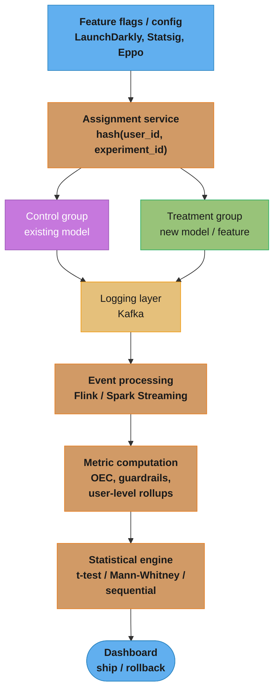
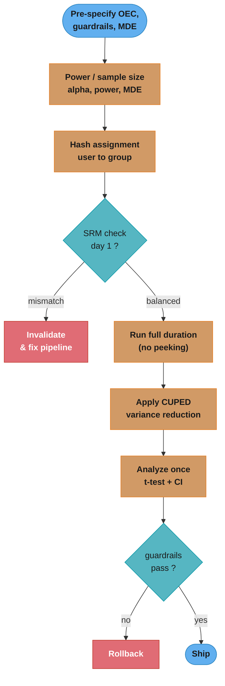
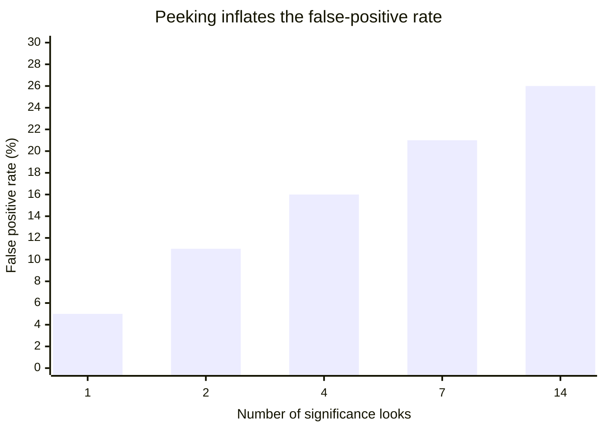

# Experimentation and Online Evaluation

## 1. Concept Overview

Experimentation is the discipline of measuring the causal effect of a change — a new model, a new feature, a new product experience — on user behavior and business outcomes, in a live production system. Online evaluation answers the question: "Did this change actually improve the metric we care about, or did it just look good offline?" It is the final arbiter of ML model quality, because offline metrics (AUC, RMSE, NDCG) are proxies for business value, not business value itself.

This module covers: metric design (what to measure and why), experiment design (how to assign users and how long to run), causal validity (ensuring the measured effect is the one you think it is), and product sense — the skill of defining success metrics for a product that align with long-term user and business health, not just short-term engagement signals.

---

## 2. Intuition

> Offline metrics are a map; online experiments are the territory. The map is useful for navigation but it is not the terrain. A model that improves offline NDCG by 3% but reduces subscription renewals by 0.5% has a good map and bad terrain.

Mental model: a product is a system with multiple feedback loops. Any metric you optimize will be gamed or will have unintended side effects on other metrics. The art of metric design is choosing an OEC (Overall Evaluation Criterion) that resists gaming and serves as a reliable proxy for long-term health.

**Key insight:** experimentation is a rate-limiter on product improvement velocity. A team that ships one experiment per week and learns from each is faster than a team that ships five experiments per week and cannot interpret results. Experiment hygiene — correct design, sufficient power, clean assignment — is a multiplier on engineering productivity.

Why it matters: without online evaluation, every ML improvement is a guess. Even the best offline evaluation harness misses distribution shift, feedback loops, novelty effects, and user adaptation. Online experiments close the loop between model optimization and business reality.

---

## 3. Core Principles

**One primary metric per experiment.** An experiment that tracks 20 metrics will find spurious significant results by chance (multiple testing problem). Designate one pre-specified primary metric. All other metrics are secondary — informative but not decision-making.

**OEC must be long-term aligned.** The OEC (Kohavi et al.) should correlate with long-term user and business health, not short-term engagement. Maximizing click-through rate can be achieved by clickbait that destroys trust. Use metrics that require genuine value creation: subscription renewal rate, 6-month retention, customer lifetime value, weekly active users (not daily — more stable, harder to game).

**Guardrail and counter-metrics prevent regression.** Alongside the primary metric, define guardrail metrics (things that must not get significantly worse) and counter-metrics (things you expect to trade off and want to quantify). Shipping a change that improves revenue per session by +1% while increasing support ticket rate by +15% is net-negative.

**Power before you run, not after.** Calculate minimum detectable effect (MDE) and required sample size before running the experiment. Post-hoc power analysis (calculating power after seeing results) is always sufficient because you can adjust N to match any observed effect — it is statistically invalid.

**Randomization unit matters.** The randomization unit (user, session, request, device) determines what you can measure. Randomizing at the user level: long-term effects are measurable; variance is higher than session-level. Randomizing at the session level: lower variance; user-level effects cannot be measured cleanly (same user can be in both groups across sessions).

---

## 4. Types / Architectures / Strategies

### 4.1 Metric Taxonomy

| Category | Examples | Purpose |
|---|---|---|
| North-star metric | 30-day active users, annual revenue, LTV | Long-term health; rarely changes |
| OEC (primary metric) | D28 retention rate, revenue per user, % successful sessions | Directly measured per experiment; must be long-term aligned |
| Guardrail metrics | Latency p99, error rate, revenue per session floor | Cannot worsen; kill-switch triggers |
| Counter-metrics | Number of support contacts, churn in treated cohort | Quantify unintended side effects |
| Debug metrics | Feature coverage, model score distribution, null rates | Help diagnose experiment failures |

### 4.2 Experiment Design Taxonomy

| Design | Best for | Key assumption | Risk |
|---|---|---|---|
| Standard A/B (user-level) | Most product experiments | SUTVA (no interference) | Novelty effect; SUTVA violations |
| A/B/n (multi-arm) | Comparing multiple variants | Same as A/B | Multiple testing correction needed |
| Interleaving | Ranking/recommendation quality | User-level randomization | Cannot measure absolute metrics, only relative |
| Holdback | Long-term effect measurement | Consistent control group | Sample contamination from user discussion |
| Switchback | Marketplace, supply/demand | No carryover between periods | Carryover bias if periods too short |
| Stratified randomization | Small experiments, imbalanced groups | Stratification factors available | Adds complexity |
| Cluster randomization | Network effects (social, marketplace) | Clusters are non-overlapping | Variance inflation; hard to power |

### 4.3 Variance Reduction Methods

| Method | Variance reduction | Requirement | Notes |
|---|---|---|---|
| CUPED | 20-50% typical | Pre-experiment covariate (same metric in pre-period) | Standard at Booking.com, Netflix, LinkedIn |
| Stratification | 10-30% | Stratification factor known before randomization | Applied at design time |
| CUPAC | 30-60% | Rich pre-experiment feature set; ML covariate | ML-predicted control metric as covariate |
| Delta method | N/A (SE correction) | Ratio metrics (CTR = clicks/impressions) | Prevents invalid t-test on ratio metrics |

---

## 5. Architecture Diagrams

### Experimentation Platform Architecture



A deterministic hash routes each user to one arm; both arms flow through a shared logging and metric pipeline so the two groups are measured identically.

### A/B Experiment Lifecycle



The plan is locked before any data is seen; SRM is checked on day 1, results are analyzed exactly once at the pre-committed horizon, and a guardrail breach overrides a winning primary metric.

### CUPED Variance Reduction

```
Without CUPED:
  Var(Y_t - Y_c) = 2 * Var(Y)   <- high variance = need more users

With CUPED:
  Y_adj = Y - theta * (X - E[X])
  where X = pre-experiment value of Y, theta = Cov(Y,X) / Var(X)
  Var(Y_adj) = Var(Y) * (1 - rho^2)  <- rho = correlation of pre/post metric
  If rho = 0.7 → 51% variance reduction → halve experiment duration
```

---

## 6. How It Works — Detailed Mechanics

### 6.1 Metric Design — OEC Construction

```python
import pandas as pd
import numpy as np
from typing import Any

def define_oec_metrics(
    experiment_events: pd.DataFrame,
    user_col: str = "user_id",
    group_col: str = "experiment_group",
    observation_window_days: int = 14,
) -> pd.DataFrame:
    """
    Aggregate raw events to user-level OEC metrics.
    User-level aggregation is required for valid t-tests
    (experiments randomize at user level, so the analysis unit must match).
    """
    # Example: 14-day retention + revenue per user
    user_agg = (
        experiment_events.groupby([user_col, group_col])
        .agg(
            revenue_usd=("revenue_usd", "sum"),
            sessions=("session_id", "nunique"),
            returned_day14=(
                "event_date",
                lambda x: (x >= (x.min() + pd.Timedelta(days=13))).any(),
            ),
        )
        .reset_index()
    )
    return user_agg

def check_guardrails(
    control: pd.DataFrame,
    treatment: pd.DataFrame,
    p99_latency_control: float,
    p99_latency_treatment: float,
    latency_budget_ms: float = 200.0,
    error_rate_max_abs_increase: float = 0.002,
) -> dict[str, bool]:
    """Check that guardrail metrics are not violated."""
    latency_ok = p99_latency_treatment <= latency_budget_ms
    error_rate_c = control["error"].mean()
    error_rate_t = treatment["error"].mean()
    error_rate_ok = (error_rate_t - error_rate_c) <= error_rate_max_abs_increase

    return {
        "latency_within_budget": latency_ok,
        "error_rate_not_increased": error_rate_ok,
        "ship_ok": latency_ok and error_rate_ok,
    }
```

### 6.2 Sample Size and Power Calculation

```python
import numpy as np
from scipy import stats as scipy_stats

def compute_sample_size(
    baseline_mean: float,
    mde_relative: float,       # minimum detectable effect as fraction (e.g., 0.01 = 1%)
    baseline_std: float,
    alpha: float = 0.05,       # Type I error rate (significance level)
    power: float = 0.80,       # 1 - Type II error rate
    two_sided: bool = True,
) -> int:
    """
    Required sample size per arm for a two-sample t-test.
    Standard formula: n = 2 * ((z_alpha + z_beta) / delta)^2 * sigma^2
    """
    delta = baseline_mean * mde_relative      # absolute effect
    z_alpha = scipy_stats.norm.ppf(1 - alpha / (2 if two_sided else 1))
    z_beta = scipy_stats.norm.ppf(power)
    n = 2 * ((z_alpha + z_beta) / delta) ** 2 * baseline_std ** 2
    return int(np.ceil(n))

# Example: revenue per user
# Baseline: $5.00/day, std=$12.00 (high variance typical for revenue)
# MDE: 1% relative improvement = $0.05
# alpha=0.05, power=0.80 (two-sided)
n_per_arm = compute_sample_size(
    baseline_mean=5.00,
    mde_relative=0.01,
    baseline_std=12.00,
)
print(f"Required n per arm: {n_per_arm:,}")
# ~44,700 users per arm — 89,400 total
# At 500k DAU with 50/50 split: ~9 days to reach significance
```

### 6.3 CUPED Variance Reduction

```python
def apply_cuped(
    df: pd.DataFrame,
    metric_col: str,          # post-experiment metric (OEC)
    covariate_col: str,       # pre-experiment value of same metric
) -> pd.DataFrame:
    """
    CUPED: Controlled-experiment Using Pre-Experiment Data.
    Reduces variance by removing the portion explained by pre-experiment behavior.
    Equivalent to including the covariate in an OLS regression.
    """
    theta = np.cov(df[metric_col], df[covariate_col])[0, 1] / np.var(df[covariate_col])
    df = df.copy()
    df[f"{metric_col}_adj"] = df[metric_col] - theta * (df[covariate_col] - df[covariate_col].mean())

    var_reduction = 1 - (df[f"{metric_col}_adj"].var() / df[metric_col].var())
    print(f"CUPED variance reduction: {var_reduction:.1%}")
    return df
```

### 6.4 Broken Pattern — Peeking and Early Stopping

```python
import numpy as np
from scipy import stats as scipy_stats

# WRONG: checking significance daily and stopping when p < 0.05
# This inflates Type I error to ~20-40% depending on how often you peek.

np.random.seed(42)
n_days = 14
daily_n = 1000
false_positives = 0
n_simulations = 10_000

for _ in range(n_simulations):
    control = np.random.normal(5.0, 12.0, n_days * daily_n)
    treatment = np.random.normal(5.0, 12.0, n_days * daily_n)  # no true effect
    for day in range(1, n_days + 1):
        n = day * daily_n
        _, p = scipy_stats.ttest_ind(treatment[:n], control[:n])
        if p < 0.05:  # peek and stop when significant
            false_positives += 1
            break

print(f"False positive rate with peeking: {false_positives / n_simulations:.1%}")
# Result: ~26% false positive rate instead of 5%
```



One pre-specified look holds the nominal 5%; checking for significance daily across a 14-day test drives the true Type I error to roughly 26% — the reason sequential (always-valid) tests exist.

```python
# CORRECT: sequential testing with mSPRT (mixture Sequential Probability Ratio Test)
# Or: pre-commit to fixed sample size and analyze ONCE at the end.

def analyze_at_end(
    control_values: np.ndarray,
    treatment_values: np.ndarray,
    alpha: float = 0.05,
) -> dict[str, float]:
    """Pre-committed single analysis at the end of the experiment."""
    stat, p_value = scipy_stats.ttest_ind(treatment_values, control_values)
    effect_size = treatment_values.mean() - control_values.mean()
    ci_low, ci_high = scipy_stats.t.interval(
        1 - alpha,
        df=len(control_values) + len(treatment_values) - 2,
        loc=effect_size,
        scale=scipy_stats.sem(np.concatenate([treatment_values, control_values])),
    )
    return {
        "p_value": float(p_value),
        "effect_size": float(effect_size),
        "significant": p_value < alpha,
        "ci_low": float(ci_low),
        "ci_high": float(ci_high),
    }
```

---

## 7. Real-World Examples

**Booking.com:** processes over 1,000 concurrent experiments at any given time, covering every part of the product. Key practices: (1) CUPED applied to all experiments by default (reduces experiment duration by 30-50%); (2) "triggers" — users are only analyzed if they encountered the changed code path (trigger analysis reduces noise from users unaffected by the change); (3) strict SRM (Sample Ratio Mismatch) detection — if the control/treatment ratio is not as designed, the experiment is automatically flagged as invalid.

**Microsoft / Bing:** pioneered the OEC framework (Kohavi, Tang, Xu — "Trustworthy Online Controlled Experiments"). Key insight: sessions per user is a poor OEC because it can be improved by making Bing worse (frustrated users search more). Bing uses "distinct queries per user" (successful search = user finds what they need and stops querying) as the OEC. This metric resists gaming because it requires genuine user value.

**Airbnb:** uses a holdback experiment design for long-term effect measurement. When releasing a major feature (e.g., new pricing algorithm), a 10% holdback group does not receive the feature for 6 months. This measures the long-term effect accurately, including novelty effects wearing off, which cannot be measured in a 2-week experiment.

**Netflix:** uses interleaving for ranking model evaluation. Instead of showing list A to group A and list B to group B, interleaving shows a mixed list where items are drawn alternately from model A and model B. The metric is which model's items get selected. Interleaving has 10x lower variance than A/B testing for ranking comparisons because it uses within-user comparisons — the same user's preferences compared across the two lists.

**Lyft (switchback experiments):** marketplace dynamics (driver supply, passenger demand) violate SUTVA — treatment of one user affects control users (a treated driver who is dispatched faster is not available to control passengers). Lyft uses switchback experiments: alternate between control and treatment in 30-minute periods within the same city, measuring outcomes during the relevant period. Key requirement: no carryover between periods (clear inventory state at switchover).

---

## 8. Tradeoffs

| Experiment Design | Variance | Measures long-term effects | Handles network effects | Complexity |
|---|---|---|---|---|
| Standard A/B (user-level) | Medium | Partially (with long run) | No | Low |
| A/B with CUPED | Low | Partially | No | Low |
| Interleaving | Very low | No (short sessions) | No (within-user) | Medium |
| Holdback | Medium | Yes (6+ month window) | Partial | Medium |
| Switchback | High | No | Yes | High |
| Cluster randomization | Very high | Partially | Yes | High |

---

## 9. When to Use / When NOT to Use

**Use online experiments when:**
- You have sufficient traffic to reach statistical power within 2-4 weeks.
- The change can be A/B assigned at the user level without interfering with control users.
- The primary metric is measurable within the experiment window.

**Use interleaving instead of A/B when:**
- Comparing two ranking models where the primary metric is click/engagement on ranked results.
- Sample sizes are insufficient for A/B (interleaving needs 10x fewer users for same power).

**Use switchback when:**
- The intervention affects supply/demand equilibrium (marketplace, ride-sharing, delivery).
- SUTVA would be violated by user-level randomization.

**Do not run an experiment when:**
- You cannot power it (< MDE with available traffic in 4 weeks). Run a shadow deployment instead and evaluate offline proxy metrics.
- The change is one-way-door (cannot be rolled back). Deploy with feature flags but do not randomize for statistical testing.

---

## 10. Common Pitfalls

**Sample Ratio Mismatch (SRM).** The ratio of users in control vs treatment should match the planned split ratio (e.g., 50:50). If you planned 50:50 but observe 52:48, there is a bug in the assignment pipeline — often a filter applied to treatment but not control, or a logging issue. Do not analyze results from an experiment with SRM — the bias is impossible to correct post-hoc. SRM detection: chi-squared test on observed vs expected group sizes; p-value < 0.001 → invalidate experiment.

**Novelty effect.** Users engage more with any new experience simply because it is new. Novelty-effect-driven lift will appear significant in a 2-week experiment but disappear in 4 weeks. Mitigation: run long enough for novelty to decay (3-4 weeks for most UI changes), or use a holdback design. Do not ship a change based purely on novelty-driven metrics.

**Interference / SUTVA violation.** Standard A/B analysis assumes the Stable Unit Treatment Value Assumption: one user's treatment does not affect another user's outcome. This is violated in: social networks (treated user posts content that control users see), marketplace (treated driver takes a trip that a control driver would have taken), and search (treated user's queries change the index seen by control users). When SUTVA is violated, use cluster randomization, switchback, or geo-level experiments.

**Multiple testing without correction.** Running 20 metrics simultaneously and declaring success if any 5 are significant at p < 0.05 gives an expected 1 false positive by chance. Apply Bonferroni correction (divide alpha by number of tests) or Benjamini-Hochberg FDR control (5% FDR across all tests). Alternatively, pre-commit to one primary metric and treat all others as secondary (informative, not decision-making).

**Primary metric not aligned with long-term value.** Sessions per user, clicks per session, and time on site are all gameable — they can be increased by making the product slower, more confusing, or more addictive. These are not OECs. A valid OEC requires: user value (the user achieved their goal), not just engagement (the user was on the site longer).

---

## 11. Technologies & Tools

| Tool | Category | Strengths | Notes |
|---|---|---|---|
| Statsig | Full-stack experimentation platform | SRM detection, CUPED, sequential testing, Metric Explorer | Free tier for small teams |
| Eppo | Bayesian + frequentist A/B | CUPED, Bayesian posteriors, advanced metric support | Warehouse-native (BigQuery, Snowflake) |
| LaunchDarkly | Feature flags + experimentation | Mature flag management, SDKs for 30+ languages | Experimentation is an add-on |
| Optimizely | Web A/B testing | Easy UI for marketing, multi-page experiments | Limited for server-side ML experiments |
| Growthbook | Open-source A/B platform | Warehouse-native, free OSS, Bayesian + frequentist | Self-hosted |
| In-house + Python | Custom analysis | Full control, CUPED, sequential testing | Requires statistical engineering investment |

---

## 12. Interview Questions with Answers

**What is an OEC and how do you choose one?**
OEC (Overall Evaluation Criterion, Kohavi) is the single primary metric used to make the ship/no-ship decision for an experiment. Criteria for a good OEC: (1) long-term aligned — correlates with long-term user and business health, not just short-term engagement; (2) sensitive — moves detectably within a 2-4 week experiment window; (3) manipulation-resistant — cannot be improved by making the product worse for users; (4) measurable at the user level — can be aggregated to a user-level value for statistical testing. Example: for a streaming service, OEC = 30-day retention rate (correlates with LTV) rather than average session length (gameable by making videos slower to load).

**What is the difference between a guardrail metric and a counter-metric?**
A guardrail metric is a metric that must not worsen: it defines a hard floor on product quality. If the guardrail is violated, the experiment fails regardless of primary metric performance. Examples: p99 latency, error rate, support ticket rate. A counter-metric is a metric you expect may trade off against the primary metric, which you want to quantify rather than prevent. If you improve subscription revenue per user (OEC), you expect churn in the first month to slightly increase (counter-metric) — you want to measure and document this trade-off, not necessarily use it as a kill switch.

**How do you detect and handle a Sample Ratio Mismatch?**
SRM occurs when the observed sample sizes in control and treatment groups differ from the planned split ratio. Detect with a chi-squared goodness-of-fit test: expected_n_treatment = total_n × planned_split; chi2 = (observed - expected)^2 / expected; if p < 0.001, SRM is present. Common causes: treatment-specific bot filtering (bots removed from treatment but not control), differential assignment logging (some treatment events are not logged), session-level re-randomization creating user-level imbalance. Always check for SRM before analyzing any experiment; invalidate and re-run if SRM is detected.

**Explain CUPED and when it helps the most.**
CUPED (Controlled-experiment Using Pre-Experiment Data) reduces variance by subtracting the component of the post-experiment metric that is explained by pre-experiment behavior: Y_adj = Y - theta × (X - E[X]), where X is the same metric measured in the pre-experiment period and theta = Cov(Y,X)/Var(X). The variance of Y_adj is Var(Y) × (1 - rho²), where rho is the correlation between pre and post metrics. CUPED helps most when: (a) the metric is stable across periods (high pre-post correlation, rho > 0.5 — typical for revenue, retention, query volume); (b) users have heterogeneous engagement levels (high between-user variance). CUPED provides no benefit when rho ≈ 0 (the metric is a new measurement with no pre-period analog).

**What is the novelty effect and how does it bias experiments?**
The novelty effect is the temporary increase in user engagement when any new experience is introduced, driven by curiosity and exploration rather than genuine value. It causes experiments to report larger treatment effects early in the run that decay over time as users habituate to the new experience. It biases experiments by: inflating the measured effect during the first 1-2 weeks; causing ships based on inflated effects that do not persist in production; making it appear that a change is better than it actually is long-term. Mitigation: (a) run experiments for 3-4 weeks before analyzing; (b) stratify analysis by "new users" vs "experienced users" — novelty effect should be weaker for users who had previously seen a similar feature; (c) use a holdback design (leave 10% in control permanently) to measure the effect over 6+ months.

**How do you handle network effects in an experiment?**
Network effects violate SUTVA — a user's treatment assignment affects the outcomes of users in their network. In social networks: a treated user who posts more affects the feed quality of control users in their network. Solutions: (1) cluster randomization — randomize at the cluster level (friend graph connected component, geographic region) instead of the user level; each cluster is entirely in control or treatment. Drawback: high variance (clusters are variable size), requires many clusters for power. (2) Ego network randomization — randomize the "ego" user; all their "alters" receive the treatment through the ego's behavior. (3) Holdout experiments — remove a fraction of users from all experiments; compare the full-experiment world to the holdout world for network-wide effects. (4) Graph exposure mapping — model the fraction of a user's network that is treated and use this as a covariate.

**What is interleaving and when should you use it for ML evaluation?**
Interleaving is an online evaluation technique for ranking models where, instead of showing user A a list from model A and user B a list from model B, both models' outputs are merged into a single interleaved list and shown to a single user. Items are drawn alternately from each model's ranking (team draft interleaving or balanced interleaving). The metric is which model's items are clicked/engaged with more. Interleaving provides 10-20x lower variance than A/B for ranking comparisons because it uses within-user comparisons (comparing model A vs model B for the same query at the same moment), eliminating user-level heterogeneity. Use it when: comparing ranking models is the primary objective; the primary metric is engagement on ranked results; sample size is insufficient for A/B. Do not use interleaving for: measuring absolute revenue, new feature launches (not a pure ranking comparison), or non-ranking model changes.

**What is a holdback experiment and why do you run one?**
A holdback experiment withholds a new feature or model from a fixed percentage of users (e.g., 10%) for an extended period (3-12 months) while the rest of the user base receives it. The holdback group is the permanent control. This measures the long-term effect of the change — after novelty effects have decayed, after users have adapted their behavior, and after second-order effects (user-generated content creation, network growth) have materialized. Netflix runs holdbacks for all major algorithm changes and product features. The risk is user frustration (holdback users may notice they are getting a worse experience) and the cost of maintaining two code paths for months.

**Explain the peeking problem and how sequential testing solves it.**
Peeking is the practice of checking experiment results daily and stopping as soon as p < 0.05. The peeking problem: p-values are valid only for a single pre-specified analysis; looking at p multiple times inflates the Type I error rate significantly (checking daily for 14 days inflates alpha from 5% to ~26%). Sequential testing (SPRT, mSPRT, always-valid p-values) solves this by adjusting the significance threshold at each look so that the overall Type I error rate across all looks remains at alpha. The mSPRT (mixture SPRT) produces "anytime-valid" p-values — you can stop at any time without inflating Type I error. Statsig and Eppo use sequential testing by default. The tradeoff: sequential tests are less powerful than a fixed-sample test at the same nominal alpha (you "spend" some power on the extra validity guarantee).

**How do you set up an experiment for a new ML model?**
Step 1: pre-specify the OEC, guardrail metrics, and counter-metrics. Document this in the experiment plan before looking at any results. Step 2: compute required sample size (power calculation at alpha=0.05, power=0.80, MDE=smallest practically meaningful effect). Step 3: implement assignment via hash(user_id, experiment_id) → group. Check for SRM immediately on day 1. Step 4: run for the planned duration — no early stopping unless a guardrail is violated. Step 5: apply CUPED if the metric has a pre-period covariate. Step 6: analyze the primary metric (one-sided or two-sided t-test as pre-specified). Step 7: if significant and guardrails pass, ship. Document results including effect size, confidence interval, and secondary/counter-metric impacts.

**What metrics would you use to evaluate a recommendation system experiment?**
Primary (OEC): one of — D28 retention rate, revenue per user per week, successful searches per user (user found what they were looking for). Do not use CTR or watch time alone (both are gameable). Guardrails: p99 recommendation latency, content diversity index (ensure not showing users only narrow content), error rate. Counter-metrics: skip rate (user skipped the recommended content after viewing briefly — indicates mismatch), time to find desired content (if increased, recommendations are harder to navigate). Debug metrics: recommendation coverage (fraction of catalog recommended to at least one user), novelty score (how often new content appears in recommendations). Key consideration: recommendation experiments often have novelty effects (new recommendation algorithm always looks better in week 1); run for 3+ weeks and check week-1 vs week-3 effect decay.

**A product team wants to run an experiment to test if a new ML model improves "user satisfaction." How do you define and measure this?**
User satisfaction is a latent variable — it must be operationalized through observable proxies. Candidate proxy metrics: (1) explicit feedback — thumbs up/down, star rating, NPS; noisier but direct. (2) implicit behavioral signals — return visit within 24h (user came back = satisfied enough to return), task completion rate (user accomplished their goal), time to success (shorter = faster satisfaction), support ticket rate (lower = fewer problems). (3) long-term retention — 30-day or 90-day active rate (sustained satisfaction). Choose a proxy that is both measurable within the experiment window and has documented correlation with the long-term outcome you care about. Do not use time-on-site — it conflates engagement with dissatisfaction (users who couldn't find what they wanted spend more time searching).

**What is the 4/5ths rule applied to experimentation? (Trick question — clarify why.)**
The 4/5ths rule is a fairness metric for protected group disparate impact — it has no direct application to experimentation methodology. If an interviewer asks this, clarify the context. If the intent is to ask whether the experiment's effects are consistent across demographic groups, the right framework is subgroup analysis (compute OEC separately for each demographic subgroup, check for heterogeneous treatment effects) and the appropriate statistical tool is interaction testing (OEC ~ treatment + group + treatment × group interaction term). A significant interaction term means the treatment effect differs by group — both a fairness concern and a product insight.

---

## 13. Best Practices

**Write the experiment plan before looking at any data.** Pre-specify: OEC, guardrail metrics, primary hypothesis (one-sided or two-sided?), planned run duration, minimum detectable effect. Lock the plan before running. Any deviation from the plan is a protocol violation that inflates false discovery rate.

**Always check for SRM on experiment day 1.** SRM is a leading indicator of assignment or logging bugs. Catching SRM on day 1 lets you fix the bug and re-run. Catching SRM on day 14 (after 13 days of data collection) wastes two weeks. Automate SRM detection as part of the experiment monitoring pipeline.

**Run experiments for at least one full business cycle.** Most products have weekly seasonality. An experiment started on a Monday and analyzed the following Wednesday has seen predominantly weekday behavior. Run for at least 7 days, and ideally 14+ days, to capture a full weekly cycle.

**Segment results by user maturity.** New users and long-tenured users often respond very differently to changes. Report effect sizes separately for new users (registered < 30 days) and retained users. A change that benefits new users at the cost of experienced users may be net-negative if LTV skews toward experienced users.

**Document and share experiment results, including null results.** Null results (no significant effect) are as informative as positive results — they prevent re-running the same experiment. Build a searchable experiment registry where all past experiments are documented with: hypothesis, result, effect size (including 95% CI), lessons learned.

---

## 14. Case Study

This cross-cutting file is referenced by the following case studies:

**[design_churn_prediction.md](../design_churn_prediction.md):** Churn model improvements are evaluated via a holdback experiment — the new model is deployed to 90% of users; the 10% holdback uses the previous model. The OEC is 90-day subscription renewal rate (long-term aligned, resists novelty effect). CUPED reduces variance using pre-experiment 90-day renewal rate as the covariate, cutting required experiment duration from 12 weeks to 7 weeks.

**[design_credit_risk_scoring.md](../design_credit_risk_scoring.md):** Credit model changes cannot be randomly A/B tested for legal reasons (disparate treatment concerns if different applicants receive different scoring models). Instead, shadow scoring is used: the new model scores all applicants alongside the live model. The metric is calibration improvement (ECE on the latest 30-day cohort) and rank correlation with the live model's risk tiering. Formal A/B testing is replaced by regulatory review and backtesting.

**[design_eta_prediction.md](../design_eta_prediction.md):** ETA model improvements are evaluated with a standard user-level A/B experiment. OEC = trip completion rate (proxy for "ETA was accurate enough that rider did not cancel") plus post-trip ETA accuracy (|predicted - actual| < 2 minutes). Guardrail: no increase in support contacts for "wrong ETA" category. The experiment runs for 14 days with CUPED applied using the prior week's trip completion rate.

**[design_marketplace_matching.md](../design_marketplace_matching.md):** Matching algorithm changes require switchback experiments (30-minute periods alternating control/treatment in each city-zone) because driver supply is shared between control and treatment groups. OEC = trips per driver-hour (supply efficiency). Guardrail = rider ETA at dispatch (must not increase). Switchback introduces carryover bias if periods are shorter than average trip duration (~20 minutes); 30-minute periods with a 5-minute burn-in window are used.
