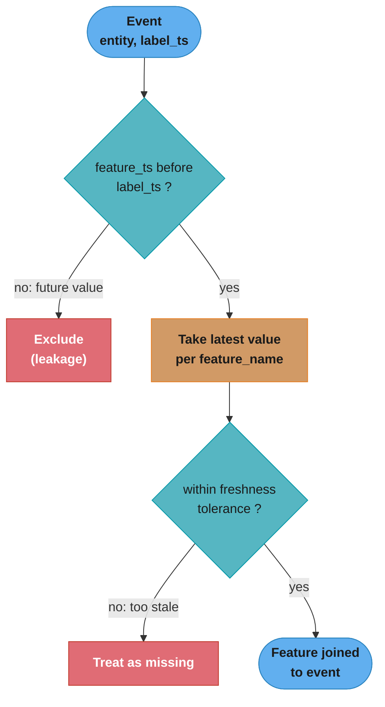
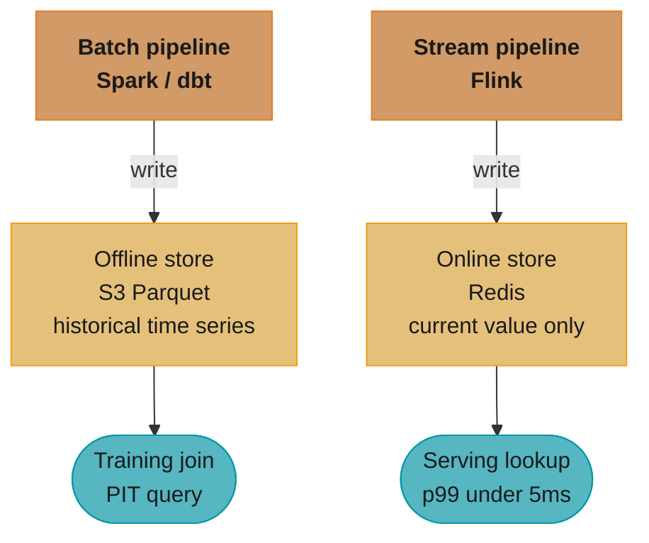

# Feature Store and Point-in-Time Correctness

## 1. Concept Overview

A feature store is a centralized repository for machine learning features that serves two masters simultaneously: the offline training pipeline (which needs historical feature values at exact past timestamps) and the online serving system (which needs current feature values within milliseconds of a request). The central correctness challenge is point-in-time (PIT) correctness: ensuring that when you train a model on historical data, the features used for each training example reflect only the information that was available at the time of that example's event — not information from the future.

Feature stores solve three problems: (1) feature reuse across models and teams without duplication, (2) elimination of training-serving skew, and (3) enforcement of PIT correctness at historical join time.

---

## 2. Intuition

> A feature store is like a time-traveling database: you can query "what was the customer's 30-day purchase count as of March 15th at 14:32?" and get the answer that was true at that exact moment — not the value computed yesterday with today's data.

Mental model: think of each feature as a time series of values. The feature store records every value change with a timestamp. A PIT join asks "for each event in my training dataset (timestamp, entity_id), give me the feature values that were current at that timestamp — looking backward only, never forward."

**Key insight:** training-serving skew is the silent killer of ML models. A model trained with data leaked from the future will have inflated offline metrics but degrade catastrophically in production. PIT correctness at training time guarantees that the offline/online distribution match by construction.

Why it matters: in production ML, a 2% offline metric improvement that introduces training-serving skew is worthless. A correctly built feature store is the engineering primitive that makes offline evaluation trustworthy.

---

## 3. Core Principles

**Entity–feature–timestamp triplet.** Every feature value is uniquely identified by (entity_id, feature_name, event_timestamp). The feature store is a function: `(entity_id, feature_name, as_of_timestamp) → value`.

**Write time vs event time.** Features may be written to the store with a delay (ingestion lag). PIT correctness requires using the *event time* of the original observation, not the write time. If a transaction happened at 14:30 but wasn't ingested until 14:45, the feature value is only available to models training on events after 14:45 — not 14:30.

**Two-store architecture.** Offline store (Parquet/Delta Lake on S3 or BigQuery) serves historical point-in-time joins for training. Online store (Redis/DynamoDB/Bigtable) serves current feature values for real-time inference. They are kept in sync by the same feature computation pipeline.

**No look-ahead in join keys.** The label timestamp must be strictly greater than the feature timestamp used in the join. Any feature derived from data after the label event introduces leakage.

**Freshness SLOs per feature.** Different features tolerate different staleness: user 30-day purchase count can be 1 hour stale; fraud velocity counter (transactions in last 60 seconds) must be real-time. The feature store must track per-feature freshness and alert when SLOs are violated.

---

## 4. Types / Architectures / Strategies

### 4.1 Offline-Only Feature Store (Batch Training)

```mermaid
flowchart LR
    classDef io      fill:#61afef,stroke:#2e86c1,color:#1a1a1a,font-weight:bold
    classDef frozen  fill:#c678dd,stroke:#9b59b6,color:#fff
    classDef train   fill:#98c379,stroke:#27ae60,color:#1a1a1a
    classDef mathOp  fill:#d19a66,stroke:#e67e22,color:#1a1a1a,font-weight:bold
    classDef lossN   fill:#e06c75,stroke:#c0392b,color:#fff,font-weight:bold
    classDef req     fill:#56b6c2,stroke:#0097a7,color:#1a1a1a
    classDef base    fill:#e5c07b,stroke:#f39c12,color:#1a1a1a

    raw(["Raw data\nS3 / DWH"]) --> pipe["Feature pipeline\nSpark / dbt"]
    pipe --> store["Offline store\nParquet / Delta Lake"]
    store --> join["PIT join\nat training time"]
    join --> ds(["Training dataset"])
    ds --> model["Model"]

    class raw,ds io
    class store base
    class pipe,join mathOp
    class model train
```



Single linear pipeline: raw data is aggregated once into the offline store, and every training run reads it through a point-in-time join.

Simplest architecture. Works when models are trained daily and features tolerate daily refresh. Does not support real-time serving from the same store.

### 4.2 Dual-Store Architecture (Training + Serving)

```
Raw Events (Kafka)
        |
    +---+---+
    |       |
Batch     Stream
Pipeline   Pipeline
(Spark)    (Flink)
    |       |
    v       v
Offline   Online
Store     Store
(S3/BQ)  (Redis)
    |       |
    v       v
Training  Serving
Pipeline  API
```

Features are computed twice: once by a batch pipeline for historical joins, once by a stream pipeline for real-time serving. Risk: the two pipelines can drift if they implement slightly different logic.

### 4.3 Single-Source Architecture (Lambda / Kappa)

In the Lambda architecture, a batch layer and a speed layer coexist. In the Kappa architecture (Flink/Kafka Streams), a single stream pipeline computes all features and writes to both stores. Kappa eliminates the dual-logic risk but requires a stream processing system powerful enough to handle batch-scale historical reprocessing.

### 4.4 Feature Categories by Freshness Requirement

| Category | Update Frequency | Store | Examples |
|---|---|---|---|
| Static | One-time or rare | Offline | Demographic data, product category |
| Daily batch | 1/day | Offline + online | 30-day purchase count, monthly revenue |
| Hourly | 1/hour | Offline + online | Session count today, hourly order volume |
| Near-real-time | 1-5 minutes | Primarily online | Last N transactions, trending score |
| Real-time | Per event | Online only | Velocity counters, fraud signals (60s) |

---

## 5. Architecture Diagrams

### PIT Join Correctness

```
Training Dataset (raw events with label timestamps):

  entity_id | label_event_time | label
  --------- | ---------------- | -----
  user_001  | 2024-03-15 14:32 | churned
  user_002  | 2024-03-15 09:10 | retained
  user_003  | 2024-03-15 21:00 | churned

Feature Store (historical values with write timestamps):

  entity_id | feature          | value | event_time
  --------- | ---------------- | ----- | ----------
  user_001  | 30d_purchase_cnt | 3     | 2024-03-15 00:01
  user_001  | 30d_purchase_cnt | 4     | 2024-03-15 16:00  <-- FUTURE, must exclude
  user_002  | 30d_purchase_cnt | 12    | 2024-03-14 23:58
  user_003  | 30d_purchase_cnt | 0     | 2024-03-15 00:01

PIT Join result (as_of = label_event_time):

  entity_id | label_event_time | 30d_purchase_cnt | label
  --------- | ---------------- | ---------------- | -----
  user_001  | 2024-03-15 14:32 | 3  (not 4!)      | churned
  user_002  | 2024-03-15 09:10 | 12               | retained
  user_003  | 2024-03-15 21:00 | 0                | churned
```

The as-of join applies one rule per event and feature:



Each event keeps only the latest feature value stamped strictly before its label time, then drops values that fall outside the freshness tolerance.

### Dual-Store Sync



Both pipelines derive from the same feature definitions; the offline store retains the full timestamped history for PIT training joins while the online store retains only the latest value for low-latency serving.

---

## 6. How It Works — Detailed Mechanics

### 6.1 Point-in-Time Join (Correct Implementation)

```python
import pandas as pd
from datetime import datetime

def pit_join(
    events: pd.DataFrame,          # columns: entity_id, label_timestamp, label
    features: pd.DataFrame,         # columns: entity_id, feature_name, value, feature_timestamp
    tolerance_hours: float = 24.0,  # max lookback for feature freshness
) -> pd.DataFrame:
    """
    Merge feature values onto events using strictly backward-looking PIT join.
    Each event gets the most recent feature value that is <= event timestamp.
    """
    result_rows: list[dict] = []

    for _, event in events.iterrows():
        entity = event["entity_id"]
        label_ts: datetime = event["label_timestamp"]

        entity_features = features[features["entity_id"] == entity].copy()
        # Only features available strictly before the label event
        available = entity_features[
            entity_features["feature_timestamp"] < label_ts
        ]

        if available.empty:
            continue

        # For each feature name, take the most recent value
        latest = (
            available.sort_values("feature_timestamp")
            .groupby("feature_name")
            .last()
            .reset_index()[["feature_name", "value"]]
        )

        row = {"entity_id": entity, "label_timestamp": label_ts, "label": event["label"]}
        for _, feat_row in latest.iterrows():
            row[feat_row["feature_name"]] = feat_row["value"]

        # Enforce freshness tolerance: drop features older than tolerance
        min_allowed_ts = label_ts - pd.Timedelta(hours=tolerance_hours)
        for _, feat_row in available.sort_values("feature_timestamp").groupby("feature_name").last().iterrows():
            if feat_row["feature_timestamp"] < min_allowed_ts:
                row.pop(feat_row.name, None)  # feature too stale — treat as missing

        result_rows.append(row)

    return pd.DataFrame(result_rows)
```

### 6.2 Broken Pattern — Future Data Leak

```python
# WRONG: naive join without PIT consideration
# This uses feature values as of TODAY, not as of label_timestamp
df_train = events_df.merge(
    features_df[["entity_id", "30d_purchase_cnt"]],  # current value, no timestamp
    on="entity_id",
    how="left",
)
# The feature "30d_purchase_cnt" computed today includes purchases that happened
# AFTER the churn event. Model learns from the future → 0.97 AUC offline, 0.62 in prod.
```

```python
# CORRECT: always join on (entity_id, feature_timestamp <= label_timestamp)
# Using Feast-style PIT join or custom implementation above
from feast import FeatureStore
from feast.feature_view import FeatureView

store = FeatureStore(repo_path="feature_repo/")
training_df = store.get_historical_features(
    entity_df=events_df[["entity_id", "event_timestamp"]],
    features=["user_stats:30d_purchase_cnt", "user_stats:days_since_last_order"],
).to_df()
# Feast uses event_timestamp as the as_of parameter — PIT correct by default
```

### 6.3 Online Feature Serving

```python
import redis
import json
from typing import Any

class OnlineFeatureStore:
    def __init__(self, redis_host: str = "localhost", redis_port: int = 6379) -> None:
        self.client = redis.Redis(host=redis_host, port=redis_port, decode_responses=True)

    def get_features(
        self,
        entity_id: str,
        feature_names: list[str],
    ) -> dict[str, Any]:
        """
        Retrieve current feature values for an entity in a single Redis pipeline.
        p99 target: < 3ms for 20 features.
        """
        pipe = self.client.pipeline()
        for name in feature_names:
            pipe.hgetall(f"feat:{entity_id}:{name}")
        results = pipe.execute()

        return {
            name: json.loads(result["value"]) if result else None
            for name, result in zip(feature_names, results)
        }

    def write_feature(
        self,
        entity_id: str,
        feature_name: str,
        value: Any,
        ttl_seconds: int = 3600,
    ) -> None:
        key = f"feat:{entity_id}:{feature_name}"
        self.client.hset(key, mapping={"value": json.dumps(value)})
        self.client.expire(key, ttl_seconds)
```

### 6.4 Training-Serving Skew Detection

```python
import numpy as np
from scipy import stats as scipy_stats

def detect_training_serving_skew(
    training_values: np.ndarray,
    serving_values: np.ndarray,
    psi_threshold: float = 0.2,
) -> dict[str, float]:
    """
    Population Stability Index (PSI) to detect distribution shift
    between training and serving feature values.
    PSI < 0.1: no shift. 0.1-0.2: moderate shift. > 0.2: significant skew.
    """
    n_bins = 10
    train_hist, bin_edges = np.histogram(training_values, bins=n_bins)
    serve_hist, _ = np.histogram(serving_values, bins=bin_edges)

    # Add small constant to avoid log(0)
    train_pct = (train_hist + 1e-6) / len(training_values)
    serve_pct = (serve_hist + 1e-6) / len(serving_values)

    psi = float(np.sum((serve_pct - train_pct) * np.log(serve_pct / train_pct)))
    ks_stat, ks_pval = scipy_stats.ks_2samp(training_values, serving_values)

    return {
        "psi": psi,
        "psi_alert": psi > psi_threshold,
        "ks_statistic": float(ks_stat),
        "ks_pvalue": float(ks_pval),
        "ks_alert": ks_pval < 0.01,
    }
```

---

## 7. Real-World Examples

**Uber Michelangelo:** the pioneering production feature store. Offline store backed by Hive (HDFS); online store backed by Cassandra. Features are defined once in a DSL and computed by both Spark (offline) and Flink (online) from the same definition. PIT joins are performed by a Spark job that reads from Hive snapshots with event timestamps. Enabled 100+ models sharing the same feature library.

**Netflix:** uses an internal feature platform that separates *feature definitions* (business logic, e.g., "user's 30-day genre affinity score") from *feature computation* (Spark batch) and *feature serving* (a low-latency gRPC service backed by EVCache). Their key insight: centralizing feature definitions forced teams to standardize semantics, reducing cross-team semantic drift where two teams computed "30-day purchase count" differently.

**LinkedIn:** Feathr (open-sourced 2022) is LinkedIn's feature store built on Spark + Redis. Enforces PIT correctness at the API level: you cannot request training data without specifying an observation timestamp per entity. Feathr rejects any join configuration where feature timestamps could post-date the observation.

**Airbnb:** Chronon (open-sourced 2023) takes a different approach: features are defined as GroupBy aggregations over raw event tables (like SQL window functions), and the system computes both backfill (for training) and online materialization from the same definition — eliminating the dual-logic problem at the cost of requiring event-sourced raw data.

---

## 8. Tradeoffs

| Approach | Correctness guarantee | Operational complexity | Freshness | Cost |
|---|---|---|---|---|
| No feature store (ad-hoc SQL joins) | None — leakage-prone | Low | Any | Low |
| Batch-only store (Parquet + manual PIT) | High (if correctly implemented) | Medium | Daily/hourly | Low–Medium |
| Dual-store (Spark offline + Redis online) | High (if pipelines stay in sync) | High | Minutes | Medium |
| Stream-first (Flink → dual store) | High | Very high | Seconds | High |
| Managed feature store (Feast/Tecton/Hopsworks) | High (PIT enforced by API) | Medium (managed infra) | Configurable | Medium–High |

---

## 9. When to Use / When NOT to Use

**Use a feature store when:**
- Multiple models share features (amortizes the engineering cost).
- Training-serving skew is a known problem (frequent unexplained production degradation).
- Regulatory requirements demand reproducibility (retraining with the same feature snapshot).
- Feature computation is expensive and benefits from caching.

**Do not build a feature store when:**
- Single model, small team, simple features that can be computed at request time.
- Features are all static (loaded once from a database; no temporal component).
- The bottleneck is data quality or model quality, not feature engineering.

---

## 10. Common Pitfalls

**Duplicate feature logic across online and offline pipelines.** Team A writes a Spark job to compute "30-day purchase count" for training; Team B writes a Python script to compute the same at serving time. Six months later, they diverge: Spark job counts cancelled orders; Python script doesn't. Every model trained in the interim has training-serving skew. Fix: single feature definition with dual materialization (Chronon/Feathr pattern).

**Using write time instead of event time for PIT joins.** A batch pipeline runs at 02:00 and writes features with timestamp = 02:00. A label event happened at 23:55 the previous day. Naive join uses the 02:00 feature value, which includes data from the label event itself and the following 2 hours. Fix: always propagate and use the *original event time* of the source data, not the pipeline execution time.

**Over-fetching in online serving.** A serving endpoint fetches 500 features per request from Redis, taking 30ms when the model uses only 50. Fix: define per-model feature sets; fetch only what the model needs. Use Redis pipelines (batch multi-GET) to fetch in one network round trip.

**Feature store cold-start for new entities.** A new user entity has no features in the online store. Naive lookup returns null → model receives NaN → prediction fails or falls back to a bad default. Fix: define explicit null handling (impute with training population mean) and test the null path in integration tests before deployment.

**Stale features silently serving.** The Flink pipeline for near-real-time features breaks due to schema change in an upstream Kafka topic. Redis values go stale but no alert fires. The fraud model continues serving predictions using 4-hour-old velocity counters. Fix: record feature_written_at timestamps in the online store; alert when `now - feature_written_at > freshness_SLO`.

---

## 11. Technologies & Tools

| Tool | Type | Strengths | Weaknesses |
|---|---|---|---|
| Feast (open source) | Managed + self-hosted | PIT-correct by API design, Spark offline, Redis/DynamoDB online | Requires infrastructure management |
| Tecton | Managed SaaS | Production-grade, stream + batch, monitoring built in | Expensive |
| Hopsworks | Open source managed | Full stack incl. training pipelines | Complex to self-host |
| Chronon (Airbnb OSS) | Self-hosted | Single definition → dual compute | Requires event-sourced data |
| Feathr (LinkedIn OSS) | Self-hosted (Spark) | Cross-platform, Azure/AWS/GCP | Younger, less production-tested |
| Vertex AI Feature Store | GCP managed | Fully managed, BigTable backend | GCP lock-in |
| SageMaker Feature Store | AWS managed | Tight Sagemaker integration, online+offline | AWS lock-in |

---

## 12. Interview Questions with Answers

**Q: What is point-in-time correctness and why does it matter?**
PIT correctness means that when building a training dataset, each training example uses only feature values that were available at the time of the label event — no information from the future. It matters because violating PIT correctness (using features computed with future data) makes the model appear more accurate in offline evaluation than it actually is. The model learns to predict using signals it will never have in production, so offline AUC of 0.95 can collapse to 0.62 in production. PIT correctness is the primary engineering guarantee that makes offline metrics trustworthy.

**Q: Describe the training-serving skew problem and its root causes.**
Training-serving skew is when the feature distribution at training time differs from the feature distribution at serving time. Root causes: (1) feature logic implemented differently in batch (training) vs online (serving) code; (2) using current feature values for training instead of past values (PIT violation); (3) features that are available during training but missing or stale at serving time; (4) preprocessing applied during training but forgotten during serving. It manifests as a model that looks great offline but degrades immediately in production with no code changes.

**Q: How does a dual-store feature store architecture work?**
An offline store (typically Parquet/Delta Lake on S3 or BigQuery) stores full feature value histories with timestamps, enabling arbitrary PIT joins for training. An online store (Redis, DynamoDB, or Bigtable) stores only the most recent value per entity, enabling sub-millisecond lookups during serving. Both stores are fed by the same feature computation pipelines (batch Spark for the offline store; stream Flink for the online store) from shared feature definitions. The consistency guarantee is that the online store's current value should match the most recent timestamp in the offline store for the same entity.

**Q: What is the risk of implementing feature logic separately in the offline and online pipelines?**
Logic drift. Two codebases implementing the same semantic definition ("30-day purchase count") will diverge over time as each is maintained independently. The offline Spark job may fix a bug (e.g., excluding cancelled orders) while the online Python script is not updated. Now the model is trained on a feature that excludes cancelled orders but served on a feature that includes them. The model may have learned to correlate cancelled-order-free behavior with churn, which is wrong for the online distribution. This is why Chronon/Feathr-style single-definition-dual-materialization architectures exist.

**Q: How do you detect training-serving skew in production?**
Log feature values at serving time and compare their distribution against the training distribution periodically (e.g., hourly). Use Population Stability Index (PSI > 0.2 = significant shift) or KS test for continuous features. For categorical features, compare chi-squared statistics. Set alerts that trigger model investigation when PSI exceeds threshold. Also log model score distributions at serving time and compare against training score distribution — a shift in the score distribution is a leading indicator of skew even before you can identify which feature caused it.

**Q: A model degrades 2 weeks after deployment with no code changes. How do you root-cause it?**
Step 1: check if it is data drift or model drift. Plot input feature distributions (today vs training) for each feature using PSI. Step 2: if feature distributions have shifted, identify which features drifted most and trace back to the upstream data source. Step 3: check for PIT violations in recent training runs (did the training pipeline recently change how it performs historical joins?). Step 4: check online store freshness SLOs — did a pipeline break cause stale features? Step 5: check for concept drift — has the relationship between features and target changed (e.g., customer behavior shift post-campaign)?

**Q: What is feature freshness SLO and how do you enforce it?**
A freshness SLO is a maximum allowed staleness for a feature value in the online store, e.g., "the 60-second transaction count feature must be updated within 5 minutes of the event." Enforcement: (1) write `feature_written_at` timestamp alongside the feature value in Redis; (2) a monitoring daemon polls a sample of entities every minute and computes `max(now - feature_written_at)` per feature; (3) alert if the staleness exceeds the SLO threshold; (4) the serving layer can also check freshness on read and return a null/default rather than a stale value if staleness exceeds a hard limit.

**Q: How does Feast enforce PIT correctness?**
Feast's `get_historical_features` API requires an `entity_df` that includes an `event_timestamp` column per entity. Internally, Feast performs an as-of join: for each (entity_id, event_timestamp) pair, it finds the most recent feature row in the offline store with `feature_timestamp <= event_timestamp`. It is not possible to call `get_historical_features` without providing the observation timestamp, so PIT correctness is enforced at the API boundary rather than relying on caller discipline.

**Q: What is the difference between feature time and write time and why does it matter?**
Feature time (event time) is when the underlying event that generated the feature value occurred. Write time is when the feature pipeline computed and wrote the value to the store. They differ by ingestion lag. For PIT correctness, you must use feature time for the join condition — not write time. If you use write time, a feature written at 03:00 from data spanning 01:00-02:00 will appear "available" for events that happened at 02:30, even though the feature computation hadn't happened yet. This introduces subtle future leakage proportional to ingestion lag.

**Q: When would you not build a feature store?**
When you have a single model, a small team, and simple features that can be computed at request time (e.g., from a database query in <5ms). The overhead of maintaining two stores, two pipelines, and PIT join logic is only justified when: (a) multiple models share features; (b) feature computation is expensive (Spark-scale aggregations); (c) training-serving skew is a known production problem. For a startup with one model and one data engineer, a feature store adds complexity faster than it removes it.

**Q: Describe the cold-start problem in online feature serving and how to handle it.**
New entities (new users, new items) have no feature history in the online store. A lookup returns null. The model must handle null inputs — either via imputation at inference time (replace null with the training population mean or median) or via a fallback model (a simpler model trained on the subset of features available for new entities). The imputation strategy must be consistent between training (how nulls in training data were handled) and serving (how online nulls are handled). Inconsistency is another form of training-serving skew.

**Q: How would you handle a feature that is available for training but not for serving?**
Remove it from the feature set before training. A feature that cannot be reliably provided at serving time should not be in the model regardless of its offline importance. If it cannot be removed (the model degrades unacceptably without it), build an approximation: identify a proxy feature that is available at serving time and correlates with the unavailable feature. Train the model with the proxy instead, validate that offline performance is acceptable, and document the approximation in the model card.

**Q: What is the "as-of" semantics in a PIT join and how does it differ from a regular left join?**
A regular left join matches all rows where join keys are equal — it does not consider timestamps. An as-of join matches each event to the most recent feature row where `feature_timestamp <= event_timestamp`. SQL does not natively support as-of joins; implementations use window functions (`ROW_NUMBER() OVER (PARTITION BY entity ORDER BY feature_timestamp DESC)` filtered to rows before the event) or specialized APIs (Feast, Tecton). The difference: a regular join on entity_id alone pulls in the latest feature value regardless of when it was computed; an as-of join pulls in the value that was current at the moment of the event.

**Q: How do you version features in a feature store?**
Feature versioning has two components: schema versioning (the feature's data type, computation logic, or semantics changed) and value versioning (the feature is recomputed with corrected history). Schema changes should create a new feature name (e.g., `30d_purchase_cnt_v2`) to prevent models trained on the old definition from silently receiving the new one. For value corrections (backfill), overwrite historical values in the offline store with corrected values and retrain the model. Track which model version was trained with which feature version in the model registry so rollback decisions are informed.

**Q: A feature pipeline runs at 02:00 daily. Training data has events from 01:55. Is there a PIT issue?**
Yes, potentially. The feature value written by the 02:00 pipeline reflects data from the full day up to pipeline execution time. If a label event occurred at 01:55 and the feature computation includes data from 02:00-23:59, then the 02:00 feature value includes future data relative to the 01:55 event. The safe practice: write features with the timestamp of the *last event included in the computation*, not the pipeline execution time. For a daily rollup computed at 02:00 covering the previous calendar day, the feature timestamp should be midnight (end of previous day), and any events labeled between midnight and 02:00 should use the day-before feature values (which were computed at the prior day's 02:00 run).

**Q: What monitoring do you put on a feature store in production?**
Four layers: (1) pipeline health — is the batch/stream pipeline completing on schedule? Alert on missed execution windows. (2) freshness — is the online store being updated within the SLO? Monitor `max(now - written_at)` per feature. (3) distribution drift — is the feature value distribution stable compared to the training distribution? Daily PSI report per feature. (4) cardinality — are new categorical values appearing that weren't in training? Alert when an unseen category ratio exceeds 1%. Each layer catches a different class of silent degradation.

---

## 13. Best Practices

**Define features once, materialize twice.** Use a single feature definition (Chronon, Feathr DSL, or a shared Python function) that is executed by both the batch training pipeline and the streaming serving pipeline. Never allow the same semantic feature to be implemented in two separate codebases.

**Enforce PIT at the API level.** Do not rely on callers to construct correct PIT joins. The feature store API should require an observation timestamp and enforce the join condition programmatically. Make it impossible to retrieve training data without specifying when the observation happened.

**Track freshness as a first-class SLO.** For each feature, document the maximum acceptable staleness and build automated monitoring that alerts when the SLO is breached. Treat a stale feature as a broken feature — it may silently degrade model quality more than a missing feature would.

**Log serving requests for drift detection.** Sample a fraction of serving requests (e.g., 1%) and log the feature values. Use these samples to run periodic distribution comparisons (PSI) against the training set. This is the primary mechanism for detecting training-serving skew in production.

**Test the null path explicitly.** Write integration tests that send requests with no historical data for an entity and verify that the serving pipeline returns a valid prediction (with imputed or default feature values) rather than an error or a silent NaN.

---

## 14. Case Study

This cross-cutting file is referenced by the following case studies:

**[design_churn_prediction.md](../design_churn_prediction.md):** RFM features (recency, frequency, monetary) must be point-in-time correct at the customer's subscription renewal date. A customer who churned on March 31 cannot have their March features computed using April data. The feature store PIT join ensures that the 30-day purchase count, days-since-last-order, and session count features are all frozen as of the label timestamp.

**[design_credit_risk_scoring.md](../design_credit_risk_scoring.md):** Bureau data features (credit score, utilization rate, delinquency history) have complex event-time semantics — a credit bureau report is issued on a specific date and is valid until the next report. PIT correctness ensures that when training on historical loan applications, each application uses the bureau report that was available at the time of application, not the most recent bureau data.

**[design_eta_prediction.md](../design_eta_prediction.md):** Real-time features (current traffic speed on road segments, driver GPS position) have sub-minute freshness requirements. The feature store online tier must provide p99 < 3ms feature retrieval for these to fit within the 10ms ETA serving SLO.

**[design_marketplace_matching.md](../design_marketplace_matching.md):** Supply and demand features (available drivers in a geo-hash, surge multiplier, estimated wait time) must be fresh within 30 seconds for the matching algorithm to make correct dispatch decisions. Stale supply features lead to matches to unavailable drivers.
