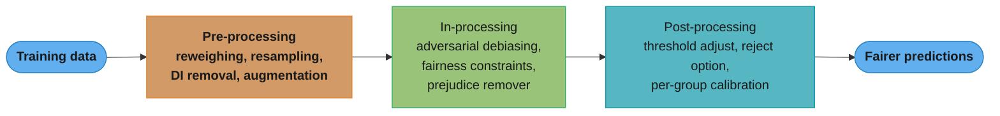
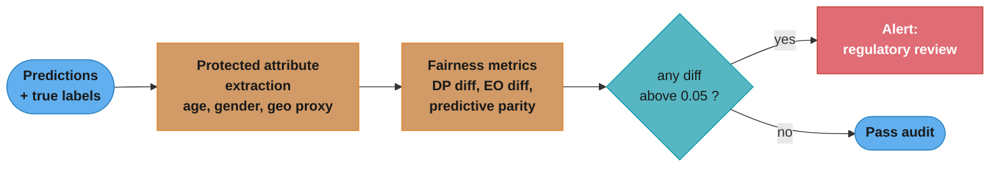
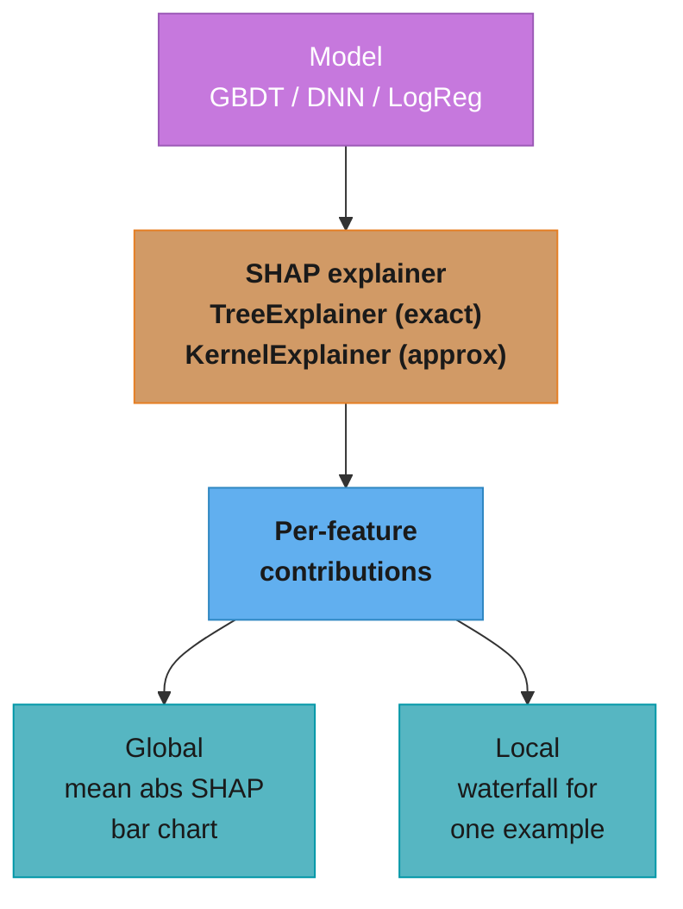
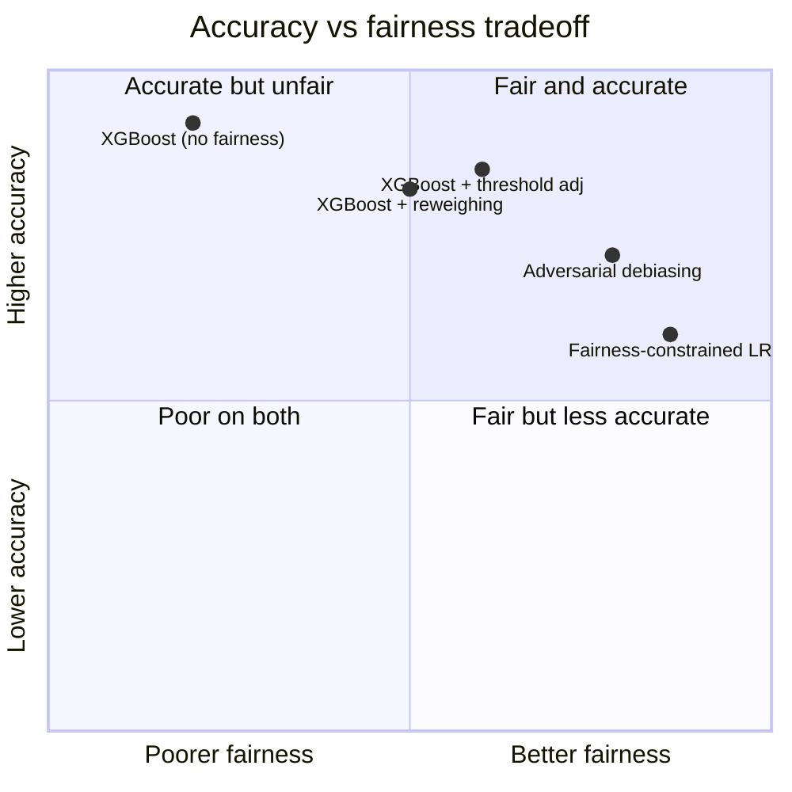

# Responsible AI, Fairness, and Explainability

## 1. Concept Overview

Responsible AI is the discipline of building ML systems that are fair, transparent, accountable, and safe. It covers three interconnected concerns: (1) fairness — ensuring the model does not discriminate against protected groups in ways that are legally prohibited or ethically unacceptable; (2) explainability — ensuring the model's decisions can be understood and audited by humans; and (3) privacy — ensuring individual data is protected and individuals can exercise rights over how their data influences decisions.

This is not a compliance checkbox. Unfair models cause business risk (regulatory fines, reputational damage, class-action litigation), and unexplainable models cannot be debugged, improved, or trusted by the humans who operate them.

---

## 2. Intuition

> A hiring algorithm that rejects 80% of female applicants while accepting 80% of male applicants with identical qualifications is not biased because an engineer intended it — it is biased because the training data reflected historical bias and no fairness constraint corrected for it.

Mental model: think of fairness as a multi-objective optimization problem. You have a primary objective (maximize predictive accuracy) and fairness constraints (performance metrics must not differ too much across demographic groups). The optimal unconstrained model is almost never fair — fairness requires explicitly constraining the optimization.

**Key insight:** bias is not just a social issue — it is often also a modeling issue. A model that is biased against a protected group is typically also miscalibrated for that group, which means its probability estimates are wrong and its decisions are suboptimal even from a pure profit-maximization standpoint. Fixing fairness often improves overall model quality.

Why it matters: in credit, employment, housing, and healthcare — all regulated domains in most jurisdictions — disparate impact on protected classes is illegal. GDPR Article 22 gives individuals the right to an explanation for automated decisions that significantly affect them. Ignorance of these requirements is not a defense.

---

## 3. Core Principles

**Fairness is context-dependent.** There are multiple mathematical definitions of fairness that are mutually incompatible — no single model can satisfy all of them simultaneously (Chouldechova's impossibility theorem). The appropriate definition depends on the deployment context, legal framework, and stakeholder agreement.

**Measure disparities before and after every model change.** Fairness is not a one-time audit — it is an ongoing measurement. A model that was fair at deployment can become unfair as the world changes or as training data composition shifts.

**Explainability is a prerequisite for debugging.** A model that cannot be explained cannot be systematically improved. SHAP values and LIME are not just regulatory tools — they are debugging tools that surface unexpected feature dependencies that indicate data leakage, spurious correlations, or incorrect feature engineering.

**Privacy constraints affect training, not just serving.** Differential privacy, federated learning, and data minimization are training-time architectural decisions, not afterthoughts.

**Document everything in the model card.** For any system making automated decisions about people, produce a model card (Mitchell et al., 2019) that documents: intended use, performance metrics by subgroup, known limitations, and recommended thresholds.

---

## 4. Types / Architectures / Strategies

### 4.1 Fairness Metrics

| Metric | Definition | When to use |
|---|---|---|
| Demographic Parity (DP) | P(ŷ=1 \| A=0) = P(ŷ=1 \| A=1) | When base rates are equal across groups; hiring, content recommendation |
| Equalized Odds | P(ŷ=1 \| A=0, y=1) = P(ŷ=1 \| A=1, y=1) AND P(ŷ=1 \| A=0, y=0) = P(ŷ=1 \| A=1, y=0) | When base rates differ; medical screening |
| Equal Opportunity | P(ŷ=1 \| A=0, y=1) = P(ŷ=1 \| A=1, y=1) (TPR only) | When FN harm dominates; loan approval, job matching |
| Predictive Parity | P(y=1 \| ŷ=1, A=0) = P(y=1 \| ŷ=1, A=1) | When calibration across groups is the goal; recidivism, credit |
| Individual Fairness | Similar individuals receive similar predictions | Hard to operationalize; used in fairness-aware ranking |
| Counterfactual Fairness | Prediction unchanged if protected attribute changed | Legal compliance; used in audit tooling |

### 4.2 Bias Mitigation Strategies



Bias mitigation can enter at three points in the lifecycle — the data before training, the loss during training, or the scores after training — and the three stages compose.

| Strategy | How it works | Pros | Cons |
|---|---|---|---|
| Reweighing | Upweight underrepresented group's examples | Simple, model-agnostic | Does not guarantee fairness; base-rate dependent |
| Adversarial debiasing | Adversary tries to predict protected attribute from model output; model trained to fool adversary | Flexible, powerful | Complex training; may hurt accuracy more than needed |
| Threshold adjustment | Set different thresholds per group to equalize TPR or FPR | Simple, post-hoc | May be illegal in some jurisdictions (disparate treatment) |
| Reject option | For borderline predictions, apply additional review | Handles uncertainty | Requires human-in-loop infrastructure |
| Fairness constraints (Lagrangian) | Add fairness as a constraint in the optimization | Explicit guarantee | Hard to tune; constrained optimization complexity |

### 4.3 Explainability Methods

| Method | Scope | Model-agnostic | Output | Use case |
|---|---|---|---|---|
| SHAP (TreeExplainer) | Local + global | Tree-specific but fast | Additive feature attributions | Feature importance audit, per-prediction explanation |
| SHAP (KernelExplainer) | Local | Yes | Additive feature attributions | Any model; slow (sample-based) |
| LIME | Local | Yes | Weighted linear approximation | Explaining single predictions |
| Integrated Gradients | Local | DL only | Attribution per input dimension | Neural network audit |
| DICE (Counterfactual) | Local | Yes | Minimal change to flip prediction | Adverse-action explanation ("what would change your decision?") |
| Partial Dependence Plot (PDP) | Global | Yes | Marginal effect of one feature | Feature relationship visualization |
| Monotonic Constraints | Global | Tree models | Enforced monotone relationships | Regulatory compliance in credit |

---

## 5. Architecture Diagrams

### Fairness Audit Pipeline



### SHAP Value Explanation Stack



---

## 6. How It Works — Detailed Mechanics

### 6.1 Measuring Fairness Metrics

```python
import numpy as np
from dataclasses import dataclass

@dataclass
class FairnessReport:
    demographic_parity_diff: float
    equalized_odds_diff: float     # max of TPR diff and FPR diff
    equal_opportunity_diff: float  # TPR diff only
    predictive_parity_diff: float

def compute_fairness_metrics(
    y_true: np.ndarray,
    y_pred: np.ndarray,  # binary predictions
    y_prob: np.ndarray,  # predicted probabilities
    group: np.ndarray,   # binary protected attribute (0 = majority, 1 = minority)
) -> FairnessReport:
    """
    Compute standard group fairness metrics. Industry threshold for flag:
    abs(metric) > 0.05 for high-stakes decisions.
    """
    def rates(mask: np.ndarray) -> dict[str, float]:
        yt, yp = y_true[mask], y_pred[mask]
        tp = int(((yp == 1) & (yt == 1)).sum())
        fp = int(((yp == 1) & (yt == 0)).sum())
        fn = int(((yp == 0) & (yt == 1)).sum())
        tn = int(((yp == 0) & (yt == 0)).sum())
        tpr = tp / (tp + fn + 1e-9)
        fpr = fp / (fp + tn + 1e-9)
        ppv = tp / (tp + fp + 1e-9)       # precision = predictive parity
        sel = (yp == 1).mean()             # selection rate = demographic parity
        return {"tpr": tpr, "fpr": fpr, "ppv": ppv, "selection_rate": sel}

    r0 = rates(group == 0)
    r1 = rates(group == 1)

    return FairnessReport(
        demographic_parity_diff=r1["selection_rate"] - r0["selection_rate"],
        equalized_odds_diff=max(
            abs(r1["tpr"] - r0["tpr"]),
            abs(r1["fpr"] - r0["fpr"]),
        ),
        equal_opportunity_diff=r1["tpr"] - r0["tpr"],
        predictive_parity_diff=r1["ppv"] - r0["ppv"],
    )
```

### 6.2 Broken Pattern — Disparate Impact from Proxy Features

```python
# WRONG: including zip_code as a feature in a credit model
# Zip code is a proxy for race/ethnicity in the US due to residential segregation.
# Even without including "race" explicitly, the model learns to discriminate.

features_with_proxy = ["income", "debt_to_income", "zip_code",   # <-- proxy
                       "employment_years", "credit_score"]
model.fit(X_train[features_with_proxy], y_train)

# Disparate impact check:
# Selection rate white applicants: 0.72
# Selection rate Black applicants: 0.38
# Disparity ratio: 0.38/0.72 = 0.53  --> violates 4/5ths rule (< 0.80 = disparate impact)
```

```python
# CORRECT: remove proxy features; audit residual disparity; apply reweighing if needed
import pandas as pd

def remove_proxies(
    df: pd.DataFrame,
    proxy_cols: list[str],
) -> pd.DataFrame:
    """Remove direct proxy features for protected attributes."""
    return df.drop(columns=proxy_cols, errors="ignore")

def compute_reweighing(
    df: pd.DataFrame,
    protected_col: str,
    label_col: str,
) -> np.ndarray:
    """
    Reweighing (Kamiran & Calders, 2012): assign sample weights such that
    each (protected_group, label) combination is weighted to match
    the expected distribution under independence of group and label.
    """
    n = len(df)
    weights = np.ones(n)
    for group_val in df[protected_col].unique():
        for label_val in df[label_col].unique():
            mask = (df[protected_col] == group_val) & (df[label_col] == label_val)
            n_group_label = mask.sum()
            n_group = (df[protected_col] == group_val).sum()
            n_label = (df[label_col] == label_val).sum()
            if n_group_label > 0:
                expected_w = (n_group / n) * (n_label / n) / (n_group_label / n)
                weights[mask] = expected_w
    return weights

# Use reweighing sample_weight in model.fit():
sample_weights = compute_reweighing(df_train, protected_col="race_proxy", label_col="default")
model.fit(X_train_clean, y_train, sample_weight=sample_weights)
```

### 6.3 SHAP for Feature Attribution and Audit

```python
import shap
import lightgbm as lgb
import numpy as np
import pandas as pd

def explain_model(
    model: lgb.LGBMClassifier,
    X_explain: pd.DataFrame,
    feature_names: list[str],
    n_samples: int = 100,
) -> dict[str, float]:
    """
    Compute global mean |SHAP| values for feature importance audit.
    TreeExplainer is exact (not sampling-based) for GBDT models — O(TL) per prediction
    where T = number of trees, L = max leaves.
    """
    explainer = shap.TreeExplainer(model)
    shap_values = explainer.shap_values(X_explain[:n_samples])

    # For binary: shap_values is shape (n_samples, n_features)
    mean_abs_shap = pd.Series(
        np.abs(shap_values).mean(axis=0),
        index=feature_names,
    ).sort_values(ascending=False)

    return mean_abs_shap.to_dict()

def explain_single_prediction(
    model: lgb.LGBMClassifier,
    X_instance: pd.DataFrame,
    feature_names: list[str],
) -> dict[str, float]:
    """Per-instance SHAP values for adverse-action explanation."""
    explainer = shap.TreeExplainer(model)
    shap_vals = explainer.shap_values(X_instance)
    return dict(zip(feature_names, shap_vals[0]))
    # Top 4 negative SHAP values = the 4 adverse factors for adverse-action notice
```

### 6.4 Counterfactual Explanation for Adverse-Action

```python
import dice_ml
from dice_ml import Dice

def generate_adverse_action_explanation(
    model,
    X_instance: pd.DataFrame,
    continuous_features: list[str],
    outcome_name: str = "default",
    n_counterfactuals: int = 3,
) -> pd.DataFrame:
    """
    DiCE: Diverse Counterfactual Explanations.
    Returns the minimal feature changes needed to flip the prediction.
    Used for: "If you increased your income to $X and reduced your
    debt-to-income ratio to Y, your application would be approved."
    """
    data = dice_ml.Data(
        dataframe=X_instance,
        continuous_features=continuous_features,
        outcome_name=outcome_name,
    )
    model_wrapper = dice_ml.Model(model=model, backend="sklearn")
    exp = Dice(data, model_wrapper, method="random")
    counterfactuals = exp.generate_counterfactuals(
        query_instances=X_instance,
        total_CFs=n_counterfactuals,
        desired_class="opposite",
    )
    return counterfactuals.cf_examples_list[0].final_cfs_df
```

---

## 7. Real-World Examples

**COMPAS recidivism algorithm (ProPublica, 2016):** Northpointe's COMPAS algorithm predicted recidivism risk for criminal defendants. ProPublica analysis showed Black defendants were flagged as high-risk at nearly twice the rate of white defendants (45% vs 24% false positive rate). Northpointe responded that the tool was calibrated (predictive parity held). Both were correct — equalized odds and predictive parity are mathematically incompatible when base rates differ. The case established that any high-stakes automated decision must explicitly document which fairness metric is being optimized and why.

**Amazon hiring tool (2018):** Amazon built an ML model to screen resumes and trained it on 10 years of hiring decisions. Since most historically hired engineers were male, the model penalized resumes that included "women's" (e.g., "women's chess club captain"). The model learned to penalize female-coded terms as a proxy for gender. Amazon shut it down before deployment. Root cause: training data reflected historical discrimination; no fairness audit was conducted before deployment.

**Apple Card (Goldman Sachs, 2019):** Multiple reports that male applicants received 20x higher credit limits than female applicants with identical financial profiles. New York DFS investigated. Root cause was never officially disclosed, but algorithmic bias on proxy features (joint account ownership, which is gender-correlated) is the likely mechanism. The lesson: regulators will investigate large-scale consumer credit algorithms; disparate impact without business justification is actionable.

**Google Photos (2015):** Image classifier labeled images of Black people as "gorillas." Root cause: the training dataset was majority white; the model had very few examples of dark-skinned people and learned a poor representation. Explainability via attention maps would have revealed the model was using low-level texture features rather than facial features. Google's temporary fix: remove "gorilla" from the label taxonomy. Long-term fix: diversify training data.

**Stripe (fraud):** Deliberately publishes a bias audit as part of their annual transparency report. Fraud models are evaluated for false positive rate disparity across merchant country, business type, and transaction size. Internal threshold: FPR disparity ratio > 1.5x triggers model review. This is responsible AI as competitive advantage — merchants trust the platform because it demonstrates accountability.

---

## 8. Tradeoffs

### Accuracy vs Fairness



There is a fundamental accuracy-fairness tradeoff: any constraint on model behavior that wasn't present in unconstrained optimization must reduce or maintain (never improve) accuracy on the unconstrained metric. The size of the tradeoff depends on the metric pair chosen: demographic parity typically costs more accuracy than equalized odds when base rates differ.

| Fairness approach | Accuracy cost | Legal defensibility | Operationalization |
|---|---|---|---|
| No fairness intervention | None | Low (if disparate impact) | Trivial |
| Remove proxy features | Low | Medium | Easy |
| Reweighing | Low-Medium | Medium | Easy |
| Threshold adjustment | None (same model) | Context-dependent | Easy |
| Adversarial debiasing | Medium-High | High | Complex |
| Fairness-constrained opt. | Medium | High | Complex |

---

## 9. When to Use / When NOT to Use

**Always apply fairness analysis when:**
- The model makes decisions about people (hiring, credit, housing, healthcare, criminal justice, benefits).
- The model operates in a regulated domain (ECOA, Fair Housing Act, HIPAA, GDPR, EU AI Act).
- Predictions or scores are used to allocate resources, opportunities, or restrictions differentially.

**Fairness analysis less critical when:**
- The model predicts physical phenomena (weather, sensor readings) with no human decision in the loop.
- The model is used for internal business optimization with no direct impact on individuals.
- All affected individuals belong to the same demographic group (no protected group heterogeneity).

**Always provide local explanations when:**
- The model makes a consequential decision that can be appealed (credit denial, employment rejection).
- GDPR Article 22 applies (significant automated decisions about EU residents).
- The model will be used by non-technical operators who need to understand individual predictions.

---

## 10. Common Pitfalls

**Removing the protected attribute is not sufficient.** Fairness-through-unawareness (removing race, gender from features) rarely produces fair models because correlated proxy features (zip code → race, name → gender, employment gap → gender) remain. The model rediscovers the protected attribute through proxies. Fix: measure fairness metrics after training regardless of whether protected attributes were included.

**Fairness metrics conflict — you must choose.** Demographic parity, equalized odds, and predictive parity cannot all hold simultaneously when base rates differ (Chouldechova, 2017). Choosing one metric to optimize means accepting violations of others. This is not a technical problem with a technical solution — it is a policy decision that must be made by humans with legal and ethical authority, not optimized away by engineers.

**SHAP is slow for neural networks.** TreeSHAP is exact and fast (O(TL) per sample). KernelSHAP is model-agnostic but approximation-based and O(n²) in the number of features. For a ResNet-50 with 25 million parameters, KernelSHAP on a single image takes minutes. Use Integrated Gradients or GradCAM for neural network explanations, and reserve SHAP for GBDT/linear models.

**Confusing explainability with causality.** SHAP values are attributions — they explain which features influenced the model's output for a specific example. They do not tell you whether changing that feature would actually change the outcome (the causal question). A high SHAP value for "zip code" means the model used zip code to make its prediction; it does not mean moving to a different zip code would change the decision. Counterfactual explanations (DiCE) are closer to causal but still model-dependent, not reality-dependent.

**Fairness is not verified at deployment, only at training.** A model that passed fairness tests on the training/test set may become unfair as the user population shifts. If the composition of applicants changes (e.g., more minority applicants after a marketing campaign), disparate impact may emerge or worsen. Fairness metrics must be part of the production monitoring dashboard, not just the pre-deployment checklist.

---

## 11. Technologies & Tools

| Tool | Category | What it does | Notes |
|---|---|---|---|
| SHAP | Explainability | TreeSHAP (exact), KernelSHAP (approx), force plots, summary plots | Industry standard for GBDT; slow for DL |
| LIME | Explainability | Local linear approximation per prediction | Faster than KernelSHAP; less theoretically grounded |
| DiCE | Counterfactual | Diverse counterfactual examples | Adverse-action explanations |
| Fairlearn | Fairness | Fairness metrics, reductions approach (Lagrangian constraints), threshold optimization | Microsoft OSS; integrates with sklearn |
| AIF360 (IBM) | Fairness | 10+ bias metrics, pre/in/post-processing mitigations | Research-grade; comprehensive |
| What-If Tool (Google) | Interactive audit | Visual exploration of model fairness, counterfactuals | Browser-based, TFX integration |
| Alibi | Explainability | Counterfactuals, anchors, integrated gradients | Model-agnostic, good DL support |
| Responsible AI Toolbox (MSFT) | Integrated | Fairness + explainability + error analysis in one dashboard | Azure-focused but open source |

---

## 12. Interview Questions with Answers

**What is disparate impact and how do you measure it?**
Disparate impact occurs when a neutral policy disproportionately affects members of a protected group. The 4/5ths rule (Uniform Guidelines on Employee Selection Procedures, 1978) operationalizes this: if the selection rate for the disadvantaged group is less than 80% of the selection rate for the advantaged group, disparate impact is indicated. Measure it as the selection rate ratio (minority rate / majority rate) or as the demographic parity difference (minority rate - majority rate). A ratio < 0.8 or a difference > 0.1 warrants investigation and business justification.

**Explain the impossibility theorem for fairness metrics.**
Chouldechova (2017) and Kleinberg et al. (2016) proved that when base rates differ between groups, demographic parity, equalized odds, and predictive parity cannot all hold simultaneously (except in degenerate cases). Specifically: if a classifier satisfies predictive parity (PPV is equal across groups) and the groups have different base rates, then equalized odds must be violated. This means there is no algorithmic solution — the choice of which fairness metric to prioritize is a value judgment that must be made by humans with legal and ethical authority.

**What is the difference between demographic parity and equalized odds?**
Demographic parity requires that the proportion of positive predictions is equal across groups: P(ŷ=1|A=0) = P(ŷ=1|A=1). It is satisfied by a model that predicts positive for everyone equally often, regardless of their actual qualifications. Equalized odds requires that both the true positive rate and false positive rate are equal across groups: P(ŷ=1|y=1,A=0) = P(ŷ=1|y=1,A=1) and P(ŷ=1|y=0,A=0) = P(ŷ=1|y=0,A=1). Equalized odds is generally preferred in high-stakes settings because it accounts for the underlying distribution of the outcome, not just the prediction. For hiring with equal candidate quality, demographic parity is the right metric; for medical screening where prevalence differs, equalized odds is more appropriate.

**How does SHAP work and why is it preferred over feature importance?**
SHAP (SHapley Additive exPlanations) computes the contribution of each feature to an individual prediction using Shapley values from cooperative game theory. The Shapley value for feature i is the average marginal contribution of feature i across all possible subsets of features. Properties: efficiency (SHAP values sum to the prediction minus the baseline), symmetry (equal contribution features get equal SHAP), and consistency (a feature that contributes more always gets a higher value). Feature importance (gain or split count) lacks these guarantees — a feature used frequently in shallow splits may get a high gain score but contribute little net effect if it splits in opposite directions equally. SHAP is more reliable for model audits because it is locally faithful (explains individual predictions exactly) and globally consistent (mean absolute SHAP correctly ranks global importance).

**A credit model is denied regulatory approval because adverse-action notices are insufficient. What do you do?**
Implement SHAP-based adverse-action notices. For each declined application, extract the per-feature SHAP values, identify the top 4 features with the most negative contributions (the factors that reduced the approval probability the most), and generate plain-language reasons: "Your application was declined primarily due to: (1) high debt-to-income ratio, (2) recent delinquency, (3) short credit history, (4) multiple recent inquiries." The reasons must be based on factors specific to the applicant's application, not generic disclaimers. Test the notice generation on held-out cases and have legal review the language against ECOA and FCRA requirements before deployment.

**What are proxy features and how do you detect them?**
Proxy features are features that are not protected attributes themselves but correlate with protected attributes, allowing the model to use them to discriminate. Common proxies: zip code → race (due to residential segregation), name → gender/ethnicity (name etymology), employment gap → gender (caregiving leave), "certain schools attended" → socioeconomic status. Detection: (1) compute point-biserial correlation between each feature and the protected attribute in the training data; (2) compute SHAP values for the protected attribute (if included) and for candidate proxies; (3) run a "feature audit": train a classifier to predict the protected attribute from model features — high accuracy indicates proxy features exist. Remove or adjust any feature where correlation with the protected attribute exceeds a documented threshold (commonly r > 0.3).

**What is reweighing and when should you use it?**
Reweighing (Kamiran and Calders, 2012) is a pre-processing fairness intervention that assigns sample weights to training examples such that the (protected_group, label) combinations have the expected weight under independence — i.e., as if group membership and label were statistically independent. Compute the weight for each cell: w(group, label) = P(group) × P(label) / P(group, label). Apply these weights in the model's `sample_weight` parameter. Reweighing is appropriate when demographic parity is the target metric, the data has historically biased labels, and in-processing constraints are infeasible. It is not appropriate when the goal is equalized odds (which requires conditioning on the true label) or when base-rate differences are the legitimate explanation for outcome differences.

**Explain the difference between interpretability and explainability.**
Interpretability means the model is intrinsically understandable — you can read the model directly. Examples: linear regression (inspect coefficients), decision tree (follow the decision path), scorecard (add up points). Explainability means applying a post-hoc explanation method to a complex model that is not intrinsically interpretable. Examples: SHAP applied to a LightGBM, LIME applied to a neural network, attention visualization applied to a transformer. Interpretable models are preferred when: regulatory requirements explicitly require the model to be auditable, model debugging is critical and post-hoc methods introduce approximation errors, and the model complexity is not needed for accuracy. Explainability methods are preferred when: a complex model is necessary for accuracy, and the explanation is for user-facing communication or audit (not for debugging the model itself).

**How does GDPR Article 22 affect ML systems?**
GDPR Article 22 gives EU residents the right not to be subject to decisions based solely on automated processing that produce significant legal or similarly significant effects. When this right is invoked, the data controller must: (a) provide meaningful information about the logic involved; (b) give the individual the right to obtain human review; (c) express their point of view and contest the decision. In practice: any ML model making decisions on credit, employment, housing, or insurance for EU residents must have an explanation pipeline (SHAP/DiCE for adverse action), a human review escalation path, and a documented process for handling Article 22 requests. Systems that lack these are non-compliant and risk fines up to 4% of global annual turnover or €20M.

**What is differential privacy and when should you use it in ML?**
Differential privacy (DP) is a mathematical framework that bounds the information any single individual's data contributes to the model. A mechanism M satisfies (ε, δ)-DP if for any two datasets D and D' differing in one example, P(M(D) ∈ S) ≤ e^ε × P(M(D') ∈ S) + δ for all S. In practice for ML: DP-SGD clips gradient updates per example and adds calibrated Gaussian noise during training, bounding each individual's contribution. Use DP when: (a) the training data is sensitive (medical records, financial transactions); (b) the model will be publicly released or used in a setting where model inversion attacks are plausible; (c) regulatory requirements mandate it (HIPAA, GDPR). Trade-off: DP degrades model accuracy proportionally to the privacy budget ε (smaller ε = more privacy = more noise = lower accuracy). For large datasets (>1M examples), the accuracy cost is small; for small datasets, DP may make the model unusable.

**How do you handle a situation where your fairness audit finds that a previously deployed model has disparate impact?**
Step 1: assess the magnitude. Disparate impact ratio < 0.8 under the 4/5ths rule requires business justification or correction. Measure the affected population size and estimate harm (how many minority applicants were incorrectly declined or received lower scores). Step 2: legal review. In regulated domains, notify legal counsel immediately. The business may have retroactive liability. Step 3: short-term mitigation — apply post-hoc threshold adjustment or reweighing on the current model to reduce disparity while the longer-term fix is built. Step 4: root cause analysis — identify which features are proxies; determine whether the training data reflects historical discrimination. Step 5: retrain with fairness constraints or bias mitigation and re-audit before redeployment. Step 6: document the incident in the model card and implement ongoing fairness monitoring to prevent recurrence.

**What is individual fairness and why is it hard to operationalize?**
Individual fairness (Dwork et al., 2012) states that similar individuals should receive similar predictions: if d(x_1, x_2) is small, then |f(x_1) - f(x_2)| should also be small, where d is a task-specific similarity metric. It is hard to operationalize because: (a) the similarity metric d is domain-specific and must be defined before training — there is no canonical way to define "similar" across all attributes; (b) enforcing individual fairness requires the metric d to be agreed upon by all stakeholders (including those whose decisions are affected); (c) optimizing for individual fairness during training is computationally expensive (requires pairwise comparisons). In practice, individual fairness is used in fairness-aware ranking (recommender systems, search) where a task-specific metric based on relevance can be defined, and is rarely used for tabular classification tasks where group fairness metrics are preferred.

**How do you build a model card and what should it contain?**
A model card (Mitchell et al., 2019) is a structured document accompanying an ML model that documents: (1) model details — architecture, training data description, date, version; (2) intended use — primary intended uses, out-of-scope uses, and the specific population/context the model was designed for; (3) performance metrics — overall metrics (AUC, F1, ECE) and disaggregated metrics by subgroup (age band, gender, geography); (4) evaluation data — description of evaluation dataset and how it was collected; (5) ethical considerations — known biases, fairness audit results, sensitive use cases; (6) caveats and recommendations — known limitations, recommended thresholds, human oversight recommendations. Model cards are now required for models deployed on Hugging Face and are best practice (and sometimes legally required) for any model making consequential decisions about people.

**How do you detect and mitigate model amplification of bias over time?**
Model amplification occurs when a model's decisions affect the training data for future models, reinforcing and amplifying initial biases. Example: a job recommendation model that shows fewer software engineering jobs to women → women apply to fewer software engineering roles → fewer women in the training data for the next model version → model further reduces software engineering recommendations to women. Detection: track the rate of positive recommendations/decisions per demographic group over time (monthly cohort analysis). If the rate diverges over time (widening gap), amplification is occurring. Mitigation: (1) add counterfactual data (exploration budget — show recommendations outside the model's predictions for a fraction of users and collect feedback); (2) reweight training data to correct for feedback loop bias; (3) add an explicit fairness constraint that prevents the model from moving group rates further from parity than the prior model version.

**What is the 4/5ths rule and what are its limitations?**
The 4/5ths rule (UGESP, 1978) states that disparate impact is indicated when the selection rate for a protected group is less than 80% of the selection rate for the highest-selected group. It is the de facto legal standard for employment selection in the US. Limitations: (1) the 80% threshold is arbitrary — it was chosen for practicality, not statistical rigor; (2) it depends on the choice of which groups to compare and what counts as "selection"; (3) it is purely descriptive (says disparity exists) but not explanatory (doesn't say whether the disparity is due to legitimate predictors or bias); (4) it can be satisfied while still having large absolute disparity if the base selection rate is very low; (5) it was designed for employment, and courts have applied it inconsistently to algorithmic systems. Use the 4/5ths rule as a trigger for investigation, not as a complete fairness assessment.

---

## 13. Best Practices

**Conduct a pre-training fairness risk assessment.** Before building the model, document: (a) what protected attributes are relevant; (b) what proxy features might exist in the data; (c) what legal framework applies; (d) which fairness metric to prioritize and why. This prevents discovering fairness violations after deployment.

**Audit on a representative holdout, not on the training set.** Fairness metrics measured on training data are unreliable because the model has already memorized the training distribution. Use a temporally held-out test set that represents the deployment distribution.

**Store SHAP values for a random sample of production predictions.** This enables retroactive explanation for edge cases, regulatory audits, or user complaints. Log 1% of predictions with their SHAP breakdowns; store for at least 2 years in regulated domains.

**Include fairness metrics in the CI/CD pipeline.** A model should not be promoted to production if demographic parity difference > 0.05 or equalized odds difference > 0.05, the same way a model should not be promoted if AUC drops below the threshold. Make fairness a gate, not an afterthought.

**Make explanation language accessible.** SHAP values are in log-odds or probability units. Converting to plain language ("Your application was declined primarily due to your debt-to-income ratio of 45%, which exceeds our guideline of 36%") requires domain knowledge. Build a structured explanation template that maps SHAP features to plain-language reasons, validated by legal and UX teams.

---

## 14. Case Study

This cross-cutting file is referenced by the following case studies:

**[design_credit_risk_scoring.md](../design_credit_risk_scoring.md):** Credit models in the US are governed by ECOA and FCRA. Adverse-action notices (top 4 reasons for denial, in plain language) are a legal requirement for any declined application. Demographic parity and equalized odds are computed quarterly and reported to the risk committee. The model uses monotonic constraints on income and debt-to-income ratio to prevent spurious inversions that would be legally indefensible.

**[design_churn_prediction.md](../design_churn_prediction.md):** Churn interventions (retention offers) are allocated by the model score. If the model systematically underscores certain demographic groups, those groups receive fewer offers — a form of unintentional disparate treatment. Fairness audit checks that offer rate by geography does not violate the 4/5ths rule relative to the highest-served region.

**[design_marketplace_matching.md](../design_marketplace_matching.md):** Driver dispatch fairness: the matching model must not systematically assign shorter, less profitable trips to specific demographic groups of drivers. Individual fairness metric (trip value variance across driver demographics) is computed weekly. SHAP analysis is used to debug dispatch decisions and ensure that driver demographic attributes are not implicit in model features (e.g., driver home location as a proxy for demographic).

**[design_eta_prediction.md](../design_eta_prediction.md):** ETA errors are not uniformly distributed. Neighborhoods with lower road-sensor density have less training data, causing higher mean absolute error (MAE) for those areas. The model card documents this geographic disparity and recommends that the ETA model be supplemented with a wider uncertainty band for data-sparse regions.
