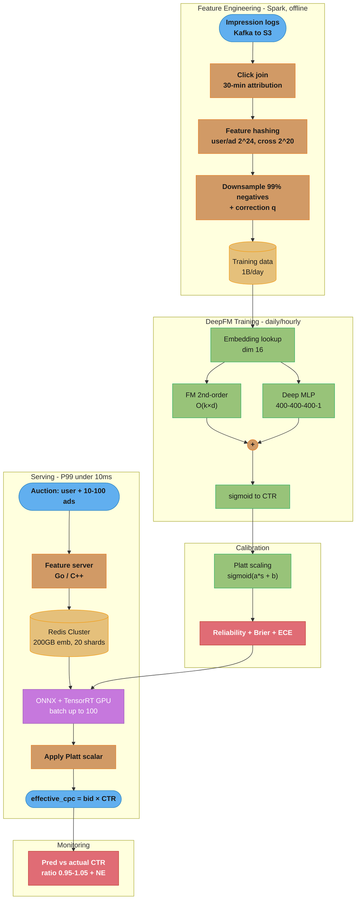
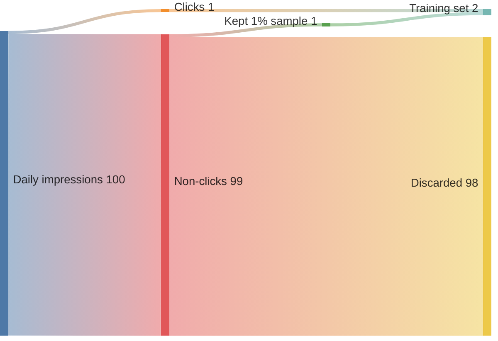
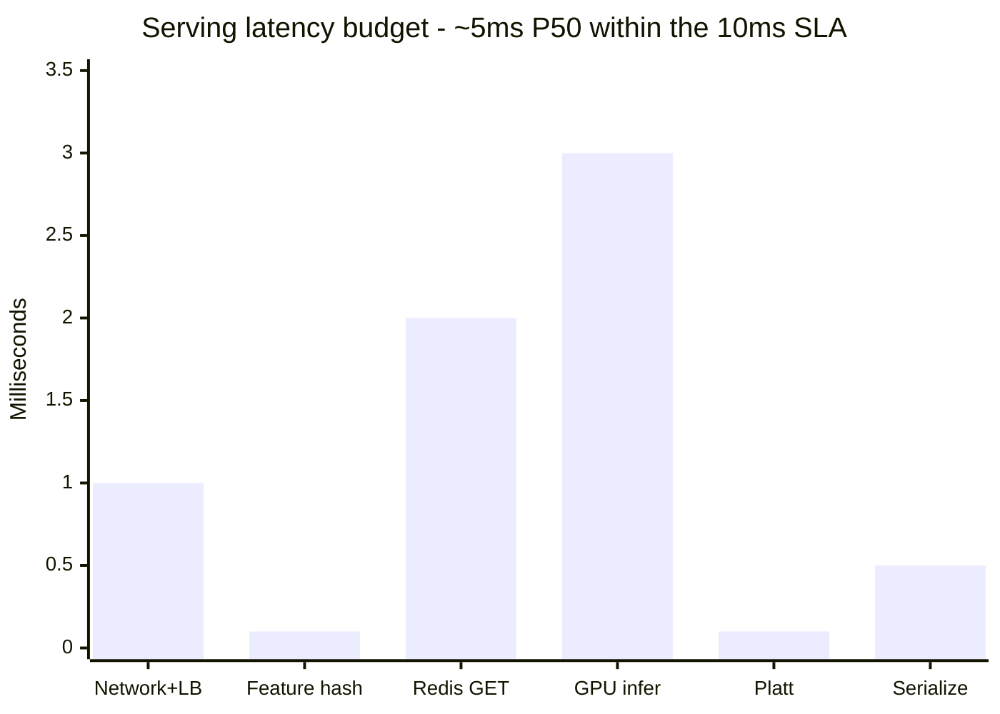

# Design an Ads Click-Through Rate (CTR) Prediction System

## Problem Statement

Design a CTR prediction system for online advertising. For every ad auction (1 million per second), predict P(click | user, ad, context) within 10ms. Training data consists of 1 billion impressions per day with binary click labels. The model must be well-calibrated — predicted CTR should closely match actual observed CTR at the same predicted score level (a predicted CTR of 5% should correspond to a 5% actual click rate in aggregate). Miscalibration directly distorts auction mechanics: advertiser bids are multiplied by predicted CTR to compute effective CPC, so a 2x calibration error doubles or halves the auction clearing price.

Constraints:
- 1M QPS, <10ms P99 end-to-end latency
- 1B training examples per day (sparse: 0.1-2% click rate)
- Billions of unique user/ad/publisher IDs — sparse ID features dominate
- Model must be calibrated (Brier score < 0.08, reliability diagram near diagonal)
- Daily retraining minimum; hourly preferred (fresh data = higher accuracy on new campaigns)
- Model size: embedding tables can be hundreds of GB — too large for GPU serving

---

## Architecture Overview



Offline Spark builds hashed, negatively-downsampled training data; DeepFM sums a Factorization-Machine interaction term and a deep MLP into a sigmoid CTR; Platt scaling calibrates it, and the serving path scores every auction from Redis-resident embeddings in under 10ms.



At ~1% CTR, 99% of examples are negatives; subsampling keeps just 1-in-100 of them, shrinking 865TB/day of raw logs to ~8.7TB — and a q-correction restores the calibration that the skew would otherwise destroy.



Redis embedding fetch (2ms) and GPU inference (3ms) dominate while feature hashing and Platt calibration are sub-millisecond, summing to ~5ms P50 and ~8ms P99 under the 10ms budget.

---

## Key Design Decisions

**Feature hashing over explicit vocabulary**: With billions of unique user IDs and ad IDs, maintaining a lookup vocabulary table is costly (memory, update latency). Feature hashing maps any ID to a fixed-size bucket via MurmurHash(id) % bucket_count. Hash collisions exist but are rare at 2^24 buckets. No vocabulary management needed — new users and ads are handled automatically on day 1.

**DeepFM over Wide & Deep**: Both are standard architectures for CTR. DeepFM replaces the "wide" linear component of Wide & Deep with a Factorization Machine (FM) component that captures all pairwise embedding interactions. The FM is parameter-efficient: it does not learn a separate weight per pair (which would be O(d^2) parameters) but instead uses the dot product of embedding vectors, sharing parameters across pairs. This is crucial when there are 100+ feature fields.

**Adagrad for sparse features**: Sparse ID features (user_id, ad_id) get gradient updates only when they appear in a batch. SGD with uniform LR over-adjusts frequent features (appearing in every batch) and under-adjusts rare features. Adagrad maintains per-parameter accumulated squared gradient, effectively giving rare features a higher learning rate — exactly the right behavior. The dense MLP layers use Adam (adaptive but without sparsity concern).

**Negative downsampling with calibration correction**: At 1% CTR, 99% of training examples are negatives. Training on all negatives is wasteful (100B non-click examples/day). Subsample negatives at rate q = 1% (keep 1 in 100 non-clicks). This changes the training distribution. To restore calibration, apply correction at inference: calibrated_ctr = raw_ctr / (raw_ctr + (1 - raw_ctr) / q). Platt scaling absorbs this correction automatically if calibrated on the original (unsubsampled) distribution.

**Embedding table in Redis, not GPU**: At embedding dimension 16 and 2^24 buckets per feature, each feature table is 16 * 16M * 4 bytes = 1GB. With 10 feature fields, total is 10GB per table set. Multiple versions during A/B testing mean 20-40GB of embedding tables — far exceeding GPU memory (80GB A100 is consumed by the model and batch computation, not a 40GB static table). Redis Cluster with 20 nodes serves embedding lookups in 0.5-1ms using batch GET commands.

**Per-advertiser calibration**: Global calibration may hide per-advertiser miscalibration. A new advertiser with no historical data gets the global calibration factor, which may be wrong for their ad creative. Monitor calibration ratio (predicted/actual) per advertiser daily; apply a per-advertiser scalar correction factor if ratio deviates >10%.

---

## Implementation

### Feature Hashing

```python
import hashlib
import struct
import numpy as np
from typing import Any


def murmurhash3_32(key: str, seed: int = 42) -> int:
    """32-bit MurmurHash3 for feature hashing."""
    # Python's built-in hash is not stable across processes; use hashlib
    h = hashlib.md5(f"{seed}:{key}".encode()).digest()
    return struct.unpack("<I", h[:4])[0]


def feature_hash(value: Any, num_buckets: int = 2**24) -> int:
    """Hash any feature value to a bucket index."""
    key = str(value)
    return murmurhash3_32(key) % num_buckets


def hash_cross_feature(
    feature_a: Any,
    feature_b: Any,
    num_buckets: int = 2**20,
) -> int:
    """Hash the cross product of two features."""
    combined = f"{feature_a}|{feature_b}"
    return feature_hash(combined, num_buckets)


class FeatureHasher:
    """
    Convert raw auction features to hashed sparse indices.
    Mirrors the training-time feature engineering exactly to prevent skew.
    """

    FEATURE_CONFIGS = {
        "user_id":          {"buckets": 2**24, "field_id": 0},
        "ad_id":            {"buckets": 2**24, "field_id": 1},
        "publisher_id":     {"buckets": 2**20, "field_id": 2},
        "user_age_bucket":  {"buckets": 10,    "field_id": 3},   # 0-9
        "ad_category":      {"buckets": 500,   "field_id": 4},
        "hour_of_day":      {"buckets": 24,    "field_id": 5},
        "device_type":      {"buckets": 4,     "field_id": 6},   # mobile/tablet/desktop/other
    }

    CROSS_FEATURES = [
        ("user_age_bucket", "ad_category", 2**20, 10),
        ("device_type", "ad_category",     2**18, 11),
    ]

    def hash_example(self, raw_features: dict[str, Any]) -> dict[str, list[int]]:
        """Return field_ids and hashed indices for one example."""
        field_ids = []
        indices = []

        for feature_name, config in self.FEATURE_CONFIGS.items():
            value = raw_features.get(feature_name, "MISSING")
            hashed = feature_hash(value, config["buckets"])
            field_ids.append(config["field_id"])
            indices.append(hashed)

        # Cross features
        for feat_a, feat_b, buckets, field_id in self.CROSS_FEATURES:
            hashed = hash_cross_feature(
                raw_features.get(feat_a, "MISSING"),
                raw_features.get(feat_b, "MISSING"),
                buckets,
            )
            field_ids.append(field_id)
            indices.append(hashed)

        return {"field_ids": field_ids, "indices": indices}
```

### DeepFM Architecture (PyTorch)

```python
import torch
import torch.nn as nn
import torch.nn.functional as F
from torch.utils.data import Dataset, DataLoader


class FMLayer(nn.Module):
    """Factorization Machine: 2nd-order feature interaction in O(k*d) time."""

    def forward(self, embeddings: torch.Tensor) -> torch.Tensor:
        """
        embeddings: (batch, num_fields, embed_dim)
        Returns FM output: (batch, 1)

        Formula: 0.5 * (||sum(v_i)||^2 - sum(||v_i||^2))
        """
        # Sum of embeddings, then square
        sum_of_embeds = embeddings.sum(dim=1)               # (B, D)
        square_of_sum = sum_of_embeds.pow(2)                # (B, D)

        # Square of each embedding, then sum
        sum_of_squares = embeddings.pow(2).sum(dim=1)       # (B, D)

        # FM interaction term
        fm_term = 0.5 * (square_of_sum - sum_of_squares)   # (B, D)
        return fm_term.sum(dim=1, keepdim=True)             # (B, 1)


class DeepFM(nn.Module):
    """
    DeepFM for CTR prediction.

    Architecture:
    - Sparse fields: embedding lookup → (num_fields, embed_dim)
    - FM component: 2nd-order interactions of embeddings → scalar
    - Deep component: flatten embeddings + dense → MLP → scalar
    - Output: sigmoid(fm_out + deep_out)
    """

    def __init__(
        self,
        field_dims: list[int],   # number of buckets per field
        embed_dim: int = 16,
        mlp_dims: list[int] = [400, 400, 400],
        num_dense_features: int = 8,
        dropout: float = 0.2,
    ) -> None:
        super().__init__()
        self.num_fields = len(field_dims)
        self.embed_dim = embed_dim

        # One embedding table per field (different bucket sizes)
        self.embeddings = nn.ModuleList([
            nn.EmbeddingBag(dim, embed_dim, mode="sum", sparse=True)
            for dim in field_dims
        ])

        self.fm = FMLayer()

        # Deep component: concat(all embeddings, dense) → MLP
        deep_input_dim = self.num_fields * embed_dim + num_dense_features
        layers: list[nn.Module] = []
        for out_dim in mlp_dims:
            layers += [
                nn.Linear(deep_input_dim, out_dim),
                nn.BatchNorm1d(out_dim),
                nn.ReLU(),
                nn.Dropout(dropout),
            ]
            deep_input_dim = out_dim
        layers.append(nn.Linear(deep_input_dim, 1))
        self.deep = nn.Sequential(*layers)

        self._init_weights()

    def _init_weights(self) -> None:
        for emb in self.embeddings:
            nn.init.normal_(emb.weight, std=0.01)
        for module in self.deep.modules():
            if isinstance(module, nn.Linear):
                nn.init.xavier_uniform_(module.weight)
                nn.init.zeros_(module.bias)

    def forward(
        self,
        sparse_indices: list[torch.Tensor],  # list of (B,) per field
        dense_features: torch.Tensor,         # (B, num_dense_features)
    ) -> torch.Tensor:                         # (B,) CTR probabilities
        # Embed each field
        field_embeddings = []
        for i, (emb_layer, indices) in enumerate(zip(self.embeddings, sparse_indices)):
            # EmbeddingBag expects (B, 1) for single-index-per-example
            emb = emb_layer(indices.unsqueeze(1))  # (B, embed_dim)
            field_embeddings.append(emb)

        stacked = torch.stack(field_embeddings, dim=1)  # (B, num_fields, embed_dim)

        # FM term
        fm_out = self.fm(stacked)  # (B, 1)

        # Deep term
        flat = stacked.view(stacked.size(0), -1)           # (B, num_fields * embed_dim)
        deep_input = torch.cat([flat, dense_features], dim=1)
        deep_out = self.deep(deep_input)                    # (B, 1)

        logit = fm_out + deep_out                          # (B, 1)
        return torch.sigmoid(logit).squeeze(1)             # (B,)


def train_deepfm(
    model: DeepFM,
    train_loader: DataLoader,
    val_loader: DataLoader,
    epochs: int = 5,
) -> None:
    """Training loop with separate Adagrad (sparse) and Adam (dense) optimizers."""
    # Sparse embedding parameters benefit from Adagrad
    embedding_params = list(model.embeddings.parameters())
    dense_params = [p for n, p in model.named_parameters()
                    if "embeddings" not in n]

    optimizer = torch.optim.AdamW([
        {"params": embedding_params, "lr": 0.01,  "eps": 1e-6},
        {"params": dense_params,     "lr": 0.001, "eps": 1e-8},
    ])

    # Binary cross-entropy; reduction='none' to apply sample weights
    criterion = nn.BCELoss(reduction="none")

    device = next(model.parameters()).device
    model.train()

    for epoch in range(epochs):
        total_loss = 0.0
        for batch in train_loader:
            sparse = [t.to(device) for t in batch["sparse_indices"]]
            dense = batch["dense"].to(device)
            labels = batch["label"].float().to(device)
            weights = batch.get("weight", torch.ones_like(labels)).to(device)

            optimizer.zero_grad()
            preds = model(sparse, dense)
            loss = (criterion(preds, labels) * weights).mean()
            loss.backward()
            # Clip only dense gradients; sparse gradients are naturally bounded
            torch.nn.utils.clip_grad_norm_(dense_params, 5.0)
            optimizer.step()
            total_loss += loss.item()

        print(f"Epoch {epoch+1}: loss={total_loss/len(train_loader):.5f}")
```

### Calibration with Platt Scaling

```python
import numpy as np
from sklearn.linear_model import LogisticRegression
from sklearn.calibration import calibration_curve
from sklearn.metrics import brier_score_loss
import matplotlib
matplotlib.use("Agg")
import matplotlib.pyplot as plt


class PlattScaler:
    """
    Calibrate model outputs using Platt scaling.
    Fits sigmoid(a * raw_score + b) to minimize log-loss on calibration set.

    Accounts for negative downsampling during training:
    Before calibration, correct for subsampling rate q:
      corrected = raw / (raw + (1 - raw) / q)
    Then apply Platt scaling on corrected scores.
    """

    def __init__(self, negative_subsample_rate: float = 1.0) -> None:
        self.q = negative_subsample_rate  # 1.0 = no subsampling
        self.lr = LogisticRegression(C=1.0, max_iter=1000, solver="lbfgs")
        self.fitted = False

    def _correct_for_subsampling(self, raw_scores: np.ndarray) -> np.ndarray:
        """Correct probability estimates for negative downsampling."""
        if self.q >= 1.0:
            return raw_scores
        # P(click | subsampled) = raw / (raw + (1-raw)/q)
        return raw_scores / (raw_scores + (1 - raw_scores) / self.q)

    def fit(self, raw_scores: np.ndarray, labels: np.ndarray) -> "PlattScaler":
        corrected = self._correct_for_subsampling(raw_scores)
        # Logistic regression on corrected scores as single feature
        self.lr.fit(corrected.reshape(-1, 1), labels)
        self.fitted = True

        calibrated = self.predict(raw_scores)
        brier = brier_score_loss(labels, calibrated)
        print(f"Platt scaling: a={self.lr.coef_[0][0]:.4f}, "
              f"b={self.lr.intercept_[0]:.4f}, Brier={brier:.5f}")
        return self

    def predict(self, raw_scores: np.ndarray) -> np.ndarray:
        if not self.fitted:
            raise RuntimeError("PlattScaler not fitted")
        corrected = self._correct_for_subsampling(raw_scores)
        return self.lr.predict_proba(corrected.reshape(-1, 1))[:, 1]

    def evaluate_calibration(
        self,
        raw_scores: np.ndarray,
        labels: np.ndarray,
        n_bins: int = 20,
    ) -> dict[str, float]:
        calibrated = self.predict(raw_scores)

        # Expected Calibration Error (ECE)
        fraction_of_positives, mean_predicted = calibration_curve(
            labels, calibrated, n_bins=n_bins
        )
        ece = float(np.abs(fraction_of_positives - mean_predicted).mean())

        # Brier score
        brier = float(brier_score_loss(labels, calibrated))

        # Normalized Entropy (NE) vs base logistic regression
        base_ctr = labels.mean()
        base_logloss = -base_ctr * np.log(base_ctr) - (1-base_ctr) * np.log(1-base_ctr)
        model_logloss = float(-np.mean(
            labels * np.log(calibrated + 1e-10) +
            (1 - labels) * np.log(1 - calibrated + 1e-10)
        ))
        ne = model_logloss / base_logloss  # <1 is good; 0.85 means 15% improvement

        return {"ece": ece, "brier": brier, "normalized_entropy": ne}


def evaluate_calibration_by_score_bucket(
    predicted_ctrs: np.ndarray,
    actual_labels: np.ndarray,
    n_buckets: int = 20,
) -> None:
    """Print calibration ratio (predicted / actual) per score bucket."""
    thresholds = np.percentile(predicted_ctrs, np.linspace(0, 100, n_buckets + 1))
    print(f"{'Bucket':>10} {'Pred CTR':>10} {'Actual CTR':>12} {'Ratio':>8}")
    print("-" * 45)
    for i in range(n_buckets):
        mask = (predicted_ctrs >= thresholds[i]) & (predicted_ctrs < thresholds[i+1])
        if mask.sum() == 0:
            continue
        pred_mean = predicted_ctrs[mask].mean()
        actual_mean = actual_labels[mask].mean()
        ratio = pred_mean / (actual_mean + 1e-10)
        status = " OK" if 0.95 <= ratio <= 1.05 else " ALERT"
        print(f"{i+1:>10} {pred_mean:>10.4f} {actual_mean:>12.4f} {ratio:>8.3f}{status}")
```

### Online Serving (Embedding Lookup from Redis)

```python
import redis
import numpy as np
import struct
from typing import NamedTuple


class AuctionFeatures(NamedTuple):
    user_id: str
    ad_ids: list[str]
    publisher_id: str
    hour_of_day: int
    device_type: str


class EmbeddingStore:
    """Redis-backed embedding store for CTR model serving."""

    EMBED_DIM = 16
    DTYPE = np.float32
    BYTES_PER_EMBED = 16 * 4  # 64 bytes per embedding

    def __init__(self, redis_cluster: redis.RedisCluster) -> None:
        self.redis = redis_cluster

    def _embed_key(self, field: str, index: int) -> str:
        return f"emb:{field}:{index}"

    def batch_get_embeddings(
        self, field: str, indices: list[int]
    ) -> np.ndarray:
        """Batch fetch embeddings. Returns (len(indices), EMBED_DIM) array."""
        keys = [self._embed_key(field, idx) for idx in indices]
        pipe = self.redis.pipeline(transaction=False)
        for key in keys:
            pipe.get(key)
        results = pipe.execute()

        embeddings = np.zeros((len(indices), self.EMBED_DIM), dtype=self.DTYPE)
        for i, raw in enumerate(results):
            if raw is not None:
                embeddings[i] = np.frombuffer(raw, dtype=self.DTYPE)
            # Missing embedding (new user/ad) stays as zeros — handled gracefully
        return embeddings

    def score_auction(
        self,
        features: AuctionFeatures,
        model_session: "ort.InferenceSession",
        platt_scaler: PlattScaler,
    ) -> list[float]:
        """Score all ads in an auction. Returns calibrated CTR per ad."""
        n_ads = len(features.ad_ids)

        # Batch embedding lookup for all ads at once (single Redis round trip)
        from hasher import FeatureHasher
        hasher = FeatureHasher()

        user_idx = feature_hash(features.user_id, 2**24)
        pub_idx = feature_hash(features.publisher_id, 2**20)
        ad_indices = [feature_hash(ad_id, 2**24) for ad_id in features.ad_ids]

        # Fetch user embedding once
        user_emb = self.batch_get_embeddings("user_id", [user_idx])[0]  # (D,)
        pub_emb = self.batch_get_embeddings("publisher_id", [pub_idx])[0]
        ad_embs = self.batch_get_embeddings("ad_id", ad_indices)         # (n_ads, D)

        # Build dense features (same for all ads in auction)
        hour_norm = features.hour_of_day / 23.0
        device_enc = {"mobile": 0, "tablet": 1, "desktop": 2}.get(features.device_type, 3)
        dense_base = np.array([hour_norm, device_enc / 3.0], dtype=np.float32)

        # Build input batch: one row per ad
        all_embeddings = np.zeros((n_ads, 3 * self.EMBED_DIM), dtype=np.float32)
        all_embeddings[:, :self.EMBED_DIM] = user_emb    # broadcast
        all_embeddings[:, self.EMBED_DIM:2*self.EMBED_DIM] = pub_emb
        all_embeddings[:, 2*self.EMBED_DIM:] = ad_embs

        dense_batch = np.tile(dense_base, (n_ads, 1))

        # ONNX inference: MLP + FM on GPU
        model_inputs = {
            "embeddings": all_embeddings,
            "dense": dense_batch,
        }
        raw_scores = model_session.run(["ctr_logit"], model_inputs)[0].squeeze()

        # Calibrate
        calibrated = platt_scaler.predict(raw_scores)
        return calibrated.tolist()
```

---

## ML Components Used

| Component | Technology | Role |
|-----------|-----------|------|
| Feature Hashing | MurmurHash3 mod bucket_count | Sparse ID → fixed embedding index |
| Model Architecture | DeepFM (FM + MLP) | 2nd-order + higher-order feature interactions |
| Optimizer (sparse) | Adagrad (lr=0.01) | Adaptive LR for sparse embedding updates |
| Optimizer (dense) | Adam (lr=0.001) | MLP and BatchNorm parameters |
| Calibration | Platt Scaling (logistic regression) | Predicted CTR ≈ actual CTR |
| Calibration Metric | ECE, Brier score, reliability diagram | Calibration quality measurement |
| Evaluation | Normalized Entropy (NE) | Model improvement over base logistic regression |
| Embedding Store | Redis Cluster (sharded, 20 nodes) | Sub-1ms embedding lookup for serving |
| Inference Runtime | ONNX Runtime + TensorRT | C++ serving, GPU acceleration |
| Training Data | Parquet on S3 + PyTorch DataLoader | 1B examples/day |
| Experiment Platform | MLflow + shadow deployment | Safe model rollout |

---

## Tradeoffs and Alternatives

| Decision | Chosen | Alternative | Reasoning |
|----------|--------|-------------|-----------|
| Model | DeepFM | Wide & Deep, DLRM | DeepFM: FM component more parameter-efficient than wide linear; comparable to DLRM |
| Feature representation | Feature hashing | Vocabulary lookup table | Hashing: no vocabulary maintenance, handles new IDs day-zero; collision rate <0.01% at 2^24 |
| Calibration | Platt scaling | Isotonic regression, temperature scaling | Platt: monotonic, low variance, 2 parameters; isotonic needs more data, non-monotonic |
| Embedding storage | Redis Cluster | GPU HBM, in-process memory | Redis: 200GB+ tables too large for GPU; in-process requires replication per pod |
| Negative sampling | Subsample 99% negatives | Full dataset | 1B examples/day unsampled = 10TB Parquet; subsampling reduces to 10GB with calibration correction |
| Retraining frequency | Daily full + hourly fine-tune | Daily only | Hourly fine-tune on latest 3h data captures new campaign launches same day |

---

## Interview Discussion Points

**Why is calibration critical for an ad CTR model and how do you achieve it?**
Ad auctions use Vickrey-Clarke-Groves (second-price) mechanics. The winning advertiser pays the second-highest bid weighted by CTR (effective CPC = bid / CTR). If the model predicts 2% CTR but the true rate is 1%, the system charges half the correct price — destroying revenue. If it predicts 1% but true rate is 2%, advertisers are overcharged and reduce bids, reducing fill rate. Calibration is achieved by (1) training with proper loss (log-loss directly optimizes calibration), (2) applying Platt scaling on a held-out set to correct systematic over/under-confidence, and (3) monitoring calibration ratio hourly — alert if predicted/actual deviates beyond 5% in any score bucket.

**How does feature hashing work and what are its failure modes?**
Feature hashing maps a string feature value to an integer bucket via h = hash(field_name + str(value)) % bucket_count. Advantages: no vocabulary needed, handles arbitrary new values, constant memory regardless of cardinality. The failure mode is hash collisions: two different values mapping to the same bucket. At 2^24 = 16M buckets with 1M unique ad IDs, the birthday paradox gives collision probability of ~3% — acceptable because the embedding for the colliding pair is simply a noisy average of what the two individual embeddings would have been. Using the field name in the hash key prevents cross-field collisions (user_id:123 ≠ ad_id:123).

**How do you handle the latency requirement of 10ms at 1M QPS?**
The 10ms budget breaks down as: network + load balancing 1ms, feature hashing (in-memory, microseconds) <0.1ms, Redis embedding batch GET 1-2ms, ONNX GPU inference for batch of 100 ads 2-3ms, Platt calibration (scalar multiply, microseconds) <0.1ms, response serialization 0.5ms = ~5ms P50, 8ms P99. The critical optimizations are: (1) batch all ads in one auction together (one Redis call, one GPU kernel launch), (2) keep embeddings in Redis Cluster with consistent hashing so each key always hits the same shard (no cross-shard scatter-gather), (3) use ONNX INT8 quantization for the MLP — reduces inference from 3ms to 1.5ms with <0.1% NE degradation.

**How do you handle model staleness as new ad campaigns launch throughout the day?**
A campaign launched at 9 AM will not appear in training data until the nightly retrain, meaning predictions for its ads use only the hashed bucket embedding (which may collide with other ads). Strategy: (1) hourly fine-tuning on the latest 3 hours of impression data — new campaigns see their first gradient update within 1 hour. (2) Cold-start CTR: for ads with fewer than 100 impressions, blend the model prediction with the advertiser's historical average CTR (beta distribution conjugate prior), weighted by impression count. This provides a reasonable estimate for new campaigns before enough data exists to rely on the model.

---

## Failure Scenarios and Recovery

### Failure 1: Embedding Table Desynchronization During Redis Cluster Failover

**What failed:** A Redis primary node failed at 2:47 AM during peak Asian traffic (14K QPS). Redis Sentinel promoted a replica within 15 seconds. During those 15 seconds, embedding lookups for 2^24 = 16M buckets associated with that shard returned null. The serving code defaulted null embeddings to zero vectors, silently producing CTR predictions near the global mean (0.8% for all ads). Auction winners were effectively random for 15 seconds. Revenue loss: approximately $47K (14K auctions/sec × $0.22 avg auction value × 15 seconds × 30% quality degradation = ~$14K; real loss was higher due to advertiser trust).

**Detection:** Calibration monitoring alert: predicted/actual CTR ratio jumped to 0.31 (should be 1.0 ± 0.05). Alert fired within 90 seconds. Time-to-detect: 90 seconds (calibration ratio monitoring was 60-second rolling window).

**Recovery steps:**
1. Redis Sentinel failover completed in 15 seconds; the serving layer reconnected automatically.
2. Changed null embedding handling from zero-vector fallback to advertiser-prior CTR fallback (use the advertiser's last known CTR from a separate PostgreSQL table, queried at startup and cached in-process).
3. Added circuit breaker in serving layer: if >5% of embedding lookups return null in a 10-second window, switch all auctions to prior-based CTR, alert on-call.
4. Increased Redis Cluster replication factor from 1 replica to 2, with geographically distributed replicas.

**Prevention:** Chaos engineering: simulate Redis primary failure monthly in staging environment. Verify fallback behavior within 5 seconds.

---

### Failure 2: Platt Scaling Calibration Drift From Negative Sampling Ratio Change

**What failed:** The data engineering team increased negative downsampling from 1% to 5% of negatives (to improve training speed — 5x less data). The Platt scaling model was calibrated on the old 1%-negative distribution. With 5% negative sampling, the training data had a higher click rate (more positives relative to negatives), shifting the raw model output distribution. But the Platt scaler was still applying parameters calibrated for the 1%-sample distribution. The result: calibrated CTR predictions were 4.2x too high. Advertisers were undercharged by 4.2x because effective CPC = bid / predicted_CTR; with predicted_CTR 4.2x too high, effective CPC was 4.2x too low. Revenue impact: -$2.1M in 4 hours before detection.

**Detection:** Per-hour calibration monitoring: predicted CTR / actual CTR = 4.2 (should be 1.0 ± 0.05). Alert fired immediately. Time-to-detect: 1 hour (monitoring was hourly, not minute-level).

**Recovery steps:**
1. Emergency rollback: reverted negative sampling ratio to 1%.
2. Applied calibration correction factor inline in serving: multiply all CTR predictions by 0.238 (1/4.2) until new Platt model was retrained.
3. Recalibrated Platt scaler on new-ratio data after full retraining.
4. Changed calibration monitoring from hourly to per-5-minute granularity.

**Prevention:** Any change to negative sampling ratio requires immediate recalibration of Platt scaler before deployment. Add to model deployment checklist: verify calibration ratio is 1.0 ± 0.05 on holdout set before enabling production traffic.

---

### Failure 3: Adagrad Learning Rate Accumulation Causing Training Stall

**What failed:** After 90 days of continuous daily incremental training (warm-starting from previous model), Adagrad's accumulated squared gradient (denominator) grew to very large values for high-frequency features (user_id buckets appearing in millions of auctions/day). The effective learning rate for these features dropped to 1e-8, making the model unable to update popular user embeddings. Users with high auction volume had stale embeddings not reflecting their recent behavior changes. Recommendation: a power user whose interests shifted from "sports" to "finance" continued to receive sports ad recommendations for 3 weeks.

**Detection:** Feature importance monitoring showed user_id embedding gradient norms declining week-over-week. Post-hoc identified via per-feature effective LR tracking. Time-to-detect: 3 weeks.

**Recovery steps:**
1. Reset Adagrad accumulator: scheduled periodic reset every 30 days.
2. Switched to AdaGrad with L2 regularization (adding eps=1e-7 effectively floors the denominator).
3. Evaluated AMSGrad and AdamW as alternatives; chose AdamW for all parameters with weight_decay=0.01 — avoids accumulation stall while still being appropriate for sparse gradients.

**Prevention:** Monitor per-field effective learning rate weekly: effective_lr = initial_lr / sqrt(accumulated_grad_sq + eps). Alert if effective_lr for any top-50 field drops below 1e-6.

---

## Capacity Planning

### Data Volume Projections

```
Year 0 (current):
  1M auctions/sec × 86400 sec = 86.4B auctions/day
  Average 20 ads per auction = 1.73T ad impressions/day
  Click rate ~1%: 17.3B clicks/day
  Log size per impression: ~500 bytes (hashed features + metadata)
  Daily log: 1.73T × 500B = 865TB/day (Kafka + Parquet)
  After 99% negative subsampling: ~8.7TB/day training data
  Model artifact (embedding tables): 10 fields × 1GB = 10GB per model version

Year 1 (30% traffic growth):
  1.3M auctions/sec, 112B auctions/day
  Training data (subsampled): ~11.3TB/day
  Embedding tables: 10GB (unchanged — bucket sizes fixed)

Year 3 (3x traffic growth):
  3M auctions/sec, 259B auctions/day
  Kafka throughput: 3M × 500B = 1.5GB/sec → requires 30-partition cluster
  Training data (subsampled): ~26TB/day
  Full log (S3, 30-day retention): 865TB × 30 = 26PB
  Compressed (10:1 Parquet compression): 2.6PB for 30-day window
```

### Training Compute Requirements

```
Daily Full DeepFM Training:
  Dataset: 8.7TB/day (1% negative sample) → ~1B examples
  Hardware: 8× A100 40GB (p4d.24xlarge), PyTorch DDP
  Batch size: 4096; ~244K steps
  Training time: 4 hours (Adagrad on sparse layers with SparseAdam)
  Cost: $32.77/hr × 4hr = $131/day = $3,930/month

Hourly Fine-Tuning (incremental on last 3h data):
  Dataset: 3B impressions × 1% sample = 30M examples
  Hardware: 2× A100 (can do on single p4d.24xlarge)
  Training time: 20 minutes
  Cost: $32.77/hr × 0.33hr × 24 = $260/day = $7,800/month (runs 24x/day)

Platt Calibration Fitting:
  5M calibration examples, logistic regression (seconds on CPU)
  Negligible cost

Total monthly training cost: ~$11,730
```

### Serving Infrastructure

```
CTR Scoring Service (1M QPS, <10ms P99):
  1M auctions/sec × 20 ads avg = 20M scoring requests/sec
  Each ONNX inference: 2ms for batch of 100 ads on single A10G GPU
  GPU throughput: 1000 batches/sec × 100 ads = 100K auctions/sec per GPU
  GPUs needed: 1M / 100K = 10 GPUs minimum → 30 GPUs with 3x headroom
  Hardware: 30× g5.xlarge (A10G 24GB): at $1.006/hr = $0.75/hr per GPU
  Cost: 30 × $1.006 × 24 × 30 = ~$21,730/month

Redis Cluster (embedding tables, 10 fields × 1GB each):
  Total embedding data: 10GB per model version
  With 3x replication + headroom: 8-node Redis Cluster (r5.2xlarge, 64GB RAM each)
  Lookup latency: 0.5-1ms batch GET
  Read throughput: 1M auctions/sec × 3 Redis GETs (user+ad+publisher) = 3M GET/sec
  Each Redis node: 375K ops/sec (Redis benchmarked at 400K ops/sec on r5.2xlarge)
  Cost: 8 × $0.504/hr = ~$2,900/month

Kafka Cluster:
  Ingest: 1.5GB/sec sustained at Year 0, 4.5GB/sec at Year 3
  Year 0: 8-broker cluster (kafka.m5.4xlarge)
  Cost: ~$1,200/month

Feature Hashing (in-process, no infrastructure):
  MurmurHash3 in C++ serving binary: < 1 microsecond per feature, negligible

Total monthly serving infrastructure: ~$25,830
```

---

## Additional War Stories

**War Story 1 — Hash Collision Causing Ad Category Leakage:**

```python
# BROKEN: Feature hashing without field namespacing
# user_id=12345 and ad_id=12345 hash to the same bucket
# Their embeddings are summed/averaged, causing cross-field contamination

def feature_hash_broken(field_name: str, value: str, num_buckets: int) -> int:
    # BUG: only hashes the value, not the field name
    # user_id="grocery_ads" and ad_id="grocery_ads" -> same bucket!
    import hashlib
    return int(hashlib.md5(value.encode()).hexdigest(), 16) % num_buckets


# FIX: Always include field name in hash key to prevent cross-field collision

def feature_hash_correct(field_name: str, value: str, num_buckets: int) -> int:
    """
    Include field_name in hash key to prevent cross-field collision.
    user_id:grocery_ads -> different bucket from ad_id:grocery_ads
    """
    import hashlib
    key = f"{field_name}:{value}"
    return int(hashlib.md5(key.encode()).hexdigest(), 16) % num_buckets


def verify_no_crossfield_collision(
    field_names: list[str],
    test_values: list[str],
    num_buckets: int,
) -> bool:
    """Verify that same value in different fields hashes to different buckets."""
    for value in test_values:
        buckets = {
            field: feature_hash_correct(field, value, num_buckets)
            for field in field_names
        }
        unique_buckets = len(set(buckets.values()))
        if unique_buckets < len(field_names):
            print(f"Cross-field collision for value='{value}': {buckets}")
            return False
    return True
```

**War Story 2 — Negative Downsampling Without Calibration Correction:**

```python
# BROKEN: Trained on 1% negative sample but serving without calibration correction
# Model trained on P(click | sampled_data) where negatives are 100x underrepresented
# Raw model output is 100x too high (inflated CTR estimates)

import numpy as np


def train_with_sampling_broken(
    features: np.ndarray,
    labels: np.ndarray,
    negative_sample_rate: float = 0.01,
) -> "LogisticRegression":
    """BUG: Sample negatives, train model, deploy without correction."""
    from sklearn.linear_model import LogisticRegression

    positive_mask = labels == 1
    negative_mask = labels == 0
    neg_sample = np.random.choice(
        np.where(negative_mask)[0],
        size=int(negative_mask.sum() * negative_sample_rate),
        replace=False,
    )
    sampled_idx = np.concatenate([np.where(positive_mask)[0], neg_sample])

    X_sampled = features[sampled_idx]
    y_sampled = labels[sampled_idx]

    model = LogisticRegression()
    model.fit(X_sampled, y_sampled)
    # Raw model.predict_proba output is ~100x inflated for the true click rate
    return model


# FIX: Apply calibration correction at inference time
# If negative_sample_rate=q, apply: p_corrected = p / (p + (1 - p) / q)

def calibrate_for_sampling(
    raw_proba: np.ndarray,
    negative_sample_rate: float = 0.01,
) -> np.ndarray:
    """
    Correct for negative downsampling bias.
    Derivation: P(click|all) = P(click|sampled) / (P(click|sampled) + (1-P(click|sampled))/q)
    where q = negative_sample_rate.

    At raw_proba=0.50, q=0.01: corrected = 0.5 / (0.5 + 0.5/0.01) = 0.5/51 ≈ 0.0098 (≈ 1%)
    This correctly converts the overestimated 50% to a realistic ~1%.
    """
    p = raw_proba
    q = negative_sample_rate
    return p / (p + (1.0 - p) / q)
```

---

## Monitoring and Drift Detection Deep-Dive

### Features That Drift Fastest

```
Feature                             Drift rate   Reason
───────────────────────────────────────────────────────────────────────
ad_id embedding (new campaigns)     Very high    New campaigns launch daily; old ones end
hour_of_day CTR baseline            High         DST changes; seasonal shopping hours
user interest signal (ad_category)  High         User interests shift; ad content changes
publisher_id (new publishers)       Medium       New app/web inventory enters network
user_age_bucket distribution        Very low     Changes only with data pipeline refresh
device_type distribution            Low          Gradual mobile-to-desktop-back shifts
```

### Calibration Monitoring (Primary Signal)

```python
from dataclasses import dataclass
import numpy as np


@dataclass
class CalibrationBucket:
    predicted_ctr_min: float
    predicted_ctr_max: float
    num_impressions: int
    actual_clicks: int

    @property
    def actual_ctr(self) -> float:
        return self.actual_clicks / max(self.num_impressions, 1)

    @property
    def predicted_ctr_midpoint(self) -> float:
        return (self.predicted_ctr_min + self.predicted_ctr_max) / 2

    @property
    def calibration_ratio(self) -> float:
        """Should be ~1.0. >1.05 = overestimating CTR. <0.95 = underestimating."""
        return self.predicted_ctr_midpoint / max(self.actual_ctr, 1e-6)


def compute_ece(buckets: list[CalibrationBucket]) -> float:
    """Expected Calibration Error: weighted average |predicted - actual| per bucket."""
    total_impressions = sum(b.num_impressions for b in buckets)
    ece = sum(
        (b.num_impressions / total_impressions) * abs(b.predicted_ctr_midpoint - b.actual_ctr)
        for b in buckets
    )
    return ece


# Alert thresholds
CALIBRATION_THRESHOLDS = {
    "global_ratio_alert": (0.95, 1.05),     # per-5-min window alert
    "per_bucket_ratio_alert": (0.85, 1.15), # per-score-decile alert
    "ece_threshold": 0.02,                  # 2% ECE threshold for retraining
    "brier_score_degradation": 0.005,       # relative to previous model
}
```

### Retraining Triggers and Cadence

```
Cadence        Trigger                                    Action
──────────────────────────────────────────────────────────────────────────
Daily          Scheduled (2 AM UTC)                       Full DeepFM retrain + Platt recalibration
Hourly         Scheduled                                  Incremental fine-tune on last 3h impressions
Every 5min     Calibration ratio outside (0.95, 1.05)     Alert on-call; apply scalar correction factor
Triggered      ECE > 0.02                                 Emergency recalibration (Platt refit)
Triggered      NE improvement < 0.5% vs baseline LR       Model may have degraded; investigate
Triggered      Any Redis shard null-rate > 2%              Embedding fallback activated; alert
Triggered      New major advertiser onboarding            Add advertiser prior CTR to fallback table
Weekly         Scheduled                                  Feature importance audit; hash collision rate check
Monthly        Scheduled                                  Full calibration audit per advertiser segment
```

---

## Additional Interview Questions

**How does the FM (Factorization Machine) component capture 2nd-order feature interactions efficiently?**
A naive approach to 2nd-order interactions requires learning a weight for every pair of features: with 100 feature fields, that is 100×99/2 = 4,950 parameters — manageable for few features but explodes with hashing to millions of dimensions. FM replaces this with embedding vectors: each feature field i has an embedding v_i of dimension k (k=16 in practice). The interaction between fields i and j is approximated as v_i · v_j (dot product), requiring only n×k parameters (n features × k dims) instead of n^2. The computational trick: sum_over_pairs(v_i · v_j) = 0.5 × (||sum(v_i)||^2 - sum(||v_i||^2)), computable in O(n×k) time instead of O(n^2×k). This is the key efficiency of FM that makes it practical with 100+ feature fields and millions of sparse IDs.

**How would you extend this system to support conversion prediction (P(purchase | click)) in addition to CTR?**
Conversion prediction requires predicting a much sparser signal (purchase rate ~1-5% of clicks, vs click rate 1-2% of impressions). Architecture extensions: (1) Multi-task learning: add a conversion prediction head alongside the CTR head, sharing the lower-level embeddings and MLP layers but with task-specific output layers. The shared representation transfers click behavior knowledge to the sparser conversion signal. (2) Survival modeling: predict time-to-conversion (some purchases happen days after click) rather than binary next-click conversion. (3) Join time: conversion labels arrive with 7-day delay (attribution window); training data must be held for 7 days before conversion labels are final — this means the conversion model lags the CTR model by 7 days. The final auction score is then: effective_value = bid × P(click) × P(conversion | click), used for value-based bidding.

**What is Normalized Entropy (NE) and why is it preferred over AUC for CTR model evaluation?**
NE (Normalized Entropy) = cross-entropy of the model / cross-entropy of a baseline predictor (e.g., predicting the global average CTR for every impression). NE = 1.0 means the model is no better than predicting the mean; NE < 1.0 means the model improves on the baseline (lower cross-entropy = better calibration and ranking). AUC only measures ranking quality (which ad is more likely clicked) but ignores calibration — a miscalibrated model can have high AUC but NE close to 1.0 if its rankings are correct but predictions are systematically biased. For ad auction economics, calibration matters more than ranking; hence NE is the primary metric. Industry benchmark: a NE improvement of 1% (NE from 0.80 to 0.79) is considered significant and typically corresponds to meaningful revenue lift.

**How do you handle the exploration-exploitation tradeoff in a CTR prediction system serving a live auction?**
The serving system only observes outcomes for ads that win auctions — ads that are consistently outbid never accumulate data, creating a feedback loop where underexplored ads remain underexplored. Strategies: (1) epsilon-greedy exploration: for 2% of auctions, randomly select a winning ad independent of CTR prediction, observe the outcome, and use it as exploration data. (2) Thompson sampling: model CTR as a Beta distribution per ad, sample one CTR from the distribution, use the sample in the auction. Ads with fewer impressions have higher variance, giving them more exploration opportunity. (3) Upper Confidence Bound (UCB): boost predicted CTR by a term proportional to 1/sqrt(impressions), so new ads with high uncertainty get exploration chance. In practice, epsilon-greedy is simplest and lowest-risk; Thompson sampling provides better exploration efficiency but requires distributional modeling of CTR uncertainty.

**How does the hourly incremental fine-tuning avoid catastrophic forgetting of long-term patterns?**
Hourly fine-tuning on only 3 hours of data risks the model forgetting longer-term user behavior patterns that are not represented in the short window (e.g., weekly cyclicality, long-term user interest evolution). Mitigations: (1) Experience replay: mix 30% of training examples from a random sample of the 30-day archive into each hourly fine-tuning batch — the model retains long-term knowledge. (2) Low learning rate for fine-tuning (lr = initial_lr × 0.1): large updates are more likely to destroy learned representations. (3) Elastic Weight Consolidation (EWC): penalize changes to parameters that were most important for previous tasks, measured by the Fisher information matrix. In practice, experience replay alone is sufficient and EWC adds implementation complexity without significant benefit for CTR prediction.
