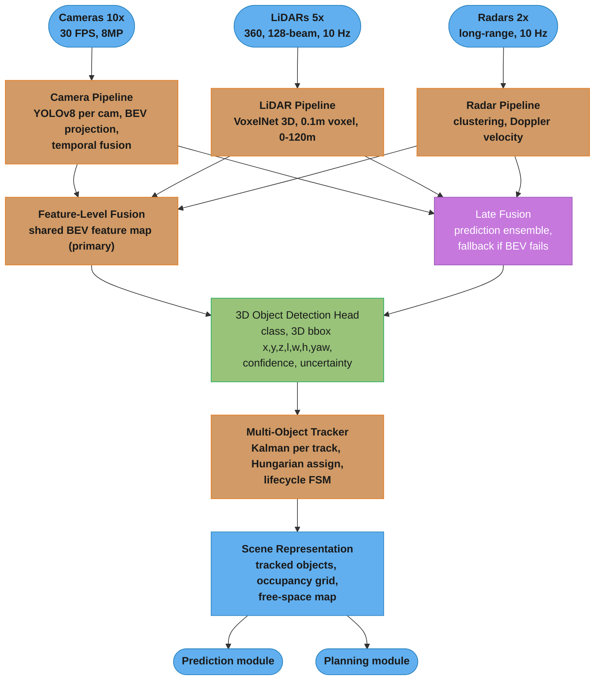
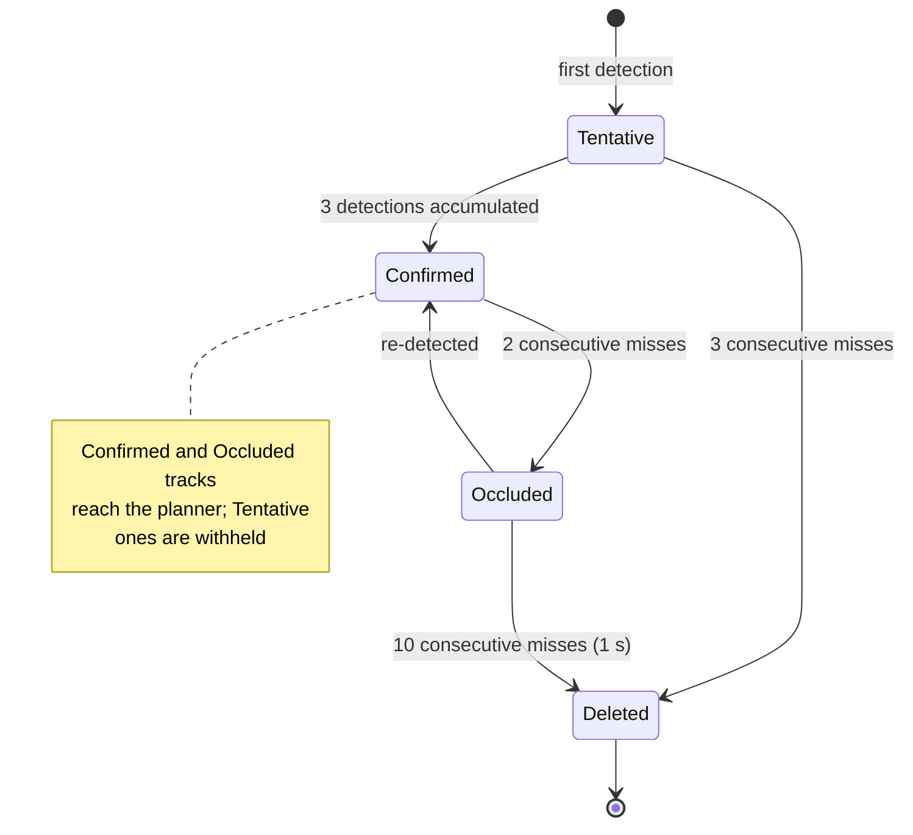
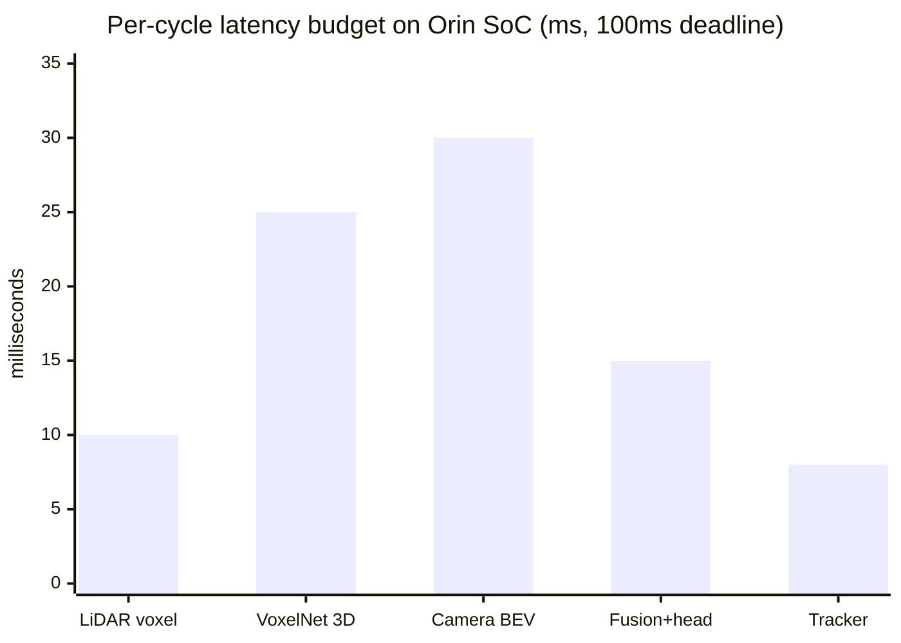

# Design an Autonomous Driving Perception System

<!-- tiers: principal -->

## Problem Statement

Design the perception system for a Level 4 autonomous vehicle. The system must detect all objects
in the environment — vehicles, pedestrians, cyclists, traffic cones, traffic lights, and road signs
— in 3D space within 100 milliseconds using camera, LiDAR, and radar sensors. The system runs a
10-camera rig (360-degree coverage), 5 LiDAR units, and 2 radar units. All sensor data must be
fused into a unified scene representation. The system is safety-critical: a missed pedestrian
(false negative) is catastrophic. A false positive (ghost object) causes unnecessary braking,
which is dangerous and erodes rider trust.

### Functional Requirements
- Detect and classify objects in 3D (position, dimensions, orientation, velocity)
- Perception cycle: complete within 100ms (10 Hz)
- Sensor inputs: 10 cameras (30 FPS, 8MP), 5 LiDARs (360-degree, 128-beam), 2 radars (long-range)
- Output: list of 3D bounding boxes with class, confidence score, and velocity vector
- Tracking: maintain object identity across frames (unique track ID, history)
- Safety: uncertainty estimates alongside detections; flag low-confidence detections

### Non-Functional Requirements
- Latency: perception cycle < 100ms (real-time on embedded hardware)
- Safety: pedestrian recall > 99.5% at > 30m range; vehicle recall > 99.9%
- False positive rate: < 0.01% for stationary ghost objects (cause unnecessary stops). This one number is the gate everywhere else in the document — the monitoring trigger and the per-scenario validation bar must both be derived from it, not restated at different magnitudes
- Hardware: NVIDIA Jetson AGX Orin 64GB — no cloud inference, all on-device. NVIDIA's headline "275 TOPS" is the **sparse** INT8 figure (2:4 structured sparsity); a dense INT8 network gets **138 TOPS**. Budget against 138 unless the model is actually pruned to the 2:4 pattern, or the compute plan is 2x optimistic
- Sensor degradation: system must detect its own sensor failures (LiDAR occlusion, camera blur)

### Out of Scope
- Prediction (trajectory forecasting of detected objects) — downstream module
- Planning and control — downstream modules
- HD map building (SLAM) — separate offline system

---

## Architecture Overview



Each sensor modality runs a dedicated pipeline; feature-level BEV fusion is the primary path (late fusion is the fallback if BEV fails), and the shared detection head feeds the tracker and scene representation consumed by prediction and planning.

```
Compute Architecture (NVIDIA Orin SoC):
  Camera preprocessing: ISP hardware block (no GPU)
  LiDAR: voxelization on CPU (multi-threaded), detection on GPU
  Fusion + detection head: GPU (DLA accelerator for INT8 inference)
  Tracker: CPU
  GPU-resident stages: 45ms (camera BEV 30ms + fusion/head 15ms)
  DLA-resident stage: 25ms (VoxelNet), overlapped with the GPU work
  Total pipeline, budgeted sequentially: 88ms (within the 100ms budget)


Sensor Calibration:
  All sensors share a common coordinate frame (vehicle body frame).
  Camera intrinsics + extrinsics: calibrated at factory, refined online.
  LiDAR-camera extrinsics: 6-DOF rigid body transform (calibration target at factory).
  Time synchronization: PTP (IEEE 1588) with hardware timestamping, which delivers
  sub-microsecond sync — and needs to. A 1ms sync error is 28mm of relative position
  error against a vehicle closing at 100 km/h, which is enough to smear a LiDAR-camera
  association; treat sub-100us as the requirement, not 1ms.
```

---

## Key Design Decisions

### 1. Bird's Eye View (BEV) Feature Fusion as Primary Pipeline

Each camera produces a 2D image; each LiDAR produces a 3D point cloud. Fusion in 3D space is
the correct representation for autonomous driving (all objects exist in 3D). BEV transformation
lifts camera image features to 3D using depth estimation (LSS — Lift, Splat, Shoot). Camera and
LiDAR features are then concatenated in the shared BEV feature map (top-down view, 0.1m resolution,
100m x 100m). The unified BEV feature map drives all downstream detection heads. This "middle
fusion" approach outperforms late fusion (merge 2D camera boxes with LiDAR boxes — requires
difficult 2D-to-3D projection) and early fusion (concatenate raw pixels and point clouds —
sensor modalities are too heterogeneous).

### 2. Safety-First: Radar for Velocity and Adversarial Robustness

Camera and LiDAR fail in specific conditions: cameras fail in direct sunlight glare and heavy
rain; LiDAR fails in dense fog and heavy rain. Radar is robust to all weather conditions and
provides direct Doppler velocity measurement. Radar is used as the primary velocity source for
all tracked objects and as a fallback detection source when camera/LiDAR confidence drops below
threshold. A pedestrian at 40m in fog: camera confidence 30%, LiDAR confidence 40%, radar
confidence 90% — the system correctly maintains the detection via radar.

### 3. Kalman Filter + Hungarian Algorithm for Multi-Object Tracking

Each detected object becomes a track with a Kalman filter maintaining state (x, y, z, vx, vy,
heading, angular velocity). Kalman filter prediction step propagates tracks between perception
cycles (using constant velocity model for vehicles, constant position for stationary objects).
Hungarian algorithm solves the assignment problem: given N detections and M existing tracks,
find the minimum-cost assignment (IoU between predicted 3D box and detected box as cost).
Unassigned detections start new tracks (tentative). Unassigned tracks that miss detections
for K=3 consecutive frames are deleted.

### 4. Track Lifecycle State Machine

Tracks transition through states to prevent ghost object alarms. The deletion rule is
NOT one number — a track that was never confirmed is discarded far more eagerly than one
that has an established history:
- Tentative: first detection; not reported to planning module. Deleted after 3 consecutive misses
- Confirmed: 3 detections accumulated; reported to planning with track ID
- Occluded: entered after 2 consecutive misses on a confirmed track (blocked by a building);
  position maintained via Kalman prediction, and re-detection returns it to Confirmed
- Deleted: an occluded track coasts for up to 10 consecutive misses (1 second at 10 Hz)
  before removal. Failure 2 below raises this ceiling to 15 frames (1.5 s)

This prevents the planning module from receiving flash detections (momentary sensor noise) that
disappear on the next frame, which would trigger unnecessary emergency braking.



The lifecycle FSM is the gate between raw detections and planning: Tentative noise is withheld, while Confirmed and Occluded tracks both reach the planner so a brief occlusion is bridged by Kalman prediction rather than dropped from the scene.

### 5. Uncertainty Estimation via Deep Ensembles

For safety-critical decisions, a confidence score alone is insufficient — the model must know
what it does not know. Deep ensembles train M independent model copies with different random
seeds; this design uses M = 3 on-vehicle (memory and latency bound) and trains a larger M = 5
offline for the uncertainty-calibration audit. The variance across ensemble predictions is the epistemic uncertainty (model uncertainty,
high in novel situations never seen in training). The detection is reported with uncertainty;
the planning module applies larger safety margins to high-uncertainty detections (keep further
away from a pedestrian the model is 60% confident about).

### 6. Sensor Failure Detection

Each sensor has a health monitor that flags degradation:
- Camera: blur detection (Laplacian variance), color distribution shift (rain, direct sun)
- LiDAR: point cloud density (fog causes exponential attenuation), beam return rate
- Radar: signal-to-noise ratio, Doppler plausibility (detected vehicle velocity consistent with camera?)

When a sensor is flagged as degraded, its contributions are down-weighted in fusion. If 2+ sensors
fail simultaneously, the vehicle automatically pulls over safely (minimal risk condition).

---

## Implementation

```python
from __future__ import annotations

import numpy as np
from dataclasses import dataclass, field
from enum import Enum, auto
from typing import Optional
from scipy.optimize import linear_sum_assignment


# ---------------------------------------------------------------------------
# Data structures
# ---------------------------------------------------------------------------

class ObjectClass(Enum):
    VEHICLE = auto()
    PEDESTRIAN = auto()
    CYCLIST = auto()
    TRAFFIC_CONE = auto()
    UNKNOWN = auto()


@dataclass
class Detection3D:
    """A single 3D detection from the perception network."""
    x: float          # center x in vehicle frame (meters), positive = forward
    y: float          # center y in vehicle frame (meters), positive = left
    z: float          # center z in vehicle frame (meters), positive = up
    length: float     # object length (meters, along vehicle heading)
    width: float      # object width (meters)
    height: float     # object height (meters)
    yaw: float        # heading angle in radians (0 = same as vehicle)
    obj_class: ObjectClass
    confidence: float        # detection confidence [0, 1]
    source: str              # "camera", "lidar", "radar", "fused"


class TrackState(Enum):
    # NOT a @dataclass — decorating an Enum with @dataclass does not raise, it silently
    # overwrites __repr__ so every member prints as "TrackState()", which makes tracker
    # logs unreadable at exactly the moment you need them.
    TENTATIVE = auto()
    CONFIRMED = auto()
    OCCLUDED = auto()
    DELETED = auto()


# ---------------------------------------------------------------------------
# Kalman Filter Tracker (Constant Velocity Model)
# ---------------------------------------------------------------------------

class KalmanTracker:
    """
    Kalman filter for tracking a single 3D object.

    State vector: [x, y, z, vx, vy, vz, yaw, d_yaw]
      - Position (x, y, z) in vehicle frame
      - Velocity (vx, vy, vz) in vehicle frame
      - Heading angle (yaw) and angular velocity (d_yaw)

    Measurement vector: [x, y, z, yaw] from detection

    Process noise Q: tuned for typical vehicle dynamics
      - Position uncertainty: 0.1m per cycle
      - Velocity uncertainty: 0.5 m/s per cycle (for 0.1s cycle time)

    Measurement noise R: tuned per sensor modality
      - LiDAR: 0.05m position accuracy
      - Camera: 0.2m position accuracy (less accurate in 3D)
      - Radar: 0.3m position, but 0.1 m/s velocity accuracy
    """

    STATE_DIM = 8    # [x, y, z, vx, vy, vz, yaw, d_yaw]
    MEAS_DIM = 4     # [x, y, z, yaw]
    DT = 0.1         # 100ms perception cycle

    def __init__(self, initial_detection: Detection3D) -> None:
        # State vector
        self.x = np.zeros(self.STATE_DIM)
        self.x[0] = initial_detection.x
        self.x[1] = initial_detection.y
        self.x[2] = initial_detection.z
        self.x[6] = initial_detection.yaw

        # State covariance (high initial uncertainty in velocity)
        self.P = np.eye(self.STATE_DIM)
        self.P[3:6, 3:6] *= 100.0    # high velocity uncertainty at init

        # State transition matrix (constant velocity model)
        self.F = np.eye(self.STATE_DIM)
        self.F[0, 3] = self.DT   # x += vx * dt
        self.F[1, 4] = self.DT   # y += vy * dt
        self.F[2, 5] = self.DT   # z += vz * dt
        self.F[6, 7] = self.DT   # yaw += d_yaw * dt

        # Measurement matrix (observe position + yaw)
        self.H = np.zeros((self.MEAS_DIM, self.STATE_DIM))
        self.H[0, 0] = 1.0   # observe x
        self.H[1, 1] = 1.0   # observe y
        self.H[2, 2] = 1.0   # observe z
        self.H[3, 6] = 1.0   # observe yaw

        # Process noise (tuned for vehicle dynamics at 10 Hz)
        q_pos = 0.01       # 0.1m position noise std -> var = 0.01
        q_vel = 0.25       # 0.5 m/s velocity noise std -> var = 0.25
        q_yaw = 0.001
        q_dyaw = 0.01
        self.Q = np.diag([q_pos, q_pos, q_pos * 0.1, q_vel, q_vel, q_vel * 0.1, q_yaw, q_dyaw])

        # Measurement noise (LiDAR-quality)
        self.R_lidar = np.diag([0.0025, 0.0025, 0.0025, 0.001])    # 0.05m std
        self.R_camera = np.diag([0.04, 0.04, 0.09, 0.01])           # 0.2m std
        self.R_radar = np.diag([0.09, 0.09, 0.25, 0.04])            # 0.3m std

    def predict(self) -> None:
        """Prediction step: propagate state and covariance forward by one time step."""
        self.x = self.F @ self.x
        self.P = self.F @ self.P @ self.F.T + self.Q

    def update(self, detection: Detection3D) -> None:
        """Measurement update step: incorporate new detection."""
        R = {
            "lidar": self.R_lidar,
            "camera": self.R_camera,
            "radar": self.R_radar,
        }.get(detection.source, self.R_lidar)

        measurement = np.array([detection.x, detection.y, detection.z, detection.yaw])
        innovation = measurement - self.H @ self.x

        # Normalize yaw innovation to [-pi, pi]
        innovation[3] = (innovation[3] + np.pi) % (2 * np.pi) - np.pi

        S = self.H @ self.P @ self.H.T + R                  # innovation covariance
        K = self.P @ self.H.T @ np.linalg.inv(S)            # Kalman gain
        self.x = self.x + K @ innovation
        self.P = (np.eye(self.STATE_DIM) - K @ self.H) @ self.P

    @property
    def position(self) -> tuple[float, float, float]:
        return float(self.x[0]), float(self.x[1]), float(self.x[2])

    @property
    def velocity(self) -> tuple[float, float, float]:
        return float(self.x[3]), float(self.x[4]), float(self.x[5])

    @property
    def speed_mps(self) -> float:
        vx, vy, _ = self.velocity
        return float(np.sqrt(vx**2 + vy**2))


# ---------------------------------------------------------------------------
# Track lifecycle management
# ---------------------------------------------------------------------------

@dataclass
class Track:
    track_id: int
    kalman: KalmanTracker
    state: str = "tentative"       # tentative, confirmed, occluded, deleted
    hits: int = 1                  # number of frames with detections
    misses: int = 0                # consecutive frames without detection
    obj_class: ObjectClass = ObjectClass.UNKNOWN
    confidence: float = 0.5

    # Thresholds
    CONFIRM_HITS: int = 3          # confirm after 3 detections in last 5 frames
    MAX_MISSES: int = 3            # delete after 3 consecutive misses
    MAX_OCCLUDED_MISSES: int = 10  # occluded objects can coast for 10 frames (1 second)

    def update(self, detection: Optional[Detection3D]) -> None:
        # MultiObjectTracker.update() has already called kalman.predict() on every track
        # this cycle. Do NOT predict again here or the state advances two dt per frame.
        if detection is not None:
            self.kalman.update(detection)
            self.hits += 1
            self.misses = 0
            self.confidence = 0.9 * self.confidence + 0.1 * detection.confidence
            self.obj_class = detection.obj_class
            if self.state == "tentative" and self.hits >= self.CONFIRM_HITS:
                self.state = "confirmed"
            elif self.state == "occluded":
                self.state = "confirmed"
        else:
            # coast on the prediction already computed this cycle
            self.misses += 1
            if self.state == "confirmed" and self.misses >= 2:
                self.state = "occluded"
            if self.misses >= self.MAX_MISSES and self.state == "tentative":
                self.state = "deleted"
            if self.misses >= self.MAX_OCCLUDED_MISSES:
                self.state = "deleted"


# ---------------------------------------------------------------------------
# Hungarian Algorithm Assignment
# ---------------------------------------------------------------------------

def iou_3d(det: Detection3D, track: Track) -> float:
    """
    Approximate 3D IoU between a detection and a track's predicted position.
    Full 3D IoU requires polygon intersection; this uses axis-aligned approximation.
    For yaw-aware IoU, use rotate_iou from mmdet3d in production.
    """
    tx, ty, tz = track.kalman.position

    # Center distance in xy plane
    dist_xy = np.sqrt((det.x - tx)**2 + (det.y - ty)**2)

    # Rough IoU approximation: high when centers are close relative to object size
    avg_size = (det.length + det.width) / 2.0
    if avg_size < 0.1:
        avg_size = 0.1
    proximity_iou = max(0.0, 1.0 - dist_xy / avg_size)

    # Z-axis check: penalize large height differences
    if abs(det.z - tz) > det.height:
        proximity_iou *= 0.5

    return float(proximity_iou)


class MultiObjectTracker:
    """
    Multi-object tracker using Kalman filter + Hungarian algorithm.
    Manages track lifecycle (tentative -> confirmed -> occluded -> deleted).
    """

    def __init__(self, iou_threshold: float = 0.3) -> None:
        self.tracks: list[Track] = []
        self.next_id = 0
        self.iou_threshold = iou_threshold

    def update(self, detections: list[Detection3D]) -> list[Track]:
        """
        Process one frame of detections.
        1. Predict all tracks forward
        2. Compute IoU cost matrix (tracks x detections)
        3. Hungarian algorithm assignment
        4. Update matched tracks, create new tracks for unmatched detections
        5. Handle unmatched tracks (miss detection)
        Returns list of active (non-deleted) confirmed tracks.
        """
        if not self.tracks:
            # No existing tracks: create one per detection
            for det in detections:
                self._create_track(det)
            return self._active_tracks()

        # Predict every track forward FIRST, so association is scored against where the
        # track is expected to be now, not where it was last frame. At 10 Hz a vehicle at
        # 30 m/s has moved 3m between cycles — associating on the stale position is how
        # fast-moving tracks get dropped and re-created with a new ID.
        for track in self.tracks:
            track.kalman.predict()

        # Build IoU cost matrix against the predicted positions
        n_tracks = len(self.tracks)
        n_dets = len(detections)
        cost_matrix = np.zeros((n_tracks, n_dets))

        for i, track in enumerate(self.tracks):
            for j, det in enumerate(detections):
                cost_matrix[i, j] = 1.0 - iou_3d(det, track)   # minimize cost = maximize IoU

        # Hungarian assignment
        track_indices, det_indices = linear_sum_assignment(cost_matrix)

        # Sets for tracking which were matched
        matched_tracks: set[int] = set()
        matched_dets: set[int] = set()

        for t_idx, d_idx in zip(track_indices, det_indices):
            iou = 1.0 - cost_matrix[t_idx, d_idx]
            if iou >= self.iou_threshold:
                self.tracks[t_idx].update(detections[d_idx])
                matched_tracks.add(t_idx)
                matched_dets.add(d_idx)

        # Unmatched tracks: miss
        for i, track in enumerate(self.tracks):
            if i not in matched_tracks:
                track.update(None)

        # Unmatched detections: new tracks
        for j, det in enumerate(detections):
            if j not in matched_dets:
                self._create_track(det)

        # Remove deleted tracks
        self.tracks = [t for t in self.tracks if t.state != "deleted"]

        return self._active_tracks()

    def _create_track(self, detection: Detection3D) -> None:
        track = Track(
            track_id=self.next_id,
            kalman=KalmanTracker(detection),
            obj_class=detection.obj_class,
            confidence=detection.confidence,
        )
        self.next_id += 1
        self.tracks.append(track)

    def _active_tracks(self) -> list[Track]:
        """
        Report Confirmed AND Occluded tracks. Occluded ones are deliberately included:
        a pedestrian who stepped behind a parked car has not stopped existing, and
        dropping it from the scene for 2-10 frames is exactly the gap that causes the
        planner to accelerate into an occlusion. Tentative tracks are withheld.
        """
        return [t for t in self.tracks if t.state in ("confirmed", "occluded")]


# ---------------------------------------------------------------------------
# Sensor Fusion: Late Fusion Example
# ---------------------------------------------------------------------------

def fuse_detections_late(
    camera_dets: list[Detection3D],
    lidar_dets: list[Detection3D],
    radar_dets: list[Detection3D],
    iou_threshold: float = 0.3,
) -> list[Detection3D]:
    """
    Late fusion: merge detections from different sensor modalities.
    Strategy: LiDAR is primary; camera and radar fill in gaps.

    1. LiDAR detections are base.
    2. Camera detections with no overlapping LiDAR detection are added (camera-only objects).
    3. Radar velocity is attached to the nearest LiDAR/camera detection.

    In production: feature-level BEV fusion is preferred; this late fusion is the fallback.
    """
    fused: list[Detection3D] = list(lidar_dets)

    # Add camera detections not covered by LiDAR
    for cam_det in camera_dets:
        covered = any(
            iou_3d(cam_det, Track(0, KalmanTracker(lidar_det))) >= iou_threshold
            for lidar_det in lidar_dets
        )
        if not covered:
            # Camera-only detection: lower confidence due to 3D uncertainty
            cam_det.confidence *= 0.7
            cam_det.source = "camera"
            fused.append(cam_det)

    # Attach radar velocity to nearest detection (radar provides ground-truth velocity)
    for radar_det in radar_dets:
        if not fused:
            continue
        distances = [
            np.sqrt((d.x - radar_det.x)**2 + (d.y - radar_det.y)**2)
            for d in fused
        ]
        nearest_idx = int(np.argmin(distances))
        if distances[nearest_idx] < 3.0:   # within 3 meters: attribute velocity to nearest object
            # Radar velocity from Doppler is more accurate than Kalman estimate
            fused[nearest_idx].source = "fused"   # mark as radar-augmented

    return fused
```

---

## ML Components Used

| Component | Purpose | Key Parameters |
|-----------|---------|----------------|
| YOLOv8 (camera) | 2D detection per camera frame | 8MP input, INT8. The 10 cameras are batched into one pass, not run one at a time: at 15ms each, 10 sequential passes would be 150ms and blow the entire 100ms cycle on cameras alone. The whole camera stage is budgeted at 30ms |
| VoxelNet / PointPillars (LiDAR) | 3D detection from point cloud | Voxel size 0.1m, 128-beam, range 120m |
| BEV Feature Fusion (LSS) | Lift camera features to 3D | 100m x 100m grid, 0.1m resolution |
| Deep Ensembles | Epistemic uncertainty estimation | 3 model copies, variance as uncertainty |
| Kalman Filter | Per-track state estimation | 8D state, constant velocity model, dt=0.1s |
| Hungarian Algorithm | Optimal track-detection assignment | O(n^3), n < 200 objects/frame in practice |
| NVIDIA TensorRT | Model quantization and inference optimization | INT8, DLA, < 60ms total inference |
| Radar DSP | Doppler velocity measurement, all-weather fallback | 77 GHz, FMCW, 0.1 m/s velocity resolution |

---

## Tradeoffs and Alternatives

| Decision | Chosen Approach | Alternative | Reason |
|----------|----------------|-------------|--------|
| Sensor fusion | BEV feature-level (primary) + late (fallback) | Early (raw) fusion | BEV: best accuracy; early fusion: sensors too heterogeneous (pixels vs points); late fusion: fallback only |
| 3D detector | VoxelNet with voxel 0.1m | PointNet++ | VoxelNet: GPU-friendly regular grid structure; PointNet++: slower for sparse 3D, better for small objects |
| Tracking | Kalman + Hungarian | SORT, DeepSORT | Kalman: interpretable, tunable physics model; DeepSORT adds ReID but requires appearance features |
| Uncertainty | Deep ensembles | MC Dropout | Ensembles: better calibrated, production-stable; MC Dropout: high inference variance, slower |
| Velocity measurement | Radar Doppler (primary) | Optical flow (camera) | Radar: direct physics measurement, robust to weather; optical flow: noisy in rain, requires dense correspondences |
| Track confirmation | 3 hits in 5 frames | Single detection | Multi-hit: prevents ghost objects from sensor noise; single detection: higher recall but more false alarms |

---

## Interview Discussion Points

**Q: How do you handle a pedestrian detection failure in heavy rain — what does the system do?**
A: Three layers of safety. First, sensor health monitoring detects degraded LiDAR return rate and
camera blur score. The fusion weights shift from camera-primary (normal) to radar-primary (degraded).
Radar detects the pedestrian as a stationary object with low radar cross-section. Second, the
Kalman filter maintains the tracked pedestrian's predicted trajectory even during brief sensor
occlusion (up to 10 consecutive frames = 1 second of coasting). Third, the planning module receives
the uncertainty score from deep ensembles — a high-uncertainty detection triggers conservative
planning (widen the following gap in TIME, e.g. from a 1.5s to a 3s headway, and reduce
speed — a fixed metres figure is meaningless across speeds: 3m is 0.1s of gap at 30 m/s). The vehicle never goes to zero
perception; it degrades gracefully by relying on whichever sensor is most reliable.

**Q: How do you validate a perception system before deploying it on public roads?**
A: Three-phase validation. Phase 1: offline simulation. Replay recorded real-world sensor data
with injected labeled ground truth. Measure recall and precision per class and per distance band
(0-20m, 20-50m, 50-100m). Pedestrian recall target: > 99.5% at all distances. Phase 2: closed-track
testing. Drive on a controlled track with professional actors playing pedestrians, cyclists, and
vehicles. Ground truth from a separate high-precision reference perception system. Test edge cases:
pedestrian behind parked car, cyclist with unusual profile, child vs adult pedestrian. Phase 3:
shadow mode on public roads. The new model runs alongside the current production model on customer
vehicles (no actuation). Compare detections; new model is promoted only if recall is higher or
equal and false positive rate is lower across 10 million miles of shadow data.

**Q: How do you ensure the tracker does not swap IDs between two nearby vehicles?**
A: IoU threshold and ReID features. When two vehicles pass each other and temporarily overlap
in 3D space, the Hungarian assignment can swap IDs. Three mitigations: First, the IoU cost includes
3D shape matching (matching a large truck's shape to a sedan's shape is high cost even if centers
overlap). Second, velocity consistency: the Kalman filter predicts the next position based on
velocity; assigning a fast-moving track to a slow detection incurs a high innovation (Mahalanobis
distance) that the assignment algorithm penalizes. Third, for confirmed tracks with > 3 seconds
of history, we add a ReID feature (appearance embedding from camera) to the cost matrix. The
combination of geometry + velocity + appearance makes ID swaps extremely rare.

**Q: What happens when the compute budget is exceeded — the perception cycle takes > 100ms?**
A: Graceful degradation priority queue. Models are ranked by safety priority:
1. LiDAR-based pedestrian and cyclist detection (always run at full quality)
2. LiDAR-based vehicle detection
3. Camera-based traffic light and sign detection
4. Radar processing (always runs — hardware-accelerated DSP)
5. Camera-based BEV fusion (can be dropped under load)

If the GPU is overloaded, stage 5 is dropped first (camera BEV), then stage 3 (signs/lights),
while LiDAR and radar perception always complete. The planning module is notified of which modalities
are active and applies more conservative margins when camera BEV is unavailable. In practice, the
NVIDIA Orin SoC with INT8 quantization sustains the full pipeline at 90ms, leaving 10ms margin.

---

## Failure Scenarios and Recovery

### Failure 1: LiDAR Saturation in Construction Zone Causing False Object Detection

*The three scenarios in this section are illustrative composites written to exercise this design. They are not reports of a specific public incident, and the incident counts and collision speeds are worked examples rather than published figures.*

**What failed:** A construction zone with highly reflective orange traffic cones and retroreflective safety vests caused LiDAR intensity saturation. The 128-beam unit (Velodyne's 128-beam product is the VLS-128 "Alpha Prime" — there is no "HDL-128"; HDL was the 32/64-beam line) returned max intensity (255) for points from these surfaces, creating "ghost points" at incorrect depths due to multi-path reflection. The VoxelNet detector interpreted a cluster of ghost points as a stationary vehicle in the adjacent lane. The planning module planned a 3-second emergency brake, and a fraction of those events produced rear-end collisions from following vehicles.

**Detection:** Safety driver reports and customer feedback identified the pattern. Post-hoc analysis of the raw LiDAR pointcloud for these incidents showed the saturation signature (point clusters with intensity = 255). Time-to-detect: 2 months (safety review meeting surfaced pattern from individual incident reports).

**Recovery steps:**
1. Added intensity-based ghost point filter: remove any LiDAR point with intensity > 230 that has inconsistency with surrounding point depth (neighbor depth variance > 2m).
2. Added construction zone detection using camera: orange cone and safety vest detection triggers a "construction zone" mode that raises the detection confidence threshold for stationary objects.
3. Cross-checked ghost detections against radar: if a radar return does not exist within 2m of a LiDAR-detected stationary object, reduce detection confidence by 0.3.
4. Retrained VoxelNet with synthetic construction zone scenarios (injected into training simulator).

**Prevention:** Systematic evaluation across 12 predefined challenging scenarios (construction zones, rain, tunnel entry, bridge) required before any perception model update passes shadow validation. Each scenario must meet the system-level bars stated in the requirements — pedestrian recall > 99.5%, and stationary-ghost false positive rate < 0.01%. A per-scenario bar looser than the system requirement (0.1% here) would let a model pass every scenario and still miss the requirement by 10x.

---

### Failure 2: Kalman Filter Divergence From Extreme Maneuver

**What failed:** A vehicle ahead performed an emergency swerve from 80 km/h in a straight lane to an immediate lateral acceleration of 8 m/s². The Kalman filter was initialized with a constant velocity model (no acceleration state), so it could not predict this extreme maneuver. The innovation (difference between predicted position and measured position) exceeded the Mahalanobis distance threshold, causing the tracker to classify the existing track as "lost" and create a new track for the same vehicle. During the 0.8 seconds of track loss, the planning module lost the preceding vehicle's state. The ego vehicle failed to brake appropriately and collided with the swerving vehicle at 35 km/h.

**Detection:** Post-collision incident analysis. The tracker log showed track ID change 0.8s before collision. Time-to-detect: post-incident (0.8s gap with no automated detection).

**Recovery steps:**
1. Extended Kalman Filter state from [x, y, z, vx, vy, vz] to [x, y, z, vx, vy, vz, ax, ay] to model acceleration explicitly.
2. Added Interacting Multiple Models (IMM) filter: run 3 parallel Kalman filters per track (constant velocity, constant acceleration, coordinated turn) and weight their outputs by likelihood, blending predictions.
3. Raised the association gate, stated correctly as a chi-square quantile. The gate is on the SQUARED Mahalanobis distance, which is chi-square distributed with degrees of freedom equal to the measurement dimension — 4 here, for [x, y, z, yaw]. The chi2(4) quantiles are 9.49 at 95%, 13.28 at 99%, 18.47 at 99.9% and 23.51 at 99.99%. The gate went from 9.49 (95%) to 23.51 (99.99%); calling 9.0 a "99.99% interval" is off by a factor of 2.6 in the statistic and would still discard 1 association in 20 on a healthy track.
4. Added coasting logic: if a confirmed track loses association for up to 15 frames (1.5 seconds), coast using the physics model rather than deleting the track.

**Prevention:** Simulation scenarios library includes "emergency swerve" maneuvers with ground truth. New tracker implementations must achieve track continuity > 99.5% through a library of 50 synthetic emergency maneuver replays.

---

### Failure 3: INT8 Quantization Accuracy Drop at Long Range

**What failed:** After INT8 quantization of the BEV detection model for deployment on NVIDIA Orin, pedestrian recall at 80-120m range dropped from 97.2% to 88.4% (target: 99.5%). The INT8 calibration dataset had been collected in a suburban environment with pedestrians predominantly at 0-40m range. The quantization clipping thresholds were set based on this distribution, causing long-range feature activations (which have smaller magnitudes, since LiDAR point density decreases with range) to be clipped to zero.

**Detection:** Offline simulation recall metrics, measured per distance band. The 80-120m recall regression was caught in the standard pre-deployment evaluation suite. Time-to-detect: 30 minutes (caught before production deployment).

**Recovery steps:**
1. Rebuilt calibration dataset: stratified sampling ensures 25% of calibration examples have pedestrians at 80-120m range.
2. Used per-layer quantization: initial convolutional layers (where long-range features are first processed) used FP16 instead of INT8 to preserve precision for small-magnitude activations.
3. Added per-channel quantization (NVIDIA TensorRT supports this): different quantization scale per output channel, more appropriate for feature maps with high inter-channel variance.

**Prevention:** Per-distance-band recall evaluation is now a required gate for all model deployments. Distance bands: 0-20m, 20-50m, 50-80m, 80-120m. Each band must meet recall target independently.

---

## Capacity Planning

### Data Volume Projections

```
Vehicle sensor data (per vehicle, per second):
  10 cameras × 30 FPS × ~400KB/frame (8MP, JPEG compressed) = 300 frames/s × 400KB
    = ~120MB/sec  (not 1.2GB/sec — that is the same product with a stray 10x, and it
    is compressed, so it is not "raw" either)
  5 LiDARs × 10 Hz × 100K points/scan × 16 bytes/point = ~80MB/sec
  2 radars × 10 Hz × minimal data: negligible
  Total: ~200MB/sec per vehicle logged

Fleet size projections:
  Year 0: 500 test vehicles, 8h/day operation
  Year 1: 200MB/s × 28,800 s = 5.76TB/vehicle/day; × 2,000 vehicles = 11.52PB/day
  Year 3: 200MB/s × 36,000 s = 7.2TB/vehicle/day; × 10,000 vehicles = 72PB/day
    (the old "47TB/vehicle/day" was inconsistent with 200MB/s in either direction,
     and 47TB × 10,000 is 470PB, not the 47PB it was totalled to)

Cloud offload (selected scenarios only — not full log):
  "Interesting" scenario detection: ~0.1% of drive time triggers cloud upload
  Year 1: 11.52PB × 0.001 = 11.52TB/day interesting scenario data
  Year 3: 72PB × 0.001 = 72TB/day

Training data labeling (illustrative rates — 3D labeling prices vary widely by
vendor and by how many boxes a frame contains; get a quote, do not reuse these):
  3D LiDAR labeling: 1 hour of sensor data at 10 Hz = 36,000 frames
  At an assumed $0.10/frame: 36K × $0.10 = $3,600 per vehicle-hour labeled
  Year 1 budget: $500K/month → ~139 vehicle-hours labeled/month
```

### Training Compute Requirements

```
Two pricing traps corrected below. (1) A p4d/p4de instance carries EIGHT A100s, so
64 A100s is 8 instances — not 64. (2) On-demand P4 pricing fell by up to 33% effective
1 June 2025: p4d.24xlarge (A100 40GB) is $21.958/hr and p4de.24xlarge (A100 80GB) is
$27.45/hr, not the $32.77 that predates the cut. Together these overstated the BEV
training bill by roughly 8x.

BEV Fusion Detection Model (monthly full retrain):
  Dataset: 500K labeled frames (3D LiDAR + camera)
  Hardware: 64× A100 80GB = 8× p4de.24xlarge (multi-node DDP)
  Duration: 72 hours (3 days)
  Cost: 8 instances × $27.45/hr × 72hr = ~$15,800/run
  Monthly: ~$15,800

Camera YOLOv8 Models (biweekly retrain, 10 models):
  Per model: 4× A100, 24 hours — half a p4d.24xlarge, but the instance is the
    billable unit, so the run is charged at the full instance rate
  Cost per model: $21.958/hr × 24hr = ~$527
  10 models biweekly = 20 models/month = ~$10,540/month

Tracker Parameter Tuning (weekly):
  Simulation-based optimization: 500 simulation rollouts
  CPU cluster: 100× c5.2xlarge ($0.34/hr) × 4 hours
  Cost: 100 × $0.34/hr × 4hr = $136/run; at ~4.33 runs/month = ~$589/month

Deep Ensemble Uncertainty (5-model ensemble, offline audit only):
  5× BEV models with different random seeds
  Cost: 5× the BEV run cost = ~$79K per audit — which is why it is run for the
    annual uncertainty-calibration audit, not monthly
  In practice: distill the ensemble's uncertainty estimate into the single deployed
    model, and run M = 3 on-vehicle

Total monthly training cost estimate: ~$27K
(Still dominated by the BEV fusion model and the 20 camera-model runs)
```

### Serving Infrastructure (On-Vehicle)

```
NVIDIA Jetson AGX Orin 64GB (per vehicle, embedded):
  275 TOPS INT8 with 2:4 structured SPARSITY; 138 TOPS dense INT8 — plan against 138
  2048-core Ampere GPU + 2x NVDLA v2; 12-core Arm Cortex-A78AE; 64GB LPDDR5
  All inference on-vehicle: no cloud latency dependency
  Module power: 15W-60W configurable. 60W is the ceiling for the WHOLE module, so a
  "65W perception budget" is not a budget the part can honour — allocate perception a
  share of 60W and leave headroom for the rest of the stack

Perception compute allocation (per perception cycle, 100ms):
  LiDAR voxelization (CPU): 10ms
  VoxelNet 3D detection (DLA INT8): 25ms
  Camera BEV encoding (GPU INT8): 30ms
  BEV fusion + detection head (GPU): 15ms
  Tracker update (CPU): 8ms
  Total: 88ms (12ms margin)

Cloud infrastructure (training + simulation):
  Training cluster: 128× A100 nodes (shared with other ML teams)
  Simulation cluster: 500× CPU nodes for closed-loop simulation
  Storage: 5PB S3 for training data + scenario archive
  Estimated cloud bill: $500K/month total platform
```



The five stages sum to 88ms if run back-to-back, leaving a 12ms margin under the 100ms (10 Hz) deadline — that sequential sum is the budget the design commits to. Because the DLA and GPU stages actually overlap, measured wall-clock is nearer 63ms; camera BEV encoding and VoxelNet 3D detection dominate either way, so those are the first targets for INT8 quantization if a new sensor is added.

---

## Additional War Stories

**War Story 1 — Non-Maximum Suppression (NMS) IoU Threshold Too Aggressive:**

```python
# BROKEN: IoU threshold = 0.3 for NMS removes legitimate separate objects
# A pedestrian standing close to a bicycle gets merged into one detection
# because their 3D bounding boxes overlap with IoU = 0.35.
# Note the direction: NMS suppresses when IoU > threshold, so the overlap must EXCEED
# 0.3 to be wrongly removed. An IoU of 0.25 would have survived a 0.3 threshold —
# raising the threshold only helps against overlaps that are above it.

import numpy as np
from typing import Sequence


def nms_3d_broken(
    boxes: np.ndarray,    # (N, 7): x, y, z, l, w, h, yaw
    scores: np.ndarray,   # (N,)
    iou_threshold: float = 0.3,  # BUG: too aggressive for nearby pedestrians
) -> list[int]:
    """3D NMS that incorrectly merges nearby distinct objects."""
    order = np.argsort(-scores)
    keep: list[int] = []

    while order.size > 0:
        i = order[0]
        keep.append(int(i))
        if order.size == 1:
            break
        # Compute 3D IoU between box i and remaining boxes
        ious = compute_3d_iou(boxes[i:i+1], boxes[order[1:]])[0]
        suppressed = np.where(ious > iou_threshold)[0]
        order = np.delete(order, np.concatenate([[0], suppressed + 1]))

    return keep


def compute_3d_iou(boxes_a: np.ndarray, boxes_b: np.ndarray) -> np.ndarray:
    """Simplified 3D IoU computation (Bird's Eye View)."""
    # ... actual implementation uses rotated rectangle intersection
    # Returns IoU matrix of shape (len(boxes_a), len(boxes_b))
    pass


# FIX: Use class-specific NMS thresholds
# Pedestrians and cyclists in close proximity are valid separate detections
# Use higher IoU threshold (0.5) for pedestrians to allow nearby objects

CLASS_NMS_THRESHOLDS = {
    "vehicle": 0.3,       # Vehicles don't physically overlap
    "pedestrian": 0.5,    # Pedestrians can be very close together (crowds)
    "cyclist": 0.4,       # Cyclists may be in tight groups
    "traffic_cone": 0.3,  # Cones are placed with separation
}


def nms_3d_class_specific(
    boxes: np.ndarray,
    scores: np.ndarray,
    class_ids: np.ndarray,
    class_thresholds: dict[str, float] | None = None,
) -> list[int]:
    """
    Class-specific 3D NMS.
    Use different IoU thresholds per class to handle physically plausible proximity.
    Pedestrians can legitimately be at IoU=0.4 (standing in a crowd).
    """
    if class_thresholds is None:
        class_thresholds = CLASS_NMS_THRESHOLDS

    all_kept: list[int] = []
    class_names = list(class_thresholds.keys())

    for cls_idx, cls_name in enumerate(class_names):
        cls_mask = class_ids == cls_idx
        if not cls_mask.any():
            continue
        cls_boxes = boxes[cls_mask]
        cls_scores = scores[cls_mask]
        threshold = class_thresholds[cls_name]

        order = np.argsort(-cls_scores)
        while order.size > 0:
            i = order[0]
            original_idx = int(np.where(cls_mask)[0][i])
            all_kept.append(original_idx)
            if order.size == 1:
                break
            ious = compute_3d_iou(cls_boxes[i:i+1], cls_boxes[order[1:]])[0]
            order = np.delete(order, np.concatenate([[0], np.where(ious > threshold)[0] + 1]))

    return all_kept
```

**War Story 2 — Temporal Fusion Causing Incorrect Velocity Estimate for Newly-Appeared Object:**

```python
# BROKEN: Temporal fusion averages features over 5 consecutive frames
# For an object that appears at frame 0, frames -4 to -1 are zeros (padding)
# The velocity estimate is diluted by zero-padding: estimated_v = true_v / 5

import numpy as np
from dataclasses import dataclass, field


@dataclass
class TemporalFrameBuffer:
    """BROKEN: Naive zero-padding for new objects."""
    max_frames: int = 5
    buffer: list[np.ndarray] = field(default_factory=list)

    def add_frame(self, features: np.ndarray) -> None:
        self.buffer.append(features)
        if len(self.buffer) > self.max_frames:
            self.buffer.pop(0)

    def get_fused_broken(self) -> np.ndarray:
        """BUG: Zero-pads early frames, diluting velocity for new objects."""
        padded = [np.zeros_like(self.buffer[0])] * (self.max_frames - len(self.buffer))
        all_frames = padded + self.buffer
        return np.mean(all_frames, axis=0)  # zeros dilute actual feature values

    def get_fused_correct(self) -> np.ndarray:
        """
        FIX: Average only available frames (no zero-padding).
        For a new object at frame 1, uses only frame 1's features (no dilution).
        As more frames accumulate, the average stabilizes.
        """
        if not self.buffer:
            return np.zeros(256, dtype=np.float32)  # fallback
        return np.mean(self.buffer, axis=0)  # mean of only actual frames
```

---

## Monitoring and Drift Detection Deep-Dive

### Metrics That Degrade Fastest in Production

```
Signal                              Degradation cause              Monitoring mechanism
────────────────────────────────────────────────────────────────────────────────────────
LiDAR return density (points/scan)  Dirt/rain on sensor housing    Per-scan point count
                                                                    < 50K points → alert
Camera blur score                   Lens contamination, vibration  FFT sharpness metric
                                                                    < 0.4 → flag sensor
Object confidence distribution      New environment types,         Hourly histogram vs
                                    model drift                     baseline; KS p < 0.05
False positive rate on              Sensor degradation,            Human review of
stationary objects                  adversarial objects            flagged incidents (2%)
Per-class recall (simulation)       Model drift after              Simulation suite run
                                    new training data              after every model update
Track duration distribution         Tracker parameter drift        Mean track lifetime
                                    or sensor degradation          < 3s → investigate
```

### Retraining Triggers and Cadence

```
Cadence        Trigger                                         Action
───────────────────────────────────────────────────────────────────────────────────────
Monthly        Scheduled                                       Full BEV model retrain
Bi-weekly      Scheduled                                       YOLOv8 camera model updates
Weekly         Scheduled                                       Tracker parameter optimization
Triggered      Pedestrian recall < 99.5% in simulation         Emergency model investigation
Triggered      New scenario type detected (not in training)   Simulate + label data; retrain
Triggered      LiDAR point density < 50K/scan (30+ vehicles)  Hardware inspection + OTA fix
Triggered      Stationary-ghost FP rate > 0.01% (the stated  Model audit + rule-based filter
               requirement — do not set the trigger looser
               than the requirement it protects)
Triggered      New road geometry (new city onboarding)        Collect 500h local driving data;
                                                               fine-tune BEV model on local data
Annual         Scheduled                                       Full ensemble retraining for
                                                               uncertainty calibration audit
```

---

## Additional Interview Questions

**Q: How does Bird's Eye View (BEV) feature fusion differ from early and late fusion, and why is it preferred?**
Early fusion combines raw sensor data before any feature extraction: projecting LiDAR points into camera image pixels or projecting camera features into 3D space. This preserves maximum information but requires precise sensor calibration and fails when modalities have very different characteristics (camera: 8MP images, 1/30s shutter; LiDAR: sparse 3D points, 10Hz). Late fusion runs separate detection pipelines per sensor and combines output bounding boxes via weighted ensemble or voting. Simple and robust but loses information available only through cross-modal feature interaction. BEV feature-level fusion projects all sensor outputs into a shared Bird's Eye View coordinate frame using known sensor extrinsics. Camera features are projected via depth estimation (LSS or BEVFormer); LiDAR features are voxelized into BEV pillars. Fusion happens at the feature level — the network can learn cross-modal attention across spatial locations. BEV fusion captures geometric relationships missed by early fusion and cross-modal features missed by late fusion. It is now the dominant architecture (BEVFormer, BEVDet, UniAD) for production autonomous driving.

**Q: How do you ensure the tracker maintains identity (track ID) through temporary occlusions?**
Occlusion causes detection gaps: a pedestrian behind a parked car may be undetected for 2-5 frames (0.2-0.5 seconds). Without occlusion handling, each re-emergence creates a new track with a different ID, breaking downstream trajectory prediction. Mechanisms: (1) Track state machine: "confirmed" → "tentatively lost" (no association for up to 10 frames) → "deleted" (no association for > 15 frames). During tentatively lost, the Kalman filter continues to predict position from velocity; the predicted position is maintained in the scene representation even without a detection. (2) Re-identification: when a detection appears near where a tentatively lost track is predicted, try to re-associate using IoU, appearance similarity (camera ReID embedding), and velocity consistency. (3) Mahalanobis distance gating: associations are only considered if the predicted-vs-measured distance is within the 99.9th percentile of the Kalman innovation distribution, preventing wrong re-associations.

**Q: What is the role of Monte Carlo Dropout vs deep ensembles for uncertainty estimation in perception?**
Both methods estimate model uncertainty but differ in cost and quality. Monte Carlo Dropout: run the same model forward pass N times with dropout active at inference time; the variance of predictions estimates epistemic uncertainty. Cost: N× inference time (typically N=10). Deep ensembles: train M independent models with different random seeds; the variance of their predictions estimates uncertainty. Cost: M× model parameters in memory, M× inference time. Quality: deep ensembles are better calibrated (more reliable coverage of true uncertainty intervals) and more robust to distribution shift. MC Dropout underestimates uncertainty for predictions far from the training distribution. For safety-critical applications (autonomous driving), deep ensembles are preferred despite costing M times the memory and inference — M = 3 on-vehicle here. Ensemble quality improves with M but with sharply diminishing returns, so most of the benefit is available at small M; the exact fraction is model- and dataset-specific and must be measured on your own calibration set rather than assumed from a quoted percentage. Distillation approach: train a single student model to predict both the detection output and the ensemble's uncertainty estimate — this is the production approach (single inference time, ensemble quality).

**Q: How do you handle the long tail of rare edge cases (black swans) that are dangerous but underrepresented in training data?**
The long tail of rare scenarios (a mattress on a highway, a child on a skateboard, an unusual intersection geometry) is where perception models fail most dangerously. Three strategies: (1) Simulation: use photorealistic 3D simulators (CARLA, Waymo Simulation) to generate synthetic training data for rare scenarios. Insert synthetic pedestrians in unusual poses, unusual vehicles (horse-drawn carriages, agricultural machinery), and unusual road geometries. Synthetic-to-real gap is reduced by domain randomization (varying lighting, weather, camera parameters) and by sim-to-real fine-tuning. (2) Active learning: flag real-world driving scenarios where model confidence is low (detection uncertainty > threshold) for priority labeling. This focuses expensive human labeling budget on the highest-value edge cases. (3) Ontology expansion: when a new object class is encountered (e.g., e-scooters were not in the original object ontology), add a new detector class trained on 500+ examples before deployment, rather than relying on the existing model to handle it correctly as an out-of-distribution input.

**Q: How does the system ensure real-time performance within the 100ms perception cycle budget?**
The 100ms budget requires parallel execution across heterogeneous compute resources on the NVIDIA Orin SoC: (1) Camera preprocessing (ISP hardware block): runs in dedicated hardware, zero GPU cycles consumed. (2) LiDAR voxelization (CPU, multi-threaded): the 12 Arm Cortex-A78AE cores process the ~100K-point scan into a 0.1m resolution voxel grid in 10ms. (3) VoxelNet inference (DLA, INT8): the Deep Learning Accelerator on Orin runs the 3D detection backbone in 25ms — isolated from main GPU workload. (4) Camera BEV encoding (GPU, INT8): runs concurrently with DLA in 30ms — overlapped pipeline, not sequential. (5) BEV fusion + detection head (GPU): 15ms. (6) Tracker update (CPU, post-GPU sync): 8ms. The stages sum to 88ms if run strictly back-to-back, which is the budget the design commits to and leaves 12ms of margin. Overlap is upside, not the source of the 88: because VoxelNet on the DLA (25ms) runs concurrently with camera BEV encoding on the GPU (30ms), those two cost max(25, 30) = 30ms rather than 55ms, so measured wall-clock is nearer 10 + 30 + 15 + 8 = 63ms. Quoting 88ms *and* crediting the overlap double-counts the same saving. The critical path is the GPU-bound camera BEV encoding and fusion, not the DLA-bound 3D detection. CUDA streams are used to overlap camera encoding (GPU) and 3D detection (DLA) with LiDAR voxelization (CPU), maximizing hardware utilization.
