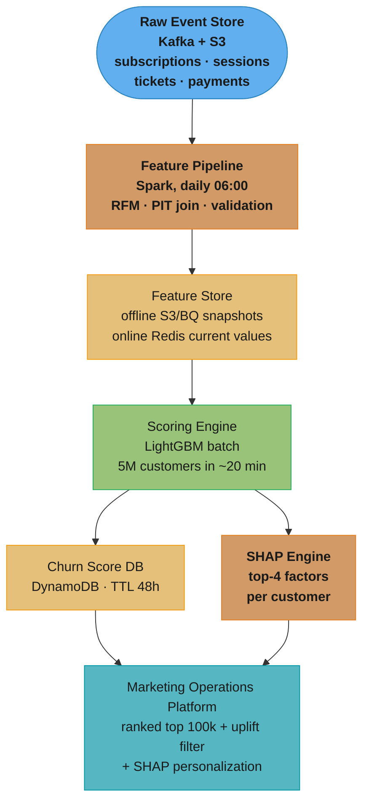
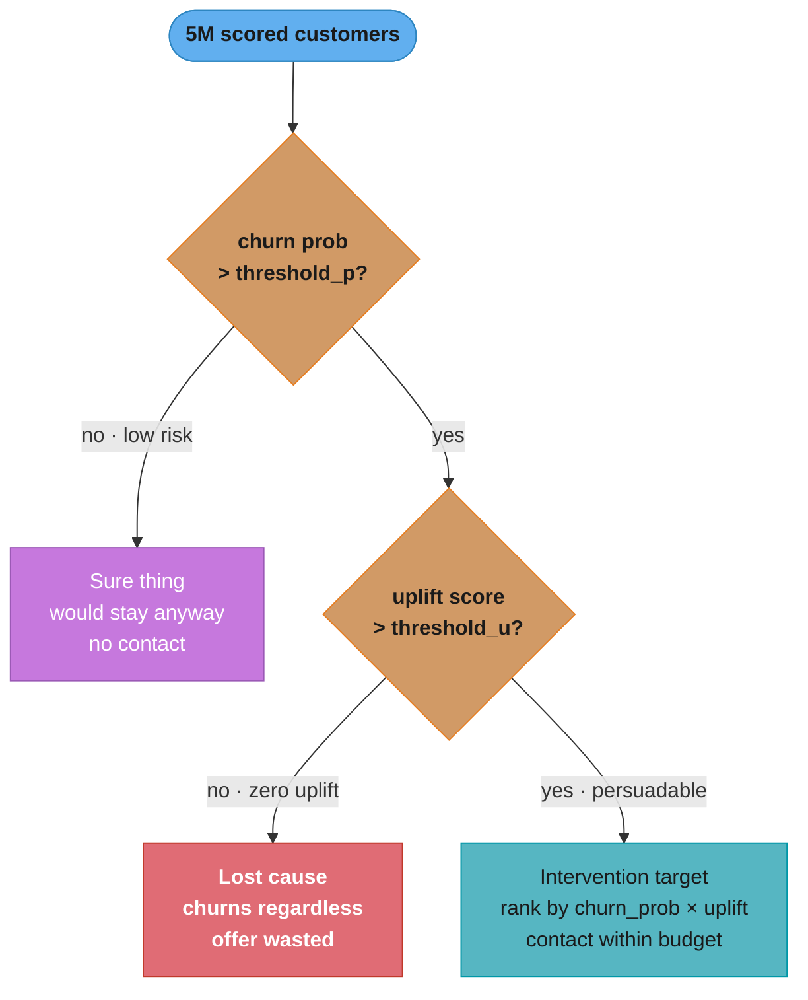
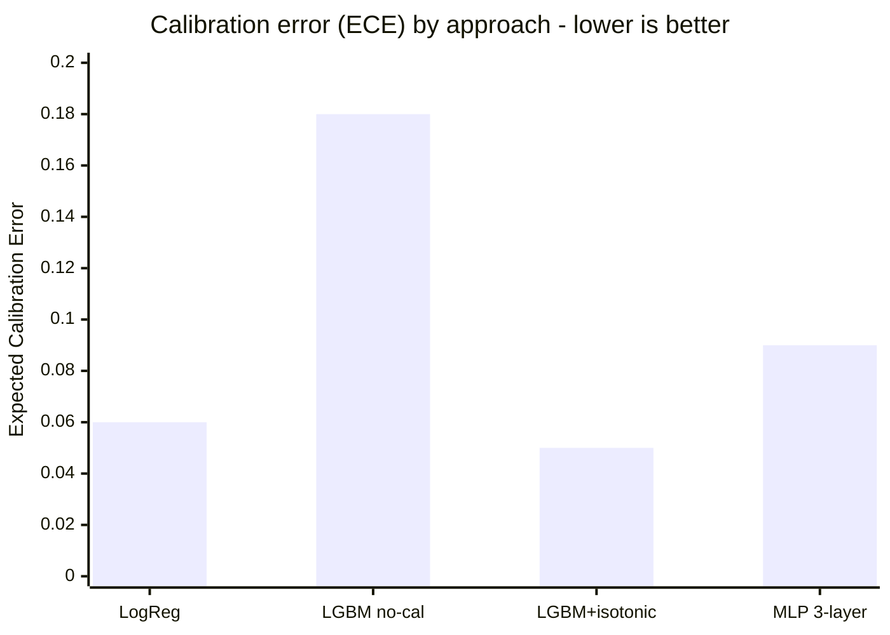

# Design a Customer Churn Prediction System

## Intuition

> A churn prediction system is like a hospital triage unit: the goal is not to predict who will get sick — it is to identify who is sick *right now* and route them to the most cost-effective intervention before they leave.

**Key insight:** churn prediction without a downstream intervention model is a science project. The real value is in the combination: who is at risk, what intervention is appropriate for them, and is the expected value of the intervention positive given its cost? A model that classifies churn accurately but allocates the intervention budget to customers who would have stayed anyway wastes money; one that identifies customers who are at risk *and* respond to intervention (uplift modeling) converts model accuracy into business value.

Mental model: think of churn as a funnel — many customers are at mild risk (churn probability 10-30%), few are at severe risk (>70%). The intervention budget can only cover 5-10% of the user base. The model's job is to rank customers by *expected intervention ROI*, which requires combining churn probability, intervention response probability, and intervention cost — not just churn probability alone.

---

## 1. Requirements Clarification

**Functional requirements:**
- Predict the probability of churn for each active customer over a 30-day forward window.
- Score all active customers daily; support on-demand scoring for triggered campaigns.
- Provide a ranked list of high-risk customers for the marketing operations team.
- Provide per-customer SHAP explanations for the top 4 churn risk factors (for personalized messaging).
- Optionally: produce an uplift score (probability that a customer responds to a retention offer) alongside the churn score.

**Non-functional requirements:**
- Latency: daily batch scoring pipeline must complete within 4 hours of data cutoff (06:00 AM → results available by 10:00 AM for marketing team).
- Throughput: score up to 5M active customers per daily run.
- Accuracy: AUC ≥ 0.82 on time-based holdout; ECE ≤ 0.08 (calibration required for budget allocation).
- Freshness: RFM features updated daily; session-level features updated hourly for high-risk alerts.
- Availability: 99.5% daily pipeline SLO (maximum 1 failed run per week).

**Out of scope:**
- Real-time (sub-second) churn scoring for reactive chat interventions (separate system).
- Long-term (90-day) survival analysis (separate model).
- Pricing or offer optimization (downstream system consumes churn scores).

---

## 2. Scale Estimation

**Customer base:** 5M active subscribers; 500k new subscribers per month; 8% monthly churn rate = 400k churning customers per month.

**Daily scoring volume:** 5M customers × 150 features = 750M feature values to compute and join daily. At 1KB per customer's feature vector: 5GB of feature data per daily run.

**Training data:** 24 months of history × 5M customers per month = ~60M customer-month records. With 100 features per record: ~600GB training dataset in Parquet (compressed).

**Label distribution:** 8% churn = 400k positive labels per month → significant class imbalance (1:11.5 ratio). Class weight or SMOTE required.

**Intervention budget:** if marketing can contact 100k customers per day at $2/contact (email + SMS) = $200k/day. At 8% monthly churn rate and ~5% lift from intervention for responsive customers, the expected avoided LTV loss is $200k × 0.05 × $150 LTV = $1.5M/month at 100k contacts/day.

**Feature computation:** RFM features (recency, frequency, monetary) require rolling 30-day and 90-day aggregations. At 5M customers × 90-day window from raw event tables = 450M row-scan per feature. On a 50-node Spark cluster: ~45 minutes for full feature computation.

**Infrastructure sizing:** 
- Feature pipeline: 50-node Spark cluster (m5.4xlarge), runs 45 min/day.
- Scoring: LightGBM on 16-core CPU: 5M customers in ~20 minutes.
- Total daily pipeline: ~2.5 hours end-to-end (within 4-hour SLO).
- Storage: 60GB/month for prediction logs + SHAP values (S3).

---

## 3. High-Level Architecture



*The daily batch spine: raw events become PIT-safe features, a single LightGBM pass scores all 5M customers, and the SHAP engine attaches per-customer reasons before both feed the marketing platform.*

**Component inventory:**
- **Feature pipeline:** Spark DAG on EMR; computes 150 features from raw event tables; enforces PIT join (see [Feature Store](./cross_cutting/feature_store_and_point_in_time_correctness.md)).
- **Feature store (offline):** S3 Parquet with timestamp partitioning; training data assembled via PIT join.
- **Scoring engine:** LightGBM model loaded into a Python scoring process on a 16-core CPU instance.
- **SHAP engine:** TreeExplainer on LightGBM; computes per-customer SHAP values in the same batch run.
- **Churn score DB:** DynamoDB with TTL-48h entries; marketing platform queries by customer_id.
- **Uplift model:** separate T-learner (LightGBM) estimating treatment effect; runs after churn scoring.

**Data flow:** raw events → Spark feature pipeline → PIT join with feature store → LightGBM scoring → calibrated probability → DynamoDB → marketing platform.

---

## 4. Component Deep Dives

### 4.1 Feature Engineering

```python
import pandas as pd
import numpy as np
from datetime import datetime, timedelta

def compute_rfm_features(
    events: pd.DataFrame,
    as_of_date: datetime,
    customer_col: str = "customer_id",
) -> pd.DataFrame:
    """
    RFM features computed as of a specific date (PIT-safe).
    Recency: days since last purchase.
    Frequency: number of purchases in the last 30 days.
    Monetary: total spend in last 30 days.
    """
    cutoff_30d = as_of_date - timedelta(days=30)
    cutoff_90d = as_of_date - timedelta(days=90)

    # Only look at events BEFORE as_of_date (PIT correctness)
    hist = events[events["event_time"] < as_of_date].copy()

    recency = (
        hist.groupby(customer_col)["event_time"]
        .max()
        .reset_index()
        .rename(columns={"event_time": "last_purchase_time"})
    )
    recency["recency_days"] = (as_of_date - recency["last_purchase_time"]).dt.days

    freq_30d = (
        hist[hist["event_time"] >= cutoff_30d]
        .groupby(customer_col)
        .size()
        .reset_index(name="purchase_count_30d")
    )

    monetary_30d = (
        hist[hist["event_time"] >= cutoff_30d]
        .groupby(customer_col)["amount_usd"]
        .sum()
        .reset_index(name="spend_30d_usd")
    )

    return (
        recency[[customer_col, "recency_days"]]
        .merge(freq_30d, on=customer_col, how="left")
        .merge(monetary_30d, on=customer_col, how="left")
        .fillna({"purchase_count_30d": 0, "spend_30d_usd": 0.0})
    )
```

Full feature set (150 features across 6 groups):
- **RFM (15 features):** recency_days, frequency (7/14/30/60/90d), monetary (7/14/30/60/90d).
- **Engagement (30 features):** login_count, session_duration, pages_viewed, feature_usage flags.
- **Support (10 features):** ticket_count_30d, CSAT score, resolution_time, escalation_flag.
- **Billing (20 features):** payment_failure_count, days_to_payment, plan_type, discount_active.
- **Social (15 features):** referral_activity, social_share_count, community_posts.
- **Derived (60 features):** trend ratios (30d/90d frequency), rolling delta (this month vs last month spend), interaction terms.

### 4.2 Model Training — Broken Then Fixed

```python
import lightgbm as lgb
from sklearn.model_selection import TimeSeriesSplit
from sklearn.metrics import roc_auc_score
import numpy as np

# WRONG: random k-fold cross-validation on temporal data
from sklearn.model_selection import cross_val_score
lgbm_wrong = lgb.LGBMClassifier(n_estimators=300, random_state=42)
scores_wrong = cross_val_score(lgbm_wrong, X, y, cv=5, scoring="roc_auc")
# Result: 0.91 AUC — inflated because future months leak into training folds
# A customer who churned in March may appear in a training fold that includes April data
```

```python
# CORRECT: temporal cross-validation with expanding window
from sklearn.model_selection import TimeSeriesSplit

def train_with_temporal_cv(
    X: np.ndarray,
    y: np.ndarray,
    timestamps: np.ndarray,    # observation dates, sorted ascending
    n_splits: int = 5,
) -> tuple[lgb.LGBMClassifier, list[float]]:
    """Walk-forward validation: each fold trains on past months, tests on next month."""
    tscv = TimeSeriesSplit(n_splits=n_splits, gap=30 * 24 * 3600)  # 30-day gap
    auc_scores = []

    for train_idx, val_idx in tscv.split(X):
        model = lgb.LGBMClassifier(
            n_estimators=500,
            learning_rate=0.03,
            num_leaves=63,
            min_child_samples=30,
            colsample_bytree=0.8,
            subsample=0.8,
            scale_pos_weight=11.5,   # 1:11.5 class ratio
            random_state=42,
        )
        model.fit(X[train_idx], y[train_idx])
        preds = model.predict_proba(X[val_idx])[:, 1]
        auc_scores.append(roc_auc_score(y[val_idx], preds))

    print(f"Temporal CV AUC: {np.mean(auc_scores):.3f} ± {np.std(auc_scores):.3f}")
    # Result: 0.84 AUC — honest estimate matching production performance
    return model, auc_scores
```

### 4.3 Calibration for Budget Allocation

The churn model's raw LightGBM output is not calibrated. Marketing uses the predicted probability directly for budget allocation: "spend at most $5 on customers with p(churn) > 0.70." If p=0.70 actually corresponds to 0.45 actual churn rate (overconfident model), the budget is wasted on moderate-risk customers.

See [Calibration and Thresholding](./cross_cutting/model_calibration_and_thresholding.md) for full implementation. ECE target: < 0.08.

### 4.4 Uplift Model for Intervention ROI

```python
from sklearn.base import BaseEstimator
import lightgbm as lgb
import numpy as np

class TLearner:
    """
    T-Learner uplift model.
    Train separate models for treatment (received offer) and control (no offer).
    Uplift = P(retained | treatment) - P(retained | control) for each customer.
    """
    def __init__(self) -> None:
        self.model_t = lgb.LGBMClassifier(n_estimators=200, random_state=42)
        self.model_c = lgb.LGBMClassifier(n_estimators=200, random_state=42)

    def fit(
        self,
        X: np.ndarray,
        y: np.ndarray,           # outcome (retained = 1)
        treatment: np.ndarray,   # 1 = received offer, 0 = did not
    ) -> "TLearner":
        self.model_t.fit(X[treatment == 1], y[treatment == 1])
        self.model_c.fit(X[treatment == 0], y[treatment == 0])
        return self

    def predict_uplift(self, X: np.ndarray) -> np.ndarray:
        """Positive uplift = intervention helps; negative = intervention hurts."""
        return (
            self.model_t.predict_proba(X)[:, 1] -
            self.model_c.predict_proba(X)[:, 1]
        )

# Intervention strategy: rank customers by (churn_prob × uplift) — expected intervention ROI
# This prioritizes customers who are both at risk AND responsive to intervention
```

The two-step targeting filter turns model scores into a budgeted contact list:



*Churn probability alone cannot separate the red "lost cause" set from the teal "persuadable" set — only the uplift gate does. Spending the fixed 100k/day budget on the teal path is what converts AUC into retained revenue.*

---

## 5. Design Decisions & Tradeoffs

**Decision 1: LightGBM over logistic regression or neural network.**
Alternatives considered: (a) logistic regression with L2 regularization — too weak for 150-feature non-linear interactions (5pp lower AUC in CV); (b) neural network (3-layer MLP) — 0.5pp higher AUC than GBDT but 8x longer training time, no native SHAP support, and requires careful hyperparameter tuning that the team lacks infra for. GBDT wins: best accuracy/latency/interpretability balance for 5M-row tabular dataset. See [Algorithm Selection](../../model_selection_and_algorithm_choice/README.md).

**Decision 2: T-learner uplift model over direct churn score ranking.**
Using only churn probability to rank intervention targets wastes budget on "sure churners" who will churn regardless of the offer, and on "sure retainers" who would stay anyway. T-learner identifies "persuadable" customers — those whose retention probability meaningfully increases when offered an incentive. In AB test validation, T-learner uplift targeting improved intervention ROI by 31% over churn-score-only targeting (same budget, fewer contacts, more retained customers).

**Decision 3: Temporal cross-validation over random k-fold.**
Random k-fold inflated AUC to 0.91 vs temporal CV's 0.84. The 7pp inflation comes from future data leaking into training folds. All model selection and hyperparameter tuning is done on temporal CV. The final model is trained on all data up to T-90d and evaluated on the most recent 90-day holdout.

**Decision 4: Batch scoring over real-time API.**
Real-time scoring would add < 5ms per prediction but requires: a feature serving layer (Redis), a low-latency model server, and operational complexity for 24/7 availability. The marketing use case (daily email/SMS campaigns) does not require real-time scoring — daily batch with DynamoDB lookup is sufficient. Reserve real-time for triggered flows (customer cancels subscription → score immediately and trigger a save attempt within 60 seconds).

**Decision 5: Isotonic regression calibration, re-fit monthly.**
Calibration is re-fitted monthly on the prior 30-day labeled cohort (30-day churn label lag). Monthly recalibration tracks seasonal churn rate shifts without overfitting to short-term anomalies. See [Calibration](./cross_cutting/model_calibration_and_thresholding.md).

**Comparison table:**

| Approach | AUC | ECE | Training time | Serving latency | Explainability |
|---|---|---|---|---|---|
| Logistic regression | 0.79 | 0.06 | 2 min | 0.1ms/customer | High (coeff) |
| LightGBM (no calibration) | 0.84 | 0.18 | 12 min | 0.3ms/customer | Medium (SHAP) |
| LightGBM + isotonic | 0.84 | 0.05 | 13 min | 0.3ms/customer | Medium (SHAP) |
| Neural net (MLP 3-layer) | 0.845 | 0.09 | 95 min | 2ms/customer | Low |



*AUC across these models is nearly flat (0.79–0.845), but raw LightGBM is badly miscalibrated (ECE 0.18) — far above the 0.08 budget-allocation ceiling. Isotonic regression fixes calibration (0.05) at no AUC cost, which is why the shipped model is LightGBM + isotonic rather than the marginally more accurate MLP.*

---

## 6. Real-World Implementations

**Spotify (subscriber churn):** uses a two-stage model — first stage predicts churn probability using RFM + listening behavior features; second stage predicts which discount (3-month trial, 20% off, 1 free month) maximizes retention probability per customer. The second stage is a multi-armed bandit (contextual bandits with LinUCB) that learns discount effectiveness from A/B test outcomes in real time. Batch scoring runs nightly; results feed into Braze (marketing automation) for campaign execution.

**Netflix (subscriber churn):** monitors churn risk implicitly via engagement metrics (hours watched per week below X → early warning signal). Rather than a pure binary churn model, Netflix uses a survival model (discrete-time hazard model) that outputs a weekly hazard rate per subscriber — the probability of cancellation in the next 7 days given they haven't yet cancelled. This enables intervention timing optimization (intervene when hazard rate spikes, not before or after).

**Duolingo (user churn / lapse):** built "streak shield" — a product feature whose effectiveness is evaluated using churn uplift modeling. The model identifies which users have a high churn risk and a high predicted sensitivity to streak restoration. Only those users see the streak shield offer. This is a textbook application of uplift modeling where the product feature itself is the treatment. Duolingo reported 2x improvement in DAU from this approach vs showing streak shield to all churning users.

**HubSpot (B2B SaaS churn):** uses feature importance from a churn model to drive a "health score" product — a customer success dashboard that shows each account's top 5 churn risk factors. The model runs weekly. CSMs (customer success managers) use the health score to prioritize outreach. Health score is not the model's raw probability but a normalized 0-100 index derived from SHAP values, designed to be interpretable to non-technical users.

---

## 7. Technologies & Tools

| Component | Technology | Alternative | Rationale |
|---|---|---|---|
| Feature computation | PySpark on EMR | dbt + BigQuery | Spark handles 450M row-scans in 45min; dbt is too slow for this volume |
| Feature store (offline) | S3 Parquet + DeltaLake | Feast | DeltaLake provides ACID, time-travel for PIT joins; Feast adds operational complexity |
| Feature store (online) | Redis Cluster | DynamoDB | Redis p99 < 1ms for feature lookup; DynamoDB ~5ms |
| Model training | LightGBM | XGBoost, sklearn | LightGBM is 3x faster than XGBoost; leaf-wise splits better for high-cardinality features |
| Calibration | scikit-learn IsotonicRegression | netcal | sklearn sufficient; isotonic > platt for our distribution |
| Uplift model | EconML T-Learner | CausalML DoublyRobust | T-learner simpler; sufficient data for separate models per treatment arm |
| Serving/storage | DynamoDB (TTL 48h) | Redis | DynamoDB managed, cheaper for daily batch results; Redis reserved for real-time serving |
| Explainability | SHAP TreeExplainer | LIME | TreeExplainer exact for LightGBM; 1000x faster than KernelSHAP |

---

## 8. Operational Playbook

**(a) Model Evaluation Pipeline:**
- Daily: temporal holdout AUC on the last 30-day cohort (labels available after 30-day lag).
- Daily: score distribution PSI vs training baseline (no label lag).
- Monthly: ECE calibration report on the labeled 30-day cohort.
- Quarterly: full backtesting on 12-month historical data with temporal CV.

See [Experimentation and Online Evaluation](./cross_cutting/experimentation_and_online_evaluation.md) for holdback experiment design.

**(b) Observability:**
- Pipeline SLO alert: if daily scoring does not complete by 10:00 AM, page on-call.
- Score distribution alert: KS p-value < 0.001 vs training baseline → P2 investigation.
- Feature PSI alert: any of top-10 SHAP features PSI > 0.2 → P2, trigger investigation.
- AUC alert: if 30-day holdout AUC < 0.80 (4pp below target) → P1, trigger emergency retrain.

See [Drift Monitoring and Retraining](./cross_cutting/drift_monitoring_and_retraining.md) for full PSI/KS implementation.

**(c) Incident Runbooks:**

**Runbook 1 — Pipeline failure (scoring not complete by 10 AM):**
Symptom: Airflow DAG failed; marketing platform shows stale scores (yesterday's).
Diagnosis: check Spark job logs for OOM or data schema error; check upstream S3 data availability.
Mitigation: use yesterday's scores for marketing (TTL-48h in DynamoDB); alert marketing team.
Resolution: fix data pipeline issue; re-run Spark job; validate output row count.

**Runbook 2 — Score distribution shift (KS alert):**
Symptom: today's predicted score mean shifted by > 0.08 vs training baseline.
Diagnosis: check feature PSI report; identify which feature(s) shifted most; check upstream data pipeline for anomalies.
Mitigation: if feature shift is confirmed data pipeline issue (e.g., broken session log), fix pipeline and rescore. If genuine distribution shift, run CUPED-adjusted analysis.
Resolution: investigate root cause; retrain challenger if drift is persistent.

**Runbook 3 — Calibration degradation (ECE > 0.12):**
Symptom: monthly calibration report shows ECE = 0.15 (above 0.08 target).
Diagnosis: check if churn rate has shifted (base rate change); check if new user cohorts are underrepresented.
Mitigation: refit isotonic calibrator on the most recent 60-day labeled cohort.
Resolution: deploy updated calibrator (no model retrain needed unless AUC also degraded).

**Runbook 4 — Uplift model producing negative net lift in A/B test:**
Symptom: holdback experiment shows intervention group has equal or lower 90-day retention than control.
Diagnosis: check T-learner data balance (were treatment/control training labels correctly assigned?); check for confounding (did customers in the treatment group receive offers outside the model's scope?).
Mitigation: pause uplift-targeted campaigns; revert to churn-score-only targeting while investigating.
Resolution: retrain T-learner with corrected treatment assignment labels; validate with 30-day A/B test before re-enabling.

---

## 9. Common Pitfalls & War Stories

**Pitfall 1 — Training on future data (PIT violation), Unnamed Subscription Company, 2021.**
Engineering team built churn model using "current" RFM features — the features were computed as of today, not as of the label date. A customer who churned on March 15 had March 16-31 purchase data in their feature vector (because the feature was computed on April 1 when training data was assembled). The model learned "customers who churned have 0 March purchases *after* they churned." AUC was 0.97 offline, 0.61 in production. Root cause discovered 3 months and 2 retrains later via a careful PIT audit. See [Feature Store](./cross_cutting/feature_store_and_point_in_time_correctness.md).

**Pitfall 2 — Optimizing AUC, ignoring calibration, HubSpot (approximation), 2020.**
A churn model with 0.90 AUC was deployed to drive customer success outreach. CSMs were told to prioritize accounts with > 60% churn probability. The model was miscalibrated: the 60% threshold corresponded to 85% actual churn risk. 40% of genuinely high-risk accounts were scored below the threshold and missed. The health score product had only 0.62 real-world recall at the operational threshold. Resolution: isotonic calibration, threshold re-derivation at 40% calibrated probability to maintain 80% recall. See [Calibration](./cross_cutting/model_calibration_and_thresholding.md).

**Pitfall 3 — Sending retention offers to "sure churners," Telecom (anonymized), 2019.**
Marketing team ranked customers by churn probability and sent offers to the top 10% (highest risk). Post-campaign analysis showed that 60% of the targeted customers had already decided to churn before the offer arrived and were unaffected. The offer was effectively free money for customers who would have churned regardless. The missing piece was uplift: the model identified who was at risk but not who was responsive. Switching to T-learner uplift targeting for the same budget improved retained-customer count by 38%. Net revenue impact: $2.1M/year.

**Pitfall 4 — Random k-fold cross-validation inflates AUC by 7pp, Gaming Company (anonymized), 2022.**
Data science team reported 0.91 AUC for a player churn model. Production performance after deployment: 0.84 AUC. The gap was traced to random k-fold CV: players who churned in January appeared in both February training folds and January test folds (because random shuffle doesn't respect time). The model learned future behavioral signals. Re-evaluation with temporal CV showed 0.84 AUC — matching production. All subsequent models at the company now use `TimeSeriesSplit` as default.

**Pitfall 5 — Feedback loop degradation, e-commerce platform (anonymized), 2023.**
The churn model drove suppression of marketing emails: customers with p(churn) > 0.6 received no marketing. Six months later, the model's AUC dropped from 0.84 to 0.77. Root cause: high-risk customers stopped receiving emails → reduced email engagement signals in future training data → the model lost one of its most predictive features (email open rate in last 30 days). The feedback loop silently degraded the model's feature set. Resolution: maintain a holdout group of high-risk customers who receive emails regardless of model score; use this group to preserve feature signal integrity. See [Drift Monitoring](./cross_cutting/drift_monitoring_and_retraining.md).

---

## 10. Capacity Planning

**Primary bottleneck: Spark feature computation.**

Feature computation scales linearly with customer base (N) and quadratically with lookback window (W in days) for rolling aggregates:

```
Compute time ≈ N × W × (features per window) / (cluster throughput)
= 5M × 90 × 1.5 features/day / (50 nodes × 90M rows/node-minute)
≈ 45 minutes
```

**Scaling formula:**
- If N doubles to 10M: compute time ≈ 90 minutes (add 25 nodes to stay within 45-minute budget, or use columnar format with predicate pushdown to reduce effective scan by 40%).
- If daily run SLO tightens to 2 hours: current infra sufficient up to 15M customers.
- If feature count grows from 150 to 300: compute time ~doubles; add 50 nodes or move to incremental (delta) feature computation.

**Cost model:**

| Component | Configuration | Cost/day |
|---|---|---|
| Spark cluster (EMR) | 50 × m5.4xlarge, 45 min | ~$80/day |
| LightGBM scoring | 1 × c5.4xlarge, 20 min | ~$3/day |
| SHAP computation | 1 × c5.4xlarge, 40 min | ~$6/day |
| DynamoDB (5M records, 48h TTL) | On-demand | ~$8/day |
| S3 storage (prediction logs) | 60GB/month | ~$1.40/month |
| **Total** | | **~$100/day (~$3,000/month)** |

At 400k churners/month and 5% intervention conversion rate, the model prevents 20k churns/month. At $150 average LTV: $3M retained value / month. Model operating cost: $3k/month. ROI: 1000:1.

---

## 11. Interview Discussion Points

**Q: Why use LightGBM instead of a neural network for churn prediction on 5M customers?**
LightGBM wins on three dimensions for this problem: (1) tabular data with engineered features — GBDT's tree-based inductive bias matches tabular data better than DNN's at <100M rows; (2) inference latency — LightGBM scores 5M customers in 20 minutes; a 3-layer MLP would take 2+ hours on CPU; (3) native SHAP support via TreeExplainer — exact SHAP values in O(TL) vs hours for KernelSHAP on a DNN. The 0.5pp AUC advantage of the DNN does not justify the tradeoffs. See [Model Selection](../../model_selection_and_algorithm_choice/README.md).

**Q: How do you validate the churn model before deploying it?**
Three-layer validation: (1) offline temporal CV — 5-fold TimeSeriesSplit, no data leak, target AUC ≥ 0.82; (2) calibration check — ECE ≤ 0.08 on time-based holdout after isotonic calibration; (3) online holdback experiment — 90% of users get the new model, 10% holdback stays on the previous model; OEC is 90-day subscription renewal rate; run for 12 weeks to capture full renewal cycle. See [Experimentation](./cross_cutting/experimentation_and_online_evaluation.md).

**Q: How does a customer move from "churn risk" to "intervention target"?**
The system applies a two-step filter. First filter: churn probability > threshold_p (e.g., p > 0.40 for email, p > 0.65 for phone outreach — higher probability justifies higher intervention cost). Second filter: uplift score > threshold_u (e.g., T-learner uplift > 0.05 — customer is responsive to retention offers). The intersection of high churn risk and positive uplift is the intervention target set. This avoids wasting budget on the two failure modes: customers who won't churn regardless (low churn risk, positive uplift → offer unnecessary) and customers who will churn regardless of intervention (high churn risk, zero uplift → offer wasted).

**Q: What happens to the model when the churn rate changes seasonally?**
Two things degrade: (a) calibration — the model's predicted probabilities are calibrated for the training-period churn rate; if the churn rate doubles in Q4 (high attrition season), predicted probabilities will systematically underestimate actual risk; (b) feature importance may shift (e.g., holiday-season subscription holders have different engagement patterns). Mitigation: recalibrate monthly using the most recent 30-day labeled cohort; retrain quarterly using a rolling 12-month window that includes seasonal data. Monitor ECE monthly and PSI weekly. See [Drift Monitoring](./cross_cutting/drift_monitoring_and_retraining.md) and [Calibration](./cross_cutting/model_calibration_and_thresholding.md).

**Q: How do you measure the business impact of the churn model?**
Holdback A/B experiment: 10% of high-risk customers continue to receive the previous model's interventions; 90% receive the new model's interventions. Measure 90-day renewal rate delta (treatment - holdback). Multiply by: (high_risk_customers_count × avg_subscription_revenue × retention_probability_delta) to get monthly revenue impact. This converts model AUC into a dollar figure. Secondary measurement: cost per retained customer (intervention spend / retained customers) — the new model should reduce this.

**Q: How do you handle class imbalance in churn prediction (8% positive rate)?**
Scale_pos_weight = negative_count / positive_count = 11.5 in LightGBM (equivalent to class-weighted cross-entropy). This is the simplest and most effective approach for GBDT — it adjusts the leaf weight update to penalize FN more than FP. Do not oversample (SMOTE) for GBDT — it does not improve GBDT performance and increases training time by 10x. Do not undersample — it discards 90% of negative examples and wastes data. After training with scale_pos_weight, check calibration (ECE) — scale_pos_weight affects the raw output scale, so isotonic calibration is always needed post-training.

**Q: Walk me through how SHAP is used in this system beyond model debugging.**
SHAP serves three roles: (1) model validation — mean absolute SHAP confirms that the top features (recency, frequency, CSAT score) are business-sensible and that the model has not learned spurious signals; (2) personalized messaging — the top 2 SHAP features for each customer drive the retention message copy: "We noticed you haven't logged in recently (recency=45 days)" vs "We saw you had a recent billing issue (payment_failure=2)"; (3) fairness audit — SHAP values by demographic group ensure no protected attribute is implicitly encoded (e.g., if zip_code SHAP is high, it may be a proxy for ethnicity in markets with residential segregation). See [Responsible AI](./cross_cutting/responsible_ai_fairness_and_explainability.md).

**Q: What does T-learner uplift modeling add over churn scoring alone, and what are its limitations?**
T-learner uplift adds an estimate of treatment effect: P(retained|offer) - P(retained|no offer) for each customer. The three customer segments it identifies: (a) "sure thing" — low churn risk, will stay regardless; (b) "lost cause" — high churn risk, won't respond to any offer; (c) "persuadable" — moderate churn risk, responds to the right offer. Churn scoring alone cannot distinguish (b) from (c). Limitation of T-learner: it requires randomized historical data (customers who did and did not receive offers); if offers were given only to high-risk customers in the past (selection bias), the T-learner is trained on a biased treatment population. Fix: ensure a randomized holdout (5% of high-risk customers receive no offer) exists in the training data.

**Q: How do you retrain the churn model without introducing the past's mistakes?**
Four-gate champion/challenger pipeline: (1) data quality gate — validate training data with Great Expectations (schema, value ranges, label rate within expected bounds); fail pipeline if any check fails. (2) Temporal holdout gate — challenger AUC on the most recent 90-day holdout must be ≥ champion AUC - 0.005. (3) Calibration gate — challenger ECE ≤ 0.10 after isotonic calibration. (4) Shadow period — 7-day shadow scoring where challenger and champion both score production customers; compare score distributions (KS test); promote only if distributions are consistent. See [Drift Monitoring](./cross_cutting/drift_monitoring_and_retraining.md).

**Q: What would you change if churn label latency was 90 days instead of 30 days?**
Three things change: (1) retraining cadence drops to quarterly (minimum label lag for fresh labels = 90 days); (2) survival analysis becomes more attractive — a Cox Proportional Hazards model over a 90-day time-to-event is more informative than a 90-day binary label, and can produce weekly hazard rates that enable earlier intervention; (3) feature window alignment changes — features computed for 90-day labels should use a 90-day lookback (RFM over 90 days, not 30 days) to capture the full behavioral arc leading to the longer-horizon churn event. Monitoring becomes label-lagged: input PSI and score distribution remain real-time; AUC is only computable quarterly.

**Q: How do you present the churn model to a business stakeholder who doesn't understand ML?**
Focus on business outcomes, not model mechanics. Present: (1) "The model identifies customers who are likely to cancel in the next 30 days, ranked by risk level." (2) "It explains the top 3 reasons for each customer — so marketing can send a personalized message rather than a generic offer." (3) "In our A/B test, using the model for targeting saved $X in churn losses vs using no model." Avoid: AUC, feature importance charts, cross-validation splits. If they ask how it works: "The model learns from 24 months of behavioral patterns — how often customers log in, whether they've had billing issues, how their usage has changed — to predict who is most at risk." Frame every metric in business terms: AUC 0.84 → "The model correctly identifies 84% of churners in the top 15% of the risk score distribution."
