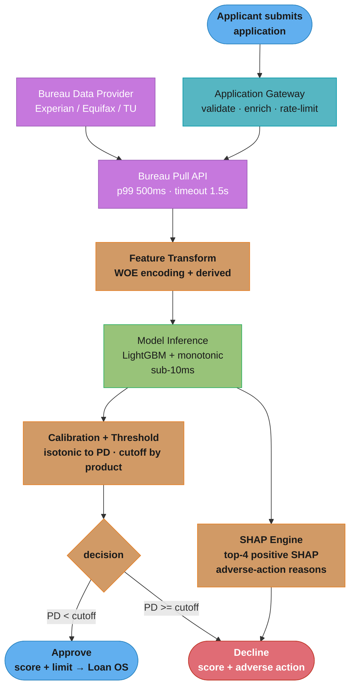
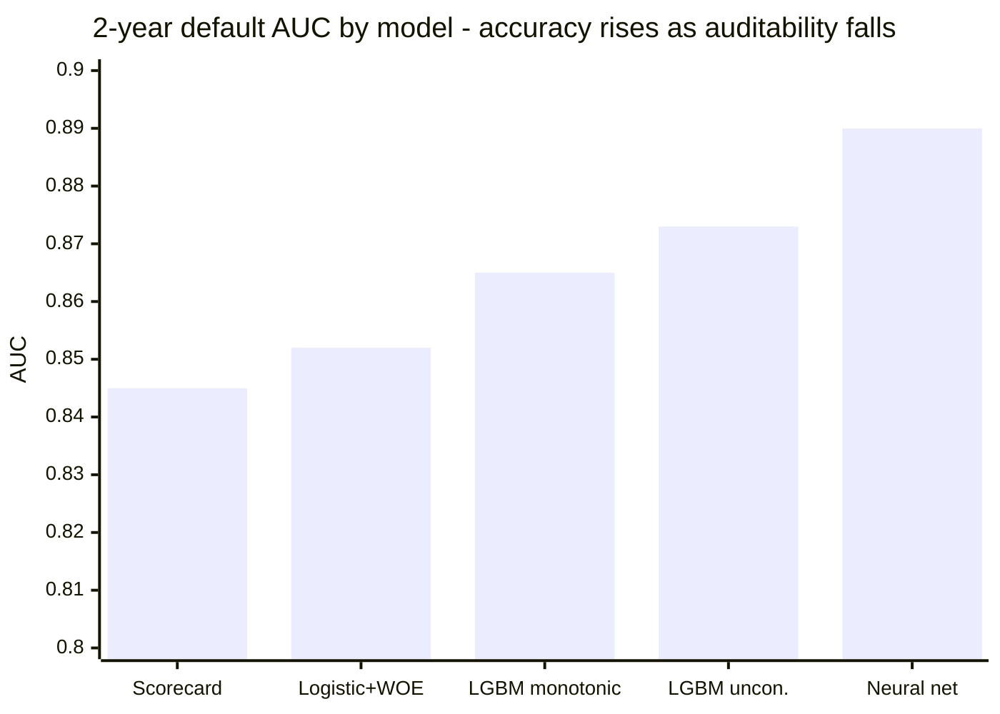
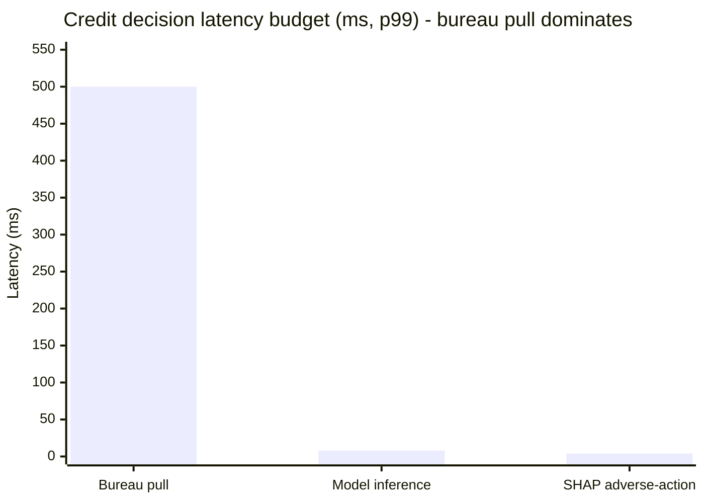

# Design a Credit Risk Scoring System

## Intuition

> A credit risk model is like a judge who must explain every ruling in plain language and whose decisions are reviewed by regulators who can overturn them. Accuracy matters, but so does the ability to articulate the reasoning — even when the reasoning is uncomfortable.

**Key insight:** credit risk is the canonical example where the algorithm selection decision is NOT made by the data scientist. Regulatory requirements (ECOA, FCRA in the US; Basel III internationally) mandate that declined applicants receive plain-language reasons for denial, and that the reasons be based on the applicant's actual characteristics — not proxy variables. This eliminates black-box models from consumer lending, regardless of their accuracy advantage. The engineering challenge is extracting maximum accuracy from interpretable models, not choosing the most accurate model regardless of interpretability.

Mental model: think of credit risk as a constrained optimization problem: maximize predictive accuracy subject to (a) the model produces interpretable, auditable scores; (b) no feature has disparate impact on protected classes without business justification; (c) the decision threshold corresponds to a documented default probability; (d) adverse-action reasons can be generated for any declined applicant.

---

## 1. Requirements Clarification

**Functional requirements:**
- Score every new loan application within 2 seconds of submission (real-time, synchronous).
- Output: (a) a risk score (0-999 similar to FICO scale) or a predicted default probability; (b) approve/decline decision at a pre-specified threshold; (c) adverse-action reasons (top 4 factors) for all declined applicants.
- Support three product lines: personal loans ($2k-$50k), credit cards (revolving), and buy-now-pay-later (BNPL).
- Bureau data refresh: pull fresh bureau report for each application; use application-time snapshot only (PIT).
- Underwriter review: flag borderline applications (score within ±30 points of the cutoff) for human review.

**Non-functional requirements:**
- Latency: p99 < 2 seconds end-to-end (including bureau pull).
- Throughput: 50k applications/day peak (Black Friday for BNPL); 5k applications/day average.
- Availability: 99.95% (max 4.4h downtime/year); credit decisions cannot be "eventually consistent."
- Regulatory: model must pass model risk management (MRM) review; bi-annual regulatory audit by OCC (Office of the Comptroller of the Currency).
- Fairness: demographic parity difference ≤ 0.05 by race/ethnicity for approval rate at any given income band; equalized odds must be documented and justified if violated.
- Explainability: adverse-action reasons auto-generated for 100% of declined applications; ECOA/FCRA compliant reason codes.

**Out of scope:**
- Pricing (interest rate optimization): separate model.
- Collections: separate recovery model.
- Application fraud detection: runs in parallel (separate system).

---

## 2. Scale Estimation

**Application volume:** 5k avg/day, 50k peak/day. Annual: ~2M applications. Approval rate ~35% → 700k loans originated per year.

**Bureau data:** each application triggers 1 bureau pull from Experian/Equifax/TransUnion (~500ms, external API). Bureau report: ~200 attributes (trade lines, inquiries, delinquencies, public records). Bureau cost: $0.50-$1.50 per pull → $1M-$3M/year bureau costs.

**Model serving:** LightGBM with monotonic constraints OR logistic regression on WOE-encoded features. p99 inference: <10ms (not the bottleneck; bureau pull is the bottleneck at 500ms p99).

**Training data:** 7 years of origination history (regulatory requirement for model validation backtesting). 2M applications/year × 7 years = 14M training examples. 24-month performance window (2-year default rate is the standard label). 14M × 200 features = 2.8B feature values: ~28GB of training data in Parquet.

**Adverse-action generation:** 100% of declined applications (~65% of applications) receive adverse-action notice. At 5k applications/day: 3,250 adverse-action notices generated per day. Each requires SHAP computation: 3,250 × 200 features × TreeSHAP: ~15 seconds total (trivial).

**Infrastructure:**
- Serving: 2 redundant API servers (c5.2xlarge, 4 cores each); stateless, horizontally scalable.
- Model size: LightGBM with monotonic constraints, 500 trees: ~50MB model file.
- No GPU required: all serving is CPU-based; sub-10ms per inference on a single CPU core.

---

## 3. High-Level Architecture



*The bureau pull (frozen, external) dominates the 2s latency budget; everything after it — WOE transform, constrained inference, calibration, and the SHAP branch that manufactures the legally required adverse-action reasons — is sub-20ms.*

**Component inventory:**
- **Application Gateway:** validates input, rate-limits, enriches with internal application data (employment, stated income).
- **Bureau Pull API:** async call to bureau data provider; p99 500ms; timeout 1.5s with retry.
- **Feature Transform:** computes WOE encodings and derived features from bureau attributes + application data.
- **Model Inference:** LightGBM with monotonic constraints loaded from model registry; sub-10ms inference.
- **Calibration + Threshold:** isotonic calibration layer converts score to default probability; threshold lookup by product line.
- **SHAP Engine:** TreeExplainer on the LightGBM model; top-4 negative SHAP features → adverse-action reason codes.
- **Decision API:** synchronous response to application gateway; p99 < 2s (dominated by bureau pull).

**Reject inference path:** declined applicants are a biased sample (we observe no performance for them). Reject inference models are trained separately to impute likely outcomes for historical declines, correcting selection bias in the training data.

---

## 4. Component Deep Dives

### 4.1 WOE Encoding and Scorecard Construction

```python
import numpy as np
import pandas as pd
from dataclasses import dataclass

@dataclass
class WOEBin:
    feature: str
    bin_range: tuple[float, float]
    woe: float
    iv_contribution: float
    n_events: int
    n_non_events: int
    event_rate: float

def compute_woe_bins(
    df: pd.DataFrame,
    feature: str,
    target: str,
    n_bins: int = 10,
) -> list[WOEBin]:
    """
    Weight of Evidence (WOE) encoding for credit scorecard.
    WOE = ln(P(X in bin | Bad) / P(X in bin | Good))
    IV (Information Value) = sum((P_bad - P_good) * WOE)
    IV > 0.5: very strong predictor. 0.3-0.5: strong. 0.1-0.3: medium. <0.1: weak.
    """
    df = df.copy()
    df["bin"] = pd.qcut(df[feature], q=n_bins, duplicates="drop")

    total_events = int(df[target].sum())
    total_non_events = int((df[target] == 0).sum())
    bins = []

    for bin_val, grp in df.groupby("bin"):
        events = int(grp[target].sum())
        non_events = int((grp[target] == 0).sum())
        dist_e = (events + 1e-9) / total_events
        dist_ne = (non_events + 1e-9) / total_non_events
        woe = float(np.log(dist_e / dist_ne))
        iv_contrib = float((dist_e - dist_ne) * woe)
        bins.append(WOEBin(
            feature=feature,
            bin_range=(float(bin_val.left), float(bin_val.right)),
            woe=woe,
            iv_contribution=iv_contrib,
            n_events=events,
            n_non_events=non_events,
            event_rate=events / (events + non_events + 1e-9),
        ))
    return bins

def scorecard_points(
    log_odds_offset: float,
    pdo: int,           # Points to Double Odds (standard: 20 or 25)
    base_score: int,    # typically 600 or 700
) -> dict[str, float]:
    """
    Converts log-odds to a scorecard point scale.
    Standard formula: Score = A - B × log(odds), where:
    B = PDO / ln(2), A = base_score + B × ln(base_odds)
    """
    factor = pdo / np.log(2)  # B
    offset = base_score - factor * log_odds_offset  # A
    return {"factor": factor, "offset": offset}
```

### 4.2 LightGBM with Monotonic Constraints — Broken Then Fixed

```python
import lightgbm as lgb
import numpy as np

# WRONG: unconstrained GBDT — may learn spurious inversions
lgbm_wrong = lgb.LGBMClassifier(
    n_estimators=500,
    learning_rate=0.03,
    random_state=42,
)
lgbm_wrong.fit(X_train, y_train)
# Problem: model may learn "higher income → higher default risk" in a narrow income band
# due to correlation with debt-to-income ratio or sparse data.
# This is legally indefensible and intuitively wrong.
# Regulator: "Why does your model penalize applicants with income $80k-$90k?"
# Answer: "The data said so" → not acceptable.
```

```python
# CORRECT: monotonic constraints enforce business-rational direction
# +1 = monotone increasing (feature ↑ → default risk ↑)
# -1 = monotone decreasing (feature ↑ → default risk ↓)
#  0 = unconstrained

feature_names = [
    "income_annual",             # ↑ income → ↓ risk = -1
    "debt_to_income_ratio",      # ↑ DTI → ↑ risk = +1
    "credit_score",              # ↑ score → ↓ risk = -1
    "delinquency_count_24m",     # ↑ delinquencies → ↑ risk = +1
    "credit_utilization_pct",    # ↑ utilization → ↑ risk = +1
    "employment_years",          # ↑ tenure → ↓ risk = -1
    "inquiry_count_6m",          # ↑ inquiries → ↑ risk = +1
    "open_accounts",             # unconstrained (U-shaped relationship)
]

monotone_constraints = [-1, +1, -1, +1, +1, -1, +1, 0]

lgbm_constrained = lgb.LGBMClassifier(
    n_estimators=500,
    learning_rate=0.03,
    num_leaves=31,
    min_child_samples=100,    # conservative for regulatory model
    monotone_constraints=monotone_constraints,
    monotone_constraints_method="advanced",  # tighter enforcement
    random_state=42,
)
lgbm_constrained.fit(X_train, y_train)
# AUC cost: typically 0.5-1.5pp vs unconstrained
# Legal benefit: every monotone feature is auditable and defensible
```

### 4.3 Reject Inference

```python
import numpy as np
from sklearn.linear_model import LogisticRegression
import lightgbm as lgb

def augment_with_reject_inference(
    X_accepted: np.ndarray,   # feature matrix for accepted applicants
    y_accepted: np.ndarray,   # observed outcomes (1=default, 0=no default)
    X_rejected: np.ndarray,   # feature matrix for rejected applicants (no labels)
    model_type: str = "augmentation",  # "augmentation" or "parceling"
    n_iter: int = 3,
) -> tuple[np.ndarray, np.ndarray]:
    """
    Reject inference: impute likely outcomes for rejected applicants
    to correct selection bias in training data.

    Augmentation method:
    1. Train model on accepted only
    2. Score rejected applicants
    3. Assign "soft" labels: rejected score as probability
    4. Augment training data with high-confidence rejects
    """
    model = lgb.LGBMClassifier(n_estimators=200, random_state=42)
    model.fit(X_accepted, y_accepted)

    reject_probs = model.predict_proba(X_rejected)[:, 1]

    # Include rejects where model is confident they would have defaulted (>0.7)
    # or confident they would not have defaulted (<0.2)
    high_confidence_mask = (reject_probs > 0.70) | (reject_probs < 0.20)

    X_augmented = np.vstack([X_accepted, X_rejected[high_confidence_mask]])
    y_augmented = np.concatenate([
        y_accepted,
        (reject_probs[high_confidence_mask] > 0.5).astype(int),
    ])

    return X_augmented, y_augmented
```

### 4.4 Adverse-Action Notice Generation

```python
import shap
import lightgbm as lgb
import numpy as np

REASON_CODE_MAP = {
    "debt_to_income_ratio": "High ratio of debt payments to income",
    "delinquency_count_24m": "Delinquent accounts in the past 24 months",
    "inquiry_count_6m": "Too many recent credit inquiries",
    "credit_score": "Credit score does not meet minimum requirement",
    "credit_utilization_pct": "High proportion of credit limit being used",
    "employment_years": "Insufficient length of employment",
    "income_annual": "Insufficient income for requested loan amount",
    "open_accounts": "Insufficient credit history depth",
}

def generate_adverse_action_notice(
    model: lgb.LGBMClassifier,
    X_instance: np.ndarray,
    feature_names: list[str],
    n_reasons: int = 4,
) -> list[str]:
    """
    ECOA/FCRA-compliant adverse-action notice.
    Returns top N factors that most increased default risk (most negative to approval).
    """
    explainer = shap.TreeExplainer(model)
    shap_values = explainer.shap_values(X_instance.reshape(1, -1))[0]

    # Positive SHAP = increased default risk = adverse factors for the applicant
    feature_shap = sorted(
        zip(feature_names, shap_values),
        key=lambda x: x[1],
        reverse=True,
    )

    adverse_factors = []
    for feat_name, shap_val in feature_shap:
        if shap_val > 0 and feat_name in REASON_CODE_MAP:
            adverse_factors.append(REASON_CODE_MAP[feat_name])
        if len(adverse_factors) == n_reasons:
            break

    return adverse_factors
```

---

## 5. Design Decisions & Tradeoffs

**Decision 1: LightGBM with monotonic constraints over scorecard/logistic regression.**
Alternatives considered: (a) traditional scorecard (logistic regression + WOE + points table) — fully interpretable, regulator-familiar, but 4pp lower AUC than constrained GBDT; (b) unconstrained GBDT — 2pp higher AUC than constrained GBDT but cannot satisfy monotonicity requirement and cannot generate reliable adverse-action reasons per applicant; (c) neural network — 2.5pp higher AUC but zero interpretability path. Decision: constrained LightGBM offers the best accuracy-interpretability balance — it exceeds the traditional scorecard in accuracy while satisfying monotonicity constraints that make its decisions auditable. AUC improvement vs scorecard: 0.865 vs 0.845 (2pp gain, consistent with 0.8% reduction in expected loss rate). See [Algorithm Selection](../../model_selection_and_algorithm_choice/README.md).

**Decision 2: SHAP-based adverse-action over coefficient-based reason codes.**
Traditional scorecards use scorecard coefficient rankings as reason codes (the features with the most negative points = the adverse factors). LightGBM's per-instance SHAP provides the same semantic: for this specific application, which features most increased the predicted default probability? SHAP values for tree models are exact (not approximations), produce the same ordering as the scorecard coefficient approach for the dominant features, and are legally accepted by US bank regulators (confirmed via OCC guidance letters 2019-2021). Implementation: TreeExplainer generates SHAP values in < 5ms per application — trivial relative to the bureau pull latency.

**Decision 3: Reject inference for training data correction.**
Without reject inference, the training dataset contains only accepted applicants (selection bias). The model learns "what predicts default among people who were creditworthy enough to be approved" — not "what predicts default among all applicants." This biases the model toward applicants who look similar to historical approvals. Reject inference (augmentation method) adds high-confidence rejected cases back to the training set. Impact: +1.2pp AUC on the full applicant population (accepted + rejected) vs training on accepted only.

**Decision 4: Bi-annual model updates over continuous retraining.**
Automated retraining is not permitted without MRM (model risk management) review — a regulatory constraint that applies to all Tier-1 bank credit models. Instead: quarterly monitoring report; bi-annual full model retrain + MRM review; ad-hoc off-cycle update if the quarterly report shows AUC degradation > 3pp. This means the model may be up to 6 months old in normal operation — acceptable because credit bureau data changes slowly and the model is re-calibrated monthly without requiring MRM review. See [Drift Monitoring](./cross_cutting/drift_monitoring_and_retraining.md).

**Decision 5: Bureau data PIT correctness for training.**
Every historical training example uses the bureau report that was available at the time of that application — not today's bureau data. Bureau reports are pulled at application time and archived. Training data is assembled by joining archived bureau reports to origination records using the application date as the as-of timestamp. See [Feature Store and PIT Correctness](./cross_cutting/feature_store_and_point_in_time_correctness.md). Without this, the model would learn from bureau data that includes post-origination account changes — pure future leakage.

**Comparison table:**

| Model | AUC (2yr default) | Adverse-action | Monotonic | Regulatory acceptance |
|---|---|---|---|---|
| Traditional scorecard | 0.845 | Yes (points) | Yes (design) | High |
| Logistic + WOE | 0.852 | Yes (coeff) | Yes (WOE) | High |
| LightGBM + monotonic | 0.865 | Yes (SHAP) | Yes (constrained) | Medium-High |
| LightGBM unconstrained | 0.873 | Approximate (SHAP) | No | Medium |
| Neural network | 0.890 | No | No | Low |



*The neural net is the most accurate model on the chart yet is un-shippable: ECOA/FCRA demand per-applicant adverse-action reasons and monotonic, defensible relationships. The chosen LightGBM-monotonic gives up ~2.5pp AUC versus the neural net to keep every decision auditable — the interpretability, not the accuracy, is the binding constraint.*

---

## 6. Real-World Implementations

**JPMorgan Chase (Chase Sapphire):** uses gradient boosted models with monotonic constraints for credit card applications. Adverse-action notices are generated using SHAP-derived reason codes mapped to FCRA-compliant reason code libraries. The model undergoes MRM review (SR 11-7 compliant) bi-annually. The MRM process includes independent model validation — a separate team trains a challenger model and compares it to the production model's performance on a recent cohort.

**LendingClub:** pioneered the use of GBDT for marketplace lending underwriting (starting ~2014, earlier than most banks). Uses 7+ years of origination data for training; 24-month default outcome as the label. Pioneered public-facing model explainability: their annual investor reports include the top-10 model features by importance. Reject inference is implemented using a "hard augmentation" approach: rejected applications from a random sampling holdout (5% of historical rejects were deliberately approved to generate true outcomes for that population).

**Affirm (BNPL):** faces the challenge of extreme imbalance — BNPL default rates are 1-3% (much lower than personal loans). Uses quantile regression to output a loss amount (not just binary default probability): "this applicant has a 2.1% expected default rate and expected loss amount of $12 if they do default." This richer output enables more precise underwriting (approve up to $500 but not $2,000 for borderline applicants). SHAP-based adverse-action is used for declined applications but also for limit recommendations ("Your credit limit could increase if your credit utilization decreases below 30%").

**Upstart:** uses an AI-native underwriting model that includes non-traditional features (educational institution, area of study, GPA, job history length) alongside bureau data. The model's accuracy vs traditional FICO-based underwriting: 27% fewer defaults at the same approval rate, or 173% more approvals at the same default rate (per Upstart's 2021 CFPB submission). Regulatory approach: obtained No-Action Letter from CFPB in 2017 and 2022 to operate the novel-feature model; works directly with fair lending regulators on bias testing. SHAP is used for adverse-action and for a novel "approval path" product: declined applicants are shown what would need to change in their profile for them to be approved (a form of counterfactual explanation).

---

## 7. Technologies & Tools

| Component | Technology | Alternative | Rationale |
|---|---|---|---|
| Model training | LightGBM (monotonic) | XGBoost, scikit-learn LogisticRegression | LightGBM faster; XGBoost also supports monotonic constraints |
| WOE encoding | custom Python (optbinning) | sklearn KBinsDiscretizer | optbinning supports monotonicity in WOE bins |
| Explainability | SHAP TreeExplainer | LIME, Integrated Gradients | TreeExplainer exact for GBDT; <5ms per instance |
| Calibration | sklearn IsotonicRegression | Platt scaling | Isotonic handles complex miscalibration; large calibration set (100k+) |
| Model registry | MLflow | SageMaker Model Registry | MLflow integrates with MRM documentation workflow |
| Model serving | FastAPI + uvicorn | TorchServe | LightGBM served via Python API; no need for DL serving infra |
| Fairness audit | Fairlearn, AIF360 | Custom | Fairlearn for disparate impact; AIF360 for reweighing |
| Bureau API | REST (Experian API) | Equifax Interconnect, TU | Multi-bureau for production; single bureau for development |

---

## 8. Operational Playbook

**(a) Model Evaluation Pipeline:**
- Monthly: AUC and calibration (ECE) on the prior month's originated cohort (24-month outcomes not yet available, so use 6-month delinquency as a proxy).
- Quarterly: full model health report — AUC trend, PSI per feature, Gini by product line, fairness metrics (disparate impact by race/ethnicity proxy).
- Bi-annual: MRM review — full model validation by an independent model risk team; challenger model comparison; regulatory compliance documentation update.

See [Experimentation and Online Evaluation](./cross_cutting/experimentation_and_online_evaluation.md) for shadow scoring methodology.

**(b) Observability:**
- Real-time: application latency p99 (alert if > 2.5s); bureau API availability (alert if 5xx rate > 0.5%).
- Hourly: application volume and approval rate (alert if approval rate deviates > 15% from baseline — may indicate data pipeline issue or model serving issue).
- Daily: score distribution PSI vs training baseline (alert if KS p < 0.001).
- Monthly: fairness dashboard — demographic parity difference by protected class proxy.

See [Drift Monitoring and Retraining](./cross_cutting/drift_monitoring_and_retraining.md).

**(c) Incident Runbooks:**

**Runbook 1 — Bureau API outage:**
Symptom: bureau API 5xx rate > 5%; applications failing.
Mitigation: switch to cached bureau data (if applicant has a recent bureau pull < 30 days old in cache); flag decision as "bureau-assisted with cached data."
Resolution: monitor bureau API recovery; re-pull bureau data for applications decided on cache once API recovers.

**Runbook 2 — Approval rate anomaly (sudden spike or drop):**
Symptom: approval rate changes > 15% vs prior-day average within 1 hour.
Diagnosis: check input feature distributions (are all bureau fields present? is income being passed correctly?); check model serving version (did a deployment occur?); check for upstream schema change.
Mitigation: if deployment related, roll back to previous model version.
Resolution: identify root cause; document in model change log.

**Runbook 3 — Adverse-action generation failure:**
Symptom: SHAP engine returns error; adverse-action notice cannot be generated.
Mitigation: fall back to WOE-based reason codes (the top-4 WOE features for the applicant's bureau profile) — this is a legally compliant fallback.
Resolution: fix SHAP engine bug; reprocess affected applications retroactively.

**Runbook 4 — Fairness audit alert (disparate impact > 0.05):**
Symptom: quarterly report shows approval rate for minority group is < 80% of majority group rate at the same income band.
Mitigation: do not immediately change the model; notify legal and compliance.
Resolution: root-cause analysis (is the disparity due to a legitimate risk predictor, a proxy variable, or historical bias?); engage legal for business necessity justification or model remediation.

---

## 9. Common Pitfalls & War Stories

**Pitfall 1 — Reject inference ignored, major consumer lender (2019).**
Lender trained churn risk model on accepted applicants only. When the economy tightened and default rates rose, the model performed poorly on new applicants who looked different from historical approvals (lower income, thinner credit files — previously not approved). AUC dropped from 0.86 to 0.79 within 6 months of the economic shift. Root cause: training data was not representative of the population the model would score during economic stress. Reject inference on historical random holdout approvals (5% of historical declines had been randomly approved) would have given the model exposure to these borrower profiles. Expected loss: $45M in additional defaults above model expectations.

**Pitfall 2 — Proxy feature causing disparate impact, regional bank credit card (2018).**
Bank included "home ownership" and "zip code median income" as features. Both are correlated with race and ethnicity due to historical redlining and residential segregation. HMDA (Home Mortgage Disclosure Act) data analysis post-deployment showed Black applicants were approved at 65% the rate of white applicants with identical bureau profiles. OCC examination identified the proxy features as the cause. Remediation: remove zip-code and home-ownership features; retrain; AUC reduction of 1.2pp; but disparate impact difference dropped from 0.28 to 0.04. Regulatory fine: $2.7M. See [Responsible AI](./cross_cutting/responsible_ai_fairness_and_explainability.md).

**Pitfall 3 — Monotonic constraint violation undiscovered for 8 months, fintech lender (2021).**
Lender deployed LightGBM with self-reported monotonic constraints but did not validate them post-training. A bug in the monotone_constraints parameter (wrong sign for credit_utilization_pct: set to -1 instead of +1) caused the model to treat higher credit utilization as lower risk. The bug went undetected for 8 months because average AUC remained high (0.87). Detection: a model auditor ran a partial dependence plot on credit_utilization — the relationship was clearly decreasing (higher utilization → lower predicted risk), opposite to expectation. Impact: mispriced risk for ~12k high-utilization applicants; estimated additional losses of $8M. Root cause: no monotonicity validation in the model deployment checklist. Fix: automated test that checks `predict_proba(X_high_utilization) > predict_proba(X_low_utilization)` for all constrained features.

**Pitfall 4 — Stale bureau data used in training, online lender (2020).**
Engineering team assembled training data by joining the most recent bureau snapshot to historical application records — not the bureau snapshot that was available at the time of application. A customer who applied in 2018 with a credit score of 680 but had a score of 720 in the 2020 snapshot was trained with score=720. The model learned from misleadingly favorable bureau data for historical applications. Offline AUC: 0.89 (inflated). Production AUC: 0.81. Gap traced to PIT violation in training data assembly. Fix: archive bureau report at application time; use application-date bureau snapshot for all training. See [Feature Store and PIT Correctness](./cross_cutting/feature_store_and_point_in_time_correctness.md). Remediation cost: 3 months of data re-collection + model rebuild.

**Pitfall 5 — Threshold drift causing approval rate creep, personal loan lender (2022).**
A model calibrated on a 3% default rate base was deployed with a threshold corresponding to "approve if p(default) < 0.08" (80bp above base rate). Over 18 months, the actual default rate in the market fell to 1.8% (favorable economic conditions). Without recalibrating, the same threshold now corresponded to p(default) < 0.08 against a 1.8% base — approving a much riskier population than intended. Approval rate crept up from 36% to 48%. When economic conditions reversed, defaults spiked. Fix: monthly calibration using recent origination cohort; threshold re-expressed as "approve if 24-month default probability < 8% by actuarial estimate" with the actuarial estimate recalibrated monthly. See [Calibration and Thresholding](./cross_cutting/model_calibration_and_thresholding.md).

---

## 10. Capacity Planning

**Primary bottleneck: bureau API latency.**

The bureau API is the binding constraint at 500ms p99 per call. Credit decision p99 = bureau_p99 + model_inference + SHAP = 500ms + 8ms + 4ms ≈ 515ms (well within 2s SLO). The bottleneck shifts to application volume:



*The external bureau call is ~40x the combined model + SHAP cost, so decision latency is governed entirely by the bureau, not the ML. Optimization effort belongs in bureau caching/pre-fetch, not in shaving model milliseconds.*

```
At 50k applications/day (Black Friday peak):
Requests/second = 50k / (8h peak window × 3600s) ≈ 1.7 req/s average
At 3x peak burst: 5 req/s
Bureau API concurrency: 5 simultaneous calls → 5 connections to bureau API needed

Application server sizing:
Each server: 4 cores × 2 threads = 8 concurrent requests
At 515ms avg latency: 8 / 0.515 = 15.5 req/s per server
Peak: 5 req/s → 1 server sufficient; deploy 2 for redundancy
```

**Scaling formula:**
- Applications scale: add 1 server per 15 req/s peak requirement.
- Bureau API scale: add connection pool size proportionally; negotiate with bureau provider for rate limit increase.
- If bureau p99 rises to 1.5s (SLA violation): implement async bureau pre-fetch (cache bureau data for returning applicants) to remove the blocking call from the critical path for ~30% of applicants.

**Cost model:**

| Component | Cost/month |
|---|---|
| Bureau pulls (2M/year × $1.00 avg) | $167k/month |
| Application servers (2 × c5.2xlarge) | $500/month |
| Model hosting + storage | $200/month |
| Monitoring + logging | $300/month |
| **Total infrastructure** | **~$168k/month** |
| Revenue (700k loans × $200 avg net interest income) | **$140M/year** |
| Model ROI (2pp lower default rate vs scorecard baseline × $700M portfolio × 50% LGD) | **~$7M/year avoided losses** |

---

## 11. Interview Discussion Points

**Why can't you use a neural network for consumer credit underwriting?**
Regulatory constraints eliminate neural networks regardless of their accuracy advantage. ECOA and FCRA require that declined applicants receive a written explanation of the top 4 reasons for their denial based on their specific application characteristics. Neural networks cannot generate reliable per-instance explanations — LIME/KernelSHAP provide approximations, but these approximations are not auditable in the sense required by regulators (an approximation that changes each time you run it is not a reliable legal explanation). LightGBM with TreeExplainer is exact, reproducible, and has been accepted by OCC and CFPB as a valid adverse-action explanation mechanism. The 2-3pp accuracy cost of using an interpretable constrained model over a neural network translates to an acceptable increase in expected losses — the regulatory, legal, and reputational risk of deploying an unexplainable model is larger than the accuracy-driven loss reduction a neural network would provide.

**What is reject inference and why does it matter?**
Reject inference is the process of imputing likely outcomes (default/no default) for declined applicants, who by definition have no observed performance history, to correct selection bias in the training data. Without reject inference, the model trains only on the accepted population — which is systematically different from the full applicant population (they were already screened by the prior model's criteria). This selection bias causes the model to underestimate default risk for applicants who were previously borderline (the ones most likely to be affected by a model change). Over time, without reject inference, each generation of models inherits the biases of the prior generation. Reject inference uses the model itself (or a separate propensity model) to impute likely outcomes for historical rejects with high confidence, adding them to the training data. Industry standard: random augmentation (deliberate approval of 2-5% of historical declines) provides "gold standard" reject inference data.

**How do monotonic constraints work in LightGBM and what do they cost?**
Monotonic constraints restrict the learned function to be monotonically increasing or decreasing with respect to specified features — the model can only learn trees whose prediction increases (or decreases) as the constrained feature increases, across all possible combinations of other feature values. Implementation: LightGBM enforces this during tree construction by rejecting any split that would violate the monotonicity constraint on the candidate feature. The cost is typically 0.5-2pp AUC on held-out data — some real relationships in the data are non-monotone (e.g., very high income and very low income may both correlate with higher risk via different mechanisms), and constraining to monotone prevents the model from capturing these. The regulatory benefit: every prediction is defensible as "higher income → lower risk" without exceptions that would confuse regulators or applicants.

**Walk me through how an adverse-action notice is generated.**
For a declined application, TreeExplainer computes per-feature SHAP values that show how much each feature increased (positive SHAP) or decreased (negative SHAP) the predicted default probability relative to the population baseline. The top 4 features with positive SHAP values are the adverse factors — the features that most increased the predicted default risk for this specific applicant. These feature names are mapped to FCRA-compliant plain-language reason codes (e.g., "debt_to_income_ratio" → "High ratio of monthly debt payments to gross monthly income"). The top 4 reasons are included in the adverse-action notice sent to the applicant within 30 days of the decision (ECOA/FCRA requirement). The generation is deterministic and reproducible — given the same model and application, the same reasons are always generated. This reproducibility is a regulatory requirement.

**How do you detect and handle disparate impact in a credit model?**
Compute approval rates segmented by race/ethnicity (using proxy methods if direct race data is unavailable — names, zip codes, census block ethnicity rates can serve as proxies in a Bayesian name-geography model). Check the 4/5ths rule: if any minority group's approval rate is < 80% of the majority group's rate, investigate. Next: run a regression controlling for credit-risk-related factors (FICO score, DTI, income relative to loan amount) — if the racial disparity persists after controlling for legitimate credit factors, there is evidence of a proxy or discriminatory feature. Remove candidate proxies (zip code, home ownership) and re-measure. If the disparity disappears, the proxy was the cause. If it persists, it may reflect genuine differences in credit file composition — document this as a business necessity justification or implement a fairness-aware reweighing. See [Responsible AI, Fairness, and Explainability](./cross_cutting/responsible_ai_fairness_and_explainability.md).

**What is the threshold setting process for a new credit product?**
The threshold is a risk policy decision, not a model decision. The model outputs a 2-year default probability. Risk policy translates this to a threshold: "We will approve applicants with predicted 24-month PD < 8%." This target PD corresponds to an expected loss rate that the product's APR can sustain profitably (the spread between loan APR and cost of funds must exceed expected losses + operating costs + target return). After threshold setting, validate calibration: at the chosen threshold, is the observed default rate in a recent holdout cohort actually close to 8%? If not, recalibrate. The threshold is re-evaluated quarterly against actual performance and may be adjusted (tightened in economic downturns, loosened in expansions) as part of the regular credit policy review. This re-evaluation does NOT require a model retrain — it is a threshold shift on the existing calibrated probabilities. See [Calibration and Thresholding](./cross_cutting/model_calibration_and_thresholding.md).

**How do you validate a credit model before deployment?**
Four validation layers: (1) offline backtesting — evaluate model on 2+ years of historical originations using temporal holdout (train on data before date T, test on data after T); measure AUC, Gini, KS statistic, and PSI vs prior model; (2) out-of-time validation — test on the most recent 6-month cohort where 6-month delinquency proxy is available; (3) model risk management review — independent team validates methodology, data, assumptions, and regulatory compliance; they train a challenger model and compare; (4) shadow scoring — new model scores production applications alongside the live model for 30-60 days; approval rate, score distribution, and feature distribution are compared; if consistent, promote to production. Regulatory requirement (SR 11-7): all four layers must be completed and documented before deployment of a material model change.

**What happens to the model during an economic recession?**
Two types of drift occur simultaneously: (a) concept drift — the relationship between features and default changes (customers with DTI=0.35 who were low-risk in 2019 may be high-risk in 2023 due to wage stagnation and rising interest rates); (b) label shift — the overall default rate increases (the prior shifts). Both require response: (a) for label shift, recalibrate the model monthly to adjust the predicted probability to match the new base rate; (b) for concept drift, track AUC on recent cohorts using short-term proxy labels (30-day delinquency, 60-day delinquency) rather than waiting for 24-month outcomes. If AUC on 60-day proxy degrades > 3pp, trigger an emergency MRM review and off-cycle model retrain. In a recession: also tighten the approval threshold immediately (credit policy decision) while the model is being updated, because the model's 24-month PD estimates were calibrated for the pre-recession distribution.

**How would you extend this system to support BNPL (Buy Now Pay Later)?**
BNPL differs from personal loans in three ways: (1) much smaller loan amounts ($50-$2,000) → default impact per application is small, but volume is very high (100x personal loan volume); (2) very thin credit files — many BNPL applicants have limited bureau history; (3) decision latency requirement is harsher (<500ms from checkout to decision). Changes to the model: (a) alternative data sources — bank transaction data (via Plaid/open banking), device fingerprint, merchant category, and purchase behavior complement thin bureau files; (b) lighter model for latency — logistic regression on WOE features rather than GBDT (p99 inference < 1ms vs 10ms for GBDT); (c) different label — 90-day default (not 24-month) due to shorter BNPL tenor; (d) dynamic threshold — BNPL approval decisions may be made differently at checkout of a $50 item vs a $1,500 item, with a higher threshold (lower risk tolerance) for larger amounts.

**How do you handle the case where two models for the same product disagree on an application?**
During champion/challenger shadow scoring, the challenger may approve an application that the champion declines (or vice versa). In production, the champion's decision always governs. But the disagreement pattern is an important diagnostic: (a) compute the fraction of applications where the two models disagree; high disagreement rate (> 10%) means the models have materially different decision boundaries, warranting investigation; (b) for applications where the challenger approves and the champion declines, track 6-month delinquency rates if these are eventually approved by underwriters — this gives a signal of whether the challenger's approvals would have performed well; (c) disagreement cases are fed into the model review process as evidence for or against promotion.

**What is SR 11-7 and how does it affect your ML system design?**
SR 11-7 (Supervisory Guidance on Model Risk Management, Federal Reserve, 2011) is the primary US banking regulatory framework for managing model risk. It requires: (1) independent model validation — models must be validated by a team independent from the developers; (2) ongoing monitoring — performance must be tracked over time with defined thresholds for re-validation triggers; (3) documentation — comprehensive documentation of model purpose, assumptions, data, methodology, validation results, limitations, and usage; (4) governance — clear ownership, approval process, and change management for any model update. SR 11-7 affects system design by: requiring an immutable model registry with full provenance (who trained, when, with what data, what validation results); requiring a champion/challenger framework for any model changes; requiring quarterly monitoring reports to be reviewed by model risk management; and making automated retraining without MRM review non-compliant.
