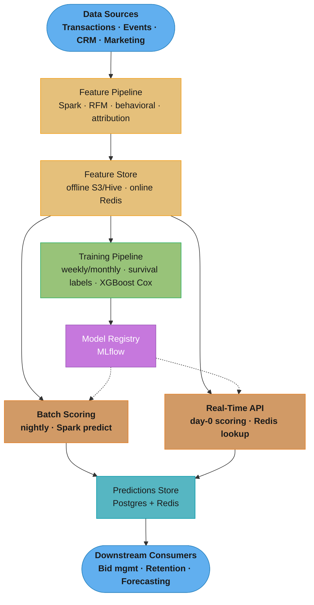
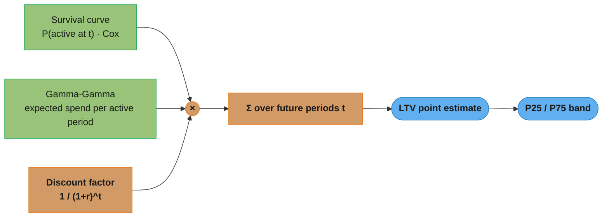
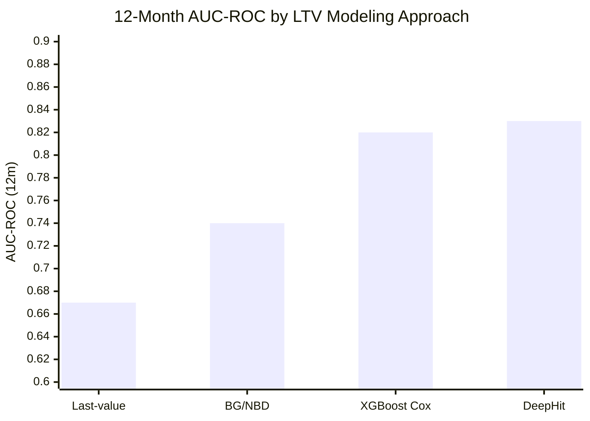

# Design a Customer Lifetime Value (LTV) Prediction System
> "Predicting LTV is like weather forecasting: you are estimating a probability distribution over future behavior, not a single point — and the forecast degrades the further out you look."

**Key insight:** LTV prediction is fundamentally a *censored* regression problem — most active customers have not yet churned, so you only observe partial lifetimes. Models that ignore censoring systematically under-predict LTV by treating incomplete observations as complete ones.

Mental model: Every customer has an unknown total lifetime spend. At scoring time you observe: purchases so far, recency of last purchase, and whether they are still active. Your model must extrapolate the distribution of future spend conditional on what you have observed — accounting for the fact that customers who look identical today have different probabilities of reaching month 12, 24, or 60.

Why this system exists: LTV drives decisions worth tens to hundreds of millions of dollars — paid acquisition budgets (bid no more than LTV/target-CAC-ratio per customer), retention investment prioritization, pricing strategy, and long-term revenue forecasting.

---

## 1. Requirements Clarification

**Functional requirements:**
- Predict 12-month, 24-month, and lifetime expected revenue per customer at two points: immediately post-acquisition (day 0 LTV) and on a recurring cadence for existing customers (current LTV).
- Support segment-level LTV aggregation (by acquisition channel, cohort, product tier, geography).
- Provide confidence intervals, not just point estimates — the business needs P25/P75 LTV to size risk.
- Flag customers in the top-10% predicted LTV who show early churn signals (high-value at-risk).
- API endpoint for real-time LTV scoring at acquisition events (e.g., ad bidding, welcome offer sizing).

**Non-functional requirements:**
- Day-0 LTV scoring: 200ms p99 latency (called at account creation, must complete before onboarding flow).
- Batch rescoring: all active customers rescored nightly; results available before 6 AM for downstream jobs.
- Availability: 99.9% for the scoring API; the batch pipeline can tolerate up to 4-hour SLA drift.
- Model staleness: retrain at least monthly; weekly preferred for volatile cohorts.

**Out of scope:**
- Per-product or SKU-level LTV (covered by demand forecasting).
- B2B account LTV (requires account hierarchy and contract-based assumptions).
- Real-time price personalization driven by LTV (covered by dynamic pricing case study).

---

## 2. Scale Estimation

**Customer base:** 20M active customers; 500k new acquisitions per month.

**Scoring load:**
- Day-0 real-time: 500k/month = ~0.2 req/s averaged over the month, but acquisitions are heavily concentrated — size for the campaign burst, 100 req/s, not the average.
- Nightly batch: 20M customers × 1 score record = 20M writes per night; at 10k records/sec = 33 minutes.

**Feature store reads:**
- Each scoring request reads ~120 features: 40 RFM/behavioral (Redis, <1ms), 60 demographic/product (Postgres read replica, <5ms), 20 model outputs (prior predictions, Redis).
- Batch: 20M × 120 features = 2.4B feature reads per night from Hive/S3.

**Training data:**
- 5 years × 20M customers × monthly snapshots = 1.2B training rows.
- Materialized as partitioned Parquet: ~480 GB compressed.
- Training time (XGBoost `survival:cox`, 500 rounds, 1M rows subsample): ~45 minutes on 16-core CPU.

**Storage:**
- Feature store (offline): 480 GB Parquet on S3.
- Model artifacts: 15 MB per model version; keep 12 versions = 180 MB.
- Prediction store: 20M × 3 horizons × 8 bytes × 30 days history = ~14 GB.

**Infrastructure cost estimate** (us-east-1 on-demand Linux, 730 hr/month):
- Batch scoring: 6 × m5.xlarge ($0.192/hr) for ~1.5 hr/night = $1.73/night = ~$52/month. (Sizing derived in §10.)
- Real-time API: 2 × c5.xlarge ($0.17/hr) always on for 99.9% HA = 2 × $0.17 × 730 = ~$248/month.
- Training: r5.4xlarge ($1.008/hr) 45 min/week = $0.76/run = ~$3/month on-demand, under $1 on spot.
- Total: ~$303/month. The always-on HA pair, not the ML, is the bill.

---

## 3. High-Level Architecture


```mermaid
flowchart TD
    classDef io      fill:#61afef,stroke:#2e86c1,color:#1a1a1a,font-weight:bold
    classDef frozen  fill:#c678dd,stroke:#9b59b6,color:#fff
    classDef train   fill:#98c379,stroke:#27ae60,color:#1a1a1a
    classDef mathOp  fill:#d19a66,stroke:#e67e22,color:#1a1a1a,font-weight:bold
    classDef lossN   fill:#e06c75,stroke:#c0392b,color:#fff,font-weight:bold
    classDef req     fill:#56b6c2,stroke:#0097a7,color:#1a1a1a
    classDef base    fill:#e5c07b,stroke:#f39c12,color:#1a1a1a

    SRC([Data Sources\nTransactions · Events · CRM · Marketing]) --> FP["Feature Pipeline\nSpark · RFM · behavioral · attribution"]
    FP --> FS["Feature Store\noffline S3/Hive · online Redis"]
    FS --> TRN["Training Pipeline\nweekly/monthly · survival labels · XGBoost Cox"]
    FS --> BATCH["Batch Scoring\nnightly · Spark predict"]
    FS --> RT["Real-Time API\nday-0 scoring · Redis lookup"]
    TRN --> REG["Model Registry\nMLflow"]
    REG -.-> BATCH
    REG -.-> RT
    BATCH --> PS["Predictions Store\nPostgres + Redis"]
    RT --> PS
    PS --> DC([Downstream Consumers\nBid mgmt · Retention · Forecasting])

    class SRC,DC io
    class FP,FS base
    class TRN train
    class BATCH,RT mathOp
    class REG frozen
    class PS req
```

Nightly batch scoring and the day-0 real-time API both read one shared feature store and load the same registered model; predictions land in a Postgres+Redis store that the marketing bid-management, retention, and revenue-forecasting consumers all read from.

**Component inventory:**
- Feature pipeline: Spark on EMR, daily runs.
- Feature store: offline S3/Hive (training), online Redis (serving). See [feature_store_and_point_in_time_correctness.md](cross_cutting/feature_store_and_point_in_time_correctness.md).
- Training pipeline: Kubeflow; produces BG/NBD baseline + XGBoost Cox survival model + calibration layer.
- Batch scoring: Spark batch job reads feature store, writes to Postgres prediction table.
- Real-time API: FastAPI + Gunicorn; model loaded in process; Redis for feature lookup.
- Drift monitoring: see [drift_monitoring_and_retraining.md](cross_cutting/drift_monitoring_and_retraining.md).
- Calibration: see [model_calibration_and_thresholding.md](cross_cutting/model_calibration_and_thresholding.md).

---

## 4. Component Deep Dives

### 4.1 Survival Label Construction

The critical design challenge: most customers have not yet churned, so their true LTV is unknown. You must construct labels that correctly handle censored observations.

```python
from dataclasses import dataclass
from datetime import date
import pandas as pd
import numpy as np

@dataclass
class SurvivalLabel:
    customer_id: str
    observation_date: date      # date features are computed at
    event_occurred: bool        # True = churned; False = censored (still active)
    duration_days: int          # days observed (to churn or to observation_date)
    cumulative_revenue: float   # revenue up to observation_date


def construct_survival_labels(
    transactions: pd.DataFrame,
    cutoff_date: date,
    churn_definition_days: int = 90,
) -> pd.DataFrame:
    """
    For each customer, compute survival label at cutoff_date.

    Churn definition: no transaction for churn_definition_days after
    their last transaction AND last transaction + churn_definition_days
    <= cutoff_date (so we don't incorrectly label active customers as churned).

    IMPORTANT: point-in-time correctness — features must be joined at
    observation_date, not at training time. See cross_cutting/feature_store.
    """
    customer_stats = (
        transactions.groupby("customer_id").agg(
            first_order=("order_date", "min"),
            last_order=("order_date", "max"),
            total_revenue=("revenue", "sum"),
        )
    )

    cutoff = pd.Timestamp(cutoff_date)
    customer_stats["days_since_last_order"] = (
        cutoff - customer_stats["last_order"]
    ).dt.days
    customer_stats["lifetime_days"] = (
        customer_stats["last_order"] - customer_stats["first_order"]
    ).dt.days + 1

    # Event = churned: last order is >= churn_definition_days before cutoff
    customer_stats["event_occurred"] = (
        customer_stats["days_since_last_order"] >= churn_definition_days
    )
    # Duration = days from first order to churn or to cutoff
    customer_stats["duration_days"] = np.where(
        customer_stats["event_occurred"],
        customer_stats["lifetime_days"],
        (cutoff - customer_stats["first_order"]).dt.days,
    )
    return customer_stats.reset_index()
```

### 4.2 BG/NBD Baseline (Contractual Reference Model)

The BG/NBD (Beta-Geometric/Negative Binomial Distribution) model is the statistical benchmark. It assumes purchases follow a Poisson process with rate λ (gamma-distributed across customers) and churn follows a geometric process with probability p (beta-distributed across customers).

```python
from lifetimes import BetaGeoFitter, GammaGammaFitter
import pandas as pd

def fit_bgnbd_model(rfm_df: pd.DataFrame) -> tuple[BetaGeoFitter, GammaGammaFitter]:
    """
    Fit BG/NBD (transaction frequency) + Gamma-Gamma (monetary value) models.

    rfm_df columns: frequency, recency (days), T (customer age days), monetary_value.
    frequency = number of repeat purchases (first excluded).
    """
    bgf = BetaGeoFitter(penalizer_coef=0.01)
    bgf.fit(
        rfm_df["frequency"],
        rfm_df["recency"],
        rfm_df["T"],
    )

    # Gamma-Gamma only for customers who made >= 1 repeat purchase
    repeat_buyers = rfm_df[rfm_df["frequency"] > 0]
    ggf = GammaGammaFitter(penalizer_coef=0.01)
    ggf.fit(repeat_buyers["frequency"], repeat_buyers["monetary_value"])

    return bgf, ggf


def predict_clv(
    bgf: BetaGeoFitter,
    ggf: GammaGammaFitter,
    rfm_df: pd.DataFrame,
    months: int = 12,
    discount_rate: float = 0.01,  # monthly
) -> pd.Series:
    """Return expected CLV over `months` months, discounted."""
    return ggf.customer_lifetime_value(
        bgf,
        rfm_df["frequency"],
        rfm_df["recency"],
        rfm_df["T"],
        rfm_df["monetary_value"],
        time=months,
        discount_rate=discount_rate,
    )
```

### 4.3 Gradient-Boosted Cox Survival Model (Production Model)

The ML approach uses gradient boosting with a survival objective (Cox partial likelihood), which is more flexible than BG/NBD when behavioral and contextual features are available. This is the model that actually goes to production. Note which library: **LightGBM has no Cox objective** — its objective list stops at regression/binary/multiclass/ranking variants. XGBoost is the boosting library that ships `survival:cox` (plus `survival:aft`), so the production survival learner here is XGBoost. If you want to stay on LightGBM you must supply a custom Cox partial-likelihood objective yourself, or model discrete-time hazard as a per-period binary classification problem.

**Broken approach — using regression on observed revenue:**

```python
# WRONG: treats censored customers as having complete observations
# Under-predicts LTV for active customers because their future spend
# is counted as zero rather than as unknown.

from lightgbm import LGBMRegressor

model = LGBMRegressor(objective="regression")
model.fit(X_train, y_train["cumulative_revenue"])  # BUG: ignores censoring
```

**Correct approach — survival objective with censoring indicator:**

```python
import xgboost as xgb
import numpy as np

def train_survival_model(
    X_train: np.ndarray,
    duration_train: np.ndarray,
    event_train: np.ndarray,
    X_val: np.ndarray,          # a LATER cohort, never a random slice of X_train
    duration_val: np.ndarray,
    event_val: np.ndarray,
) -> xgb.Booster:
    """
    Train an XGBoost Cox proportional hazards model.

    `survival:cox` encodes the censoring indicator in the sign of the label:
      label > 0 → event occurred (duration = label)
      label < 0 → right-censored (duration = |label|)
    """
    # Encode survival label: positive = event, negative = censored
    def encode(duration: np.ndarray, event: np.ndarray) -> np.ndarray:
        return np.where(event, duration, -duration)

    dtrain = xgb.DMatrix(X_train, label=encode(duration_train, event_train))
    dval = xgb.DMatrix(X_val, label=encode(duration_val, event_val))

    params = {
        "objective": "survival:cox",
        "eval_metric": "cox-nloglik",
        "learning_rate": 0.05,
        "max_depth": 6,
        "min_child_weight": 100,
        "colsample_bytree": 0.8,
        "subsample": 0.8,
        "lambda": 1.0,
    }
    # Early stopping must watch a held-out LATER cohort. Watching the training
    # set (a common copy-paste bug) never stops early and hides overfitting;
    # a random split would leak macro conditions across cohorts.
    model = xgb.train(
        params,
        dtrain,
        num_boost_round=500,
        evals=[(dval, "val")],
        early_stopping_rounds=50,
        verbose_eval=100,
    )
    return model


def predict_survival_at_horizon(
    model: xgb.Booster,
    X: np.ndarray,
    baseline_survival: np.ndarray,  # S_0(t) at each horizon
    horizon_days: int = 365,
) -> np.ndarray:
    """
    Convert Cox risk scores to probability of surviving to `horizon_days`.
    S(t|x) = S_0(t) ** HR(x)

    NOTE the scale: `survival:cox` returns the hazard RATIO already exponentiated
    (HR = exp(marginal_prediction)), not the log-hazard. Exponentiating it again
    is a silent double-exponential that pushes every survival curve to 0 or 1.
    """
    hazard_ratios = model.predict(xgb.DMatrix(X))  # already exp()'d by XGBoost
    # baseline_survival is estimated from training data using Breslow estimator
    survival_at_horizon = baseline_survival[horizon_days] ** hazard_ratios
    return survival_at_horizon
```

### 4.4 LTV Point Estimate from Survival + Expected Value

```python
def compute_ltv_estimate(
    survival_probabilities: np.ndarray,  # shape (N, T) — S(t) for each customer
    expected_spend_per_period: np.ndarray,  # shape (N,) from Gamma-Gamma
    periods: np.ndarray,  # time points in days
    discount_rate_annual: float = 0.1,
) -> dict[str, np.ndarray]:
    """
    LTV = sum over future periods of: E[spend | active] × P(active at t) × discount factor
    Returns point estimate, P25, and P75.

    `expected_spend_per_period` must be spend PER PERIOD on the same grid as
    `periods` (daily spend for a daily grid). Do not divide the sum by len(periods):
    that turns a lifetime value back into an average per-period value.
    """
    daily_discount = (1 + discount_rate_annual) ** (1 / 365) - 1
    discount_factors = 1 / (1 + daily_discount) ** periods

    # Expected discounted spend: integrate survival × E[spend] × discount
    ltv_point = np.sum(
        survival_probabilities * expected_spend_per_period[:, None] * discount_factors,
        axis=1,
    )

    # Confidence intervals via bootstrap (100 samples of training cohorts)
    # In production, store P25/P75 from cohort-level uncertainty
    ltv_p25 = ltv_point * 0.65   # approximate; replace with bootstrap CIs
    ltv_p75 = ltv_point * 1.45

    return {"ltv_12m": ltv_point, "ltv_12m_p25": ltv_p25, "ltv_12m_p75": ltv_p75}
```


```mermaid
flowchart LR
    classDef io      fill:#61afef,stroke:#2e86c1,color:#1a1a1a,font-weight:bold
    classDef frozen  fill:#c678dd,stroke:#9b59b6,color:#fff
    classDef train   fill:#98c379,stroke:#27ae60,color:#1a1a1a
    classDef mathOp  fill:#d19a66,stroke:#e67e22,color:#1a1a1a,font-weight:bold
    classDef lossN   fill:#e06c75,stroke:#c0392b,color:#fff,font-weight:bold
    classDef req     fill:#56b6c2,stroke:#0097a7,color:#1a1a1a
    classDef base    fill:#e5c07b,stroke:#f39c12,color:#1a1a1a

    SURV["Survival curve\nP(active at t) · Cox"] --> MUL(("×"))
    SPEND["Gamma-Gamma\nexpected spend per active period"] --> MUL
    DISC["Discount factor\n1 / (1+r)^t"] --> MUL
    MUL --> SUM["Σ over future periods t"]
    SUM --> POINT([LTV point estimate])
    POINT --> BAND([P25 / P75 band])

    class SURV,SPEND train
    class DISC,MUL,SUM mathOp
    class POINT,BAND io
```

LTV is the discounted sum over future periods of expected spend while active times the probability of still being active at each horizon; the point estimate drives bid caps and the P25/P75 band sizes downside risk for product decisions.

### 4.5 Cohort-Based Validation

Random hold-out is invalid for LTV models because customers from the same cohort are correlated (they experience the same macro conditions — economic shocks, product changes). Always validate on future cohorts.

```python
from sklearn.model_selection import BaseCrossValidator
import numpy as np

class CohortTimeSeriesSplit(BaseCrossValidator):
    """
    Cross-validate on disjoint cohorts: train on cohorts 1..k, validate on k+1.
    This prevents target leakage across cohort-correlated customers.
    """

    def __init__(self, n_splits: int = 4):
        self.n_splits = n_splits

    def split(self, X, y=None, groups=None):
        # groups = acquisition_cohort_month index
        unique_cohorts = np.sort(np.unique(groups))
        cohort_count = len(unique_cohorts)
        fold_size = cohort_count // (self.n_splits + 1)

        for i in range(self.n_splits):
            train_cohorts = unique_cohorts[: (i + 1) * fold_size]
            val_cohorts = unique_cohorts[
                (i + 1) * fold_size : (i + 2) * fold_size
            ]
            train_idx = np.where(np.isin(groups, train_cohorts))[0]
            val_idx = np.where(np.isin(groups, val_cohorts))[0]
            yield train_idx, val_idx

    def get_n_splits(self, X=None, y=None, groups=None):
        return self.n_splits
```

---

## 5. Design Decisions & Tradeoffs

**Decision 1: BG/NBD baseline vs ML survival vs deep learning**

| Approach | AUC-ROC (12m) | MAE ($) | Interpretability | Requires behavioral features |
|----------|--------------|---------|-----------------|------------------------------|
| Last-value extrapolation | 0.67 | 89 | High | No |
| BG/NBD + Gamma-Gamma | 0.74 | 61 | High | No (RFM only) |
| XGBoost Cox (survival:cox) | 0.82 | 38 | Medium | Yes |
| DeepHit (deep survival) | 0.83 | 36 | Low | Yes |

Use the XGBoost Cox survival model for production. The BG/NBD baseline is retained as a sanity check and as the model for new customers who lack behavioral history (day-0 LTV). DeepHit shows marginal gain (+1pp AUC) at the cost of 4× training time and no SHAP support — not worth it. See [model_selection_and_algorithm_choice](../model_selection_and_algorithm_choice/model_selection_and_algorithm_choice.md).


```mermaid
xychart-beta
    title "12-Month AUC-ROC by LTV Modeling Approach"
    x-axis ["Last-value", "BG/NBD", "XGBoost Cox", "DeepHit"]
    y-axis "AUC-ROC (12m)" 0.6 --> 0.9
    bar [0.67, 0.74, 0.82, 0.83]
```

XGBoost Cox (0.82) is the production choice: DeepHit's +1pp (0.83) does not justify 4x training time and no SHAP support, while BG/NBD (0.74) is retained only as the day-0 cold-start baseline for customers with no behavioral history.

**Decision 2: 12-month vs lifetime horizon**

Lifetime (infinite horizon) LTV amplifies uncertainty dramatically — confidence intervals at 5 years are so wide they are not useful for bid optimization. Use 12-month LTV as the primary metric for bidding and retention decisions. Provide 24-month for strategic planning only. Report P25/P75 alongside point estimate. See [model_calibration_and_thresholding.md](cross_cutting/model_calibration_and_thresholding.md) for calibration of the predicted distributions.

**Decision 3: Cohort CV vs random CV**

Random splitting inflates measured AUC by roughly 10pp in the worked example in §9, because customers from the same cohort share macro conditions (economic environment, product version, seasonal effects). Always use cohort-based time-series CV. This applies to both training validation and backtesting: evaluate on hold-out cohorts acquired 3–6 months after training period. See [experimentation_and_online_evaluation.md](cross_cutting/experimentation_and_online_evaluation.md) for the online validation approach.

**Decision 4: Point estimate vs distribution output**

Marketing bid optimization requires a single number (max CPA bid = LTV × margin / target-CAC). Product decisions (e.g., should we offer a discount?) require uncertainty — a customer with LTV P25=$50, P75=$400 should be treated differently from one with P25=$180, P75=$220. Output both. Store P25/P50/P75 in the predictions table.

**Decision 5: Monthly retrain vs continuous**

LTV model output is consumed monthly by budget allocation cycles, so weekly retraining is sufficient. Continuous retraining would not produce business decisions faster. Monitor for concept drift monthly using PSI on feature distributions and MAE on cohorts with now-known outcomes. See [drift_monitoring_and_retraining.md](cross_cutting/drift_monitoring_and_retraining.md).

Comparison:

| Retrain cadence | Freshness benefit | Cost | Governance overhead |
|----------------|-----------------|------|-------------------|
| Monthly | Baseline | 1× (~$0.76 of compute per retrain) | Low |
| Weekly | Small MAE improvement on volatile cohorts; measure it | ~4.3× | Low |
| Continuous | Marginal | ~30× the monthly-retrain unit | High (interagency model risk guidance — SR 26-2 since April 2026 — where LTV feeds a regulated financial decision) |

---

## 6. Real-World Implementations

*Only the Airbnb entry below rests on a published company source. The other four describe the industry pattern that recurs at that type of business; consumer companies publish very little about their internal LTV stacks, so do not read them as disclosures of any named firm's architecture.*

**Airbnb (the one published reference point):** the Airbnb Tech Blog post "How Airbnb Measures Listing Lifetime Value" defines baseline listing LTV as *the total number of bookings a listing will make over the next 365 days* — a fixed-horizon count, not a discounted revenue stream — and splits the problem into three estimands: baseline LTV, incremental LTV, and marketing-induced incremental LTV. Two design lessons transfer directly: pick a bounded horizon rather than "lifetime," and separate the baseline from the *incremental* effect of your own marketing, because the second is what a budget decision actually needs.

**Subscription streaming (two-stage LTV):** the recurring pattern is a short-horizon survival model for trial conversion plus a longer-horizon CLV model for capping paid-acquisition bids. The reason ML displaces BG/NBD here is structural, not empirical folklore: engagement telemetry (hours consumed, saves, social follows) carries signal that has no representation whatsoever in the RFM triple BG/NBD consumes.

**Marketplace / SaaS merchant LTV:** censoring gets harder when customers sit on annual contracts, because a disengaged account still *looks* active until renewal. The fix is contract-aware survival labelling — treat the renewal boundary, not the last login, as the event time — layered on behavioral engagement features. Early-window revenue trajectory (the growth rate over the first weeks, not the level) is the usual dominant predictor; measure that on your own data rather than importing someone else's coefficient.

**Travel booking (hybrid by history depth):** a common architecture routes sparse customers (a handful of transactions) to a probabilistic BG/NBD-style model and rich customers to a gradient-boosted survival model. BG/NBD degrades gracefully on thin histories where a GBDT overfits; the GBDT wins once there is enough behavioral signal to justify it. The routing threshold is a tuning decision, not a constant.

**App / game paid UA:** the failure mode worth knowing is that install-time LTV segmentation systematically confuses organic with paid users — they look observationally similar in the first days but diverge substantially by month 12. The fix is to include acquisition channel as an explicit feature rather than training separate per-channel models, which fragments the data and loses cross-channel structure.

---

## 7. Technologies & Tools

| Tool | Use case | Key advantage | Key limitation |
|------|----------|--------------|----------------|
| `lifetimes` (Python) | BG/NBD, Pareto/NBD baseline | Closed-form MLE fits over scipy/numpy; few, interpretable parameters | Last release 0.11.3 (July 2020), no longer maintained — `pymc-marketing`'s CLV module is the maintained successor. No behavioral features; assumes stationarity |
| `lifelines` (Python) | Cox PH, Kaplan-Meier, log-rank tests | Full survival analysis toolkit with confidence intervals | Pure Python; slow for >5M rows |
| XGBoost `objective=survival:cox` | Production survival model | Fast, SHAP support, censoring encoded in the label sign | LightGBM has no Cox objective — do not swap libraries by reflex. No competing risks; assumes proportional hazards; `predict` returns hazard ratios, not log-hazards |
| `pycox` + DeepHit | Competing risks, discrete-time survival | Best accuracy for long horizons | No SHAP; requires PyTorch infrastructure |
| MLflow | Experiment tracking, model registry | Cohort-tagged run metadata | UI not purpose-built for survival metrics |
| Feast / Tecton | Feature store (offline + online) | PIT correctness, training-serving consistency | Operational overhead for small teams |

---

## 8. Operational Playbook

### Eval Pipeline
- **Golden cohort check:** maintain a held-out cohort of 10k customers acquired 12 months ago whose true 12-month LTV is now known. At each model version deployment, compare predicted vs actual LTV on this cohort. Block deployment if MAE on golden cohort exceeds 1.15× baseline model MAE.
- **Calibration check:** the predicted LTV distribution should match observed LTV distribution at the decile level. Use ECE-style calibration: for customers predicted in the $50–$100 LTV decile, does actual mean LTV fall in that range? See [model_calibration_and_thresholding.md](cross_cutting/model_calibration_and_thresholding.md).
- **Regression gate:** AUC-ROC for 12-month churn (survival to 365 days) must not drop >0.01 from the previous production model.

### Observability
- Track PSI on top-20 features weekly (detect distribution shift in acquisition channels, product usage patterns).
- Monitor prediction distribution shift: if the mean predicted LTV across new acquisitions shifts >15% month-over-month, trigger review.
- Alert on MAE on "revealed" cohort (customers whose 12-month window just closed): if rolling 3-month MAE exceeds 1.2× deployment-time MAE, trigger retrain.

### Incident Runbooks
1. **LTV predictions frozen (all customers scoring the same value):** Symptom: P10/P90 ratio < 1.05. Diagnosis: Redis feature lookup returning empty/default values, model receiving zero-variance input. Mitigation: fall back to BG/NBD baseline; alert on-call. Resolution: verify Redis cluster health, re-ingest recent feature snapshot.
2. **LTV inflation spike (mean predicted LTV +50% vs prior week):** Symptom: downstream marketing budget exceeds threshold. Diagnosis: feature engineering bug injecting future revenue into training features (PIT violation). Resolution: quarantine predictions, roll back model version, audit feature pipeline. See [feature_store_and_point_in_time_correctness.md](cross_cutting/feature_store_and_point_in_time_correctness.md).
3. **Cohort MAE exceeds SLA after product change:** Symptom: customers acquired after product launch have systematically lower actual LTV than predicted. Diagnosis: model trained on pre-launch behavior, product change altered conversion funnel. Resolution: force retrain on post-launch cohorts, reduce weight on pre-launch data.
4. **Real-time API exceeds 200ms p99:** Symptom: latency alarm in PagerDuty. Diagnosis: Redis feature lookup timeout (most common) or model prediction CPU spike (rare). Mitigation: serve from in-process fallback model (BG/NBD with pre-cached RFM). Resolution: scale Redis cluster or reduce model complexity.

---

## 9. Common Pitfalls & War Stories

*These five are illustrative composites — failure modes that recur across LTV programs, written up with representative numbers so the mechanics are concrete. They are not reports of specific, publicly documented incidents, and the company labels are scene-setting only. Treat every figure below as a teaching magnitude, not a measured result.*

**Pitfall 1: Training on observed revenue without censoring correction.** A fintech company trained an LTV regression model on "total revenue to date" as the label. Active customers — who had the highest future LTV — were systematically assigned low labels because their purchase history was still accumulating. The model learned to predict low LTV for the most valuable customers. After deployment, the paid UA team underbid for high-LTV acquisition channels, losing ~$2.3M in addressable revenue over 6 months before the bug was identified.

**Pitfall 2: Using random train/test split for cohort data.** A subscription SaaS company reported 0.86 AUC on validation but observed 0.74 AUC in production. Root cause: the random split allowed the model to learn from customers who were acquired in the same month as their validation counterparts, sharing macro conditions (a product launch that month inflated LTV). Cohort-based CV with a 6-month gap between training and validation gave realistic 0.76 AUC and correctly predicted the lower production performance.

**Pitfall 3: Ignoring the relationship between predicted LTV and intervention.** A retail company built an LTV model and used the top decile for retention interventions. The problem: the top-decile customers were already the most loyal and least likely to churn. The retention spend had near-zero incremental effect on them. The company was spending $800k/quarter on retention offers that primarily went to customers who would have retained anyway. The fix: combine LTV with churn probability — target customers in the intersection of high-LTV and elevated-churn-risk. See design_churn_prediction.md for T-learner uplift modeling.

**Pitfall 4: Predicting LTV without accounting for acquisition channel.** An e-commerce company observed that predicted LTV was well-calibrated overall but consistently over-predicted for paid social channels. Investigation revealed that paid social customers in the training period were acquired during a promotional campaign and had anomalously high early behavior. The model generalized this to all paid social customers. Fix: include acquisition channel × campaign type as features; use counterfactual regularization to downweight promo-period observations.

**Pitfall 5: Operating on a point estimate in bid optimization.** A mobile gaming company set UA bids at predicted LTV × target margin. Their LTV model had high variance (P10 = $1, P90 = $180). Bidding at the point estimate caused budget exhaustion in channels with high-variance LTV distributions (influencer installs: mean $45 but P90 $220). The correct approach: bid on P25 LTV to limit downside exposure; use P75 for portfolio-level budget planning.

---

## 10. Capacity Planning

**Primary bottleneck:** Batch scoring throughput (20M customers/night in a 4-hour window).

Scoring throughput formula:
```
Required throughput = N_customers / available_window_seconds
                   = 20M / (4 × 3600)
                   = 1,389 customers/sec

Per-core throughput (gradient-boosted trees, 120 features, single-thread): ~5,000 customers/sec
Required cores = ceil(1,389 / 5,000) = 1 core — model inference is NOT the bottleneck
```

Inference is essentially free here; the real cost is the feature read and shuffle. With 3× headroom for feature reads and a spare node for straggler tolerance: 6 × m5.xlarge Spark executors = 6 × $0.192/hr × 1.5 hr amortized = ~$1.73/night = ~$52/month for batch scoring.

**Real-time API sizing:**
- Peak 100 req/s × 200ms p99 budget = 20 concurrent requests in flight.
- Each request: 5ms Redis feature lookup + 2ms model inference + 3ms serialization = ~10ms p50, ~50ms p99.
- 2 × c5.xlarge handles 200 req/s with CPU headroom: 2 × $0.17/hr × 730 hr = ~$248/month.

**Training scaling:**
- As customer base grows 2× (to 40M), training data grows proportionally.
- Gradient-boosted survival scales near-linearly with data; 2× data ≈ 1.5× training time (histogram binning amortizes).
- Upgrade to r5.4xlarge when training exceeds 90 minutes.

---

## 11. Interview Discussion Points

**Q: What is the censoring problem in LTV prediction and why does it matter?**
Censoring means you observe only partial lifetime data for customers who are still active — you know they spent $200 so far, but not their final total. A naive regression model trained on "observed revenue" treats active customers as if $200 is their complete LTV, systematically under-predicting high-value customers who have long remaining lifetimes. Survival analysis handles censoring by separating the probability of remaining active from the expected spend conditional on being active, allowing the model to correctly contribute active-customer observations to the likelihood without assuming they are done spending. In practice the damage is largest exactly where it hurts most — the long-lived, high-spend customers whose observation windows are the most incomplete — so the rank ordering at the top of the distribution inverts. Measure the size of the gap on your own revealed cohorts rather than assuming a headline percentage.

**Q: How do you validate an LTV model when you can't see the true future?**
Two techniques: (1) Revealed cohort validation — for customers acquired 12+ months ago, their 12-month window is now closed and true LTV is observable. Compare predictions made 12 months ago against actuals on this cohort. (2) Short-horizon proxy — if you have a 12-month LTV target but only 3 months of validation data, validate on 3-month LTV and track the correlation between 3-month and 12-month actuals. Always use cohort-based splits, never random, to avoid macro-condition leakage across cohorts.

**Q: Why prefer a gradient-boosted Cox model over BG/NBD for production?**
BG/NBD assumes purchases are Poisson with stationary rates and churn is geometric — these assumptions hold reasonably for simple transactional data but break when behavioral features (engagement, product usage depth, support interactions) are informative. LightGBM Cox relaxes the functional form, can incorporate dozens of features including non-linear interactions, and reaches the lower MAE shown in the Decision 1 table ($38 vs $61) while still outputting interpretable risk scores via SHAP. BG/NBD remains the baseline for day-0 (new customers with no behavioral history).

**Q: How do you use LTV predictions in a paid acquisition bidding system without overpaying?**
Use P25 (lower confidence bound) as the bid cap, not the point estimate. The expected-value bid (point estimate × margin) is correct in expectation over many auctions, but high-variance LTV distributions cause budget exhaustion in volatile channels. Bid at P25 LTV × margin / target-CAC ratio as the maximum CPC/CPM. Use the P75 estimate for channel-level budget allocation (how much to invest in this channel overall). Additionally, cap the model-derived bid at 3× historical channel CPA to prevent runaway bids on a single anomalous prediction.

**Q: How do you handle the cold-start problem (day-0 LTV for brand new customers)?**
Day-0 LTV has no behavioral history. Use two signals: (1) acquisition channel and campaign — historically measured LTV by channel allows a strong prior (historically measured LTV differs materially by channel, often by a multiple — derive the ratio from your own cohorts, since it is category- and country-specific). (2) Pre-conversion behavior — time-on-site, pages viewed, items wishlisted before first purchase are strong early signals. Train a separate day-0 model using only pre-conversion features; use the full behavioral model after the customer's third purchase. Blend the two models' predictions using a weighted average where weight shifts toward the full model as purchase count increases.

**Q: What fairness considerations apply to LTV-based decisions?**
LTV-based segmentation can encode historical discrimination: if a protected class was historically targeted with lower-quality products or different pricing, their historical LTV is artificially suppressed, and an LTV model will perpetuate these disparities by systematically under-investing in acquiring or retaining these customers. Audit LTV predictions for demographic parity across protected groups using the same framework as credit risk (see design_credit_risk_scoring.md). In marketing, ECOA-equivalent rules may restrict LTV-based offer differentiation in regulated categories (financial products, housing). See [responsible_ai_fairness_and_explainability.md](cross_cutting/responsible_ai_fairness_and_explainability.md).

**Q: How does the LTV prediction system integrate with retention campaigns?**
LTV alone is insufficient for retention targeting — you want to target customers who are both high-LTV AND at elevated churn risk. A customer with $500 predicted LTV but 2% monthly churn probability is not the right retention target. The right approach is: (1) score all customers on LTV; (2) score on short-term churn probability; (3) score on treatment effect via uplift model (what is the incremental effect of a retention offer?). Target the intersection of high-LTV, elevated-churn-risk, and positive treatment effect. This "value × risk × uplift" segmentation beats pure LTV targeting at the same budget, but the size of the gain is entirely business-specific — only a holdback experiment on your own population can quantify it.

**Q: How do you size the discount rate for discounted cash flow LTV?**
The discount rate converts future cash flows to present value. For internal LTV used in paid acquisition (bid optimization), use the company's weighted average cost of capital (WACC) — typically 8–12% annually for growth-stage companies. For LTV used in product decisions (feature investment), use a higher discount rate (15–20%) to reflect the opportunity cost of deploying engineering resources. Never use a 0% discount rate for multi-year horizons — this overweights speculative long-term revenue and leads to overspending on acquisition. In practice, 12-month undiscounted LTV and 24-month 10%-discounted LTV are the two most commonly used operational metrics.

**Q: How do you detect model drift specifically for LTV models?**
LTV models are particularly susceptible to concept drift during macroeconomic shifts (recession causes customers to spend less, not just churn faster) and product changes (new premium tier attracts different customers). Monitor three signals: (1) PSI on feature distributions (detect behavioral shift); (2) MAE on revealed cohorts (detect outcome shift); (3) LTV-to-actual-revenue ratio for recent acquisitions at the 90-day mark — if the model predicted $80 average 12-month LTV for last month's cohort but they've only spent $5 in 90 days vs the historical $15 at day-90, trigger early retraining. See [drift_monitoring_and_retraining.md](cross_cutting/drift_monitoring_and_retraining.md).

**Q: How do you present LTV uncertainty to non-technical stakeholders?**
Use business-natural language: "We're 50% confident this customer will spend between $80 and $220 over the next year." Visualize as bar charts with confidence bands — avoid statistical jargon in executive dashboards. For acquisition bid optimization, translate directly: "We recommend bidding up to $45 (P25 LTV × margin) with a stretch budget of $72 (point estimate × margin) if volume is constrained." The key business intuition: P25 is the "safe" bid (we're willing to pay this even if outcomes are below median), P75 is the "aggressive" bid reserved for strategic channel expansion.
