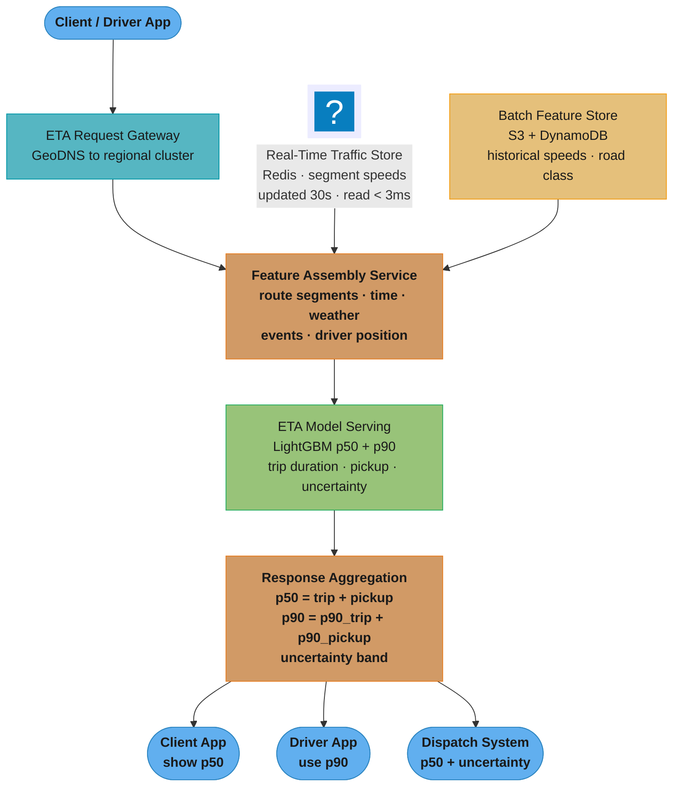
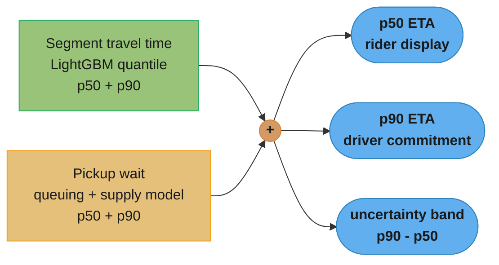
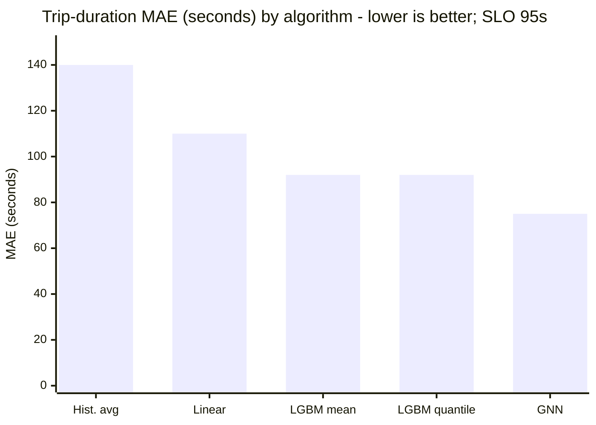

# Design an ETA Prediction System

## Intuition

> An ETA prediction system is like a professional navigator in an unfamiliar city: good enough to get you there, but the real skill is communicating honest uncertainty — "probably 12 minutes, but could be 18 if the game just ended."

**Key insight:** ETA is a regression problem at its core, but naive RMSE optimization produces the wrong model for a marketplace. Riders cancel more when ETA is *longer than expected* than when it is longer in absolute terms. Drivers are evaluated on their ability to meet the ETA they were given. The system must produce p50 (median) estimates for display, p90 (conservative) estimates for driver commitment, and accurate uncertainty bounds for decision-making. This requires quantile regression, not simple mean regression.

Mental model: decompose ETA into three sub-problems — each with a different algorithm: (1) segment-level travel time estimation (historical + real-time: GBDT + graph features); (2) pickup wait time (queuing model + supply forecasting: statistical); (3) uncertainty quantification (quantile regression on residuals: LightGBM with asymmetric loss). The final ETA is a combination of all three, assembled at request time.

---

## 1. Requirements Clarification

**Functional requirements:**
- Predict end-to-end ETA: time from now until the rider reaches their destination.
- Sub-components: pickup ETA (driver → rider) + trip duration (rider → destination).
- Inputs: origin coordinates, destination coordinates, current time, driver GPS position, live traffic data.
- Output: p50 ETA (displayed to rider), p90 ETA (driver commitment), uncertainty range (for rider expectation setting).
- Real-time updates: recalculate ETA every 15 seconds during active trips; update rider app.

**Non-functional requirements:**
- Latency: p99 < 150ms for ETA request (including feature fetch); p99 < 50ms for model inference alone.
- Throughput: 200k ETA requests/second during peak (major city, rush hour, concurrent events).
- Accuracy: mean absolute error (MAE) ≤ 95 seconds on trip duration; coverage of p90 interval ≥ 88% (p90 must contain actual ETA at least 88% of the time).
- Geographic coverage: 50 cities globally; cross-city model (shared parameters) with city-specific fine-tuning.
- Freshness: real-time traffic features must be < 2 minutes stale for traffic-sensitive routes.

**Out of scope:**
- Route optimization (which path to take): separate routing service.
- Driver dispatch (which driver to assign): matching system consumes ETA as input.
- Surge pricing: separate model, but consumes ETA predictions.

---

## 2. Scale Estimation

**Request volume:** 200k req/s peak across 50 cities = 4k req/s per city average. During city events: up to 20k req/s for a single city.

**Active trips at peak:** 10M trips/day with an average trip duration of ~20 minutes means concurrency, not daily volume, drives the update load. At peak (≈10% of the day's trips in one hour) that is 1M trips/hour × 20/60 h = **~330k concurrent trips**, each refreshed every 15 s → **~22k update requests/second**. These must be batched (not individual API calls). Note the arithmetic trap: multiplying *daily* trips by the update rate would give 667k/s and over-provision the fleet ~30x.

**Historical training data:** 3 years × 365 days × 10M trips/day ≈ 11B trips. Sampled to 500M for training (stratified by city, time-of-day, day-of-week, weather condition).

**Real-time features:** road segment speeds from GPS probe data. Global road network: ~50M road segments. Each segment's speed updated every 30 seconds = 1.67M segment updates/second globally → requires a streaming aggregation layer (Flink/Kafka Streams).

**Model size:** LightGBM ensemble (p50 + p90 models): ~200MB combined. Loaded into memory on serving nodes — no disk I/O at request time.

**Serving infrastructure:** size on **CPU service time**, not on p99 wall-clock latency — the two differ by 5x here and confusing them is the classic capacity-planning error.
- Per request the service burns ~10 ms of CPU (feature assembly + two LightGBM inferences); the 50 ms figure is p99 *wall clock*, which includes Redis wait and queueing.
- 200k req/s × 10 ms CPU = **2,000 CPU-core-equivalents** at theoretical 100% utilisation.
- Provision at ~50% core utilisation so the tail does not queue: 4,000 cores → at 32 cores/server, **~125 servers** globally.
- With horizontal autoscaling: 125 baseline + 50 for peak headroom = ~175 servers at peak.

---

## 3. High-Level Architecture



*Feature assembly fuses a real-time traffic path (Redis, 30s-fresh) with a batch historical path (S3/DynamoDB); the quantile model then emits p50 and p90, and aggregation fans the same prediction out to three consumers that each read a different quantile.*

**Data flow:** client request → feature assembly (route segments + real-time traffic + batch features) → LightGBM inference (p50, p90 per segment) → aggregation → response.

---

## 4. Component Deep Dives

### 4.1 Feature Engineering for Road Segments

```python
import numpy as np
import pandas as pd
from dataclasses import dataclass
from datetime import datetime

@dataclass
class SegmentFeatures:
    segment_id: str
    distance_km: float
    road_class: int            # 0=highway, 1=primary, 2=secondary, 3=residential
    n_lanes: int
    speed_limit_kmh: float
    current_speed_kmh: float   # real-time from probe data
    historical_p50_speed: float  # same hour, same day-of-week, historical median
    historical_p90_speed: float  # same hour, same day-of-week, 90th percentile speed
    time_of_day_sin: float     # sin(2π × hour/24) — cyclic encoding
    time_of_day_cos: float     # cos(2π × hour/24)
    day_of_week_sin: float     # sin(2π × dow/7)
    day_of_week_cos: float     # cos(2π × dow/7)
    rain_intensity: float      # 0=dry, 1=light, 2=heavy
    event_nearby: int          # binary: major event within 2km
    congestion_ratio: float    # current_speed / historical_p50_speed

def encode_temporal_features(ts: datetime) -> dict[str, float]:
    """Cyclic encoding avoids discontinuity at midnight/Sunday."""
    hour = ts.hour + ts.minute / 60
    dow = ts.weekday()
    return {
        "time_of_day_sin": np.sin(2 * np.pi * hour / 24),
        "time_of_day_cos": np.cos(2 * np.pi * hour / 24),
        "day_of_week_sin": np.sin(2 * np.pi * dow / 7),
        "day_of_week_cos": np.cos(2 * np.pi * dow / 7),
        "is_rush_hour": int(7 <= ts.hour <= 9 or 17 <= ts.hour <= 19),
        "is_weekend": int(ts.weekday() >= 5),
    }
```

### 4.2 Quantile Regression for ETA Distribution — Broken Then Fixed

```python
import lightgbm as lgb
import numpy as np

# WRONG: mean regression — optimizes MSE, outputs average ETA
# MSE is symmetric: underestimating by 5min is penalized equally as overestimating.
# But riders are more frustrated by ETA surprises (arrived late vs expected)
# than by absolute ETA length. The business wants p50 display, p90 commitment.
lgbm_mean = lgb.LGBMRegressor(
    objective="mse",  # symmetric loss → biased toward mean, not appropriate for ETA
    n_estimators=300,
    random_state=42,
)
# This model is optimized for average accuracy but not for rider experience:
# 50% of trips arrive later than predicted → 50% of riders are surprised
```

```python
# CORRECT: separate quantile models for p50 and p90
# Quantile regression with asymmetric loss (pinball loss)
# α=0.5 → p50 (median): underestimate and overestimate equally penalized
# α=0.9 → p90: 9x penalty for underestimate vs 1x for overestimate
# → model deliberately biases toward conservative (later) estimates

lgbm_p50 = lgb.LGBMRegressor(
    objective="quantile",
    alpha=0.50,         # predict median trip duration
    n_estimators=500,
    learning_rate=0.03,
    num_leaves=63,
    min_child_samples=50,
    random_state=42,
)

lgbm_p90 = lgb.LGBMRegressor(
    objective="quantile",
    alpha=0.90,         # predict 90th percentile trip duration
    n_estimators=500,
    learning_rate=0.03,
    num_leaves=63,
    min_child_samples=50,
    random_state=42,
)

def predict_eta_with_uncertainty(
    X: np.ndarray,
    p50_model: lgb.LGBMRegressor,
    p90_model: lgb.LGBMRegressor,
) -> dict[str, np.ndarray]:
    p50 = p50_model.predict(X)
    p90 = p90_model.predict(X)
    uncertainty = p90 - p50   # uncertainty band width in seconds
    return {
        "eta_p50_s": p50,     # display to rider
        "eta_p90_s": p90,     # driver commitment
        "uncertainty_s": uncertainty,
    }
```

The end-to-end ETA is assembled from two independent sub-models, each emitting its own quantiles:



*Trip duration and pickup wait are modeled separately — a trained quantile GBDT and a statistical queuing model — and summed per quantile. Carrying p50 and p90 through the whole pipeline is what lets the rider see an attractive median while the driver commits to an achievable 90th-percentile time.*

### 4.3 Real-Time Traffic Feature Pipeline (Flink)

```python
# Pseudocode for Flink streaming job that maintains per-segment speed estimates
# Actual implementation in Java/Scala Flink; shown as Python-style pseudocode

from typing import Generator

def aggregate_segment_speeds(
    gps_events: Generator[dict, None, None],  # GPS probe events from drivers
    window_seconds: int = 30,
) -> Generator[dict, None, None]:
    """
    Sliding-window aggregation: for each road segment,
    compute median speed from GPS probe data in the last 30 seconds.
    Output: segment_id → {speed_kmh, n_probes, confidence}
    """
    speed_buffer: dict[str, list[float]] = {}   # segment_id → recent speeds

    for event in gps_events:
        seg_id = event["segment_id"]
        speed = event["speed_kmh"]

        speed_buffer.setdefault(seg_id, []).append(speed)

        if len(speed_buffer[seg_id]) >= 3:   # minimum 3 probes for confidence
            yield {
                "segment_id": seg_id,
                "speed_kmh": float(sorted(speed_buffer[seg_id])[len(speed_buffer[seg_id]) // 2]),
                "n_probes": len(speed_buffer[seg_id]),
                "confidence": min(1.0, len(speed_buffer[seg_id]) / 10),
            }
# Written to Redis with TTL = 2 minutes (freshness SLO)
# Segments with no recent probes fall back to historical p50 speed
```

### 4.4 Pickup Wait Time Model

```python
import numpy as np
from scipy import stats as scipy_stats

def estimate_pickup_wait(
    supply_in_zone: int,              # number of available drivers within 2km
    demand_rate: float,               # requests per minute in the zone
    driver_distance_m: float,         # distance of nearest available driver
    zone_congestion: float,           # current speed / historical speed ratio
    driver_arrival_rate_per_min: float = 0.5,  # drivers becoming free per minute
) -> dict[str, float]:
    """
    Simple queuing-based pickup wait estimate.
    Driver arrival time = distance / (historical speed × congestion_factor)
    For no available drivers: M/M/1-style wait on the driver arrival process.

    NOTE the trap in the empty-zone branch: the arrival rate must come from an
    independent estimate of how fast drivers free up in this zone. Deriving it
    from `supply_in_zone` is circular — that value is 0 in exactly this branch,
    so any ratio built from it collapses to whatever floor you clamp with, and
    the "queue model" silently degenerates into a constant.
    """
    if supply_in_zone > 0:
        avg_speed_kmh = 25.0 * zone_congestion     # urban average speed in km/h
        drive_time_s = (driver_distance_m / 1000) / avg_speed_kmh * 3600
        return {
            "pickup_p50_s": drive_time_s,
            "pickup_p90_s": drive_time_s * 1.3,   # +30% buffer for congestion variance
            "source": "nearest_driver",
        }
    else:
        # Effective service rate = driver arrivals net of competing demand.
        net_rate = max(driver_arrival_rate_per_min - demand_rate, 0.05)
        expected_wait_s = (1.0 / net_rate) * 60
        expected_wait_s = min(expected_wait_s, 900.0)  # cap displayed wait at 15 min
        return {
            "pickup_p50_s": expected_wait_s,
            "pickup_p90_s": expected_wait_s * 1.8,
            "source": "queue_model",
        }
```

---

## 5. Design Decisions & Tradeoffs

**Decision 1: LightGBM over deep learning (GNN/Transformer) for segment-level ETA.**
Alternatives considered: (a) graph neural network over road graph — more accurate for long-horizon route planning (handles multi-hop dependencies); on 10+ minute trips it reaches MAE 75s vs GBDT's 92s; (b) GBDT on segment features — simpler, faster to serve (3ms vs 45ms for GNN on CPU), easier to debug; (c) simple linear model on historical average — MAE 140s, insufficient. Decision: GBDT for the segment-level predictor; MAE 92s vs 75s for GNN is acceptable given the roughly 15x CPU-latency advantage (3ms vs 45ms; 7.5x once the p50+p90 pair is served at 6ms). GNN is reserved for future work when the serving infrastructure supports GPU inference within the 50ms budget. See [Algorithm Selection](../../model_selection_and_algorithm_choice/README.md).

**Decision 2: Quantile regression (p50 + p90) over mean regression.**
Mean regression produces a single ETA estimate optimized for symmetric loss. Riders are not symmetric — being late by 5 minutes is worse than being early by 5 minutes (riders wait, drivers feel pressure). p90 predictions are used for driver commitments: if the driver is given p90 as their "committed ETA" and 90% of trips complete within this time, the driver is considered on-time 90% of the time. This decouples rider-facing display (p50 = shorter, more attractive ETA) from driver-facing commitment (p90 = achievable in 9/10 trips). The cost: two models instead of one, slightly higher training time.

**Decision 3: Cyclic feature encoding for time-of-day.**
Naively encoding hour as an integer (0-23) creates a discontinuity: hour 23 and hour 0 (midnight) are adjacent in time but distant in the feature space (23 vs 0 difference = 23). The model may learn a wrong pattern. Cyclic encoding using sin/cos eliminates this: sin(2π×23/24) ≈ sin(2π×0/24) = both near 0, correctly representing midnight continuity. This is a simple but impactful feature engineering choice for any time-series ML system.

**Decision 4: Separate models per city vs single global model.**
Alternatives: (a) one model per city — 50 models; highest accuracy per city; but new cities start from scratch (cold start); (b) single global model with city-ID embedding — lower accuracy in established cities; (c) global model + city-specific fine-tuning (transfer learning) — global model provides warm start; city-specific fine-tuning adapts to local road patterns. Decision: option (c). A global model is trained on 500M trips from all cities. City-specific fine-tuning uses the last 30 days of trips for that city, with the global model's weights as initialization. New cities launch with the global model and gain 3+ months of trip data before fine-tuning begins.

**Decision 5: Real-time traffic freshness SLO of 2 minutes.**
Traffic changes rapidly at events (concerts, sports games). 2-minute staleness means: during a traffic incident that lasts < 2 minutes, the model may not detect it. This is accepted — incidents shorter than 2 minutes don't materially affect trip-level ETA. For incidents lasting 5+ minutes, the Flink pipeline detects the speed drop within 2 minutes and updates the model input. At 150ms ETA API latency: 2-minute staleness is trivially achievable with Redis TTL-based freshness enforcement.

**Comparison table:**

| Algorithm | MAE (seconds) | p90 coverage | Serving latency | Training time |
|---|---|---|---|---|
| Historical average | 140s | 72% | <1ms | 0 (lookup) |
| Linear regression | 110s | 78% | 1ms | 5 min |
| LightGBM (mean) | 92s | 84% | 3ms | 25 min |
| LightGBM (quantile p50/p90) | 92s / — | 89% | 6ms | 50 min |
| GNN (graph neural) | 75s | 91% | 45ms CPU | 6 hours |



*The GNN is the accuracy leader at 75s MAE but costs 45ms of the 50ms CPU inference budget on its own, leaving nothing for feature assembly or the p90 head. LightGBM (92s) clears the 95s SLO at 3–6ms, so it serves p50/p90 today while the GNN stays a research track for long-trip accuracy.*

---

## 6. Real-World Implementations

**Uber:** published "DeepETA" (2022) — and the important structural point is that it is a **residual/post-processing model, not an end-to-end ETA predictor**. A conventional routing engine produces a base ETA from map data and traffic; DeepETA predicts the *residual* between that base ETA and the real-world observed outcome. Architecture: a linear Transformer encoder over discretized-and-embedded features (both categorical and continuous inputs are bucketized before embedding), a fully-connected decoder with segment-specific bias adjustment, and an asymmetric Huber loss so over- and under-prediction are penalized differently. Notably, the model DeepETA replaced was a gradient-boosted decision tree ensemble — one of the largest XGBoost ensembles in production anywhere — which stopped scaling. Uber's post does not describe LightGBM as a preprocessing stage feeding the Transformer; the base ETA comes from the routing engine.

**Lyft:** has published on building a **custom gradient-boosted-tree package** for travel-time estimation, with time plus start/end location as the primary features and space-partitioning schemes (geohashes, S2 cells) used to turn raw coordinates into model-usable cluster IDs. Beyond that, Lyft's ETA stack is not publicly documented in detail — treat any specific claim about a residual neural network on top of the GBDT, or its per-request latency, as unsourced.

**Google Maps:** uses a combination of historical segment traversal times (computed from billions of Android/Maps GPS traces), real-time incident reports, and a DeepMind-developed machine learning system. The ML component predicts how historical patterns will deviate from a baseline given current traffic conditions. Key feature: traffic "state" modeling — rather than treating each segment independently, they model the joint state of a highway corridor (upstream congestion predicts downstream congestion). This is where GNN-style approaches have advantages.

**DiDi (China):** published the **WDR (Wide-Deep-Recurrent)** model — Wang, Fu & Ye, *Learning to Estimate the Travel Time*, KDD 2018. It formulates ETA as a spatio-temporal regression over floating-car data and jointly trains three components: a wide linear model (memorizes feature crosses), a deep network (generalizes over sparse categorical features), and a recurrent model that consumes the route's ordered link sequence. The recurrent branch is what handles the ordered-segment structure a flat GBDT cannot. WDR remains the backbone of DiDi's travel-time estimation, with the recurrent module later upgraded to a Transformer. Public reporting does not include per-city MAPE figures for a GBDT+CNN ensemble; do not quote one.

---

## 7. Technologies & Tools

| Component | Technology | Alternative | Rationale |
|---|---|---|---|
| Streaming traffic | Flink (Kafka Streams) | Spark Streaming | Flink's event-time processing and low latency (< 100ms) matches 2-min freshness SLO |
| Real-time feature store | Redis Cluster | DynamoDB | Redis p99 < 2ms; DynamoDB ~5ms; extra 3ms matters at 200k req/s |
| Model training | LightGBM quantile | XGBoost quantile, NGBoost | LightGBM 3x faster; native quantile objective; NGBoost for distributional output |
| Model serving | FastAPI + uvicorn | TorchServe, Triton | LightGBM doesn't need DL serving infra; FastAPI sufficient at 200k req/s with load balancing |
| Batch feature store | S3 + DynamoDB | Feast | DynamoDB for point lookups of historical segment stats; S3 for training data |
| Monitoring | Prometheus + Grafana | Datadog | MAE per city per time-window; p90 coverage rate; latency percentiles |
| Routing | OSRM / Valhalla | Google Maps API | Self-hosted routing for cost; provides route segments as input to ETA model |

---

## 8. Operational Playbook

**(a) Model Evaluation Pipeline:**
- Hourly: MAE and p90 coverage computed on completed trips from prior hour (labels = actual trip duration, available immediately post-trip).
- Daily: aggregate metrics by city, time-of-day bucket, road class, weather condition.
- Weekly: full retrain on the rolling 90-day window; champion/challenger shadow for 7 days before promotion.

See [Experimentation and Online Evaluation](./cross_cutting/experimentation_and_online_evaluation.md) for A/B experiment design for model changes.

**(b) Observability:**
- Real-time: ETA API p99 latency (alert if > 200ms); Redis read p99 (alert if > 5ms).
- Per-city MAE monitoring: alert if MAE in any city exceeds 2× the baseline (may indicate traffic data outage or model issue).
- p90 coverage: alert if coverage drops below 85% (model is underestimating trip durations systematically).
- Traffic feature freshness: alert if any segment's Redis TTL has expired without update for > 5 minutes.

See [Drift Monitoring and Retraining](./cross_cutting/drift_monitoring_and_retraining.md) for PSI monitoring.

**(c) Incident Runbooks:**

**Runbook 1 — Traffic data pipeline failure (Flink outage):**
Symptom: Redis segment speeds go stale (TTL expires without refresh); p90 coverage drops below 85%.
Diagnosis: check Flink job status; check Kafka consumer lag on GPS event topic.
Mitigation: fall back to historical p50 speed for all segments (model input degrades gracefully — historical average replaces real-time speed).
Resolution: restart Flink job; verify Kafka consumer lag drains; monitor coverage rate recovery.

**Runbook 2 — MAE spike in a specific city (> 2× baseline):**
Symptom: MAE in City X climbs from 85s to 210s within 30 minutes.
Diagnosis: check for major events (sports game, concert) via event calendar API; check weather; check if road closure data is propagated.
Mitigation: if known event: apply hardcoded +20% ETA multiplier for affected zones; notify dispatch system.
Resolution: collect event trip data for retraining; update event calendar integration for future auto-adjustment.

**Runbook 3 — ETA API latency p99 > 150ms SLO:**
Symptom: p99 latency alert fires; Redis read latency is normal (<3ms) but feature assembly is slow.
Diagnosis: check number of route segments per request (very long routes have 100+ segments); check CPU utilization on ETA servers.
Mitigation: autoscale ETA server pool; limit segment count to 50 and use coarser segment resolution for very long trips.
Resolution: capacity review; add batch routing for long-distance requests.

**Runbook 4 — p90 coverage collapse after model promotion:**
Symptom: new model deployed; p90 coverage drops from 89% to 79% within 2 hours.
Diagnosis: compare challenger vs champion predictions for recent trips; check if quantile parameter changed in training.
Mitigation: roll back to champion model immediately (< 5 minutes to revert via model registry).
Resolution: debug challenger training; check if training data window included an anomalous period; retrain with corrected data.

---

## 9. Common Pitfalls & War Stories

*These are illustrative composites of recurring failure patterns, not accounts of specific public incidents. The mechanisms are real and common; the company descriptions, dates and impact figures are representative and should not be quoted as measured public record.*

**Pitfall 1 — Symmetric loss producing systematically late arrivals, early-stage ride-hailing startup (2017).**
ETA model trained with RMSE (symmetric loss) optimized average accuracy but produced p50 predictions at the wrong level. 52% of trips arrived later than predicted (the model was biased toward the mean, which was pulled higher by outlier-long trips). Riders complained about "ETA lies." The model was technically accurate (low RMSE) but behaviorally wrong (more trips were late than early). Resolution: switch to quantile regression and push the display quantile *above* the median — α=0.55, not below it. Predicting p45 would make 55% of trips run longer than displayed, which is the failure being fixed; predicting p55 means the rider arrives earlier than promised more often than later. MAE rises slightly (a displayed quantile above the median is by construction not the MAE-optimal point) in exchange for the arrival-surprise asymmetry the business actually cares about.

**Pitfall 2 — Training-serving skew from real-time features, Uber-scale platform (2019).**
ETA model trained on logged feature values from historical trips, but a feature (congestion_ratio = current_speed / historical_p50_speed) was computed differently at training time (using the full day's historical data as "historical_p50") vs serving time (using a 30-day rolling average). The values were correlated but systematically different: training-time congestion_ratio was biased toward 1.0 (the day's average is always 1 by definition); serving-time congestion_ratio could be 0.3 (current speed far below 30-day historical). Model trained on feature range 0.8-1.2; served with feature range 0.2-2.0 → severe extrapolation error. See [Feature Store](./cross_cutting/feature_store_and_point_in_time_correctness.md).

**Pitfall 3 — Geographic bias in training data, regional taxi platform (2020).**
ETA model performed well for the city center (90%+ of training trips) but had 35% MAE in the suburbs (5% of training trips). Suburban trips were underrepresented in training → model learned poor estimates for sparse areas. Resolution: stratified sampling by geo-cluster to ensure suburb zones have at least 10% representation in training data; separate evaluation metrics per geo-cluster with explicit SLOs per zone.

**Pitfall 4 — Holiday drift not handled, delivery platform (2022, Black Friday).**
ETA model trained on the previous 90 days of trip data. On Black Friday, trip volume surged 4x, congestion patterns changed dramatically (residential areas congested due to package deliveries, typically quiet highways busy with warehouse logistics). Model MAE spiked from 95s to 280s. The model had seen previous weekday-like patterns but no Black Friday data in its 90-day window. Fix: maintain a "special day" supplement dataset of historical holiday trips; inject this into training when the calendar indicates a high-traffic holiday approaching.

**Pitfall 5 — P90 coverage gaming via overly conservative estimates, shipping company (2021).**
Engineering team was evaluated on "p90 coverage" (fraction of trips completing within the p90 ETA). They found that setting alpha=0.98 instead of 0.90 increased coverage to 99% — trivially beating the metric. But the p90 ETA shown to customers was 45% longer than actual trip time, destroying customer experience. Metric was too narrow: adding a second metric (mean p90 width in seconds — must be ≤ 2× p50 width) prevented gaming. Any model that achieves high coverage by massively inflating p90 will fail the width constraint.

---

## 10. Capacity Planning

**Primary bottleneck: ETA request processing at 200k req/s.**

```
Per-request compute:
- Redis feature fetch: 3ms (30 segment lookups, pipelined)
- LightGBM p50 inference: 2ms (500 trees on 60 features)
- LightGBM p90 inference: 2ms (500 trees on 60 features)
- Feature assembly + response serialization: 3ms
Total per request: ~10ms average, 50ms p99

Serving servers needed (size on CPU service time, NOT on p99 wall clock —
p99 includes Redis wait and queueing, so using it inflates the fleet ~5x):
  ~10ms CPU per request -> 1 / 0.010s = 100 req/s per CPU core
  Target 50% core utilisation so the 50ms p99 tail does not queue:
  32 cores x 100 req/s x 0.5 = 1,600 req/s per server
  At 200k req/s global, 50-city distribution:
  200k / 1,600 = 125 servers globally
  Add 40% headroom for regional peaks: ~175 servers
```

**Scaling formula:**
- If requests double to 400k/s: add 175 servers (linear scaling — each server is stateless).
- If p99 SLO tightens to 50ms: reduce Redis lookups (pre-aggregate segments into route-level features) or move tree inference off CPU. Note that **LightGBM has no native GPU inference** — its GPU support is training-only; GPU-accelerated tree scoring requires exporting to NVIDIA's cuML Forest Inference Library (FIL) or to ONNX Runtime.
- If cities expand to 200: training infrastructure scales linearly; serving infrastructure scales sub-linearly (smaller cities have lower traffic).

**Cost model (global):**

| Component | Config | Cost/month |
|---|---|---|
| ETA serving | 175 × c5.2xlarge at $0.34/hr | ~$43k |
| Redis Cluster (real-time traffic) | 10 × r5.2xlarge at $0.504/hr in each of 5 regions | ~$18k |
| Flink streaming (traffic pipeline) | 20 TaskManagers (c5.2xlarge, 8 vCPU) per region × 5 | ~$25k |
| Training (weekly retrain) | EMR, 50 nodes × 2h = ~433 node-hr/month on r5.4xlarge | ~$0.6k |
| S3 storage (training data, logs) | 500GB/day compressed, 2-year retention ≈ 365 TB at $0.023/GB-mo | ~$8k |
| **Total** | | **~$95k/month** |

To size the cost against value, assume (illustrative — substitute your own marketplace's measured figure) that accurate ETA contributes $0.50 per ride through reduced cancellations and better driver utilization. At 10M rides/day that is $5M/day, ~$152M/month, making model infrastructure ~0.06% of attributable revenue. The conclusion is robust to being off by an order of magnitude on that $0.50: accuracy, not infrastructure cost, is the lever worth optimizing here.

---

## 11. Interview Discussion Points

**Q: Why use GBDT instead of a graph neural network for ETA, given roads are inherently a graph?**
GNN captures multi-hop spatial dependencies — congestion propagating from segment A to segments B and C downstream. For short trips (< 15 minutes), this long-range dependency is less important — local segment speed is the primary predictor. For long trips, the GNN cuts MAE by roughly 15-20% in relative terms (92s to 75s) — note that is a percentage of the error, not percentage points of anything. The tradeoff: GNN inference at 45ms on CPU consumes almost the entire 50ms model-inference budget, leaving no room for feature assembly or the second quantile head; requiring GPU for serving increases cost by 5x. Decision: GBDT for p50 serving (correct 90%+ of trips), with a GNN research track for long-trip accuracy improvement once GPU serving infra is ready. See [Algorithm Selection](../../model_selection_and_algorithm_choice/README.md).

**Q: What is quantile regression and why is it better than mean regression for ETA?**
Mean regression (MSE/RMSE loss) minimizes the expected squared error — it predicts the conditional mean ETA. The conditional mean is sensitive to outlier-long trips (stuck in traffic, accident) and produces predictions that are late more often than early (because the mean is pulled above the median by right-skewed distributions). Quantile regression minimizes the pinball loss for a specific quantile α: for α=0.5, it predicts the median (half of trips arrive earlier, half later); for α=0.9, it predicts the value below which 90% of trips complete. The asymmetric loss for α=0.9 penalizes underestimates 9x more than overestimates, producing conservative estimates. The benefit: p50 displays feel accurate (riders are early as often as late); p90 driver commitments are achievable 90% of the time (drivers feel fairly evaluated).

**Q: How do you handle the cold-start problem for ETA in a new city?**
Three-layer approach: (1) global model warm start — the global model trained on 500M trips provides a reasonable baseline for new cities (road types, time-of-day patterns are universal); (2) historical aggregation — OSM (OpenStreetMap) provides road segment attributes (class, speed limit, lanes) even before any trips; combine these with the global model for day-0 estimates; (3) rapid fine-tuning — as trips accumulate (within 30 days), fine-tune the global model on city-specific data. The global model MAE in a new city is typically 130s (vs 90s for established cities). After 30 days of fine-tuning: 100s MAE. After 90 days: 92s (matching established city performance).

**Q: How do you detect when the ETA model has degraded?**
Two monitoring layers: (1) label-based (trip duration available immediately post-trip) — compute rolling MAE and p90 coverage on completed trips every hour; alert if MAE in any city exceeds 2× baseline or p90 coverage drops below 85%; (2) input distribution (no label required) — monitor real-time traffic feature distribution (segment speed distributions) vs historical; if congestion ratio PSI > 0.2 in a city, investigate whether a major event or incident is causing the shift. Hour-level granularity is achievable because trip duration labels are available the moment the trip ends (not a slow-feedback problem like churn or credit). See [Drift Monitoring](./cross_cutting/drift_monitoring_and_retraining.md).

**Q: What happens to ETA during an unexpected major event (concert just ended)?**
Within 30 seconds: GPS probe data from nearby drivers starts showing reduced speeds on surrounding roads. The Flink pipeline updates Redis segment speeds within 30 seconds. The ETA model automatically uses these lower speeds for new requests routing through the affected area. Within 2 minutes: all segments in the affected area have fresh congestion data. The ETA model adjusts accordingly — no manual intervention required. If the event was on the event calendar: a pre-computed "event multiplier" was already staged, providing an additional layer of adjustment before probe data catches up. If it was an unexpected event: the 30-second probe-data update is the sole correction mechanism.

**Q: How would you extend this system to predict the ETA for a food delivery (multi-stop)?**
Food delivery has three legs: restaurant pickup wait (variable, depends on restaurant queue) + restaurant to customer (similar to ride-hailing) + customer wait tolerance. Key differences: (1) restaurant queue introduces a non-road-dependent wait time; predict restaurant queue using restaurant-specific historical data + current order volume; (2) the ETA must account for driver stopping time at pickup (2-5 minutes); (3) the food degrades in quality if ETA is too long (different business cost of overestimation vs ride-hailing). Architecture change: add a restaurant queue model (LightGBM or simple queuing model using historical order-to-pickup times per restaurant); ETA = queue_model_output + road_ETA + buffer. See the design for marketplace matching for how driver dispatch interacts with this estimate.

**Q: Walk me through how you'd A/B test a new ETA model.**
This is a user-level A/B experiment. OEC: trip completion rate (proxy for "ETA was accurate enough that rider didn't cancel") plus post-trip ETA accuracy (|predicted_p50 - actual_duration| < 2 minutes as a binary metric). Guardrails: no increase in support contacts for ETA-related complaints; no degradation in driver rating (which partly reflects whether the driver met the promised ETA). CUPED: use prior week's trip completion rate as the pre-experiment covariate. Sample size: at 10M trips/day, 1pp lift in completion rate (MDE) requires ~50k users per arm for 80% power at alpha=0.05, achievable in 1 day. Run for 14 days minimum to capture weekly seasonality. Check for SRM on day 1 (assignment is by rider_id hash). See [Experimentation](./cross_cutting/experimentation_and_online_evaluation.md).

**Q: Why are ETA errors not uniformly distributed across geographies and what do you do about it?**
ETA errors are higher in: (a) data-sparse areas (low GPS probe density → historical speed estimates are noisy); (b) complex road networks (highway interchanges, areas with many turns vs straight segments); (c) high-variance areas (traffic patterns are bimodal — very fast at off-peak, very slow at peak, with high uncertainty at transitions). Fix: (a) sparse areas — accept higher uncertainty, widen p90 band proportionally to probe data confidence; (b) complex networks — add turn penalty features and intersection delay estimates; (c) high-variance — the quantile model naturally captures this by outputting a wider (p90 - p50) band in high-variance areas. Report MAE separately by geo-cluster and maintain per-cluster SLOs. Set explicit SLA exceptions for extreme geographies (airport access roads during travel peaks) with documented wider tolerance. See [Responsible AI](./cross_cutting/responsible_ai_fairness_and_explainability.md) for the equity dimension of geographic ETA disparity.

**Q: What is the relationship between ETA accuracy and marketplace efficiency?**
ETA accuracy affects marketplace efficiency in three ways: (1) cancellation rate — when ETA display is significantly longer than actual (conservative model), riders cancel and re-request, wasting driver time and reducing system throughput; (2) driver supply positioning — the dispatch system uses ETA to determine which driver is "closest" to a rider; inaccurate ETA causes suboptimal matching, reducing the fraction of riders matched to the nearest driver; (3) dynamic pricing — surge pricing is triggered when demand significantly exceeds supply; if ETA is overestimated (long perceived wait), demand is artificially suppressed (fewer ride requests), causing unnecessary surge. The direction is well established, but be careful about quoting a magnitude: no public, verifiable figure ties a specific MAE improvement to a specific cancellation-rate or utilization delta, so any "MAE 140s to 92s buys X% fewer cancellations" number you cite has to come from your own holdout experiment, not from the literature.

**Q: How do you handle the tail latency problem for ETA on complex multi-segment routes?**
Long routes cost more because the model is scored once per segment, not because any tree gets wider. The feature vector is a fixed ~60 columns regardless of route length, so the cost is N inferences plus N Redis lookups, linear in segment count. At 200 segments, p99 for the model work alone can reach 80ms. Solutions: (1) coarse-grained routing for long trips — aggregate 200 segments into 20 "super-segments" at the cost of some granularity; that is 20 scored rows instead of 200, a 10x cut in both inference calls and feature reads; (2) pre-computation — for the top-1000 most common routes, pre-compute ETA at 5-minute intervals and serve from cache; lookup is <1ms; (3) segment count cap — cap at 50 segments for the fine-grained model; use the linear/historical model for the remaining segments; combine. In practice, 95% of routes have < 40 segments; the tail latency problem affects < 5% of requests and can be handled by capping segment count with minimal accuracy loss.
