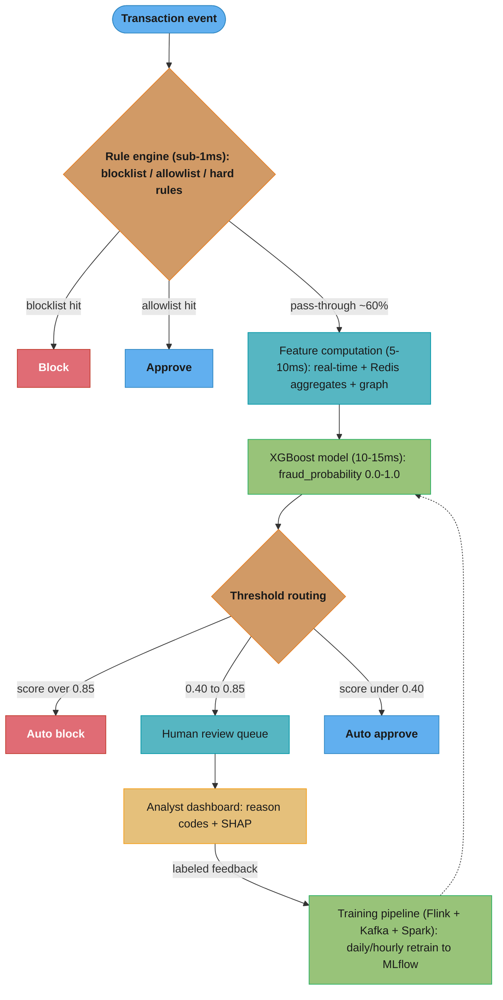
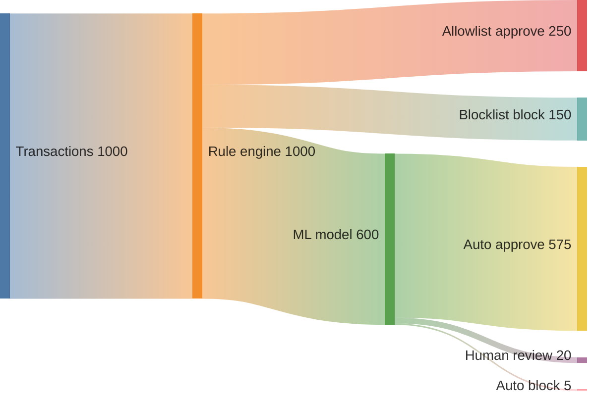
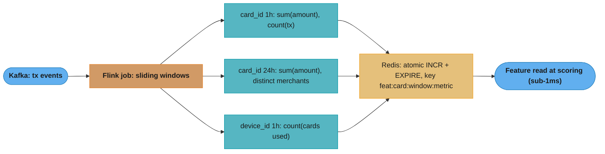

# Design a Real-Time Fraud Detection System

## Problem Statement

Design a fraud detection system for a payment platform processing 10,000 transactions per second. Every transaction must be scored in under 50ms P99. The business requires greater than 99.9% precision (false positives block legitimate transactions, destroying user trust) while catching greater than 80% of fraud (recall). The fraud base rate is 0.1% — 1 in 1,000 transactions is fraudulent, creating severe class imbalance. The system must support feedback loops: when analysts review flagged transactions, those labels flow back to retrain the model.

Constraints:
- 10K TPS peak, 864M transactions/day
- P99 latency < 50ms end-to-end
- Precision > 99.9%, Recall > 80% (F-beta with beta=0.5, precision-weighted)
- Fraud rate 0.1% — class imbalance ratio 1:1000
- Model must be explainable (regulatory requirement: reason codes for declined transactions)
- Online learning: model updated at minimum daily, preferably hourly

---

## Architecture Overview



The rule engine resolves roughly 40% of transactions deterministically in sub-1ms; the remaining ~60% get windowed features and an XGBoost score that routes into auto-block, human review, or auto-approve. Analyst-confirmed labels feed the retraining loop (dotted).



Representative disposition of 1,000 transactions: the rule engine clears ~40% (allow + block) and passes ~60% to the model, which auto-blocks about 0.5% and sends about 2% to human review — consistent with the score-distribution guardrails.



Spend-velocity aggregates are computed off the critical path: Flink maintains per-card and per-device sliding windows with exactly-once semantics and writes them to Redis, so scoring only does a sub-1ms GET instead of a live aggregation.

---

## Key Design Decisions

**Rule engine first**: 20-30% of transactions are cleared by allowlist/blocklist in under 1ms, reducing ML model load and latency budget for the remaining transactions. Known fraud patterns (card number appears in breach database) are handled deterministically with zero false-negative risk.

**XGBoost over deep learning**: Regulatory requirements mandate explainability — each decline must include a human-readable reason code (e.g., "unusual transaction location," "high spend velocity"). XGBoost with SHAP values satisfies this. Deep models require post-hoc approximations (LIME) that can be inconsistent. XGBoost also trains in minutes, enabling hourly retraining on fresh fraud patterns.

**Threshold tuning for asymmetric costs**: Blocking a legitimate transaction costs far more than missing fraud in brand terms. Use F-beta with beta=0.5 (precision-weighted) for threshold selection. Optimal threshold is typically 0.85 for auto-block, not the naive 0.5. Maintain a borderline zone (0.40-0.85) for human review rather than binary auto-decisions.

**Class imbalance**: 0.1% fraud rate means naive training optimizes for always predicting legitimate. Three strategies applied together: (1) scale_pos_weight=999 in XGBoost (ratio of negative to positive examples), (2) SMOTE to generate synthetic minority samples in feature space, (3) undersample majority class 10:1 during training. Target training ratio: 10:1 negative to positive (still imbalanced but manageable).

**Streaming features with Flink**: Spend velocity over the last 1 hour is a top-3 feature for fraud. Computing it requires stateful aggregation. Flink maintains per-card windowed state in RocksDB with exactly-once semantics. Results are written to Redis for sub-millisecond read during inference.

---

## Implementation

### XGBoost Model with Threshold Optimization

```python
import numpy as np
import pandas as pd
import xgboost as xgb
from sklearn.model_selection import StratifiedKFold
from sklearn.metrics import precision_recall_curve, fbeta_score, confusion_matrix
from imblearn.over_sampling import SMOTE
from imblearn.under_sampling import RandomUnderSampler
from imblearn.pipeline import Pipeline as ImbPipeline
import shap
from typing import Optional


def build_fraud_features(df: pd.DataFrame) -> pd.DataFrame:
    """Feature engineering for fraud detection.

    Expected raw columns:
      tx_amount, merchant_category_code (MCC), hour_of_day, day_of_week,
      ip_country, card_country, device_fingerprint_age_days,
      spend_velocity_1h, spend_velocity_24h, spend_velocity_7d,
      tx_count_1h, tx_count_24h,
      is_new_merchant (first tx at this merchant),
      failed_attempts_15min,
      shared_device_with_fraud (graph feature, 0/1),
      card_device_age_days (how long card-device pair has been seen together)
    """
    f = df.copy()

    # Derived features
    f["amount_vs_velocity_ratio"] = f["tx_amount"] / (f["spend_velocity_1h"] + 1.0)
    f["country_mismatch"] = (f["ip_country"] != f["card_country"]).astype(int)
    f["is_high_risk_mcc"] = f["merchant_category_code"].isin(
        [6011, 6051, 7995, 5912]  # ATM, crypto, gambling, pharmacies
    ).astype(int)
    f["tx_frequency_spike"] = (f["tx_count_1h"] > 5).astype(int)
    f["unusual_hour"] = f["hour_of_day"].between(0, 5).astype(int)
    f["new_device"] = (f["device_fingerprint_age_days"] < 1).astype(int)
    f["velocity_24h_vs_7d"] = f["spend_velocity_24h"] / (
        f["spend_velocity_7d"] / 7.0 + 1.0
    )  # daily spend vs weekly average

    feature_cols = [
        "tx_amount", "hour_of_day", "day_of_week",
        "spend_velocity_1h", "spend_velocity_24h", "spend_velocity_7d",
        "tx_count_1h", "tx_count_24h",
        "is_new_merchant", "failed_attempts_15min",
        "shared_device_with_fraud", "card_device_age_days",
        "amount_vs_velocity_ratio", "country_mismatch", "is_high_risk_mcc",
        "tx_frequency_spike", "unusual_hour", "new_device",
        "velocity_24h_vs_7d",
    ]
    return f[feature_cols]


def train_fraud_model(
    X: pd.DataFrame,
    y: np.ndarray,
    fraud_rate: float = 0.001,
) -> xgb.XGBClassifier:
    """Train XGBoost with class-imbalance handling."""
    # scale_pos_weight: ratio of negative to positive
    # For 0.1% fraud: (1 - 0.001) / 0.001 = 999
    scale_pos_weight = (1 - fraud_rate) / fraud_rate

    model = xgb.XGBClassifier(
        n_estimators=500,
        max_depth=6,
        learning_rate=0.05,
        subsample=0.8,
        colsample_bytree=0.8,
        scale_pos_weight=scale_pos_weight,
        eval_metric=["logloss", "auc"],
        use_label_encoder=False,
        random_state=42,
        n_jobs=-1,
        tree_method="hist",  # faster for large datasets
    )

    # Combined resampling: SMOTE minority class up, then undersample majority
    smote = SMOTE(sampling_strategy=0.1, random_state=42)  # fraud → 10% of data
    under = RandomUnderSampler(sampling_strategy=0.5, random_state=42)  # reduce majority
    pipeline = ImbPipeline([("smote", smote), ("under", under)])

    X_res, y_res = pipeline.fit_resample(X, y)
    print(f"Resampled: {np.bincount(y_res.astype(int))} (legit, fraud)")

    # Cross-val to estimate generalization
    cv = StratifiedKFold(n_splits=5, shuffle=True, random_state=42)
    oof_probs = np.zeros(len(X_res))
    for fold, (train_idx, val_idx) in enumerate(cv.split(X_res, y_res)):
        model.fit(
            X_res.iloc[train_idx], y_res.iloc[train_idx],
            eval_set=[(X_res.iloc[val_idx], y_res.iloc[val_idx])],
            verbose=False,
        )
        oof_probs[val_idx] = model.predict_proba(X_res.iloc[val_idx])[:, 1]

    # Final fit on all resampled data
    model.fit(X_res, y_res)
    return model


def find_optimal_thresholds(
    model: xgb.XGBClassifier,
    X_val: pd.DataFrame,
    y_val: np.ndarray,
    beta: float = 0.5,  # precision-weighted
) -> dict[str, float]:
    """Find auto-block and review thresholds using F-beta on validation set."""
    probs = model.predict_proba(X_val)[:, 1]
    precision, recall, thresholds = precision_recall_curve(y_val, probs)

    f_scores = []
    for p, r in zip(precision, recall):
        if p + r == 0:
            f_scores.append(0.0)
        else:
            f_beta = (1 + beta**2) * p * r / (beta**2 * p + r)
            f_scores.append(f_beta)

    best_idx = np.argmax(f_scores)
    auto_block_threshold = float(thresholds[best_idx])

    # Review zone lower bound: maximize recall above 80%
    recall_80_idx = np.where(recall >= 0.80)[0]
    review_lower = float(thresholds[recall_80_idx[-1]]) if len(recall_80_idx) else 0.3

    result = {
        "auto_block": auto_block_threshold,
        "review_lower": review_lower,
        "best_f_beta": float(f_scores[best_idx]),
        "precision_at_threshold": float(precision[best_idx]),
        "recall_at_threshold": float(recall[best_idx]),
    }
    print(f"Thresholds: auto_block={auto_block_threshold:.3f}, "
          f"review_lower={review_lower:.3f}")
    print(f"F{beta}={result['best_f_beta']:.4f}, "
          f"P={result['precision_at_threshold']:.4f}, "
          f"R={result['recall_at_threshold']:.4f}")
    return result


def explain_decision(
    model: xgb.XGBClassifier,
    X_instance: pd.DataFrame,
    top_n: int = 5,
) -> list[dict]:
    """Generate SHAP-based reason codes for a single transaction decision."""
    explainer = shap.TreeExplainer(model)
    shap_values = explainer.shap_values(X_instance)

    feature_names = X_instance.columns.tolist()
    shap_row = shap_values[0]  # single instance
    contributions = sorted(
        zip(feature_names, shap_row),
        key=lambda x: abs(x[1]),
        reverse=True,
    )

    reason_map = {
        "spend_velocity_1h": "Unusually high spend in last hour",
        "country_mismatch": "Transaction country differs from card country",
        "is_new_merchant": "First transaction at this merchant",
        "shared_device_with_fraud": "Device associated with known fraud",
        "tx_frequency_spike": "Abnormal transaction frequency",
        "unusual_hour": "Transaction at unusual hour",
        "amount_vs_velocity_ratio": "Amount unusually high relative to recent spending",
    }

    reasons = []
    for feature, shap_val in contributions[:top_n]:
        if shap_val > 0:  # contributing to fraud score
            reasons.append({
                "feature": feature,
                "contribution": float(shap_val),
                "reason_code": reason_map.get(feature, f"Feature: {feature}"),
            })
    return reasons
```

### Streaming Feature Aggregation (Flink concept in Python)

```python
from dataclasses import dataclass, field
from collections import deque
import time
import redis


@dataclass
class SlidingWindowAggregator:
    """
    Conceptual implementation of Flink sliding-window aggregation.
    In production: Flink with RocksDB state backend, exactly-once semantics.
    This shows the logic; actual Flink code uses Java/Scala DataStream API.
    """
    window_seconds: int
    events: deque = field(default_factory=deque)

    def add_event(self, amount: float, timestamp: float) -> None:
        self.events.append((timestamp, amount))
        self._evict_old(timestamp)

    def _evict_old(self, current_ts: float) -> None:
        cutoff = current_ts - self.window_seconds
        while self.events and self.events[0][0] < cutoff:
            self.events.popleft()

    def get_sum(self) -> float:
        return sum(amt for _, amt in self.events)

    def get_count(self) -> int:
        return len(self.events)


class FraudFeatureStore:
    """Redis-backed feature store for real-time fraud features."""

    def __init__(self, redis_client: redis.Redis) -> None:
        self.redis = redis_client

    def update_spend_velocity(
        self,
        card_id: str,
        amount: float,
        timestamp: float,
    ) -> None:
        """Increment rolling spend using sorted-set trick."""
        key_1h = f"spend:{card_id}:1h"
        key_24h = f"spend:{card_id}:24h"
        key_7d = f"spend:{card_id}:7d"

        pipe = self.redis.pipeline()
        # Store amount in sorted set with timestamp as score
        member = f"{timestamp}:{amount}"
        pipe.zadd(key_1h, {member: timestamp})
        pipe.zadd(key_24h, {member: timestamp})
        pipe.zadd(key_7d, {member: timestamp})

        # Remove entries outside window
        now = timestamp
        pipe.zremrangebyscore(key_1h, "-inf", now - 3600)
        pipe.zremrangebyscore(key_24h, "-inf", now - 86400)
        pipe.zremrangebyscore(key_7d, "-inf", now - 604800)

        # Set TTL
        pipe.expire(key_1h, 7200)
        pipe.expire(key_24h, 90000)
        pipe.expire(key_7d, 691200)
        pipe.execute()

    def get_spend_features(self, card_id: str) -> dict[str, float]:
        """Get spend velocity features for scoring."""
        now = time.time()
        pipe = self.redis.pipeline()

        for window_name, window_sec in [("1h", 3600), ("24h", 86400), ("7d", 604800)]:
            key = f"spend:{card_id}:{window_name}"
            pipe.zrangebyscore(key, now - window_sec, "+inf", withscores=False)
        results = pipe.execute()

        def sum_amounts(members: list[bytes]) -> float:
            total = 0.0
            for m in members:
                try:
                    total += float(m.decode().split(":")[1])
                except (IndexError, ValueError):
                    pass
            return total

        return {
            "spend_velocity_1h": sum_amounts(results[0]),
            "spend_velocity_24h": sum_amounts(results[1]),
            "spend_velocity_7d": sum_amounts(results[2]),
            "tx_count_1h": len(results[0]),
            "tx_count_24h": len(results[1]),
        }
```

### Online Scoring Service

```python
from dataclasses import dataclass
import numpy as np
import xgboost as xgb
import redis
import time


@dataclass
class FraudScore:
    transaction_id: str
    fraud_probability: float
    decision: str  # "approve", "review", "block"
    reason_codes: list[str]
    latency_ms: float


class FraudScoringService:
    """
    End-to-end fraud scoring pipeline.
    Target: <50ms P99 including feature fetch and model inference.
    """

    BLOCKLIST_KEY = "blocklist:cards"
    ALLOWLIST_KEY = "allowlist:merchants"

    def __init__(
        self,
        model: xgb.XGBClassifier,
        feature_store: "FraudFeatureStore",
        thresholds: dict[str, float],
    ) -> None:
        self.model = model
        self.feature_store = feature_store
        self.auto_block_threshold = thresholds["auto_block"]   # e.g., 0.85
        self.review_lower = thresholds["review_lower"]         # e.g., 0.40

    def score(self, transaction: dict) -> FraudScore:
        start = time.perf_counter()
        tx_id = transaction["transaction_id"]
        card_id = transaction["card_id"]

        # Stage 1: Rule engine (<1ms)
        if self._is_blocklisted(card_id):
            return FraudScore(tx_id, 1.0, "block", ["Card on blocklist"],
                              (time.perf_counter() - start) * 1000)
        if self._is_allowlisted(transaction.get("merchant_id", "")):
            return FraudScore(tx_id, 0.0, "approve", [],
                              (time.perf_counter() - start) * 1000)

        # Stage 2: Feature computation (5-10ms)
        velocity_features = self.feature_store.get_spend_features(card_id)
        all_features = {**transaction, **velocity_features}
        X = self._build_feature_vector(all_features)

        # Stage 3: ML scoring (10-15ms)
        fraud_prob = float(self.model.predict_proba(X)[:, 1][0])

        # Stage 4: Decision + reason codes
        if fraud_prob >= self.auto_block_threshold:
            decision = "block"
        elif fraud_prob >= self.review_lower:
            decision = "review"
        else:
            decision = "approve"

        latency = (time.perf_counter() - start) * 1000
        return FraudScore(tx_id, fraud_prob, decision, [], latency)

    def _is_blocklisted(self, card_id: str) -> bool:
        return bool(self.feature_store.redis.sismember(self.BLOCKLIST_KEY, card_id))

    def _is_allowlisted(self, merchant_id: str) -> bool:
        return bool(self.feature_store.redis.sismember(self.ALLOWLIST_KEY, merchant_id))

    def _build_feature_vector(self, features: dict) -> np.ndarray:
        # Build ordered feature array matching model's expected input
        feature_order = [
            "tx_amount", "hour_of_day", "day_of_week",
            "spend_velocity_1h", "spend_velocity_24h", "spend_velocity_7d",
            "tx_count_1h", "tx_count_24h", "is_new_merchant",
            "failed_attempts_15min", "shared_device_with_fraud",
            "card_device_age_days",
        ]
        return np.array([[features.get(f, 0.0) for f in feature_order]])
```

---

## ML Components Used

| Component | Technology | Role |
|-----------|-----------|------|
| Rule Engine | Redis SET (blocklist/allowlist) | Sub-1ms hard rules, deterministic |
| Feature Storage | Redis Cluster (sorted sets) | Rolling window spend aggregation |
| Stream Processing | Apache Flink | Real-time feature computation, exactly-once |
| Event Bus | Apache Kafka | Transaction event streaming |
| ML Model | XGBoost | Fraud probability scoring, 10-15ms |
| Imbalance Handling | SMOTE + RandomUnderSampler (imbalanced-learn) | Class imbalance 1:1000 |
| Explainability | SHAP TreeExplainer | Regulatory reason codes |
| Threshold Selection | F-beta optimization (precision-weighted) | Precision/recall tradeoff tuning |
| Experiment Tracking | MLflow | Model versioning, threshold tracking |

---

## Tradeoffs and Alternatives

| Decision | Chosen | Alternative | Reasoning |
|----------|--------|-------------|-----------|
| Model type | XGBoost | Neural network (MLP, Transformer) | XGBoost: interpretable SHAP values, trains in minutes, handles missing features |
| Imbalance strategy | SMOTE + scale_pos_weight | Pure scale_pos_weight | SMOTE creates synthetic minority samples in feature space; better calibration |
| Feature aggregation | Flink sliding windows | Lambda architecture (speed + batch) | Flink unified streaming eliminates dual-path complexity |
| Threshold | F-beta (beta=0.5) | Fixed 0.5 or ROC-optimal | F-beta explicitly encodes business cost of false positives vs false negatives |
| Review zone | [0.40, 0.85] | Binary approve/block | Borderline zone recovers precision without sacrificing recall |
| Graph features | Precomputed + cached | Real-time graph traversal | Real-time graph query >50ms; precompute nightly, cache in Redis |

---

## Interview Discussion Points

**How do you handle the class imbalance of 0.1% fraud rate?**
Three-layer approach: (1) scale_pos_weight=999 in XGBoost tells the model each fraud example counts as 999 legitimate ones during gradient computation. (2) SMOTE generates synthetic fraud examples by interpolating in feature space between existing fraud cases — avoids overfitting to exact training fraud examples. (3) Threshold tuning: the naive 0.5 threshold is wrong for imbalanced data; use F-beta with beta=0.5 on a time-held-out validation set (not random split — fraud patterns are temporal). Target threshold is typically 0.85 for auto-block.

**How do you prevent model degradation as fraud patterns evolve (concept drift)?**
Fraudsters adapt within days of a new model deploy. Mitigations: (1) Monitor PSI (Population Stability Index) on feature distributions — PSI > 0.2 triggers alert. (2) Monitor fraud rate on auto-approved transactions using delayed labels (chargebacks arrive 30-90 days later). (3) Hourly model retraining on a rolling 30-day window so fresh fraud patterns quickly dominate. (4) Maintain an "emergency rules" layer that analysts can update within minutes without model retraining.

**Why use F-beta with beta=0.5 for threshold selection rather than maximizing AUC?**
AUC measures overall ranking quality but does not account for the asymmetric cost of errors. Blocking a legitimate transaction (false positive) costs an estimated $50 in customer service, potential churn, and reputation. Missing fraud costs an average $200 in loss. But the false positive rate multiplier is 1000x the false negative rate (because 99.9% of transactions are legitimate). F-beta with beta=0.5 gives precision double the weight of recall, directly encoding this business asymmetry. AUC would be 0.98+ while the system produces unacceptable false positive rates.

**How do you ensure the fraud score is produced in <50ms given streaming feature computation?**
The critical insight is that streaming features must be precomputed, not computed on the critical path. Flink aggregates spend velocity continuously and writes results to Redis. At scoring time, the API does a Redis GET (sub-1ms), not a Flink computation. The 50ms budget is: rule engine 1ms + Redis feature fetch 5ms + model inference 15ms + network 10ms = 31ms, leaving 19ms buffer for tail latency. SHAP explanations (50-100ms) are computed asynchronously after the decision is returned.

---

## Failure Scenarios and Recovery

### Failure 1: Redis Key Expiry During Peak Transaction Window

**What failed:** On Black Friday, transaction volume spiked to 45K TPS (4.5x normal 10K TPS). The Flink streaming feature computation fell behind by 8 minutes — spend velocity features in Redis were stale. More critically, some Redis keys expired before Flink could refresh them: a card that had spent $2,000 in the last hour showed spend_velocity_1h=0 because the key had expired and Flink's write was delayed. The fraud model saw no velocity signal and approved 312 fraudulent transactions totaling $187K in 45 minutes.

**Detection:** Chargebacks arrived 3 days later from card network. Real-time detection failed because the model's fraud score was low (velocity feature was zero). Post-hoc analysis correlated the window to Flink consumer lag. Time-to-detect: 3 days (via chargeback data), 45 minutes for Flink lag alert (but that alert was not actionable to fraud team).

**Recovery steps:**
1. Emergency manual blocklist: analyst added 890 card IDs that were flagged in the affected 45-minute window to the blocklist.
2. Chargeback disputes filed with card networks for $187K.
3. Flink parallelism increased from 8 to 32 workers specifically for spend velocity jobs; autoscaling enabled on Flink task managers.
4. Redis TTL extended from window_size+10min to window_size+60min to provide buffer during consumer lag.

**Prevention:** Added Kafka consumer lag as a feature-quality signal: if Flink lag > 5 minutes, automatically increase the fraud threshold from 0.85 to 0.70 (more conservative) to compensate for stale features. Alert on lag > 2 minutes.

---

### Failure 2: SMOTE Overfitting to Synthetic Minority Samples

**What failed:** A model retrained with SMOTE sampling_strategy=0.5 (fraud → 50% of training data) achieved F-beta=0.92 on the validation set but precision=97.5% in production (target: >99.9%). Investigation showed SMOTE was generating synthetic fraud samples that interpolated between real fraud cases, creating a dense cluster of fraud-like feature combinations in embedding space. The model learned to predict fraud for any transaction in those regions, but real legitimate transactions sometimes occupied the same feature space (e.g., a legitimate $1,500 transaction from a new merchant at 2am — common for business travelers).

**Detection:** Production precision monitoring: daily false-positive rate dashboard showed precision at 97.5%, below the 99.9% target. Analyst reviews showed 60% of flagged transactions in the manual review queue were legitimate. Time-to-detect: 2 weeks after new model deploy.

**Recovery steps:**
1. Rolled back to previous model (pre-SMOTE).
2. Reduced SMOTE sampling_strategy from 0.5 to 0.1 (fraud → 10% of training data, not 50%).
3. Validated on time-held-out test set (3-month delay to capture chargebacks) rather than random split, which better represented real distribution.
4. Added graph features as hard guardrails: no SMOTE samples generated for transactions where shared_device_with_fraud=0 (legitimate device network reduces fraud probability strongly).

**Prevention:** Precision monitoring with 24-hour lag (chargebacks from same-day approvals arrive within 24h for card-present fraud). Alert immediately if precision drops below 99.5% on a rolling 1,000-decision window.

---

### Failure 3: Concept Drift From New Account Takeover Vector

**What failed:** Fraudsters discovered a new attack: instead of using stolen card numbers, they compromised email accounts, changed shipping addresses, and placed orders using the original card on file. The model's features (country_mismatch, new_device, velocity) did not capture this pattern. Fraud rate in the "new shipping address + email change within 24 hours" segment rose from 0.1% to 8% over 3 weeks. The model scored these transactions at 0.2-0.3 (legitimate), passing them to auto-approve. $2.3M in losses accumulated before detection.

**Detection:** An analyst noticed an unusual pattern in chargebacks — all from the same demographic (email change 24h before order). Cross-referenced with model feature logs. Time-to-detect: 3 weeks.

**Recovery steps:**
1. Emergency rule added to the rule engine: if email_changed_within_24h AND new_shipping_address → force to human review queue regardless of model score.
2. Feature engineering: added email_change_age_hours, shipping_address_age_hours, address_change_velocity_7d.
3. Retrained XGBoost model on new features with labeled examples from the attack window.
4. Deployed new model within 72 hours of root cause identification.

**Prevention:** Weekly analyst review of chargeback patterns to identify emerging fraud vectors not captured by current features. Feature importance monitoring: if model's top-10 features do not include features covering a new fraud pattern within 2 weeks of its emergence, trigger emergency feature engineering sprint.

---

## Capacity Planning

### Data Volume Projections

```
Year 0 (current):
  Transaction rate: 10K TPS, 864M transactions/day
  Transaction event size: ~2KB (features + metadata)
  Daily raw log: 864M × 2KB = 1.73TB/day
  Click label join: chargebacks arrive 30-90 days later → 90-day retention
  Total hot storage (90 days): 1.73TB × 90 = 156TB (Parquet on S3)
  Redis feature keys: 100M active cards × 3 windows × ~500B per key = 150GB Redis cluster

Year 1 (2x transaction growth):
  20K TPS, 1.73B transactions/day, ~3.46TB/day
  Redis: 200M cards × 3 windows = 300GB (6-node r5.2xlarge cluster)
  Model retraining data (30-day): ~104TB Parquet

Year 3 (5x growth):
  50K TPS, 4.32B transactions/day, ~8.6TB/day
  Redis cluster: 12-node (750GB active feature data)
  Flink processing: 50K events/sec → requires 80 task manager slots
  90-day S3 retention: 780TB
```

### Training Compute Requirements

```
XGBoost Fraud Model (daily retrain):
  Dataset: 30-day rolling window × 864M tx/day × 0.3 subsampled = 7.8B training examples
  With class balancing (fraud:legit = 1:10 after sampling): ~15M examples
  Hardware: c5.4xlarge (16 vCPU, 32GB RAM)
  Duration: 25 minutes (tree_method=hist)
  Cost: $0.68/hr × 0.42hr = $0.29/run × 365 = $106/year

Graph Feature Precomputation (nightly):
  Build device-card association graph: 864M nodes, 2B edges
  GraphX on Spark (10-node EMR r5.2xlarge): 3 hours/night
  Cost: 10 × $0.504/hr × 3hr = $15/night = $5,475/year

SHAP Explanation Precomputation (async, post-decision):
  500K decisions/day requiring SHAP (review queue + blocks)
  TreeExplainer: 10ms per decision → 5M ms = 83 CPU-minutes
  2 dedicated c5.xlarge for async SHAP: $0.17/hr each
  Cost: 2 × $0.17 × 24 × 365 = ~$2,978/year

Total annual training cost: ~$8,559
```

### Serving Infrastructure

```
Transaction Scoring Service:
  10K TPS peak, 50ms P99 budget
  Each scoring instance: XGBoost inference 15ms, Redis GET 5ms, network 10ms
  Instances needed: 10K TPS × 30ms avg latency = 300 concurrent requests
  10 instances (c5.2xlarge, 8 vCPU): 30 concurrent requests each
  Cost: 10 × $0.34/hr = $3.40/hr = $2,450/month

Redis Feature Store:
  10K TPS × 5 Redis GETs per tx = 50K GET/sec
  10-node Redis Cluster (r5.xlarge, 32GB RAM each): 5K ops/node
  Estimated active data: 150GB across 10 nodes (15GB/node)
  Cost: 10 × $0.252/hr = $2.52/hr = ~$1,814/month

Kafka Cluster (transaction events + label feedback):
  10K events/sec sustained, 30K peak
  5-broker cluster (kafka.m5.2xlarge)
  Cost: ~$750/month

Flink Streaming (feature computation):
  32 task managers (c5.xlarge, 4 vCPU)
  Cost: 32 × $0.17/hr = $5.44/hr = ~$3,917/month

Total monthly serving infrastructure: ~$8,931
```

---

## Additional War Stories

**War Story 1 — Threshold Calibration Using Wrong Validation Set:**

```python
# BROKEN: Using random train/val split for threshold optimization
# Fraud patterns are temporal — training on all months and validating on random 10%
# means the model has "seen" future fraud patterns via training data leakage

from sklearn.model_selection import train_test_split
import numpy as np
import xgboost as xgb
from sklearn.metrics import precision_recall_curve


def optimize_threshold_broken(
    X: np.ndarray,
    y: np.ndarray,
    model: xgb.XGBClassifier,
) -> float:
    # BUG: Random split — validation set contains fraud from same time window as training
    # Model already overfit to these fraud patterns → inflated validation precision
    X_train, X_val, y_train, y_val = train_test_split(
        X, y, test_size=0.2, random_state=42, stratify=y
    )
    model.fit(X_train, y_train)
    probs = model.predict_proba(X_val)[:, 1]
    precision, recall, thresholds = precision_recall_curve(y_val, probs)
    # Returns threshold=0.72 with precision=99.95% on validation
    # In production: precision=97.8% — overoptimistic by 2.15 percentage points
    best_idx = np.argmax(precision[recall >= 0.80])
    return float(thresholds[best_idx])


# FIX: Temporal validation split — validate on the most recent month only
# Training: months 1-5, Validation: month 6, Test: month 7 (held out)

def optimize_threshold_correct(
    df_with_timestamp: "pd.DataFrame",  # includes 'timestamp' and 'label' columns
    X: np.ndarray,
    y: np.ndarray,
    model: xgb.XGBClassifier,
    validation_window_days: int = 30,
) -> float:
    """
    Time-based split: train on all data except last validation_window_days.
    Validate on most recent validation_window_days.
    This simulates real deployment: model trained on past, evaluated on future.
    """
    import pandas as pd
    cutoff = df_with_timestamp["timestamp"].max() - pd.Timedelta(days=validation_window_days)
    train_mask = df_with_timestamp["timestamp"] < cutoff
    val_mask = ~train_mask

    model.fit(X[train_mask], y[train_mask])
    probs = model.predict_proba(X[val_mask])[:, 1]
    y_val = y[val_mask]

    precision, recall, thresholds = precision_recall_curve(y_val, probs)
    # Threshold is more conservative: typically 0.85-0.90 vs 0.72 from random split
    recall_mask = recall[:-1] >= 0.80
    if recall_mask.any():
        best_idx = int(np.argmax(precision[:-1][recall_mask]))
        return float(thresholds[recall_mask][best_idx])
    return 0.90  # conservative default
```

**War Story 2 — SHAP Explanation Inconsistency Under Parallel Scoring:**

```python
# BROKEN: TreeExplainer initialized once and shared across threads
# SHAP's internal state is not thread-safe — parallel requests cause race conditions
# producing SHAP values that don't sum to model output (conservation violated)

import shap
import threading
import xgboost as xgb
import numpy as np


class FraudExplainerBroken:
    def __init__(self, model: xgb.XGBClassifier) -> None:
        # BUG: single explainer shared across threads
        self.explainer = shap.TreeExplainer(model)

    def explain(self, X: np.ndarray) -> np.ndarray:
        # Race condition: multiple threads calling explain() simultaneously
        # corrupts internal background dataset state in TreeExplainer
        return self.explainer.shap_values(X)  # NOT thread-safe


# FIX: Use thread-local explainer instances, or serialize with a lock,
# or use a process pool (separate memory space per worker)

import concurrent.futures


class FraudExplainerCorrect:
    def __init__(self, model: xgb.XGBClassifier) -> None:
        self.model = model
        self._local = threading.local()

    def _get_explainer(self) -> shap.TreeExplainer:
        """Thread-local explainer — each thread gets its own instance."""
        if not hasattr(self._local, "explainer"):
            self._local.explainer = shap.TreeExplainer(self.model)
        return self._local.explainer

    def explain(self, X: np.ndarray) -> np.ndarray:
        explainer = self._get_explainer()
        shap_values = explainer.shap_values(X)
        # Validate conservation property: shap_values.sum() + base_value ≈ model_output
        base_value = explainer.expected_value
        model_output = self.model.predict_proba(X)[:, 1]
        shap_sum = shap_values.sum(axis=1) + base_value
        if not np.allclose(shap_sum, model_output, atol=0.01):
            raise RuntimeError(
                f"SHAP conservation violated: shap_sum={shap_sum}, "
                f"model_output={model_output}"
            )
        return shap_values
```

---

## Monitoring and Drift Detection Deep-Dive

### Features That Drift Fastest

```
Feature                           Drift rate    Why it drifts
────────────────────────────────────────────────────────────────────────
new_device (device_age < 1 day)   Very high     Fraudsters rotate devices daily
spend_velocity_1h                 High          Attack patterns shift; seasonal spending
failed_attempts_15min             High          Brute-force bot activity waxes/wanes
country_mismatch                  High          Travel patterns; VPN usage trends
is_high_risk_mcc                  Medium        Fraudsters shift to new merchant categories
card_device_age_days              Medium        Legitimate users get new devices periodically
tx_amount                         Low           Consumer spending patterns stable month-to-month
hour_of_day distribution          Low           Shifts with daylight saving, seasonal habits
```

### PSI Monitoring for Fraud Features

```python
# PSI alert thresholds calibrated to fraud feature characteristics
FRAUD_FEATURE_PSI_THRESHOLDS = {
    "spend_velocity_1h": 0.15,          # seasonal variation expected
    "new_device": 0.20,                  # bot campaigns cause legitimate spikes
    "country_mismatch": 0.15,
    "failed_attempts_15min": 0.25,       # DDoS/brute-force highly variable
    "amount_vs_velocity_ratio": 0.10,   # stable; shift indicates new fraud pattern
    "shared_device_with_fraud": 0.10,   # should be stable graph topology
}

# Model output monitoring
SCORE_DISTRIBUTION_ALERTS = {
    "fraction_auto_blocked": {"lower": 0.0005, "upper": 0.005},  # 0.05-0.5% of traffic
    "fraction_in_review": {"lower": 0.005, "upper": 0.05},        # 0.5-5% of traffic
    "median_fraud_score": {"lower": 0.02, "upper": 0.15},         # among all transactions
}
```

### Retraining Triggers and Cadence

```
Cadence        Trigger condition                                Action
─────────────────────────────────────────────────────────────────────────────
Daily          Scheduled                                        Full XGBoost retrain
Hourly         New confirmed fraud labels from analysts >1000   Incremental warm-start retrain
Triggered      PSI > 0.20 on any top-5 feature                 Emergency retrain + feature audit
Triggered      Precision drops below 99.5% on 1000-tx window   Threshold re-optimization
Triggered      Fraud rate on auto-approved tx > 0.3% (vs 0.1%) Emergency rule addition + retrain
Triggered      New attack vector identified by analyst          Emergency feature engineering
Weekly         Scheduled                                        Graph feature rebuild (device associations)
Monthly        Scheduled                                        Model audit: SHAP drift, feature importance shift
```

### A/B Testing for Model Promotion

```
Shadow mode (1 week):
  New model runs in parallel on 100% of traffic
  Predictions logged but not served
  Validation checklist:
    - Latency P99 < 50ms (reject if exceeds 45ms to leave 10% headroom)
    - SHAP values computed and verified (conservation property)
    - Score distribution similar to production model (PSI < 0.15)

A/B test (2 weeks minimum):
  Treatment: 20% of traffic scored by new model
  Control: 80% scored by production model
  Primary metrics:
    - Precision on auto-blocked transactions (chargeback rate in blocked set)
    - Recall: fraud rate on auto-approved transactions (delayed label, 30 days)
  Guardrails:
    - False positive rate in review queue must not increase > 5%
    - P99 latency must not increase > 5ms
  Statistical threshold: 95% confidence on primary metrics

Ramp: 20% → 50% → 100% at 3-day intervals after significance confirmed
```

---

## Additional Interview Questions

**How do you handle feedback delays in fraud labels, where chargebacks arrive 30-90 days after a transaction?**
The feedback delay creates a censoring problem: transactions from the last 30-90 days have incomplete labels — many fraudulent transactions have not yet been charged back. Training naively on recent data with incomplete labels underestimates fraud probability and biases the model toward legitimate predictions. Mitigations: (1) Use a training window that excludes the most recent 90 days (train on months 1-9, evaluate on month 10 with complete labels). (2) For hourly retraining on fresh data, use analyst-confirmed labels (faster: analyst reviews within 4 hours) rather than chargeback labels. (3) Implement a "pending label" state: transactions from the last 90 days are held in a label buffer; as chargebacks arrive, the buffer is updated and periodically used to fine-tune the model.

**How do you maintain explainability while improving model accuracy with ensemble methods?**
Single XGBoost provides SHAP values that are exact (not approximate) because TreeExplainer computes the exact Shapley decomposition for tree models. Stacking multiple XGBoost models or adding neural components breaks this: SHAP becomes approximate (KernelSHAP, LIME) and much slower (100-1000x). The approach that preserves explainability while improving accuracy: (1) Feature engineering — add interaction features (amount_vs_velocity_ratio, country_mismatch × new_device) to a single XGBoost model rather than ensembling two models. (2) Monotonicity constraints: constrain features like spend_velocity_1h to be monotonically increasing in fraud score, which also prevents SHAP from showing counterintuitive values. (3) If a second model is required (e.g., a graph neural network for device association), use it only as a feature input (graph_fraud_score) to the XGBoost model, not as an ensemble. The XGBoost then explains the combined signal.

**What is the review queue economics, and how do you size it?**
The review queue contains transactions with fraud score in [0.40, 0.85] where human judgment is required. Sizing: at 10K TPS, roughly 8% of traffic (after rule engine pass-through) reaches the ML model. Of that, approximately 5% falls in the review zone = 0.008 × 10K = 80 transactions/second = 6.9M per day. Each analyst reviews 200 transactions per hour → 6.9M / 200 = 34,500 analyst-hours/day. At $40/hour fully-loaded cost, this is $1.38M/day — clearly unsustainable. The review queue must be ruthlessly prioritized: only transactions with expected loss > $500 AND fraud_score > 0.60 enter the queue (reduces queue by 85%). Automated disposition handles the rest with slightly lower precision. The threshold zone [0.40, 0.60] is auto-approved with enhanced monitoring; [0.60, 0.85] is auto-reviewed with transaction hold.

**How does the system handle coordinated bot attacks targeting the scoring service itself?**
A coordinated attack might send millions of test transactions at low amounts to probe the model's decision boundary and infer the fraud threshold. Defenses: (1) Score obfuscation: never return the exact fraud probability to the client — return only the decision (approved/declined/pending). (2) Rate limiting at the API gateway: max 100 transactions per card per hour enforced in the rule engine, regardless of fraud score. (3) Behavioral fingerprinting: transaction inter-arrival times that are too regular (bots send at fixed intervals) trigger a rule-engine flag, routing to human review. (4) Model obfuscation: periodically introduce noise into auto-approve/block decisions for borderline scores (score 0.38-0.42 gets 20% stochastic override). This makes the boundary fuzzy from the attacker's perspective. (5) Canary features: hidden features that legitimate merchants would never trigger but test-probing bots might, similar to honeypots.

**How do you reconcile the 99.9% precision requirement with the 80% recall requirement?**
At 0.1% fraud rate with 99.9% precision and 80% recall: for every 1,000 transactions, 1 is fraud and 999 are legitimate. Catching 80% of fraud means catching 0.8 fraud cases. With 99.9% precision, we can have at most 0.001 × (0.8 / 0.999) ≈ 0.0008 false positives per transaction reviewed, or about 1 false positive per 1,000 auto-blocked decisions. In practice, this precision-recall operating point is achieved via the three-zone architecture: the auto-block zone (score > 0.85) must have 99.9% precision on its own, while the review zone (0.40-0.85) has lower precision (85-95%) but higher recall. The combined system recall is: auto-block recall + review recall. This separation allows optimizing each zone independently.
