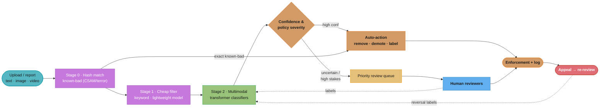
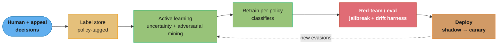

# Design a Harmful Content Detection System (Trust & Safety / Integrity)

> "Content moderation is airport security for a platform that admits a billion travelers a second: you cannot hand-search everyone, the threats keep changing their disguises, and both a missed weapon and a strip-searched grandmother are front-page failures."

**Key insight:** Harmful-content detection is not a classification problem, it is a *resourced decision system under adversarial, asymmetric, rare-positive conditions*. Three properties break every convention you carry over from a recommender: (1) **prevalence is tiny** — violating content is often 0.01–1% of volume, so accuracy is a useless metric and precision/recall/PR-AUC rule; (2) **error costs are policy-specific and asymmetric** — a false negative on child-safety or terrorism is catastrophic and legally mandated to be near-zero, while a false negative on spam is a nuisance, and a false positive that removes lawful speech is a different, censorship-shaped harm; (3) **the label distribution is adversarial and non-stationary** — bad actors mutate text (leetspeak, homoglyphs), images (crops, overlays), and behavior to evade whatever you deployed last week. The design that falls out is a **cascade** of cheap high-recall filters feeding expensive multimodal classifiers, which feed a **prioritized human-review queue**, closing a loop where human decisions become tomorrow's training labels.

Mental model: a functional funnel with a human backstop. Volume enters at the top; each stage is *cheaper-but-blunter above, costlier-but-sharper below*; the model's job is not to decide everything but to *decide the easy cases automatically and route the hard/high-stakes cases to humans*, whose finite review capacity is the binding constraint the whole system is engineered around.

Why this system exists: platforms are legally and existentially required to remove illegal and policy-violating content (CSAM, terrorism, incitement, fraud, spam) at a scale no human workforce can match, while *not* over-removing lawful content (which is its own reputational, regulatory — DSA, and user-trust harm). Meta, YouTube, TikTok, and Reddit each run integrity systems processing billions of items daily; the EU Digital Services Act and similar laws make the precision/recall operating point a compliance decision, not just an ML one. This is a very common senior/staff MLE and applied-scientist interview prompt.

Cross-read: this study reuses primitives from [imbalanced_data_and_leakage_traps](../imbalanced_data_and_leakage_traps/README.md), [adversarial_ml_and_robustness](../adversarial_ml_and_robustness/README.md), [active_learning_and_weak_supervision](../active_learning_and_weak_supervision/README.md), and the LLM-side [guardrails_and_content_safety](../../llm/guardrails_and_content_safety/README.md) (for generative-content moderation), but centers the *integrity system design* those pieces plug into.

---

## 1. Requirements Clarification

**Functional requirements:**
- Classify user-generated content (text posts, comments, images, video, and behavior signals) against a **policy taxonomy** (e.g., hate, violence/incitement, harassment, self-harm, child safety, terrorism, spam, scams, nudity, misinformation).
- Take graded **enforcement actions**: allow, demote/reduce-reach, age-gate, warn/label, remove, ban account, or escalate to legal/NCMEC reporting (for child-safety).
- Route uncertain or high-stakes cases to a **human-review queue** with prioritization.
- Support an **appeals** path (user contests a removal → re-review → possible reversal), and feed reversals back as labels.
- Operate **proactively** (scan on upload, before/at distribution) and **reactively** (user reports).

**Non-functional requirements:**
- Latency: proactive scan must fit the publish path — soft-real-time (e.g., < 1 s for text, seconds for image/video first-pass); deep review can be async.
- Throughput: billions of items/day; peak bursts around events.
- Precision/recall targets are **per policy**, not global: child-safety and terrorism run at maximum recall (accept low precision, human-verify); spam runs at high precision (auto-action) to avoid annoying users.
- Auditability: every automated action must be explainable and logged for compliance and appeals.
- Adversarial robustness: withstand evasion (obfuscation, adversarial perturbation) and coordinated campaigns.

**Clarify with the interviewer (each changes the design):**
- Which policy area is the focus? (Child-safety uses hash-matching + mandated reporting; hate speech is a nuanced text problem; spam is behavioral.) A single "harmful content" model is a red flag — policies have different data, costs, and legal regimes.
- Proactive vs reactive emphasis, and what human-review capacity we have (it is the binding constraint).
- Modality mix (text-only vs image/video/multimodal).

**Out of scope:** the appeals *UI*, human-reviewer labor management, and the CDN/storage layer.

---

## 2. Scale Estimation

**Volume:**
- 5B content items/day uploaded (posts + comments + media). Peak ~100k items/sec.
- Prevalence of violating content: assume ~0.5% overall, but wildly policy-dependent (spam ~1–3%; terrorism/CSAM orders of magnitude rarer). At 0.5% of 5B = **25M violating items/day** to catch — and, crucially, ~4.975B benign items/day that a careless system will false-positive on.

**The false-positive arithmetic (the key estimation the interviewer wants):**
- Suppose a classifier at 99% precision / 90% recall on a policy with 0.5% prevalence.
- Daily benign = 4.975B. A **1% false-positive rate** on benign = **49.75M wrongful flags/day** — dwarfing the 25M true violators. This is the base-rate trap: at low prevalence, even a "great" FPR floods review and over-removes. It is why thresholds are set per policy against a review budget, not to maximize F1.

**Human-review capacity (the binding constraint):**
- Say 20,000 reviewers, ~500 decisions/reviewer/day = **10M human decisions/day**.
- You can only route ~10M of 5B items (0.2%) to humans. So the models must *auto-decide* the overwhelming majority and spend the scarce human budget on the highest-value uncertain/high-stakes cases → prioritization is a core algorithm, not an afterthought.

**Compute:**
- Cheap first-pass (hash match, keyword/regex, lightweight text classifier): ~microseconds–ms per item, runs on everything → CPU fleet sized to 100k items/sec.
- Heavy multimodal transformer (image+text): only on the fraction that survives first-pass (say 2% = 100M/day) → GPU fleet.
- Hash databases (PhotoDNA/CSAI-style perceptual hashes, known-terrorism hashes via GIFCT): billions of hashes, memory-resident matching.

---

## 3. High-Level Architecture



Content flows through progressively more expensive stages; a routing decision keyed on model confidence *and* policy severity sends high-confidence cases to auto-action and uncertain/high-stakes cases to a prioritized human queue, whose decisions (and appeal reversals) flow back as training labels.



The label flywheel: human/appeal decisions become labels, active learning mines the most informative and most adversarial examples, per-policy classifiers retrain, a red-team/drift harness gates deployment, and newly-observed evasions feed back into mining.

**Component inventory:**
- Stage 0 hash matcher: perceptual-hash lookup against known-bad databases (child-safety, terrorism) — exact-ish match, near-zero false positive, immediate action + mandated reporting.
- Stage 1 cheap filters: keyword/regex, language ID, a distilled text classifier, behavioral heuristics (account age, velocity).
- Stage 2 heavy models: per-policy multimodal transformers (text encoder + image/video encoder), calibrated.
- Router: per-policy thresholds + severity → auto-action vs queue.
- Review queue: prioritization by expected harm × reach × uncertainty.
- Label/retrain loop: active learning + adversarial mining, shadow/canary deploy.

---

## 4. Component Deep Dives

### 4.1 The policy taxonomy and per-policy operating points

There is no single "harmful" label. Each policy is its own binary (or graded) problem with its own prevalence, cost matrix, and legal regime.

```python
from dataclasses import dataclass


@dataclass(frozen=True)
class PolicyConfig:
    name: str
    # Cost of a miss (false negative) vs a wrongful action (false positive),
    # in comparable "harm units". These drive the threshold, not F1.
    cost_false_negative: float
    cost_false_positive: float
    auto_action_allowed: bool     # can the model act without a human?
    mandated_reporting: bool      # legal obligation (e.g., child-safety → NCMEC)


POLICIES = {
    # Catastrophic misses, legally mandated: run at MAX recall, human/hash verify,
    # never rely on a soft classifier alone.
    "child_safety": PolicyConfig("child_safety", 1_000_000, 50, False, True),
    "terrorism":    PolicyConfig("terrorism",      500_000, 100, False, True),
    # Serious but nuanced: model demotes, human confirms removal.
    "hate_speech":  PolicyConfig("hate_speech",       500, 30,  False, False),
    "harassment":   PolicyConfig("harassment",        300, 25,  False, False),
    # High-volume nuisance: auto-action at high precision is fine.
    "spam":         PolicyConfig("spam",                5,  2,  True,  False),
}
```

### 4.2 Threshold selection under a review-capacity budget

The single most important quantitative decision: given a classifier's score distribution, where do you set the auto-action and review thresholds so you (a) never exceed human capacity and (b) minimize expected harm per policy?

**Broken approach — one global threshold to maximize F1:**

```python
# WRONG: a single 0.5 threshold (or a global F1-optimal one) across all policies.
# At 0.5% prevalence, F1 is dominated by the majority and the threshold either
# floods human review with false positives or misses catastrophic content.
def decide_naive(score: float) -> str:
    return "remove" if score >= 0.5 else "allow"
    # Ignores prevalence, cost asymmetry, and the fixed review budget.
```

**Correct approach — cost-and-capacity-aware thresholds per policy:**

```python
import numpy as np


def choose_thresholds(scores: np.ndarray, labels: np.ndarray,
                      policy: PolicyConfig, prevalence: float,
                      daily_volume: int, review_budget: int):
    """
    Pick (t_auto, t_review) to minimize expected harm subject to the human-review
    queue not exceeding `review_budget` items/day.

    - Items with score >= t_auto  -> auto-action (only if policy allows).
    - Items with t_review <= score < t_auto -> human review.
    - Items with score < t_review -> allow.

    We sweep candidate thresholds on a validation set with known labels, estimate
    expected cost = FN*cost_fn + FP*cost_fp scaled to daily volume, and reject any
    (t_auto, t_review) whose projected review volume blows the budget.
    """
    best = None
    grid = np.linspace(0.5, 0.999, 200)
    for t_review in grid:
        for t_auto in grid[grid >= t_review]:
            auto = scores >= t_auto
            review = (scores >= t_review) & (scores < t_auto)

            # projected daily review load (fraction routed to humans * volume)
            review_load = review.mean() * daily_volume
            if review_load > review_budget:
                continue  # infeasible: exceeds human capacity

            # if the policy forbids auto-action, "auto" bucket must also be reviewed
            if not policy.auto_action_allowed:
                review_load += auto.mean() * daily_volume
                if review_load > review_budget:
                    continue

            # expected cost on the validation sample, scaled to daily volume
            fn = ((~auto) & (~review) & (labels == 1)).mean()   # allowed but violating
            fp = (auto & (labels == 0)).mean()                  # auto-actioned but benign
            cost = (fn * policy.cost_false_negative
                    + fp * policy.cost_false_positive) * daily_volume

            if best is None or cost < best[0]:
                best = (cost, float(t_auto), float(t_review), review_load)
    return best  # (expected_cost, t_auto, t_review, projected_review_load)
```

This routine encodes the whole philosophy: for `child_safety` (auto-action forbidden, enormous FN cost) it will push `t_review` low to send almost everything suspicious to humans; for `spam` (auto-action allowed, tiny costs) it will set a high `t_auto` and route almost nothing to humans. The review budget is a hard constraint, so improving a model's precision *buys back* review capacity that can be spent on a harder policy — a systems-level tradeoff interviewers love.

### 4.3 The classifier cascade

```python
from dataclasses import dataclass


@dataclass
class Verdict:
    policy: str
    action: str          # allow | remove | demote | queue | report
    score: float
    stage: str
    reason: str


class ModerationCascade:
    """
    Stage 0: exact/perceptual hash match against known-bad DBs -> immediate action.
    Stage 1: cheap filters cull the obvious-benign majority (they never reach GPUs).
    Stage 2: heavy multimodal classifiers score survivors per policy.
    Router:  per-policy thresholds (Section 4.2) decide auto vs queue.
    """

    def __init__(self, hash_db, cheap_filters, heavy_models, thresholds):
        self.hash_db = hash_db
        self.cheap_filters = cheap_filters      # list of fast callables
        self.heavy_models = heavy_models        # dict policy -> model
        self.thresholds = thresholds            # dict policy -> (t_auto, t_review)

    def evaluate(self, item) -> list[Verdict]:
        # Stage 0 — hash match (child-safety / terrorism): highest precision path
        h = self.hash_db.match(item)
        if h is not None:
            return [Verdict(h.policy, "report" if POLICIES[h.policy].mandated_reporting
                            else "remove", 1.0, "hash", "known-bad hash match")]

        # Stage 1 — cheap filters: if nothing trips, exit early (the 98% common case)
        if not any(f(item) for f in self.cheap_filters):
            return [Verdict("none", "allow", 0.0, "cheap", "no signal")]

        # Stage 2 — heavy per-policy models (only on survivors: the expensive fleet)
        verdicts = []
        for policy, model in self.heavy_models.items():
            score = model.predict_proba(item)
            t_auto, t_review = self.thresholds[policy]
            cfg = POLICIES[policy]
            if score >= t_auto and cfg.auto_action_allowed:
                verdicts.append(Verdict(policy, "remove", score, "heavy", "high-confidence"))
            elif score >= t_review:
                verdicts.append(Verdict(policy, "queue", score, "heavy", "uncertain/high-stakes"))
        return verdicts or [Verdict("none", "allow", 0.0, "heavy", "below thresholds")]
```

### 4.4 Human-review queue prioritization

Human capacity is fixed, so the queue is ordered by *expected value of review*, not FIFO. A borderline post about to go viral is worth more review than a confidently-scored post with 3 views.

```python
def review_priority(item, score: float, policy: PolicyConfig,
                    predicted_reach: float) -> float:
    """
    Priority = expected harm prevented by reviewing now.

      expected_harm ≈ P(violating) * severity * reach
      uncertainty bonus: items near the decision boundary teach the model most
                         (active-learning value), so nudge them up.

    Confidently-benign, low-reach items sink to the bottom and may never be
    reviewed — which is correct: spending a scarce reviewer there is waste.
    """
    p_violating = score
    severity = policy.cost_false_negative
    uncertainty = 1.0 - abs(score - 0.5) * 2.0          # peaks at score=0.5
    return p_violating * severity * predicted_reach * (1.0 + 0.5 * uncertainty)
```

### 4.5 Adversarial robustness and the label flywheel

Evaders mutate content continuously, so the training set must be *actively* refreshed with the newest evasions, and the model hardened against perturbation.

```python
def normalize_adversarial_text(text: str) -> str:
    """
    First line of defense against text obfuscation: canonicalize homoglyphs,
    leetspeak, zero-width chars, and spacing tricks BEFORE the classifier sees
    the text. Evaders write 'fr€€ v!agr@' or 'h a t e' to dodge keyword and
    token models; normalization collapses these to their canonical form.
    """
    import unicodedata, re
    text = unicodedata.normalize("NFKC", text)          # homoglyph/width fold
    leet = str.maketrans({"0": "o", "1": "i", "3": "e", "4": "a",
                          "5": "s", "€": "e", "@": "a", "!": "i", "$": "s"})
    text = text.translate(leet)
    text = re.sub(r"(?<=\w)\s+(?=\w)", "", text) if len(text) < 40 else text  # de-space short strings
    return text.lower()


def mine_hard_negatives(recent_evasions, model, k: int = 5000):
    """
    Active-learning + adversarial mining: pull the human-confirmed violations that
    the CURRENT model scored LOW (it missed them) and the confirmed-benign items it
    scored HIGH (false positives). These boundary/adversarial cases are the highest
    signal for the next retrain — far more than random sampling.
    """
    scored = [(x, model.predict_proba(x), x.human_label) for x in recent_evasions]
    missed = [x for x, s, y in scored if y == 1 and s < 0.5]       # false negatives
    over   = [x for x, s, y in scored if y == 0 and s > 0.5]       # false positives
    return (missed + over)[:k]
```

The loop is the moat: because adversaries adapt, a *static* model decays fast (see Pitfall 2). Continuous mining of confirmed evasions + appeal reversals, retrained per policy, keeps the operating point valid. See [drift_monitoring_and_retraining.md](cross_cutting/drift_monitoring_and_retraining.md) and [active_learning_and_weak_supervision](../active_learning_and_weak_supervision/README.md).

---

## 5. Design Decisions & Tradeoffs

**Decision 1: Cascade vs one big multimodal model on everything.**
Running the heavy transformer on all 5B items/day is prohibitively expensive and unnecessary — 98%+ is obviously benign. The cascade spends compute proportional to suspicion: hash match and cheap filters cull the majority; only survivors hit GPUs. Cost of the cascade: added system complexity and the risk that a too-aggressive cheap filter drops true positives before the good model sees them (monitor stage-1 recall).

**Decision 2: Precision-first vs recall-first — decided per policy, never globally.**

| Policy | Operating point | Rationale |
|--------|-----------------|-----------|
| Child safety / terrorism | Max recall, auto-action forbidden, hash + human verify | Catastrophic, legally mandated; a miss is unacceptable; false positives are tolerable because humans confirm |
| Hate / harassment | High recall to demote, human-confirm removal | Nuanced, context-dependent; over-removal is a free-speech harm |
| Spam / scams | High precision, auto-action | Huge volume; a wrong removal annoys but a miss is low-harm; humans can't scale here |

A single global threshold is the classic wrong answer — state that costs and legal regimes differ by policy.

**Decision 3: Proactive (scan on upload) vs reactive (user reports).**
Proactive catches harm before it spreads (essential for the worst content) but scans everything (cost) and risks over-removal at scale. Reactive is cheap and high-precision (a human already flagged it) but slow — harm has already reached an audience. Production uses both: proactive for high-severity policies, reactive + proactive-demotion for nuanced ones.

**Decision 4: Auto-action vs human-in-the-loop.**
Auto-action scales but over-removes and is hard to appeal fairly; humans are accurate and context-aware but capacity-bound and exposed to traumatic content. The router splits by confidence × severity: auto-act only where precision is high and policy allows; route the rest to a prioritized queue. The review budget is the hard constraint that makes model precision improvements *fungible* across policies.

**Decision 5: Handling label noise and reviewer disagreement.**
Human labels are noisy and policies are subjective (inter-annotator agreement on hate speech can be low). Use multiple reviewers on ambiguous items, track per-reviewer calibration, and treat appeal reversals as strong corrective labels. Do not train on single-reviewer labels for subjective policies without agreement filtering — noisy labels cap model quality and bake in reviewer bias (a fairness risk; see [responsible_ai_fairness_and_explainability.md](cross_cutting/responsible_ai_fairness_and_explainability.md)).

---

## 6. Real-World Implementations

**Meta (Integrity / "Community Standards Enforcement").** Publishes quarterly prevalence and proactive-detection-rate metrics per policy area — a public artifact of the per-policy operating-point philosophy (proactive detection >99% for some areas, far lower for nuanced ones). Uses cross-lingual multimodal classifiers and a large human-review workforce; pioneered "few-shot learner" (Whole Post Integrity Embeddings) approaches to generalize to new violation types with little labeled data. Reports enforcement, appeals, and restoration counts — the appeal/reversal loop in production.

**YouTube.** Combines automated flagging with human review; publishes a Community Guidelines enforcement report showing that the majority of removals are first flagged by automated systems, then a large fraction removed before any views — the proactive-scan design. Uses hash-matching (Content ID's cousin for known-bad) and classifier cascades.

**Google / NCMEC / PhotoDNA.** Child-safety detection relies on perceptual-hash matching (PhotoDNA, developed with Microsoft) against known-CSAM hash databases, with mandated reporting to NCMEC. This is the archetypal Stage-0 hash matcher: near-zero false positive, immediate action, legal obligation — never a soft classifier acting alone.

**GIFCT (Global Internet Forum to Counter Terrorism).** A shared hash database of known terrorist content across platforms — an industry-level version of the known-bad hash store, showing that Stage 0 can be a cross-company shared primitive.

**Jigsaw (Google) — Perspective API.** A productionized toxicity/hate text classifier exposed as an API; notable for its published work on *bias in toxicity models* (models over-flagging text mentioning identity terms), a concrete example of the fairness pitfall in §9.

**Reddit / Discord.** Blend automated filters (AutoMod rules = cheap keyword/heuristic stage) with human moderators (community + admin) — the cascade + human-in-the-loop pattern at a different scale, emphasizing configurable per-community thresholds.

---

## 7. Technologies & Tools

| Tool | Use case | Advantage | Limitation |
|------|----------|-----------|------------|
| PhotoDNA / perceptual hashing | Known-bad image match (Stage 0) | Near-zero FP, instant, legally accepted | Only catches known content; evadable by heavy edits |
| Multimodal transformers (CLIP-style, text+image encoders) | Stage-2 per-policy classifiers | Context-aware, handles novel content | GPU cost; needs labeled data; adversarially attackable |
| Distilled/lightweight text models (fastText, DistilBERT) | Stage-1 cheap filter | ms latency, runs on all volume | Lower precision; misses nuance |
| LLM-as-judge / guardrail models | Nuanced policy reasoning, generated-content moderation | Zero/few-shot on new policies; explanations | Latency/cost; prompt-injection risk (see LLM guardrails) |
| Vector search + clustering | Coordinated-campaign / near-duplicate detection | Finds evasion variants and rings | Needs good embeddings; tuning |
| Streaming (Flink/Kafka) | Behavioral signals, velocity, virality prediction for queue priority | Real-time reach estimates | Operational complexity |
| Human-review tooling + active learning (Snorkel-style) | Label generation, prioritization | Turns scarce human time into best labels | Reviewer wellbeing; label noise |

---

## 8. Operational Playbook

### Eval pipeline
- **Per-policy PR curves** on held-out, human-adjudicated golden sets (never accuracy). Report precision at the chosen recall, and PR-AUC.
- **Prevalence estimation:** sample-and-label random traffic to estimate how much violating content the system is *missing* (proactive systems only measure what they catch — you need an independent prevalence audit).
- **Appeal reversal rate:** high reversal rate = over-removal (precision problem); track per policy and per demographic slice (fairness).
- **Adversarial eval / red-team:** a maintained suite of evasion attempts (obfuscated text, perturbed images, jailbreaks) run every deploy. See [red_team_eval_harness.md](../../llm/case_studies/cross_cutting/red_team_eval_harness.md) analog for generative surfaces.

### Observability
- Stage-by-stage funnel volumes and drop rates (a cheap-filter change that halves Stage-2 volume may be silently dropping true positives).
- Review queue depth and SLA (are high-priority items reviewed within target?).
- Score-distribution drift per policy (shift = new evasion pattern or distribution change).
- Reviewer agreement / calibration monitoring.

### Incident runbooks
1. **Evasion wave (recall collapse on a policy):** confirmed violations scoring low. Mitigate: lower t_review to flood human review temporarily; hotfix normalization rules; emergency-mine and retrain. Root-cause the new obfuscation.
2. **Over-removal spike (appeal reversals surge):** a retrain or threshold change raised false positives. Mitigate: roll back threshold/model; audit the change on the golden set; check for a poisoned/biased label batch.
3. **Review queue overflow:** priority queue exceeds capacity. Mitigate: raise auto-action thresholds on low-severity policies to free capacity for high-severity; add surge reviewers; never drop child-safety items.
4. **Coordinated campaign:** sudden burst of near-duplicate violating content. Mitigate: cluster by embedding + hash the variant; add to Stage-0 known-bad; rate-limit the source accounts.

---

## 9. Common Pitfalls & War Stories

**Pitfall 1: Chasing accuracy / a global threshold at low prevalence.** A team reported "99.5% accuracy" on a hate-speech model. At 0.5% prevalence, a model that labels *everything benign* scores 99.5% accuracy while catching zero violations. When shipped with a single global 0.5 threshold, it simultaneously missed nuanced hate speech and false-positived on reclaimed-slur and counter-speech posts, triggering an over-removal backlash. Fix: PR-AUC per policy, prevalence audits, and per-policy cost-and-capacity thresholds (§4.2). Accuracy is banned from the dashboard.

**Pitfall 2: The static-model decay / adversarial treadmill.** A spam classifier deployed at 98% precision degraded to ~80% within weeks as spammers A/B-tested obfuscations against it (they can query the platform and see what gets through — the model is effectively a public oracle). The team had no retraining loop, treating moderation like a fraud-*free* classification task. Fix: continuous adversarial mining of confirmed evasions + appeal reversals, per-policy retrain cadence, and text normalization as a pre-filter. Moderation is inherently non-stationary; a model without a flywheel is already dying.

**Pitfall 3: Fairness — biased toxicity models over-flagging identity terms.** A toxicity classifier learned to associate identity terms ("gay", "muslim", "black") with toxicity because its training data over-represented those terms in toxic contexts (documented publicly for early toxicity models). It then suppressed benign posts *by and about* those communities — algorithmic censorship of the groups the policy meant to protect. Fix: measure per-group false-positive rates, debias the training distribution, add counter-speech and reclaimed-language examples, and audit reversal rates by slice. See [responsible_ai_fairness_and_explainability.md](cross_cutting/responsible_ai_fairness_and_explainability.md).

**Pitfall 4: Cheap-filter silently eating true positives.** To cut GPU cost, a team tightened the Stage-1 filter so fewer items reached the heavy model. Stage-2 precision looked *better* (the survivors were more obviously bad) while overall recall quietly fell — the true positives that looked benign to the cheap filter never reached the good model and were auto-allowed. Fix: monitor *end-to-end* recall via prevalence audits, not stage-local metrics; periodically sample cheap-filter "allow" decisions through the heavy model.

**Pitfall 5: Training on noisy single-reviewer labels for subjective policies.** A harassment model was trained on single-reviewer labels; inter-annotator agreement was ~0.6. The model plateaued and inherited individual reviewers' idiosyncratic calls, producing inconsistent enforcement. Fix: multi-review ambiguous items, filter to agreed labels for training, track reviewer calibration, and treat appeal reversals as gold corrections.

**Pitfall 6: No prevalence audit → flying blind on misses.** A platform proudly reported "removed 10M spam posts" with no denominator. Because a proactive system only measures what it catches, leadership could not tell whether that was 90% or 30% of actual spam. A random-sample labeling audit revealed recall was ~40%. Fix: independent prevalence estimation via random-traffic sampling is the only way to measure false negatives.

---

## 10. Capacity Planning

**Primary constraint: human-review budget, not compute.**

```
Volume: 5B items/day, peak ~100k items/sec
Reviewers: 20,000 × ~500 decisions/day = 10M human decisions/day (0.2% of volume)

Cascade compute:
  Stage 0 (hash match): runs on 100% → 5B/day. In-memory perceptual-hash index of
    billions of hashes; LSH/ANN match ~microseconds. CPU fleet sized to 100k items/sec.
  Stage 1 (cheap filter): runs on 100% → ms/item. CPU fleet, ~100k items/sec.
  Stage 2 (heavy multimodal): runs on survivors ≈ 2% = 100M/day ≈ 1,200/sec avg,
    bursts higher. GPU cost ~ (1,200/sec)/(per-GPU throughput ~200 items/sec)
    ≈ 6 GPUs steady, provision ~30-50 for burst + per-policy models.

Review-budget math (the real bottleneck):
  If a model improvement lifts spam precision so 5M fewer spam items need human review,
  that 5M/day capacity can be REALLOCATED to a harder policy (e.g., hate speech).
  => Model precision is fungible with review capacity. This is the core capacity lever.

Surge planning (breaking-news event → 3-5× on some policies):
  Pre-provision reviewer surge pool; auto-raise low-severity auto-action thresholds
  to free human capacity; NEVER divert capacity away from child-safety.
```

The interview-defining point: unlike the recommender studies where GPU scoring dominates, here **compute is cheap and human review is the scarce resource** — so the objective of the ML system is largely *to conserve and best-allocate human attention*.

---

## 11. Interview Discussion Points

**Q: Why is accuracy the wrong metric for content moderation?**
Because violating content is rare — often 0.01–1% prevalence — so a model that labels everything benign scores 99%+ accuracy while catching nothing. At low base rates, accuracy is dominated by the majority class and hides both misses and false positives. You use per-policy precision/recall and PR-AUC, report precision at a chosen recall, and run independent prevalence audits (random-sample labeling) to estimate the false negatives a proactive system cannot otherwise see.

**Q: Why can't you use a single classifier with one threshold for all harmful content?**
Because policies differ in prevalence, cost asymmetry, and legal regime. Child-safety and terrorism have catastrophic, legally-mandated miss costs and run at maximum recall with hash-matching and human verification (auto-action forbidden); spam is high-volume and low-harm, so high-precision auto-action is appropriate; hate speech is nuanced and context-dependent, so over-removal is itself a harm. A single global threshold is optimal for none of them — you set per-policy operating points against per-policy cost matrices and a shared review budget.

**Q: You have a classifier at 99% precision and 90% recall. Is that good enough to auto-remove?**
It depends entirely on prevalence and policy. At 0.5% prevalence over 5B items, ~4.975B are benign; even a 1% false-positive rate is ~50M wrongful removals/day, dwarfing the ~25M true violators — the base-rate trap. For spam that might be acceptable with appeals; for hate speech it is a censorship disaster; for child-safety you would never auto-remove on a soft classifier regardless. "Good enough" is a function of prevalence, the cost matrix, whether humans verify, and the review budget — not the headline precision/recall.

**Q: How do you decide what goes to a human vs gets auto-actioned?**
Route by model confidence *and* policy severity against a fixed review budget. High-confidence, high-precision, auto-action-allowed cases (e.g., confident spam) are actioned automatically; uncertain or high-stakes cases (near the decision boundary, or any child-safety/terrorism signal) go to a prioritized human queue. Because human capacity is fixed and tiny relative to volume (~0.2%), you order the queue by expected harm prevented — P(violating) × severity × predicted reach, with an uncertainty bonus for items that also teach the model most.

**Q: The system is adversarial — how do you keep it from decaying?**
Treat it as inherently non-stationary. Evaders can query the platform and observe what passes, so a static model is a public oracle they optimize against; a spam model at 98% precision can decay to ~80% in weeks. Defenses: input normalization (fold homoglyphs/leetspeak/zero-width chars before the model), continuous adversarial mining of human-confirmed evasions and appeal reversals as high-signal training data, per-policy retraining cadence, near-duplicate/campaign clustering to catch variants, and a red-team eval suite gating every deploy.

**Q: What is the binding constraint in this system, and why does it change the design?**
Human-review capacity, not compute. You can route only ~0.2% of volume to humans, so the ML system's real job is to *conserve and best-allocate human attention*: auto-decide the easy majority, and spend scarce reviewers on the highest-value uncertain/high-stakes cases. A corollary is that model precision is fungible with review capacity — improving spam precision frees human hours that can be reallocated to a harder policy like hate speech. This is the opposite of the recommender case studies, where GPU scoring dominates cost.

**Q: How do you handle child-safety content differently from hate speech?**
Child-safety uses Stage-0 perceptual-hash matching (PhotoDNA) against known-CSAM databases with near-zero false positives, immediate action, and legally mandated reporting to NCMEC — a soft classifier never acts alone, and auto-removal without human/hash verification is not the model. Hate speech is a nuanced, context-dependent text problem run at high recall to demote with human confirmation before removal, because over-removal suppresses lawful and counter-speech. Different data (known-bad hashes vs labeled text), different cost matrix, different legal regime, different operating point.

**Q: How do you prevent the model from being biased against the groups it is meant to protect?**
Measure false-positive rates per demographic slice, not just aggregate precision. Early toxicity models learned to associate identity terms ("gay", "muslim") with toxicity because training data over-represented them in toxic contexts, then suppressed benign posts by and about those communities. Fixes: debias the training distribution, add counter-speech and reclaimed-language positives-that-are-actually-benign, audit appeal-reversal rates by slice, and gate deployment on per-group fairness metrics. Over-removal that concentrates on protected groups is algorithmic censorship, not safety.

**Q: How do you measure recall (false negatives) when a proactive system only sees what it catches?**
With an independent prevalence audit: randomly sample live traffic (including content the system allowed) and have humans label it, giving an unbiased estimate of how much violating content is slipping through. Reporting "removed 10M spam items" without a denominator is flying blind — it could be 90% or 30% of actual spam. The random-sample audit is the only way to estimate the miss rate and thus true recall.

**Q: Why a cascade instead of running your best multimodal model on everything?**
Cost and necessity: 98%+ of 5B daily items are obviously benign, and running a heavy transformer on all of them is prohibitively expensive and wasteful. The cascade spends compute proportional to suspicion — hash match and cheap filters cull the majority, only survivors hit GPUs. The risk to manage is a too-aggressive cheap filter silently dropping true positives before the good model sees them, so you monitor end-to-end recall via prevalence audits and periodically sample cheap-filter "allow" decisions through the heavy model.

**Q: How do appeals fit into the ML system, beyond being a user-facing feature?**
Appeals are a high-signal corrective label source and a precision monitor. A surge in appeal reversals on a policy is a leading indicator of over-removal (a precision regression from a model or threshold change), so reversal rate is tracked per policy and per demographic slice. Reversed decisions become gold-standard corrections in the training set, and the appeal loop closes the flywheel: human adjudication → labels → retrain, which is especially valuable for subjective policies where the original single-reviewer label may have been wrong.

**Q: How do you deal with noisy, subjective human labels for policies like harassment?**
Recognize that inter-annotator agreement can be low (~0.6 for subjective policies), so single-reviewer labels cap model quality and bake in individual bias. Send ambiguous items to multiple reviewers, train only on agreed labels for subjective policies, track per-reviewer calibration to detect drifting or biased reviewers, and treat appeal reversals as strong corrections. Do not blindly train on raw single-reviewer verdicts — you would be modeling reviewer idiosyncrasy, not policy.

**Q: A breaking-news event triggers a 5× spike in borderline content on one policy. What happens?**
The review queue overflows first (compute scales more gracefully than humans). Mitigations: temporarily raise auto-action thresholds on low-severity policies to free human capacity, activate a surge reviewer pool, and cluster near-duplicate variants so one adjudication covers many items (promote confirmed variants to the Stage-0 known-bad hash store). Critically, never divert capacity away from child-safety/terrorism to absorb the surge — those operating points are fixed by law and severity.
