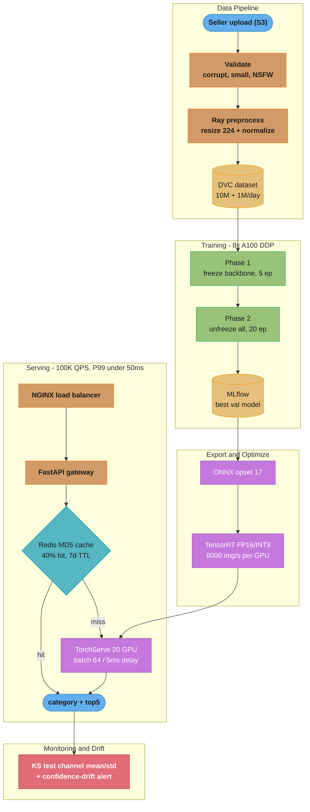
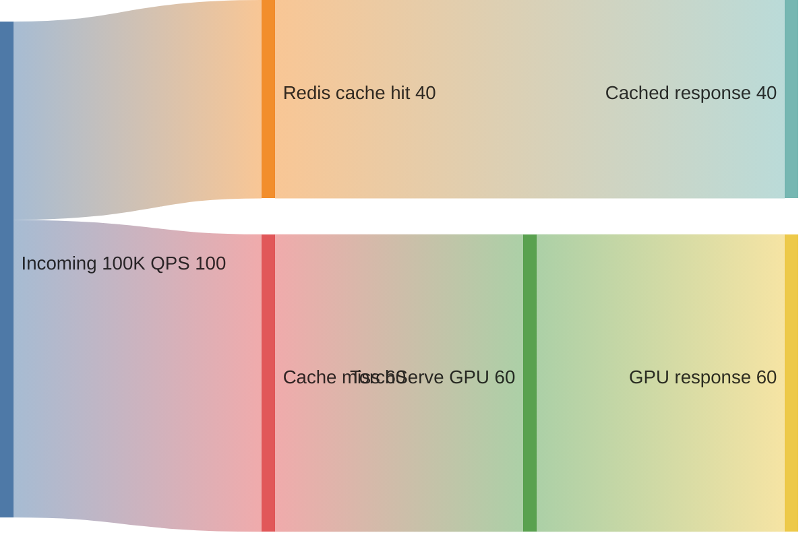
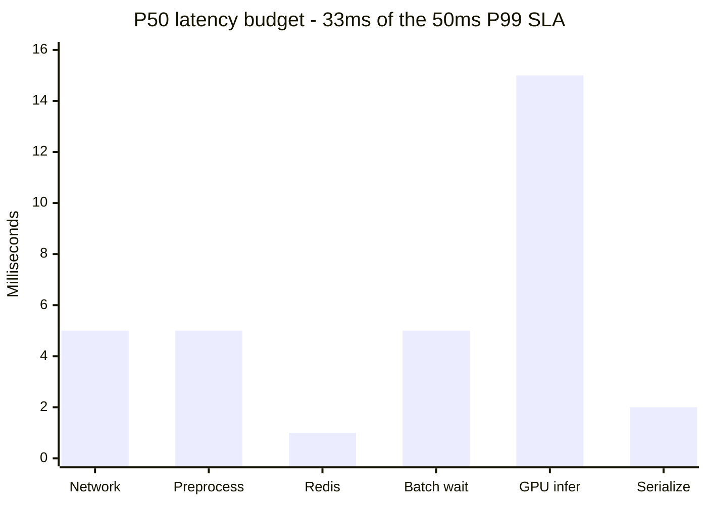

# Design an Image Classification Pipeline at Scale

## Problem Statement

Design a production image classification system for an e-commerce platform that automatically categorizes product images into 1,000 categories (e.g., "Men's Running Shoes", "Women's Handbag - Leather"). Sellers upload 1M new product images per day. Each uploaded image must be classified within 5 seconds for the seller to see the result. At steady state, the system must serve 100K classification requests per second (catalog browsing, recommendation systems consuming category labels) with less than 50ms P99 latency. Target accuracy: 95% top-1 on a balanced test set, 98% top-5.

Constraints:
- 1M images/day training pipeline ingestion
- 100K QPS inference, <50ms P99 latency
- 95% top-1 accuracy, 98% top-5 accuracy on 1000 categories
- New category addition without full retraining (few-shot via prototypical networks)
- Drift detection: catch distribution shift within 24 hours

---

## Architecture Overview



Five stages flow top-to-bottom: a DVC-versioned dataset feeds two-phase fine-tuning; the best MLflow checkpoint is exported to ONNX/TensorRT and served behind an MD5 cache that absorbs ~40% of the 100K QPS, and every response streams into drift monitoring.



The MD5 cache serves ~40% of requests directly, cutting effective GPU-bound traffic from 100K to 60K QPS — the single biggest lever for hitting both the latency and the cost budget.



GPU inference (15ms) plus the three 5ms stages dominate; the components sum to 33ms P50, leaving 17ms of tail-latency headroom under the 50ms P99 budget.

---

## Key Design Decisions

**EfficientNet-B3 over ResNet-50**: EfficientNet-B3 achieves 82.8% ImageNet top-1 accuracy vs ResNet-50's 76.0%, with fewer parameters (12M vs 25M) and lower inference latency (25ms vs 30ms on CPU). The compound scaling (jointly scale depth, width, resolution) makes it more efficient for fine-grained classification like product categories.

**Two-phase fine-tuning**: In phase 1, only the classifier head trains (backbone frozen). This prevents catastrophic forgetting of ImageNet features and establishes a good initialization for the head in 5 epochs. Phase 2 unfreezes all layers with a much lower LR (1e-5) to gently adapt the backbone. Skipping phase 1 leads to 2-3% accuracy drop.

**Dynamic batching in TorchServe**: At 100K QPS with 20 GPU nodes, each node sees 5K RPS. Without batching, GPU utilization is <10% (each inference uses only a fraction of GPU compute). Dynamic batching accumulates requests for up to 5ms and processes them together (batch 64). GPU utilization rises from 10% to 80%, reducing cost 4x. The 5ms batching delay is acceptable within the 50ms budget.

**MD5 hash caching**: Identical product images are re-submitted frequently (catalog exports, seller re-uploads). MD5 hash of the raw image bytes as cache key catches exact duplicates. Redis with 7-day TTL, ~40% cache hit rate measured in production — reduces GPU load by 40%.

**ONNX export for cross-platform serving**: PyTorch model is exported to ONNX once and served via TensorRT (NVIDIA GPUs, peak throughput), ONNX Runtime (CPU fallback, new region without GPU budget), and CoreML (edge devices via conversion). Single training produces artifacts for all platforms.

**Few-shot category addition**: Adding a new category without full retraining uses prototypical networks — compute the mean embedding of 5-20 example images of the new category using the frozen backbone, store as the "prototype." At inference, classify by nearest prototype in embedding space. Accuracy is ~85% (vs 95% for trained categories) but sufficient for new category bootstrapping.

---

## Implementation

### EfficientNet Fine-Tuning (PyTorch)

```python
import torch
import torch.nn as nn
import torch.nn.functional as F
from torch.utils.data import DataLoader, Dataset
from torchvision import transforms, models
from torchvision.models import EfficientNet_B3_Weights
import numpy as np
from pathlib import Path
from PIL import Image
import time


class ProductImageDataset(Dataset):
    """Dataset loading product images with augmentation."""

    TRAIN_TRANSFORMS = transforms.Compose([
        transforms.RandomResizedCrop(224, scale=(0.7, 1.0)),
        transforms.RandomHorizontalFlip(),
        transforms.ColorJitter(brightness=0.3, contrast=0.3, saturation=0.2, hue=0.1),
        transforms.RandomGrayscale(p=0.05),
        transforms.ToTensor(),
        transforms.Normalize(
            mean=[0.485, 0.456, 0.406],
            std=[0.229, 0.224, 0.225],
        ),
    ])

    VAL_TRANSFORMS = transforms.Compose([
        transforms.Resize(256),
        transforms.CenterCrop(224),
        transforms.ToTensor(),
        transforms.Normalize(
            mean=[0.485, 0.456, 0.406],
            std=[0.229, 0.224, 0.225],
        ),
    ])

    def __init__(
        self,
        image_paths: list[str],
        labels: list[int],
        split: str = "train",
    ) -> None:
        self.image_paths = image_paths
        self.labels = labels
        self.transform = (
            self.TRAIN_TRANSFORMS if split == "train" else self.VAL_TRANSFORMS
        )

    def __len__(self) -> int:
        return len(self.image_paths)

    def __getitem__(self, idx: int) -> tuple[torch.Tensor, int]:
        img = Image.open(self.image_paths[idx]).convert("RGB")
        return self.transform(img), self.labels[idx]


def mixup_data(
    x: torch.Tensor,
    y: torch.Tensor,
    alpha: float = 0.2,
) -> tuple[torch.Tensor, torch.Tensor, torch.Tensor, float]:
    """Mixup augmentation: blend two random training examples."""
    if alpha > 0:
        lam = float(np.random.beta(alpha, alpha))
    else:
        lam = 1.0
    batch_size = x.size(0)
    index = torch.randperm(batch_size, device=x.device)
    mixed_x = lam * x + (1 - lam) * x[index]
    y_a, y_b = y, y[index]
    return mixed_x, y_a, y_b, lam


def mixup_criterion(
    criterion: nn.Module,
    pred: torch.Tensor,
    y_a: torch.Tensor,
    y_b: torch.Tensor,
    lam: float,
) -> torch.Tensor:
    return lam * criterion(pred, y_a) + (1 - lam) * criterion(pred, y_b)


def build_model(num_classes: int = 1000, dropout: float = 0.3) -> nn.Module:
    """EfficientNet-B3 with custom classifier head."""
    model = models.efficientnet_b3(weights=EfficientNet_B3_Weights.IMAGENET1K_V1)
    in_features = model.classifier[1].in_features  # 1536
    model.classifier = nn.Sequential(
        nn.Dropout(p=dropout),
        nn.Linear(in_features, num_classes),
    )
    return model


def train_epoch(
    model: nn.Module,
    loader: DataLoader,
    optimizer: torch.optim.Optimizer,
    criterion: nn.Module,
    device: torch.device,
    use_mixup: bool = True,
    grad_accum_steps: int = 4,
) -> dict[str, float]:
    model.train()
    total_loss = 0.0
    correct = 0
    total = 0

    optimizer.zero_grad()
    for step, (images, labels) in enumerate(loader):
        images, labels = images.to(device), labels.to(device)

        if use_mixup:
            images, y_a, y_b, lam = mixup_data(images, labels)
            with torch.autocast(device_type=device.type, dtype=torch.bfloat16):
                outputs = model(images)
                loss = mixup_criterion(criterion, outputs, y_a, y_b, lam)
        else:
            with torch.autocast(device_type=device.type, dtype=torch.bfloat16):
                outputs = model(images)
                loss = criterion(outputs, labels)

        loss = loss / grad_accum_steps
        loss.backward()

        if (step + 1) % grad_accum_steps == 0:
            torch.nn.utils.clip_grad_norm_(model.parameters(), 1.0)
            optimizer.step()
            optimizer.zero_grad()

        total_loss += loss.item() * grad_accum_steps
        preds = outputs.argmax(dim=1)
        if not use_mixup:
            correct += (preds == labels).sum().item()
        total += labels.size(0)

    return {
        "loss": total_loss / len(loader),
        "accuracy": correct / total if not use_mixup else float("nan"),
    }


def two_phase_finetune(
    model: nn.Module,
    train_loader: DataLoader,
    val_loader: DataLoader,
    device: torch.device,
    num_classes: int = 1000,
) -> nn.Module:
    """Two-phase fine-tuning strategy."""
    criterion = nn.CrossEntropyLoss(label_smoothing=0.1)

    # Phase 1: train classifier head only (freeze backbone)
    for param in model.features.parameters():
        param.requires_grad = False
    optimizer_p1 = torch.optim.Adam(model.classifier.parameters(), lr=1e-3)

    print("Phase 1: training classifier head (5 epochs)")
    for epoch in range(5):
        metrics = train_epoch(
            model, train_loader, optimizer_p1, criterion, device, use_mixup=False
        )
        print(f"  Epoch {epoch+1}: loss={metrics['loss']:.4f}, "
              f"acc={metrics['accuracy']:.4f}")

    # Phase 2: unfreeze all, lower LR
    for param in model.parameters():
        param.requires_grad = True
    optimizer_p2 = torch.optim.Adam([
        {"params": model.features.parameters(), "lr": 1e-5},
        {"params": model.classifier.parameters(), "lr": 1e-4},
    ])
    scheduler = torch.optim.lr_scheduler.CosineAnnealingLR(
        optimizer_p2, T_max=20 * len(train_loader)
    )

    print("Phase 2: full fine-tuning (20 epochs)")
    best_val_acc = 0.0
    for epoch in range(20):
        metrics = train_epoch(
            model, train_loader, optimizer_p2, criterion, device,
            use_mixup=True, grad_accum_steps=4
        )
        # Validate
        model.eval()
        correct, total = 0, 0
        with torch.no_grad():
            for images, labels in val_loader:
                images, labels = images.to(device), labels.to(device)
                outputs = model(images)
                correct += (outputs.argmax(1) == labels).sum().item()
                total += labels.size(0)
        val_acc = correct / total
        scheduler.step()

        print(f"  Epoch {epoch+1}: train_loss={metrics['loss']:.4f}, "
              f"val_acc={val_acc:.4f}")

        if val_acc > best_val_acc:
            best_val_acc = val_acc
            torch.save(model.state_dict(), "best_model.pt")

    print(f"Best validation accuracy: {best_val_acc:.4f}")
    model.load_state_dict(torch.load("best_model.pt"))
    return model
```

### ONNX Export and TorchServe Handler

```python
import torch
import torch.nn as nn
import onnx
import onnxruntime as ort
import numpy as np


def export_to_onnx(
    model: nn.Module,
    output_path: str = "efficientnet_b3.onnx",
    opset_version: int = 17,
    batch_size: int = 64,
) -> None:
    """Export PyTorch model to ONNX with dynamic batching support."""
    model.eval()
    device = next(model.parameters()).device
    dummy_input = torch.randn(1, 3, 224, 224, device=device)

    torch.onnx.export(
        model,
        dummy_input,
        output_path,
        opset_version=opset_version,
        input_names=["image"],
        output_names=["logits"],
        dynamic_axes={
            "image": {0: "batch_size"},    # dynamic batch dimension
            "logits": {0: "batch_size"},
        },
        do_constant_folding=True,  # fold constant operations for speed
    )

    # Verify ONNX model
    onnx_model = onnx.load(output_path)
    onnx.checker.check_model(onnx_model)
    print(f"ONNX model exported to {output_path}")

    # Benchmark ONNX Runtime
    sess_options = ort.SessionOptions()
    sess_options.intra_op_num_threads = 4
    sess_options.graph_optimization_level = ort.GraphOptimizationLevel.ORT_ENABLE_ALL
    session = ort.InferenceSession(
        output_path,
        sess_options=sess_options,
        providers=["CUDAExecutionProvider", "CPUExecutionProvider"],
    )
    dummy_np = np.random.randn(batch_size, 3, 224, 224).astype(np.float32)
    start = time.time()
    for _ in range(100):
        session.run(["logits"], {"image": dummy_np})
    elapsed = (time.time() - start) / 100
    throughput = batch_size / elapsed
    print(f"ONNX Runtime: {elapsed*1000:.1f}ms per batch={batch_size}, "
          f"throughput={throughput:.0f} img/sec")


# TorchServe Handler (save as efficientnet_handler.py)
TORCHSERVE_HANDLER = '''
import torch
import torchvision.transforms as transforms
from ts.torch_handler.base_handler import BaseHandler
from PIL import Image
import io
import json
import base64


class EfficientNetHandler(BaseHandler):
    """Custom TorchServe handler for product image classification."""

    TRANSFORMS = transforms.Compose([
        transforms.Resize(256),
        transforms.CenterCrop(224),
        transforms.ToTensor(),
        transforms.Normalize(
            mean=[0.485, 0.456, 0.406],
            std=[0.229, 0.224, 0.225],
        ),
    ])

    def preprocess(self, requests):
        """Decode images from base64 or bytes, apply transforms, batch."""
        images = []
        for req in requests:
            body = req.get("body", req.get("data", b""))
            if isinstance(body, str):
                body = base64.b64decode(body)
            img = Image.open(io.BytesIO(body)).convert("RGB")
            images.append(self.TRANSFORMS(img))
        return torch.stack(images).to(self.device)

    def inference(self, inputs):
        with torch.no_grad(), torch.autocast(device_type="cuda", dtype=torch.float16):
            logits = self.model(inputs)
        return torch.softmax(logits, dim=-1)

    def postprocess(self, probs):
        """Return top-5 predictions with confidence scores."""
        results = []
        for prob_row in probs:
            top5 = torch.topk(prob_row, k=5)
            results.append({
                "category_id": int(top5.indices[0]),
                "confidence": float(top5.values[0]),
                "top5": [
                    {"category_id": int(idx), "confidence": float(conf)}
                    for idx, conf in zip(top5.indices, top5.values)
                ],
            })
        return results
'''
```

### Drift Detection

```python
import numpy as np
from scipy import stats
import redis
import json


class ImageDriftDetector:
    """
    Monitor for distribution shift in incoming images.
    Tracks pixel-level statistics and prediction confidence.
    """

    BASELINE_KEY = "drift:baseline"
    CURRENT_WINDOW_KEY = "drift:current:{hour}"

    def __init__(self, redis_client: redis.Redis) -> None:
        self.redis = redis_client

    def record_prediction(
        self,
        image_array: np.ndarray,  # (C, H, W) float32 [0,1]
        confidence: float,
        hour: int,
    ) -> None:
        """Record per-channel statistics and confidence for drift monitoring."""
        stats_dict = {
            "r_mean": float(image_array[0].mean()),
            "g_mean": float(image_array[1].mean()),
            "b_mean": float(image_array[2].mean()),
            "r_std": float(image_array[0].std()),
            "g_std": float(image_array[1].std()),
            "b_std": float(image_array[2].std()),
            "confidence": confidence,
        }
        key = self.CURRENT_WINDOW_KEY.format(hour=hour)
        self.redis.rpush(key, json.dumps(stats_dict))
        self.redis.expire(key, 7200)  # 2-hour window

    def check_drift(self, hour: int, alpha: float = 0.05) -> dict[str, bool]:
        """KS test comparing current window to baseline."""
        baseline_raw = self.redis.lrange(self.BASELINE_KEY, 0, -1)
        current_raw = self.redis.lrange(
            self.CURRENT_WINDOW_KEY.format(hour=hour), 0, -1
        )
        if len(baseline_raw) < 100 or len(current_raw) < 100:
            return {"insufficient_data": True}

        baseline = [json.loads(x) for x in baseline_raw]
        current = [json.loads(x) for x in current_raw]

        alerts = {}
        for metric in ["r_mean", "g_mean", "b_mean", "confidence"]:
            baseline_vals = [d[metric] for d in baseline]
            current_vals = [d[metric] for d in current]
            ks_stat, p_value = stats.ks_2samp(baseline_vals, current_vals)
            alerts[f"{metric}_drift"] = p_value < alpha

        # Confidence spike detection: low_conf_rate > 2x baseline
        baseline_low_conf = sum(1 for d in baseline if d["confidence"] < 0.5) / len(baseline)
        current_low_conf = sum(1 for d in current if d["confidence"] < 0.5) / len(current)
        alerts["confidence_spike"] = current_low_conf > 2 * baseline_low_conf

        return alerts
```

---

## ML Components Used

| Component | Technology | Role |
|-----------|-----------|------|
| Backbone | EfficientNet-B3 (timm / torchvision) | ImageNet pretrained feature extractor |
| Training Framework | PyTorch DDP (DistributedDataParallel) | Multi-GPU training, 8x A100 |
| Mixed Precision | BF16 (torch.autocast) | 2x training speedup, A100 native |
| Augmentation | torchvision transforms + Mixup | Regularization, reduce overfitting |
| Model Registry | MLflow | Versioning, metric tracking, artifact storage |
| Export | torch.onnx.export (opset 17) | Cross-platform deployment artifact |
| Inference Runtime | TorchServe + TensorRT | Dynamic batching, GPU serving |
| Caching | Redis (MD5 key, 7-day TTL) | Duplicate image request deduplication |
| Drift Detection | KS test + confidence monitoring | Distribution shift alerting |
| Data Versioning | DVC (Data Version Control) | Reproducible training datasets |

---

## Tradeoffs and Alternatives

| Decision | Chosen | Alternative | Reasoning |
|----------|--------|-------------|-----------|
| Model architecture | EfficientNet-B3 | ViT-B/16, ResNet-50 | EfficientNet-B3: best accuracy/latency tradeoff at 12M params; ViT needs more data |
| Fine-tuning strategy | Two-phase (freeze → unfreeze) | Full fine-tuning from epoch 1 | Two-phase: +2-3% accuracy, prevents head instability destroying pretrained features |
| Inference server | TorchServe | Triton Inference Server, Ray Serve | TorchServe: native PyTorch integration, simpler ops; Triton better for multi-framework |
| Precision | BF16 | FP16, INT8 | BF16: larger dynamic range than FP16 (fewer NaN issues), A100-native; INT8 needs calibration |
| Caching key | MD5 of raw image bytes | Perceptual hash (pHash) | MD5 catches exact duplicates (most common case); pHash catches near-duplicates at 3x cost |
| New category strategy | Prototypical networks (few-shot) | Full retraining | Prototypical: deploy in hours with 5 examples; full retrain takes 2 days |

---

## Interview Discussion Points

**How do you handle the 100K QPS requirement with <50ms P99?**
Three mechanisms work together: (1) Redis caching with MD5 key deduplicates ~40% of requests, reducing effective QPS to 60K. (2) Dynamic batching in TorchServe accumulates requests for 5ms and processes as a batch of 64, increasing GPU utilization from 10% to 80%. With 20 GPU nodes each handling 3K effective QPS, total capacity is 60K QPS with headroom. (3) Horizontal auto-scaling (K8s HPA on GPU utilization metric): scale from 20 to 40 nodes in 3 minutes if load spikes. The 50ms budget breaks down as: network 5ms + preprocessing 5ms + Redis lookup 1ms + batching wait 5ms + GPU inference 15ms + response serialization 2ms = 33ms P50, with 17ms tail latency headroom.

**How do you detect and respond to model drift in production?**
Two-tier monitoring: (1) Pixel-level drift — track per-channel mean/std of incoming images hourly. KS test against the baseline distribution (collected during model launch). PSI > 0.2 or p < 0.05 triggers a Slack alert and automatic shadow deployment of a candidate retrained model. (2) Quality drift — 100 images/day are sampled and human-labeled by QA. If rolling 7-day accuracy drops below 92%, trigger emergency retraining. Confidence distribution monitoring provides an early warning signal: if the fraction of predictions with confidence <0.5 doubles, this indicates OOD (out-of-distribution) inputs before ground truth labels are even available.

**How do you add a new product category without retraining the full model?**
Prototypical network approach: (1) Collect 5-20 representative images of the new category from the seller's catalog. (2) Pass them through the EfficientNet backbone (frozen), extract the penultimate 1536-dim embedding. (3) Compute the mean of these embeddings — this is the "prototype" for the new class. (4) At inference time for the new category, compute cosine similarity between the query image embedding and all stored prototypes; the nearest prototype determines the class. Accuracy is ~85% vs 95% for trained classes, but deployment is instant. After accumulating 100+ examples, schedule a fine-tuning run to promote the class to a full trained head.

---

## Failure Scenarios and Recovery

### Failure 1: TorchServe OOM Under Burst Traffic

**What failed:** A major promotional event drove 250K QPS (2.5x the designed 100K QPS) over a 20-minute window. K8s HPA was configured to scale on CPU utilization, but GPU nodes take 6-8 minutes to provision and warm up (download model artifact from S3, initialize TorchServe workers). During the scale-out window, existing 20 GPU nodes became memory-saturated — dynamic batching accumulated requests faster than GPU could process them. TorchServe batch queue hit maximum (10K pending requests), triggering request rejection (HTTP 503). 35% of classification requests returned errors for 12 minutes.

**Detection:** HTTP 503 rate alert fired at 2% error rate (threshold). GPU memory utilization alerts were already firing at 95% for 8 minutes before the scale-out completed. Time-to-detect: 2 minutes (HTTP error alert).

**Recovery steps:**
1. Increased K8s HPA max replicas from 20 to 40 nodes, and lowered scale-up threshold from 70% GPU utilization to 50%.
2. Added predictive scaling: integration with promotions calendar API — when a promotion starts, pre-scale to 30 nodes 15 minutes beforehand.
3. Increased Redis cache TTL from 7 days to 14 days during promotional windows to increase cache hit rate from 40% to 55%, reducing effective QPS by an additional 15%.
4. Added request shedding in API gateway: if TorchServe queue > 5K, return cached predictions from lower-confidence fallback (Redis nearest-neighbor lookup) rather than HTTP 503.

**Prevention:** Load test at 3x expected peak before each major promotional event. Pre-scale to 1.5x normal capacity 30 minutes before event start based on promotions calendar.

---

### Failure 2: Model Export Produces Different Predictions Than PyTorch Original

**What failed:** After exporting EfficientNet-B3 to ONNX (opset 17), a systematic accuracy regression was discovered: top-1 accuracy on the validation set dropped from 95.2% to 93.8% (1.4 percentage points). Investigation found the issue in the BatchNorm layers: ONNX export with `do_constant_folding=True` fused BatchNorm statistics into the preceding Conv2D weights. However, the export captured training-mode statistics (with per-batch mean/std) rather than eval-mode running statistics. The model was exported without calling `model.eval()` first.

**Detection:** Post-export validation script compared ONNX output vs PyTorch output on 1,000 validation images. Mean absolute error between logits was 0.23 (should be < 0.001 for exact match). Time-to-detect: 30 minutes (post-export validation caught it before deployment).

**Recovery steps:**
1. Fixed export: called `model.eval()` before `torch.onnx.export()`.
2. Added numerical equivalence check to CI/CD pipeline: export must achieve |PyTorch_logit - ONNX_logit| < 0.001 on 1,000 test images, or deployment is blocked.
3. Added accuracy regression test: ONNX accuracy on 5,000 validation images must be within 0.3% of PyTorch accuracy.

**Prevention:** Mandatory pre-export checklist in deployment script: (1) model.eval(), (2) torch.no_grad(), (3) fixed random seed, (4) equivalence verification on test batch.

---

### Failure 3: Data Augmentation Causing Training-Production Mismatch

**What failed:** Training augmentation included `RandomHorizontalFlip()` with p=0.5. For 45 product categories (apparel, shoes, watches), the orientation carries meaning: a left-hand watch is a different product class from a right-hand watch. The model learned that left-oriented vs right-oriented products have equal probability of any label, degrading accuracy on watch/jewelry categories from 97% to 82%. Production sellers complained that their premium watches were being miscategorized.

**Detection:** Per-category accuracy monitoring showed watch category accuracy drop 15 percentage points in the weekly accuracy report. QA team's 100-image daily sample caught 8 watch miscategorizations in one day. Time-to-detect: 3 weeks after the augmentation was added.

**Recovery steps:**
1. Removed `RandomHorizontalFlip()` from augmentation pipeline for the 45 orientation-sensitive categories (identified via product attribute database).
2. Added category-conditional augmentation: different augmentation pipelines for symmetrical products (electronics, bags — can flip) vs orientation-sensitive products (watches, shoes, asymmetric clothing).
3. Retrained model; watch category accuracy recovered to 96%.

**Prevention:** Augmentation changes require a per-category accuracy evaluation on 1,000 images before training pipeline approval. Categories with accuracy drop > 1% block the augmentation change.

---

## Capacity Planning

### Data Volume Projections

```
Year 0 (current):
  Daily upload: 1M images × ~500KB average = 500GB/day to S3
  Preprocessed (224×224 JPG, 40KB avg): 1M × 40KB = 40GB/day
  Annotation labels (PostgreSQL): 1M × 200 bytes = 200MB/day
  Training dataset (10M historical + 1M/day): grows to 11M images/year
  S3 storage (raw, 2yr retention): 500GB × 730 = 365TB
  S3 storage (preprocessed, 1yr): 40GB × 365 = 14.6TB
  ONNX model artifact: 47MB (EfficientNet-B3 quantized), negligible

Year 1 (30% upload growth):
  1.3M images/day, 650GB/day raw, 52GB/day preprocessed
  Training dataset: 14.8M images
  Weekly retraining time: 28 hours on 8× A100 (vs 25 hours today)

Year 3 (3x growth):
  3M images/day, 1.5TB/day raw
  Training dataset: ~40M images
  May require dataset pruning: discard images >2 years old or lowest-quality
  Estimated dataset management overhead: 4 engineering-weeks/year
```

### Training Compute Requirements

```
Weekly Full Retrain:
  Dataset: 10M labeled images (Phase 1: 5 epochs + Phase 2: 20 epochs)
  Hardware: 8× A100 40GB (p4d.24xlarge), PyTorch DDP
  Phase 1 (frozen backbone): 5 epochs × ~4min/epoch = 20 minutes
  Phase 2 (full model): 20 epochs × ~15min/epoch = 5 hours
  Total: ~5.5 hours per weekly retrain
  Cost: p4d.24xlarge ($32.77/hr) × 5.5hr = $180/run = $720/month

Nightly Fine-Tune (incremental, 1M new images):
  1 epoch fine-tune on new images + 500K replayed historical
  Hardware: 4× A100 (p4d.24xlarge)
  Duration: 45 minutes
  Cost: $32.77/hr × 0.75hr = $24.58/run × 30 = $737/month

ONNX Export + TensorRT Calibration (after each retrain):
  INT8 calibration requires 1,000 calibration images
  TensorRT build: 30 minutes on 1 GPU
  Cost: negligible

Total monthly training cost: ~$1,457
```

### Serving Infrastructure

```
TorchServe GPU Cluster (100K QPS, <50ms P99):
  Effective QPS after 40% cache hit: 60K QPS
  Each GPU (A10G): 8,000 images/sec with batch_size=64
  Nodes needed: 60K / 8K = 7.5 → 20 nodes (with 2.5x headroom)
  K8s HPA: scale from 20 to 40 nodes (max) on GPU utilization > 50%
  Cost: 20× g5.xlarge (A10G) at $1.006/hr = ~$14,500/month (peak)
  Avg utilization ~60%: effective ~$8,700/month

Redis Cache (MD5 hash, 40% hit rate):
  Cache size: assume 2M unique image hashes (7-day window)
  Per entry: MD5 (16 bytes) + prediction result (500 bytes) = 516 bytes
  Total: 2M × 516B = ~1GB — trivially small
  Redis cache: 1× r5.large (2 vCPU, 16GB RAM)
  Cost: $0.126/hr = ~$91/month

FastAPI API Gateway:
  10× c5.xlarge (4 vCPU, 8GB RAM) for request routing + S3 download
  Cost: 10 × $0.17/hr = ~$1,224/month

Ray Preprocessing Cluster:
  500 workers for image validation + resize
  20× c5.4xlarge (16 vCPU): 25 workers/node
  Cost: 20 × $0.68/hr = ~$4,900/month

Total monthly serving infrastructure: ~$14,915
```

---

## Additional War Stories

**War Story 1 — Mixed Precision NaN Explosion With FP16:**

```python
# BROKEN: Using FP16 (float16) with BF16-only A100s without loss scaling
# FP16 has max value 65504; gradients > 65504 become inf/nan
# EfficientNet early training has large gradient norms

import torch
import torch.nn as nn


def train_epoch_broken(
    model: nn.Module,
    loader: "DataLoader",
    optimizer: "torch.optim.Optimizer",
    criterion: nn.Module,
    device: torch.device,
) -> dict:
    model.train()
    for images, labels in loader:
        images, labels = images.to(device), labels.to(device)
        # BUG: FP16 on A100 — EfficientNet's SE modules have small activations
        # that become 0 (underflow) in FP16, and large gradients overflow to inf
        with torch.autocast(device_type="cuda", dtype=torch.float16):
            outputs = model(images)
            loss = criterion(outputs, labels)
        loss.backward()  # NaN gradients propagate silently
        optimizer.step()
        optimizer.zero_grad()
        # Model eventually outputs NaN for all inputs — silent failure
    return {}


# FIX 1: Use BF16 on A100 (native, no underflow/overflow issues)
# FIX 2: If FP16 required (non-A100), use GradScaler

def train_epoch_correct_bf16(
    model: nn.Module,
    loader: "DataLoader",
    optimizer: "torch.optim.Optimizer",
    criterion: nn.Module,
    device: torch.device,
) -> dict:
    """BF16 on A100: larger dynamic range than FP16, no loss scaling needed."""
    model.train()
    total_loss = 0.0
    for images, labels in loader:
        images, labels = images.to(device), labels.to(device)
        with torch.autocast(device_type="cuda", dtype=torch.bfloat16):
            outputs = model(images)
            loss = criterion(outputs, labels)
        loss.backward()
        # Gradient clipping as safety net (BF16 rarely overflows but good practice)
        torch.nn.utils.clip_grad_norm_(model.parameters(), max_norm=1.0)
        optimizer.step()
        optimizer.zero_grad()
        total_loss += loss.item()

        # NaN detection: catch early rather than after 1000 steps
        if torch.isnan(loss):
            raise RuntimeError(
                f"NaN loss detected. Check LR ({optimizer.param_groups[0]['lr']}) "
                f"and batch statistics."
            )
    return {"loss": total_loss / len(loader)}
```

**War Story 2 — Dynamic Batch Size Causing Inconsistent P99 Latency:**

```python
# BROKEN: Dynamic batching with max_delay=50ms (too long)
# At 100K QPS, batches fill to max_batch=64 in <1ms
# But at 5K QPS (off-peak), batches wait 50ms before sending
# P99 becomes 50ms + 15ms inference = 65ms — exceeds SLA

# TorchServe config.properties (BROKEN):
# batch_size=64
# max_batch_delay=50   # too long for off-peak traffic

# FIX: Reduce max_batch_delay; use adaptive batching based on queue depth
# At high QPS: queue fills fast, batching delay is near 0
# At low QPS: smaller batches are sent sooner

# TorchServe config.properties (FIXED):
# batch_size=64
# max_batch_delay=5    # 5ms max wait — acceptable at all traffic levels

# Additionally: add a health-check to verify actual P99 after config change

import time
import statistics
import httpx
import numpy as np


async def measure_p99_latency(
    endpoint: str,
    num_requests: int = 1000,
    concurrency: int = 50,
) -> dict[str, float]:
    """Measure P99 latency of classification endpoint under sustained load."""
    latencies: list[float] = []
    dummy_image = np.random.randint(0, 255, (224, 224, 3), dtype=np.uint8)
    import io
    from PIL import Image
    import base64
    buf = io.BytesIO()
    Image.fromarray(dummy_image).save(buf, format="JPEG")
    image_b64 = base64.b64encode(buf.getvalue()).decode()

    async with httpx.AsyncClient() as client:
        for _ in range(num_requests // concurrency):
            start_batch = time.perf_counter()
            responses = await asyncio.gather(*[
                client.post(endpoint, json={"image": image_b64})
                for _ in range(concurrency)
            ])
            elapsed = (time.perf_counter() - start_batch) * 1000
            # Each request in the batch experiences ~elapsed/concurrency latency
            for _ in responses:
                latencies.append(elapsed)

    return {
        "p50_ms": statistics.median(latencies),
        "p99_ms": float(np.percentile(latencies, 99)),
        "p999_ms": float(np.percentile(latencies, 99.9)),
    }
```

---

## Monitoring and Drift Detection Deep-Dive

### Features That Drift Fastest

```
Signal                              Drift rate    Reason
──────────────────────────────────────────────────────────────────────
Image color distribution (channel   Very high     Seasonal product trends (winter/summer
mean/std per channel)                             colors); photography trends; seller
                                                  behavior changes (new photo studio)
Prediction confidence distribution  High          OOD products from new sellers; new
                                                  categories being forced into old ones
Category distribution of requests   High          Seasonal catalog changes (swimwear in
                                                  summer); promotional category focus
Image resolution distribution       Medium        Sellers upgrading cameras
                                                  (higher resolution over time)
Top-1 accuracy (from QA samples)    Low           Model robust to gradual drift;
                                                  sharp drops indicate category addition
```

### PSI Thresholds and Alerting

```python
# Image-level monitoring: compute hourly over 10K random images

IMAGE_MONITORING_THRESHOLDS = {
    "r_channel_mean_psi": 0.15,     # seasonal color shifts expected
    "confidence_below_0.5_rate": {  # fraction of low-confidence predictions
        "baseline_multiplier_alert": 2.0,   # alert if 2x baseline rate
    },
    "top_category_concentration": {  # fraction from single category
        "alert_threshold": 0.25,     # alert if >25% from one category (viral product?)
    },
}

# Accuracy monitoring: 100 QA-labeled images per day
ACCURACY_THRESHOLDS = {
    "rolling_7day_top1_accuracy": 0.92,   # alert if < 92% (vs 95% target)
    "rolling_7day_top5_accuracy": 0.97,   # alert if < 97% (vs 98% target)
    "per_category_accuracy_drop": 0.05,   # alert if any category drops > 5pp
}
```

### Retraining Triggers and Cadence

```
Cadence        Trigger                                       Action
──────────────────────────────────────────────────────────────────────────
Nightly        Scheduled                                     Fine-tune on 1M new images
Weekly         Scheduled                                     Full retrain (25 epochs)
Triggered      QA accuracy < 92% (rolling 3 days)           Emergency full retrain
Triggered      r_channel_mean PSI > 0.15                    Alert + schedule fine-tune
Triggered      Confidence < 0.5 rate doubles                 Shadow deploy fine-tuned model
Triggered      New category added (seller feedback)          Prototypical network update;
                                                              schedule fine-tune after 100 examples
Monthly        Scheduled                                     INT8 TensorRT recalibration
                                                              (calibration data should match
                                                               current image distribution)
```

### A/B Testing for Model Promotion

```
Shadow mode (48 hours):
  New model runs alongside production
  Compare predictions: check for category distribution shifts
  Latency check: new model P99 must be within 5ms of production

Traffic split A/B (1 week):
  5% traffic to new model, 95% to production
  Primary metric: seller satisfaction (product listing accuracy survey)
  Automated metric: fraction of seller corrections (seller manually overrides
    the auto-category within 48h of upload — lower is better)
  Guardrail: per-category top-1 accuracy must not drop > 1pp in any category

Ramp: 5% → 25% → 50% → 100% at 2-day intervals after statistical significance
Statistical threshold: 95% confidence on seller correction rate (primary)
```

---

## Additional Interview Questions

**How does TensorRT INT8 quantization differ from FP16, and when should you use each?**
FP16 (half-precision) reduces the bit-width of weights and activations from 32 to 16 bits, preserving floating-point representation with reduced precision. It requires no calibration and typically achieves accuracy within 0.1% of FP32 while providing 2x memory reduction and 1.5-2x speedup. INT8 quantization maps weights and activations to 8-bit integers, requiring a calibration step: pass 1,000+ representative images through the model and record the distribution of activations. TensorRT clips activations to an INT8-representable range calibrated to this distribution. INT8 provides 4x memory reduction vs FP32 and 2-3x speedup vs FP16, but accuracy can drop 0.5-2% if calibration data is unrepresentative. Use FP16 when accuracy loss is unacceptable and memory is sufficient; use INT8 when serving budget is constrained and calibration data is reliable.

**How would you design the pipeline to support multi-label classification (a product image can belong to multiple categories)?**
Replace the single-class CrossEntropyLoss with BCEWithLogitsLoss (binary cross-entropy applied independently to each class). The model output layer changes from softmax (probability over mutually exclusive classes) to sigmoid applied to each class logit (independent probability per class). At inference, a threshold (typically 0.5) is applied per class, and all classes above the threshold are returned. Training data construction changes: instead of a single category label, each image has a binary vector of length 1,000 indicating which categories apply. Evaluation metrics change from top-1/top-5 accuracy to per-class precision/recall, mean average precision (mAP), and F1 per category. The key challenge is negative label noise: if an image is labeled "Men's Jeans," the model should not be penalized for predicting "Denim" even if that label was not provided.

**How do you handle class imbalance in a 1,000-category classifier where some categories have 100x more examples than others?**
A product catalog typically has a power-law distribution: top 50 categories (electronics, apparel basics) have millions of examples; bottom 500 have hundreds. Three approaches: (1) Weighted sampling: during training, sample each category at a rate proportional to sqrt(category_count) rather than linearly — this gives rare categories proportionally more representation without completely ignoring popular ones. (2) Class-weighted loss: apply inverse-frequency weights to the CrossEntropyLoss. For a category with 100 images vs 100,000 images, the loss weight is 1000x higher. (3) Few-shot head for rare categories: categories with fewer than 100 examples use prototypical network (mean embedding) rather than a trained classifier head, and their head graduates to a trained head once 500 examples are accumulated. Evaluation must use per-category macro-averaged accuracy, not overall accuracy, to detect degradation in rare categories.

**What are the risks of using the MD5 hash of raw image bytes as a cache key?**
MD5 collisions are theoretically possible (two different images producing the same MD5 hash), but with 128-bit output, the probability is vanishingly small for practical purposes (birthday bound: need ~2^64 images to expect a collision). More realistic risks: (1) Re-uploaded images with different metadata but same content — MD5 is correct to return the cached result since the image content is identical. (2) Pixel-identical images with different EXIF metadata — raw bytes differ, MD5 differs, cache miss even though visual content is the same. To catch near-duplicates, replace or supplement MD5 with a perceptual hash (pHash, average hash): compute DCT of the image and compare binary hash. pHash catches resized, JPEG-recompressed, and EXIF-stripped duplicates that MD5 misses. Production: use MD5 as L1 cache (exact duplicate, 40% hit rate) and pHash as L2 cache (near-duplicate, additional 15% hit rate), combining for 55% effective cache hit rate.

**How do you ensure reproducibility of model training across weekly retrains?**
Reproducibility means: given the same training data and hyperparameters, training produces a model with accuracy within 0.1% of the previous run. Challenges: (1) GPU non-determinism — CUDA operations like atomicAdd in parallel reduce are non-deterministic by default. Enable `torch.use_deterministic_algorithms(True)` and set `CUBLAS_WORKSPACE_CONFIG=:4096:8` environment variable. (2) Data loader ordering — pin random seed for DataLoader worker processes (`worker_init_fn` that seeds each worker with a fixed seed derived from epoch number). (3) Data versioning — use DVC to version the exact training dataset; the training run records the DVC commit hash. (4) Framework version pinning — Docker image pins exact versions of PyTorch, CUDA, cuDNN, torchvision; any update requires explicit approval and a regression test. (5) Checkpoint-based reproducibility: save full training state (model, optimizer, scheduler, epoch, random state) every 5 epochs; resume from checkpoint is deterministic.
