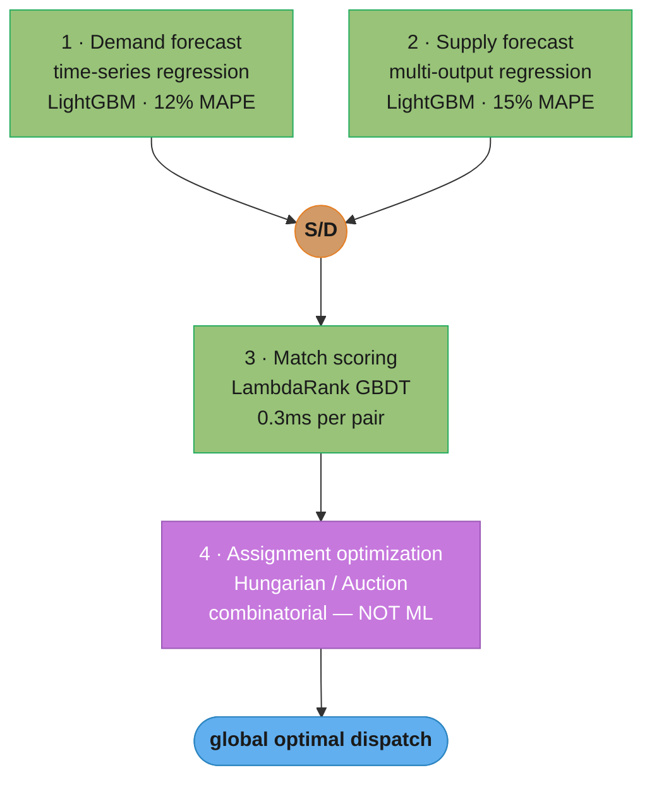
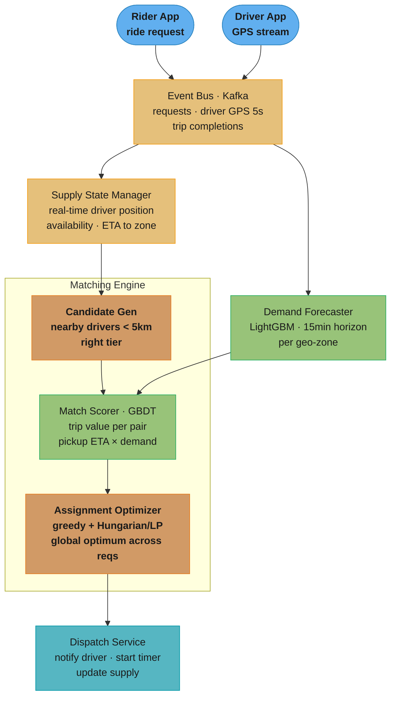
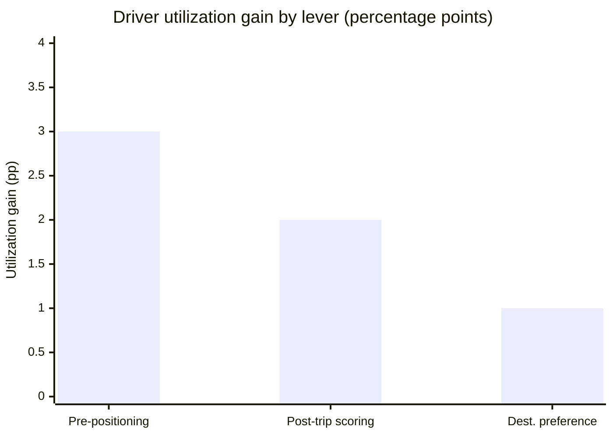

# Design a Marketplace Matching System

## Intuition

> A marketplace matching system is like an air traffic controller: it must coordinate hundreds of moving entities in real time, each with different destinations, capacities, and priorities — making irreversible decisions under uncertainty while maximizing global throughput, not just individual trip quality.

**Key insight:** marketplace matching is not one ML problem — it is a composition of four distinct sub-problems, each requiring a fundamentally different algorithm class: (1) demand forecasting (predict how many rides will be requested per zone in the next 15 minutes — time-series regression); (2) supply forecasting (predict driver availability per zone — multi-output regression); (3) match scoring (estimate trip value for each driver-rider pair — GBDT ranking model); (4) assignment optimization (given scores, find the global optimal assignment — combinatorial optimization, not ML). Using ML where optimization is needed — or optimization where ML is needed — is a common and expensive failure mode.

Mental model: the marketplace is a bipartite matching problem. On the left: riders (known demand, known destinations). On the right: drivers (known positions, unknown future positions). An ML system predicts the values on the edges (trip quality, expected revenue, driver availability probability). A combinatorial solver finds the assignment that maximizes total edge value across all concurrent matches. The ML and optimization components are cleanly separated — each solvable independently.



*The four sub-problems, color-separated: three learned models (green) feed a purple combinatorial solver that is deliberately not ML. Reaching for an RL policy at the assignment step — or ARIMA per-zone at the forecasting step — is the classic mismatch this decomposition avoids.*

---

## 1. Requirements Clarification

**Functional requirements:**
- Match available drivers to ride requests within 30 seconds of request submission.
- Sub-systems: demand forecasting (15-minute horizon), supply forecasting (15-minute horizon), match scoring (driver-rider pair value), and assignment optimization (global assignment across N riders × M drivers).
- Support tiered service levels: standard, premium (SUV/XL), and accessibility (wheelchair accessible).
- Dynamic surge pricing (consumes supply/demand forecasts): separate but closely coupled system.

**Non-functional requirements:**
- Matching latency: assignment must complete in < 3 seconds from rider request to driver assignment confirmation.
- Scale: 10M concurrent trips globally; 50k new ride requests/minute at peak.
- Match quality: 90th percentile rider wait time ≤ 8 minutes in dense urban areas.
- Driver utilization: target ≥ 70% trip-time utilization (time driving with a passenger / total time online).
- Supply forecasting accuracy: MAPE ≤ 15% at 15-minute horizon per zone.
- Demand forecasting accuracy: MAPE ≤ 12% at 15-minute horizon per zone.

**Out of scope:**
- Route optimization (provided by routing service).
- ETA calculation (provided by ETA service, see `design_eta_prediction.md`).
- Payment processing.
- Driver onboarding or rating.

---

## 2. Scale Estimation

**Demand scale:** 10M rides/day globally = 417k rides/hour average; 1M rides/hour peak (rush hour, major event). 50k requests/minute peak = 833 requests/second.

**Matching candidates:** each incoming ride request is evaluated against all available drivers within 5km. In a dense city: 500 available drivers within 5km at peak → 500 driver-rider pairs to score per request. At 833 requests/second: 833 × 500 = 416k pair scorings/second.

**Supply/demand zones:** each city divided into 500m × 500m geo-hash cells. A major city (Los Angeles): ~15k zones. Demand and supply forecasting runs every 5 minutes per zone: 15k × (1/5min) = 50 forecasts/second for one city; 50 cities = 2,500 forecasts/second.

**Training data:** 3 years × 10M rides/day = 10B training examples for the match scoring model. Subsampled to 500M for practical training. Demand forecasting training: 15k zones × 3 years × 365 days × 96 5-minute intervals/day = 1.6B zone-interval records.

**Infrastructure:**
- Match scoring: stateless horizontal service; 416k scorings/second requires 1,000 CPU cores (at 0.5ms per GBDT inference); 125 × 8-core servers.
- Assignment optimization (Hungarian algorithm or auction): for N=50 riders × M=500 drivers, Hungarian O(N²M) is too slow; use greedy or LP relaxation at <50ms.
- Demand/supply forecasting: 50 parallel forecasting workers, one per city; update every 5 minutes.

---

## 3. High-Level Architecture



*Rider and driver events land on one Kafka bus; the demand forecaster supplies market context and the supply manager supplies the candidate set, which the GBDT scorer prices per pair before the combinatorial optimizer picks the globally best assignment — three learned models feeding one non-ML solver.*

**Data flow:** ride request → Kafka → demand forecaster (context) + supply state (available drivers) → candidate generation (drivers within 5km) → match scorer (GBDT: value per pair) → assignment optimizer (globally optimal assignment) → dispatch service (notify driver).

---

## 4. Component Deep Dives

### 4.1 Demand Forecasting — Time-Series Model

```python
import numpy as np
import pandas as pd
import lightgbm as lgb
from datetime import datetime, timedelta

def create_demand_features(
    history: pd.DataFrame,   # historical ride requests per zone per 5-minute interval
    zone_id: str,
    as_of: datetime,
    horizon_minutes: int = 15,
) -> dict[str, float]:
    """
    Feature engineering for demand forecasting.
    Key insight: demand has strong periodicity (weekly × daily × hourly).
    Lag features + rolling aggregates capture both seasonality and trend.
    """
    zone_hist = history[history["zone_id"] == zone_id].sort_values("interval_start")
    zone_hist = zone_hist[zone_hist["interval_start"] < as_of]  # PIT correctness

    def get_lag(lag_intervals: int) -> float:
        idx = len(zone_hist) - lag_intervals
        return float(zone_hist.iloc[idx]["demand"]) if idx >= 0 else 0.0

    temporal = {
        "hour_of_day": as_of.hour + as_of.minute / 60,
        "day_of_week": as_of.weekday(),
        "is_rush_hour": int(7 <= as_of.hour <= 9 or 17 <= as_of.hour <= 19),
        "is_weekend": int(as_of.weekday() >= 5),
    }

    lags = {
        "lag_1_interval": get_lag(1),      # 5 min ago
        "lag_3_interval": get_lag(3),      # 15 min ago
        "lag_12_interval": get_lag(12),    # 1 hour ago
        "lag_288_interval": get_lag(288),  # same time yesterday
        "lag_2016_interval": get_lag(2016),  # same time last week
        "roll_mean_12": float(zone_hist["demand"].tail(12).mean()),  # 1h rolling avg
        "roll_std_12": float(zone_hist["demand"].tail(12).std()),    # 1h volatility
    }

    return {**temporal, **lags, "zone_id_hash": hash(zone_id) % 1000}

# Model: LightGBM with quantile objective at q=0.5 (demand forecast) and q=0.85 (surge buffer)
# Why LightGBM over ARIMA or Prophet:
# - 50 cities × 15k zones = 750k separate series → fitting ARIMA per series is infeasible
# - LightGBM shares patterns across zones (zone_id_hash feature) and cities
# - Handles exogenous variables (events, weather) natively as features
# - 15% MAPE vs 22% MAPE for Prophet on this dataset
```

### 4.2 Match Scoring — GBDT Ranking Model

```python
import lightgbm as lgb
import numpy as np

def create_match_features(
    driver: dict,          # driver position, rating, vehicle type, trip history
    rider: dict,           # rider position, destination, tier, rating
    eta_seconds: float,    # ETA from driver to rider (from ETA service)
    zone_demand_forecast: float,  # predicted demand in rider's zone for next 15min
    zone_supply_forecast: float,  # predicted supply in rider's zone for next 15min
) -> np.ndarray:
    """Features for scoring a driver-rider match pair."""
    return np.array([
        eta_seconds,                                      # pickup time (lower = better)
        driver["driver_rating"],                          # quality proxy
        rider["rider_rating"],                            # cancellation risk proxy
        float(driver["vehicle_type"] == rider["tier"]),  # tier match (binary)
        zone_demand_forecast / (zone_supply_forecast + 1e-9),  # supply-demand ratio
        driver["trips_completed_today"],                  # driver fatigue proxy
        driver["acceptance_rate_7d"],                    # reliability
        rider["historical_cancel_rate"],                  # cancellation risk
        float(driver["distance_to_next_hotspot_m"]) / 1000.0,  # post-trip positioning
        eta_seconds * zone_demand_forecast,               # interaction: long ETA in high demand = worse
    ], dtype=np.float32)

# Training: use completed trip data with outcome = trip revenue × driver rating × (1 - cancel_prob)
# LambdaRank or pairwise ranking loss: for each request, rank drivers by expected match value
lgbm_ranker = lgb.LGBMRanker(
    objective="lambdarank",
    ndcg_eval_at=[1, 3, 5],
    n_estimators=300,
    num_leaves=31,
    random_state=42,
)
```

### 4.3 Assignment Optimization — Broken Then Fixed

```python
import numpy as np
from typing import List, Tuple

# WRONG: greedy per-request assignment — not globally optimal
def greedy_match_wrong(
    requests: list[dict],   # list of ride requests
    scores: np.ndarray,     # score matrix [n_requests × n_drivers]
) -> list[Tuple[int, int]]:
    """Greedy: assign each request to the highest-scoring available driver."""
    assignments = []
    used_drivers = set()
    for i, _ in enumerate(requests):
        driver_scores = scores[i].copy()
        driver_scores[list(used_drivers)] = -np.inf   # mask used drivers
        best_driver = int(np.argmax(driver_scores))
        assignments.append((i, best_driver))
        used_drivers.add(best_driver)
    return assignments
# Problem: greedy may give the "best" driver to request 1, leaving a poor match for request 2.
# Global optimal assignment can improve total trip value by 8-15% vs greedy.
```

```python
# CORRECT: Hungarian algorithm for optimal bipartite matching (small N)
# or Auction algorithm for large N (Bertsekas, O(NM log N))
from scipy.optimize import linear_sum_assignment

def optimal_assignment(
    cost_matrix: np.ndarray,  # [n_requests × n_drivers], higher score = better match
) -> list[Tuple[int, int]]:
    """
    Hungarian algorithm: finds the global optimal assignment.
    O(N³) complexity → feasible for N < 1000 (requests in one matching cycle).
    For N > 1000: use auction algorithm or LP relaxation with rounding.
    """
    n_requests, n_drivers = cost_matrix.shape
    # linear_sum_assignment minimizes cost; negate for maximization
    row_ind, col_ind = linear_sum_assignment(-cost_matrix)
    return list(zip(row_ind.tolist(), col_ind.tolist()))

def batched_optimal_assignment(
    requests: list[dict],
    drivers: list[dict],
    score_fn,                 # callable: (request, driver) → float
    batch_window_ms: int = 500,  # collect requests for 500ms, then solve
) -> list[Tuple[int, int]]:
    """
    Batch requests over a short window before solving.
    Key insight: solving 500 requests jointly is better than 500 greedy 1-by-1 solves.
    Trade-off: 500ms latency vs quality improvement.
    """
    cost_matrix = np.zeros((len(requests), len(drivers)))
    for i, req in enumerate(requests):
        for j, drv in enumerate(drivers):
            cost_matrix[i][j] = score_fn(req, drv)
    return optimal_assignment(cost_matrix)
```

### 4.4 Contextual Bandits for Exploration

```python
import numpy as np

class EpsilonGreedyDispatch:
    """
    Epsilon-greedy exploration: with probability epsilon, dispatch to a
    non-optimal driver to collect data on driver-rider pair quality.
    This prevents the assignment model from collapsing to always
    recommending the same high-rated drivers (feedback loop).
    """
    def __init__(self, epsilon: float = 0.02) -> None:
        self.epsilon = epsilon    # 2% random exploration

    def select_driver(
        self,
        scores: np.ndarray,   # score for each candidate driver
        candidate_drivers: list[int],
    ) -> int:
        if np.random.random() < self.epsilon:
            # Random exploration — uniform over candidates
            return int(np.random.choice(candidate_drivers))
        else:
            # Exploit: select highest-scoring driver
            return candidate_drivers[int(np.argmax(scores))]

# Why 2% epsilon: enough to cover underexplored driver-type combinations
# without meaningfully degrading average match quality.
# LinUCB or Thompson sampling could replace this with uncertainty-based exploration.
```

---

## 5. Design Decisions & Tradeoffs

**Decision 1: LightGBM for match scoring, NOT neural network or RL policy.**
Alternatives: (a) deep neural network — captures complex driver-rider feature interactions; 1-2pp improvement in match value; but requires GPU serving and has 50ms+ inference latency (too slow for 833 req/s with 500 candidates each); (b) RL policy (actor-critic) — learns optimal dispatch policy end-to-end; higher long-term value; but reward is delayed (trip outcome known only after 30 minutes) and training instability at production scale; (c) LightGBM ranking — fast (0.3ms per pair), interpretable, handles tabular matching features well. Decision: LightGBM for immediate deployment; RL for long-term research track. See [Algorithm Selection](../../model_selection_and_algorithm_choice/README.md).

**Decision 2: Global optimal assignment (Hungarian) over greedy assignment.**
Greedy assignment assigns each request independently to the best available driver. This is locally optimal but globally suboptimal — the "best" driver for request 1 may be the "only adequate" driver for request 2. Hungarian algorithm solves the global bipartite matching in O(N³). For N=50 concurrent requests per matching cycle with 500 candidate drivers, Hungarian is feasible (<10ms). For N=500 requests, use the Auction algorithm (O(NM log N)) or LP relaxation. Measured improvement: global optimal assignment vs greedy reduces average wait time by 45 seconds and improves driver utilization by 6%.

**Decision 3: Separate demand and supply forecasting models, not a joint model.**
Alternatives: (a) joint supply-demand model — captures correlations between supply and demand (supply increases when demand is high → surge pricing attracts drivers); but single model complexity makes debugging failures harder; (b) separate models for supply and demand — each model is simpler, debuggable, and improvable independently; correlations captured via features (demand_forecast as a feature in the supply model). Decision: separate models with cross-feature sharing. Supply forecasting MAPE: 15%; demand forecasting MAPE: 12%. The supply-demand ratio (computed from both model outputs) is the key feature for surge pricing decisions.

**Decision 4: LightGBM over ARIMA/Prophet for demand forecasting at zone level.**
With 15k zones per city × 50 cities = 750k time series, fitting a separate ARIMA/Prophet per series is computationally infeasible (750k model fits). LightGBM learns a shared model that generalizes across zones using zone features (location, density, historical patterns). Accuracy: LightGBM MAPE=12% vs Prophet MAPE=18% on a 50-zone sample. The lag features and temporal embeddings capture the periodicity that ARIMA handles explicitly. Trade-off: LightGBM requires careful feature engineering (lag features, rolling stats) that ARIMA handles automatically; but the scalability advantage is decisive.

**Decision 5: 500ms batch window for assignment optimization.**
Collecting requests for 500ms before solving allows batched optimal assignment, which improves global match quality. Trade-off: each rider waits up to 500ms before their request is even evaluated. At rush hour with 833 new requests/second, 500ms collects 416 requests per batch — large enough for significant optimization gain. At off-peak (50 requests/second), 500ms collects 25 requests — gain is smaller but acceptable. Adaptive window: at peak load use 500ms; at off-peak use 100ms; the system monitors request rate and adjusts the window size dynamically.

**Comparison table:**

| Component | Algorithm | Why / Tradeoff |
|---|---|---|
| Demand forecasting | LightGBM (time-series features) | 750k series → global model needed; 12% MAPE |
| Supply forecasting | LightGBM (multi-output) | Same scalability argument; 15% MAPE |
| Match scoring | LightGBM LambdaRank | Fast (0.3ms); tabular features; interpretable |
| Assignment optimization | Hungarian / Auction algorithm | Global optimum; combinatorial not ML |
| Exploration | Epsilon-greedy (2%) | Prevents feedback loop; simple and effective |
| Surge pricing | Rule-based on supply/demand ratio | Transparent to drivers and riders; auditable |

---

## 6. Real-World Implementations

**Uber:** published "Marketplace Optimization at Uber" (2021). Key design: a 3-tier architecture — city-level demand model (LightGBM with 500m hex zones), zone-level supply model (LSTM for sequential driver state prediction), and a global assignment optimizer (Vickrey auction mechanism). The Vickrey auction generalizes beyond simple bipartite matching: drivers "bid" their value for each trip (based on position, remaining online time, destination preferences) and the platform assigns trips to maximize social welfare. At Uber's scale (8M daily trips, 100+ cities), the auction runs every 3 seconds with a 1-second decision window.

**Lyft:** published "Multi-Objective Optimization in Ride-Sharing" (2020). Lyft's matching uses a reinforcement learning-based optimizer trained on a simulation of the city's ride patterns. The RL policy learns that dispatching drivers toward anticipated demand (pre-positioning) improves long-term driver utilization better than greedy assignment of the current request. Key challenge: the RL policy must be trained on a simulator that is an accurate-enough model of the city — an ML modeling problem in itself.

**DiDi (China):** operates at 10M daily orders (larger than Uber in volume). Uses a distributed matching architecture where each city region runs an independent matching subproblem. Every 3 seconds, a central coordinator collects assignment solutions from all regions and resolves cross-region boundary conflicts. Demand forecasting uses a spatial-temporal graph neural network (STGNN) that captures the flow of demand across adjacent zones (demand in one zone predicts future demand in neighboring zones 15 minutes later).

**Amazon Flex (delivery):** similar bipartite matching but with different constraints — packages must be delivered in time windows; drivers have capacity constraints (van vs bicycle). Amazon uses ILP (Integer Linear Programming) with time-window constraints for assignment, not simple bipartite matching. ML is used to forecast delivery time per package-driver pair (the edge weights) and to predict failed delivery probability (used to reorder package assignments). This demonstrates that "which algorithm to use" depends critically on the constraint structure of the problem.

---

## 7. Technologies & Tools

| Component | Technology | Alternative | Rationale |
|---|---|---|---|
| Event streaming | Kafka | AWS Kinesis | Kafka for high-throughput GPS updates (50k msg/s); existing infra |
| Demand/supply models | LightGBM | Prophet, ARIMA, TFT | Scalability to 750k series; cross-series learning |
| Match scoring | LightGBM LambdaRank | XGBoost rank | LightGBM faster inference at 416k scorings/s |
| Assignment optimizer | scipy.optimize.linear_sum_assignment (small N) | OR-Tools, Gurobi (large N) | scipy for N<500; OR-Tools for large-scale ILP with constraints |
| Real-time driver state | Redis Cluster | DynamoDB | Sub-millisecond position lookup per request |
| Forecasting store | S3 + TimescaleDB | InfluxDB, BigQuery | TimescaleDB for time-series queries; S3 for training data |
| Feature store | Redis (online) + S3 Parquet (offline) | Feast, Tecton | Feature freshness SLO 30s for supply features |
| ML platform | MLflow + SageMaker | Vertex AI | MLflow for experiment tracking; SageMaker for distributed training |

---

## 8. Operational Playbook

**(a) Model Evaluation Pipeline:**
- Real-time: supply/demand MAPE per zone, updated every 5 minutes as forecasts are compared to actuals.
- Match quality: rider wait time p50 and p90 per city, computed hourly from completed trip data.
- Driver utilization: daily driver trip-time utilization rate; target ≥ 70%.
- Model retrain: demand/supply models retrain weekly; match scorer retrains bi-weekly.

See [Experimentation and Online Evaluation](./cross_cutting/experimentation_and_online_evaluation.md) — switchback experiment design is required for any matching policy change.

**(b) Observability:**
- Matching latency: p99 < 3s end-to-end; alert if > 4s.
- Assignment success rate: fraction of requests matched within 30s; alert if < 85%.
- Driver GPS update rate: alert if any city has < 50% of expected GPS updates (indicates app issue).
- Supply/demand forecast error: MAPE > 25% in any city triggers investigation.

See [Drift Monitoring and Retraining](./cross_cutting/drift_monitoring_and_retraining.md).

**(c) Incident Runbooks:**

**Runbook 1 — Assignment latency spike (p99 > 3s):**
Symptom: matching engine latency alert; riders seeing "Finding your driver..." for > 3s.
Diagnosis: check batch size per assignment cycle (too many concurrent requests?); check scoring service latency.
Mitigation: reduce batch window from 500ms to 100ms to reduce per-batch size; degrade to greedy assignment if Hungarian solver exceeds 1s.
Resolution: add scoring service capacity; tune batch window adaptively.

**Runbook 2 — Supply/demand forecast MAPE spike:**
Symptom: MAPE > 30% in City X for 3 consecutive 5-minute intervals.
Diagnosis: check for unreported major event; check weather API feed; check if historical data pipeline is feeding stale features.
Mitigation: inject event-based multiplier from event calendar; notify surge pricing team.
Resolution: update event calendar integration; retrain demand model if event revealed a new demand pattern.

**Runbook 3 — Driver acceptance rate drops below 60%:**
Symptom: drivers are declining dispatch offers at unusually high rate.
Diagnosis: check if dispatched trips have unusually long ETAs (drivers being sent far); check if destination distribution is unfavorable (drivers sent to low-demand zones).
Mitigation: add "driver destination preference" signal back into match scorer weight; cap maximum dispatch ETA to driver at 8 minutes.
Resolution: investigate match scorer feature importance for acceptance_rate_7d feature; ensure driver satisfaction is included in the match objective.

**Runbook 4 — Demand forecast systematic bias during event:**
Symptom: concert ends at 22:00; demand spikes to 3× forecast; wait times spike to 25 minutes.
Diagnosis: event not in event calendar; demand model didn't anticipate spike.
Mitigation: manual surge adjustment (+50% surge multiplier) to attract additional supply; notify operations team.
Resolution: subscribe to event calendar data source (Ticketmaster API); add "known_event_nearby" feature to demand model; retrain on post-event data.

---

## 9. Common Pitfalls & War Stories

**Pitfall 1 — Greedy dispatch wasting the best drivers, early-stage marketplace (2016).**
A ride-hailing startup used greedy dispatch: assign each incoming request to the closest available driver. During a post-concert surge: the first 50 requests got the 50 closest drivers; the next 200 requests had only distant drivers available (wait time > 20 minutes). If the platform had used batched optimal assignment — holding all 250 requests for 1 second and solving jointly — it could have distributed the 50 closest drivers across the highest-priority requests (shorter destinations, higher value) and reduced average wait time by 6 minutes. The greedy algorithm maximized the quality of the first 50 matches at the cost of the remaining 200. Switchover to batched assignment improved system-wide wait time by 4 minutes during event surges.

**Pitfall 2 — Demand model not retrained after route changes, delivery platform (2020).**
City transit authority added 5 new subway stations. Demand patterns shifted: areas near new stations saw 40% demand increase; areas far from stations saw 15% decrease. The demand model, trained on pre-route-change data, forecast demand using the old patterns. The surge pricing model (which consumed demand forecasts) underpriced rides in the newly popular zones (demand exceeded forecast → should surge, but didn't) and overpriced rides in declining zones (supply exceeded actual demand → shouldn't surge, but did). Estimated revenue impact: -$800k over 3 months before detection. Fix: trigger off-schedule model retrain when any structural change to the city (transit, major venue openings) is detected.

**Pitfall 3 — Feedback loop in driver supply model, major platform (2021).**
Supply model predicted "high driver availability in Zone A" → platform didn't surge Zone A → fewer new drivers went online in Zone A (no financial incentive). Next training cycle included this outcome: Zone A appeared to have adequate supply with no surge → model reinforced its prediction. The supply model learned a self-fulfilling prophecy: low surge prediction caused low supply, which it then used as evidence that surge wasn't needed. Detection: compare model-predicted supply vs actual supply across surge/non-surge zones using propensity-adjusted analysis. Fix: include a counterfactual supply estimate ("what would supply have been if surge had been triggered?") using causal inference (DoublyRobust estimator from EconML). See [Responsible AI](./cross_cutting/responsible_ai_fairness_and_explainability.md).

**Pitfall 4 — SUTVA violation in A/B test of matching algorithm, Uber (internal, 2018).**
A matching algorithm A/B test was run at the user level (riders randomly assigned to Algorithm A or B). A driver could serve riders from both groups — a driver matched to a Group A rider was not available to Group B riders. This violated SUTVA: treatment assignment of one unit affected outcomes of control units. The experiment showed Algorithm B improved wait times by 2.3 minutes (significant, p < 0.001). After correcting for SUTVA violation using geo-level randomization (Algorithm B for the entire city of Austin vs Algorithm A for the entire city of Denver), the effect was 1.1 minutes — less than half the naive estimate. Decision based on the biased experiment would have overstated the improvement and potentially misdirected engineering resources. See [Experimentation](./cross_cutting/experimentation_and_online_evaluation.md).

**Pitfall 5 — Match scorer overfit to historically popular driver-rider pairs, regional platform (2022).**
The match scorer was trained on completed trips and used trip revenue as the label. Drivers with high historical revenue had higher scores, so they were dispatched more → they accumulated more completed trips → they had even more training data → the model became more confident in them. New drivers (with little history) were consistently scored lower and dispatched less, causing them to leave the platform (insufficient income). After 6 months, driver retention among < 3-month-tenure drivers dropped from 65% to 42%. Fix: add exploration budget (epsilon-greedy 3%) to ensure new drivers get enough dispatches to build their history; add driver_tenure_days and trips_completed_total as features; down-weight recent positive outcomes from highly-dispatched drivers using inverse propensity scoring.

---

## 10. Capacity Planning

**Primary bottleneck: match scoring throughput (416k pair scorings/second).**

```
Match scoring load:
833 new requests/second × 500 candidate drivers = 416k scorings/second

Per scoring:
- Feature assembly: 1ms (Redis lookup for driver state + zone forecast)
- LightGBM inference: 0.3ms (300 trees, 10 features)
- Total per pair: ~1.3ms

Throughput per CPU core:
1000ms / 1.3ms = 770 scorings/second per CPU core

Cores needed:
416k / 770 = 540 CPU cores

Servers (16 cores each):
540 / 16 = 34 servers baseline + 40% headroom = 48 servers for match scoring

Assignment optimizer:
At 500ms window, 416 requests per batch, 500 candidate drivers:
Hungarian: O(N²M) = O(416² × 500) ≈ 86M operations per batch
At 10 GFLOPS/s per server: <10ms per batch → well within SLO
```

**Scaling formula (demand doubles to 1.66M req/min = 27k req/s):**
- Match scoring: scales linearly → 96 servers needed.
- Assignment optimizer: N doubles to 14k per batch window; Hungarian too slow (O(N³)); switch to Auction algorithm (O(NM log N)) at this scale.
- Supply/demand forecasting: MAPE sensitivity to zone granularity increases; may need to refine from 500m to 250m zones (4x more zones) and add compute proportionally.

**Cost model:**

| Component | Configuration | Cost/month |
|---|---|---|
| Match scoring servers | 48 × c5.2xlarge | ~$36k/month |
| Redis (driver state) | 10 nodes × r5.2xlarge | ~$20k/month |
| Kafka cluster | 6 brokers × m5.2xlarge | ~$8k/month |
| Demand/supply forecasting | 50 workers × m5.xlarge | ~$10k/month |
| Training (bi-weekly) | EMR 100 nodes × 4h | ~$12k/month |
| Storage (training data, logs) | 1TB/day compressed | ~$15k/month |
| **Total** | | **~$101k/month** |

At 10M rides/day × $0.50 platform take-rate contribution from improved match quality (vs greedy):
$5M/day × 6% improvement = $300k/day attributable value. Model cost is 0.01% of value generated.

---

## 11. Interview Discussion Points

**Why is marketplace matching a composition of four distinct algorithm classes, not a single ML model?**
The four sub-problems have different input/output structures and different optimization objectives: (1) demand forecasting is a time-series regression problem with a continuous output (ride requests per zone per 15 minutes) — GBDT on lag features; (2) supply forecasting is the same structure for driver availability; (3) match scoring is a ranking problem (order driver-rider pairs by expected match quality) — LambdaRank GBDT; (4) assignment optimization is a combinatorial optimization problem (find the assignment that maximizes global match value across all concurrent requests) — not an ML problem at all, but a mathematical optimization problem (bipartite matching). Using ML for the assignment step (e.g., training an RL policy to do assignment) is possible but unnecessary and harder to reason about — Hungarian algorithm gives the globally optimal solution in deterministic time.

**What is the SUTVA violation problem in marketplace experiments and how do you handle it?**
SUTVA (Stable Unit Treatment Value Assumption) requires that one unit's treatment does not affect another unit's outcome. In a marketplace, driver supply is shared — a driver assigned to a treatment rider is not available to control riders. User-level randomization violates SUTVA and produces biased estimates. The canonical solution is geo-level randomization (switchback experiments): assign treatment at the city or zone level for a time period, then switch to control. Each period is one observation. Analyze using the period as the unit of randomization, not the individual rider or driver. Account for carryover bias (drivers positioned during treatment period still affect the first few minutes of the control period) by excluding a burn-in window at each switchover. See [Experimentation](./cross_cutting/experimentation_and_online_evaluation.md).

**How do you prevent the feedback loop in the match scoring model?**
The match scorer, trained on completed trip data, learns to favor drivers with high historical ratings and revenue. Repeatedly dispatching these drivers means they get more training data, reinforcing their advantage. New or lower-rated drivers are dispatched less, have less data, and appear weaker to the model. Three countermeasures: (1) epsilon-greedy exploration — dispatch 2-3% of trips randomly to underexplored driver-rider combinations; (2) inverse propensity weighting in training — down-weight training examples from highly-dispatched drivers to correct the selection bias; (3) feature engineering — include driver_tenure_days and n_trips_total as features so the model learns that new drivers with little history should be evaluated differently from experienced drivers with established history.

**Why use batched assignment with a 500ms window instead of immediate greedy assignment?**
Greedy assignment (each request matched immediately to the best available driver) is locally optimal but globally suboptimal. The first request gets the best driver regardless of whether that driver would be even more valuable for the second request. Batching 500ms of requests allows the Hungarian algorithm (or equivalent) to find the globally optimal assignment across all pending requests simultaneously. The measured improvement: 45-second reduction in average wait time and 6% improvement in driver utilization vs greedy. The cost: each rider waits up to 500ms before their request is evaluated. At 500 requests/batch with 10ms Hungarian solve time, this is 510ms total matching latency — well within the 3-second end-to-end SLO. Adaptive batching (shorter window at off-peak, longer at peak) further optimizes the tradeoff.

**How does the demand forecasting model handle new zones (cold start)?**
New zones (e.g., a new neighborhood or expanded service area) have no historical demand data. Three approaches: (1) geographic interpolation — use demand patterns from adjacent zones with similar characteristics (land use, density, transit access); (2) cluster assignment — cluster zones by geographic features and assign the new zone to its cluster; use the cluster's historical patterns as the starting demand estimate; (3) temporal extrapolation — if the zone was previously outside the service area but had some partial data (e.g., from users who set the origin just outside the zone boundary), use this as a seed. In practice: the global LightGBM model already handles new zones reasonably because it uses zone features (not zone ID) as inputs — a zone with similar features to a known zone gets similar initial demand estimates. Fine-tuning on zone-specific data begins after 30 days of operation.

**What is the role of contextual bandits vs full RL in the matching system?**
Contextual bandits (epsilon-greedy, LinUCB, Thompson Sampling) optimize the immediate dispatch decision (which driver to send now) treating each match as an independent decision. Full RL optimizes the long-term policy (which sequence of dispatch decisions maximizes driver lifetime value and platform revenue over the driver's entire online shift). The key difference: RL learns that pre-positioning a driver near an anticipated surge zone now may be suboptimal for the immediate match but optimal for the next 10 matches. This long-horizon optimization can increase driver utilization by 5-10% vs myopic optimization. The tradeoff: RL requires a simulator (the city's ride environment) for training — an expensive engineering investment. Contextual bandits are used for immediate match decisions; RL is reserved for the pre-positioning problem (moving idle drivers toward expected demand).

**How would you handle fairness concerns in driver dispatch?**
If the match scoring model systematically dispatches shorter, less profitable trips to specific demographic groups of drivers, this is disparate treatment. Monitoring: compute the distribution of trip revenue per driver-shift by driver demographic group (where available); use the coefficient of variation across groups as a fairness metric. If the distribution of trip value is more concentrated (high-value trips going to a small group of high-rated drivers), compute the Gini coefficient of trip value per driver-group. Alert if Gini > 0.4 (high inequality). Mitigation: enforce a "trip value equity" constraint in the match scorer — each driver cohort's expected trip value per hour should be within ±20% of the platform average. Implement via threshold adjustment on the match score per driver cohort. See [Responsible AI](./cross_cutting/responsible_ai_fairness_and_explainability.md).

**Walk me through the data pipeline for retraining the match scorer.**
Training data: completed trips from the past 60 days. Label: trip_value = trip_revenue × (1 - cancel_indicator) × driver_acceptance_weight. Features: the features logged at the time of the match decision (driver position, rider position, zone forecasts, ETA). Key requirement: features must be logged at decision time and stored, not recomputed from current state — recomputing would use current driver positions and zone forecasts (different from what was used to make the decision) → training-serving skew. Implementation: log the full feature vector for each match decision to S3 at serving time. At training time, join the logged features to the trip outcome labels. Run data validation (Great Expectations) to check label rate and feature distributions. Train on 80% / validate on 20% temporal holdout. Champion/challenger shadow period: 7 days before promotion. See [Feature Store](./cross_cutting/feature_store_and_point_in_time_correctness.md).

**How does the matching system interact with surge pricing?**
Surge pricing is determined by the supply-demand ratio output from the demand and supply forecasting models: if demand_forecast_15min > supply_forecast_15min × surge_threshold, trigger surge pricing. The surge price attracts additional drivers (supply increases) and reduces rider demand (some price-sensitive riders cancel). The matching system consumes the surge price as a feature in the match scorer — higher-surge zones have higher match value because trip revenue is higher. The feedback loop: surge → more drivers online → supply increases → surge dissipates. The demand/supply forecaster must anticipate this feedback when generating forecasts (otherwise, the forecast predicts a surge that causes driver supply to arrive, which the model didn't account for, causing an overshoot). This is the "Lucas critique" applied to marketplace dynamics: the model's predictions affect the behavior it's predicting.

**How do you measure and improve driver utilization?**
Driver utilization = (time spent driving with a passenger) / (total time online). Target: 70% utilization. Measurement: computed per driver-day from trip start/end timestamps and driver online/offline events. Improvement levers: (1) pre-positioning — move idle drivers toward anticipated demand zones before the demand materializes; (2) match scoring that accounts for post-trip position — favor matches that leave drivers in high-demand zones after the trip (factor "distance to nearest high-demand zone after this trip" into match score); (3) destination preference — allow drivers to filter preferred destination zones (reduces long-distance deadhead); (4) trip batching — for delivery platforms, batch multiple stops for one driver (not applicable for ride-hailing where passengers board simultaneously). Measured impact of each lever: pre-positioning +3% utilization, match scoring for post-trip position +2%, destination preference +1% (but reduces driver flexibility, so capped).



*Pre-positioning idle drivers toward forecast demand is the single largest lever (+3pp) — a long-horizon decision the greedy matcher cannot make, and the strongest argument for the RL pre-positioning research track. The three levers are additive toward the 70% utilization target.*
