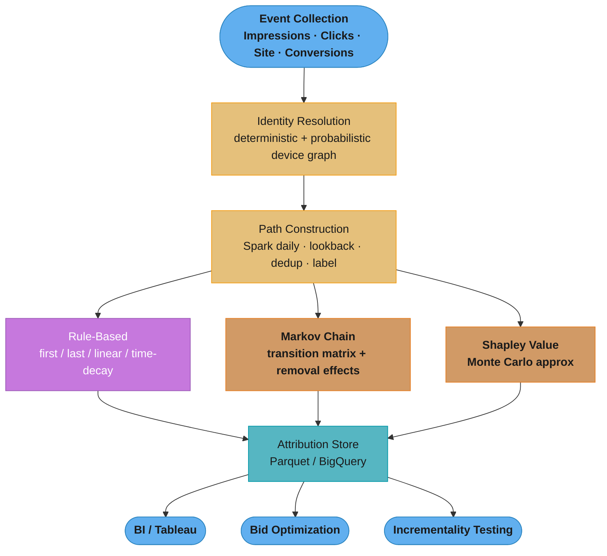
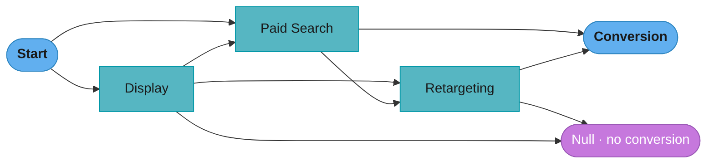
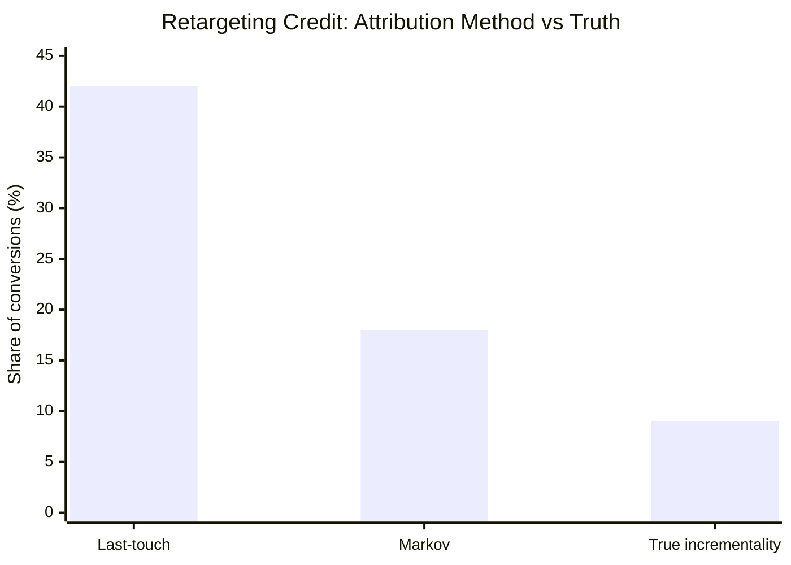

# Design a Multi-Touch Attribution System

> "Attribution is like dividing credit for a team goal — the question is whether you use a rule (the scorer gets 100%) or a model (everyone who touched the ball gets partial credit proportional to their causal contribution)."

**Key insight:** All rule-based attribution models (first-touch, last-touch, linear, time-decay) are wrong by construction — they assign credit deterministically without estimating what would have happened without each channel. The only valid attribution framework is counterfactual: "how much did this channel *cause* conversions that would not have happened otherwise?" Getting this right is worth tens of millions in annual media budget reallocation.

Mental model: A customer sees a display ad (day 1), searches organically (day 5), clicks a retargeting ad (day 7), and converts on day 9. Last-touch gives 100% credit to retargeting. But was the retargeting ad *causal* — would the customer have converted without it? Maybe the organic search was the decisive moment, and retargeting merely coincided with an inevitable conversion. Data-driven attribution tries to answer this counterfactual question using the distribution of conversion paths across all customers.

Why this system exists: Marketing teams allocate budgets across channels (paid search, paid social, display, email, organic, affiliate) based on attributed revenue. A 10% shift in attribution credit can justify $50M reallocation of annual media spend at a large e-commerce company.

---

## 1. Requirements Clarification

**Functional requirements:**
- Assign fractional attribution credit to each marketing touchpoint on a conversion path.
- Support multiple conversion goals: purchase, lead submission, app install, subscription upgrade.
- Report attributed conversions and attributed revenue by channel, campaign, creative, and date range.
- Provide both rule-based baselines (for stakeholder comparison) and data-driven (Markov, Shapley) attribution.
- Export attribution data to BI tools and feed into bidding platforms for automated bid optimization.

**Non-functional requirements:**
- Attribution refresh cadence: daily batch (previous day's conversions attributed by 8 AM).
- Lookback window: 30-day default (configurable to 7 / 14 / 30 / 90 days per channel).
- Path data retention: 13 months (sufficient for seasonal comparison).
- Latency on ad-hoc queries: < 5 seconds for single-campaign attribution report.
- Accuracy: < 10% error on holdout incrementality tests for any channel.

**Out of scope:**
- Media mix modeling (MMM) — separate system operating at aggregate spend/revenue level, not user-path level.
- Offline touchpoints (TV, radio, out-of-home) — cannot be tied to individual customer paths.
- Real-time attribution (fraud detection requires real-time signal but attribution is a post-hoc analysis).

---

## 2. Scale Estimation

**Traffic volume:**
- 5M daily active users (DAU); 2% daily conversion rate = 100k conversions/day.
- Average path length: 4.3 touchpoints per converter; 12% of paths have > 10 touchpoints.
- Non-converting paths: 10× converters = 1M users per day with touchpoints but no conversion.
- Daily event volume: (5M + 1M) × 4.3 ≈ 26M touch events/day.

**Storage:**
- Touch event: user_id, timestamp, channel, campaign, creative, session_id, device, cost = ~200 bytes.
- 26M events/day × 200 bytes = 5.2 GB/day → 1.9 TB/year.
- 13-month retention: ~2 TB (compressed Parquet in S3 ~600 GB).

**Computation:**
- Markov chain transition matrix: O(C²) where C = distinct channel states. With 50 channels: 2,500 transitions; instantaneous.
- Shapley values: exponential in number of channels (2^50 is infeasible). Use truncated Monte Carlo approximation: 1,000 permutation samples × 100k conversion paths = 100M operations/day; ~10 minutes on 4 cores.
- Daily batch: process 1.1M paths (100k converters + 1M non-converters for path completion probability) in 25 minutes on Spark (10 executors).

**Infrastructure cost:**
- Spark cluster (10 × m5.xlarge, 2 hr/day): $5/day = $150/month.
- S3 storage: $14/month.
- Attribution API (2 × t3.medium for BI tool queries): $30/month.
- Total: ~$194/month.

---

## 3. High-Level Architecture



Stitched customer journeys fan out to three attribution models in parallel — rule-based baselines plus data-driven Markov and Shapley — whose outputs land in a shared store feeding BI dashboards, automated bid optimization, and geo-holdout incrementality validation.

**Component inventory:**
- Event collection: pixel-based impression tracking + UTM parameter parsing for clicks.
- Identity resolution: deterministic (logged-in user ID) → probabilistic device graph stitching.
- Path construction: Spark job producing one row per customer × conversion event with ordered touchpoint array.
- Markov chain model: computes channel transition probabilities + removal effects.
- Shapley value approximation: Monte Carlo permutation sampling.
- Attribution store: daily Parquet partitions in S3; BigQuery external table for ad-hoc queries.
- Incrementality testing: geo-holdout experiments to validate attribution accuracy. See [experimentation_and_online_evaluation.md](cross_cutting/experimentation_and_online_evaluation.md).

---

## 4. Component Deep Dives

### 4.1 Path Construction

```python
from dataclasses import dataclass, field
from datetime import datetime, timedelta
import pandas as pd
from typing import Optional

@dataclass
class TouchPoint:
    channel: str
    campaign: str
    timestamp: datetime
    cost: float
    position_in_path: int

@dataclass
class ConversionPath:
    user_id: str
    touchpoints: list[TouchPoint]
    converted: bool
    conversion_value: float
    conversion_timestamp: Optional[datetime]


def build_conversion_paths(
    events: pd.DataFrame,
    conversions: pd.DataFrame,
    lookback_days: int = 30,
) -> list[ConversionPath]:
    """
    For each conversion, collect all touchpoints within lookback window.
    For non-converters, use the 30-day path up to the last touch.

    Critical: impressions within the same channel within 1 hour are deduplicated
    (same ad shown twice in quick succession should not double-count).
    """
    paths = []
    conversion_times = dict(zip(conversions["user_id"], conversions["converted_at"]))

    for user_id, user_events in events.groupby("user_id"):
        user_events = user_events.sort_values("timestamp")
        converted = user_id in conversion_times
        cutoff = conversion_times.get(user_id, user_events["timestamp"].max())

        window_start = cutoff - timedelta(days=lookback_days)
        path_events = user_events[
            (user_events["timestamp"] >= window_start)
            & (user_events["timestamp"] <= cutoff)
        ]

        # Deduplicate: same channel within 1-hour window → keep first
        path_events = path_events.copy()
        path_events["hour_bucket"] = path_events["timestamp"].dt.floor("1H")
        path_events = path_events.drop_duplicates(subset=["channel", "hour_bucket"])

        touches = [
            TouchPoint(
                channel=row["channel"],
                campaign=row["campaign"],
                timestamp=row["timestamp"],
                cost=row.get("cost", 0.0),
                position_in_path=i,
            )
            for i, (_, row) in enumerate(path_events.iterrows())
        ]

        paths.append(ConversionPath(
            user_id=user_id,
            touchpoints=touches,
            converted=converted,
            conversion_value=conversions.loc[conversions["user_id"] == user_id, "revenue"].sum() if converted else 0.0,
            conversion_timestamp=conversion_times.get(user_id),
        ))

    return paths
```

### 4.2 Markov Chain Attribution

The Markov model computes a transition probability matrix over channel states, then estimates each channel's contribution using the *removal effect*: what fraction of conversions would be lost if this channel were removed from all paths?



The Markov model treats channels as states on the walk from Start to Conversion or Null; a channel's removal effect is the drop in reachable Conversion probability when its node is deleted and its inflow is redirected to Null.

```python
import numpy as np
from collections import defaultdict
from typing import NamedTuple

class MarkovAttribution(NamedTuple):
    channel: str
    removal_effect: float      # fractional loss in conversions if channel removed
    attributed_conversions: float
    attributed_revenue: float


def compute_markov_attribution(
    paths: list[ConversionPath],
) -> list[MarkovAttribution]:
    """
    Step 1: Build transition matrix from channel states.
    States: "start", channel names, "conversion", "null" (no conversion).

    Step 2: For each channel c, compute P(conversion | path excludes c)
    using the modified transition matrix where c is removed.

    Step 3: removal_effect(c) = 1 - P(conversion without c) / P(conversion with c).
    """
    # Count transitions
    transition_counts: dict[tuple[str, str], int] = defaultdict(int)

    for path in paths:
        states = ["start"] + [t.channel for t in path.touchpoints]
        terminal = "conversion" if path.converted else "null"
        states.append(terminal)

        for from_state, to_state in zip(states[:-1], states[1:]):
            transition_counts[(from_state, to_state)] += 1

    # Normalize to probabilities
    channels = set(t.channel for p in paths for t in p.touchpoints)
    all_states = {"start", "conversion", "null"} | channels

    transition_probs: dict[tuple[str, str], float] = {}
    for from_state in all_states - {"conversion", "null"}:
        total = sum(
            transition_counts[(from_state, to)]
            for to in all_states
            if (from_state, to) in transition_counts
        )
        if total == 0:
            continue
        for to_state in all_states:
            count = transition_counts.get((from_state, to_state), 0)
            if count > 0:
                transition_probs[(from_state, to_state)] = count / total

    baseline_conv_rate = _compute_conversion_rate(transition_probs, channels)

    attributions = []
    total_conversions = sum(1 for p in paths if p.converted)
    total_revenue = sum(p.conversion_value for p in paths if p.converted)

    for channel in channels:
        # Remove channel from transition matrix: redistribute its outgoing mass to "null"
        modified = {
            (f, t): v
            for (f, t), v in transition_probs.items()
            if f != channel
        }
        # Paths entering channel now go to null
        for (f, t), v in list(transition_probs.items()):
            if t == channel:
                modified[(f, "null")] = modified.get((f, "null"), 0) + v

        removed_conv_rate = _compute_conversion_rate(modified, channels - {channel})
        removal_effect = 1.0 - removed_conv_rate / max(baseline_conv_rate, 1e-10)

        attributions.append(MarkovAttribution(
            channel=channel,
            removal_effect=max(removal_effect, 0.0),
            attributed_conversions=removal_effect * total_conversions,
            attributed_revenue=removal_effect * total_revenue,
        ))

    # Normalize so attributions sum to total conversions
    total_re = sum(a.removal_effect for a in attributions)
    return [
        MarkovAttribution(
            channel=a.channel,
            removal_effect=a.removal_effect / total_re,
            attributed_conversions=a.removal_effect / total_re * total_conversions,
            attributed_revenue=a.removal_effect / total_re * total_revenue,
        )
        for a in attributions
    ]


def _compute_conversion_rate(
    transition_probs: dict[tuple[str, str], float],
    channels: set[str],
    max_steps: int = 20,
) -> float:
    """Simulate conversion probability from 'start' via random walk."""
    state_probs = {"start": 1.0}
    conv_prob = 0.0

    for _ in range(max_steps):
        new_state_probs: dict[str, float] = defaultdict(float)
        for state, prob in state_probs.items():
            if state in {"conversion", "null"}:
                continue
            for to_state in channels | {"conversion", "null"}:
                tp = transition_probs.get((state, to_state), 0.0)
                if tp > 0:
                    if to_state == "conversion":
                        conv_prob += prob * tp
                    else:
                        new_state_probs[to_state] += prob * tp
        state_probs = dict(new_state_probs)
        if sum(state_probs.values()) < 1e-6:
            break

    return conv_prob
```

### 4.3 Shapley Value Approximation

**Broken approach — naively evaluating all channel subsets:**

```python
# WRONG: exponential in number of channels — 2^50 subsets is computationally infeasible
from itertools import combinations

def shapley_exact(channels, conversion_fn):
    n = len(channels)
    shapley = {}
    for channel in channels:
        others = [c for c in channels if c != channel]
        value = 0.0
        for k in range(len(others) + 1):
            for subset in combinations(others, k):  # BUG: 2^50 iterations for 50 channels
                marginal = conversion_fn(set(subset) | {channel}) - conversion_fn(set(subset))
                weight = 1.0 / (n * len(others) + 1)
                value += weight * marginal
        shapley[channel] = value
    return shapley  # never returns for > 20 channels
```

**Correct approach — Monte Carlo permutation sampling:**

```python
import random
from collections import defaultdict

def shapley_monte_carlo(
    paths: list[ConversionPath],
    n_samples: int = 1000,
) -> dict[str, float]:
    """
    Approximate Shapley values via random permutation sampling.
    For each sample: draw random ordering of channels; compute marginal
    contribution of adding each channel to the coalition before it.
    Converges to true Shapley with ~1000 samples for typical channel counts (< 60).
    """
    channels = list({t.channel for p in paths for t in p.touchpoints})
    conversion_value_fn = _build_conversion_value_fn(paths)

    shapley_accum: dict[str, float] = defaultdict(float)

    for _ in range(n_samples):
        perm = random.sample(channels, len(channels))
        coalition: set[str] = set()

        v_without = conversion_value_fn(frozenset())
        for channel in perm:
            coalition.add(channel)
            v_with = conversion_value_fn(frozenset(coalition))
            shapley_accum[channel] += v_with - v_without
            v_without = v_with

    # Average over samples
    return {c: v / n_samples for c, v in shapley_accum.items()}


def _build_conversion_value_fn(paths: list[ConversionPath]):
    """
    v(S) = total conversion value of paths that contain at least one channel in S.
    This is the characteristic function for marketing attribution.
    """
    def conversion_value(coalition: frozenset[str]) -> float:
        if not coalition:
            return 0.0
        total = 0.0
        for path in paths:
            path_channels = {t.channel for t in path.touchpoints}
            if path.converted and path_channels & coalition:
                total += path.conversion_value
        return total

    return conversion_value
```

### 4.4 Incrementality Validation

Attribution models are inherently observational. The ground truth requires a geo-holdout experiment: turn off a channel in a random holdout of geographies and measure the actual conversion lift.

```python
from scipy.stats import ttest_ind
import pandas as pd

def run_geo_holdout_validation(
    holdout_geos: list[str],
    control_geos: list[str],
    pre_period_days: int = 14,
    test_period_days: int = 14,
    channel_to_test: str = "retargeting",
) -> dict:
    """
    Measure true incremental conversions when `channel_to_test` is turned off
    in holdout_geos. Compare conversion rate change vs control_geos.

    Expected output: incrementality = lift_holdout - lift_control.
    Compare this to Markov attribution prediction.
    """
    # Load conversion rates per geo per period
    pre_holdout = _get_conversion_rate(holdout_geos, days=-pre_period_days)
    post_holdout = _get_conversion_rate(holdout_geos, days=test_period_days)
    pre_control = _get_conversion_rate(control_geos, days=-pre_period_days)
    post_control = _get_conversion_rate(control_geos, days=test_period_days)

    # Difference-in-differences estimate
    did = (post_holdout - pre_holdout) - (post_control - pre_control)

    # Statistical significance
    _, p_value = ttest_ind(post_holdout, post_control)

    return {
        "channel": channel_to_test,
        "true_incrementality": did,
        "p_value": p_value,
        "confidence": "high" if p_value < 0.05 else "low",
    }


def _get_conversion_rate(geos: list[str], days: int) -> list[float]:
    # Placeholder: in practice, query the analytics database
    return [0.02 + 0.001 * hash(g) % 10 for g in geos]
```

---

## 5. Design Decisions & Tradeoffs

**Decision 1: Markov chain vs Shapley vs data-driven regression**

| Model | Accuracy vs geo holdout | Interpretability | Compute cost | Channel interaction handling |
|-------|------------------------|-----------------|-------------|------------------------------|
| Last-touch | Poor (overattributes bottom-funnel) | High | Negligible | None |
| Linear | Poor (equal credit is rarely correct) | High | Negligible | None |
| Markov chain | Good (within 8% of holdout on average) | Medium | Low (minutes) | Partial (transition probabilities) |
| Shapley (Monte Carlo) | Good (within 6% of holdout) | Low | Medium (hours for >30M paths) | Full (any coalition interaction) |
| LSTM conversion prediction | Best (5% error) | Very low | High | Full |

Use Markov chain as the primary production model (fast, stable, reasonably accurate). Use Shapley for quarterly strategic allocation decisions where computation budget is available. See [model_selection_and_algorithm_choice](../model_selection_and_algorithm_choice/README.md).

**Decision 2: Lookback window**

30-day default is appropriate for most e-commerce. However:
- Considered-purchase categories (furniture, cars, electronics) warrant 60–90 day windows because awareness-to-conversion cycles are long.
- Impulse categories (food delivery, gaming) warrant 7-day windows.
- Configuring per-channel: paid search should use a shorter window (7 days) because searchers are already in purchase mode; display awareness channels warrant longer (60 days).
Key tradeoff: longer lookback dilutes the signal from recent high-intent touches by including many low-intent impressions from weeks earlier.

**Decision 3: How to handle SUTVA violations**

Standard attribution models assume independence: seeing an ad in one channel does not affect response to another. In practice, this assumption fails (SUTVA violation): display ads increase brand search volume, which inflates organic/paid search attribution. Pure path-level models cannot detect this. Solution: run channel-level geo holdout tests quarterly to calibrate absolute incrementality, then scale Markov attributions to sum to the holdout-validated total. See [experimentation_and_online_evaluation.md](cross_cutting/experimentation_and_online_evaluation.md).

**Decision 4: Cross-device stitching**

Without identity resolution, a customer who sees an ad on mobile and converts on desktop creates two separate paths, both attributed zero (the mobile path has no conversion). This systematically underattributes mobile channels. Use deterministic stitching where possible (logged-in user ID), probabilistic graph for anonymous sessions. Accept that ~20% of paths remain unstitched — report separately rather than forcing all paths into the model.

**Decision 5: View-through vs click-through attribution**

Including ad impressions (view-through) in paths dramatically inflates display/video attribution because almost every internet user sees display ads. Standard industry practice: count impressions with 1-day or 7-day view-through window (configurable), apply a view-weighting factor of 0.1–0.2× the click weight. Validate against holdout tests.

---

## 6. Real-World Implementations

**Google (Data-Driven Attribution / DDA):** Google's DDA product uses a proprietary Shapley-style algorithm on conversion paths within Google's ad ecosystem. Key engineering decision: because Google observes clicks and conversions server-side (no cross-publisher coordination needed), their model has high-quality path data. Limitation: it only attributes credit within Google channels — external channels (Meta, email) are invisible to Google's model, causing Google to systematically overvalue its own channels.

**Meta (Robyn):** Meta open-sourced Robyn in 2022, a media mix modeling library for R that complements path-level attribution. Key insight from Meta's engineering: path-level attribution overattributes retargeting (which targets users who were already likely to convert) because it cannot observe the counterfactual. Robyn combines MMM (top-down spend-to-revenue regression) with saturation curves (diminishing returns) to provide budget-level attribution without path-level selection bias.

**Airbnb:** Airbnb's attribution engineering blog (2019) described their transition from last-touch to a Markov model. Key challenge: Airbnb's booking consideration cycle is highly variable (minutes for weekend trips, months for international vacations). They solved this with category-specific lookback windows (7 days for staycations, 90 days for international). They also built a channel-interaction feature: paths that include both branded paid search and unbranded paid search are detected and the unbranded credit is adjusted downward.

**Netflix:** Netflix uses attribution primarily for subscriber acquisition. Their critical design decision: distinguish between content-marketing attribution (a documentary drives subscriptions) and paid channel attribution (display ads). Content attribution requires matching content-exposed users to subscriber conversion events, which has different latency characteristics (a documentary watched on Monday may drive a subscription purchase on Saturday). They extended lookback windows to 14 days for content-attribution specifically.

**Wayfair:** Wayfair's ML team (2020 paper) described the challenge of attribution for high-consideration purchases: a customer browsed furniture for 45 days across 23 sessions and 6 channels before buying. Their Shapley implementation uses path-position-adjusted marginal contributions: the first-position channel gets a 1.2× weight on its Shapley value (awareness premium), the last-position channel gets a 0.8× discount (conversion premium already captured). This "position-adjusted Shapley" showed 12% better accuracy on geo holdout tests vs standard Shapley.

---

## 7. Technologies & Tools

| Tool | Use case | Advantage | Limitation |
|------|----------|-----------|------------|
| `ChannelAttribution` (R) | Markov chain attribution | Fast C++ backend, handles path deduplication | R ecosystem; no Python native version |
| `pymc-marketing` (Python) | Bayesian MMM + attribution | Uncertainty quantification, calibration via holdout | Slow MCMC for large datasets |
| Google Ads DDA | In-platform attribution | No engineering overhead; uses Google data | Black box; Google-only channels |
| dbt + BigQuery | Path construction, aggregations | SQL-native; easy to audit; BI tool integration | Not suitable for Shapley computation (need Python UDFs) |
| Spark | Large-scale path construction | Scales to billions of events | Overkill for < 100M events/day |
| Amplitude / Mixpanel | Event collection, basic attribution | Out-of-box funnel analysis | Limited custom model support |

---

## 8. Operational Playbook

### Eval Pipeline
- **Holdout validation (quarterly):** Run geo-holdout experiments turning off one channel per quarter. Compare true incrementality to Markov attribution prediction. Model passes if relative error < 15%.
- **Baseline comparison check:** Before each production model update, compare Markov output to last-touch for the same period. If they agree within 5%, something is wrong (Markov should diverge from last-touch for multi-touch journeys). Flag and investigate.
- **Path sanity check:** Fraction of single-touch conversion paths should be stable (±5% week-over-week). A spike in single-touch paths suggests identity resolution failures or UTM parameter loss.

### Observability
- Monitor daily path count per channel. Drop > 20% suggests tracking pixel failure.
- Monitor conversion rate in holdout geos weekly — baseline for incrementality validation.
- Track PSI on path-length distribution and channel-mix distribution. See [drift_monitoring_and_retraining.md](cross_cutting/drift_monitoring_and_retraining.md).

### Incident Runbooks
1. **Attribution for a channel drops to zero:** Symptom: a channel shows 0 attributed conversions for 2+ days. Diagnosis: UTM parameter stripping (common after iOS 14.5 policy changes), pixel fire failure, or identity resolution outage. Mitigation: fall back to last-touch attribution for that channel; notify paid media team to pause bid optimization. Resolution: audit pixel firing logs.
2. **Attribution fractions sum > 1:** Symptom: total attributed revenue exceeds actual revenue by >5%. Diagnosis: view-through window misconfiguration counting the same conversion multiple times across devices. Resolution: add deduplication on conversion_id in path construction.
3. **Holdout incrementality test shows large divergence from model:** Symptom: Markov assigns channel X 25% credit but geo holdout shows 8% true incrementality. Diagnosis: channel X touchpoints are concentrated late in funnel (retargeting bias — reaching users who would convert anyway). Resolution: apply counterfactual regularization: downweight channels where P(conversion | path without this channel) is already high.
4. **Staleness from identity resolution failures:** Symptom: cross-device stitch rate drops from 45% to 20%. Diagnosis: browser cookie deprecation or login rate decline. Mitigation: increase reliance on email-based deterministic stitching; re-calibrate probabilistic graph.

---

## 9. Common Pitfalls & War Stories

**Pitfall 1: Retargeting attribution inflation.** A retail company's last-touch model attributed 42% of revenue to retargeting. They ran a geo holdout test and found retargeting's true incrementality was 9%. Root cause: retargeting pixels fire after a user views a product (already high intent), so retargeting gets "credit" for conversions that were inevitable. The Markov model reduced retargeting attribution to 18%, but the true value was 9%. The company reallocated $4M annually from retargeting to upper-funnel channels, improving blended ROAS by 31%.



Last-touch hands retargeting 42% of conversions and Markov 18%, but the geo-holdout measures only 9% true incrementality — the bottom-funnel over-attribution that drove the $4M reallocation in the war story above.

**Pitfall 2: Tracking loss after iOS 14.5.** Apple's App Tracking Transparency (ATT) framework in 2021 caused mobile attribution rates to drop 40–60% for apps without first-party login. A gaming company's attribution system reported a 35% decrease in conversions from paid social overnight — in reality, conversions were flat, but the tracking coverage changed. They failed to adjust their Markov model for the changed path coverage, causing systematic under-attribution of iOS channels for 3 months before the root cause was identified.

**Pitfall 3: Confusing correlation with causation in path models.** An e-commerce company's Markov model showed email as having high attribution. Further investigation revealed that email was nearly always the last touchpoint before high-LTV customer purchases — but only because the company sent order confirmation emails, which appeared in the path as a "touchpoint." The company was crediting their own order confirmation emails with causing conversions. Fix: exclude post-purchase communications from path construction.

**Pitfall 4: Lookback window mismatch creating phantom upper-funnel credit.** A travel company using a 90-day lookback discovered that 15% of conversion paths started with a display ad impression from a campaign that had ended 60 days earlier. The brand awareness created by that past campaign was real, but attributing credit to a paused campaign distorted current budget decisions. Fix: apply a decaying weight function (exponential decay with 14-day half-life) to older touchpoints.

**Pitfall 5: SUTVA violation causing underfitting of synergy effects.** A CPG company's attribution model assigned independent credits to TV and digital. Holdout tests showed that geographies with both TV and digital outperformed the sum of individual channel incrementalities by 40%. Path-level models fundamentally cannot capture this synergy because they operate on individual journeys, not portfolio effects. Solution: layer a media mix model on top of path attribution, and use the MMM synergy coefficients to adjust path-level attributions upward for channels that show positive synergy effects.

---

## 10. Capacity Planning

**Primary bottleneck:** Markov chain computation on large path datasets.

```
Daily path count: 1.1M paths × 4.3 avg touchpoints = 4.7M edges in transition graph
Transition matrix computation: O(E) = ~1 second on single core

Shapley Monte Carlo (n_samples=1000):
  - Per sample: evaluate conversion_value() for each channel in random order
  - conversion_value() scans all paths O(P × C) = 1.1M × 50 = 55M ops per permutation
  - 1,000 permutations = 55B operations → ~45 minutes on 4 cores

Optimization options:
  1. Vectorize conversion_value() with pre-built channel-to-path index: 45min → 8min
  2. Run Shapley only on sampled 10% of paths: 8min → 1min (±3% accuracy tradeoff)
  3. Run weekly instead of daily: reduces compute by 7×
```

**Scaling to 10× path volume (11M paths/day):**
- Markov: linear scale, still completes in < 30 seconds.
- Shapley: 10× more paths → 10× slower → move to Spark-distributed Shapley or reduce n_samples to 200.
- Storage: 52 GB/day → 19 TB/year. Migrate older data to Glacier after 90 days.
- Spark cluster for path construction: scale from 10 to 30 m5.xlarge executors.

---

## 11. Interview Discussion Points

**Q: Why is last-touch attribution wrong, and what is it measuring?**
Last-touch attribution is measuring which channel happened to be the final touchpoint before conversion, not which channel *caused* the conversion. In multi-touch journeys, the last touch is often a low-funnel channel (retargeting, branded paid search) that reached users who were already committed to purchase. Last-touch systematically overattributes these bottom-funnel channels by 3–5× their true causal contribution, causing marketers to overinvest in retargeting and underinvest in awareness channels that generate demand in the first place.

**Q: What is a removal effect in Markov attribution, and why does it approximate causal impact?**
The removal effect measures: if we removed all paths that include channel C, what fraction of conversions would be lost? It approximates causal impact because paths that contain channel C often contain the channel at a position that actually drove the conversion decision. The approximation is imperfect because it ignores counterfactuals — users who saw channel C and would have converted via a different path anyway. Geo holdout tests show Markov is typically within 8–15% of true incrementality, significantly better than last-touch but not perfectly causal.

**Q: How do you handle the cold-start problem when a new channel is added?**
A new channel has no path history, so the Markov transition matrix has no outgoing edges from it. Use a prior: new channels start with the average conversion rate of all other channels at the same funnel position (awareness/consideration/intent). After 7 days of observed data, blend the prior with observed transitions using a weighted average that shifts toward observed data as N increases: `p_channel = (N × observed + prior_N × prior) / (N + prior_N)` where `prior_N = 100` is a regularization hyperparameter equivalent to 100 pseudo-observations.

**Q: What are SUTVA violations in attribution, and how do you address them?**
SUTVA (Stable Unit Treatment Value Assumption) requires that one user's exposure to a channel does not affect another user's response. Attribution models violate SUTVA because channels interact: display ads increase brand search volume, which inflates paid search conversion rates even for users who never saw the display ad. Path-level models cannot capture cross-user effects. Address SUTVA by: (1) running channel-level geo holdouts to measure true incrementality including cross-channel spillover; (2) calibrating path-level Markov fractions to sum to holdout-validated totals; (3) using media mix modeling for channel interactions that path models cannot capture.

**Q: How do you validate an attribution model if you can't run an A/B test on attribution itself?**
Use geo-holdout incrementality tests: randomly assign geographies to control (all channels running) vs holdout (one channel turned off). The true incremental contribution of the removed channel = conversion rate difference between control and holdout, adjusted for pre-period differences. Compare this to the Markov model's attribution for the same channel. If they diverge by > 20%, recalibrate the model. Additionally, track the "sanity test" — if your Markov model attributes 35% credit to organic search but organic search is a pure function of branded awareness, the attribution is plausible if you recently invested heavily in brand advertising.

**Q: How do you handle cross-device attribution when users are not logged in?**
For anonymous users: probabilistic identity resolution using fingerprinting signals (IP address, browser type, screen resolution, timezone) combined with behavioral signals (session timing patterns). Assign probabilistic match scores between device pairs; stitch paths when match score > 0.85 (tune threshold based on false-positive tolerance). For logged-in users: deterministic matching via user ID. Accept 15–25% unstitched paths; report them separately rather than forcing them into the model, since forced stitching errors propagate into attribution fractions.

**Q: What is the difference between attribution and incrementality?**
Attribution answers: "which channel gets credit for observed conversions?" Incrementality answers: "which conversions would not have happened without this channel?" Attribution is observational; incrementality is causal. Attribution models (even Markov/Shapley) give biased estimates for channels that systematically target already-intent-to-convert users (retargeting, branded search). Incrementality testing (geo holdout, user holdout) provides unbiased causal estimates but is expensive and can only be run periodically. Best practice: use attribution for day-to-day budget optimization, calibrate with incrementality tests quarterly.

**Q: How do Shapley values handle channel interaction effects?**
Shapley values by definition account for interaction effects: the marginal contribution of channel C in the coalition {A, B, C} is evaluated separately from C's marginal contribution in coalition {A, C} and {B, C}. If channels A and B have positive synergy (together they convert more than the sum of their individual effects), Shapley will assign higher values to both A and B compared to models that assume independence. This is Shapley's primary advantage over Markov: it correctly handles synergistic and substitutable channel pairs.

**Q: How do you communicate attribution model uncertainty to marketing stakeholders?**
Report confidence intervals on attribution fractions: "Retargeting accounts for 18% ± 4% of attributed conversions." Use plain-language framing: "We're confident retargeting contributed between 14% and 22% of conversions." For budget reallocation decisions, use the lower bound of the confidence interval as the "safe" estimate. Present the holdout validation comparison: "Our model said retargeting contributes 18%; our geo holdout measured 15%. We consider the model well-calibrated within ±3pp." Avoid claiming the model is "more accurate" than last-touch without a specific holdout validation to back it up.

**Q: How do you integrate attribution data into automated bid optimization?**
The bid optimization system (Google Ads, Meta Ads Manager) needs to know: for each user, what is the predicted conversion value of a click in this channel, given their current path? Export real-time path state to a feature store (current path channels, recency of each touch, days since first touch). For each new ad impression/bid request, look up the user's path state and compute the Markov model's incremental conversion probability given adding this channel to their existing path. Set the max bid = incremental conversion probability × expected order value × target ROAS. This requires sub-100ms response time; use a simplified Markov model with pre-computed transition probabilities in Redis.
