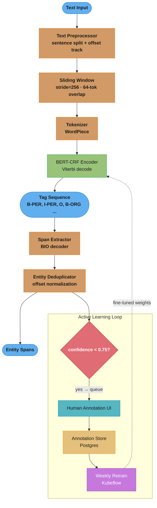
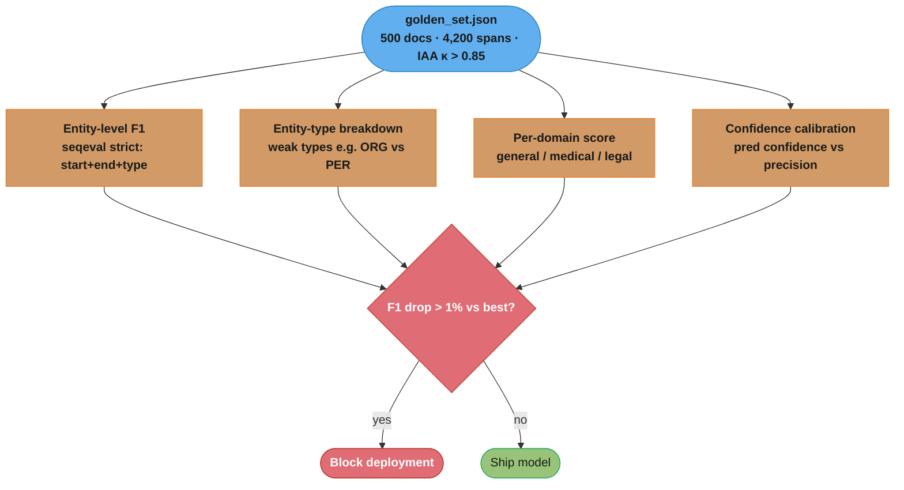
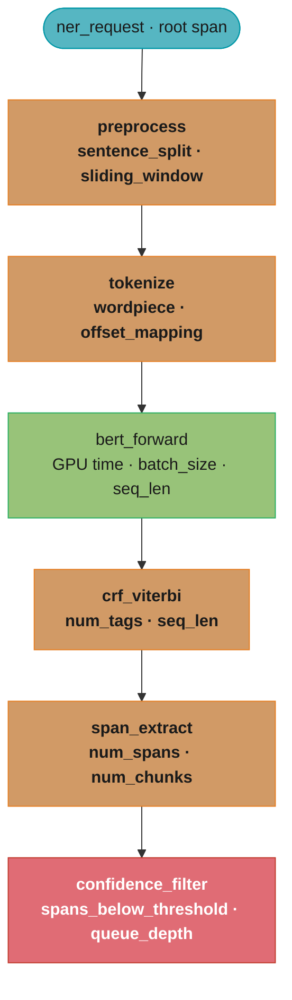

# Design a Named Entity Recognition (NER) Pipeline

> Like a highlighter that learned to read — the system scans unstructured text and marks every person, organization, location, date, and domain-specific entity without being told where to look.

**Key insight:** NER is token classification, not sequence classification. Every input token gets a label, and the label of one token constrains what labels its neighbors can have — which is why a CRF layer on top of BERT outperforms a plain softmax head.

---

## 1. Requirements Clarification

**Functional requirements:**
- Tag every entity span in free-form text with its entity type (PER, ORG, LOC, DATE, MONEY, PRODUCT, and 6 domain-specific types)
- Return entity text, type, character offsets, and confidence score
- Support batch inference for documents and streaming inference for short texts
- Fine-tunable on domain-specific labeled corpora (medical, legal, financial)
- Active-learning loop: flag low-confidence spans for human review and incorporate feedback

**Non-functional requirements:**
- Latency: P95 < 50ms for texts up to 512 tokens; P95 < 200ms for documents up to 4K tokens
- Throughput: 2,000 documents/minute in batch mode
- Precision: ≥ 0.92 F1 on CoNLL-2003 (general); ≥ 0.88 on domain-specific eval sets
- Availability: 99.9% uptime for the synchronous API
- Model update cycle: weekly incremental retraining with human annotation feedback

**Out of scope:**
- Coreference resolution (linking "Apple" and "the company" to the same entity)
- Relation extraction (detecting that "Elon Musk" founded "Tesla")
- Entity disambiguation / linking to Wikidata

---

## 2. Scale Estimation

**Traffic:**
- 5M documents/day at average 800 tokens per document = 4B tokens/day
- Peak: 3× average → 15M tokens/minute
- Synchronous API: 2,000 requests/minute (P99 = 512 tokens each)
- Batch pipeline: 4M documents/day processed in 8-hour window → 500K docs/hour

**Compute sizing:**
- BERT-base NER inference: ~0.8ms/doc on A10G at batch size 32 (512 tokens, mixed precision)
- 2,000 RPS synchronous: 3 A10G replicas with 40% headroom
- Batch 500K docs/hour: 8 A10G batch workers (64 docs/batch, ~0.1 sec/batch)

**Storage:**
- Annotation store: 500K labeled spans/day → 15M/month → ~3 GB/month (Postgres)
- Model artifacts: 440 MB per BERT-base checkpoint; 20 versions retained = 9 GB
- Active-learning queue: 50K spans/day awaiting review → <1 GB Redis ZSET

**Cost:**
- Synchronous API: 3 × A10G × $1.50/hr = $3,240/month
- Batch workers: 8 × A10G × $1.50/hr × 8hr/day × 30 = $2,880/month
- Total serving cost: ~$6,100/month for 150M documents/month

---

## 3. High-Level Architecture



The synchronous path (blue input → orange preprocessing → green BERT-CRF → orange span extraction) tags text end to end; spans below 0.75 confidence branch into the active-learning loop, whose weekly retrain feeds fine-tuned weights back into the encoder (dotted).

**Component inventory:**
- **Text Preprocessor:** sentence splitter (spaCy), sliding window for long docs, offset tracker
- **BERT-CRF Encoder:** BERT-base-uncased + CRF layer; outputs per-token BIO tags + Viterbi scores
- **Span Extractor:** BIO → entity spans with character offsets; handles subword alignment
- **Entity Deduplicator:** merges overlapping spans from sliding window chunks
- **Confidence Filter:** routes low-confidence spans to active-learning queue
- **Annotation Store:** Postgres with spans table; feeds weekly retrain
- **Batch Processor:** Kafka consumer → model worker → output topic (Avro schema)

**Data flow:**
1. Text arrives via REST API or Kafka topic
2. Preprocessor splits text into ≤ 512-token chunks with 64-token overlap
3. BERT-CRF runs Viterbi decoding to produce globally-optimal BIO tag sequence
4. Span Extractor converts BIO tags to entity objects with start/end char offsets
5. Spans below confidence threshold are queued for annotation
6. Weekly batch job aggregates annotations and triggers fine-tuning pipeline

---

## 4. Component Deep Dives

### 4.1 BIO Tagging Scheme and BERT-CRF

BIO tags every token as `B-TYPE` (beginning of entity), `I-TYPE` (inside entity), or `O` (outside). For 11 entity types, the label space is 2×11 + 1 = 23 tags. A plain BERT softmax head treats each token independently — it can produce `I-ORG` after `O`, which is invalid. The CRF layer adds a transition matrix that makes globally-consistent sequences more likely.

```python
from dataclasses import dataclass
from typing import Optional
import torch
import torch.nn as nn
from transformers import BertModel, BertTokenizerFast
from torchcrf import CRF


ENTITY_TYPES = ["PER", "ORG", "LOC", "DATE", "MONEY", "PRODUCT",
                "DISEASE", "DRUG", "LAW", "CASE_NUM", "TICKER"]
# Build tag list: O + B-TYPE + I-TYPE for each entity type
TAGS = ["O"] + [f"{prefix}-{etype}"
                for etype in ENTITY_TYPES
                for prefix in ["B", "I"]]
TAG2ID = {tag: i for i, tag in enumerate(TAGS)}
ID2TAG = {i: tag for tag, i in TAG2ID.items()}
NUM_TAGS = len(TAGS)  # 23


@dataclass
class NERSpan:
    text: str
    entity_type: str
    start_char: int
    end_char: int
    confidence: float
    token_start: int
    token_end: int


class BERTCRFModel(nn.Module):
    def __init__(self, bert_model_name: str = "bert-base-uncased", num_tags: int = NUM_TAGS,
                 dropout: float = 0.1):
        super().__init__()
        self.bert = BertModel.from_pretrained(bert_model_name)
        self.dropout = nn.Dropout(dropout)
        self.classifier = nn.Linear(self.bert.config.hidden_size, num_tags)
        # CRF layer: learns transition matrix (num_tags × num_tags)
        # Models constraints like I-ORG cannot follow O
        self.crf = CRF(num_tags, batch_first=True)

    def forward(
        self,
        input_ids: torch.Tensor,           # (batch, seq_len)
        attention_mask: torch.Tensor,       # (batch, seq_len)
        labels: Optional[torch.Tensor] = None,  # (batch, seq_len)
    ) -> dict:
        outputs = self.bert(input_ids=input_ids, attention_mask=attention_mask)
        sequence_output = self.dropout(outputs.last_hidden_state)  # (batch, seq_len, hidden)
        emissions = self.classifier(sequence_output)               # (batch, seq_len, num_tags)

        if labels is not None:
            # CRF negative log-likelihood (negate because CRF returns log-likelihood)
            # mask=attention_mask because padding tokens have no valid label
            loss = -self.crf(emissions, labels, mask=attention_mask.bool(), reduction="mean")
            return {"loss": loss}
        else:
            # Viterbi decoding: returns globally-optimal tag sequence
            predictions = self.crf.decode(emissions, mask=attention_mask.bool())
            # Compute per-token confidence from emission scores + CRF normalizer
            with torch.no_grad():
                log_probs = self.crf.compute_score(emissions, torch.tensor(predictions),
                                                   mask=attention_mask.bool())
                normalizer = self.crf.compute_normalizer(emissions, mask=attention_mask.bool())
                confidences = torch.exp(log_probs - normalizer)  # sequence-level confidence
            return {"predictions": predictions, "confidences": confidences.tolist()}
```

### 4.2 Subword Alignment and Span Extraction

BERT's WordPiece tokenizer splits "Johnson" into ["John", "##son"]. The NER model tags both subwords, but we want to return the original character offsets. `BertTokenizerFast` provides word-to-token alignment maps.

```python
from transformers import BertTokenizerFast


class NERInferencePipeline:
    def __init__(self, model: BERTCRFModel, model_name: str = "bert-base-uncased",
                 max_length: int = 512, stride: int = 256, confidence_threshold: float = 0.75):
        self.model = model
        self.tokenizer = BertTokenizerFast.from_pretrained(model_name)
        self.max_length = max_length
        self.stride = stride
        self.confidence_threshold = confidence_threshold
        self.model.eval()

    def predict(self, text: str) -> list[NERSpan]:
        # Tokenize with return_offsets_mapping=True for char offset alignment
        encoding = self.tokenizer(
            text,
            return_offsets_mapping=True,
            max_length=self.max_length,
            stride=self.stride,
            truncation=True,
            padding="max_length",
            return_overflowing_tokens=True,
            return_tensors="pt",
        )

        all_spans: list[NERSpan] = []
        for chunk_idx in range(len(encoding["input_ids"])):
            chunk_input_ids = encoding["input_ids"][chunk_idx].unsqueeze(0)
            chunk_attention_mask = encoding["attention_mask"][chunk_idx].unsqueeze(0)
            offset_mapping = encoding["offset_mapping"][chunk_idx].tolist()

            with torch.no_grad():
                output = self.model(chunk_input_ids, chunk_attention_mask)

            predictions = output["predictions"][0]
            seq_confidence = output["confidences"][0]

            spans = self._decode_bio_to_spans(
                text, predictions, offset_mapping, chunk_attention_mask[0].tolist(),
                seq_confidence
            )
            all_spans.extend(spans)

        # Deduplicate overlapping spans from sliding window chunks
        return self._deduplicate_spans(all_spans)

    def _decode_bio_to_spans(
        self, text: str, predictions: list[int], offset_mapping: list[tuple],
        attention_mask: list[int], seq_confidence: float
    ) -> list[NERSpan]:
        spans: list[NERSpan] = []
        current_entity: Optional[dict] = None

        for token_idx, (tag_id, (char_start, char_end), is_valid) in enumerate(
            zip(predictions, offset_mapping, attention_mask)
        ):
            if not is_valid or char_start == char_end:
                # Skip padding and special tokens ([CLS], [SEP])
                if current_entity:
                    spans.append(self._finalize_span(text, current_entity, seq_confidence))
                    current_entity = None
                continue

            tag = ID2TAG[tag_id]

            if tag.startswith("B-"):
                if current_entity:
                    spans.append(self._finalize_span(text, current_entity, seq_confidence))
                current_entity = {
                    "entity_type": tag[2:],
                    "start_char": char_start,
                    "end_char": char_end,
                    "token_start": token_idx,
                    "token_end": token_idx,
                }
            elif tag.startswith("I-") and current_entity and tag[2:] == current_entity["entity_type"]:
                current_entity["end_char"] = char_end
                current_entity["token_end"] = token_idx
            else:
                if current_entity:
                    spans.append(self._finalize_span(text, current_entity, seq_confidence))
                    current_entity = None

        if current_entity:
            spans.append(self._finalize_span(text, current_entity, seq_confidence))

        return spans

    def _finalize_span(self, text: str, entity: dict, confidence: float) -> NERSpan:
        entity_text = text[entity["start_char"]:entity["end_char"]]
        return NERSpan(
            text=entity_text,
            entity_type=entity["entity_type"],
            start_char=entity["start_char"],
            end_char=entity["end_char"],
            confidence=confidence,
            token_start=entity["token_start"],
            token_end=entity["token_end"],
        )

    def _deduplicate_spans(self, spans: list[NERSpan]) -> list[NERSpan]:
        # From sliding window chunks, the same entity may appear in two chunks
        # Keep the span with higher confidence when offsets overlap
        spans.sort(key=lambda s: (s.start_char, -s.confidence))
        deduped: list[NERSpan] = []
        last_end = -1
        for span in spans:
            if span.start_char >= last_end:
                deduped.append(span)
                last_end = span.end_char
        return deduped
```

**Broken → fixed: plain softmax head instead of CRF**

```python
# BROKEN: softmax head emits locally-optimal but globally-invalid sequences
class BrokenNERModel(nn.Module):
    def forward(self, input_ids, attention_mask, labels=None):
        output = self.bert(input_ids=input_ids, attention_mask=attention_mask)
        logits = self.classifier(output.last_hidden_state)  # (B, T, num_tags)
        if labels is not None:
            loss = nn.CrossEntropyLoss()(logits.view(-1, NUM_TAGS), labels.view(-1))
            return {"loss": loss}
        preds = logits.argmax(-1)  # independent per-token argmax → can produce I-ORG after O
        return {"predictions": preds.tolist()}

# FIXED: CRF layer models transition constraints, Viterbi finds globally-optimal sequence
# In production: CRF adds ~2% F1 on CoNLL-2003, ~4% F1 on domain-specific corpora where
# entity boundaries are ambiguous (medical: "type 2 diabetes mellitus" spans 4 tokens)
```

### 4.3 Domain Fine-Tuning with Active Learning

General BERT NER (trained on CoNLL-2003) achieves ~0.85 F1 on medical text because medical entities like "HbA1c", "ICD-10 code E11.9", and "metformin 500mg BID" don't appear in news corpora. Fine-tuning on even 3,000 domain-labeled sentences recovers ~5–7 F1 points.

```python
from torch.utils.data import Dataset, DataLoader
from transformers import get_linear_schedule_with_warmup
import numpy as np
from seqeval.metrics import f1_score, precision_score, recall_score


class NERDataset(Dataset):
    def __init__(self, texts: list[str], labels: list[list[str]],
                 tokenizer: BertTokenizerFast, max_length: int = 512):
        self.encodings = []
        self.label_ids = []
        for text, word_labels in zip(texts, labels):
            words = text.split()
            encoding = tokenizer(
                words, is_split_into_words=True,
                max_length=max_length, truncation=True,
                padding="max_length", return_tensors="pt"
            )
            # Align word-level labels to subword tokens
            word_ids = encoding.word_ids()
            label_ids = []
            prev_word_id = None
            for word_id in word_ids:
                if word_id is None:
                    label_ids.append(-100)  # Special tokens: ignore in loss
                elif word_id != prev_word_id:
                    label_ids.append(TAG2ID[word_labels[word_id]])
                else:
                    # Continuation subword: use I- tag if B- was used, else O
                    prev_tag = word_labels[word_id]
                    if prev_tag.startswith("B-"):
                        label_ids.append(TAG2ID["I-" + prev_tag[2:]])
                    else:
                        label_ids.append(TAG2ID[prev_tag])
                prev_word_id = word_id
            self.encodings.append({k: v.squeeze(0) for k, v in encoding.items()})
            self.label_ids.append(torch.tensor(label_ids))

    def __len__(self):
        return len(self.encodings)

    def __getitem__(self, idx):
        return {**self.encodings[idx], "labels": self.label_ids[idx]}


def fine_tune_ner(
    model: BERTCRFModel,
    train_texts: list[str],
    train_labels: list[list[str]],
    val_texts: list[str],
    val_labels: list[list[str]],
    num_epochs: int = 5,
    lr: float = 3e-5,
    batch_size: int = 16,
) -> dict:
    tokenizer = BertTokenizerFast.from_pretrained("bert-base-uncased")
    train_dataset = NERDataset(train_texts, train_labels, tokenizer)
    val_dataset = NERDataset(val_texts, val_labels, tokenizer)

    train_loader = DataLoader(train_dataset, batch_size=batch_size, shuffle=True)
    val_loader = DataLoader(val_dataset, batch_size=batch_size)

    # Differential learning rates: lower LR for BERT layers, higher for CRF + classifier
    optimizer = torch.optim.AdamW([
        {"params": model.bert.parameters(), "lr": lr},
        {"params": model.classifier.parameters(), "lr": lr * 10},
        {"params": model.crf.parameters(), "lr": lr * 10},
    ], weight_decay=0.01)

    total_steps = len(train_loader) * num_epochs
    scheduler = get_linear_schedule_with_warmup(
        optimizer, num_warmup_steps=total_steps // 10, num_training_steps=total_steps
    )

    best_val_f1 = 0.0
    best_model_state = None

    for epoch in range(num_epochs):
        model.train()
        total_loss = 0.0
        for batch in train_loader:
            optimizer.zero_grad()
            output = model(
                batch["input_ids"], batch["attention_mask"],
                labels=batch["labels"].clamp(min=0)  # Replace -100 with 0 for CRF
            )
            output["loss"].backward()
            torch.nn.utils.clip_grad_norm_(model.parameters(), max_norm=1.0)
            optimizer.step()
            scheduler.step()
            total_loss += output["loss"].item()

        # Validation
        val_f1 = evaluate_ner(model, val_loader, tokenizer)
        if val_f1 > best_val_f1:
            best_val_f1 = val_f1
            best_model_state = {k: v.clone() for k, v in model.state_dict().items()}

    model.load_state_dict(best_model_state)
    return {"best_val_f1": best_val_f1}


def uncertainty_sampling_ner(
    pipeline: NERInferencePipeline,
    unlabeled_texts: list[str],
    budget: int = 200,
) -> list[tuple[int, float]]:
    """Return indices of texts with the lowest sequence-level NER confidence."""
    scores = []
    for idx, text in enumerate(unlabeled_texts):
        spans = pipeline.predict(text)
        if spans:
            min_confidence = min(s.confidence for s in spans)
        else:
            min_confidence = 1.0  # No entities predicted → fully confident (skip)
        scores.append((idx, min_confidence))

    # Sort by ascending confidence → most uncertain first
    scores.sort(key=lambda x: x[1])
    return scores[:budget]
```

### 4.4 Nested NER

Standard BIO cannot represent nested entities: "Apple [ORG] CEO [TITLE] Tim Cook [PER]" — "Tim Cook" is nested inside "Apple CEO Tim Cook". Two approaches:

```
Standard BIO (flat, misses nesting):
  Apple  → B-ORG
  CEO    → O        ← loses the TITLE span
  Tim    → B-PER
  Cook   → I-PER

Span-based approach (handles nesting):
  Enumerate all spans (i, j) up to length L
  Score each span independently: sigmoid(BERT_pooled(i..j) · W) → P(entity_type)
  Allows overlapping predictions
  Cost: O(n²) spans per sentence → cap L=10 for efficiency
```

```python
def enumerate_candidate_spans(
    token_embeddings: torch.Tensor,  # (seq_len, hidden)
    max_span_length: int = 10,
) -> list[tuple[int, int, torch.Tensor]]:
    seq_len = token_embeddings.size(0)
    candidates = []
    for start in range(seq_len):
        for end in range(start + 1, min(start + max_span_length + 1, seq_len)):
            # Mean pooling of the span's token embeddings
            span_repr = token_embeddings[start:end].mean(dim=0)
            candidates.append((start, end, span_repr))
    return candidates
```

---

## 5. Design Decisions & Tradeoffs

| Decision | Choice | Alternatives | Rationale |
|---|---|---|---|
| Tag scheme | BIO (flat) | BIOES, span-based | BIO is simpler and sufficient for non-nested entities; BIOES adds E-/S- tags but marginal gain; span-based needed only for nested NER |
| Sequence model | BERT-base + CRF | BERT-large, RoBERTa, BiLSTM-CRF | BERT-base hits 92% F1 at 50ms; BERT-large adds 1.5% F1 but 3× slower; CRF adds 2–4% over softmax at near-zero cost |
| Long-document handling | Sliding window (stride=256) | Hierarchical BERT, Longformer | Sliding window reuses BERT-base weights; Longformer improves cross-chunk entities but requires 10× training cost |
| Active learning strategy | Uncertainty (min confidence) | Random, diversity (coreset) | Uncertainty beats random by 12% F1 on medical NER at same annotation budget; coreset needed only when class imbalance is severe |
| Subword label assignment | First subword gets word label | Average logits across subwords | First-subword convention is de facto standard; averaging adds complexity without F1 gain in practice |

**Comparison: CRF vs softmax head**

| Metric | Softmax head | CRF layer | Delta |
|---|---|---|---|
| CoNLL-2003 F1 | 0.907 | 0.924 | +1.7% |
| Medical NER F1 | 0.831 | 0.868 | +3.7% |
| Inference latency (512 tok) | 38ms | 41ms | +3ms |
| Training time | 1× | 1.1× | +10% |
| Invalid sequences | 0.8% of outputs | 0% | critical |

---

## 6. Real-World Implementations

**Amazon Comprehend:** Offers pre-trained NER for PER/ORG/LOC/DATE/QUANTITY plus custom entity types via Amazon Comprehend Custom. Uses a BERT-based model under the hood with semi-supervised pretraining on web crawl data. Custom NER requires as few as 200 annotated documents per entity type by using active learning to select training examples. Deployed in Lambda + SageMaker for < 100ms P99.

**Bloomberg NLP (BERT-based financial NER):** Bloomberg fine-tunes BERT on financial news to detect TICKER, COMPANY, PERSON, ECONOMIC_INDICATOR entities. Key challenge: "Apple" is both a common noun and a ticker in financial text — they solve this with a domain-specific entity linking layer post-NER. Published results: 91.1 F1 on FinNER benchmark (vs 87.3 for general BERT).

**Google Cloud Healthcare NLP:** Specialized BERT models for medical NER targeting ICD-10 codes, medications, procedures, lab values. Uses BERT pre-trained on PubMed and clinical notes (BioBERT variant). Challenge: nested NER for "500mg aspirin" where "aspirin" is DRUG and "500mg aspirin" is DOSAGE_INSTRUCTION. Solved with a layered span extractor that first identifies drug names, then identifies dosage spans containing them.

**Palantir Gotham (legal/intelligence NER):** Document-scale NER over 10M+ documents with 20+ entity types including CASE_NUMBER, STATUTE, LEGAL_ENTITY. Uses sliding-window BERT with entity merging; identifies cross-sentence coreference chains post-NER. F1 on internal legal corpus: 89.2% for standard entities, 78.4% for nested/compound entities.

**SpaCy's transformer pipeline (`spacy-transformers`):** Production-ready BERT NER via `spacy-transformers` with `tok2vec` components. Used by thousands of organizations for English and multilingual NER. Their `en_core_web_trf` model (BERT-base backbone) achieves 90.1% F1 on OntoNotes 5.0 with full subword alignment support. Deploys via FastAPI at ~60ms P95 for 512-token documents.

---

## 7. Technologies & Tools

| Tool | Role | Strengths | Weaknesses |
|---|---|---|---|
| HuggingFace `transformers` | BERT fine-tuning | Pre-built NER pipelines, AutoModelForTokenClassification | Higher-level API hides CRF customization |
| `pytorch-crf` / `torchcrf` | CRF layer | Viterbi decoding, gradient-compatible | Must handle -100 label masking carefully |
| spaCy + `spacy-transformers` | NER pipeline (production) | Named entity ruler, batch processing, serialization | Less flexible for custom architectures |
| Flair | Contextual string embeddings for NER | Strong multilingual support, simple API | Slower than BERT-based approaches, less community support |
| Label Studio | Annotation platform | NER span annotation, active learning integration, webhooks | Self-hosted ops overhead |
| Prodigy (Explosion AI) | Active-learning annotation | Integrated uncertainty sampling, compatible with spaCy | Commercial license |
| `seqeval` | NER evaluation metrics | Entity-level F1 (not token-level), supports BIO/BIOES | Strict span match (start+end+type must all match) |

---

## 8. Operational Playbook

### (a) Eval Pipeline


Every candidate model scores against the frozen golden set; the four entity-level metrics feed a single regression gate that blocks any deployment dropping more than 1% F1 versus the current best.

Reference: [../cross_cutting/drift_monitoring_and_retraining.md](cross_cutting/drift_monitoring_and_retraining.md) for retraining trigger criteria.

### (b) Observability

Trace hierarchy (OpenTelemetry):


Each OpenTelemetry child span wraps one pipeline stage in execution order; the per-span attributes (GPU time, seq_len, queue_depth) localize exactly where a latency regression originates.

Key metrics:
- `ner.latency_p95_ms` by doc_length bucket (< 128, 128–256, 256–512 tokens)
- `ner.f1_rolling_7d` per entity type (computed on sampled + annotated predictions)
- `ner.active_learning_queue_depth` (alert if > 10K items: annotation throughput issue)
- `ner.confidence_distribution` (histogram of per-span confidence; shift = distribution drift)

### (c) Incident Runbooks

**Runbook 1 — F1 drops > 3% overnight**
- Symptom: `ner.f1_rolling_7d` drops from 0.92 to 0.89
- Diagnosis: compare entity-type breakdown; check if new entity subtype appeared in traffic
- Mitigation: enable higher human review rate for affected entity type (drop threshold from 0.75 → 0.60)
- Resolution: collect 500 new labeled examples for affected type; trigger targeted fine-tune

**Runbook 2 — Latency spike (P95 > 200ms)**
- Symptom: `ner.latency_p95_ms` spikes from 45ms to 220ms
- Diagnosis: check doc_length distribution (large-doc traffic spike?), GPU utilization, batch queue depth
- Mitigation: reduce sliding window size from 512 → 256 tokens (sacrifices cross-sentence entities)
- Resolution: add batch worker replicas; implement async batch endpoint for large-doc traffic

**Runbook 3 — Active learning queue overflow**
- Symptom: `ner.active_learning_queue_depth` > 50K
- Diagnosis: annotation throughput < annotation arrival; model confidence dropped (new domain)
- Mitigation: raise confidence threshold from 0.75 → 0.85 (fewer items enter queue); prioritize uncertainty-sampled items
- Resolution: hire temporary annotators; evaluate Prodigy active learning recipes for 2× annotation speed

**Runbook 4 — Span deduplication bug after model update**
- Symptom: duplicate entities reported in responses (same span, two entity records)
- Diagnosis: sliding window overlap logic broke after tokenizer update (offset_mapping format change)
- Mitigation: enable overlap deduplication in API response layer (filter identical char offsets)
- Resolution: pin tokenizer version; add integration test covering 600-token documents

---

## 9. Common Pitfalls & War Stories

**Pitfall 1 — Subword token label alignment mismatch**
A healthcare startup assigned the same BIO label to every subword token of a word (e.g., "metformin" → ["met", "##form", "##in"] all get `B-DRUG`). The CRF then learned to predict `B-DRUG` followed by `B-DRUG`, producing spurious entity boundaries. Fix: only the first subword of each word gets the word-level label; continuation subwords get the corresponding `I-TYPE` or -100 (ignored in loss). Impact: 6% F1 drop in production; fixed in one retraining cycle after root cause identified.

**Pitfall 2 — O-tag domination killing rare entity recall**
A legal-document NER system trained on a corpus where 97% of tokens are O-tags. The model learned to predict O for everything and achieved 97% token accuracy but 0% entity F1. Fix: class-weighted loss (`weight` in `nn.CrossEntropyLoss`) with entity-tag weight = 5× O-tag weight, or use focal loss (gamma=2). Impact: recall for CASE_NUMBER went from 0% to 71% after reweighting. See [../cross_cutting/model_calibration_and_thresholding.md](cross_cutting/model_calibration_and_thresholding.md) for threshold calibration.

**Pitfall 3 — Annotation inconsistency in overlapping entity types**
A financial NER system had annotators label "Goldman Sachs investment banking division" sometimes as one ORG, sometimes as ORG + DIVISION. Inter-annotator agreement (Cohen's κ) was 0.61 — below the 0.80 required for reliable training. The model learned conflicting supervision and F1 plateaued at 0.78. Fix: strict annotation guidelines with 20+ examples per ambiguous case; recheck IAA every 2K spans. Impact: 3,000 spans re-annotated; IAA rose to 0.88; F1 improved to 0.87. Affected 4 client data pipelines downstream.

**Pitfall 4 — Confidence score miscalibration leads to under-annotation**
The production pipeline used sequence-level CRF confidence (probability of the entire Viterbi path). A 500-token document containing 2 uncertain entities and 48 clearly-labeled tokens produced an overall confidence of 0.91, bypassing the annotation queue. Individual low-confidence spans were never reviewed. Fix: switch to per-span confidence using the marginal probability of the span's tag sequence (sum-product instead of Viterbi). Impact: active learning label quality improved; per-entity F1 on rare types rose 4.2% after targeted annotation. See [../cross_cutting/model_calibration_and_thresholding.md](cross_cutting/model_calibration_and_thresholding.md).

**Pitfall 5 — Sliding window produces cross-boundary entity split**
A company name "International Business Machines Corporation" spanning a 512-token boundary was tagged B-ORG in chunk 1 and B-ORG in chunk 2, producing two separate 2-word entities. The deduplication logic (which only removed exact duplicates) passed both to the response. Fix: extend the overlap region from 64 → 128 tokens; add a post-merge step that joins spans from adjacent chunks where the span end of chunk N matches span start of chunk N+1. Impact: ORG F1 on long documents improved from 0.83 to 0.89.

**Pitfall 6 — Domain shift after product rebranding**
A media monitoring NER system was trained when "Twitter" was the brand. After rebranding to "X Corp", entity F1 for COMPANY dropped from 0.91 to 0.74 in two weeks because "X" appeared everywhere as a pronoun/variable and the model was confused. The drift was detected via [../cross_cutting/drift_monitoring_and_retraining.md](cross_cutting/drift_monitoring_and_retraining.md) PSI monitoring. Fix: collect 200 new labeled examples covering "X Corp", "xAI", "X (formerly Twitter)"; retrain within 48 hours. Impact: 4 days before detection (PSI threshold too high for sudden shifts); threshold now tuned for rapid brand-change events.

---

## 10. Capacity Planning

**Primary bottleneck:** BERT-base forward pass on GPU (O(n²) attention, n = sequence length)

**Throughput formula:**
```
throughput_docs_per_sec = (GPU_count × batch_size) / (bert_forward_ms + crf_viterbi_ms + overhead_ms) × 1000

For A10G (40 TFLOPS BF16):
  bert_forward_ms   = 38ms  (batch=32, seq_len=512, BF16)
  crf_viterbi_ms    = 3ms   (23 tags, seq_len=512)
  overhead_ms       = 9ms   (tokenization + span extraction)
  total_per_batch   = 50ms for 32 docs
  throughput        = 32 / 50ms × 1000 = 640 docs/sec/GPU

To hit 2,000 docs/min = 33 docs/sec:
  Required GPUs = ceil(33 / 640) = 1 GPU for steady state
  With 2× safety headroom = 2 A10G GPUs
  Monthly cost = 2 × $1.50/hr × 730hr = $2,190/month
```

**Scaling for batch processing (500K docs/hour):**
```
500K docs/hr = 139 docs/sec
  Required GPUs = ceil(139 / 640) = 1 GPU
  With 3× safety headroom for variable doc length = 3 A10G GPUs
  Batch cost = 3 × $1.50 × 8hr/day × 30 days = $1,080/month
```

**Active learning annotation queue cost:**
- 50K spans/day reviewed by annotators
- At 200 spans/hour/annotator at $25/hour = $6.25/span
- Annual annotation budget: 50K × 365 × $6.25 = $114K/year
- Uncertainty sampling reduces annotation by 40% vs random → saves $45K/year

---

## 11. Interview Discussion Points

**What is the BIO tagging scheme and why is it the standard for NER?**
BIO assigns every token one of three roles: B-TYPE (first token of an entity), I-TYPE (continuation), or O (non-entity). It is the standard because it is minimal (O(2K+1) tags for K entity types), handles multi-token entities naturally, and is compatible with both CRF and softmax decoding. BIOES adds Ending (E-) and Single-token (S-) tags for marginally better boundary detection but at the cost of 2K additional transitions in the CRF.

**Why add a CRF layer on top of BERT for NER?**
A plain softmax head treats each token's label independently and can emit globally invalid sequences (I-ORG after O). The CRF layer adds a trainable transition matrix over tag pairs and uses Viterbi decoding to find the globally-optimal label sequence given BERT's contextual emissions. The cost is 3ms additional latency and a 23×23 transition matrix (~500 parameters). The benefit is 2–4% F1 improvement — critical for rare entity types where boundary errors compound.

**How do you handle BERT's 512-token limit for long documents?**
Sliding window with stride: split the document into overlapping chunks (e.g., stride=256 means 256-token overlap between adjacent chunks). Independently run NER on each chunk, then merge results: for spans appearing in the overlap region of two chunks, keep the one with higher confidence. Overlap prevents missing entities that straddle chunk boundaries. For very long documents (5K+ tokens), Longformer or BigBird can process up to 4,096 tokens with sparse attention at 4× the latency.

**What is the subword alignment problem and how do you solve it?**
BERT's WordPiece splits words like "Schumacher" into ["Sch", "##um", "##acher"]. Word-level NER labels apply to the whole word, but BERT operates on subwords. The standard fix is to assign the word's label to the first subword and ignore (or assign I-TYPE to) subsequent subwords. `BertTokenizerFast` provides `word_ids()` to map each token back to its source word, enabling this alignment. Assigning the same B-label to all subwords is a common bug that teaches the CRF impossible transitions.

**How does uncertainty sampling for active learning work in NER?**
Rather than annotating random documents, select documents where the model is least confident. For NER, confidence can be measured at the sequence level (CRF Viterbi path probability) or at the span level (marginal probability of the most uncertain span in the document). Span-level uncertainty is more informative because a long document with one difficult entity and 50 easy entities has high sequence-level confidence but contains genuinely novel examples. In practice, uncertainty sampling reduces annotation budget by 30–50% vs random to reach the same F1 milestone.

**How do you evaluate NER models and what gotchas exist?**
Use entity-level F1 (via `seqeval`), not token-level accuracy. Token accuracy is misleading: a model that predicts all O gets 97% token accuracy but 0% entity F1 on sparse corpora. Entity-level F1 requires exact span match (start char, end char, AND entity type must all match) — a predicted "John Smith" tagged as PER-B I-B (wrong second token) counts as a false positive and a false negative. Report type-level breakdown to surface weak entity types; aggregate F1 hides per-type failures.

**When would you use a span-based model instead of BIO tagging?**
BIO tagging is flat: each token gets exactly one label. Span-based models enumerate all (start, end) pairs up to a maximum length, score each pair for entity type, and allow overlapping predictions. Span-based is required for nested NER (e.g., "Apple [ORG] executive [TITLE] Tim Cook [PER]" — "Tim Cook" is nested inside the longer span). The cost is O(n²) candidate spans per sentence vs O(n) for BIO, so max span length is typically capped at 10 to keep inference tractable.

**How do you handle domain shift and entity type drift in production?**
Monitor two signals: (1) PSI (Population Stability Index) on the input text's entity-type frequency distribution — a new entity class appearing frequently (e.g., "X Corp" post-Twitter rebrand) shifts the distribution; (2) rolling F1 on a held-out annotated sample. When PSI > 0.2 or F1 drops > 2%, trigger active learning: lower the confidence threshold to route more predictions to human review, collect 200–500 new examples for the drifted entity type, and retrain within 24 hours. See [../cross_cutting/drift_monitoring_and_retraining.md](cross_cutting/drift_monitoring_and_retraining.md).

**How would you adapt this pipeline for multilingual NER?**
Replace BERT-base-uncased with `xlm-roberta-base` (trained on 100 languages via masked LM). XLM-RoBERTa uses SentencePiece tokenization (language-agnostic) instead of WordPiece. For low-resource languages, use cross-lingual transfer: train on high-resource languages (English, Spanish, German) and zero-shot or few-shot transfer to target language. Practical gain: English + cross-lingual fine-tuning on 500 Arabic examples achieves ~0.76 F1 on Arabic NER vs 0.62 for English-only transfer.

**What is the trade-off between BERT-base, BERT-large, and domain-specific models?**
BERT-base (110M parameters): 92% F1, 40ms P95 latency, fits in 4GB GPU memory. BERT-large (340M parameters): 94% F1, 110ms P95 latency (3× slower), requires 12GB GPU. Domain-specific (BioBERT, LegalBERT — same size as BERT-base): 91–95% F1 on domain text but 80–85% F1 on general text. Decision matrix: for general NER at scale, BERT-base with fine-tuning; for medical/legal/financial at strict SLO, domain-specific BERT-base; for maximum accuracy where latency > 100ms is acceptable, BERT-large or domain-specific BERT-large.
