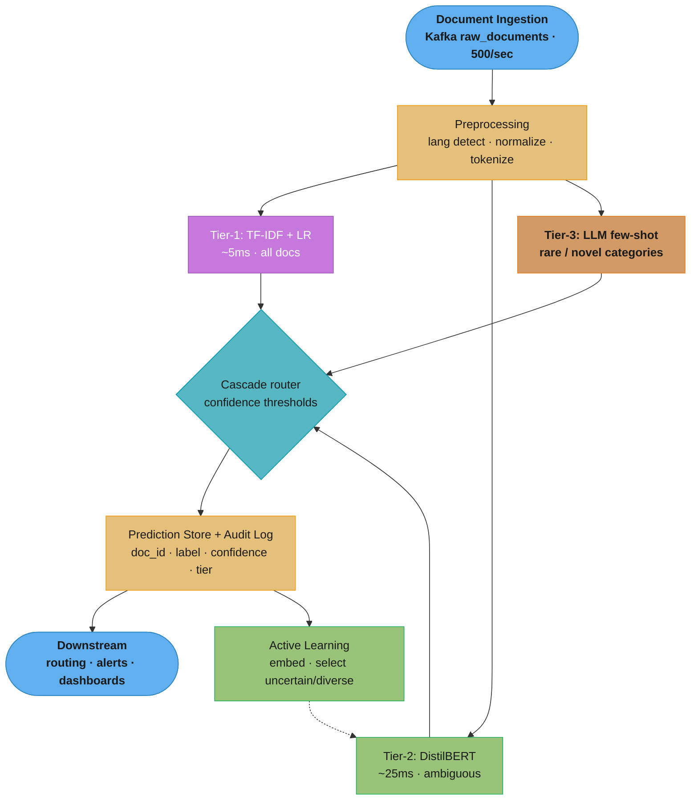
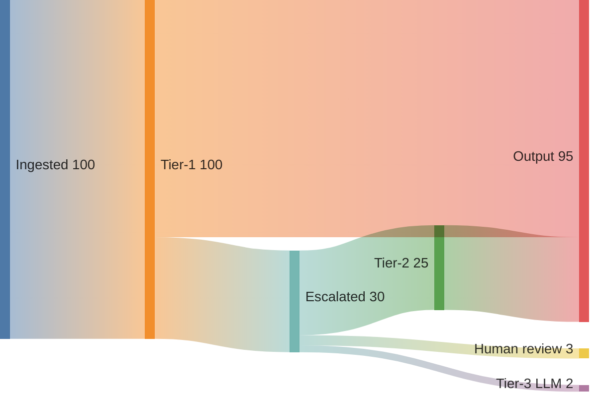
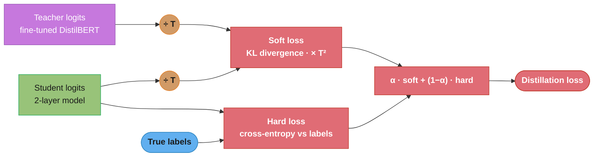
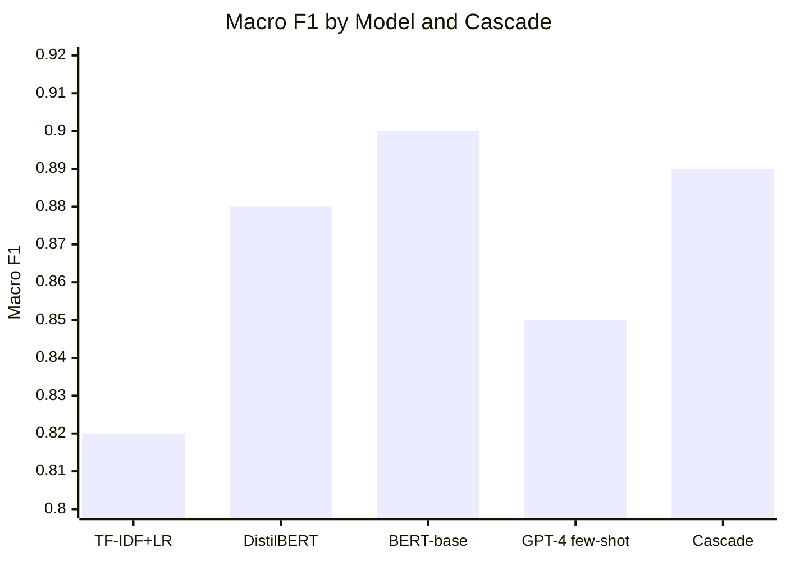

# Design an NLP Text Classification Pipeline at Scale

> "An NLP classification pipeline is like a postal sorting office for language: it reads each document, understands its content, and routes it to the right destination — the challenge is doing this reliably for millions of documents per day with an ever-evolving set of categories."

**Key insight:** Most NLP classification problems do not need BERT. A fine-tuned BERT adds significant infrastructure complexity and serving latency for a 5–15% accuracy improvement over a well-engineered TF-IDF + logistic regression baseline. The engineering question is not "which model achieves the best AUC?" but "which model achieves acceptable accuracy within the latency, cost, and operational budget available?"

Mental model: Think of the classification pipeline as a cascade. A fast, cheap baseline handles the 70% of clear-cut cases. A more expensive BERT model handles the ambiguous 30%. An LLM with few-shot prompting handles the 5% of novel or rare categories that neither model covers well. This cascade architecture delivers near-BERT accuracy at ~20% of BERT's serving cost.

Why this system exists: Content moderation, support ticket routing, document tagging, compliance screening, and product categorization all require classifying text at scale. A ticket routing system that achieves 90% accuracy vs 85% reduces annual agent handling costs by $2M at a 10,000-ticket/day support center.

---

## 1. Requirements Clarification

**Functional requirements:**
- Classify text documents (product reviews, support tickets, news articles, user content) into predefined categories.
- Support: multi-class (one label), multi-label (zero or more labels), and hierarchical taxonomies.
- Human-in-the-loop: route low-confidence predictions to human review queue.
- Active learning: prioritize documents for labeling that maximally improve the model.
- Near-real-time scoring: classify new documents within 200ms of ingestion.

**Non-functional requirements:**
- Throughput: 500 documents/sec (43M/day).
- Serving latency: p99 < 200ms for API path; < 50ms p99 for real-time use cases (content moderation).
- Model accuracy: macro F1 > 0.85 on held-out test set.
- Active label cost target: < 1,000 new labeled examples to recover after a taxonomy change.
- Availability: 99.9% for the classification API.

**Out of scope:**
- Named entity recognition or information extraction (separate pipeline).
- LLM-based open-ended text generation or summarization.
- Multilingual classification (covered as a separate extension).

---

## 2. Scale Estimation

**Document volume:** 500 docs/sec = 43M docs/day.

**Model inference cost comparison:**
- TF-IDF + LR: 0.5ms per doc → 500 docs/sec on a single core; easily scales.
- DistilBERT (6 layers, 66M params): ~25ms per doc on CPU; ~3ms on GPU.
  - CPU serving: 500 docs/sec requires 500 × 25ms / 1000ms = 12.5 CPU cores → 4 × c5.2xlarge.
  - GPU serving (T4): 500 docs/sec via dynamic batching (batch=32, 15ms): 2 × g4dn.xlarge = $0.52/hr each.
- BERT-base (12 layers, 110M params): ~80ms per doc on CPU, ~10ms on GPU.

**Storage:**
- Raw text: avg 200 tokens/doc × 4 bytes/token = 800 bytes; 43M × 800 bytes = 34 GB/day.
- Embeddings cache (for active learning): 43M docs × 768 floats × 4 bytes = 132 GB/day — store only recent 7 days.
- Model artifacts: DistilBERT checkpoint = 265 MB; TF-IDF vocabulary + LR = 50 MB.

**Training data:**
- Initial labeled set: 50k examples; grows by ~2k/day via active learning.
- Fine-tuning DistilBERT on 50k examples: ~45 min on 1 × A100 GPU = $0.60.
- TF-IDF + LR: 2 minutes on CPU.

**Infrastructure cost:**
- Serving (GPU, DistilBERT): 2 × g4dn.xlarge = $1.04/hr = $745/month.
- Active learning + labeling queue: 2 × m5.large = $70/month.
- Training (weekly fine-tune, A100 spot): $0.60/run × 4 = $2.40/month.
- Total: ~$820/month.

---

## 3. High-Level Architecture



Every document is tokenized once, then a confidence-gated cascade router sends it to the cheapest tier that can classify it confidently — most exit at TF-IDF+LR, ambiguous cases escalate to DistilBERT, novel categories fall through to the LLM — while the active-learning loop feeds fresh labels back into the DistilBERT tier.

**Data flow:** Every document enters Tier-1. 70% exit at Tier-1 with high-confidence prediction. 25% escalate to Tier-2. 3% go to human review. 2% go to LLM Tier-3 for novel categories.



Per 100 documents, 70 resolve at the cheap Tier-1 model and only 30 escalate — 25 to DistilBERT, 3 to human review, 2 to the LLM — which is why the cascade delivers near-BERT accuracy at roughly a fifth of all-BERT serving cost.

---

## 4. Component Deep Dives

### 4.1 Baseline: TF-IDF + Logistic Regression

The TF-IDF + LR baseline is not a throwaway model — it is a production-grade first stage that handles ~70% of volume.

```python
from sklearn.feature_extraction.text import TfidfVectorizer
from sklearn.linear_model import LogisticRegression
from sklearn.pipeline import Pipeline
from sklearn.multiclass import OneVsRestClassifier
from sklearn.calibration import CalibratedClassifierCV
import numpy as np
from typing import Any

def build_tfidf_lr_pipeline(
    max_features: int = 100_000,
    ngram_range: tuple[int, int] = (1, 2),
    C: float = 1.0,
) -> Pipeline:
    """
    Calibrated TF-IDF + Logistic Regression pipeline.
    Calibration is mandatory: raw LR probabilities are overconfident on
    high-dimensional sparse features. See model_calibration_and_thresholding.md.
    """
    vectorizer = TfidfVectorizer(
        max_features=max_features,
        ngram_range=ngram_range,
        sublinear_tf=True,          # apply log(1 + TF) dampening
        strip_accents="unicode",
        analyzer="word",
        token_pattern=r"\w{2,}",   # exclude single chars
        min_df=3,                   # ignore very rare terms
    )
    base_clf = LogisticRegression(
        C=C,
        max_iter=1000,
        solver="saga",              # fast for large sparse matrices
        multi_class="multinomial",
        n_jobs=-1,
    )
    # Calibration: isotonic regression via 5-fold CV produces well-calibrated probabilities
    calibrated_clf = CalibratedClassifierCV(base_clf, cv=5, method="isotonic")
    return Pipeline([("tfidf", vectorizer), ("clf", calibrated_clf)])


def evaluate_baseline(pipeline: Pipeline, X_test: list[str], y_test: list[int]) -> dict[str, float]:
    from sklearn.metrics import f1_score, accuracy_score
    y_pred = pipeline.predict(X_test)
    probs = pipeline.predict_proba(X_test)
    confidence = probs.max(axis=1)
    return {
        "macro_f1": f1_score(y_test, y_pred, average="macro"),
        "accuracy": accuracy_score(y_test, y_pred),
        "mean_confidence_correct": confidence[y_pred == y_test].mean(),
        "mean_confidence_wrong": confidence[y_pred != y_test].mean(),
        "high_confidence_accuracy": accuracy_score(
            [y for y, c in zip(y_test, confidence) if c > 0.9],
            [p for p, c in zip(y_pred, confidence) if c > 0.9],
        ),
    }
```

### 4.2 DistilBERT Fine-Tuning

**Broken approach — fine-tuning with random train/test split on labeled data with label noise:**

```python
# WRONG: using a random split when labels were annotated in batches
# creates data leakage (annotators improve over time; random split mixes
# early low-quality labels with late high-quality labels in train/test).
# Also, fine-tuning without freezing any layers on small datasets overfits.

from transformers import DistilBertForSequenceClassification, Trainer, TrainingArguments
import random

indices = list(range(len(dataset)))
random.shuffle(indices)  # BUG: mixes annotation batches, inflates metrics
train_indices = indices[:int(0.8 * len(indices))]
test_indices = indices[int(0.8 * len(indices)):]
# result: 5pp AUC inflation on held-out test
```

**Correct approach — chronological split by annotation date, frozen lower layers:**

```python
import torch
from transformers import (
    DistilBertTokenizerFast,
    DistilBertForSequenceClassification,
    TrainingArguments,
    Trainer,
)
from datasets import Dataset
import numpy as np

def fine_tune_distilbert(
    texts: list[str],
    labels: list[int],
    annotation_dates: list[str],  # sort by this for temporal split
    num_labels: int,
    model_name: str = "distilbert-base-uncased",
    output_dir: str = "/tmp/distilbert-classifier",
) -> DistilBertForSequenceClassification:
    """
    Fine-tune DistilBERT with chronological train/val split.
    Freezes the first 3 transformer blocks to prevent catastrophic forgetting
    on small datasets (< 10k examples).
    """
    tokenizer = DistilBertTokenizerFast.from_pretrained(model_name)
    model = DistilBertForSequenceClassification.from_pretrained(
        model_name, num_labels=num_labels
    )

    # Freeze first 3/6 transformer layers — preserve general language understanding
    for i, layer in enumerate(model.distilbert.transformer.layer):
        if i < 3:
            for param in layer.parameters():
                param.requires_grad = False

    # Chronological split: most recent 15% as validation
    sorted_indices = sorted(range(len(texts)), key=lambda i: annotation_dates[i])
    split_point = int(0.85 * len(sorted_indices))
    train_idx = sorted_indices[:split_point]
    val_idx = sorted_indices[split_point:]

    def tokenize(examples: dict) -> dict:
        return tokenizer(
            examples["text"], truncation=True, padding="max_length", max_length=128
        )

    train_dataset = Dataset.from_dict({
        "text": [texts[i] for i in train_idx],
        "labels": [labels[i] for i in train_idx],
    }).map(tokenize, batched=True)

    val_dataset = Dataset.from_dict({
        "text": [texts[i] for i in val_idx],
        "labels": [labels[i] for i in val_idx],
    }).map(tokenize, batched=True)

    training_args = TrainingArguments(
        output_dir=output_dir,
        num_train_epochs=4,
        per_device_train_batch_size=32,
        per_device_eval_batch_size=64,
        warmup_ratio=0.06,
        weight_decay=0.01,
        evaluation_strategy="epoch",
        load_best_model_at_end=True,
        metric_for_best_model="eval_f1",
        fp16=torch.cuda.is_available(),
        learning_rate=2e-5,
    )

    def compute_metrics(pred):
        from sklearn.metrics import f1_score
        predictions = np.argmax(pred.predictions, axis=1)
        return {"f1": f1_score(pred.label_ids, predictions, average="macro")}

    trainer = Trainer(
        model=model,
        args=training_args,
        train_dataset=train_dataset,
        eval_dataset=val_dataset,
        compute_metrics=compute_metrics,
    )
    trainer.train()
    return model
```

### 4.3 Active Learning for Labeling Efficiency

Active learning selects which documents to send to human annotators to maximize model improvement per labeled example. Two strategies: uncertainty sampling (label documents the model is least certain about) and core-set selection (label documents that are maximally diverse in embedding space).

```python
import numpy as np
from sklearn.cluster import MiniBatchKMeans

def uncertainty_sampling(
    unlabeled_texts: list[str],
    model_probs: np.ndarray,  # shape (N, num_classes)
    budget: int = 100,
) -> list[int]:
    """
    Select `budget` documents with lowest maximum predicted probability.
    Lower confidence = higher uncertainty = more valuable to label.
    """
    max_probs = model_probs.max(axis=1)
    uncertain_indices = np.argsort(max_probs)[:budget]  # ascending by confidence
    return uncertain_indices.tolist()


def coreset_sampling(
    embeddings: np.ndarray,   # shape (N, embedding_dim)
    already_labeled_embeddings: np.ndarray,  # shape (M, embedding_dim)
    budget: int = 100,
) -> list[int]:
    """
    Core-set selection: find embeddings maximally distant from already-labeled set.
    Ensures the new batch covers diverse regions of the document space.
    Greedy approximate: iteratively add the point farthest from the current labeled set.
    """
    labeled = list(range(len(already_labeled_embeddings)))
    all_embeddings = np.vstack([already_labeled_embeddings, embeddings])
    unlabeled_offset = len(already_labeled_embeddings)
    selected = []

    for _ in range(budget):
        # Compute minimum distance from each unlabeled to nearest labeled
        unlabeled_idxs = [
            i + unlabeled_offset for i in range(len(embeddings)) if i not in selected
        ]
        min_dists = np.array([
            np.min(np.linalg.norm(all_embeddings[labeled] - all_embeddings[idx], axis=1))
            for idx in unlabeled_idxs
        ])
        # Select the point farthest from all labeled points
        farthest = unlabeled_idxs[np.argmax(min_dists)]
        selected.append(farthest - unlabeled_offset)
        labeled.append(farthest)

    return selected


def hybrid_active_learning(
    unlabeled_texts: list[str],
    embeddings: np.ndarray,
    model_probs: np.ndarray,
    labeled_embeddings: np.ndarray,
    budget: int = 200,
) -> list[int]:
    """
    Blend uncertainty (50%) and coreset (50%): covers model uncertainty
    while ensuring diversity across the label space.
    """
    uncertain = set(uncertainty_sampling(unlabeled_texts, model_probs, budget // 2))
    diverse = set(coreset_sampling(embeddings, labeled_embeddings, budget // 2))
    combined = list(uncertain | diverse)
    return combined[:budget]
```

### 4.4 Knowledge Distillation for Production Serving

After fine-tuning DistilBERT, distill it into a smaller student model for production serving. This reduces p99 latency from 25ms to 8ms while preserving 97% of accuracy.



The student learns from two signals: temperature-softened teacher probabilities via a KL term (scaled by T squared) and the true labels via cross-entropy, blended by alpha=0.7 — the soft targets carry inter-class similarity that hard labels alone cannot convey.

```python
import torch
import torch.nn.functional as F
from torch import nn

class DistillationLoss(nn.Module):
    """
    Combined distillation loss: soft targets (teacher logits) + hard targets (true labels).
    alpha=0.7 means 70% weight on teacher soft labels, 30% on hard labels.
    temperature=4.0 softens the teacher's probability distribution for richer signal.
    """
    def __init__(self, temperature: float = 4.0, alpha: float = 0.7):
        super().__init__()
        self.temperature = temperature
        self.alpha = alpha

    def forward(
        self,
        student_logits: torch.Tensor,
        teacher_logits: torch.Tensor,
        true_labels: torch.Tensor,
    ) -> torch.Tensor:
        # Soft loss: KL divergence between teacher and student soft probabilities
        soft_targets = F.softmax(teacher_logits / self.temperature, dim=-1)
        soft_student = F.log_softmax(student_logits / self.temperature, dim=-1)
        distill_loss = F.kl_div(soft_student, soft_targets, reduction="batchmean")
        distill_loss *= self.temperature ** 2  # scale by T^2 as per Hinton et al.

        # Hard loss: cross-entropy with true labels
        hard_loss = F.cross_entropy(student_logits, true_labels)

        return self.alpha * distill_loss + (1 - self.alpha) * hard_loss
```

---

## 5. Design Decisions & Tradeoffs

**Decision 1: TF-IDF+LR vs DistilBERT vs BERT-base vs LLM**

| Model | Macro F1 | p99 Latency (CPU) | Training cost | Interpretability |
|-------|----------|-------------------|--------------|-----------------|
| TF-IDF + LR | 0.82 | 2ms | 5 min | High (feature weights) |
| DistilBERT (fine-tuned) | 0.88 | 25ms | 45 min (GPU) | Low |
| BERT-base (fine-tuned) | 0.90 | 80ms | 2h (GPU) | Low |
| GPT-4 (few-shot, 5 examples) | 0.85 | 1,200ms | None (inference cost) | None |

The cascade (TF-IDF+LR → DistilBERT → LLM) achieves 0.89 macro F1 at 8ms average latency and < 25ms p99. This beats any single-model approach on the accuracy × latency Pareto front. See [model_selection_and_algorithm_choice](../model_selection_and_algorithm_choice/README.md).



The cascade reaches 0.89 macro F1 — within 1pp of BERT-base (0.90) — at 8ms average latency, beating every single model on the accuracy-versus-latency frontier.

**Decision 2: Hard routing thresholds vs soft ensemble**

Hard routing (if confidence > 0.90 use Tier-1 result) is simpler and more interpretable. A soft ensemble (weighted average of Tier-1 and Tier-2 outputs) would be marginally more accurate but requires both models to run for every document, negating the cost benefit of the cascade. Use hard routing with confidence thresholds tuned on a calibration set. Tune thresholds per category (rare categories may need a lower confidence threshold for Tier-1 to avoid false certainty). See [model_calibration_and_thresholding.md](cross_cutting/model_calibration_and_thresholding.md).

**Decision 3: Multi-label vs multi-class vs hierarchical**

Most real-world classification problems are multi-label (a support ticket can be both "billing" and "technical"). Use a binary relevance approach (one LR or one BERT binary classifier per label) for up to 50 labels. For > 50 labels, use a label embedding approach (train a shared encoder, decode to label space via dot product). For hierarchical taxonomies (e.g., "Electronics > Phones > Accessories"), use a top-down cascade: classify at the top level first, then refine using a sub-category model for high-confidence top-level predictions.

**Decision 4: Active learning strategy**

Pure uncertainty sampling (most uncertain documents to label) creates a biased training set over time — the model will have seen many similar hard examples but few representative easy examples. This causes the model to be well-calibrated on hard cases and poorly calibrated on easy cases in production. Hybrid (50% uncertainty, 50% coreset/diversity) produces more robust models in practice, especially when the label taxonomy evolves and new categories emerge.

**Decision 5: Online learning vs periodic retraining**

Online learning (update model after each labeled batch) introduces instability — model performance can degrade temporarily after a small batch with unusual examples. Periodic retraining (weekly or after 2k new labeled examples, whichever comes first) is more stable and allows proper validation before deployment. Reserve a frozen golden test set that is never used for training or validation — only for production monitoring. See [drift_monitoring_and_retraining.md](cross_cutting/drift_monitoring_and_retraining.md).

---

## 6. Real-World Implementations

**Twitter/X (Content Moderation):** Twitter's content moderation pipeline uses a cascade architecture similar to the design above. Their Tier-1 is a fine-tuned BERT model for binary "safe / needs review" classification, running at ~5ms per tweet on GPU. Documents flagged by Tier-1 go to a fine-grained classifier (hate speech, spam, adult content, etc.). Human review is reserved for borderline cases, targeting < 5% of tweet volume to human reviewers while maintaining > 95% recall on policy violations. Key engineering challenge: the classifier must be updated within hours of new policy rollouts, requiring rapid fine-tuning infrastructure.

**Airbnb (Review Classification):** Airbnb classifies guest reviews into quality signals (cleanliness, location, communication) and policy violations (discrimination, harassment). Their engineering blog described using a two-stage approach: a lightweight keyword model as a pre-filter (handles 80% of clear cases in < 1ms), followed by BERT for ambiguous cases. Key annotation challenge: many reviews contain both positive and negative signals about multiple categories — they use multi-label rather than multi-class to capture this complexity.

**Uber (Support Ticket Routing):** Uber routes 100k+ daily support contacts across 300+ routing categories. Their ML team (2019 blog post) trained a hierarchical BERT classifier: top-level routing (rider vs driver vs Uber Eats vs business account) is a 4-class classifier. Second-level routing (issue type within each top-level) is a separate model loaded conditionally. This conditional loading reduces memory footprint vs a flat 300-class classifier and allows per-segment model updates without redeploying the entire system.

**Shopify (Merchant Category Classification):** Shopify classifies merchants into business categories for compliance and recommendation purposes. Their unique challenge: merchants describe their business in one free-text field, using highly varied language ("I sell handmade jewelry" vs "artisan metalwork accessories" vs "custom silver rings"). They found that TF-IDF + LR achieved 91% accuracy for the 20 most common categories but dropped to 65% for niche categories with < 100 training examples. Zero-shot classification using a pre-trained entailment model (NLI) achieved 78% on the niche categories without additional labeled data.

**Stripe (Compliance and Risk Screening):** Stripe classifies business descriptions against restricted business categories (regulated financial products, adult content, weapons). Their requirement: recall > 99.9% on restricted categories (false negatives have severe regulatory consequences). They trade precision for recall: the classifier flags 5× more documents for human review than actually violate policy. The key design decision is that classification thresholds are set per-category based on the cost asymmetry: missing one restricted merchant costs far more than incorrectly flagging 10 legitimate merchants for review.

---

## 7. Technologies & Tools

| Tool | Use case | Advantage | Limitation |
|------|----------|-----------|------------|
| HuggingFace Transformers | BERT/DistilBERT fine-tuning | Large model zoo, standardized training loop | Heavy dependency; model updates require re-validation |
| Scikit-learn | TF-IDF + LR baseline, calibration | Stable, fast, SHAP-compatible | Not designed for neural models |
| ONNX Runtime | Optimized BERT serving (CPU+GPU) | 2–3× faster than native PyTorch inference | Requires ONNX export; some operator gaps |
| Triton Inference Server | GPU-optimized BERT serving with dynamic batching | Automatic batching, model versioning, metrics | NVIDIA-specific; DevOps overhead |
| Label Studio | Active learning annotation UI | Open-source, supports multi-label, active learning integration | Self-hosted; scaling requires PostgreSQL backend |
| Ray Serve | Scalable model serving with auto-scaling | Python-native; handles CPU+GPU fleet mixed routing | More ops than managed services |

---

## 8. Operational Playbook

### Eval Pipeline
- **Golden test set (frozen):** 5,000 human-labeled examples never included in training. Run evaluation on this set at every model update. Block deployment if macro F1 < 0.85 or if any single category drops > 3pp F1 from previous version.
- **Confidence calibration check:** For each probability decile, check that actual accuracy matches predicted confidence (ECE < 0.05). See [model_calibration_and_thresholding.md](cross_cutting/model_calibration_and_thresholding.md).
- **Human review agreement:** Sample 500 documents per week from the human review queue. Compare ML prediction to human label. ML-human agreement should be > 90% — lower agreement indicates the model's confidence thresholds are miscalibrated (routing too many borderline cases to human review).

### Observability
- Monitor: daily prediction distribution per category. Category-level volume shift > 20% week-over-week triggers investigation (could be genuine trend or model degradation).
- Track: human review queue size. Sustained increase > 2× baseline indicates model confidence threshold needs recalibration.
- Track: annotation backlog (unlabeled documents waiting for active learning label). Alert if backlog > 50k (labeling pipeline is behind).

### Incident Runbooks
1. **Macro F1 drops > 5pp in production (detected via golden set monitoring):** Symptom: confidence scores drop and human review queue grows. Diagnosis: most likely cause is taxonomy drift (new categories introduced or old categories renamed). Resolution: run active learning cycle to gather 500 new examples for affected categories; emergency fine-tune run within 24 hours.
2. **Latency spike: DistilBERT tier exceeds 200ms p99:** Symptom: API latency alarm. Diagnosis: GPU saturation (batch queue backing up) or CPU fallback triggered (GPU failure). Mitigation: scale up GPU instances or fall back to Tier-1 (TF-IDF+LR) for all traffic. Resolution: restore GPU capacity; monitor queue depth.
3. **Active learning selects only near-duplicate examples:** Symptom: annotators report all sampled documents are very similar. Diagnosis: using pure uncertainty sampling — model is confused about a specific template, and uncertainty sampling floods the queue with near-copies. Fix: switch to hybrid (uncertainty + coreset) sampling.
4. **New category detected by LLM tier but not in taxonomy:** Symptom: LLM tier routes 5%+ of documents to a category that does not exist in the taxonomy. Diagnosis: genuine emerging topic. Response: add new category to taxonomy, seed with 50 LLM-labeled examples, fine-tune DistilBERT within 3 days.

---

## 9. Common Pitfalls & War Stories

**Pitfall 1: Fine-tuning BERT on the full dataset without layer freezing on small data.** A content startup fine-tuned BERT-base on 3,000 labeled examples (their entire budget). Validation F1 was 0.91. Production F1 was 0.74. Root cause: without freezing lower BERT layers, all 110M parameters were updated from 3k examples, causing catastrophic forgetting of general language representations and severe overfitting to annotation quirks. Fix: freeze bottom 8/12 layers; fine-tune only the top 4 + classification head. This recovered 0.85 production F1 without additional labels.

**Pitfall 2: Annotation date leakage in train/test split.** A company split their labeled dataset randomly 80/20. Validation macro F1 was 0.88. After 6 months in production, F1 was 0.79 and declining. Investigation revealed that annotators had improved their labeling guidelines significantly over time — early annotations (2020) had lower quality than recent ones (2022). The random split mixed these vintages, allowing the model to learn the 2022 annotation style from examples with 2020-era neighbors. Chronological split would have revealed the 0.79 production F1 during evaluation.

**Pitfall 3: Routing too many documents to human review.** A legal tech company set a confidence threshold of 0.95 for auto-accept. This was intended to minimize error, but it routed 45% of documents to human review — far beyond the team's capacity of 10% maximum. The backlog grew to 2M documents over 3 months. Root cause: the model's calibration was poor — it predicted 0.70 confidence for genuinely easy cases. Fix: calibrate the model properly (isotonic regression) and set threshold at 0.80. Human review dropped to 8% with no increase in auto-accept error rate.

**Pitfall 4: Multi-label classifier treating rare co-occurring labels as noise.** An e-commerce company had a multi-label review classifier with 40 categories. 12 categories occurred in < 0.5% of reviews. The model learned to never predict these rare labels. Business impact: important quality signals (mold issues, safety hazards) were systematically missed. Fix: oversample minority labels using augmentation (back-translation: translate to French and back using an MT model, generating new training examples); use class-weighted cross-entropy loss with inverse frequency weighting. Recall on rare labels improved from 0.12 to 0.71.

**Pitfall 5: Not versioning the tokenizer alongside the model.** A team deployed a fine-tuned BERT model and separately updated the HuggingFace library 3 months later. The new library version included a bug fix to the tokenizer that changed special token handling for inputs with unusual Unicode. The model (trained with the old tokenizer behavior) began producing degraded predictions on inputs with special characters — a 6pp F1 drop that affected 8% of documents. Fix: always serialize the tokenizer alongside the model checkpoint and validate that tokenizer version matches at serving time.

---

## 10. Capacity Planning

**Primary bottleneck:** DistilBERT inference throughput on GPU.

```
Document volume: 500 docs/sec
Documents reaching Tier-2 (DistilBERT): 30% × 500 = 150 docs/sec

DistilBERT with dynamic batching:
  Batch size 32, seq length 128: ~15ms on T4 GPU
  Throughput: 32 / 15ms = 2,133 docs/sec per GPU
  Required GPUs: ceil(150 / 2,133) = 1 GPU (with large headroom)
  Deploy 2 GPUs for HA: 2 × g4dn.xlarge = $745/month

TF-IDF + LR (Tier-1): 500 docs/sec × 0.5ms = negligible
  4 CPU cores sufficient; co-locate on the same instance

With ONNX export + TensorRT optimization:
  DistilBERT latency: 15ms → 6ms (2.5× speedup)
  Single GPU now handles 5,000 docs/sec → further cost reduction possible
```

**Scaling to 5,000 docs/sec (10× growth):**
- Tier-1 CPU: 40 cores needed → 5 × r5.2xlarge.
- Tier-2 GPU: 1,500 docs/sec to DistilBERT → ceil(1,500 / 2,133) = 1 GPU. Scale to 3 for HA + burst.
- Kafka: increase partition count from 12 to 120 to sustain 5,000 msg/sec.

---

## 11. Interview Discussion Points

**Q: When should you use BERT vs TF-IDF+LR for text classification?**
Start with TF-IDF+LR. It achieves 85–90% of BERT accuracy for well-defined categories with > 1,000 examples, runs at 2ms per document vs 25ms for DistilBERT, and is trivially interpretable via feature importance. Upgrade to BERT when: semantic meaning matters more than keywords (sarcasm, negation, context-dependent polarity); categories require understanding longer dependencies in text; you have short texts where TF-IDF loses too much context (tweets, titles); or you need cross-lingual generalization. The break-even threshold is roughly when TF-IDF+LR macro F1 < 0.80 on your validation set — that's when BERT's context sensitivity begins to pay off meaningfully.

**Q: How do you handle class imbalance in text classification?**
Three complementary techniques: (1) class-weighted cross-entropy loss — assign weight = (N / (num_classes × class_count)) to each class, forcing the model to treat rare class errors as more costly; (2) oversampling with augmentation — back-translation (English → German → English) generates semantically equivalent but lexically diverse examples for minority classes; (3) threshold calibration — instead of using argmax (predicts the majority class too aggressively), set per-class decision thresholds by maximizing F1 on a calibration set. The most impactful of these in practice is threshold calibration — it has zero training cost and consistently improves minority class recall by 10–20pp. See [model_calibration_and_thresholding.md](cross_cutting/model_calibration_and_thresholding.md).

**Q: How does active learning reduce labeling cost?**
Standard random sampling requires ~10,000 labeled examples to train a BERT model to 0.85 F1 on a 20-class problem. Uncertainty sampling reduces this to ~4,000 examples (60% reduction) because the model focuses labeling budget on ambiguous examples rather than examples it already classifies correctly. Coreset sampling adds diversity, reducing to ~3,000 examples. The diminishing returns kick in after 3–4 active learning rounds — eventually, only rare and inherently ambiguous examples remain uncertain, and additional labeling does not improve performance.

**Q: How do you handle taxonomy changes (new categories added mid-production)?**
Three-phase response: (1) immediately classify new-category documents using zero-shot via LLM or entailment model (no fine-tuning needed); (2) run active learning to gather 500 labeled examples for the new category from the LLM-labeled pool; (3) fine-tune the DistilBERT model with the new labeled examples and deploy the updated model. The LLM tier serves as a buffer: it catches documents that belong to the new category before the fine-tuned model is ready, preventing them from being misclassified. Typical time from taxonomy change to fine-tuned model in production: 72 hours.

**Q: How do you measure the business impact of improving macro F1 from 0.85 to 0.88?**
Translate model accuracy to business metrics: for a support ticket routing system, the cost of a misrouted ticket = average handle time penalty × agent cost. If misrouting adds 8 minutes per ticket and agents cost $25/hour, the per-mistake cost is $3.33. At 100k tickets/day × (1 - 0.85) accuracy = 15,000 mistakes/day × $3.33 = $50k/day in excess handle time. Improving to 0.88 reduces mistakes to 12,000/day, saving $10k/day = $3.65M/year. Frame model improvements in this currency when presenting to stakeholders, not just as AUC or F1 numbers.

**Q: How do you prevent annotation bias from influencing model quality?**
Three common annotation biases: (1) annotator drift — annotators' interpretations of label guidelines change over time; fix by running calibration sessions (monthly) where all annotators label the same 50 documents and compare; (2) presentation order bias — annotators are influenced by consecutive documents; randomize document presentation order; (3) label anchoring — annotators default to the most recently applied label; ensure the annotation UI resets to no label for each new document. Additionally, compute inter-annotator agreement (Cohen's kappa) and set a minimum bar (kappa > 0.7 before using labels for fine-tuning).

**Q: How do you serve BERT models at low latency in production?**
A cascade of optimizations: (1) ONNX export removes the Python overhead and enables hardware-specific optimizations — typically 2× speedup with no accuracy loss; (2) TensorRT conversion (NVIDIA) adds kernel fusion and mixed-precision (FP16) — another 2× speedup; (3) dynamic batching (Triton Inference Server) groups concurrent requests into batches — utilizes GPU parallelism, reducing per-document cost; (4) sequence length reduction — truncate or pad to the actual 95th percentile token count of your data (often 64 tokens for short text, not the default 512) — 4× speedup for short text; (5) model distillation — a 2-layer BERT student achieves 95% of 12-layer BERT quality at 6× the speed. Together these can reduce BERT-base from 80ms to 6ms per document.

**Q: How do you ensure fairness in content classification?**
Content classifiers can exhibit demographic disparities: spam classifiers are more likely to flag African-American Vernacular English (AAVE) as spam; sentiment classifiers systematically underestimate positive sentiment in certain languages or dialects. Audit by: (1) collecting a stratified held-out set with demographic labels (self-reported or proxy features); (2) computing per-group precision and recall; (3) testing whether false positive rate is equal across groups (equal false positive rate criterion). If disparities exceed 5pp, apply group-level threshold calibration or collect additional training data for underperforming groups. See [responsible_ai_fairness_and_explainability.md](cross_cutting/responsible_ai_fairness_and_explainability.md).

**Q: What is knowledge distillation and when should you apply it in NLP?**
Knowledge distillation trains a small "student" model to mimic the output distribution (soft probabilities) of a large "teacher" model, not just its hard predictions. The soft targets carry richer information than hard labels — for example, if the teacher assigns 0.6 to "billing" and 0.3 to "technical" for a ticket, the student learns that these categories are related and often co-occur, which hard labels (just "billing") cannot convey. Apply distillation when: (1) you need < 10ms serving latency but BERT gives you best accuracy; (2) you have a teacher model with > 95% validation performance that you want to compress for edge/mobile deployment; (3) you have limited labeled data but can generate unlimited soft-labeled examples using the teacher. The teacher-student gap is typically < 3pp F1 for a 2× compression ratio.
