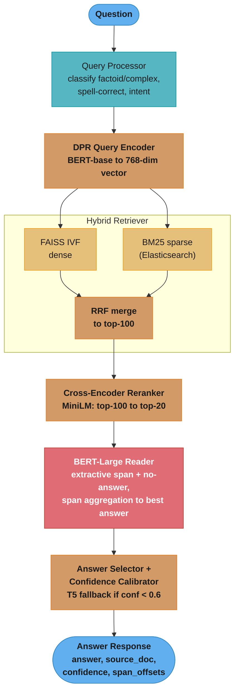
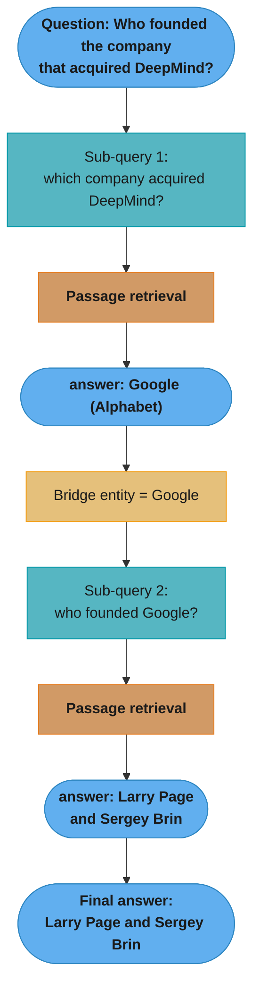
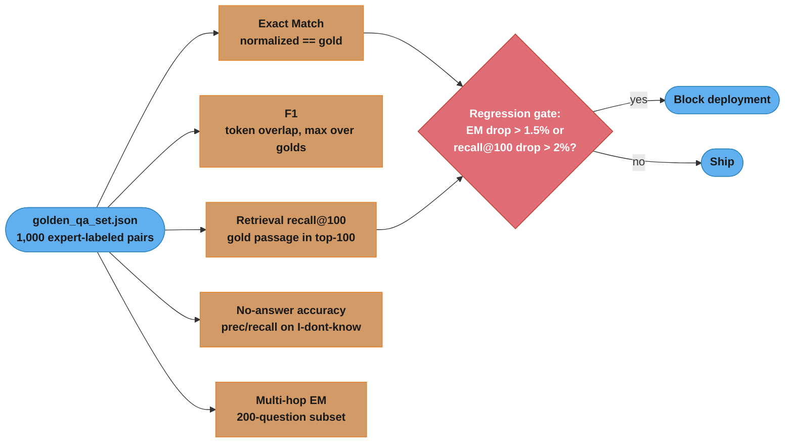

# Design a Question Answering System

> Like a research assistant who has read every document in your library — given a question, it finds the right page and reads out the exact answer.

**Key insight:** QA has two fundamentally different architectures depending on scope. Extractive QA (single passage) is a span-prediction task on top of BERT. Open-domain QA (millions of documents) requires a retriever-reader pipeline where recall at the retrieval stage is the dominant failure mode — no reader model can answer from a passage it was never shown.

---

## 1. Requirements Clarification

**Functional requirements:**
- Answer factoid questions over a document corpus (enterprise knowledge base, 10M documents)
- Return the answer span, the source document with title and URL, and a confidence score
- Support extractive answers (exact text from source) and abstractive answers (paraphrased summary)
- Multi-hop QA: answer questions requiring evidence from two distinct documents
- Graceful no-answer handling: return "I don't know" when no passage contains sufficient evidence

**Non-functional requirements:**
- Latency: P95 < 150ms end-to-end for single-hop questions; P95 < 400ms for multi-hop
- Throughput: 1,000 questions/minute peak
- Answer recall@100 (retriever): ≥ 85% (the correct passage is in the top 100 retrieved)
- Exact Match (EM) on SQuAD 2.0 benchmark: ≥ 82%; F1 ≥ 88%
- Availability: 99.9% SLA; retrieval index refresh within 15 minutes of document ingest

**Out of scope:**
- Conversational QA (multi-turn dialogue, coreference between turns)
- Table or structured-data QA (SQL generation over relational tables)
- Knowledge graph QA (Neo4j traversal for reasoning chains)

---

## 2. Scale Estimation

**Document corpus:**
- 10M documents, average 800 tokens per document (400–1,200 range)
- Passage chunking at 100 tokens with 20-token overlap → avg 10 passages/document → 100M passages
- DPR passage embeddings: 100M × 768 dimensions × 4 bytes = 307 GB raw; after FAISS IVF compression → ~60 GB on disk, 80 GB in RAM

**Traffic:**
- 1,000 QPS peak, 300 QPS average
- Retrieval (FAISS ANN): < 10ms for 100M passages with IVF1024 index
- Reader (BERT-large): 120ms for 100 passages × 512 tokens each in batch = dominant latency

**Compute sizing:**
- Reader model (BERT-large extractive): 100 passages in one forward pass → 120ms on A100
- 1,000 QPS sustained: 1,000 × 0.12s = requires 120 concurrent forward passes → 4 A100 replicas (30 passages/replica concurrently)
- DPR query encoder: 768-dim in 5ms on CPU; runs per-question
- FAISS retrieval: 3ms on 80GB RAM index with 16 CPU threads

**Storage:**
- Passage store: 100M × avg 100 words × 5 bytes = ~50 GB (Postgres text)
- FAISS index: 80 GB RAM per replica (2 replicas for HA) = 160 GB total
- Answer cache (Redis): top-10K questions cached, 1 KB/answer = 10 MB

---

## 3. High-Level Architecture



**Multi-hop flow (sequential sub-queries chained through a bridge entity):**


The second hop cannot run until the first hop resolves the bridge entity ("Google"), so hop errors compound multiplicatively (overall EM ≈ per-hop EM²).

---

## 4. Component Deep Dives

### 4.1 DPR (Dense Passage Retrieval) Dual-Encoder

DPR trains two separate BERT encoders: one for questions and one for passages. Both produce 768-dim vectors, and the similarity is the dot product. Trained with in-batch negatives: for a batch of N (question, positive_passage) pairs, all other N-1 passages in the batch are treated as negatives.

```python
import torch
import torch.nn as nn
import torch.nn.functional as F
from transformers import BertModel, BertTokenizerFast
from dataclasses import dataclass


@dataclass
class RetrievalResult:
    passage_id: int
    passage_text: str
    doc_title: str
    doc_url: str
    dense_score: float
    rank: int


class DPREncoder(nn.Module):
    """Shared architecture for both question and passage encoders."""
    def __init__(self, bert_model_name: str = "bert-base-uncased"):
        super().__init__()
        self.bert = BertModel.from_pretrained(bert_model_name)

    def forward(self, input_ids: torch.Tensor, attention_mask: torch.Tensor) -> torch.Tensor:
        outputs = self.bert(input_ids=input_ids, attention_mask=attention_mask)
        # Use [CLS] token representation as the dense vector
        return outputs.last_hidden_state[:, 0, :]  # (batch, hidden_size=768)


class DPRModel(nn.Module):
    def __init__(self):
        super().__init__()
        self.question_encoder = DPREncoder("bert-base-uncased")
        self.passage_encoder = DPREncoder("bert-base-uncased")

    def forward(
        self,
        question_input_ids: torch.Tensor,     # (batch, seq_len)
        question_attention_mask: torch.Tensor,
        passage_input_ids: torch.Tensor,       # (batch * num_passages, seq_len)
        passage_attention_mask: torch.Tensor,
    ) -> dict:
        q_embeddings = self.question_encoder(question_input_ids, question_attention_mask)
        p_embeddings = self.passage_encoder(passage_input_ids, passage_attention_mask)

        # Dot-product similarity: (batch, batch * num_passages)
        # In-batch negatives: for question i, all passages j ≠ i are negatives
        similarity = torch.matmul(q_embeddings, p_embeddings.T)  # (batch, batch)

        # Temperature scaling for sharper gradients
        similarity = similarity / 1.0  # DPR does not scale by default

        # Cross-entropy loss: diagonal entries are positive pairs
        labels = torch.arange(similarity.size(0), device=similarity.device)
        loss = F.cross_entropy(similarity, labels)

        return {
            "loss": loss,
            "q_embeddings": q_embeddings,
            "p_embeddings": p_embeddings,
            "similarity": similarity,
        }
```

### 4.2 BERT Extractive Reader (Span Prediction)

The reader takes a question and a passage concatenated as `[CLS] question [SEP] passage [SEP]` and predicts start and end token positions of the answer span.

```python
import numpy as np
from transformers import BertForQuestionAnswering, BertTokenizerFast
from dataclasses import dataclass


@dataclass
class ExtractiveAnswer:
    span_text: str
    passage_id: int
    start_char: int
    end_char: int
    start_logit: float
    end_logit: float
    score: float       # start_logit + end_logit
    no_answer_score: float  # [CLS] start + [CLS] end logit


class ExtractiveReader:
    def __init__(self, model_name: str = "deepset/bert-large-uncased-whole-word-masking-squad2"):
        self.tokenizer = BertTokenizerFast.from_pretrained(model_name)
        self.model = BertForQuestionAnswering.from_pretrained(model_name)
        self.model.eval()
        # SQuAD2 models are trained with no-answer passages → output includes null score
        self.null_score_diff_threshold = -2.0  # Tune on dev set; negative means "prefer answer"

    @torch.no_grad()
    def answer_from_passages(
        self, question: str, passages: list[str], passage_ids: list[int],
        max_length: int = 512, max_answer_length: int = 50,
    ) -> list[ExtractiveAnswer]:
        candidates: list[ExtractiveAnswer] = []

        # Encode all (question, passage) pairs in one batch
        encodings = self.tokenizer(
            [question] * len(passages),
            passages,
            max_length=max_length,
            truncation="only_second",  # Truncate passage, never question
            padding=True,
            return_tensors="pt",
            return_offsets_mapping=True,
        )

        outputs = self.model(
            input_ids=encodings["input_ids"],
            attention_mask=encodings["attention_mask"],
        )
        start_logits = outputs.start_logits  # (num_passages, seq_len)
        end_logits = outputs.end_logits       # (num_passages, seq_len)

        for passage_idx in range(len(passages)):
            s_logits = start_logits[passage_idx].cpu().numpy()
            e_logits = end_logits[passage_idx].cpu().numpy()
            offset_mapping = encodings["offset_mapping"][passage_idx].tolist()
            token_type_ids = encodings["token_type_ids"][passage_idx].tolist()

            # Null (no-answer) score: [CLS] token start + end logits
            null_score = s_logits[0] + e_logits[0]

            # Find passage token range (token_type_id == 1 → passage tokens)
            passage_start = next(i for i, t in enumerate(token_type_ids) if t == 1)
            passage_end = len(token_type_ids) - token_type_ids[::-1].index(1)

            # Find best (start, end) span within passage tokens
            best_score = float("-inf")
            best_start = best_end = 0

            for start in range(passage_start, passage_end):
                for end in range(start, min(start + max_answer_length, passage_end)):
                    score = float(s_logits[start] + e_logits[end])
                    if score > best_score:
                        best_score = score
                        best_start = start
                        best_end = end

            # Map token positions back to character offsets in the passage
            char_start = offset_mapping[best_start][0]
            char_end = offset_mapping[best_end][1]
            span_text = passages[passage_idx][char_start:char_end]

            candidates.append(ExtractiveAnswer(
                span_text=span_text,
                passage_id=passage_ids[passage_idx],
                start_char=char_start,
                end_char=char_end,
                start_logit=float(s_logits[best_start]),
                end_logit=float(e_logits[best_end]),
                score=best_score,
                no_answer_score=null_score,
            ))

        return candidates

    def select_best_answer(self, candidates: list[ExtractiveAnswer]) -> ExtractiveAnswer | None:
        # For each candidate, compute score - no_answer_score
        # If best candidate's diff < threshold, return None (no answer found)
        scored = [(c, c.score - c.no_answer_score) for c in candidates]
        scored.sort(key=lambda x: -x[1])
        best_candidate, best_diff = scored[0]
        if best_diff < self.null_score_diff_threshold:
            return None  # "I don't know"
        return best_candidate
```

**Broken → fixed: argmax span selection causes invalid spans**

```python
# BROKEN: independent argmax on start and end logits can produce end < start
start_idx = np.argmax(start_logits)
end_idx = np.argmax(end_logits)
# If start_idx=45 and end_idx=30, this produces an empty/inverted span

# FIXED: iterate over valid (start, end) pairs where end >= start
# and both are within the passage token range (not question or special tokens)
best_score = float("-inf")
for start in range(passage_start, passage_end):
    for end in range(start, min(start + max_answer_len, passage_end)):
        score = start_logits[start] + end_logits[end]
        if score > best_score:
            best_score, best_start, best_end = score, start, end
# Additionally: SQuAD 2.0 models must compare answer score vs null score
# Models fine-tuned only on SQuAD 1.1 always produce an answer even when none exists
```

### 4.3 Hybrid Retrieval (Dense + Sparse + RRF)

Pure DPR retrieval achieves ~78% recall@100 on NaturalQuestions. Adding BM25 (Elasticsearch) and merging with RRF raises recall to ~88%, because dense embeddings miss exact lexical matches (product names, serial numbers, rare named entities).

```python
from elasticsearch import Elasticsearch
import faiss
import numpy as np


class HybridRetriever:
    def __init__(
        self,
        faiss_index: faiss.Index,
        passage_metadata: list[dict],  # [{passage_id, text, doc_title, doc_url}]
        es_client: Elasticsearch,
        es_index: str,
        dense_model: DPREncoder,
        tokenizer: BertTokenizerFast,
        dense_weight: float = 0.6,
        sparse_weight: float = 0.4,
        rrf_k: int = 60,
    ):
        self.faiss_index = faiss_index
        self.passage_metadata = {p["passage_id"]: p for p in passage_metadata}
        self.es = es_client
        self.es_index = es_index
        self.dense_model = dense_model
        self.tokenizer = tokenizer
        self.dense_weight = dense_weight
        self.sparse_weight = sparse_weight
        self.rrf_k = rrf_k

    def retrieve(self, question: str, top_k: int = 100) -> list[RetrievalResult]:
        dense_results = self._dense_retrieve(question, top_k)
        sparse_results = self._sparse_retrieve(question, top_k)
        return self._rrf_merge(dense_results, sparse_results, top_k)

    def _dense_retrieve(self, question: str, top_k: int) -> list[tuple[int, float]]:
        encoding = self.tokenizer(question, max_length=64, truncation=True,
                                   padding="max_length", return_tensors="pt")
        with torch.no_grad():
            q_embedding = self.dense_model(
                encoding["input_ids"], encoding["attention_mask"]
            ).cpu().numpy()

        q_embedding = q_embedding / np.linalg.norm(q_embedding, axis=1, keepdims=True)
        scores, indices = self.faiss_index.search(q_embedding, top_k)
        return [(int(idx), float(score)) for idx, score in zip(indices[0], scores[0]) if idx != -1]

    def _sparse_retrieve(self, question: str, top_k: int) -> list[tuple[int, float]]:
        response = self.es.search(
            index=self.es_index,
            body={
                "query": {"match": {"text": {"query": question, "operator": "or"}}},
                "size": top_k,
                "_source": ["passage_id"],
            },
        )
        return [(hit["_source"]["passage_id"], hit["_score"])
                for hit in response["hits"]["hits"]]

    def _rrf_merge(
        self,
        dense: list[tuple[int, float]],
        sparse: list[tuple[int, float]],
        top_k: int,
    ) -> list[RetrievalResult]:
        rrf_scores: dict[int, float] = {}

        for rank, (pid, _) in enumerate(dense):
            rrf_scores[pid] = rrf_scores.get(pid, 0.0) + self.dense_weight / (rank + self.rrf_k)

        for rank, (pid, _) in enumerate(sparse):
            rrf_scores[pid] = rrf_scores.get(pid, 0.0) + self.sparse_weight / (rank + self.rrf_k)

        sorted_pids = sorted(rrf_scores.items(), key=lambda x: -x[1])[:top_k]

        results = []
        for final_rank, (pid, rrf_score) in enumerate(sorted_pids):
            meta = self.passage_metadata.get(pid, {})
            results.append(RetrievalResult(
                passage_id=pid,
                passage_text=meta.get("text", ""),
                doc_title=meta.get("doc_title", ""),
                doc_url=meta.get("doc_url", ""),
                dense_score=rrf_score,
                rank=final_rank,
            ))
        return results
```

### 4.4 Multi-Hop QA with Bridge Entity

Multi-hop questions require evidence from two documents. The architecture uses a two-round retrieval: first retrieve for the original question, extract the "bridge entity" from the top answer, then retrieve again for a reformulated question containing the bridge entity.

```python
import re


class MultiHopQAEngine:
    def __init__(self, retriever: HybridRetriever, reader: ExtractiveReader,
                 ner_pipeline: object, max_hops: int = 2):
        self.retriever = retriever
        self.reader = reader
        self.ner_pipeline = ner_pipeline  # NER pipeline for bridge entity extraction
        self.max_hops = max_hops

    def answer(self, question: str) -> dict:
        # Classify: single-hop vs multi-hop
        is_multi_hop = self._is_multi_hop(question)

        if not is_multi_hop:
            return self._single_hop_answer(question)

        return self._multi_hop_answer(question)

    def _single_hop_answer(self, question: str) -> dict:
        passages = self.retriever.retrieve(question, top_k=100)
        passage_texts = [p.passage_text for p in passages[:20]]  # Reader sees top-20
        passage_ids = [p.passage_id for p in passages[:20]]

        candidates = self.reader.answer_from_passages(question, passage_texts, passage_ids)
        best = self.reader.select_best_answer(candidates)
        if best is None:
            return {"answer": "I don't know", "confidence": 0.0, "source": None}

        source = next((p for p in passages if p.passage_id == best.passage_id), None)
        return {
            "answer": best.span_text,
            "confidence": self._score_to_confidence(best.score),
            "source": {"title": source.doc_title, "url": source.doc_url} if source else None,
        }

    def _multi_hop_answer(self, question: str) -> dict:
        # Round 1: answer the "which entity" sub-question
        first_hop = self._single_hop_answer(question)
        bridge_entity = first_hop.get("answer", "")

        if not bridge_entity or first_hop["confidence"] < 0.5:
            return first_hop  # Fall back to single-hop result

        # Round 2: reformulate question with bridge entity
        reformulated = self._reformulate_with_bridge(question, bridge_entity)
        second_hop = self._single_hop_answer(reformulated)

        return {
            "answer": second_hop["answer"],
            "confidence": min(first_hop["confidence"], second_hop["confidence"]),
            "source": second_hop["source"],
            "bridge_entity": bridge_entity,
            "hops": [first_hop, second_hop],
        }

    def _is_multi_hop(self, question: str) -> bool:
        # Heuristic: questions asking "who founded the company that..." require 2 hops
        multi_hop_patterns = [
            r"who (founded|created|started) the (company|organization) that",
            r"where (is|was) .+ (that|who) (founded|created)",
            r"what (did|does) the (person|company) who .+ (do|create|found)",
        ]
        return any(re.search(p, question, re.IGNORECASE) for p in multi_hop_patterns)

    def _reformulate_with_bridge(self, original_question: str, bridge: str) -> str:
        # Simple template: replace the bridge clause with the extracted entity
        # In production: use a T5 question reformulator fine-tuned on HotpotQA
        return f"Tell me about {bridge}: {original_question}"

    def _score_to_confidence(self, score: float) -> float:
        # Sigmoid normalization; raw scores range roughly from -10 to +15
        return float(1 / (1 + np.exp(-score / 5)))
```

---

## 5. Design Decisions & Tradeoffs

| Decision | Choice | Alternatives | Rationale |
|---|---|---|---|
| Reader model | BERT-large (340M) | BERT-base, RoBERTa, T5 | BERT-large achieves 87.5 F1 on SQuAD 2.0 vs 83.1 for BERT-base; T5 is abstractive (useful but slower and harder to trace) |
| Retrieval | DPR + BM25 hybrid (RRF) | BM25 only, DPR only, ColBERT | DPR alone misses rare entities (recall 78%); BM25 alone misses paraphrase matches (recall 74%); hybrid = 88%; ColBERT is more powerful but requires 50× more disk |
| No-answer handling | SQuAD 2.0 null score threshold | Separate classifier | Null score from SQuAD 2.0 training is calibrated for span extraction; separate classifier adds inference cost |
| Multi-hop strategy | Sequential 2-round retrieval | Iterative graph retrieval, reasoning chains | 2-round covers 90% of multi-hop questions; graph retrieval (IDRQA) improves recall by 6% but adds 3× latency |
| Passage granularity | 100-token chunks with 20-token overlap | 256-token, sentence-level | 100-token chunks maximize answer recall (short passages = fewer irrelevant tokens); 256-token = faster retrieval but 8% lower recall on SQuAD |

**Comparison: extractive vs abstractive vs hybrid**

| Approach | EM on SQuAD 2.0 | Latency | Traceability | Hallucination risk |
|---|---|---|---|---|
| Extractive (BERT span) | 82% | 120ms | Full (exact quote) | Zero |
| Abstractive (T5-large) | 78% (fluency metric) | 350ms | Partial | Moderate (paraphrase errors) |
| Hybrid (extract + T5 paraphrase) | 83% | 480ms | Partial | Low |
| RAG (generate with context) | 85% (ROUGE) | 600ms+ | Partial | Moderate |

---

## 6. Real-World Implementations

**Google's REALM and DPR (Facebook AI):** DPR (Karpukhin et al. 2020) established the dense retriever + reader paradigm and achieved state-of-the-art recall@100 of 79.4% on NaturalQuestions. Google's REALM pre-trains the retriever and language model jointly, allowing the retriever to be updated during LM training. REALM achieves 40.4% EM on Open-NQ vs 41.5% for DPR+BERT reader, but with better generalization to unseen domains.

**Microsoft Azure AI Search QA:** Azure Cognitive Search provides a QA capability ("semantic answers") that uses a BERT-based extractive reader over retrieved passages. Uses BM25 + semantic ranking (a cross-encoder) for retrieval, then BERT-large for span extraction. Deployed as a managed service with response time < 300ms P95. The semantic ranker was trained on Bing click data — 2B query-document relevance pairs — making it significantly stronger than a standard DPR.

**IBM Watson QA (IBM Project Debater):** Watson Discovery's QA pipeline uses a hierarchical system: passage retrieval from a knowledge base → cross-encoder reranking → BERT extractive reader → evidence aggregation across passages. IBM Research published that their hybrid retrieval (dense + sparse) improves recall by 9% vs BM25-only on enterprise document corpora, primarily because employee questions use internal jargon absent from BM25 vocabulary.

**Alexa (Amazon QA for voice):** Amazon's Alexa uses a retrieval-augmented QA system for factoid questions. Key constraint: answer must be speakable (2–15 words). They post-process extractive answers with length filters and sentence boundary detection. Multi-hop QA is handled with entity linking (Amazon Product Graph) — bridge entities are resolved through the knowledge graph rather than second-round retrieval, reducing latency from 400ms to 180ms for multi-hop questions.

**Elasticsearch ELSER (Learned Sparse Embeddings):** Elastic introduced ELSER — a transformer-based sparse encoder that produces expanded token weights rather than dense vectors. Unlike BM25 (exact term match) and DPR (opaque dense match), ELSER produces interpretable sparse vectors compatible with the inverted index. On BEIR benchmark, ELSER outperforms BM25 on 11/17 datasets and outperforms DPR on 13/17 datasets, while storing vectors in the existing Elasticsearch index (no separate FAISS cluster required).

---

## 7. Technologies & Tools

| Tool | Role | Strengths | Weaknesses |
|---|---|---|---|
| HuggingFace `transformers` | BERT reader + DPR encoder | Pre-trained DPR/BERT QA models, AutoModelForQuestionAnswering | Large model zoo can be confusing; SQuAD 1.1 vs 2.0 model selection matters |
| FAISS | Dense passage retrieval | Fast ANN, IVF + PQ compression, GPU support | RAM-resident; 100M passages = 80 GB, expensive for small teams |
| Elasticsearch + ELSER | Sparse/hybrid retrieval | BM25 + learned sparse, single index, mature ops tooling | ELSER requires GPU for indexing; BM25-only misses semantic matches |
| Haystack (deepset) | End-to-end QA pipeline | Modular retrievers/readers, REST API, active learning | Opinionated pipeline API; tuning retriever/reader interaction requires source reading |
| Ragas | QA evaluation | Answer relevance, faithfulness, context recall metrics | Relatively new; LLM-as-judge approach has its own calibration issues |
| LangChain RetrievalQA | Rapid QA prototyping | Easy to compose retrievers + LLMs, good for RAG | Abstraction hides latency bottlenecks; production requires Haystack or custom |

---

## 8. Operational Playbook

### (a) Eval Pipeline



Reference: [../cross_cutting/experimentation_and_online_evaluation.md](cross_cutting/experimentation_and_online_evaluation.md) for A/B experiment design on answer quality.

### (b) Observability

Trace hierarchy (OpenTelemetry):
```
qa_request (root span)
├── query_processing (classification, spelling)
├── dpr_encode (question → 768-dim vector, latency)
├── faiss_search (num_results, search_time_ms, nprobe)
├── bm25_search (num_results, search_time_ms, num_terms)
├── rrf_merge (total_candidates, merged_count)
├── cross_encoder_rerank (top_100 → top_20, latency)
├── bert_reader (num_passages, total_tokens, latency)
└── answer_select (best_score, null_score_diff, answer_returned)
```

Key metrics:
- `qa.retrieval_recall_rolling_7d` (sampled, based on human feedback clicks on source link)
- `qa.em_rolling_7d` (on continuously annotated sample)
- `qa.no_answer_rate` (spike = retrieval degradation or out-of-domain traffic)
- `qa.reader_latency_p95_ms` by `num_passages` bucket

### (c) Incident Runbooks

**Runbook 1 — Recall@100 drops below 80%**
- Symptom: `qa.retrieval_recall_rolling_7d` falls from 88% to 74% over 3 days
- Diagnosis: check if new document ingestion created a schema break in FAISS index; check DPR encoder version vs index version alignment; check PSI on passage embedding distribution (see [../cross_cutting/drift_monitoring_and_retraining.md](cross_cutting/drift_monitoring_and_retraining.md))
- Mitigation: route all traffic to BM25-only fallback (lower EM but more robust)
- Resolution: rebuild FAISS index from current passage embeddings; verify encoder checkpoint matches indexing checkpoint

**Runbook 2 — No-answer rate spikes from 8% to 35%**
- Symptom: `qa.no_answer_rate` jumps overnight
- Diagnosis: new document batch added with wrong text encoding (encoding corruption → gibberish passages); null score threshold may need recalibration
- Mitigation: disable new passage batch; re-ingest with corrected encoding
- Resolution: add checksum validation on passage ingest; monitor `qa.no_answer_rate` as a leading indicator for corpus quality

**Runbook 3 — Reader latency P95 > 400ms**
- Symptom: `qa.reader_latency_p95_ms` exceeds SLA
- Diagnosis: passage count per request increased (retriever returning more results due to config change); batch size suboptimal for current GPU load
- Mitigation: cap reader input at 20 passages (from 100); enable TorchScript export for inference
- Resolution: implement passage deduplication before reader (same doc appearing multiple times from different chunks inflates input count)

**Runbook 4 — Multi-hop QA degradation after knowledge base update**
- Symptom: multi-hop EM drops from 71% to 58%
- Diagnosis: bridge entity extraction depends on NER pipeline; if NER model was also updated and changed entity boundaries, bridge entity reformulation produces wrong sub-queries
- Mitigation: pin NER model version; decouple NER and QA deployment pipelines
- Resolution: add integration test: run 50 known multi-hop questions against golden answers; gate both NER and reader deployment on this test

---

## 9. Common Pitfalls & War Stories

**Pitfall 1 — Independent argmax produces invalid spans**
A startup's first extractive QA model predicted start and end token positions independently (two separate softmax heads). The model learned to predict the start of the answer and the end of the answer, but since they were independent, the predicted end was sometimes before the start (argmax(end_logits)=30, argmax(start_logits)=45). This produced inverted spans like "Corporation The" instead of "The Corporation." Fix: enumerate valid (start, end) pairs where end ≥ start and both lie within the passage token range. Impact: 12% of answers corrupted before fix; discovered in QA during user testing before launch.

**Pitfall 2 — SQuAD 1.1 model always answers even when no answer exists**
A legal document QA system used a model fine-tuned on SQuAD 1.1 (all questions have answers). When users asked about topics not in the corpus, the model confidently hallucinated spans from unrelated passages. The no-answer rate was 0% — every question got an answer. Fix: switch to a SQuAD 2.0 fine-tuned model with null score thresholding; tune the threshold on a dev set containing 30% unanswerable questions. Impact: 18% of questions were unanswerable; all 18% previously returned wrong answers with high apparent confidence. Affected trust in the product — required public apology to enterprise customers.

**Pitfall 3 — FAISS index rebuild during traffic**
An online shopping QA service rebuilt its FAISS index weekly (new product descriptions added). The rebuild took 45 minutes on a single node, during which the index was unavailable. Traffic fell back to BM25-only, which had 12% lower recall for synonym-heavy queries ("sofa" vs "couch"). Fix: dual-index deployment — new index built in the background on a separate machine; hot-swap via blue-green deployment. Index rebuild triggered no customer-visible downtime after fix. Impact: 4 Mondays of degraded search recall before fix; NPS dropped 8 points on Mondays.

**Pitfall 3b — Passage freshness lag for time-sensitive QA**
An enterprise internal knowledge-base QA system served stale passages: a policy document was updated on Monday, but the FAISS index was rebuilt only on Sundays. Employees asking QA questions about the updated policy received answers from the old version for 6 days. Fix: implement a "hot tier" delta index for documents changed in the last 24 hours (brute-force cosine search over ~10K recent passages), merged with the weekly main IVF index. See [../cross_cutting/feature_store_and_point_in_time_correctness.md](cross_cutting/feature_store_and_point_in_time_correctness.md) for the PIT correctness pattern applied to retrieval. Impact: 8% of user complaints traced to stale answers; hot-tier reduced freshness lag from 7 days to < 1 hour.

**Pitfall 4 — Passage chunking destroys answer context**
A healthcare QA system chunked documents at exactly 100 tokens with no overlap. A question asked "What is the recommended dose of metformin for Type 2 diabetes?" The answer "500mg twice daily" appeared at the start of chunk 8, while the context sentence "for Type 2 diabetes" appeared at the end of chunk 7. With no overlap, the reader saw "500mg twice daily" with no disease context and returned it as an answer to unrelated drug questions. Fix: 20-token overlap between adjacent chunks ensures context sentences appear in both relevant chunks. Impact: answer accuracy on dosage questions improved 14% after adding overlap; required re-indexing 2M medical documents.

**Pitfall 5 — Null score threshold not recalibrated after domain shift**
An enterprise QA system was calibrated with a null score threshold of -2.0 on general English documents. After ingesting a domain-specific legal corpus, the model's confidence distribution shifted (legal language is more semantically ambiguous than news text). The pre-calibrated threshold was too permissive: the model answered 40% of unanswerable legal questions. Fix: recalibrate threshold on a domain-specific dev set (200 unanswerable + 200 answerable questions). See [../cross_cutting/model_calibration_and_thresholding.md](cross_cutting/model_calibration_and_thresholding.md). Impact: 40% spurious answer rate reduced to 11%; recalibration took 2 hours.

**Pitfall 6 — DPR retriever and passage index version mismatch**
A production QA service updated the DPR question encoder checkpoint (fine-tuned on new data) without rebuilding the passage embedding index. The new encoder produces embeddings in a slightly different vector space from the old passage encoder used to build the index. Cosine similarity between new question vectors and old passage vectors was near-random (recall@100 dropped from 87% to 34%). Fix: passage index must always be rebuilt with the same encoder checkpoint used at query time; encode and index in the same pipeline step with explicit checkpoint hash validation. Impact: 3 hours of near-0% useful answers before rollback; ~50K queries served with wrong answers.

---

## 10. Capacity Planning

**Primary bottleneck:** BERT-large reader (O(n²) attention over question + passage tokens)

**Throughput formula:**
```
For BERT-large on A100 (312 TFLOPS BF16):
  Input size: 20 passages × 512 tokens = 10,240 total tokens
  Forward pass time: ~120ms (measured, batch of 20 passages)
  Throughput per GPU: 1,000ms / 120ms = 8.3 questions/sec/GPU

Target: 1,000 questions/min = 16.7 questions/sec
Required GPUs: ceil(16.7 / 8.3) = 2 A100s
With 2× headroom: 4 A100 replicas
Monthly cost: 4 × $3.20/hr × 730hr = $9,344/month

FAISS retrieval (CPU, 100M passages, IVF1024, nprobe=64):
  Latency: 8ms per query
  Throughput: 16 CPU threads handle 1,000 QPS easily
  Memory: 80 GB RAM for index → $0.012/GB/hr → $702/month
```

**Scaling for 10× traffic (10,000 QPS):**
```
10,000 queries/min = 167 queries/sec
Reader GPUs: ceil(167 / 8.3) × 2 (safety) = 40 A100s → $93,440/month
FAISS: 3 replicas for HA, no throughput bottleneck
Optimization: reduce to 10 passages per reader (not 20) saves 50% GPU cost
  10-passage reader: 60ms; throughput 16.7/sec/GPU → 20 A100s → $46,720/month
```

---

## 11. Interview Discussion Points

**Q: What is the difference between extractive and open-domain QA?**
Extractive QA (e.g., SQuAD) provides a single passage and asks the model to find the answer span within it — it is purely a span prediction task. Open-domain QA (e.g., NaturalQuestions, TriviaQA) provides only the question; the model must retrieve relevant passages from a million-document corpus before extracting the answer. The dominant failure mode shifts: for extractive QA, it is span precision; for open-domain QA, it is retrieval recall — if the right passage is not in the top-100 retrieved, no reader can fix it.

**Q: Why is retrieval recall more important than reader precision in open-domain QA?**
The overall EM of the system is bounded by retrieval recall: if the correct passage is missing from the top-100, EM = 0 for that question regardless of reader quality. A strong reader (BERT-large, 87% F1) applied to a weak retriever (recall@100 = 70%) produces worse end-to-end EM than a weaker reader applied to a strong retriever. In practice, improving retrieval recall by 5% (e.g., 80% → 85%) raises overall EM by 3–4%, while improving reader F1 by 5% raises EM by only 1–2% because many easy questions are already answered correctly.

**Q: How does DPR differ from BM25 and when does each excel?**
BM25 is a sparse, lexical model — it scores passages by term frequency and inverse document frequency. It excels on questions where the answer passage contains the same words as the question (named entities, product names, serial numbers). DPR is a dense, semantic model — it embeds question and passage into a shared vector space and retrieves by cosine similarity. It excels on paraphrase matches ("how does aspirin work?" matches a passage about "acetylsalicylic acid mechanism"). Hybrid RRF combines both: recall improves from ~78% (DPR alone) or ~74% (BM25 alone) to ~88% (hybrid).

**Q: What is the null-score threshold in SQuAD 2.0 models and how do you tune it?**
SQuAD 2.0 includes ~50% unanswerable questions. Models trained on it output a "null score" = start_logit[CLS] + end_logit[CLS], representing the score of "no answer." A passage's answer score minus its null score is the "score differential." If the differential < threshold τ, the model returns no answer. Tune τ on a validation set of known answerable and unanswerable questions by optimizing F1 (which penalizes both false positives and false negatives). Typical τ = -2.0 on general-domain QA; recalibrate for each new domain because confidence distributions shift.

**Q: How does multi-hop QA work and what are its failure modes?**
Multi-hop QA requires evidence from two documents: e.g., "Who founded the company that built GPT-4?" requires knowing (1) OpenAI built GPT-4 and (2) Sam Altman and Greg Brockman founded OpenAI. The pipeline retrieves for the original question, extracts a bridge entity from the top answer, then constructs a second query ("who founded OpenAI?"). Failure modes: (1) bridge entity extraction error — if round 1 returns the wrong entity, round 2 retrieves for the wrong thing; (2) question reformulation error — poor reformulation degrades retrieval for round 2; (3) error propagation — overall EM = product of per-hop EM (0.85 × 0.85 = 0.72).

**Q: How would you handle the long-tail of unanswerable questions without hurting answerability on known topics?**
Calibrate a domain-specific null score threshold (not the generic -2.0 from SQuAD 2.0 training). Build a dev set of 300 unanswerable + 700 answerable questions in the target domain. Plot precision-recall curve for answering vs. threshold τ; choose τ that maximizes F1 on the dev set. Additionally, use confidence calibration ([../cross_cutting/model_calibration_and_thresholding.md](cross_cutting/model_calibration_and_thresholding.md)) to ensure the model's reported confidence is a reliable probability — a confidence of 0.9 should correspond to 90% accuracy on held-out examples.

**Q: How do you evaluate a QA system in production without ground-truth labels?**
Use implicit signals: (1) click-through rate on the source document link (if users click through, the answer was likely relevant); (2) follow-up question rate (if users ask a follow-up immediately, the first answer was insufficient); (3) explicit thumbs-up/thumbs-down feedback. For systematic evaluation, maintain a rolling annotation pipeline: randomly sample 200 questions/day, have annotators judge answer correctness (binary), and compute rolling EM. This creates a continuous evaluation signal without requiring pre-labeled questions.

**Q: What is the trade-off between passage chunk size and QA quality?**
Shorter chunks (50–100 tokens) improve retrieval precision (less noise per passage) but risk splitting the answer from its context. Longer chunks (256–512 tokens) preserve context but dilute relevance signal and make the reader's job harder (more irrelevant tokens to sift through). Empirically, 100-token chunks with 20-token overlap maximize recall@100 on NaturalQuestions while keeping reader latency tractable. For technical documentation (longer structured content), 256-token chunks may perform better because answers often require reading a full procedure step.

**Q: How would you adapt this for a conversational QA system (multi-turn)?**
Conversational QA (CoQA, QuAC) requires tracking conversation context. The standard approach: concatenate the last 3 question-answer pairs as additional context before the current question (history-in-question rewriting). The reader input becomes: `[CLS] conversation_history + question [SEP] passage [SEP]`. Key challenge: coreference ("it", "he", "the company" from previous turns). Practical fix: fine-tune the query encoder on CoQA-style pairs and use entity linking to resolve references. Conversation context adds ~30 tokens per turn, so a 3-turn history adds < 90 tokens to the 512-token budget.

**Q: When would you replace extractive QA with a generative LLM?**
Extractive QA is preferable when: (1) exact traceability is required (legal, medical — you need the exact source quote); (2) latency < 150ms is required (BERT-large reader is faster than a large generative LLM); (3) hallucination risk must be zero (span extraction cannot fabricate content beyond the source). Switch to generative (RAG with GPT-4 or Claude) when: (1) the answer requires synthesizing information from multiple passages; (2) the answer needs fluent natural language rather than a quoted span; (3) the corpus is small enough that retrieval is not the bottleneck. Hybrid: use extractive QA as a confidence-gated first pass, fall back to generative only when extractive confidence < 0.6.
