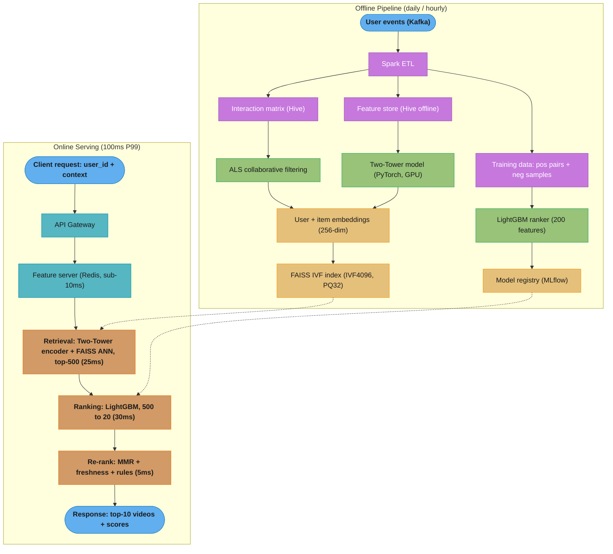
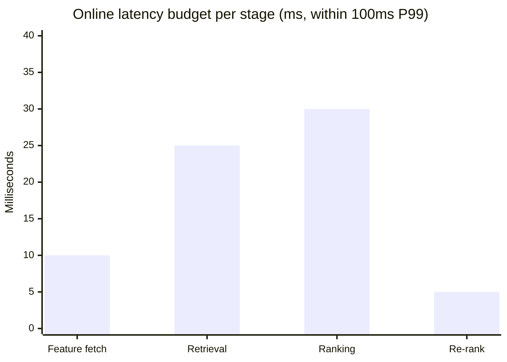

# Design a Recommendation Engine (Netflix/YouTube Scale)

## Problem Statement

Design a real-time recommendation engine for a video streaming platform. For every user session, return 10 personalized video recommendations within 100ms P99. The system must serve 200M registered users across 10M videos, processing 1B events per day (watches, clicks, skips, ratings). Handle cold start for new users (no history) and new videos (no interactions). Support A/B testing of different recommendation strategies.

Constraints:
- 200M users, 10M items
- 1B events/day ingested (12K events/sec average, 50K peak)
- 100ms P99 end-to-end recommendation latency
- Recall@100 > 95% from retrieval stage
- NDCG@10 > 0.45 after ranking
- Cold start: new user gets genre-based popular content within session

---

## Architecture Overview



Two planes share the learned artifacts: the offline pipeline trains ALS, the Two-Tower retriever, and the LightGBM ranker, then publishes the FAISS index and model registry (dotted edges) that the sub-100ms online path reads at serve time.

```mermaid
flowchart LR
    classDef io      fill:#61afef,stroke:#2e86c1,color:#1a1a1a,font-weight:bold
    classDef frozen  fill:#c678dd,stroke:#9b59b6,color:#fff
    classDef train   fill:#98c379,stroke:#27ae60,color:#1a1a1a
    classDef mathOp  fill:#d19a66,stroke:#e67e22,color:#1a1a1a,font-weight:bold
    classDef lossN   fill:#e06c75,stroke:#c0392b,color:#fff,font-weight:bold
    classDef req     fill:#56b6c2,stroke:#0097a7,color:#1a1a1a
    classDef base    fill:#e5c07b,stroke:#f39c12,color:#1a1a1a

    C(["Catalog: 10M videos"]) --> R["Retrieval\nFAISS ANN (25ms)"]
    R --> K(["500 candidates"])
    K --> RK["Ranking\nLightGBM (30ms)"]
    RK --> T(["20 ranked"])
    T --> RRK["Re-rank\nMMR + rules (5ms)"]
    RRK --> O(["Top-10 shown"])

    class C,O io
    class K,T base
    class R,RK,RRK mathOp
```



Each stage narrows the candidate set by orders of magnitude — 10M to 500 to 20 to 10 — so progressively richer (and slower) models only ever score a shrinking shortlist within the 100ms budget.



Retrieval, ranking, and re-ranking consume about 60ms of the 100ms P99 budget; the remaining headroom absorbs feature lookup, network hops, and tail latency.

```
  Feature Store
  ┌─────────────────────────────────────────────────────────────────┐
  │  Online (Redis)         │  Offline (Hive/S3)                   │
  │  - user_embedding       │  - user watch history (90d)          │
  │  - item_embedding       │  - item metadata                     │
  │  - user_7d_genres       │  - training labels                   │
  │  TTL: 24h               │  - feature snapshots                 │
  └─────────────────────────────────────────────────────────────────┘
```

The feature store is split by latency need: Redis serves online features with a 24h TTL for sub-10ms reads, while Hive/S3 holds the historical snapshots used for training — computed with identical logic to avoid training-serving skew.

---

## Key Design Decisions

**Two-stage retrieval + ranking**: Exhaustive similarity search over 10M items is infeasible at 100ms. ANN retrieval narrows to 500 candidates in 25ms, then a richer LightGBM model (200 features, interaction terms) re-ranks. This is the standard industry pattern (YouTube DNN, Pinterest Pixie).

**Sampled softmax for two-tower training**: Full softmax over 10M items is prohibitive. Sample 1000 negatives per positive. Use in-batch negatives (treat other items in minibatch as negatives) — cheap and effective. Correction for popularity bias: subtract log(item_frequency) from logits.

**FAISS IVF with PQ compression**: IVF (Inverted File Index) partitions embedding space into 4096 Voronoi cells. At query time, search only nprobe=64 cells. PQ (Product Quantization) compresses 256-dim float32 (1KB/vector) to 32 bytes. 10M items: 10M * 32B = 320MB in RAM vs 2.5GB uncompressed. Recall@100 > 95% with nprobe=64.

**LightGBM over deep ranking**: LightGBM trains in hours (vs days for deep models), handles missing features gracefully, is interpretable (feature importance), and achieves comparable NDCG on tabular ranking features. NDCG@10 = 0.47 vs 0.49 for DNN — within 4%, but 10x faster to iterate.

**Feature store split (online/offline)**: Redis holds real-time features with 24h TTL for sub-10ms lookup. Hive holds historical features for training. Avoids training-serving skew by computing features with the same logic in both pipelines.

**Negative sampling strategy**: Random negatives are too easy (item never seen by user). Use popularity-weighted sampling: P(item as negative) proportional to sqrt(item_frequency). Also use "hard negatives" — items user saw but did not click in the same session.

---

## Implementation

### Two-Tower Retrieval Model (PyTorch)

```python
import torch
import torch.nn as nn
import torch.nn.functional as F
from torch.utils.data import Dataset, DataLoader
import numpy as np
from typing import Optional


class UserTower(nn.Module):
    """Encodes user features into a fixed-dim embedding."""

    def __init__(
        self,
        num_users: int,
        user_embedding_dim: int = 64,
        genre_vocab_size: int = 50,
        output_dim: int = 256,
    ) -> None:
        super().__init__()
        self.user_embedding = nn.Embedding(
            num_users, user_embedding_dim, padding_idx=0
        )
        self.genre_embedding = nn.Embedding(genre_vocab_size, 16, padding_idx=0)
        # Dense layers: concat(user_emb, genre_emb_pool, dense_features)
        # user_emb=64, genre_pool=16, dense_features=8 (age_bucket, country_id, etc.)
        input_dim = user_embedding_dim + 16 + 8
        self.mlp = nn.Sequential(
            nn.Linear(input_dim, 256),
            nn.ReLU(),
            nn.LayerNorm(256),
            nn.Dropout(0.1),
            nn.Linear(256, 256),
            nn.ReLU(),
            nn.LayerNorm(256),
            nn.Linear(256, output_dim),
        )

    def forward(
        self,
        user_ids: torch.Tensor,             # (B,)
        genre_history: torch.Tensor,        # (B, max_genres)  padded
        dense_features: torch.Tensor,       # (B, 8)
    ) -> torch.Tensor:                      # (B, output_dim) L2-normalized
        u = self.user_embedding(user_ids)   # (B, 64)
        g = self.genre_embedding(genre_history)  # (B, max_genres, 16)
        # Mean-pool non-padding positions
        mask = (genre_history != 0).float().unsqueeze(-1)  # (B, T, 1)
        g = (g * mask).sum(dim=1) / mask.sum(dim=1).clamp(min=1)  # (B, 16)
        x = torch.cat([u, g, dense_features], dim=-1)
        out = self.mlp(x)
        return F.normalize(out, p=2, dim=-1)


class ItemTower(nn.Module):
    """Encodes item features into a fixed-dim embedding."""

    def __init__(
        self,
        num_items: int,
        item_embedding_dim: int = 64,
        genre_vocab_size: int = 50,
        output_dim: int = 256,
    ) -> None:
        super().__init__()
        self.item_embedding = nn.Embedding(
            num_items, item_embedding_dim, padding_idx=0
        )
        self.genre_embedding = nn.Embedding(genre_vocab_size, 16, padding_idx=0)
        input_dim = item_embedding_dim + 16 + 8  # 8 dense: duration, release_year, etc.
        self.mlp = nn.Sequential(
            nn.Linear(input_dim, 256),
            nn.ReLU(),
            nn.LayerNorm(256),
            nn.Dropout(0.1),
            nn.Linear(256, 256),
            nn.ReLU(),
            nn.LayerNorm(256),
            nn.Linear(256, output_dim),
        )

    def forward(
        self,
        item_ids: torch.Tensor,
        item_genres: torch.Tensor,
        item_dense: torch.Tensor,
    ) -> torch.Tensor:
        it = self.item_embedding(item_ids)
        g = self.genre_embedding(item_genres)
        mask = (item_genres != 0).float().unsqueeze(-1)
        g = (g * mask).sum(dim=1) / mask.sum(dim=1).clamp(min=1)
        x = torch.cat([it, g, item_dense], dim=-1)
        out = self.mlp(x)
        return F.normalize(out, p=2, dim=-1)


class TwoTowerModel(nn.Module):
    def __init__(self, num_users: int, num_items: int) -> None:
        super().__init__()
        self.user_tower = UserTower(num_users)
        self.item_tower = ItemTower(num_items)
        self.temperature = nn.Parameter(torch.ones(1) * 0.07)  # learnable temp

    def forward(
        self,
        user_ids: torch.Tensor,
        genre_history: torch.Tensor,
        user_dense: torch.Tensor,
        item_ids: torch.Tensor,
        item_genres: torch.Tensor,
        item_dense: torch.Tensor,
    ) -> torch.Tensor:
        u_emb = self.user_tower(user_ids, genre_history, user_dense)  # (B, D)
        i_emb = self.item_tower(item_ids, item_genres, item_dense)     # (B, D)

        # In-batch negatives: (B, B) similarity matrix
        # Diagonal = positive pairs, off-diagonal = negatives
        logits = torch.matmul(u_emb, i_emb.T) / self.temperature  # (B, B)
        labels = torch.arange(u_emb.size(0), device=u_emb.device)

        # Popularity bias correction: subtract log(item_freq) from logits
        # item_freq shape: (B,) — frequency of each item in training corpus
        # Omitted here for brevity; add as: logits - log_item_freq.unsqueeze(0)

        loss = F.cross_entropy(logits, labels)
        return loss


def train_two_tower(
    model: TwoTowerModel,
    dataloader: DataLoader,
    epochs: int = 10,
    lr: float = 3e-4,
) -> None:
    optimizer = torch.optim.Adam(model.parameters(), lr=lr)
    scheduler = torch.optim.lr_scheduler.CosineAnnealingLR(
        optimizer, T_max=epochs * len(dataloader)
    )
    model.train()
    for epoch in range(epochs):
        total_loss = 0.0
        for batch in dataloader:
            optimizer.zero_grad()
            loss = model(**batch)
            loss.backward()
            torch.nn.utils.clip_grad_norm_(model.parameters(), 1.0)
            optimizer.step()
            scheduler.step()
            total_loss += loss.item()
        print(f"Epoch {epoch+1}: loss={total_loss/len(dataloader):.4f}")
```

### FAISS Index Build and Query

```python
import faiss
import numpy as np
from pathlib import Path


class FaissRetrievalIndex:
    """IVF index with PQ compression for 10M item embeddings at 100ms budget."""

    def __init__(
        self,
        dim: int = 256,
        n_cells: int = 4096,    # sqrt(10M) ~ 3162, round up to power of 2
        pq_bytes: int = 32,     # 256-dim / 8 = 32 sub-vectors, 8 bits each
        nprobe: int = 64,       # probe 64 / 4096 cells — 1.5% of index
    ) -> None:
        self.dim = dim
        self.nprobe = nprobe
        # IVF with PQ compression: IVF4096,PQ32
        quantizer = faiss.IndexFlatIP(dim)  # L2-normalized vecs → inner product = cosine
        self.index = faiss.IndexIVFPQ(quantizer, dim, n_cells, pq_bytes, 8)
        self.item_ids: np.ndarray = np.array([], dtype=np.int64)

    def build(self, item_embeddings: np.ndarray, item_ids: np.ndarray) -> None:
        """Train index on embeddings and add all item vectors.

        item_embeddings: (N, dim) float32, already L2-normalized
        item_ids:        (N,) int64
        """
        assert item_embeddings.dtype == np.float32
        assert item_embeddings.shape[1] == self.dim
        # Training requires ~256K representative vectors
        train_size = min(256_000, len(item_embeddings))
        train_vecs = item_embeddings[:train_size]
        print(f"Training IVF index on {train_size} vectors...")
        self.index.train(train_vecs)
        self.index.add(item_embeddings)
        self.item_ids = item_ids
        print(f"Index built: {self.index.ntotal} vectors, {self.index.ntotal * 32 / 1e6:.1f} MB")

    def search(
        self, query_embedding: np.ndarray, top_k: int = 500
    ) -> list[tuple[int, float]]:
        """Return top_k (item_id, score) pairs for a single query embedding."""
        self.index.nprobe = self.nprobe
        q = query_embedding.reshape(1, -1).astype(np.float32)
        scores, indices = self.index.search(q, top_k)
        results = [
            (int(self.item_ids[idx]), float(scores[0][i]))
            for i, idx in enumerate(indices[0])
            if idx != -1
        ]
        return results

    def save(self, path: str) -> None:
        faiss.write_index(self.index, path)
        np.save(path + ".ids.npy", self.item_ids)

    @classmethod
    def load(cls, path: str, nprobe: int = 64) -> "FaissRetrievalIndex":
        obj = cls.__new__(cls)
        obj.index = faiss.read_index(path)
        obj.index.nprobe = nprobe
        obj.item_ids = np.load(path + ".ids.npy")
        obj.nprobe = nprobe
        return obj
```

### LightGBM Ranking with Cross-Features

```python
import lightgbm as lgb
import numpy as np
import pandas as pd
from sklearn.model_selection import GroupShuffleSplit


def build_ranking_features(df: pd.DataFrame) -> pd.DataFrame:
    """
    Construct 200 ranking features from user, item, context, and cross-features.
    df columns: user_id, item_id, query_user_embedding (256-dim stored separately),
                user_watch_count_7d, user_avg_watch_pct, user_top_genre,
                item_popularity_7d, item_avg_rating, item_age_days, item_genre,
                retrieval_score, hour_of_day, day_of_week, country_code
    """
    features = df.copy()

    # Cross-features (critical for ranking quality)
    features["genre_match"] = (
        features["user_top_genre"] == features["item_genre"]
    ).astype(int)
    features["popularity_x_retrieval"] = (
        features["item_popularity_7d"] * features["retrieval_score"]
    )
    features["freshness_score"] = np.exp(-features["item_age_days"] / 30.0)
    features["user_engagement_x_item_rating"] = (
        features["user_avg_watch_pct"] * features["item_avg_rating"]
    )

    # Bucketized time features
    features["is_prime_time"] = features["hour_of_day"].between(19, 23).astype(int)
    features["is_weekend"] = features["day_of_week"].isin([5, 6]).astype(int)

    feature_cols = [
        "user_watch_count_7d", "user_avg_watch_pct",
        "item_popularity_7d", "item_avg_rating", "item_age_days",
        "retrieval_score", "genre_match", "popularity_x_retrieval",
        "freshness_score", "user_engagement_x_item_rating",
        "is_prime_time", "is_weekend",
        # ... up to 200 features including embedding similarity dimensions
    ]
    return features[feature_cols]


def train_lightgbm_ranker(
    df: pd.DataFrame,
    label_col: str = "relevance",  # 0=skip, 1=click, 2=watch>50%, 3=watch>90%
    group_col: str = "user_id",
) -> lgb.Booster:
    """Train LambdaRank with NDCG@10 objective."""
    X = build_ranking_features(df)
    y = df[label_col].values
    groups = df.groupby(group_col).size().values  # items per user query

    splitter = GroupShuffleSplit(n_splits=1, test_size=0.1, random_state=42)
    train_idx, val_idx = next(splitter.split(X, y, groups=df[group_col]))

    train_data = lgb.Dataset(
        X.iloc[train_idx], label=y[train_idx],
        group=groups[:len(train_idx)],  # approximate; use proper group split
    )
    val_data = lgb.Dataset(
        X.iloc[val_idx], label=y[val_idx],
        group=groups[len(train_idx):],
        reference=train_data,
    )

    params = {
        "objective": "lambdarank",
        "metric": "ndcg",
        "ndcg_eval_at": [5, 10],
        "learning_rate": 0.05,
        "num_leaves": 127,
        "max_depth": 7,
        "min_data_in_leaf": 100,
        "feature_fraction": 0.8,
        "bagging_fraction": 0.8,
        "bagging_freq": 5,
        "lambda_l1": 0.1,
        "lambda_l2": 0.1,
        "label_gain": [0, 1, 3, 7],  # gain per relevance level
        "verbose": -1,
    }

    model = lgb.train(
        params,
        train_data,
        num_boost_round=500,
        valid_sets=[val_data],
        callbacks=[
            lgb.early_stopping(stopping_rounds=50),
            lgb.log_evaluation(period=50),
        ],
    )
    return model


def mmr_rerank(
    candidates: list[dict],
    top_n: int = 10,
    lambda_diversity: float = 0.3,
) -> list[dict]:
    """Maximal Marginal Relevance: balance relevance and diversity.

    candidates: list of dicts with keys: item_id, score, genre, embedding (np.ndarray)
    lambda_diversity: 0 = pure diversity, 1 = pure relevance
    """
    selected: list[dict] = []
    remaining = candidates.copy()

    while len(selected) < top_n and remaining:
        if not selected:
            # Pick highest-relevance item first
            best = max(remaining, key=lambda x: x["score"])
        else:
            selected_embs = np.stack([s["embedding"] for s in selected])

            def mmr_score(item: dict) -> float:
                relevance = item["score"]
                sims = selected_embs @ item["embedding"]  # cosine (L2-normalized)
                max_sim = float(sims.max())
                return lambda_diversity * relevance - (1 - lambda_diversity) * max_sim

            best = max(remaining, key=mmr_score)

        selected.append(best)
        remaining.remove(best)

    return selected
```

---

## ML Components Used

| Component | Technology | Role |
|-----------|-----------|------|
| Collaborative Filtering | Spark MLlib ALS | User/item embeddings from interaction matrix |
| Retrieval Model | PyTorch Two-Tower | Query-time user embedding generation |
| ANN Index | FAISS IVF4096,PQ32 | Sub-25ms candidate retrieval over 10M items |
| Ranking Model | LightGBM LambdaRank | NDCG@10 ranking over 500 candidates |
| Feature Store (online) | Redis Cluster | <10ms feature lookup during serving |
| Feature Store (offline) | Apache Hive / S3 | Training feature computation |
| Event Streaming | Apache Kafka | 1B events/day ingestion |
| Batch Processing | Apache Spark | Offline feature pipeline |
| Experiment Tracking | MLflow | Model registry, metric comparison |
| Diversity | MMR (Maximal Marginal Relevance) | Post-ranking genre diversity |

---

## Tradeoffs and Alternatives

| Decision | Chosen | Alternative | Why Chosen |
|----------|--------|-------------|-----------|
| Retrieval model | Two-tower neural | ALS matrix factorization | Two-tower handles cold start via features; ALS needs interaction history |
| ANN library | FAISS IVF+PQ | ScaNN, Hnswlib | FAISS: GPU training support, battle-tested at Meta/Google scale |
| Ranker | LightGBM | Deep ranking (DNN) | 10x faster iteration, comparable NDCG, handles missing features natively |
| Negative sampling | Popularity-weighted | Uniform random | Easy negatives degrade model; popularity-weighted surfaces hard negatives |
| Feature freshness | 24h TTL on Redis | Real-time computation | Sub-10ms lookup vs 30-50ms compute; 24h acceptable for most features |
| Diversity | MMR post-processing | Diversified training objective | MMR is runtime-controllable without retraining |

---

## Interview Discussion Points

**Q: How do you handle the cold start problem for new users?**
New users have no watch history, so collaborative filtering is useless. Strategy: (1) Onboarding flow asking genre preferences (3-5 clicks), which seeds a genre-based embedding via the item tower. (2) During first session, use popularity-within-genre as proxy ranker. (3) After 5 interactions, enough signal exists for two-tower retrieval. New items get item-tower embedding from metadata alone; ALS score is set to the item's global average until enough interactions accumulate (warm-up threshold: 50 interactions).

**Q: How do you prevent popularity bias where the model keeps recommending already-popular items?**
Three mitigations: (1) Popularity bias correction in two-tower training — subtract log(item_frequency) from logits so rare items are not penalized. (2) Exploration budget: 10-15% of recommendations are sampled from less-popular content matching user's genre preferences. (3) Freshness boost in re-ranking: items under 7 days old receive a +0.05 score boost, encouraging new content discovery.

**Q: How do you evaluate recommendation quality offline vs online?**
Offline: NDCG@10 on held-out sessions, Recall@100 from retrieval, coverage (fraction of catalog recommended at least once). Online A/B test: watch time per session (primary), CTR, session length, 30-day retention. Offline NDCG correlates moderately with online watch time (Pearson ~0.6) but is not a perfect proxy — always A/B test before full rollout.

**Q: What happens if the FAISS index becomes stale as new videos are added?**
New videos added to the catalog need to be indexed immediately or they will never be retrieved. Strategy: (1) Near-real-time index updates — new items are added to a small in-memory HNSW shard. At query time, search both FAISS IVF (existing items) and HNSW shard (new items), merge top-K from both. (2) Full index rebuild nightly to consolidate. This ensures new videos get retrieval exposure within minutes of upload.

---

## Failure Scenarios and Recovery

### Failure 1: FAISS Index Memory Overrun During Hot Reload

**What failed:** A nightly index rebuild pushed a 2.8GB FAISS index (uncompressed, before switching to PQ compression) to serving nodes that had only 3GB RAM headroom. During the hot-reload (loading new index while serving requests on old index), both old and new index lived in RAM simultaneously: 5.6GB total. The serving node OOM-killed, restarting the process. Because 3 of 10 serving nodes failed simultaneously during the same rebuild window, 30% of traffic had no retrieval backend. Fallback returned global popularity list, degrading NDCG from 0.47 to 0.21 for 22 minutes.

**Detection:** OOM alerts fired from k8s node metrics within 3 minutes. On-call received PagerDuty alert. Grafana dashboard showed FAISS retrieval error rate spiking to 30%. Time-to-detect: 3 minutes.

**Recovery steps:**
1. Rolled back to previous index version (hot-reload from S3 snapshot).
2. Reduced rebuild parallelism: stagger rebuild across nodes at 2-minute intervals instead of all-at-once.
3. Switched to PQ-compressed index (320MB vs 2.8GB) — this was already planned but accelerated.
4. Added memory pre-check in rebuild script: abort if available RAM < 2x index size.

**Prevention:** Index size monitoring in CI/CD — build pipeline fails if index size increases >20% without an explicit acknowledgment. Staged rollout: rebuild one node at a time, verify health before proceeding.

---

### Failure 2: Popularity Bias Collapse of New Content Discovery

**What failed:** After 6 months of production, the two-tower model's item embeddings collapsed toward popular items. New videos (< 7 days old) with fewer than 50 interactions had embeddings pulled far from the dense cluster of popular items. When user embeddings were generated, ANN search returned almost exclusively items with >10K interactions. New video discovery rate (fraction of recommendations that are items < 30 days old) fell from 15% to 3% over 3 months, a gradual degradation that was not monitored. A creator complaint surfaced the issue.

**Detection:** Post-hoc audit of recommendation logs showed new content discovery rate declining. Root cause: item tower embeddings were trained on interaction-weighted loss — items with more interactions had more training gradient signal and stronger embedding representations. Time-to-detect: 3 months (monitoring gap).

**Recovery steps:**
1. Added exploration budget: 15% of final recommendations forcibly sampled from content matching user's genre preferences but published within the last 7 days.
2. Added popularity-correction to item embedding training: subtract log(item_interaction_count) from similarity logits so rare items are not penalized during in-batch negative training.
3. Added HNSW freshness shard: new items in a separate index with forced retrieval of top-50 from freshness shard at every request.

**Prevention:** Monitor new content discovery rate weekly (target: >10%). Alert if rolling 14-day average drops below 8%.

---

### Failure 3: Redis Feature Store TTL Race Condition

**What failed:** User embeddings in Redis had a 24-hour TTL. During the daily model update (new two-tower model deployed, new user embeddings generated), the Redis write job and the TTL expiry raced: some user embeddings expired during the write batch, resulting in ~2M users having no embedding in Redis for 4-8 minutes. These users received cold-start recommendations (genre popularity) instead of personalized retrieval. Session watch time for affected users dropped 28% in that window.

**Detection:** Monitoring on Redis cache miss rate spiked from baseline 5% to 45% for 6 minutes. Downstream recommendation quality metrics did not alert in time (too coarse). Time-to-detect: 6 minutes (via Redis metrics), 35 minutes (via recommendation quality).

**Recovery steps:**
1. Changed write strategy: write new embeddings with 48-hour TTL before deleting old ones (double-write with overlap).
2. Coordinated deployment: pause old TTLs (extend to 48h) before starting write job, then let new 24h TTL take effect after write job completes.
3. Added Redis health check before serving: if user embedding missing, fall back to ALS embedding (a backup in DynamoDB, updated weekly).

**Prevention:** Blue-green Redis deployment for embedding updates: write to a secondary Redis cluster, then flip the serving pointer, then write to primary. No window where embeddings are missing.

---

## Capacity Planning

### Data Volume Projections

```
Year 0 (current):
  Users: 200M registered, 50M DAU
  Items: 10M videos
  Events: 1B/day = 12K events/sec avg, 50K peak
  User embeddings: 200M × 256 dim × 4 bytes = 200GB (Redis cluster)
  Item embeddings (FAISS PQ): 10M × 32 bytes = 320MB RAM per node
  Training data: 30-day rolling window = 30B events in Parquet (~15TB)

Year 1 (25% growth):
  Users: 250M, 62M DAU
  Events: 1.25B/day
  User embeddings: 250GB Redis (add 2 Redis nodes)
  Item catalog: 12M videos, FAISS index 384MB

Year 3 (3x growth):
  Users: 600M, 150M DAU
  Events: 3B/day = 35K events/sec avg
  User embeddings: 600GB Redis (16-node cluster)
  Item catalog: 20M videos, FAISS index 640MB
  Training data 30-day: 90B events (~45TB Parquet)
  FAISS rebuild time at 20M items: ~4 hours (needs GPU acceleration or sharding)
```

### Training Compute Requirements

```
Two-Tower Training (weekly):
  Dataset: 3B positive (user, item) pairs + in-batch negatives
  Batch size: 4096, in-batch negatives = 4095 per positive
  Hardware: 4× A100 40GB (PyTorch DDP)
  Duration: 18 hours per weekly retrain
  Cost: AWS p4d.24xlarge ($32.77/hr × 18hr) = ~$590/week = $2,360/month

ALS Collaborative Filtering (weekly):
  Interaction matrix: 200M users × 10M items (sparse, ~3B non-zero)
  Spark MLlib ALS on 20-node EMR cluster (r5.4xlarge)
  Duration: 6 hours
  Cost: 20 × $1.008/hr × 6hr = ~$121/run = $484/month

LightGBM Ranker (daily):
  Dataset: 50M training examples per day (30-day rolling)
  16-core CPU (c5.4xlarge)
  Duration: 2 hours
  Cost: $0.68/hr × 2hr = $1.36/day = ~$490/month

Total monthly training cost: ~$3,334
```

### Serving Infrastructure

```
FAISS Retrieval (50K QPS):
  10 serving nodes (c5.2xlarge, 8 vCPU, 16GB RAM)
  Each node: 5K QPS, 320MB FAISS index, nprobe=64 → 8ms latency
  Cost: 10 × $0.34/hr = $3.40/hr = ~$2,450/month

LightGBM Ranker:
  20 nodes (c5.2xlarge), each handling 2,500 QPS
  200-feature inference: <5ms CPU
  Cost: 20 × $0.34/hr = ~$4,900/month

Redis Feature Store (user embeddings):
  200GB active user data, 10-node Redis Cluster (r5.xlarge 32GB RAM each)
  50K GET/sec distributed across 10 nodes
  Cost: 10 × $0.252/hr = ~$1,814/month

Kafka (event ingestion):
  8 partitions, 3 replicas, 12K events/sec sustained
  3-broker cluster (kafka.m5.2xlarge)
  Cost: ~$600/month

Total monthly serving cost: ~$9,764
```

---

## Additional War Stories

**War Story 1 — In-Batch Negative Sampling Collapse with Small Batch Size:**

```python
# BROKEN: batch_size=32 with in-batch negatives — only 31 negatives per positive
# For 10M items, 31 negatives is nearly uniform random sampling
# Model learns nothing useful about hard negatives

def train_two_tower_broken(
    model: "TwoTowerModel",
    dataloader: "DataLoader",
    epochs: int = 10,
) -> None:
    optimizer = torch.optim.Adam(model.parameters(), lr=3e-4)
    for epoch in range(epochs):
        for batch in dataloader:
            # batch_size=32 → only 31 in-batch negatives
            # Loss becomes trivially easy: 10M items but only 31 negatives
            # Model collapses to outputting high similarity for all items
            loss = model(**batch)  # uses in-batch negatives of size batch_size-1=31
            loss.backward()
            optimizer.step()


# FIX: Use large batch sizes (4096+) for in-batch negatives to be effective
# OR supplement with explicit hard negative mining

import torch
import torch.nn.functional as F


def train_two_tower_correct(
    model: "TwoTowerModel",
    dataloader: "DataLoader",
    hard_negative_ratio: int = 4,
    epochs: int = 10,
) -> None:
    """
    Use large effective batch via gradient accumulation + hard negatives.
    Effective batch: 512 samples, accumulate 8 steps → 4096 effective batch.
    """
    optimizer = torch.optim.Adam(model.parameters(), lr=3e-4)
    accum_steps = 8
    optimizer.zero_grad()

    for epoch in range(epochs):
        for step, batch in enumerate(dataloader):
            # batch_size=512 → 511 in-batch negatives per positive
            # Plus hard_negative_ratio=4 explicitly mined hard negatives per positive
            user_emb = model.user_tower(
                batch["user_ids"], batch["genre_history"], batch["user_dense"]
            )  # (512, 256)
            item_emb_pos = model.item_tower(
                batch["item_ids"], batch["item_genres"], batch["item_dense"]
            )  # (512, 256)

            # In-batch negatives: full (512, 512) similarity matrix
            logits_inbatch = torch.matmul(user_emb, item_emb_pos.T) / model.temperature
            labels = torch.arange(user_emb.size(0), device=user_emb.device)
            loss_inbatch = F.cross_entropy(logits_inbatch, labels)

            # Hard negatives: items seen by user in same session but not clicked
            # hard_neg_emb shape: (512, 4, 256)
            if "hard_neg_item_ids" in batch:
                hard_neg_emb = model.item_tower(
                    batch["hard_neg_item_ids"].view(-1, *batch["hard_neg_item_ids"].shape[2:]),
                    batch["hard_neg_genres"].view(-1, *batch["hard_neg_genres"].shape[2:]),
                    batch["hard_neg_dense"].view(-1, *batch["hard_neg_dense"].shape[2:]),
                ).view(user_emb.size(0), hard_negative_ratio, -1)
                # user_emb: (B, D), hard_neg_emb: (B, K, D)
                hard_neg_scores = torch.bmm(
                    hard_neg_emb, user_emb.unsqueeze(-1)
                ).squeeze(-1) / model.temperature  # (B, K)
                # Softmax over [positive, hard_neg_1, ..., hard_neg_K]
                pos_score = (user_emb * item_emb_pos).sum(-1, keepdim=True) / model.temperature
                all_scores = torch.cat([pos_score, hard_neg_scores], dim=1)  # (B, K+1)
                hard_neg_labels = torch.zeros(
                    user_emb.size(0), dtype=torch.long, device=user_emb.device
                )
                loss_hard = F.cross_entropy(all_scores, hard_neg_labels)
                loss = (loss_inbatch + loss_hard) / 2
            else:
                loss = loss_inbatch

            (loss / accum_steps).backward()
            if (step + 1) % accum_steps == 0:
                torch.nn.utils.clip_grad_norm_(model.parameters(), 1.0)
                optimizer.step()
                optimizer.zero_grad()
```

**War Story 2 — MMR Diversity Causing Recommendation Homogeneity Within Genre:**

```python
# BROKEN: lambda_diversity=0.7 (high relevance weight) in MMR
# All top recommendations end up from the same genre if user has strong genre preference
# User who watches 80% Action gets 10 Action recommendations — no discovery

def mmr_rerank_broken(
    candidates: list[dict],
    top_n: int = 10,
    lambda_diversity: float = 0.7,  # BUG: too high, no diversity
) -> list[dict]:
    selected: list[dict] = []
    remaining = candidates.copy()
    while len(selected) < top_n and remaining:
        if not selected:
            best = max(remaining, key=lambda x: x["score"])
        else:
            selected_genres = {s["genre"] for s in selected}
            def mmr_score_broken(item: dict) -> float:
                # Diversity penalty only applies to embedding distance, not genre variety
                # With lambda=0.7, the 0.3 diversity weight is too weak
                selected_embs = torch.stack([s["embedding"] for s in selected])
                max_sim = float((selected_embs @ item["embedding"]).max())
                return 0.7 * item["score"] - 0.3 * max_sim
            best = max(remaining, key=mmr_score_broken)
        selected.append(best)
        remaining.remove(best)
    return selected


# FIX: Hard genre diversity constraint: max 3 items per genre in top-10
# Combined with MMR for intra-genre diversity

def mmr_rerank_correct(
    candidates: list[dict],
    top_n: int = 10,
    lambda_diversity: float = 0.5,  # balanced relevance-diversity
    max_per_genre: int = 3,
) -> list[dict]:
    """
    Hard genre cap prevents genre monopoly.
    MMR handles within-genre content diversity.
    """
    import numpy as np

    selected: list[dict] = []
    remaining = candidates.copy()
    genre_count: dict[str, int] = {}

    while len(selected) < top_n and remaining:
        # Filter out over-represented genres
        eligible = [
            item for item in remaining
            if genre_count.get(item["genre"], 0) < max_per_genre
        ]
        if not eligible:
            eligible = remaining  # fall back if all genres exhausted

        if not selected:
            best = max(eligible, key=lambda x: x["score"])
        else:
            selected_embs = np.stack([s["embedding"] for s in selected])

            def mmr_score(item: dict) -> float:
                sims = selected_embs @ item["embedding"]
                max_sim = float(sims.max())
                return lambda_diversity * item["score"] - (1 - lambda_diversity) * max_sim

            best = max(eligible, key=mmr_score)

        selected.append(best)
        remaining.remove(best)
        genre_count[best["genre"]] = genre_count.get(best["genre"], 0) + 1

    return selected
```

---

## Monitoring and Drift Detection Deep-Dive

### Features That Drift Fastest

```
Feature                        Drift rate    Reason
────────────────────────────────────────────────────────────────────
item_popularity_7d             Very high     Viral content spikes; new releases
user_7d_watch_count            High          User behavior shifts with life events
freshness_score (item_age)     High          Every day all items age by 1 day
genre_match                    Medium        User genre preferences evolve over months
retrieval_score                Low           FAISS index stable between retrains
user_avg_watch_pct             Low           Slow behavioral evolution
item_avg_rating                Very low      Accumulates slowly
```

### PSI Thresholds and Alerting

```python
# Feature PSI monitoring: compute daily, compare to 30-day baseline
FEATURE_PSI_ALERTS = {
    "item_popularity_7d": 0.25,   # viral content causes legitimate large shifts
    "retrieval_score": 0.10,       # should be stable; shift = model or index issue
    "freshness_score": 0.15,       # aging is expected; only alert on large jumps
    "genre_match": 0.15,
    "user_avg_watch_pct": 0.10,
}

# Model output distribution monitoring
MODEL_SCORE_DRIFT_THRESHOLDS = {
    "mean_score_change_threshold": 0.05,       # alert if mean prediction shifts >5%
    "low_confidence_rate_multiplier": 2.0,     # alert if scores <0.1 double in frequency
    "top10_homogeneity_threshold": 0.8,        # alert if >80% of top-10 from same genre
}
```

### Retraining Triggers and Cadence

```
Cadence         Trigger                                     Action
──────────────────────────────────────────────────────────────────────────
Daily           Scheduled                                   LightGBM ranker retrain
Weekly          Scheduled                                   Two-Tower fine-tune; ALS retrain
Weekly          Scheduled                                   FAISS full index rebuild
Triggered       item_popularity_7d PSI > 0.25              LightGBM emergency retrain
Triggered       New content discovery rate < 8%            Increase freshness boost weight
Triggered       Watch time per session drops > 5% (7d MA)  Investigate + candidate retrain
Triggered       Retrieval recall@100 drops < 93%           FAISS index rebuild + nprobe audit
Monthly         Scheduled                                   Full evaluation on randomization data
```

### A/B Testing for Model Promotion

```
Experiment design:
  Treatment: new LightGBM ranker or new Two-Tower model
  Control:   current production model
  Traffic split: 10% treatment, 10% control (remaining 80% unaffected)
  Duration: minimum 14 days (to capture weekly seasonality)

Primary metric: average watch time per session (higher = better)
Secondary metrics:
  - NDCG@10 from interleaving experiment (run concurrently, 2% traffic)
  - 30-day retention rate for new users (long-term health)
  - New content discovery rate (fairness to new creators)
  - Session abandonment rate (guardrail: must not increase >1%)

Statistical thresholds:
  - Primary metric: 95% confidence (t-test), minimum detectable effect 1%
  - Bonferroni correction applied when testing 5+ metrics simultaneously
  - Ramp schedule: 10% → 25% → 50% → 100% at 3-day intervals after significance
```

---

## Additional Interview Questions

**Q: How do you handle the cold start problem for new videos with no interaction data?**
New videos have no interaction history so ALS embeddings are undefined and two-tower item embeddings rely only on metadata. Strategy: (1) Item tower is trained with metadata features (genre, duration, description embeddings from a text encoder, creator popularity) so new items have a meaningful embedding from day 1. (2) Force retrieval: new items (<7 days old) are stored in a freshness HNSW shard; every user request retrieves top-50 from this shard in addition to the main FAISS index. (3) Post-ranking: 15% of recommendations are allocated to a "discovery slot" filled from the freshness shard, bypassing relevance ranking for new content. After 50 interactions, the item graduates from forced exposure to organic retrieval competition.

**Q: What is the difference between offline NDCG and online watch time, and why do they sometimes diverge?**
Offline NDCG is computed on historical click data, which suffers from selection bias: it only measures items that were shown (position bias) and already liked (historical popularity bias). Online watch time measures actual user satisfaction in a real session. Divergence occurs when: (1) the new model ranks items that were rarely shown historically (low NDCG from sparse data) but users love them (high watch time); (2) the new model promotes content that is clickable but not watchable (high CTR, low watch time — click-bait dynamics); (3) the held-out test set has different temporal distribution than the current period. Rule: if offline NDCG improves but online watch time does not, investigate for click-bait bias or temporal distribution mismatch before concluding the model is better.

**Q: How do you prevent the recommendation system from creating filter bubbles?**
Four mechanisms: (1) Genre diversity cap in MMR post-ranking: no more than 3 items from the same genre in the top-10, regardless of user preference strength. (2) Exploration budget: 15% of every user's recommendations come from genres they have watched fewer than 5 times, sampled from popular content in those genres. (3) Creator diversity: limit recommendations from any single creator to 2 items in the top-10. (4) Long-term engagement signals: if 30-day retention is used as a secondary metric in model selection (alongside short-term engagement), models that maximize short-term clicks at the cost of user satisfaction are penalized. A/B tests that show improved 7-day CTR but declining 30-day retention are rejected.

**Q: How would you design the system to handle a catalog of 1 billion items instead of 10 million?**
At 1 billion items, FAISS IVF with PQ becomes infeasible in a single machine (even PQ-compressed: 1B × 32 bytes = 32GB per replica). Three approaches: (1) Hierarchical two-level retrieval — coarse retrieval reduces to 1M candidates using a lightweight semantic hash or product category filter, then FAISS IVF over 1M items (32MB PQ). (2) Sharded FAISS: partition the 1B item catalog into 100 shards of 10M items each, route queries to the 2-3 most relevant shards based on a coarse item-space classifier, merge top-K from those shards. (3) ScaNN (Google) or HNSW with product quantization in distributed mode — ScaNN is reported to scale to 100M+ items with <5ms latency. The two-tower training pipeline remains the same; only the index infrastructure changes.

**Q: How do you measure and optimize for long-term user retention rather than short-term engagement?**
Short-term engagement metrics (CTR, watch time per session) are easy to optimize but can be maximized by recommendation systems that exploit user psychological biases (autoplay, thumbnail sensationalism). Long-term retention is measured as 30-day and 90-day retention rates per user cohort. To optimize for it: (1) Include 30-day retention as a secondary metric in all A/B tests — reject models that improve 7-day metrics at cost of 30-day retention. (2) Add long-term satisfaction proxies to training labels: app re-opens within 3 days, manual search (user was not passively suggested), explicit ratings. (3) Penalize models with high variance in recommendations — high predictability leads to boredom over months. Monitor recommendation entropy (diversity of genres/creators over a 30-day window per user) as a leading indicator for long-term retention.
