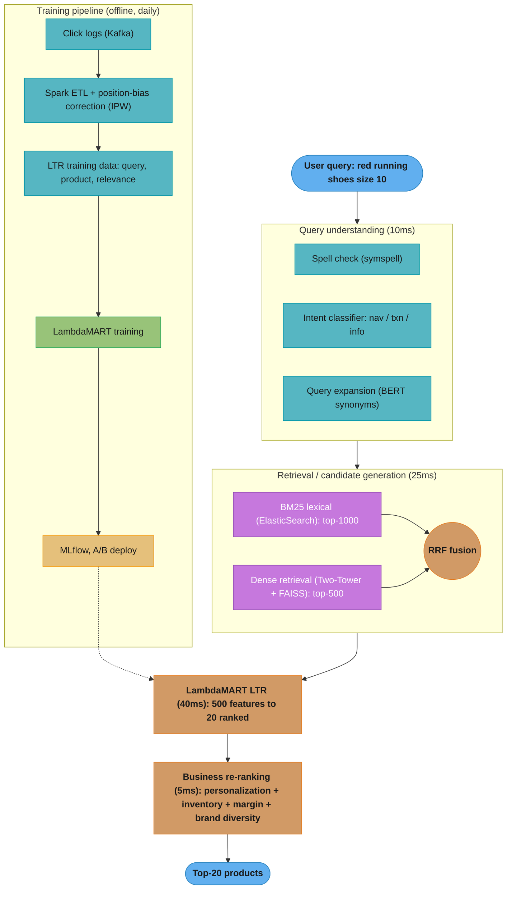
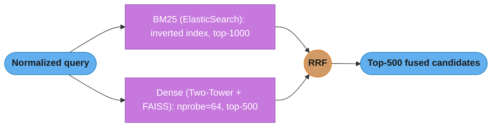
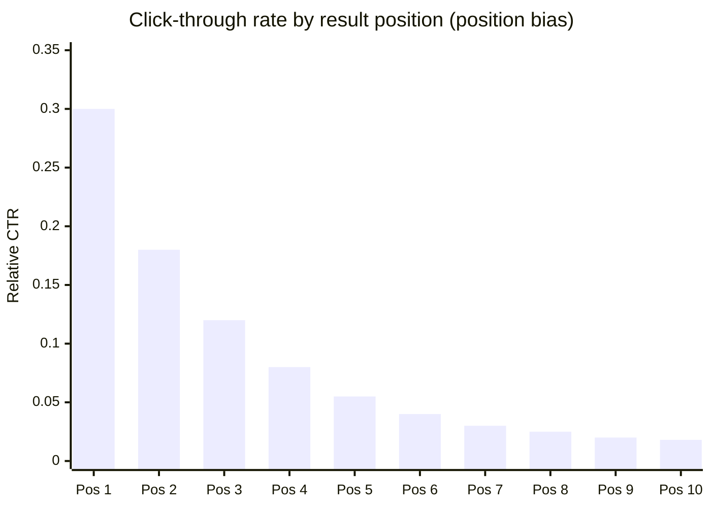

# Design a Search Ranking System (E-commerce Scale)

## Problem Statement

Design a search ranking system for an e-commerce platform. Given a text query (e.g., "red running shoes size 10"), return the top 20 most relevant products within 100ms P99. The system must balance three objectives: relevance (match user intent), conversion (surface products users actually buy), and business objectives (margin, inventory clearance). The system processes 50K queries per second across 100M users and 10M product listings. Click data is abundant but biased toward top positions; purchase signal is sparse but high-quality.

Constraints:
- 100M users, 10M products, 50K QPS
- 100ms P99 end-to-end latency
- NDCG@10 > 0.55 (offline), CTR improvement > 5% over BM25 baseline (online)
- Support real-time index updates (new products live within 5 minutes)
- Click data: 500M clicks/day; purchase data: 5M purchases/day

---

## Architecture Overview



Query understanding normalizes intent and expands terms; hybrid retrieval fuses BM25 and dense candidates via RRF; LambdaMART ranks 500 candidates on 500 features; a business layer applies inventory, margin, and diversity rules. The offline pipeline debiases click logs (IPW) before retraining and deploying the ranker (dotted).



BM25 catches rare exact terms while dense retrieval captures semantics; Reciprocal Rank Fusion merges both ranked lists with no weight tuning, yielding 500 robust candidates for the ranker.



Position 1 draws roughly 5x the clicks of position 5 regardless of true relevance, so training on raw clicks merely replicates the current ranking. IPW re-weights each click by 1/P(examined|position) to strip out this bias before training the ranker.

---

## Key Design Decisions

**Hybrid retrieval (BM25 + dense)**: BM25 handles exact keyword matching well ("iPhone 14 Pro 256GB") but fails on semantic queries ("phone with good camera under $500"). Dense retrieval handles semantics but misses rare exact terms. RRF fusion exploits both without needing to tune a combination weight.

**LambdaMART for LTR**: LambdaMART (MART = gradient boosted trees with LambdaRank gradients targeting NDCG) is the industry standard for search ranking. It optimizes NDCG directly via approximated gradients, handles mixed feature types and missing values, and is interpretable via feature importance. Comparable to deep learning LTR (DLRM) on tabular features but trains in 2 hours vs 12 hours.

**Position bias debiasing**: Users click on position 1 items 5-10x more than position 5 items regardless of relevance. Training directly on click counts produces a ranker that learns to rank what was already ranked highly. IPW (Inverse Propensity Weighting) corrects this: each click is weighted by 1/P(examined|position). P(examined|position) is estimated from randomization experiments (swap positions for 1% of traffic, observe CTR ratio).

**Dense retrieval model choice**: BERT-mini (66M params, 4 layers) provides 80% of BERT-large quality at 10x inference speed. Query encoder runs on CPU in 8ms; item encoders are precomputed and stored in FAISS. Fine-tuned on in-domain (query, product title) pairs with in-batch negatives.

**Query expansion with caution**: Synonym expansion ("shoes" → "footwear, sneakers") increases recall but risks precision loss (expanding "apple" in a grocery context to "iPhone" is a failure mode). Expansion is applied only to BM25 retrieval, not dense retrieval (dense already captures semantics). Expansion candidates are filtered by co-occurrence in the product catalog.

---

## Implementation

### LambdaMART with XGBoost

```python
import numpy as np
import pandas as pd
import xgboost as xgb
from sklearn.model_selection import GroupShuffleSplit
from sklearn.preprocessing import StandardScaler


def build_ltr_features(
    df: pd.DataFrame,
) -> pd.DataFrame:
    """
    Build 500 LTR features from (query, product, user, context) tuple.
    df columns: query_id, product_id, user_id,
                bm25_score, dense_score,
                product_ctr_7d, product_conversion_rate, product_avg_rating,
                product_review_count, product_price, product_inventory_count,
                user_avg_order_value, user_category_affinity (dict stored as cols),
                device_type (mobile/desktop), hour_of_day, session_depth
    """
    f = df.copy()

    # Query-product match features
    f["combined_retrieval_score"] = (
        0.6 * f["bm25_score"] + 0.4 * f["dense_score"]
    )
    f["score_product"] = f["bm25_score"] * f["dense_score"]
    f["score_difference"] = f["bm25_score"] - f["dense_score"]

    # Product quality features (log-transform to handle long tails)
    f["log_review_count"] = np.log1p(f["product_review_count"])
    f["log_ctr_7d"] = np.log1p(f["product_ctr_7d"])
    f["inventory_available"] = (f["product_inventory_count"] > 0).astype(int)
    f["low_stock"] = f["product_inventory_count"].between(1, 5).astype(int)

    # User-product cross features (critical for personalization)
    f["price_vs_user_avg"] = f["product_price"] / (f["user_avg_order_value"] + 1.0)
    f["price_below_user_avg"] = (f["product_price"] < f["user_avg_order_value"]).astype(int)

    # Context features
    f["is_mobile"] = (f["device_type"] == "mobile").astype(int)
    f["is_prime_shopping_hour"] = f["hour_of_day"].between(19, 22).astype(int)
    f["deep_session"] = (f["session_depth"] > 5).astype(int)

    # Quality-weighted retrieval
    f["quality_weighted_score"] = (
        f["combined_retrieval_score"] *
        (1 + 0.1 * f["product_avg_rating"]) *
        (1 + 0.05 * np.log1p(f["product_review_count"]))
    )

    feature_cols = [
        "bm25_score", "dense_score", "combined_retrieval_score",
        "score_product", "score_difference", "quality_weighted_score",
        "product_ctr_7d", "log_ctr_7d", "product_conversion_rate",
        "product_avg_rating", "log_review_count",
        "product_price", "inventory_available", "low_stock",
        "price_vs_user_avg", "price_below_user_avg",
        "is_mobile", "is_prime_shopping_hour", "deep_session",
    ]
    return f[feature_cols]


def train_lambdamart(
    df: pd.DataFrame,
    label_col: str = "relevance_label",
    group_col: str = "query_id",
) -> xgb.XGBRanker:
    """Train LambdaMART ranker optimizing NDCG@10."""
    X = build_ltr_features(df)
    y = df[label_col].values.astype(np.float32)

    # Group by query: each query is one "group" for pairwise ranking
    group_sizes = df.groupby(group_col).size().values

    splitter = GroupShuffleSplit(n_splits=1, test_size=0.1, random_state=42)
    train_idx, val_idx = next(splitter.split(X, y, groups=df[group_col]))

    ranker = xgb.XGBRanker(
        objective="rank:ndcg",
        ndcg_exp_gain=True,
        lambdarank_pair_method="topk",  # focus gradients on top-K positions
        lambdarank_num_pair_per_sample=8,
        eval_metric=["ndcg@5", "ndcg@10"],
        n_estimators=1000,
        max_depth=8,
        learning_rate=0.05,
        subsample=0.8,
        colsample_bytree=0.7,
        min_child_weight=10,
        reg_alpha=0.1,
        reg_lambda=1.0,
        random_state=42,
        n_jobs=-1,
        tree_method="hist",
    )

    ranker.fit(
        X.iloc[train_idx], y[train_idx],
        group=group_sizes[:len(set(df.iloc[train_idx][group_col]))],
        eval_set=[(X.iloc[val_idx], y[val_idx])],
        eval_group=[group_sizes[len(set(df.iloc[train_idx][group_col])):]],
        verbose=100,
    )
    return ranker
```

### Reciprocal Rank Fusion (Hybrid Retrieval)

```python
from collections import defaultdict


def reciprocal_rank_fusion(
    ranked_lists: list[list[str]],
    k: int = 60,  # standard RRF constant, dampens effect of outlier ranks
    top_n: int = 500,
) -> list[tuple[str, float]]:
    """
    Combine multiple ranked lists via RRF.
    RRF score = sum(1 / (k + rank_i)) for each list i.

    ranked_lists: each element is a list of product_ids in rank order
    Returns: top_n (product_id, score) sorted descending
    """
    scores: dict[str, float] = defaultdict(float)
    for ranked_list in ranked_lists:
        for rank, product_id in enumerate(ranked_list, start=1):
            scores[product_id] += 1.0 / (k + rank)

    sorted_items = sorted(scores.items(), key=lambda x: x[1], reverse=True)
    return sorted_items[:top_n]


def hybrid_retrieve(
    query: str,
    bm25_results: list[str],    # product_ids from ElasticSearch, ordered
    dense_results: list[str],   # product_ids from FAISS, ordered
    top_k: int = 500,
) -> list[str]:
    """Fuse BM25 and dense retrieval results."""
    fused = reciprocal_rank_fusion([bm25_results, dense_results], top_n=top_k)
    return [product_id for product_id, _ in fused]
```

### Position Bias Debiasing with IPW

```python
import numpy as np
import pandas as pd
from scipy.optimize import minimize


def estimate_examination_probability(
    clicks_df: pd.DataFrame,
    method: str = "regression_em",
) -> np.ndarray:
    """
    Estimate P(examined | position) from click logs.

    clicks_df: columns [position, clicked, query_id, product_id, relevance_label]
    method: 'regression_em' uses EM algorithm assuming click = examine * relevance
            'swap_experiment' requires dedicated randomization experiment data

    Returns: array of shape (max_position,) with examination probabilities
    """
    if method == "regression_em":
        # EM algorithm: click = Bernoulli(theta_q_d * gamma_k)
        # theta_q_d = relevance of document d for query q
        # gamma_k = P(examined | position k)
        # Iteratively update theta and gamma until convergence
        max_pos = int(clicks_df["position"].max()) + 1
        gamma = np.ones(max_pos)  # examination probabilities, init uniform
        theta = np.full(len(clicks_df), 0.5)  # relevance estimates

        for iteration in range(20):  # typically converges in 10-15 iterations
            # E-step: update theta given gamma
            for idx, row in clicks_df.iterrows():
                pos = int(row["position"])
                clicked = int(row["clicked"])
                if clicked:
                    theta[idx] = 1.0
                else:
                    # P(theta=1 | not clicked) = theta * (1 - gamma_k) / (1 - theta * gamma_k)
                    old_theta = theta[idx]
                    old_gamma = gamma[pos]
                    theta[idx] = old_theta * (1 - old_gamma) / max(
                        1 - old_theta * old_gamma, 1e-9
                    )

            # M-step: update gamma given theta
            for k in range(max_pos):
                pos_mask = clicks_df["position"] == k
                if pos_mask.sum() == 0:
                    continue
                pos_theta = theta[pos_mask]
                pos_clicked = clicks_df.loc[pos_mask, "clicked"].values
                # gamma_k = sum(clicks) / sum(theta)
                gamma[k] = pos_clicked.sum() / max(pos_theta.sum(), 1e-9)
                gamma[k] = np.clip(gamma[k], 0.01, 1.0)

        return gamma

    raise ValueError(f"Unknown method: {method}")


def apply_ipw_weights(
    df: pd.DataFrame,
    examination_probs: np.ndarray,
    min_weight: float = 0.1,
    max_weight: float = 10.0,
) -> pd.Series:
    """
    Compute IPW sample weights for training data debiasing.
    Weight = 1 / P(examined | position).
    """
    positions = df["position"].clip(0, len(examination_probs) - 1).astype(int)
    weights = 1.0 / examination_probs[positions].clip(min=0.01)
    return pd.Series(weights.clip(min_weight, max_weight), index=df.index)


def build_debiased_training_data(
    clicks_df: pd.DataFrame,
) -> pd.DataFrame:
    """Full pipeline: estimate bias, compute weights, label construction."""
    exam_probs = estimate_examination_probability(clicks_df)
    ipw_weights = apply_ipw_weights(clicks_df, exam_probs)

    # Multi-level relevance labels from user behavior
    clicks_df = clicks_df.copy()
    clicks_df["relevance_label"] = 0.0
    clicks_df.loc[clicks_df["clicked"] == 1, "relevance_label"] = 0.5
    clicks_df.loc[clicks_df["dwell_time_sec"] > 30, "relevance_label"] = 1.0
    clicks_df.loc[clicks_df["add_to_cart"] == 1, "relevance_label"] = 2.0
    clicks_df.loc[clicks_df["purchased"] == 1, "relevance_label"] = 3.0

    clicks_df["sample_weight"] = ipw_weights
    return clicks_df
```

---

## ML Components Used

| Component | Technology | Role |
|-----------|-----------|------|
| Spell Correction | symspell (Python) | Query normalization, <1ms |
| Query Intent | Fine-tuned BERT classifier | navigational / transactional / informational |
| Query Expansion | BERT masked LM + catalog co-occurrence | Synonym generation for BM25 |
| Lexical Retrieval | ElasticSearch BM25 | Exact term matching, inverted index |
| Dense Retrieval | Two-Tower (BERT-mini) + FAISS | Semantic matching |
| Result Fusion | Reciprocal Rank Fusion (RRF) | Hybrid BM25 + dense combination |
| Learning to Rank | XGBoost LambdaMART (rank:ndcg) | NDCG@10 optimization over 500 features |
| Position Bias | IPW with EM estimation | Click data debiasing for training labels |
| Experiment Platform | A/B test framework + interleaving | Online evaluation (CTR, conversion) |

---

## Tradeoffs and Alternatives

| Decision | Chosen | Alternative | Reasoning |
|----------|--------|-------------|-----------|
| Retrieval fusion | RRF | Linear score combination | RRF requires no weight tuning; robust across query types |
| LTR model | LambdaMART (XGBoost) | Neural LTR (DNN, DLRM) | LambdaMART: 2h training, interpretable, same NDCG as DNN on tabular features |
| Bias correction | IPW / regression EM | Randomization experiments | EM requires no traffic sacrifice; swap experiments give cleaner estimates but costly |
| Query expansion | Catalog-filtered BERT synonyms | WordNet / thesaurus | Catalog-filtered prevents off-domain expansions |
| Dense retrieval encoder | BERT-mini (66M) | BERT-base (110M) | BERT-mini: 10x faster, 80% quality; acceptable for real-time retrieval |
| Label source | Click + purchase + dwell time | Purchase only | Purchase signal is too sparse; blending improves coverage at cost of noise |

---

## Interview Discussion Points

**Q: How do you deal with position bias when training on click data?**
Click data is the most abundant training signal but heavily biased: position 1 receives 5-10x more clicks than position 5 regardless of product quality. Training a ranker directly on click counts teaches it to replicate the existing ranking, not improve it. IPW correction weights each click by 1/P(examined|position), estimated via the EM algorithm on historical click-through rates. An alternative is interleaving experiments where the candidate model and production model are interleaved in results, then observed — this is less biased than A/B tests for ranking evaluation.

**Q: How do you balance relevance, conversion, and business objectives in ranking?**
Three-layer approach: (1) LambdaMART optimizes a combined relevance label (click=0.5, long dwell=1, cart=2, purchase=3) capturing both relevance and conversion signals in one model. (2) Post-ranking business rules apply constraints: out-of-stock items are demoted, promoted listings receive a bounded boost (cap at +3 positions to avoid quality degradation), brand diversity enforced via cap-3-per-brand. (3) Separate margin-weighted ranking model for "sponsored" slots. This separation keeps the organic ranker clean while allowing business control.

**Q: How do you evaluate the ranking system? When do you trust offline metrics vs online experiments?**
Offline NDCG@10 on a held-out click dataset measures ranking quality but is biased by the same position bias present in training data. Use a randomization experiment (5% of traffic with fully randomized results) to collect an unbiased offline evaluation set. Online A/B tests measure CTR, conversion rate, and revenue per search. The correlation between offline NDCG and online CTR is typically 0.7-0.8 — sufficient to use offline metrics for fast iteration and A/B tests for final validation before full rollout. Never skip A/B testing: a model with +2% offline NDCG has failed to improve online CTR in practice.

---

## Extended Architecture — Two-Stage Retrieval + Ranking Pipeline

```
  FULL PIPELINE: Query → Top-20 Products (100ms budget)

  ┌──────────────────────────────────────────────────────────────────┐
  │  QUERY PROCESSING (10ms)                                         │
  │                                                                  │
  │  Raw query: "red running shoes size 10"                          │
  │                                                                  │
  │  1. Spell correction (SymSpell, <1ms)                           │
  │     "sheos" → "shoes"                                            │
  │                                                                  │
  │  2. Query intent classification (BERT fine-tuned, 4ms)          │
  │     P(navigational)=0.02, P(transactional)=0.91                 │
  │     P(informational)=0.07                                        │
  │                                                                  │
  │  3. Tokenization + embedding (BERT-mini query encoder, 4ms)     │
  │     Output: 256-dim dense vector (L2-normalized)                 │
  │                                                                  │
  │  4. BM25 query preparation                                       │
  │     Expanded terms: ["shoes", "footwear", "sneakers",            │
  │                       "running shoes", "trainers"]               │
  │     Filter: size=10, in_stock=true                               │
  └──────────────────────────┬───────────────────────────────────────┘
                             │
              ┌──────────────┴──────────────┐
              │                             │
              v (parallel, 20ms budget)     v
  ┌─────────────────────┐    ┌──────────────────────────────────┐
  │  BM25 RETRIEVAL      │    │  ANN DENSE RETRIEVAL             │
  │  (ElasticSearch)     │    │  (FAISS IVF4096,PQ32)            │
  │                      │    │                                  │
  │  Query: BM25 scoring │    │  Query vector → FAISS search    │
  │  on product title,   │    │  nprobe=64 cells searched        │
  │  description, tags   │    │  10M item embeddings indexed     │
  │                      │    │  PQ-compressed: 320MB RAM        │
  │  Filter in ES:       │    │                                  │
  │  inventory>0,        │    │  Strengths:                      │
  │  category=active     │    │  - "phone with great camera"     │
  │                      │    │  - Semantic synonyms             │
  │  Strengths:          │    │  - Cross-lingual queries         │
  │  - "iPhone 14 256GB" │    │                                  │
  │  - Rare exact terms  │    │  Weaknesses:                     │
  │  - Attribute filters │    │  - Rare exact-match terms        │
  │                      │    │  - Catalog-specific jargon       │
  │  top-1000 results    │    │  top-500 results                 │
  └─────────┬───────────┘    └──────────────┬───────────────────┘
            │                               │
            └───────────────┬───────────────┘
                            │
                            v (5ms)
  ┌──────────────────────────────────────────────────────────────────┐
  │  HYBRID FUSION: Reciprocal Rank Fusion                           │
  │                                                                  │
  │  RRF score(doc) = 1/(60+rank_bm25) + 1/(60+rank_dense)          │
  │                                                                  │
  │  Advantage over linear combination:                              │
  │  - No weight tuning across query types                           │
  │  - Rank-based: robust to score magnitude differences             │
  │  - Tested at Elasticsearch: 10-15% NDCG gain vs single-system   │
  │                                                                  │
  │  Output: top-500 candidate products (deduplicated)               │
  └──────────────────────────┬───────────────────────────────────────┘
                             │
                             v (40ms)
  ┌──────────────────────────────────────────────────────────────────┐
  │  CROSS-ENCODER RERANKER (optional, for high-value queries)       │
  │                                                                  │
  │  Applied to top-50 candidates when:                              │
  │  - High-revenue query category (electronics, luxury)            │
  │  - User segment: high-LTV (lifetime value > $500/yr)            │
  │                                                                  │
  │  Model: BERT-base cross-encoder                                  │
  │  Input: concat(query_tokens, [SEP], product_title_tokens)        │
  │  Output: single relevance score                                  │
  │  Latency: 8ms for batch of 50 on GPU                             │
  │                                                                  │
  │  Cross-encoder vs bi-encoder:                                    │
  │  - Cross-encoder: attends over both query+doc jointly → richer  │
  │  - Bi-encoder: independently encodes; used for retrieval scale   │
  │  - Cross-encoder NDCG is 3-5% higher but 100x slower            │
  └──────────────────────────┬───────────────────────────────────────┘
                             │
                             v (35ms)
  ┌──────────────────────────────────────────────────────────────────┐
  │  LAMBDAMART LTR RANKER (XGBoost rank:ndcg)                       │
  │                                                                  │
  │  500 (query, product) features → score                           │
  │  Feature categories:                                             │
  │  - Retrieval: bm25_score, dense_score, rrf_score, cross_score   │
  │  - Product quality: CTR_7d, CVR_7d, avg_rating, review_count    │
  │  - User match: price_affinity, category_affinity, brand_history  │
  │  - Context: device, hour, session_depth, A/B variant            │
  │                                                                  │
  │  Training:                                                       │
  │  - Click logs (500M/day) → IPW-debiased labels                  │
  │  - Label: purchase=3, add_to_cart=2, long_click=1, click=0.5    │
  │  - Daily retrain on 30-day rolling window (~15B examples)        │
  │  - Trains in 2 hours on 16-core CPU cluster                     │
  └──────────────────────────┬───────────────────────────────────────┘
                             │
                             v (5ms)
  ┌──────────────────────────────────────────────────────────────────┐
  │  BUSINESS POST-RANKER                                            │
  │                                                                  │
  │  Hard constraints (must satisfy):                                │
  │  - Out-of-stock: demotion to position 18-20 (not removed)       │
  │  - Banned products: removed entirely                             │
  │  - Brand diversity: max 3 per brand in top-10                    │
  │                                                                  │
  │  Soft boosts (bounded):                                          │
  │  - Promoted listings: +0.02 score boost (capped at +3 positions)│
  │  - Margin optimization: high-margin products +0.01 boost         │
  │  - New seller boost: products from new sellers (< 30 days)       │
  │    receive +0.015 to ensure new seller discovery                 │
  └──────────────────────────┬───────────────────────────────────────┘
                             │
                             v
  ┌──────────────────────────────────────────────────────────────────┐
  │  FEATURE LOGGING LOOP (async, no latency impact)                 │
  │                                                                  │
  │  Logged per impression:                                          │
  │  - query_id, user_id, product_id, position                       │
  │  - All 500 features at serve time                                │
  │  - retrieval_source (bm25/dense/fused)                           │
  │                                                                  │
  │  Joined later (60-min delay):                                    │
  │  - click event (Kafka click stream)                              │
  │  - purchase event (30-min attribution window)                    │
  │  - dwell time (session close event)                              │
  │                                                                  │
  │  Output → Kafka → Spark ETL → LTR training data                 │
  │                                                                  │
  │  Feature logging is critical:                                    │
  │  "Log features at serve time, not at label join time"            │
  │  Training-serving skew eliminated: model sees same features      │
  │  at training as at inference                                     │
  └──────────────────────────────────────────────────────────────────┘
```

---

## Failure Scenarios and Recovery

### Failure 1: FAISS Index Staleness Under High Write Load

**What failed:** During a flash sale (10x normal new product upload rate), 50,000 new products were uploaded in 2 hours. The nightly FAISS index rebuild had not yet run. These products were invisible to dense retrieval, appearing only in BM25 results. A/B metrics showed CTR on sale products dropped 18% because many new sale items only existed in FAISS after the next day's rebuild.

**Detection:** Real-time monitoring tracked the ratio of BM25-only results to hybrid results. When >40% of candidates came exclusively from BM25 (no dense retrieval match), a Datadog alert fired. Time-to-detect: 22 minutes.

**Recovery steps:**
1. Emergency FAISS hot-shard: new items added to an in-memory HNSW index (hnswlib) sharded separately.
2. At query time, search both FAISS IVF (existing items) and HNSW hot shard (new items, last 24h).
3. Merge top-K from both, apply RRF fusion across all three sources.
4. After flash sale, next scheduled rebuild consolidated hot shard into main index.

**Prevention:** Scheduled full FAISS rebuild every 6 hours (not nightly), with HNSW hot shard always active as a bridge. Alert if hot shard grows beyond 100K items (indicates rebuild lag).

---

### Failure 2: Position Bias Feedback Loop

**What failed:** Over 6 months, NDCG@10 improved on the internal test set (+3%) while online CTR plateaued. Investigation revealed: IPW weight estimation was broken due to a bug in the EM algorithm that clipped gamma values too aggressively (gamma always 1.0 for position 1-3). This meant training data was not debiased — the ranker was learning to replicate the existing rank distribution, not discover better rankings. Products already at position 1 accumulated more clicks, got higher training weight, and continued ranking at position 1.

**Detection:** Audit of click-through rates by position in the test set. All products in training data had nearly identical weight regardless of position — clear indicator that bias correction was not working. Time-to-detect: 6 months (quarterly audit surfaced it).

**Recovery steps:**
1. Ran a 2-week randomization experiment: 5% of traffic received fully randomized product ordering. Collected ~1B clicks under randomization as an unbiased evaluation dataset.
2. Fixed EM algorithm: removed aggressive clipping, proper numerical stability with log-space computation.
3. Re-estimated examination probabilities on randomization data for ground truth validation.
4. Retrained ranker on corrected IPW labels; deployed after A/B test showed +6% online CTR.

**Prevention:** Quarterly randomization experiment (1% traffic, 1 week) produces a ground-truth reference. Monitor distribution of IPW weights: if median weight for position 1 is within 10% of median weight for position 5, bias correction is broken.

---

### Failure 3: Query Expansion Vocabulary Explosion

**What failed:** The synonym expansion system added "apple" synonyms from a generic WordNet expansion. For the query "apple pie filling," the system expanded "apple" to include "Apple Inc, iPhone, MacBook" — all valid synsets in WordNet. The BM25 retrieval pulled hundreds of electronics products for food queries. Recall improved (more candidates retrieved) but precision dropped 35% for food-category queries. Business impact: conversion rate on food queries fell 12%.

**Detection:** Category-level precision monitoring showed food category precision drop 3 days after the synonym library update. Correlation identified the vocabulary update as root cause. Time-to-detect: 3 days.

**Recovery steps:**
1. Rolled back synonym vocabulary to previous version (< 1 hour).
2. Implemented catalog-filtered expansion: synonyms only valid if >100 products in the catalog contain the synonym term.
3. Added category-aware synonym filtering: for food queries (intent classifier output), synonyms are restricted to food-related terms.

**Prevention:** Synonym vocabulary changes require an offline precision impact test on a 10K-query evaluation set before deployment. Alert if any category's retrieval precision drops >5% week-over-week.

---

## Capacity Planning

### Data Volume Projections

```
Current state (Year 0):
  - 50K QPS * 86400 sec/day = 4.3B query events/day
  - 500M clicks/day logged (feature vector: ~2KB each) = ~1TB/day raw logs
  - 5M purchases/day (training signal)
  - 10M products × 256 float32 dims = 10GB dense index (uncompressed)
  - PQ-compressed FAISS: 10M × 32 bytes = 320MB RAM

Year 1 projection (20% QPS growth):
  - 60K QPS, 5.2B query events/day, ~1.2TB/day logs
  - 12M products: FAISS index 384MB (PQ-compressed)

Year 3 projection (2x growth):
  - 100K QPS, 8.6B query events/day, ~2TB/day logs
  - 20M products: FAISS index 640MB
  - LTR training data: 15B examples/month in Parquet (~60TB/month)
  - S3 cold storage (2-year retention): ~1.4PB total
```

### Training Compute Requirements

```
LambdaMART (XGBoost LTR):
  Dataset: 500M labeled (query, product) pairs (30-day window)
  Training: 16-core CPU cluster (r5.4xlarge, 128GB RAM)
  Duration: 2 hours/day
  Cost: ~$12/run (AWS r5.4xlarge at $1.008/hr × 2hr × 6 machines)
  Monthly: ~$360

Two-Tower Dense Retrieval (BERT-mini fine-tuning):
  Dataset: 100M (query, product) pairs with in-batch negatives
  Hardware: 4× A100 40GB GPUs (p4d.24xlarge)
  Duration: 8 hours per weekly retrain
  Cost: ~$150/run (p4d.24xlarge at $32.77/hr × 8hr / 7 days)
  Monthly: ~$650

Cross-Encoder Reranker:
  Fine-tuning: 8× A100, 12 hours, monthly refresh
  Cost: ~$300/month

Total monthly training cost estimate: ~$1,350
```

### Serving Infrastructure

```
LTR Ranker Serving:
  Query: 50K QPS × 500 candidates = 25M feature vectors/sec
  XGBoost inference: 500 features × 1000 trees = ~5ms on CPU
  Servers: 20× c5.2xlarge (8 vCPU, 16GB RAM), each serving 2,500 QPS
  Memory per server: XGBoost model = 200MB; feature cache = 2GB
  Cost: 20 × $0.34/hr = $6.80/hr = ~$4,900/month

FAISS Dense Retrieval:
  Index: 320MB PQ-compressed in RAM per node
  3 replicas for high availability
  Servers: 6× r5.large (2 vCPU, 16GB RAM), each handles 8K QPS search
  Latency: 8ms @ nprobe=64 on single thread
  Cost: 6 × $0.126/hr = $0.756/hr = ~$545/month

ElasticSearch BM25:
  10M product documents with inverted index
  ES index size: ~15GB (with BM25 term frequencies, stored fields)
  Cluster: 5-node ES (r5.2xlarge, 64GB RAM), hot-warm architecture
  Cost: 5 × $0.504/hr = ~$1,800/month

Feature Store (Redis for real-time user features):
  50K QPS × 10 feature lookups = 500K Redis GET/sec
  Redis Cluster: 10 nodes (r5.xlarge, 32GB RAM), 50K ops/node
  Memory: 200M users × 1KB per user profile = 200GB → 7 nodes saturated
  Cost: 10 × $0.252/hr = ~$1,800/month

Total monthly serving infrastructure: ~$9,045
```

### Storage Costs

```
Feature logs (S3, 2-year retention):
  2TB/day raw × 730 days = 1.46PB
  S3 Standard: $0.023/GB = ~$34,000/month (compress 5:1 → $6,800/month)

Model artifacts (MLflow, S3):
  ~500 model versions/year × 500MB each = 250GB
  Cost: negligible (~$6/month)

FAISS index snapshots (3 copies):
  320MB × 3 × 365 = 350GB/year
  Cost: ~$8/month
```

---

## Additional War Stories

**War Story 1 — Feature Skew Between Training and Serving:**

```python
# BROKEN: Computing features at label join time, not at serve time
# Bug: product_ctr_7d is computed using the label join date (7 days after serve)
# Model sees future CTR data during training — it doesn't exist at inference time

def build_training_features_broken(
    impression_df: pd.DataFrame,
    click_df: pd.DataFrame,
) -> pd.DataFrame:
    """Broken: joins click counts computed at label collection time."""
    labeled = impression_df.merge(click_df, on=["query_id", "product_id"])
    # BUG: product_ctr_7d is the 7-day CTR as of label join date, not serve date
    labeled["product_ctr_7d"] = labeled["clicks_last_7d_at_join"] / labeled["impressions_last_7d_at_join"]
    return labeled

# FIX: Log features at serve time; join labels to logged features
# The feature store at serve time already has the correct snapshot

def build_training_features_correct(
    serve_log_df: pd.DataFrame,  # logged at serve time, includes all features
    click_df: pd.DataFrame,
) -> pd.DataFrame:
    """
    Correct: serve_log_df already contains product_ctr_7d as computed at serve time.
    Join only the click label, do not recompute features.
    """
    labeled = serve_log_df.merge(
        click_df[["impression_id", "clicked", "purchased", "dwell_time_sec"]],
        on="impression_id",
        how="left",
    )
    labeled["clicked"] = labeled["clicked"].fillna(0).astype(int)
    labeled["purchased"] = labeled["purchased"].fillna(0).astype(int)
    # product_ctr_7d was logged at serve time — use it as-is
    return labeled
```

The broken version caused the model to learn from future data: product CTR measured 7 days after the impression included clicks generated by the very ranking being trained. When deployed, the model saw pre-impression CTR but had learned from post-impression CTR — a systematic bias that inflated expected CTR for popular products. NDCG on offline test set was 0.61 vs the actual online CTR improvement of 0% (no improvement over baseline).

---

**War Story 2 — RRF Parameter k Misconfiguration:**

```python
# BROKEN: k=0 in RRF turns it into a winner-takes-all combiner
# If a product ranks #1 in BM25 and #500 in dense, it always wins
# regardless of what BM25 #2 ranks in dense retrieval

def reciprocal_rank_fusion_broken(
    ranked_lists: list[list[str]],
    k: int = 0,  # BUG: k=0 makes position 1 have infinite weight
) -> list[tuple[str, float]]:
    scores: dict[str, float] = {}
    for ranked_list in ranked_lists:
        for rank, product_id in enumerate(ranked_list, start=1):
            scores[product_id] = scores.get(product_id, 0.0) + 1.0 / (k + rank)
            # With k=0: position 1 → score 1.0, position 2 → 0.5, position 10 → 0.1
            # Extreme top-rank bias
    return sorted(scores.items(), key=lambda x: x[1], reverse=True)


# FIX: Use the standard k=60 which was empirically validated in the original RRF paper
# k=60 dampens the effect of being at rank 1 vs rank 10 to a reasonable degree

def reciprocal_rank_fusion_correct(
    ranked_lists: list[list[str]],
    k: int = 60,  # Standard RRF constant from Cormack et al. 2009
    top_n: int = 500,
) -> list[tuple[str, float]]:
    """
    k=60: position 1 → 1/61 ≈ 0.016, position 10 → 1/70 ≈ 0.014
    The ratio is only 1.15x, meaning rank 1 vs rank 10 has minimal advantage.
    This prevents a product that is #1 in BM25 but #500 in dense from dominating
    over a product that is #5 in both BM25 and dense.
    """
    scores: dict[str, float] = {}
    for ranked_list in ranked_lists:
        for rank, product_id in enumerate(ranked_list, start=1):
            scores[product_id] = scores.get(product_id, 0.0) + 1.0 / (k + rank)
    return sorted(scores.items(), key=lambda x: x[1], reverse=True)[:top_n]
```

With k=0, the BM25 rank-1 product always dominated the fused list. A/B test showed 4% lower NDCG compared to k=60 because products ranking moderately well in both systems (robust relevance) were outcompeted by single-system champions (fragile relevance).

---

## Monitoring and Drift Detection Deep-Dive

### Features That Drift Fastest

```
Feature                   Drift rate    Reason
──────────────────────────────────────────────────────────────
product_ctr_7d            High          New products enter; seasonal events
spend_velocity_category   High          Category trends shift weekly
user_category_affinity    Medium        User preferences evolve over months
bm25_score                Low           Inverted index stable unless bulk updates
dense_score               Low           Model fixed between retrains
product_avg_rating         Low           Changes slowly with review accumulation
session_depth             Medium        UI changes alter user behavior patterns
```

### PSI Thresholds and Alerting

```python
import numpy as np
import pandas as pd


def population_stability_index(
    baseline: np.ndarray,
    current: np.ndarray,
    n_bins: int = 10,
) -> float:
    """
    PSI = sum((current_pct - baseline_pct) * ln(current_pct / baseline_pct))
    PSI < 0.1: no significant change
    PSI 0.1-0.2: moderate change, monitor
    PSI > 0.2: significant drift, investigate and consider retraining
    """
    bins = np.percentile(baseline, np.linspace(0, 100, n_bins + 1))
    bins[0] = -np.inf
    bins[-1] = np.inf

    base_counts = np.histogram(baseline, bins=bins)[0]
    curr_counts = np.histogram(current, bins=bins)[0]

    base_pct = (base_counts + 0.5) / (len(baseline) + n_bins * 0.5)
    curr_pct = (curr_counts + 0.5) / (len(current) + n_bins * 0.5)

    psi = np.sum((curr_pct - base_pct) * np.log(curr_pct / base_pct))
    return float(psi)


# Alert thresholds for search ranking features
FEATURE_PSI_THRESHOLDS = {
    "product_ctr_7d": 0.15,        # Looser: expected to shift with seasonality
    "bm25_score": 0.10,            # Tight: should be stable
    "dense_score": 0.10,           # Tight: model fixed
    "user_category_affinity": 0.20, # Loose: evolves naturally
    "product_conversion_rate": 0.15,
}
```

### Model Performance Degradation Signals

- **NDCG@10 on randomization experiment set**: computed weekly. Alert if NDCG falls more than 0.02 absolute from baseline (e.g., 0.55 → 0.53).
- **CTR-per-position flattening**: if CTR@position1 / CTR@position5 drops below 2.0 (normal is 4-6), the ranker has lost its ability to distinguish relevant from irrelevant products.
- **Null retrieval rate**: fraction of queries returning fewer than 20 products. Spike indicates index issues or overly aggressive filtering.
- **Calibration drift**: if the median LTR score for position-1 products is declining week-over-week without a known cause, the model may be drift-affected.

### Retraining Triggers and Cadence

```
Cadence         Condition                          Action
──────────────────────────────────────────────────────────────────
Daily           Routine schedule                   LTR retrain on 30-day rolling window
Weekly          Routine schedule                   Two-Tower fine-tune on fresh click pairs
Triggered       PSI > 0.20 on any top-10 feature  Emergency LTR retrain + alert to ML team
Triggered       Online CTR drops > 3% vs baseline  Root-cause analysis + candidate retraining
Triggered       New product category added         Two-Tower retrain with new item space
Monthly         Routine schedule                   Cross-encoder reranker fine-tune
```

### A/B Testing Infrastructure for Model Promotion

```
Experiment lifecycle:
  1. Offline eval: NDCG@10 on held-out randomization set (threshold: +0.005)
  2. Shadow mode (1 week): new model runs in parallel, predictions logged but not served
     - Check latency: P99 must be < 100ms
     - Check feature distribution: confirm model receives correct features
  3. A/B test (5% treatment, 5% control, 2 weeks minimum):
     - Primary metric: purchase rate per search session
     - Secondary: CTR@1, NDCG from interleaving, session length
     - Guardrail: P99 latency must not increase > 5ms
  4. Statistical significance: minimum 95% confidence (two-sided t-test)
     with Bonferroni correction for multiple metrics
  5. Ramp: 5% → 20% → 50% → 100% over 2 weeks post-significance
```

---

## Additional Interview Questions

**Q: How does a cross-encoder reranker differ from a bi-encoder, and when do you use each?**
A bi-encoder independently encodes the query and document into separate embedding vectors, then computes similarity via dot product. This enables precomputing document embeddings offline, making retrieval over millions of documents feasible in milliseconds. A cross-encoder takes the concatenation of query and document tokens as a single input and produces a relevance score via full attention between both, capturing complex query-document interactions. Cross-encoders score 3-5% higher NDCG but are 100x slower because they cannot precompute embeddings. The standard pattern is bi-encoder for retrieval (top-1000 candidates) and cross-encoder for reranking (top-50 candidates) where latency budget permits.

**Q: How would you handle a query with no relevant results in the catalog?**
Three signals indicate zero-result situations: (1) retrieval candidate count below 20, (2) all LTR scores below 0.01, (3) cross-encoder max score below 0.10. Recovery strategies in order: (1) Query relaxation — drop the most specific tokens (size, color) and re-retrieve; (2) Spell-corrected alternative query; (3) Semantic fallback — use dense retrieval only without BM25 exact-match constraints; (4) Category-level fallback — if query intent is classified as "shoes," return top-10 most popular shoes even with low relevance. Zero-result rate should be monitored per category; spikes indicate catalog gaps, not ranking failures.

**Q: How do you ensure the LTR model remains interpretable for product managers and business stakeholders?**
Three mechanisms: (1) SHAP feature importance computed weekly on a 10K-sample hold-out set and published in an internal dashboard, showing the top-20 features and their average impact on rank score. (2) PDP (Partial Dependence Plots) for the 5 most important continuous features (e.g., product_ctr_7d vs rank score), showing the model's learned relationship. (3) Monotonicity constraints in XGBoost: constrain features like `product_avg_rating` and `product_review_count` to be monotonically increasing — the ranker cannot learn that a product with a 4.9 rating should rank below one with a 4.5 rating. This prevents the model from learning spurious negative correlations that would alarm stakeholders.

**Q: How do you handle long-tail queries that have very few clicks in training data?**
Long-tail queries (appearing <10 times in 30 days) are 60% of unique queries but 5% of total traffic. Strategies: (1) Dense retrieval is the primary mechanism for long-tail — it generalizes via semantic similarity even without query-specific training examples. (2) In LTR training, long-tail queries have high-variance labels (few clicks = noisy signal); minimum 10 click events required for a query to contribute to LTR training. (3) Query clustering: group semantically similar long-tail queries together for LTR training, treating the cluster as a single "meta-query." (4) The two-stage fallback ensures long-tail queries receive BM25 results as a safety net even if dense retrieval quality is low.

**Q: What is interleaving and why is it preferred over A/B testing for ranking evaluation?**
Interleaving presents a single merged list to the user where items from two competing ranking models are interleaved according to team-draft algorithm: model A picks its top unselected item, then model B, alternating until the list is full. User clicks on interleaved results indicate which model produced more clicked items. Interleaving detects ranking differences with 10-100x fewer user impressions than traditional A/B testing because each user serves as their own control — the same user sees items from both models in the same session. Sensitivity: interleaving can detect a 1% NDCG difference with 10K sessions vs A/B tests requiring 1M sessions for the same statistical power. Drawback: interleaving measures pairwise preference, not absolute business metrics; use A/B for final revenue and conversion validation.
