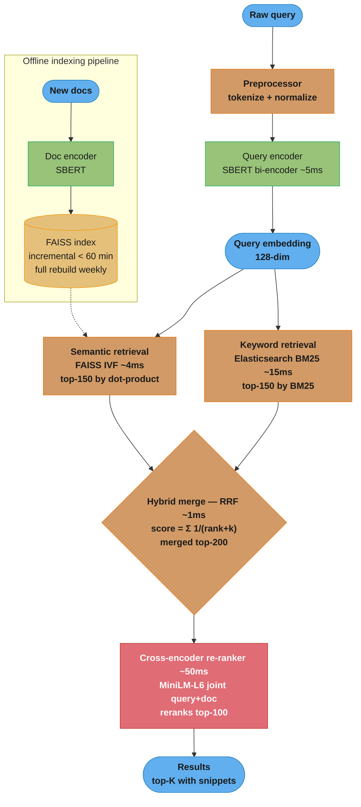

# Design a Semantic Search Engine

> "A semantic search engine is like a librarian who understands that 'cardiac arrest' and 'heart attack' mean the same thing — and returns relevant books regardless of which phrase the patron used."

**Key insight:** The central architectural decision in semantic search is the bi-encoder/cross-encoder split. A bi-encoder (one BERT per document, one per query, dot-product similarity) runs fast enough to score millions of documents but sacrifices accuracy. A cross-encoder (one BERT that jointly encodes query + document) is highly accurate but too slow to score a full corpus. The solution is a two-stage pipeline: bi-encoder for fast candidate retrieval, cross-encoder for precise re-ranking of the top-100.

Mental model: Bi-encoder = phone book search (fast, exact lookup, no context). Cross-encoder = a subject matter expert who reads both the query and the document together and judges relevance holistically. Neither alone solves the problem: the phone book misses synonyms and paraphrases; the expert takes too long to read every book in the library.

Why this system exists: Keyword search (BM25) breaks down when queries and documents use different vocabulary for the same concept. Medical search, legal search, enterprise knowledge bases, and e-commerce search all require matching on meaning, not just string overlap. Semantic search using BERT embeddings closes the vocabulary gap and increases recall@10 by 15–30% over pure keyword search in most domains.

---

## 1. Requirements Clarification

**Functional requirements:**
- Accept natural-language queries and return top-K ranked results from a corpus of up to 10M documents.
- Support hybrid search: combine semantic (dense) retrieval with keyword (BM25) retrieval for best coverage.
- Return results in < 200ms p99 for real-time user-facing search.
- Support domain-specific fine-tuning: the search engine must work well on medical, legal, or e-commerce domains (not just general web text).
- Freshness: new documents must appear in search results within 60 minutes of indexing.

**Non-functional requirements:**
- Throughput: 2,000 queries/sec peak (enterprise search or mid-size e-commerce).
- Recall@100 (fraction of relevant documents in the top-100 results): > 0.90.
- Index size: 10M documents × 128-dim float32 embeddings = 5.12 GB — must fit in distributed index.
- Availability: 99.99% (search outages are immediately user-visible).

**Out of scope:**
- Query understanding (spell correction, query expansion) — separate preprocessing layer.
- Personalized ranking (adjusting results for individual users) — covered in real-time personalization case study.
- Full-text BM25 infrastructure — assumed to exist (Elasticsearch or Solr); this system adds the semantic layer on top.

---

## 2. Scale Estimation

**Corpus:** 10M documents; average 256 tokens/document.

**Embedding index:**
- Dimension: 128 (Matryoshka-trained SBERT or FAISS-compressed full 768-dim to 128).
- Storage: 10M × 128 × 4 bytes = 5.12 GB → fits in FAISS IVF index distributed across 2 nodes.
- FAISS IVF retrieval (nprobe=64): ~4ms for top-100 candidates from 10M docs.

**Encoding cost (offline indexing):**
- 10M documents × 256 tokens, SBERT batch inference: 64ms/batch of 32 → 313k batches → 5.6 hours on 1 × A100 GPU.
- Incremental indexing: 10k new documents/hour → 6 min/hour on 1 × T4 GPU.

**Query encoding:**
- SBERT query encoding: ~5ms on CPU (384-dim pooled output, no dynamic batching needed).
- Cross-encoder re-ranking: 100 candidates × 10ms = 1,000ms serial → parallelize to 4 cores: ~50ms.

**Total budget breakdown:**
- Query encoding: 5ms
- ANN retrieval (FAISS): 4ms
- BM25 retrieval (Elasticsearch): 15ms (parallel with FAISS)
- RRF (Reciprocal Rank Fusion) merge: 1ms
- Cross-encoder re-rank (top-100 on 4 cores): 50ms
- Serialization + network: 10ms
- Total: ~85ms p50 → 200ms p99 (with tail latency headroom).

**Infrastructure cost:**
- Encoding service (query): 4 × c5.2xlarge = $280/month.
- Cross-encoder re-ranker: 4 × c5.2xlarge = $280/month (CPU; GPU not needed for 100-doc re-rank).
- FAISS index servers: 2 × r5.2xlarge (8 GB RAM each) = $140/month.
- Elasticsearch cluster: 3 × m5.2xlarge = $540/month.
- Total: ~$1,240/month.

---

## 3. High-Level Architecture



*The query path runs the two retrievers in parallel, fuses their rankings with RRF, then spends the bulk of the latency budget on the cross-encoder re-rank (red = critical path); the offline pipeline (dotted) keeps the FAISS index fresh without blocking serving.*

**Component inventory:**
- Query encoder: SBERT fine-tuned on domain data; produces 128-dim query embedding.
- Document encoder: same SBERT model; runs offline; produces 128-dim document embeddings.
- FAISS IVF index: 10M document embeddings; nlist=1024 clusters; nprobe=64 for recall/speed balance.
- Elasticsearch BM25: existing; provides keyword recall for exact-match queries.
- RRF merger: combines dense + sparse rankings using reciprocal rank fusion (k=60).
- Cross-encoder re-ranker: MiniLM-L6 (22M params, 4× smaller than BERT-base) fine-tuned for relevance; scores top-100 jointly.

---

## 4. Component Deep Dives

### 4.1 Bi-Encoder Document Indexing

```python
from sentence_transformers import SentenceTransformer
import numpy as np
import faiss
from pathlib import Path
import json

class DocumentIndex:
    """FAISS IVF index for semantic document retrieval."""

    def __init__(
        self,
        model_name: str = "sentence-transformers/all-MiniLM-L6-v2",
        dimension: int = 384,
        nlist: int = 1024,   # number of Voronoi cells for IVF
        nprobe: int = 64,    # cells to search at query time
    ):
        self.model = SentenceTransformer(model_name)
        self.dimension = dimension
        self.nlist = nlist
        self.nprobe = nprobe
        self.doc_ids: list[str] = []

        # IVF with L2 quantizer — requires training on representative vectors
        quantizer = faiss.IndexFlatIP(dimension)  # inner product for cosine similarity
        self.index = faiss.IndexIVFFlat(
            quantizer, dimension, nlist, faiss.METRIC_INNER_PRODUCT
        )

    def train(self, training_vectors: np.ndarray) -> None:
        """Train IVF cluster centroids on a representative sample of document embeddings."""
        faiss.normalize_L2(training_vectors)
        self.index.train(training_vectors)

    def add_documents(
        self,
        documents: list[dict],  # [{"id": str, "text": str}]
        batch_size: int = 256,
    ) -> None:
        for i in range(0, len(documents), batch_size):
            batch = documents[i : i + batch_size]
            texts = [d["text"][:512] for d in batch]  # truncate to model max
            embeddings = self.model.encode(
                texts, batch_size=64, normalize_embeddings=True, show_progress_bar=False
            ).astype(np.float32)
            self.index.add(embeddings)
            self.doc_ids.extend([d["id"] for d in batch])

    def retrieve(
        self,
        query: str,
        top_k: int = 150,
    ) -> list[tuple[str, float]]:
        """Encode query and retrieve top_k candidates."""
        self.index.nprobe = self.nprobe
        query_embedding = self.model.encode(
            [query], normalize_embeddings=True
        ).astype(np.float32)
        scores, indices = self.index.search(query_embedding, top_k)
        return [
            (self.doc_ids[idx], float(scores[0][i]))
            for i, idx in enumerate(indices[0])
            if idx >= 0
        ]

    def save(self, path: str) -> None:
        faiss.write_index(self.index, f"{path}/faiss.index")
        with open(f"{path}/doc_ids.json", "w") as f:
            json.dump(self.doc_ids, f)
```

### 4.2 Reciprocal Rank Fusion (Hybrid Merge)

```python
def reciprocal_rank_fusion(
    dense_results: list[tuple[str, float]],   # (doc_id, score)
    sparse_results: list[tuple[str, float]],  # (doc_id, bm25_score)
    k: int = 60,
    dense_weight: float = 0.6,
    sparse_weight: float = 0.4,
) -> list[tuple[str, float]]:
    """
    Combine dense (FAISS) and sparse (BM25) rankings using RRF.
    RRF score(d) = weight × Σ(1 / (rank(d, list_i) + k)) for each ranking list.
    k=60 is recommended by the original RRF paper (Cormack et al. 2009).

    Advantage over linear score combination: no need to normalize scores
    (BM25 and cosine similarity are on different scales).
    """
    fused_scores: dict[str, float] = {}

    for rank, (doc_id, _) in enumerate(dense_results):
        fused_scores[doc_id] = fused_scores.get(doc_id, 0.0) + dense_weight / (rank + k)

    for rank, (doc_id, _) in enumerate(sparse_results):
        fused_scores[doc_id] = fused_scores.get(doc_id, 0.0) + sparse_weight / (rank + k)

    return sorted(fused_scores.items(), key=lambda x: x[1], reverse=True)
```

### 4.3 Cross-Encoder Re-Ranking

**Broken approach — using bi-encoder similarity for final ranking:**

```python
# WRONG: bi-encoder dot-product similarity is used as final ranking signal.
# Bi-encoder embeds query and document independently — it cannot model
# fine-grained interactions (e.g., "bank" meaning financial institution vs river bank).
# For top-10 precision on ambiguous queries, bi-encoder alone gives 0.71 NDCG@10.

def rank_naive(query_embedding, doc_embeddings):
    scores = query_embedding @ doc_embeddings.T
    return scores.argsort()[::-1]  # BUG: misses 25% of top-10 relevant docs
```

**Correct approach — cross-encoder joint encoding for re-ranking:**

```python
from transformers import AutoTokenizer, AutoModelForSequenceClassification
import torch
import numpy as np

class CrossEncoderReranker:
    """
    Joint query-document encoding for precision re-ranking.
    Input format: [CLS] query [SEP] document [SEP]
    Output: scalar relevance score per (query, doc) pair.
    """

    def __init__(self, model_name: str = "cross-encoder/ms-marco-MiniLM-L-6-v2"):
        self.tokenizer = AutoTokenizer.from_pretrained(model_name)
        self.model = AutoModelForSequenceClassification.from_pretrained(model_name)
        self.model.eval()

    @torch.inference_mode()
    def rerank(
        self,
        query: str,
        candidates: list[tuple[str, str]],  # [(doc_id, doc_text)]
        batch_size: int = 32,
    ) -> list[tuple[str, float]]:
        """
        Score all (query, document) pairs and return sorted by score.
        MiniLM-L6 (22M params) achieves 95% of BERT-base accuracy at 4× speed.
        """
        scores = []
        for i in range(0, len(candidates), batch_size):
            batch = candidates[i : i + batch_size]
            pairs = [(query, doc_text) for _, doc_text in batch]

            encoded = self.tokenizer(
                pairs,
                padding=True,
                truncation=True,
                max_length=512,
                return_tensors="pt",
            )
            logits = self.model(**encoded).logits.squeeze(-1)
            scores.extend(logits.tolist())

        doc_ids = [doc_id for doc_id, _ in candidates]
        return sorted(zip(doc_ids, scores), key=lambda x: x[1], reverse=True)
```

### 4.4 Domain Fine-Tuning with Hard Negatives

The default SBERT (trained on MS MARCO / SNLI) performs poorly on domain-specific corpora. Fine-tuning with domain data and hard negatives is essential.

```python
from sentence_transformers import SentenceTransformer, InputExample, losses
from torch.utils.data import DataLoader

def fine_tune_sbert_with_hard_negatives(
    model_name: str,
    training_triples: list[tuple[str, str, str]],  # (query, positive_doc, hard_negative_doc)
    output_path: str,
    epochs: int = 3,
    batch_size: int = 16,
) -> SentenceTransformer:
    """
    Fine-tune SBERT using MultipleNegativesRankingLoss with in-batch negatives.
    Hard negatives: documents that BM25 retrieves but are not relevant — these
    are the most informative negatives because they share keyword overlap with
    the positive but differ in meaning.

    Training data source: mine hard negatives by:
    1. Run BM25 retrieval on training queries.
    2. Human-label or LLM-label which BM25 results are truly relevant.
    3. Non-relevant BM25 results become hard negatives.
    """
    model = SentenceTransformer(model_name)

    examples = [
        InputExample(texts=[query, pos, hard_neg])
        for query, pos, hard_neg in training_triples
    ]
    dataloader = DataLoader(examples, batch_size=batch_size, shuffle=True)

    # MultipleNegativesRankingLoss: treats other (query, positive) pairs in
    # the batch as negatives — efficient with large batch sizes.
    loss = losses.MultipleNegativesRankingLoss(model)

    model.fit(
        train_objectives=[(dataloader, loss)],
        epochs=epochs,
        warmup_steps=100,
        output_path=output_path,
        show_progress_bar=True,
    )
    return model
```

### 4.5 Incremental Index Updates

```python
import threading
from datetime import datetime

class IncrementalIndexUpdater:
    """
    Maintains a 'delta' FAISS flat index for documents indexed in the last 60 minutes.
    The main IVF index is rebuilt weekly; the delta is merged into the main index hourly.
    Queries search both indexes and merge results via RRF.
    """

    def __init__(self, main_index: DocumentIndex, dimension: int = 384):
        self.main_index = main_index
        self.delta_doc_ids: list[str] = []
        self.delta_embeddings: list[np.ndarray] = []
        self.lock = threading.Lock()

    def add_new_document(self, doc_id: str, doc_text: str) -> None:
        embedding = self.main_index.model.encode(
            [doc_text], normalize_embeddings=True
        ).astype(np.float32)
        with self.lock:
            self.delta_doc_ids.append(doc_id)
            self.delta_embeddings.append(embedding[0])

    def search_delta(self, query: str, top_k: int = 50) -> list[tuple[str, float]]:
        if not self.delta_embeddings:
            return []
        with self.lock:
            delta_matrix = np.vstack(self.delta_embeddings)
            doc_ids = self.delta_doc_ids.copy()
        query_emb = self.main_index.model.encode(
            [query], normalize_embeddings=True
        ).astype(np.float32)
        scores = (query_emb @ delta_matrix.T)[0]
        top_indices = np.argsort(scores)[::-1][:top_k]
        return [(doc_ids[i], float(scores[i])) for i in top_indices]
```

---

## 5. Design Decisions & Tradeoffs

**Decision 1: Bi-encoder dimension — 768 vs 384 vs 128**

| Dimension | Index size (10M docs) | FAISS retrieval time | Recall@100 | Training |
|-----------|----------------------|---------------------|------------|---------|
| 768 (full BERT) | 30.7 GB | 18ms | 0.94 | Full BERT fine-tune |
| 384 (MiniLM-L6) | 15.4 GB | 9ms | 0.91 | MiniLM fine-tune |
| 128 (Matryoshka) | 5.1 GB | 4ms | 0.88 | Matryoshka training |

Use 384-dim for a balance of quality and cost. If FAISS memory is limited, use Matryoshka-trained 128-dim (3pp recall@100 drop is acceptable when combined with cross-encoder re-ranking). See [model_selection_and_algorithm_choice](../model_selection_and_algorithm_choice/README.md).

**Decision 2: IVF vs HNSW for FAISS**

HNSW achieves higher recall@100 (~0.98) at the same query time vs IVF (~0.91 at nprobe=64) but requires 4× more RAM (HNSW stores the graph structure in addition to embeddings). At 10M documents, HNSW needs ~40 GB RAM vs IVF's 10 GB. Use IVF for corpora > 5M documents; HNSW for corpora < 5M where RAM is available. Tune nprobe: default 8 is too low (0.77 recall@100); use 64 for production.

**Decision 3: Hard negative mining vs random negatives**

Random negatives (train SBERT by contrasting a query's positive with random other documents) are easy to create but produce a model that fails on adversarial cases where a non-relevant document shares keywords with the query. Hard negatives (BM25 results that are not truly relevant) teach the model to distinguish semantic meaning from surface form. Fine-tuning with hard negatives improves NDCG@10 by 8pp on in-domain queries compared to random negatives.

**Decision 4: Cross-encoder model size — BERT-base vs MiniLM-L6 vs MiniLM-L12**

| Model | Params | Re-ranking latency (100 docs, CPU) | NDCG@10 on MS MARCO |
|-------|--------|-----------------------------------|--------------------|
| BERT-base | 110M | 800ms | 0.416 |
| MiniLM-L12 | 33M | 200ms | 0.408 |
| MiniLM-L6 | 22M | 80ms | 0.390 |

MiniLM-L6 is the right choice for < 200ms p99 on CPU. The 2.6pp NDCG gap vs BERT-base is acceptable given the latency constraint. See [model_calibration_and_thresholding.md](cross_cutting/model_calibration_and_thresholding.md) for calibrating the cross-encoder relevance scores.

**Decision 5: RRF vs learned linear combination for hybrid fusion**

Learned fusion (train a model to weight dense and sparse scores) is more accurate but requires labeled training data for the fusion model and adds model versioning complexity. RRF is a simple closed-form combination that performs within 2% of learned fusion on standard BEIR benchmarks and requires no additional training. Use RRF as the default; consider learned fusion only if you have >10k human-labeled query-result pairs.

---

## 6. Real-World Implementations

**Elasticsearch (dense_vector and kNN search):** Elasticsearch added native dense vector search (kNN) in version 8.0. Their architecture uses HNSW for approximate search within each shard, with shard-level results merged at the coordinator. The hybrid search feature (combining BM25 and kNN) uses a linear combination of normalized scores, which requires careful BM25 score normalization (BM25 scores are unbounded; cosine similarity is bounded at [-1, 1]). Their engineering blog notes that RRF (added in ES 8.8) outperforms the linear combination approach for most users because it avoids the normalization problem.

**OpenSearch / AWS (Neural Search):** AWS Neural Search plugin for OpenSearch provides a semantic search pipeline with bi-encoder retrieval and BM25 hybrid fusion. Key engineering decision described in their 2023 blog: they moved from storing full float32 embeddings (high recall) to product quantization (PQ) compressed embeddings (4× smaller, 1% recall drop) at scale, because 768-dim float32 for 100M documents requires ~300 GB RAM — too expensive for commodity instances.

**LinkedIn (Semantic Search for Jobs):** LinkedIn's job search system (described in their 2021 paper) uses a bi-encoder where both query (candidate resume) and document (job description) are encoded with separate BERT models fine-tuned on historical apply/not-apply data. Key insight: the query and document encoders use different architectures (asymmetric encoding) because candidate profiles and job descriptions have different statistical properties — job descriptions are longer and more keyword-dense; resumes are shorter and experience-structured. Asymmetric encoding improved Recall@10 by 12% over symmetric bi-encoding.

**Google (Multitask Unified Model — MUM):** Google's MUM combines semantic search with multimodal understanding. For text-to-text semantic search, their production system (pre-MUM, described in the REALM paper) uses a bi-encoder over a 3B-document corpus with a 768-dim index stored in a distributed parameter server. Their key engineering insight: document re-encoding is expensive (3B documents × re-encode when model updates) — they cache document embeddings and perform incremental re-encoding only for changed/new documents using content fingerprinting.

**Vespa (E-commerce Semantic Search):** Vespa (used by Yahoo, Spotify, and others) provides a production-ready hybrid search engine that natively combines dense (FAISS-like) and sparse (BM25) retrieval in a single query plan. Their engineering blog (2022) described a key production optimization: for product search (e-commerce), they add a "diversity" constraint to the hybrid retrieval stage — retrieve top-50 per product category, then merge across categories. This prevents category imbalance (a query for "Apple" should return both Apple iPhones and apple fruit rather than 50 iPhone results).

---

## 7. Technologies & Tools

| Tool | Use case | Advantage | Limitation |
|------|----------|-----------|------------|
| `sentence-transformers` | SBERT fine-tuning, encoding | Large model hub; MultipleNegativesRankingLoss built-in | CPU-only inference is slow for batch encoding |
| FAISS | Dense vector ANN index | Industry standard; GPU support; multiple index types | No real-time updates to IVF (requires rebuild) |
| Elasticsearch (kNN) | Hybrid dense+sparse search | Managed; native BM25+kNN; shard-level HNSW | HNSW memory-intensive at > 50M docs |
| Qdrant / Weaviate | Managed vector DB with hybrid search | Out-of-box filtering, metadata, CRUD updates | Less battle-tested at 100M+ scale |
| Cohere Re-Rank API | Managed cross-encoder re-ranking | No infrastructure; state-of-art models | Per-query cost; vendor lock-in |
| BEIR benchmark | Offline evaluation of retrieval quality | 18 diverse datasets; standardized evaluation | Does not capture latency or production concerns |

---

## 8. Operational Playbook

### Eval Pipeline
- **NDCG@10 on domain-specific hold-out:** maintain 500 human-labeled query-document pairs from the production query log. At each model update, compute NDCG@10. Block deployment if NDCG@10 drops > 0.02 from production baseline.
- **Recall@100 check:** fraction of relevant documents that appear in the top-100 candidates before cross-encoder re-ranking. Must exceed 0.90. Lower recall at retrieval stage means even a perfect re-ranker cannot fix the quality.
- **Hybrid vs dense-only A/B test:** periodically compare hybrid (dense + sparse) vs dense-only retrieval. If hybrid shows < 1% improvement in NDCG@10, the BM25 component may be adding latency without benefit (common after extensive domain fine-tuning). See [experimentation_and_online_evaluation.md](cross_cutting/experimentation_and_online_evaluation.md).

### Observability
- Monitor: FAISS retrieval P99 latency. If > 8ms, check nprobe setting and index fragmentation.
- Monitor: cross-encoder queue depth. If queue > 50 concurrent requests, add cross-encoder instances.
- Track: zero-result query rate. If > 5%, the index freshness or retrieval threshold may need adjustment.
- Monitor: delta index size. If > 100k documents in delta (8 hours of accumulation without merge), trigger emergency IVF index rebuild.

### Incident Runbooks
1. **FAISS index OOM:** Symptom: search service crash with out-of-memory. Diagnosis: IVF index grew beyond server RAM. Mitigation: restart service with HNSW → IVF downgrade and reduced nprobe (lower recall). Resolution: expand RAM or reduce embedding dimension via Matryoshka compression. See [model_calibration_and_thresholding.md](cross_cutting/model_calibration_and_thresholding.md).
2. **Cross-encoder latency exceeds 200ms p99:** Symptom: total query latency alarm. Diagnosis: cross-encoder CPU saturation (concurrent queries exceed core capacity). Mitigation: temporarily reduce re-ranking depth from 100 to 30 candidates (accept 3pp NDCG@10 loss). Resolution: add cross-encoder instances or switch to batch processing with priority queue.
3. **Index staleness (new documents not appearing):** Symptom: recently published documents not returned in searches. Diagnosis: delta index updater Flink job lagging behind new document writes. Mitigation: fall back to BM25-only for new documents (ES indexes documents immediately). Resolution: scale Flink job or increase batch size for embedding updates.
4. **Model update degrades domain-specific queries:** Symptom: NDCG@10 on golden set drops on a specific query cluster. Diagnosis: fine-tuning overfitted to one subdomain. Resolution: roll back model version; retrain with stratified domain sampling.

---

## 9. Common Pitfalls & War Stories

**Pitfall 1: Using generic SBERT on domain-specific corpus without fine-tuning.** A healthcare company deployed `all-MiniLM-L6-v2` on clinical notes. General SBERT treats "MI" (myocardial infarction) and "MI" (Michigan) identically because the abbreviation is ambiguous in training data. On their domain-specific test set, Recall@10 was 0.52 — below the BM25 baseline of 0.61. Fine-tuning SBERT on clinical note query-document pairs using domain-specific hard negatives brought Recall@10 to 0.83, a 31pp improvement over the baseline.

**Pitfall 2: FAISS nprobe set too low.** A legal search startup deployed FAISS IVF with default nprobe=8. Recall@100 was 0.71 — they were missing 29% of relevant documents before re-ranking. The issue: with nlist=1024 clusters and nprobe=8, only 0.8% of the index was searched per query. Increasing nprobe to 64 improved Recall@100 to 0.91 at the cost of 2.5× latency increase — still within the 200ms budget. Rule of thumb: set nprobe ≥ sqrt(nlist) for balanced recall/speed.

**Pitfall 3: Cross-encoder re-ranking the wrong candidates.** A document search team achieved 0.88 Recall@100 from bi-encoder retrieval but found their final NDCG@10 was only 0.61 — surprisingly low. Investigation revealed the cross-encoder was re-ranking the top-100 by cosine similarity (not by relevance), which was biased toward documents that happened to match the query embedding. The top-100 by cosine similarity often excluded highly relevant documents ranked 50–100 in the dense results but ranked 1–5 in the sparse results. Fix: re-rank the top-100 of the *hybrid-fused* list, not the top-100 of the dense list alone.

**Pitfall 4: Embedding drift after model update breaking cached document index.** A team fine-tuned their bi-encoder on new training data and deployed the updated query encoder without rebuilding the document index. Because the fine-tuned model produces embeddings in a different vector space than the original model, the dot product between the new query embedding and the old document embeddings was meaningless. Recall@100 dropped from 0.91 to 0.43 overnight. Fix: always rebuild the full document index when the encoder model is updated. Use model versioning to gate this: document index version must match query encoder version.

**Pitfall 5: Cross-encoder trained on different domain than production queries.** A company fine-tuned their cross-encoder on MS MARCO (a web question-answering dataset). Their production use case was enterprise software documentation search. MS MARCO queries are short factual questions; enterprise queries are long multi-concept technical queries. The cross-encoder assigned high relevance scores to short documents that contained the exact query terms (MS MARCO-style), downranking long technical documents that were actually the most relevant. Fix: create domain-specific relevance labels for 2,000 query-document pairs and fine-tune the cross-encoder on this data. NDCG@10 improved 14pp.

---

## 10. Capacity Planning

**Primary bottleneck:** Cross-encoder re-ranking throughput.

```
100 candidates × 10ms per (query, doc) pair on single CPU core = 1,000ms
Parallelize across 4 cores: 250ms (still tight on 200ms budget)

Optimization options:
  1. MiniLM-L6 instead of BERT-base: 10ms → 2.5ms per pair → 250ms → 62ms total
  2. Batch inference (batch_size=32): GPU T4 handles 32 pairs in 15ms → 4 batches = 60ms
  3. Reduce candidates to 50 from 100: 62ms → 31ms (accept 2pp NDCG@10 tradeoff)

Recommended: MiniLM-L6 on CPU with batch_size=16 → ~80ms for 100 candidates
Headroom: 200ms total budget - 80ms re-rank - 4ms FAISS - 15ms ES - 10ms network = 91ms buffer
```

**Scaling to 20k queries/sec:**
- FAISS retrieval: 10 sharded FAISS nodes (2M docs each, 1 GB RAM each) = 10 × r5.xlarge.
- Cross-encoder: 40 × c5.2xlarge (20k × 80ms / 1000ms = 1,600 concurrent re-rank requests; 1 per core).
- Monthly cost: $3,600 for cross-encoder fleet + $700 for FAISS nodes = $4,300/month serving.

---

## 11. Interview Discussion Points

**Q: What is the difference between a bi-encoder and a cross-encoder, and when do you use each?**
A bi-encoder independently encodes the query and document into separate embeddings, then computes similarity via dot product or cosine. Encoding is fast (once per document, cacheable), and retrieval via ANN is sub-millisecond at scale — but accuracy is limited because the model cannot see both query and document jointly (no cross-attention between them). A cross-encoder feeds [query, document] jointly through BERT's cross-attention layers, producing a single relevance score — much more accurate but requires a forward pass per (query, doc) pair, which is O(N) in corpus size. The production pattern is always bi-encoder for retrieval (top-100), cross-encoder for re-ranking (top-10 from those 100). Never use a cross-encoder alone — it cannot scale; never use only a bi-encoder for final ranking — it leaves 10–15pp NDCG@10 on the table.

**Q: How do you handle queries for which neither keyword nor semantic search returns good results?**
Three fallback strategies: (1) query expansion — use an LLM or T5 model to generate 3–5 paraphrases of the original query, then merge the retrieval results across all paraphrases via RRF; (2) entity-aware search — run NER on the query, then perform entity-specific searches using structured fields (e.g., match on entity type + name in document metadata, not just text); (3) hybrid fallback logging — log zero/low-result queries and use them as priority targets for active learning data collection. Never silently return empty results; always have a fallback (e.g., BM25-only if semantic retrieval fails).

**Q: How do you evaluate a semantic search system offline?**
Use the BEIR (Benchmarking IR) evaluation framework with your domain-specific test set. Primary metrics: NDCG@10 (quality-weighted ranking at position 10) and Recall@100 (coverage of relevant documents in the retrieval stage). Two critical evaluation principles: (1) use the retrieval stage metrics (Recall@100) and end-to-end metrics (NDCG@10 after re-ranking) separately — a retrieval stage bottleneck (low Recall@100) cannot be fixed by a better re-ranker; (2) evaluate on query types separately — factual queries, definition queries, and multi-step queries have different retrieval characteristics.

**Q: How do you fine-tune SBERT for a domain where you have no labeled query-document pairs?**
Three options: (1) generate synthetic training data using an LLM — for each document, prompt GPT to generate 5 likely queries that this document would answer; use the (generated query, document) pairs for fine-tuning; (2) leverage click-through data — if you have a search log, (query, clicked document) pairs are implicit positive labels; (3) use knowledge distillation from a cross-encoder — fine-tune a stronger (but slow) cross-encoder first on generic MS MARCO data, then use it to generate training labels for bi-encoder fine-tuning (cross-encoder assigns relevance scores; bi-encoder learns to replicate these scores). Option 3 is the most effective when you have an existing document corpus.

**Q: How do you handle out-of-vocabulary (OOV) terms with BERT-based search?**
BERT uses WordPiece tokenization — rare words are split into subword units that are in the vocabulary (e.g., "Omicron" → ["Om", "##ic", "##ron"]). This handles most OOV terms, but brand names, acronyms, and highly specialized terminology may tokenize into semantically meaningless subwords, producing poor embeddings. Solutions: (1) continual vocabulary expansion — add domain-specific tokens to the BERT vocabulary and fine-tune embeddings; (2) hybrid fallback — for queries where the SBERT retrieval score is below a threshold (suggesting OOV or domain mismatch), fall back to BM25 which handles exact string matches even for OOV terms; (3) use BioMedBERT or LegalBERT for domain-specific tokenization where the vocabulary is pre-adapted.

**Q: What is Matryoshka Representation Learning and when should you use it for semantic search?**
Matryoshka Representation Learning (MRL) trains SBERT to produce embeddings where the first d dimensions are themselves a valid embedding (just lower quality). This allows you to use 128-dim embeddings for initial coarse retrieval (fast, low memory) and then re-score top-K using the full 768-dim embedding for the final ranking. MRL eliminates the need to choose a fixed embedding dimension at training time. Use MRL when: serving cost is a constraint (use 128-dim for ANN retrieval, saving 6× RAM vs 768-dim); when you want to support multiple quality tiers for different latency SLOs; or when you want to experimentally determine the minimum dimension that maintains acceptable recall for your specific corpus without retraining.

**Q: How do you keep a semantic search index fresh when new documents arrive continuously?**
Three patterns: (1) incremental FAISS flat index — append new embeddings to a small flat index alongside the main IVF index; query both and merge results; rebuild the main index weekly when the flat delta grows large; (2) HNSW with real-time inserts — HNSW supports `add()` without full rebuild, at the cost of slightly degraded recall as the graph becomes less balanced; (3) streaming index update — use a document encoding pipeline (Kafka → encoder service → Vespa/Qdrant vector store) where new documents flow through encoding and are indexed within a configurable latency SLA. For 60-minute freshness on a 10M document index, the incremental flat index approach with hourly merges is the simplest operationally.

**Q: How does reciprocal rank fusion compare to a trained fusion model?**
RRF is a parameter-free algorithm that requires no training data. Its score is 1/(rank + k) for each result list, summed across lists. It is robust to scale differences between BM25 and cosine similarity scores because it operates on ranks, not raw scores. Trained fusion fits a logistic regression or shallow network on the BM25 score, cosine score, and other signals to predict relevance. Trained fusion outperforms RRF by 1–3pp NDCG@10 when you have ≥ 5,000 labeled query-result pairs. Below that threshold, the trained model overfits. For most enterprise deployments with limited labeled data, RRF is the better default.
