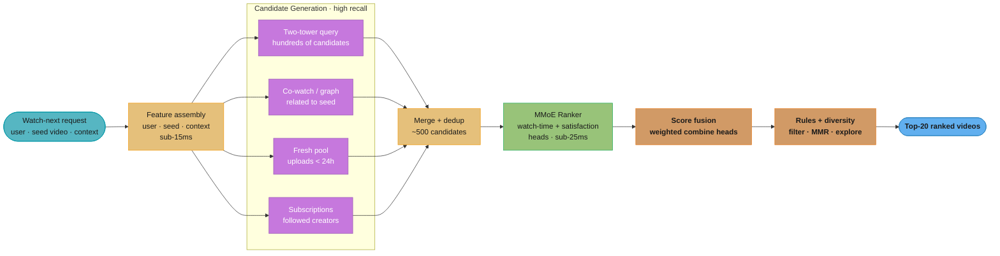
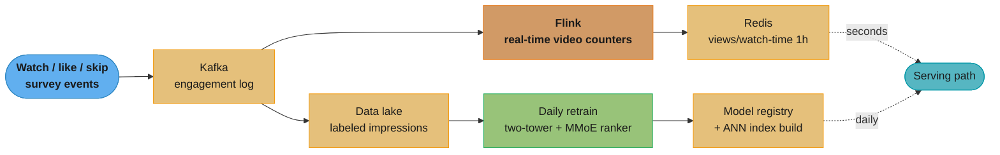
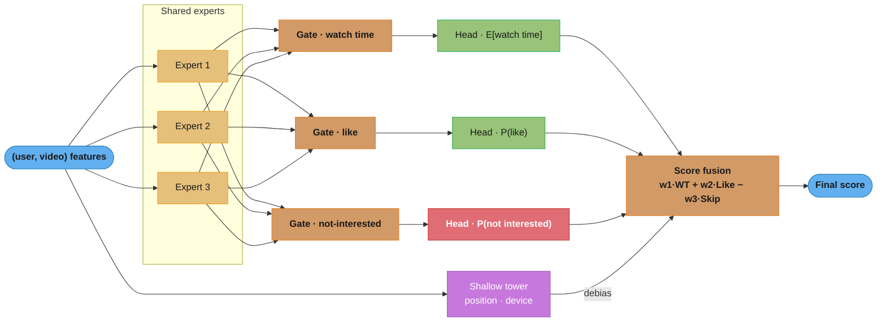

# Design a Video Recommendation System (YouTube "Watch Next")

> "A video recommender is a TV channel that reprograms itself for every viewer between one video ending and the next one starting — and it is graded not on whether you press play, but on whether you are still watching an hour later."

**Key insight:** The defining decision in video recommendation is the *objective*, not the architecture. If you optimize click-through rate you get clickbait — thumbnails and titles that win the click and lose the hour. YouTube's answer (Covington et al., 2016) is a ranking model trained as **weighted logistic regression** where each positive impression is weighted by its watch time, so the learned odds approximate *expected watch time per impression* rather than P(click). The 2019 successor (Zhao et al.) generalizes this to a **multi-gate mixture-of-experts (MMoE)** that jointly predicts many engagement and satisfaction signals, with a shallow tower that removes position/selection bias. Everything else — two-tower candidate generation, ANN retrieval, feature stores — is shared with any large recommender; the watch-time objective and the multitask ranking head are what make this problem *video*.

Mental model: two funnels in series. **Candidate generation** turns "millions of videos" into "a few hundred plausible ones" using cheap, high-recall retrieval (you are allowed to be sloppy — you only need the right videos *somewhere* in the few hundred). **Ranking** turns "a few hundred" into "an ordered list of ~20" using an expensive, high-precision model that can afford hundreds of features per (user, video) pair. The two stages have opposite cost/quality tradeoffs on purpose.

Why this system exists: YouTube has reported that recommendations drive ~70% of watch time on the platform. At the scale of a billion-video corpus and a billion users, a 1% relative improvement in watch time is worth an enormous amount of engagement — and, just as importantly, a badly-tuned objective (raw clicks, raw watch time without satisfaction guards) can actively degrade the product by promoting outrage and clickbait. This case study is asked at Google, Meta (Reels), TikTok, Netflix, and Spotify for senior/staff MLE roles.

This study is deliberately **distinct** from two neighbors you should cross-read:
- [Content Feed Ranking](design_content_feed_ranking.md) — multi-objective *feed* ranking (a scrollable timeline; the unit is a post, engagement is like/comment/share). Video-rec here centers watch-time regression and sequential "what to watch next".
- [Real-Time Personalization](design_real_time_personalization.md) — the two-stream (historical + session) freshness architecture and GRU session encoder. Video-rec reuses that serving skeleton but focuses on the *objective design and multitask ranking head*.

---

## 1. Requirements Clarification

**Functional requirements:**
- Given a user (and optionally a currently-playing video), return a ranked list of videos to watch next — for the home feed, the "Up Next" sidebar, and autoplay.
- Optimize for long-term satisfaction (watch time + explicit satisfaction signals), not raw clicks.
- Support **fresh content**: a video uploaded minutes ago must be recommendable (news, live, trends decay in hours).
- Support **cold-start** for both new videos (no watch history) and new users (no watch history).
- Enforce diversity and avoid degenerate loops (10 near-identical videos; filter-bubble collapse).
- Respect hard constraints: age-restriction, regional blocking, already-watched suppression, creator/policy holds.

**Non-functional requirements:**
- End-to-end p99 latency ≤ 200 ms for the "watch next" request (retrieval + ranking + rules).
- Throughput: 1M recommendation requests/sec at peak.
- Freshness SLO: a newly uploaded, policy-cleared video is retrievable within ≤ 5 minutes.
- Availability: 99.95%+ — a recommendation outage degrades every session.
- Model refresh: ranking model retrained at least daily (engagement distributions drift fast around trends and holidays).

**Explicitly clarify these with the interviewer (they change the design):**
- Is there a *currently-playing* video as context (Up Next) or a cold home-feed open? Up Next has a strong seed signal; home feed leans on history.
- Is watch time the sole objective, or do we have satisfaction signals (likes, "not interested", surveys)? This decides single-task vs MMoE.
- Live streams in scope? Live changes freshness, ranking (concurrent viewers), and dedup.

**Out of scope:** the video encoding/CDN pipeline, search (query→video), ads auction (see [Ads Click Prediction](design_ads_click_prediction.md)), and creator-side analytics.

---

## 2. Scale Estimation

**Corpus and users:**
- Total videos: ~1B lifetime; **eligible/retrievable corpus** ~ 100M (recently uploaded or with recent engagement — you never retrieve from the full billion). This distinction is the whole reason candidate generation is tractable.
- Users: 2B monthly, ~500M DAU.
- Uploads: ~500 hours of video/minute → ~30k new videos/hour needing cold-start handling.

**Traffic:**
- 1M req/sec peak, ~300k req/sec average.
- Per request: retrieve ~500 candidates, rank them, return ~20.

**Candidate generation (two-tower ANN):**
- User/video embedding dim: 256 floats.
- Video ANN index: 100M × 256 × 4 bytes = **~100 GB** → does NOT fit one node; shard across ~8–16 ANN replicas (IVF-PQ or ScaNN), or compress with product quantization to ~8 GB. Contrast with the personalization study's 256 MB single-node FAISS — the corpus size flips the architecture from in-process to sharded.
- ANN retrieve top-500: ~5–10 ms per shard, fan-out + merge.

**Ranking:**
- 500 candidates × ~500 features each. A DNN ranker on GPU scores 500 candidates in ~10–20 ms batched.
- 1M req/sec × 500 candidates = 500M scoring ops/sec → the ranker is the dominant compute cost.

**Feature store:**
- User features: 2B users × 200 features × 4 bytes ≈ 1.6 TB → sharded key-value (Bigtable/Redis Cluster).
- Video features: 100M × 300 features × 4 bytes ≈ 120 GB.
- Real-time counters (views/watch-time last 1h, per video): maintained by a streaming job (Flink) keyed by video_id.

**Rough infra cost (order-of-magnitude):**
- Ranking GPUs: ~200 × A10G-class to hold 1M req/sec × 500-candidate scoring with headroom.
- ANN serving: ~50 CPU nodes across shards + replicas.
- Streaming + feature store: Kafka + Flink + Bigtable clusters.
- This is a "thousands of cores + hundreds of GPUs" system; the interview point is *where* the cost concentrates (ranking scoring), not the exact dollar figure.

---

## 3. High-Level Architecture



Online path: multiple candidate sources (personalized two-tower, seed co-watch graph, a fresh-upload pool, and subscriptions) each contribute high-recall candidates, which are merged, ranked by the multitask model, fused into one score, and filtered by business rules — all inside the 200 ms budget. Multiple sources exist because no single retriever covers freshness, personalization, and follow-graph simultaneously.



Async path: every impression is logged with its eventual watch time and satisfaction outcome (label maturation can take minutes to hours for watch time), feeding a daily retrain, while a streaming job maintains sub-second freshness counters used as ranking features.

**Component inventory:**
- Candidate generators: sharded ANN (two-tower), a co-watch/graph index keyed by seed video, a fresh-upload pool, and a subscription fetch.
- Ranker: MMoE DNN served on GPU; heads for watch time and satisfaction; shallow tower for position/selection bias.
- Streaming: Kafka → Flink for real-time per-video counters (concurrent viewers, watch-time velocity).
- Feature/label pipeline: impression logs joined to matured labels; point-in-time correctness enforced (see [feature_store_and_point_in_time_correctness.md](cross_cutting/feature_store_and_point_in_time_correctness.md)).

---

## 4. Component Deep Dives

### 4.1 Candidate generation as extreme multiclass classification

Covington et al. frame candidate generation as predicting *which video the user watches next* out of the whole eligible corpus — an extreme multiclass classification with millions of classes. You train a user (query) tower; each video is a class with a learned embedding. At serving time you don't run a softmax over millions of classes — you take the user vector and do **approximate nearest-neighbor** retrieval against the video embedding table.

```python
import torch
import torch.nn as nn
import torch.nn.functional as F


class UserTower(nn.Module):
    """
    Encodes a user into a query vector. Inputs: average of the embeddings of
    recently watched videos, average of recent search tokens, plus dense
    context (geo, device, age of account). Covington-style watch-history
    averaging is deliberately simple and cheap; the sequence models live in
    the ranker, not the retriever.
    """

    def __init__(self, video_vocab_emb: nn.Embedding, dense_dim: int, out_dim: int = 256):
        super().__init__()
        self.video_emb = video_vocab_emb          # shared with the video tower
        emb_dim = video_vocab_emb.embedding_dim
        self.mlp = nn.Sequential(
            nn.Linear(emb_dim * 2 + dense_dim, 1024), nn.ReLU(),
            nn.Linear(1024, 512), nn.ReLU(),
            nn.Linear(512, out_dim),
        )

    def forward(self, watch_hist_ids, search_hist_ids, dense_feats):
        # watch_hist_ids: (B, H) recent watched video ids; mean-pool their embeddings
        watch_vec = self.video_emb(watch_hist_ids).mean(dim=1)     # (B, emb)
        search_vec = self.video_emb(search_hist_ids).mean(dim=1)   # (B, emb)
        x = torch.cat([watch_vec, search_vec, dense_feats], dim=-1)
        return F.normalize(self.mlp(x), dim=-1)                    # unit vectors → cosine ANN


def sampled_softmax_loss(user_vec, pos_video_ids, video_emb_table,
                         num_neg: int = 2000):
    """
    Extreme multiclass over millions of videos is intractable with a full
    softmax. Train with *sampled* negatives (importance-corrected). This is the
    retriever's whole trick: high recall, cheap, negatives sampled from the
    corpus so the user vector learns to point at watched videos.
    """
    B = user_vec.size(0)
    pos_emb = video_emb_table(pos_video_ids)                       # (B, d)
    neg_ids = torch.randint(0, video_emb_table.num_embeddings, (B, num_neg),
                            device=user_vec.device)
    neg_emb = video_emb_table(neg_ids)                             # (B, N, d)
    pos_logit = (user_vec * pos_emb).sum(-1, keepdim=True)         # (B, 1)
    neg_logit = torch.bmm(neg_emb, user_vec.unsqueeze(-1)).squeeze(-1)  # (B, N)
    logits = torch.cat([pos_logit, neg_logit], dim=1)             # (B, 1+N)
    target = torch.zeros(B, dtype=torch.long, device=user_vec.device)  # index 0 = positive
    return F.cross_entropy(logits, target)
```

At serving time the video embedding table is exported into a sharded ANN index (IVF-PQ / ScaNN). Retrieval is `index.search(user_vec, top_k=500)` fanned across shards. Because the corpus is 100M, the index is quantized: product quantization compresses 256-float vectors to ~32-byte codes, trading a small recall loss for a 32× memory reduction — the difference between 100 GB and ~3 GB per replica.

### 4.2 The ranking objective — watch-time-weighted logistic regression

This is the heart of the design. The ranker sees ~500 candidates and hundreds of features per (user, video). The naive objective is "predict P(click)". It is wrong for video.

**Broken approach — optimizing clicks:**

```python
# WRONG: binary click label. The model learns that sensational thumbnails and
# misleading titles get clicked, regardless of whether the video is watched.
# Observed failure: CTR up 12%, average watch time DOWN 8% — classic clickbait
# amplification. The objective rewards the click, not the watch.
label = 1.0 if impression.clicked else 0.0
loss = F.binary_cross_entropy_with_logits(logit, label)
```

**Correct approach — weight positives by watch time so the odds estimate expected watch time:**

```python
import torch
import torch.nn.functional as F


def watch_time_weighted_loss(logits: torch.Tensor,
                             clicked: torch.Tensor,
                             watch_seconds: torch.Tensor) -> torch.Tensor:
    """
    Covington et al. 2016 ranking objective. Train a logistic regression where
    POSITIVE (clicked) impressions are weighted by their watch time and NEGATIVE
    (non-clicked) impressions get weight 1. Under this weighting the learned
    odds e^{Wx+b} approximate E[watch time per impression]:

        odds = sum(watch_time on positives) / (#negatives)
             ≈ E[T] because positives are rare relative to impressions.

    At serving time we rank by e^{Wx+b} (expected watch time), NOT by P(click).
    """
    # weight: watch_seconds for clicked positives, 1.0 for negatives
    weights = torch.where(clicked.bool(), watch_seconds.clamp(min=1.0),
                          torch.ones_like(watch_seconds))
    per_example = F.binary_cross_entropy_with_logits(
        logits, clicked.float(), reduction="none")
    return (per_example * weights).mean()


@torch.no_grad()
def serving_score_expected_watch_time(logits: torch.Tensor) -> torch.Tensor:
    # rank by odds = exp(logit); this is the expected-watch-time estimate,
    # NOT the click probability sigmoid(logit).
    return torch.exp(logits)
```

The elegance: a single logistic model, trained with a one-line change to the sample weights, produces a *regression on watch time* whose serving score is `exp(logit)`. Ranking by that score orders videos by how much time the user is expected to spend, which is the metric the business actually cares about.

### 4.3 Multitask ranking with MMoE and a satisfaction guard

Watch time alone still has a failure mode: it can promote content that is compulsive but *dissatisfying* (users watch, then regret, then churn). The 2019 system predicts many objectives at once — engagement (clicks, watch time) and satisfaction (likes, dismissals, "not interested", survey scores) — and combines them. **Multi-gate Mixture-of-Experts (MMoE)** lets each objective learn its own weighting over shared experts, so conflicting objectives (watch time vs "not interested") do not fight inside one shared trunk (the "seesaw" / negative-transfer problem).



Each task has its own gate that mixes the shared experts; the satisfaction head (P(not interested)) subtracts from the final score, and a shallow tower absorbs position/selection bias so it does not leak into the main experts.

```python
import torch
import torch.nn as nn
import torch.nn.functional as F


class MMoE(nn.Module):
    """
    Multi-gate Mixture-of-Experts ranking trunk (Zhao et al. 2019).
    n_experts shared experts; one gate per task produces a softmax mixture,
    so each task reads a task-specific blend of the experts.
    """

    def __init__(self, in_dim: int, n_experts: int = 8, expert_dim: int = 256,
                 tasks=("watch_time", "like", "not_interested")):
        super().__init__()
        self.experts = nn.ModuleList(
            nn.Sequential(nn.Linear(in_dim, expert_dim), nn.ReLU())
            for _ in range(n_experts))
        self.gates = nn.ModuleDict(
            {t: nn.Linear(in_dim, n_experts) for t in tasks})
        self.heads = nn.ModuleDict(
            {t: nn.Linear(expert_dim, 1) for t in tasks})
        self.tasks = tasks

    def forward(self, x):
        expert_out = torch.stack([e(x) for e in self.experts], dim=1)  # (B, E, d)
        out = {}
        for t in self.tasks:
            w = F.softmax(self.gates[t](x), dim=-1).unsqueeze(-1)       # (B, E, 1)
            mixed = (w * expert_out).sum(dim=1)                         # (B, d)
            out[t] = self.heads[t](mixed).squeeze(-1)                   # (B,)
        return out


class RankerWithBiasTower(nn.Module):
    """
    Main MMoE + a SHALLOW tower fed only position/device (the features that
    cause selection bias). At training the shallow tower explains away the
    position effect; at serving we drop it (or set position=neutral), so the
    main model's score is position-unbiased. This is Zhao et al.'s fix for the
    feedback loop where high positions get clicked because they are high.
    """

    def __init__(self, feat_dim: int, bias_dim: int):
        super().__init__()
        self.mmoe = MMoE(feat_dim)
        self.bias_tower = nn.Sequential(nn.Linear(bias_dim, 32), nn.ReLU(),
                                        nn.Linear(32, 1))

    def forward(self, feats, bias_feats, serving: bool = False):
        heads = self.mmoe(feats)
        if serving:
            bias_logit = torch.zeros_like(heads["watch_time"])  # neutralize position
        else:
            bias_logit = self.bias_tower(bias_feats).squeeze(-1)
        # watch_time head trained as weighted-logistic (Section 4.2); the bias
        # logit is ADDED during training so gradients route position effects here.
        heads["watch_time"] = heads["watch_time"] + bias_logit
        return heads


def fuse_scores(heads: dict, w=(1.0, 0.3, -1.5)) -> torch.Tensor:
    """
    Combine heads into one ranking score. Weights are tuned by online A/B, not
    offline loss: watch time positive, like mildly positive, 'not interested'
    strongly negative. The negative weight on dissatisfaction is what stops the
    compulsive-but-regretted content from dominating.
    """
    w_wt, w_like, w_skip = w
    return (w_wt * torch.exp(heads["watch_time"])
            + w_like * torch.sigmoid(heads["like"])
            + w_skip * torch.sigmoid(heads["not_interested"]))
```

### 4.4 Freshness and cold-start for new uploads

News, live, and trending content decays in hours, so the retriever must surface videos with little or no engagement history. Two mechanisms:

```python
import numpy as np


def example_age_feature(upload_time, context_time) -> float:
    """
    Covington's 'example age' trick: feed the age of the training example as a
    feature so the model learns the empirical freshness-decay curve instead of
    averaging it away. At serving, set age=0 (or a small value) to bias toward
    fresh content; sweeping this feature reproduces the observed upload-time
    popularity spike-and-decay.
    """
    return (context_time - upload_time).total_seconds() / 3600.0  # hours


def cold_start_video_embedding(meta, category_centroids, text_encoder) -> np.ndarray:
    """
    A brand-new video has no collaborative signal. Warm-start its retrieval
    embedding from content: category centroid + title/description text embedding
    + creator's average video embedding. Once it accrues ~50-100 watches, the
    learned collaborative embedding takes over at the next index build.
    """
    cat = category_centroids[meta["category"]]
    txt = text_encoder(meta["title"] + " " + meta["description"])
    creator = meta.get("creator_avg_embedding", np.zeros_like(cat))
    v = 0.4 * cat + 0.4 * txt + 0.2 * creator
    return v / (np.linalg.norm(v) + 1e-9)
```

The fresh pool (uploads < 24h) is a separate high-recall candidate source that bypasses the main ANN index (which rebuilds on a slower cadence), so a video is recommendable within the 5-minute freshness SLO rather than waiting for the next full index build.

### 4.5 Diversity, dedup, and loop-breaking

The final stage filters already-watched videos, enforces a cap of N per creator/topic cluster, and applies Maximal Marginal Relevance so the top-20 is not ten near-identical videos on the same topic.

```python
def mmr_rerank(candidates, scores, embeddings, k=20, lam=0.7):
    """
    Maximal Marginal Relevance: greedily pick items that are high-scoring AND
    dissimilar to what's already picked. lam trades relevance vs diversity.
    Enforced on topic-cluster embeddings, not raw creator id, so two different
    videos covering the same news event still count as similar (see Pitfall 5
    in the personalization study).
    """
    import numpy as np
    selected, remaining = [], list(range(len(candidates)))
    while remaining and len(selected) < k:
        best, best_val = None, -1e9
        for i in remaining:
            sim = max((float(np.dot(embeddings[i], embeddings[j]))
                       for j in selected), default=0.0)
            val = lam * scores[i] - (1 - lam) * sim
            if val > best_val:
                best, best_val = i, val
        selected.append(best)
        remaining.remove(best)
    return [candidates[i] for i in selected]
```

---

## 5. Design Decisions & Tradeoffs

**Decision 1: Two-stage (retrieval + ranking) vs single-stage ranking of the whole corpus.**
You cannot run a 500-feature DNN over 100M videos in 200 ms. Two stages let retrieval be cheap/high-recall and ranking be expensive/high-precision. The cost is that a great video missed by retrieval can never be ranked — so retrieval recall is monitored as a first-class metric (recall@500 of the eventually-watched video).

**Decision 2: Watch-time-weighted logistic vs direct watch-time regression vs pairwise ranking.**

| Objective | Pro | Con |
|-----------|-----|-----|
| P(click) binary | simple | clickbait; optimizes wrong metric |
| Watch-time-weighted logistic (Covington) | serving score = E[watch time]; one model; calibratable | needs watch-time labels; heavy-tail watch times need clipping |
| Direct regression on seconds | intuitive | dominated by a few very long videos; unstable |
| Pairwise/LambdaMART | directly optimizes ranking | harder to calibrate; less natural for multi-objective fusion |

Weighted logistic is the default because it yields a *calibrated expected-watch-time* score that composes cleanly with the other MMoE heads.

**Decision 3: MMoE vs shared-bottom vs PLE for multitask.**
Shared-bottom is simplest but suffers negative transfer when objectives conflict (watch time vs "not interested"). MMoE gives each task its own gate over shared experts, reducing the seesaw. PLE (Progressive Layered Extraction) adds task-specific experts and often beats MMoE when tasks are very heterogeneous, at higher parameter cost. See [../multi_task_and_multi_objective_learning/README.md](../multi_task_and_multi_objective_learning/README.md).

**Decision 4: Position/selection-bias correction — shallow tower vs inverse propensity weighting (IPW).**
The shallow-tower ("bias tower") approach learns the position effect jointly and is dropped at serving; IPW reweights training examples by `1/P(click|position)`. The shallow tower is simpler to serve and avoids high-variance propensity estimates, but IPW is more principled when you have reliable position-CTR estimates. Both are valid; state the tradeoff.

**Decision 5: How fresh to retrain.**
Engagement distributions shift on a daily/weekly cycle and around events. Daily retrain of the ranker plus streaming freshness counters is the standard. Fully online learning is possible but adds instability; most systems do daily batch retrain + real-time features rather than true online gradient updates.

---

## 6. Real-World Implementations

**YouTube (Covington et al., RecSys 2016 — "Deep Neural Networks for YouTube Recommendations").** The canonical two-stage design: a candidate-generation network trained as extreme multiclass classification (serving via nearest-neighbor in embedding space) and a ranking network trained as watch-time-weighted logistic regression. Introduced the "example age" feature to model the upload-time freshness spike and showed that averaging recent watch/search embeddings as the user representation is a strong, cheap retriever.

**YouTube (Zhao et al., RecSys 2019 — "Recommending What Video to Watch Next: A Multitask Ranking System").** Generalized the ranker to a Multi-gate Mixture-of-Experts predicting multiple engagement and satisfaction objectives, and added a shallow "bias tower" to remove selection/position bias. Reported that MMoE reduced negative transfer versus shared-bottom and that the bias tower measurably improved engagement by breaking the position feedback loop.

**Meta (Reels) and TikTok.** Short-video "For You" systems push the freshness and objective-design points to the extreme: near-real-time engagement signals, heavy multitask ranking (finish rate, replays, shares, "not interested"), and aggressive exploration for new creators. TikTok's cold-start "traffic valve" (giving a new video a small guaranteed audience, then promoting based on early completion rate) is a productionized version of the fresh-pool + example-age idea.

**Netflix.** Ranks rows/titles rather than a next-video stream, but shares the two-stage retrieval+ranking and the "optimize long-term member value, not immediate clicks" philosophy. Netflix emphasizes calibrated ranking and diversity across the home page.

**Spotify.** Session-vs-history split (Discover Weekly = history; Daily Mix = session/mood). The interview-relevant transfer is that *context strongly matters for some media (music/short video) and weakly for others (long documentaries)* — the objective and freshness weighting should be tuned per surface.

---

## 7. Technologies & Tools

| Tool | Use case | Advantage | Limitation |
|------|----------|-----------|------------|
| ScaNN (Google) / FAISS IVF-PQ | Sharded ANN over ~100M videos | Product quantization → 32× memory cut; billion-scale | Quantization loses recall; needs periodic index rebuild |
| TensorFlow / PyTorch + GPU serving | MMoE ranker inference | Batched 500-candidate scoring in ~10–25 ms | GPU cost is the dominant line item |
| Apache Flink | Real-time per-video counters (watch-time velocity, concurrent viewers) | Event-time, exactly-once, sub-second | Operational complexity |
| Kafka | Engagement event log | High-throughput durable log; replay for retrain | Label maturation (watch time) delays joins |
| Bigtable / Redis Cluster | User + video feature store at TB scale | Sub-ms lookups; horizontal scale | Cost; hot-key skew for viral videos |
| TFX / Kubeflow | Daily retrain + index build orchestration | Reproducible pipelines, validation gates | Setup overhead |

---

## 8. Operational Playbook

### Eval pipeline
- **Retrieval:** recall@K (did the eventually-watched video appear in the top-K candidates?). A drop here caps everything downstream.
- **Ranking offline:** AUC / calibration on watch-time-weighted labels; per-head AUC for like/not-interested. Use a **chronological** split — never random — to avoid leaking future engagement.
- **Online:** watch time per user, session length, "not interested" rate, next-day and 7-day retention. The North Star is a *long-horizon* metric; short-term CTR is a guardrail, not the objective.
- **Diversity/coverage:** topic entropy in top-20; catalog coverage; fraction of impressions going to fresh (<24h) uploads.

### Observability
- Separate p50/p99 latency for retrieval, ranking, and rules.
- Candidate-source contribution: what fraction of final top-20 came from each generator (two-tower / co-watch / fresh / subs). A collapsing source signals an upstream break.
- Freshness lag: time from upload to first recommendable; alert if > 5 min.
- Calibration drift on the watch-time head (predicted vs actual seconds).

### Incident runbooks
1. **Clickbait spike (CTR up, watch time down):** likely an objective/weight regression or a data bug making click labels dominate. Roll back ranker; audit sample weights.
2. **Fresh content missing:** fresh-pool job or streaming counters stalled. Fall back to example-age boosting; restart Flink; check Kafka consumer lag.
3. **ANN recall collapse:** stale/failed index build or quantization regression. Fall back to co-watch + subscriptions candidate sources; rebuild index.
4. **Feedback loop / diversity collapse:** top-20 dominated by one topic. Verify MMR and per-cluster caps; check that the bias tower is being neutralized at serving.

---

## 9. Common Pitfalls & War Stories

**Pitfall 1: Optimizing clicks and shipping clickbait.** A team switched the ranker from watch-time-weighted logistic to plain click BCE "to simplify." CTR rose ~12% and leadership celebrated — until the 28-day watch-time metric fell ~8% and "not interested" reports rose. The model had learned that lurid thumbnails win clicks and lose watches. Fix: restore watch-time weighting; add the satisfaction head with a negative fusion weight. Lesson: *the label is the product decision*; a one-line objective change can silently degrade the platform.

**Pitfall 2: Training-serving skew from label maturation.** Watch-time labels are not known at impression time — they mature over minutes/hours. A pipeline joined impressions to labels using the impression timestamp but read the feature store "as of now," leaking future counters (a video's total views) into training features. Offline AUC looked great; online was far worse. Fix: point-in-time correct joins — features as of impression time only. See [feature_store_and_point_in_time_correctness.md](cross_cutting/feature_store_and_point_in_time_correctness.md).

**Pitfall 3: Position bias feedback loop.** Trained on logged clicks without debiasing, the ranker learned that top-position videos are "better" (they were merely more visible), then kept them on top, reinforcing the bias every retrain. Diversity and new-creator exposure collapsed. Fix: the shallow bias tower (or IPW) so position stops leaking into the main model. See [experimentation_and_online_evaluation.md](cross_cutting/experimentation_and_online_evaluation.md).

**Pitfall 4: Retrieval recall bottleneck ignored.** A team spent a quarter improving the ranker while watch time barely moved. Root cause: recall@500 was only ~60% — 40% of the videos users would have watched were never *retrieved*, so no ranking improvement could surface them. Fix: monitor and optimize retrieval recall first; add candidate sources (co-watch, fresh pool). Lesson: in a two-stage system, the ranker cannot fix what retrieval never proposes.

**Pitfall 5: Heavy-tail watch time destabilizing training.** A few multi-hour videos (live streams, lectures) produced enormous sample weights, and the weighted-logistic loss chased them, degrading everything else. Fix: clip/transform watch-time weights (e.g., cap at a high percentile, or use log-watch-time) before weighting. Watch the calibration curve, not just AUC.

**Pitfall 6: Filter-bubble / satisfaction erosion.** Pure watch-time maximization surfaced compulsive content; short-term watch time rose but weekly retention fell as users felt worse about time spent. Fix: add explicit satisfaction signals (surveys, "not interested", likes) as MMoE heads and give dissatisfaction a strong negative weight; add exploration for topic diversity.

---

## 10. Capacity Planning

**Primary bottleneck: ranking-model scoring at 1M req/sec × 500 candidates.**

```
Target: 1M req/sec, 200 ms p99, 500 candidates ranked per request

Ranking (GPU):
  500 candidates × 1M req/sec = 5 × 10^8 candidate-scores/sec
  One A10G-class GPU: ~3-5 × 10^6 candidate-scores/sec for a mid-size MMoE (batched)
  Required GPUs: 5e8 / 4e6 ≈ 125 GPUs; with headroom + redundancy → ~200 GPUs

Candidate generation (ANN, CPU):
  100M-vector IVF-PQ index sharded ×16; each query fans to shards
  Per-query ANN: ~5-10 ms; per-core throughput ~1-2k queries/sec
  1M req/sec / 1.5k qps ≈ 670 cores across shards+replicas → ~50 nodes

Feature store:
  1M req/sec × (1 user + ~500 video feature reads, batched) → Bigtable/Redis
  Hot-key mitigation: cache viral-video features in an in-process L1 (top 0.1%
  of videos serve ~30% of impressions)

Streaming (freshness counters):
  Ingest all watch events; Flink keyed by video_id; Redis write-through
  Sized to peak event rate, not request rate (events ≈ a few × requests)
```

**Scaling to a major live event (3–5× spike on a few videos):** the load concentrates on *few* videos, so ANN and ranking scale sub-linearly but the **feature store hot key** and **real-time counters** for those videos are the risk. Mitigation: in-process L1 cache for hot-video features, and shard the streaming counter for a viral video across sub-keys that are summed on read.

---

## 11. Interview Discussion Points

**Q: Why not just optimize click-through rate for video recommendation?**
Because clicks and satisfaction diverge for video: a sensational thumbnail wins the click and loses the watch, so a CTR-optimized model amplifies clickbait. YouTube's fix is to train the ranker as watch-time-weighted logistic regression — positive impressions are weighted by watch time — so the serving score `exp(logit)` estimates expected watch time per impression rather than P(click). You rank by time-well-spent, not by the click. In practice add explicit satisfaction signals too, since even watch time can reward compulsive-but-regretted content.

**Q: How does the watch-time-weighted logistic regression actually produce an expected-watch-time score?**
Weight each clicked (positive) impression by its watch time and each non-clicked impression by 1. The learned odds of the logistic model then approximate `sum(watch_time over positives) / (#negatives)`, which — because positives are rare relative to impressions — approximates the expected watch time per impression. So at serving you rank by `exp(Wx+b)` (the odds), not by the click probability `sigmoid(Wx+b)`. It is a regression on watch time obtained via a one-line change to sample weights.

**Q: Why split into candidate generation and ranking instead of one model?**
You cannot run a 500-feature DNN over a 100M-video corpus within a 200 ms budget. Candidate generation is cheap and high-recall (millions → hundreds) using two-tower ANN; ranking is expensive and high-precision (hundreds → ~20) with many features per pair. The two stages have deliberately opposite cost/quality tradeoffs. The catch: retrieval recall caps the whole system — a video not retrieved can never be ranked — so recall@K is a first-class metric.

**Q: What is MMoE and what problem does it solve here?**
Multi-gate Mixture-of-Experts is a multitask trunk with several shared experts and a per-task gate that softmax-mixes those experts. It lets each objective (watch time, like, "not interested") read a task-specific blend of experts, reducing negative transfer — the "seesaw" where improving one objective hurts another in a shared-bottom network. It matters for video because engagement and satisfaction objectives genuinely conflict, and you want to combine them without them fighting inside one shared representation.

**Q: How do you correct for position/selection bias?**
Logged clicks are biased: high-position videos get clicked because they are visible, and training on that creates a feedback loop that re-promotes them. Two fixes: (1) a shallow "bias tower" fed only position/device that jointly explains the position effect during training and is neutralized at serving, so the main model's score is position-unbiased; (2) inverse propensity weighting, reweighting examples by `1/P(click|position)`. The shallow tower is simpler to serve and avoids high-variance propensity estimates; IPW is more principled with reliable position-CTR data.

**Q: How do you recommend a video uploaded five minutes ago with no watch history?**
Two mechanisms. Content warm-start: initialize the video's retrieval embedding from its category centroid, title/description text embedding, and the creator's average video embedding, so it is retrievable before any collaborative signal exists. And a dedicated fresh-upload candidate pool (uploads < 24h) that bypasses the slower full ANN index rebuild, meeting a ~5-minute freshness SLO. Covington's "example age" feature additionally lets the model learn the freshness-decay curve so fresh content is boosted appropriately.

**Q: Why is recall@K the metric you watch for retrieval, and what happens if it is low?**
Recall@K measures whether the video the user eventually watched was among the K retrieved candidates. If it is low, the ranker is structurally incapable of surfacing the right video no matter how good it is — you are ranking the wrong shortlist. A real failure mode is spending months improving the ranker while watch time stagnates because recall@500 is ~60%. You fix retrieval first: better two-tower training, more/better candidate sources (co-watch graph, fresh pool, subscriptions).

**Q: How do you prevent the recommender from collapsing into a filter bubble or a loop of near-identical videos?**
Several layers: Maximal Marginal Relevance reranking on *topic-cluster* embeddings (not just creator id, so two videos on the same news event count as similar); per-creator/per-topic caps in the rules stage; an exploration budget that injects novel items at non-top positions; and satisfaction heads (with negative fusion weight) that penalize content users mark "not interested". You monitor topic entropy and catalog coverage in the top-20 to catch collapse early.

**Q: How should you evaluate a change offline before an A/B test, given watch-time labels mature over time?**
Use strictly chronological splits (train on the past, evaluate on the future) so you never leak future engagement, and evaluate the watch-time head on calibration (predicted vs actual seconds) as well as AUC, plus per-head AUC for satisfaction tasks and retrieval recall@K. But treat offline metrics as a filter, not a verdict: the real objective is long-horizon (7/28-day retention and watch time), which only an online experiment measures, because a model that adds healthy exploration can look slightly worse on immediate offline CTR.

**Q: Why weight watch time by a clipped or log transform rather than raw seconds?**
Raw watch time is heavy-tailed — multi-hour live streams and lectures produce enormous sample weights that dominate the weighted-logistic loss and destabilize training, degrading recommendations for ordinary videos. Clipping the weight at a high percentile (or using log-watch-time) keeps the objective focused on typical viewing while still ranking longer-engagement videos higher. You verify the fix by watching the calibration curve, not just AUC.

**Q: How does this differ from ranking a scrollable feed (e.g., a social timeline)?**
A feed ranks many heterogeneous items (posts, images, short clips) for simultaneous display and optimizes a blend of engagement actions (like/comment/share) with strong position effects across the visible list; "watch next" ranks a homogeneous item type (videos) for sequential consumption where watch time is the dominant, directly-measurable objective and there is often a strong seed (currently-playing) signal. The retrieval+ranking skeleton is shared, but the objective (watch time vs multi-action engagement) and the sequential vs simultaneous consumption pattern differ. See [Content Feed Ranking](design_content_feed_ranking.md).

**Q: Where does the system's compute cost concentrate, and how do you plan capacity?**
On ranking-model scoring: 1M req/sec × ~500 candidates ≈ 5×10^8 candidate-scores/sec, which dominates GPU spend (~200 GPUs), whereas ANN retrieval is a comparatively modest CPU cost (~50 nodes) because product quantization shrinks the 100 GB index to a few GB per replica. The other risk is not average throughput but *hot keys* — a viral or live video whose features and real-time counters concentrate load — mitigated with in-process L1 caching of the top ~0.1% of videos and sharded counters summed on read.

**Q: Would you use online learning to update the ranker in real time?**
Usually not fully online. The standard is daily batch retraining plus real-time *features* (streaming freshness counters), which captures most of the benefit of recency without the instability of continuous gradient updates on noisy, position-biased, not-yet-matured labels. True online learning is reserved for narrow, well-calibrated signals; for the main multitask ranker, daily retrain + fresh features is more stable and easier to validate before rollout.

**Q: How do you keep watch-time maximization from harming long-term user wellbeing and retention?**
Add explicit satisfaction objectives to the MMoE — likes, dismissals, "not interested", and periodic user-satisfaction surveys — and give dissatisfaction a strong negative weight in score fusion, so compulsive-but-regretted content is demoted even if it wins raw watch time. Evaluate on long-horizon retention rather than same-session watch time, and maintain a holdout that is never optimized purely for engagement, so you can detect when short-term watch-time gains are eroding the longer-term metric.
