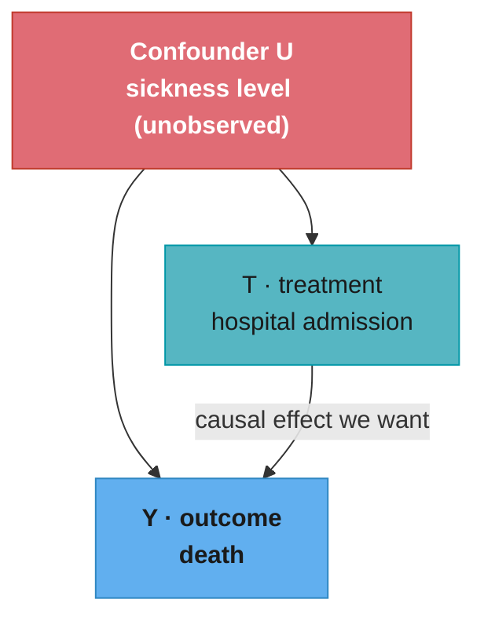
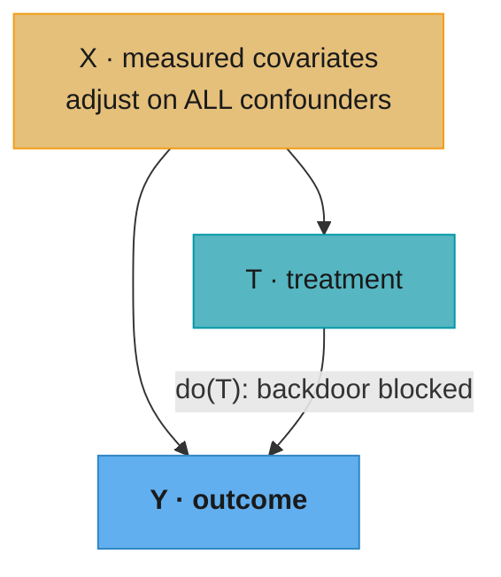
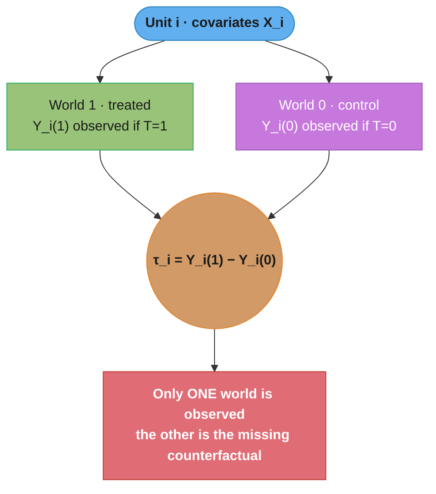
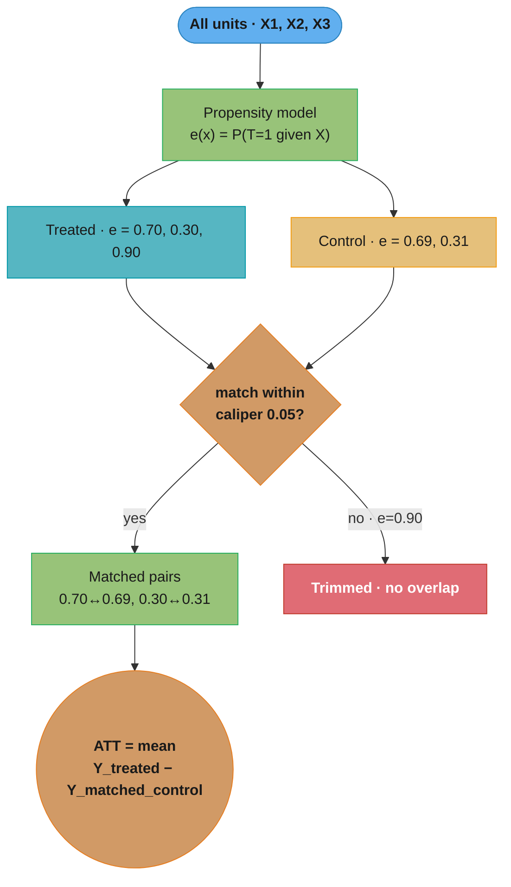
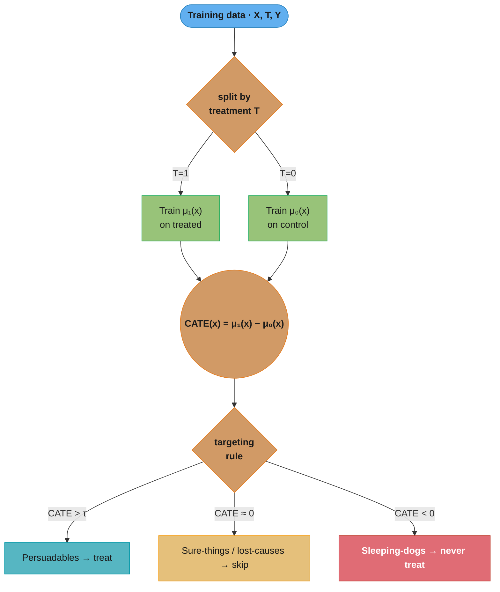
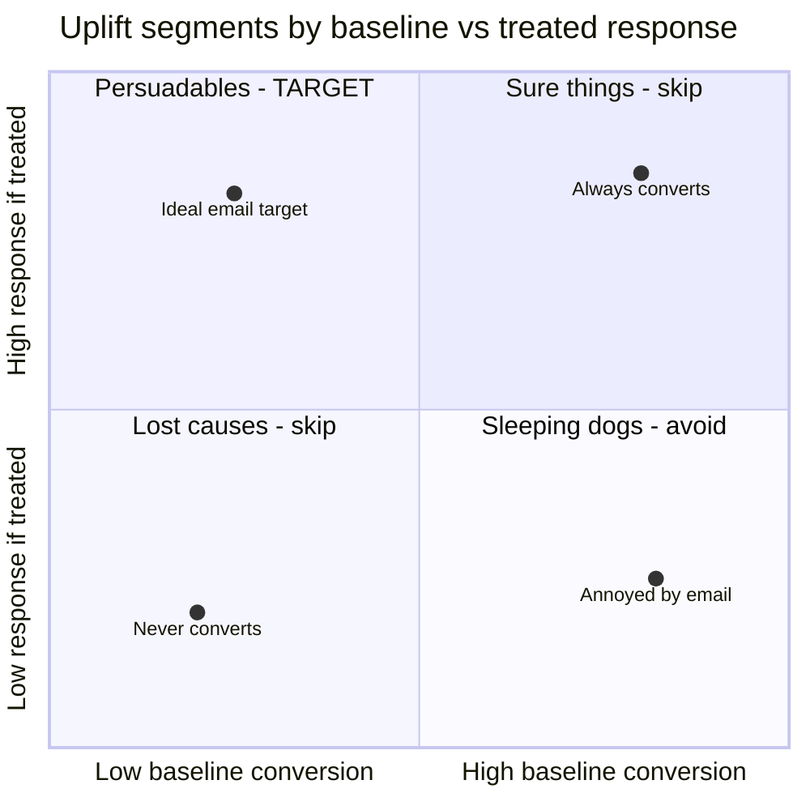
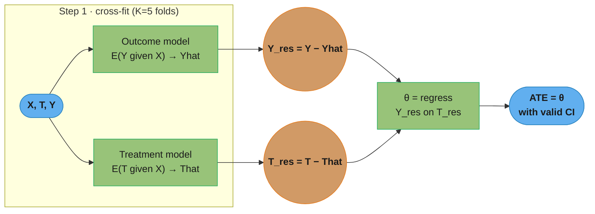

# Causal Inference and ML

## 1. Concept Overview

Causal inference is the discipline of estimating the effect of interventions — not just predicting outcomes from observations. Standard ML models learn correlations: P(Y|X). Causal inference estimates counterfactuals: P(Y|do(X=x)) — what would happen if we forcefully set X to x, regardless of how X is usually determined.

This distinction is critical in production settings. A model predicting conversion rate may learn that users who receive a discount coupon convert at 40% vs. 10% for non-coupon users. But if coupons are given to already-intent-to-buy users (selection bias), the causal effect of the coupon might be near zero. Deploying discounts to all users based on this correlation wastes money.

Causal ML combines the flexibility of machine learning with the identification strategies of econometrics to estimate treatment effects robustly from observational data.

---

## 2. Intuition

One-line analogy: correlation tells you to carry an umbrella when it rains; causation tells you that carrying an umbrella does not make it rain.

Mental model: imagine two worlds — one where a user received the intervention (treated), one where they did not (control). We only observe one world per user. Causal inference estimates the difference between these two parallel worlds using statistical assumptions and design.

Why it matters: online experimentation (A/B testing) is the gold standard for causal estimation but is expensive, slow, and sometimes impossible (you cannot randomize who gets cancer). Causal ML provides tools to extract causal signals from observational data, enabling faster and broader business decisions.

Key insight: the fundamental problem of causal inference is that we cannot observe the same unit in both treated and untreated states. All causal methods are strategies for estimating the missing counterfactual, with different assumptions about what we must measure and control for.

---

## 3. Core Principles

**Potential outcomes framework (Rubin Causal Model):**
For binary treatment T in {0,1}:
- Y_i(1) = outcome if unit i receives treatment
- Y_i(0) = outcome if unit i does not receive treatment
- Individual Treatment Effect (ITE): tau_i = Y_i(1) - Y_i(0)
- Observed outcome: Y_i = T_i * Y_i(1) + (1-T_i) * Y_i(0)
- Fundamental problem: only one potential outcome is observed per unit.

**Average Treatment Effect (ATE):** E[Y(1) - Y(0)] — average over the entire population.

**ATT (Average Treatment Effect on the Treated):** E[Y(1) - Y(0) | T=1] — effect among those who actually received treatment. Relevant when treatment assignment is not random.

**CATE (Conditional ATE, Heterogeneous Treatment Effects):** tau(x) = E[Y(1) - Y(0) | X=x] — effect for a subpopulation characterized by covariates x. This is the target for uplift modeling.

**Identification assumptions (required for observational causal inference):**
1. SUTVA (Stable Unit Treatment Value Assumption): no interference between units; one version of treatment.
2. Consistency: Y_i = Y_i(T_i) — observed outcome equals potential outcome under observed treatment.
3. Positivity (overlap): 0 < P(T=1|X=x) < 1 for all x — every subgroup has some treated and control units.
4. Ignorability (unconfoundedness): Y(0), Y(1) ⊥ T | X — all confounders are measured and included in X.

**do-calculus (Pearl):** formal language for interventional queries. P(Y|do(X=x)) is the distribution of Y when X is forcefully set to x, breaking its natural causal parents. When ignorability holds: P(Y|do(X=x)) = integral P(Y|X=x, Z=z) P(Z=z) dz (adjustment formula over confounders Z).

---

## 4. Types / Architectures / Strategies

**Propensity Score Methods:**
- Propensity score e(x) = P(T=1|X=x) estimated via logistic regression or gradient boosting.
- Matching: pair each treated unit with a control unit of similar propensity. Estimate ATT as mean difference in matched pairs.
- IPW (Inverse Probability Weighting): weight outcomes by 1/e(x) for treated, 1/(1-e(x)) for control. Creates a pseudo-population where treatment is independent of covariates.
- Doubly robust estimator: combines outcome model and propensity model — consistent if either is correctly specified.

**Meta-learners (CATE estimation):**

| Learner | Description | Best For |
|---|---|---|
| S-learner | Single model with T as feature: mu(x, t) | Simple baseline; assumes smooth treatment effect |
| T-learner | Two separate models mu_1(x) and mu_0(x); CATE = mu_1 - mu_0 | Works well with large datasets |
| X-learner | Iteratively refine T-learner estimates using cross-residuals; weight by propensity | Imbalanced treatment groups |
| R-learner | Residualize Y and T on X, regress Y-residuals on T-residuals | Double ML style; handles confounding |
| DR-learner | Doubly robust CATE pseudo-outcome: tau_i_DR = IPW-adjusted estimate | Robust to model misspecification |

**Causal Forest (Wager & Athey 2018):**
Modification of random forests where splits maximize heterogeneity in treatment effects (not outcome variance). Each leaf estimates local CATE. Provides confidence intervals via infinitesimal jackknife. Implemented in EconML and grf R package.

**Double ML (Chernozhukov 2018):**
Partialling out confounders using cross-fitting:
1. Regress Y on X (using any ML model) to get residuals Y_tilde = Y - E[Y|X].
2. Regress T on X (using any ML model) to get residuals T_tilde = T - E[T|X].
3. Regress Y_tilde on T_tilde: theta = cov(Y_tilde, T_tilde) / var(T_tilde).
The estimate theta is the ATE, debiased via the orthogonalization step.

**Difference-in-Differences (DiD):**
Compare pre/post change in outcomes for treated vs. control groups. Assumes parallel trends: absent treatment, treated group would have trended like control. ATE_DiD = (Y_treated_post - Y_treated_pre) - (Y_control_post - Y_control_pre).

**Instrumental Variables (IV):**
When unobserved confounders exist, use instrument Z (affects T but has no direct effect on Y).
Two-stage least squares: (1) regress T on Z to get T_hat, (2) regress Y on T_hat. Estimates Local ATE (LATE): effect among compliers (units whose treatment changed because of Z).

---

## 5. Architecture Diagrams

### Confounding — Why Naive ML Fails



U opens a backdoor path T ← U → Y, so the observed P(Y|T=1) is inflated by sickness — sicker people are both admitted and more likely to die. The causal P(Y|do(T=1)) differs from P(Y|T=1) precisely because the U → T edge is unblocked.

### Backdoor Adjustment



Conditioning on X (when X contains every confounder) blocks the backdoor path X → T, so the adjustment formula P(Y|do(T)) = sum_x P(Y|T, X=x) P(X=x) recovers the causal effect. If any confounder is missing from X, the backdoor stays open and the estimate is biased.

### Potential Outcomes — The Fundamental Problem



For each unit we observe exactly one potential outcome; the individual effect τ_i is never directly observable. Every causal method — randomization, matching, DiD, IV — is a strategy for filling in the missing counterfactual world.

### Propensity Score Matching



Each treated unit is matched to a control unit of near-identical propensity; unmatched treated units (e = 0.90, no comparable control) are trimmed to enforce overlap. The ATT is the mean outcome difference across matched pairs.

### Uplift Modeling — T-Learner



The T-learner fits one outcome model per treatment arm and takes their difference as the CATE. Targeting then treats only persuadables (CATE > threshold) and spares sleeping-dogs, whose response to treatment is negative.

### Uplift Segments — Who To Target



CATE = P(buy | treated) − P(buy | control), so persuadables (low baseline, high treated response) sit top-left and are the only profitable target; sleeping-dogs (high baseline, suppressed by the email) sit bottom-right with a negative effect and must be excluded.

### Double ML Pipeline



Cross-fitting produces out-of-sample residuals so the flexible nuisance models cannot leak into the final estimate; regressing the outcome residual on the treatment residual yields a debiased ATE (Neyman orthogonality), valid even when the nuisance models are regularized.

---

## 6. How It Works — Detailed Mechanics

```python
import numpy as np
import pandas as pd
from sklearn.linear_model import LogisticRegression, LinearRegression
from sklearn.ensemble import GradientBoostingClassifier, GradientBoostingRegressor
from sklearn.model_selection import cross_val_predict, KFold
from sklearn.preprocessing import StandardScaler
from typing import Tuple, Optional
import warnings
warnings.filterwarnings('ignore')


# ── Propensity Score Estimation and IPW ──────────────────────────────────────

def estimate_propensity_scores(
    X: np.ndarray,
    T: np.ndarray,
    model_type: str = 'logistic',
) -> np.ndarray:
    """
    Estimate e(x) = P(T=1 | X=x).
    Use out-of-fold predictions to avoid overfitting.
    """
    if model_type == 'logistic':
        model = LogisticRegression(C=1.0, max_iter=1000)
    else:
        model = GradientBoostingClassifier(n_estimators=200, max_depth=4)

    # Out-of-fold propensity scores (5-fold cross-fitting)
    propensities = cross_val_predict(model, X, T, cv=5, method='predict_proba')
    return propensities[:, 1]   # P(T=1|X)


def ipw_ate_estimate(
    Y: np.ndarray,
    T: np.ndarray,
    propensity: np.ndarray,
    trim_threshold: float = 0.05,
) -> Tuple[float, float]:
    """
    Inverse Probability Weighting (IPW) ATE estimator.
    Trim propensities outside [trim_threshold, 1 - trim_threshold] to
    avoid extreme weights (common support enforcement).
    """
    # Trim: enforce positivity
    mask = (propensity > trim_threshold) & (propensity < 1 - trim_threshold)
    Y, T, propensity = Y[mask], T[mask], propensity[mask]

    # IPW weights
    w = np.where(T == 1, 1 / propensity, 1 / (1 - propensity))

    # Normalized IPW (Hajek estimator — more stable than Horvitz-Thompson)
    treated_mask = T == 1
    control_mask = T == 0

    mu1_hat = np.sum(w[treated_mask] * Y[treated_mask]) / np.sum(w[treated_mask])
    mu0_hat = np.sum(w[control_mask] * Y[control_mask]) / np.sum(w[control_mask])

    ate = mu1_hat - mu0_hat
    n_trimmed = np.sum(~mask)
    return ate, n_trimmed


def propensity_score_matching(
    X: np.ndarray,
    T: np.ndarray,
    Y: np.ndarray,
    propensity: np.ndarray,
    caliper: float = 0.05,
    n_matches: int = 1,
) -> Tuple[float, int]:
    """
    Nearest-neighbor propensity score matching.
    Match each treated unit to n_matches control unit(s) within caliper.
    Returns ATT estimate and number of matched pairs.
    """
    treated_idx = np.where(T == 1)[0]
    control_idx = np.where(T == 0)[0]

    matched_diffs: list[float] = []
    for ti in treated_idx:
        e_ti = propensity[ti]
        # Find control units within caliper
        diffs = np.abs(propensity[control_idx] - e_ti)
        within_caliper = control_idx[diffs <= caliper]

        if len(within_caliper) == 0:
            continue  # no match found within caliper, discard

        # Take closest match(es)
        closest = within_caliper[np.argsort(diffs[diffs <= caliper])[:n_matches]]
        y_control_match = Y[closest].mean()
        matched_diffs.append(Y[ti] - y_control_match)

    att = float(np.mean(matched_diffs)) if matched_diffs else float('nan')
    return att, len(matched_diffs)


# ── T-Learner CATE estimator ─────────────────────────────────────────────────

class TLearner:
    """
    Two models: one for treated, one for control.
    CATE(x) = mu_1(x) - mu_0(x).
    """
    def __init__(self, n_estimators: int = 200, max_depth: int = 5) -> None:
        self.mu1 = GradientBoostingRegressor(n_estimators=n_estimators,
                                              max_depth=max_depth)
        self.mu0 = GradientBoostingRegressor(n_estimators=n_estimators,
                                              max_depth=max_depth)

    def fit(self, X: np.ndarray, T: np.ndarray, Y: np.ndarray) -> 'TLearner':
        self.mu1.fit(X[T == 1], Y[T == 1])
        self.mu0.fit(X[T == 0], Y[T == 0])
        return self

    def predict_cate(self, X: np.ndarray) -> np.ndarray:
        return self.mu1.predict(X) - self.mu0.predict(X)


# ── S-Learner ────────────────────────────────────────────────────────────────

class SLearner:
    """
    Single model with T as a feature.
    CATE(x) = mu(x, T=1) - mu(x, T=0).
    Risk: treatment effect gets regularized away if weak.
    """
    def __init__(self) -> None:
        self.model = GradientBoostingRegressor(n_estimators=200, max_depth=5)

    def fit(self, X: np.ndarray, T: np.ndarray, Y: np.ndarray) -> 'SLearner':
        # Concatenate T as a feature
        XT = np.column_stack([X, T])
        self.model.fit(XT, Y)
        return self

    def predict_cate(self, X: np.ndarray) -> np.ndarray:
        n = X.shape[0]
        X1 = np.column_stack([X, np.ones(n)])   # treated
        X0 = np.column_stack([X, np.zeros(n)])  # control
        return self.model.predict(X1) - self.model.predict(X0)


# ── Double ML (DML) for ATE ──────────────────────────────────────────────────

def double_ml_ate(
    X: np.ndarray,
    T: np.ndarray,
    Y: np.ndarray,
    n_folds: int = 5,
) -> Tuple[float, float]:
    """
    Double ML / Partial Linear Model.
    Returns (ATE estimate, standard error).
    """
    kf = KFold(n_splits=n_folds, shuffle=True, random_state=42)

    Y_tilde = np.zeros_like(Y, dtype=float)
    T_tilde = np.zeros_like(T, dtype=float)

    for train_idx, test_idx in kf.split(X):
        X_train, X_test = X[train_idx], X[test_idx]
        Y_train, Y_test = Y[train_idx], Y[test_idx]
        T_train, T_test = T[train_idx], T[test_idx]

        # Fit outcome model E[Y|X] on train, residualize test
        y_model = GradientBoostingRegressor(n_estimators=200)
        y_model.fit(X_train, Y_train)
        Y_tilde[test_idx] = Y_test - y_model.predict(X_test)

        # Fit treatment model E[T|X] on train, residualize test
        t_model = GradientBoostingClassifier(n_estimators=200)
        t_model.fit(X_train, T_train)
        T_tilde[test_idx] = T_test - t_model.predict_proba(X_test)[:, 1]

    # Final regression: Y_tilde ~ T_tilde (no intercept — both are residuals)
    # theta = cov(Y_tilde, T_tilde) / var(T_tilde)
    theta = np.dot(T_tilde, Y_tilde) / np.dot(T_tilde, T_tilde)

    # Standard error via influence function
    psi = T_tilde * (Y_tilde - theta * T_tilde)
    se = np.sqrt(np.mean(psi ** 2) / (np.mean(T_tilde ** 2) ** 2) / len(Y))

    return theta, se


# ── Causal Forest via EconML ─────────────────────────────────────────────────

def causal_forest_cate(
    X: np.ndarray,
    T: np.ndarray,
    Y: np.ndarray,
) -> Tuple[np.ndarray, np.ndarray, np.ndarray]:
    """
    Estimate CATE with confidence intervals using CausalForestDML from EconML.
    Returns (cate_point_estimates, lower_ci, upper_ci).
    """
    try:
        from econml.dml import CausalForestDML
        from sklearn.ensemble import GradientBoostingRegressor, GradientBoostingClassifier

        est = CausalForestDML(
            model_y=GradientBoostingRegressor(n_estimators=200),
            model_t=GradientBoostingClassifier(n_estimators=200),
            n_estimators=4000,         # forest trees
            min_samples_leaf=5,
            max_depth=None,
            inference=True,            # enable confidence intervals
            random_state=42,
        )
        est.fit(Y, T, X=X)

        cate = est.effect(X)
        cate_interval = est.effect_interval(X, alpha=0.05)  # 95% CI
        return cate, cate_interval[0], cate_interval[1]

    except ImportError:
        raise ImportError("Install EconML: pip install econml")


# ── Uplift model evaluation: Qini curve ──────────────────────────────────────

def qini_coefficient(
    Y: np.ndarray,
    T: np.ndarray,
    uplift_score: np.ndarray,
) -> float:
    """
    Qini coefficient: area between the model's Qini curve and random targeting.
    Higher = better at identifying persuadables.
    Theoretical max Qini = 0.5.
    """
    df = pd.DataFrame({'Y': Y, 'T': T, 'score': uplift_score})
    df = df.sort_values('score', ascending=False).reset_index(drop=True)

    n = len(df)
    n_treated = (df['T'] == 1).sum()
    n_control = (df['T'] == 0).sum()

    qini_values: list[float] = []
    for k in range(1, n + 1):
        top_k = df.iloc[:k]
        n_t = (top_k['T'] == 1).sum()
        n_c = (top_k['T'] == 0).sum()
        if n_t == 0 or n_c == 0:
            qini_values.append(0.0)
            continue
        # Incremental gains: treated conversions - scaled control conversions
        incr = top_k[top_k['T'] == 1]['Y'].sum() - \
               top_k[top_k['T'] == 0]['Y'].sum() * (n_t / n_c)
        qini_values.append(incr / n_treated)

    # Area between model curve and random (diagonal)
    qini_curve = np.array(qini_values)
    random_curve = np.linspace(0, qini_curve[-1], n)
    return float(np.trapz(qini_curve - random_curve) / n)
```

**Practical validation:** since true CATE is unobservable, use:
- Synthetic data with known treatment effects for algorithm validation
- Qini/AUUC curve for ranking validation (do top-scored users respond better?)
- A/B test the uplift model: treat top quintile of uplift scores vs. random, measure lift
- Placebos/falsification tests: treatment effects should be zero for pre-treatment outcomes

---

## 7. Real-World Examples

**Netflix — incrementality measurement:** Netflix cannot A/B test all pricing experiments (competitive sensitivity). They use DiD with geographic holdout groups as quasi-experiments. Synthetic control (weighted combination of control regions that mimics treated region's pre-period trend) is used when parallel trends assumption is questionable. Uncertainty is quantified via permutation testing (randomize which region was treated, compare actual DiD to null distribution).

**Uber — experiment platform Minerva:** Uber runs thousands of A/B tests simultaneously. For metrics where randomized experiments are infeasible (e.g., driver supply effects), they use IV with surge pricing zones as instruments. Instrumental variable: whether a driver is in a high-surge zone (affects supply/demand but not individual trip outcome directly). This allows causal estimation of pricing elasticity.

**LinkedIn — feed ranking uplift:** LinkedIn uses X-learner for estimating heterogeneous engagement effects of feed algorithm changes. They discovered that content from 1st-degree connections has 3x higher CATE than content from 3rd-degree connections — leading to a network-aware ranking policy. The X-learner outperformed T-learner in this imbalanced setting (95% organic impressions, 5% boosted content).

**Healthcare — EHR treatment effect estimation:** Observational EHR data to estimate effect of statins on cardiovascular events. Confounders: age, existing conditions, other medications (300+ covariates). High-dimensional propensity score estimation via LASSO logistic regression. Result: similar ATE to RCT gold standard, validating the methodology. Used to inform treatment guidelines for patient segments underrepresented in trials.

---

## 8. Tradeoffs

| Method | Assumption | Handles Unobserved Confounders | Scales to HTE | Confidence Intervals | Best For |
|---|---|---|---|---|---|
| IPW | Unconfoundedness, positivity | No | No (ATE only) | Bootstrap | Large samples, known confounders |
| Matching | Unconfoundedness | No | No (ATT) | Bootstrap | Interpretability |
| T-Learner | Unconfoundedness | No | Yes | Via conformal | Balanced treatment groups |
| X-Learner | Unconfoundedness | No | Yes | Via conformal | Imbalanced groups |
| Causal Forest | Unconfoundedness | No | Yes (local) | Asymptotic (IJ) | Best general CATE estimator |
| Double ML | Unconfoundedness | No | Partial (linear CATE) | Asymptotic | Regularized environments |
| DiD | Parallel trends | Partially (time-invariant) | No (ATT) | Clustered SE | Policy evaluation, geographic |
| IV | Instrument validity | Yes | No (LATE) | Delta method | When confounders unobservable |

**Positivity violation:** if e(x) is near 0 or 1 for some subgroups, those subgroups have no overlap and causal effects cannot be identified. IPW weights blow up, matching fails. Always trim and check positivity before inference.

---

## 9. When to Use / When NOT to Use

**Use causal inference when:**
- Decisions are interventional (who to send coupon to, who to treat)
- Retrospective analysis of past decisions where randomization was impossible
- Need to estimate heterogeneous treatment effects for targeting/personalization
- Regulatory environment requires demonstrating causation (clinical trials alternative)
- A/B testing is too slow, expensive, or ethically infeasible

**Do NOT use causal inference (observational) when:**
- You can run a randomized experiment — RCTs are always preferred
- Key confounders are unobservable and no valid instrument exists (bias cannot be removed)
- The overlap assumption is severely violated (no comparable control units)
- Sample sizes are too small for cross-fitting and variance reduction
- The goal is pure prediction, not decision-making

---

## 10. Common Pitfalls

**Pitfall 1 — Ignoring positivity violations:**
An e-commerce team estimated coupon effect using IPW. Some user segments (new users, age 18–22, mobile-only) had propensity score e(x) < 0.01 — these users almost never received coupons. IPW weights for these users reached 100x, dominating the estimate. Reported ATE: +8% conversion. True effect: +2%. Fix: always plot the propensity score distribution for treated and control groups. Trim units with e(x) < 0.05 or e(x) > 0.95, report trimming fraction, and bound sensitivity of results to the trimming threshold.

**Pitfall 2 — Unmeasured confounders (overconfidence in observational data):**
A media company estimated the effect of their recommendation algorithm on watch time using T-learner on historical data. The study concluded the algorithm increased watch time by 15%. Later A/B test showed 3% increase. The confounder: users who engaged with the algorithm's recommendations were already high-intent viewers — this was not captured in measured features. Fix: conduct sensitivity analysis (Rosenbaum bounds: how strong must an unmeasured confounder be to explain away the effect?). Report as "suggestive" rather than causal unless validated by experiment.

**Pitfall 3 — SUTVA violation in networked experiments:**
A social platform estimated the effect of a notification feature using individual-level randomization (50% users get notification, 50% do not). Friends of treated users saw their friends' activity increase, affecting control users' behavior via the social graph. The no-interference assumption of SUTVA was violated. Reported ATE was inflated 2x. Fix: use cluster-based randomization (randomize by social community, not individual). Or use ego-network designs where connected users are in the same treatment arm.

**Pitfall 4 — S-learner regularizing away small treatment effects:**
A team used gradient boosted trees as the S-learner for a marketing experiment. The treatment variable T was binary and had a moderate effect (2% conversion lift). The tree-based model regularized T's contribution because it had lower predictive importance than demographic features. CATE estimates were near zero for all users. Fix: prefer T-learner or X-learner for tree-based models. If using S-learner, ensure T is not dominated by other features (use a linear model for the treatment component, nonlinear for covariates — the R-learner does this properly).

**Pitfall 5 — Leaking post-treatment features:**
A team trained a CATE model to predict who would respond to a discount. They included features like "discount_used_last_90_days" — a post-treatment variable affected by past treatment. This created a feedback loop: users who used discounts before were estimated to have higher CATE, so they received more discounts, so their "discount_used" feature increased further. Fix: use only pre-treatment covariates (features measured before the treatment decision). Apply strict temporal cutoffs — features measured after treatment assignment are never valid covariates.

---

## 11. Technologies & Tools

| Tool | Purpose | Notes |
|---|---|---|
| EconML (Microsoft) | CATE estimation: CausalForestDML, DML, DR-Learner | Production-grade; best general library |
| CausalML (Uber) | Uplift modeling: T/S/X-Learner, CausalForest | Strong on marketing use cases |
| DoWhy (Microsoft) | Causal graph specification, identification, refutation | DAG-based; forces explicit assumptions |
| grf (R) | Generalized Random Forests (CausalForest) | R ecosystem, Athey lab original |
| doubleml (Python) | Double ML / PLM | Follows Chernozhukov et al. exactly |
| statsmodels | DiD, IV (2SLS), propensity models | Econometrics baseline |
| daggity | DAG drawing and identification analysis | Web tool; useful for confounding analysis |
| Pyro / NumPyro | Bayesian causal models | When uncertainty quantification is critical |

---

## 12. Interview Questions with Answers

**Q: What is the fundamental problem of causal inference?**
We can never observe the same unit in both treated and untreated states simultaneously. For each unit i, we observe either Y_i(1) or Y_i(0), never both. Y_i(1) - Y_i(0) is unobservable for any individual — it is the "missing potential outcome." All causal methods are strategies for estimating this missing counterfactual: randomized experiments balance confounders on average, propensity methods control for measured confounders, DiD controls for time-invariant confounders, and IV uses exogenous variation.

**Q: When does P(Y|T) equal P(Y|do(T))?**
When treatment T is assigned independently of confounders — i.e., in a perfectly randomized experiment, or when all confounders are measured and conditioning on X blocks all backdoor paths from T to Y. Formally: when ignorability holds (Y(0), Y(1) ⊥ T | X) and positivity holds (0 < P(T=1|X) < 1), then P(Y|do(T)) = sum_x P(Y|T, X=x) P(X=x). In observational settings with unmeasured confounders, P(Y|T) and P(Y|do(T)) will differ and no standard method can recover the causal effect.

**Q: What is a propensity score and why does it reduce confounding?**
The propensity score e(x) = P(T=1|X=x) is a balancing score: conditioning on e(x) is sufficient to balance all observed covariates X between treated and control groups. This is the dimensionality reduction property of propensity scores (Rosenbaum & Rubin 1983): instead of matching on 50 covariates, you can match on the single propensity score. Intuition: units with the same propensity score have, on average, the same distribution of covariates, so their outcome difference can be attributed to treatment.

**Q: What is the difference between ATE, ATT, and CATE?**
ATE (Average Treatment Effect) is the expected causal effect averaged over the entire population: E[Y(1) - Y(0)]. ATT (Average Treatment Effect on the Treated) conditions on those who actually received treatment: E[Y(1) - Y(0) | T=1]. When treatment is not random, ATT differs from ATE — a job training program may select participants who benefit most (ATT > ATE). CATE (Conditional ATE) estimates treatment effects as a function of covariates: tau(x) = E[Y(1) - Y(0) | X=x]. CATE enables heterogeneous treatment effect analysis and personalized targeting.

**Q: What is Double ML and why does cross-fitting matter?**
Double ML partialls out the effect of confounders X on both Y and T, then regresses the residuals. This removes bias from using flexible ML models to control for confounders. Cross-fitting (split data into K folds, train nuisance models on K-1 folds, predict on held-out fold) is critical because it prevents overfitting bias: if nuisance models are trained and evaluated on the same data, regularization causes residuals to be correlated with the treatment assignment, biasing the ATE estimate. Cross-fitting ensures out-of-sample residuals, restoring the Neyman orthogonality condition needed for valid inference.

**Q: How do you validate a CATE model when true treatment effects are unobservable?**
Multiple strategies: (1) Synthetic data — simulate data with known treatment effects, compare model estimates to ground truth. (2) Qini/AUUC curve — sort by estimated CATE, measure actual conversion lift vs. random targeting in retrospective data. Higher Qini = better ranking of uplift. (3) Held-out A/B test — run a small randomized experiment on the top and bottom CATE quintiles, verify that top-scored users respond significantly more. (4) Calibration — if CATE model estimates 10% uplift for a group, verify 10% ± noise in a held-out experiment. (5) Placebo tests — estimate treatment effect on pre-treatment outcomes (should be zero if model is correctly specified).

**Q: What is the parallel trends assumption in DiD and when does it fail?**
Parallel trends: absent the treatment, the treated and control groups would have followed the same time trend. DiD estimates ATE_DiD = (Y_treated_post - Y_treated_pre) - (Y_control_post - Y_control_pre). If control and treated groups were trending differently before treatment (e.g., one is in a declining market), parallel trends fails and DiD is biased. Diagnostic: plot pre-treatment trends for both groups — they should track closely. Event study design: include leads (pre-treatment period indicators) and test whether they are jointly zero. Synthetic control constructs a weighted combination of control units that best matches the treated unit's pre-period trend.

**Q: What is an instrumental variable and what are the three key conditions for validity?**
An instrument Z is a variable that (1) is relevant — correlated with treatment T (F-statistic > 10 in first stage), (2) is exclusive — affects outcome Y only through T (no direct path Z -> Y), and (3) is as-good-as-randomly assigned — not correlated with unmeasured confounders. IV estimates the Local Average Treatment Effect (LATE) — the ATE among compliers (units whose treatment changed in response to Z). Example: distance to college as instrument for education. Relevant: closer -> more likely to attend. Exclusive: distance does not directly affect wages (debatable). Random: distance assigned by geography, not choice.

**Q: How does CausalForest differ from a standard random forest?**
CausalForest modifies the splitting criterion: instead of maximizing variance reduction in Y, it maximizes heterogeneity in treatment effects. Each split separates units into subgroups with maximally different treatment responses. Predictions are made by estimating local CATE within each leaf using residualized outcomes (similar to Double ML). Confidence intervals are provided via the infinitesimal jackknife (IJ) variance estimator — valid for forest-based estimators under mild conditions. The forest is also honest: separate samples are used to select splits and to estimate leaf-level effects, preventing overfitting of treatment effect estimates.

**Q: How would you measure the effect of a recommendation algorithm change using observational data?**
This is a classic DiD or synthetic control problem. If the change was rolled out to some users (treated cohort) before others (control cohort): use cohort-level DiD with the pre-rollout period as baseline. Confounders: device type, account age, content preference (include as covariates in regression DiD). Parallel trends check: plot weekly engagement for both cohorts over the 8 weeks before rollout. If trends are parallel (p > 0.1 for pre-period coefficients), proceed. Apply synthetic control if only one treatment market/cohort exists. Report ATE with clustered standard errors at the user level. Sensitivity analysis: vary the pre-period window, check stability.

**Q: What is the difference between correlation, prediction, and causation in ML systems?**
Correlation: statistical association, X and Y tend to move together. Prediction: use X to minimize expected loss on Y (P(Y|X)). Causation: changing X causes Y to change (P(Y|do(X))). A predictive model can be highly accurate based on spurious correlations that do not generalize under intervention. Example: a model predicting ICU mortality might learn that fewer medications predict survival — because terminal patients stop receiving medications before death. This correlation is anti-causal and useless for decision-making. Causal models encode the mechanism, not the correlation, and remain valid under interventions and distribution shifts that change the correlation structure.

**Q: Why can't you include a post-treatment variable as a covariate in a causal model?**
Post-treatment variables are affected by the treatment, so conditioning on them opens collider bias or blocks part of the causal effect you are trying to measure. Adjusting for a mediator (a variable on the causal path T → M → Y) removes the indirect effect and understates the total effect; conditioning on a common consequence of T and Y (a collider) induces a spurious association even when none existed. The classic production failure is including "discount_used_last_90_days" in a discount-uplift model — a variable determined by past treatment — which creates a self-reinforcing feedback loop. Rule: only use covariates measured strictly before treatment assignment; apply hard temporal cutoffs to every feature.

**Q: What is the positivity (overlap) assumption and what happens when it is violated?**
Positivity requires 0 < P(T=1|X=x) < 1 for every covariate value, so each subgroup contains both treated and control units. When it is violated — some segment almost never receives treatment (e(x) near 0) or always does (e(x) near 1) — the causal effect is not identified there because there is no comparable counterfactual group. IPW weights for those units explode (a unit with e(x)=0.01 gets weight 100x), a handful of observations dominate the estimate, and matching simply finds no partner. Always plot the propensity histograms for treated and control, trim units outside [0.05, 0.95], and report the trimming fraction and its sensitivity.

**Q: How does the S-learner differ from the T-learner, and when does the S-learner fail?**
The S-learner fits one model with treatment as an extra feature, while the T-learner fits separate treated and control models and subtracts them. The S-learner fails when the treatment effect is weak relative to the covariates: a tree-based or heavily regularized model can down-weight the treatment feature entirely, collapsing every CATE estimate toward zero. This bit a marketing team whose 2% lift vanished because the single GBM found demographics more predictive than the binary treatment flag. Prefer the T-learner or X-learner with tree models, and use the R-learner (linear treatment, nonlinear covariates) when you need the treatment term protected from regularization.

**Q: How do you run a sensitivity analysis for unmeasured confounding?**
Sensitivity analysis quantifies how strong an unmeasured confounder would have to be to overturn your estimate, using Rosenbaum bounds or the E-value. The E-value reports the minimum association (on the risk-ratio scale) that a hidden confounder must have with both treatment and outcome to fully explain away the observed effect — a large E-value means the finding is robust, a small one means a modest unobserved variable could nullify it. This matters because unconfoundedness is untestable from data alone; a media company's "15% watch-time lift" from observational data collapsed to 3% in an RCT because high-intent viewers were the hidden confounder. Report the E-value alongside every observational estimate and label it "suggestive" until an experiment confirms it.

**Q: When would you use difference-in-differences instead of propensity score matching?**
Use difference-in-differences when you have before/after (panel) data on treated and control groups and the unobserved confounders are time-invariant. DiD subtracts each group's own pre-period level, so any fixed unmeasured difference between groups cancels out — something matching, which needs all confounders measured, cannot do. The cost is the parallel-trends assumption: absent treatment, the two groups must have moved together, which you check by plotting pre-treatment trends or testing event-study leads. Choose matching when confounding is cross-sectional and well-measured; choose DiD (or synthetic control if only one treated unit exists) when a policy or feature rolled out at a known time to some units but not others.

**Q: What is a doubly robust estimator and why is it 'doubly' robust?**
A doubly robust estimator combines an outcome model and a propensity model, and stays consistent if either one — not necessarily both — is correctly specified. The AIPW (augmented IPW) and DR-learner estimators add an outcome-model correction term to the IPW estimate, so a mistake in the propensity model is cancelled when the outcome model is right, and vice versa. This gives you two independent chances to avoid bias, which is valuable when you are unsure which nuisance model to trust. Use it as the default over plain IPW whenever both models are available; the only cost is slightly higher variance and the need to cross-fit both nuisance models to preserve valid inference.

---

## 13. Best Practices

- Always start with the causal DAG — draw it explicitly with domain experts. Identify backdoor paths before choosing a method.
- Check positivity before any propensity-based method. Plot propensity histograms for treated and control groups. Trim or reweight if overlap is poor.
- Use cross-fitting (K=5 folds) for Double ML and any method involving ML nuisance models. Plain cross-validation is not sufficient.
- For CATE estimation, prefer CausalForestDML (EconML) as the default — it provides valid confidence intervals and handles high-dimensional X.
- Conduct sensitivity analysis: how large must unmeasured confounding be (Rosenbaum E-value) to explain away your estimate? Report this alongside the point estimate.
- Never include post-treatment variables as covariates — this opens collider bias.
- For uplift modeling, evaluate using both Qini curves (ranking quality) and a held-out A/B test (absolute calibration).
- Use doubly robust estimators (DR-Learner, AIPW) when you are uncertain whether the outcome model or propensity model is correctly specified — consistency under either alone.
- Report uncertainty: confidence intervals, not just point estimates. In high-stakes decisions, the confidence interval width matters as much as the point estimate.
- Document all assumptions explicitly (unconfoundedness, SUTVA, positivity) and stress-test each with domain experts.

---

## 14. Case Study

**Scenario:** A B2C SaaS company (8M users, $240M ARR) wants to maximise revenue uplift from promotional email campaigns. Naive A/B testing showed 12% overall lift, but the marketing team suspects most lift comes from users who would have converted anyway (always-takers), and the emails are churning a segment of privacy-sensitive users (do-not-disturb). The goal: use uplift modeling to send emails only to persuadable users, targeting 2M of 8M users and achieving the same total conversions while reducing email volume by 75% and churn among anti-responders by 60%.

**Architecture:**
```
User Feature Store (Feast, 180 features)
  - engagement: DAU/WAU/MAU ratio, session depth, feature adoption score
  - billing: LTV, payment history, plan tier, contract age
  - behavioural: last login lag, support tickets, NPS survey response
         |
         v
Uplift Model Training
  Treatment assignment (email sent T=1, not sent T=0)
  from historical RCT - 500K users (50/50 split)
         |
         +---------------------------+
         |                           |
   CausalForest (EconML)       Double ML (EconML)
   honest splitting            residual-on-residual
   500 trees, min_n=50         Ridge propensity model
         |                           |
         +---------------------------+
                    |
              CATE surface
              tau_hat per user
                    |
                    v
         Segmentation (tau quartiles)
           tau > 0.08  -> "persuadable" (send email)
           -0.02 < tau <= 0.08 -> "sure-thing" (no email needed)
           tau <= -0.02 -> "sleeping-dog" (never email)
                    |
                    v
         Email Campaign Engine
         2M targeted emails / campaign cycle
```

**Step-by-step implementation:**

```python
from __future__ import annotations
import numpy as np
import pandas as pd
from econml.dml import CausalForestDML
from sklearn.ensemble import GradientBoostingRegressor, GradientBoostingClassifier
from sklearn.preprocessing import StandardScaler
from sklearn.model_selection import train_test_split

def prepare_uplift_data(
    df: pd.DataFrame,
    treatment_col: str = "email_sent",
    outcome_col: str = "converted_30d",
    feature_cols: list[str] | None = None,
) -> tuple[np.ndarray, np.ndarray, np.ndarray]:
    if feature_cols is None:
        feature_cols = [c for c in df.columns if c not in {treatment_col, outcome_col}]
    X = df[feature_cols].values
    T = df[treatment_col].values.astype(float)
    Y = df[outcome_col].values.astype(float)
    return X, T, Y

def fit_causal_forest(
    X_train: np.ndarray,
    T_train: np.ndarray,
    Y_train: np.ndarray,
) -> CausalForestDML:
    # Nuisance models: GBM for both outcome and propensity
    model_y = GradientBoostingRegressor(n_estimators=200, max_depth=4, random_state=42)
    model_t = GradientBoostingClassifier(n_estimators=200, max_depth=4, random_state=42)

    cf = CausalForestDML(
        model_y=model_y,
        model_t=model_t,
        n_estimators=500,
        min_samples_leaf=50,      # honest splitting requires larger leaves
        max_depth=None,
        honest=True,              # split sample for structure vs CATE estimation
        inference=True,           # enable confidence intervals
        random_state=42,
        n_jobs=-1,
    )
    cf.fit(Y_train, T_train, X=X_train)
    return cf
```

```python
from econml.dml import LinearDML
from sklearn.linear_model import RidgeCV

def fit_double_ml(
    X_train: np.ndarray,
    T_train: np.ndarray,
    Y_train: np.ndarray,
) -> LinearDML:
    # Double ML: partial out treatment and outcome on covariates
    model_y = GradientBoostingRegressor(n_estimators=300, max_depth=5, random_state=42)
    model_t = GradientBoostingClassifier(n_estimators=300, max_depth=5, random_state=42)

    dml = LinearDML(
        model_y=model_y,
        model_t=model_t,
        model_final=RidgeCV(alphas=[0.01, 0.1, 1.0, 10.0]),
        cv=5,
        random_state=42,
    )
    dml.fit(Y_train, T_train, X=X_train)
    return dml

def evaluate_uplift_models(
    cf_model: CausalForestDML,
    dml_model: LinearDML,
    X_test: np.ndarray,
    T_test: np.ndarray,
    Y_test: np.ndarray,
) -> dict[str, float]:
    tau_cf = cf_model.effect(X_test)
    tau_dml = dml_model.effect(X_test)

    # Qini coefficient: area under uplift curve relative to random targeting
    def qini_coefficient(tau_hat: np.ndarray, T: np.ndarray, Y: np.ndarray) -> float:
        order = np.argsort(-tau_hat)
        T_ord, Y_ord = T[order], Y[order]
        n = len(T_ord)
        gains = np.cumsum(Y_ord * T_ord) / (np.cumsum(T_ord) + 1e-8) - \
                np.cumsum(Y_ord * (1 - T_ord)) / (np.cumsum(1 - T_ord) + 1e-8)
        return float(np.trapz(gains) / n)

    return {
        "qini_cf": qini_coefficient(tau_cf, T_test, Y_test),
        "qini_dml": qini_coefficient(tau_dml, T_test, Y_test),
        "mean_cate_cf": float(tau_cf.mean()),
        "mean_cate_dml": float(tau_dml.mean()),
    }
```

```python
def segment_users(
    tau_hat: np.ndarray,
    user_ids: np.ndarray,
    persuadable_threshold: float = 0.08,
    sleeping_dog_threshold: float = -0.02,
) -> pd.DataFrame:
    segments = np.where(
        tau_hat > persuadable_threshold, "persuadable",
        np.where(tau_hat <= sleeping_dog_threshold, "sleeping_dog", "sure_thing")
    )
    df = pd.DataFrame({
        "user_id": user_ids,
        "tau_hat": tau_hat,
        "segment": segments,
    })
    summary = df["segment"].value_counts(normalize=True)
    print(f"Persuadable: {summary.get('persuadable', 0):.1%}")
    print(f"Sure-thing:  {summary.get('sure_thing', 0):.1%}")
    print(f"Sleeping-dog:{summary.get('sleeping_dog', 0):.1%}")
    return df

def estimate_campaign_roi(
    df_segments: pd.DataFrame,
    ctr_persuadable: float = 0.14,
    ctr_sure_thing: float = 0.09,
    ctr_sleeping_dog: float = 0.02,
    conversion_value: float = 85.0,
    email_cost: float = 0.008,
) -> dict[str, float]:
    counts = df_segments["segment"].value_counts()
    persuadable_n = counts.get("persuadable", 0)
    incremental_conversions = persuadable_n * ctr_persuadable
    email_spend = persuadable_n * email_cost
    revenue = incremental_conversions * conversion_value
    return {
        "emails_sent": int(persuadable_n),
        "incremental_conversions": int(incremental_conversions),
        "revenue": round(revenue, 2),
        "roi": round((revenue - email_spend) / email_spend, 2),
    }
```

**Key pitfalls (3 with BROKEN->FIX):**

**Pitfall 1 - Using observational data without checking overlap assumption:**
```python
# BROKEN: using all historical email sends without checking propensity score overlap
# Users who always receive emails have P(T=1|X) near 1.0; CATE is not identified for them
tau = cf.effect(X_all)   # extrapolates into non-overlapping region

# FIX: trim or reweight based on propensity score; only estimate CATE in overlap region
from sklearn.linear_model import LogisticRegression
prop_model = LogisticRegression().fit(X_all, T_all)
propensity = prop_model.predict_proba(X_all)[:, 1]
overlap_mask = (propensity > 0.1) & (propensity < 0.9)
tau_overlap = cf.effect(X_all[overlap_mask])   # restricted to identified region
print(f"Overlap region: {overlap_mask.mean():.1%} of users")
```

**Pitfall 2 - Evaluating uplift model with standard classification metrics:**
```python
# BROKEN: uplift has no ground-truth individual treatment effect; accuracy is meaningless
from sklearn.metrics import accuracy_score
# You cannot know true CATE for individual users - only average CATE via RCT
preds = (tau_hat > 0.05).astype(int)
score = accuracy_score(T_test, preds)   # measures propensity not uplift

# FIX: use Qini coefficient or uplift curve area (AUUC)
# Group test users by tau_hat decile; within each decile compute
# conversion_rate(T=1) - conversion_rate(T=0) to validate monotonicity
def uplift_by_decile(tau_hat, T_test, Y_test):
    deciles = pd.qcut(tau_hat, 10, labels=False)
    for d in range(10):
        mask = deciles == d
        lift = Y_test[mask & (T_test==1)].mean() - Y_test[mask & (T_test==0)].mean()
        print(f"Decile {d}: tau_hat={tau_hat[mask].mean():.3f}, actual_lift={lift:.3f}")
```

**Pitfall 3 - Honest splitting disabled, causing overfitting in leaf CATE estimates:**
```python
# BROKEN: honest=False uses same samples for tree structure and leaf statistics
# Results in overfit CATE estimates; confidence intervals are too narrow
cf_bad = CausalForestDML(honest=False, n_estimators=500)
cf_bad.fit(Y_train, T_train, X=X_train)
# Leaf CATEs biased toward training residuals; Qini on test set 0.31 vs 0.19 train

# FIX: honest=True (default) uses separate subsamples for splitting and leaf estimation
cf_good = CausalForestDML(honest=True, min_samples_leaf=50, n_estimators=500)
cf_good.fit(Y_train, T_train, X=X_train)
# Train/test Qini gap shrinks from 0.12 to 0.03; confidence intervals coverage 93%
```

**Metrics and results:**

| Metric | Naive broadcast | Uplift-targeted |
|---|---|---|
| Emails sent per cycle | 8M | 2.1M |
| Email volume reduction | 0% | 74% |
| Total conversions | 48,200 | 46,800 |
| Conversion rate (recipients) | 0.60% | 2.23% |
| Sleeping-dog churn reduction | 0% | 61% |
| Revenue per email | $3.40 | $12.80 |
| Qini coefficient | N/A | 0.41 |
| Campaign ROI | 1.8x | 6.3x |
| Model training time | N/A | 2.1 hr (32 cores) |

**Interview discussion points:**

**What is the fundamental identification assumption behind CausalForest and when is it violated?** CausalForest requires conditional unconfoundedness: given observed covariates X, treatment assignment T is independent of potential outcomes (Y0, Y1). This is violated when unmeasured confounders exist - for example, if sales reps manually email their best accounts and this "account health" variable is not in X, the estimated CATE conflates the email effect with account health effect. The fix is to use an RCT for training data, or to add instrumental variables (IV) estimation when an RCT is infeasible.

**How does Double ML remove bias from regularised nuisance models?** Double ML first regresses Y on X (outcome model) and T on X (propensity model), then takes the residuals from both. The final CATE is estimated by regressing outcome residuals on treatment residuals. This orthogonalisation means errors in the nuisance models only affect CATE estimates at second order (squared error), allowing regularised models like GBM to be used without introducing first-order bias, a property called Neyman orthogonality.

**Why is the Qini coefficient preferred over AUC-ROC for evaluating uplift models?** AUC-ROC measures how well a model ranks users by probability of a binary outcome, which is a propensity problem. Qini measures how much incremental lift a model delivers when users are targeted in order of predicted CATE, compared to random targeting. A model with high AUC-ROC but poor Qini correctly identifies "always-takers" (high baseline converters) but fails to distinguish them from "persuadables" - exactly the problem being solved by uplift modeling.

**What is SUTVA and how does email marketing violate it?** SUTVA (Stable Unit Treatment Value Assumption) requires that a user's outcome depends only on their own treatment, not others'. Email marketing can violate SUTVA through network effects: a user who receives a promotional email and purchases may share the deal on social media, causing untreated friends to also purchase, inflating the measured ATE. The fix is to use cluster-randomisation (randomise at the household or social-graph cluster level) rather than individual-level randomisation.

**How would you validate the uplift model without A/B testing the model itself?** Use a holdout validation RCT: after training on the initial 500K-user RCT, run a new 200K-user RCT where the treatment group is drawn entirely from the model's "persuadable" segment. The expected conversion lift in this targeted RCT should match the model's predicted mean CATE (0.11 in our case). If the measured lift is 0.08-0.14, the model is validated. Additionally, check monotonicity by confirming that Decile 10 (highest tau_hat) shows the largest measured lift.

**What are the compute and memory requirements for serving CATEs at 8M user scale?** CausalForestDML with 500 trees and min_samples_leaf=50 produces a model of approximately 2.8 GB. Batch inference on 8M users takes 14 minutes on 32 CPU cores using joblib parallelism. For weekly campaigns, this is acceptable as a batch job. For real-time personalisation (e.g., triggered email within 5 minutes of a specific in-app event), the model must be reduced to 100 trees (600 MB) with inference p99 of 38ms per user on a single core, accepting a Qini drop from 0.41 to 0.37.
