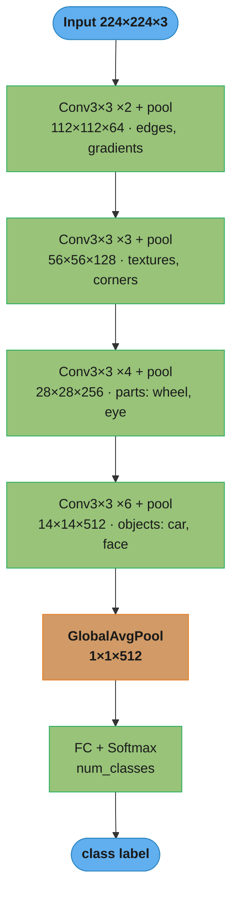
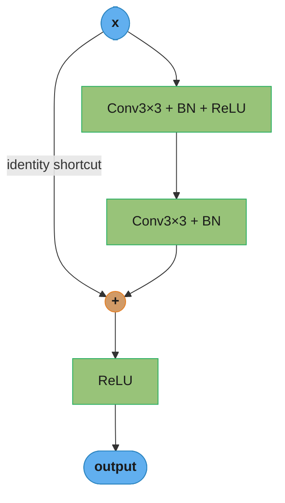
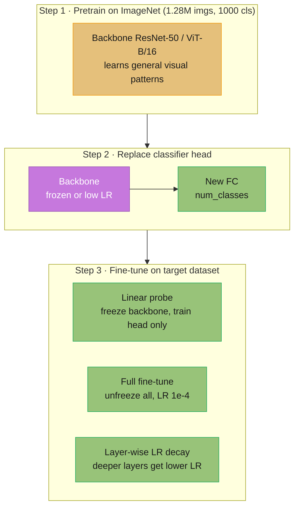
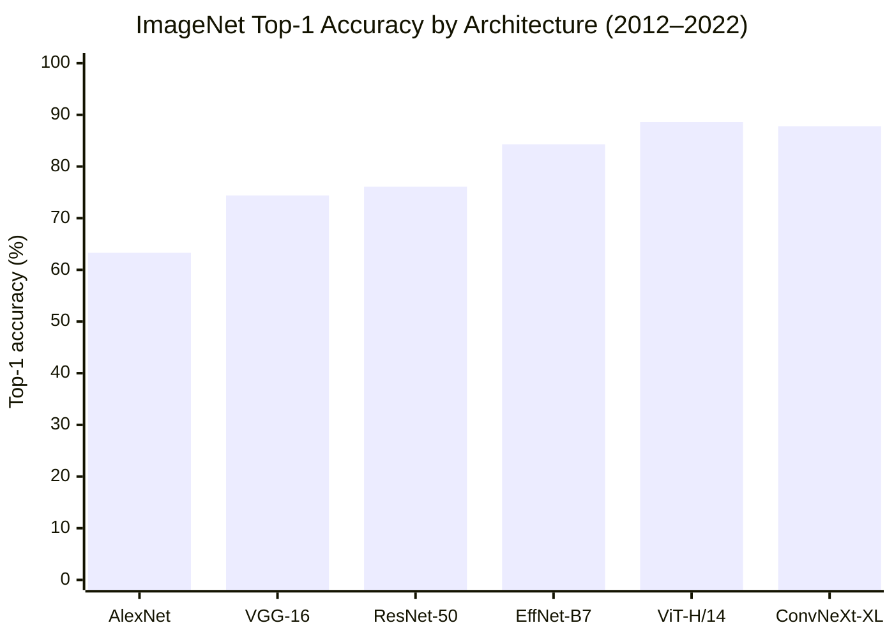
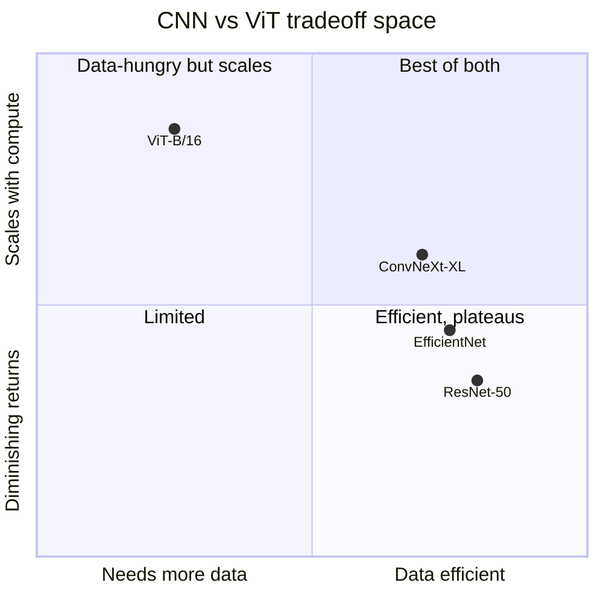

# Computer Vision

## Deep Dive Files

| File | Topic | Q&As |
|------|-------|------|
| [object_detection.md](object_detection.md) | Two-stage, one-stage, anchor-free detectors; mAP; NMS | 15+ |
| [image_segmentation.md](image_segmentation.md) | Semantic, instance, panoptic; U-Net; SAM; Dice loss | 15+ |
| [vision_transformers.md](vision_transformers.md) | ViT, DeiT, Swin, CLIP; patch embeddings; attention | 15+ |
| [self_supervised_vision.md](self_supervised_vision.md) | SimCLR, MoCo, DINO, MAE, BYOL; linear probing | 15+ |

---

## 1. Concept Overview

Computer Vision (CV) is the field of enabling machines to interpret and understand visual information from images and video. It encompasses a hierarchy of tasks: image classification assigns a label to an entire image; object detection localizes and labels multiple objects within it; segmentation partitions every pixel into semantic or instance categories; and generative modeling synthesizes realistic imagery.

Modern CV is almost entirely driven by deep convolutional neural networks (CNNs) and, increasingly, vision transformers (ViTs). The ImageNet Large Scale Visual Recognition Challenge (ILSVRC) catalyzed the field: AlexNet (2012) dropped top-5 error from ~26% to 15%, ResNet (2015) reached superhuman classification accuracy, and ViT (2020) demonstrated that pure self-attention scales better than convolutions given enough data.

---

## 2. Intuition

Think of a CNN as a hierarchy of increasingly abstract feature detectors: the first layers detect edges and textures; middle layers detect parts (wheels, eyes, windows); deeper layers detect whole objects. A vision transformer instead treats an image as a sequence of non-overlapping patches and lets every patch attend to every other patch, learning global context from the first layer.

The core mental model:
- **Why it matters**: autonomous vehicles, medical imaging, industrial inspection, content moderation, and AR/VR all require pixel-level understanding.
- **Key insight**: pretraining on a large labeled dataset (ImageNet, ~1.28M images, 1000 classes) and then fine-tuning on a smaller target dataset transfers general visual representations cheaply — this is transfer learning and it is the default starting point for any CV project.

---

## 3. Core Principles

**Spatial hierarchy**: convolutions with small kernels (3x3) stacked with pooling layers build increasingly large receptive fields, allowing the network to detect patterns at multiple scales.

**Translation equivariance**: convolutional filters slide across the spatial dimensions, so the same feature detector fires regardless of where an object appears — a property CNNs get for free but ViTs must learn from data.

**Normalization**: batch normalization (2015) made training deep networks stable by normalizing intermediate activations. Layer normalization is preferred in transformers.

**Residual connections**: skip connections (ResNet, 2015) allow gradients to flow directly through identity mappings, enabling networks of 50–152+ layers without vanishing gradients.

**Data augmentation**: artificially expanding the training distribution via random crops, flips, color jitter, and mixup reduces overfitting. Standard augmentation pipelines (RandAugment, TrivialAugmentWide) can close the gap between small and large datasets.

**Transfer learning**: pretrain on large labeled corpus → fine-tune on target task. Freezing early layers and training only the final classifier (linear probing) is the minimal intervention; full fine-tuning with a low learning rate (1e-4 to 1e-5) achieves higher accuracy on sufficiently large target datasets.

---

## 4. Types / Architectures / Strategies

### Classification

| Model | Year | Top-1 ImageNet | Params | Key Innovation |
|-------|------|----------------|--------|----------------|
| AlexNet | 2012 | 63.3% | 60M | Deep CNN, ReLU, dropout |
| VGG-16 | 2014 | 74.4% | 138M | Uniform 3x3 convolutions |
| ResNet-50 | 2015 | 76.1% | 25M | Residual connections |
| EfficientNet-B7 | 2019 | 84.3% | 66M | Compound scaling |
| ViT-H/14 | 2020 | 88.6% | 632M | Pure self-attention on patches |
| ConvNeXt-XL | 2022 | 87.8% | 350M | Modernized CNN with ViT tricks |

### Detection

| Model | Type | Speed | mAP COCO | Notes |
|-------|------|-------|----------|-------|
| Faster R-CNN | Two-stage | ~5 fps GPU | 37.4 | High accuracy, slower |
| YOLOv8-L | One-stage | ~100 fps GPU | 52.9 | Real-time standard |
| DETR | Transformer | ~28 fps GPU | 42.0 | No NMS, Hungarian matching |
| FCOS | Anchor-free | ~40 fps GPU | 44.7 | No anchor hyperparameters |

### Segmentation

| Model | Task | Metric | Notes |
|-------|------|--------|-------|
| FCN | Semantic | mIoU | First fully convolutional approach |
| DeepLab v3+ | Semantic | mIoU ~89% ADE20K | Atrous convolution, ASPP |
| U-Net | Semantic | mIoU | Medical imaging standard |
| Mask R-CNN | Instance | AP mask | Adds mask branch to Faster R-CNN |
| SAM / SAM 2 | Promptable | — | Foundation model for segmentation |

### Generation

| Model | Type | Metric | Notes |
|-------|------|--------|-------|
| StyleGAN3 | GAN | FID ~2.79 FFHQ | State-of-art face synthesis |
| Stable Diffusion | Diffusion | FID ~12.6 COCO | Latent diffusion, open weights |
| DALL-E 3 | Diffusion+LLM | — | Text-conditional, closed |

---

## 5. Architecture Diagrams

### CNN Feature Hierarchy



Each block shrinks spatial size and grows channel depth, so features climb from
edges to textures to object parts to whole objects — the spatial hierarchy that
gives CNNs their inductive bias.

### ResNet Residual Block



The block learns only the residual F(x); the identity shortcut lets gradients flow
straight through the sum node, which is why 50–152 layer networks train without
vanishing gradients.

### Transfer Learning Pipeline



Reuse the frozen backbone's general features and only retrain the head — linear
probing is the cheapest intervention, full fine-tuning at LR 1e-4 wins on larger
target datasets.

### CV Task Progression

```mermaid
%%{init: {'flowchart': {'curve': 'basis', 'nodeSpacing': 45, 'rankSpacing': 55}}}%%
flowchart LR
    classDef io      fill:#61afef,stroke:#2e86c1,color:#1a1a1a,font-weight:bold
    classDef frozen  fill:#c678dd,stroke:#9b59b6,color:#fff
    classDef train   fill:#98c379,stroke:#27ae60,color:#1a1a1a
    classDef mathOp  fill:#d19a66,stroke:#e67e22,color:#1a1a1a,font-weight:bold
    classDef lossN   fill:#e06c75,stroke:#c0392b,color:#fff,font-weight:bold
    classDef req     fill:#56b6c2,stroke:#0097a7,color:#1a1a1a
    classDef base    fill:#e5c07b,stroke:#f39c12,color:#1a1a1a

    img([Input image]) --> cls["Classification\none label per whole image"]
    img --> det["Detection\nbounding box + class per object"]
    img --> seg["Segmentation\nlabel per pixel · semantic or instance"]

    class img io
    class cls,det,seg base
```



Granularity increases left to right: one label for the whole image, then a box per
object, then a class for every pixel — each step is strictly harder and needs
richer supervision.

### ImageNet Accuracy by Architecture



A decade of progress on the §4 classification table: AlexNet's 63.3% jumped to
88.6% with ViT-H/14, while ConvNeXt shows a modernized CNN can nearly match a pure
transformer.

### CNN vs ViT — Data Efficiency and Scaling



CNNs sit on the right (strong inductive bias, data efficient) but scale less
steeply; ViTs sit top-left (data-hungry yet near-log-linear with compute) — the
core §8 tradeoff made spatial.

---

## 6. How It Works — Detailed Mechanics

### Standard Preprocessing Pipeline

```python
import torch
import torchvision.transforms as T
from torchvision.transforms import InterpolationMode
from PIL import Image
from typing import Callable

# ImageNet statistics — used for any ImageNet-pretrained model
IMAGENET_MEAN = [0.485, 0.456, 0.406]
IMAGENET_STD  = [0.229, 0.224, 0.225]

def build_train_transform(img_size: int = 224) -> Callable:
    return T.Compose([
        T.RandomResizedCrop(img_size, scale=(0.08, 1.0),
                            interpolation=InterpolationMode.BICUBIC),
        T.RandomHorizontalFlip(p=0.5),
        T.ColorJitter(brightness=0.4, contrast=0.4,
                      saturation=0.4, hue=0.1),
        T.ToTensor(),
        T.Normalize(mean=IMAGENET_MEAN, std=IMAGENET_STD),
    ])

def build_val_transform(img_size: int = 224,
                         resize_size: int = 256) -> Callable:
    # resize shorter edge to 256, then center-crop to 224
    return T.Compose([
        T.Resize(resize_size, interpolation=InterpolationMode.BICUBIC),
        T.CenterCrop(img_size),
        T.ToTensor(),
        T.Normalize(mean=IMAGENET_MEAN, std=IMAGENET_STD),
    ])
```

### Fine-Tuning ResNet-50 with Layer-Wise LR

```python
import torch
import torch.nn as nn
from torchvision import models
from torch.optim import AdamW
from torch.optim.lr_scheduler import CosineAnnealingLR

def build_finetuning_model(num_classes: int,
                            pretrained: bool = True) -> nn.Module:
    model = models.resnet50(weights=models.ResNet50_Weights.IMAGENET1K_V2
                             if pretrained else None)
    # Replace final fully-connected layer
    in_features: int = model.fc.in_features
    model.fc = nn.Linear(in_features, num_classes)
    return model

def build_optimizer(model: nn.Module,
                    base_lr: float = 1e-4,
                    head_lr: float = 1e-3) -> AdamW:
    # Separate parameter groups: backbone gets lower LR
    backbone_params = [p for name, p in model.named_parameters()
                       if "fc" not in name]
    head_params     = list(model.fc.parameters())
    return AdamW([
        {"params": backbone_params, "lr": base_lr},
        {"params": head_params,     "lr": head_lr},
    ], weight_decay=1e-4)

def train_one_epoch(model: nn.Module,
                    loader: torch.utils.data.DataLoader,
                    optimizer: AdamW,
                    device: torch.device) -> float:
    model.train()
    criterion = nn.CrossEntropyLoss(label_smoothing=0.1)
    total_loss = 0.0
    for images, labels in loader:
        images, labels = images.to(device), labels.to(device)
        optimizer.zero_grad()
        logits = model(images)
        loss = criterion(logits, labels)
        loss.backward()
        torch.nn.utils.clip_grad_norm_(model.parameters(), max_norm=1.0)
        optimizer.step()
        total_loss += loss.item()
    return total_loss / len(loader)
```

### Evaluation: Top-1 and Top-5 Accuracy

```python
import torch
from torch import Tensor

@torch.no_grad()
def evaluate(model: nn.Module,
             loader: torch.utils.data.DataLoader,
             device: torch.device) -> dict[str, float]:
    model.eval()
    top1_correct = top5_correct = total = 0

    for images, labels in loader:
        images, labels = images.to(device), labels.to(device)
        logits: Tensor = model(images)                # (B, C)
        _, top5_preds = logits.topk(5, dim=1)         # (B, 5)
        top1_preds = top5_preds[:, 0]

        top1_correct += (top1_preds == labels).sum().item()
        top5_correct += (top5_preds == labels.unsqueeze(1)
                         .expand_as(top5_preds)).any(dim=1).sum().item()
        total += labels.size(0)

    return {
        "top1": top1_correct / total,
        "top5": top5_correct / total,
    }
```

---

## 7. Real-World Examples

**Autonomous vehicles**: Tesla FSD uses a multi-camera vision-only stack. Each camera feed runs a backbone (similar to ViT) to produce bird's-eye-view feature maps. Detection heads localize vehicles, pedestrians, and lane markings at ~36 fps per camera.

**Medical imaging**: U-Net variants dominate radiology segmentation. A chest X-ray pneumonia detection model fine-tuned from DenseNet-121 on CheXpert achieves AUC ~0.91. The same backbone serves multiple pathology classifiers via multi-label heads.

**Content moderation**: Instagram/Meta runs EfficientNet-B5 inference to classify uploaded images for nudity, violence, and spam at ~50M images/day. Inference is batched on A10G GPUs; models serve from TorchServe behind an internal API.

**Industrial inspection**: PCB defect detection uses YOLO models fine-tuned on 10k–50k annotated boards. mAP@0.5 of 0.92+ is routinely achieved; false-negative rate below 0.1% is the production SLA.

---

## 8. Tradeoffs

| Dimension | CNN | Vision Transformer |
|-----------|-----|-------------------|
| Data efficiency | High (inductive bias) | Low (needs 14M+ images or pretraining) |
| Scaling behavior | Diminishing returns | Near-log-linear with compute |
| Throughput (A100) | ResNet-50: ~1200 img/s | ViT-B/16: ~900 img/s |
| Fine-tuning cost | Low (ImageNet init) | Medium (ImageNet-21k init) |
| Interpretability | Grad-CAM works well | Attention maps noisier |
| Long-range context | Requires deep stacking | Global from layer 1 |

| Augmentation | Benefit | Risk |
|--------------|---------|------|
| RandomResizedCrop | Scale invariance | Crops lose context |
| ColorJitter | Lighting robustness | Distorts color-critical tasks |
| Mixup / CutMix | Better calibration | Confusing labels for small datasets |
| RandAugment | Automated policy | Adds ~20% training time |

---

## 9. When to Use / When NOT to Use

**Use CNNs (ResNet, EfficientNet) when**:
- Dataset is small (< 100k images) — inductive bias compensates for data scarcity.
- Real-time inference on edge/mobile — MobileNetV3, EfficientNet-Lite.
- You need simple, well-understood architecture for production.

**Use ViTs when**:
- Dataset is large (> 1M images) or strong pretrained checkpoint is available.
- Task benefits from global context (dense prediction at scale, CLIP-style retrieval).
- You can afford larger GPU memory footprint.

**Do NOT use CV models when**:
- Input is structured tabular data — use gradient boosting or MLP.
- You have fewer than ~500 images and no similar pretrained model — collect more data first.
- Latency requirement is under 1ms on CPU — use classical feature matching (ORB, SIFT) or lightweight heuristics.

---

## 10. Common Pitfalls

**Pitfall 1: Forgetting to normalize with ImageNet statistics**
A team fine-tuned ResNet-50 on a medical dataset, replacing the preprocessing pipeline. They normalized to [0, 1] but forgot to apply ImageNet mean/std subtraction. Validation accuracy plateaued at 61% vs. 79% with correct normalization. The pretrained weights expect inputs in a specific distribution — always match the original preprocessing.

**Pitfall 2: Data leakage via augmentation**
Augmentations (especially MixUp) must be applied only to the training set. A junior engineer accidentally applied RandAugment inside the Dataset `__getitem__` without checking the split flag. Validation images received random crops, making validation loss artificially low and masking 6% overfitting.

**Pitfall 3: Ignoring class imbalance**
An industrial defect detection model trained on 99% normal / 1% defective boards hit 99% accuracy but zero recall on defects. Fix: weighted random sampler or focal loss (gamma=2). Always compute per-class metrics, never just global accuracy.

**Pitfall 4: Resizing strategy mismatch between train and val**
Training used `RandomResizedCrop(224)` (crops down to 8% of image area). Validation used `Resize(224)` without center crop. The effective receptive field statistics differed, costing ~1.5% top-1 accuracy. Standard practice: resize shorter edge to 256, center-crop to 224.

**Pitfall 5: Not freezing BatchNorm during fine-tuning**
When fine-tuning with a small batch (< 16) on a new domain, BatchNorm running statistics computed on the tiny batch degrade the pretrained statistics. Fix: call `model.eval()` on BN layers or use `freeze_bn()` to keep running mean/var frozen during the first few epochs.

---

## 11. Technologies & Tools

| Category | Tool | Notes |
|----------|------|-------|
| Framework | PyTorch 2.x | Default for research and production CV |
| Model zoo | torchvision, timm | timm has 700+ pretrained models |
| Detection | Ultralytics YOLOv8, Detectron2 | YOLOv8 for speed; Detectron2 for research |
| Segmentation | mmsegmentation, huggingface | SAM via `segment-anything` package |
| Training | PyTorch Lightning, Hugging Face Trainer | Reduces boilerplate |
| Data | Albumentations | Fast augmentation library (10x faster than torchvision) |
| Serving | TorchServe, Triton Inference Server | Triton for multi-model, multi-framework |
| Annotation | Label Studio, CVAT, Roboflow | CVAT for open-source; Roboflow for managed |
| Experiment tracking | Weights & Biases, MLflow | W&B standard in CV teams |
| Profiling | torch.profiler, NVIDIA Nsight | Find GPU bottlenecks |

---

## 12. Interview Questions with Answers

**Q: What is the difference between top-1 and top-5 accuracy on ImageNet?**
Top-1 accuracy counts a prediction as correct only if the highest-scoring class matches the ground truth. Top-5 accuracy counts it as correct if the ground truth appears anywhere in the top 5 predicted classes. Top-5 is more lenient and was reported alongside top-1 in early ImageNet papers because some classes are visually ambiguous (e.g., dog breeds). ResNet-50 achieves 76.1% top-1 and 92.9% top-5.

**Q: Why do we normalize images with ImageNet mean and std even when fine-tuning on a different dataset?**
Pretrained weights were optimized assuming inputs in that specific distribution. Applying the same normalization keeps the input statistics consistent with what the pretrained backbone expects, allowing the learned feature representations to transfer without disruption. Deviating from it forces the early layers to re-adapt, slowing convergence and typically reducing final accuracy.

**Q: What is the receptive field and why does it matter?**
The receptive field of a neuron is the region of the input image that influences its activation. Deeper neurons have larger receptive fields. For object detection, a neuron must have a receptive field at least as large as the objects it detects; for semantic segmentation, global context often improves boundary accuracy. Dilated (atrous) convolutions expand the receptive field without increasing parameters.

**Q: Explain residual connections and why they matter.**
A residual connection adds the input of a block directly to its output: `output = F(x) + x`. This means the block only needs to learn the residual `F(x)`, not the full mapping. During backpropagation, gradients flow directly through the identity path, avoiding vanishing gradients in deep networks. ResNet-50 (25M params) outperforms VGG-16 (138M params) because 50 layers of residual learning beat 16 layers of plain learning.

**Q: What is transfer learning and when does it fail?**
Transfer learning pretrained on ImageNet and fine-tunes on a target dataset, reusing learned visual features. It fails when the domain gap is too large — e.g., satellite imagery, medical histology, or infrared images have different low-level statistics than natural photos, so early layers may need retraining. It also fails when the target task structure is fundamentally different (e.g., counting rather than classification requires architectural changes).

**Q: How do you handle class imbalance in image classification?**
Three main approaches: (1) weighted random sampler — oversample minority classes so each batch is balanced; (2) weighted cross-entropy loss — assign higher loss weight to minority classes; (3) focal loss — down-weights easy examples dynamically, forcing the model to focus on hard minority examples. Always verify per-class recall in addition to global accuracy.

**Q: What is data augmentation and what are its limits?**
Data augmentation synthetically expands the training set by applying random transformations (crops, flips, color jitter, cutout). It regularizes the model and improves generalization. Its limits: augmentations must preserve label semantics (horizontal flip is invalid for digit recognition of 6/9; heavy crops may remove the object); too-strong augmentation on very small datasets can increase training noise rather than helping.

**Q: Compare CNNs and ViTs in terms of inductive bias.**
CNNs have strong inductive biases: local connectivity (nearby pixels are more related), weight sharing (same filter applied everywhere), and spatial hierarchy (pooling builds scale invariance). ViTs have almost no such inductive bias — every patch attends to every other patch from layer one, so they must learn spatial relationships from data. This makes ViTs data-hungry but gives them superior scaling behavior with large datasets or pretraining.

**Q: What is mAP and how is it computed for object detection?**
Mean Average Precision (mAP) is the standard detection metric. For each class: (1) rank all predicted boxes by confidence score; (2) compute precision and recall at each rank using IoU >= 0.5 (COCO uses 0.5:0.05:0.95) to determine TP vs FP; (3) compute Average Precision (AP) as the area under the precision-recall curve; (4) average AP across all classes. COCO mAP averages over 10 IoU thresholds from 0.5 to 0.95.

**Q: What is the difference between semantic and instance segmentation?**
Semantic segmentation assigns a class label to every pixel but does not distinguish between different instances of the same class — all cars are the same color. Instance segmentation assigns both a class label and a unique instance ID to each object, so two adjacent cars get different masks. Panoptic segmentation combines both: it produces instance-level masks for countable objects (things) and semantic labels for uncountable regions (stuff like sky, road).

**Q: What is FID (Frechet Inception Distance) and what does it measure?**
FID measures the quality and diversity of generated images by comparing the distribution of real and generated images in the feature space of Inception-v3. It computes the Frechet distance between two multivariate Gaussians fit to the Inception features. Lower FID is better. A FID of 0 means generated images are indistinguishable from real ones. StyleGAN3 achieves FID ~2.79 on FFHQ; Stable Diffusion achieves FID ~12.6 on COCO.

**Q: How do you deploy a computer vision model to production?**
Standard pipeline: export model to TorchScript or ONNX for portability; optimize with TensorRT for NVIDIA GPUs (typically 2-4x faster than PyTorch eager); serve via Triton Inference Server for multi-model batching; implement preprocessing on GPU using DALI or torchvision GPU transforms; monitor latency (P50/P99), throughput (imgs/sec), and accuracy drift on production samples. ResNet-50 achieves ~4ms on V100 with TorchScript and ~2ms with TensorRT FP16.

**Q: Why must you switch a model to eval mode before inference, and what breaks if you forget?**
BatchNorm and Dropout behave differently in training versus evaluation mode, so forgetting to switch to eval mode makes inference depend on the batch and turn nondeterministic. In eval mode BatchNorm uses its fixed running mean and variance instead of per-batch statistics, and Dropout is disabled. If the model is left in train mode, a batch of size 1 produces degenerate BatchNorm normalization and accuracy collapses. Always call `model.eval()` and wrap scoring in `torch.no_grad()` before running inference.

**Q: What is mixed-precision (AMP) training and what can go wrong?**
Mixed-precision training runs most operations in FP16 or BF16 while keeping a master copy of weights in FP32, roughly halving memory and doubling throughput. PyTorch autocast plus a GradScaler handle the casting and loss scaling automatically. The classic failure is FP16 gradient underflow to zero — GradScaler multiplies the loss so small gradients stay representable, then unscales before the optimizer step. BF16 has a wider exponent range and usually needs no scaler; numerically sensitive ops like softmax and normalization stay in FP32.

**Q: What is a 1x1 convolution used for?**
A 1x1 convolution mixes information across channels at a single spatial location, acting as a per-pixel fully connected layer that changes channel depth cheaply. It is the workhorse of ResNet bottleneck blocks — shrink channels, run an expensive 3x3, then expand back — and of network-in-network designs. With a following ReLU it adds nonlinearity, and it cuts compute by reducing channels before costly spatial convolutions.

**Q: Why use global average pooling instead of flatten plus a fully connected layer at the end of a CNN?**
Global average pooling collapses each feature map to a single value, removing the huge parameter count of a flatten-plus-FC head and accepting variable input sizes. A flatten+FC on a 7x7x512 map needs millions of weights and overfits, whereas GAP has zero parameters and regularizes strongly. It also produces a fixed-length vector regardless of input resolution and improves localization (the basis of Class Activation Maps). The tradeoff is that it discards spatial layout.

**Q: What is a depthwise separable convolution and why does MobileNet use it?**
A depthwise separable convolution factors a standard convolution into a per-channel spatial filter followed by a 1x1 pointwise convolution, cutting compute roughly 8-9x for a 3x3 kernel. The depthwise step applies one filter per input channel; the pointwise step then mixes channels. This lets MobileNet and EfficientNet-Lite reach real-time latency on mobile CPUs with only a small accuracy tradeoff versus dense convolutions.

**Q: What is Grad-CAM and what is it used for?**
Grad-CAM produces a class-specific heatmap that highlights which image regions most influenced a CNN's prediction. It weights the final convolutional feature maps by the gradient of the target class score, then overlays the result on the input image. Engineers use it to debug whether the model attends to the object or the background, to build trust, and to catch spurious correlations like watermarks or dataset artifacts driving predictions.

---

## 13. Best Practices

1. Always start from a pretrained checkpoint. Training from scratch on fewer than 500k images rarely outperforms transfer learning.
2. Match preprocessing exactly between training and inference — use the same resize/crop strategy, same normalization constants. Mismatches are a leading cause of accuracy degradation in production.
3. Use Albumentations for augmentation in detection/segmentation pipelines — it applies the same geometric transform to both image and annotations, preventing annotation drift.
4. Monitor per-class metrics, not just global accuracy. Class imbalance hides poor performance on minority classes.
5. Profile your data pipeline first. In most CV training runs, the bottleneck is CPU-side augmentation, not GPU. Use `num_workers >= 4` and `pin_memory=True`.
6. Use mixed precision (AMP) by default — `torch.autocast(device_type="cuda", dtype=torch.float16)` — for ~2x speed and ~2x memory reduction with negligible accuracy loss.
7. Apply label smoothing (epsilon=0.1) for classification to reduce overconfidence and improve calibration.
8. For fine-tuning transformers, use layer-wise learning rate decay (deeper layers get lower LR, e.g., multiplied by 0.65 per layer group) to prevent catastrophic forgetting.
9. Log confusion matrices and misclassified samples to W&B every epoch — patterns in errors drive the next iteration of data collection.
10. Use test-time augmentation (TTA) — average predictions over multiple augmented views — to get 0.5–1.5% free accuracy improvement at inference time.

---

## 14. Case Study

**Scenario: Real-time defect detection on a manufacturing line.** Twelve cameras stream 30 FPS video of products on a conveyor; a YOLOv8 detector flags surface defects (scratches, dents, missing components). The model runs on NVIDIA Jetson AGX at the edge (no cloud round-trip), TensorRT-optimized to FP16. Each frame must be processed within the 33ms inter-frame budget for 30 FPS, and the line targets 99.97% uptime.

```
12 cameras @ 30 FPS
        |
   frame grabber (per-camera ring buffer)
        |
   preprocess: letterbox resize 1920x1080 -> 640x640, normalize
        |
   YOLOv8 (TensorRT FP16 engine on Jetson AGX)   ~18ms/frame
        |
   NMS (per-class IoU threshold)
        |
   defect? --yes--> reject arm + log image + alert
           --no---> pass
```

Latency 18ms/frame (within the 33ms budget). Precision 0.94, Recall 0.91 at IoU=0.5. The edge deployment removes network dependency, so a cloud outage cannot stop the line; only local images of rejected parts are uploaded for audit and future retraining.

**TensorRT FP16 export for edge inference:**

```python
from ultralytics import YOLO

def export_trt(weights: str) -> str:
    model = YOLO(weights)
    # half=True -> FP16 engine; ~2x throughput vs FP32 on Jetson tensor cores
    engine_path = model.export(format="engine", half=True, imgsz=640,
                               device=0, workspace=4)
    return engine_path
```

**Letterbox preprocessing to match training resolution:**

```python
import cv2
import numpy as np

def letterbox(img: np.ndarray, new: int = 640,
              color: tuple[int, int, int] = (114, 114, 114)) -> np.ndarray:
    """Resize preserving aspect ratio, pad to a square. Keeps geometry
    consistent with training so boxes are not distorted."""
    h, w = img.shape[:2]
    scale = min(new / h, new / w)
    nh, nw = int(round(h * scale)), int(round(w * scale))
    resized = cv2.resize(img, (nw, nh), interpolation=cv2.INTER_LINEAR)
    canvas = np.full((new, new, 3), color, dtype=np.uint8)
    top, left = (new - nh) // 2, (new - nw) // 2
    canvas[top:top + nh, left:left + nw] = resized
    return canvas
```

**Per-class NMS so different defect types get appropriate thresholds:**

```python
import numpy as np

def per_class_nms(boxes: np.ndarray, scores: np.ndarray, classes: np.ndarray,
                  thresholds: dict[int, float]) -> list[int]:
    keep: list[int] = []
    for c in np.unique(classes):
        idx = np.where(classes == c)[0]
        iou_thr = thresholds.get(int(c), 0.45)
        order = idx[scores[idx].argsort()[::-1]]
        while len(order) > 0:
            i = order[0]
            keep.append(int(i))
            if len(order) == 1:
                break
            ious = _iou(boxes[i], boxes[order[1:]])
            order = order[1:][ious < iou_thr]
    return keep
```

**Pitfall 1 — Domain shift from studio to factory floor.** The model was trained on clean studio images; on the factory floor with different lighting, dust, and angles, recall collapses.

```python
# BROKEN: train only on pristine studio shots -> fails on real line conditions
train_data = "studio_images/"

# FIX: fine-tune on real factory-floor images (varied lighting, motion blur,
# dust) and add domain-matched augmentation; collect hard negatives from prod.
train_data = "studio_images/ + factory_floor_labeled/"   # + augmentation
```

**Pitfall 2 — NMS threshold too high.** A single IoU threshold for all defect types merges adjacent small defects or keeps duplicate boxes, hurting recall on clustered scratches.

```python
# BROKEN: one global NMS IoU for all classes -> small clustered defects merged
keep = nms(boxes, scores, iou_threshold=0.7)

# FIX: tune IoU per defect type; tight clusters need a lower threshold so
# nearby true positives are not suppressed (see per_class_nms above).
keep = per_class_nms(boxes, scores, classes, {0: 0.3, 1: 0.5})
```

**Pitfall 3 — Resolution mismatch between training and deployment.** Training at 640x640 but feeding raw 1920x1080 frames stretches geometry and shifts box coordinates.

```python
# BROKEN: naive resize 1920x1080 -> 640x640 distorts aspect ratio
inp = cv2.resize(frame, (640, 640))   # squashes the image, boxes misaligned

# FIX: letterbox (aspect-preserving resize + padding) to match training, then
# unletterbox the predicted boxes back to original coordinates.
inp = letterbox(frame, 640)
```

**Interview Q&A:**

**Why deploy at the edge (Jetson) instead of streaming frames to the cloud?** Latency and reliability. A cloud round-trip per frame would blow the 33ms budget and make the line dependent on network uptime; a momentary outage would halt production. Edge inference keeps decisions local and deterministic; only rejected-part images are uploaded asynchronously for audit and retraining.

**Why TensorRT FP16, and what does it cost in accuracy?** TensorRT fuses layers and uses tensor cores; FP16 roughly doubles throughput and halves memory versus FP32 on Jetson, getting the model under the latency budget. The accuracy cost is usually negligible (sub-1% mAP) for detection; INT8 would be faster still but needs calibration and risks larger accuracy loss, so FP16 is the safe production default.

**How do you choose the detection confidence and NMS thresholds for a quality-control task?** The business cost is asymmetric, missing a defect (shipping a bad part) is worse than a false reject. So set the confidence threshold to favor recall, accept more false positives at the reject arm, and tune NMS per class so clustered small defects are not suppressed. Validate on a labeled line-captured set, not the studio set.

**What is letterboxing and why does it matter?** Letterboxing resizes an image to the model's input size while preserving aspect ratio, padding the remainder with a neutral color. It keeps object geometry consistent with training so predicted boxes map back correctly. A naive stretch resize distorts shapes and degrades both localization and classification.

**How do you handle domain shift after deployment?** Continuously sample production frames (especially false negatives and rejects), label them, and fine-tune on this real-world distribution. Add augmentations that mimic factory conditions (lighting, blur, occlusion). Monitor live precision/recall on audited rejects; a drop signals the input distribution has drifted and triggers a retraining cycle.

**How do you sustain 30 FPS across 12 cameras on one device?** Run the TensorRT engine with batched or interleaved inference, use per-camera ring buffers so a slow frame does not stall others, overlap preprocessing on CPU with GPU inference, and pin the engine to FP16. If one device cannot keep up, partition cameras across multiple Jetsons; the 18ms-per-frame headroom under the 33ms budget gives room for batching a few cameras together.

**Pitfall — Data leakage via patient/entity ID across train/val/test splits.**

```python
# BROKEN: random split — same patient appears in both train and test
# Model memorizes patient-specific patterns; test AUC 0.94 (inflated)
from sklearn.model_selection import train_test_split
X_train, X_test = train_test_split(images, test_size=0.2)  # random split!
# Same patient's images in train AND test → data leakage

# FIX: group split on patient ID — all images from one patient go to one split
from sklearn.model_selection import GroupShuffleSplit
splitter = GroupShuffleSplit(n_splits=1, test_size=0.2, random_state=42)
train_idx, test_idx = next(splitter.split(images, groups=patient_ids))
# Test AUC drops from 0.94 → 0.81 — the real generalization performance
```

**How do you handle class imbalance in medical image classification (1:1000 ratio)?** Three complementary approaches: (1) class-weighted loss — `nn.CrossEntropyLoss(weight=torch.tensor([1.0, 1000.0]))` trains the model to treat minority-class errors as 1000× more costly; (2) oversampling the minority class with augmentation (`torchvision.transforms` random crops, rotations, color jitter) during training; (3) focal loss — `FL = -alpha_t * (1 - p_t)^gamma * log(p_t)` down-weights easy negatives and focuses training on hard positives. In practice, combine class weights + augmentation; evaluate on precision-recall (not accuracy) since a classifier predicting "no defect" for all inputs achieves 99.9% accuracy on 1:1000 data.

**What is the role of transfer learning, and when does fine-tuning all layers hurt vs. help?** Transfer learning initializes a model with weights pre-trained on a large dataset (ImageNet, JFT-300M). For small target datasets (< 10k images), fine-tuning only the classification head preserves ImageNet features and prevents overfitting. For large target datasets (> 100k images) or domain-shifted targets (medical, satellite, infrared imagery), fine-tuning all layers with a low learning rate (1e-5 to 1e-4) for the backbone allows the network to adapt its feature representations. The heuristic: if target domain is visually similar to source, freeze more layers; if domain is visually dissimilar, fine-tune more layers.

**What is the role of data augmentation in preventing overfitting for small vision datasets?** With < 10k labeled images, a model like ResNet-50 (25M parameters) can memorize the training set in < 10 epochs. Augmentation artificially expands the training distribution: horizontal flips, random crops (224×224 from 256×256), color jitter (±10% brightness/contrast), mixup (blend two images and their labels). Effective augmentation matches the invariances that hold in the real deployment distribution — don't apply vertical flips for natural images (rare in real world) but do for satellite imagery. CutMix and Mixup consistently improve top-1 accuracy 1-2pp at small dataset sizes.

**How do you choose between object detection architectures (YOLO vs. Faster R-CNN) for production?** YOLO (You Only Look Once) runs inference in a single forward pass, achieving 30-100+ FPS on GPU — suited for real-time detection (video surveillance, autonomous driving inference). Faster R-CNN uses a two-stage pipeline (region proposal + classification), achieving higher mAP but lower throughput (~5-15 FPS). In production: use YOLO when throughput > 15 FPS is required, object count per image is moderate (< 50), and you can accept 2-5% mAP trade-off. Use Faster R-CNN (or DETR) when maximum accuracy on densely packed small objects is required (aerial imagery, microscopy) and latency allows.

**How does Vision Transformer (ViT) differ from CNN architectures, and when does ViT win?** CNN encodes spatial locality and translation equivariance as inductive bias — nearby pixels share information through convolutional kernels. ViT treats an image as a sequence of patches (e.g., 16×16 px patches for a 224×224 image = 196 patches), applies self-attention globally across all patches, and has no spatial locality bias. ViT requires more data to learn spatial structure from scratch: ViT underperforms ResNet on ImageNet with < 100M training images but surpasses it when pre-trained on JFT-300M or LAION-5B. In production: use EfficientNet/ConvNeXt for small-data, compute-constrained settings; use ViT (CLIP ViT-L, DINOv2) when large-scale pre-training is available and zero-shot or few-shot transfer is needed.

---

**Quick-reference comparison table:**

| Approach | When to use | Trade-off |
|---|---|---|
| Rule-based baseline | Always — establish before ML | Interpretable, brittle on edge cases |
| Simple ML (LR, RF) | < 100k rows, tabular, fast iteration | Lower ceiling than deep models |
| Deep learning | Large data, unstructured input (images/text) | Expensive training, needs GPU |
| Ensembling | Final 1-2% accuracy gain in competition | Complexity, inference latency |
| Distillation/quantization | Inference cost reduction | Accuracy-efficiency trade-off |
