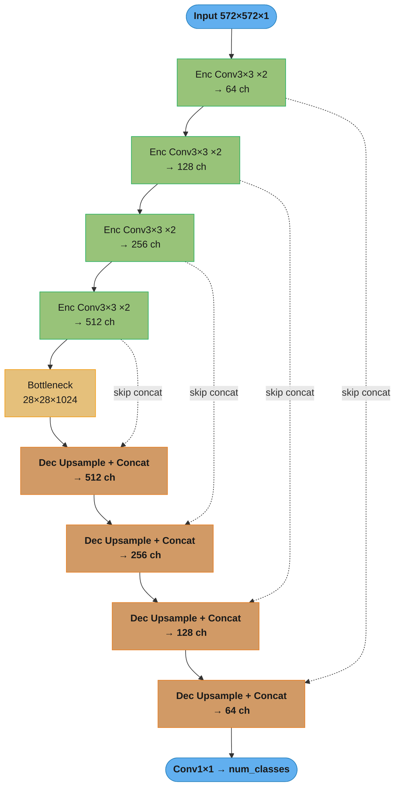
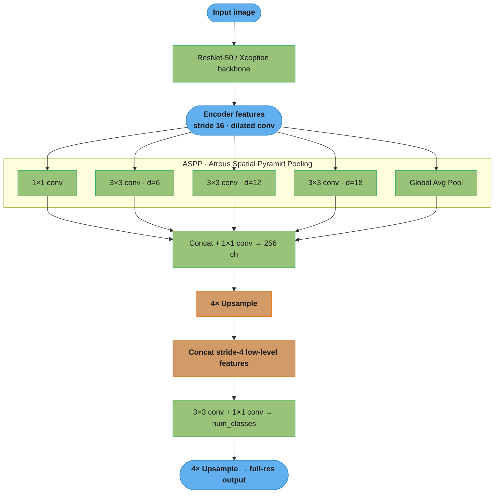
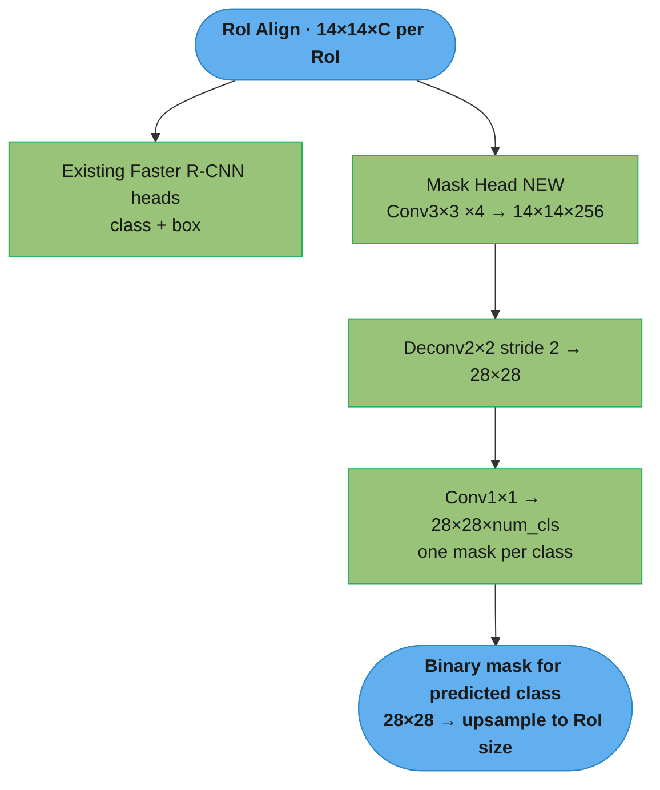
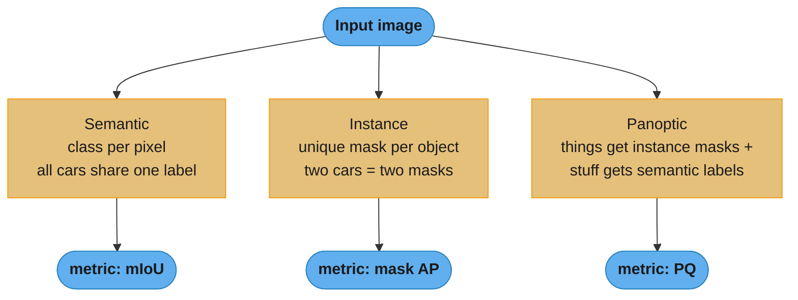
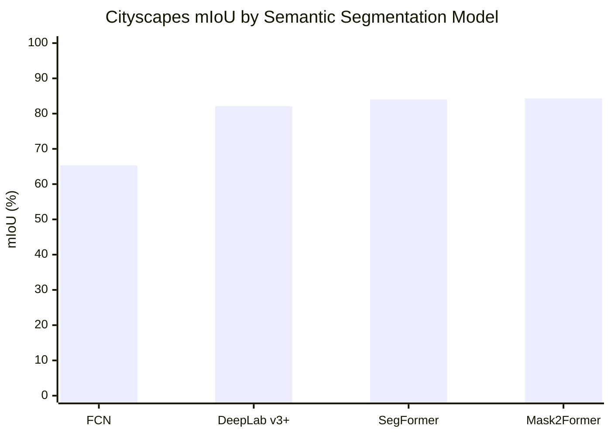

# Image Segmentation

## 1. Concept Overview

Image segmentation is the task of partitioning an image at the pixel level. Unlike detection, which draws coarse bounding boxes, segmentation produces a precise mask. Three sub-tasks form the hierarchy:

- **Semantic segmentation**: assign a class label to every pixel. All cars share one color; all roads share another. Instances of the same class are indistinguishable.
- **Instance segmentation**: detect each object instance and produce an individual binary mask per instance. Two adjacent cars get different masks.
- **Panoptic segmentation**: unified task combining both. "Things" (countable objects) receive instance masks; "stuff" (uncountable regions: sky, road, grass) receives semantic labels. Evaluated with Panoptic Quality (PQ).

Segmentation unlocks applications that bounding boxes cannot serve: autonomous vehicle drivable-area estimation, surgical instrument tracking, satellite land-cover mapping, and medical organ delineation.

---

## 2. Intuition

Think of detection as circling objects with a pen; segmentation is coloring inside the lines with a brush. The challenge is that the brush must be pixel-accurate — a 1-pixel error in a medical tumor boundary can change the diagnosis.

The core mental model: every pixel is a classification problem conditioned on its local and global context. Early architectures (FCN) solved this with fully convolutional layers. U-Net added skip connections to recover spatial detail. DeepLab added dilated convolutions to enlarge the receptive field without downsampling. Transformers (SegFormer, Mask2Former) handle global context from the first layer.

---

## 3. Core Principles

**Fully convolutional networks**: replace the FC layers of a classifier with 1x1 convolutions, then upsample back to input resolution using transposed convolutions or bilinear interpolation. This allows variable-size input and per-pixel output.

**Skip connections**: encoder-decoder architectures (U-Net) connect encoder feature maps at each resolution to the corresponding decoder stage via concatenation or addition. This preserves fine spatial details (edges, thin structures) that would otherwise be lost during downsampling.

**Dilated (atrous) convolution**: insert holes (zeros) between kernel weights, expanding the filter's receptive field without increasing parameters or losing resolution. A 3x3 convolution with dilation rate d=2 has an effective receptive field of 5x5. DeepLab uses dilation rates [6, 12, 18] in ASPP.

**ASPP (Atrous Spatial Pyramid Pooling)**: applies multiple parallel dilated convolutions at different rates to capture context at multiple scales, then concatenates the outputs. The key innovation in DeepLab v3+.

**Dice loss**: designed for binary segmentation with class imbalance. It maximizes the overlap between prediction and ground truth directly, without being overwhelmed by the majority background class.

---

## 4. Types / Architectures / Strategies

### Semantic Segmentation

| Model | Year | mIoU (Cityscapes) | Key Innovation |
|-------|------|-------------------|----------------|
| FCN | 2015 | 65.3% | First fully convolutional approach |
| DeepLab v3+ | 2018 | 82.1% | ASPP, encoder-decoder, CRF optional |
| SegFormer | 2021 | 84.0% | Hierarchical transformer, lightweight head |
| Mask2Former | 2022 | 84.3% | Universal architecture (all 3 tasks) |

### Instance Segmentation

| Model | Year | mask AP COCO | Notes |
|-------|------|-------------|-------|
| Mask R-CNN | 2017 | 37.1 | Adds mask branch to Faster R-CNN |
| CondInst | 2020 | 39.1 | Conditional convolutions, faster |
| SOLOv2 | 2020 | 39.7 | Grid-based, no RoI feature extraction |
| Mask2Former | 2022 | 50.1 | Transformer, state-of-art |

### Panoptic Segmentation

| Model | PQ COCO | Notes |
|-------|---------|-------|
| Panoptic FPN | 40.9 | Extends Mask R-CNN with semantic head |
| Mask2Former | 57.8 | Unified query-based approach |

### Foundation Model: SAM

SAM (Segment Anything Model, Meta 2023) is a promptable segmentation model trained on SA-1B (1B masks, 11M images). Accepts three prompt types: point clicks, bounding boxes, or text. SAM 2 (2024) extends to video with memory attention for consistent instance tracking across frames.

---

## 5. Architecture Diagrams

### U-Net Architecture



The dotted skip connections are the whole point: each encoder stage feeds its
high-resolution features straight into the matching decoder stage, restoring the
edge detail that downsampling destroyed.

### DeepLab v3+ Architecture



ASPP runs four parallel dilated convolutions plus global pooling to capture context
at rates 6/12/18 without downsampling, then fuses low-level detail before upsampling
— dilation buys a large receptive field while keeping boundaries sharp.

**What this actually says.** The rates 6/12/18 are not tuning noise — each one names how far apart the nine weights of a 3x3 kernel are spread. "Spacing a fixed 3x3 kernel further apart lets it see a much wider patch of the image for exactly the same nine multiplications."

The rule that turns a dilation rate into a footprint is `k_eff = k + (k - 1) x (d - 1)`.

| Symbol | What it is |
|--------|-----------|
| `k` | The real kernel size — how many weights per side. Always 3 in ASPP |
| `d` | Dilation (atrous) rate. `d = 1` is an ordinary conv; `d = 2` inserts one hole between weights |
| `k_eff` | The effective footprint the kernel covers after the holes are counted |
| `(k - 1)` | Number of gaps between weights along one side — 2 for a 3x3 kernel |
| `(d - 1)` | Holes inserted per gap. This is what grows for free |

**Walk one example.** The four ASPP branches, all with `k = 3` (nine weights each):

```
  rate d    k_eff = 3 + 2 x (d - 1)     footprint    learned weights
  ------    ----------------------      ---------    ---------------
     1      3 + 2 x 0  =  3               3 x 3             9
     2      3 + 2 x 1  =  5               5 x 5             9      <- the "d=2 acts 5x5" claim
     6      3 + 2 x 5  = 13              13 x 13            9
    12      3 + 2 x 11 = 25              25 x 25            9
    18      3 + 2 x 17 = 37              37 x 37            9

  widest branch, measured back on the input image (encoder stride 16):
      37 x 16 = 592 input pixels of context, from 9 weights
```

Parameter count is flat down that whole column — 9 weights at every rate. That is the entire trade dilation makes: receptive field grows linearly in `d` while cost stays constant, and crucially resolution never drops, so boundaries stay where pooling would have smeared them. Without dilation the only way to reach 37x37 of context is to pool the feature map down and upsample back, which is exactly the boundary blur DeepLab was built to avoid. The cost is gridding artifacts — at large `d` neighbouring output pixels sample disjoint input pixels, which is why ASPP runs several rates in parallel rather than one big one.

### Mask R-CNN Additional Mask Branch



Mask R-CNN adds a third parallel head on top of Faster R-CNN's class and box heads;
the mask branch predicts a 28×28 mask per class and only the predicted class's mask
is used, which is why RoI Align's sub-pixel accuracy matters here.

### Semantic vs Instance vs Panoptic



Semantic labels every pixel but cannot tell two cars apart; instance separates
objects but ignores background "stuff"; panoptic unifies both and is scored by
Panoptic Quality.

### Semantic Model Accuracy



From the §4 table: FCN's fully convolutional baseline at 65.3% climbed to 84%+ once
ASPP (DeepLab) and transformers (SegFormer, Mask2Former) added multi-scale global
context.

---

## 6. How It Works — Detailed Mechanics

### Loss Functions

```python
import torch
import torch.nn as nn
import torch.nn.functional as F
from torch import Tensor


def cross_entropy_segmentation(pred: Tensor,
                                target: Tensor,
                                ignore_index: int = 255) -> Tensor:
    """
    Standard cross-entropy for semantic segmentation.
    pred:   (B, C, H, W) logits
    target: (B, H, W) class indices; 255 = ignore (boundary pixels)
    """
    return F.cross_entropy(pred, target, ignore_index=ignore_index)


def dice_loss(pred: Tensor,
              target: Tensor,
              smooth: float = 1.0) -> Tensor:
    """
    Dice loss for binary or multi-class segmentation.
    pred:   (B, C, H, W) probabilities (after sigmoid/softmax)
    target: (B, C, H, W) one-hot ground truth
    Dice = 2 * |A ∩ B| / (|A| + |B|)
    """
    pred_flat   = pred.view(pred.size(0), pred.size(1), -1)   # (B, C, HW)
    target_flat = target.view(target.size(0), target.size(1), -1)

    intersection = (pred_flat * target_flat).sum(dim=2)       # (B, C)
    denominator  = pred_flat.sum(dim=2) + target_flat.sum(dim=2)  # (B, C)

    dice = (2.0 * intersection + smooth) / (denominator + smooth)
    return 1.0 - dice.mean()


def combined_loss(pred_logits: Tensor,
                  target: Tensor,
                  num_classes: int,
                  dice_weight: float = 0.5) -> Tensor:
    """
    Cross-entropy + Dice loss — standard for medical segmentation.
    pred_logits: (B, C, H, W)
    target:      (B, H, W) class indices
    """
    ce_loss = cross_entropy_segmentation(pred_logits, target)

    # Convert to one-hot for dice
    probs    = F.softmax(pred_logits, dim=1)
    target_oh = F.one_hot(target.long(), num_classes)  # (B, H, W, C)
    target_oh = target_oh.permute(0, 3, 1, 2).float()  # (B, C, H, W)
    d_loss = dice_loss(probs, target_oh)

    return (1 - dice_weight) * ce_loss + dice_weight * d_loss


class FocalLoss(nn.Module):
    """Focal loss for hard example mining in segmentation."""

    def __init__(self, gamma: float = 2.0, alpha: float = 0.25,
                 ignore_index: int = 255) -> None:
        super().__init__()
        self.gamma = gamma
        self.alpha = alpha
        self.ignore_index = ignore_index

    def forward(self, pred: Tensor, target: Tensor) -> Tensor:
        ce = F.cross_entropy(pred, target, reduction="none",
                             ignore_index=self.ignore_index)
        pt = torch.exp(-ce)
        focal = self.alpha * (1 - pt) ** self.gamma * ce
        return focal[target != self.ignore_index].mean()
```

**In plain terms.** The Dice coefficient `2 * |A ∩ B| / (|A| + |B|)` asks one question: "of all the pixels either of us called foreground, how much did we actually agree on — counted twice, because the overlap belongs to both of us."

| Symbol | What it is |
|--------|-----------|
| `A` | The set of pixels the model predicted as foreground |
| `B` | The set of pixels the ground-truth mask marks as foreground |
| `A ∩ B` | The overlap — pixels both agree on. In code, `(pred_flat * target_flat).sum()` |
| `\|A\| + \|B\|` | Total foreground pixels claimed by both masks, overlap counted twice |
| `2 *` | Compensates for that double-count, so a perfect match scores exactly 1.0, not 0.5 |
| `smooth` | A 1.0 added to both halves. Guards the empty-mask case where the ratio is 0/0 |
| `1.0 - dice` | Flips a similarity score into a loss — higher agreement means lower loss |

**Walk one example.** An 8x8 = 64-pixel tile with one small lesion. Ground truth marks 12 pixels; the model predicts 10; they overlap on 8:

```
  ground truth foreground |B| = 12 pixels
  predicted foreground    |A| = 10 pixels
  overlap        |A n B|      =  8 pixels
  missed (FN) = 12 - 8 = 4        false alarms (FP) = 10 - 8 = 2
  correct background (TN) = 64 - 8 - 2 - 4 = 50

  Dice = 2 x 8 / (12 + 10) = 16 / 22 = 0.7273
  loss = 1 - 0.7273                  = 0.2727

  with smooth = 1.0:
  Dice = (2 x 8 + 1) / (22 + 1) = 17 / 23 = 0.7391    <- barely moves; it only
                                                         matters near 0/0

  same tile, other scores:
  IoU           =  8 / (12 + 10 - 8) = 8 / 14 = 0.5714
  pixel accuracy = (8 + 50) / 64              = 0.9063   <- flatters the model
```

That last pair is the reason Dice exists. Pixel accuracy reads 90.6% because 50 of the 64 pixels are easy background the model got for free; Dice reads 0.727 and IoU 0.571 because both ignore the true negatives entirely. Predict all-background on this tile and accuracy still shows 81.3% while Dice collapses to 0. Note also that Dice is always the friendlier number of the two — for the same masks Dice 0.727 versus IoU 0.571 — since Dice weights the overlap twice, so never compare a Dice figure against an IoU figure from another paper.

**The idea behind it.** The combined loss `(1 - w) * CE + w * Dice` is a hedge: "let cross-entropy grade every pixel independently, let Dice grade the shape as a whole, and trust each about half."

| Symbol | What it is |
|--------|-----------|
| `CE` | Per-pixel cross-entropy. Gives a clean gradient on every pixel, but is dominated by background |
| `Dice` | The region-overlap loss above. Cares about shape, ignores true negatives |
| `w` | `dice_weight`, 0.5 by default. 0 is pure CE, 1 is pure Dice |
| `(1 - w)` | CE's share — the two weights sum to 1, so the loss scale stays comparable across settings |

**Walk one example.** Reusing the same 64-pixel tile, with the model assigning 0.9 confidence to its 58 correct pixels and 0.3 to the 6 it got wrong:

```
  CE  = [58 x -ln(0.9)  +  6 x -ln(0.3)] / 64
      = [58 x 0.1054    +  6 x 1.2040  ] / 64
      = [6.1109         +  7.2238      ] / 64
      = 13.3348 / 64 = 0.2084

  Dice loss (from above)                      = 0.2727

  combined (w = 0.5) = 0.5 x 0.2084 + 0.5 x 0.2727
                     = 0.1042 + 0.1364 = 0.2406
```

Look at the CE breakdown: 6 wrong pixels contribute 7.22 of the 13.33 total, slightly more than the 58 correct ones. That is CE working as intended on a mild imbalance — but push the background ratio to a realistic 99:1 and the 58 becomes 9,900 easy pixels whose tiny individual losses swamp the handful of hard ones. Dice cannot be swamped that way because its denominator only counts foreground. Drop the Dice term on a tumor task and the model converges to predicting all-background; drop the CE term and early training has almost no gradient at all, because with near-zero overlap the Dice ratio is flat.

**What it means.** Focal loss `alpha * (1 - pt)^gamma * CE` says: "keep cross-entropy, but multiply each pixel's loss by how badly it was missed, so confident-and-correct pixels stop contributing."

| Symbol | What it is |
|--------|-----------|
| `pt` | Probability the model gave the *correct* class. Recovered as `exp(-ce)` in the code |
| `(1 - pt)` | How wrong the pixel is. Near 0 when confident and right, near 1 when badly wrong |
| `gamma` | Focusing power, 2.0 by default. Higher means easy pixels are silenced harder |
| `alpha` | Class-balance weight, 0.25 here. A flat rescale of the whole term |
| `(1 - pt)^gamma` | The modulating factor — the entire mechanism, a number in 0..1 that dims easy pixels |

**Walk one example.** One easy pixel (`pt = 0.9`) versus one hard pixel (`pt = 0.3`), at `gamma = 2`, `alpha = 0.25`:

```
                       easy pixel        hard pixel
                       pt = 0.9          pt = 0.3
  CE = -ln(pt)          0.1054            1.2040
  (1 - pt)              0.1               0.7
  (1 - pt)^2            0.01              0.49        <- 100x down vs 2.04x down
  x alpha (0.25)
  focal loss            0.000263          0.147487

  attention ratio, hard : easy
      under plain CE     1.2040 / 0.1054 =  11.4 : 1
      under focal        0.147487 / 0.000263 = 559.9 : 1
      amplification      559.9 / 11.4 = 49x   ( = (0.7 / 0.1)^2 )
```

The amplification is exactly `((1 - pt_hard) / (1 - pt_easy))^gamma = (0.7/0.1)^2 = 49`, which makes `gamma` legible: it is the exponent on the wrongness ratio. At `gamma = 0` the modulating factor is 1 everywhere and focal collapses back to plain weighted CE. At `gamma = 2` a pixel the model already calls correctly at 0.9 contributes 0.000263 — effectively nothing — so the gradient budget flows to boundary pixels and rare classes. Push `gamma` too high and training destabilizes, because the loss ends up driven by a shrinking handful of pixels, several of which are simply mislabeled ground truth.

### U-Net Implementation

```python
import torch
import torch.nn as nn
from torch import Tensor


class DoubleConv(nn.Module):
    """Two consecutive Conv-BN-ReLU blocks."""

    def __init__(self, in_ch: int, out_ch: int) -> None:
        super().__init__()
        self.block = nn.Sequential(
            nn.Conv2d(in_ch, out_ch, kernel_size=3, padding=1, bias=False),
            nn.BatchNorm2d(out_ch),
            nn.ReLU(inplace=True),
            nn.Conv2d(out_ch, out_ch, kernel_size=3, padding=1, bias=False),
            nn.BatchNorm2d(out_ch),
            nn.ReLU(inplace=True),
        )

    def forward(self, x: Tensor) -> Tensor:
        return self.block(x)


class UNet(nn.Module):
    """
    U-Net for binary / multi-class segmentation.
    Encoder doubles channels and halves spatial dimensions at each stage.
    Decoder halves channels and doubles spatial dimensions at each stage.
    """

    def __init__(self, in_channels: int = 1,
                 num_classes: int = 2,
                 features: list[int] = None) -> None:
        super().__init__()
        if features is None:
            features = [64, 128, 256, 512]

        self.encoders = nn.ModuleList()
        self.pool = nn.MaxPool2d(kernel_size=2, stride=2)
        self.decoders = nn.ModuleList()
        self.upsamples = nn.ModuleList()

        # Encoder
        ch = in_channels
        for feat in features:
            self.encoders.append(DoubleConv(ch, feat))
            ch = feat

        # Bottleneck
        self.bottleneck = DoubleConv(features[-1], features[-1] * 2)

        # Decoder
        for feat in reversed(features):
            self.upsamples.append(
                nn.ConvTranspose2d(feat * 2, feat, kernel_size=2, stride=2))
            self.decoders.append(DoubleConv(feat * 2, feat))

        self.final_conv = nn.Conv2d(features[0], num_classes, kernel_size=1)

    def forward(self, x: Tensor) -> Tensor:
        skip_connections: list[Tensor] = []

        # Encoder pass
        for enc in self.encoders:
            x = enc(x)
            skip_connections.append(x)
            x = self.pool(x)

        x = self.bottleneck(x)
        skip_connections = skip_connections[::-1]  # reverse

        # Decoder pass
        for i, (up, dec) in enumerate(zip(self.upsamples, self.decoders)):
            x = up(x)
            skip = skip_connections[i]

            # Handle odd-sized inputs via center crop or pad
            if x.shape != skip.shape:
                x = F.interpolate(x, size=skip.shape[2:], mode="bilinear",
                                  align_corners=False)

            x = torch.cat([skip, x], dim=1)
            x = dec(x)

        return self.final_conv(x)
```

### mIoU Evaluation

```python
import torch
from torch import Tensor


class SegmentationMetrics:
    """Computes pixel accuracy and mIoU for semantic segmentation."""

    def __init__(self, num_classes: int, ignore_index: int = 255) -> None:
        self.num_classes = num_classes
        self.ignore_index = ignore_index
        self.confusion_matrix = torch.zeros(num_classes, num_classes,
                                             dtype=torch.long)

    def update(self, pred: Tensor, target: Tensor) -> None:
        """pred: (B, H, W) class indices; target: (B, H, W) class indices."""
        mask = target != self.ignore_index
        pred_flat   = pred[mask]
        target_flat = target[mask]

        indices = self.num_classes * target_flat + pred_flat
        counts = torch.bincount(indices,
                                 minlength=self.num_classes ** 2)
        self.confusion_matrix += counts.reshape(self.num_classes,
                                                  self.num_classes)

    def compute(self) -> dict[str, float]:
        cm = self.confusion_matrix.float()
        tp   = cm.diagonal()
        fp   = cm.sum(dim=0) - tp  # predicted but not GT
        fn   = cm.sum(dim=1) - tp  # GT but not predicted
        iou  = tp / (tp + fp + fn + 1e-10)
        miou = iou.mean().item()
        pixel_acc = (tp.sum() / cm.sum()).item()
        return {"mIoU": miou, "pixel_acc": pixel_acc,
                "per_class_iou": iou.tolist()}

    def reset(self) -> None:
        self.confusion_matrix.zero_()
```

**What the formula is telling you.** Per-class IoU is `tp / (tp + fp + fn)`, and the missing fourth cell is the whole story: "score each class on the pixels *someone* claimed for it, and refuse to award any credit for correctly ignoring it."

| Symbol | What it is |
|--------|-----------|
| `cm[i][j]` | Confusion-matrix cell: pixels whose ground truth is class `i` and prediction is class `j` |
| `tp` | The diagonal, `cm[i][i]` — pixels of class `i` correctly labelled `i` |
| `fp` | `cm.sum(dim=0) - tp` — a column sum. Predicted class `i` but ground truth said otherwise |
| `fn` | `cm.sum(dim=1) - tp` — a row sum. Ground truth was class `i` but the model called it something else |
| `tn` | Absent by design. Including it would let rare classes score high for being skipped |
| `1e-10` | Epsilon guarding a class with zero pixels in both masks, which would give 0/0 |
| `mIoU` | The unweighted mean of the per-class IoUs — every class counts equally, however rare |

**Walk one example.** A 10,000-pixel street scene over three classes, confusion matrix rows = ground truth, columns = prediction:

```
                        predicted
                   road    car   pole   | GT total
        road       8000    100      0   |   8100
  GT    car         200   1500     50   |   1750
        pole        100     30     20   |    150
        ------------------------------------------
   pred total      8300   1630     70   |  10000

  class   tp     fp    fn    IoU = tp / (tp + fp + fn)
  ----    ----   ---   ---   ------------------------
  road    8000   300   100   8000 / 8400 = 0.9524
  car     1500   130   250   1500 / 1880 = 0.7979
  pole      20    50   130     20 /  200 = 0.1000

  mIoU = (0.9524 + 0.7979 + 0.1000) / 3 = 1.8503 / 3 = 0.6168

  pixel accuracy = (8000 + 1500 + 20) / 10000 = 9520 / 10000 = 0.9520
```

95.2% pixel accuracy, 61.7% mIoU — from one identical set of predictions. The gap is entirely the pole class, which is 150 of 10,000 pixels (1.5%) and scores an IoU of 0.10. Because accuracy is a pixel-weighted average, poles can only move it by 1.5 points no matter how badly they are segmented; because mIoU is a *class*-weighted average, that same failure drags a full third of the score. Report accuracy on a driving model and you can ship something that cannot see thin vertical objects. This is also why mIoU is the published Cityscapes number in the §4 table, and why the ignore_index=255 mask matters: annotators mark ambiguous boundary pixels as 255 so they never enter any cell of this matrix.

### Panoptic Quality Formula

```python
def panoptic_quality(tp: int, fp: int, fn: int,
                     iou_sum: float) -> dict[str, float]:
    """
    PQ = SQ * RQ
    SQ (Segmentation Quality) = avg IoU of matched segments
    RQ (Recognition Quality) = F1 score on segment instances
    """
    rq = tp / (tp + 0.5 * fp + 0.5 * fn + 1e-10)
    sq = iou_sum / (tp + 1e-10)
    pq = sq * rq
    return {"PQ": pq, "SQ": sq, "RQ": rq}
```

**Put simply.** `PQ = SQ x RQ` splits one score into two independent questions: "did you find the right objects, and once found, did you trace them well?" Multiplying means a model must do both — being excellent at one cannot rescue failure at the other.

| Symbol | What it is |
|--------|-----------|
| `tp` | Matched segments — a predicted segment overlapping its ground-truth segment at IoU > 0.5 |
| `fp` | Predicted segments that matched nothing. Hallucinated objects |
| `fn` | Ground-truth segments no prediction matched. Missed objects |
| `iou_sum` | Sum of the IoUs of the matched pairs only. Each term is > 0.5 by the matching rule |
| `RQ` | `tp / (tp + 0.5 fp + 0.5 fn)` — this is exactly the F1 score, counted over segments not pixels |
| `SQ` | `iou_sum / tp` — mean mask quality *of the segments you found*. Ranges 0.5 to 1.0 |
| `0.5 x` | Splits each error evenly between precision and recall, which is what makes RQ an F1 |

Note that the IoU > 0.5 matching threshold guarantees each match is unique — no two predictions can both exceed 0.5 IoU with the same ground-truth segment — so the matching needs no greedy tie-breaking.

**Walk one example.** One image, 8 matched segments, 2 hallucinated, 3 missed, matched IoUs summing to 6.4:

```
  tp = 8    fp = 2    fn = 3    iou_sum = 6.4

  RQ = 8 / (8 + 0.5 x 2 + 0.5 x 3)
     = 8 / (8 + 1.0 + 1.5)
     = 8 / 10.5 = 0.7619        <- did you find the right objects (F1)

  SQ = 6.4 / 8 = 0.8000         <- how cleanly did you trace the ones you found

  PQ = 0.8000 x 0.7619 = 0.6095 <- 60.95 PQ
```

The decomposition is what makes PQ useful for debugging rather than just ranking. Here SQ is 0.80, so the masks are decent; RQ is 0.76, driven by 3 missed segments against only 2 false alarms — the model is under-detecting, so the fix is detection recall (lower the confidence threshold, oversample rare things), not better mask heads. Had SQ been 0.55 with RQ at 0.95, the opposite fix applies. Note SQ can never drop below 0.5 by construction, since anything below IoU 0.5 is never counted as a match and instead lands in `fp` and `fn`, punishing RQ twice. For scale, Mask2Former's 57.8 PQ on COCO from the §4 table sits just under this worked example.

---

## 7. Real-World Examples

**Autonomous vehicles (Waymo, Tesla)**: DeepLab v3+ or SegFormer runs at ~10 fps on the vehicle's onboard GPU, labeling every pixel as road, sidewalk, vehicle, pedestrian, or cyclist. The drivable-area mask feeds directly into the motion planning module.

**Medical imaging (nnU-Net)**: nnU-Net is an auto-configuring U-Net framework that automatically determines architecture, preprocessing, and augmentation for any biomedical segmentation task. It won 33 of 53 segmentation challenges at MICCAI 2023 without task-specific modifications.

**Satellite land-cover mapping (ESA WorldCover)**: SegFormer trained on Sentinel-2 10m resolution imagery produces global land-use maps (forest, cropland, urban) at 10m/pixel resolution. Trained on 15TB of multi-spectral satellite data; inference on cloud TPU clusters.

**Surgical robotics (Intuitive Surgical)**: Mask R-CNN detects and tracks surgical instruments frame-by-frame during laparoscopy, enabling augmented reality overlays and collision avoidance. Operates at 30 fps on embedded NVIDIA Xavier.

**Meta's background segmentation (Reels, video calls)**: SAM-derived lightweight model runs on-device (iPhone A16 / Android Tensor) for real-time background replacement. 15 fps on mobile with INT8 quantization of the image encoder.

---

## 8. Tradeoffs

| Architecture | Task | Speed | Accuracy | Memory | Notes |
|---|---|---|---|---|---|
| FCN | Semantic | Fast | Moderate | Low | Coarse boundaries |
| DeepLab v3+ | Semantic | Medium | High (82.1% CS) | Medium | Excellent boundaries |
| SegFormer-B5 | Semantic | Medium | 84.0% CS | Medium | Transformer, less inductive bias |
| U-Net | Semantic/Binary | Fast | High (medical) | Low | Encoder-decoder skip |
| Mask R-CNN | Instance | ~5 fps | 37.1 AP | High | Two-stage, accurate |
| SOLOv2 | Instance | ~12 fps | 39.7 AP | Medium | No RoI pooling |
| SAM ViT-H | Promptable | ~50ms/img | Near-perfect | High | Not real-time |

| Loss | Best For | Weakness |
|------|----------|----------|
| Cross-entropy | Balanced classes | Dominated by background |
| Dice loss | Imbalanced (medical) | Unstable with small objects |
| Focal loss | Hard examples | Gamma tuning required |
| Tversky loss | FN-sensitive tasks | More hyperparameters |

---

## 9. When to Use / When NOT to Use

**Use semantic segmentation when**: you need pixel-level class labels but instance identity does not matter (drivable area, background removal, land cover mapping).

**Use instance segmentation when**: individual object masks matter (surgical instrument tracking, counting, anomaly detection per item).

**Use panoptic segmentation when**: you need both semantic background context and per-instance object masks (scene understanding for robotics, AR scene composition).

**Use U-Net when**: working with medical images, satellite imagery, or any task with high-resolution inputs and small structural features. Encoder-decoder with skip connections excels here.

**Use SAM when**: you need interactive or promptable segmentation without a fixed class set, or when generating pseudo-labels for a new domain.

**Do NOT use segmentation when**: bounding boxes are sufficient for your application — segmentation annotation costs 5-10x more than box annotation. Prefer detection unless pixel masks are operationally necessary.

---

## 10. Common Pitfalls

**Pitfall 1: Ignoring boundary pixels (ignore_index=255)**
PASCAL VOC annotates boundary regions as 255 and expects them to be ignored in loss computation. A team forgot to set `ignore_index=255` in `F.cross_entropy`. The model spent 15% of its gradient signal trying to correctly classify ambiguous boundary pixels, reducing mIoU by ~3 points and making boundary quality worse, not better. Always set `ignore_index` to the dataset's void label.

**Pitfall 2: Using bilinear upsampling vs transposed convolution carelessly**
Bilinear upsampling is fixed and fast; transposed convolution is learnable but prone to checkerboard artifacts if the kernel size is not divisible by the stride. A medical segmentation model had transposed convolutions with kernel 3, stride 2 — resulting in a 2-pixel periodic checkerboard in the output masks. Fix: use kernel size 2, stride 2 for transposed convolutions, or use bilinear upsampling followed by a conv layer (PixelShuffle for super-resolution).

**Pitfall 3: Dice loss instability on small objects**
Dice loss requires meaningful overlap between prediction and ground truth. For very small objects (< 10px), early in training the prediction is zero everywhere — the denominator is near zero and the gradient is undefined. Fix: start training with cross-entropy for the first 10 epochs to establish basic structure, then switch to combined CE + Dice loss. Alternatively use a smooth term (smooth=1.0) in the Dice formula.

**Pitfall 4: Memory explosion with full-resolution feature maps**
A naively implemented DeepLab trained on 1024x2048 Cityscapes images with batch size 8 required 48GB VRAM — impossible on a single A100 (40GB). Solution: crop images to 512x1024 during training (standard Cityscapes practice); use output stride 16 instead of 8 (saves 4x memory at ~0.5% mIoU cost); enable mixed precision (AMP).

**Pitfall 5: Mask R-CNN mask head misalignment**
Mask R-CNN predicts a binary mask for each class at 28x28 resolution, then bilinearly upsamples to the RoI size. A bug in the upsampling code caused a half-pixel offset between the mask and the actual object — visible as thin sliver misses at object boundaries. Fix: use `align_corners=False` in `F.interpolate` and test with pixel-level IoU overlays during debugging.

---

## 11. Technologies & Tools

| Tool | Use Case | Notes |
|------|----------|-------|
| mmsegmentation | 40+ semantic models | Research standard |
| Detectron2 | Mask R-CNN, Panoptic FPN | Meta-maintained |
| nnU-Net | Auto-config biomedical | Win rate at MICCAI challenges |
| segment-anything | SAM inference | Official Meta library |
| torchvision.ops | RoI Align, masks | Low-level ops |
| Albumentations | Augmentation with mask sync | Syncs geometric transforms to masks |
| MONAI | Medical imaging framework | Built on PyTorch, U-Net variants |
| Label Studio | Polygon annotation | Exports COCO panoptic JSON |
| Supervisely | Cloud annotation platform | Supports semantic + instance |
| FiftyOne | Mask visualization, mIoU | Supports COCO panoptic format |

---

## 12. Interview Questions with Answers

**Q: What is the difference between semantic and instance segmentation?**
Semantic segmentation assigns a single class label to every pixel but treats all instances of a class identically — two adjacent cars are both labeled "car" with no distinction. Instance segmentation gives each detected object instance a unique binary mask in addition to a class label, so two cars get separate masks. Panoptic segmentation combines both: instance masks for countable "things" (car, person) and semantic labels for uncountable "stuff" (sky, road).

**Q: What is mIoU and how is it computed?**
Mean Intersection over Union (mIoU) is the primary metric for semantic segmentation. For each class, IoU = (true positives) / (true positives + false positives + false negatives), where TP/FP/FN are counted at pixel level. mIoU averages IoU across all classes. A confusion matrix is the efficient implementation: TP for class c is the diagonal element C[c,c]; FP is the column sum minus diagonal; FN is the row sum minus diagonal.

**Q: Why do U-Net skip connections help segmentation?**
The encoder downsamples to build semantic feature maps but loses spatial resolution. The decoder upsamples to recover resolution, but the upsampled features are blurry. Skip connections concatenate the encoder's high-resolution features directly into the corresponding decoder stage, providing precise spatial information (exact pixel positions of edges, structures) alongside the semantic content from deeper layers. This is especially critical in medical imaging where 1-pixel boundary accuracy matters for volumetric calculations.

**Q: Explain the Dice loss formula and when to prefer it over cross-entropy.**
Dice loss = 1 - (2 * |A ∩ B|) / (|A| + |B|), where A is the predicted mask and B is the ground-truth mask. It directly optimizes the overlap ratio, making it insensitive to class imbalance — the dominant background class does not swamp the loss. Use Dice loss when foreground is rare (< 5% of pixels), as in medical lesion segmentation, skin lesion detection, or road crack detection. Cross-entropy works better early in training and for multi-class tasks; combining both (50% CE + 50% Dice) is the standard approach.

**Q: What is atrous (dilated) convolution and why does DeepLab use it?**
A dilated convolution inserts spaces (zeros) between kernel weights, expanding the receptive field without downsampling spatial resolution. A 3x3 kernel with dilation d=6 has an effective receptive field of 13x13 but only 9 parameters. DeepLab uses dilation instead of additional pooling layers to maintain high-resolution feature maps (stride 8 or 16 instead of 32), which is critical for precise boundary localization. ASPP runs multiple parallel atrous convolutions at rates [6, 12, 18] to capture context at multiple scales simultaneously.

**Q: What is RoI Align and how does it improve over RoI Pooling?**
RoI Pooling quantizes the RoI boundary to the nearest integer pixel, introducing a misalignment of up to 1 pixel. RoI Align instead uses bilinear interpolation at four regularly sampled points within each pooling bin, producing a smooth, continuous extraction without quantization. For detection, the misalignment is tolerable; for pixel-level mask prediction in Mask R-CNN, even a 1-pixel offset degrades mask quality significantly. RoI Align improves mask AP by ~2 points over RoI Pooling.

**Q: What is Panoptic Quality (PQ) and how is it calculated?**
PQ = SQ × RQ, where SQ (Segmentation Quality) is the average IoU of matched segment pairs (only counts TP segments), and RQ (Recognition Quality) is the F1 score over segment instances: RQ = TP / (TP + 0.5*FP + 0.5*FN). A segment pair is matched if IoU > 0.5. PQ ranges from 0 to 1; state-of-art Mask2Former achieves PQ = 0.578 on COCO. PQ rewards both precise segmentation (high SQ) and complete detection (high RQ).

**Q: What is SAM and what makes it different from traditional segmentation models?**
SAM (Segment Anything Model) is a foundation model for promptable segmentation trained on 1 billion masks. Unlike traditional models trained for specific classes on specific datasets, SAM accepts a prompt (point, box, or mask) and segments the indicated region without class labels. The architecture has three components: a ViT-H image encoder (run once per image), a prompt encoder (for points/boxes/masks), and a lightweight mask decoder (run per prompt, < 50ms). SAM does not assign class labels — it only produces binary masks. SAM 2 extends this to video with a memory bank for temporal consistency.

**Q: How does Mask R-CNN extend Faster R-CNN?**
Mask R-CNN adds a third parallel head to Faster R-CNN's existing classification and box regression heads. After RoI Align extracts a 14x14 feature map per region proposal, the mask head applies 4 convolutional layers (3x3) to produce a 14x14 feature map, then a 2x transposed convolution produces a 28x28 output with C channels (one per class). During inference, only the mask for the predicted class is used. The mask head is trained independently of the box/class heads, with binary cross-entropy loss per class.

**Q: What data augmentation strategies are most important for segmentation?**
Geometric augmentations (random horizontal flip, random crop, random scale jitter) must be applied identically to both image and mask — any spatial transform that is not synchronized will corrupt the annotation. Color augmentations (brightness, contrast, color jitter) apply to the image only. For medical imaging, elastic deformations are especially effective at simulating anatomical variation. For aerial/satellite images, random rotation at arbitrary angles (not just 90°) is important. Albumentations library handles synchronized transforms correctly and runs ~10x faster than torchvision.

**Q: How do you handle class imbalance in segmentation?**
Three approaches: (1) median frequency balancing — weight each class loss by the inverse frequency of that class in the training set; (2) Dice loss — inherently handles imbalance by directly maximizing overlap ratio, unaffected by dominant background; (3) focal loss — dynamically down-weights easy background pixels based on prediction confidence. For binary tasks (e.g., tumor vs background), weighting the minority class by the background/foreground area ratio is a simple and effective starting point.

**Q: What is the output stride in DeepLab and how does it affect the model?**
Output stride is the ratio of the input image resolution to the final feature map resolution. A standard ResNet has output stride 32 (32x downsampling). DeepLab replaces the last 1-2 pooling layers with dilated convolutions to reduce output stride to 16 or 8, preserving more spatial resolution in the feature map. Output stride 8 gives sharper boundaries (+1–2 mIoU) but requires ~4x more VRAM than stride 16. For production, stride 16 is the common compromise.

**Q: When would you choose SegFormer over DeepLab v3+?**
SegFormer uses a hierarchical transformer encoder (Mix Transformer, MiT) with a lightweight all-MLP decoder head. It outperforms DeepLab v3+ on Cityscapes (84.0% vs 82.1% mIoU) with fewer FLOPs when using the B0-B2 backbones. SegFormer-B5 achieves SOTA at comparable parameter count. Choose SegFormer when: (1) you want SOTA accuracy without complex ASPP heads; (2) you can afford 17k+ images for fine-tuning (transformers need more data); (3) your GPU is large enough for transformer attention. Use DeepLab v3+ when you need a well-understood, easily debuggable CNN pipeline with strong priors on local features.

**Q: How does the Tversky loss differ from Dice loss and when do you use it?**
Tversky loss generalizes Dice: Tversky = TP / (TP + alpha*FP + beta*FN). When alpha=beta=0.5, it equals Dice. Setting alpha=0.3, beta=0.7 makes the loss penalize false negatives more heavily than false positives — useful in medical screening where missing a tumor (FN) is far worse than a false alarm (FP). Use Tversky loss in safety-critical medical applications where the FN/FP cost asymmetry is known and meaningful.

**Q: What is the standard pipeline to train a semantic segmentation model on a new domain?**
Start from a backbone pretrained on ImageNet (ResNet-50, MiT-B2). If a segmentation model pretrained on ADE20K or Cityscapes exists, load it and replace the final classification head. Fine-tune with a low learning rate for the backbone (1e-4) and higher for the head (1e-3). Use combined CE + Dice loss with label smoothing 0.1. Apply Albumentations augmentations synchronized across image and mask. Train with output stride 16 for efficiency; switch to 8 for final evaluation. Evaluate with mIoU per class and overall; examine confusion matrix to identify commonly confused class pairs.

**Q: What is the difference between transposed convolution and bilinear upsampling, and which avoids checkerboard artifacts?**
Transposed convolution learns its upsampling kernel while bilinear upsampling is fixed, so only transposed convolution can produce checkerboard artifacts. Those artifacts appear when the transposed-conv kernel size is not divisible by the stride (for example kernel 3 with stride 2), causing uneven overlap in the output. The common fixes are to use kernel 2 with stride 2, or to bilinearly upsample and then apply a 3x3 convolution (or PixelShuffle). Bilinear upsampling is cheaper and artifact-free but cannot learn task-specific detail.

**Q: Why is sliding-window inference used for large images in segmentation?**
Sliding-window inference runs the model on overlapping crops of a large image and stitches the outputs, because a single full-resolution forward pass often exceeds GPU memory. A typical setup uses 50% overlap and averages predictions in the overlapping regions to avoid seams and inconsistent patch boundaries. It trades extra compute — each pixel is processed several times — for bounded memory, and is standard for gigapixel pathology slides and large satellite scenes.

---

## 13. Best Practices

1. Always synchronize spatial augmentations (crop, flip, rotate, scale) between image and mask. A desynchronized augmentation is a silent correctness bug that manifests as mysteriously poor validation mIoU with no training loss signal.
2. Set `ignore_index` for boundary or void pixels. Training on ambiguous boundaries hurts both loss convergence and boundary quality.
3. Use Dice loss or combined CE+Dice for any dataset where foreground pixels are under 10% of total. Pure cross-entropy will converge to predicting background everywhere.
4. For large images (> 1024px), use sliding window inference with overlap of 50% and average predictions in the overlap region. Running the full image as a single forward pass exceeds GPU memory and produces inconsistent patch boundaries.
5. Validate with per-class mIoU, not just mean mIoU. A model that scores 0% on one class and 100% on all others will have high mean mIoU if the zero class is rare.
6. Use RoI Align (not RoI Pooling) for any instance segmentation work — the quantization error in RoI Pooling degrades mask quality visibly at object boundaries.
7. For medical imaging, use nnU-Net as the baseline before implementing anything custom. It auto-configures preprocessing, patch size, architecture, and augmentation and wins most challenges without task-specific engineering.
8. Export the image encoder of SAM separately for repeated inference: encode each image once (~150ms for ViT-H) then run multiple prompt queries in < 10ms each.
9. Monitor GPU memory usage and output stride together. Reduce output stride from 16 to 8 only when you have validated that VRAM is not the bottleneck and that the +1 mIoU gain justifies the 4x memory cost.
10. Annotate a small validation set (500-1000 images) before starting training. Running qualitative visual inspection of predicted masks on held-out images every 5 epochs catches systematic errors (boundary misalignment, class confusion) far faster than waiting for epoch-level mIoU numbers.

---

## 14. Case Study

**Problem**: A pathology lab needs to segment nuclei in H&E stained tissue slides. Input: 1000x1000 pixel image patches at 20x magnification. Nuclei density: ~200–500 per patch. Ground truth: instance masks from expert pathologist annotation. Task: instance segmentation (each nucleus gets a unique mask). Metric: mask AP at IoU 0.5.

**Architecture selection**: U-Net for semantic segmentation (background vs nucleus vs boundary), then watershed post-processing to separate touching instances. This is the nnU-Net default for nuclei segmentation.

**Training setup**:
- U-Net with ResNet-34 encoder (pretrained on ImageNet).
- Loss: 50% CE + 50% Dice on 3-class output (background / nucleus interior / nucleus boundary).
- Augmentation: random 512x512 crops, random flip, elastic deformation (alpha=120, sigma=12), Gaussian noise, brightness/contrast jitter.
- Batch size 8, AdamW LR 1e-4, 200 epochs with ReduceLROnPlateau patience=20.

**Evaluation**: mIoU = 0.81 (nuclei class). Instance separation via watershed on predicted boundary channel: mask AP@0.5 = 0.74.

**Problem**: touching nuclei in dense regions produce merged instances — watershed over-segments or under-segments.

**Fix**: replaced watershed with a distance transform + H-maxima local peaks approach. Predicted the distance to the nearest boundary as an additional output channel. Used distance map peaks as watershed seeds. Mask AP@0.5 improved to 0.82.

**Production deployment**: model runs on CPU (no GPU at lab workstations) with batch inference on patch tiles. TorchScript export + torch.jit.optimize_for_inference reduces per-patch latency from 850ms to 420ms on Intel Xeon. Full slide analysis (100k+ patches per slide) is parallelized across 8 CPU cores using Python multiprocessing, processing a full slide in ~3 minutes.
