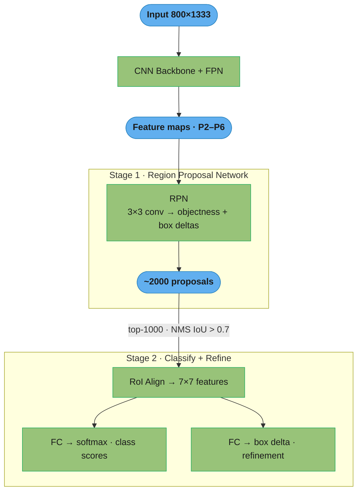
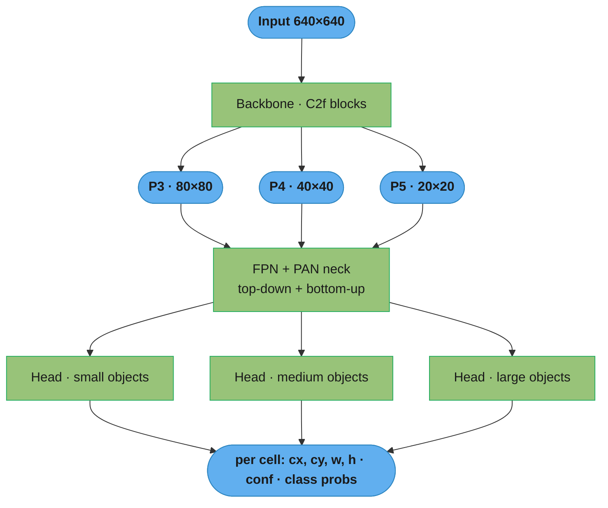
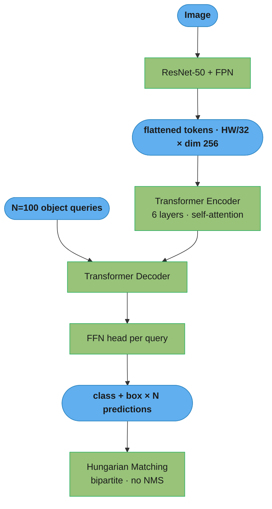
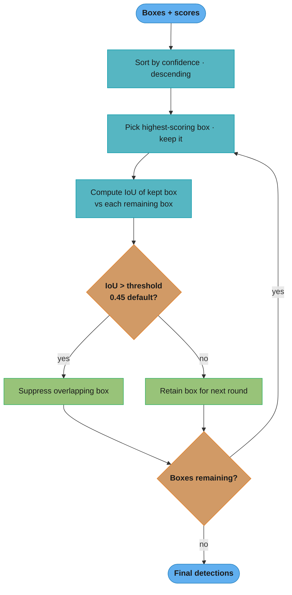
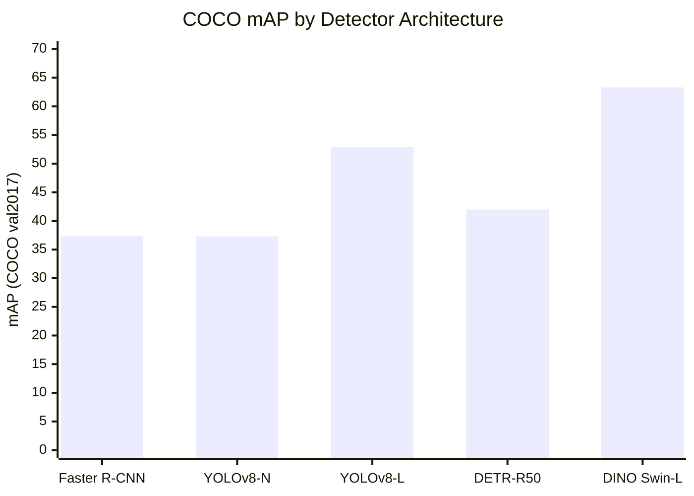

# Object Detection

## 1. Concept Overview

Object detection is the computer vision task of localizing and classifying every object instance in an image. The output is a set of bounding boxes, each annotated with a class label and a confidence score. Detection is strictly harder than classification because the model must simultaneously answer "what is it?" and "where is it?" for an arbitrary, unknown number of objects.

Detection architectures fall into three families:
- **Two-stage** (Faster R-CNN): first propose regions of interest, then classify each region. High accuracy, slower throughput.
- **One-stage** (YOLO, SSD): predict boxes and classes in a single forward pass over a dense grid. Fast, lower accuracy on small/overlapping objects.
- **Transformer-based** (DETR, DINO-Det): frame detection as a set prediction problem using bipartite matching, eliminating NMS entirely.

---

## 2. Intuition

Imagine a security guard scanning a crowded room. A two-stage detector is like the guard first marking all suspicious areas on a map (region proposals), then walking to each spot for a close inspection (classification). A one-stage detector is like the guard making instant judgments everywhere simultaneously without a prior scouting pass.

The key insight: detection is fundamentally a regression + classification problem over spatial locations. Every architecture addresses three sub-problems — where to look (spatial anchoring), what scale to use (feature pyramid), and how to suppress redundant predictions (NMS or set matching).

---

## 3. Core Principles

**Anchor boxes**: pre-defined boxes of various aspect ratios and scales placed at each grid cell. The model predicts offsets relative to anchors rather than absolute coordinates, which stabilizes training. YOLOv3 uses 9 anchors (3 per scale); Faster R-CNN uses 9 per location.

**Feature Pyramid Network (FPN)**: combines features from multiple CNN stages at different resolutions via lateral connections and top-down pathways. Small objects are detected from high-resolution early features; large objects from low-resolution deep features. Used in Faster R-CNN + FPN, YOLOv5/8, RetinaNet.

**IoU (Intersection over Union)**: the standard overlap metric.
```
IoU = |A ∩ B| / |A ∪ B|
    = intersection_area / (area_A + area_B - intersection_area)
```
IoU >= 0.5 is the standard threshold for TP in PASCAL VOC; COCO uses 0.5:0.05:0.95.

**Non-Maximum Suppression (NMS)**: removes duplicate detections. Sort boxes by confidence score; greedily keep the highest-confidence box; suppress all remaining boxes with IoU > threshold (0.45 is YOLO default). Soft-NMS decays scores instead of hard removal, better for overlapping objects.

**mAP**: see Section 6 for full calculation.

---

## 4. Types / Architectures / Strategies

### Two-Stage: Faster R-CNN

Region Proposal Network (RPN) slides over the feature map, predicting objectness scores and box deltas for k anchors at each location. Top-N proposals (post-NMS, N=1000 during training, 300 at inference) are passed to RoI pooling, which extracts a fixed-size feature map from each proposal. Two heads then predict class probabilities and refined box coordinates.

**Speed**: ~5 fps on V100 GPU; ~0.5 fps on CPU.
**mAP**: ResNet-50-FPN backbone achieves 37.4 mAP on COCO val2017.

### One-Stage: YOLO

YOLOv8 divides the image into an S×S grid. Each cell predicts B bounding boxes with (x, y, w, h, confidence) plus C class probabilities. Multi-scale prediction heads operate on three FPN levels (large, medium, small objects). YOLOv8 uses anchor-free prediction (predicts offset from center rather than from anchor boxes).

**Speed**: YOLOv8-L achieves ~100 fps on A100 GPU; ~50 fps on V100; ~3 fps on CPU.
**mAP**: YOLOv8-L achieves 52.9 mAP on COCO val2017.

### Transformer-Based: DETR

DETR uses a CNN backbone + FPN for feature extraction, then feeds flattened feature tokens into a transformer encoder-decoder. The decoder takes N learned object queries (N=100) and outputs N box predictions. A Hungarian matching loss assigns predictions to ground-truth objects (bipartite matching), eliminating the need for NMS. Empty slots predict the "no-object" class.

**Speed**: DETR-R50 achieves ~28 fps on V100.
**mAP**: 42.0 on COCO val2017.

### Anchor-Free: FCOS

FCOS (Fully Convolutional One-Stage) predicts, at each foreground pixel, the distance to the four sides of the ground-truth box: (l, r, t, b). A centerness branch suppresses low-quality boxes near object boundaries, partially replacing NMS. No anchor hyperparameters to tune.

---

## 5. Architecture Diagrams

### Faster R-CNN Pipeline (Two-Stage)



The two stages are explicit: the RPN narrows ~2000 proposals to a focused top-1000,
then RoI Align crops fixed 7×7 features that two heads classify and refine — accuracy
comes from spending stage 2 only on promising regions.

### YOLO Multi-Scale Prediction (One-Stage)



A single forward pass predicts boxes and classes on three FPN scales at once, so
small, medium, and large objects each get a dedicated head — this is why YOLO hits
100+ fps versus Faster R-CNN's two-pass ~5 fps.

### DETR Set Prediction



Detection is reframed as set prediction: 100 learned queries each emit one box, and
bipartite Hungarian matching assigns exactly one prediction per ground-truth object,
which is why DETR needs no anchors and no NMS.

### IoU Visualization

```
  ┌──────────────────┐
  │    Box A         │
  │        ┌─────────┼──────┐
  │        │ A ∩ B   │      │
  │        │         │  B   │
  └────────┼─────────┘      │
           │                │
           └────────────────┘

IoU = area(A ∩ B) / area(A ∪ B)
    = intersection / (area_A + area_B - intersection)
```

### NMS Greedy Suppression



Greedy suppression keeps the top box and deletes anything overlapping it above the
threshold, then repeats — a low threshold in dense crowds wrongly deletes real
neighbors, which is what Soft-NMS decays instead of hard-removing.

### Detector Accuracy Comparison



From the §8 tradeoff table: the nano YOLO matches Faster R-CNN's accuracy at ~100x
the speed, while transformer detectors (DETR, DINO) push mAP highest at the cost of
throughput.

---

## 6. How It Works — Detailed Mechanics

### IoU and NMS Implementation

```python
import torch
from torch import Tensor


def compute_iou(boxes_a: Tensor, boxes_b: Tensor) -> Tensor:
    """
    Compute pairwise IoU between two sets of boxes.
    Args:
        boxes_a: (N, 4) in [x1, y1, x2, y2] format
        boxes_b: (M, 4) in [x1, y1, x2, y2] format
    Returns:
        iou: (N, M) IoU matrix
    """
    # Intersection coordinates
    inter_x1 = torch.max(boxes_a[:, None, 0], boxes_b[None, :, 0])  # (N,M)
    inter_y1 = torch.max(boxes_a[:, None, 1], boxes_b[None, :, 1])
    inter_x2 = torch.min(boxes_a[:, None, 2], boxes_b[None, :, 2])
    inter_y2 = torch.min(boxes_a[:, None, 3], boxes_b[None, :, 3])

    inter_w = (inter_x2 - inter_x1).clamp(min=0)
    inter_h = (inter_y2 - inter_y1).clamp(min=0)
    intersection = inter_w * inter_h  # (N, M)

    area_a = ((boxes_a[:, 2] - boxes_a[:, 0]) *
              (boxes_a[:, 3] - boxes_a[:, 1]))[:, None]  # (N, 1)
    area_b = ((boxes_b[:, 2] - boxes_b[:, 0]) *
              (boxes_b[:, 3] - boxes_b[:, 1]))[None, :]  # (1, M)

    union = area_a + area_b - intersection
    return intersection / union.clamp(min=1e-6)


def nms(boxes: Tensor,
        scores: Tensor,
        iou_threshold: float = 0.45) -> Tensor:
    """
    Standard greedy NMS.
    Args:
        boxes:  (N, 4) [x1, y1, x2, y2]
        scores: (N,) confidence scores
        iou_threshold: suppress boxes with IoU > this value
    Returns:
        keep: indices of boxes to keep
    """
    order = scores.argsort(descending=True)
    keep: list[int] = []

    while order.numel() > 0:
        idx = order[0].item()
        keep.append(idx)
        if order.numel() == 1:
            break
        remaining_boxes = boxes[order[1:]]
        current_box = boxes[idx].unsqueeze(0)
        iou = compute_iou(current_box, remaining_boxes).squeeze(0)
        mask = iou <= iou_threshold
        order = order[1:][mask]

    return torch.tensor(keep, dtype=torch.long)
```

### mAP Calculation

```python
import numpy as np
from numpy.typing import NDArray


def compute_ap(recall: NDArray, precision: NDArray) -> float:
    """
    Compute Average Precision using 11-point interpolation (VOC) or
    area under curve. Here: area under PR curve via trapezoidal rule.
    """
    # Prepend sentinel values
    recall    = np.concatenate([[0.0], recall,    [1.0]])
    precision = np.concatenate([[1.0], precision, [0.0]])

    # Make precision monotonically decreasing (right-to-left max)
    for i in range(len(precision) - 2, -1, -1):
        precision[i] = max(precision[i], precision[i + 1])

    # Integrate at recall breakpoints
    indices = np.where(recall[1:] != recall[:-1])[0] + 1
    ap = np.sum((recall[indices] - recall[indices - 1]) * precision[indices])
    return float(ap)


def compute_map(predictions: list[dict],
                ground_truths: list[dict],
                iou_threshold: float = 0.5,
                num_classes: int = 80) -> float:
    """
    predictions: list of {"image_id": int, "boxes": Tensor(N,4),
                           "scores": Tensor(N), "labels": Tensor(N)}
    ground_truths: list of {"image_id": int, "boxes": Tensor(M,4),
                             "labels": Tensor(M)}
    Returns: mAP at given IoU threshold
    """
    aps: list[float] = []

    for cls in range(num_classes):
        tp_list: list[int] = []
        fp_list: list[int] = []
        score_list: list[float] = []
        n_gt = 0

        # Collect per-image GT boxes for this class
        gt_by_image: dict[int, Tensor] = {}
        for gt in ground_truths:
            mask = gt["labels"] == cls
            if mask.any():
                gt_by_image[gt["image_id"]] = gt["boxes"][mask]
                n_gt += mask.sum().item()

        if n_gt == 0:
            continue

        # Collect predictions sorted by score
        for pred in predictions:
            mask = pred["labels"] == cls
            if not mask.any():
                continue
            boxes  = pred["boxes"][mask]
            scores = pred["scores"][mask]
            img_id = pred["image_id"]

            for box, score in sorted(
                    zip(boxes, scores), key=lambda x: -x[1].item()):
                score_list.append(score.item())
                gt_boxes = gt_by_image.get(img_id, None)
                if gt_boxes is None or len(gt_boxes) == 0:
                    tp_list.append(0)
                    fp_list.append(1)
                    continue
                iou = compute_iou(box.unsqueeze(0), gt_boxes)
                max_iou, max_idx = iou.max(dim=1)
                if max_iou.item() >= iou_threshold:
                    tp_list.append(1)
                    fp_list.append(0)
                    # Remove matched GT (each GT matched once)
                    mask_gt = torch.ones(len(gt_boxes), dtype=torch.bool)
                    mask_gt[max_idx] = False
                    gt_by_image[img_id] = gt_boxes[mask_gt]
                else:
                    tp_list.append(0)
                    fp_list.append(1)

        tp_cumsum = np.cumsum(tp_list)
        fp_cumsum = np.cumsum(fp_list)
        precision = tp_cumsum / (tp_cumsum + fp_cumsum + 1e-10)
        recall    = tp_cumsum / (n_gt + 1e-10)
        aps.append(compute_ap(recall, precision))

    return float(np.mean(aps)) if aps else 0.0
```

### Faster R-CNN with torchvision

```python
import torch
import torchvision
from torchvision.models.detection import fasterrcnn_resnet50_fpn_v2
from torchvision.models.detection.faster_rcnn import FastRCNNPredictor
from torch.utils.data import DataLoader
from typing import Any


def build_faster_rcnn(num_classes: int,
                       pretrained: bool = True) -> torch.nn.Module:
    """
    Build Faster R-CNN with ResNet-50-FPN backbone pretrained on COCO.
    num_classes includes background class (background = 0).
    """
    weights = torchvision.models.detection.FasterRCNN_ResNet50_FPN_V2_Weights.COCO_V1
    model = fasterrcnn_resnet50_fpn_v2(weights=weights if pretrained else None)

    # Replace classification head
    in_features: int = model.roi_heads.box_predictor.cls_score.in_features
    model.roi_heads.box_predictor = FastRCNNPredictor(in_features, num_classes)
    return model


def train_step(model: torch.nn.Module,
               images: list[torch.Tensor],
               targets: list[dict[str, torch.Tensor]],
               optimizer: torch.optim.Optimizer) -> dict[str, float]:
    """
    Single training step. torchvision detection models return a dict of losses.
    targets: list of dicts with "boxes" (Tensor[N,4]) and "labels" (Tensor[N]).
    """
    model.train()
    optimizer.zero_grad()
    loss_dict: dict[str, torch.Tensor] = model(images, targets)
    # loss_dict keys: loss_classifier, loss_box_reg, loss_objectness, loss_rpn_box_reg
    total_loss = sum(loss_dict.values())
    total_loss.backward()
    torch.nn.utils.clip_grad_norm_(model.parameters(), max_norm=1.0)
    optimizer.step()
    return {k: v.item() for k, v in loss_dict.items()}


@torch.no_grad()
def inference(model: torch.nn.Module,
              image: torch.Tensor,
              score_threshold: float = 0.5) -> dict[str, Any]:
    """Single image inference. Returns boxes, labels, scores."""
    model.eval()
    outputs = model([image])[0]
    keep = outputs["scores"] >= score_threshold
    return {
        "boxes":  outputs["boxes"][keep],   # (N, 4) [x1,y1,x2,y2]
        "labels": outputs["labels"][keep],  # (N,)
        "scores": outputs["scores"][keep],  # (N,)
    }
```

### Detection Loss Functions

```python
import torch
import torch.nn as nn
import torch.nn.functional as F
from torch import Tensor


def smooth_l1_loss(pred: Tensor, target: Tensor,
                   beta: float = 1.0) -> Tensor:
    """Huber loss for bounding box regression."""
    diff = (pred - target).abs()
    return torch.where(diff < beta,
                       0.5 * diff ** 2 / beta,
                       diff - 0.5 * beta).mean()


def giou_loss(pred_boxes: Tensor, target_boxes: Tensor) -> Tensor:
    """
    Generalized IoU loss — penalizes distance even when boxes don't overlap.
    Both in [x1, y1, x2, y2] format.
    """
    iou = compute_iou(pred_boxes, target_boxes).diagonal()

    # Enclosing box
    enc_x1 = torch.min(pred_boxes[:, 0], target_boxes[:, 0])
    enc_y1 = torch.min(pred_boxes[:, 1], target_boxes[:, 1])
    enc_x2 = torch.max(pred_boxes[:, 2], target_boxes[:, 2])
    enc_y2 = torch.max(pred_boxes[:, 3], target_boxes[:, 3])
    enc_area = (enc_x2 - enc_x1).clamp(0) * (enc_y2 - enc_y1).clamp(0)

    union_area = (
        (pred_boxes[:, 2] - pred_boxes[:, 0]) *
        (pred_boxes[:, 3] - pred_boxes[:, 1]) +
        (target_boxes[:, 2] - target_boxes[:, 0]) *
        (target_boxes[:, 3] - target_boxes[:, 1]) -
        iou * enc_area  # subtract intersection
    )
    giou = iou - (enc_area - union_area) / enc_area.clamp(min=1e-6)
    return (1 - giou).mean()
```

---

## 7. Real-World Examples

**Autonomous driving (Waymo)**: uses a 3D detection pipeline operating on LiDAR point clouds + camera images. The camera branch resembles Faster R-CNN fused with depth features. Operates at 10Hz; 3D mAP on KITTI benchmark typically > 90% for easy vehicles.

**Amazon Go cashierless stores**: overhead cameras run a real-time multi-person tracking + product detection pipeline. Uses two-stage detectors for high accuracy on small product items; custom-trained on proprietary shelf datasets with 10k+ SKU categories.

**Instagram photo tagging**: YOLOv5 variant runs on every uploaded photo to detect faces, QR codes, and objects for accessibility alt-text generation. Optimized for CPU inference on commodity servers; batch size 64, ~8ms per image.

**Medical pathology (Paige AI)**: Faster R-CNN detects cancerous regions in whole-slide pathology images at 40x magnification (100k x 100k pixel tiles). Achieves AUC 0.99 for prostate cancer detection, FDA-cleared in 2021.

---

## 8. Tradeoffs

| Architecture | Speed (V100) | mAP COCO | Anchor-free | NMS-free | Best For |
|---|---|---|---|---|---|
| Faster R-CNN R50-FPN | ~5 fps | 37.4 | No | No | High accuracy, offline |
| YOLOv8-N (nano) | ~500 fps | 37.3 | Yes | No | Edge/mobile |
| YOLOv8-L (large) | ~100 fps | 52.9 | Yes | No | Real-time production |
| DETR-R50 | ~28 fps | 42.0 | Yes | Yes | Crowded scenes |
| DINO-Det Swin-L | ~6 fps | 63.3 | Yes | No | SOTA accuracy |

| Loss | Advantage | Disadvantage |
|------|-----------|--------------|
| Smooth L1 | Stable, no gradient explosion | Ignores shape overlap |
| GIoU | Penalizes non-overlapping boxes | Slower convergence early |
| CIoU | Accounts for aspect ratio | More hyperparameters |

---

## 9. When to Use / When NOT to Use

**Use Faster R-CNN when**: accuracy is paramount and throughput can be 1-10 fps (medical imaging, satellite analysis, quality control where each image is high-value).

**Use YOLOv8 when**: real-time is required (robotics, drone tracking, security cameras, sports analytics). Default starting point for most production detection systems.

**Use DETR when**: scenes have heavily overlapping objects where NMS fails, or when you want a cleaner end-to-end pipeline without anchor and NMS hyperparameters.

**Do NOT use detection when**: you only need classification (no localization needed — use a classifier, 10x cheaper). Do NOT use heavy two-stage detectors on mobile/edge unless quantized and distilled.

---

## 10. Common Pitfalls

**Pitfall 1: NMS threshold too low in crowded scenes**
A crowd-counting system set NMS IoU threshold to 0.3 (aggressive suppression). In dense pedestrian scenes, legitimate nearby detections were suppressed, causing 40% recall drop. Fix: raise threshold to 0.5–0.6 for crowded scenarios or use Soft-NMS.

**Pitfall 2: Anchor sizes mismatched to dataset object sizes**
A drone detection model used COCO-pretrained anchor sizes (tuned for street-level objects). Drones appear very small (8–20px) in wide-angle footage. Default anchors (32px+) never matched. Fix: re-cluster anchor sizes from the training set using k-means on box dimensions before training.

**Pitfall 3: Score threshold too high at inference**
A production system used score threshold 0.9 to minimize false positives. Recall was 52%. Lowering to 0.5 and adding a downstream rule-based filter raised recall to 84% with acceptable precision. Always tune threshold on a held-out validation set with the actual business SLA (FP cost vs FN cost).

**Pitfall 4: Forgetting to resize both image and annotations**
An engineer resized images from 1920x1080 to 640x640 using cv2 but did not scale the ground-truth bounding boxes. Boxes were still in original pixel coordinates. Loss diverged immediately. Always apply the same scale transform to annotations: `box_xyxy = box_xyxy * scale_factor`.

**Pitfall 5: Batch size too small for detection training**
Detection models with FPN and RPN are sensitive to batch normalization statistics. Training with batch size 1–2 (common when GPU memory is limited) causes noisy BN estimates. Fix: use Synchronized BN across GPUs, or freeze BN and use Group Normalization, or use gradient accumulation to simulate larger batches.

---

## 11. Technologies & Tools

| Tool | Use Case | Notes |
|------|----------|-------|
| Ultralytics YOLOv8 | Training & inference | Best DX for production YOLOv8 |
| Detectron2 (Meta) | Research, Faster R-CNN | Flexible but steep learning curve |
| torchvision.models.detection | Faster R-CNN, SSD, FCOS | Good for quick baselines |
| MMDetection | 50+ detector zoo | Research standard for fair comparison |
| DETR / DINO-Det | Transformer detectors | Official repos on GitHub |
| ONNX + TensorRT | Production deployment | 2-4x speedup over PyTorch eager |
| Roboflow | Dataset management, annotation | Auto-formats to YOLO/COCO JSON |
| FiftyOne | Dataset visualization, analysis | Visualize mAP, confusion matrix |
| Label Studio | Open-source annotation | Supports bounding boxes, polygons |

---

## 12. Interview Questions with Answers

**Q: What is IoU and what threshold is used for COCO vs PASCAL VOC?**
IoU (Intersection over Union) measures the overlap between a predicted box and a ground-truth box: IoU = intersection area / union area. A value of 1.0 means perfect overlap; 0.0 means no overlap. PASCAL VOC considers IoU >= 0.5 as a true positive and reports mAP@0.5. COCO computes mAP averaged over 10 thresholds from 0.5 to 0.95 in steps of 0.05 (written mAP@[0.5:0.95]), which is a stricter metric that rewards precise localization.

**Q: Explain the Region Proposal Network (RPN) in Faster R-CNN.**
The RPN is a small fully convolutional network that slides a 3x3 window over the backbone feature map. At each location it evaluates k anchor boxes (typically 9: 3 scales × 3 aspect ratios), predicting: (1) a two-class objectness score (object vs background) and (2) four box offsets (dx, dy, dw, dh) relative to the anchor. High-scoring proposals (top 1000 training / 300 inference) are passed downstream after NMS with IoU threshold 0.7. The key insight is weight sharing: the RPN reuses backbone features rather than running a separate CNN.

**Q: Why does YOLO divide the image into a grid? What is a limitation of this approach?**
YOLO assigns responsibility for detecting an object to the grid cell that contains the object's center. Each cell predicts B bounding boxes and C class probabilities simultaneously in one forward pass, making the model very fast. The limitation is that each cell can predict at most one object per scale, causing missed detections when multiple objects of the same class have overlapping centers — this is called the grid cell collision problem and is partially mitigated by multi-scale prediction in YOLOv3+.

**Q: What is the Hungarian algorithm and why does DETR use it?**
The Hungarian algorithm solves the assignment problem: find the minimum-cost one-to-one matching between N predictions and M ground-truth objects. DETR uses it to compute a bipartite matching between the 100 output slots and the ground-truth boxes, ensuring each GT is matched to exactly one prediction (no duplicates). This replaces the need for NMS and anchor matching heuristics. The matching cost combines class probability and box GIoU.

**Q: What is the difference between GIoU, DIoU, and CIoU?**
Standard IoU loss is zero when boxes don't overlap, giving no gradient signal to move a completely wrong box. GIoU (Generalized IoU) adds a term penalizing the fraction of the enclosing box not covered by either box, providing gradient even for non-overlapping cases. DIoU (Distance IoU) adds a term for the normalized distance between box centers, promoting faster convergence. CIoU adds an aspect ratio consistency term on top of DIoU, further stabilizing box shape. YOLOv8 uses CIoU as its regression loss.

**Q: How does NMS work and when does it fail?**
NMS sorts boxes by confidence, keeps the highest-scoring box, then suppresses all remaining boxes whose IoU with the kept box exceeds a threshold (0.45 is YOLO default). It fails in dense crowds where legitimate adjacent objects have high mutual IoU — the suppression removes real detections. Solutions: Soft-NMS (decays scores by a Gaussian function of IoU instead of hard removal), DIoU-NMS (uses center distance instead of IoU), or DETR (no NMS needed).

**Q: What is an FPN and why is it important for detection?**
A Feature Pyramid Network (FPN) creates a multi-scale feature hierarchy by combining a bottom-up CNN backbone with a top-down pathway and lateral connections. The bottom-up pass captures semantics (rich features at low resolution); the top-down pass up-samples and merges with high-resolution features that retain spatial detail. This gives the detector access to both semantic richness and spatial precision at every scale, enabling detection of both small and large objects simultaneously.

**Q: What is the role of anchor boxes and what are their disadvantages?**
Anchor boxes are pre-defined boxes of various aspect ratios and scales placed at each grid location. The detector predicts offsets relative to anchors, which stabilizes training (predicting small offsets is easier than absolute coordinates). Disadvantages: anchor hyperparameters (sizes, aspect ratios, number) require careful tuning for each dataset; anchor mismatch causes misses; the large number of anchors (100k+) creates a severe class imbalance between positive and negative anchors (addressed by focal loss in RetinaNet). Anchor-free methods (FCOS, YOLOv8) eliminate this complexity.

**Q: How does Focal Loss address class imbalance in one-stage detectors?**
One-stage detectors evaluate ~100k anchor locations per image but have only a handful of true objects. Most anchors are easy negatives (background), which dominate the loss and swamp gradients from hard positives. Focal Loss modifies cross-entropy by multiplying by (1 - p_t)^gamma, where p_t is the model's estimated probability for the correct class. Easy examples (high confidence) have small (1-p_t) and are down-weighted automatically. Hard examples (low confidence, typical of foreground objects) retain high loss weight. Gamma=2.0 is the standard setting.

**Q: What metrics beyond mAP are important for production detection systems?**
AR (Average Recall) measures the coverage at a fixed number of detections per image (AR@100 in COCO). Small/medium/large AP (AP_S, AP_M, AP_L) breaks down performance by object size. FPS (throughput) and latency (P50/P99 per image) are critical for real-time systems. False negative rate is often more important than precision in safety-critical applications (e.g., pedestrian detection in AV). Memory footprint matters for edge deployment.

**Q: How do you fine-tune a pretrained COCO detector on a custom dataset?**
Start from COCO-pretrained weights which provide rich detection priors. Replace the classification head with a new linear layer sized for your number of classes (including background). If your object sizes differ significantly from COCO, re-cluster anchor sizes from your dataset. Use a lower learning rate for the backbone (1e-4) and higher for the new head (1e-3). Apply the same augmentation pipeline used during COCO pretraining. Train for 12–24 epochs with cosine LR schedule; evaluate mAP@[0.5:0.95] on a held-out validation set.

**Q: What is the difference between mAP@0.5 and mAP@[0.5:0.95]?**
mAP@0.5 considers a detection correct if IoU with the ground truth exceeds 0.5. mAP@[0.5:0.95] averages mAP over 10 thresholds: 0.50, 0.55, ..., 0.95. The higher thresholds (0.75, 0.90, 0.95) reward precise localization. A detector with sloppy but roughly correct boxes scores well on mAP@0.5 but poorly on mAP@[0.5:0.95]. COCO uses the latter as its primary metric, making it a stricter and more informative evaluation.

**Q: What is Soft-NMS and when should you use it?**
Soft-NMS decays the confidence score of overlapping boxes by a Gaussian function of their IoU with the selected box, rather than hard suppression. Boxes that strongly overlap the selected box get low scores and are filtered out at the final score threshold. Boxes with moderate overlap survive with reduced scores. Use Soft-NMS in dense crowd detection (pedestrian counting, sports tracking) where hard NMS suppresses legitimate adjacent detections. It typically improves AP by 1–2 points in dense scenarios.

**Q: How does Faster R-CNN handle multi-scale detection?**
Modern Faster R-CNN uses FPN: the RPN attaches to all five FPN levels (P2–P6). Anchor sizes are assigned to levels — small anchors to high-resolution P2, large anchors to low-resolution P6. RoI pooling is replaced by RoI Align, which uses bilinear interpolation to extract features without quantization artifacts. The level for each RoI is assigned based on its size using the formula: level = clip(floor(lvl_0 + log2(sqrt(wh)/224)), P2, P5). This ensures each object is detected at the appropriate feature scale.

**Q: What is the COCO benchmark and what does AP_S, AP_M, AP_L measure?**
COCO (Common Objects in Context) is the primary detection benchmark with 80 object categories, 330k images, and 1.5M object instances. AP_S measures AP for small objects (area < 32x32 pixels), AP_M for medium (32x32 to 96x96), and AP_L for large (> 96x96). Small object detection is the hardest sub-problem — state-of-the-art models still struggle with AP_S < 30. Models with FPN significantly outperform those without on AP_S.

**Q: What is the core difference between one-stage and two-stage object detectors?**
Two-stage detectors first generate region proposals and then classify each one, while one-stage detectors predict boxes and classes directly in a single pass over a dense grid. Two-stage models like Faster R-CNN are more accurate on small and overlapping objects because the second stage refines a focused set of proposals, but they run at only ~5 fps. One-stage models like YOLO, SSD, and RetinaNet are far faster (100+ fps) and lean on focal loss to fight the massive background imbalance, trading a few mAP points for speed. Choose two-stage for offline high-accuracy work and one-stage for real-time.

**Q: Why does DETR converge slowly and how does Deformable DETR fix it?**
DETR needs roughly 500 training epochs because its global attention must learn from scratch which image regions each object query should attend to. The Hungarian matching is also unstable early in training, and dense self-attention over every feature token is expensive at high resolution. Deformable DETR replaces dense attention with deformable attention that samples a small set of key points per query, cutting training to about 50 epochs and markedly improving small-object AP.

---

## 13. Best Practices

1. Start with YOLOv8 pretrained on COCO for any real-time application. It has the best speed/accuracy tradeoff and the simplest training API as of 2024.
2. Use GIoU or CIoU loss for box regression instead of Smooth L1 — faster convergence and higher mAP, especially for oddly-shaped or non-overlapping boxes during early training.
3. Validate anchor sizes before training: run k-means clustering (k=9) on your training set box dimensions and compare to the default COCO anchors. Mismatched anchors can cost 5–10 mAP points.
4. Apply mosaic augmentation (YOLOv5+): randomly combines 4 training images into one, exposing the model to objects at non-standard scales and positions. Improves small object AP significantly.
5. Use multi-scale training: randomly vary input resolution within a range (e.g., 480–800px) during training. At inference, test at multiple scales and average predictions (TTA) for +1–3 mAP.
6. Set NMS IoU threshold based on expected scene density: 0.45 for typical scenes, 0.5–0.65 for dense crowds.
7. Monitor per-class AP in addition to mAP. Classes with AP < 0.3 likely need more training data or targeted augmentation.
8. Export to TensorRT INT8 for edge deployment: 4x faster than FP32, < 1% mAP drop with proper calibration dataset (500–1000 representative images).
9. Use WBF (Weighted Boxes Fusion) instead of NMS when ensembling multiple models — it averages overlapping boxes rather than discarding them, which typically improves precision by 1–2 points.
10. For custom datasets, allocate at least 100 annotated instances per class for reliable detection. Below 50 per class, the model usually cannot learn reliable features.

---

## 14. Case Study

**Problem**: A logistics company needs to detect packages, labels, and damage indicators on a conveyor belt at 60 fps. Camera: 1920x1080 at 60Hz, GPU: A10G (24GB VRAM).

**Baseline**: YOLOv8-L fine-tuned on 5,000 annotated frames (3 classes: package, label, damage).

Training setup:
- Input resolution: 640x640
- Batch size: 32 (gradient accumulation to simulate 64)
- AdamW LR 1e-3, cosine schedule, 100 epochs
- Mosaic augmentation enabled
- COCO pretrained weights

Results: mAP@0.5 = 0.847, mAP@[0.5:0.95] = 0.612. Inference: 15ms per image (67 fps) — meets the 60 fps SLA.

**Problem discovered**: damage class AP = 0.31 (far below others at 0.89+). Damage regions are small (< 30x30 px) and rare (3% of images).

**Fix**:
1. Collected 2,000 additional damage-specific images via targeted annotation.
2. Used SAHI (Slicing Aided Hyper Inference): sliced each image into overlapping 320x320 patches, ran inference on patches, merged predictions. This improved AP_S for damage class from 0.31 to 0.58.
3. Applied class-weighted loss: damage class weight = 3.0.

**Final results**: damage AP = 0.63, overall mAP@0.5 = 0.891. Deployed as TensorRT FP16 engine, 8ms per image (125 fps — headroom for SAHI overhead of 4 patches per image: ~32ms, still 30+ fps).
