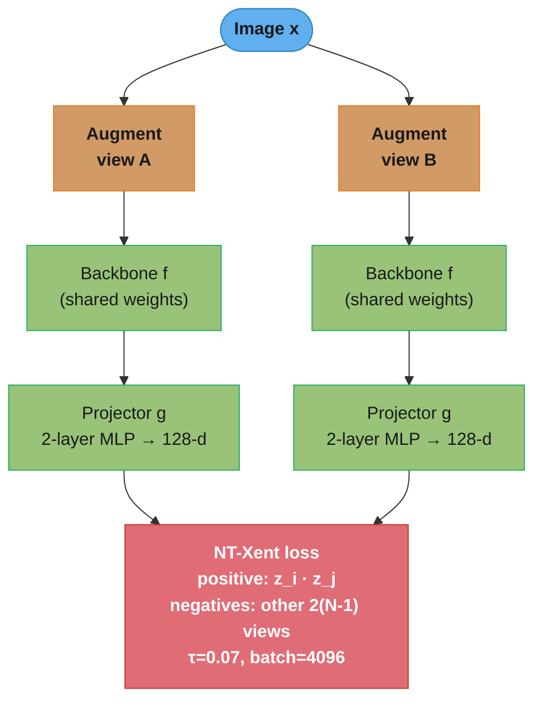
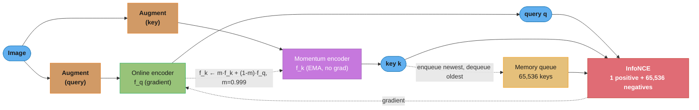
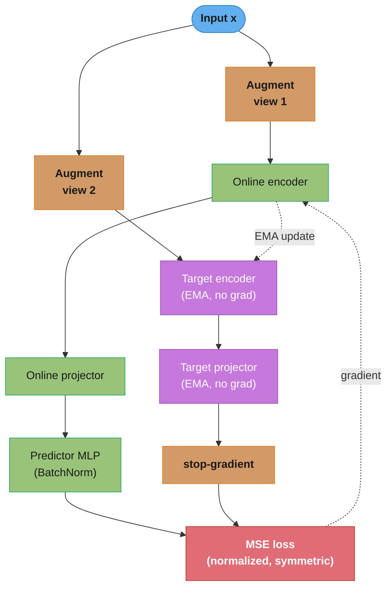
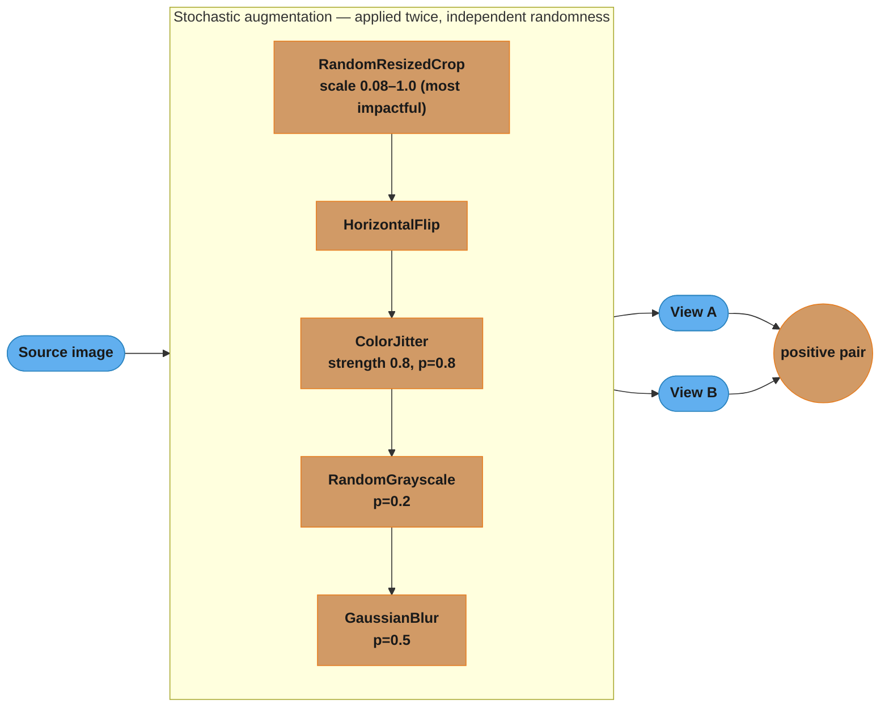

# Self-Supervised Learning for Vision

## 1. Concept Overview

Self-supervised learning (SSL) for vision trains visual representations using the structure of the data itself, without human-provided labels. The model is given a pretext task (contrastive matching, masked reconstruction, self-distillation) that forces it to learn semantically meaningful features as a side effect of solving the pretext problem.

SSL is motivated by a fundamental bottleneck in supervised learning: annotating large image datasets is expensive (ImageNet-1k required ~25,000 person-hours; COCO took ~70,000), while unlabeled images are effectively unlimited. SSL can leverage web-scale unlabeled corpora to produce representations that match or exceed supervised ImageNet pretraining on many downstream tasks.

The field has converged on five dominant frameworks: SimCLR (contrastive, large batch), MoCo (contrastive, memory queue), DINO/DINOv2 (self-distillation), MAE (masked autoencoder), and BYOL (non-contrastive, no negatives).

---

## 2. Intuition

**Contrastive learning** (SimCLR, MoCo): teach the model that two augmented views of the same image should produce similar embeddings ("pull together"), while views of different images should be dissimilar ("push apart"). Like learning that a photograph taken from slightly different angles is still the same object.

**Self-distillation** (DINO, BYOL): a teacher network (updated slowly via momentum) generates pseudo-labels for what the student network should output on the same image. The student learns to match the teacher without collapse, because the teacher's gradual updates prevent the trivial solution.

**Masked reconstruction** (MAE): hide 75% of image patches and train the model to reconstruct pixel values of the missing patches. To do so accurately, the model must learn rich semantic features — you cannot reconstruct a face patch without understanding that it belongs to a face.

Key insight: the best SSL methods learn representations that are at least as good as supervised ImageNet pretraining when evaluated by linear probing — and often better, because they are not overfit to 1000 specific ImageNet classes.

---

## 3. Core Principles

**Augmentation invariance**: SSL models should produce identical embeddings for two differently augmented views of the same image. The augmentations (crop, color jitter, blur) are carefully chosen to preserve semantic content while discarding style — the "positive pair" are semantically identical but visually different.

**Preventing collapse**: without supervision, a trivial solution is for the model to output the same constant vector for every input (collapsed representation). Different methods prevent collapse differently: contrastive methods use negative pairs; BYOL uses asymmetric architecture with a predictor MLP and stop-gradient; DINO uses centering and sharpening; MAE uses reconstruction loss that cannot be minimized by a constant.

**Linear probing vs fine-tuning**: the standard SSL evaluation protocol trains a linear classifier on top of a frozen backbone (linear probe) and reports accuracy. This measures the quality of the learned representation independently of the downstream task. Full fine-tuning allows the backbone to adapt and typically gives 3–8% higher accuracy.

**Temperature**: contrastive losses use a temperature parameter τ to control the sharpness of the similarity distribution. τ=0.07 (SimCLR) makes the distribution sharper, increasing the gradient signal from hard negatives but destabilizing training if too small.

---

## 4. Types / Architectures / Strategies

### Contrastive: SimCLR

SimCLR requires large batches (4096–8192) to have enough in-batch negatives. For each image, two augmented views are created. A CNN backbone encodes both views; a projection head (2-layer MLP) maps to a lower-dimensional space (128-d). NT-Xent loss (normalized temperature-scaled cross-entropy) maximizes agreement between the two views while pushing apart all other 2(N-1) views in the batch.

After pretraining, the projection head is discarded. The backbone is either frozen (linear probe) or fine-tuned.

### Contrastive: MoCo (Momentum Contrast)

MoCo solves SimCLR's large-batch requirement using a memory queue of negative embeddings maintained across batches. Key components:
- **Online encoder**: updated by gradient descent.
- **Momentum encoder** (key encoder): updated as a weighted average of the online encoder: k = m·k + (1-m)·q, with m=0.999. This makes the momentum encoder a slowly-evolving version of the online encoder, ensuring queue features are consistent.
- **Queue**: stores the last K=65,536 encoded keys. Each query is contrasted against all queue entries. After each step, the oldest batch of keys is dequeued and the new batch is enqueued.

MoCov2 adds a projection head and stronger augmentation (matching SimCLR). MoCov3 replaces the CNN backbone with ViT.

### Self-Distillation: DINO

DINO (Self-DIstillation with NO labels) trains a student-teacher pair where both are identical ViTs:
- **Teacher**: updated as EMA of the student (momentum m=0.9995).
- **Student**: trained via gradient descent to match the teacher's output distribution.
- **Centering**: teacher outputs are centered (mean subtracted) to prevent collapse to a single dimension.
- **Sharpening**: teacher uses a lower temperature (0.04) than the student (0.1) to produce sharper target distributions.
- **Multi-crop**: 2 global views (224×224) + 8 local views (96×96). Student sees all 10 views; teacher sees only the 2 global views. This forces the student to predict global from local ("local-to-global correspondence").

The centering and sharpening bullets are two halves of one expression — the teacher's target distribution is `P_t = softmax((g_t(x) - c) / tau_t)`, where `c` is a running mean of recent teacher outputs and `tau_t = 0.04`.

**What this actually says.** "Before turning the teacher's raw scores into a target, subtract off whatever the teacher has been saying lately, then divide by a small number so the winner stands out sharply."

The two operations pull in opposite directions on purpose. Sharpening (small `tau_t`) makes the target confident, which stops the student from drifting toward a flat uniform output. Centering removes any dimension that is winning *every* image, which stops the opposite failure where one dimension eats the whole distribution. Remove either one and DINO collapses.

| Symbol | What it is |
|--------|-----------|
| `g_t(x)` | The teacher head's raw output vector for image `x` — one score per prototype dimension |
| `c` | The center: an EMA of recent teacher outputs. Big entry = "this dimension always fires" |
| `tau_t` | Teacher temperature, 0.04. Divide-by-small makes the softmax peaky |
| `tau_s` | Student temperature, 0.1. Larger, so the student's own output stays softer than the target |
| `softmax` | Turns scores into a probability distribution summing to 1 |

**Walk one example.** Five prototype dimensions, one image, teacher scores `[0.30, 0.24, 0.20, 0.16, 0.10]`:

```
  step 1 -- sharpening only, tau_t = 0.04 vs the student's tau_s = 0.1

    dimension          d1      d2      d3      d4      d5    entropy
    raw score         0.30    0.24    0.20    0.16    0.10
    softmax @ 0.10   0.4350  0.2388  0.1600  0.1073  0.0589   1.4036
    softmax @ 0.04   0.7451  0.1662  0.0612  0.0225  0.0050   0.8004

    Same scores, smaller tau -> top mass 0.4350 -> 0.7451, entropy 1.4036 -> 0.8004.
    The teacher hands the student a decisive target, not a shrug.

  step 2 -- now add centering. Suppose d1 has been winning every image, so the
  running center is c = [0.28, 0.10, 0.10, 0.10, 0.10]

    centered = score - c
    dimension          d1      d2      d3      d4      d5    entropy
    centered          0.02    0.14    0.10    0.06    0.00
    softmax @ 0.04   0.0314  0.6316  0.2324  0.0855  0.0191   1.0239

    d1 falls from 0.7451 to 0.0314 -- it was only "winning" because it wins
    always, which carries no information about THIS image. d2 takes over.
```

Entropy is the collapse detector: sharpening alone drives it toward 0 (one dimension for every image — full collapse), centering alone drives it toward `ln(5) = 1.609` (uniform — the other collapse). Together they hold it at the useful middle, here 1.0239.

DINO emergent behavior: attention maps from the last layer reliably segment foreground objects without any segmentation training. DINOv2 scales this up with a curated dataset, adding iBOT (masked token prediction) objective and register tokens.

### Masked Autoencoder: MAE

MAE applies to ViT exclusively:
- **Masking**: 75% of patches are randomly masked.
- **Encoder**: standard ViT processes only the 25% visible patches (efficient — no computation on masked tokens).
- **Decoder**: a lightweight transformer (smaller than encoder) takes the encoder output for visible tokens and learned mask tokens, and reconstructs pixel values of all masked patches.
- **Loss**: MSE between predicted and true pixel values of masked patches (normalized per patch).

At downstream fine-tuning, the decoder is discarded and only the encoder is used. The high mask ratio (75%) forces the encoder to understand the global image structure — simply copying nearby pixel values is insufficient when 3 of every 4 patches are missing.

### Non-Contrastive: BYOL

BYOL (Bootstrap Your Own Latent) removes negative pairs entirely:
- **Online network**: encoder + projector + predictor MLP. Only the online network receives gradients.
- **Target network**: encoder + projector only (no predictor). Updated as EMA of online network.
- **Loss**: MSE between online predictor output and target projector output (stop-gradient on target).

Written out, the loss is `L = || p(z_online) - stopgrad(z_target) ||^2` with both vectors L2-normalized, which for unit vectors is exactly `2 - 2 * cos(p, z_target)`.

**The idea behind it.** "Predict what the slow copy of yourself says about the other view of this image — and never let that prediction leak back into the slow copy."

| Symbol | What it is |
|--------|-----------|
| `p(z_online)` | Predictor output — the online net's guess at the target embedding, unit length |
| `z_target` | Target projector's embedding of the *other* augmented view, unit length |
| `stopgrad` | Gradient blocker. The target branch is read, never differentiated through |
| `\|\| . \|\|^2` | Squared distance between the two unit vectors |
| `cos(p, z)` | Their cosine similarity, in `[-1, +1]` — 1 means the guess landed exactly on target |

**Walk one example.** Both vectors are unit length, so the squared distance collapses to `2 - 2*cos`:

```
  cos(p, z_target)     loss = 2 - 2*cos      reading
      +1.0                   0.0             perfect prediction, nothing to learn
      +0.9                   0.2             typical mid-training
      +0.5                   1.0             early training
       0.0                   2.0             orthogonal, no agreement at all
      -1.0                   4.0             worst case, pointing opposite

  The whole loss range is 0 to 4, and it is driven by one number: the angle.
```

Note what the collapsed solution looks like here: if both networks emit the same constant vector for every image, `cos = 1` and the loss is `0.0` — a perfect score for a useless model. Nothing in the loss forbids it. What forbids it is the asymmetry: the extra predictor MLP exists only on the online side, and `stopgrad` means the target cannot chase the online net back down into the constant. Delete the predictor, or delete the `stopgrad`, and the model finds that `0.0` within a few hundred steps.

Without negatives, the trivial solution is for both networks to output a constant. Collapse is prevented by the asymmetry: the predictor on the online side must predict the target, but the target has no corresponding predictor and is updated only via EMA. Batch normalization in the predictor MLP is also critical.

---

## 5. Architecture Diagrams

### SimCLR Training



*Two augmentations of one image form the positive pair; every other image in the 4096-batch supplies negatives, which is why SimCLR is batch-hungry. After pretraining the projector `g` is thrown away and only the backbone `f` is fine-tuned or linearly probed.*

### MoCo Queue Mechanism



*The queue decouples the number of negatives (65,536) from the batch size, so MoCo trains well with batches as small as 256. The momentum (EMA) key encoder changes slowly, keeping queued keys consistent even though they were encoded across many past steps — a fast-updating key encoder would make old queue entries stale.*

### MAE Training vs Inference

```mermaid
flowchart TD
    classDef io      fill:#61afef,stroke:#2e86c1,color:#1a1a1a,font-weight:bold
    classDef frozen  fill:#c678dd,stroke:#9b59b6,color:#fff
    classDef train   fill:#98c379,stroke:#27ae60,color:#1a1a1a
    classDef mathOp  fill:#d19a66,stroke:#e67e22,color:#1a1a1a,font-weight:bold
    classDef lossN   fill:#e06c75,stroke:#c0392b,color:#fff,font-weight:bold
    classDef req     fill:#56b6c2,stroke:#0097a7,color:#1a1a1a
    classDef base    fill:#e5c07b,stroke:#f39c12,color:#1a1a1a

    subgraph tr["Training (75% masked)"]
        img1([Image 224×224]) --> patch1["196 patches 16×16"]
        patch1 --> mask["Random mask 75%\nhide 147 · keep 49"]
        mask --> enc1["ViT encoder\n49 visible tokens only"]
        enc1 --> dec["Lightweight decoder\n49 encoded + 147 mask tokens"]
        dec --> rec["Reconstruct all pixels"]
        rec --> loss["MSE on the 147\nmasked patches only"]
    end
    subgraph inf["Downstream (no masking)"]
        img2([Image]) --> enc2["ViT encoder\nall 196 patches"]
        enc2 --> pool["CLS or avg-pool"]
        pool --> head["Linear head / fine-tune"]
    end

    class img1,img2 io
    class patch1,mask,rec,pool mathOp
    class enc1,enc2,dec,head train
    class loss lossN
```



*Encoding only the 25% visible patches makes MAE pretraining ~3× cheaper than full-image methods, and the 75% mask ratio is what forces semantic learning — you cannot inpaint 3 of every 4 patches by copying neighbors. At downstream use the decoder is discarded and the encoder sees all 196 patches.*

### BYOL Architecture



*BYOL uses no negatives and no queue. Collapse is blocked by the online-only predictor MLP (plus its BatchNorm) and the stop-gradient EMA target: the asymmetry means a constant output cannot minimize the loss trivially.*

### Contrastive Augmentation Pipeline



*Running the same random pipeline twice on one image yields the positive pair. The large scale range of RandomResizedCrop is the single most important augmentation — replacing it with a fixed/center crop makes the two views nearly identical, so the contrastive task becomes trivial and the features carry almost no information.*

---

## 6. How It Works — Detailed Mechanics

### NT-Xent Loss (SimCLR)

```python
import torch
import torch.nn.functional as F
from torch import Tensor


def nt_xent_loss(z_i: Tensor, z_j: Tensor,
                  temperature: float = 0.07) -> Tensor:
    """
    Normalized Temperature-scaled Cross Entropy Loss (SimCLR).
    z_i, z_j: (B, D) L2-normalized projection embeddings
    Returns scalar loss.
    """
    B = z_i.size(0)

    # Concatenate to get all 2B embeddings
    z = torch.cat([z_i, z_j], dim=0)  # (2B, D)

    # Cosine similarity matrix
    sim = F.cosine_similarity(z.unsqueeze(1), z.unsqueeze(0), dim=2)  # (2B, 2B)
    sim = sim / temperature

    # Mask out self-similarity (diagonal)
    mask = torch.eye(2 * B, dtype=torch.bool, device=z.device)
    sim.masked_fill_(mask, float("-inf"))

    # Positive pairs: (i, i+B) and (i+B, i)
    labels = torch.cat([
        torch.arange(B, 2 * B, device=z.device),  # positive for first B views
        torch.arange(0, B, device=z.device),        # positive for last B views
    ])

    loss = F.cross_entropy(sim, labels)
    return loss


class SimCLRProjectionHead(torch.nn.Module):
    """2-layer MLP projector used in SimCLR."""

    def __init__(self, in_dim: int = 2048,
                 hidden_dim: int = 2048,
                 out_dim: int = 128) -> None:
        super().__init__()
        self.mlp = torch.nn.Sequential(
            torch.nn.Linear(in_dim, hidden_dim, bias=False),
            torch.nn.BatchNorm1d(hidden_dim),
            torch.nn.ReLU(inplace=True),
            torch.nn.Linear(hidden_dim, out_dim, bias=False),
            torch.nn.BatchNorm1d(out_dim, affine=False),
        )

    def forward(self, x: Tensor) -> Tensor:
        return F.normalize(self.mlp(x), dim=-1)
```

The `cross_entropy(sim, labels)` line above is the NT-Xent loss in one call. Spelled out for a single anchor `i`, it is:

```
                       exp( sim(z_i, z_j) / tau )
  L_i = -log  -------------------------------------------
              sum over all k != i of exp( sim(z_i, z_k) / tau )
```

**What the formula is telling you.** "Out of every other embedding in the batch, how much of the probability mass does the true partner view get? Take the log of that share and flip the sign."

It is a `2B - 1`-way classification problem invented on the fly: the anchor must pick its own other view out of a lineup. No labels are needed because the augmentation pipeline already knows the answer.

| Symbol | What it is |
|--------|-----------|
| `z_i` | The anchor — one L2-normalized 128-d projection of one augmented view |
| `z_j` | Its positive: the *other* augmentation of the same source image |
| `z_k` | Every other embedding in the batch, all `2(N-1)` of them, used as negatives |
| `sim(a,b)` | Cosine similarity. Both vectors are unit length, so this is just `a . b`, in `[-1, +1]` |
| `tau` | Temperature, 0.07. Divides every similarity before the softmax, stretching the gaps |
| `exp(.)/sum exp(.)` | Softmax — turns similarities into a probability over "which one is my partner" |
| `-log` | Costs 0 when the model is certain and correct, and climbs without bound as it errs |

**Walk one example.** One anchor, `tau = 0.07`, positive similarity 0.90. Same positive, two different negative sets — that is the entire difference:

```
  EASY negatives (unrelated images)
    sim              0.90    0.10    0.05    0.00   -0.05    0.10    0.02
    sim / 0.07      12.86    1.43    0.71    0.00   -0.71    1.43    0.29
    exp(.)      383518.39    4.17    2.04    1.00    0.49    4.17    1.33
                    ^pos     ---------- negatives sum to 13.21 ----------

    p_positive = 383518.39 / 383531.60 = 0.999966
    L = -log(0.999966) = 0.000034        <- essentially free, no gradient

  HARD negatives (other dogs, same breed)
    sim              0.90    0.85    0.80    0.75    0.70    0.82    0.78
    sim / 0.07      12.86   12.14   11.43   10.71   10.00   11.71   11.14
    exp(.)      383518.39 187748  91911   44994   22026  122307   69069
                    ^pos     -------- negatives sum to 538054.58 --------

    p_positive = 383518.39 / 921572.97 = 0.416156
    L = -log(0.416156) = 0.876694        <- 25,785x the easy-negative loss

  Chance level for a 7-way choice is -log(1/7) = 1.9459, so 0.8767 means the
  model is right but not comfortably so -- exactly where learning happens.
```

That ratio is why SimCLR needs batches of 4096–8192. A small batch is almost all easy negatives, the loss sits near zero, and the gradient carries no signal; scale the batch and hard negatives appear by accident, which is the cheap substitute for hard-negative mining.

**Why the divide by tau exists.** Cosine similarity is trapped in `[-1, +1]`, so an un-scaled softmax over it is nearly flat and cannot express confidence. Dividing by `tau` rescales that narrow band into a range the exponential can act on. Push the same two negative sets through a large and a small temperature:

```
  tau      easy-negative loss     hard-negative loss     what it does
  0.05          0.0000                 0.6227            sharp: obsesses over the
                                                         single hardest negative
  0.07          0.0000                 0.8767            SimCLR default
  0.50          0.7292                 1.7533            flat: every negative gets
                                                         near-equal weight

  Note tau = 0.50 charges 0.7292 even on easy negatives -- the model is punished
  for a lineup it already got right, and real signal drowns in that noise.
```

Small `tau` concentrates the gradient on whichever negative is closest, which is what makes representations separable, but too small and one mislabeled near-duplicate dominates the whole batch's update. `tau` is a hyperparameter worth sweeping, not inheriting.

### MoCo Momentum Update

```python
import torch
import torch.nn as nn
from torch import Tensor
import copy


class MoCoModel(nn.Module):
    """MoCo v2 simplified implementation."""

    def __init__(self, backbone: nn.Module,
                 projection_dim: int = 128,
                 queue_size: int = 65536,
                 momentum: float = 0.999,
                 temperature: float = 0.07) -> None:
        super().__init__()
        self.momentum = momentum
        self.temperature = temperature
        self.queue_size = queue_size

        # Online encoder
        self.encoder_q = backbone
        self.projector_q = self._build_mlp(projection_dim)

        # Momentum encoder (no gradients)
        self.encoder_k = copy.deepcopy(backbone)
        self.projector_k = copy.deepcopy(self.projector_q)
        for p in list(self.encoder_k.parameters()) + list(self.projector_k.parameters()):
            p.requires_grad_(False)

        # Initialize queue
        self.register_buffer("queue",
            F.normalize(torch.randn(projection_dim, queue_size), dim=0))
        self.register_buffer("queue_ptr", torch.zeros(1, dtype=torch.long))

    def _build_mlp(self, out_dim: int) -> nn.Module:
        return nn.Sequential(
            nn.Linear(2048, 2048), nn.ReLU(), nn.Linear(2048, out_dim))

    @torch.no_grad()
    def _momentum_update(self) -> None:
        for p_q, p_k in zip(self.encoder_q.parameters(),
                              self.encoder_k.parameters()):
            p_k.data = self.momentum * p_k.data + (1 - self.momentum) * p_q.data
        for p_q, p_k in zip(self.projector_q.parameters(),
                              self.projector_k.parameters()):
            p_k.data = self.momentum * p_k.data + (1 - self.momentum) * p_q.data

    @torch.no_grad()
    def _dequeue_and_enqueue(self, keys: Tensor) -> None:
        batch_size = keys.size(0)
        ptr = int(self.queue_ptr)
        # Overwrite oldest entries (circular buffer)
        self.queue[:, ptr:ptr + batch_size] = keys.T
        self.queue_ptr[0] = (ptr + batch_size) % self.queue_size

    def forward(self, x_q: Tensor, x_k: Tensor) -> Tensor:
        # Online forward
        q = F.normalize(self.projector_q(self.encoder_q(x_q)), dim=1)

        # Momentum encoder forward (no grad)
        with torch.no_grad():
            self._momentum_update()
            k = F.normalize(self.projector_k(self.encoder_k(x_k)), dim=1)

        # Positive logit: (B, 1)
        l_pos = (q * k).sum(dim=1, keepdim=True) / self.temperature

        # Negative logits: (B, K) from queue
        l_neg = (q @ self.queue.clone().detach()) / self.temperature

        logits = torch.cat([l_pos, l_neg], dim=1)  # (B, K+1)
        labels = torch.zeros(logits.size(0), dtype=torch.long,
                              device=logits.device)  # positive = index 0

        self._dequeue_and_enqueue(k)
        return F.cross_entropy(logits, labels)
```

The single line inside `_momentum_update` is the whole mechanism: `theta_k <- m * theta_k + (1 - m) * theta_q`, with `m = 0.999`.

**Put simply.** "The key encoder never trains. Each step it just slides one-thousandth of the way toward the query encoder, so it is always a blurred, lagging copy of it."

| Symbol | What it is |
|--------|-----------|
| `theta_q` | Query (online) encoder weights — the ones gradient descent actually updates |
| `theta_k` | Key (momentum) encoder weights — receives no gradient, only this blend |
| `m` | Momentum coefficient, 0.999. How much of the old key encoder survives each step |
| `1 - m` | 0.001 — the sliver of the online encoder mixed in per step |
| `<-` | In-place assignment, run once per training step under `torch.no_grad()` |

**Walk one example.** Take one scalar weight. Say `theta_k = 0.500` and `theta_q` has settled at `0.600`:

```
  step 1:  0.999 * 0.500    + 0.001 * 0.600 = 0.500100
  step 2:  0.999 * 0.500100 + 0.001 * 0.600 = 0.500200
  step 3:  0.999 * 0.500200 + 0.001 * 0.600 = 0.500300
  step 4:  0.999 * 0.500300 + 0.001 * 0.600 = 0.500399
  step 5:  0.999 * 0.500399 + 0.001 * 0.600 = 0.500499

  After 5 steps it has closed 0.5% of a 0.1 gap. It is in no hurry.
```

Unrolling the recursion tells you the memory span — the weight still carried by a value from `n` steps ago is `m^n`:

```
  steps ago n        m^n = 0.999^n      how much of it is left
      1                 0.999000        99.9% -- yesterday is still today
    100                 0.904792        90.5%
    693                 0.500000        50.0%  <- the half-life
   1000                 0.367695        36.8%  <- 1/e, the effective window
   5000                 0.006721         0.7% -- fully forgotten

  Effective averaging window = 1 / (1 - m) = 1 / 0.001 = 1000 steps.
```

That 1000-step window is the number that has to match the queue. The queue holds `K = 65,536` keys; at batch size 256 that is `65536 / 256 = 256` steps of history sitting in the queue. Because the encoder that produced the oldest of those keys is still ~77% (`0.999^256 = 0.7740`) the same encoder as today's, every key in the queue is comparable to the current query. That consistency is the only reason contrasting against stale keys works at all.

Set `m` too low and the guarantee evaporates: `m = 0.9` gives a half-life of 6.6 steps and a 10-step window, so keys from 256 steps ago were produced by an effectively unrelated network (`0.9^256` is about `1e-12` of the old weights) and the loss is contrasting against noise. Set it too high and the key encoder stops tracking the online encoder at all, which stalls learning from the other end.

### MAE Training Step

```python
import torch
import torch.nn as nn
import torch.nn.functional as F
from torch import Tensor


class MAEMasking(nn.Module):
    """Random patch masking for MAE."""

    def __init__(self, mask_ratio: float = 0.75) -> None:
        super().__init__()
        self.mask_ratio = mask_ratio

    def forward(self, x: Tensor) -> tuple[Tensor, Tensor, Tensor]:
        """
        x: (B, N, D) patch embeddings
        Returns: (visible_tokens, mask, ids_restore)
          - visible_tokens: (B, N_visible, D)
          - mask: (B, N) bool, True = masked
          - ids_restore: (B, N) indices to restore original order
        """
        B, N, D = x.shape
        N_visible = int(N * (1 - self.mask_ratio))

        # Random shuffle and take first N_visible as visible
        noise = torch.rand(B, N, device=x.device)
        ids_shuffle = noise.argsort(dim=1)
        ids_restore = ids_shuffle.argsort(dim=1)

        ids_visible = ids_shuffle[:, :N_visible]
        visible_tokens = torch.gather(
            x, 1, ids_visible.unsqueeze(-1).expand(-1, -1, D))

        # Binary mask: 1 = masked
        mask = torch.ones(B, N, device=x.device)
        mask[:, :N_visible] = 0
        mask = torch.gather(mask, 1, ids_restore)

        return visible_tokens, mask.bool(), ids_restore


def mae_loss(pred_pixels: Tensor,
              target_pixels: Tensor,
              mask: Tensor,
              patch_size: int = 16,
              normalize_target: bool = True) -> Tensor:
    """
    MSE loss on masked patches only, with optional per-patch normalization.
    pred_pixels:   (B, N, patch_size^2 * 3)
    target_pixels: (B, N, patch_size^2 * 3)
    mask:          (B, N) bool, True = masked
    """
    if normalize_target:
        # Normalize each patch's pixel values to zero-mean unit-variance
        mean = target_pixels.mean(dim=-1, keepdim=True)
        var  = target_pixels.var(dim=-1, keepdim=True)
        target_pixels = (target_pixels - mean) / (var + 1e-6).sqrt()

    loss_per_patch = ((pred_pixels - target_pixels) ** 2).mean(dim=-1)  # (B, N)
    # Average only over masked patches
    loss = (loss_per_patch * mask).sum() / mask.sum()
    return loss
```

Two lines carry the whole idea. The masking line, `N_visible = int(N * (1 - mask_ratio))`, decides how much the encoder ever sees; the loss line, `(loss_per_patch * mask).sum() / mask.sum()`, decides what it is graded on.

**In plain terms.** "Throw away three of every four patches, run the expensive encoder on only the survivors, and score the model solely on the patches it was never shown."

Multiplying by `mask` before summing is a masked mean, not a plain mean: the numerator zeroes out every visible patch, and dividing by `mask.sum()` instead of `N` keeps the scale right. Divide by `N` by mistake and the loss silently shrinks by 4x, taking the effective learning rate with it.

| Symbol | What it is |
|--------|-----------|
| `N` | Patches per image — `(224/16)^2 = 196` for a ViT-B/16 at 224x224 |
| `mask_ratio` | 0.75. The fraction of patches deleted before the encoder runs |
| `N_visible` | `196 * 0.25 = 49` — the only tokens the encoder ever processes |
| `mask` | `(B, N)` indicator, 1 = masked. Used as a multiplier to select loss terms |
| `mask.sum()` | Count of masked patches, 147 per image — the divisor of the masked mean |
| `patch_size^2 * 3` | `16*16*3 = 768` raw pixel values reconstructed per patch |

**Stated plainly, in numbers.** One 224x224 image through ViT-B/16:

```
                                     tokens    share
    total patches                      196     100%
    masked, never seen by encoder      147      75%
    visible, encoder input              49      25%

  encoder cost, relative to a full-image ViT
    attention is quadratic in tokens:  (196/49)^2 = 4^2 = 16x cheaper
    MLP / projections are linear:       196/49    =        4x cheaper

  decoder cost
    input = 49 encoded tokens + 147 learned mask tokens = 196 tokens
    but the decoder is deliberately shallow -- 8 blocks at width 512 vs the
    encoder's 12 blocks at width 768 -- so it does not undo the saving.

  loss
    graded on 147 patches x 768 pixel values = 112,896 regression targets
    divisor is mask.sum() = 147, NOT N = 196
```

The compute saving is not a side benefit — it is what makes a 75% ratio affordable in the first place, and the 75% ratio is what makes the task non-trivial. At a 15% mask ratio (BERT's setting) a patch can be reconstructed by copying its neighbours, and the encoder learns a low-level interpolation filter instead of image semantics. At 75%, with 3 of every 4 patches gone, local copying has nothing left to copy from, so the only way to fill the gaps is to represent what the object actually is.

### Linear Probing Evaluation

```python
import torch
import torch.nn as nn
from torch import Tensor
from torch.utils.data import DataLoader


@torch.no_grad()
def extract_features(backbone: nn.Module,
                      loader: DataLoader,
                      device: torch.device) -> tuple[Tensor, Tensor]:
    """Extract features from frozen backbone for linear probing."""
    backbone.eval()
    all_features: list[Tensor] = []
    all_labels: list[Tensor] = []

    for images, labels in loader:
        images = images.to(device)
        features = backbone(images)  # (B, D)
        # Use CLS token or global average pool depending on model
        all_features.append(features.cpu())
        all_labels.append(labels)

    return torch.cat(all_features), torch.cat(all_labels)


def linear_probe_eval(backbone: nn.Module,
                       train_loader: DataLoader,
                       val_loader: DataLoader,
                       num_classes: int,
                       feature_dim: int,
                       device: torch.device,
                       epochs: int = 100) -> float:
    """Train a linear classifier on frozen SSL features."""
    # Freeze backbone
    for p in backbone.parameters():
        p.requires_grad_(False)

    # Extract train and val features once (efficient)
    train_features, train_labels = extract_features(backbone, train_loader, device)
    val_features, val_labels = extract_features(backbone, val_loader, device)

    # Train linear head
    head = nn.Linear(feature_dim, num_classes).to(device)
    optimizer = torch.optim.LBFGS(head.parameters(), lr=0.1, max_iter=20)
    criterion = nn.CrossEntropyLoss()

    train_features = train_features.to(device)
    train_labels = train_labels.to(device)

    def closure() -> Tensor:
        optimizer.zero_grad()
        logits = head(train_features)
        loss = criterion(logits, train_labels)
        loss.backward()
        return loss

    for _ in range(epochs):
        optimizer.step(closure)

    # Evaluate
    head.eval()
    val_features = val_features.to(device)
    with torch.no_grad():
        logits = head(val_features)
        pred = logits.argmax(dim=1).cpu()
    accuracy = (pred == val_labels).float().mean().item()
    return accuracy
```

---

## 7. Real-World Examples

**Meta DINOv2 for dense prediction**: Meta deployed DINOv2 ViT-g/14 as the backbone for production semantic segmentation and depth estimation on AR glasses (Aria). The model's linear probing quality (86.5% ImageNet) means simple linear decoders achieve production-quality depth estimation without expensive annotation.

**Apple's visual search (Spotlight, Photos search)**: CLIP-like SSL pretraining on proprietary image-text pairs. Embeddings are computed on-device using the Neural Engine, enabling private visual search without server round-trips. Model is quantized to INT8 (< 100MB) for on-device storage.

**Google Universal Sentence/Image Encoder**: BYOL-style contrastive pretraining on 3B image-text pairs from web crawl. Used for product recommendation and image clustering in Google Shopping.

**BioMedCLIP**: CLIP trained on 15M medical image-text pairs from PubMed Central. Zero-shot classification across radiology, pathology, and dermatology tasks; 2-3% below supervised fine-tuned baselines without any target-domain labels.

**SimCLR for unlabeled satellite imagery**: Remote sensing companies use SimCLR on unlabeled Sentinel-2 satellite images (~1TB/day of global coverage) to pretrain backbones for land classification, crop monitoring, and deforestation detection. Labeled data for each downstream task is scarce; SSL pretraining provides 10–25% F1 improvement over supervised ImageNet transfer.

---

## 8. Tradeoffs

| Method | Negative pairs | Large batch required | Training memory | Eval (linear probe) | Convergence speed |
|--------|---------------|---------------------|-----------------|--------------------|--------------------|
| SimCLR | Yes (in-batch) | Yes (4096+) | High | 71.7% (ResNet-50) | Slow |
| MoCo v2 | Yes (queue) | No (256) | Medium | 71.1% (ResNet-50) | Medium |
| BYOL | No | No (4096) | Medium | 74.3% (ResNet-50) | Fast |
| DINO | No (centering) | No (1024) | Medium | 77.0% (ViT-S/16) | Medium |
| MAE | No | No (1024) | Low (encoder only) | 73.5% (ViT-B fine-tune 83.1%) | Fast |
| DINOv2 | No | No | High (14M dataset curation) | 86.5% (ViT-g/14) | Very fast downstream |

| Evaluation Protocol | When to Use | Typical Gap vs Full Fine-Tune |
|---------------------|-------------|-------------------------------|
| Linear probing | Measure representation quality, fast | 3–8% below fine-tuning |
| k-NN probe (k=20) | No training needed, instant | 5–10% below fine-tuning |
| Full fine-tuning | Maximize downstream accuracy | Baseline |
| Attentive probing | Better than linear for ViT | 1–3% below fine-tuning |

---

## 9. When to Use / When NOT to Use

**Use SSL when**:
- You have a large corpus of unlabeled domain-specific images (medical scans, satellite imagery, industrial inspection frames) where labels are expensive.
- Your downstream task has very few labels (< 1000) — SSL pretrained features + linear probe outperform supervised pretraining in the low-data regime.
- You need general-purpose visual features for multiple diverse downstream tasks.
- Label distribution is unknown or shifts frequently (SSL features are not overfit to fixed class taxonomy).

**Use SimCLR/MoCo when**: you have a large GPU cluster (8-64 GPUs) and want well-understood contrastive representations. MoCo is preferable on compute budget since it does not need large batches.

**Use DINO/DINOv2 when**: you want the best transfer features without labels. Use the pretrained DINOv2 checkpoints directly — reproducing DINO training is expensive (8× A100, 2–5 days).

**Use MAE when**: your backbone is ViT and you want efficient pretraining (encoder only sees 25% of patches, so training is ~3× faster than full-image methods at the same parameter count). Fine-tuning outperforms linear probing significantly for MAE.

**Do NOT use SSL when**:
- Labeled data is abundant (> 1M samples) — supervised pretraining on ImageNet-21k is simpler and often competitive.
- Inference latency is critical on edge — SSL pretrained models are not inherently smaller; you still need to compress/distill.
- Your images are very different from natural photos and no SSL checkpoint exists for your domain — SSL on a tiny dataset (< 50k domain images) rarely outperforms supervised ImageNet transfer.

---

## 10. Common Pitfalls

**Pitfall 1: SimCLR with insufficient batch size**
A team ran SimCLR with batch size 256 on 4 GPUs (effective batch 256, not 4096). With so few negatives per query, the loss had minimal gradient signal to distinguish hard negatives. After 200 epochs, linear probe accuracy was 58% vs expected 71%. Fix: either increase to 4096+ batch size or switch to MoCo which has 65k negatives regardless of batch size.

**Pitfall 2: Augmentation too weak — random resize crop is critical**
An engineer replaced `RandomResizedCrop(scale=(0.08, 1.0))` with `CenterCrop` in SimCLR, thinking it was simpler. The contrastive task became trivially easy (two crops from the same center are nearly identical), and the model learned near-zero-information features. Linear probe accuracy: 38%. The large scale variation in random resize crop is what makes the contrastive task hard enough to force semantic learning.

**Pitfall 3: Using MAE features without fine-tuning**
MAE's linear probing accuracy (73.5% for ViT-B) is significantly lower than fine-tuning accuracy (83.1%). A team deployed an MAE-pretrained model with a linear head and observed mediocre performance, concluded SSL didn't work, and abandoned it. MAE is designed for fine-tuning, not linear probing — its encoder sees only 25% of patches during training, so the representation is deliberately under-specified until fine-tuned with full patches.

**Pitfall 4: BYOL collapse without BatchNorm in predictor**
A team reimplemented BYOL without BatchNorm in the predictor MLP (replacing with LayerNorm). The model immediately collapsed — both networks output the same constant vector within the first 10 epochs. BatchNorm in the predictor is not optional in BYOL; it provides an implicit centering mechanism that prevents collapse. With Layer Norm or no norm, collapse happens consistently.

**Pitfall 5: Evaluating SSL with accuracy instead of linear probe accuracy**
A team compared a supervised ResNet-50 (76.1% top-1) vs a BYOL-pretrained ResNet-50 evaluated with KNN (only 74.3%) and concluded supervised was better. But BYOL fine-tuned achieves 79.6% — better than supervised. The comparison must use matched protocols. Linear probe and KNN evaluate representation quality; fine-tuning evaluates maximum downstream accuracy. These answer different questions and should not be compared directly.

---

## 11. Technologies & Tools

| Tool | Method Supported | Notes |
|------|-----------------|-------|
| Lightly AI | SimCLR, MoCo, BYOL, DINO, MAE | Best all-in-one SSL library |
| solo-learn | 20+ SSL methods | Research-oriented, PyTorch Lightning |
| VISSL (Meta) | SimCLR, MoCo, BYOL, DINO, BarlowTwins | Meta's production SSL library |
| timm | DINOv2, CLIP, MAE checkpoints | Best for loading pretrained SSL models |
| transformers (HF) | MAE, DINO, BEiT | HF API for masked autoencoders |
| open_clip | CLIP, SigLIP | Best variety of CLIP-style models |
| DINOv2 (Meta) | DINOv2 ViT-S/B/L/g checkpoints | Via torch.hub |
| FAISS | k-NN evaluation of SSL features | Standard for SSL representation evaluation |
| Weights & Biases | Training monitoring | Track SSL-specific metrics: kNN acc, collapse detection |

---

## 12. Interview Questions with Answers

**Q: What is the core idea behind contrastive learning?**
Contrastive learning trains a model by pulling together representations of different augmented views of the same image (positive pairs) and pushing apart representations of different images (negative pairs). The model is forced to learn semantically meaningful features — the only invariance that persists under augmentation (crop, color jitter, blur) corresponds to semantic content. The NT-Xent or InfoNCE loss formalizes this: it maximizes the cosine similarity between positive pairs while minimizing it between negatives, normalized by a temperature τ.

**Q: Why does SimCLR require large batch sizes and how does MoCo solve this?**
SimCLR's NT-Xent loss uses all 2(N-1) other samples in the batch as negatives for each query. With small batches (256), there are few hard negatives, the gradient signal is weak, and the learned representation is poor. Linear probe accuracy drops from 71.7% (batch 4096) to ~55% (batch 256). MoCo maintains a FIFO memory queue of 65,536 encoded keys from past batches. Every query is contrasted against 65,536 negatives regardless of the current batch size, making MoCo effective with batches as small as 256. The momentum encoder ensures queue features are consistent despite being generated at different training steps.

**Q: What is the momentum encoder in MoCo and BYOL and why is it needed?**
The momentum encoder is a copy of the main encoder updated as an exponential moving average: theta_k = m * theta_k + (1-m) * theta_q, with m=0.999 or 0.9999. It provides stable, slowly-changing targets for the online encoder to match. Without momentum: if the key encoder were updated by gradient descent, it would change rapidly, making the keys in the queue inconsistent (early keys encoded by a different encoder than current keys) — the contrastive loss would be unstable. In BYOL, the momentum target also prevents collapse by ensuring the target network changes slowly enough that the predictor always has a meaningful learning signal.

**Q: How does BYOL avoid representation collapse without negative pairs?**
BYOL prevents collapse through architectural asymmetry: the online network has a predictor MLP that the target network lacks. The online network must learn to predict the target's output through this predictor. If both collapsed to a constant, the predictor could minimize loss trivially, but the asymmetry means the gradient pushes the online network to produce informative outputs. Additionally, BatchNorm in the predictor implicitly centers the outputs across the batch, preventing any single dimension from dominating. The EMA update (not gradient descent) of the target network means it provides a slowly-moving, stable target that the online network cannot "hack."

**Q: What is the masking ratio in MAE and why is 75% better than 50%?**
MAE uses a 75% masking ratio — 3 of every 4 patches are hidden. At 75% masking, the remaining 25% of patches carry insufficient local context to reconstruct the masked patches by interpolating nearby pixels. The encoder must learn global image semantics to infer masked content (e.g., reconstructing an eye requires knowing it is a face). At 50% masking, adjacent visible patches provide enough local context that reconstruction can be done by simple texture copying, requiring no semantic understanding. The 75% ratio forces semantic learning by making the task hard enough that trivial solutions fail.

**Q: What is the difference between linear probing and full fine-tuning evaluation for SSL?**
Linear probing freezes the entire SSL pretrained backbone and trains only a linear classification head (or uses L-BFGS on extracted features) on the labeled downstream dataset. It measures representation quality in isolation: the features must be linearly separable for the downstream task. Full fine-tuning unfreezes the backbone and adapts all parameters to the downstream task. For contrastive methods (SimCLR, MoCo, BYOL), both evaluations give similar results (3–5% gap). For MAE, fine-tuning significantly outperforms linear probing (83.1% vs 73.5% for ViT-B) because the masked pretraining task produces features that need task-specific adaptation.

**Q: What are the augmentations used in contrastive learning and why are they chosen?**
The standard SimCLR augmentation pipeline: (1) RandomResizedCrop with scale (0.08–1.0) and ratio (0.75–1.33) — the most impactful; (2) RandomHorizontalFlip; (3) ColorJitter (strength 0.8) applied with probability 0.8; (4) RandomGrayscale with probability 0.2; (5) GaussianBlur with probability 0.5. These augmentations are chosen to be semantically invariant (flipping a car is still a car; changing color does not change the object) while creating sufficient visual diversity to make the contrastive task non-trivial. Augmentations like MixUp or CutMix are avoided as they change the underlying semantics of the image.

**Q: How does DINO prevent collapse without negative pairs?**
DINO uses two mechanisms: (1) Centering — the teacher's output logits are centered by subtracting an exponential moving average of the batch mean, preventing the teacher from assigning high probability to one mode consistently. (2) Sharpening — the teacher uses a lower temperature (0.04) than the student (0.1), producing sharper (more confident) teacher distributions. The student learns to match the teacher's sharp, centered distribution. These two effects counteract each other: sharpening causes collapse, centering prevents it. The precise interplay keeps training stable without negatives.

**Q: Why does DINO produce semantically meaningful attention maps without segmentation supervision?**
DINO's multi-crop augmentation (2 global views + 8 local crops) with the local-to-global correspondence objective forces the model to infer global object structure from local crops. This causes the attention heads to specialize: some heads attend to object boundaries, others to textures, others to object interiors. When visualizing the CLS token's attention to patch tokens in the last layer, the patches corresponding to the foreground object receive the highest attention weights — effectively performing unsupervised object segmentation. This emergent behavior does not appear in supervised ViT training because the supervision signal does not require spatially distinguishing object from background.

**Q: What is the projection head in contrastive SSL and why is it discarded at downstream use?**
The projection head (typically a 2–3 layer MLP) maps the backbone features to a lower-dimensional space (e.g., 128-d) where the contrastive loss is computed. The contrastive loss in the projection space encourages representation collapse along dimensions not captured by the 128-d projection — dimensions containing fine-grained classification-relevant information are lost. The backbone representations (before the projection head) retain this information because they were not directly constrained by the loss. Discarding the projection head and using the backbone features directly gives much better downstream accuracy (71.7% vs 56% for linear probe in SimCLR).

**Q: When should you use SSL instead of supervised ImageNet pretraining?**
Use SSL when: (1) your target domain has large unlabeled corpora but few labels (medical, satellite, industrial) — SSL on domain data beats ImageNet transfer; (2) you need to support many diverse tasks from one backbone, since SSL features are not overfit to ImageNet's 1000 classes; (3) you are in a low-data fine-tuning regime (< 1000 labels) — SSL features linearly probe better than supervised features in this regime; (4) you can use a strong pretrained SSL checkpoint (DINOv2, CLIP) rather than training from scratch. Do not use SSL when: labeled data is abundant (> 1M samples); supervised pretraining on ImageNet-21k is simpler and competitive. Do not train SSL from scratch on fewer than 100k images — the representations will be weaker than supervised ImageNet transfer.

**Q: What is BarlowTwins and how does it differ from BYOL and SimCLR?**
BarlowTwins (Zbontar et al., 2021) trains a network by making the cross-correlation matrix between embeddings of two augmented views as close to the identity matrix as possible. The diagonal terms (self-correlation) are pushed to 1 (making representations invariant to augmentation); the off-diagonal terms are pushed to 0 (decorrelating different dimensions, preventing redundancy). BarlowTwins does not use negative pairs (like BYOL) and does not require large batches or a memory queue (unlike SimCLR, MoCo). It is conceptually related to information maximization: encouraging each dimension to carry independent information prevents collapse. Linear probe: 73.2% (ResNet-50), competitive with SimCLR and MoCo.

**Q: How do you evaluate the quality of SSL representations before fine-tuning?**
Three standard protocols in increasing computational cost: (1) k-NN probe (k=20): extract features for the entire training set, compute k-nearest neighbors for each validation sample using cosine similarity, majority-vote for the label. No training required, ~10 min on 1 GPU. (2) Linear probe: train a linear head (or use L-BFGS) on frozen features, ~1 hour. (3) Attentive probe: train a small multi-head attention pooling layer on top of frozen patch tokens, better than linear for ViT. All three should be computed after each SSL training run. kNN probe accuracy correlates well with fine-tuning accuracy and is the fastest signal for monitoring SSL training progress.

**Q: What is SigLIP and how does it improve on CLIP?**
SigLIP (Sigmoid Loss for Language Image Pretraining, Zhai et al., 2023) replaces CLIP's softmax normalization with a sigmoid loss. In CLIP's InfoNCE, the softmax denominator includes all other in-batch samples, requiring large batches (32k) to have enough negatives. SigLIP applies a binary cross-entropy loss to each (image, text) pair independently: positives pushed to 1, negatives pushed to 0. This removes the dependence on batch composition, enabling training with smaller batches and better scaling. SigLIP achieves better zero-shot performance than CLIP at matched compute, and the sigmoid logits have better calibration for retrieval. SigLIP-SO400M achieves 83.2% zero-shot on ImageNet.

**Q: What is the difference between instance discrimination and clustering-based SSL?**
Instance discrimination (SimCLR, MoCo, BYOL, DINO) treats each image as its own class — two augmented views of the same image are positives; all other images are negatives. This works well but can push semantically similar images apart. Clustering-based methods (SwAV, DeepCluster) assign images to learned prototypes (cluster centroids) and enforce consistency between cluster assignments of different views. SwAV swaps cluster assignments between views: predict the cluster of view 2 from the embedding of view 1, and vice versa. This uses semantic clusters as implicit positives, avoiding the need for negative pairs while naturally grouping similar images together. SwAV achieves 75.3% linear probe with ResNet-50.

**Q: How does the DINOv2 data curation pipeline contribute to its strong performance?**
DINOv2's data curation, not just the training objective, is the key differentiator. The pipeline: (1) self-supervised deduplication — remove near-duplicate images using embeddings from a previous SSL checkpoint; (2) image quality filtering — remove images with low perceptual quality scores; (3) domain balancing — cluster images and ensure balanced coverage across visual domains; (4) dataset assembly — combine LVD-142M curated from web crawls with curated datasets (ImageNet-22k, Google Landmarks, etc.). The resulting 142M image dataset has higher quality and diversity than simply using all available internet images. The same DINO training objective on uncurated data achieves 3–5% lower linear probe accuracy.

**Q: What role does the temperature τ play in the contrastive loss, and what breaks if it is too small?**
Temperature τ controls the sharpness of the similarity distribution: a smaller τ sharpens it and amplifies the gradient from hard negatives, but too small a value destabilizes training. In NT-Xent/InfoNCE the logits are divided by τ (SimCLR uses 0.07) before the softmax, so τ acts like an inverse gain on the similarity scores. Too large a τ (e.g. 0.5) flattens the distribution, weakening the pull between positives and the push against hard negatives, and accuracy drops. Too small a τ (e.g. 0.01) makes the softmax nearly one-hot, producing exploding gradients and unstable, collapse-prone training. It is one of the most sensitive SSL hyperparameters and should be tuned in a narrow band around 0.05–0.2.

**Q: What is dimensional collapse and how does it differ from complete representation collapse?**
Dimensional collapse is when embeddings span only a low-dimensional subspace rather than shrinking to a single constant point, so variance survives but many feature dimensions carry no information. Complete collapse is the trivial failure where the encoder outputs the same constant vector for every input — detectable because the batch embedding standard deviation goes to zero. Dimensional collapse is subtler and more common in non-contrastive methods: kNN or linear-probe accuracy stalls even though embeddings still vary. Diagnose it by inspecting the singular-value spectrum of the embedding covariance — a rapid drop to near-zero singular values signals wasted dimensions. Methods like BarlowTwins and VICReg explicitly penalize inter-dimension correlation to prevent it.

**Q: Why does MAE use an asymmetric encoder-decoder, with a large encoder that sees only visible patches and a small decoder?**
MAE's encoder processes only the 25% of visible patches while a lightweight decoder reconstructs the rest, cutting pretraining compute roughly 3× and pushing semantic understanding into the encoder. Because the heavy encoder never wastes compute on mask tokens, MAE can pretrain large ViTs on the same budget as much smaller full-image models. The decoder is deliberately shallow and narrow — it only needs to solve the pixel-reconstruction task and is thrown away downstream, so representation quality is concentrated in the encoder rather than split across both halves. This asymmetry is the key efficiency trick that distinguishes MAE from BERT-style masked modeling where the whole sequence is encoded.

**Q: What are register tokens in DINOv2 and what problem do they solve?**
Register tokens are extra learnable tokens added to the ViT input sequence that absorb high-norm artifact activations, cleaning up attention maps and feature quality. Researchers found that vanilla ViTs (including DINO) repurpose a few low-information background patches as scratch storage, producing high-norm outlier tokens that create noisy, distracting artifacts in attention visualizations and hurt dense downstream tasks. Adding 4–8 dedicated register tokens gives the model a place to write that global scratch information without hijacking patch tokens. The result is smoother attention maps and small but consistent gains on segmentation and depth probing. DINOv2 adopted register tokens alongside the DINO + iBOT objectives.

---

## 13. Best Practices

1. Use existing pretrained SSL checkpoints (DINOv2, CLIP, OpenCLIP) before training SSL from scratch. Reproducing DINO or MAE training requires 8× A100 and 2–5 days; the checkpoints are publicly available.
2. For contrastive methods, use large batch sizes (4096+) or MoCo's queue to ensure sufficient in-batch diversity. The number of effective negatives determines representation quality.
3. RandomResizedCrop with scale=(0.08, 1.0) is the single most important augmentation for contrastive SSL. Do not replace it with fixed crops or center crops.
4. Monitor representation collapse during training: check if the standard deviation of embeddings across the batch approaches zero (all embeddings similar) or if kNN accuracy on a small validation set stagnates early.
5. For MAE, prefer fine-tuning over linear probing in production — MAE representations are designed to be fine-tuned. The 10% linear probe accuracy gap versus fine-tuning is expected and not a failure.
6. For domain-specific SSL (medical, satellite), pretrain on your domain data even with a small dataset (50k–200k images) — domain-specific features outperform generic ImageNet transfer when target domain statistics differ significantly.
7. Use LBFGS (not SGD) for linear probe evaluation — it converges in fewer iterations and gives more reliable accuracy estimates. Scikit-learn's LogisticRegression with solver='lbfgs' works on CPU for up to ~1M samples.
8. Report both linear probe and k-NN accuracy in research comparisons — kNN requires no hyperparameter tuning and is more reproducible; linear probe is the community standard but sensitive to optimizer and hyperparameter choice.
9. For BYOL and DINO, do not remove BatchNorm from the predictor MLP — it is a collapse prevention mechanism, not optional regularization.
10. When adapting a pretrained SSL model to a new domain, always start with linear probing to establish a baseline, then progressively unfreeze layers (last block → last 3 blocks → full model) to find the minimal fine-tuning needed to meet accuracy requirements.

---

## 14. Case Study

**Problem**: A radiology clinic has 200,000 unlabeled chest CT scans and only 3,000 labeled scans (normal vs 5 pathology categories). Supervised ImageNet transfer achieves 71% macro-F1. Target: > 80% macro-F1.

**Approach**: SSL pretraining on 200k unlabeled scans (CT slices as 2D images, 3 channel = slice-1 / slice / slice+1), then fine-tuning on 3k labeled scans.

**Method selection**: DINO was chosen over SimCLR/MoCo because CT scans have strong local texture correlation — DINO's emergent spatial attention is particularly useful for localizing pathology regions. MAE was the runner-up but DINO's linear probe quality is higher.

**Domain-specific augmentations**: Standard color jitter was replaced with Hounsfield unit (HU) window jitter (simulating different radiologist viewing windows: lung window -500 to +1500 HU, bone window -100 to +2000 HU). RandomRotation ± 30 degrees (CT scans have real anatomical rotation variation). Elastic deformations to simulate breathing motion artifact.

**Pretraining**: ViT-B/16 backbone, 100 epochs, 1024 batch size, 8× V100. Total wall time: 48 hours. Linear probe after pretraining: 68% macro-F1 (vs 71% supervised ImageNet transfer — near parity with 200k unlabeled data).

**Fine-tuning**: full fine-tuning with layer-wise LR decay (0.65), base LR 5e-5, 100 epochs. Results: 82% macro-F1 — 11% improvement over supervised baseline. Per-class analysis: rare pathology classes (pleural effusion: 180 labels) improved from 42% to 71% F1 — the SSL features captured relevant features from unlabeled data with that pathology.

**Production**: model exported to ONNX, quantized to INT8 (< 1% F1 drop), deployed on CPU inference cluster. 4 slices processed in parallel per scan; full scan (150 slices) classified in 2.5 seconds.
